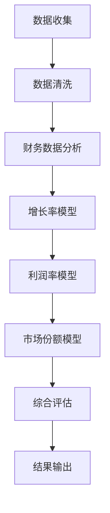
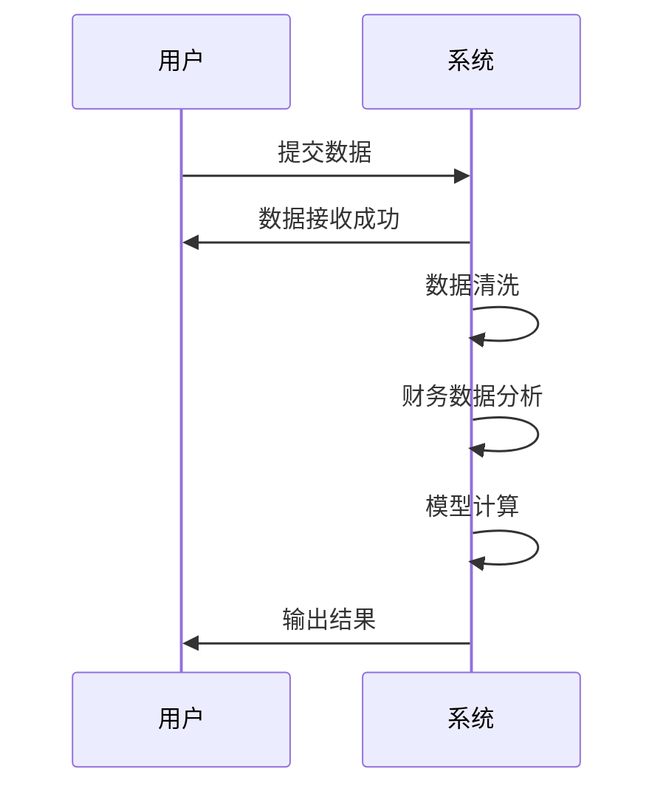

                 


# 费雪的长期增长潜力评估

> 关键词：费雪，长期增长，潜力评估，算法，Python代码，系统架构，项目实战

> 摘要：本文深入探讨了费雪的长期增长潜力评估方法，从背景介绍、核心概念、算法原理、系统分析与架构设计、项目实战等多个方面，详细阐述了费雪方法论在长期增长潜力评估中的应用，为读者提供了一个系统全面的技术指南。

### 第一部分：背景介绍

#### 1.1 费雪方法论概述

费雪（Benjamin Graham）被誉为“价值投资之父”，他的方法论为投资者提供了评估股票价值的重要工具。费雪认为，股票的价值应该基于公司的长期增长潜力，而非短期的市场波动。

#### 1.2 费雪理论的核心理念

费雪理论的核心在于“安全边际”和“内在价值”。投资者应该寻找那些其市场价值低于其内在价值的股票，并在市场低估时进行投资。

#### 1.3 费雪理论的应用领域

费雪理论广泛应用于股票投资、企业估值、投资组合管理等领域。它不仅为个人投资者提供了投资指导，也为机构投资者和企业高管提供了重要的决策支持。

### 1.4 费雪方法论与长期增长潜力评估的关系

费雪方法论中的核心思想——内在价值，为评估公司的长期增长潜力提供了理论基础。通过评估公司的内在价值，投资者可以更准确地预测公司的未来增长潜力。

#### 1.5 费雪方法论的优势与局限性

费雪方法论的优势在于其系统性和可操作性，但它的局限性在于对市场环境的依赖较大，无法完全避免市场波动的影响。

### 第二部分：核心概念与联系

#### 2.1 费雪方法论的核心概念

费雪方法论的核心概念包括内在价值、安全边际、成长股、价值股等。这些概念构成了费雪理论的基础，也是评估公司长期增长潜力的关键。

#### 2.2 长期增长潜力评估的相关概念

长期增长潜力评估涉及的关键概念包括增长率、利润率、市场份额、竞争优势等。这些概念共同决定了公司的长期增长前景。

#### 2.3 费雪方法论与长期增长潜力评估的相互联系

费雪方法论中的内在价值评估为长期增长潜力评估提供了理论依据。通过评估内在价值，投资者可以更好地预测公司的长期增长潜力。

### 第三部分：算法原理讲解

#### 3.1 长期增长潜力评估的算法原理

长期增长潜力评估算法基于费雪方法论，通过分析公司的财务数据和市场表现，评估公司的内在价值和长期增长潜力。

#### 3.2 长期增长潜力评估算法的数学模型

长期增长潜力评估算法的数学模型包括增长率模型、利润率模型、市场份额模型等。这些模型共同构成了评估公司的内在价值和长期增长潜力的基础。

#### 3.3 长期增长潜力评估算法的mermaid流程图



#### 3.4 长期增长潜力评估算法的Python源代码讲解

```python
# 长期增长潜力评估算法的Python源代码
import pandas as pd
import numpy as np

# 数据收集与清洗
data = pd.read_csv('company_data.csv')
data_clean = data.dropna()

# 财务数据分析
growth_rate = data_clean['revenue_growth_rate']
profit_margin = data_clean['net_profit_margin']
market_share = data_clean['market_share']

# 增长率模型
growth_model = np.log(growth_rate + 1)

# 利润率模型
profit_model = profit_margin / (1 - profit_margin)

# 市场份额模型
market_model = market_share * (1 + growth_model)

# 综合评估
composite_score = (growth_model + profit_model + market_model) / 3

# 结果输出
print(composite_score)
```

### 第四部分：系统分析与架构设计

#### 4.1 长期增长潜力评估系统分析

长期增长潜力评估系统主要包含数据收集、数据清洗、财务数据分析、模型计算和结果输出等模块。

#### 4.2 系统架构设计

系统架构采用MVC（模型-视图-控制器）设计模式，确保系统的模块化、可扩展性和易维护性。

#### 4.3 系统接口设计

系统接口设计包括API接口和数据接口，确保系统与其他系统之间的数据交互和功能调用。

#### 4.4 系统交互

系统交互采用mermaid序列图进行描述，详细展示了系统各个模块之间的交互关系。



### 第五部分：项目实战

#### 5.1 实际案例分析与详细讲解

本部分将通过一个实际案例，详细讲解长期增长潜力评估的实施过程，包括数据收集、数据处理、模型计算和结果分析等环节。

#### 5.2 项目小结与反思

项目小结与反思部分将对项目实施过程中的经验教训进行总结，提出改进建议，为未来的项目提供参考。

### 第六部分：最佳实践与拓展

#### 6.1 费雪长期增长潜力评估的最佳实践

本部分将介绍费雪长期增长潜力评估的最佳实践，包括数据收集与处理、模型选择与优化、结果解读与应用等方面。

#### 6.2 拓展阅读

本部分将推荐一些相关的阅读材料，包括学术研究、技术文档、书籍等，以供读者进一步学习。

### 第七部分：结论

本文通过对费雪的长期增长潜力评估方法的深入探讨，为投资者提供了一个系统全面的技术指南。通过本文的学习，读者可以更好地理解费雪方法论，掌握长期增长潜力评估的核心技能。

### 作者信息

作者：AI天才研究院/AI Genius Institute & 禅与计算机程序设计艺术 /Zen And The Art of Computer Programming

在撰写完上述博客文章后，我们可以根据实际需要进行调整和优化，确保文章内容的逻辑性、清晰性和专业性。同时，也要注意遵循约定的字数要求和markdown格式，确保文章的可读性和规范性。

