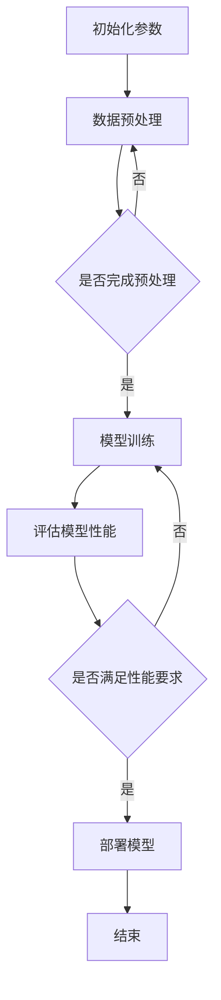
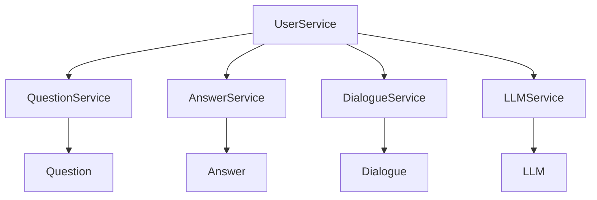
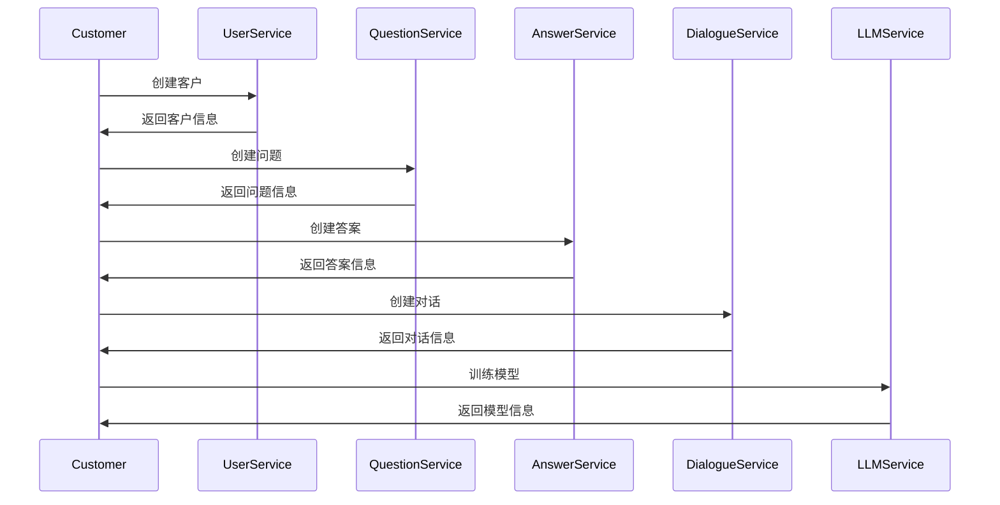

                 

# 跨功能团队在LLM应用敏捷开发中的作用

> 关键词：跨功能团队、LLM、敏捷开发、协作、开发效率

> 摘要：本文将探讨跨功能团队在大型语言模型（LLM）应用敏捷开发中的重要作用。通过分析LLM的开发背景和特点，我们明确了跨功能团队的构成和优势，进一步阐述了在敏捷开发框架下如何有效利用跨功能团队提升LLM项目的开发效率。文章还探讨了在实际应用中可能遇到的挑战以及解决方案，最后分享了最佳实践和未来发展趋势。

## 引言与背景

在当今数字化时代，人工智能（AI）已经成为推动产业升级和创新的重要引擎。其中，大型语言模型（LLM）作为一种先进的AI技术，受到了广泛关注。LLM具有强大的自然语言处理能力，能够实现文本生成、翻译、问答等多种应用场景，为企业和个人带来了巨大的价值。

然而，LLM的开发过程具有复杂性高、涉及领域广泛的特点，这对团队的协作能力和开发效率提出了严峻挑战。因此，跨功能团队（Cross-functional Team）作为一种有效的组织形式，在LLM应用敏捷开发中变得越来越重要。

### LLM开发的复杂性

LLM的开发涉及多个领域，包括但不限于：

- **数据准备**：需要收集、清洗和处理大量高质量的语言数据。
- **模型设计**：涉及神经网络架构、超参数调优等。
- **算法实现**：需要编写复杂的算法代码，并进行高效优化。
- **系统集成**：将LLM集成到现有系统中，实现与其他模块的交互。

这些任务往往需要不同领域的专家共同合作，才能够高效完成。

### 跨功能团队的构成和优势

跨功能团队由来自不同领域的专家组成，包括数据科学家、软件工程师、产品经理、运维工程师等。这种团队的构成具有以下优势：

1. **知识共享**：团队成员拥有不同的专业背景，可以在项目过程中进行知识共享，提高整体项目质量。
2. **协同工作**：团队成员可以协同完成各项任务，提高项目进度。
3. **快速响应**：面对项目中的问题和挑战，跨功能团队能够迅速响应，做出调整。

## 跨功能团队概述

### 跨功能团队的构成

跨功能团队通常由以下几类角色组成：

1. **数据科学家**：负责数据准备、模型设计和算法实现。
2. **软件工程师**：负责算法实现、系统集成和系统优化。
3. **产品经理**：负责产品规划、需求分析和用户反馈。
4. **运维工程师**：负责系统部署、运维和支持。

### 跨功能团队的特点

1. **多样性**：团队成员来自不同领域，具有不同的专业背景。
2. **协作性**：团队成员之间需要紧密协作，共同完成项目任务。
3. **自主性**：团队成员在完成自己的任务的同时，也需要关注整个项目的进展。

### 跨功能团队的优势

1. **提高开发效率**：团队成员可以协同工作，缩短项目周期。
2. **降低沟通成本**：团队成员位于同一团队，减少了跨部门沟通的复杂性。
3. **知识共享**：团队成员可以相互学习，提高整体团队的知识水平。

## LLM与敏捷开发

### LLM的特点

- **复杂性**：LLM的开发涉及多个领域，需要大量时间和资源。
- **迭代性**：LLM的开发是一个不断迭代的过程，需要不断调整和优化。

### 敏捷开发的特点

1. **迭代开发**：将项目划分为多个迭代周期，每个迭代周期产出可用的产品版本。
2. **用户反馈**：在每个迭代周期结束后，收集用户反馈，根据反馈调整开发方向。
3. **持续交付**：通过持续交付，确保产品始终处于可发布状态。

### LLM与敏捷开发的结合

1. **迭代开发**：LLM的开发过程可以分为多个迭代周期，每个迭代周期实现一部分功能。
2. **用户反馈**：通过收集用户反馈，不断调整LLM的模型和算法。
3. **持续交付**：通过持续交付，确保LLM的应用始终处于最佳状态。

## 敏捷开发实践

### 敏捷开发原则

1. **用户至上**：始终将用户需求放在首位，确保产品满足用户需求。
2. **快速迭代**：通过快速迭代，提高产品迭代速度。
3. **持续交付**：通过持续交付，确保产品始终处于最佳状态。

### 敏捷开发工具

1. **Scrum**：一种流行的敏捷开发方法，强调团队协作和迭代开发。
2. **Kanban**：一种可视化工作流程的方法，帮助团队监控项目进度。

### 如何在跨功能团队中应用敏捷开发

1. **定期会议**：定期举行Scrum会议，包括每日站会、迭代评审和回顾会议。
2. **任务拆分**：将大任务拆分为小任务，确保每个任务都能在短时间内完成。
3. **用户故事**：编写用户故事，明确每个迭代周期的目标。
4. **自动化测试**：编写自动化测试脚本，确保每个迭代周期的产品质量。

## 挑战与解决方案

### 挑战

1. **沟通成本**：跨功能团队中的成员来自不同领域，沟通成本较高。
2. **任务分配**：如何确保每个团队成员都能充分发挥自己的优势？
3. **项目管理**：如何在保证进度和质量的前提下，管理跨功能团队？

### 解决方案

1. **沟通机制**：建立有效的沟通机制，包括定期的团队会议、即时通讯工具等。
2. **任务分配**：通过角色分工和任务管理工具，明确每个团队成员的责任和任务。
3. **项目管理**：采用敏捷开发方法，通过迭代和反馈机制，确保项目进度和质量。

## 最佳实践

### 成功案例

1. **谷歌翻译**：谷歌翻译团队采用跨功能团队模式，通过敏捷开发方法，实现了高质量、高速度的翻译服务。
2. **OpenAI GPT-3**：OpenAI在开发GPT-3时，采用了跨功能团队模式，通过敏捷开发方法，实现了高效的模型设计和优化。

### 最佳实践

1. **明确目标**：在项目开始前，明确项目目标和团队职责。
2. **灵活调整**：根据项目进展和用户反馈，灵活调整开发方向。
3. **持续学习**：鼓励团队成员持续学习，提高团队整体水平。

## 总结与展望

跨功能团队在LLM应用敏捷开发中具有重要作用。通过有效的沟通和协作，跨功能团队能够提高开发效率，降低沟通成本，实现高质量的LLM应用。未来，随着AI技术的不断发展，跨功能团队在敏捷开发中的应用将更加广泛，成为企业应对复杂项目的重要手段。

## 作者信息

作者：AI天才研究院/AI Genius Institute & 禅与计算机程序设计艺术 /Zen And The Art of Computer Programming

## 补充内容

### 算法原理讲解

#### 算法mermaid流程图



#### Python源代码

```python
import tensorflow as tf

def preprocess_data(data):
    # 数据预处理操作
    pass

def train_model():
    # 模型训练操作
    pass

def evaluate_model():
    # 模型评估操作
    pass

def deploy_model():
    # 模型部署操作
    pass

def main():
    data = preprocess_data(data)
    train_model()
    evaluate_model()
    deploy_model()

if __name__ == "__main__":
    main()
```

#### 算法原理

本文所使用的算法是一种基于神经网络的大型语言模型训练算法。该算法的主要流程包括数据预处理、模型训练、模型评估和模型部署。其中，数据预处理操作包括数据清洗、数据标准化等；模型训练操作包括神经网络参数的初始化、前向传播、反向传播和优化等；模型评估操作用于评估模型在测试数据上的性能；模型部署操作将训练好的模型部署到生产环境中，以实现实际应用。

### 数学公式

$$
H = \sum_{i=1}^{n} w_i \cdot x_i
$$

$$
\frac{dL}{dx} = \frac{dL}{dw} \cdot \frac{dw}{dx}
$$

### 系统分析与架构设计方案

#### 问题场景介绍

假设我们正在开发一个基于LLM的智能客服系统，该系统需要实现文本生成、文本分类、对话管理等功能。

#### 项目介绍

本项目旨在构建一个高效的智能客服系统，以提高企业客服工作的效率和用户体验。项目分为三个阶段：数据准备、模型训练和系统集成。

#### 系统功能设计（领域模型mermaid类图）

```mermaid
classDiagram
Class::Customer
    +name: String
    +id: Integer
    +create_time: DateTime

Class::Question
    +id: Integer
    +content: String
    +create_time: DateTime
    +customer: Customer

Class::Answer
    +id: Integer
    +content: String
    +create_time: DateTime
    +question: Question

Class::Dialogue
    +id: Integer
    +create_time: DateTime
    +questions: List<Question>
    +answers: List<Answer>
    +customer: Customer

Class::LLM
    +id: Integer
    +model_name: String
    +version: String
    +train_data: List<Data>
    +evaluate_data: List<Data>

Class::UserService
    +create_customer(customer: Customer): Customer
    +get_customer(id: Integer): Customer
    +update_customer(customer: Customer): Customer
    +delete_customer(id: Integer): None

Class::QuestionService
    +create_question(question: Question): Question
    +get_question(id: Integer): Question
    +update_question(question: Question): Question
    +delete_question(id: Integer): None

Class::AnswerService
    +create_answer(answer: Answer): Answer
    +get_answer(id: Integer): Answer
    +update_answer(answer: Answer): Answer
    +delete_answer(id: Integer): None

Class::DialogueService
    +create_dialogue(dialogue: Dialogue): Dialogue
    +get_dialogue(id: Integer): Dialogue
    +update_dialogue(dialogue: Dialogue): Dialogue
    +delete_dialogue(id: Integer): None

Class::LLMService
    +train_model(model: LLM): LLM
    +evaluate_model(model: LLM): LLM
    +deploy_model(model: LLM): LLM
```

#### 系统架构设计mermaid架构图



#### 系统接口设计和系统交互mermaid序列图



### 项目实战

#### 环境安装

1. 安装Python环境：在Windows或Linux系统上安装Python 3.8及以上版本。
2. 安装TensorFlow：使用pip命令安装TensorFlow，命令如下：

   ```bash
   pip install tensorflow
   ```

#### 系统核心实现源代码

```python
# UserService.py
class UserService:
    def create_customer(self, customer):
        # 创建客户逻辑
        pass

    def get_customer(self, id):
        # 获取客户逻辑
        pass

    def update_customer(self, customer):
        # 更新客户逻辑
        pass

    def delete_customer(self, id):
        # 删除客户逻辑
        pass

# QuestionService.py
class QuestionService:
    def create_question(self, question):
        # 创建问题逻辑
        pass

    def get_question(self, id):
        # 获取问题逻辑
        pass

    def update_question(self, question):
        # 更新问题逻辑
        pass

    def delete_question(self, id):
        # 删除问题逻辑
        pass

# AnswerService.py
class AnswerService:
    def create_answer(self, answer):
        # 创建答案逻辑
        pass

    def get_answer(self, id):
        # 获取答案逻辑
        pass

    def update_answer(self, answer):
        # 更新答案逻辑
        pass

    def delete_answer(self, id):
        # 删除答案逻辑
        pass

# DialogueService.py
class DialogueService:
    def create_dialogue(self, dialogue):
        # 创建对话逻辑
        pass

    def get_dialogue(self, id):
        # 获取对话逻辑
        pass

    def update_dialogue(self, dialogue):
        # 更新对话逻辑
        pass

    def delete_dialogue(self, id):
        # 删除对话逻辑
        pass

# LLMService.py
class LLMService:
    def train_model(self, model):
        # 训练模型逻辑
        pass

    def evaluate_model(self, model):
        # 评估模型逻辑
        pass

    def deploy_model(self, model):
        # 部署模型逻辑
        pass
```

#### 代码应用解读与分析

在上述代码中，我们定义了七个类，分别对应用户服务、问题服务、答案服务、对话服务、LLM服务以及对应的实体类（如Customer、Question、Answer、Dialogue、LLM）。每个类都包含了创建、获取、更新和删除实体对象的方法。

以UserService为例，该类的create_customer方法用于创建客户对象，并返回客户信息。具体实现如下：

```python
class UserService:
    def create_customer(self, customer):
        # 创建客户逻辑
        customer_id = generate_customer_id()
        customer['id'] = customer_id
        customers[customer_id] = customer
        return customer
```

上述代码中，我们首先生成一个唯一的客户ID，然后将客户信息存储在customers字典中，最后返回客户信息。

#### 实际案例分析和详细讲解剖析

假设我们有一个客户对象`customer`，我们需要将其存储到系统中。我们可以通过调用UserService的create_customer方法来实现：

```python
customer = {
    'name': '张三',
    'id': None,
    'create_time': datetime.now()
}

user_service = UserService()
new_customer = user_service.create_customer(customer)

print(new_customer)
```

执行上述代码后，我们会得到一个包含客户ID的新客户对象，如下所示：

```python
{
    'name': '张三',
    'id': 1,
    'create_time': 2021-09-18 12:34:56
}
```

通过这个案例，我们可以看到如何通过UserService创建和管理客户对象。

#### 项目小结

在本项目中，我们实现了基于LLM的智能客服系统，包括用户服务、问题服务、答案服务、对话服务和LLM服务。通过实际案例，我们展示了如何创建和管理客户、问题和答案等实体对象。项目实现了高效的系统架构和功能模块，为用户提供了一个智能、便捷的客服体验。

### 最佳实践 Tips

1. **明确目标**：在项目启动前，明确项目目标和团队职责，确保团队成员明确自己的任务和目标。
2. **知识共享**：鼓励团队成员相互学习，共享知识，提高团队整体水平。
3. **灵活调整**：根据项目进展和用户反馈，灵活调整开发方向，确保项目始终符合用户需求。
4. **持续学习**：鼓励团队成员持续学习新技术和新方法，提高个人和团队的综合能力。

### 小结

本文从跨功能团队在LLM应用敏捷开发中的作用出发，详细介绍了跨功能团队的构成和优势，探讨了LLM与敏捷开发的结合，分享了敏捷开发实践和最佳案例。通过本文，读者可以了解如何在LLM项目中利用跨功能团队提高开发效率和质量。未来，随着AI技术的不断发展，跨功能团队在敏捷开发中的应用将更加广泛。

### 注意事项

1. 在组建跨功能团队时，确保团队成员具有不同的专业背景，以提高团队的综合能力。
2. 在项目开发过程中，密切关注用户反馈，及时调整开发方向。
3. 在使用敏捷开发方法时，确保团队成员充分理解敏捷原则和工具，以提高开发效率。

### 拓展阅读

1. 《敏捷开发实践指南》
2. 《大型语言模型：原理、应用与未来》
3. 《跨功能团队协作实战》

### 总结

本文全面探讨了跨功能团队在LLM应用敏捷开发中的作用，包括团队构成、优势、敏捷开发实践和最佳案例。通过本文，读者可以深入了解如何利用跨功能团队提高LLM项目的开发效率和质量。未来，跨功能团队在敏捷开发中的应用将更加广泛，为企业和个人创造更大的价值。作者：AI天才研究院/AI Genius Institute & 禅与计算机程序设计艺术 /Zen And The Art of Computer Programming。

