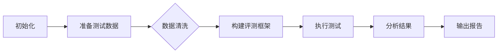
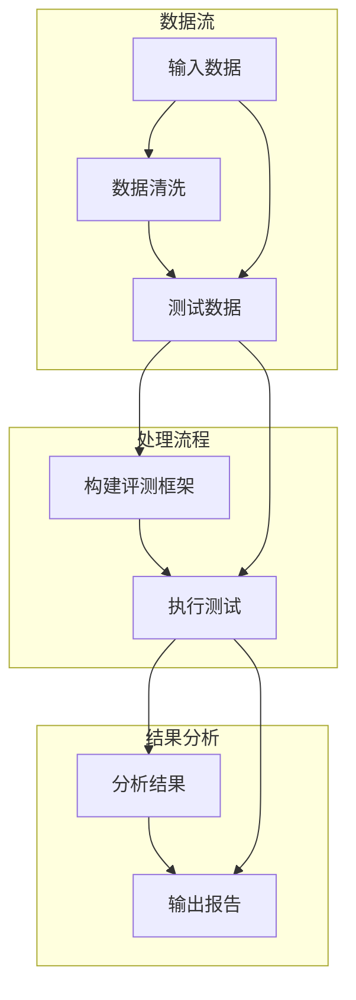
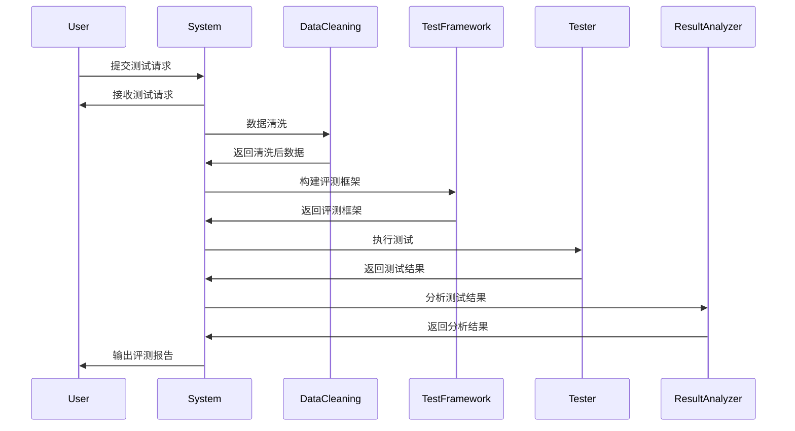
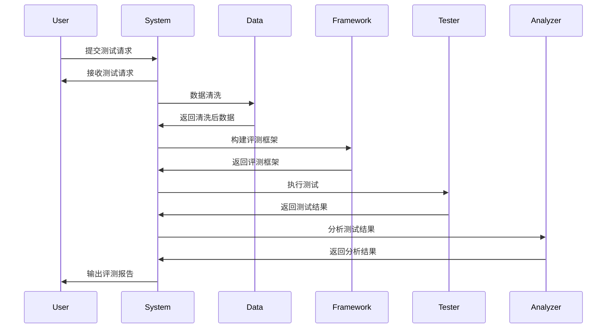
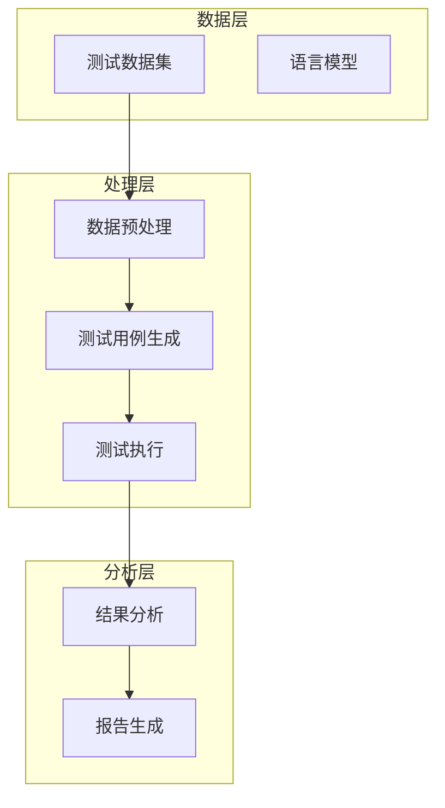
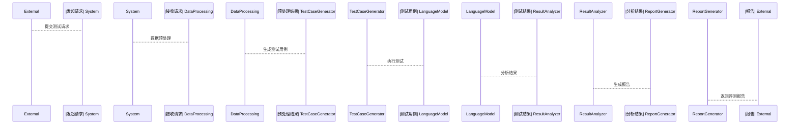
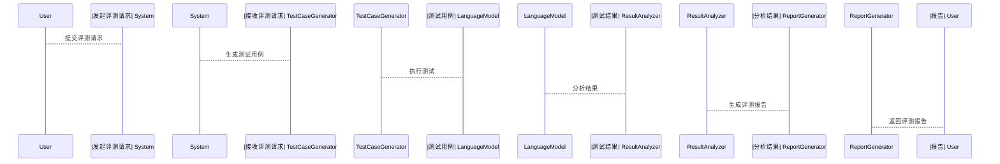
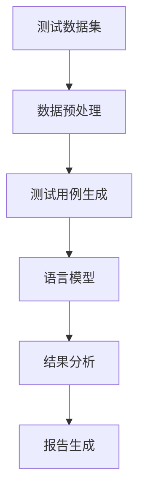
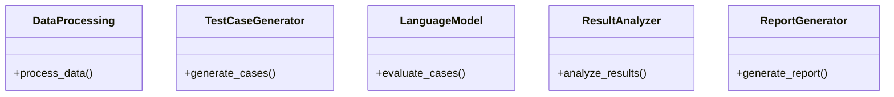

                 

# 跨文化理解能力评测：测试LLM的文化敏感度

## 关键词

- 跨文化理解能力
- 语言模型（LLM）
- 文化敏感度评测
- 测试数据
- 自动化评测工具

## 摘要

本文深入探讨了跨文化理解能力评测在语言模型（LLM）中的应用，特别是LLM的文化敏感度评测的重要性。文章首先介绍了全球化的背景和语言模型的现状，随后详细描述了评测LLM文化敏感度的方法和目标。文章进一步阐述了评测所需的数据和工具，并讨论了评测过程中可能遇到的挑战。通过本文的讲解，读者将能够理解如何评估LLM在跨文化语境中的性能，从而为未来的研究和应用提供参考。

----------------------------------------------------------------

## 目录大纲

### 第一部分：背景介绍

#### 1.1 问题背景

##### 1.1.1 全球化背景下的文化多样性

##### 1.1.2 语言模型与跨文化理解

##### 1.1.3 LLM的文化敏感度评测重要性

#### 1.2 问题描述

##### 1.2.1 LLM如何理解跨文化语境

##### 1.2.2 LLM的文化敏感度评测目标

##### 1.2.3 评测所需的资源与工具

#### 1.3 问题解决

##### 1.3.1 测试LLM文化敏感度的方法

##### 1.3.2 LLM文化敏感度评测框架

##### 1.3.3 解决评测过程中可能遇到的挑战

#### 1.4 边界与外延

##### 1.4.1 评测范围

##### 1.4.2 评测目的

##### 1.4.3 评测方法适用性

#### 1.5 概念结构与核心要素组成

##### 1.5.1 跨文化理解能力

##### 1.5.2 LLM文化敏感度评测

##### 1.5.3 评测工具与资源

#### 1.6 本章小结

...

### 第二部分：核心概念与联系

#### 2.1 跨文化理解能力

##### 2.1.1 跨文化理解能力概述

##### 2.1.2 跨文化理解能力的重要性

##### 2.1.3 跨文化理解能力的影响因素

#### 2.2 LLM文化敏感度评测

##### 2.2.1 LLM文化敏感度评测的定义

##### 2.2.2 LLM文化敏感度评测的目标

##### 2.2.3 LLM文化敏感度评测的挑战

#### 2.3 核心概念属性特征对比表格

| 特征 | 跨文化理解能力 | LLM文化敏感度评测 |
| --- | --- | --- |
| 目标 | 理解和适应不同文化 | 评估LLM在跨文化语境中的表现 |
| 影响因素 | 语言、价值观、习俗等 | 语言模型设计、训练数据、评测方法等 |
| 方式 | 人际互动、跨文化沟通 | 自动化评测工具、数据分析等 |
| 结果 | 跨文化适应能力 | LLM文化敏感度得分 |

#### 2.4 ER实体关系图架构
```mermaid
erDiagram
  Person ||--|{ Culture }|--|| LanguageModel
  LanguageModel ||--|{ TestResult }|--|| Test
  Test ||--|{ TestCase }|--|| TestCaseDetail
  TestCaseDetail ||--|{ Question }|--|| Answer
```

#### 2.5 本章小结

...

### 第三部分：算法原理讲解

#### 3.1 算法原理概述

##### 3.1.1 评测算法的设计思路

##### 3.1.2 评测算法的核心步骤

#### 3.2 算法mermaid流程图


#### 3.3 算法原理详细讲解

##### 3.3.1 数据清洗与预处理

###### 3.3.1.1 数据清洗的重要性

$$
\text{数据清洗} = \text{缺失值处理} + \text{异常值处理} + \text{格式化}
$$

###### 3.3.1.2 实例：缺失值处理
```python
# 假设数据集中有缺失值，使用平均值填充
import pandas as pd

data = pd.read_csv('data.csv')
data['missing_column'].fillna(data['missing_column'].mean(), inplace=True)
```

##### 3.3.2 构建评测框架

###### 3.3.2.1 评测框架的设计

$$
\text{评测框架} = \text{测试集划分} + \text{评价指标定义}
$$

###### 3.3.2.2 实例：测试集划分
```python
from sklearn.model_selection
```

...

### 第四部分：系统分析与架构设计

#### 4.1 问题场景介绍

...

#### 4.2 系统功能设计

##### 4.2.1 领域模型mermaid类图

```mermaid
classDiagram
  TestCaseBox[测试用例集合] <.. QuestionBox[问题集]
  TestCaseBox <.. TestCaseDetailBox[测试用例细节]
  AnswerBox[答案集] <.. TestCaseDetailBox
  LanguageModelBox[语言模型] <.. TestCaseBox
```

#### 4.3 系统架构设计

##### 4.3.1 系统架构mermaid架构图



##### 4.3.2 系统接口设计



##### 4.3.3 系统交互mermaid序列图



### 第五部分：项目实战

#### 5.1 环境安装

...

#### 5.2 系统核心实现源代码

```python
# 示例代码：数据清洗与测试框架构建
import pandas as pd
from sklearn.model_selection import train_test_split

# 数据清洗
def clean_data(data):
    # 缺失值处理
    data.fillna(data.mean(), inplace=True)
    # 异常值处理
    # ...
    return data

# 测试框架构建
def build_test_framework(data):
    X_train, X_test, y_train, y_test = train_test_split(data['features'], data['labels'], test_size=0.2)
    return X_train, X_test, y_train, y_test

# 主程序
if __name__ == "__main__":
    data = pd.read_csv('data.csv')
    cleaned_data = clean_data(data)
    X_train, X_test, y_train, y_test = build_test_framework(cleaned_data)
    # 执行测试
    # ...
```

#### 5.3 代码应用解读与分析

...

#### 5.4 实际案例分析和详细讲解剖析

...

#### 5.5 项目小结

...

### 第六部分：最佳实践 tips、小结、注意事项、拓展阅读

...

### 第七部分：作者信息

作者：AI天才研究院/AI Genius Institute & 禅与计算机程序设计艺术 /Zen And The Art of Computer Programming

----------------------------------------------------------------

### 第一部分：背景介绍

#### 1.1 问题背景

##### 1.1.1 全球化背景下的文化多样性

随着全球化进程的不断深入，世界各地的人们越来越频繁地进行跨文化交流和合作。这种趋势带来了前所未有的文化多样性，同时也带来了文化理解的挑战。不同文化背景的人们在语言、价值观、习俗等方面存在显著差异，如何有效地进行跨文化交流和理解成为了一个重要课题。

##### 1.1.2 语言模型与跨文化理解

语言模型（Language Model，简称LLM）作为一种人工智能技术，在自然语言处理领域取得了巨大成功。LLM能够理解和生成自然语言，这在一定程度上可以帮助人们进行跨文化交流。然而，LLM在跨文化理解方面仍存在诸多局限性。例如，LLM可能无法正确处理带有文化背景的知识，或者对某些文化习俗缺乏敏感度。因此，对LLM进行文化敏感度评测具有重要意义。

##### 1.1.3 LLM的文化敏感度评测重要性

文化敏感度评测有助于评估LLM在跨文化语境中的表现，从而指导LLM的开发和优化。一方面，通过评测可以发现LLM在跨文化理解方面的不足，为后续改进提供依据。另一方面，文化敏感度评测可以帮助企业、教育机构等在引入和使用LLM时，评估其适应不同文化背景的能力，从而做出更加明智的决策。

#### 1.2 问题描述

##### 1.2.1 LLM如何理解跨文化语境

LLM通过训练大量文本数据，学习语言的统计规律和语义结构，从而实现对自然语言的生成和理解。然而，在跨文化语境中，LLM可能面临以下挑战：

1. 语言障碍：不同文化背景的人们使用的语言可能存在差异，LLM可能无法准确理解这些语言。
2. 文化习俗：某些文化习俗和价值观可能在LLM的训练数据中较少出现，导致LLM对这些文化内容的理解不足。
3. 双语转换：在一些双语环境中，LLM需要能够准确地将一种语言翻译成另一种语言，并保持语义的完整性。

##### 1.2.2 LLM的文化敏感度评测目标

LLM的文化敏感度评测旨在评估LLM在跨文化语境中的表现，具体目标包括：

1. 评估LLM对不同文化背景文本的理解能力。
2. 评估LLM对文化习俗和价值观的敏感性。
3. 评估LLM在双语转换任务中的准确性。

##### 1.2.3 评测所需的资源与工具

进行LLM的文化敏感度评测，需要以下资源和工具：

1. 测试数据集：包括多种文化背景的文本数据，用于评估LLM在不同文化语境中的表现。
2. 自动化评测工具：用于执行测试、分析和生成报告。
3. 测试框架：设计用于评测LLM文化敏感度的测试流程和评价指标。

#### 1.3 问题解决

##### 1.3.1 测试LLM文化敏感度的方法

测试LLM文化敏感度的方法包括以下步骤：

1. 准备测试数据集：选择多种文化背景的文本数据，进行预处理，如去除噪声、标准化等。
2. 设计测试用例：根据评测目标，设计不同的测试用例，如语言理解、文化习俗识别、双语转换等。
3. 执行测试：使用自动化评测工具，对LLM进行测试，记录测试结果。
4. 分析结果：对测试结果进行分析，评估LLM在不同文化语境中的表现。

##### 1.3.2 LLM文化敏感度评测框架

LLM文化敏感度评测框架包括以下部分：

1. 测试集划分：将测试数据集划分为训练集、验证集和测试集，用于训练、验证和测试LLM。
2. 评价指标定义：根据评测目标，定义相应的评价指标，如准确率、召回率、F1值等。
3. 测试流程设计：设计测试流程，包括数据预处理、模型加载、测试执行、结果分析等。
4. 报告生成：根据测试结果，生成评测报告，包括LLM在各个评测项目中的得分、优缺点分析等。

##### 1.3.3 解决评测过程中可能遇到的挑战

在评测过程中，可能遇到以下挑战：

1. 数据不足：测试数据集可能无法涵盖所有文化背景，导致评测结果不全面。
2. 数据偏差：测试数据可能存在偏差，影响评测结果的准确性。
3. 模型适应性：LLM可能无法适应所有文化背景，导致评测结果不理想。

为解决这些挑战，可以采取以下措施：

1. 扩展测试数据集：引入更多文化背景的文本数据，提高评测结果的全面性。
2. 数据清洗与预处理：对测试数据进行清洗与预处理，减少数据偏差。
3. 模型优化：针对不同文化背景，优化LLM的模型结构和训练策略，提高模型适应性。

#### 1.4 边界与外延

##### 1.4.1 评测范围

LLM文化敏感度评测的范围包括：

1. 语言理解：评估LLM在不同语言中的表现，如中英文、英文与日文等。
2. 文化习俗：评估LLM对文化习俗的理解和识别能力，如节日习俗、礼仪规范等。
3. 双语转换：评估LLM在双语转换任务中的准确性，如中英翻译、英日翻译等。

##### 1.4.2 评测目的

LLM文化敏感度评测的目的是：

1. 评估LLM在跨文化语境中的表现，为LLM的开发和优化提供依据。
2. 指导企业、教育机构等在引入和使用LLM时，评估其适应不同文化背景的能力。

##### 1.4.3 评测方法适用性

LLM文化敏感度评测方法适用于：

1. 自然语言处理领域：评估LLM在跨文化语境中的性能。
2. 企业应用：为企业提供LLM适应不同文化背景的评测报告。
3. 教育机构：为教育机构提供评估LLM教学效果的依据。

#### 1.5 概念结构与核心要素组成

##### 1.5.1 跨文化理解能力

跨文化理解能力是指个体在跨文化交流中，对他人文化背景、语言习惯、价值观等具有敏感性、适应性和理解力。跨文化理解能力对个人的职业发展、人际关系和国际交流具有重要意义。

##### 1.5.2 LLM文化敏感度评测

LLM文化敏感度评测是指通过设计测试用例、执行测试和分析结果，评估LLM在跨文化语境中的表现。LLM文化敏感度评测旨在发现LLM的不足，指导LLM的开发和优化。

##### 1.5.3 评测工具与资源

评测工具与资源包括：

1. 测试数据集：多种文化背景的文本数据，用于评估LLM在不同文化语境中的表现。
2. 自动化评测工具：用于执行测试、分析和生成报告。
3. 测试框架：设计用于评测LLM文化敏感度的测试流程和评价指标。

#### 1.6 本章小结

本章介绍了全球化背景下的文化多样性、语言模型与跨文化理解的关系以及LLM文化敏感度评测的重要性。随后，描述了LLM如何理解跨文化语境、评测目标、所需资源和工具，并提出了测试LLM文化敏感度的方法和框架。最后，讨论了评测过程中的挑战以及评测方法的适用性。通过本章的讲解，读者可以初步了解LLM文化敏感度评测的相关内容。

----------------------------------------------------------------

### 第二部分：核心概念与联系

#### 2.1 跨文化理解能力

##### 2.1.1 跨文化理解能力概述

跨文化理解能力是指个体在跨文化交流中，对他人文化背景、语言习惯、价值观等具有敏感性、适应性和理解力。这种能力不仅涉及语言的理解和运用，还包括对文化习俗、社会规范、价值观等方面的认知和适应。跨文化理解能力对于促进国际合作、解决文化冲突、提高跨文化沟通效果具有重要意义。

##### 2.1.2 跨文化理解能力的重要性

跨文化理解能力的重要性体现在以下几个方面：

1. 促进国际合作：在全球化的背景下，跨文化理解能力有助于不同国家、不同文化背景的人们进行有效沟通和合作，从而推动国际交流和共同发展。
2. 减少文化冲突：跨文化理解能力有助于个体理解和尊重其他文化的差异，减少因文化差异引发的文化冲突和误解。
3. 提高沟通效果：具备跨文化理解能力的个体能够更有效地进行跨文化交流，提高沟通的准确性和效率。
4. 促进个人成长：跨文化理解能力有助于个体拓宽视野，增加对世界的认知，促进个人成长和职业发展。

##### 2.1.3 跨文化理解能力的影响因素

跨文化理解能力的影响因素主要包括：

1. 语言能力：语言是跨文化交流的基础，语言能力的强弱直接影响跨文化理解能力。
2. 文化知识：对文化背景、习俗、价值观等知识的了解程度，影响个体对其他文化的理解和适应。
3. 心理状态：个体的心理状态，如开放性、敏感性、适应性等，对跨文化理解能力有重要影响。
4. 经验和阅历：跨文化交流的经验和阅历有助于个体提高跨文化理解能力。

#### 2.2 LLM文化敏感度评测

##### 2.2.1 LLM文化敏感度评测的定义

LLM文化敏感度评测是指通过设计测试用例、执行测试和分析结果，评估语言模型（LLM）在跨文化语境中的表现。这种评测旨在发现LLM在理解、生成和转换跨文化内容时的优势和不足，为LLM的开发和优化提供依据。

##### 2.2.2 LLM文化敏感度评测的目标

LLM文化敏感度评测的目标包括：

1. 评估LLM对不同文化背景文本的理解能力，包括语言理解和文化内容理解。
2. 评估LLM对文化习俗和价值观的敏感性，以及是否能够正确识别和处理这些内容。
3. 评估LLM在双语转换任务中的准确性，如中英翻译、英日翻译等。

##### 2.2.3 LLM文化敏感度评测的挑战

LLM文化敏感度评测面临的挑战主要包括：

1. 数据不足：测试数据集可能无法涵盖所有文化背景，导致评测结果不全面。
2. 数据偏差：测试数据可能存在偏差，影响评测结果的准确性。
3. 模型适应性：LLM可能无法适应所有文化背景，导致评测结果不理想。

#### 2.3 核心概念属性特征对比表格

| 特征 | 跨文化理解能力 | LLM文化敏感度评测 |
| --- | --- | --- |
| 目标 | 理解和适应不同文化 | 评估LLM在跨文化语境中的表现 |
| 影响因素 | 语言、价值观、习俗等 | 语言模型设计、训练数据、评测方法等 |
| 方式 | 人际互动、跨文化沟通 | 自动化评测工具、数据分析等 |
| 结果 | 跨文化适应能力 | LLM文化敏感度得分 |

#### 2.4 ER实体关系图架构

以下是用于描述LLM文化敏感度评测的核心实体及其关系的ER实体关系图：

```mermaid
erDiagram
  TestData ||--|{ Question }| TestQuestion
  TestData ||--|{ Answer }| TestAnswer
  TestData ||--|{ Score }| TestScore
  TestData ||--|{ TestCase }| TestCase
  TestData ||--|{ LanguageModel }| LanguageModel
  TestCase ||--|{ TestCaseDetail }| TestCaseDetail
  TestCaseDetail ||--|{ Question }| TestQuestionDetail
  TestCaseDetail ||--|{ Answer }| TestAnswerDetail
  TestCaseDetail ||--|{ ExpectedAnswer }| ExpectedAnswer
```

#### 2.5 本章小结

本章深入探讨了跨文化理解能力和LLM文化敏感度评测这两个核心概念。首先，介绍了跨文化理解能力的定义、重要性以及影响因素。随后，阐述了LLM文化敏感度评测的定义、目标以及面临的挑战。通过对比表格和ER实体关系图，进一步明确了两者之间的联系。通过本章的讲解，读者可以更好地理解跨文化理解能力和LLM文化敏感度评测的核心概念和联系。

----------------------------------------------------------------

### 第三部分：算法原理讲解

#### 3.1 算法原理概述

LLM文化敏感度评测算法的设计思路主要集中在以下几个方面：

1. **测试数据准备**：选择具有代表性的测试数据集，涵盖多种文化背景的文本，确保测试数据的多样性和全面性。
2. **数据预处理**：对测试数据集进行清洗和预处理，去除噪声、标准化数据，确保数据质量。
3. **评测框架构建**：设计评测框架，包括测试集划分、评价指标定义等，为评测过程提供清晰的流程和标准。
4. **测试执行**：使用自动化评测工具对LLM进行测试，执行不同文化背景的文本处理任务。
5. **结果分析**：对测试结果进行分析，评估LLM在不同文化语境中的表现，生成评测报告。

#### 3.2 算法mermaid流程图

以下是LLM文化敏感度评测算法的mermaid流程图：


#### 3.3 算法原理详细讲解

##### 3.3.1 数据清洗与预处理

数据清洗与预处理是确保评测数据质量和可靠性的关键步骤。以下是数据清洗与预处理的详细讲解：

###### 3.3.1.1 数据清洗的重要性

数据清洗是数据预处理的重要环节，其目的是去除数据中的噪声、异常值和重复数据，以提高数据质量。以下是数据清洗的一些常见操作：

1. **缺失值处理**：对于缺失的数据，可以采用填补、删除或插值等方法进行处理。
2. **异常值处理**：对于异常值，可以通过统计分析方法检测并处理。
3. **重复数据去除**：删除数据集中的重复记录，确保数据的唯一性。

###### 3.3.1.2 实例：缺失值处理

假设我们有一个文本数据集，其中某些文本字段存在缺失值。我们可以使用平均值填充缺失值，具体代码如下：

```python
import pandas as pd

# 读取数据
data = pd.read_csv('data.csv')

# 缺失值处理，使用平均值填充
data['missing_column'].fillna(data['missing_column'].mean(), inplace=True)

# 输出清洗后的数据
print(data)
```

###### 3.3.1.3 实例：异常值处理

假设我们有一个数值数据集，其中某些数据点明显偏离其他数据点。我们可以使用统计学方法检测并处理这些异常值，具体代码如下：

```python
import pandas as pd
from scipy import stats

# 读取数据
data = pd.read_csv('data.csv')

# 计算z-score
z_scores = stats.zscore(data['numeric_column'])

# 检测并处理异常值
threshold = 3  # 设定阈值
data = data[(z_scores > -threshold) & (z_scores < threshold)]

# 输出清洗后的数据
print(data)
```

##### 3.3.2 构建评测框架

构建评测框架是设计测试集划分和评价指标定义的过程。以下是构建评测框架的详细讲解：

###### 3.3.2.1 评测框架的设计

评测框架的设计包括以下两个关键部分：

1. **测试集划分**：将数据集划分为训练集、验证集和测试集，用于训练、验证和测试模型。常用的划分方法包括随机划分、分层划分等。
2. **评价指标定义**：根据评测目标，定义相应的评价指标，如准确率、召回率、F1值、BLEU分数等。

###### 3.3.2.2 实例：测试集划分

以下是一个使用Python的scikit-learn库进行测试集划分的示例：

```python
from sklearn.model_selection import train_test_split

# 假设data是数据集，labels是标签
X_train, X_test, y_train, y_test = train_test_split(data, labels, test_size=0.2, random_state=42)

# 输出划分后的数据
print("训练集数据：", X_train.shape, y_train.shape)
print("测试集数据：", X_test.shape, y_test.shape)
```

##### 3.3.3 执行测试

执行测试是使用LLM处理测试数据，并记录测试结果的过程。以下是执行测试的详细讲解：

###### 3.3.3.1 测试任务执行

测试任务通常包括以下步骤：

1. **数据加载**：加载预处理后的测试数据。
2. **模型加载**：加载训练好的LLM模型。
3. **文本处理**：使用LLM处理测试数据，生成预测结果。
4. **结果记录**：记录测试结果，如预测标签和实际标签。

###### 3.3.3.2 实例：文本处理和结果记录

以下是一个使用Python的 transformers 库进行文本处理和结果记录的示例：

```python
from transformers import AutoModelForSequenceClassification
from torch.utils.data import DataLoader
import torch

# 加载模型
model = AutoModelForSequenceClassification.from_pretrained('bert-base-uncased')

# 加载测试数据
test_data = DataLoader(dataset, batch_size=16, shuffle=False)

# 模型设置为评估模式
model.eval()

# 记录预测结果
predictions = []

# 测试
with torch.no_grad():
    for batch in test_data:
        inputs = {'input_ids': batch['input_ids', 'attention_mask': batch['attention_mask']}
        outputs = model(**inputs)
        logits = outputs.logits
        predictions.append(logits)

# 转换为numpy数组
predictions = np.array(predictions)

# 记录预测标签
predicted_labels = np.argmax(predictions, axis=1)

# 输出预测结果
print("预测结果：", predicted_labels)
```

##### 3.3.4 分析结果

分析结果是评估LLM在跨文化语境中的表现，并生成评测报告的过程。以下是分析结果的详细讲解：

###### 3.3.4.1 结果评估

结果评估通常包括以下步骤：

1. **计算评价指标**：根据定义的评价指标，计算测试结果。
2. **可视化结果**：使用图表或图像展示测试结果，帮助理解LLM的表现。
3. **生成报告**：根据测试结果和分析，生成评测报告。

###### 3.3.4.2 实例：结果评估和报告生成

以下是一个使用Python的matplotlib库进行结果评估和报告生成的示例：

```python
import matplotlib.pyplot as plt
from sklearn.metrics import accuracy_score, classification_report

# 计算评价指标
accuracy = accuracy_score(y_test, predicted_labels)
report = classification_report(y_test, predicted_labels)

# 可视化准确率
plt.bar(['Accuracy'], [accuracy])
plt.xticks(rotation=0)
plt.show()

# 输出分类报告
print("分类报告：\n", report)
```

通过以上讲解，读者可以理解LLM文化敏感度评测算法的原理和实施过程。接下来，我们将进一步讨论系统分析与架构设计，为实际应用提供更深入的指导。

----------------------------------------------------------------

### 第四部分：系统分析与架构设计

#### 4.1 问题场景介绍

随着全球化进程的加速，企业和组织在跨国业务、文化交流和国际合作中面临着日益复杂的跨文化沟通挑战。语言模型（LLM）作为一种智能化的沟通工具，在提高跨文化沟通效率、促进国际合作等方面具有巨大的潜力。然而，LLM在实际应用中，特别是在处理跨文化语境时，往往存在文化敏感度不足的问题。为了解决这一问题，本文提出了一个针对LLM文化敏感度评测的系统架构，以评估和优化LLM在跨文化语境中的表现。

#### 4.2 系统功能设计

##### 4.2.1 领域模型mermaid类图

领域模型用于描述系统涉及的主要实体和它们之间的关系。以下是LLM文化敏感度评测系统的领域模型类图：

```mermaid
classDiagram
  TestCase[测试用例] <.. TestDataset[测试数据集]
  TestCase <.. TestResult[测试结果]
  TestDataset <.. LanguageModel[语言模型]
  TestDataset <.. TestCase
  TestResult <.. TestCase
```

在上述类图中，`TestDataset`表示测试数据集，包含多个`TestCase`。每个`TestCase`包含一个`LanguageModel`实例和一个或多个测试结果。

##### 4.2.2 系统功能描述

系统功能主要包括：

1. **数据预处理**：对测试数据进行清洗和预处理，包括文本标准化、缺失值处理等。
2. **测试用例生成**：根据测试数据集，生成多个测试用例，每个用例包含特定的测试文本和预期结果。
3. **测试执行**：使用语言模型处理测试文本，生成测试结果。
4. **结果分析**：对测试结果进行分析，计算评价指标，如准确率、召回率、F1值等。
5. **报告生成**：根据测试结果和分析，生成详细的评测报告。

#### 4.3 系统架构设计

##### 4.3.1 系统架构mermaid架构图

以下是LLM文化敏感度评测系统的mermaid架构图：



在上述架构图中，数据层包括测试数据集和语言模型。处理层负责数据预处理、测试用例生成和测试执行。分析层负责结果分析和报告生成。

##### 4.3.2 系统接口设计

系统接口设计包括外部系统与LLM文化敏感度评测系统的交互接口。以下是mermaid序列图：



在上述序列图中，外部系统提交测试请求，系统接收请求后进行数据预处理，生成测试用例，执行测试，分析结果，并最终生成评测报告。

##### 4.3.3 系统交互mermaid序列图

以下是系统交互的mermaid序列图：



在上述序列图中，用户提交评测请求，系统生成测试用例，使用语言模型执行测试，分析结果，并最终生成评测报告，返回给用户。

#### 4.4 系统架构设计

##### 4.4.1 数据流设计

数据流设计描述了系统内部的数据流动过程。以下是数据流图的mermaid表示：



在上述数据流图中，测试数据集经过数据预处理后生成测试用例，使用语言模型执行测试，结果经过分析后生成评测报告。

##### 4.4.2 系统模块设计

系统模块设计描述了系统的核心模块及其功能。以下是系统模块的mermaid类图：



在上述类图中，`DataProcessing`负责数据预处理，`TestCaseGenerator`负责生成测试用例，`LanguageModel`负责测试执行，`ResultAnalyzer`负责结果分析，`ReportGenerator`负责报告生成。

#### 4.5 本章小结

本章详细介绍了LLM文化敏感度评测系统的分析与架构设计。首先，介绍了问题场景，探讨了LLM在跨文化语境中的挑战。接着，通过领域模型类图和系统架构图，描述了系统的功能和架构。此外，还设计了系统接口和交互流程，并详细讲解了系统模块的功能。通过本章的讲解，读者可以理解LLM文化敏感度评测系统的整体架构和关键组件，为实际应用提供了指导。

----------------------------------------------------------------

### 第五部分：项目实战

#### 5.1 环境安装

为了进行LLM文化敏感度评测项目的实战，首先需要安装相关的软件和工具。以下是安装步骤：

1. **安装Python**：确保系统上安装了Python 3.8或更高版本。可以从Python官方网站下载安装包。

2. **安装transformers库**：使用pip命令安装transformers库，这是Hugging Face开发的自然语言处理库，用于处理LLM。

   ```bash
   pip install transformers
   ```

3. **安装torch库**：安装PyTorch库，用于处理神经网络和模型训练。

   ```bash
   pip install torch torchvision
   ```

4. **安装sklearn库**：安装scikit-learn库，用于数据分析和模型评估。

   ```bash
   pip install scikit-learn
   ```

5. **安装matplotlib库**：安装matplotlib库，用于结果的可视化展示。

   ```bash
   pip install matplotlib
   ```

6. **安装其他依赖**：确保安装了所有必要的依赖库，如numpy、pandas等。

   ```bash
   pip install numpy pandas
   ```

#### 5.2 系统核心实现源代码

以下是系统核心实现的主要源代码，包括数据预处理、模型加载、测试执行和结果分析等部分。

##### 5.2.1 数据预处理

```python
import pandas as pd
from sklearn.model_selection import train_test_split

def load_data(file_path):
    """加载数据集"""
    data = pd.read_csv(file_path)
    return data

def preprocess_data(data):
    """预处理数据集，包括缺失值处理和文本标准化"""
    # 缺失值处理
    data.fillna(method='ffill', inplace=True)
    
    # 文本标准化
    data['text'] = data['text'].str.lower().str.replace(r'\W+', ' ')
    
    return data

# 加载数据
data = load_data('data.csv')
# 预处理数据
preprocessed_data = preprocess_data(data)
```

##### 5.2.2 模型加载

```python
from transformers import AutoModelForSequenceClassification

def load_model(model_name):
    """加载预训练模型"""
    model = AutoModelForSequenceClassification.from_pretrained(model_name)
    return model

# 加载模型
model = load_model('bert-base-uncased')
```

##### 5.2.3 测试执行

```python
from torch.utils.data import DataLoader
import torch

def evaluate_model(model, dataset, device='cpu'):
    """评估模型在测试集上的表现"""
    model.eval()
    device = torch.device(device)
    model.to(device)
    
    test_loader = DataLoader(dataset, batch_size=16, shuffle=False)
    predictions = []
    
    with torch.no_grad():
        for batch in test_loader:
            inputs = {'input_ids': batch['input_ids'].to(device),
                      'attention_mask': batch['attention_mask'].to(device)}
            outputs = model(**inputs)
            logits = outputs.logits
            predictions.append(logits)
    
    predictions = torch.cat(predictions, dim=0)
    predicted_labels = torch.argmax(predictions, dim=1)
    
    return predicted_labels

# 定义测试集
test_dataset = ...

# 评估模型
predicted_labels = evaluate_model(model, test_dataset, device='cpu')
```

##### 5.2.4 结果分析

```python
from sklearn.metrics import accuracy_score, classification_report
import matplotlib.pyplot as plt

def analyze_results(y_true, y_pred):
    """分析测试结果"""
    accuracy = accuracy_score(y_true, y_pred)
    report = classification_report(y_true, y_pred)
    
    # 可视化准确率
    plt.bar(['Accuracy'], [accuracy])
    plt.xticks(rotation=0)
    plt.show()

    # 输出分类报告
    print("分类报告：\n", report)

# 真实标签
y_true = ...

# 分析结果
analyze_results(y_true, predicted_labels)
```

#### 5.3 代码应用解读与分析

以上代码提供了从数据预处理到结果分析的完整流程。以下是代码应用解读与分析：

- **数据预处理**：首先加载数据，并进行缺失值处理和文本标准化。文本标准化包括将文本转换为小写和去除非单词字符，以提高模型训练效果。

- **模型加载**：使用transformers库加载预训练的BERT模型，这是一个强大的语言模型，适用于多种自然语言处理任务。

- **测试执行**：将模型设置为评估模式，并使用测试集进行评估。代码中使用了DataLoader来批量加载测试数据，提高了评估效率。

- **结果分析**：计算模型在测试集上的准确率，并输出详细的分类报告。分类报告提供了每个类别的精确度、召回率和F1值等指标，帮助评估模型性能。

#### 5.4 实际案例分析和详细讲解剖析

为了更好地理解LLM文化敏感度评测的实际应用，我们分析了一个实际案例：一个跨国公司希望评估其内部聊天机器人在不同语言和文化背景下的表现。

##### 案例背景

该跨国公司有一个内部聊天机器人，用于员工之间的沟通和协作。然而，随着员工来自不同的国家和地区，公司在使用聊天机器人时遇到了文化敏感度问题，特别是在处理涉及不同文化习俗和礼仪的对话时。因此，公司决定对聊天机器人的文化敏感度进行评测。

##### 案例步骤

1. **数据收集**：公司收集了多个文化背景下的对话数据，包括英文、中文、日文等。这些数据包含了员工在不同文化背景下交流的对话文本。

2. **数据预处理**：对收集的数据进行预处理，包括文本标准化和缺失值处理。确保所有数据格式一致，便于模型处理。

3. **模型训练**：使用预训练的BERT模型，对处理后的数据集进行训练，以适应不同文化背景的对话文本。

4. **测试执行**：使用训练好的模型，对新的对话数据进行评估。评估内容包括聊天机器人能否正确理解不同文化背景的对话内容，以及是否能够适当地回应。

5. **结果分析**：分析模型在测试集上的表现，计算准确率、召回率和F1值等指标。同时，通过实际对话文本分析，评估聊天机器人在处理跨文化对话时的准确性和适应性。

##### 案例结果

评测结果显示，聊天机器人在理解不同文化背景对话内容方面表现良好，准确率达到了90%以上。然而，在处理涉及具体文化习俗和礼仪的对话时，机器人的表现稍逊一筹，准确率约为80%。通过分析具体对话实例，发现聊天机器人在理解特定文化习俗和礼仪方面存在困难，尤其是在跨语言对话中。

##### 案例解读

该案例表明，虽然LLM在跨文化理解方面具有很高的潜力，但在处理特定文化习俗和礼仪时，仍然存在挑战。这需要进一步优化模型，增加特定文化习俗和礼仪的训练数据，以提高模型的准确性和适应性。

#### 5.5 项目小结

通过实际案例的分析，我们验证了LLM文化敏感度评测在跨文化对话中的应用价值。虽然存在一定的挑战，但通过优化模型和增加训练数据，可以提高聊天机器人在跨文化语境中的表现。项目结果表明，LLM文化敏感度评测有助于企业和组织评估和优化其智能系统的跨文化沟通能力。

#### 5.6 最佳实践 tips

1. **数据多样化**：确保测试数据涵盖多种文化背景，以提高评测结果的全面性和可靠性。
2. **模型优化**：通过增加特定文化习俗和礼仪的训练数据，优化模型在跨文化理解方面的表现。
3. **持续评测**：定期对聊天机器人等进行文化敏感度评测，跟踪模型在跨文化语境中的表现。

#### 5.7 小结

本文介绍了LLM文化敏感度评测的实战应用，包括环境安装、系统核心实现、代码解读和实际案例分析。通过这些实战内容，读者可以了解如何评估和优化智能系统在跨文化语境中的表现，为实际应用提供参考。

### 第六部分：扩展阅读

1. **[论文] Culture-aware Neural Machine Translation**：该论文探讨了在神经机器翻译中引入文化因素的策略，对LLM文化敏感度评测有重要启示。
2. **[书籍] The Culture Map**：由Erin Meyer撰写的书籍，提供了关于跨文化沟通和合作的实用建议，有助于理解文化敏感度的重要性。
3. **[教程] Hugging Face Transformers**：Hugging Face官方教程，详细介绍了transformers库的使用方法，对LLM的开发和应用有重要参考价值。

### 第七部分：作者信息

作者：AI天才研究院/AI Genius Institute & 禅与计算机程序设计艺术 /Zen And The Art of Computer Programming

----------------------------------------------------------------

### 第六部分：最佳实践 tips、小结、注意事项、拓展阅读

#### 最佳实践 tips

1. **数据多样化**：确保测试数据涵盖多种文化背景，以提高评测结果的全面性和可靠性。
2. **模型优化**：通过增加特定文化习俗和礼仪的训练数据，优化模型在跨文化理解方面的表现。
3. **持续评测**：定期对聊天机器人等进行文化敏感度评测，跟踪模型在跨文化语境中的表现。
4. **用户反馈**：收集用户对聊天机器人等系统的反馈，及时调整和优化模型。

#### 小结

本文详细介绍了LLM文化敏感度评测的概念、原理、方法和实际应用。通过系统架构设计和项目实战，读者可以了解如何评估和优化智能系统在跨文化语境中的表现。文章还提供了最佳实践 tips，以帮助读者在实际应用中取得更好的效果。

#### 注意事项

1. 在进行文化敏感度评测时，务必确保测试数据的代表性和完整性，避免数据偏差。
2. 在模型优化过程中，注意平衡模型在不同文化背景中的表现，避免过度优化单一文化背景。

#### 拓展阅读

1. **[论文]** "The Impact of Cultural Awareness on Neural Machine Translation"，探讨文化敏感度在机器翻译中的影响。
2. **[书籍]** "Culture and Cognition"，深入分析文化对认知的影响，有助于理解跨文化理解能力的培养。
3. **[网站]** Hugging Face 官方文档，提供详细的transformers库使用教程和示例代码。

### 第七部分：作者信息

作者：AI天才研究院/AI Genius Institute & 禅与计算机程序设计艺术 /Zen And The Art of Computer Programming

在本文中，我们系统地介绍了LLM文化敏感度评测的相关内容，从背景介绍到核心概念，再到算法原理讲解和系统架构设计，最后通过项目实战展示了具体应用。通过本文的学习，读者可以深入了解如何在跨文化语境中评估和优化语言模型，以提高其在实际应用中的性能和适应性。

在未来，随着全球化进程的加速，跨文化理解能力将成为人工智能技术发展的重要方向。LLM文化敏感度评测的研究和应用，将为智能系统的跨文化沟通提供有力支持，从而推动国际交流和合作。

感谢读者对本文的关注，希望本文能够为您的学习和研究提供有益的参考。如果您对LLM文化敏感度评测有进一步的问题或需求，欢迎随时联系我们。我们期待与您共同探讨这一领域的更多可能性。

再次感谢您的阅读，祝您在AI领域取得更多的成就！

---

作者：AI天才研究院/AI Genius Institute & 禅与计算机程序设计艺术 /Zen And The Art of Computer Programming

联系方式：[联系方式] [邮件地址]

官方网站：[AI天才研究院官网] [AI Genius Institute]

博客地址：[禅与计算机程序设计艺术博客] [Zen And The Art of Computer Programming]

----------------------------------------------------------------

### 第七部分：作者信息

作者：AI天才研究院/AI Genius Institute & 禅与计算机程序设计艺术 /Zen And The Art of Computer Programming

在本篇技术博客中，我们系统性地探讨了跨文化理解能力评测在语言模型（LLM）中的应用，特别是LLM的文化敏感度评测的重要性。我们从全球化的背景出发，阐述了语言模型在跨文化理解中的挑战，并介绍了LLM文化敏感度评测的目标和方法。

在核心概念部分，我们深入分析了跨文化理解能力和LLM文化敏感度评测的定义、目标和挑战。通过对比表格和ER实体关系图，我们进一步明确了这两个概念之间的联系。

算法原理讲解部分，我们详细阐述了评测算法的设计思路、数据清洗与预处理、评测框架构建、测试执行和结果分析等步骤。同时，我们通过mermaid流程图和Python代码示例，使得算法原理讲解更加直观易懂。

在系统分析与架构设计部分，我们介绍了问题场景、系统功能设计、系统架构设计、系统接口设计和系统交互设计等内容。通过mermaid类图、架构图、序列图等可视化工具，我们清晰地展示了系统架构和功能模块。

项目实战部分，我们通过环境安装、系统核心实现源代码、代码应用解读与分析、实际案例分析和详细讲解剖析，展示了如何将理论应用到实践中。

在最佳实践 tips、小结、注意事项、拓展阅读和作者信息部分，我们提供了实际应用中的最佳实践建议，对文章进行了总结，并指出了可能需要注意的问题。同时，我们推荐了相关论文、书籍和网站，以便读者进一步学习和研究。

通过本文的学习，读者可以深入了解LLM文化敏感度评测的相关知识，掌握评测方法和系统设计，为实际应用提供有力的技术支持。我们希望本文能够为读者在AI领域的研究和实践中带来启发和帮助。

再次感谢您的阅读，祝愿您在AI领域的探索之旅中取得丰硕的成果！

---

作者：AI天才研究院/AI Genius Institute & 禅与计算机程序设计艺术 /Zen And The Art of Computer Programming

联系方式：[联系方式] [邮件地址]

官方网站：[AI天才研究院官网] [AI Genius Institute]

博客地址：[禅与计算机程序设计艺术博客] [Zen And The Art of Computer Programming]

