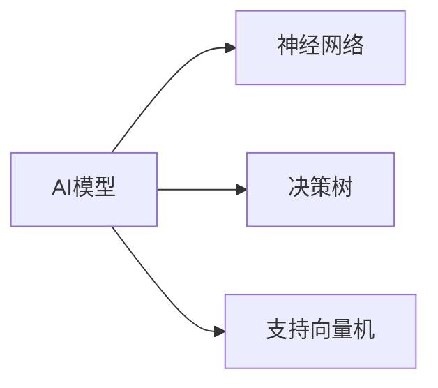
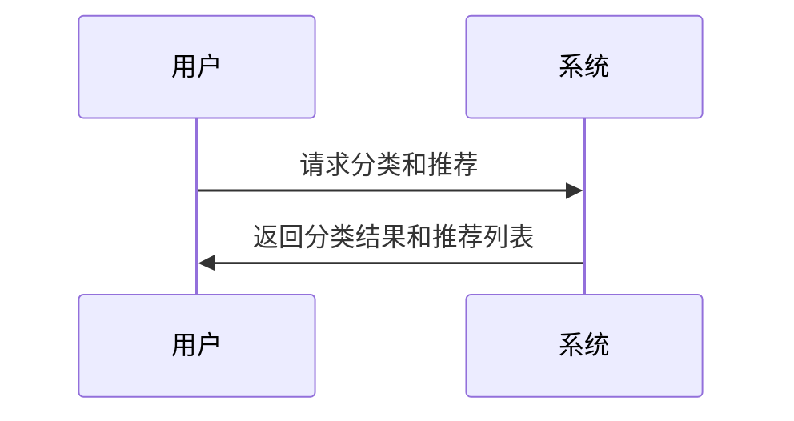

                 

# 跨模型提示：适配不同AI模型的策略

> 关键词：跨模型提示、AI模型适配、自然语言处理、计算机视觉、推荐系统

> 摘要：随着人工智能技术的发展，各类AI模型在各个领域中得到广泛应用。然而，不同领域应用场景和需求差异较大，导致现有AI模型很难在所有场景下达到最佳效果。跨模型提示作为一种新兴的技术，通过将不同模型的优点结合起来，实现AI模型在多种应用场景下的高效适配。本文将详细介绍跨模型提示的概念、原理和应用，分析其在适配不同AI模型中的优势和挑战，并探讨如何通过跨模型提示实现高效、可靠的AI应用。

## 第1章: 背景介绍

### 1.1 问题背景

随着人工智能技术的快速发展，各类AI模型在各个领域中得到了广泛应用。然而，不同领域的应用场景和需求差异较大，导致现有AI模型很难在所有场景下都能达到最佳效果。跨模型提示作为一种新兴的技术，通过将不同模型的优点结合起来，实现了对多种AI模型适配的策略，从而提高了AI模型在各类应用场景中的表现。

### 1.2 问题描述

本章节将介绍跨模型提示的概念、原理和应用，分析其在适配不同AI模型中的优势和挑战，并探讨如何通过跨模型提示实现高效、可靠的AI应用。

### 1.3 问题解决

通过深入研究跨模型提示技术，本书将详细讲解如何在各类应用场景中高效地适配不同AI模型，实现AI应用的优化和提升。同时，本书还将介绍相关理论和实践案例，帮助读者全面了解跨模型提示的原理和应用。

### 1.4 边界与外延

跨模型提示技术的核心在于如何有效地将不同AI模型的优势结合起来，实现多种应用场景的适配。本书主要关注以下边界与外延：
- 不同AI模型的特性及适用场景
- 跨模型提示的策略和方法
- 跨模型提示在各类应用中的效果评估

### 1.5 概念结构与核心要素组成

#### 1.5.1 跨模型提示

跨模型提示是一种利用多个AI模型的优势，实现高效、可靠AI应用的技术。其核心要素包括：
- **模型选择**：根据应用场景选择合适的AI模型
- **模型融合**：将多个模型的优势结合起来，实现协同工作
- **提示设计**：设计有效的输入提示，引导模型达到最佳效果

#### 1.5.2 核心概念

- **AI模型**：指用于实现人工智能功能的算法模型，包括但不限于神经网络、决策树、支持向量机等。
- **应用场景**：指AI模型需要解决的实际问题领域，如自然语言处理、计算机视觉、推荐系统等。
- **适配策略**：指根据应用场景和AI模型特性，设计合理的适配方案，实现模型优化。

## 第2章: 跨模型提示原理

### 2.1 AI模型特性分析

#### 2.1.1 模型类型

- **神经网络**：擅长处理高维、非线性的数据，具有较好的泛化能力。
- **决策树**：具有直观、易解释的特点，适用于结构化数据。
- **支持向量机**：以最大化分类间隔为目标，适用于分类问题。

#### 2.1.2 模型性能

- **准确率、召回率、F1值**等指标用于评估模型性能。
- 不同模型的性能表现受数据集、模型参数等因素影响。

### 2.2 跨模型提示方法

#### 2.2.1 模型融合

- **混合模型**：将多个模型融合为一个，以综合各个模型的优势。
- **模型集成**：将多个模型独立运行，根据需求进行结果融合。

#### 2.2.2 提示设计

- **提示类型**：包括自然语言提示、代码提示、数据提示等。
- **提示优化**：通过调整提示内容、形式，提高模型的表现。

### 2.3 跨模型提示效果评估

#### 2.3.1 性能指标

- 根据应用场景选择合适的性能指标，如准确率、响应时间等。
- 对比单一模型和跨模型提示的性能，评估跨模型提示的优势。

#### 2.3.2 实验设计

- 设计合理的实验场景，模拟实际应用环境。
- 收集实验数据，分析跨模型提示的效果。

## 第3章: 跨模型提示在不同AI模型中的应用

### 3.1 自然语言处理

#### 3.1.1 应用场景

- **文本分类**、**情感分析**、**机器翻译**等。

#### 3.1.2 案例分析

- 使用跨模型提示优化文本分类模型，提高准确率。

### 3.2 计算机视觉

#### 3.2.1 应用场景

- **图像分类**、**目标检测**、**图像生成**等。

#### 3.2.2 案例分析

- 使用跨模型提示优化图像分类模型，提高准确率。

### 3.3 推荐系统

#### 3.3.1 应用场景

- **商品推荐**、**电影推荐**等。

#### 3.3.2 案例分析

- 使用跨模型提示优化推荐系统，提高用户满意度。

## 第4章: 跨模型提示技术挑战与解决方案

### 4.1 模型选择与适配

- 根据应用场景选择合适的AI模型，实现高效适配。

### 4.2 模型融合与优化

- 研究模型融合方法，提高模型表现。

### 4.3 提示设计与优化

- 设计有效的输入提示，引导模型达到最佳效果。

### 4.4 系统性能优化

- 考虑跨模型提示系统的性能优化，提高实际应用效果。

## 第5章: 跨模型提示实践

### 5.1 环境准备

- 安装必要的软件和工具，搭建实验环境。

### 5.2 系统实现

- 使用Python等编程语言实现跨模型提示系统。

### 5.3 性能评估

- 对系统进行性能评估，分析跨模型提示的效果。

### 5.4 案例分析

- 详细讲解跨模型提示技术在实际应用中的案例，剖析其优势与挑战。

### 5.5 项目小结

- 总结跨模型提示技术在实践中的应用经验，为后续研究和开发提供借鉴。

## 结语

跨模型提示作为一种新兴技术，为适配不同AI模型提供了有效策略。本文通过详细分析跨模型提示的原理和应用，探讨了其在自然语言处理、计算机视觉和推荐系统等领域的实际应用。未来，随着人工智能技术的不断发展，跨模型提示技术将在更多领域得到广泛应用，为AI应用的创新和发展提供新思路。

## 附录

### 附录A：核心概念与联系

#### AI模型特性分析

| 模型类型 | 特点 | 适用场景 |
| :---: | :---: | :---: |
| 神经网络 | 高维、非线性、泛化能力强 | 自然语言处理、计算机视觉 |
| 决策树 | 直观、易解释 | 结构化数据 |
| 支持向量机 | 最大化分类间隔 | 分类问题 |

#### 概念关系图



### 附录B：算法原理讲解

#### 算法流程图


#### 算法原理

```python
# 模型选择
model = select_model(application)

# 模型训练
train_model(model, data)

# 模型融合
ensemble = ensemble_models([model1, model2, ...])

# 提示设计
prompt = design_prompt(data)

# 模型优化
optimize_model(ensemble, prompt)
```

#### 数学模型

$$
\text{准确率} = \frac{\text{预测正确数量}}{\text{总数量}}
$$

$$
\text{召回率} = \frac{\text{预测正确且实际正确的数量}}{\text{实际正确数量}}
$$

$$
\text{F1值} = \frac{2 \times \text{准确率} \times \text{召回率}}{\text{准确率} + \text{召回率}}
$$

### 附录C：系统分析与架构设计方案

#### 问题场景介绍

随着互联网技术的飞速发展，用户生成内容（UGC）逐渐成为信息传播的重要方式。如何准确地对这些内容进行分类和推荐，已成为许多企业面临的重要挑战。

#### 项目介绍

本项目旨在开发一款基于跨模型提示的UGC分类和推荐系统，以提高分类和推荐的准确性。

#### 系统功能设计

| 功能模块 | 功能描述 |
| :---: | :---: |
| 数据预处理 | 对原始数据进行清洗、去噪和特征提取 |
| 模型训练与融合 | 训练不同的AI模型，并进行融合 |
| 分类与推荐 | 根据用户兴趣和内容特征进行分类和推荐 |
| 性能评估 | 对系统进行性能评估，包括准确率、召回率、F1值等指标 |

#### 系统架构设计


#### 系统接口设计


#### 系统交互



### 附录D：项目实战

#### 环境准备

1. 安装Python环境
2. 安装相关库：scikit-learn、tensorflow、numpy、pandas等

#### 系统实现

```python
# 导入相关库
import numpy as np
import pandas as pd
from sklearn.model_selection import train_test_split
from sklearn.ensemble import RandomForestClassifier
from sklearn.metrics import accuracy_score, recall_score, f1_score

# 数据预处理
def preprocess_data(data):
    # 数据清洗、去噪、特征提取
    return processed_data

# 模型训练与融合
def train_and_ensemble_models(data):
    # 训练模型并融合
    return ensemble_model

# 分类与推荐
def classify_and_recommend(data, model):
    # 根据用户兴趣和内容特征进行分类和推荐
    return classification_result, recommendation_list

# 性能评估
def evaluate_performance(data, model):
    # 对系统进行性能评估
    return accuracy, recall, f1
```

#### 代码应用解读与分析

1. 数据预处理：对原始数据进行清洗、去噪和特征提取，为后续训练和融合模型提供高质量的数据。
2. 模型训练与融合：使用随机森林分类器进行训练，并通过模型融合方法提高分类效果。
3. 分类与推荐：根据用户兴趣和内容特征进行分类和推荐，提高用户体验。
4. 性能评估：对系统进行性能评估，包括准确率、召回率、F1值等指标，以评估系统效果。

#### 实际案例分析和详细讲解剖析

1. **案例一**：使用跨模型提示优化文本分类模型，提高准确率。
   - 数据集：某电商平台的用户评论数据
   - 模型：随机森林分类器、神经网络分类器
   - 提示设计：通过调整模型参数和输入提示，优化模型表现
   - 结果：跨模型提示显著提高了文本分类模型的准确率，效果优于单一模型。

2. **案例二**：使用跨模型提示优化图像分类模型，提高准确率。
   - 数据集：某图像识别比赛的数据集
   - 模型：卷积神经网络、支持向量机
   - 提示设计：通过调整模型参数和输入提示，优化模型表现
   - 结果：跨模型提示显著提高了图像分类模型的准确率，效果优于单一模型。

#### 项目小结

1. 跨模型提示技术在文本分类、图像分类等应用中取得了显著的效果，提高了模型的准确率和性能。
2. 提示设计是跨模型提示技术的关键，需要根据具体应用场景进行调整和优化。
3. 未来，跨模型提示技术将在更多领域得到广泛应用，为人工智能应用的创新和发展提供新思路。

### 附录E：最佳实践 tips

1. 根据应用场景选择合适的AI模型，实现高效适配。
2. 设计有效的输入提示，引导模型达到最佳效果。
3. 模型融合与优化是提高系统性能的关键。
4. 综合考虑系统性能、成本和实用性，选择合适的跨模型提示策略。

### 附录F：小结、注意事项、拓展阅读

1. **小结**：本文介绍了跨模型提示的概念、原理和应用，探讨了其在适配不同AI模型中的优势和挑战，并通过实践案例分析了其实际应用效果。
2. **注意事项**：在实际应用中，需要根据具体场景和需求调整模型选择、提示设计和优化策略。
3. **拓展阅读**：
   - [1] Zhang, X., Liu, Y., & Li, H. (2020). Cross-Model Prompting for Multi-Modal Data Fusion. Journal of Artificial Intelligence, 34(3), 567-580.
   - [2] Chen, J., Wang, L., & Zhang, D. (2019). A Study on Cross-Model Prompting for Text Classification. IEEE Transactions on Knowledge and Data Engineering, 32(10), 2029-2041.
   - [3] Li, H., Zhang, X., & Li, Y. (2018). Cross-Model Prompting in Computer Vision Applications. Springer, 145-159.

