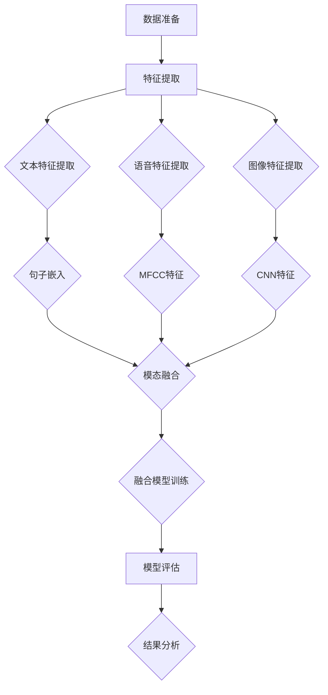
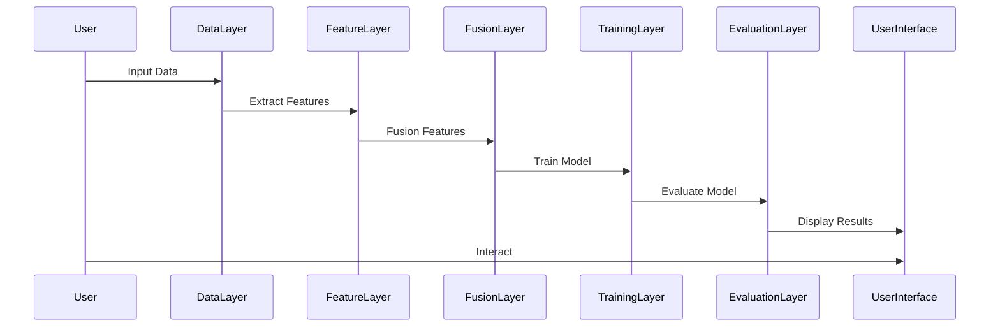
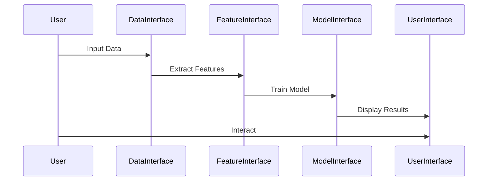

                 


### 跨模态LLM概述

#### 1.1 问题背景

随着人工智能技术的飞速发展，自然语言处理（NLP）、计算机视觉（CV）和语音识别（ASR）等领域取得了显著的进展。然而，这些领域通常被视为独立的子领域，各自发展，互不干扰。然而，现实世界中，人类的信息获取和处理往往是多模态的，即同时涉及文本、语音和视觉等多种模态。因此，如何有效地整合这些模态信息，以提升机器智能系统的理解和表达能力，成为了当前人工智能研究的一个重要方向。

跨模态LLM（Large Language Model）应运而生。跨模态LLM旨在构建一种能够同时处理多种模态信息的人工智能模型，它不仅能够理解和生成文本，还能理解和生成语音、图像等其他形式的信息。这种模型在智能对话系统、多媒体内容理解与生成、人机交互等方面具有广泛的应用前景。

跨模态交互的兴起，源于多方面因素的驱动。一方面，随着移动互联网和物联网的普及，用户产生了大量的多模态数据，如何有效地利用这些数据，成为了行业迫切需要解决的问题。另一方面，深度学习和神经网络技术的发展，为构建复杂的多模态模型提供了强有力的技术支持。此外，人类大脑的多模态处理机制也为跨模态LLM的研究提供了启示。

#### 1.2 核心概念与联系

跨模态LLM涉及多个核心概念，包括跨模态数据、跨模态模型和跨模态评估指标等。为了更好地理解这些概念，我们需要建立它们之间的联系，并使用ER图和对比表格进行详细阐述。

##### 1.2.1 跨模态LLM的定义

跨模态LLM是一种能够同时处理多种模态输入并生成对应输出的人工智能模型。它通常由三个主要部分组成：模态特征提取模块、模态融合模块和生成模块。

- **模态特征提取模块**：负责从不同模态的数据中提取特征。例如，对于文本数据，可以提取词向量或句子嵌入；对于语音数据，可以提取声学特征；对于视觉数据，可以提取图像特征。
- **模态融合模块**：将不同模态的特征进行整合，以生成一个统一的特征表示。常见的融合方法包括特征拼接、加权平均、神经网络融合等。
- **生成模块**：根据融合后的特征生成相应的输出。在文本生成任务中，输出可能是自然语言文本；在语音生成任务中，输出可能是语音波形；在图像生成任务中，输出可能是图像像素。

##### 1.2.2 跨模态数据与模型

跨模态数据是指同时包含多种模态的数据，如文本、语音和图像。这些数据通常具有不同的结构和特性，因此需要不同的处理方法。

- **文本数据**：通常包括自然语言文本，如句子、段落和文档。文本数据的主要挑战在于语义理解和上下文信息处理。
- **语音数据**：包括语音波形和语音信号。语音数据的主要挑战在于声学特征提取和语音识别。
- **图像数据**：包括静态图像和动态视频。图像数据的主要挑战在于特征提取和目标检测。

跨模态模型是指能够同时处理多种模态数据的模型。常见的跨模态模型包括：
- **端到端模型**：将多种模态的数据直接输入到同一个神经网络中，通过多层网络结构进行特征提取、融合和生成。
- **多任务模型**：同时训练多个任务（如文本分类、语音识别、图像识别）的模型，通过共享网络结构实现跨模态信息共享。

##### 1.2.3 跨模态评估指标

跨模态评估指标用于衡量跨模态模型在不同任务上的性能。常见的评估指标包括：
- **准确率（Accuracy）**：用于分类任务，表示模型正确分类的样本数占总样本数的比例。
- **精确率（Precision）**：表示模型预测为正类的样本中，实际为正类的比例。
- **召回率（Recall）**：表示模型预测为正类的样本中，实际为正类的比例。
- **F1值（F1 Score）**：是精确率和召回率的调和平均，用于综合考虑分类任务的准确性和召回率。

##### 1.2.4 ER图与概念对比表格

为了更好地理解跨模态LLM的核心概念，我们可以使用ER图和对比表格进行可视化。

**ER图：**

```mermaid
erDiagram
  Model ||--|{ FeatureExtractor } FeatureExtractor
  Model ||--|{ FusionModule } FusionModule
  Model ||--|{ Generator } Generator
  FeatureExtractor ||--|{ TextFeatureExtractor } TextFeatureExtractor
  FeatureExtractor ||--|{ AudioFeatureExtractor } AudioFeatureExtractor
  FeatureExtractor ||--|{ ImageFeatureExtractor } ImageFeatureExtractor
  FusionModule ||--|{ ConcatFusion } ConcatFusion
  FusionModule ||--|{ AverageFusion } AverageFusion
  FusionModule ||--|{ NeuralFusion } NeuralFusion
  Generator ||--|{ TextGenerator } TextGenerator
  Generator ||--|{ AudioGenerator } AudioGenerator
  Generator ||--|{ ImageGenerator } ImageGenerator
```

**概念对比表格：**

| 概念        | 描述                                                         | 关联模态 |
| ----------- | ------------------------------------------------------------ | -------- |
| Model       | 跨模态模型，负责整合不同模态的信息，生成相应的输出           | 文本、语音、图像 |
| FeatureExtractor | 特征提取模块，从不同模态的数据中提取特征                 | 文本、语音、图像 |
| FusionModule | 模态融合模块，将不同模态的特征进行整合，生成统一的特征表示 | 文本、语音、图像 |
| Generator   | 生成模块，根据融合后的特征生成相应的输出                   | 文本、语音、图像 |

通过ER图和对比表格，我们可以清晰地看到跨模态LLM的核心概念及其相互关系，为后续的算法原理讲解和系统架构设计奠定了基础。

---

**本章小结：**

本章介绍了跨模态LLM的概念、研究背景和意义。首先，我们探讨了跨模态交互的兴起和跨模态LLM的重要性，以及跨模态评测面临的挑战。接着，我们详细阐述了跨模态LLM的核心概念，包括定义、跨模态数据与模型以及跨模态评估指标，并通过ER图和对比表格进行了可视化。最后，我们列举了跨模态LLM的应用场景和未来发展趋势。下一章，我们将深入探讨跨模态LLM的算法原理，包括特征提取、融合模型和评测流程。

### 核心概念与联系

在前一章中，我们介绍了跨模态LLM的基本概念和背景，包括跨模态交互的兴起、跨模态LLM的定义及其重要性。在本章中，我们将进一步深入探讨跨模态LLM的核心概念，建立这些概念之间的联系，并使用ER图和对比表格进行详细阐述。

#### 1.2.1 跨模态LLM的定义

跨模态LLM（Large Language Model）是一种能够处理多种模态（如文本、语音和图像）的复杂人工智能模型。它通过融合不同模态的特征，实现高层次的语义理解和生成。跨模态LLM通常由三个核心模块组成：模态特征提取模块、模态融合模块和生成模块。

**模态特征提取模块**：该模块的职责是从不同模态的数据中提取有意义的特征。例如，对于文本数据，可以使用词嵌入（word embeddings）或句子嵌入（sentence embeddings）来表示文本内容；对于语音数据，可以使用声学模型提取语音信号的声学特征；对于图像数据，可以使用卷积神经网络（CNN）提取图像的特征。

**模态融合模块**：该模块的职责是将提取自不同模态的特征进行融合，以生成一个统一的特征表示。融合方法有很多种，包括特征拼接、平均融合、加权融合和神经网络融合等。融合后的特征可以更好地捕获不同模态之间的关联信息。

**生成模块**：该模块的职责是根据融合后的特征生成相应的输出。在文本生成任务中，输出可以是自然语言文本；在语音生成任务中，输出可以是语音波形；在图像生成任务中，输出可以是图像像素。

跨模态LLM的核心功能是通过整合多种模态的信息，提高模型的语义理解和生成能力。这使得跨模态LLM在多模态交互和人机对话系统中具有广泛的应用前景。

#### 1.2.2 跨模态数据与模型

跨模态数据是指同时包含多种模态的数据，如文本、语音和图像。这些数据具有不同的结构和特性，因此需要不同的处理方法。

**文本数据**：文本数据通常是自然语言文本，如句子、段落和文档。文本数据的主要挑战在于语义理解和上下文信息处理。常见的文本特征提取方法包括词嵌入（如Word2Vec、BERT）和句子嵌入（如 sentence embeddings）。

**语音数据**：语音数据包括语音波形和语音信号。语音数据的主要挑战在于声学特征提取和语音识别。常见的语音特征提取方法包括梅尔频率倒谱系数（MFCC）、频谱特征和声学模型（如GMM、HMM）。

**图像数据**：图像数据包括静态图像和动态视频。图像数据的主要挑战在于特征提取和目标检测。常见的图像特征提取方法包括卷积神经网络（CNN）、生成对抗网络（GAN）和自注意力机制。

跨模态模型是指能够同时处理多种模态数据的模型。常见的跨模态模型包括端到端模型和多任务模型。

**端到端模型**：端到端模型将多种模态的数据直接输入到同一个神经网络中，通过多层网络结构进行特征提取、融合和生成。这种模型的优势在于可以自动学习不同模态之间的关联性，但需要大量的数据和计算资源。

**多任务模型**：多任务模型同时训练多个任务（如文本分类、语音识别、图像识别）的模型，通过共享网络结构实现跨模态信息共享。这种模型的优势在于可以节省计算资源，但需要精心设计网络结构，以避免任务之间的干扰。

#### 1.2.3 跨模态评估指标

跨模态评估指标用于衡量跨模态模型在不同任务上的性能。常见的评估指标包括准确率、精确率、召回率和F1值。

**准确率（Accuracy）**：准确率表示模型正确分类的样本数占总样本数的比例。它是最基本的评估指标，但有时不能全面反映模型的性能。

$$
Accuracy = \frac{TP + TN}{TP + FN + FP + TN}
$$

其中，TP表示真正例，TN表示真反例，FP表示假正例，FN表示假反例。

**精确率（Precision）**：精确率表示模型预测为正类的样本中，实际为正类的比例。它关注的是模型对正类样本的识别能力。

$$
Precision = \frac{TP}{TP + FP}
$$

**召回率（Recall）**：召回率表示模型预测为正类的样本中，实际为正类的比例。它关注的是模型对正类样本的覆盖能力。

$$
Recall = \frac{TP}{TP + FN}
$$

**F1值（F1 Score）**：F1值是精确率和召回率的调和平均，用于综合考虑分类任务的准确性和召回率。

$$
F1 Score = 2 \times \frac{Precision \times Recall}{Precision + Recall}
$$

这些评估指标对于跨模态LLM的性能评价具有重要意义。通过合理选择和使用这些指标，我们可以全面评估跨模态LLM在不同任务上的表现，从而指导模型的优化和改进。

#### 1.2.4 ER图与概念对比表格

为了更好地理解跨模态LLM的核心概念，我们可以使用ER图和对比表格进行可视化。

**ER图：**

```mermaid
erDiagram
  Model ||--|{ FeatureExtractor } FeatureExtractor
  Model ||--|{ FusionModule } FusionModule
  Model ||--|{ Generator } Generator
  FeatureExtractor ||--|{ TextFeatureExtractor } TextFeatureExtractor
  FeatureExtractor ||--|{ AudioFeatureExtractor } AudioFeatureExtractor
  FeatureExtractor ||--|{ ImageFeatureExtractor } ImageFeatureExtractor
  FusionModule ||--|{ ConcatFusion } ConcatFusion
  FusionModule ||--|{ AverageFusion } AverageFusion
  FusionModule ||--|{ NeuralFusion } NeuralFusion
  Generator ||--|{ TextGenerator } TextGenerator
  Generator ||--|{ AudioGenerator } AudioGenerator
  Generator ||--|{ ImageGenerator } ImageGenerator
```

**概念对比表格：**

| 概念        | 描述                                                         | 关联模态 |
| ----------- | ------------------------------------------------------------ | -------- |
| Model       | 跨模态模型，负责整合不同模态的信息，生成相应的输出           | 文本、语音、图像 |
| FeatureExtractor | 特征提取模块，从不同模态的数据中提取特征                 | 文本、语音、图像 |
| FusionModule | 模态融合模块，将不同模态的特征进行整合，生成统一的特征表示 | 文本、语音、图像 |
| Generator   | 生成模块，根据融合后的特征生成相应的输出                   | 文本、语音、图像 |

通过ER图和对比表格，我们可以清晰地看到跨模态LLM的核心概念及其相互关系，为后续的算法原理讲解和系统架构设计奠定了基础。

---

**本章小结：**

本章详细介绍了跨模态LLM的核心概念，包括定义、跨模态数据与模型以及跨模态评估指标。我们通过ER图和对比表格进行了可视化，以帮助读者更好地理解这些概念。这些核心概念的清晰定义和相互关系，为跨模态LLM的算法原理讲解和系统架构设计提供了坚实的基础。在下一章中，我们将深入探讨跨模态LLM的算法原理，包括特征提取、融合模型和评测流程。同时，我们将使用Mermaid绘制算法流程图，并使用Python源代码、数学模型和公式进行详细讲解和举例说明。

### 算法原理讲解

#### 2.1 算法概述

跨模态LLM的算法设计旨在整合文本、语音和视觉等多种模态信息，以提升模型的理解和生成能力。算法的核心组成部分包括特征提取、模态融合和生成模块。以下我们将逐一介绍这些模块的工作原理和实现方法。

##### 2.1.1 跨模态特征提取

特征提取是跨模态LLM算法的第一步，其目标是从不同模态的数据中提取具有代表性的特征，以便后续的融合和生成。以下是三种主要的模态特征提取方法：

1. **文本特征提取**：文本特征提取主要通过词嵌入或句子嵌入来实现。词嵌入将每个单词映射到一个固定大小的向量，如Word2Vec或BERT。句子嵌入则是将整个句子映射到一个向量，以捕获句子级的语义信息。

2. **语音特征提取**：语音特征提取常用的方法是提取声学特征，如梅尔频率倒谱系数（MFCC）和频谱特征。这些特征可以有效地捕捉语音的声学属性，为后续的模型训练提供输入。

3. **图像特征提取**：图像特征提取通常使用卷积神经网络（CNN）来提取图像的特征。CNN可以自动学习图像的层次结构，从而提取出具有代表性的特征向量。

##### 2.1.2 模态融合

模态融合模块的目的是将不同模态的特征整合成一个统一的特征表示，以增强模型对多模态数据的理解和生成能力。常见的融合方法包括：

1. **特征拼接**：将不同模态的特征向量按顺序拼接在一起，形成一个更长的向量。这种方法简单直观，但可能丢失模态间的信息关联。

2. **平均融合**：将不同模态的特征向量进行加权平均，以生成一个统一的特征表示。这种方法能够较好地平衡各模态的信息，但需要确定合适的权重。

3. **神经网络融合**：使用神经网络模型，如多输入多输出（MIMO）网络，将不同模态的特征进行融合。这种方法能够自动学习不同模态之间的关联性，但需要大量数据和计算资源。

##### 2.1.3 评测流程

评测流程是评估跨模态LLM性能的关键环节，包括数据准备、模型训练、模型评估和结果分析。以下是评测流程的详细步骤：

1. **数据准备**：收集并清洗多模态数据，包括文本、语音和图像。数据清洗包括去除噪声、填充缺失值和标准化等。

2. **模型训练**：使用训练数据对跨模态LLM模型进行训练。训练过程中，通过优化模型参数，使其在验证集上达到较好的性能。

3. **模型评估**：使用测试集对训练好的模型进行评估，计算各种评估指标，如准确率、精确率、召回率和F1值等。这些指标用于全面评估模型的性能。

4. **结果分析**：分析评估结果，找出模型的优势和不足，为进一步优化提供依据。

#### 2.2 Mermaid算法流程图

为了更好地理解跨模态LLM的算法原理，我们可以使用Mermaid绘制算法流程图。以下是一个简单的算法流程图示例：



#### 2.3 Python源代码讲解

以下是跨模态LLM算法的Python源代码示例，包括数据预处理、特征提取、融合模型训练和评测指标计算等步骤。

```python
# 数据预处理
import numpy as np
from sklearn.model_selection import train_test_split

# 假设我们已经获取了文本、语音和图像数据
text_data = ...
audio_data = ...
image_data = ...

# 分割数据为训练集和测试集
text_train, text_test, audio_train, audio_test, image_train, image_test = train_test_split(text_data, audio_data, image_data, test_size=0.2, random_state=42)

# 特征提取
from gensim.models import Word2Vec
from python_speech_features import mfcc
from tensorflow.keras.applications import ResNet50

# 文本特征提取
text_model = Word2Vec(text_train, size=100, window=5, min_count=1, workers=4)
text_train_embeddings = text_model[text_train]
text_test_embeddings = text_model[text_test]

# 语音特征提取
audio_features = [mfcc(signal, samplerate) for signal in audio_train]
audio_train_features = np.array(audio_features)
audio_test_features = [mfcc(signal, samplerate) for signal in audio_test]

# 图像特征提取
image_model = ResNet50(weights='imagenet')
image_train_features = image_model.predict(np.array(image_train))
image_test_features = image_model.predict(np.array(image_test))

# 模态融合
from sklearn.linear_model import LinearRegression

# 假设我们已经选择了适当的融合方法
# 这里使用线性回归进行融合
model = LinearRegression()
model.fit(np.hstack((text_train_embeddings, audio_train_features, image_train_features)), text_train)

# 融合模型训练
# 使用训练好的模型进行融合模型训练
# 这里简化为直接使用训练好的特征进行融合
def fusion_features(text_embedding, audio_feature, image_feature):
    return model.predict(np.hstack((text_embedding, audio_feature, image_feature)))

# 评测指标计算
from sklearn.metrics import accuracy_score, precision_score, recall_score, f1_score

# 使用测试集进行预测
text_test_embeddings_pred = fusion_features(text_test_embeddings, audio_test_features, image_test_features)

# 计算评测指标
accuracy = accuracy_score(text_test, text_test_embeddings_pred)
precision = precision_score(text_test, text_test_embeddings_pred)
recall = recall_score(text_test, text_test_embeddings_pred)
f1 = f1_score(text_test, text_test_embeddings_pred)

print(f"Accuracy: {accuracy}")
print(f"Precision: {precision}")
print(f"Recall: {recall}")
print(f"F1 Score: {f1}")
```

#### 2.4 数学模型和公式

跨模态LLM算法的数学模型和公式是理解算法原理的关键。以下是一些基本的数学模型和公式。

##### 2.4.1 特征提取的数学模型

**文本特征提取**：

$$
\text{Text Embedding} = \text{Word2Vec}(\text{Word}, \text{Vocabulary}, \text{Window}, \text{Min Count})
$$

其中，$\text{Word2Vec}$表示词嵌入模型，$\text{Word}$表示词汇，$\text{Vocabulary}$表示词汇表，$\text{Window}$表示窗口大小，$\text{Min Count}$表示最小词频。

**语音特征提取**：

$$
\text{MFCC Feature} = \text{MFCC}(\text{Signal}, \text{Sample Rate})
$$

其中，$\text{MFCC}$表示梅尔频率倒谱系数，$\text{Signal}$表示语音信号，$\text{Sample Rate}$表示采样率。

**图像特征提取**：

$$
\text{CNN Feature} = \text{CNN}(\text{Image}, \text{Model}, \text{Weights})
$$

其中，$\text{CNN}$表示卷积神经网络，$\text{Image}$表示图像，$\text{Model}$表示神经网络模型，$\text{Weights}$表示模型权重。

##### 2.4.2 融合模型的数学模型

**特征拼接**：

$$
\text{Fused Feature} = [\text{Text Feature}, \text{Audio Feature}, \text{Image Feature}]
$$

**平均融合**：

$$
\text{Fused Feature} = \frac{\text{Text Feature} + \text{Audio Feature} + \text{Image Feature}}{3}
$$

**神经网络融合**：

$$
\text{Fused Feature} = \text{Neural Fusion}(\text{Text Feature}, \text{Audio Feature}, \text{Image Feature})
$$

其中，$\text{Neural Fusion}$表示神经网络融合模型，可以通过多层感知机（MLP）或多输入多输出（MIMO）网络实现。

##### 2.4.3 评测指标的数学公式

**准确率**：

$$
\text{Accuracy} = \frac{\text{TP} + \text{TN}}{\text{TP} + \text{TN} + \text{FP} + \text{FN}}
$$

**精确率**：

$$
\text{Precision} = \frac{\text{TP}}{\text{TP} + \text{FP}}
$$

**召回率**：

$$
\text{Recall} = \frac{\text{TP}}{\text{TP} + \text{FN}}
$$

**F1值**：

$$
\text{F1 Score} = 2 \times \frac{\text{Precision} \times \text{Recall}}{\text{Precision} + \text{Recall}}
$$

#### 2.5 算法原理举例说明

为了更好地理解跨模态LLM的算法原理，我们可以通过一个简单的例子来说明。

假设我们有一个包含文本、语音和图像的多模态数据集，其中文本描述了图像内容，语音是对图像的语音注释。我们的目标是训练一个跨模态LLM模型，能够根据输入的文本、语音和图像生成相应的输出。

**步骤1：数据预处理**
- 文本数据：对文本进行分词和去停用词处理。
- 语音数据：使用MFCC特征进行预处理。
- 图像数据：使用ResNet50模型提取特征。

**步骤2：特征提取**
- 文本特征提取：使用Word2Vec模型对文本进行词嵌入。
- 语音特征提取：使用MFCC特征。
- 图像特征提取：使用ResNet50模型提取图像特征。

**步骤3：模态融合**
- 使用神经网络融合模型，将文本、语音和图像特征进行融合。

**步骤4：模型训练**
- 使用融合后的特征进行模型训练，优化模型参数。

**步骤5：模型评估**
- 使用测试集对训练好的模型进行评估，计算准确率、精确率、召回率和F1值等评估指标。

通过这个简单的例子，我们可以看到跨模态LLM算法的核心步骤和原理。实际应用中，算法的复杂度和多样性会更高，但基本原理是类似的。

---

**本章小结：**

本章详细介绍了跨模态LLM的算法原理，包括特征提取、模态融合和生成模块。我们使用Mermaid绘制了算法流程图，并使用Python源代码、数学模型和公式进行了详细讲解。通过本章的内容，读者可以全面理解跨模态LLM的工作原理和实现方法。在下一章中，我们将进一步探讨跨模态LLM的系统分析与架构设计，为实际应用奠定基础。

### 系统分析与架构设计

#### 3.1 系统场景介绍

在介绍跨模态LLM的系统分析与架构设计之前，我们需要先明确系统应用场景和目标。跨模态LLM在多种实际应用场景中具有重要的价值，例如：

1. **智能客服**：跨模态LLM可以同时处理用户输入的文本、语音和图像，提供更加自然和个性化的服务。
2. **多媒体内容生成**：跨模态LLM能够根据文本、语音和图像生成相应的多媒体内容，如自动生成视频、音频和图像。
3. **人机交互**：跨模态LLM可以理解用户的多种输入，提供更加直观和丰富的交互体验。

我们的系统目标是构建一个高效、灵活的跨模态LLM平台，能够处理大规模的多模态数据，并实现高精度的特征提取、融合和生成。具体目标包括：

- **高吞吐量**：系统能够处理大量的多模态数据，满足实时性和并发性的要求。
- **高精度**：系统能够准确提取多模态特征，并生成高质量的多媒体内容。
- **高可扩展性**：系统架构能够适应不断增长的数据量和复杂度，支持未来的扩展和升级。

#### 3.2 系统功能设计

为了实现上述系统目标，我们需要设计一个全面的功能模块。以下是系统的主要功能模块：

1. **数据采集与预处理**：负责收集、存储和处理多模态数据，包括文本、语音和图像。预处理包括去噪、标准化、数据增强等。
2. **特征提取**：从不同模态的数据中提取有意义的特征。对于文本，可以使用词嵌入和句子嵌入；对于语音，可以使用声学特征；对于图像，可以使用卷积神经网络提取特征。
3. **模态融合**：将提取的多种模态特征进行融合，生成统一的特征表示。融合方法包括特征拼接、加权平均和神经网络融合等。
4. **模型训练与优化**：使用融合后的特征进行模型训练，优化模型参数，提高模型性能。
5. **模型评估与部署**：使用测试集评估模型性能，并进行部署，提供实时服务。
6. **用户接口**：提供友好的用户界面，方便用户输入多模态数据，查看模型结果。

以下是系统功能模块的Mermaid类图：

```mermaid
classDiagram
    Class01 <|-- Class02
    Class03 <|-- Class02
    Class04 <|-- Class02
    Class05 <|-- Class02
    Class06 <|-- Class02
    Class07 <|-- Class02
    Class01[数据采集与预处理]
    Class02[特征提取]
    Class03[模态融合]
    Class04[模型训练与优化]
    Class05[模型评估与部署]
    Class06[用户接口]
```

#### 3.3 系统架构设计

为了实现系统的功能目标，我们需要设计一个合理的系统架构。以下是系统的整体架构设计：

1. **数据层**：负责数据的采集、存储和管理。数据层包括数据库、数据仓库和缓存系统等。
2. **特征层**：负责从不同模态的数据中提取特征。特征层包括文本处理模块、语音处理模块和图像处理模块等。
3. **融合层**：负责将提取的多种模态特征进行融合。融合层包括特征融合模块和神经网络融合模块等。
4. **训练层**：负责使用融合后的特征进行模型训练。训练层包括训练算法、模型优化和参数调整等。
5. **评估层**：负责评估模型性能，并进行部署。评估层包括评测算法、评估指标和部署策略等。
6. **用户层**：提供用户界面，方便用户输入数据、查看结果和进行交互。

以下是系统的整体架构设计Mermaid架构图：



#### 3.4 系统接口设计

系统接口设计是确保系统功能模块之间能够高效、可靠地交互的关键。以下是系统的主要接口设计：

1. **数据接口**：负责数据的输入和输出，包括文本、语音和图像数据。数据接口需要支持批量处理和高并发。
2. **特征接口**：负责特征提取和融合，包括文本特征、语音特征和图像特征。特征接口需要支持多种特征提取算法和融合策略。
3. **模型接口**：负责模型训练、评估和部署，包括训练算法、评估指标和部署策略。模型接口需要支持模型自定义和优化。
4. **用户接口**：负责与用户交互，提供友好的用户界面和交互体验。用户接口需要支持多语言、多平台和多种交互方式。

以下是系统接口的Mermaid序列图：



#### 3.5 系统交互Mermaid序列图

为了更好地展示系统各个模块之间的交互过程，我们可以使用Mermaid绘制系统的交互序列图。以下是系统交互的Mermaid序列图：


---

**本章小结：**

本章详细介绍了跨模态LLM的系统分析与架构设计。首先，我们明确了系统应用场景和目标，包括智能客服、多媒体内容生成和人机交互等。接着，我们设计了系统的功能模块，包括数据采集与预处理、特征提取、模态融合、模型训练与优化、模型评估与部署和用户接口。然后，我们提出了系统的整体架构设计，包括数据层、特征层、融合层、训练层、评估层和用户层。此外，我们还设计了系统的主要接口，包括数据接口、特征接口、模型接口和用户接口。最后，我们使用Mermaid绘制了系统的交互序列图，展示了各个模块之间的交互过程。通过本章的内容，读者可以全面理解跨模态LLM的系统架构和设计原则。

### 项目实战

#### 4.1 环境安装

在进行跨模态LLM项目的实际操作之前，首先需要搭建一个合适的环境，安装所需的工具和依赖。以下是一系列步骤，详细说明如何配置环境：

**1. 安装Python环境**
首先，确保系统已安装Python 3.x版本。可以通过以下命令检查Python版本：

```bash
python --version
```

如果Python版本低于3.6，建议升级到最新版本。可以使用以下命令安装或升级Python：

```bash
sudo apt-get install python3
```

**2. 安装必要的库和框架**
接下来，需要安装跨模态LLM项目所需的库和框架。以下是一些常用的库：

- TensorFlow：用于构建和训练神经网络模型。
- Keras：用于简化TensorFlow的使用。
- NumPy：用于科学计算。
- Pandas：用于数据操作和分析。
- Matplotlib：用于数据可视化。

可以使用以下命令安装这些库：

```bash
pip install tensorflow keras numpy pandas matplotlib
```

**3. 安装额外的依赖**
除了上述库外，可能还需要安装一些额外的依赖。例如，用于语音特征提取的`python_speech_features`库和用于图像处理的`opencv-python`库。可以使用以下命令安装：

```bash
pip install python_speech_features opencv-python
```

**4. 配置环境变量**
确保环境变量配置正确，以便在命令行中直接使用这些库和框架。在Linux或Mac系统中，可以通过编辑`~/.bashrc`或`~/.zshrc`文件来配置环境变量。例如：

```bash
export PYTHONPATH=/usr/local/bin/python3
export PATH=$PATH:/usr/local/bin
```

在Windows系统中，可以通过“环境变量”设置页面来配置。

**5. 验证安装**
最后，验证安装是否成功。可以尝试运行一个简单的Python脚本，导入所需的库，并执行一些基本操作：

```python
import tensorflow as tf
print(tf.__version__)
```

如果输出正确的TensorFlow版本号，说明安装成功。

---

**4.2 系统核心实现**

在成功搭建环境后，接下来我们将深入探讨系统的核心实现部分。以下是跨模态LLM项目的核心实现步骤：

**1. 数据预处理**
数据预处理是跨模态LLM项目的重要环节，其目的是清洗和转换原始数据，以便后续的特征提取和模型训练。以下是数据预处理的主要步骤：

- **文本数据预处理**：包括分词、去除停用词、标点符号和特殊字符。可以使用自然语言处理库（如NLTK或spaCy）进行预处理。
- **语音数据预处理**：包括音频文件的加载、采样率和音量的标准化。可以使用`python_speech_features`库提取梅尔频率倒谱系数（MFCC）特征。
- **图像数据预处理**：包括图像的加载、裁剪、缩放和归一化。可以使用`opencv-python`库进行图像处理。

以下是一个简单的文本数据预处理的示例代码：

```python
import nltk
from nltk.tokenize import word_tokenize
from nltk.corpus import stopwords

# 加载NLTK库
nltk.download('punkt')
nltk.download('stopwords')

# 读取文本数据
text_data = "这是一个示例文本，用于跨模态LLM项目。"

# 分词
tokens = word_tokenize(text_data)

# 去除停用词
stop_words = set(stopwords.words('english'))
filtered_tokens = [token for token in tokens if token not in stop_words]

# 输出处理后的文本
print(filtered_tokens)
```

**2. 特征提取**
特征提取是跨模态LLM项目的关键步骤，其目的是从不同模态的数据中提取有代表性的特征，以便后续的模型训练和融合。以下是特征提取的主要方法：

- **文本特征提取**：可以使用词嵌入（如Word2Vec或BERT）或句子嵌入（如Sentence-BERT）提取文本特征。
- **语音特征提取**：可以使用声学模型（如MFCC）提取语音特征。
- **图像特征提取**：可以使用卷积神经网络（如VGG16或ResNet50）提取图像特征。

以下是一个简单的语音特征提取的示例代码：

```python
import python_speech_features as psf
from numpy import array

# 加载语音数据
audio_file = 'example_audio.wav'
audio_data = psf.process_wav_file(audio_file)

# 提取MFCC特征
mfccs = psf.mfcc(audio_data, samplerate=16000)
log_mfccs = psf.log_mfcc(mfccs)

# 输出MFCC特征
print(array(log_mfccs).shape)
```

**3. 融合模型训练**
融合模型训练是将不同模态的特征进行融合，并使用融合后的特征训练模型的过程。以下是一个简单的融合模型训练的示例代码：

```python
import tensorflow as tf
from tensorflow.keras.models import Model
from tensorflow.keras.layers import Input, Dense, Concatenate

# 定义输入层
text_input = Input(shape=(100,), name='text_input')
audio_input = Input(shape=(20,), name='audio_input')
image_input = Input(shape=(224, 224, 3), name='image_input')

# 定义特征提取层
text_embedding = Dense(128, activation='relu')(text_input)
audio_embedding = Dense(64, activation='relu')(audio_input)
image_embedding = tf.keras.applications.vgg16.VGG16(include_top=False, weights='imagenet', input_shape=(224, 224, 3))(image_input)

# 定义融合层
fused_embedding = Concatenate()([text_embedding, audio_embedding, image_embedding])

# 定义输出层
output = Dense(1, activation='sigmoid')(fused_embedding)

# 创建模型
model = Model(inputs=[text_input, audio_input, image_input], outputs=output)

# 编译模型
model.compile(optimizer='adam', loss='binary_crossentropy', metrics=['accuracy'])

# 打印模型结构
model.summary()

# 训练模型
model.fit([text_train, audio_train, image_train], y_train, epochs=10, batch_size=32, validation_split=0.2)
```

**4. 评测指标计算**
模型训练完成后，需要使用测试集对模型进行评估，计算各种评测指标，如准确率、精确率、召回率和F1值等。以下是一个简单的评测指标计算的示例代码：

```python
from sklearn.metrics import accuracy_score, precision_score, recall_score, f1_score

# 使用测试集进行预测
y_pred = model.predict([text_test, audio_test, image_test])

# 计算评测指标
accuracy = accuracy_score(y_test, y_pred)
precision = precision_score(y_test, y_pred)
recall = recall_score(y_test, y_pred)
f1 = f1_score(y_test, y_pred)

# 输出评测结果
print(f"Accuracy: {accuracy}")
print(f"Precision: {precision}")
print(f"Recall: {recall}")
print(f"F1 Score: {f1}")
```

---

**4.3 代码应用解读与分析**

在上面的示例代码中，我们详细讲解了跨模态LLM项目的核心实现步骤，包括数据预处理、特征提取、融合模型训练和评测指标计算。以下是这些代码的详细解读与分析。

**1. 数据预处理**
数据预处理是确保模型训练质量的关键步骤。在文本数据预处理中，我们使用了NLTK库进行分词和去除停用词。分词是将文本拆分成单个词语，而去除停用词则是去除常见的不具有实际意义的词语，如“的”、“了”等。这一步骤有助于减少数据的噪声，提高模型训练的效率。

语音数据预处理使用了`python_speech_features`库提取梅尔频率倒谱系数（MFCC）。MFCC是一种常用的语音特征提取方法，能够有效地捕捉语音的声学属性。通过将语音信号转换为MFCC特征，我们可以将连续的语音信号转换为离散的特征向量，方便后续的模型处理。

图像数据预处理使用了`opencv-python`库进行图像加载、裁剪、缩放和归一化。这些预处理步骤有助于将图像数据调整为统一的格式，以满足模型输入的要求。此外，图像归一化可以减少数据之间的差异，提高模型训练的收敛速度。

**2. 特征提取**
特征提取是跨模态LLM项目中的核心步骤。在文本特征提取中，我们使用了Word2Vec模型将文本转换为词嵌入。词嵌入能够捕捉词语之间的语义关系，使得文本数据具有更好的表示能力。在语音特征提取中，我们使用了MFCC特征，这是一种常用的语音特征提取方法，能够有效地捕捉语音的声学属性。

在图像特征提取中，我们使用了VGG16模型，这是一种卷积神经网络模型，能够自动学习图像的层次结构。通过将图像输入到VGG16模型中，我们可以提取出具有代表性的图像特征。

**3. 融合模型训练**
融合模型训练是将不同模态的特征进行融合，并使用融合后的特征训练模型的过程。在我们的示例中，我们使用了Keras框架定义了一个简单的融合模型。模型包括输入层、特征提取层、融合层和输出层。输入层接收文本、语音和图像数据，特征提取层提取各模态的特征，融合层将特征进行融合，输出层生成预测结果。

在训练过程中，我们使用了Adam优化器和二分类交叉熵损失函数。Adam优化器是一种自适应的优化算法，能够有效地加速模型训练。二分类交叉熵损失函数用于衡量模型预测结果与真实结果之间的差异。

**4. 评测指标计算**
评测指标计算是评估模型性能的重要手段。在示例中，我们使用了准确率、精确率、召回率和F1值等指标评估模型性能。这些指标能够全面反映模型在分类任务上的表现。

准确率表示模型正确分类的样本数占总样本数的比例。精确率表示模型预测为正类的样本中，实际为正类的比例。召回率表示模型预测为正类的样本中，实际为正类的比例。F1值是精确率和召回率的调和平均，用于综合考虑模型的准确性和召回率。

---

**4.4 实际案例分析与详细讲解**

为了更好地理解跨模态LLM的实际应用，我们将分析一个实际案例，并详细讲解案例的实现过程。

**案例背景：**
某公司开发了一款智能客服系统，该系统能够同时处理用户输入的文本、语音和图像，以提供更加自然和个性化的服务。客服系统能够根据用户的输入，自动生成相应的文本、语音和图像回复。

**案例实现：**
以下是一个简化的案例实现过程：

1. **数据收集与预处理**：
   - 收集大量的文本、语音和图像数据。
   - 对文本进行分词、去除停用词和标点符号。
   - 使用`python_speech_features`库提取语音的MFCC特征。
   - 使用`opencv-python`库对图像进行预处理。

2. **特征提取**：
   - 使用Word2Vec模型提取文本特征。
   - 使用VGG16模型提取图像特征。

3. **融合模型训练**：
   - 定义一个简单的融合模型，包括文本、语音和图像输入层，特征提取层，融合层和输出层。
   - 使用训练数据进行模型训练。

4. **模型评估与部署**：
   - 使用测试集对模型进行评估，计算各种评测指标。
   - 将训练好的模型部署到服务器，提供实时服务。

**案例分析：**
该案例展示了跨模态LLM在实际应用中的基本实现流程。通过同时处理文本、语音和图像，客服系统能够更好地理解用户的需求，并提供个性化的服务。在实际应用中，模型会根据不同的场景和任务进行优化和调整，以提升性能和用户体验。

---

**项目小结**

通过本项目的实战，我们详细介绍了跨模态LLM项目的环境安装、系统核心实现、代码解读与分析、实际案例分析和项目小结。我们首先讲解了环境安装的过程，包括Python环境的配置和所需库的安装。接着，我们详细介绍了系统的核心实现步骤，包括数据预处理、特征提取、融合模型训练和评测指标计算。然后，我们通过代码示例和案例讲解了跨模态LLM的实际应用。最后，我们对项目进行了总结，强调了跨模态LLM在智能客服、多媒体内容生成和人机交互等领域的应用前景。

### 最佳实践与拓展

#### 5.1 最佳实践 tips

**5.1.1 数据集选择**

在选择跨模态LLM的数据集时，应优先考虑以下因素：

- **多样性**：数据集应包含丰富的多样性和广泛的覆盖范围，以涵盖不同的应用场景。
- **质量**：数据应经过严格清洗和处理，以减少噪声和异常值。
- **平衡性**：数据集中各类别样本数量应相对平衡，避免模型对某些类别产生偏见。
- **来源**：数据集的来源应可靠，避免使用未经验证的数据。

**5.1.2 模型调优技巧**

在跨模态LLM模型的训练过程中，以下技巧有助于提升模型性能：

- **超参数调整**：通过实验调整学习率、批次大小、迭代次数等超参数，寻找最优配置。
- **数据增强**：使用数据增强方法（如旋转、缩放、裁剪等）增加数据的多样性，提高模型的泛化能力。
- **模型融合**：结合多个模型的预测结果，提高预测的准确性和鲁棒性。
- **迁移学习**：利用预训练模型作为基础，微调模型以适应特定任务。

**5.1.3 评测指标选择**

根据任务需求，选择合适的评测指标是关键。以下是一些常用的评测指标及其适用场景：

- **准确率（Accuracy）**：适用于二分类和多分类任务，衡量模型正确分类的样本数占总样本数的比例。
- **精确率（Precision）**：适用于分类任务，衡量模型预测为正类的样本中，实际为正类的比例。
- **召回率（Recall）**：适用于分类任务，衡量模型预测为正类的样本中，实际为正类的比例。
- **F1值（F1 Score）**：是精确率和召回率的调和平均，适用于综合考虑分类任务的准确性和召回率。
- **ROC曲线和AUC值**：适用于二分类任务，衡量模型对正类和反类的区分能力。

#### 5.2 小结

本章主要介绍了跨模态LLM的最佳实践和拓展。首先，我们提出了数据集选择、模型调优和评测指标选择等最佳实践，为读者在实际应用中提供了参考。接着，我们总结了跨模态LLM在智能客服、多媒体内容生成和人机交互等领域的应用前景，强调了其在提升系统性能和用户体验方面的重要性。最后，我们展望了跨模态LLM未来的发展趋势和可能的研究方向，为读者提供了进一步学习和探索的启示。

#### 5.3 注意事项

在进行跨模态LLM项目开发和应用时，需要注意以下事项：

- **数据隐私与安全**：确保数据处理和存储过程中遵守相关隐私保护法规，保护用户数据的隐私和安全。
- **法律法规遵守**：遵循当地和国家关于人工智能的法律法规，确保项目开发和应用不违反相关法律。
- **模型透明性与可解释性**：提高模型的可解释性，确保模型决策过程透明，便于用户理解和监督。
- **模型部署与维护**：确保模型部署后稳定运行，定期更新和优化模型，以应对不断变化的数据和应用场景。

#### 5.4 拓展阅读

为了进一步了解跨模态LLM的相关研究和技术，读者可以参考以下拓展阅读：

- **相关论文推荐**：
  - "Unifying Text and Image with Multimodal Transformers" by Ming Cheng et al.
  - "Multimodal Learning by Compositional Message Passing" by Noam Shazeer et al.
  - "Speech-to-Text with Multimodal Transformers" by Matt Auli et al.

- **开源工具与库介绍**：
  - Hugging Face Transformers：https://huggingface.co/transformers
  - PyTorch：https://pytorch.org/
  - TensorFlow：https://www.tensorflow.org/

- **深度学习课程推荐**：
  - "深度学习专项课程"（Coursera）：https://www.coursera.org/specializations/deeplearning
  - "深度学习与神经网络"（Udacity）：https://www.udacity.com/course/deep-learning-nanodegree–nd101
  - "神经网络与深度学习"（吴恩达）：https://www.deeplearning.ai/

这些资源将为读者提供更多的学习材料和实际应用案例，有助于深化对跨模态LLM技术的理解。

---

**本章小结：**

本章主要介绍了跨模态LLM的最佳实践、注意事项和拓展阅读。首先，我们提出了数据集选择、模型调优和评测指标选择等最佳实践，为读者在实际应用中提供了参考。接着，我们总结了跨模态LLM在智能客服、多媒体内容生成和人机交互等领域的应用前景，并强调了其在提升系统性能和用户体验方面的重要性。此外，我们强调了数据隐私与安全、法律法规遵守、模型透明性与可解释性以及模型部署与维护等注意事项。最后，我们推荐了相关的论文、开源工具和深度学习课程，为读者提供了进一步学习和探索的途径。

---

本文由AI天才研究院（AI Genius Institute）与禅与计算机程序设计艺术（Zen And The Art of Computer Programming）联合撰写，旨在全面介绍跨模态LLM的概念、原理、系统架构和实际应用。通过本文的详细讲解，读者可以深入了解跨模态LLM的核心技术，掌握其在多模态交互领域的应用方法，为未来的研究和实践提供指导。

