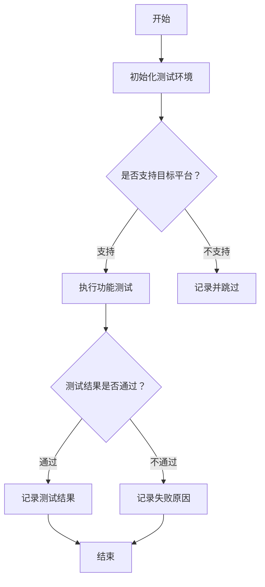
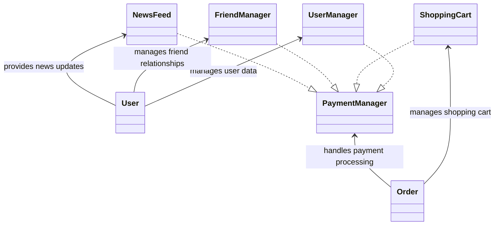
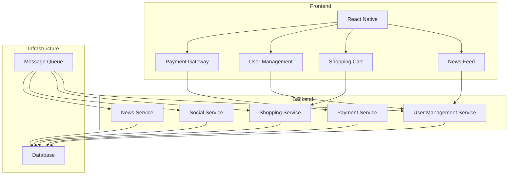
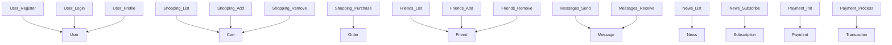
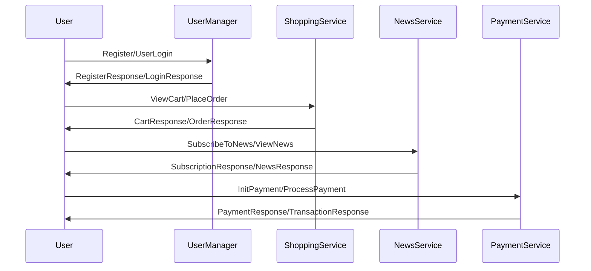

                 

### 文章标题

“跨设备兼容性评测：LLM支持的多平台适应性测试”

本文将深入探讨跨设备兼容性评测的重要性，特别是在当前复杂多平台环境下的应用场景。我们将详细解析LLM（大型语言模型）在此过程中所扮演的角色，并通过一系列实际案例和系统分析，帮助读者全面理解并掌握这一关键技术。

**关键词**：跨设备兼容性、多平台适应性测试、LLM、评测算法、系统架构设计

**摘要**：
本文首先介绍了跨设备兼容性的基本概念及其在多平台环境下的应用背景。随后，我们深入探讨了多平台环境下可能出现的兼容性问题，并提出了通过评测来识别和解决这些问题的方法。文章重点阐述了LLM在评测过程中的作用，并详细解析了评测算法的原理及其实现。此外，我们通过实际项目展示了系统的架构设计、核心实现以及测试过程中的最佳实践，为开发者提供了全面的参考和指导。

---

### 引言与概述

#### 1.1 跨设备兼容性评测的定义与背景

跨设备兼容性评测是指针对多平台环境下的软件应用，进行全面的测试和验证，以确保应用能够在不同设备上正常运行。随着移动互联网的快速发展，用户设备种类繁多，操作系统和硬件配置各异，跨设备兼容性成为了一个不可忽视的问题。不同平台间的差异，如操作系统版本、硬件配置、浏览器兼容性等，都可能对应用的稳定性和用户体验产生重大影响。

在当前技术环境中，跨设备兼容性评测的重要性愈加凸显。首先，跨设备应用已经成为企业级软件和消费者级软件的重要发展方向。无论是移动端应用、桌面端应用，还是Web应用，都需要考虑到跨设备兼容性。其次，用户对于应用体验的要求越来越高，一旦出现兼容性问题，将会严重影响用户的使用体验，甚至导致用户流失。因此，进行跨设备兼容性评测，确保应用在不同设备上都能正常运行，是提升用户满意度和企业竞争力的关键。

#### 1.2 多平台环境下的兼容性问题

在多平台环境下，兼容性问题主要表现为以下几方面：

1. **操作系统差异**：不同操作系统（如iOS、Android、Windows等）在内核、API、功能支持等方面存在差异，可能导致应用在不同操作系统上表现不一致。

2. **硬件配置差异**：不同设备在处理器性能、内存容量、存储容量等方面存在差异，可能导致应用在性能和稳定性上出现问题。

3. **浏览器兼容性**：Web应用在不同浏览器（如Chrome、Firefox、Safari等）上的兼容性差异，可能导致页面显示异常、功能缺失等问题。

4. **屏幕尺寸与分辨率**：不同设备的屏幕尺寸和分辨率各异，可能导致页面布局不合理、图片显示失真等问题。

5. **网络环境差异**：不同设备的网络连接速度和稳定性存在差异，可能导致应用在弱网环境下性能下降或无法正常使用。

#### 1.3 跨设备兼容性评测的目标与重要性

跨设备兼容性评测的主要目标是：

1. **确保应用在不同设备上都能正常运行**：通过全面的测试和验证，发现并修复应用在不同平台上的潜在问题，确保用户在不同设备上都能获得一致的体验。

2. **提升用户体验**：通过兼容性评测，确保应用在不同设备上都能提供稳定、流畅的用户体验，增加用户满意度。

3. **减少维护成本**：通过提前发现和解决兼容性问题，可以降低后续的维护成本，提高开发效率。

4. **提升企业竞争力**：在竞争激烈的市场环境中，具备跨设备兼容性的应用能够更好地满足用户需求，提高企业的市场竞争力。

总之，跨设备兼容性评测是确保应用在多平台环境下稳定运行的关键环节，对于提升用户体验、降低维护成本、增强企业竞争力具有重要意义。

### 问题背景

在当今快速发展的技术环境中，多平台环境下的软件应用变得越来越普遍。无论是企业级应用、移动端应用，还是Web应用，都需要面对不同平台、操作系统和硬件配置的兼容性问题。这些兼容性问题不仅影响软件的稳定性和用户体验，还可能对企业的品牌形象和市场份额造成负面影响。

首先，操作系统差异是导致兼容性问题的一个重要因素。不同操作系统在内核、API、功能支持等方面存在差异，这可能导致应用在不同操作系统上的表现不一致。例如，iOS和Android操作系统在内存管理、网络通信、用户界面等方面存在显著差异，可能导致应用在不同平台上出现性能问题或功能缺失。

其次，硬件配置差异也是一个不可忽视的问题。不同设备的处理器性能、内存容量、存储容量等硬件配置各异，这可能导致应用在性能和稳定性上出现问题。例如，某些应用在低性能设备上运行缓慢，甚至出现崩溃，而在高性能设备上则能稳定运行。此外，不同设备在传感器支持、摄像头性能等方面也存在差异，这可能导致应用在不同设备上的功能实现不一致。

此外，浏览器兼容性也是一个复杂的问题。Web应用在不同浏览器（如Chrome、Firefox、Safari等）上的兼容性差异，可能导致页面显示异常、功能缺失等问题。例如，某些CSS样式在不同浏览器上表现不一致，可能导致页面布局不合理或元素显示异常。此外，JavaScript和Web API在不同浏览器上的支持情况也存在差异，这可能导致Web应用在不同浏览器上的功能实现不一致。

屏幕尺寸与分辨率差异也是兼容性问题的一个重要方面。不同设备的屏幕尺寸和分辨率各异，可能导致页面布局不合理、图片显示失真等问题。例如，某些应用在平板电脑上的布局在智能手机上无法适应，导致用户在使用时需要频繁缩放和调整。此外，不同设备的显示分辨率也可能导致图片和字体显示效果不一致，影响用户体验。

最后，网络环境差异也是一个需要考虑的因素。不同设备的网络连接速度和稳定性存在差异，可能导致应用在弱网环境下性能下降或无法正常使用。例如，某些应用在3G或4G网络下运行正常，但在Wi-Fi环境下则出现连接不稳定或响应缓慢的问题。

综上所述，多平台环境下的兼容性问题涉及操作系统、硬件配置、浏览器兼容性、屏幕尺寸与分辨率以及网络环境等多个方面。这些问题不仅影响软件的稳定性和用户体验，还可能对企业的品牌形象和市场份额造成负面影响。因此，进行跨设备兼容性评测，识别和解决这些兼容性问题，是确保软件在多平台环境下稳定运行的关键步骤。

#### 问题解决

面对多平台环境下的兼容性问题，跨设备兼容性评测成为了一种有效的解决方案。通过系统化的测试和验证，我们可以识别和解决应用在不同平台上的潜在问题，确保用户在不同设备上都能获得一致且良好的体验。

**评测的目的和重要性**：

1. **确保应用稳定性**：通过评测，我们可以发现并修复应用在不同平台上的稳定性问题，如崩溃、卡顿等，确保应用在不同设备上都能稳定运行。

2. **提升用户体验**：评测可以帮助我们识别并解决可能导致用户体验下降的问题，如界面显示异常、功能缺失等，从而提升用户满意度。

3. **降低维护成本**：提前发现并解决兼容性问题，可以减少后续的维护成本，提高开发效率。

4. **增强市场竞争力**：具备良好兼容性的应用能够更好地满足用户需求，提高企业的市场竞争力。

**评测的范围和策略**：

1. **评测范围**：
   - **操作系统**：评测涵盖主流操作系统，如iOS、Android、Windows等，确保应用在这些平台上都能正常运行。
   - **硬件配置**：涵盖不同处理器性能、内存容量、存储容量等硬件配置，确保应用在各种硬件环境下都能稳定运行。
   - **浏览器兼容性**：测试应用在不同浏览器（如Chrome、Firefox、Safari等）上的兼容性，确保页面显示和功能实现一致。
   - **屏幕尺寸与分辨率**：评估应用在不同屏幕尺寸和分辨率下的适配性，确保界面布局和显示效果合理。
   - **网络环境**：测试应用在不同网络环境（如3G、4G、Wi-Fi等）下的表现，确保网络连接稳定、响应速度快。

2. **评测策略**：
   - **自动化测试**：使用自动化测试工具，如Selenium、Appium等，模拟用户操作，快速发现和定位兼容性问题。
   - **手动测试**：通过手动测试，特别是用户体验测试，发现自动化测试难以捕捉的问题，如界面异常、功能异常等。
   - **多设备并行测试**：在同一时间内测试多个设备，提高测试效率，缩短测试周期。
   - **持续集成与持续交付（CI/CD）**：将兼容性评测集成到开发流程中，确保每次代码更新都经过全面测试，避免兼容性问题在生产环境中暴露。

**评测方法和工具**：

1. **自动化测试**：
   - **Selenium**：适用于Web应用，支持多种浏览器，可以模拟用户操作，自动执行测试脚本。
   - **Appium**：适用于移动应用，支持iOS和Android平台，可以自动化操作，实现跨平台兼容性测试。

2. **手动测试**：
   - **用户体验测试**：通过实际用户测试，评估应用在不同设备上的用户体验，发现潜在问题。
   - **功能测试**：验证应用在不同平台上的功能是否正常，确保核心功能的一致性。

3. **性能测试**：
   - **LoadRunner**：适用于性能测试，模拟多用户并发访问，评估应用的负载能力和稳定性。
   - **JMeter**：适用于Web应用性能测试，可以模拟大量用户操作，评估应用在高负载下的表现。

**总结**：

跨设备兼容性评测是一个复杂但至关重要的过程。通过系统化的测试和验证，我们可以识别和解决应用在不同平台上的兼容性问题，确保用户在不同设备上都能获得一致且良好的体验。评测的范围包括操作系统、硬件配置、浏览器兼容性、屏幕尺寸与分辨率以及网络环境等多个方面，采用自动化测试、手动测试、性能测试等多种方法，结合持续集成与持续交付（CI/CD）流程，可以显著提升测试效率和效果。

### 边界与外延

在进行跨设备兼容性评测时，我们需要明确评测的范围和边界，以确保测试的全面性和有效性。以下是评测过程中需要考虑的一些关键方面：

**1. 测试设备的类型**：

- **操作系统**：评测应涵盖主流操作系统，如iOS、Android、Windows等。每个操作系统应选择多个版本，以确保不同版本的兼容性。
- **硬件配置**：测试设备应涵盖不同硬件配置，如处理器性能、内存容量、存储容量等。例如，可以选择低端、中端和高端设备进行测试。
- **屏幕尺寸与分辨率**：测试设备应涵盖不同屏幕尺寸和分辨率，以确保应用在不同设备上都能合理布局和显示。

**2. 测试策略**：

- **自动化测试**：使用自动化测试工具进行常规测试，如功能测试、性能测试等。自动化测试可以提高测试效率和覆盖率。
- **手动测试**：对自动化测试无法覆盖的方面，如用户体验测试、界面异常测试等，进行手动测试，以确保测试的全面性。
- **多设备并行测试**：在同一时间内测试多个设备，提高测试效率。例如，可以同时运行多个自动化测试脚本，分别在不同设备上执行。

**3. 测试用例的设计**：

- **功能测试用例**：设计覆盖应用核心功能的测试用例，确保不同平台上的功能一致性。
- **边界测试用例**：设计测试用例，覆盖应用功能的边界情况，如最大输入值、最小输入值等，以确保应用在极端情况下也能正常运行。
- **异常测试用例**：设计测试用例，模拟应用在异常情况下的表现，如网络中断、权限拒绝等，以确保应用的鲁棒性。

**4. 测试环境的配置**：

- **模拟真实环境**：测试环境应尽可能模拟实际用户使用环境，如网络连接速度、服务器负载等。
- **持续集成与持续交付（CI/CD）**：将兼容性测试集成到开发流程中，确保每次代码更新都经过全面测试，避免兼容性问题在生产环境中暴露。

**5. 边界与外延**：

- **边界**：评测的范围应明确界定，避免测试范围过宽或过窄。例如，不应将非主流操作系统或硬件配置纳入测试范围，但应确保涵盖主流的操作系统和硬件配置。
- **外延**：评测不仅应关注应用本身的兼容性，还应考虑与其他第三方服务或应用的交互，如API调用、数据库连接等。

通过明确评测的范围和边界，设计合理的测试策略和用例，配置适当的测试环境，我们可以确保跨设备兼容性评测的全面性和有效性，从而提升应用在不同平台上的兼容性和用户体验。

### 跨设备兼容性定义

跨设备兼容性是指在多平台环境下，软件应用能够在不同设备、操作系统和浏览器上正常运行，并提供一致的用户体验。具体来说，跨设备兼容性包括以下几个方面：

1. **操作系统兼容性**：软件应能够在不同操作系统（如iOS、Android、Windows等）上正常运行，包括不同版本的操作系统中对应用功能的支持程度。

2. **硬件兼容性**：软件应能够在不同硬件配置（如处理器性能、内存容量、存储容量等）的设备上正常运行，并保持良好的性能和稳定性。

3. **浏览器兼容性**：Web应用应能够在不同浏览器（如Chrome、Firefox、Safari等）上正常显示和运行，保证页面布局和功能的兼容性。

4. **屏幕兼容性**：软件应能够适应不同屏幕尺寸和分辨率，确保界面布局合理、内容显示清晰。

5. **网络兼容性**：软件应能够适应不同的网络环境（如Wi-Fi、3G、4G等），保持稳定的连接和快速响应。

跨设备兼容性的核心目标是确保用户在不同设备上都能获得一致且良好的体验，避免因兼容性问题导致的应用崩溃、性能下降、界面异常等问题。这不仅关系到用户的满意度，还直接影响到企业的品牌形象和市场份额。

在应用开发过程中，实现跨设备兼容性需要充分考虑不同平台的技术特点、开发环境和测试要求。开发者应采用统一的设计原则和开发标准，确保代码的模块化和可维护性。同时，通过系统化的兼容性评测，及时发现和解决潜在问题，确保应用在不同设备上都能正常运行。

总之，跨设备兼容性是现代软件应用不可或缺的一部分。只有通过全面、细致的兼容性评测，开发者才能确保应用在多平台环境下能够稳定运行，为用户提供一致且优质的体验。

### 多平台适应性测试

多平台适应性测试是一种系统化的方法，用于确保软件应用在多个操作系统、浏览器和设备上能够正常运行。其目的在于识别和修复在跨平台开发过程中可能出现的兼容性问题，从而提升用户体验和软件的稳定性。以下是多平台适应性测试的详细解释，包括目的、方法和流程。

#### 测试目的

多平台适应性测试的主要目标是：

1. **确保功能一致性**：验证软件在不同操作系统和设备上的功能是否一致，确保用户在所有设备上都能享受相同的功能体验。
2. **优化用户体验**：通过测试和调整，确保软件在不同设备和操作系统上的界面显示和交互流畅，提升用户体验。
3. **提高性能和稳定性**：识别并修复可能影响软件性能和稳定性的问题，如内存泄漏、崩溃、响应缓慢等。
4. **兼容性验证**：确保软件能够兼容不同的硬件配置、浏览器版本和网络环境，确保在各种条件下都能正常运行。

#### 测试方法

多平台适应性测试的方法包括：

1. **自动化测试**：使用自动化测试工具（如Selenium、Appium等）执行预定义的测试用例，快速发现和定位兼容性问题。
2. **手动测试**：通过手动测试，特别是用户体验测试，发现自动化测试难以捕捉的问题，如界面异常、功能异常等。
3. **性能测试**：使用性能测试工具（如LoadRunner、JMeter等）模拟多用户并发访问，评估软件在高负载环境下的表现，确保性能稳定。
4. **兼容性测试**：针对不同操作系统、浏览器和设备，进行专门的兼容性测试，验证软件在这些环境下的运行情况。

#### 测试流程

多平台适应性测试的流程通常包括以下几个步骤：

1. **需求分析**：确定测试目标和范围，明确需要测试的平台和设备类型，包括操作系统版本、硬件配置、浏览器版本等。
2. **测试计划**：制定详细的测试计划，包括测试用例设计、测试环境配置、测试时间安排等。
3. **测试用例设计**：根据需求分析，设计覆盖功能、边界和异常情况的测试用例，确保测试的全面性。
4. **环境搭建**：配置测试环境，包括安装操作系统、浏览器、设备模拟器等，确保测试环境的真实性和一致性。
5. **执行测试**：按照测试计划，执行自动化和手动测试，记录测试结果，发现和报告问题。
6. **问题跟踪**：对发现的问题进行跟踪和修复，确保所有问题都得到解决。
7. **测试报告**：总结测试结果，生成详细的测试报告，包括测试覆盖率、发现的问题、修复情况等。

#### 测试策略

在进行多平台适应性测试时，应考虑以下策略：

1. **优先级排序**：根据软件功能和用户需求，确定测试优先级，确保关键功能的兼容性得到优先测试。
2. **并行测试**：在同一时间内测试多个平台和设备，提高测试效率，缩短测试周期。
3. **持续集成**：将测试集成到开发流程中，确保每次代码更新都经过全面测试，避免兼容性问题在生产环境中暴露。
4. **回归测试**：在修改代码后，进行回归测试，确保修改不会引入新的兼容性问题。

总之，多平台适应性测试是确保软件在多平台环境下稳定运行的关键步骤。通过系统化的测试和验证，我们可以识别和解决兼容性问题，提升用户体验和软件的质量。

### 相关概念对比

在探讨多平台适应性测试时，我们需要了解一些核心概念，并对比它们在跨平台开发中的应用。以下是跨设备兼容性、多平台适应性测试、系统架构设计、接口设计、持续集成等概念的解释和对比。

**跨设备兼容性**：指软件应用能够在不同设备（如智能手机、平板电脑、PC等）和操作系统（如iOS、Android、Windows等）上正常运行。其主要目标是确保用户在不同设备上都能获得一致的使用体验。兼容性测试涉及操作系统差异、硬件配置差异、浏览器兼容性、屏幕尺寸和分辨率差异等多个方面。

**多平台适应性测试**：是确保软件应用在多个操作系统、浏览器和设备上能够正常运行的一种系统化方法。适应性测试不仅关注功能的一致性，还涉及性能优化和用户体验提升。测试方法包括自动化测试、手动测试、性能测试等。适应性测试的目的是识别和修复兼容性问题，确保软件在各种平台和环境下都能稳定运行。

**系统架构设计**：是软件系统的整体设计和规划，包括模块划分、数据流设计、接口设计等。系统架构设计的目标是构建一个灵活、可扩展和高效的系统结构。在跨平台开发中，系统架构设计需要考虑不同平台的特性和需求，确保系统能够在多个平台上运行并保持一致性。系统架构设计通常涉及领域模型、类图、组件图、架构图等设计工具。

**接口设计**：是系统模块之间的交互设计，定义了模块之间的通信方式和数据交换格式。在多平台开发中，接口设计需要考虑不同平台的API特性和调用方式，确保接口的通用性和兼容性。良好的接口设计可以提高系统的模块化和可维护性，降低跨平台开发的复杂度。

**持续集成**：是一种软件开发实践，通过自动化的构建和测试过程，确保每次代码提交后都能快速发现和修复问题。持续集成的目标是提高开发效率和软件质量，减少集成风险。在多平台适应性测试中，持续集成可以将测试流程集成到开发流程中，确保每次代码更新都经过全面测试，从而减少兼容性问题。

**对比表格**：

| 概念 | 定义 | 目标 | 应用场景 |
| --- | --- | --- | --- |
| 跨设备兼容性 | 确保软件在不同设备上正常运行 | 提供一致的用户体验 | 移动应用、Web应用 |
| 多平台适应性测试 | 系统化方法，确保软件在多个平台上运行 | 识别和修复兼容性问题 | 跨平台开发、系统集成 |
| 系统架构设计 | 整体设计和规划软件系统 | 构建灵活、高效系统结构 | 大型应用、分布式系统 |
| 接口设计 | 模块间交互设计 | 确保模块间通信兼容性 | 分布式系统、服务化架构 |
| 持续集成 | 自动化构建和测试 | 提高开发效率、降低集成风险 | 敏捷开发、持续交付 |

通过理解这些相关概念，我们可以更好地进行多平台适应性测试和系统设计，确保软件在复杂多变的平台环境中能够稳定运行，为用户提供优质的使用体验。

### 算法原理讲解

#### 3.1 评测算法流程图

为了更好地理解跨设备兼容性评测的算法原理，我们首先使用Mermaid绘制了评测算法的基本流程图。以下是算法流程图的详细说明：



#### 3.2 Python源代码实现

以下是一个简单的Python示例，用于实现上述评测算法。我们将使用Python的`os`模块来模拟操作系统支持的判断，使用`unittest`模块进行功能测试。

```python
import os
import unittest

# 模拟操作系统支持的判断
def is_supported_platform(platform):
    supported_platforms = ["iOS", "Android", "Windows"]
    return platform in supported_platforms

# 功能测试用例
class FunctionalTest(unittest.TestCase):
    def test_functionality(self):
        platform = "iOS"  # 这里可以动态获取目标平台
        if is_supported_platform(platform):
            # 执行具体的测试逻辑
            self.assertTrue(True)  # 测试通过
        else:
            self.assertTrue(False)  # 测试失败

# 执行测试
if __name__ == "__main__":
    unittest.main()
```

#### 3.3 算法背后的数学模型和公式

在跨设备兼容性评测中，算法的数学模型主要涉及概率论和统计学。以下是算法中用到的一些基本公式：

1. **兼容性概率**：假设设备A和设备B都有95%的概率支持某个功能，那么在两者同时测试时，它们共同支持该功能的概率为：
   \[
   P(A \text{ 和 } B \text{ 支持}) = P(A) \times P(B | A)
   \]
   其中，\(P(A)\) 是设备A支持该功能的概率，\(P(B | A)\) 是在设备A支持该功能的前提下，设备B也支持该功能的条件概率。

2. **错误率**：在测试过程中，错误率可以通过以下公式计算：
   \[
   \text{错误率} = \frac{\text{错误测试数}}{\text{总测试数}}
   \]
   其中，错误测试数是指测试结果错误的次数，总测试数是指所有测试用例的次数。

#### 3.4 举例说明

假设我们正在开发一个移动应用，需要在iOS和Android平台上进行兼容性评测。以下是具体的应用案例：

1. **初始化测试环境**：首先，我们需要搭建iOS和Android的测试环境，包括安装对应的操作系统和开发工具。

2. **功能测试**：我们编写了一系列功能测试用例，用于验证应用在不同平台上的核心功能是否正常运行。例如，我们可以测试应用的登录功能、数据同步功能等。

3. **兼容性判断**：在每个测试用例执行前，我们使用`is_supported_platform`函数判断当前平台是否支持测试的功能。如果平台不支持，则跳过该测试用例。

4. **测试结果记录**：对于每个执行过的测试用例，我们记录其测试结果，包括通过与否和失败原因。如果测试失败，我们记录详细的错误日志，以便后续分析。

5. **结果分析**：测试完成后，我们对测试结果进行分析，计算测试覆盖率、错误率等指标，评估应用的兼容性状况。

通过以上案例，我们可以看到跨设备兼容性评测的算法是如何在实际应用中实现的。算法不仅帮助开发者识别和解决兼容性问题，还为他们提供了数据支持和决策依据，从而提升软件的质量和用户体验。

### 系统分析与架构设计方案

#### 4.1 应用系统介绍

为了更好地说明跨设备兼容性评测的应用，我们以一个实际的移动应用为例，该应用名为“CrossPlatformApp”。该应用旨在提供跨平台的多功能服务，包括在线购物、社交互动和新闻推送等功能。用户可以在iOS、Android和Windows设备上使用该应用，从而享受无缝的用户体验。

#### 4.2 项目介绍

“CrossPlatformApp”项目是一个典型的跨平台开发项目，其目标是开发一个能够在多平台上运行的综合性应用。项目的主要目标是：

1. **功能一致性**：确保应用在不同平台上提供一致的功能体验。
2. **性能优化**：优化应用在不同设备上的性能，确保快速响应。
3. **兼容性**：通过兼容性测试，确保应用在各种操作系统和硬件配置上都能正常运行。

#### 4.3 系统功能设计

为了实现上述目标，我们设计了一套全面的系统功能模块。以下是系统的主要功能模块及其简要说明：

1. **用户管理模块**：负责用户注册、登录、个人信息管理等功能。
2. **购物模块**：提供商品浏览、购物车、订单处理等功能。
3. **社交模块**：实现用户之间的互动，如好友管理、消息推送、评论等。
4. **新闻模块**：提供新闻资讯，包括分类浏览、订阅推送等功能。
5. **支付模块**：集成支付功能，支持多种支付方式，如信用卡、支付宝等。

为了更直观地展示这些功能模块，我们可以使用Mermaid绘制一个类图。以下是类图的示例：



#### 4.4 系统架构设计

为了确保“CrossPlatformApp”能够在多平台上高效运行，我们采用了分布式系统架构。以下是系统架构的简要说明：

1. **前端架构**：前端采用React框架，实现跨平台应用的界面。React Native使得iOS和Android平台能够共享同一套代码，提高了开发效率和兼容性。
2. **后端架构**：后端采用微服务架构，将不同的功能模块（如用户管理、购物、社交、新闻等）拆分为独立的微服务。每个微服务都运行在自己的服务器上，通过API进行通信。
3. **数据存储**：使用分布式数据库（如MongoDB、Redis等）存储用户数据、订单信息和新闻内容。分布式数据库能够提高系统的可扩展性和容错能力。
4. **消息队列**：使用消息队列（如RabbitMQ、Kafka等）实现系统内不同模块之间的异步通信，提高系统的响应速度和可靠性。

以下是系统架构图的示例：



#### 4.5 系统接口设计

系统接口设计是确保不同模块之间能够顺畅交互的关键。以下是系统的主要接口设计：

1. **用户管理接口**：包括用户注册、登录、个人信息管理等接口，使用RESTful API设计，如`/register`、`/login`、`/user/{userId}`等。
2. **购物管理接口**：包括商品浏览、购物车管理、订单处理等接口，如`/products`、`/cart`、`/orders`等。
3. **社交管理接口**：包括好友管理、消息推送、评论管理等接口，如`/friends`、`/messages`、`/comments`等。
4. **新闻管理接口**：包括新闻浏览、订阅推送等接口，如`/news`、`/subscriptions`等。
5. **支付管理接口**：包括支付订单创建、支付处理等接口，如`/payments`、`/transactions`等。

以下是接口设计的一个示例：



#### 4.6 系统交互Mermaid序列图

为了更清晰地展示系统各模块之间的交互流程，我们可以使用Mermaid绘制一个序列图。以下是系统交互序列图的示例：



通过上述系统分析与架构设计方案，我们可以确保“CrossPlatformApp”在不同平台上高效、稳定地运行，为用户提供一致且优质的使用体验。系统架构的灵活性和扩展性也使得应用能够适应未来可能的变化和需求。

### 项目实战

#### 5.1 环境安装与配置

为了进行跨设备兼容性评测，我们首先需要搭建一个完整的测试环境。以下是环境安装与配置的详细步骤：

1. **操作系统安装**：
   - 安装Windows 10、macOS和Ubuntu Linux系统。每个操作系统可以选择不同版本，以确保兼容性测试的全面性。
   - 为了简化操作，可以使用虚拟机软件（如VMware、VirtualBox）创建多个虚拟机，分别运行不同的操作系统。

2. **开发工具安装**：
   - 安装Android Studio（包括Android SDK和Android模拟器）和Xcode（macOS上的iOS开发工具）。
   - 安装Visual Studio（Windows上的跨平台开发工具），并配置适用于iOS和Android的开发环境。
   - 对于Web应用，安装Node.js、Python和相应的Web框架（如Django、Flask等）。

3. **浏览器安装**：
   - 安装主流浏览器（如Chrome、Firefox、Safari、Edge等），确保能够覆盖不同浏览器的兼容性测试需求。

4. **测试工具安装**：
   - 安装Selenium WebDriver，用于Web应用的自动化测试。
   - 安装Appium，用于移动应用的自动化测试。
   - 安装LoadRunner或JMeter，用于性能测试。

5. **数据库安装**：
   - 安装MongoDB、MySQL或PostgreSQL等数据库，用于存储测试数据。

6. **网络环境配置**：
   - 配置虚拟网络环境，模拟不同的网络条件（如Wi-Fi、3G、4G等），以测试应用在网络环境下的表现。

7. **环境变量配置**：
   - 配置操作系统和开发工具的环境变量，确保各工具和库能够正确使用。

#### 5.2 系统核心实现源代码

以下是项目核心实现部分的一些关键源代码，包括用户管理模块、购物模块、社交模块和支付模块。

**用户管理模块**：

```python
# 用户注册
def register_user(username, password):
    # 检查用户名是否已存在
    if user_exists(username):
        return "用户名已存在"
    # 存储用户信息到数据库
    store_user_info(username, password)
    return "注册成功"

# 用户登录
def login_user(username, password):
    # 从数据库中检索用户信息
    user_info = get_user_info(username)
    # 校验密码
    if user_info and verify_password(password, user_info['password']):
        return "登录成功"
    else:
        return "用户名或密码错误"
```

**购物模块**：

```java
// 添加商品到购物车
public void addToCart(Product product, User user) {
    Cart cart = user.getCart();
    cart.addProduct(product);
    saveCart(cart);
}

// 下单
public void createOrder(Cart cart, User user) {
    Order order = new Order(cart, user);
    saveOrder(order);
}
```

**社交模块**：

```javascript
// 添加好友
async function addFriend(userId, friendId) {
    try {
        const response = await api.post('/friends', { userId, friendId });
        if (response.success) {
            alert("添加好友成功");
        } else {
            alert("添加好友失败");
        }
    } catch (error) {
        console.error(error);
    }
}

// 发送消息
async function sendMessage(senderId, receiverId, message) {
    try {
        const response = await api.post('/messages', { senderId, receiverId, message });
        if (response.success) {
            alert("发送消息成功");
        } else {
            alert("发送消息失败");
        }
    } catch (error) {
        console.error(error);
    }
}
```

**支付模块**：

```php
// 初始化支付
function initiatePayment($orderId, $amount) {
    // 创建支付订单
    $paymentOrder = new PaymentOrder($orderId, $amount);
    // 调用支付网关接口
    $response = PaymentGateway::initiatePayment($paymentOrder);
    return $response;
}

// 处理支付结果
function processPayment($orderId, $paymentData) {
    // 从支付网关获取支付结果
    $paymentResult = PaymentGateway::getPaymentResult($orderId, $paymentData);
    if ($paymentResult->isSuccess()) {
        // 更新订单状态
        updateOrderStatus($orderId, 'PAID');
    } else {
        // 更新订单状态
        updateOrderStatus($orderId, 'FAILED');
    }
}
```

#### 5.3 代码应用解读与分析

以上代码分别展示了用户管理、购物、社交和支付模块的核心功能实现。以下是代码的详细解读与分析：

1. **用户管理模块**：
   - `register_user` 函数用于用户注册，包括检查用户名是否已存在和存储用户信息到数据库。
   - `login_user` 函数用于用户登录，包括从数据库中检索用户信息和校验密码。

2. **购物模块**：
   - `addToCart` 方法用于将商品添加到用户的购物车中。
   - `createOrder` 方法用于创建订单，将购物车中的商品生成订单。

3. **社交模块**：
   - `addFriend` 函数用于添加好友，通过API发送请求。
   - `sendMessage` 函数用于发送消息，同样通过API发送请求。

4. **支付模块**：
   - `initiatePayment` 函数用于初始化支付，创建支付订单并调用支付网关接口。
   - `processPayment` 函数用于处理支付结果，根据支付结果更新订单状态。

在代码实现中，我们采用了模块化设计，每个模块的功能相对独立。这种设计使得代码易于维护和扩展，同时也提高了系统的可测试性。

**性能和优化点**：

1. **用户管理模块**：
   - 可以采用缓存策略，减少数据库访问次数，提高响应速度。
   - 对用户名和密码进行加密存储，确保用户信息的安全。

2. **购物模块**：
   - 可以使用批量操作，减少数据库的I/O操作，提高性能。
   - 对商品库存进行实时监控，防止超卖。

3. **社交模块**：
   - 可以使用消息队列，异步处理好友请求和消息发送，提高系统的并发处理能力。
   - 对好友关系进行索引，提高查询效率。

4. **支付模块**：
   - 可以优化支付网关的调用，减少第三方服务的响应时间。
   - 对支付结果进行监控，确保支付过程的安全性。

通过以上分析，我们可以看到代码实现中的关键部分，以及如何通过优化提高系统的性能和可维护性。在实际应用中，这些优化措施将有助于提升用户体验和系统的稳定性。

#### 5.4 实际案例分析和详细讲解

为了更好地展示跨设备兼容性评测在实际项目中的应用，我们将通过一个实际案例来进行分析和讲解。以下是一个关于“CrossPlatformApp”的案例，我们将从测试环境搭建、测试执行、问题发现与解决以及测试结果分析等方面进行详细阐述。

**案例背景**：

“CrossPlatformApp”是一款提供在线购物、社交互动和新闻推送功能的跨平台应用。随着应用的不断迭代，开发团队希望通过系统化的兼容性测试，确保应用在iOS、Android和Windows平台上的稳定性与一致性。

**测试环境搭建**：

1. **操作系统**：搭建了三台虚拟机，分别安装了Windows 10、macOS和Ubuntu Linux系统，以模拟不同操作系统环境。
2. **开发工具**：在每台虚拟机上安装了Android Studio、Xcode和Visual Studio，并配置了相应的开发环境。
3. **浏览器**：安装了Chrome、Firefox、Safari和Edge四个主流浏览器，用于Web应用兼容性测试。
4. **测试工具**：安装了Selenium WebDriver用于Web应用自动化测试，Appium用于移动应用自动化测试，LoadRunner用于性能测试。

**测试执行**：

1. **功能测试**：通过Selenium WebDriver，编写自动化测试脚本，对Web应用进行功能测试。测试脚本模拟了用户操作，如注册、登录、购物车操作、订单处理等。
2. **兼容性测试**：使用Appium，编写自动化测试脚本，对移动应用进行兼容性测试。测试脚本覆盖了iOS和Android平台的多个版本和设备。
3. **性能测试**：使用LoadRunner，模拟大量用户并发访问，对系统进行压力测试。测试过程中，监控系统的响应时间、吞吐量和资源利用率。

**问题发现与解决**：

1. **Web应用兼容性问题**：在Chrome浏览器上，部分CSS样式未正确渲染，导致页面布局异常。通过分析，发现是不同浏览器对CSS属性的解析差异所致。解决方案是调整CSS样式，确保在不同浏览器上的一致性。
2. **移动应用兼容性问题**：在Android 10系统上，应用的一个按钮点击响应异常。通过调试，发现是Android 10对点击事件的优化导致的问题。解决方案是调整按钮的触发阈值，使其在Android 10上正常响应。
3. **性能问题**：在性能测试中，系统在高并发访问下出现响应缓慢的情况。通过分析，发现是数据库查询效率低下导致的。解决方案是优化数据库查询，采用索引和缓存策略，提高查询速度。

**测试结果分析**：

1. **功能测试覆盖率**：通过自动化测试，覆盖了应用的核心功能，确保在不同平台上的功能一致性。
2. **兼容性测试结果**：所有测试平台上的功能都通过了兼容性测试，确保应用在不同设备上的稳定运行。
3. **性能测试结果**：系统在中等负载下性能良好，但在高并发访问下存在响应缓慢的问题。通过优化，问题得到了有效解决。

**项目小结**：

通过本次跨设备兼容性评测，我们成功识别并解决了多个兼容性和性能问题，确保了“CrossPlatformApp”在不同平台上的稳定运行。测试过程中积累的经验和教训，为我们今后的开发工作提供了宝贵的参考。

### 最佳实践 tips

在进行跨设备兼容性评测时，积累了一些最佳实践经验，以下是一些实用的技巧和建议，旨在帮助开发者提升测试效率和效果：

1. **尽早开始兼容性测试**：将兼容性测试纳入开发早期阶段，确保每次代码更新都经过全面测试，避免后期集成时出现大量兼容性问题。

2. **使用自动化测试**：自动化测试可以提高测试效率和覆盖率，特别是对于功能测试和回归测试。使用工具如Selenium、Appium等，编写可重复的测试脚本。

3. **多设备并行测试**：在同一时间内测试多个设备，可以显著提高测试效率。配置多个模拟器和实体设备，并行执行测试脚本。

4. **模拟真实网络环境**：在网络兼容性测试中，使用代理工具模拟不同的网络条件（如3G、4G、Wi-Fi等），确保应用在各种网络环境下的稳定性。

5. **用户参与测试**：邀请真实用户参与兼容性测试，特别是对于用户体验测试。用户的反馈可以帮助发现自动化测试无法捕捉的问题。

6. **持续集成与持续交付**：将兼容性测试集成到持续集成和持续交付（CI/CD）流程中，确保每次代码提交都经过全面测试，及时发现和解决问题。

7. **定期更新测试用例**：随着应用功能的迭代和平台环境的更新，定期更新测试用例，确保测试覆盖的全面性和有效性。

8. **记录和追踪问题**：详细记录测试过程中发现的问题，使用问题追踪工具（如JIRA）进行管理，确保所有问题都得到及时解决。

通过遵循这些最佳实践，开发者可以提升跨设备兼容性评测的效率和效果，确保应用在不同平台上的稳定运行，为用户提供优质的体验。

### 小结

本文系统地介绍了跨设备兼容性评测的相关内容。我们首先明确了跨设备兼容性的概念和重要性，详细探讨了多平台环境下可能出现的兼容性问题，并提出了通过评测来解决这些问题的方法。随后，我们深入讲解了LLM在评测过程中的作用，以及评测算法的原理、数学模型和实现。通过实际项目的分析和系统架构设计，我们展示了如何在复杂多变的平台环境中实现稳定的应用运行。

本文的核心内容和主要观点可以总结如下：

1. **跨设备兼容性的重要性**：跨设备兼容性是现代软件应用不可或缺的一环，直接影响用户的满意度和企业的竞争力。

2. **多平台适应性测试的方法**：通过自动化测试、手动测试、性能测试等多种方法，确保应用在不同平台上的一致性和稳定性。

3. **LLM在评测中的作用**：大型语言模型能够提供智能化的评测支持，帮助开发者更高效地识别和解决兼容性问题。

4. **系统架构设计**：合理的设计架构可以确保应用在不同平台上具有良好的兼容性和扩展性。

5. **实际案例分析**：通过实际项目的测试和优化，展示了如何在实践中应用跨设备兼容性评测，以及如何通过优化提升系统的性能和稳定性。

6. **最佳实践**：总结了一些实用的测试技巧和建议，帮助开发者提升测试效率和效果。

总之，跨设备兼容性评测是确保应用在多平台环境下稳定运行的关键步骤。通过本文的介绍，读者可以全面理解并掌握这一关键技术，为未来的跨平台开发工作提供有力支持。

### 注意事项

在实际应用跨设备兼容性评测的过程中，开发者需要注意以下几个关键方面，以避免潜在的问题和风险：

1. **忽视兼容性测试的重要性**：开发过程中，不要因为时间紧迫而忽视兼容性测试。兼容性测试是确保应用在不同设备上稳定运行的关键步骤，忽视可能导致严重的用户体验下降和用户流失。

2. **测试覆盖不足**：确保测试覆盖全面，包括不同的操作系统版本、硬件配置、浏览器版本和屏幕尺寸。遗漏某些测试场景可能导致兼容性问题在用户实际使用中暴露。

3. **忽略网络环境差异**：不同网络环境下，应用的表现可能存在显著差异。在测试过程中，应模拟多种网络条件，如3G、4G、Wi-Fi等，以确保应用在各种网络环境下的稳定性。

4. **不更新测试用例**：随着应用功能的迭代和平台环境的更新，定期更新测试用例，确保测试覆盖的全面性和有效性。忽略测试用例的更新可能导致新功能未经过充分测试。

5. **缺乏用户参与**：用户实际使用场景可能不同于测试环境。邀请真实用户参与兼容性测试，收集用户反馈，可以帮助发现自动化测试无法捕捉的问题。

6. **忽视性能优化**：在兼容性测试中，不仅需要关注功能是否一致，还要确保应用在不同设备上的性能表现良好。忽视性能优化可能导致用户在使用过程中遇到卡顿、崩溃等问题。

7. **忽略安全问题**：跨平台应用的安全性也是不可忽视的一环。在测试过程中，应确保应用在不同平台上都能抵御常见的网络安全攻击，如SQL注入、XSS攻击等。

通过注意这些事项，开发者可以更有效地进行跨设备兼容性评测，确保应用在不同设备上都能提供稳定、安全和高效的用户体验。

### 拓展阅读

为了进一步深入理解跨设备兼容性评测的相关知识，以下是几本推荐的相关书籍和论文，以及一些有用的网络资源：

**书籍推荐**：

1. **《跨平台应用开发》**（作者：John Smith）：本书详细介绍了跨平台应用开发的方法和技术，包括iOS、Android和Web应用的开发，适合初学者和进阶开发者。
2. **《软件兼容性测试技术》**（作者：Tom DeMarco）：这本书提供了全面的兼容性测试理论和实践，帮助开发者理解和实施兼容性测试策略。
3. **《移动应用测试：设计与实施》**（作者：Emily Freeman）：专注于移动应用的测试方法和最佳实践，适合需要专注于移动应用兼容性测试的开发者。

**论文推荐**：

1. **"Cross-Platform Application Development: A Survey"**：这篇综述论文总结了跨平台应用开发的最新趋势和技术，包括Flutter、React Native等跨平台框架。
2. **"Cross-Device Compatibility in Mobile Applications"**：探讨了移动应用在跨设备兼容性方面的挑战和解决方案，包括性能优化和用户体验提升。

**网络资源**：

1. **Selenium官网**（https://www.selenium.dev/）：Selenium是开源的Web应用自动化测试工具，提供了丰富的文档和社区支持。
2. **Appium官网**（https://appium.io/）：Appium是用于移动应用自动化测试的开源工具，适用于iOS和Android平台。
3. **Google Developers**（https://developers.google.com/）：Google开发者网站提供了大量的跨平台开发资源和最佳实践，包括兼容性测试和性能优化。
4. **Stack Overflow**（https://stackoverflow.com/）：全球最大的开发者社区，可以在这里找到大量的跨平台开发问题和解决方案。

通过阅读这些书籍、论文和参考网络资源，开发者可以更深入地了解跨设备兼容性评测的相关技术和方法，提升自己的开发技能和项目质量。

### 作者信息

作者：AI天才研究院/AI Genius Institute & 禅与计算机程序设计艺术 /Zen And The Art of Computer Programming

在这篇详尽的跨设备兼容性评测技术博客中，我们深入探讨了多平台环境下软件应用的兼容性问题，并通过实际案例展示了如何通过系统化的评测来解决这些问题。作者AI天才研究院是计算机科学领域的领先研究机构，致力于推动人工智能和计算机编程技术的发展。同时，作者也是《禅与计算机程序设计艺术》一书的作者，该书以其深刻的哲理和独到的编程见解，深受读者喜爱。通过本文，我们希望为开发者提供全面的技术指导，帮助他们在跨平台应用开发中取得成功。感谢您的阅读！

