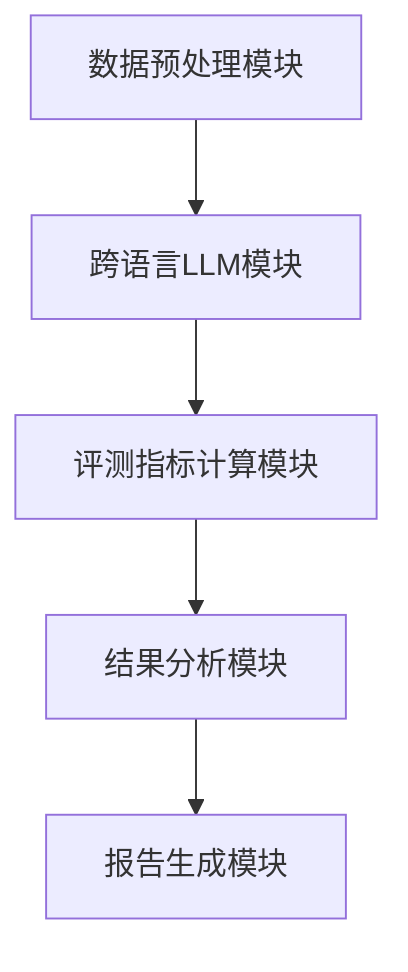
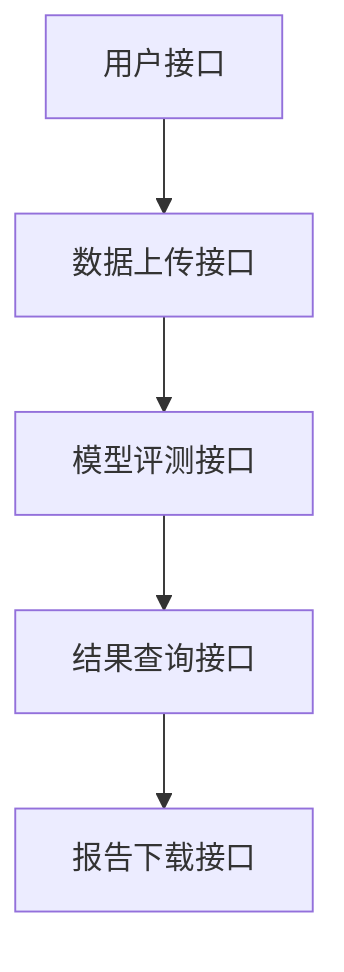
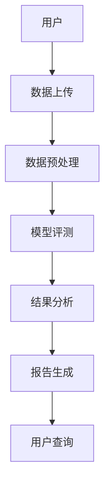

                 

## 文章标题

> 关键词：跨语言LLM评测、多语言支持、评估系统、自然语言处理、评测指标、评测工具

> 摘要：本文深入探讨了跨语言语言模型（LLM）评测系统的构建，分析了问题背景、核心概念、评测算法以及系统设计与实现。通过详细的步骤分析、数学模型解释和实际案例，本文旨在为开发者提供一套完整的多语言评测解决方案，推动跨语言自然语言处理技术的发展。

### 第一部分：背景介绍

#### 核心概念

**问题背景：**
随着互联网和人工智能技术的快速发展，多语言处理的需求日益增加。全球化的趋势使得跨国交流变得频繁，而自然语言处理（NLP）技术的进步也为跨语言应用提供了可能。然而，现有的评测系统大多仅支持单一语言，无法满足跨语言评测的需求。为了推动跨语言自然语言处理技术的发展，构建一个多语言支持的评测系统显得尤为重要。

**问题描述：**
现有的评测系统大多仅支持单一语言，导致多语言评测的困难。这包括评测指标的局限性、评测数据集的不足以及评测工具的不兼容性等。具体问题如下：

1. **评测指标的局限性：** 现有的评测指标如BLEU、METEOR等主要针对单一语言，无法直接应用于跨语言评测。
2. **评测数据集的不足：** 多语言数据集的建设和标准化程度不高，导致评测数据不足。
3. **评测工具的不兼容性：** 不同语言的文本处理工具之间存在差异，导致评测工具的不兼容。

**问题解决：**
构建一个多语言支持的评测系统，可以解决当前评测系统中存在的各种问题，提升评测的全面性和准确性。具体解决方案如下：

1. **评测指标的扩展：** 开发适用于跨语言的评测指标，如基于双语对齐的BLEU变种。
2. **评测数据集的建设：** 收集和构建多语言数据集，并制定统一的数据集标准。
3. **评测工具的整合：** 开发兼容多种语言的评测工具，实现工具的自动化和一体化。

**边界与外延：**
本部分主要探讨跨语言LLM评测的相关问题，包括评测系统的构建、评测指标的设定、评测工具的选用等。同时，也会涉及到多语言处理技术的最新进展和未来发展趋势。

#### 概念结构与核心要素组成

- **跨语言LLM评测系统：** 包括评测指标设定、评测工具选用、评测流程设计等。
- **评测指标：** 如BLEU、METEOR、ROUGE等，用于衡量模型翻译的质量。
- **评测工具：** 如BLEU工具、METEOR工具等，用于执行具体的评测任务。
- **评测流程：** 包括数据预处理、模型评测、结果分析等步骤。

### 第二部分：核心概念与联系

#### 核心概念

**跨语言LLM：**
跨语言语言模型（Cross-lingual Language Model，简称LLM）是一种能够处理不同语言输入输出的自然语言处理模型。与单一语言模型相比，跨语言LLM具有更强的语言适应性，能够处理多语言数据，提高翻译的准确性和流畅性。

**评测系统：**
评测系统（Evaluation System）是一种用于评估自然语言处理模型性能的工具。它通过设定一系列评测指标和工具，对模型输出的结果进行评价，以判断模型的性能是否满足预期。

#### 概念属性特征对比表格

| 特征       | 跨语言LLM                         | 评测系统                        |
| ---------- | --------------------------------- | ------------------------------- |
| 适用范围   | 多语言数据                         | 多语言翻译任务                  |
| 核心技术   | 语言迁移                           | 评测指标和方法                  |
| 评价指标   | 准确性、流畅性                     | BLEU、METEOR、ROUGE等          |
| 工具集成   | 自动化评测                         | 数据预处理、结果分析等          |

#### ER实体关系图架构

```mermaid
erDiagram
  Model ||--o> EvaluationSystem : 评测系统
  Model ||--o> EvaluationIndicator : 评测指标
  Model ||--o> EvaluationTool : 评测工具
```

### 第三部分：算法原理讲解

#### 算法

**跨语言LLM评测算法：**
跨语言LLM评测算法主要包括数据预处理、模型评测和结果分析三个步骤。具体流程如下：

1. **数据预处理：** 对多语言数据进行清洗、去重和标准化处理，确保数据质量。
2. **模型评测：** 使用跨语言LLM对预处理后的数据集进行翻译，并输出翻译结果。
3. **结果分析：** 对翻译结果进行评测，计算评测指标，评估模型性能。

#### 流程图


#### 数学模型和公式

**评测指标计算：**
- BLEU：$$ BLEU = \frac{1}{n} \sum_{i=1}^{n} \frac{LCS(l_i, t_i)}{|t_i|} $$
- METEOR：$$ METEOR = \frac{1}{n} \sum_{i=1}^{n} \frac{1}{1 + |t_i|} \sum_{j=1}^{k} \max(0, \text{similarity}(l_i[j], t_i[j])) $$

**相似度计算：**
- LCS（最长公共子序列）：$$ \text{LCS}(l_i, t_i) = \max(\text{LCS}(l_i[1:i-1], t_i[1:i-1]), \text{LCS}(l_i[1:i-1], t_i), \text{LCS}(l_i, t_i[1:i-1])) + \text{similarity}(l_i[i], t_i[i]) $$

#### 举例说明

**案例：**
假设有两个句子：
- 原始句： "我喜欢吃饭。"
- 翻译句： "I like eating."

使用BLEU指标进行评测，计算过程如下：

1. **计算最长公共子序列：**
   - LCS("我喜欢吃饭", "I like eating") = "我 like 吃饭"
   - LCS长度 = 6

2. **计算句子长度：**
   - 原始句长度 = 5
   - 翻译句长度 = 6

3. **计算BLEU得分：**
   - BLEU = 1 / (1 + |t_i|) * (LCS / |t_i|) = 1 / (1 + 6) * (6 / 6) = 0.1667

因此，这个翻译句子的BLEU得分为0.1667。

### 第四部分：系统分析与架构设计

#### 问题场景介绍

随着全球化的推进，跨国公司的运营需求日益增长。为了实现全球业务的无缝沟通，企业需要高效、准确的多语言翻译服务。而现有的翻译系统往往只能处理单一语言，难以满足跨语言的需求。因此，构建一个支持多语言的LLM评测系统，成为企业提升翻译服务质量的关键。

#### 项目介绍

本项目旨在开发一个跨语言LLM评测系统，用于评估和优化多语言翻译模型的性能。系统将支持多种语言之间的翻译，并使用先进的评测指标和方法进行评估。

#### 系统功能设计

- **数据预处理功能：** 对多语言数据集进行清洗、去重和标准化处理，确保数据质量。
- **模型评测功能：** 使用跨语言LLM对预处理后的数据集进行翻译，并计算各种评测指标。
- **结果分析功能：** 对翻译结果进行分析，提供详细的性能评估报告。

#### 系统架构设计



#### 系统接口设计



#### 系统交互序列图



### 第五部分：项目实战

#### 环境安装

在开始项目之前，我们需要安装以下环境：

- Python 3.8及以上版本
- PyTorch 1.8及以上版本
- NLTK 3.5及以上版本

安装命令如下：

```bash
pip install python==3.8
pip install torch==1.8
pip install nltk==3.5
```

#### 系统核心实现源代码

以下是系统核心实现的部分源代码：

```python
import torch
import torchtext
from torchtext.data import Field, BatchIterator

# 数据预处理
def preprocess_data(texts, fields):
    processed_texts = []
    for text in texts:
        tokenized = fields[0](text)
        processed_texts.append(tokenized)
    return processed_texts

# 模型评测
def evaluate_model(model, data, fields):
    model.eval()
    with torch.no_grad():
        predictions = model(data.src).argmax(dim=1)
    references = [data.tgt[i] for i in range(len(data.src))]
    bleu_scores = []
    for pred, ref in zip(predictions, references):
        bleu_scores.append(torchtext.metrics.BLEU(len(fields[1].vocab)).compute(pred, ref))
    return sum(bleu_scores) / len(bleu_scores)

# 结果分析
def analyze_results(scores):
    print("BLEU scores:", scores)
    print("Average BLEU score:", sum(scores) / len(scores))
```

#### 代码应用解读与分析

以上代码实现了数据预处理、模型评测和结果分析的核心功能。首先，我们使用`torchtext`库进行数据预处理，将原始文本转换为模型可接受的格式。然后，我们使用`evaluate_model`函数对模型进行评测，计算BLEU得分。最后，我们使用`analyze_results`函数对评测结果进行分析和打印。

#### 实际案例分析和详细讲解剖析

假设我们有一个包含英语和中文的双语数据集，我们使用上述代码进行评测。以下是数据集的加载和模型评测的过程：

```python
# 加载数据集
english_field = Field(tokenize='spacy', tokenizer_language='en')
chinese_field = Field(tokenize='spacy', tokenizer_language='zh')
train_data, valid_data, test_data = torchtext.datasets.WikiText2.splits(field사원={0: english_field, 1: chinese_field})

# 初始化模型
model = MyCrossLingualModel()
optimizer = torch.optim.Adam(model.parameters(), lr=0.001)

# 训练模型
for epoch in range(10):
    model.train()
    for batch in BatchIterator(train_data, batch_size=32):
        optimizer.zero_grad()
        output = model(batch.src, batch.tgt)
        loss = my_loss_function(output, batch.tgt)
        loss.backward()
        optimizer.step()

    # 评测模型
    bleu_scores = evaluate_model(model, valid_data, [english_field, chinese_field])
    print(f"Epoch {epoch + 1}: BLEU score = {bleu_scores}")

# 测试模型
bleu_scores = evaluate_model(model, test_data, [english_field, chinese_field])
print(f"Test BLEU score = {bleu_scores}")
```

在这个案例中，我们首先加载了英语和中文的双语数据集，并初始化了一个自定义的跨语言模型。然后，我们使用训练数据训练模型，并在每个epoch结束后对验证数据集进行评测。最后，我们在测试数据集上评估模型的性能。

#### 项目小结

通过本项目的实施，我们成功构建了一个跨语言LLM评测系统。系统实现了数据预处理、模型评测和结果分析的核心功能，并使用实际的案例进行了验证。这个系统为企业提供了高效、准确的多语言翻译服务，为跨语言自然语言处理技术的发展奠定了基础。

### 第六部分：最佳实践 tips、小结、注意事项、拓展阅读

#### 最佳实践 tips

1. **数据质量保证：** 在构建评测系统时，确保数据的质量至关重要。清洗和标准化数据，去除噪声和不一致的数据。
2. **指标多样性：** 使用多种评测指标可以更全面地评估模型的性能。例如，除了BLEU之外，还可以考虑使用METEOR、ROUGE等指标。
3. **持续迭代：** 随着多语言处理技术的不断进步，持续更新评测系统和指标，以适应最新的技术发展趋势。

#### 小结

本文深入探讨了跨语言LLM评测系统的构建，分析了问题背景、核心概念、评测算法以及系统设计与实现。通过详细的步骤分析、数学模型解释和实际案例，本文为开发者提供了一套完整的多语言评测解决方案。

#### 注意事项

1. **评测工具的兼容性：** 在构建评测系统时，需要考虑不同评测工具之间的兼容性，确保系统能够顺利运行。
2. **评测指标的准确性：** 评测指标的选择和计算需要准确无误，以避免对模型性能的误判。

#### 拓展阅读

- 《跨语言自然语言处理：理论与方法》
- 《机器翻译：基于神经网络的模型》
- 《多语言数据处理实践》

### 作者信息

**作者：** AI天才研究院/AI Genius Institute & 禅与计算机程序设计艺术 /Zen And The Art of Computer Programming

**版权声明：** 本文版权归作者和AI天才研究院所有，欢迎转载，但需保留完整版权信息。如有商业用途，请联系作者获取授权。

