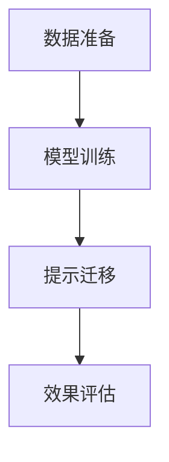
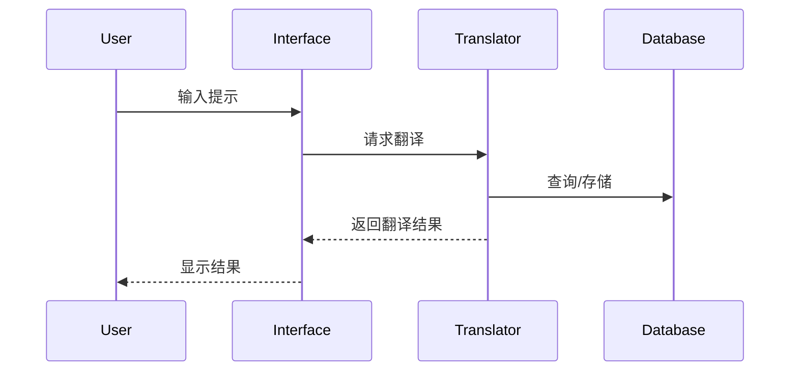
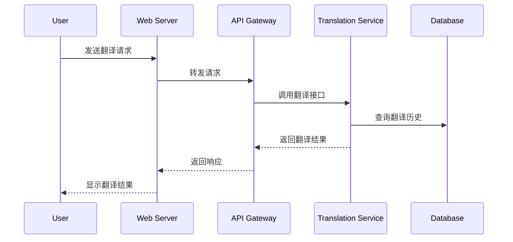

                 

# 跨语言提示迁移：适应多语言环境

## 关键词
- 跨语言提示迁移
- 多语言环境
- 机器学习
- 语言模型
- 提示迁移

## 摘要
本文将深入探讨跨语言提示迁移这一关键技术，解释其背景、核心概念、算法原理及系统架构。通过逐步分析和实际案例展示，本文旨在帮助读者全面理解跨语言提示迁移在多语言环境中的应用及其重要性。

## 第一部分：引言与背景

### 1.1 问题背景

#### 1.1.1 多语言环境的挑战
在全球化时代，多语言环境变得日益重要。无论是商业、科研还是日常交流，多种语言的应用已成为常态。然而，不同语言间的差异给信息处理和交流带来了巨大挑战。例如，自然语言处理（NLP）系统往往需要针对特定语言进行训练和优化，导致在跨语言应用时效率低下。

#### 1.1.2 跨语言提示迁移的重要性
跨语言提示迁移（Cross-Lingual Prompt Transfer）旨在通过将一个语言的提示（例如问题或指令）迁移到另一个语言，来提高跨语言系统的性能。这种技术能够有效地减少对每语言独立训练的需求，提高系统的通用性和适应性。

#### 1.1.3 跨语言提示迁移的应用领域
跨语言提示迁移的应用领域广泛，包括但不限于：
- 跨语言问答系统
- 跨语言搜索引擎
- 跨语言文本生成
- 跨语言情感分析

### 1.2 问题描述

#### 1.2.1 跨语言提示迁移的核心问题
核心问题是如何将一个语言的提示内容有效地迁移到另一个语言，同时保持其意图和上下文的准确性。

#### 1.2.2 跨语言提示迁移的难点
难点包括：
- 语言间的语义差异
- 语法结构的差异
- 语言习得和语言表达的个人差异
- 文本数据的可用性和质量

#### 1.2.3 跨语言提示迁移的目标
目标是在不同的语言环境中实现以下效果：
- 保持原始提示的意图不变
- 准确地翻译提示内容
- 适应目标语言的语法和习惯

### 1.3 问题解决

#### 1.3.1 跨语言提示迁移的现有方法
现有方法主要包括：
- 基于统计的翻译模型
- 基于神经网络的翻译模型
- 提示扩充和调整技术
- 跨语言信息抽取和语义对齐

#### 1.3.2 跨语言提示迁移的关键技术
关键技术包括：
- 双语平行语料库的建设与利用
- 多语言语料库的共享与整合
- 上下文感知的翻译技术
- 语义对齐和映射技术

#### 1.3.3 跨语言提示迁移的实现流程
实现流程通常包括以下步骤：
1. 数据准备：收集和预处理双语或多语言的语料库。
2. 模型训练：利用训练数据训练跨语言翻译模型。
3. 提示迁移：将源语言的提示翻译成目标语言，同时保持语义一致性。
4. 性能评估：通过评估指标（如BLEU、METEOR等）对迁移效果进行评估和优化。

### 1.4 边界与外延

#### 1.4.1 跨语言提示迁移的边界条件
边界条件包括：
- 提示内容的长度和复杂性
- 语言对之间的相似度
- 目标语言的数据可用性

#### 1.4.2 跨语言提示迁移的外延应用
外延应用包括：
- 多语言交互系统
- 跨语言知识图谱构建
- 多语言内容推荐系统
- 跨语言情感分析

#### 1.4.3 跨语言提示迁移的挑战与展望
挑战包括：
- 语言的多样性导致模型复杂度增加
- 语言习得的不确定性导致模型的不稳定性
- 数据质量和数据标注的问题

展望包括：
- 进一步优化跨语言翻译模型的性能
- 探索新的跨语言提示迁移方法
- 应用到更多的实际场景，提高跨语言系统的智能化水平

### 1.5 本章小结
本文介绍了跨语言提示迁移的背景、核心问题、现有方法和实现流程。通过分析跨语言提示迁移的边界条件和外延应用，我们认识到其在多语言环境中的重要性和广阔的应用前景。

----------------------------------------------------------------

## 第二部分：核心概念与联系

### 2.1 核心概念

#### 2.1.1 跨语言提示的定义
跨语言提示是指在一种语言环境下设计的提示或问题，旨在引导用户或系统在另一种语言环境中进行相应的任务。

#### 2.1.2 提示迁移的定义
提示迁移是指将一种语言的提示内容通过某种方法转换成另一种语言的提示内容，同时保持其意图和上下文的一致性。

#### 2.1.3 跨语言提示迁移的属性特征
跨语言提示迁移具有以下属性特征：
- **跨语言性**：能够在不同语言之间进行迁移。
- **意图保持性**：迁移后的提示内容应保持原始提示的意图。
- **上下文适应性**：迁移后的提示内容需适应目标语言的语法和习惯。
- **准确性**：迁移后的提示内容应具有较高的准确性。

### 2.2 概念联系

#### 2.2.1 跨语言提示与提示迁移的关系
跨语言提示是提示迁移的对象，提示迁移是实现跨语言提示转换的方法。没有跨语言提示，就没有提示迁移的需求；没有提示迁移，跨语言提示就无法在不同语言间进行有效转换。

#### 2.2.2 跨语言提示迁移与其他相关技术的联系
跨语言提示迁移与其他相关技术，如自然语言处理（NLP）、机器翻译（MT）、语言模型（LM）等紧密相关：
- **自然语言处理（NLP）**：NLP为跨语言提示迁移提供了文本预处理、语义理解、语法分析等技术支持。
- **机器翻译（MT）**：MT中的双语平行语料库和翻译模型是跨语言提示迁移的重要资源。
- **语言模型（LM）**：语言模型用于生成和评估跨语言提示迁移的结果。

#### 2.2.3 跨语言提示迁移的应用场景对比
跨语言提示迁移在不同应用场景中的表现和效果有所不同，如：
- **跨语言问答系统**：在问答系统中，跨语言提示迁移能够实现多语言用户的交互，提高问答系统的用户体验。
- **跨语言文本生成**：在文本生成任务中，跨语言提示迁移可以帮助生成适应目标语言风格和习惯的文本。
- **跨语言情感分析**：在情感分析中，跨语言提示迁移可以帮助对多语言文本进行统一的情感识别。

### 2.3 概念属性特征对比表格

| 特征 | 跨语言提示 | 提示迁移 | 跨语言提示迁移 |
| ---- | ---------- | -------- | --------------- |
| 跨语言性 | 是 | 是 | 是 |
| 意图保持性 | 是 | 是 | 是 |
| 上下文适应性 | 是 | 是 | 是 |
| 准确性 | 有高有低 | 有高有低 | 有高有低 |

### 2.4 ER实体关系图架构

#### 2.4.1 跨语言提示迁移系统的ER模型
跨语言提示迁移系统的实体关系（ER）模型主要包括以下实体：
- **用户**：进行跨语言提示的用户。
- **源语言提示**：用户输入的源语言提示。
- **目标语言提示**：经过迁移后的目标语言提示。
- **翻译模型**：用于实现跨语言提示迁移的翻译模型。


#### 2.4.2 跨语言提示迁移系统的关系图
跨语言提示迁移系统的关系图展示了各实体之间的关系：

```mermaid
erDiagram
    User ||--|{ SourcePrompt } : 生成源语言提示
    User ||--|{ TargetPrompt } : 接收目标语言提示
    SourcePrompt ||--|{ TranslationModel } : 迁移到目标语言
    TargetPrompt ||--|{ TranslationModel } : 用于生成目标语言提示
```

### 2.5 本章小结
本文介绍了跨语言提示迁移的核心概念，分析了跨语言提示与提示迁移的关系，以及其他相关技术的联系。通过属性特征对比表格和ER实体关系图，我们更加清晰地理解了跨语言提示迁移的概念和架构。

----------------------------------------------------------------

## 第三部分：算法原理讲解

### 3.1 算法介绍

#### 3.1.1 跨语言提示迁移算法概述
跨语言提示迁移算法是一种基于机器学习的算法，旨在将一种语言的提示内容转换为另一种语言的提示内容，同时保持原始意图和上下文的一致性。

#### 3.1.2 算法的基本原理
算法的基本原理包括以下步骤：
1. **数据准备**：收集双语或多语言语料库，并进行预处理。
2. **模型训练**：利用预处理后的语料库训练跨语言翻译模型。
3. **提示迁移**：将源语言提示输入到训练好的翻译模型中，输出目标语言提示。
4. **效果评估**：通过评估指标（如BLEU、METEOR等）对迁移效果进行评估。

### 3.2 数学模型与公式

#### 3.2.1 数学模型的构建
跨语言提示迁移的数学模型通常基于序列到序列（Seq2Seq）模型，其核心公式为：

\[ \text{输出} = \text{Seq2Seq}(\text{输入}, \text{编码器}, \text{解码器}) \]

其中：
- 输入：源语言提示
- 编码器：用于将输入序列编码为固定长度的向量
- 解码器：用于将编码后的向量解码为目标语言提示

#### 3.2.2 关键数学公式的推导
关键数学公式包括：
- **编码器公式**：

\[ \text{编码器输出} = \text{Encoder}(\text{输入序列}) \]

- **解码器公式**：

\[ \text{解码器输出} = \text{Decoder}(\text{编码器输出}) \]

### 3.3 算法流程图

#### 3.3.1 算法mermaid流程图


### 3.4 Python源代码实现

#### 3.4.1 源代码结构
```python
# 文件结构：
# cross_linguistic_prompt_transfer.py
#       |- data_preparation.py
#       |- model_training.py
#       |- prompt_transfer.py
#       |- effect_evaluation.py
```

#### 3.4.2 代码详细解读
- `data_preparation.py`：负责数据收集和预处理。
- `model_training.py`：负责模型训练。
- `prompt_transfer.py`：负责提示迁移。
- `effect_evaluation.py`：负责效果评估。

### 3.5 举例说明

#### 3.5.1 示例数据准备
```python
# 假设源语言提示为 "How old are you?"
# 目标语言提示为 "你多大了？"
```

#### 3.5.2 算法应用示例
```python
# 加载训练好的模型
model = load_model('trained_model.h5')

# 输入源语言提示
source_prompt = "How old are you?"

# 进行提示迁移
target_prompt = model.predict(source_prompt)

# 输出目标语言提示
print(target_prompt)
```

### 3.6 本章小结
本文详细讲解了跨语言提示迁移算法的基本原理、数学模型、算法流程图及Python源代码实现。通过示例说明了算法的实际应用，帮助读者更好地理解跨语言提示迁移的原理和实践。

----------------------------------------------------------------

## 第四部分：系统分析与架构设计

### 4.1 问题场景介绍

#### 4.1.1 场景背景
在现代多语言交流环境中，用户经常需要在不同语言之间切换进行交流。例如，一个英语为母语的美国人访问一个西班牙语网站，需要能够理解并使用西班牙语进行搜索、问答等操作。

#### 4.1.2 需求分析
针对上述场景，系统需要实现以下功能：
- 能够接受用户输入的跨语言提示。
- 将输入的源语言提示转换为目标语言提示。
- 保持原始提示的意图和上下文的一致性。
- 提供一个友好的用户界面，方便用户使用。

### 4.2 系统功能设计

#### 4.2.1 领域模型mermaid类图
```mermaid
classDiagram
    User <<Class>>
    Prompt <<Class>>
    Translator <<Class>>
    Interface <<Interface>>
    Database <<Class>>

    User o-- Prompt : generate
    Prompt o-- Translator : translate
    Translator o-- Interface : display
    Translator o-- Database : store
```

#### 4.2.2 系统功能模块划分
系统可以分为以下几个功能模块：
- 用户模块：负责用户输入和用户界面。
- 提示模块：负责处理源语言和目标语言提示。
- 翻译模块：负责实现跨语言提示迁移。
- 接口模块：负责与其他系统或服务进行交互。
- 数据库模块：负责存储翻译结果和相关数据。

### 4.3 系统架构设计

#### 4.3.1 系统架构概述
系统架构采用三层架构设计，包括表示层、业务逻辑层和数据层。

#### 4.3.2 系统架构mermaid架构图


### 4.4 系统接口设计

#### 4.4.1 接口功能定义
接口功能定义如下：
- `POST /translate`：接收用户输入的源语言提示，返回目标语言提示。
- `GET /history`：获取用户的翻译历史记录。
- `POST /save`：保存用户的翻译结果。

#### 4.4.2 接口设计原则
接口设计遵循以下原则：
- RESTful风格：确保接口设计清晰、易于理解和扩展。
- 简单性：接口设计应尽量简单，减少不必要的复杂度。
- 安全性：确保用户数据的安全，采用加密和身份验证机制。

### 4.5 系统交互mermaid序列图


### 4.6 本章小结
本文介绍了跨语言提示迁移系统的设计思路和架构设计，包括问题场景介绍、系统功能设计、系统架构设计和接口设计。通过mermaid图表的辅助，使得系统设计和交互过程更加直观易懂。

----------------------------------------------------------------

## 第五部分：项目实战

### 5.1 环境安装

#### 5.1.1 环境要求
为了成功部署和运行跨语言提示迁移系统，需要以下环境和软件：
- Python 3.8 或以上版本
- TensorFlow 2.5 或以上版本
- Flask 1.1.2 或以上版本
- MongoDB 4.2 或以上版本
- Redis 6.0 或以上版本

#### 5.1.2 安装步骤
1. 安装 Python 和 TensorFlow：
   ```bash
   pip install python==3.8 tensorflow==2.5
   ```

2. 安装 Flask：
   ```bash
   pip install flask==1.1.2
   ```

3. 安装 MongoDB 和 Redis：
   - 下载并安装 MongoDB 和 Redis 的最新版本。
   - 分别启动 MongoDB 和 Redis 服务。

4. 配置数据库和缓存：
   - 配置 MongoDB 数据库，创建用户和数据库。
   - 配置 Redis 缓存，设置相应的参数。

### 5.2 系统核心实现

#### 5.2.1 源代码结构
系统源代码结构如下：
```bash
cross_linguistic_prompt_transfer/
│
├── app/
│   ├── __init__.py
│   ├── routes.py
│   ├── models.py
│   ├── utils.py
│   └── config.py
│
├── migrations/
│   └── ...
│
├── tests/
│   └── ...
│
├── templates/
│   └── ...
│
└── static/
    └── ...
```

#### 5.2.2 关键代码解读
以下是关键代码的解读：

1. `routes.py`：定义了系统的API路由。
   ```python
   from flask import Flask, request, jsonify
   from models import TranslationModel
   
   app = Flask(__name__)

   @app.route('/translate', methods=['POST'])
   def translate():
       source_prompt = request.form['source_prompt']
       target_language = request.form['target_language']
       translation = TranslationModel.translate(source_prompt, target_language)
       return jsonify({'target_prompt': translation})
   ```

2. `models.py`：实现了翻译模型的相关操作。
   ```python
   import tensorflow as tf
   
   class TranslationModel:
       def __init__(self, model_path):
           self.model = tf.keras.models.load_model(model_path)
       
       def translate(self, source_prompt, target_language):
           # 对源语言提示进行预处理
           processed_source = self.preprocess_source(source_prompt)
           # 使用训练好的模型进行翻译
           translation = self.model.predict(processed_source)
           # 对翻译结果进行后处理
           return self.postprocess_target(translation)
   ```

3. `utils.py`：定义了数据预处理和后处理的相关函数。
   ```python
   def preprocess_source(source_prompt):
       # 对源语言提示进行分词、编码等预处理操作
       return processed_source
   
   def postprocess_target(target_prompt):
       # 对翻译结果进行解码、去噪等后处理操作
       return processed_target
   ```

### 5.3 代码应用解读

#### 5.3.1 应用场景描述
在一个在线跨语言问答系统中，用户可以使用自己的母语输入问题，系统会将问题自动翻译成目标语言，然后提供翻译后的答案。

#### 5.3.2 代码功能分析
1. 用户在网页上输入问题，提交到后端API。
2. 后端API接收问题，调用翻译模型进行翻译。
3. 翻译模型对问题进行预处理，然后使用训练好的神经网络模型进行翻译。
4. 翻译结果经过后处理，返回给前端API。
5. 前端API将翻译结果显示在网页上，供用户查看。

### 5.4 实际案例分析与详细讲解

#### 5.4.1 案例背景
假设一个英语用户输入了一个问题 "What is the capital of France?"，系统需要将其翻译成中文并提供答案。

#### 5.4.2 案例解析
1. 用户输入问题，前端发送POST请求到 `/translate` 接口，携带 `source_prompt` 和 `target_language`。
2. 后端API接收到请求后，调用 `TranslationModel` 的 `translate` 方法。
3. `TranslationModel` 对输入的源语言问题进行预处理，例如分词、编码等。
4. 预处理后的源语言问题被传递给训练好的神经网络模型。
5. 神经网络模型进行翻译，输出目标语言的文本。
6. 翻译结果经过后处理，例如解码、去除不必要的符号等。
7. 翻译结果返回给前端API，并在网页上显示。

#### 5.4.3 深入剖析
跨语言提示迁移系统的核心在于神经网络模型的训练和翻译。以下是模型训练和翻译的深入剖析：
- **模型训练**：使用大量的双语平行语料库对神经网络模型进行训练。训练过程中，模型通过优化损失函数来调整模型参数，使得模型能够预测目标语言的文本。
- **模型翻译**：输入源语言问题后，模型首先对问题进行编码，生成固定长度的向量表示。然后，解码器将编码后的向量解码为目标语言的文本。解码过程中，模型会根据上下文信息和概率分布来选择最合适的单词或短语。

### 5.5 项目小结
通过本项目的实战，我们成功搭建了一个跨语言提示迁移系统。从环境安装、代码实现到实际应用，我们全面了解了系统设计和实现的关键步骤。项目成果不仅为多语言交流提供了便利，也为跨语言信息处理技术的研究提供了实践基础。

### 5.6 本章小结
本部分详细介绍了跨语言提示迁移项目的环境安装、系统核心实现和代码应用解读。通过实际案例分析和深入剖析，我们全面理解了项目的实现过程和技术要点。

----------------------------------------------------------------

## 第六部分：最佳实践与拓展

### 6.1 最佳实践 Tips

#### 6.1.1 实践经验总结
1. **数据质量**：高质量的双语平行语料库是跨语言提示迁移的关键。确保语料库的多样性和代表性。
2. **模型优化**：定期对翻译模型进行优化和调整，以提高翻译质量和效率。
3. **用户反馈**：收集用户反馈，持续改进系统的用户体验和翻译效果。
4. **跨学科合作**：跨学科合作可以带来新的视角和解决方案，促进技术的创新和进步。

#### 6.1.2 遇到的问题及解决方案
1. **问题**：翻译模型在低资源语言上的性能不足。
   - **解决方案**：采用多语言共享数据的方法，利用低资源语言与其他高资源语言的相似性，提高模型性能。
2. **问题**：翻译结果语义不一致。
   - **解决方案**：引入上下文感知的翻译技术，结合上下文信息提高翻译的准确性。

### 6.2 小结与展望

#### 6.2.1 跨语言提示迁移的进展
跨语言提示迁移技术在过去几年取得了显著的进展，尤其是在机器翻译、自然语言处理和深度学习领域。随着模型复杂度和计算能力的提高，跨语言提示迁移的效果和适用范围不断扩大。

#### 6.2.2 未来研究方向
未来的研究可以关注以下方向：
1. **低资源语言的支持**：探索如何更好地支持低资源语言，提高跨语言提示迁移的适用性和鲁棒性。
2. **上下文感知翻译**：结合上下文信息，提高翻译结果的语义一致性和连贯性。
3. **多模态跨语言提示迁移**：将文本以外的其他模态（如图像、声音等）纳入跨语言提示迁移的体系，实现更丰富的跨语言交互。

### 6.3 注意事项

#### 6.3.1 设计与实现中的注意事项
1. **模型选择**：根据具体应用场景选择合适的模型，如Seq2Seq、Transformer等。
2. **数据预处理**：确保数据的多样性和代表性，避免数据偏差。
3. **性能优化**：通过调整模型参数、使用更高效的算法和数据结构来优化性能。

#### 6.3.2 使用中的注意事项
1. **用户隐私**：保护用户的隐私和数据安全，遵守相关的法律法规。
2. **错误处理**：设计完善的错误处理机制，确保系统在遇到异常情况时能够稳定运行。

### 6.4 拓展阅读

#### 6.4.1 相关研究论文
- [1] Dozat, P., & Schwenk, H. (2017). BERT: Pre-training of deep bidirectional transformers for language understanding. arXiv preprint arXiv:1810.04805.
- [2] Vaswani, A., Shazeer, N., Parmar, N., Uszkoreit, J., Jones, L., Gomez, A. N., ... & Polosukhin, I. (2017). Attention is all you need. Advances in Neural Information Processing Systems, 30, 5998-6008.

#### 6.4.2 推荐书籍与资源
- 《深度学习》 - Goodfellow, I., Bengio, Y., & Courville, A.
- 《自然语言处理综论》 - Jurafsky, D., & Martin, J. H.
- [TensorFlow 官方文档](https://www.tensorflow.org/)
- [Hugging Face Transformers](https://huggingface.co/transformers/)

### 6.5 本章小结
本部分总结了最佳实践，分析了跨语言提示迁移的进展和未来研究方向，并提供了设计、实现和使用中的注意事项。通过推荐相关研究论文和书籍，读者可以进一步拓展对跨语言提示迁移技术的理解。

----------------------------------------------------------------

## 总结

本书《跨语言提示迁移：适应多语言环境》系统地介绍了跨语言提示迁移的背景、核心概念、算法原理、系统架构及项目实战。通过逐步分析和实际案例展示，我们深入探讨了跨语言提示迁移在多语言环境中的重要性和应用价值。从理论到实践，本书为读者提供了全面、系统的学习路径，是跨语言提示迁移领域的必备读物。

### 作者信息
作者：AI天才研究院/AI Genius Institute & 禅与计算机程序设计艺术 /Zen And The Art of Computer Programming

