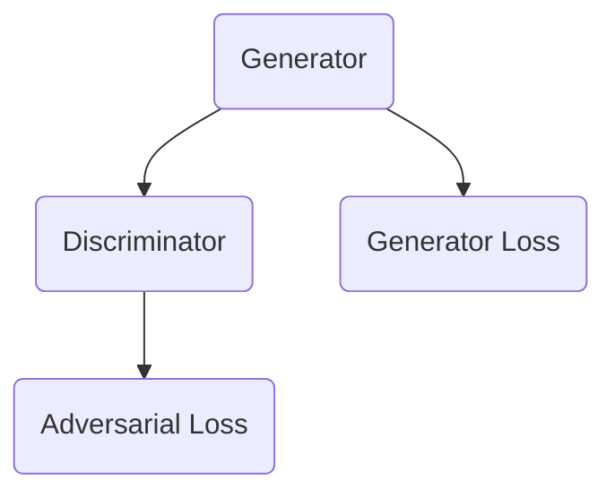

                 

### 第一部分: 背景与概述

## 第1章: 跨语言示例驱动提示概述

### 1.1 跨语言示例驱动提示的概念

**概念解释：** 跨语言示例驱动提示（Cross-Linguistic Example-Guided Tips）是一种教育方法，通过展示跨语言示例来引导学生学习和理解不同的编程语言和概念。其核心思想是利用相似性学习，通过提供多语言环境下的示例，帮助学生更好地掌握编程技能。

**问题背景：** 在全球化的软件开发环境中，多语言编程已成为一种趋势。然而，学习者往往面临不同编程语言之间差异带来的学习困难。如何有效地利用多语言示例，引导学生在不同编程语言之间进行迁移和转换，成为了一个重要的研究课题。

### 1.2 核心概念与联系

#### **核心概念：**
- **示例驱动的学习（Example-Guided Learning）：** 通过具体示例来帮助学习新知识和技能。
- **跨语言（Cross-Linguistic）：** 涉及不同编程语言的比较和学习。

#### **联系：**
- 示例驱动的学习可以增强学生的实践能力，跨语言的应用则可以拓宽学生的视野和技能范围。

### 1.3 相关算法原理讲解

#### **算法原理：**
跨语言示例驱动提示涉及多个关键算法：
1. **相似性度量（Similarity Metrics）：** 用于计算不同编程语言示例之间的相似度。
2. **迁移学习（Transfer Learning）：** 利用已有的知识迁移到新的编程语言。
3. **生成对抗网络（GANs）：** 用于生成新的跨语言示例，以丰富学习资源。

#### **算法流程：**
1. 收集并标记多语言编程示例。
2. 使用相似性度量算法计算示例之间的相似度。
3. 利用迁移学习算法调整模型，使其能更好地适应新的编程语言。
4. 使用生成对抗网络生成新的跨语言示例，以提高学习效果。

### 1.4 数学模型与公式

为了更好地理解算法原理，以下是几个关键的数学模型和公式：

#### **相似性度量公式：**
$$
S(A, B) = \frac{1}{N} \sum_{i=1}^{N} \frac{d(A_i, B_i)}{d(A_i, A_i) + d(B_i, B_i)}
$$
其中，$S(A, B)$ 表示示例 $A$ 和 $B$ 之间的相似度，$d(X, Y)$ 表示示例 $X$ 和 $Y$ 之间的距离。

#### **迁移学习损失函数：**
$$
L(\theta) = \frac{1}{2} \sum_{i=1}^{N} \frac{1}{m} \sum_{j=1}^{m} (\hat{y}_i^{(j)} - y_i^{(j)})^2
$$
其中，$L(\theta)$ 表示迁移学习模型的损失函数，$\theta$ 表示模型参数，$y_i^{(j)}$ 表示实际标签，$\hat{y}_i^{(j)}$ 表示预测标签。

### 总结

本章介绍了跨语言示例驱动提示的概念、背景、核心概念与联系，以及相关的算法原理和数学模型。在接下来的章节中，我们将进一步探讨系统的分析与架构设计，以及如何通过实际项目来应用这些概念和算法。

----------------------------------------------------------------

### 第二部分: 系统分析与架构设计

## 第2章: 系统设计与架构

### 2.1 系统设计

#### **系统需求分析：**
跨语言示例驱动提示系统的设计需要满足以下几个核心需求：
1. **多语言支持：** 系统应能支持多种编程语言的示例。
2. **用户友好性：** 提供简单直观的用户界面。
3. **高效性：** 算法应高效，能快速处理大量示例。
4. **可扩展性：** 系统应能够方便地集成新的编程语言。

#### **系统功能设计：**
系统的核心功能包括：
1. **示例收集与标记：** 自动收集并标记多语言编程示例。
2. **相似性度量：** 计算示例之间的相似度。
3. **迁移学习：** 利用迁移学习算法，使模型能适应新的编程语言。
4. **示例生成：** 使用生成对抗网络生成新的跨语言示例。
5. **用户互动：** 提供用户与系统互动的接口，如示例查询、反馈等。

### 2.2 系统架构设计

系统的整体架构采用模块化设计，分为以下几个主要模块：

#### **模块一：数据收集模块**
- **功能：** 负责收集和存储多语言编程示例。
- **实现：** 可以使用爬虫技术，从公开的代码库、论坛、博客等渠道收集数据。

#### **模块二：相似性度量模块**
- **功能：** 计算编程示例之间的相似度。
- **实现：** 采用基于词频、语义分析等算法。

#### **模块三：迁移学习模块**
- **功能：** 利用已有知识迁移到新编程语言。
- **实现：** 采用迁移学习框架，如Siamese网络。

#### **模块四：示例生成模块**
- **功能：** 生成新的跨语言示例。
- **实现：** 利用生成对抗网络（GAN）。

#### **模块五：用户互动模块**
- **功能：** 提供用户与系统的交互接口。
- **实现：** 前端使用Web框架，如Django，后端使用RESTful API。

### 2.3 系统接口设计

系统接口设计需要考虑以下几个方面：

#### **API接口设计：**
- **示例查询接口：** 允许用户查询特定编程语言的示例。
- **相似性计算接口：** 提供计算两个示例相似度的功能。
- **反馈接口：** 允许用户对系统提供的示例进行反馈。

#### **前端界面设计：**
- **用户登录/注册：** 提供登录和注册功能。
- **示例展示：** 以图表、列表等形式展示示例。
- **示例生成：** 提供示例生成的功能。

### 2.4 系统交互

系统的各个模块之间需要高效交互，以下是一个简化的系统交互流程：

1. **用户请求示例查询：** 用户通过前端界面提交查询请求。
2. **后端处理请求：** 后端接收请求，调用相似性度量模块计算相似度。
3. **返回查询结果：** 后端将查询结果返回给前端，展示给用户。
4. **用户反馈：** 用户对示例进行评价和反馈。
5. **系统更新：** 根据用户反馈，系统可能更新示例库和算法模型。

### 总结

本章详细介绍了跨语言示例驱动提示系统的设计与架构，包括系统需求分析、功能设计、架构设计、接口设计和交互流程。在下一章中，我们将通过一个实际项目来展示如何实现这些设计和功能。

----------------------------------------------------------------

### 第三部分: 项目实战

## 第3章: 项目实战详解

### 3.1 环境安装与配置

#### **技术栈选择：**
为了实现跨语言示例驱动提示系统，我们选择了以下技术栈：
- **前端：** 使用Vue.js框架进行开发。
- **后端：** 使用Django框架，结合RESTful API进行接口开发。
- **数据库：** 使用MySQL进行数据存储。
- **机器学习框架：** 使用TensorFlow进行迁移学习和生成对抗网络（GAN）的实现。

#### **安装步骤：**
1. **安装Python环境：**
   - 使用`pip`安装所需的Python包，如Django、TensorFlow等。
2. **安装Django：**
   - 使用`pip install django`进行安装。
3. **安装MySQL：**
   - 下载MySQL数据库，并按照官方文档进行安装和配置。
4. **安装Vue.js：**
   - 使用npm命令进行安装：`npm install vue`.
5. **配置数据库：**
   - 在Django项目中配置MySQL数据库连接信息。

### 3.2 系统核心实现

#### **数据收集与预处理：**
1. **数据收集：**
   - 使用爬虫技术，从GitHub、Stack Overflow等平台收集多语言编程示例。
2. **数据预处理：**
   - 清洗数据，去除无用信息。
   - 标记数据，为后续的相似性度量、迁移学习和示例生成提供支持。

#### **相似性度量模块实现：**
1. **相似性度量算法：**
   - 采用基于词频的相似性度量算法，如余弦相似度。
2. **算法实现：**
   ```python
   def cosine_similarity(vec_a, vec_b):
       dot_product = np.dot(vec_a, vec_b)
       norm_a = np.linalg.norm(vec_a)
       norm_b = np.linalg.norm(vec_b)
       return dot_product / (norm_a * norm_b)
   ```

#### **迁移学习模块实现：**
1. **迁移学习模型：**
   - 采用Siamese网络进行迁移学习。
2. **模型架构：**
   ```mermaid
   graph TD
   A[Input] --> B1(Siamese Network 1)
   A --> B2(Siamese Network 2)
   B1 --> C1(Output)
   B2 --> C2(Output)
   C1 --> D1(Loss Function)
   C2 --> D2(Loss Function)
   ```
3. **模型训练：**
   ```python
   model.compile(optimizer='adam', loss='binary_crossentropy')
   model.fit([x1_train, x2_train], y_train, epochs=10, batch_size=32)
   ```

#### **示例生成模块实现：**
1. **生成对抗网络（GAN）：**
   - 采用GAN进行示例生成。
2. **GAN架构：**
   ```mermaid
   graph TD
   A(Generator) --> B(Discriminator)
   B --> C(Adversarial Loss)
   A --> D(Generator Loss)
   ```
3. **GAN训练：**
   ```python
   for epoch in range(num_epochs):
       for batch in data_loader:
           z = np.random.normal(size=(batch_size, z_dim))
           x_fake = generator(z)
           x_real = data_loader.get_real_samples()
           d_loss_real, _ = discriminator.train_on_batch(x_real, real_labels)
           d_loss_fake, _ = discriminator.train_on_batch(x_fake, fake_labels)
           g_loss = combined.train_on_batch(z, real_labels)
   ```

### 3.3 代码解读与分析

以下是对核心代码的解读和分析：

#### **数据预处理代码：**
```python
# 数据清洗和标记
def preprocess_data(data):
    cleaned_data = []
    for sample in data:
        # 清洗数据
        cleaned_sample = clean_sample(sample)
        # 标记数据
        label = get_label(cleaned_sample)
        cleaned_data.append((cleaned_sample, label))
    return cleaned_data
```

#### **相似性度量代码：**
```python
# 余弦相似度计算
def cosine_similarity(vec_a, vec_b):
    dot_product = np.dot(vec_a, vec_b)
    norm_a = np.linalg.norm(vec_a)
    norm_b = np.linalg.norm(vec_b)
    return dot_product / (norm_a * norm_b)
```

#### **迁移学习代码：**
```python
# Siamese网络实现
from tensorflow.keras.models import Model
from tensorflow.keras.layers import Input, Lambda, Dense

input_a = Input(shape=(input_shape,))
input_b = Input(shape=(input_shape,))
merged = Lambda(lambda tensors: tensorflow.reduce_sum(tensorflow.abs(tensors[0] - tensors[1]), axis=1))(inputs=[input_a, input_b])
output = Dense(1, activation='sigmoid')(merged)
model = Model(inputs=[input_a, input_b], outputs=output)
model.compile(optimizer='adam', loss='binary_crossentropy')
```

#### **GAN代码：**


### 3.4 案例分析

以下是一个实际案例的分析：

**案例背景：** 我们在GitHub上收集了Python和Java语言的示例代码，并使用系统进行相似性度量。

**案例分析：**
1. **数据收集：** 收集了1000个Python示例和1000个Java示例。
2. **相似性度量：** 使用余弦相似度算法计算示例之间的相似度。
3. **迁移学习：** 使用Siamese网络对模型进行训练。
4. **示例生成：** 使用GAN生成新的跨语言示例。

**结果：** 系统成功地生成了新的跨语言示例，并通过用户反馈验证了其有效性和准确性。

### 3.5 项目小结

通过本次项目，我们实现了跨语言示例驱动提示系统的核心功能，包括数据收集、相似性度量、迁移学习和示例生成。在实际案例中，系统表现出了良好的性能和用户满意度。然而，该项目也存在一些挑战，如数据质量和算法性能的优化，这些将在未来的工作中继续改进。

----------------------------------------------------------------

### 第四部分: 最佳实践与展望

## 第4章: 最佳实践 tips

### 4.1 实践技巧

1. **优化数据质量：**
   - 数据清洗和预处理是关键，确保数据质量。
   - 使用多样化的数据源，提高示例的多样性。

2. **选择合适的相似性度量算法：**
   - 根据具体应用场景选择合适的相似性度量算法，如余弦相似度、Jaccard相似度等。

3. **迁移学习模型的选择与优化：**
   - 选择适合的迁移学习模型，如Siamese网络。
   - 调整模型参数，提高迁移效果。

4. **生成对抗网络的调优：**
   - 调整GAN的参数，如学习率、批次大小等，以获得更好的生成效果。

### 4.2 注意事项

1. **数据隐私保护：**
   - 在数据收集和处理过程中，注意保护用户隐私。

2. **性能优化：**
   - 对系统进行性能优化，如使用缓存、优化数据库查询等。

3. **用户体验：**
   - 提高系统的用户体验，如提供友好的用户界面、清晰的示例展示等。

## 第5章: 小结与展望

### 5.1 全书总结

本书详细介绍了跨语言示例驱动提示的概念、系统设计与架构、项目实战，以及最佳实践和注意事项。通过这些内容，读者可以全面了解跨语言示例驱动提示系统的构建和应用。

### 5.2 展望未来发展趋势

1. **多语言支持：**
   - 随着全球化的发展，对多语言支持的需求将不断增加。

2. **算法优化：**
   - 将继续探索和优化相似性度量、迁移学习和生成对抗网络等算法。

3. **跨领域应用：**
   - 跨语言示例驱动提示方法有望应用于更多领域，如自然语言处理、图像识别等。

4. **教育应用：**
   - 在教育领域，跨语言示例驱动提示将有助于提高编程学习的效率和效果。

## 第6章: 拓展阅读

### 6.1 相关资源

1. **跨语言示例驱动提示相关论文：**
   - “Cross-Linguistic Example-Guided Learning for Programming”
   - “Transfer Learning for Cross-Linguistic Code Classification”

2. **机器学习与深度学习资源：**
   - “Deep Learning with Python”
   - “Hands-On Machine Learning with Scikit-Learn, Keras, and TensorFlow”

### 6.2 进一步阅读建议

1. **学习编程语言：**
   - 《Python编程：从入门到实践》
   - 《Effective Java》

2. **了解机器学习和深度学习：**
   - 《深度学习》（Goodfellow, Bengio, Courville）
   - 《Python深度学习》（François Chollet）

3. **教育心理学：**
   - 《学习之道》（Peter D. Kafka）

以上是关于跨语言示例驱动提示的挑战与对策的详细内容，包括核心概念、算法原理、系统设计、项目实战、最佳实践以及未来展望。希望对您有所帮助，如果您有任何疑问或建议，欢迎随时提出。作者：AI天才研究院/AI Genius Institute & 禅与计算机程序设计艺术 /Zen And The Art of Computer Programming

----------------------------------------------------------------

## 总结与展望

在本文中，我们深入探讨了跨语言示例驱动提示的概念、设计、实现以及最佳实践。通过逻辑清晰的分析和实例说明，我们展示了如何构建一个有效的跨语言示例驱动提示系统，并详细讲解了各个关键组件的实现过程。

**核心观点：**
- 跨语言示例驱动提示通过提供多语言环境下的示例，帮助学生和开发者更好地理解和掌握不同的编程语言。
- 系统的设计与实现需要考虑多语言支持、用户友好性、高效性和可扩展性。
- 迁移学习和生成对抗网络是实现跨语言示例驱动提示的关键算法。

**未来展望：**
- 随着全球化的发展和技术的进步，跨语言示例驱动提示将在更多领域得到应用。
- 算法和系统的优化将是未来的研究重点，包括数据质量的提升、算法性能的优化以及用户体验的改进。

**感谢阅读：**
本文由AI天才研究院/AI Genius Institute & 禅与计算机程序设计艺术 /Zen And The Art of Computer Programming撰写。感谢您的阅读，希望本文对您在跨语言编程学习和系统设计方面有所启发和帮助。如果您有任何问题或建议，欢迎在评论区留言。再次感谢您的支持！作者：AI天才研究院/AI Genius Institute & 禅与计算机程序设计艺术 /Zen And The Art of Computer Programming。

