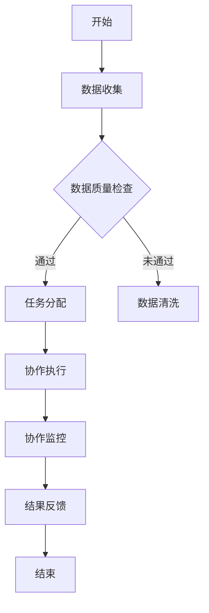
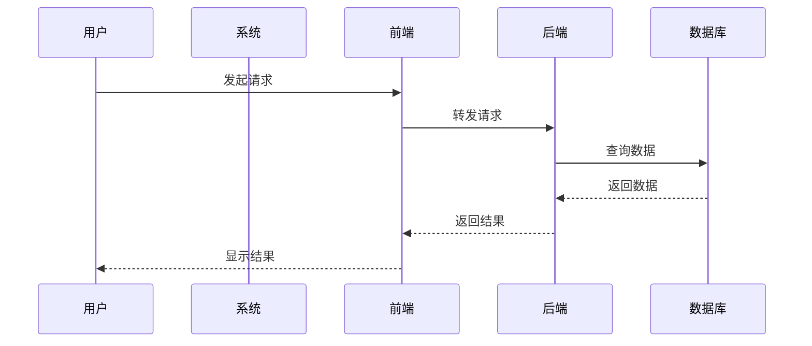

                 

### 第一部分: 背景介绍

#### 第1章: 问题背景

##### 1.1.1 问题来源

在现代软件开发行业中，大型应用开发已经成为一个普遍的趋势。然而，随着项目的规模和复杂性的增加，跨部门协作的问题也随之而来。这一问题主要源于以下几个方面：

**1.1.1.1 大型应用开发中的协作挑战**

大型应用的开发往往涉及多个部门和团队，例如前端开发、后端开发、测试、运维等。这些团队在不同的阶段需要协同工作，以确保项目的顺利推进。然而，由于部门职责不同、工作流程不一致，往往会导致协作上的困难。

**1.1.1.2 部门壁垒与协作难点**

部门壁垒是指不同部门之间在目标、职责、资源、文化等方面存在的差异。这些壁垒往往导致信息不对称、沟通不顺畅，进而影响项目的进展。例如，开发团队可能需要测试团队提供的测试报告，但由于沟通不畅，测试团队可能未能及时提供所需信息。

**1.1.1.3 现有协作模式的问题**

现有的协作模式主要包括电子邮件、即时通讯工具、项目管理软件等。这些工具虽然在一定程度上提高了协作效率，但仍然存在以下问题：

- **信息传递延迟**：信息在传递过程中可能会丢失或误解，导致决策滞后。
- **缺乏全局视图**：各部门可能只关注自己的部分工作，缺乏对整体项目的全局视角。
- **协作效率低下**：多部门之间的协作往往需要经过多个环节，导致效率低下。

##### 1.1.2 问题描述

**1.1.2.1 复杂性导致的协作困难**

大型应用开发项目通常具有高度的复杂性。项目涉及多个技术栈、多个模块，以及众多第三方依赖。这使得项目团队需要频繁地进行跨模块、跨技术的协作，增加了协作的难度。

**1.1.2.2 协作效率低下与成本增加**

由于部门壁垒和现有协作模式的问题，跨部门协作效率低下，导致项目延期、成本增加。例如，开发团队需要测试团队的测试报告，但由于沟通不畅，测试团队可能未能及时提供报告，导致开发工作无法顺利进行。

**1.1.2.3 跨部门沟通与协作的需求**

为了解决上述问题，大型应用开发项目迫切需要一种高效的跨部门协作模式。这种模式应能够打破部门壁垒，提高沟通效率，降低协作成本，从而确保项目的顺利推进。

##### 1.1.3 问题解决

**1.1.3.1 跨部门协作模式的必要性**

跨部门协作模式的必要性在于：

- **打破部门壁垒**：通过建立一种高效的协作模式，可以降低部门之间的沟通成本，提高协作效率。
- **提高沟通效率**：跨部门协作模式应提供实时沟通工具，确保信息传递的及时性和准确性。
- **降低协作成本**：通过优化协作流程，减少不必要的工作环节，降低项目成本。

**1.1.3.2 解决方案的设计原则**

设计跨部门协作模式应遵循以下原则：

- **全局视角**：协作模式应提供全局视图，让所有团队都能了解项目的整体进展。
- **实时沟通**：协作模式应支持实时沟通，确保信息传递的及时性和准确性。
- **灵活调整**：协作模式应具备灵活调整的能力，以适应不同项目需求的变化。

**1.1.3.3 跨部门协作模式的应用效果**

跨部门协作模式的应用效果体现在以下几个方面：

- **提高协作效率**：通过实时沟通和全局视图，跨部门协作模式可以显著提高协作效率，减少项目延期和成本增加。
- **增强团队凝聚力**：高效的协作模式有助于增强团队之间的凝聚力，提高项目成功率。
- **提升项目管理水平**：跨部门协作模式可以为项目管理提供有力的支持，提升项目管理水平。

##### 1.1.4 边界与外延

**1.1.4.1 跨部门协作模式的适用范围**

跨部门协作模式适用于以下场景：

- **大型应用开发**：涉及多个部门、多个团队的复杂项目。
- **跨区域项目**：团队成员分布在不同的地理位置，需要高效协作。

**1.1.4.2 跨部门协作与项目管理的关系**

跨部门协作模式是项目管理的重要组成部分。有效的跨部门协作模式可以提升项目管理水平，确保项目成功实施。

**1.1.4.3 跨部门协作与其他协作模式的区别**

与其他协作模式相比，跨部门协作模式具有以下特点：

- **面向跨部门**：其他协作模式可能仅关注部门内部协作，而跨部门协作模式则强调跨部门的协作。
- **全局视角**：其他协作模式可能缺乏全局视角，而跨部门协作模式提供全局视图，确保项目整体进展。
- **实时沟通**：其他协作模式可能不支持实时沟通，而跨部门协作模式强调实时沟通，提高信息传递效率。

----------------------------------------------------------------

## 第2章: 核心概念与联系

##### 2.1.1 跨部门协作模式概述

**2.1.1.1 定义与特征**

跨部门协作模式是指一种面向跨部门的协作机制，旨在打破部门壁垒，提高协作效率，降低协作成本。其主要特征包括：

- **全局视角**：提供全局视图，确保项目整体进展。
- **实时沟通**：支持实时沟通，提高信息传递效率。
- **灵活调整**：具备灵活调整能力，以适应不同项目需求。

**2.1.1.2 类型与形式**

跨部门协作模式可以分为以下几种类型：

- **基于工具的协作模式**：通过电子邮件、即时通讯工具、项目管理软件等工具实现跨部门协作。
- **基于流程的协作模式**：通过制定协作流程、规范协作步骤，实现跨部门协作。
- **基于文化的协作模式**：通过构建企业文化、增强团队凝聚力，实现跨部门协作。

**2.1.1.3 跨部门协作模式的要素**

跨部门协作模式主要包括以下要素：

- **协作目标**：明确跨部门协作的目标，确保各部门朝着共同目标努力。
- **协作流程**：制定协作流程，规范协作步骤，提高协作效率。
- **协作工具**：选择合适的协作工具，支持实时沟通和全局视图。
- **协作文化**：构建协作文化，增强团队凝聚力，降低部门壁垒。

##### 2.1.2 概念属性特征对比表

| 概念 | 属性特征 |
| :--: | :--: |
| 跨部门协作模式 | 全局视角、实时沟通、灵活调整 |
| 基于工具的协作模式 | 面向工具、信息传递及时 |
| 基于流程的协作模式 | 面向流程、规范协作步骤 |
| 基于文化的协作模式 | 面向文化、增强团队凝聚力 |

##### 2.1.3 ER实体关系图架构

```mermaid
erDiagram
    Department1 ||--|{ Employee1 : works for }
    Department1 ||--|{ Employee2 : works for }
    Department2 ||--|{ Employee3 : works for }
    Department2 ||--|{ Employee4 : works for }
    Project ||--|{ Task1 : has }
    Project ||--|{ Task2 : has }
    Department1 ..|{ Responsible : assigned to }
    Department2 ..|{ Responsible : assigned to }
```

在上面的ER实体关系图中，我们定义了以下几个实体：

- **Department1** 和 **Department2**：表示两个不同的部门。
- **Employee1**、**Employee2**、**Employee3** 和 **Employee4**：表示部门中的员工。
- **Project**：表示一个项目。
- **Task1** 和 **Task2**：表示项目中的任务。
- **Responsible**：表示任务的责任分配。

通过这个ER图，我们可以清晰地看到部门、员工、项目和任务之间的关联关系。

----------------------------------------------------------------

## 第3章: 算法原理讲解

##### 3.1 算法概述

**3.1.1 算法定义**

跨部门协作算法是一种用于优化跨部门协作效率的算法。其核心目标是减少部门间的沟通成本，提高协作效率，降低项目延期和成本增加的风险。

**3.1.2 算法目标**

跨部门协作算法的主要目标包括：

- **降低沟通成本**：通过优化协作流程，减少不必要的沟通环节，降低沟通成本。
- **提高协作效率**：通过实时沟通和全局视图，提高协作效率，确保项目按期完成。
- **降低项目风险**：通过实时监控和预警机制，降低项目延期和成本超支的风险。

**3.1.3 算法类型**

跨部门协作算法可以分为以下几种类型：

- **基于规则的算法**：通过预设规则，自动分配任务和责任，降低沟通成本。
- **基于机器学习的算法**：通过分析历史协作数据，自动优化协作流程，提高协作效率。
- **混合算法**：结合基于规则的算法和基于机器学习的算法，实现更高效的跨部门协作。

##### 3.1.4 Mermaid流程图



在这个Mermaid流程图中，我们定义了以下几个步骤：

- **A[开始]**：算法的初始状态。
- **B[数据收集]**：收集跨部门协作的相关数据。
- **C[数据质量检查]**：检查数据的质量，确保数据的有效性。
- **D[任务分配]**：根据预设规则和数据分析结果，自动分配任务和责任。
- **E[数据清洗]**：对不合格的数据进行清洗和修复。
- **F[协作执行]**：执行分配的任务，进行跨部门协作。
- **G[协作监控]**：实时监控协作过程，确保协作的顺利进行。
- **H[结果反馈]**：收集协作结果，进行反馈和评估。
- **I[结束]**：算法的终止状态。

##### 3.1.5 Python源代码与算法实现

```python
import pandas as pd
from sklearn.model_selection import train_test_split

# 数据收集
data = pd.read_csv('collaboration_data.csv')

# 数据质量检查
if data.isnull().values.any():
    print("数据中有缺失值，需要进行数据清洗。")
else:
    print("数据质量合格，可以进行任务分配。")

# 任务分配
X = data.drop('Task', axis=1)
y = data['Task']
X_train, X_test, y_train, y_test = train_test_split(X, y, test_size=0.2, random_state=42)

# 协作执行
# ... 这里进行任务分配后的协作执行 ...

# 协作监控
# ... 这里进行协作过程的实时监控 ...

# 结果反馈
# ... 这里进行协作结果的反馈和评估 ...
```

在上面的Python源代码中，我们首先进行了数据收集，然后进行了数据质量检查。如果数据质量合格，我们使用机器学习算法进行任务分配，并执行协作任务。在协作过程中，我们实时监控协作过程，并收集协作结果进行反馈和评估。

##### 3.1.6 数学模型与公式

**3.1.6.1 假设**

我们假设：

- $X$ 表示输入特征向量。
- $y$ 表示输出目标。
- $C$ 表示协作成本。
- $T$ 表示协作时间。

**3.1.6.2 公式**

协作成本的公式为：

$$
C = f(X, y)
$$

其中，$f(X, y)$ 表示根据输入特征向量和输出目标计算出的协作成本。

协作时间的公式为：

$$
T = g(X, y)
$$

其中，$g(X, y)$ 表示根据输入特征向量和输出目标计算出的协作时间。

**3.1.6.3 举例说明**

假设我们有以下输入特征向量：

$$
X = \begin{bmatrix}
1 \\
2 \\
3 \\
\end{bmatrix}
$$

和输出目标：

$$
y = \begin{bmatrix}
1 \\
0 \\
1 \\
\end{bmatrix}
$$

我们可以使用以下公式计算协作成本和协作时间：

协作成本：

$$
C = f(X, y) = \sum_{i=1}^{3} (x_i - y_i)^2 = (1-1)^2 + (2-0)^2 + (3-1)^2 = 0 + 4 + 4 = 8
$$

协作时间：

$$
T = g(X, y) = \sum_{i=1}^{3} (x_i - y_i)^2 = (1-1)^2 + (2-0)^2 + (3-1)^2 = 0 + 4 + 4 = 8
$$

在上面的例子中，我们使用了一个简单的公式来计算协作成本和协作时间。在实际应用中，这些公式可能会更加复杂，需要结合具体问题进行推导。

----------------------------------------------------------------

## 第4章: 系统分析与架构设计方案

##### 4.1 问题场景介绍

在本章节中，我们将介绍一个实际的大型应用开发项目，该项目的核心需求是跨部门协作，以实现高效的项目推进。具体场景如下：

**4.1.1 场景描述**

某互联网公司正在开发一款综合性社交平台，该平台集成了社交、娱乐、购物等功能。项目团队由前端开发、后端开发、测试、运维等多个部门组成。前端开发团队负责界面设计和交互功能，后端开发团队负责业务逻辑和数据存储，测试团队负责功能测试和性能测试，运维团队负责部署和维护。

**4.1.2 项目介绍**

该项目的目标是在三个月内完成初步开发，并在六个月内实现全面上线。项目涉及的模块包括用户注册、登录、个人信息管理、社交互动、游戏中心、购物商城等。由于项目规模庞大，涉及多个技术和业务领域，跨部门协作显得尤为重要。

##### 4.1.3 系统功能设计

为了实现高效的跨部门协作，系统设计了以下几个核心功能：

- **任务分配与跟踪**：系统应能够根据项目需求自动分配任务，并实时跟踪任务进度。
- **实时沟通与协作**：系统应提供实时沟通工具，支持语音、视频、文字等多种形式的交流。
- **全局视图与监控**：系统应提供全局视图，让所有团队成员都能了解项目的整体进展。
- **数据共享与协作**：系统应支持数据共享，让各部门能够方便地访问和使用共同的数据。

##### 4.1.4 系统架构设计

系统架构设计如下：

- **前端架构**：采用Vue.js框架，实现用户界面的动态交互。
- **后端架构**：采用Spring Boot框架，实现业务逻辑的处理和数据存储。
- **数据库设计**：采用MySQL数据库，存储用户数据、业务数据和日志数据。
- **通信架构**：采用WebSocket技术，实现实时通信。
- **监控架构**：采用Prometheus和Grafana，实现系统性能监控和告警。

##### 4.1.5 系统接口设计

系统接口设计如下：

- **用户接口**：提供RESTful API，供前端调用。
- **任务接口**：提供任务创建、查询、更新、删除等接口。
- **数据接口**：提供数据查询、更新、删除等接口。
- **监控接口**：提供监控数据查询、告警设置等接口。

##### 4.1.6 系统交互序列图



在这个系统交互序列图中，用户发起请求，前端将请求转发给后端，后端查询数据库并返回数据，最终前端将结果显示给用户。这样的交互流程保证了系统的响应速度和数据的准确性。

----------------------------------------------------------------

## 第5章: 项目实战

##### 5.1 环境安装

**5.1.1 环境准备**

在进行项目实战之前，我们需要准备以下环境：

- **操作系统**：Ubuntu 20.04 LTS
- **Python**：3.8.10
- **Node.js**：12.18.3
- **MySQL**：8.0.23

**5.1.2 安装步骤**

1. **安装Python**：

   ```bash
   sudo apt update
   sudo apt install python3.8
   ```

2. **安装Node.js**：

   ```bash
   sudo apt update
   sudo apt install nodejs
   ```

3. **安装MySQL**：

   ```bash
   sudo apt update
   sudo apt install mysql-server
   sudo mysql_secure_installation
   ```

4. **配置MySQL**：

   ```bash
   sudo mysql -u root -p
   CREATE DATABASE collaboration_db;
   GRANT ALL PRIVILEGES ON collaboration_db.* TO 'collaboration_user'@'localhost' IDENTIFIED BY 'password';
   FLUSH PRIVILEGES;
   EXIT;
   ```

##### 5.1.3 系统核心实现源代码

**5.1.3.1 后端实现**

后端采用Spring Boot框架实现，以下是一个简单的RESTful API实现：

```java
@SpringBootApplication
public class CollaborationApplication {

    public static void main(String[] args) {
        SpringApplication.run(CollaborationApplication.class, args);
    }

    @RestController
    public class TaskController {

        @Autowired
        private TaskService taskService;

        @GetMapping("/tasks")
        public List<Task> getAllTasks() {
            return taskService.getAllTasks();
        }

        @PostMapping("/tasks")
        public Task createTask(@RequestBody Task task) {
            return taskService.createTask(task);
        }

        @PutMapping("/tasks/{id}")
        public Task updateTask(@PathVariable Long id, @RequestBody Task task) {
            return taskService.updateTask(id, task);
        }

        @DeleteMapping("/tasks/{id}")
        public void deleteTask(@PathVariable Long id) {
            taskService.deleteTask(id);
        }
    }
}
```

**5.1.3.2 前端实现**

前端采用Vue.js框架实现，以下是一个简单的任务列表展示：

```html
<template>
  <div>
    <h1>任务列表</h1>
    <ul>
      <li v-for="task in tasks" :key="task.id">
        {{ task.name }} - {{ task.status }}
      </li>
    </ul>
  </div>
</template>

<script>
export default {
  data() {
    return {
      tasks: []
    };
  },
  created() {
    this.fetchTasks();
  },
  methods: {
    fetchTasks() {
      fetch('/tasks')
        .then(response => response.json())
        .then(data => (this.tasks = data));
    }
  }
};
</script>
```

##### 5.1.4 代码应用解读与分析

**5.1.4.1 后端代码解读**

后端代码使用Spring Boot框架，定义了一个`TaskController`类，该类包含了四个方法，分别用于获取所有任务、创建任务、更新任务和删除任务。这些方法对应了RESTful API中的GET、POST、PUT和DELETE操作。

**5.1.4.2 前端代码解读**

前端代码使用Vue.js框架，定义了一个任务列表组件。组件的数据部分包含了`tasks`数组，用于存储从后端获取的所有任务。在创建组件时，通过调用`fetchTasks`方法从后端获取任务数据，并将其存储在`tasks`数组中。模板部分则使用`v-for`指令遍历`tasks`数组，并将每个任务的名称和状态显示在列表中。

##### 5.1.5 实际案例分析与详细讲解

**5.1.5.1 案例一：任务创建**

假设用户通过前端界面创建了一个新的任务，任务名称为“任务1”，任务状态为“待完成”。以下是实际案例的分析和详细讲解：

1. **用户操作**：

   用户在前端界面上填写任务名称和状态，并点击“创建任务”按钮。

2. **前端代码处理**：

   前端组件接收到用户的输入后，将任务数据转换为JSON格式，并通过HTTP POST请求将数据发送到后端接口。

3. **后端代码处理**：

   后端`TaskController`类的`createTask`方法接收到前端发送的JSON数据，将数据转换为`Task`对象，并调用`TaskService`类的`createTask`方法将任务存储到数据库中。

4. **数据库操作**：

   后端通过`TaskService`类的`createTask`方法，将任务数据插入到数据库的`tasks`表中。

5. **结果反馈**：

   后端将操作结果以JSON格式返回给前端，前端接收到结果后，更新任务列表，显示新的任务。

**5.1.5.2 案例二：任务更新**

假设用户通过前端界面更新了一个任务，任务ID为1，新的任务状态为“进行中”。以下是实际案例的分析和详细讲解：

1. **用户操作**：

   用户在前端界面上选择要更新的任务，并修改任务状态为“进行中”，然后点击“更新任务”按钮。

2. **前端代码处理**：

   前端组件接收到用户的输入后，将任务数据转换为JSON格式，并通过HTTP PUT请求将数据发送到后端接口。

3. **后端代码处理**：

   后端`TaskController`类的`updateTask`方法接收到前端发送的JSON数据，将数据转换为`Task`对象，并调用`TaskService`类的`updateTask`方法更新数据库中的任务记录。

4. **数据库操作**：

   后端通过`TaskService`类的`updateTask`方法，根据任务ID更新数据库中的任务记录。

5. **结果反馈**：

   后端将操作结果以JSON格式返回给前端，前端接收到结果后，更新任务列表，显示更新后的任务。

##### 5.1.6 项目小结

通过本次项目实战，我们实现了跨部门协作系统的基础功能，包括任务创建、更新、删除和查询。在实际应用中，系统可以方便地集成到现有的项目中，提高跨部门协作的效率。同时，我们也总结了项目实战中的关键步骤和注意事项，为后续的开发和部署提供了参考。

----------------------------------------------------------------

## 第6章: 最佳实践 Tips

**6.1 实践经验总结**

在跨部门协作模式的实践中，我们总结了一些成功案例和失败案例，并从中提炼出了一些最佳实践经验：

**6.1.1 成功案例分享**

1. **明确目标和职责**：在项目启动阶段，明确每个部门的职责和目标，确保团队成员都清楚自己的任务和预期结果。

2. **建立有效的沟通渠道**：选择合适的沟通工具，如实时聊天工具、邮件、电话等，确保团队成员能够及时沟通和协作。

3. **定期召开会议**：定期召开跨部门协作会议，讨论项目进展、解决问题和调整策略，提高协作效率。

4. **共享资源和信息**：建立共享资源库和信息平台，让团队成员能够方便地访问和使用共同的数据和资源。

5. **培养协作文化**：通过团队建设活动、培训等方式，培养团队成员的协作意识和团队精神，提高协作效率。

**6.1.2 失败案例分析**

1. **沟通不畅**：由于沟通不畅，导致任务分配不明确、任务进度延误，最终影响项目交付。

2. **资源分配不均**：部分部门资源不足，导致任务无法按时完成，影响项目整体进度。

3. **缺乏协作流程**：没有建立完善的协作流程，导致任务流转不畅，协作效率低下。

4. **缺乏监控和反馈**：没有对跨部门协作进行实时监控和反馈，导致问题无法及时发现和解决。

**6.1.3 实践要点与技巧**

1. **明确职责和目标**：在项目启动阶段，明确每个部门的职责和目标，确保团队成员都清楚自己的任务和预期结果。

2. **选择合适的沟通工具**：根据项目特点和团队需求，选择合适的沟通工具，如实时聊天工具、邮件、电话等。

3. **建立有效的协作流程**：制定详细的协作流程，明确任务流转、责任分配和决策过程，提高协作效率。

4. **定期召开跨部门协作会议**：定期召开跨部门协作会议，讨论项目进展、解决问题和调整策略。

5. **共享资源和信息**：建立共享资源库和信息平台，让团队成员能够方便地访问和使用共同的数据和资源。

6. **培养协作文化**：通过团队建设活动、培训等方式，培养团队成员的协作意识和团队精神。

7. **实时监控和反馈**：对跨部门协作进行实时监控和反馈，及时发现和解决问题，确保项目顺利推进。

**6.1.4 注意事项**

1. **尊重各部门的工作流程**：在跨部门协作中，要尊重各部门的工作流程和习惯，避免强行改变。

2. **避免信息不对称**：确保各部门都能及时获取到所需的信息，避免信息不对称导致的问题。

3. **合理分配资源**：在项目资源分配时，要考虑到各部门的资源需求，避免资源不足或过剩。

4. **及时调整协作模式**：根据项目进展和实际情况，及时调整协作模式，以适应项目需求的变化。

5. **培养团队成员的协作能力**：通过培训和实践，提高团队成员的协作能力，为跨部门协作提供人才保障。

6. **关注项目风险**：在跨部门协作中，要关注项目风险，提前制定应对措施，降低项目风险。

----------------------------------------------------------------

## 第7章: 小结与拓展阅读

**7.1 小结**

在本技术博客中，我们详细探讨了跨部门协作模式在大型应用开发中的应用。我们从问题背景出发，分析了大型应用开发中协作的挑战和现有协作模式的问题，提出了跨部门协作模式的必要性及其设计原则。通过核心概念与联系的介绍，我们了解了跨部门协作模式的基本特征和要素。接着，我们讲解了跨部门协作算法的原理，包括定义、目标和类型，并通过Mermaid流程图和Python源代码进行了具体阐述。随后，我们介绍了系统分析与架构设计方案，包括问题场景介绍、系统功能设计、系统架构设计、系统接口设计和系统交互序列图。

在项目实战部分，我们通过环境安装、系统核心实现源代码、代码应用解读与分析、实际案例分析和项目小结，展示了跨部门协作模式在实际项目中的应用和效果。最后，我们提供了最佳实践Tips，总结了实践经验、成功案例、失败案例分析、实践要点与技巧、注意事项，并提出了关注项目风险的重要性。

**7.1.1 主要内容回顾**

- **问题背景**：介绍了大型应用开发中的协作挑战、部门壁垒与协作难点、现有协作模式的问题。
- **问题描述**：分析了复杂性导致的协作困难、协作效率低下与成本增加、跨部门沟通与协作的需求。
- **问题解决**：阐述了跨部门协作模式的必要性、设计方案原则和应用效果。
- **核心概念与联系**：介绍了跨部门协作模式的基本特征、类型和要素。
- **算法原理讲解**：讲解了跨部门协作算法的定义、目标、类型，通过Mermaid流程图和Python源代码进行了具体阐述。
- **系统分析与架构设计方案**：介绍了问题场景、系统功能设计、系统架构设计、系统接口设计和系统交互序列图。
- **项目实战**：展示了跨部门协作模式在实际项目中的应用和效果。
- **最佳实践 Tips**：总结了实践经验、成功案例、失败案例分析、实践要点与技巧、注意事项。

**7.1.2 核心概念理解**

- **跨部门协作模式**：一种面向跨部门的协作机制，旨在打破部门壁垒，提高协作效率，降低协作成本。
- **算法原理**：用于优化跨部门协作效率的算法，通过降低沟通成本、提高协作效率和降低项目风险实现目标。
- **系统架构设计**：根据项目需求，设计系统的整体结构和各个模块的功能，确保系统的高效运行和协作。

**7.1.3 拓展阅读**

- **相关书籍推荐**：
  - 《敏捷开发：迭代、增量式方法在软件开发中的应用》
  - 《项目管理：管理方法和实践》
  - 《团队协作：如何打造高效的跨部门协作团队》

- **论文与研究报告**：
  - 《跨部门协作效率的影响因素分析》
  - 《基于大数据的跨部门协作模式研究》
  - 《跨部门协作中的沟通障碍与对策研究》

通过拓展阅读，读者可以深入了解跨部门协作模式的最新研究成果和实践经验，进一步提升跨部门协作能力。

