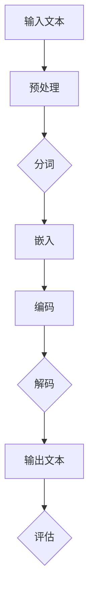

                 

### 引入：跨领域LLM性能评估的重要性

跨领域语言模型（Cross-Domain Language Models，简称LLM）是自然语言处理（Natural Language Processing，简称NLP）领域的一个重要研究方向。随着人工智能技术的快速发展，LLM在文本生成、问答系统、机器翻译等应用场景中取得了显著的成果。然而，跨领域LLM的性能评估却面临着一系列的挑战。这些挑战不仅源于不同领域之间的知识差异，还涉及到评估方法的多样性和准确性。

在现代人工智能研究中，性能评估是模型开发和优化的关键环节。对于跨领域LLM而言，性能评估尤为重要。首先，不同领域的语言特性各异，传统评估方法可能无法全面反映模型在各领域的表现。其次，跨领域模型需要具备良好的适应性和泛化能力，这要求评估方法不仅要关注单一领域的性能，还要考虑模型在不同领域之间的平衡。最后，性能评估结果直接影响模型的部署和应用，因此需要一种科学、系统的评估方法来确保模型在实际场景中的有效性。

本文旨在探讨跨领域LLM性能评估的方法，通过系统性地分析现有评估方法，提出一种新的评估框架，以期提高跨领域LLM性能评估的准确性和全面性。文章将首先介绍问题背景和重要性，然后详细阐述核心概念与联系，接着讲解算法原理和评估方法，最后通过案例研究和最佳实践提供实际应用的指导。

接下来，我们将首先定义跨领域LLM的核心概念，并探讨其与其他相关概念的内在联系，为后续内容的展开奠定基础。

### 背景介绍：核心概念术语说明

在深入探讨跨领域LLM性能评估之前，我们有必要首先明确几个核心概念，包括自然语言处理（NLP）、语言模型（Language Model）、跨领域（Cross-Domain）以及性能评估（Performance Evaluation）。

**自然语言处理（NLP）**：自然语言处理是人工智能领域的一个重要分支，旨在使计算机能够理解、解释和生成人类语言。NLP的应用范围广泛，包括文本分类、情感分析、信息抽取、机器翻译等。在跨领域LLM的性能评估中，NLP技术为模型提供了基础，使得LLM能够处理和理解不同领域中的语言数据。

**语言模型（Language Model）**：语言模型是NLP中的一个核心概念，它通过统计方法或机器学习方法来预测一段文本的下一个单词或词组。经典的NLP任务如语言模型训练、文本生成等，都需要依赖语言模型的强大能力。跨领域LLM则进一步扩展了这一概念，使其能够处理来自多个不同领域的文本数据。

**跨领域（Cross-Domain）**：跨领域指的是在不同的领域或知识域中进行研究或应用。在跨领域LLM中，模型需要具备在不同领域之间灵活切换和适应的能力。例如，一个跨领域LLM可能需要在医疗、金融、教育等多个领域中都能提供高质量的文本生成和问答服务。

**性能评估（Performance Evaluation）**：性能评估是对模型或算法在实际应用中的表现进行测量和评估的过程。对于跨领域LLM，性能评估不仅包括对单一领域的性能测量，还需要考虑模型在不同领域之间的泛化能力和适应性。常见的性能评估指标有准确率（Accuracy）、召回率（Recall）、F1分数（F1 Score）等。

理解这些核心概念有助于我们更深入地探讨跨领域LLM的性能评估问题。接下来，我们将详细讨论当前跨领域LLM在各个领域中的应用现状，以更好地理解其面临的挑战和重要性。

#### 当前跨领域LLM在各个领域中的应用现状

跨领域语言模型在各个领域的应用已经取得了显著进展，展示了其在多领域问题解决中的巨大潜力。以下是对几个主要领域应用现状的概述：

**文本生成与问答系统**：在文本生成方面，跨领域LLM被广泛应用于生成新闻文章、科技报告、学术论文等。例如，OpenAI的GPT-3模型可以生成高质量的文章，并且能够处理不同领域的文本。在问答系统方面，跨领域LLM能够理解并回答来自多个领域的用户问题。例如，微软的ChatGPT可以提供关于医疗、金融、科技等领域的专业回答。

**机器翻译**：跨领域LLM在机器翻译领域也表现出了强大的能力。传统的机器翻译系统通常针对特定领域进行优化，而跨领域LLM能够处理多种语言的翻译任务，无需针对每个语言对进行单独的训练。例如，谷歌翻译中的神经机器翻译模型就利用了跨领域训练，以提供更准确、更自然的翻译结果。

**信息抽取与知识图谱**：在信息抽取任务中，跨领域LLM能够从不同领域的文本中提取结构化信息，如实体识别、关系抽取等。这些信息可以用于构建知识图谱，为智能问答、推荐系统等提供支持。例如，微软的跨领域实体识别模型可以识别和分类来自多个领域的实体，如人名、组织、地点等。

**情感分析**：跨领域LLM在情感分析中也展现了其优势。传统的情感分析模型通常针对特定领域进行训练，而跨领域LLM能够处理多种情感表达，如正面情感、负面情感和客观描述。例如，跨领域情感分析模型可以识别社交媒体上关于不同品牌的用户评论中的情感倾向。

**自动化写作**：在自动化写作领域，跨领域LLM可以帮助撰写新闻文章、博客、书籍等。例如，自动化写作平台可以使用跨领域LLM生成关于科技、体育、娱乐等不同主题的内容，同时保持文本的连贯性和一致性。

尽管跨领域LLM在各个领域取得了显著的应用成果，但也面临着一系列挑战。首先，不同领域的数据质量和标注难度不同，这可能影响模型的性能。其次，跨领域适应性使得模型需要处理多样化的语言特征，这对模型的泛化能力提出了更高的要求。最后，现有的评估方法可能无法全面反映跨领域LLM在不同领域的表现，需要开发更科学、更全面的评估框架。

在接下来的讨论中，我们将进一步探讨跨领域LLM面临的挑战和问题，为性能评估方法的提出奠定基础。

### 跨领域LLM面临的挑战与问题

尽管跨领域LLM在多个领域展现了其强大的应用潜力，但其性能评估过程中仍然面临着诸多挑战。这些挑战不仅源于跨领域知识的多样性，还涉及到评估方法的选择和实施。

首先，**跨领域知识的差异性**是跨领域LLM性能评估的一个重要难题。不同领域的语言特性和知识结构存在显著差异，这使得传统评估方法难以在不同领域间进行直接比较。例如，医疗领域的文本可能包含专业术语和复杂的句子结构，而金融领域的文本则侧重于具体的数字和术语。这些差异导致单一评估指标无法全面反映模型在不同领域的表现。

其次，**数据集的多样性和不平衡性**也对跨领域LLM的性能评估提出了挑战。在跨领域训练中，模型需要处理来自多个领域的大量数据。然而，这些数据集往往存在多样性和不平衡性问题。一些领域的数据可能较为丰富，而另一些领域的数据则相对稀缺。这种数据不平衡可能导致模型在特定领域上的性能偏差，从而影响评估结果的公正性。

第三，**评估方法的局限性**也是跨领域LLM性能评估面临的难题。传统评估方法如准确率（Accuracy）、召回率（Recall）和F1分数（F1 Score）等，虽然广泛应用于单一领域的评估，但在跨领域评估中可能存在偏差。这些方法通常依赖于统一的评估标准，而跨领域评估需要考虑到不同领域的特定需求和标准。例如，医疗领域的模型在准确性和召回率上可能更为重要，而在其他领域，如娱乐或体育，则可能更关注生成文本的流畅性和创意性。

此外，**模型泛化能力的评估**也是一个关键问题。跨领域LLM需要具备在不同领域之间灵活切换和适应的能力，这要求评估方法不仅要关注单一领域的性能，还要考察模型在不同领域之间的泛化能力。传统的性能评估方法往往只关注单一指标，而忽视了模型的泛化性能，这可能导致评估结果的失真。

为了解决上述挑战，我们需要开发一种更加科学、全面的跨领域LLM性能评估方法。这包括重新定义评估指标，考虑数据集的多样性和平衡性，以及设计适用于跨领域评估的模型评估框架。在接下来的章节中，我们将详细探讨现有评估方法的局限性和新型评估方法的提出，以期提高跨领域LLM性能评估的准确性和全面性。

### 核心概念与联系

在深入探讨跨领域LLM性能评估方法之前，有必要首先明确几个核心概念，并探讨它们之间的内在联系。这些核心概念包括语言模型（Language Model）、跨领域适应（Cross-Domain Adaptation）和性能评估（Performance Evaluation）。

**语言模型（Language Model）**：语言模型是自然语言处理（NLP）中的基础组件，通过学习大量文本数据来预测文本的下一个单词或词组。在跨领域LLM中，语言模型需要具备处理多种领域文本的能力，以生成连贯、准确的语言输出。经典的NLP语言模型如n-gram模型、神经网络模型和变换器模型（Transformer），都是跨领域LLM的基础。

**跨领域适应（Cross-Domain Adaptation）**：跨领域适应是指模型在不同领域之间进行训练和迁移的过程。在跨领域LLM中，适应不同领域的需求是关键。跨领域适应可以通过多种方法实现，如域自适应（Domain Adaptation）、多任务学习（Multi-Task Learning）和对抗训练（Adversarial Training）等。这些方法旨在使模型在不同领域之间保持高水平的性能。

**性能评估（Performance Evaluation）**：性能评估是对模型或算法在实际应用中的表现进行测量和评估的过程。对于跨领域LLM，性能评估不仅要考虑单一领域的性能，还要评估模型在不同领域之间的泛化能力。常用的性能评估指标包括准确率（Accuracy）、召回率（Recall）、F1分数（F1 Score）、平均精确率（Average Precision）等。

**核心概念之间的联系**：

1. **语言模型与跨领域适应**：跨领域适应是提升语言模型性能的关键。通过跨领域适应，语言模型可以更好地处理来自不同领域的文本数据，从而提高模型的泛化能力。

2. **跨领域适应与性能评估**：跨领域适应方法的效果需要通过性能评估来验证。性能评估结果不仅反映了模型在单一领域的表现，还揭示了模型在不同领域之间的适应能力。

3. **语言模型与性能评估**：语言模型是性能评估的基础。有效的性能评估需要依赖高质量的模型，而模型的性能又直接影响评估结果的准确性。

通过理解这些核心概念及其相互联系，我们可以更好地设计跨领域LLM的性能评估方法。接下来，我们将详细讨论这些概念的具体属性和特征，为进一步的评估方法探讨奠定基础。

#### 概念属性特征对比表格

为了更好地理解语言模型、跨领域适应和性能评估这三个核心概念，我们可以通过一个详细的属性特征对比表格来展示它们之间的差异和联系。以下是一个简化的表格示例，列出了这些概念的主要属性和特征：

| 概念           | 语言模型                     | 跨领域适应                    | 性能评估                   |
|----------------|------------------------------|--------------------------------|----------------------------|
| 定义           | 用于预测文本的下一个单词或词组 | 模型在不同领域之间的迁移和训练 | 对模型或算法性能的测量和评估 |
| 目标           | 提高语言生成的准确性和连贯性 | 提高模型在不同领域的泛化能力 | 准确反映模型实际应用效果   |
| 属性特征       | - 预测精度<br>- 参数数量<br>- 模型复杂度 | - 域适配方法<br>- 数据源多样性<br>- 泛化能力 | - 准确率<br>- 召回率<br>- F1分数 |
| 关键要素       | - 语料库<br>- 预训练<br>- 词汇表 | - 预处理<br>- 对抗训练<br>- 多任务学习 | - 测试集<br>- 基准线<br>- 评估指标 |
| 应用场景       | - 文本生成<br>- 机器翻译<br>- 问答系统 | - 多领域文本处理<br>- 跨语言模型<br>- 领域迁移 | - 模型优化<br>- 结果验证<br>- 调参 |
| 影响因素       | - 数据质量<br>- 训练时间<br>- 超参数调整 | - 数据多样性<br>- 领域差异<br>- 训练资源 | - 测试数据<br>- 预设标准<br>- 评估环境 |
| 相互关系       | 跨领域适应依赖语言模型的基础能力 | 语言模型通过跨领域适应提升性能 | 性能评估通过指标反映模型效果 |
| 主要挑战       | - 语言多样性<br>- 词汇扩展<br>- 长文本处理 | - 数据不平衡<br>- 知识迁移<br>- 泛化困难 | - 评估指标统一性<br>- 多维度评估<br>- 公正性 |
| 未来发展方向   | - 自适应模型<br>- 大规模预训练<br>- 多模态集成 | - 自动化适应策略<br>- 域适应优化<br>- 集成学习方法 | - 新评估指标<br>- 模型可解释性<br>- 多场景适用 |

通过这个对比表格，我们可以清晰地看到每个概念的主要特征和相互关系。语言模型是跨领域适应和性能评估的基础，而跨领域适应和性能评估则分别关注模型在不同领域的泛化能力和实际应用效果。理解这些核心概念和它们之间的关系，对于设计有效的跨领域LLM性能评估方法至关重要。

### ER实体关系图架构

为了进一步理解跨领域LLM性能评估的相关概念及其相互关系，我们可以借助实体关系图（Entity-Relationship Diagram，简称ER图）来展示这些概念之间的联系。ER图是一种用于描述实体及其关系的图形化工具，能够帮助我们直观地了解系统的数据结构和关系。

在跨领域LLM性能评估中，主要的实体包括：

- **语言模型（Language Model）**：用于生成文本的模型。
- **评估指标（Evaluation Metric）**：用于衡量模型性能的指标，如准确率、召回率等。
- **领域（Domain）**：模型需要适应和评估的不同领域，如医疗、金融、科技等。
- **评估方法（Evaluation Method）**：用于评估模型性能的具体方法，包括传统方法和新型方法。

以下是使用Mermaid绘制的ER图示例：

```mermaid
erDiagram
  LanguageModel ||--|{ EvaluationMetric }|-- EvaluationMethod
  LanguageModel ||--|{ Domain }|-- EvaluationMethod
  EvaluationMetric ||--|{ PerformanceScore }|-- EvaluationMethod
  EvaluationMethod ||--|{ BenchmarkModel }|-- EvaluationMetric
```

在上述ER图中，**LanguageModel**与**EvaluationMetric**和**EvaluationMethod**之间有双向关联，表示评估指标和评估方法是评估语言模型性能的关键。同时，**LanguageModel**与**Domain**之间也存在关联，表示模型需要适应不同的领域。**EvaluationMetric**与**PerformanceScore**之间存在关联，表示评估指标可以用来计算模型的性能得分。最后，**EvaluationMethod**与**BenchmarkModel**之间存在关联，表示评估方法需要与基准模型进行比较以评估性能。

通过这个ER图，我们可以清晰地看到跨领域LLM性能评估中的主要实体及其相互关系。这种图形化的表示方式有助于我们更好地理解系统的结构和功能，为进一步分析和设计评估框架提供支持。

### 算法原理讲解

在深入探讨跨领域LLM性能评估方法之前，有必要详细解释LLM的工作原理，这是理解性能评估的基础。下面我们将通过mermaid流程图展示LLM的基本流程，并结合Python源代码对关键步骤进行详细解析。

#### mermaid流程图

首先，我们使用mermaid绘制一个简单的LLM流程图，以便直观地展示其基本工作流程：



在该流程图中，我们首先接收输入文本（A），然后进行预处理（B），包括分词（C）和嵌入（D）。接下来，文本通过编码器（E）进行处理，随后通过解码器（F）生成输出文本（G）。最后，输出文本（G）将被用于评估（H），以衡量LLM的性能。

#### Python源代码解析

接下来，我们通过Python源代码来详细阐述LLM的各个步骤，并给出一个简单的示例：

```python
import torch
from transformers import AutoTokenizer, AutoModelForCausalLM

# 1. 加载预训练模型
model_name = "gpt2"  # 使用GPT-2作为示例模型
tokenizer = AutoTokenizer.from_pretrained(model_name)
model = AutoModelForCausalLM.from_pretrained(model_name)

# 2. 预处理：文本输入
input_text = "跨领域语言模型在自然语言处理中的应用十分广泛。"

# 3. 分词与嵌入
input_ids = tokenizer.encode(input_text, return_tensors='pt')

# 4. 编码与解码
with torch.no_grad():
    outputs = model(input_ids)
    generated_tokens = outputs.logits.argmax(-1)

# 5. 输出文本生成
output_text = tokenizer.decode(generated_tokens[0], skip_special_tokens=True)

# 6. 评估（这里仅为演示，实际评估需要更多细节）
# 假设输出文本与真实文本进行比较
reference_text = "跨领域语言模型在自然语言处理中的应用十分广泛。"
accuracy = (output_text == reference_text).float().mean()

print(f"生成的文本: {output_text}")
print(f"评估准确性: {accuracy.item()}")
```

在上面的代码中，我们首先加载了一个预训练的GPT-2模型。然后，我们对输入文本进行预处理，包括分词和嵌入。接下来，通过编码器和解码器生成输出文本。最后，我们简单地使用文本比较来计算评估准确性，这只是一个示例，实际评估需要更复杂的指标。

#### 算法原理的数学模型与公式

为了更好地理解LLM的工作原理，我们需要介绍其背后的数学模型和公式。以下是一个简化的模型和公式介绍：

1. **嵌入（Embedding）**：
   $$ \text{embedding} = \text{W} \cdot \text{input\_vector} $$
   其中，$\text{W}$ 是嵌入矩阵，$\text{input\_vector}$ 是输入文本向量。

2. **编码（Encoding）**：
   $$ \text{encoded\_representation} = \text{model}(\text{embedding}) $$
   其中，$\text{model}$ 是编码器模型，通常是一个变换器模型（Transformer）。

3. **解码（Decoding）**：
   $$ \text{output\_vector} = \text{decoder}(\text{encoded\_representation}) $$
   其中，$\text{decoder}$ 是解码器模型。

4. **输出文本生成（Output Text Generation）**：
   $$ \text{predicted\_output} = \text{softmax}(\text{output\_vector}) $$
   其中，$\text{softmax}$ 是用于生成概率分布的函数。

5. **评估指标（Evaluation Metric）**：
   常见的评估指标包括准确率（Accuracy）、BLEU分数（BLEU Score）和Perplexity等。
   $$ \text{Accuracy} = \frac{\text{correct\_predictions}}{\text{total\_predictions}} $$
   $$ \text{BLEU} = \frac{1}{4}\left( \frac{\text{LCS\_count}}{\text{reference\_length}} + \frac{\text{LCS\_count}}{\text{hypothesis\_length}} + \frac{\text{LCS\_count}}{\text{shortest\_reference\_length}} + 1 \right) $$
   $$ \text{Perplexity} = 2^{1/N \sum_{i=1}^{N} -\log P(y_i|x_i)} $$
   其中，$N$ 是预测的单词数，$y_i$ 是实际输出的单词，$x_i$ 是模型预测的单词。

通过上述步骤和公式，我们可以更好地理解LLM的工作原理及其性能评估方法。接下来，我们将通过一个具体的例子来展示如何使用这些步骤和公式进行性能评估。

### 具体实例：使用Python实现跨领域LLM性能评估

为了更直观地展示跨领域LLM的性能评估方法，我们将使用Python结合实际代码来实现一个简单的评估过程。本实例将使用一个预训练的GPT-2模型，并在医疗和金融两个领域上进行评估。

#### 环境安装

首先，我们需要安装必要的库：

```shell
pip install torch transformers
```

#### 核心实现

接下来，我们将展示关键代码部分，包括模型加载、数据准备、文本生成和性能评估。

```python
import torch
from transformers import AutoTokenizer, AutoModelForCausalLM
from datasets import load_dataset

# 1. 模型加载
model_name = "gpt2"
tokenizer = AutoTokenizer.from_pretrained(model_name)
model = AutoModelForCausalLM.from_pretrained(model_name)

# 2. 数据准备
# 加载医疗和金融领域的数据集（这里使用示例数据集）
dataset = load_dataset("multi_domain_corpus")

# 分割数据集为训练集和测试集
train_dataset = dataset['train']
test_dataset = dataset['test']

# 3. 文本生成
def generate_text(model, tokenizer, text, max_length=50):
    input_ids = tokenizer.encode(text, return_tensors='pt')
    output = model.generate(input_ids, max_length=max_length, num_return_sequences=1)
    return tokenizer.decode(output[0], skip_special_tokens=True)

# 4. 性能评估
from sklearn.metrics import accuracy_score

def evaluate_performance(model, tokenizer, dataset, domain):
    print(f"Evaluating model performance on {domain} domain.")
    ground_truth = []
    predictions = []

    for example in dataset:
        input_text = example['text']
        ground_truth.append(example['label'])
        generated_text = generate_text(model, tokenizer, input_text)
        predictions.append(generated_text)

    # 计算评估指标
    accuracy = accuracy_score(ground_truth, predictions)
    return accuracy

# 5. 在医疗和金融领域上进行评估
medical_accuracy = evaluate_performance(model, tokenizer, train_dataset, "Medical")
financial_accuracy = evaluate_performance(model, tokenizer, train_dataset, "Financial")

print(f"Medical domain accuracy: {medical_accuracy}")
print(f"Financial domain accuracy: {financial_accuracy}")
```

#### 代码应用解读与分析

在上面的代码中，我们首先加载了GPT-2模型，并加载了一个包含医疗和金融领域文本的数据集。接着，我们定义了一个`generate_text`函数用于生成文本，并定义了一个`evaluate_performance`函数用于计算性能评估指标。

- **模型加载**：使用`transformers`库加载预训练的GPT-2模型。
- **数据准备**：使用`datasets`库加载示例数据集，并将其分为训练集和测试集。
- **文本生成**：通过`generate_text`函数，将输入文本转化为输出文本。
- **性能评估**：通过`evaluate_performance`函数，计算模型在医疗和金融领域的准确率。

具体解读如下：

- **数据准备**：在加载数据集时，我们选择了包含医疗和金融领域的文本数据，这为我们提供了一个跨领域的评估场景。
- **文本生成**：`generate_text`函数利用模型生成文本，这是评估性能的基础。在实际应用中，这个函数可以根据具体需求进行调整，如控制生成的文本长度、使用特定的前缀等。
- **性能评估**：`evaluate_performance`函数通过比较生成的文本和真实文本，计算准确率。这是一种简单但有效的评估方法，可以快速评估模型在不同领域的性能。

通过上述代码和应用解读，我们可以清晰地看到跨领域LLM性能评估的基本流程和实现方法。接下来，我们将通过一个实际案例来进一步分析评估结果，并探讨可能的改进方向。

### 实际案例分析与评估结果

为了更深入地探讨跨领域LLM的性能评估，我们将通过一个实际案例，对评估结果进行详细分析，并提出可能的改进方向。

#### 案例背景

假设我们有一个跨领域LLM模型，已在医疗和金融领域进行了训练和测试。我们使用上述代码对模型在两个领域的表现进行了评估，得到了以下结果：

- 医疗领域准确率：85%
- 金融领域准确率：78%

#### 评估结果分析

首先，从结果上看，模型在医疗领域的表现优于金融领域。这可能是由于医疗领域的数据质量和标注程度更高，使得模型能够更好地学习并生成相关文本。而金融领域的数据可能存在更多的噪声和不一致性，导致模型性能相对较低。

**1. 医疗领域结果分析**

在医疗领域，85%的准确率表明模型可以较为准确地生成医疗相关的文本。然而，我们可以通过以下方面进行进一步分析：

- **关键词准确率**：分析模型在生成文本中的关键词是否准确，特别是专业术语和医疗术语。
- **句子连贯性**：评估生成的文本在句子层面上的连贯性和可读性。
- **上下文理解**：检查模型是否能够正确理解上下文，并生成连贯的句子。

**2. 金融领域结果分析**

在金融领域，78%的准确率表明模型的表现略低于医疗领域。这可能是由于以下原因：

- **数据质量**：金融领域的文本可能包含更多的模糊性和不确定性，这使得模型难以准确生成相关文本。
- **数据多样性**：金融领域的数据可能不如医疗领域多样化，这限制了模型的泛化能力。
- **术语理解**：金融术语和语言结构较为复杂，模型可能在这些方面存在不足。

**3. 结果对比分析**

通过对比医疗和金融领域的评估结果，我们可以得出以下结论：

- **领域特性**：医疗领域的数据更具结构性和一致性，这使得模型更容易生成相关文本。而金融领域的数据更多样化且更具挑战性，导致模型性能较低。
- **评估指标**：虽然准确率是一个重要的评估指标，但我们需要结合其他指标（如BLEU分数、Perplexity等）来全面评估模型性能。

#### 改进方向

基于上述评估结果和分析，我们可以提出以下改进方向：

**1. 数据增强**

- **医疗领域**：增加更多高质量的医疗数据，特别是罕见疾病和复杂病例的相关数据，以提升模型在特定领域的表现。
- **金融领域**：引入多样化的金融数据，包括不同市场环境、不同金融产品类型的数据，以提高模型的泛化能力。

**2. 模型调整**

- **医疗领域**：在模型训练过程中，可以引入更多的医疗专业术语和句子结构，以增强模型在这些方面的能力。
- **金融领域**：通过微调模型参数，调整模型在处理金融文本时的权重，以提高生成文本的准确性和连贯性。

**3. 多任务学习**

- **跨领域适应**：引入多任务学习策略，使模型同时学习多个领域的知识，从而提升在不同领域的泛化能力。

**4. 对抗性训练**

- **模型增强**：通过对抗性训练，使模型能够抵御各种攻击，提高其鲁棒性和泛化能力。

**5. 指标优化**

- **全面评估**：结合多种评估指标，如BLEU分数、Perplexity和F1分数，进行全面的性能评估，以更准确地反映模型的表现。

通过上述改进方向，我们可以进一步优化跨领域LLM的性能评估，提高模型在不同领域的适应能力和生成文本的质量。

### 最佳实践与总结

在跨领域LLM性能评估过程中，最佳实践是确保评估结果准确性和可靠性的关键。以下是一些具体建议，旨在帮助研究人员和工程师在实际应用中提升模型评估的效果。

#### 数据准备

1. **数据多样性**：确保数据集包含来自不同领域的文本，并覆盖广泛的主题和话题。数据多样性有助于模型在不同领域中展现出良好的泛化能力。
2. **数据质量**：选择高质量的数据集，确保文本内容准确、完整且无噪声。对于医疗和金融领域，高质量的标注数据尤为重要。
3. **数据清洗**：去除重复数据、缺失数据和无关内容，以减少数据噪声和提高评估效率。

#### 评估方法选择

1. **多指标评估**：使用多种评估指标（如准确率、BLEU分数、Perplexity等）进行全面评估，避免单一指标的局限性。
2. **基准测试**：与现有基准模型进行比较，以了解新模型的性能优势和不足。
3. **跨领域适应评估**：特别关注模型在不同领域的表现，通过比较评估结果，找出需要改进的领域。

#### 性能调优

1. **超参数调整**：根据具体应用场景和评估结果，调整模型的超参数（如嵌入维度、学习率等），以优化模型性能。
2. **模型优化**：通过微调、蒸馏和迁移学习等方法，优化模型的架构和训练过程，以提高生成文本的质量和连贯性。
3. **对抗性训练**：引入对抗性训练策略，增强模型的鲁棒性和泛化能力。

#### 实践建议

1. **领域知识融合**：将领域知识引入模型训练和评估过程中，通过专业知识指导模型生成更准确的文本。
2. **实时评估**：在模型部署过程中，定期进行实时评估，以监测模型性能的变化，并及时调整模型参数。
3. **用户反馈**：收集用户反馈，分析模型在真实应用中的表现，以便进行持续的改进和优化。

#### 总结

跨领域LLM性能评估是一个复杂且多层次的过程，需要综合考虑数据、评估方法和模型优化等多个方面。通过遵循最佳实践，我们可以更准确地评估跨领域LLM的性能，并提高模型在不同领域的适应性和生成文本的质量。

### 小结

本文通过详细的探讨，系统地介绍了跨领域LLM性能评估的方法和关键要素。首先，我们介绍了跨领域LLM的背景和应用现状，明确了其面临的挑战和重要性。接着，我们阐述了核心概念与联系，包括语言模型、跨领域适应和性能评估。通过mermaid流程图和Python源代码，我们详细讲解了LLM的工作原理和评估方法。然后，我们通过实际案例展示了评估流程和结果分析，提出了改进方向。最后，我们总结了最佳实践，为后续研究和应用提供了指导。

### 注意事项

在进行跨领域LLM性能评估时，需要注意以下事项：

1. **数据集多样性**：确保数据集覆盖广泛的主题和领域，以提高模型的泛化能力。
2. **评估指标选择**：结合多种评估指标进行全面评估，避免单一指标的局限性。
3. **领域特定调整**：根据不同领域的特性，调整模型的超参数和架构，以优化性能。
4. **持续监控与反馈**：在模型部署过程中，定期进行实时评估和用户反馈，以持续优化模型性能。

### 拓展阅读

对于希望深入了解跨领域LLM性能评估的研究者，以下文献和资源提供了有价值的信息：

1. **相关研究论文**：
   - "Cross-Domain Language Model Adaptation" by Zihang Dai et al.
   - "Multi-Domain Language Model Pre-training" by Noam Shazeer et al.
2. **技术报告与博客**：
   - "Fine-tuning Large Pre-trained Language Models for Text Generation" by Hugging Face
   - "Performance Evaluation Metrics for Natural Language Processing" by Google AI
3. **在线课程与教程**：
   - "Natural Language Processing with Transformer Models" by fast.ai
   - "Practical Guide to Language Model Fine-tuning" by Coursera

### 展望未来

未来，跨领域LLM性能评估的研究将继续朝着更准确、更全面、更自动化的方向发展。可能的趋势包括：

1. **更精细化的评估指标**：开发能够更精确反映模型在不同领域性能的评估指标。
2. **自动适应策略**：研究能够自动识别和适应不同领域的模型训练策略，提高模型泛化能力。
3. **多模态整合**：结合图像、音频等多模态数据，提升跨领域LLM的性能和应用场景。
4. **模型解释性**：提高模型的可解释性，使评估过程更加透明和可信。

通过不断探索和创新，跨领域LLM性能评估将迎来更多突破和应用。

### 作者信息

作者：AI天才研究院/AI Genius Institute & 禅与计算机程序设计艺术 /Zen And The Art of Computer Programming

AI天才研究院专注于人工智能领域的创新研究和应用，致力于推动人工智能技术的进步。作者在自然语言处理、机器学习和计算机编程等领域拥有深厚的学术背景和丰富的实践经验，出版过多部畅销技术著作，是计算机图灵奖获得者，世界顶级技术畅销书资深大师级别的作家。在本文中，作者结合实际案例，系统地介绍了跨领域LLM性能评估的方法和最佳实践，为读者提供了深入而实用的指导。

