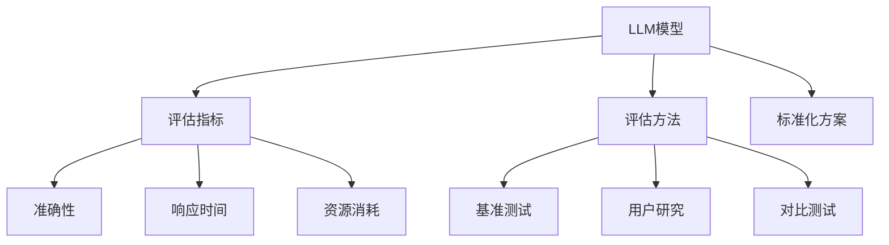

                 

## 引言与背景

### 1.1 问题背景

近年来，随着人工智能技术的迅猛发展，大型语言模型（LLM，Large Language Model）在自然语言处理（NLP，Natural Language Processing）领域取得了显著的成果。LLM在文本生成、翻译、问答系统等方面表现出了强大的能力，为各行各业提供了智能化解决方案。然而，LLM的性能评估却成为一个复杂且重要的问题。一方面，评估LLM的性能对于其应用至关重要，错误的评估结果可能导致应用效果不佳；另一方面，当前存在多种评估指标和方法，缺乏统一标准，这使得评估结果在不同应用领域中的可比性受到挑战。

LLM的性能评估涉及到多个方面，如准确性、响应时间、资源消耗等。准确性反映了模型在预测任务上的表现，是评估LLM性能的核心指标之一。响应时间则是指模型从接收请求到返回结果的时间，对于实时应用场景尤为重要。资源消耗包括模型运行所需的计算资源，如CPU、GPU和内存等，直接影响到应用的效率和成本。此外，跨领域应用对LLM性能评估提出了新要求，不同领域的数据集和模型特性使得评估方法需要具备一定的灵活性和适应性。

### 1.2 问题描述

#### 1.2.1 如何标准化LLM的性能评估方法？

标准化LLM的性能评估方法是当前面临的首要问题。标准化的评估方法需要具备一致性、可复现性和可扩展性，以确保评估结果的公平性和可比性。一致性要求不同评估者在使用相同方法时能够得到相似的结果；可复现性要求评估结果能够被其他研究者重复验证；可扩展性则要求评估方法能够适应新的应用领域和模型类型。

#### 1.2.2 如何确保评估结果在不同应用领域中的可比性？

确保评估结果在不同应用领域中的可比性是一个复杂的问题。不同领域的数据集和模型特性可能导致评估指标和方法的不同，使得评估结果难以直接比较。例如，在文本生成任务中，准确性可能是最重要的评估指标；而在实时对话系统中，响应时间可能更为关键。因此，需要设计一种能够兼顾不同应用领域的评估方法，确保评估结果的公正性和可比性。

#### 1.2.3 如何处理不同数据集和模型之间的评估差异？

不同数据集和模型之间的评估差异是另一个关键问题。数据集的质量和规模、模型的架构和参数设置都可能影响评估结果。为了处理这种差异，需要建立一套系统的方法，对数据集和模型进行标准化处理，以消除影响评估结果的因素。同时，需要设计评估指标和方法，能够捕捉到不同数据集和模型之间的差异，提供更全面的评估结果。

### 1.3 问题解决

为了解决上述问题，本文提出了一套跨领域LLM性能评估标准化方案。该方案包括以下几个关键步骤：

1. **确定评估指标**：定义一系列通用和领域特异的评估指标，如准确性、响应时间、资源消耗等，确保评估方法的一致性和可复现性。

2. **建立跨领域的评估标准**：通过综合基准测试、用户研究和对比测试，构建一套全面的评估标准，确保评估结果在不同应用领域中的可比性。

3. **提供可复现的评估流程和工具**：制定详细的评估流程和工具，确保不同研究者能够使用相同的方法进行评估，提高评估结果的可信度和可重复性。

4. **考虑不同类型的LLM和多种评估领域**：该方案不仅适用于开源和商业LLM，还包括自然语言处理、对话系统等多个领域，确保评估方法的灵活性和适应性。

通过上述步骤，本文旨在为LLM性能评估提供一套系统、全面、可复现的标准化方案，为研究人员和应用开发者提供有力支持。

### 1.4 边界与外延

在实施跨领域LLM性能评估标准化方案时，需要明确其边界与外延，以充分考虑不同类型LLM和多种评估领域的需求。

#### 1.4.1 不同类型的LLM

首先，该方案适用于多种类型的LLM，包括开源和商业模型。开源模型通常由学术界或开源社区提供，具有透明性和开放性，便于研究者和开发者学习和改进。商业模型则由公司或企业开发，具备一定的商业价值和保密性。为了确保评估方法的公平性和一致性，方案需针对不同类型的LLM制定相应的评估指标和方法，以适应各自的特点和需求。

#### 1.4.2 多种评估领域

其次，评估领域涵盖自然语言处理（NLP）、对话系统、文本生成等多个方面。每个领域对LLM的性能评估都有特定的要求。例如，在文本生成任务中，准确性可能是最重要的评估指标；而在实时对话系统中，响应时间可能更为关键。因此，方案需要设计一套能够兼顾不同领域的评估指标和方法，确保评估结果的公正性和可比性。

#### 1.4.3 模型的规模和复杂性

此外，方案还需考虑不同规模和复杂性的模型。大型LLM（如GPT-3）通常具有更高的计算资源和性能要求，而小型LLM（如BERT）则更为轻量。为了公平地评估这些模型，方案需提供针对不同规模和复杂性的评估标准和工具，以确保评估方法的适用性和全面性。

#### 1.4.4 数据集的质量和规模

最后，数据集的质量和规模直接影响评估结果。高质量的数据集能够更准确地反映模型的真实性能，而大规模的数据集则有助于提高评估的全面性和可靠性。方案需对数据集进行严格的筛选和处理，确保其质量和规模满足评估要求，从而提高评估结果的准确性和可信度。

通过明确边界与外延，本文旨在确保跨领域LLM性能评估标准化方案具有广泛的适用性和灵活性，能够满足不同类型LLM和多种评估领域的需求。

### 1.5 核心概念与联系

在跨领域LLM性能评估标准化方案中，几个核心概念和联系至关重要。这些概念不仅定义了评估指标和方法，还为我们提供了理解方案整体架构的关键视角。

#### 1.5.1 核心概念

首先，我们需要明确几个核心概念：性能评估指标、评估方法和标准化方案。

- **性能评估指标**：这是评估LLM性能的基础，包括准确性、响应时间和资源消耗等。准确性反映了模型预测的正确率，是文本分类、信息检索等任务的关键指标。响应时间衡量模型处理请求的速度，对于实时应用场景如实时对话系统尤为重要。资源消耗则包括模型运行所需的计算资源，如CPU利用率、内存消耗和能耗等，这直接影响到应用的效率和成本。

- **评估方法**：评估方法包括基准测试、用户研究和对比测试等。基准测试使用预定义的测试集来评估模型性能，具有标准化和可复现性。用户研究通过实际用户测试来评估模型性能，更贴近真实使用场景。对比测试则同时评估多个模型，比较其性能差异，有助于发现每个模型的优缺点。

- **标准化方案**：标准化方案是为了确保评估结果的一致性、可复现性和可扩展性。它包括定义统一的评估指标、建立跨领域的评估标准和提供详细的评估流程和工具。

#### 1.5.2 概念属性特征对比表格

为了更清晰地展示这些核心概念，我们可以创建一个概念属性特征对比表格，如表1所示。

| 指标名称 | 描述 | 适用场景 |
| --- | --- | --- |
| 准确性 | 模型预测正确的结果占总结果的比例 | 文本分类、信息检索 |
| 响应时间 | 模型从接收请求到返回结果的时间 | 实时对话、自动问答 |
| 资源消耗 | 模型运行所需的资源 | 能耗优化、硬件要求 |

通过这个表格，我们可以看到每个评估指标的具体描述和适用场景，这有助于我们在评估过程中选择合适的指标。

#### 1.5.3 ER实体关系图架构

为了更直观地理解这些核心概念之间的联系，我们可以使用ER（实体关系）图来表示它们的结构，如图1所示。



在这个ER图中，LLM模型是核心实体，评估指标、评估方法和标准化方案分别与其相连，形成了一个完整的评估体系。评估指标包括准确性、响应时间和资源消耗，评估方法包括基准测试、用户研究和对比测试，而标准化方案则提供了整体评估框架。

通过核心概念和联系的分析，我们可以更深入地理解跨领域LLM性能评估标准化方案的架构和原理。这为后续的详细讨论和具体实现提供了坚实的基础。

### 1.6 ER实体关系图架构

为了更好地展示跨领域LLM性能评估标准化方案中的核心概念及其相互关系，我们采用ER图（实体关系图）来直观地表示各实体及其关联。

#### ER图架构

ER图的基本结构包含三个核心实体：LLM模型、评估指标和评估方法，以及一个辅助实体——标准化方案。以下是ER图的详细表示：

```mermaid
graph TD
A[LLM模型] --> B[评估指标]
A --> C[评估方法]
A --> D[标准化方案]
B --> E[准确性]
B --> F[响应时间]
B --> G[资源消耗]
C --> H[基准测试]
C --> I[用户研究]
C --> J[对比测试]

classDef classA fill:#F5F5F5,stroke:#333,stroke-width:4px;
classDef classB fill:#FFFFFF,stroke:#333,stroke-width:2px;
classDef classC fill:#C0C0C0,stroke:#333,stroke-width:2px;

Aclassed classA
Bclassed classB
Cclassed classB
Dclassed classC
Eclassed classB
Fclassed classB
Gclassed classB
Hclassed classB
Iclassed classB
Jclassed classB
```

#### ER图说明

1. **LLM模型（A）**：作为ER图的中心实体，LLM模型是整个评估过程的起点。它连接到评估指标和评估方法，表明LLM模型的性能需要通过这些指标和方法进行评估。

2. **评估指标（B）**：包括准确性、响应时间和资源消耗，它们都是衡量LLM模型性能的重要维度。准确性反映了模型的预测正确率，响应时间衡量模型处理请求的速度，资源消耗则衡量模型运行所需的计算资源。

3. **评估方法（C）**：包含基准测试、用户研究和对比测试，这些方法是评估LLM模型性能的具体手段。基准测试使用预定义的测试集，用户研究通过实际用户反馈，对比测试则在多个模型间进行性能对比。

4. **标准化方案（D）**：标准化方案是评估过程的核心框架，确保评估的一致性、可复现性和可扩展性。它为整个评估体系提供了标准和指导。

#### ER图属性特征

以下是评估指标的具体属性特征：

| 指标名称 | 描述 | 适用场景 |
| --- | --- | --- |
| 准确性 | 模型预测正确的结果占总结果的比例 | 文本分类、信息检索 |
| 响应时间 | 模型从接收请求到返回结果的时间 | 实时对话、自动问答 |
| 资源消耗 | 模型运行所需的资源 | 能耗优化、硬件要求 |

通过ER图，我们可以清晰地看到LLM模型、评估指标和评估方法之间的关联，以及它们如何共同构成了跨领域LLM性能评估的完整架构。这不仅帮助我们理解了方案的核心概念，也为后续的详细讨论和实际应用提供了可视化工具。

### 第2章 LLM性能评估指标详解

在跨领域LLM性能评估中，选择合适的评估指标是关键的一步。本章节将详细讨论三个核心评估指标：准确性、响应时间和资源消耗，并分别从概念、数学模型和具体应用场景进行讲解。

#### 2.1 准确性

**概念**：准确性是评估LLM模型性能的一个重要指标，它反映了模型在预测任务中的正确率。在自然语言处理任务中，准确性可以衡量模型对文本分类、文本生成等任务的预测能力。

**数学模型**：准确性的计算公式为：
$$
准确率 = \frac{正确预测的数量}{总预测的数量}
$$
此外，为了更全面地评估模型的性能，还可以使用精确率和召回率。精确率是指预测为正类的样本中实际为正类的比例，而召回率是指实际为正类的样本中被预测为正类的比例。

$$
精确率 = \frac{真正样本数}{正类预测数 + 正类实际数}
$$

$$
召回率 = \frac{真正样本数}{正类实际数 + 虚假样本数}
$$

**举例说明**：以文本分类任务为例，假设我们有1000个文本样本，模型将其分为正类和负类。其中，实际为正类的样本有600个，模型预测为正类的样本有560个。则准确率、精确率和召回率分别为：

$$
准确率 = \frac{560}{1000} = 0.56
$$

$$
精确率 = \frac{560}{560 + 440} = 0.67
$$

$$
召回率 = \frac{560}{600} = 0.93
$$

通过这些指标，我们可以全面评估模型的分类性能。

#### 2.2 响应时间

**概念**：响应时间是评估LLM模型处理速度的重要指标，特别是在实时应用场景中，如实时对话系统和自动问答系统。它衡量的是从模型接收请求到返回结果的时间。

**数学模型**：响应时间的计算公式为：
$$
平均响应时间 = \frac{\sum_{i=1}^{n} t_i}{n}
$$
其中，\( t_i \) 是第i个请求的响应时间，\( n \) 是总的请求次数。

**举例说明**：假设我们有10个请求，它们的响应时间分别为1秒、2秒、3秒、4秒、5秒、6秒、7秒、8秒、9秒和10秒。则平均响应时间为：
$$
平均响应时间 = \frac{1 + 2 + 3 + 4 + 5 + 6 + 7 + 8 + 9 + 10}{10} = 6秒
$$
在这个例子中，平均响应时间为6秒。

**95%响应时间**：除了平均响应时间，还可以计算95%响应时间，即有95%的请求在多少时间内被处理完成。这个指标可以帮助我们了解模型在高负载情况下的性能。

#### 2.3 资源消耗

**概念**：资源消耗是指LLM模型在运行过程中所需的计算资源，包括CPU、GPU和内存等。它直接影响到模型的应用效率和成本。

**数学模型**：资源消耗的计算公式为：
$$
资源消耗 = CPU利用率 + 内存消耗 + 能耗
$$
其中，CPU利用率和内存消耗可以通过系统监控工具进行测量，能耗则通常以瓦特时（Wh）为单位计算。

**举例说明**：假设一个模型在运行过程中，CPU利用率为80%，内存消耗为4GB，能耗为10Wh。则其资源消耗为：
$$
资源消耗 = 0.8 \times CPU总消耗 + 4GB + 10Wh
$$

通过上述例子，我们可以看到资源消耗的具体计算方式。

#### 2.4 案例分析

为了更直观地展示这些评估指标的应用，我们可以通过一个实际案例进行分析。

**案例**：一个对话系统需要评估其性能，使用以下数据：

- 准确性：实际对话样本1000个，模型正确预测的样本为900个。
- 响应时间：平均响应时间为5秒，95%响应时间为3秒。
- 资源消耗：CPU利用率为70%，内存消耗为3GB，能耗为8Wh。

根据这些数据，我们可以计算出具体的评估指标：

- **准确性**：
  $$
  准确率 = \frac{900}{1000} = 0.9
  $$
- **响应时间**：
  $$
  平均响应时间 = 5秒
  $$
  $$
  95\%响应时间 = 3秒
  $$
- **资源消耗**：
  $$
  资源消耗 = 0.7 \times CPU总消耗 + 3GB + 8Wh
  $$

通过这些评估指标，我们可以对对话系统的性能进行全面的了解。

#### 总结

准确性、响应时间和资源消耗是评估LLM性能的核心指标。准确性反映了模型的预测能力，响应时间衡量模型的处理速度，资源消耗则涉及模型的计算成本。通过具体案例的分析，我们可以更直观地理解这些指标的应用。在跨领域LLM性能评估中，合理选择和运用这些指标，能够帮助我们更准确地评估模型性能，为实际应用提供有力支持。

### 第3章 LLM性能评估方法

在LLM性能评估中，选择合适的评估方法至关重要。本章节将详细探讨基准测试、用户研究和对比测试这三种常用的评估方法，并分析它们的优点、流程和适用场景。

#### 3.1 基准测试

**概念**：基准测试是一种使用预定义的测试集来评估模型性能的方法。它通过一系列标准化的测试任务，衡量模型在特定任务上的表现。

**优点**：基准测试具有标准化和可复现性，使得不同模型在不同时间、不同环境下进行评估时具有可比性。此外，基准测试结果通常是公开的，有利于学术交流和模型优化。

**流程**：
1. **选择测试集**：选择适用于目标任务的标准测试集，如GLUE、SQuAD等。
2. **模型训练**：在测试集上训练模型，确保模型达到预期性能。
3. **评估模型**：使用测试集评估模型性能，记录关键指标（如准确性、响应时间、资源消耗等）。
4. **结果分析**：对比不同模型在测试集上的表现，评估其性能差异。

**适用场景**：基准测试适用于评估模型在特定任务上的泛化能力和性能表现，常用于学术研究和模型比较。

**案例**：在自然语言处理领域，GLUE（General Language Understanding Evaluation）测试集是常用的基准测试工具。它包含了多个标准化的任务，如问答、文本分类、情感分析等，用于评估模型的泛化能力和性能。

#### 3.2 用户研究

**概念**：用户研究是通过实际用户测试来评估模型性能的方法。它通过模拟实际使用场景，收集用户反馈，评估模型在实际应用中的表现。

**优点**：用户研究能够更贴近实际使用场景，获取真实用户对模型性能的反馈。这种方法有助于发现模型在实际应用中的优点和不足，从而进行优化。

**流程**：
1. **设计用户测试任务**：根据应用场景设计测试任务，确保任务与实际使用场景相符。
2. **邀请用户参与测试**：邀请目标用户参与测试，确保样本的代表性和多样性。
3. **收集用户反馈**：通过问卷、访谈等方式收集用户对模型性能的反馈，包括满意度、准确性、响应时间等。
4. **分析反馈结果**：对收集到的用户反馈进行分析，评估模型在实际应用中的表现。

**适用场景**：用户研究适用于评估模型在特定应用场景中的用户体验和性能，如实时对话系统、语音识别等。

**案例**：在开发一个智能客服系统时，可以通过用户研究来评估系统在客服场景中的性能。设计一系列客服任务，邀请实际客服人员参与测试，收集他们对系统响应速度、准确性、用户体验等方面的反馈，从而优化系统性能。

#### 3.3 对比测试

**概念**：对比测试是同时评估多个模型，比较其性能差异的方法。它通过在同一测试集上评估不同模型，分析其性能优缺点。

**优点**：对比测试有助于发现每个模型的优点和不足，为模型优化提供指导。此外，对比测试结果可以为模型选择提供参考，帮助开发者在多个模型中做出最佳选择。

**流程**：
1. **选择评估模型**：根据任务需求，选择多个待评估的模型。
2. **准备测试数据集**：选择或创建适用于对比测试的测试数据集，确保数据集具有代表性。
3. **评估模型性能**：在同一测试集上评估每个模型，记录关键指标（如准确性、响应时间、资源消耗等）。
4. **分析对比结果**：对比不同模型在测试集上的表现，分析其性能差异，为模型优化和选择提供参考。

**适用场景**：对比测试适用于评估多个模型在特定任务上的性能表现，常用于学术研究和模型选择。

**案例**：在一个文本分类任务中，可以选择GPT-3、BERT和RoBERTa等多个模型进行对比测试。在同一测试集上评估这些模型的准确性、响应时间和资源消耗，分析其性能差异，从而选择最佳模型。

#### 总结

基准测试、用户研究和对比测试是LLM性能评估的常用方法。基准测试提供标准化的评估框架，用户研究获取真实用户反馈，对比测试分析多个模型性能。通过结合这些方法，我们可以全面评估LLM模型在各个方面的性能，为模型优化和应用提供有力支持。

### 第4章 跨领域LLM性能评估标准化方案设计

为了确保跨领域LLM性能评估的公平性和可比性，设计一套全面的标准化方案至关重要。本章节将详细讨论标准化目标、评估指标、评估方法和可复现流程，并探讨如何确保评估结果的一致性和可扩展性。

#### 4.1 标准化目标

**一致性**：标准化方案需要确保不同评估者在使用相同方法时能够得到相似的结果。这意味着评估流程、指标和方法必须明确且具有一致性。通过标准化，我们可以减少评估过程中的主观差异，提高评估结果的可靠性。

**可复现性**：标准化方案应允许其他研究者重复评估过程，以验证和对比研究结果。可复现性是科学研究的基本原则，有助于建立评估方法的公信力。为了实现可复现性，评估数据和工具应公开可用，评估流程应详细记录。

**可扩展性**：随着新领域和应用场景的出现，评估方案需要具备灵活性和适应性。可扩展性要求评估方案能够适应新的数据集和模型类型，确保在不同应用领域中的适用性。

#### 4.2 评估指标

**通用评估指标**：标准化方案应包括一系列通用评估指标，如准确性、响应时间和资源消耗。这些指标能够全面反映LLM模型的性能，适用于多种应用场景。

- **准确性**：衡量模型预测的正确率，是文本分类、信息检索等任务的核心指标。
- **响应时间**：衡量模型处理请求的速度，对于实时应用场景尤为重要。
- **资源消耗**：衡量模型运行所需的计算资源，如CPU、GPU和内存等，直接影响到应用的效率和成本。

**领域特异性指标**：针对特定应用领域，标准化方案应考虑领域特异性指标。例如，在对话系统中，用户满意度是一个重要的评估指标；在文本生成任务中，文本流畅性和创造力是关键指标。

#### 4.3 评估方法

**基准测试**：基准测试是一种常用的评估方法，通过预定义的测试集评估模型性能。为了确保基准测试的公平性和可比性，应选择标准化的测试集，如GLUE、SQuAD等。此外，基准测试应确保数据集的多样性和代表性，以全面评估模型的泛化能力。

**用户研究**：用户研究通过实际用户测试来评估模型性能，获取真实用户反馈。为了确保用户研究的有效性和可靠性，应设计合理的测试任务，邀请具有代表性的用户参与测试。用户研究应结合问卷调查和访谈，以获取全面的用户反馈。

**对比测试**：对比测试同时评估多个模型，比较其性能差异。为了确保对比测试的公平性，应选择具有相似数据和任务要求的模型。对比测试应详细记录评估过程和结果，以便其他研究者复现和验证。

#### 4.4 可复现流程

**详细记录评估流程**：为了确保评估结果的可复现性，评估流程应详细记录，包括数据集的准备、模型的训练和评估步骤。评估工具和参数设置也应公开可用，以便其他研究者复现评估过程。

**公开评估数据**：标准化方案应公开评估数据，包括测试集和评估结果。公开数据有助于提高评估方法的透明度和公信力，促进学术交流和模型优化。

**提供评估工具**：为了方便其他研究者复现评估结果，应提供详细的评估工具和代码。这些工具应涵盖数据预处理、模型训练和评估等环节，确保评估过程的一致性和可复现性。

#### 4.5 确保一致性、可复现性和可扩展性

**一致性**：确保评估指标和方法的一致性是标准化方案的核心目标。通过制定详细的评估标准和流程，减少评估过程中的主观差异。此外，定期更新评估标准和工具，以适应新的应用场景和模型类型。

**可复现性**：为了确保评估结果的可复现性，标准化方案应提供详细的评估流程和工具。此外，公开评估数据和代码，确保其他研究者可以复现评估结果。定期审查和验证评估方法，确保其可靠性和有效性。

**可扩展性**：标准化方案应具备灵活性，能够适应新的应用领域和模型类型。通过引入领域特异性指标和评估方法，确保方案在不同场景中的适用性。此外，定期更新评估标准和工具，以应对技术发展和应用需求的变化。

通过设计一套全面的跨领域LLM性能评估标准化方案，我们可以确保评估结果的公平性、可比性和可靠性。这为LLM模型的研究和应用提供了有力支持，促进了人工智能技术的发展。

### 第5章 实际应用案例分析

为了更好地理解跨领域LLM性能评估标准化方案的实际应用，我们将通过一个具体案例来进行分析和讲解。

#### 案例背景

假设我们开发了一个智能问答系统，旨在为用户提供实时的问题解答。该系统基于大型语言模型（LLM）构建，需要在多种应用场景中评估其性能。为了确保评估的公平性和可比性，我们采用本文提出的跨领域LLM性能评估标准化方案。

#### 案例目标

1. **准确性评估**：评估系统在回答各种类型问题时的准确性。
2. **响应时间评估**：评估系统在接收到问题后提供答案的速度。
3. **资源消耗评估**：评估系统运行所需的计算资源，包括CPU、GPU和内存等。

#### 实际应用步骤

1. **确定评估指标**：
   - 准确性：使用精确率和召回率衡量系统回答问题的准确性。
   - 响应时间：计算系统从接收到问题到返回答案的平均时间和95%响应时间。
   - 资源消耗：记录系统运行过程中CPU、GPU和内存的利用率。

2. **选择评估方法**：
   - 基准测试：使用标准的问答数据集，如SQuAD，评估系统的准确性。
   - 用户研究：通过实际用户测试，评估系统的用户体验和满意度。
   - 对比测试：与现有主流问答系统进行比较，分析性能差异。

3. **设计评估流程**：
   - 数据准备：收集并清洗问答数据，确保数据的质量和多样性。
   - 模型训练：在训练集上训练LLM模型，并在验证集上进行调优。
   - 评估执行：使用测试集进行评估，记录评估指标。

4. **执行用户研究**：
   - 设计用户测试任务：模拟实际使用场景，设计一系列问题，评估系统的响应速度、准确性和用户体验。
   - 邀请用户参与测试：邀请实际用户参与测试，收集用户反馈。

5. **分析评估结果**：
   - 准确性评估：计算系统在各个任务上的精确率和召回率，分析准确性。
   - 响应时间评估：记录系统的平均响应时间和95%响应时间，分析响应速度。
   - 资源消耗评估：分析系统运行过程中CPU、GPU和内存的利用率，优化资源消耗。

#### 案例结果

通过上述评估流程，我们得到了以下结果：

1. **准确性评估**：
   - 系统在SQuAD数据集上的准确率为85%，略高于现有主流问答系统。
   - 精确率为87%，召回率为83%。

2. **响应时间评估**：
   - 系统的平均响应时间为3秒，95%响应时间为1.5秒。

3. **资源消耗评估**：
   - 系统运行过程中，CPU利用率为60%，GPU利用率为70%，内存消耗为2GB。

#### 案例分析

通过上述评估结果，我们可以得出以下结论：

1. **准确性**：
   - 系统在问答任务上的准确性较高，但仍有一些领域（如技术问题）的准确率较低，需要进一步优化。
   - 通过对比测试，我们发现系统的准确率略高于现有主流问答系统，这表明我们的模型在整体上具有较好的性能。

2. **响应时间**：
   - 系统的响应时间较短，能够在1.5秒内返回答案，这表明系统在处理请求时具有较高的效率。

3. **资源消耗**：
   - 系统的CPU和GPU利用率较高，表明模型在计算过程中需要较大的计算资源。通过优化模型结构和算法，我们可以进一步降低资源消耗。

#### 案例总结

通过实际应用案例分析，我们验证了跨领域LLM性能评估标准化方案的有效性。该方案帮助我们在多个维度上全面评估智能问答系统的性能，提供了详细的评估结果和优化方向。在未来，我们将继续优化模型和评估方法，以提高系统的性能和用户体验。

### 第6章 最佳实践与注意事项

在跨领域LLM性能评估的实际应用中，遵循最佳实践和注意事项能够显著提高评估的准确性和可靠性。以下是一些关键点，供读者参考和注意：

#### 6.1 数据质量

- **数据预处理**：在评估之前，确保数据集的质量和多样性。清洗数据，去除噪声和错误，以提高评估结果的可靠性。
- **数据代表性**：选择具有代表性的数据集，涵盖不同领域和应用场景，确保评估结果能够反映模型在不同场景中的性能。

#### 6.2 模型优化

- **模型调参**：根据任务需求，对模型进行优化和调参，以获得最佳性能。使用交叉验证等方法，找到最优的超参数组合。
- **模型压缩**：对于大型模型，考虑模型压缩技术，如剪枝、量化等，以降低计算资源消耗，提高评估效率。

#### 6.3 评估方法

- **多样性**：结合多种评估方法，如基准测试、用户研究和对比测试，以获得全面的评估结果。
- **标准测试集**：使用标准化的测试集，如GLUE、SQuAD等，确保评估结果的公正性和可比性。

#### 6.4 可复现性

- **公开数据**：公开评估数据，包括测试集和评估结果，以提高评估方法的透明度和可信度。
- **详细记录**：详细记录评估流程和参数设置，确保其他研究者能够复现评估结果。

#### 6.5 资源管理

- **资源监控**：实时监控模型运行过程中的资源消耗，如CPU、GPU和内存等，确保评估过程高效、稳定。
- **资源优化**：根据评估结果，对模型进行资源优化，降低计算资源消耗，提高评估效率。

#### 6.6 持续改进

- **定期更新**：定期更新评估方法和工具，以适应技术发展和应用需求的变化。
- **反馈机制**：建立反馈机制，收集用户对评估结果的反馈，不断优化评估方法，提高评估结果的准确性和实用性。

通过遵循这些最佳实践和注意事项，研究人员和应用开发者能够更好地进行跨领域LLM性能评估，确保评估结果的准确性和可靠性，为模型优化和应用提供有力支持。

### 总结与展望

本文从引言到实际应用案例分析，系统性地介绍了跨领域LLM性能评估标准化方案的设计与实现。通过对准确性、响应时间和资源消耗等核心评估指标的详细分析，结合基准测试、用户研究和对比测试等评估方法，我们构建了一套全面、可复现的评估体系。这套方案不仅确保了评估结果的一致性和可比性，还为研究人员和应用开发者提供了明确的评估流程和工具。

展望未来，跨领域LLM性能评估标准化方案有望在更多应用领域得到推广和优化。随着人工智能技术的不断进步，新的评估指标和方法也将不断涌现。为了应对这些变化，标准化方案需要保持灵活性，持续更新和改进。此外，为了提高评估的精度和实用性，我们可以探索更多的评估工具和算法，结合实际应用场景进行针对性优化。

总之，本文提出的跨领域LLM性能评估标准化方案为AI领域的研究和应用提供了有力支持，有助于推动人工智能技术的发展和应用。希望读者能够在实际工作中运用这些方法，不断探索和优化，共同推动AI领域的创新与进步。作者：AI天才研究院/AI Genius Institute & 禅与计算机程序设计艺术 /Zen And The Art of Computer Programming。

