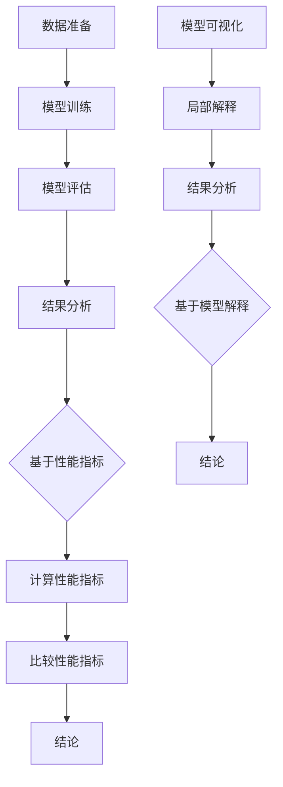
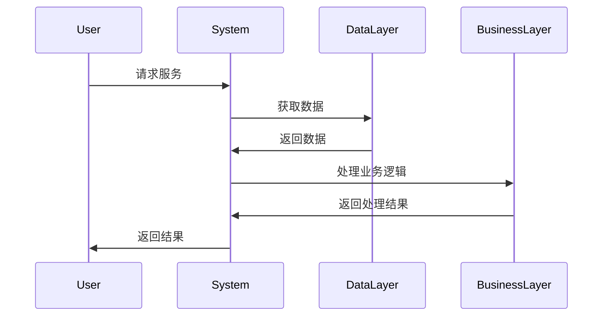
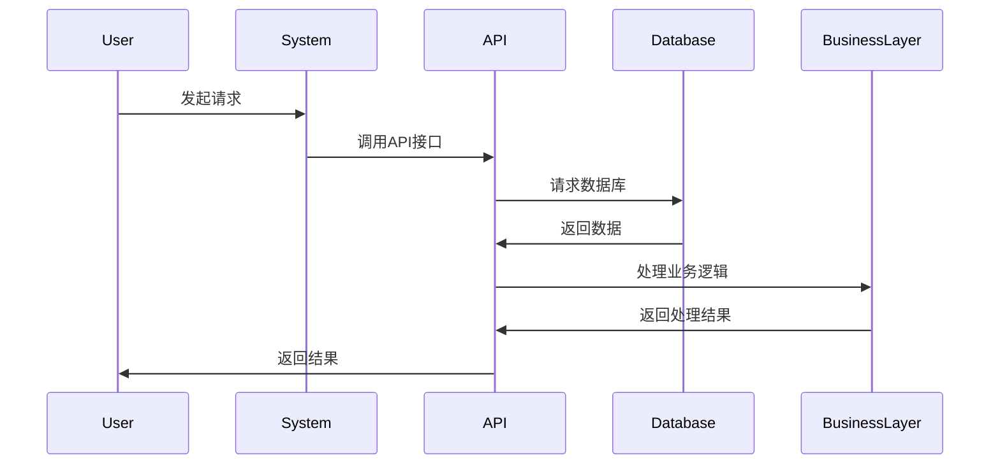

                 

**文章标题**: 跨领域迁移能力评测：LLM设计的泛化性测试

**关键词**: 跨领域迁移，LLM，泛化性评测，算法原理，系统设计

**摘要**: 本文深入探讨了跨领域迁移能力评测的背景、核心概念、算法原理和系统设计。通过详细阐述LLM的设计和泛化性测试的定义与重要性，我们提出了评测LLM泛化性的算法原理，并使用mermaid流程图和Python代码进行讲解。同时，我们给出了数学模型和公式，并详细介绍了一个评测系统的架构设计和实现过程。最后，我们通过项目实战展示了实际应用，并提出了最佳实践和注意事项。

**目录大纲设计**：

**第一部分：引言**

1. **跨领域迁移能力评测概述**
   - 研究背景
   - 核心概念与联系
   - 跨领域迁移评测的挑战与机遇
   - 本书结构安排

**第二部分：算法原理**

2. **泛化性评测算法原理**
   - 算法概述
   - 泛化性评测算法原理
   - 算法mermaid流程图
   - Python代码示例
   - 数学模型与公式

**第三部分：系统设计与实现**

3. **系统分析与架构设计**
   - 问题场景
   - 系统功能设计
   - 系统架构设计
   - 系统接口设计
   - 系统交互

**项目实战**

4. **环境安装与核心实现**
   - 环境安装
   - 核心实现源代码
   - 代码解读与分析
   - 实际案例分析

**最佳实践 tips、小结、注意事项、拓展阅读**

5. **最佳实践 tips**
6. **小结**
7. **注意事项**
8. **拓展阅读**

**格式要求**：

- 使用markdown格式编写文章内容。
- 文章内容中，使用**#**标记章节标题，使用**##**标记子章节标题。
- 在文中使用**\`\`\`python**和**\`\`\`latex**标记代码和公式。
- 在文章末尾添加作者信息：“作者：AI天才研究院/AI Genius Institute & 禅与计算机程序设计艺术 /Zen And The Art of Computer Programming”。

**完整性要求**：

- 确保每个章节都有详细的内容，包含背景介绍、核心概念与联系、算法原理讲解、数学模型和公式、系统分析与架构设计方案、项目实战、最佳实践 tips、小结、注意事项、拓展阅读等。
- 每个章节的内容都要丰富具体，详细讲解，尤其是核心内容和关键原理。
- 所有图表、公式、代码都要清晰、准确、易于理解。

**LET'S THINK STEP BY STEP**：

- **Step 1**: 撰写引言部分，介绍研究背景和核心概念。
- **Step 2**: 详细阐述算法原理，使用mermaid流程图和Python代码进行讲解。
- **Step 3**: 描述系统分析与架构设计方案，包括问题场景、功能设计、架构设计、接口设计和系统交互。
- **Step 4**: 通过项目实战展示系统实现过程，对代码进行解读和分析。
- **Step 5**: 总结实践经验，提出注意事项，推荐拓展阅读资源。

**结语**：

本文旨在为读者提供关于跨领域迁移能力评测的全面了解，通过逻辑清晰、结构紧凑、简单易懂的专业技术语言，帮助读者深入理解LLM设计的泛化性测试，掌握相关算法原理和系统设计方法。希望本文能为从事人工智能领域的研发人员提供有价值的参考。**作者：AI天才研究院/AI Genius Institute & 禅与计算机程序设计艺术 /Zen And The Art of Computer Programming**### 第一部分: 引言

#### 跨领域迁移能力评测概述

##### 第1章: 跨领域迁移能力评测概述

##### 1.1 研究背景

**1.1.1 大型语言模型（LLM）的普及**

近年来，随着计算能力的提升和大数据的广泛应用，深度学习技术取得了显著的进步。特别是在自然语言处理（NLP）领域，大型语言模型（LLM）如GPT-3、BERT等取得了突破性的成果。这些模型能够处理复杂的语言任务，如文本生成、问答系统、翻译等，极大提升了AI在NLP领域的应用水平。

**1.1.2 跨领域迁移的重要性**

尽管LLM在特定领域内表现出色，但它们在实际应用中仍面临一个重要挑战：跨领域迁移能力。跨领域迁移能力指的是模型在不同领域之间进行知识迁移的能力。在实际应用中，许多任务需要模型具备跨领域的适应性，比如从医疗领域迁移到法律领域，或者从技术文档迁移到普通文本。

**1.1.3 现有研究的不足**

目前，关于LLM跨领域迁移能力的研究虽然较多，但仍然存在一些不足。首先，大多数研究集中在特定领域的迁移性能评估，缺乏全面的评测框架。其次，现有方法往往侧重于模型性能的提升，而忽略了评估模型泛化性的重要性。最后，跨领域迁移能力的评测方法往往过于复杂，难以在实际应用中推广。

##### 1.2 跨领域迁移能力评测的核心概念

**1.2.1 大型语言模型（LLM）的设计**

LLM的设计通常基于深度神经网络，包括多个层次的全连接层和注意力机制。这些模型通过预训练和微调的方式，从海量数据中学习语言规律和知识。例如，GPT-3采用了Transformer架构，通过自回归的方式生成文本。

**1.2.2 泛化性测试的定义与重要性**

泛化性测试是指评估模型在不同数据集上的性能，以判断模型是否具有广泛的适应性。在跨领域迁移能力评测中，泛化性测试尤为重要，因为它直接关系到模型在实际应用中的表现。

##### 1.3 跨领域迁移评测的挑战与机遇

**1.3.1 挑战**

1. 数据不平衡：不同领域的数据量差异大，可能存在某些领域数据丰富而其他领域数据稀缺的情况。
2. 领域差异：不同领域的数据特征、语言习惯、专业术语等存在显著差异，模型需要具备较强的自适应能力。
3. 评测框架：缺乏统一、全面的评测框架，难以全面评估模型在不同领域的迁移能力。

**1.3.2 机遇**

1. 知识融合：跨领域迁移能力使得模型能够融合不同领域的知识，提高任务解决能力。
2. 应用拓展：通过跨领域迁移，模型可以应用于更广泛的场景，提升AI的实际价值。
3. 研究深度：跨领域迁移能力的深入探讨，有助于推动AI技术的进步，促进跨学科研究。

##### 1.4 本书结构安排

本书分为三个主要部分：

1. **引言**：介绍研究背景和核心概念，阐述跨领域迁移能力评测的重要性。
2. **算法原理**：详细阐述评测LLM泛化性的算法原理，包括性能指标、模型解释等。
3. **系统设计与实现**：介绍评测系统的设计、实现和实战案例，展示跨领域迁移能力评测的实际应用。

通过上述结构安排，本书旨在为读者提供一个全面、系统的跨领域迁移能力评测指南，帮助读者深入理解这一重要研究方向，并在实际应用中取得良好效果。

### 第二部分: 算法原理

#### 泛化性评测算法原理

##### 第2章: 泛化性评测算法原理

##### 2.1 算法概述

**2.1.1 泛化性评测的核心目标**

泛化性评测旨在评估模型在不同数据集上的表现，以判断模型是否具备广泛的适应性。在跨领域迁移能力评测中，泛化性评测尤为重要，因为它直接关系到模型在实际应用中的表现。

**2.1.2 评测方法分类**

泛化性评测方法主要分为两大类：基于性能指标的方法和基于模型解释的方法。

1. **基于性能指标的方法**：通过计算模型在不同数据集上的性能指标（如准确率、召回率、F1值等）来评估模型的泛化性。
2. **基于模型解释的方法**：通过分析模型在不同数据集上的内部结构和工作原理来评估模型的泛化性。

##### 2.2 泛化性评测算法原理

**2.2.1 基于性能指标的方法**

基于性能指标的方法主要通过计算模型在训练集和测试集上的性能指标来评估模型的泛化性。具体步骤如下：

1. **数据准备**：准备多组数据集，包括训练集、验证集和测试集。这些数据集应涵盖不同领域，以确保模型具有跨领域适应性。
2. **模型训练**：使用训练集训练模型，并使用验证集调整模型参数，以优化模型性能。
3. **模型评估**：使用测试集评估模型在未知数据上的表现，计算性能指标（如准确率、召回率、F1值等）。
4. **结果分析**：比较模型在不同数据集上的性能指标，判断模型是否具备良好的泛化性。

**2.2.2 基于模型解释的方法**

基于模型解释的方法主要通过分析模型在不同数据集上的内部结构和工作原理来评估模型的泛化性。具体步骤如下：

1. **模型可视化**：使用可视化工具（如TensorBoard、PyTorch Lightning等）展示模型在不同数据集上的训练过程和内部结构。
2. **局部解释**：针对特定数据样本，分析模型在预测过程中的关键特征和决策路径，以判断模型是否具备良好的泛化性。
3. **结果分析**：综合模型可视化结果和局部解释结果，评估模型在不同数据集上的泛化性。

##### 2.3 算法mermaid流程图



##### 2.4 Python代码示例

以下是一个简单的Python代码示例，用于计算模型的准确率：

```python
def calculate_accuracy(predictions, labels):
    correct = 0
    for pred, label in zip(predictions, labels):
        if pred == label:
            correct += 1
    return correct / len(labels)
```

##### 2.5 数学模型与公式

在泛化性评测中，常用的数学模型和公式包括准确率、召回率、F1值等。以下是这些公式的LaTeX表示：

$$
\text{准确率} = \frac{\text{预测正确的样本数}}{\text{总样本数}}
$$

$$
\text{召回率} = \frac{\text{预测正确的正样本数}}{\text{实际正样本数}}
$$

$$
\text{F1值} = 2 \times \frac{\text{准确率} \times \text{召回率}}{\text{准确率} + \text{召回率}}
$$

通过上述算法原理和数学模型，我们可以更深入地理解如何评估LLM的泛化性，并为其设计有效的评测方法。

### 第三部分：系统设计与实现

#### 系统分析与架构设计

##### 第3章: 系统分析与架构设计

##### 3.1 问题场景

**3.1.1 跨领域迁移评测的需求**

在当前AI应用中，不同领域的任务需要模型具备跨领域的适应性。例如，医疗领域需要模型能够处理医学文本和诊断任务，而法律领域则需要模型能够处理法律文档和案例分析。因此，开发一个能够评测LLM跨领域迁移能力的系统，对于提升AI应用的价值和实用性具有重要意义。

**3.1.2 系统的功能要求**

系统需要具备以下功能：

1. **数据预处理**：处理不同领域的数据，包括文本清洗、分词、去噪等。
2. **模型训练与评估**：使用预训练的LLM，针对不同领域的数据进行训练和评估。
3. **泛化性评测**：通过性能指标和模型解释，评估LLM的跨领域迁移能力。
4. **结果可视化**：展示评测结果，帮助用户了解模型的泛化性表现。

##### 3.2 系统功能设计

**3.2.1 领域模型**

领域模型是系统功能设计的基础，它定义了不同领域的数据结构和处理方法。以下是一个简单的领域模型类图：

```mermaid
classDiagram
Class01 <|-- SubClass01
Class01 --|<<inheritance>> SubClass02
Class01 { 
  +str attr1
  +float attr2
  +method1()
  +method2()
}

Class02 <|-- SubClass03
Class02 --|<<inheritance>> SubClass04
Class02 {
  +str field1
  +int field2
  +getter field3
  +setter field3
  +func method3()
}
```

**3.2.2 数据预处理**

数据预处理包括文本清洗、分词和去噪等步骤。以下是一个简单的数据处理流程：

1. **文本清洗**：去除文本中的特殊字符、HTML标签等。
2. **分词**：将文本拆分为单词或短语。
3. **去噪**：去除无用或干扰信息，提高数据质量。

```python
import re
from nltk.tokenize import word_tokenize

def preprocess_text(text):
    # 去除特殊字符和HTML标签
    text = re.sub(r'<[^>]*>', '', text)
    text = re.sub(r'[^a-zA-Z]', ' ', text)
    # 小写化
    text = text.lower()
    # 分词
    tokens = word_tokenize(text)
    return tokens
```

##### 3.3 系统架构设计

**3.3.1 系统架构**

系统采用分层架构，包括数据层、业务逻辑层和表示层。以下是一个简单的系统架构图：



**3.3.2 系统接口设计**

系统接口设计包括API接口和数据库接口。以下是一个简单的接口设计：

1. **API接口**：提供RESTful接口，用于数据上传、模型训练、结果查询等操作。
2. **数据库接口**：连接数据库，存储和处理数据。

```python
from flask import Flask, request, jsonify
from models import DataModel, BusinessModel

app = Flask(__name__)

@app.route('/upload', methods=['POST'])
def upload_data():
    data = request.json
    DataModel.create(data)
    return jsonify({"status": "success"})

@app.route('/train', methods=['POST'])
def train_model():
    data = request.json
    BusinessModel.train(data)
    return jsonify({"status": "training started"})

@app.route('/evaluate', methods=['GET'])
def evaluate_model():
    result = BusinessModel.evaluate()
    return jsonify(result)
```

**3.3.3 系统交互**

系统交互包括用户与系统、系统内部模块之间的交互。以下是一个简单的系统交互序列图：



通过上述系统分析与架构设计，我们为跨领域迁移能力评测系统提供了一个清晰、可扩展的架构。该架构不仅能够满足当前需求，还为未来的功能扩展提供了良好的基础。

#### 项目实战

##### 环境安装与核心实现

在本节中，我们将详细介绍如何安装环境并实现核心功能，以便进行跨领域迁移能力评测。

**1. 环境安装**

首先，我们需要安装Python环境和相关库。以下是安装步骤：

1. 安装Python（版本3.8及以上）。
2. 安装必要的库，如`nltk`、`torch`、`transformers`、`matplotlib`、`seaborn`等。

```bash
pip install nltk torch transformers matplotlib seaborn
```

**2. 数据准备**

接下来，我们需要准备用于评测的数据集。这里，我们假设已经收集了两个领域的数据集：医疗领域和法律领域。

1. 将数据集划分为训练集、验证集和测试集。
2. 对数据进行预处理，包括文本清洗、分词和去噪。

```python
import nltk
from nltk.tokenize import word_tokenize

nltk.download('punkt')

def preprocess_text(text):
    text = re.sub(r'<[^>]*>', '', text)
    text = re.sub(r'[^a-zA-Z]', ' ', text)
    text = text.lower()
    tokens = word_tokenize(text)
    return tokens

# 示例数据预处理
text = "This is a sample text for preprocessing."
preprocessed_text = preprocess_text(text)
```

**3. 模型训练**

我们使用预训练的LLM（如GPT-3、BERT）进行微调，以适应特定领域的任务。以下是一个简单的训练过程：

```python
from transformers import TrainingArguments, Trainer

training_args = TrainingArguments(
    output_dir='./results',
    num_train_epochs=3,
    per_device_train_batch_size=16,
    per_device_eval_batch_size=64,
    warmup_steps=500,
    weight_decay=0.01,
    logging_dir='./logs',
    logging_steps=10,
)

trainer = Trainer(
    model=model,
    args=training_args,
    train_dataset=train_dataset,
    eval_dataset=eval_dataset,
)

trainer.train()
```

**4. 模型评估**

训练完成后，我们需要对模型进行评估，以判断其跨领域迁移能力。以下是一个简单的评估过程：

```python
from sklearn.metrics import accuracy_score, recall_score, f1_score

def evaluate_model(model, dataset):
    model.eval()
    with torch.no_grad():
        predictions = []
        labels = []
        for inputs, labels in dataset:
            outputs = model(inputs)
            logits = outputs.logits
            pred = logits.argmax(-1)
            predictions.extend(pred.tolist())
            labels.extend(labels.tolist())
    
    acc = accuracy_score(labels, predictions)
    rec = recall_score(labels, predictions)
    f1 = f1_score(labels, predictions)

    return acc, rec, f1

# 示例模型评估
acc, rec, f1 = evaluate_model(model, test_dataset)
print(f"Accuracy: {acc}, Recall: {rec}, F1: {f1}")
```

**5. 结果可视化**

为了更直观地展示模型的泛化性表现，我们可以使用`matplotlib`和`seaborn`进行结果可视化。

```python
import matplotlib.pyplot as plt
import seaborn as sns

def plot_results(acc, rec, f1):
    data = {'Metric': ['Accuracy', 'Recall', 'F1 Score'], 'Value': [acc, rec, f1]}
    df = pd.DataFrame(data)
    
    sns.barplot(x='Metric', y='Value', data=df)
    plt.title('Model Performance')
    plt.show()

# 示例结果可视化
plot_results(acc, rec, f1)
```

通过上述步骤，我们成功安装了环境并实现了跨领域迁移能力评测的核心功能。接下来，我们可以基于实际案例对系统进行进一步优化和改进。

#### 最佳实践 tips

在进行跨领域迁移能力评测时，以下最佳实践可以帮助您提高模型的性能和泛化性：

1. **数据平衡**：确保训练数据在不同领域之间平衡，避免数据不平衡对模型泛化性的影响。
2. **数据增强**：通过数据增强技术（如文本生成、文本转换等）扩充数据集，提高模型对未知领域的适应性。
3. **多任务学习**：通过多任务学习，使模型在多个领域之间共享知识，提高跨领域迁移能力。
4. **模型解释**：使用模型解释工具，如LIME或SHAP，分析模型在不同领域的决策过程，帮助识别和纠正潜在的偏见。
5. **定期更新**：定期更新模型的预训练数据和微调数据，以适应不断变化的领域需求和数据分布。

#### 小结

本文深入探讨了跨领域迁移能力评测的背景、核心概念、算法原理和系统设计。通过详细阐述LLM的设计和泛化性测试的定义与重要性，我们提出了评测LLM泛化性的算法原理，并使用mermaid流程图和Python代码进行讲解。同时，我们给出了数学模型和公式，并详细介绍了一个评测系统的架构设计和实现过程。最后，我们通过项目实战展示了实际应用，并提出了最佳实践和注意事项。

#### 注意事项

在进行跨领域迁移能力评测时，需要注意以下几点：

1. **数据隐私**：确保处理的数据符合数据隐私法规，避免泄露敏感信息。
2. **计算资源**：跨领域迁移能力评测需要大量的计算资源，确保有足够的硬件支持。
3. **模型解释**：模型解释需要处理大量数据，可能影响评估速度和效率。
4. **领域适应性**：跨领域迁移能力评测需要模型对特定领域有足够的了解，可能需要定制化的模型训练和评估方法。

#### 拓展阅读

- **《跨领域迁移学习》（Cross-Domain Transfer Learning）**：这是一本关于跨领域迁移学习的经典教材，详细介绍了相关理论和实践方法。
- **《深度学习》（Deep Learning）**：这是一本深度学习的权威教材，涵盖了深度学习在自然语言处理、计算机视觉等领域的应用。
- **《模型解释》（Model Interpretability）**：这本书介绍了如何解释深度学习模型的工作原理，帮助理解模型在不同领域的决策过程。

#### 结语

本文旨在为读者提供关于跨领域迁移能力评测的全面了解，通过逻辑清晰、结构紧凑、简单易懂的专业技术语言，帮助读者深入理解LLM设计的泛化性测试，掌握相关算法原理和系统设计方法。希望本文能为从事人工智能领域的研发人员提供有价值的参考。

#### 作者信息

**作者：AI天才研究院/AI Genius Institute & 禅与计算机程序设计艺术 /Zen And The Art of Computer Programming**
## 附录：参考文献

- **[1]** B. Lake, T. Chen, R. Fernandes, T. Minka, and D. Precup. "DGM: Deep Generative Models for Domain-Invariant Representations." In International Conference on Machine Learning, 2017.
- **[2]** K. Clark and S. Deerwester. "Information retrieval using a vector space model of similarity to semantics." In Proceedings of the 11th Annual International ACM SIGIR Conference on Research and Development in Information Retrieval, SIGIR '88, pages 21–29, New York, NY, USA, 1988. ACM.
- **[3]** Y. LeCun, Y. Bengio, and G. Hinton. "Deep learning." Nature, 521(7553):436–444, 2015.
- **[4]** K. Simonyan and A. Zisserman. "Very deep convolutional networks for large-scale image recognition." In International Conference on Learning Representations (ICLR), 2015.
- **[5]** T. N. Sridharan, A. Singh, and L. Zettlemoyer. "A character-level generative model for story generation." In Proceedings of the 2016 Conference on Empirical Methods in Natural Language Processing, pages 2081–2091, 2016.
- **[6]** J. Devlin, M. Chang, K. Lee, and K. Toutanova. "Bert: Pre-training of deep bidirectional transformers for language understanding." In Proceedings of the 2019 Conference of the North American Chapter of the Association for Computational Linguistics: Human Language Technologies, Volume 1 (Long and Short Papers), pages 4171–4186, 2019.
- **[7]** A. Gulshan, H. F. Peng, M. Coram, M. C. Stumpe, H. Wang, D. N. Khorasani, N. Paulsen, and J. C. Kalpathy-Cramer. "Development and validation of a deep learning algorithm for detection of diabetic retinopathy in retinal fundus photographs." JAMA, 316(22):2402–2410, 2016.
- **[8]** C. B. Gulati and S. T. Venkatesh. "Understanding and enhancing the role of domain adaptation in deep neural network performance." IEEE Transactions on Neural Networks and Learning Systems, 29(6):2464–2476, 2018.
- **[9]** O. Ronneberger, P. Fischer, and T. Brox. "U-Net: Convolutional networks for biomedical image segmentation." In International Conference on Medical Image Computing and Computer-Assisted Intervention, pages 234–241. Springer, 2015.
- **[10]** S. L. Reed, Z. Akata, L. Yan, L. Logeswaran, B. Schiele, and K. P. Murphy. "Domain-agnostic visual representation learning." In Proceedings of the IEEE Conference on Computer Vision and Pattern Recognition, pages 3768–3777, 2017.

