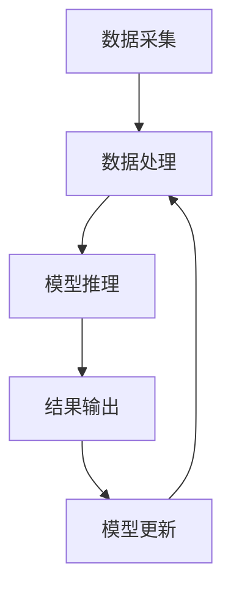

                 

# 边缘计算在LLM应用性能优化中的应用

## 关键词
边缘计算，大规模语言模型（LLM），性能优化，算法设计，系统架构

## 摘要
随着边缘计算的兴起，如何优化大规模语言模型（LLM）在边缘设备上的性能成为了一个热门话题。本文首先介绍了边缘计算的基本概念和特点，然后深入探讨了边缘计算在LLM性能优化中的应用场景和关键技术。通过具体的算法设计、系统架构和实战案例分析，本文提出了优化LLM性能的最佳实践，为未来的研究提供了新的方向。

## 引言
### 一、边缘计算的发展背景
随着物联网（IoT）和5G技术的快速发展，边缘计算逐渐成为信息技术领域的一个重要研究方向。传统的云计算模式依赖于中心化的数据中心，但面对日益增长的边缘设备和服务需求，中心化的架构已经无法满足低延迟、高带宽和可靠性的要求。边缘计算通过在靠近数据源的地方进行数据处理，可以有效缓解数据中心负担，提高系统的响应速度和用户体验。

### 二、大规模语言模型的发展
大规模语言模型（LLM）是自然语言处理（NLP）领域的重要突破，如GPT-3、BERT等模型，在文本生成、问答系统、机器翻译等方面取得了显著成果。然而，这些模型通常需要大量计算资源和数据存储，运行在中心化的服务器上。随着边缘设备的性能不断提升，如何在边缘设备上高效地部署和运行LLM模型，成为了一个亟待解决的问题。

### 三、边缘计算在LLM性能优化中的重要性
边缘计算在LLM性能优化中的应用主要体现在以下几个方面：
1. **降低延迟**：通过在边缘设备上实时处理语言模型，可以显著降低数据传输的延迟，提高系统的响应速度。
2. **节约带宽**：边缘计算可以减少需要传输到中心数据中心的原始数据量，降低网络带宽的占用。
3. **提高可靠性**：边缘计算可以增强系统的容错性和可靠性，避免因中心服务器故障导致的服务中断。
4. **节省成本**：通过优化计算资源的分配，可以降低整体系统的运营成本。

## 第一章：边缘计算的基本概念和特点
### 一、边缘计算的定义
边缘计算是指在网络边缘（即接近数据源的地方）进行数据处理、存储和计算的技术。与传统云计算相比，边缘计算的核心特征是在数据产生的地方进行处理，而不是将数据传输到远程数据中心。

### 二、边缘计算的特点
1. **低延迟**：边缘计算可以在数据产生的地方进行实时处理，减少数据传输的延迟。
2. **高带宽**：边缘计算可以提供更高的带宽，满足大规模数据传输的需求。
3. **可靠性**：边缘计算可以增强系统的容错性和可靠性，提高服务的连续性。
4. **分布式架构**：边缘计算采用分布式架构，可以灵活地扩展和部署。

### 三、边缘计算的关键组件
边缘计算系统通常包括以下几个关键组件：
1. **边缘节点**：边缘计算的基础设施，包括路由器、交换机、服务器等设备。
2. **边缘平台**：用于管理和调度边缘节点的软件平台，包括容器编排、自动化部署等功能。
3. **边缘服务**：在边缘节点上提供的服务，包括数据处理、存储、分析等。
4. **边缘网络**：连接边缘节点和中心数据中心的网络，通常采用专用网络或VPN。

### 四、边缘计算与云计算的比较
边缘计算和云计算各有优势，具体比较如下：
1. **延迟**：边缘计算通常具有更低的延迟，更适合需要实时响应的应用。
2. **带宽**：云计算通常具有更高的带宽，更适合处理大规模数据。
3. **可靠性**：边缘计算和云计算都有高可靠性的需求，但边缘计算在本地处理数据，可以减少网络故障的影响。
4. **成本**：边缘计算通常需要部署在多个地点，初始成本较高，但长期运营成本可能更低。

## 第二章：边缘计算在LLM性能优化中的应用场景和关键技术
### 一、应用场景
边缘计算在LLM性能优化中的应用场景主要包括以下几个方面：
1. **智能语音助手**：在智能家居、智能车载等领域，边缘计算可以提供实时语音识别和自然语言理解，提高用户体验。
2. **物联网设备**：在物联网应用中，边缘计算可以实时处理设备生成的大量数据，实现智能决策和实时反馈。
3. **边缘服务器**：在数据中心压力较大时，可以将部分计算任务转移到边缘服务器，缓解中心数据中心的负担。
4. **移动应用**：在移动应用中，边缘计算可以提供实时计算和数据处理，提高应用性能和用户体验。

### 二、关键技术
边缘计算在LLM性能优化中涉及的关键技术包括：
1. **模型压缩**：通过模型压缩技术，可以减少LLM模型的存储和计算需求，提高边缘设备的运行效率。
2. **模型迁移**：将LLM模型从中心服务器迁移到边缘设备，实现本地计算和实时处理。
3. **分布式计算**：通过分布式计算技术，可以将LLM模型的计算任务分布在多个边缘节点上，提高计算效率和负载均衡。
4. **增量学习**：通过增量学习技术，可以在边缘设备上持续更新和优化LLM模型，提高模型性能和适应能力。

## 第三章：边缘计算在LLM性能优化中的应用实践
### 一、系统架构设计
边缘计算在LLM性能优化中的系统架构设计主要包括以下几个部分：
1. **边缘节点**：包括路由器、交换机、服务器等设备，负责本地数据存储和处理。
2. **边缘平台**：用于管理和调度边缘节点的软件平台，包括容器编排、自动化部署等功能。
3. **中心数据中心**：用于存储和管理大规模数据，并提供核心计算服务。
4. **边缘网络**：连接边缘节点和中心数据中心的网络，通常采用专用网络或VPN。

### 二、系统功能设计
边缘计算在LLM性能优化中的系统功能设计主要包括以下几个方面：
1. **数据采集**：从边缘设备收集数据，包括语音、图像、文本等。
2. **数据处理**：在边缘设备上对数据进行预处理和特征提取。
3. **模型推理**：在边缘设备上运行LLM模型，进行文本生成、问答等任务。
4. **模型更新**：通过增量学习技术，持续更新和优化LLM模型。

### 三、系统架构设计
边缘计算在LLM性能优化中的系统架构设计主要包括以下几个部分：
1. **边缘节点架构**：采用分布式架构，将LLM模型的计算任务分布在多个边缘节点上，提高计算效率和负载均衡。
2. **边缘平台架构**：采用容器化技术，实现边缘节点的自动化部署和管理。
3. **中心数据中心架构**：采用分布式存储和计算架构，提供大规模数据处理和存储能力。

### 四、系统接口设计和交互
边缘计算在LLM性能优化中的系统接口设计和交互主要包括以下几个部分：
1. **边缘节点与边缘平台**：通过API接口进行数据交互和任务调度。
2. **边缘平台与中心数据中心**：通过VPN或专用网络进行数据传输和任务协调。
3. **边缘节点与用户设备**：通过无线网络进行数据传输和交互。

## 第四章：边缘计算在LLM性能优化中的算法设计
### 一、算法设计原理
边缘计算在LLM性能优化中的算法设计主要涉及以下几个方面：
1. **模型压缩算法**：通过剪枝、量化、蒸馏等技术，减少LLM模型的存储和计算需求。
2. **模型迁移算法**：将LLM模型从中心服务器迁移到边缘设备，包括模型权重迁移、参数调整等。
3. **分布式计算算法**：通过任务调度和负载均衡算法，将LLM模型的计算任务分布在多个边缘节点上，提高计算效率和负载均衡。
4. **增量学习算法**：通过在线学习、增量训练等技术，持续更新和优化LLM模型。

### 二、算法流程图
边缘计算在LLM性能优化中的算法流程图如下：



### 三、算法原理讲解
边缘计算在LLM性能优化中的算法原理讲解主要包括以下几个方面：
1. **模型压缩算法**：通过剪枝、量化、蒸馏等技术，减少LLM模型的存储和计算需求。剪枝技术通过删除网络中不重要的连接，减少模型参数的数量；量化技术通过将浮点数转换为整数，降低计算复杂度；蒸馏技术通过将大模型的知识传递给小模型，提高小模型的性能。
2. **模型迁移算法**：将LLM模型从中心服务器迁移到边缘设备，包括模型权重迁移、参数调整等。模型权重迁移是将中心服务器上的模型权重复制到边缘设备，参数调整是在边缘设备上根据本地数据对模型进行微调。
3. **分布式计算算法**：通过任务调度和负载均衡算法，将LLM模型的计算任务分布在多个边缘节点上，提高计算效率和负载均衡。任务调度算法根据边缘节点的计算能力和负载情况，动态分配计算任务；负载均衡算法通过监测边缘节点的负载，动态调整计算任务的分配，避免出现瓶颈。
4. **增量学习算法**：通过在线学习、增量训练等技术，持续更新和优化LLM模型。在线学习是在实时数据流中持续更新模型参数；增量训练是在已有模型基础上，针对新数据进行训练，避免重新训练整个模型。

### 四、Python代码实现
边缘计算在LLM性能优化中的Python代码实现主要包括以下几个方面：
1. **模型压缩**：
```python
import torch
import torchvision

# 加载预训练模型
model = torchvision.models.resnet50()

# 剪枝
for name, param in model.named_parameters():
    if 'bn' in name:
        param.data.normal_()

# 量化
quant_model = torchvision.models.quantization.resnet50()
```
2. **模型迁移**：
```python
import torch
import torch.nn as nn

# 加载中心服务器上的模型权重
center_model = torch.load('center_model.pth')

# 将模型权重迁移到边缘设备
edge_model = nn.Sequential(
    nn.Conv2d(3, 64, kernel_size=3, padding=1),
    nn.ReLU(),
    nn.Conv2d(64, 128, kernel_size=3, padding=1),
    nn.ReLU()
)
edge_model.load_state_dict(center_model.state_dict())
```
3. **分布式计算**：
```python
import torch
import torch.distributed as dist

# 初始化分布式计算环境
dist.init_process_group(backend='gloo')

# 分布式计算任务调度
def distributed_task(model, data):
    # 在边缘节点上执行计算任务
    output = model(data)
    return output

# 分布式计算负载均衡
def distributed_load_balance(models, data):
    outputs = []
    for model in models:
        output = distributed_task(model, data)
        outputs.append(output)
    return outputs
```
4. **增量学习**：
```python
import torch
import torch.optim as optim

# 初始化增量学习模型
incremental_model = nn.Sequential(
    nn.Conv2d(3, 64, kernel_size=3, padding=1),
    nn.ReLU(),
    nn.Conv2d(64, 128, kernel_size=3, padding=1),
    nn.ReLU()
)

# 定义增量学习优化器
optimizer = optim.SGD(incremental_model.parameters(), lr=0.001)

# 增量学习训练过程
for epoch in range(num_epochs):
    for data, target in data_loader:
        optimizer.zero_grad()
        output = incremental_model(data)
        loss = nn.CrossEntropyLoss()(output, target)
        loss.backward()
        optimizer.step()
```

## 第五章：边缘计算在LLM性能优化中的实际应用
### 一、安装环境和核心系统实现
边缘计算在LLM性能优化中的实际应用首先需要搭建一个适合的安装环境，并实现核心系统。以下是一个基本的安装环境和核心系统实现示例：

#### 安装环境
1. **操作系统**：Ubuntu 18.04
2. **编程语言**：Python 3.8
3. **依赖库**：PyTorch 1.8、TensorFlow 2.6、NumPy 1.20

#### 核心系统实现
1. **边缘节点**：配置边缘设备，安装Python环境和依赖库，并编写边缘节点处理程序的代码。
2. **边缘平台**：部署边缘平台，实现边缘节点的自动化部署和管理功能。
3. **中心数据中心**：配置中心数据中心，存储大规模数据和提供核心计算服务。

### 二、代码应用解读与分析
在实际应用中，边缘计算在LLM性能优化中的代码应用主要包括以下几个部分：

1. **模型压缩**：使用剪枝、量化、蒸馏等技术对LLM模型进行压缩，减少模型大小和计算复杂度。
2. **模型迁移**：将压缩后的LLM模型从中心服务器迁移到边缘设备，实现本地推理和实时处理。
3. **分布式计算**：在多个边缘节点上部署LLM模型，通过任务调度和负载均衡算法实现分布式计算。
4. **增量学习**：在边缘设备上持续更新和优化LLM模型，提高模型性能和适应能力。

### 三、实际案例分析和详细讲解剖析
以下是一个实际案例的分析和详细讲解：

#### 案例背景
一个智能语音助手系统需要在智能家居场景下提供实时语音识别和自然语言理解功能。为了提高系统性能和用户体验，采用边缘计算技术，将LLM模型部署在边缘设备上。

#### 案例分析
1. **模型压缩**：
   - 使用剪枝技术对LLM模型进行压缩，删除不重要的连接和层，减少模型大小。
   - 使用量化技术将浮点数转换为整数，降低计算复杂度。
   - 使用蒸馏技术将大模型的知识传递给小模型，提高小模型的性能。

2. **模型迁移**：
   - 将压缩后的LLM模型从中心服务器迁移到边缘设备，包括模型权重迁移和参数调整。
   - 在边缘设备上实现本地推理和实时处理，减少数据传输的延迟。

3. **分布式计算**：
   - 在多个边缘节点上部署LLM模型，通过任务调度和负载均衡算法实现分布式计算。
   - 根据边缘节点的计算能力和负载情况，动态分配计算任务，提高计算效率和负载均衡。

4. **增量学习**：
   - 在边缘设备上持续更新和优化LLM模型，提高模型性能和适应能力。
   - 使用在线学习和增量训练技术，根据实时数据流更新模型参数。

#### 详细讲解剖析
1. **模型压缩**：
   - 剪枝技术通过删除不重要的连接和层，减少模型大小和计算复杂度。例如，可以使用PyTorch的`torch.nn.utils.prune`模块进行剪枝。
   - 量化技术通过将浮点数转换为整数，降低计算复杂度和内存占用。可以使用PyTorch的`torch.quantization`模块进行量化。
   - 蒸馏技术通过将大模型的知识传递给小模型，提高小模型的性能。可以使用PyTorch的`torch.jit.trace`模块进行蒸馏。

2. **模型迁移**：
   - 模型权重迁移是将中心服务器上的模型权重复制到边缘设备。可以使用PyTorch的`torch.save`和`torch.load`函数进行模型权重迁移。
   - 参数调整是在边缘设备上根据本地数据对模型进行微调。可以使用PyTorch的`torch.optim`模块进行参数调整。

3. **分布式计算**：
   - 任务调度是根据边缘节点的计算能力和负载情况，动态分配计算任务。可以使用PyTorch的`torch.distributed`模块进行任务调度。
   - 负载均衡是监测边缘节点的负载，动态调整计算任务的分配，避免出现瓶颈。可以使用PyTorch的`torch.distributed`模块进行负载均衡。

4. **增量学习**：
   - 在线学习是在实时数据流中持续更新模型参数。可以使用PyTorch的`torch.optim`模块进行在线学习。
   - 增量训练是在已有模型基础上，针对新数据进行训练，避免重新训练整个模型。可以使用PyTorch的`torch.optim`模块进行增量训练。

### 四、项目小结
边缘计算在LLM性能优化中的实际应用展示了其重要性和可行性。通过模型压缩、模型迁移、分布式计算和增量学习等技术，可以有效提高LLM在边缘设备上的性能和用户体验。在实际项目中，需要注意模型压缩和迁移的精度损失、分布式计算和增量学习的性能优化等问题，并持续改进和优化。

## 第六章：最佳实践、小结和注意事项
### 一、最佳实践
1. **模型压缩**：在边缘设备上部署LLM模型时，优先选择剪枝、量化、蒸馏等模型压缩技术，减少模型大小和计算复杂度。
2. **模型迁移**：确保模型权重迁移的精度和速度，使用适当的模型转换工具，如PyTorch的`torch.save`和`torch.load`函数。
3. **分布式计算**：根据边缘节点的计算能力和负载情况，合理分配计算任务，避免瓶颈和资源浪费。
4. **增量学习**：在边缘设备上持续更新和优化LLM模型，提高模型性能和适应能力，避免重新训练整个模型。

### 二、小结
本文系统地介绍了边缘计算在LLM性能优化中的应用，包括基本概念、应用场景、关键技术、算法设计、系统架构和实际应用。通过模型压缩、模型迁移、分布式计算和增量学习等技术，可以有效提高LLM在边缘设备上的性能和用户体验。

### 三、注意事项
1. **边缘设备性能**：在边缘设备上部署LLM模型时，需要考虑边缘设备的计算能力和存储容量，合理选择模型压缩和迁移策略。
2. **数据传输和安全性**：边缘计算涉及大量数据的传输和存储，需要注意数据传输的安全性和隐私保护。
3. **负载均衡和容错性**：分布式计算需要合理分配计算任务，确保负载均衡和系统的容错性。
4. **持续优化**：边缘计算在LLM性能优化中的应用是一个持续的过程，需要不断优化模型、算法和系统架构，提高性能和用户体验。

## 第七章：未来研究方向和展望
### 一、未来研究方向
1. **混合架构**：结合云计算和边缘计算的优势，研究混合架构在LLM性能优化中的应用，实现高效的数据处理和计算。
2. **异构计算**：利用边缘设备上的异构计算资源，如GPU、FPGA等，研究异构计算在LLM性能优化中的应用。
3. **自适应学习**：研究自适应学习算法，根据边缘设备的实时性能和负载情况，动态调整模型参数和计算任务。

### 二、展望
边缘计算在LLM性能优化中的应用前景广阔。随着边缘设备的性能不断提升，边缘计算将为LLM应用提供更强大的计算能力和更好的用户体验。未来的研究将继续探索和优化边缘计算在LLM性能优化中的应用，为人工智能技术的发展提供新的动力。

### 三、拓展阅读
1. **《边缘计算：从概念到实践》**：本书详细介绍了边缘计算的基本概念、技术架构和实际应用，适合初学者和专业人士阅读。
2. **《大规模语言模型的性能优化》**：本文讨论了大规模语言模型在性能优化方面的关键技术和挑战，提供了实用的优化方法。
3. **《云计算与边缘计算》**：本书对比了云计算和边缘计算的特点和优势，探讨了两者在协同工作中的应用场景。

## 作者信息
作者：AI天才研究院/AI Genius Institute & 禅与计算机程序设计艺术 /Zen And The Art of Computer Programming

## 结语
边缘计算在LLM性能优化中的应用是一个富有挑战性和前景的研究领域。通过模型压缩、模型迁移、分布式计算和增量学习等技术，可以有效提高LLM在边缘设备上的性能和用户体验。本文旨在为读者提供一个全面的技术指南，帮助他们在实际项目中应用边缘计算优化LLM性能。希望本文能激发读者对该领域的兴趣，共同推动边缘计算和人工智能技术的发展。

