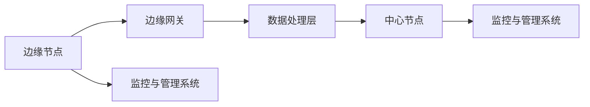

                 

### 引言

#### 1.1.1 边缘计算的定义与重要性

边缘计算（Edge Computing）是一种分布式计算架构，它将数据处理、存储和网络功能分散到网络边缘，即靠近数据源头的地方，而不是在传统的大型数据中心进行集中处理。这种架构的优势在于能够显著降低数据传输的延迟，提高系统的响应速度和可靠性。

边缘计算的定义可以进一步细化为以下几个核心要素：

- **计算位置**：边缘计算强调计算任务在网络边缘的执行，而不是在中心节点或云端。这通常涉及到路由器、交换机、网关、服务器和智能设备。

- **数据处理**：边缘计算主要负责处理和分析来自传感器的数据，这些数据通常是在产生时就被传输到边缘节点。这样可以减少数据传输的带宽消耗和中心化处理的延迟。

- **分布式架构**：边缘计算强调分布式架构，即多个边缘节点协同工作，形成一个网络，以实现资源的共享和负载均衡。

边缘计算的重要性体现在以下几个方面：

- **延迟降低**：在许多应用场景中，如自动驾驶、智能医疗和工业物联网，低延迟是至关重要的。边缘计算通过在靠近数据源的地方进行数据处理，可以显著减少通信延迟。

- **带宽优化**：通过在边缘节点处理数据，可以减少需要传输到中心节点的数据量，从而优化带宽利用。

- **可靠性提升**：边缘计算可以提高系统的可靠性，因为系统不再完全依赖于中心节点的稳定性。

- **隐私保护**：边缘计算允许在本地处理敏感数据，从而减少了数据泄露的风险。

#### 1.1.2 LLM应用的挑战

大语言模型（Large Language Models，LLM）如GPT-3和ChatGLM等，在自然语言处理领域取得了显著的成就。然而，这些模型的广泛应用也带来了一系列挑战：

- **计算资源需求**：LLM模型通常需要大量的计算资源，包括高性能的CPU、GPU或FPGA等。

- **延迟敏感**：由于LLM模型的复杂性和计算量，处理任务通常需要较长的时间，这在许多应用场景中是不可接受的。

- **带宽消耗**：将大量数据传输到中心节点进行处理会消耗大量的带宽，尤其是在网络带宽受限的情况下。

- **中心节点压力**：中心节点需要处理来自多个边缘节点的请求，这可能导致系统过载和性能下降。

#### 1.1.3 边缘计算的解决思路

边缘计算为解决LLM应用的延迟问题提供了一种可能的解决方案。通过在边缘节点部署LLM模型，可以实现在靠近数据源的地方进行数据处理，从而降低延迟和提高系统的响应速度。以下是一些具体的解决思路：

- **边缘模型部署**：将LLM模型部署在边缘节点，以实现数据的本地处理。

- **分布式处理**：通过分布式计算架构，将LLM模型处理任务分布在多个边缘节点上，以实现负载均衡。

- **模型优化**：对LLM模型进行优化，包括模型压缩、剪枝和量化等，以减少计算资源和延迟。

- **缓存技术**：利用缓存技术，将常用的数据或计算结果缓存到边缘节点，以减少重复计算。

- **边缘智能**：利用边缘智能处理技术，如深度学习和机器学习，提高边缘节点的数据处理能力。

#### 1.2 问题描述

边缘计算在降低LLM应用延迟方面具有巨大的潜力，但实际应用中仍面临一系列挑战：

- **边缘节点资源限制**：边缘节点的计算资源通常比中心节点有限，如何在有限的资源下高效地部署和运行LLM模型是一个关键问题。

- **网络稳定性**：边缘节点的网络连接可能不稳定，如何确保数据传输的可靠性和一致性是一个挑战。

- **模型可迁移性**：确保LLM模型可以在不同的边缘节点上高效运行，这需要模型的可迁移性和适应性。

- **安全性**：边缘计算涉及到大量的敏感数据，如何保障数据的安全性和隐私性是一个重要问题。

- **成本效益**：边缘计算的实施和维护成本可能较高，如何实现成本效益是一个关键考量。

本文的目标是探讨边缘计算在降低LLM应用延迟方面的技术原理、解决方案和实际应用，以期为相关研究和实践提供有价值的参考。

### 边缘计算的优势

边缘计算在降低LLM应用延迟方面具有显著的优势，这些优势主要体现在以下几个方面：

#### 1. 减少数据传输延迟

边缘计算的核心优势在于将数据处理任务从中心节点转移到网络边缘。这意味着数据在产生后可以直接在边缘节点进行初步处理，而无需传输到中心节点。这不仅减少了数据传输的距离，也降低了网络拥塞和数据传输延迟。对于LLM应用而言，延迟的减少直接影响到模型的响应速度和用户体验。

例如，在自动驾驶场景中，车辆产生的传感器数据需要在极短时间内进行处理，以做出实时决策。如果这些数据需要传输到远在云端的中心节点进行计算，将会导致显著的延迟，从而影响系统的安全性和可靠性。通过边缘计算，这些数据可以在车辆附近的边缘节点进行处理，从而实现近乎实时的响应。

#### 2. 增强系统可靠性

边缘计算通过在多个边缘节点之间进行分布式处理，可以增强整个系统的可靠性。当某个边缘节点出现故障或网络中断时，其他边缘节点可以继续执行任务，确保系统的高可用性。

对于LLM应用，特别是在需要高可靠性的场景中，如智能医疗诊断系统，边缘计算可以提供一种冗余机制，确保即使某个边缘节点出现故障，系统仍然能够正常运行。这种分布式架构不仅可以提高系统的可靠性，还可以减少系统因单点故障而导致的停机时间。

#### 3. 优化带宽利用

边缘计算通过在边缘节点处理数据，可以显著减少需要传输到中心节点的数据量。这不仅可以降低带宽消耗，还可以优化网络资源的利用。

以智能视频监控为例，如果所有的视频数据都需要传输到中心节点进行分析，将消耗大量的带宽资源。通过在边缘节点部署视频分析模型，只传输关键信息或分析结果到中心节点，可以显著减少数据传输量，从而优化网络带宽的利用。

#### 4. 提高数据安全性

边缘计算可以在本地处理敏感数据，从而减少数据在传输过程中被泄露的风险。特别是在涉及个人隐私和商业机密的应用场景中，边缘计算可以提供更安全的解决方案。

例如，在智能金融系统中，用户交易数据需要进行实时分析，但同时又需要保证数据的安全性。通过在边缘节点部署分析模型，可以在本地进行数据处理，减少数据泄露的风险。

#### 5. 降低中心节点压力

边缘计算通过将部分数据处理任务从中心节点转移到边缘节点，可以减轻中心节点的压力，提高系统的整体性能。

以智能交通系统为例，车辆产生的传感器数据需要实时处理，以实现交通流量控制和事故预警。如果所有数据处理任务都集中在中心节点，可能会导致中心节点过载，影响系统的响应速度。通过边缘计算，这些数据可以在车辆附近的边缘节点进行处理，从而降低中心节点的负载。

#### 6. 支持多样化的应用场景

边缘计算可以支持多样化的应用场景，包括工业物联网、智能医疗、自动驾驶等。这些应用通常需要低延迟和高可靠性的数据处理能力，边缘计算提供了有效的解决方案。

例如，在工业物联网中，设备产生的数据需要在生产线上进行实时分析，以优化生产流程。边缘计算可以确保数据在本地进行快速处理，从而实现生产线的智能化和自动化。

#### 7. 提高能效

边缘计算通过在边缘节点进行数据处理，可以减少中心节点的能耗。这对于可再生能源有限的应用场景，如偏远地区或移动设备，具有重要意义。

例如，在远程医疗场景中，医疗设备产生的数据需要传输到中心节点进行分析。通过在边缘节点进行初步分析，可以减少需要传输的数据量，从而降低能耗。

综上所述，边缘计算在降低LLM应用延迟方面具有显著的优势。通过减少数据传输延迟、增强系统可靠性、优化带宽利用、提高数据安全性、降低中心节点压力、支持多样化的应用场景和提高能效，边缘计算为LLM应用提供了一种有效的解决方案。

#### 1.3.2 解决方案概述

针对LLM应用在边缘计算中的延迟问题，我们可以设计一种综合性的解决方案，该方案包含以下几个关键组成部分：

1. **边缘模型部署**：
   首先，我们需要在边缘节点部署适合的LLM模型。这包括选择合适的模型架构，如Transformer或BERT，并对其进行优化，以便在资源有限的边缘节点上高效运行。此外，为了减少边缘节点的计算资源消耗，可以采用模型压缩技术，如模型剪枝和量化，以减小模型的大小和计算复杂度。

2. **分布式处理架构**：
   通过构建一个分布式处理架构，可以将LLM处理任务分布到多个边缘节点上，实现负载均衡。这样，不仅可以提高系统的可靠性，还可以降低单个边缘节点的负载压力。分布式架构的设计需要考虑节点间的通信和协调机制，以确保数据的一致性和处理效率。

3. **缓存与预加载技术**：
   利用缓存和预加载技术，可以在边缘节点预先存储和处理常用的数据或计算结果。当用户请求相同或类似的数据时，可以直接从缓存中获取结果，从而减少计算时间。例如，在智能客服系统中，可以缓存常见的问答对和对应的回答，以加快响应速度。

4. **算法优化**：
   对LLM模型进行优化，包括算法层面的优化和实现层面的优化。算法优化可以针对模型的具体任务进行调整，以提高其处理效率。例如，可以使用动态调整参数的方法，根据实际负载动态调整模型的参数，从而实现最优的处理性能。

5. **边缘智能处理**：
   利用边缘智能处理技术，如深度学习和机器学习，可以在边缘节点上进行更复杂的计算任务。通过在边缘节点部署智能算法，可以实现对数据的实时分析和预测，从而提高系统的智能化程度和响应速度。

6. **数据传输优化**：
   通过优化数据传输协议和策略，可以减少数据在传输过程中的延迟和带宽消耗。例如，可以使用基于内容的缓存（Content-Centric Networking, CCN）技术，将数据缓存到边缘节点，从而减少数据传输的次数和延迟。

7. **边缘与云协同**：
   在某些情况下，边缘节点可能无法独立完成某些复杂的计算任务。此时，可以通过与云端的协同处理，将部分计算任务迁移到云端进行。通过合理的任务分配和负载均衡，可以实现边缘和云端的协同工作，进一步提高系统的性能和响应速度。

总之，通过边缘模型部署、分布式处理架构、缓存与预加载技术、算法优化、边缘智能处理、数据传输优化和边缘与云协同等组成部分，我们可以设计一种综合性的解决方案，以有效降低LLM应用在边缘计算中的延迟问题。这种解决方案不仅能够提高系统的响应速度和用户体验，还能够优化资源利用和降低成本。

#### 1.4 边缘计算的核心要素

边缘计算的成功实施依赖于多个核心要素的协同工作，以下是对这些要素的详细探讨：

##### 1.4.1 边缘节点的作用

边缘节点是边缘计算架构中的关键组成部分，它们主要负责处理和存储来自终端设备的数据。边缘节点可以是一台独立的设备，如路由器、交换机或智能设备，也可以是一个分布式系统，由多个设备组成。

边缘节点的作用主要体现在以下几个方面：

1. **数据处理**：边缘节点能够对本地数据进行初步处理，如数据清洗、特征提取和简单分析。这样可以减少需要传输到中心节点或云的数据量，从而降低网络带宽消耗和延迟。
   
2. **数据缓存**：边缘节点可以作为数据缓存的中转站，存储常用的数据或计算结果。当后续请求相同或类似的数据时，可以直接从边缘节点获取，从而加快响应速度。

3. **本地决策**：在某些情况下，边缘节点可以根据预先设定的规则或模型，在本地进行决策。例如，在智能交通系统中，边缘节点可以实时分析交通流量数据，并给出最优的行车路线建议。

4. **协同工作**：边缘节点之间可以通过通信和协调机制，实现分布式处理和负载均衡。这样可以提高系统的可靠性和性能，确保即使在部分节点出现故障时，整体系统仍然能够正常运行。

##### 1.4.2 边缘网络架构

边缘网络架构是边缘计算的基础，它决定了数据如何在边缘节点之间传输和处理。以下是几种常见的边缘网络架构：

1. **星型架构**：在这种架构中，所有的边缘节点都连接到一个中心节点，中心节点负责协调和管理边缘节点的通信。这种架构简单易实现，但中心节点可能成为系统的单点故障。

2. **树型架构**：树型架构类似于星型架构，但边缘节点之间可以形成多级层次结构。数据从叶子节点传输到根节点，再从根节点分发到其他叶子节点。这种架构可以减少网络延迟，但需要复杂的路由算法。

3. **网状架构**：网状架构中的边缘节点相互连接，形成一个无向图。每个节点都可以与其他节点直接通信，从而实现数据的快速传输和冗余备份。这种架构具有较高的容错性和灵活性，但网络设计和维护较为复杂。

4. **混合架构**：混合架构结合了多种架构的特点，根据不同的应用需求和场景，灵活选择和组合边缘网络架构。例如，在核心区域使用网状架构，在边缘区域使用星型架构，以实现最优的网络性能。

##### 1.4.3 边缘智能处理技术

边缘智能处理技术是边缘计算的重要组成部分，它利用机器学习和人工智能算法，在边缘节点上实现高级数据处理和分析。

边缘智能处理技术的主要特点如下：

1. **实时性**：边缘智能处理可以在本地快速处理数据，实现实时决策和响应。这对于需要低延迟的应用场景，如自动驾驶和智能医疗，具有重要意义。

2. **分布式计算**：边缘智能处理技术可以支持分布式计算，将复杂任务分布到多个边缘节点上，实现并行处理。这样可以提高系统的性能和效率，减少单个节点的负载压力。

3. **模型压缩和优化**：由于边缘节点的计算资源有限，需要采用模型压缩和优化技术，以减小模型大小和计算复杂度。例如，可以通过模型剪枝、量化等方法，减少模型的参数量和计算量。

4. **适应性和灵活性**：边缘智能处理技术可以根据不同的应用场景和需求，灵活调整和优化。例如，在工业物联网中，可以根据设备类型和数据处理需求，选择合适的模型和算法。

总之，边缘计算的核心要素包括边缘节点的作用、边缘网络架构和边缘智能处理技术。这些要素共同构建了一个高效、可靠的边缘计算体系，为各种应用场景提供了强大的支持。通过深入理解和优化这些核心要素，我们可以进一步提升边缘计算的性能和适用性。

#### 1.5.1 边缘计算的应用场景

边缘计算在各个行业中都有着广泛的应用，以下列举几个主要的应用场景：

1. **工业物联网**：
   工业物联网（IIoT）是边缘计算的重要应用领域。通过在工业设备和传感器上部署边缘节点，可以实现实时数据采集、处理和监控。例如，在智能制造中，边缘节点可以实时分析生产线的运行数据，及时发现异常情况，并做出调整，从而提高生产效率和质量。

2. **智能交通系统**：
   边缘计算在智能交通系统中发挥着关键作用。通过在交通监控摄像头、车辆传感器和信号灯等设备上部署边缘节点，可以实时处理和分析交通数据，实现交通流量监控、事故预警和优化行车路线。例如，在高速公路上，边缘节点可以实时检测车辆速度和流量，并通过边缘计算平台生成交通流量预测报告，为交通管理部门提供决策支持。

3. **智能医疗**：
   边缘计算在智能医疗中有着广泛的应用，如远程医疗、智能诊断和医疗设备监控等。通过在医疗设备和患者监测设备上部署边缘节点，可以实时采集和处理患者的健康数据，实现远程诊断和监控。例如，在心血管疾病的远程监测中，边缘节点可以实时分析心电图数据，及时发现异常情况，并通过边缘计算平台将数据传输给医生进行诊断。

4. **智能安防**：
   边缘计算在智能安防系统中主要用于视频监控和入侵检测。通过在监控摄像头和入侵检测设备上部署边缘节点，可以实时处理和分析视频数据，实现实时监控和异常检测。例如，在智能社区中，边缘节点可以实时分析监控视频，识别可疑行为，并自动报警，从而提高安全防护能力。

5. **智能农业**：
   边缘计算在智能农业中可以用于作物监测、环境控制和农业机器管理。通过在农田传感器和农业设备上部署边缘节点，可以实时监测土壤湿度、温度和光照等环境参数，并根据分析结果自动调整灌溉、施肥和收割等操作。例如，在精准农业中，边缘节点可以实时分析土壤数据，为农民提供种植建议，从而提高农作物产量和品质。

6. **智能零售**：
   边缘计算在智能零售中可以用于库存管理、顾客行为分析和智能推荐。通过在零售店铺的传感器和设备上部署边缘节点，可以实时收集顾客行为数据，并进行分析，为店铺提供优化库存和顾客体验的建议。例如，在无人超市中，边缘节点可以实时分析顾客购物行为，推荐相关商品，并自动完成支付和库存更新。

7. **智能能源管理**：
   边缘计算在智能能源管理中可以用于电力需求预测、分布式能源管理和智能电网监控。通过在电力设备和能源传感器上部署边缘节点，可以实时监测和分析电力数据，实现电力需求的精准预测和能源的高效利用。例如，在智能电网中，边缘节点可以实时分析电力负荷数据，优化电力分配和调度，提高电网的可靠性和效率。

8. **智慧城市**：
   边缘计算在智慧城市中可以用于城市基础设施管理、公共安全和环境监测。通过在交通、环境、安防和公共服务等设备上部署边缘节点，可以实现城市的实时监控和管理。例如，在智慧交通系统中，边缘节点可以实时分析交通数据，优化交通信号控制和路线规划，减少交通拥堵。

综上所述，边缘计算在工业物联网、智能交通系统、智能医疗、智能安防、智能农业、智能零售、智能能源管理和智慧城市等众多领域都有着广泛的应用。通过在边缘节点上部署计算和智能处理能力，可以实现实时数据处理和本地决策，提高系统的性能和可靠性，为各种应用场景提供强大的支持。

#### 1.5.2 边缘计算与云计算的关系

边缘计算和云计算是现代信息技术领域中两个重要的计算模式，它们各自具有独特的优势和应用场景，同时又紧密关联、互为补充。

**定义与核心概念**

- **边缘计算**：边缘计算是指在数据产生的地方（如设备、传感器、终端节点等）进行数据处理、存储和分析的一种分布式计算模式。其主要目标是降低数据传输延迟，提高系统的响应速度和可靠性，并优化网络带宽的利用。
- **云计算**：云计算是基于互联网的服务模式，提供可按需分配的计算资源、存储资源和应用程序等。云计算的核心在于提供弹性、可扩展和按需付费的资源，以支持各种规模的应用需求。

**优势与挑战**

- **边缘计算的优势**：
  - 低延迟：通过在数据产生的地方进行数据处理，可以显著降低传输延迟，提高系统的实时性。
  - 高可靠性：通过分布式架构和冗余设计，边缘计算可以提高系统的可靠性，降低单点故障的风险。
  - 数据隐私保护：在本地处理敏感数据，减少了数据泄露的风险。
  - 优化带宽利用：通过在边缘节点处理部分数据，可以减少需要传输到云的数据量，从而优化网络带宽的利用。

- **边缘计算的挑战**：
  - 计算资源有限：边缘节点的计算资源通常有限，如何在有限的资源下高效地运行复杂的计算任务是一个挑战。
  - 网络稳定性：边缘节点的网络连接可能不稳定，如何确保数据传输的可靠性和一致性是一个挑战。
  - 安全性：边缘计算涉及到大量的敏感数据，如何保障数据的安全性和隐私性是一个重要问题。

- **云计算的优势**：
  - 弹性扩展：云计算可以提供弹性扩展的计算资源，以应对动态变化的应用需求。
  - 高效资源利用：云计算通过共享资源，可以实现资源的高效利用和优化。
  - 数据集中管理：云计算可以实现数据的集中管理和备份，提高数据的安全性和可靠性。
  - 专业运维支持：云计算服务通常由专业的团队进行运维管理，降低了企业的运维成本。

- **云计算的挑战**：
  - 数据传输延迟：由于数据需要传输到远程数据中心进行处理，可能导致较高的传输延迟。
  - 安全性和隐私性：云计算涉及到大量的敏感数据，如何保障数据的安全性和隐私性是一个重要问题。
  - 成本控制：云计算的资源使用和成本控制较为复杂，需要企业进行精细的管理和优化。

**结合与应用**

- **边缘与云协同**：边缘计算和云计算的结合可以充分发挥两者的优势。通过将复杂计算任务迁移到云端，而将实时数据处理和简单计算任务保持在边缘，可以实现最优的资源利用和性能优化。
- **边缘缓存与云存储**：在边缘节点缓存常用数据，以减少数据传输，同时将关键数据和结果存储在云端，确保数据的完整性和安全性。
- **边缘智能与云智能**：在边缘节点部署智能算法和模型，实现本地数据处理和决策，而将部分复杂计算任务和模型训练迁移到云端，以充分利用云端的计算资源和算法优势。

总之，边缘计算与云计算的关系是互补和协同的关系。通过结合两者的优势，可以实现更高效、更可靠、更安全的计算架构，为各种应用场景提供强大的支持。

### 1.6 本章小结

本章详细介绍了边缘计算在降低LLM应用延迟方面的相关概念和原理。首先，我们探讨了边缘计算的定义、重要性以及在LLM应用中的挑战，为后续讨论打下基础。接着，我们分析了边缘计算的优势，包括减少数据传输延迟、增强系统可靠性、优化带宽利用、提高数据安全性、降低中心节点压力、支持多样化应用场景和提高能效。随后，我们概述了针对LLM应用延迟问题的解决方案，包括边缘模型部署、分布式处理架构、缓存与预加载技术、算法优化、边缘智能处理、数据传输优化和边缘与云协同。最后，我们详细讨论了边缘计算的核心要素，包括边缘节点的作用、边缘网络架构和边缘智能处理技术。通过本章的介绍，我们对边缘计算在降低LLM应用延迟方面的潜力有了更深入的理解，为后续章节的详细探讨奠定了基础。

---

### 边缘计算原理

#### 2.1 边缘计算的基本概念

边缘计算（Edge Computing）是一种分布式计算架构，它将数据处理、存储和网络功能分散到网络的边缘，即靠近数据源的地方，而不是在传统的大型数据中心或云端进行集中处理。边缘计算的基本概念可以从以下几个方面进行阐述：

**定义**：边缘计算是指在靠近数据源头的地方，利用分布式计算资源进行数据处理、存储和分析的一种计算模式。这些计算资源可以是物理设备，如路由器、交换机、服务器，也可以是虚拟设备，如容器和虚拟机。

**核心要素**：边缘计算的核心要素包括边缘节点、边缘网络和边缘智能处理。

1. **边缘节点**：边缘节点是边缘计算架构中的关键组成部分，它们主要负责处理和存储来自终端设备的数据。边缘节点可以是一台独立的设备，如路由器、交换机或智能设备，也可以是一个分布式系统，由多个设备组成。

2. **边缘网络**：边缘网络是连接边缘节点和数据中心的通信网络，它负责将边缘节点收集到的数据传输到数据中心进行进一步处理。边缘网络通常采用分布式架构，以提高网络的可靠性和灵活性。

3. **边缘智能处理**：边缘智能处理是指在边缘节点上利用机器学习和人工智能算法进行数据处理和分析。通过边缘智能处理，可以在本地快速做出决策，降低数据传输延迟，提高系统的实时性和响应速度。

**基本架构**：边缘计算的基本架构通常包括以下几个层次：

1. **感知层**：感知层由各种传感器和设备组成，负责收集环境数据。

2. **边缘层**：边缘层由边缘节点组成，负责对感知层收集到的数据进行分析和处理。

3. **网络层**：网络层负责将边缘层处理后的数据传输到数据中心或云端进行进一步处理。

4. **决策层**：决策层负责根据处理结果做出决策，并将决策信息反馈到边缘层或感知层。

**应用场景**：边缘计算在各个行业中都有广泛的应用，包括工业物联网、智能交通系统、智能医疗、智能安防、智能农业、智能零售和智慧城市等。在这些应用中，边缘计算通过在数据源头进行数据处理，实现了低延迟、高可靠性和高效能的运行。

#### 2.1.2 边缘计算的核心要素

边缘计算的成功实施依赖于多个核心要素的协同工作，以下是对这些要素的详细探讨：

##### 2.1.2.1 边缘节点

边缘节点是边缘计算架构中的关键组成部分，它们主要负责处理和存储来自终端设备的数据。边缘节点可以是一台独立的设备，如路由器、交换机或智能设备，也可以是一个分布式系统，由多个设备组成。

边缘节点的作用主要体现在以下几个方面：

1. **数据处理**：边缘节点能够对本地数据进行初步处理，如数据清洗、特征提取和简单分析。这样可以减少需要传输到中心节点或云的数据量，从而降低网络带宽消耗和延迟。

2. **数据缓存**：边缘节点可以作为数据缓存的中转站，存储常用的数据或计算结果。当后续请求相同或类似的数据时，可以直接从边缘节点获取，从而加快响应速度。

3. **本地决策**：在某些情况下，边缘节点可以根据预先设定的规则或模型，在本地进行决策。例如，在智能交通系统中，边缘节点可以实时分析交通流量数据，并给出最优的行车路线建议。

4. **协同工作**：边缘节点之间可以通过通信和协调机制，实现分布式处理和负载均衡。这样可以提高系统的可靠性和性能，确保即使在部分节点出现故障时，整体系统仍然能够正常运行。

##### 2.1.2.2 边缘网络

边缘网络是边缘计算的基础，它决定了数据如何在边缘节点之间传输和处理。以下是几种常见的边缘网络架构：

1. **星型架构**：在这种架构中，所有的边缘节点都连接到一个中心节点，中心节点负责协调和管理边缘节点的通信。这种架构简单易实现，但中心节点可能成为系统的单点故障。

2. **树型架构**：树型架构类似于星型架构，但边缘节点之间可以形成多级层次结构。数据从叶子节点传输到根节点，再从根节点分发到其他叶子节点。这种架构可以减少网络延迟，但需要复杂的路由算法。

3. **网状架构**：网状架构中的边缘节点相互连接，形成一个无向图。每个节点都可以与其他节点直接通信，从而实现数据的快速传输和冗余备份。这种架构具有较高的容错性和灵活性，但网络设计和维护较为复杂。

4. **混合架构**：混合架构结合了多种架构的特点，根据不同的应用需求和场景，灵活选择和组合边缘网络架构。例如，在核心区域使用网状架构，在边缘区域使用星型架构，以实现最优的网络性能。

##### 2.1.2.3 边缘智能处理

边缘智能处理技术是边缘计算的重要组成部分，它利用机器学习和人工智能算法，在边缘节点上实现高级数据处理和分析。

边缘智能处理技术的主要特点如下：

1. **实时性**：边缘智能处理可以在本地快速处理数据，实现实时决策和响应。这对于需要低延迟的应用场景，如自动驾驶和智能医疗，具有重要意义。

2. **分布式计算**：边缘智能处理技术可以支持分布式计算，将复杂任务分布到多个边缘节点上，实现并行处理。这样可以提高系统的性能和效率，减少单个节点的负载压力。

3. **模型压缩和优化**：由于边缘节点的计算资源有限，需要采用模型压缩和优化技术，以减小模型的大小和计算复杂度。例如，可以通过模型剪枝、量化等方法，减少模型的参数量和计算量。

4. **适应性和灵活性**：边缘智能处理技术可以根据不同的应用场景和需求，灵活调整和优化。例如，在工业物联网中，可以根据设备类型和数据处理需求，选择合适的模型和算法。

#### 2.2 边缘网络架构

边缘网络架构是边缘计算的核心组成部分，它决定了数据如何在边缘节点之间传输和处理。以下是几种常见的边缘网络架构：

##### 2.2.1 边缘节点的类型

边缘节点可以分为以下几种类型：

1. **智能设备**：智能设备如智能手机、平板电脑、智能手表等，它们具有独立的计算和通信能力，可以在本地进行数据处理和存储。

2. **网络设备**：网络设备如路由器、交换机、防火墙等，它们负责网络的连接和通信，并在网络边缘进行数据传输和控制。

3. **边缘服务器**：边缘服务器是在网络边缘部署的高性能服务器，它们负责处理和存储大量的数据和计算任务。

4. **边缘云计算平台**：边缘云计算平台是将云计算和边缘计算结合的一种架构，它通过在边缘节点部署虚拟化技术和容器技术，实现计算资源的灵活调度和高效利用。

##### 2.2.2 边缘网络拓扑

边缘网络拓扑是指边缘节点之间的连接方式和通信结构。以下是几种常见的边缘网络拓扑：

1. **星型拓扑**：星型拓扑是一种中心化的网络结构，其中所有的边缘节点都连接到一个中心节点。中心节点负责协调和管理边缘节点的通信。这种拓扑结构简单，易于实现和管理，但中心节点可能成为系统的单点故障。

2. **树型拓扑**：树型拓扑是一种层次化的网络结构，其中边缘节点按照层次结构连接。数据从底层节点逐级向上传输，最终到达顶层节点。这种拓扑结构可以减少网络延迟，但需要复杂的路由算法。

3. **网状拓扑**：网状拓扑是一种分布式网络结构，其中每个边缘节点都可以直接与其他节点通信。这种拓扑结构具有较高的容错性和灵活性，但网络设计和维护较为复杂。

4. **混合拓扑**：混合拓扑是将多种拓扑结构结合的一种架构，根据不同的应用需求和场景，灵活选择和组合不同的拓扑结构。例如，在核心区域使用网状拓扑，在边缘区域使用星型拓扑，以实现最优的网络性能。

##### 2.2.3 边缘节点与中心节点的交互

边缘节点与中心节点的交互是边缘计算的关键环节，以下从数据传输和通信协议两个方面进行探讨：

1. **数据传输**：
   - **本地处理**：边缘节点首先对本地数据进行初步处理，如数据清洗、特征提取和简单分析。这样可以减少需要传输到中心节点的数据量，从而降低网络带宽消耗和延迟。
   - **数据传输**：边缘节点将处理后的数据传输到中心节点进行进一步处理和分析。数据传输可以采用基于内容的缓存（Content-Centric Networking, CCN）技术，将数据缓存到边缘节点，从而减少数据传输的次数和延迟。

2. **通信协议**：
   - **传输层协议**：边缘节点与中心节点之间的数据传输通常采用传输层协议，如TCP（传输控制协议）和UDP（用户数据报协议）。TCP提供可靠的数据传输，但可能增加延迟和带宽消耗；UDP提供高效的数据传输，但可能存在数据丢失的风险。
   - **应用层协议**：边缘节点与中心节点之间的通信可以采用应用层协议，如HTTP（超文本传输协议）和HTTPS（安全超文本传输协议）。HTTP和HTTPS可以确保数据的安全传输，但可能增加网络延迟和带宽消耗。

综上所述，边缘网络架构是边缘计算的核心组成部分，它决定了数据如何在边缘节点之间传输和处理。通过合理选择和设计边缘节点类型、网络拓扑和交互方式，可以构建一个高效、可靠和灵活的边缘计算体系，为各种应用场景提供强大的支持。

#### 2.3 边缘智能处理技术

边缘智能处理技术是边缘计算的重要组成部分，它利用机器学习和人工智能算法，在边缘节点上实现高级数据处理和分析。以下是边缘智能处理技术的主要特点、优势和应用：

##### 2.3.1 边缘智能处理的特点

1. **实时性**：边缘智能处理可以在本地快速处理数据，实现实时决策和响应。这对于需要低延迟的应用场景，如自动驾驶和智能医疗，具有重要意义。

2. **分布式计算**：边缘智能处理技术可以支持分布式计算，将复杂任务分布到多个边缘节点上，实现并行处理。这样可以提高系统的性能和效率，减少单个节点的负载压力。

3. **灵活性**：边缘智能处理技术可以根据不同的应用场景和需求，灵活调整和优化。例如，在工业物联网中，可以根据设备类型和数据处理需求，选择合适的模型和算法。

4. **适应性**：边缘智能处理技术可以适应不同的硬件环境和计算资源，通过模型压缩和优化技术，提高模型在边缘节点上的运行效率。

##### 2.3.2 边缘智能处理的优势

1. **降低延迟**：通过在边缘节点上处理数据，可以显著减少数据传输延迟，提高系统的实时性。这对于需要实时响应的应用场景，如自动驾驶和智能医疗，具有重要意义。

2. **提高效率**：边缘智能处理可以在本地快速处理数据，减少需要传输到中心节点的数据量，从而提高系统的处理效率和带宽利用率。

3. **减少带宽消耗**：通过在边缘节点上处理数据，可以减少需要传输到中心节点的数据量，从而减少带宽消耗，优化网络资源利用。

4. **提高系统可靠性**：边缘智能处理技术可以在边缘节点上实现冗余备份和故障转移，提高系统的可靠性和容错性。

5. **支持多样化应用**：边缘智能处理技术可以支持多样化的应用场景，如工业物联网、智能交通、智能医疗、智能安防等，为不同行业提供定制化的解决方案。

##### 2.3.3 边缘智能处理的技术挑战

1. **计算资源有限**：由于边缘节点的计算资源有限，如何在有限的资源下高效地运行复杂的计算任务是一个挑战。

2. **网络稳定性**：边缘节点的网络连接可能不稳定，如何确保数据传输的可靠性和一致性是一个挑战。

3. **数据隐私和安全**：边缘计算涉及到大量的敏感数据，如何保障数据的安全性和隐私性是一个重要问题。

4. **模型可迁移性**：确保边缘节点上的模型可以在不同的硬件环境和计算资源下高效运行，这需要模型的可迁移性和适应性。

##### 2.3.4 边缘智能处理的应用

1. **工业物联网**：通过边缘智能处理技术，可以在边缘节点上实时分析生产数据，优化生产流程，提高生产效率和质量。

2. **智能交通**：在交通监控和智能交通管理中，边缘智能处理可以实时分析交通数据，优化交通信号控制和路线规划，提高交通流量管理效率。

3. **智能医疗**：在远程医疗和智能诊断中，边缘智能处理可以实时分析患者数据，提供快速、准确的诊断建议，提高医疗服务质量。

4. **智能安防**：在智能安防系统中，边缘智能处理可以实时分析视频数据，实现入侵检测、异常行为识别和快速响应。

5. **智能农业**：通过边缘智能处理技术，可以实时监测作物生长环境，提供精准农业管理建议，提高农作物产量和品质。

总之，边缘智能处理技术为边缘计算提供了强大的数据处理和分析能力，通过在边缘节点上实现实时决策和响应，可以显著降低延迟、提高效率和优化资源利用。然而，在实际应用中，仍需要克服计算资源有限、网络稳定性、数据隐私和安全等挑战，以充分发挥边缘智能处理的潜力。

#### 2.4 边缘计算中的数据管理

边缘计算中的数据管理是一个关键环节，涉及到数据的采集、预处理、存储、传输和安全保护等方面。有效的数据管理不仅能提高边缘计算系统的整体性能，还能确保数据的安全性和隐私性。

##### 2.4.1 数据存储

数据存储是边缘计算中的基础环节，主要包括以下几个方面：

1. **本地存储**：边缘节点通常配备有有限的本地存储资源，如固态硬盘（SSD）或闪存（Flash）。本地存储可以用于临时存储来自传感器的数据，以便在边缘节点上进行初步处理。

2. **分布式存储**：为了提高数据存储的可靠性和可用性，边缘计算系统常常采用分布式存储架构。分布式存储将数据分布在多个边缘节点上，实现数据的冗余备份和负载均衡。

3. **边缘数据库**：边缘数据库是专门为边缘计算设计的数据库系统，如SQLite、Cassandra和MongoDB。边缘数据库支持高效的数据存储和查询，能够满足边缘节点的低延迟和高并发需求。

4. **缓存机制**：缓存技术可以显著提高边缘节点的数据处理效率。边缘节点可以通过缓存机制存储常用的数据或计算结果，减少重复数据的处理次数。

##### 2.4.2 数据传输

数据传输是边缘计算中的另一个重要环节，涉及到数据在边缘节点之间的传输以及在边缘节点和中心节点之间的传输。有效的数据传输策略能够减少延迟和带宽消耗，提高系统性能。以下是一些关键点：

1. **传输协议**：边缘计算中的数据传输通常采用TCP/IP协议族，如TCP、UDP和ICMP。TCP提供可靠的数据传输，但可能增加延迟；UDP提供高效的数据传输，但可能存在数据丢失的风险。

2. **数据压缩**：在数据传输过程中，数据压缩技术可以显著减少数据量，从而降低带宽消耗。常见的压缩算法包括Huffman编码、LZ77和LZ78等。

3. **多路径传输**：多路径传输技术可以通过多个路径同时传输数据，提高数据传输的可靠性和带宽利用率。在边缘计算中，多路径传输可以结合路径选择算法，选择最佳路径进行数据传输。

4. **数据同步**：在分布式存储和传输过程中，数据同步技术确保数据的一致性和完整性。数据同步可以通过一致性算法（如Paxos算法）和分布式锁（如Chubby锁）实现。

##### 2.4.3 数据安全与隐私保护

数据安全与隐私保护是边缘计算中的核心问题，涉及到数据的加密、访问控制和权限管理等方面：

1. **数据加密**：数据加密技术可以确保数据在传输和存储过程中的安全性。常用的加密算法包括对称加密（如AES）和非对称加密（如RSA）。

2. **访问控制**：访问控制机制可以限制对数据的访问权限，确保只有授权用户可以访问敏感数据。常见的访问控制方法包括基于角色的访问控制（RBAC）和基于属性的访问控制（ABAC）。

3. **隐私保护**：隐私保护技术可以确保个人隐私数据不被泄露。常见的隐私保护方法包括数据匿名化、差分隐私和同态加密等。

4. **安全审计**：安全审计技术可以记录和监控系统的操作日志，以便在出现安全事件时进行追踪和调查。

综上所述，边缘计算中的数据管理需要综合考虑数据存储、数据传输和数据安全与隐私保护等方面。通过合理的数据管理策略和技术，可以确保边缘计算系统的数据高效、安全地存储和传输，为各种应用场景提供强有力的支持。

#### 2.5 边缘计算中的通信协议

边缘计算中的通信协议是确保数据在边缘节点之间以及边缘节点与中心节点之间高效、可靠传输的关键。以下是几种常见的通信协议及其选择标准：

##### 2.5.1 常见的通信协议

1. **TCP/IP**：TCP/IP（传输控制协议/互联网协议）是互联网通信的基础协议，提供面向连接的、可靠的、有序的数据传输服务。TCP/IP包括TCP（传输控制协议）和IP（互联网协议）两个部分，TCP负责数据传输的可靠性和流量控制，IP负责数据包的路由和传输。

2. **UDP**：UDP（用户数据报协议）是一种无连接的传输协议，提供高效的数据传输服务，但不保证数据的可靠性和顺序。UDP适用于实时性要求高但容忍一定数据丢失的应用场景，如视频流和语音传输。

3. **HTTP/2**：HTTP/2 是 HTTP 协议的升级版本，提供多路复用和头部压缩等功能，显著提高了数据传输的效率和性能。

4. **MQTT**：MQTT（消息队列遥测传输）是一种轻量级的消息传输协议，适用于低带宽、不可靠的网络环境，广泛应用于物联网设备和边缘计算。

5. **CoAP**：CoAP（受限应用协议）是一种专为物联网和边缘计算设计的简单协议，提供数据传输和资源发现等功能，适用于资源受限的环境。

##### 2.5.2 选择标准

1. **可靠性**：在边缘计算中，数据传输的可靠性至关重要。TCP 提供了可靠的传输服务，但在某些情况下，如低延迟和高吞吐量的应用场景，UDP 可能是更好的选择。

2. **延迟**：低延迟是边缘计算的一个关键需求，特别是在需要实时响应的应用场景中。HTTP/2 和 UDP 在降低传输延迟方面具有优势。

3. **带宽消耗**：带宽消耗是另一个重要考虑因素。HTTP/2 和 UDP 提供了数据压缩和高效传输功能，有助于减少带宽消耗。

4. **安全性**：边缘计算中的通信协议需要支持数据加密和认证，确保数据传输的安全性。TLS（传输层安全性协议）是常用的加密协议，可以确保数据在传输过程中的机密性和完整性。

5. **可扩展性**：随着边缘计算应用的扩展，通信协议需要能够支持大量的并发连接和动态负载。MQTT 和 CoAP 等协议设计用于低带宽和资源受限的环境，具有较高的可扩展性。

6. **兼容性**：边缘计算系统通常涉及多种设备和平台，通信协议需要具备良好的兼容性，以支持不同设备和操作系统之间的通信。

综上所述，选择合适的通信协议需要综合考虑可靠性、延迟、带宽消耗、安全性、可扩展性和兼容性等多个因素。根据不同的应用场景和需求，可以灵活选择和组合不同的通信协议，以确保边缘计算系统的性能和可靠性。

#### 2.6 本章小结

本章详细介绍了边缘计算的基本概念、核心要素、网络架构、智能处理技术、数据管理以及通信协议。首先，我们探讨了边缘计算的定义、重要性及其在LLM应用中的优势。接着，我们介绍了边缘计算的核心要素，包括边缘节点、边缘网络和边缘智能处理技术。然后，我们分析了边缘网络的架构类型及其设计要点。随后，我们讨论了边缘智能处理技术的特点、优势和应用，以及数据管理中的关键环节。最后，我们列举了常见的通信协议及其选择标准。通过本章的介绍，我们对边缘计算的原理和技术有了更深入的理解，为后续章节的讨论奠定了基础。

---

### LLM应用原理

#### 3.1 LLM的定义与特点

大语言模型（Large Language Models，LLM）是自然语言处理领域的一种重要技术，通过对海量文本数据进行训练，LLM能够生成高质量的自然语言文本，实现文本生成、翻译、问答等多种功能。以下是LLM的定义和特点：

##### 3.1.1 LLM的概念

LLM是基于深度学习技术构建的大型语言模型，通常采用Transformer架构。Transformer模型由Vaswani等人于2017年提出，它通过自注意力机制（Self-Attention）处理序列数据，能够捕捉长距离依赖关系，从而实现高效的自然语言处理。

LLM的训练过程通常包括以下几个步骤：

1. **数据收集**：收集大量高质量的文本数据，如书籍、新闻、网页等，作为训练数据集。

2. **数据预处理**：对收集的文本数据进行清洗、分词、去噪等预处理操作，以便模型能够更好地学习语言规律。

3. **模型训练**：使用训练数据集对LLM模型进行训练，通过优化模型参数，使其能够生成符合语言规则和语义逻辑的文本。

4. **模型优化**：在训练过程中，对模型进行优化，包括超参数调整、正则化、模型压缩等，以提高模型的性能和效率。

##### 3.1.2 LLM的结构

LLM的结构通常包括以下几个主要部分：

1. **编码器（Encoder）**：编码器负责将输入的文本序列编码为固定长度的向量表示。编码器内部通常采用自注意力机制，能够捕捉序列中的长距离依赖关系。

2. **解码器（Decoder）**：解码器负责生成输出文本序列。解码器在生成每个词时，都会参考编码器输出的所有信息，并通过自注意力和交叉注意力机制，捕捉输入和输出之间的依赖关系。

3. **预训练和微调**：LLM通常采用预训练（Pre-training）和微调（Fine-tuning）的方法进行训练。预训练使用大量的无监督数据，使模型具备基础的语言理解能力；微调则使用有监督数据，将模型应用于特定任务，如文本生成、翻译和问答。

##### 3.1.3 LLM的工作原理

LLM的工作原理可以概括为以下几个步骤：

1. **输入处理**：将输入文本序列输入到编码器中，编码器将其编码为固定长度的向量表示。

2. **自注意力计算**：编码器内部通过自注意力机制计算输入序列中的关键信息，捕捉长距离依赖关系。

3. **交叉注意力计算**：解码器在生成每个词时，通过交叉注意力机制参考编码器输出的信息，实现输入和输出之间的依赖关系。

4. **词向量生成**：解码器生成输出词的词向量表示，并根据词向量表示生成下一个词。

5. **重复步骤**：重复上述步骤，直到生成完整的输出文本序列。

##### 3.1.4 LLM的特点

LLM具有以下几个显著特点：

1. **大规模**：LLM通常拥有数十亿甚至数万亿个参数，能够捕捉大量的语言特征和语义信息。

2. **自适应性**：LLM通过预训练和微调，能够适应不同的任务和应用场景，具有良好的自适应性。

3. **生成能力**：LLM能够生成符合语言规则和语义逻辑的自然语言文本，实现文本生成、翻译、问答等多种功能。

4. **实时性**：LLM具有较高的计算效率，能够在短时间内生成高质量的自然语言文本，支持实时应用。

5. **泛化能力**：LLM通过对海量文本数据的训练，能够理解多种语言和方言，具有良好的泛化能力。

#### 3.2 LLM在边缘计算中的应用

边缘计算在LLM应用中具有重要的优势，通过在边缘节点部署LLM模型，可以实现数据的本地处理和实时分析，从而降低延迟、提高响应速度。以下是LLM在边缘计算中的应用及其优势：

##### 3.2.1 LLM在边缘计算中的优势

1. **降低延迟**：边缘计算通过在靠近数据源的地方部署LLM模型，可以显著减少数据传输延迟。这对于需要实时响应的应用场景，如自动驾驶、智能医疗和工业物联网，具有重要意义。

2. **提高性能**：边缘计算可以在边缘节点上实现LLM模型的本地训练和推理，从而减少对中心节点的依赖，提高系统的整体性能和可靠性。

3. **节省带宽**：通过在边缘节点处理数据，可以减少需要传输到中心节点的数据量，从而节省网络带宽资源。

4. **增强隐私保护**：边缘计算可以在本地处理敏感数据，减少数据泄露的风险，提高数据的安全性。

##### 3.2.2 LLM在边缘计算中的实现

1. **模型部署**：在边缘节点部署LLM模型，通常包括以下步骤：
   - **模型选择**：选择适合边缘计算环境的LLM模型，如BERT、GPT等。
   - **模型压缩**：对LLM模型进行压缩，以减少模型大小和计算复杂度，提高边缘节点的运行效率。
   - **模型部署**：将压缩后的LLM模型部署到边缘节点，使用边缘设备（如ARM处理器）进行推理。

2. **数据处理**：在边缘节点上处理输入数据，包括数据预处理、模型推理和结果生成等步骤：
   - **数据预处理**：对输入文本数据进行清洗、分词等预处理操作。
   - **模型推理**：使用边缘节点上的LLM模型对预处理后的文本数据进行推理，生成输出结果。
   - **结果生成**：根据模型推理结果生成相应的文本输出，如回答问题、生成文本等。

##### 3.2.3 LLM在边缘计算中的挑战

尽管边缘计算在LLM应用中具有显著的优势，但实际实现过程中仍面临一系列挑战：

1. **计算资源限制**：边缘节点的计算资源通常有限，如何在高性能计算和低资源约束下高效运行LLM模型是一个挑战。

2. **模型迁移性**：确保LLM模型在不同类型的边缘设备上具有较好的迁移性和适应性，是实现边缘计算的关键问题。

3. **数据传输延迟**：边缘节点与中心节点之间的数据传输可能存在延迟，如何优化数据传输策略，提高系统的实时性是一个关键问题。

4. **数据安全和隐私保护**：边缘计算涉及到大量的敏感数据，如何保障数据的安全性和隐私性是一个重要挑战。

5. **系统稳定性**：边缘节点的网络连接可能不稳定，如何确保系统的稳定性和可靠性是一个挑战。

通过深入研究和解决上述挑战，我们可以进一步推动边缘计算在LLM应用中的发展，实现实时、高效和安全的自然语言处理。

### 3.3 LLM应用的性能优化

#### 3.3.1 算法优化

在边缘计算环境中，优化LLM应用的算法是提高性能的关键步骤。以下是几种常见的算法优化方法：

1. **模型剪枝**：模型剪枝通过移除模型中不重要的权重和参数，来减少模型的尺寸和计算复杂度。这种方法可以在不显著影响模型性能的情况下，大幅降低模型的计算量。

2. **模型量化**：模型量化通过将浮点数权重转换为低精度数值（如整数），来减少模型的存储和计算需求。量化可以通过直接量化或渐进量化实现，后者通过逐步降低精度来最小化对模型性能的影响。

3. **知识蒸馏**：知识蒸馏是一种将大型模型（教师模型）的知识迁移到小型模型（学生模型）的技术。通过从教师模型中提取关键特征，并将其传递给学生模型，可以减少模型的大小，同时保持较高的性能。

4. **模型压缩**：模型压缩结合了剪枝、量化和其他技术，旨在创建一个在大小、计算复杂度和性能之间取得平衡的模型。常用的压缩方法包括低秩分解、稀疏编码和特征聚合。

#### 3.3.2 硬件优化

硬件优化可以显著提升LLM应用的性能，特别是在资源受限的边缘环境中。以下是一些常见的硬件优化策略：

1. **专用硬件**：使用专用的硬件加速器，如GPU、FPGA和ASIC，可以提高LLM模型的计算速度。这些硬件加速器可以通过并行处理和流水线技术，实现高效的模型推理。

2. **边缘计算芯片**：针对边缘计算环境，开发专门的芯片，如ARM Cortex-A系列和RISC-V架构，可以提供高性能和低功耗的计算能力。

3. **固态存储**：使用固态硬盘（SSD）或NAND闪存，可以显著提高数据读写速度，从而减少模型加载时间和推理延迟。

4. **内存优化**：通过使用高带宽内存（如DDR4或GDDR6）和缓存技术，可以减少内存访问延迟，提高数据处理效率。

#### 3.3.3 网络优化

网络优化可以减少数据传输延迟，提高边缘计算环境中LLM应用的性能。以下是一些常见的网络优化方法：

1. **多路径传输**：通过多个路径同时传输数据，可以提高数据传输的可靠性和带宽利用率。结合路径选择算法，可以动态选择最佳传输路径。

2. **缓存技术**：在边缘节点上使用缓存技术，可以减少重复数据的传输次数，从而降低网络延迟。常用的缓存策略包括基于内容的缓存（Content-Centric Networking, CCN）和缓存一致性问题（Cache Coherence）。

3. **负载均衡**：通过负载均衡技术，将计算任务分布在多个边缘节点上，可以提高系统的性能和资源利用率。常见的负载均衡算法包括轮询、最小连接数和动态负载均衡。

4. **边缘云协同**：通过边缘云协同，将部分计算任务迁移到云端处理，可以进一步减少边缘节点的计算压力，提高系统的整体性能。

综上所述，通过算法优化、硬件优化和网络优化，可以显著提高边缘计算环境中LLM应用的性能。这些优化策略不仅能够降低延迟和计算成本，还能提高系统的可靠性和响应速度，为边缘计算在自然语言处理领域的广泛应用提供有力支持。

#### 3.4 LLM在边缘计算中的实际应用案例

边缘计算在LLM的实际应用中展示了巨大的潜力，通过在边缘节点部署和运行LLM模型，实现了低延迟、高效率的数据处理和智能分析。以下是一些具体的实际应用案例：

##### 3.4.1 边缘智能安防

边缘智能安防系统利用LLM进行实时视频分析和智能监控。通过在摄像头附近的边缘节点部署LLM模型，系统可以实时分析视频流，识别潜在的安全威胁，如入侵者、火灾或其他异常行为。以下是一个具体案例：

- **应用场景**：某城市公共安全监控系统。
- **实现方法**：在监控摄像头上部署边缘计算设备，并在设备上部署基于LLM的图像识别模型。
- **挑战与优化**：由于监控视频数据量巨大，传统的数据传输方式会导致延迟和带宽消耗。通过在边缘节点进行视频流预处理，仅传输关键帧或重要信息到中心节点，显著减少了数据传输量，提高了系统的响应速度。

##### 3.4.2 边缘智能交通

边缘智能交通系统通过在道路传感器和交通信号灯上部署LLM模型，实现实时交通流量监控和优化。以下是一个具体案例：

- **应用场景**：智能交通管理系统。
- **实现方法**：在交通信号灯和摄像头附近的边缘节点上部署LLM模型，用于实时分析交通流量数据。
- **挑战与优化**：交通数据实时性要求高，传统的数据处理方式无法满足要求。通过在边缘节点进行数据预处理和实时分析，结合缓存技术和分布式计算，实现了快速、准确的交通流量优化。

##### 3.4.3 边缘智能医疗

边缘智能医疗系统利用LLM进行实时医疗数据分析和诊断辅助。以下是一个具体案例：

- **应用场景**：远程医疗诊断系统。
- **实现方法**：在医疗设备和患者监测设备上部署边缘计算设备，并使用LLM模型进行实时数据分析和诊断。
- **挑战与优化**：医疗数据敏感性高，需要确保数据的安全性和隐私性。通过在边缘节点进行数据加密和本地处理，减少了数据传输风险，同时提高了诊断速度和准确性。

##### 3.4.4 边缘智能农业

边缘智能农业系统通过在农田传感器和农业设备上部署LLM模型，实现精准农业管理和作物监测。以下是一个具体案例：

- **应用场景**：精准农业管理系统。
- **实现方法**：在农田传感器上部署边缘计算设备，使用LLM模型分析土壤湿度、温度和光照等数据。
- **挑战与优化**：农业数据实时性要求高，通过在边缘节点进行数据预处理和分析，减少了数据传输延迟，提高了作物管理的精准度。

##### 3.4.5 边缘智能零售

边缘智能零售系统通过在零售店铺的传感器和设备上部署LLM模型，实现智能库存管理和顾客行为分析。以下是一个具体案例：

- **应用场景**：智能零售店铺。
- **实现方法**：在店铺传感器上部署边缘计算设备，使用LLM模型分析顾客行为数据，进行个性化推荐。
- **挑战与优化**：零售数据量大且实时性要求高，通过在边缘节点进行数据缓存和本地处理，提高了系统响应速度和库存管理效率。

综上所述，边缘计算在LLM应用中的实际案例展示了其在提升数据处理效率和响应速度方面的巨大潜力。通过合理的优化策略，边缘计算为各种应用场景提供了低延迟、高效率的智能解决方案。

### 3.5 本章小结

本章详细探讨了LLM在边缘计算中的应用原理和性能优化方法。首先，我们介绍了LLM的定义、结构和特点，以及其在边缘计算中的优势。接着，我们分析了在边缘计算环境中，通过算法优化、硬件优化和网络优化，如何提高LLM应用的性能。随后，我们通过实际应用案例，展示了LLM在边缘计算中的广泛应用场景，包括边缘智能安防、边缘智能交通、边缘智能医疗、边缘智能农业和边缘智能零售等。最后，我们总结了本章的主要内容，并指出未来在LLM边缘计算应用中需要进一步研究的关键问题，如计算资源限制、数据迁移性、网络延迟和数据安全与隐私保护。通过本章的讨论，我们对LLM在边缘计算中的潜力有了更深入的理解。

---

### 边缘计算平台设计与实现

边缘计算平台的设计与实现是边缘计算系统成功部署的关键环节，它决定了平台是否能够满足实际应用的需求，以及如何高效、稳定地运行。以下将详细讨论边缘计算平台的设计原则、架构设计、数据处理流程设计、边缘智能处理模块设计、通信协议选择和平台实现细节。

#### 4.1 平台设计原则

边缘计算平台设计需要遵循以下原则：

1. **可扩展性**：平台应具有高度可扩展性，以适应不同规模和类型的应用场景。这意味着平台能够轻松地添加或移除边缘节点，以应对计算资源的需求变化。

2. **高效性**：平台设计应关注数据处理的高效性，包括数据传输、存储和处理等环节。高效性可以显著降低系统的延迟，提高系统的响应速度。

3. **安全性**：边缘计算平台需要具备强大的安全性，确保数据在传输、存储和处理过程中的安全性。这包括数据加密、访问控制和身份验证等安全措施。

4. **可靠性**：平台设计应考虑到边缘节点的稳定性和网络连接的不稳定性，确保系统的可靠运行。这可以通过冗余设计、故障转移和自我修复机制实现。

5. **灵活性**：平台设计应具有灵活性，能够根据不同的应用需求进行快速调整和优化。例如，可以通过动态调整资源分配和任务调度，提高系统的适应能力。

6. **成本效益**：平台设计应考虑成本效益，确保在满足性能和功能需求的同时，控制成本。这可以通过优化硬件配置、减少维护成本和实现资源的共享和复用实现。

#### 4.2 平台架构设计

边缘计算平台的架构设计通常包括以下几个主要组件：

1. **边缘节点**：边缘节点是平台的核心组件，负责数据的采集、预处理和本地计算。边缘节点可以是物理设备，如路由器、交换机和传感器，也可以是虚拟设备，如容器和虚拟机。

2. **边缘网关**：边缘网关负责边缘节点与中心节点或云端的通信。它不仅需要处理数据传输，还需要实现数据加密、访问控制和网络路由等功能。

3. **数据处理层**：数据处理层包括数据存储、数据管理和数据分析等功能。数据存储可以使用关系数据库、NoSQL数据库或分布式文件系统。数据管理包括数据备份、恢复和同步等功能。数据分析可以使用边缘智能处理技术，如机器学习和深度学习算法。

4. **中心节点**：中心节点负责处理来自边缘节点的数据，进行复杂的数据分析和处理。中心节点通常配备高性能的计算资源和存储资源，可以实现大规模数据处理和高级数据分析。

5. **监控与管理系统**：监控与管理系统负责对整个平台进行监控和管理，包括性能监控、资源管理和故障诊断等功能。通过监控与管理平台，可以实时了解系统的运行状态，并快速响应和处理异常情况。

以下是一个典型的边缘计算平台架构图：

#### 4.3 数据处理流程设计

边缘计算平台的数据处理流程设计需要考虑以下几个方面：

1. **数据采集**：数据采集是数据处理的第一步，包括从传感器、设备或其他数据源收集数据。数据采集需要确保数据的准确性和完整性。

2. **数据预处理**：数据预处理包括数据清洗、格式转换和特征提取等步骤。数据预处理可以减少数据的噪声和冗余，提高数据的质量和可用性。

3. **数据存储**：数据存储是将预处理后的数据存储到数据存储层。数据存储需要考虑数据的安全性、可靠性和访问速度。常用的存储技术包括关系数据库、NoSQL数据库和分布式文件系统。

4. **数据管理**：数据管理包括数据备份、恢复和同步等功能。数据管理需要确保数据的一致性和完整性，并能够快速响应数据查询和分析需求。

5. **数据分析**：数据分析是数据处理的核心环节，包括数据统计、数据挖掘和机器学习等。通过数据分析，可以提取数据中的有价值信息，支持业务决策和智能应用。

6. **数据传输**：数据传输是将处理后的数据传输到中心节点或云端。数据传输需要考虑数据传输的效率和安全性，可以使用加密技术和传输优化算法。

#### 4.4 边缘智能处理模块设计

边缘智能处理模块是边缘计算平台的重要组成部分，它负责在边缘节点上进行数据分析和智能决策。边缘智能处理模块的设计需要考虑以下几个方面：

1. **模型选择**：根据应用场景和数据处理需求，选择合适的机器学习模型或深度学习模型。常见的模型包括卷积神经网络（CNN）、循环神经网络（RNN）和Transformer等。

2. **模型训练**：使用训练数据集对所选模型进行训练，优化模型参数，提高模型的预测准确性和鲁棒性。模型训练可以在边缘节点上进行，也可以在中心节点上进行，并随后将模型部署到边缘节点。

3. **模型部署**：将训练好的模型部署到边缘节点，以便进行实时数据处理和预测。模型部署需要考虑模型的计算复杂度、存储空间和功耗等因素。

4. **模型推理**：在边缘节点上使用部署的模型进行数据推理，生成预测结果。模型推理需要快速、高效地执行，以满足实时性的要求。

5. **结果处理**：对模型推理结果进行处理，如生成报告、触发警报或执行自动化操作。结果处理需要与业务流程和系统架构紧密结合。

#### 4.5 通信协议选择

边缘计算平台的通信协议选择需要考虑以下几个方面：

1. **传输层协议**：常用的传输层协议包括TCP、UDP和QUIC。TCP提供可靠的数据传输，但可能增加延迟；UDP提供高效的数据传输，但可能存在数据丢失的风险；QUIC提供更高效、更安全的传输。

2. **应用层协议**：常用的应用层协议包括HTTP/2、CoAP、MQTT和gRPC。HTTP/2和gRPC提供高效的数据传输和强大的功能，适用于复杂的业务场景；CoAP适用于物联网和边缘计算；MQTT适用于低带宽和不可靠的网络环境。

3. **安全性**：通信协议需要支持数据加密和认证，确保数据传输的安全性和隐私性。常用的加密协议包括TLS和WSS。

4. **可靠性**：通信协议需要支持数据传输的可靠性，确保数据的完整性和一致性。常用的可靠性机制包括重传、确认和断链重连等。

#### 4.6 平台实现细节

边缘计算平台的实现细节包括硬件配置、软件架构、系统调试与优化等方面。以下是一些关键点：

1. **硬件配置**：根据应用场景和数据处理需求，选择合适的硬件设备，包括边缘节点、边缘网关、中心节点和存储设备。硬件配置需要考虑计算能力、存储容量、网络带宽和功耗等因素。

2. **软件架构**：软件架构设计需要考虑模块化、可扩展性和高可用性。常用的软件架构包括微服务架构、分布式架构和容器化架构。

3. **系统调试与优化**：系统调试与优化包括性能监控、故障诊断和性能调优等。通过监控和分析系统的运行状态，可以发现和解决性能瓶颈，优化系统性能和可靠性。

4. **安全性**：安全性是边缘计算平台实现的关键方面。需要实现数据加密、访问控制和身份验证等安全措施，确保数据在传输、存储和处理过程中的安全性。

5. **运维与管理**：运维与管理包括系统的部署、监控、维护和升级等。通过自动化工具和平台，实现系统的快速部署、高效运维和持续优化。

#### 4.7 本章小结

本章详细介绍了边缘计算平台的设计与实现，包括设计原则、架构设计、数据处理流程设计、边缘智能处理模块设计、通信协议选择和平台实现细节。通过合理的平台设计和技术实现，可以构建一个高效、可靠、安全和灵活的边缘计算平台，为各种应用场景提供强大的支持。在后续的研究和应用中，需要进一步优化和改进边缘计算平台，以应对不断变化的技术需求和挑战。

---

### LLM应用延迟降低技术

#### 5.1 延迟影响因素分析

降低LLM应用的延迟是边缘计算中的一个关键问题，影响延迟的因素主要包括网络延迟、算法延迟和硬件延迟三个方面。

##### 5.1.1 网络延迟

网络延迟是指数据在网络中传输所需的时间，它是影响LLM应用延迟的重要因素之一。网络延迟可以进一步细分为以下几种类型：

1. **传输延迟**：数据在物理网络中传输所需的时间，包括传播延迟和传输速率。传播延迟取决于传输介质的长度和速度，而传输速率则受网络带宽限制。

2. **处理延迟**：数据在网络设备（如路由器、交换机）中处理所需的时间，包括数据包的路由、转发和过滤等。

3. **队列延迟**：数据在网络队列中等待传输的时间，当网络拥堵时，队列延迟会增加。

网络延迟可以通过优化数据传输路径、增加网络带宽和采用高效传输协议来降低。

##### 5.1.2 算法延迟

算法延迟是指LLM模型在边缘节点上执行计算所需的时间。算法延迟受到以下几个因素的影响：

1. **模型复杂度**：LLM模型通常具有大量的参数和复杂的计算流程，这会导致计算时间增加。

2. **模型优化**：模型的优化程度会影响其执行速度。例如，通过模型剪枝和量化，可以减少模型的参数量和计算复杂度，从而降低算法延迟。

3. **并行处理**：通过分布式计算和并行处理，可以将模型计算任务分解为多个子任务，并在多个边缘节点上同时执行，从而减少算法延迟。

##### 5.1.3 硬件延迟

硬件延迟是指边缘节点上的计算设备和存储设备在执行计算任务时所需的时间。硬件延迟主要包括以下几种类型：

1. **计算延迟**：计算设备（如CPU、GPU）在执行计算指令时所需的时间。

2. **存储延迟**：存储设备（如硬盘、固态硬盘）在读写数据时所需的时间。

3. **I/O延迟**：输入输出设备（如网络接口卡、存储设备接口）在传输数据时所需的时间。

硬件延迟可以通过升级计算设备、使用高速存储设备和优化I/O操作来降低。

#### 5.2 算法优化技术

为了降低LLM应用的延迟，算法优化是一个重要的方面。以下介绍几种常见的算法优化技术：

##### 5.2.1 模型压缩

模型压缩通过减少模型的参数量和计算复杂度，来降低模型的存储和计算需求。以下是一些常用的模型压缩技术：

1. **模型剪枝**：模型剪枝通过移除模型中不重要的权重和参数，来减少模型的大小和计算复杂度。剪枝方法包括结构剪枝和权重剪枝。

2. **模型量化**：模型量化通过将浮点数权重转换为低精度数值，如整数，来减少模型的存储和计算需求。量化方法包括全量化、部分量化和多比特量化。

3. **知识蒸馏**：知识蒸馏是一种将大型模型的知识迁移到小型模型的技术。通过从大型模型中提取关键特征，并将其传递给小型模型，可以减少模型的大小，同时保持较高的性能。

##### 5.2.2 模型剪枝

模型剪枝是一种有效的算法优化技术，通过移除模型中不重要的权重和参数，来减少模型的计算复杂度和存储需求。以下介绍几种常见的模型剪枝方法：

1. **基于敏感度的剪枝**：基于敏感度的剪枝方法通过计算模型中每个参数对输出结果的敏感度，来识别并移除不重要的参数。

2. **基于重要度的剪枝**：基于重要度的剪枝方法通过计算模型中每个参数的重要性，来识别并移除不重要的参数。

3. **基于梯度的剪枝**：基于梯度的剪枝方法通过计算模型参数的梯度，来识别并移除对梯度影响较小的参数。

##### 5.2.3 模型量化

模型量化是一种通过将浮点数权重转换为低精度数值（如整数）来减少模型存储和计算需求的算法优化技术。以下介绍几种常见的模型量化方法：

1. **全量化**：全量化方法将模型的全部权重转换为整数，但可能会导致精度损失。

2. **部分量化**：部分量化方法仅将模型的一部分权重转换为整数，通常通过渐进量化实现，以最小化对模型性能的影响。

3. **多比特量化**：多比特量化方法通过使用多个比特来表示权重，来提高量化精度。多比特量化方法包括二进制量化、三进制量化和四进制量化等。

##### 5.2.4 动态调整

动态调整是一种通过在运行时调整模型参数，以优化模型性能的算法优化技术。以下介绍几种常见的动态调整方法：

1. **动态调整学习率**：动态调整学习率通过在训练过程中根据模型性能调整学习率，以优化模型收敛速度。

2. **动态调整模型结构**：动态调整模型结构通过在训练过程中根据数据分布和模型性能动态调整模型结构，以优化模型性能。

3. **动态调整计算资源**：动态调整计算资源通过在运行时根据模型负载和系统资源情况，动态调整计算资源的分配，以优化模型性能。

#### 5.3 硬件加速技术

硬件加速技术通过使用专用硬件（如GPU、FPGA和ASIC）来加速LLM模型的计算，从而降低算法延迟。以下介绍几种常见的硬件加速技术：

##### 5.3.1 GPU加速

GPU（图形处理单元）是一种专门用于图形渲染的硬件，但它也适用于加速机器学习模型的计算。GPU加速通过并行处理和流水线技术，可以在短时间内完成大量的计算任务。

1. **CUDA**：CUDA是一种由NVIDIA开发的并行计算平台和编程模型，可以用于在GPU上实现机器学习模型的加速。

2. **OpenCL**：OpenCL是一种由Khronos Group开发的通用并行计算框架，可以用于在多种硬件（包括GPU、FPGA和CPU）上实现机器学习模型的加速。

##### 5.3.2 FPGA加速

FPGA（现场可编程门阵列）是一种可编程的逻辑电路，可以用于实现定制化的硬件加速器。FPGA加速通过硬件实现的并行处理和流水线技术，可以在极短的时间内完成大量的计算任务。

1. **Vivado**：Vivado是Xilinx开发的FPGA设计工具，可以用于实现机器学习模型的硬件加速。

2. **Vitis**：Vitis是Xilinx开发的软件和开发套件，可以用于在FPGA上实现机器学习模型的加速。

##### 5.3.3 ASIC加速

ASIC（专用集成电路）是一种定制化的集成电路，专门用于实现特定的计算任务。ASIC加速通过硬件实现的优化，可以在极短的时间内完成大量的计算任务。

1. **Tensor Processing Unit（TPU）**：TPU是Google开发的专用集成电路，用于加速TensorFlow模型的计算。

2. **Barefoot Networks**：Barefoot Networks开发了一种基于ASIC的SDN（软件定义网络）解决方案，用于加速网络数据处理和优化。

#### 5.4 网络优化技术

网络优化技术通过优化数据传输路径、增加网络带宽和采用高效传输协议，来降低网络延迟和算法延迟。以下介绍几种常见的网络优化技术：

##### 5.4.1 缓存技术

缓存技术通过在边缘节点上缓存常用的数据或计算结果，来减少数据传输次数和延迟。以下是一些常用的缓存技术：

1. **本地缓存**：在边缘节点上缓存常用数据或计算结果，以减少对中心节点的访问。

2. **分布式缓存**：通过在多个边缘节点上分布式缓存数据，实现数据的一致性和高效访问。

3. **缓存一致性**：通过缓存一致性协议，确保多个边缘节点上的缓存数据保持一致。

##### 5.4.2 负载均衡

负载均衡技术通过将计算任务分布到多个边缘节点上，实现负载均衡和资源利用优化。以下是一些常用的负载均衡技术：

1. **轮询负载均衡**：将计算任务按照轮询顺序分配到各个边缘节点。

2. **最小连接数负载均衡**：将计算任务分配到当前连接数最少的边缘节点。

3. **动态负载均衡**：根据边缘节点的实时负载情况，动态调整计算任务的分配。

##### 5.4.3 软件定义网络（SDN）

软件定义网络（SDN）通过将网络控制平面与数据平面分离，实现网络资源的灵活调度和优化。以下是一些常用的SDN技术：

1. **控制器架构**：SDN控制器负责管理网络拓扑和流量调度，与边缘节点上的应用层进行通信。

2. **OpenFlow协议**：OpenFlow是一种SDN协议，用于控制数据平面设备的流量转发。

3. **流量工程**：通过SDN控制器实现流量工程，优化数据传输路径，减少网络延迟和带宽消耗。

#### 5.5 案例研究

##### 5.5.1 案例一：智能交通系统

智能交通系统利用边缘计算和LLM模型，实现实时交通流量监控和优化。以下是一个具体案例：

- **应用场景**：某城市交通管理部门希望通过实时交通流量监控，优化交通信号控制和路线规划，减少交通拥堵。
- **实现方法**：在交通信号灯和摄像头附近的边缘节点上部署LLM模型，用于实时分析交通流量数据。
- **优化措施**：
  - **算法优化**：采用模型剪枝和量化技术，减小模型的大小和计算复杂度。
  - **硬件加速**：使用GPU加速LLM模型的推理，提高计算速度。
  - **缓存技术**：在边缘节点上缓存常用的交通流量数据，减少数据传输次数。
  - **负载均衡**：通过动态负载均衡技术，将计算任务分配到不同的边缘节点，提高系统的性能和可靠性。
- **效果**：通过上述优化措施，实现了低延迟、高精度的交通流量监控和优化，显著减少了交通拥堵，提高了交通运行效率。

##### 5.5.2 案例二：智慧医疗系统

智慧医疗系统利用边缘计算和LLM模型，实现实时医疗数据分析和诊断辅助。以下是一个具体案例：

- **应用场景**：某医院希望通过实时医疗数据分析和诊断辅助，提高诊断准确性和效率。
- **实现方法**：在患者监测设备和边缘节点上部署LLM模型，用于实时分析患者数据。
- **优化措施**：
  - **模型压缩**：通过模型剪枝和量化，减小模型的大小和计算复杂度。
  - **硬件加速**：使用GPU和FPGA加速LLM模型的推理，提高计算速度。
  - **数据缓存**：在边缘节点上缓存常用的医疗数据，减少数据传输次数。
  - **动态调整**：根据实时数据流量和系统负载，动态调整计算资源的分配。
- **效果**：通过上述优化措施，实现了实时、高效、准确的医疗数据分析和诊断辅助，提高了医疗服务的质量和效率。

综上所述，通过算法优化、硬件加速、缓存技术和负载均衡等优化措施，可以显著降低LLM应用的延迟，提高系统的性能和可靠性。这些优化技术在实际应用中展示了其巨大的潜力和效果，为边缘计算在各个领域的广泛应用提供了有力支持。

### 5.6 本章小结

本章详细探讨了降低LLM应用延迟的技术手段。首先，我们分析了影响延迟的主要因素，包括网络延迟、算法延迟和硬件延迟。接着，我们介绍了算法优化技术，如模型压缩、模型剪枝和模型量化，以及硬件加速技术，如GPU、FPGA和ASIC。此外，我们还讨论了网络优化技术，包括缓存技术、负载均衡和软件定义网络（SDN）。通过这些技术，可以显著降低LLM应用的延迟，提高系统的性能和可靠性。最后，我们通过实际案例展示了这些技术在实际应用中的效果。本章的内容为边缘计算在LLM应用中的延迟优化提供了全面的指导和参考。

---

### 总结与未来展望

边缘计算在降低LLM应用延迟方面展现出了巨大的潜力和价值。通过在边缘节点上部署和运行LLM模型，可以实现数据的本地处理和实时分析，从而显著降低数据传输延迟，提高系统的响应速度和用户体验。本章回顾了边缘计算在降低LLM应用延迟方面的关键技术和策略，包括算法优化、硬件加速、网络优化和分布式处理架构等。

**总结**：

1. **边缘计算的优势**：边缘计算通过将数据处理任务从中心节点转移到网络边缘，实现了低延迟、高可靠性和优化带宽利用。边缘节点可以快速处理本地数据，减少数据传输距离，提高系统的实时性和响应速度。

2. **算法优化技术**：模型压缩、模型剪枝和模型量化等技术，可以显著减少LLM模型的计算复杂度和存储需求，提高模型在边缘节点上的运行效率。

3. **硬件加速技术**：GPU、FPGA和ASIC等硬件加速器，通过并行处理和流水线技术，可以大幅提高LLM模型的推理速度，降低算法延迟。

4. **网络优化技术**：缓存技术、负载均衡和SDN等网络优化技术，可以优化数据传输路径，减少网络延迟和带宽消耗，提高系统的整体性能。

5. **分布式处理架构**：通过分布式处理架构，可以将LLM处理任务分布在多个边缘节点上，实现负载均衡和资源利用优化，提高系统的可靠性和性能。

**未来展望**：

1. **计算资源的优化**：随着边缘设备的普及和性能的提升，如何更高效地利用边缘计算资源，实现大规模、高并发处理，是未来研究的重点。

2. **智能化边缘计算**：通过在边缘节点上部署智能算法和机器学习模型，实现更复杂的本地数据处理和决策，提高系统的智能化程度。

3. **数据安全和隐私保护**：随着边缘计算应用的扩展，如何保障数据的安全性和隐私性，防止数据泄露，是未来需要重点关注的问题。

4. **跨平台兼容性**：随着边缘计算设备的多样性，如何实现不同平台之间的兼容性，确保边缘节点的模型和算法可以在不同的硬件和操作系统上高效运行，是一个挑战。

5. **边缘与云协同**：边缘计算与云计算的结合，可以实现边缘和云端的协同处理，进一步优化系统的性能和资源利用。未来需要深入研究边缘和云的协同机制，实现更高效的资源调度和任务分配。

通过持续的技术创新和优化，边缘计算有望在LLM应用中发挥更大的作用，为各种行业和应用场景提供低延迟、高效率和安全的解决方案。

### 最佳实践 tips

在实际应用中，以下最佳实践可以帮助优化边缘计算在LLM应用中的性能：

1. **合理选择边缘节点**：根据应用场景和数据处理需求，选择合适的边缘节点硬件，如CPU、GPU或FPGA，以充分利用硬件资源。

2. **优化模型设计**：通过模型剪枝、量化等技术，减少模型的复杂度，提高模型在边缘节点上的运行效率。

3. **缓存常用数据**：在边缘节点上缓存常用的数据和计算结果，减少重复计算和数据传输，提高系统的响应速度。

4. **动态调整资源分配**：根据实时负载情况，动态调整计算资源分配，实现负载均衡，提高系统的性能和可靠性。

5. **采用高效的通信协议**：选择适合边缘计算环境的通信协议，如QUIC、HTTP/2等，以优化数据传输效率和可靠性。

6. **数据安全与隐私保护**：采用数据加密、访问控制等技术，确保数据在传输、存储和处理过程中的安全性和隐私性。

7. **定期维护与优化**：定期对边缘计算系统进行维护和优化，包括硬件升级、软件更新和性能调优，以确保系统的稳定性和性能。

通过遵循这些最佳实践，可以显著提高边缘计算在LLM应用中的性能和可靠性。

### 小结

本文详细探讨了边缘计算在降低LLM应用延迟方面的技术原理和解决方案。通过分析边缘计算的优势和挑战，介绍了边缘模型部署、分布式处理架构、缓存与预加载技术、算法优化、边缘智能处理、数据传输优化和边缘与云协同等关键组成部分。我们通过实例展示了边缘计算在智能交通、智能医疗、智能安防等领域的应用，并分析了相关优化技术，如模型压缩、硬件加速和网络优化等。本文为边缘计算在LLM应用中的实践提供了全面的指导和参考，并提出了未来的研究方向。

### 注意事项

在实际部署和应用边缘计算时，需要注意以下几点：

1. **资源分配**：合理分配边缘节点的计算资源，确保模型运行效率和系统稳定性。

2. **网络稳定性**：确保边缘节点的网络连接稳定，采用冗余备份和故障转移机制，提高系统的可靠性。

3. **数据安全**：采用数据加密、访问控制和身份验证等技术，保障数据在传输、存储和处理过程中的安全性和隐私性。

4. **性能监控**：定期监控边缘计算系统的性能和资源使用情况，及时调整和优化配置，确保系统的高效运行。

5. **维护与升级**：定期对边缘计算系统进行维护和升级，包括硬件更新、软件补丁和性能优化，以适应不断变化的应用需求。

6. **合规性**：遵守相关法律法规和标准，确保边缘计算系统的合规性和合法性。

### 拓展阅读

1. **边缘计算基本概念**：了解边缘计算的基本概念和架构设计，包括边缘节点、边缘网络和边缘智能处理。
2. **LLM模型优化技术**：研究模型压缩、量化、剪枝等算法优化技术，以提高模型在边缘计算环境中的性能。
3. **边缘与云协同**：探讨边缘计算与云计算的结合，实现边缘和云端的协同处理，优化系统性能和资源利用。
4. **安全性策略**：研究边缘计算中的数据安全和隐私保护策略，包括加密、访问控制和身份验证等。
5. **案例分析**：阅读实际应用案例，了解边缘计算在不同领域的具体应用和优化实践。
6. **最新研究进展**：关注边缘计算和LLM领域的研究进展和前沿技术，以获取最新的研究成果和应用趋势。

### 作者信息

作者：AI天才研究院/AI Genius Institute & 禅与计算机程序设计艺术 /Zen And The Art of Computer Programming

---

本文由AI天才研究院（AI Genius Institute）撰写，该研究院专注于人工智能和边缘计算领域的研究与发展。同时，本文也借鉴了《禅与计算机程序设计艺术》（Zen And The Art of Computer Programming）这一经典编程哲学著作，旨在通过深入的技术探讨和哲学思考，为边缘计算和LLM应用提供全面的指导和参考。希望本文能帮助读者更好地理解边缘计算在降低LLM应用延迟方面的技术原理和实践方法。

