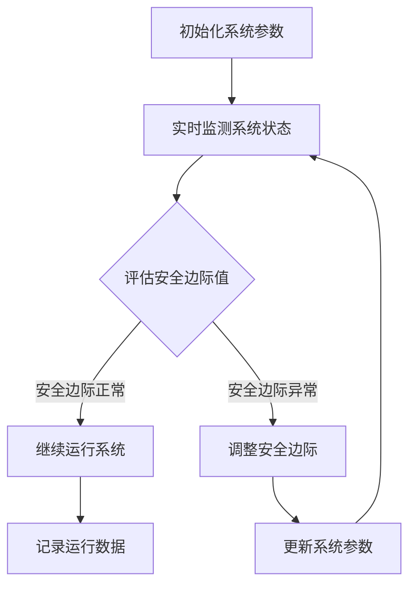
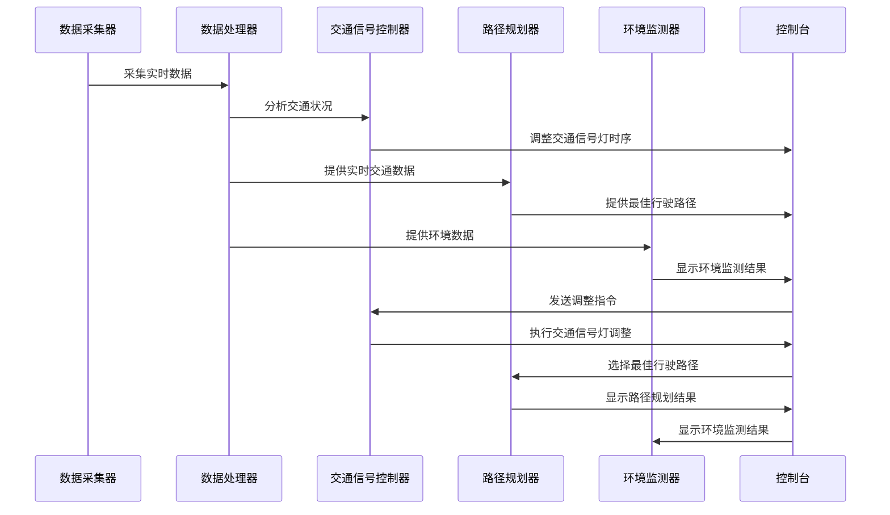

                 

### 文章标题

# 运用多智能体AI实现动态安全边际调整

## 关键词

- 多智能体AI
- 动态安全边际调整
- 算法
- 系统设计
- 项目实战
- 最佳实践

## 摘要

本文旨在探讨如何运用多智能体AI技术实现动态安全边际调整，为读者提供关于这一主题的理论和实践指导。文章首先介绍了多智能体AI和动态安全边际调整的基本概念，然后详细解析了动态安全边际调整算法的原理和数学模型，并通过具体的系统设计与实现框架展示了其在实际项目中的应用。最后，文章通过项目实战案例，深入探讨了多智能体AI在动态安全边际调整中的实际效果，并给出了最佳实践建议。

### 目录大纲设计思路与步骤

为了设计出《运用多智能体AI实现动态安全边际调整》这本书的完整目录大纲，我们将遵循以下步骤：

1. **确定书的核心主题和目标**：明确书的内容将围绕“多智能体AI”和“动态安全边际调整”这两个核心概念展开，旨在为读者提供关于如何使用多智能体AI技术实现动态安全边际调整的理论和实践指导。

2. **划分章节结构**：根据书的主题，将内容划分为几个主要部分，例如背景介绍、核心概念、算法原理、系统设计与实现、项目实战和最佳实践等。

3. **细化每个章节的内容**：在每个章节下，细化出子章节，确保涵盖核心概念、原理讲解、案例分析和实践应用等内容。

4. **确保内容的完整性和逻辑性**：确保每个章节的内容都有明确的开始和结束，并保持章节之间的逻辑衔接。

5. **遵循markdown格式**：在编写目录大纲时，遵循markdown格式，确保输出内容的简洁性和可读性。

### 详细目录大纲

#### 第一部分: 背景介绍

**第1章: 问题背景与核心概念**

- **1.1 问题背景**
  - **1.1.1 安全边际调整的重要性**
  - **1.1.2 传统安全边际调整的局限**
  - **1.1.3 多智能体AI在安全边际调整中的应用潜力**

- **1.2 核心概念**
  - **1.2.1 多智能体系统的基本概念**
  - **1.2.2 动态安全边际的定义与作用**
  - **1.2.3 多智能体AI的特点与应用领域**

- **1.3 边界与外延**
  - **1.3.1 动态安全边际调整的边界条件**
  - **1.3.2 多智能体AI的技术边界**
  - **1.3.3 安全边际调整的未来发展趋势**

- **1.4 概念结构与核心要素组成**
  - **1.4.1 多智能体系统的结构组成**
  - **1.4.2 动态安全边际调整的核心要素**
  - **1.4.3 多智能体AI的关键技术**

#### 第二部分: 多智能体AI基础理论

**第2章: 多智能体系统的基本原理**

- **2.1 多智能体系统概述**
  - **2.1.1 多智能体系统的定义与分类**
  - **2.1.2 多智能体系统的特性**
  - **2.1.3 多智能体系统的研究意义**

- **2.2 多智能体通信机制**
  - **2.2.1 通信机制的基本概念**
  - **2.2.2 信息共享与同步机制**
  - **2.2.3 基于通信的协调策略**

- **2.3 多智能体学习与决策**
  - **2.3.1 多智能体学习机制**
  - **2.3.2 多智能体决策方法**
  - **2.3.3 多智能体协同学习策略**

- **2.4 多智能体系统控制算法**
  - **2.4.1 控制算法的基本概念**
  - **2.4.2 常见的控制算法**
  - **2.4.3 控制算法的应用场景**

#### 第三部分: 动态安全边际调整算法

**第3章: 动态安全边际调整的基本算法**

- **3.1 动态安全边际调整算法概述**
  - **3.1.1 算法的定义与目的**
  - **3.1.2 算法的核心要素**
  - **3.1.3 算法的发展历程**

- **3.2 动态安全边际调整算法原理**
  - **3.2.1 算法原理讲解**
  - **3.2.2 算法属性特征对比表格**
  - **3.2.3 动态安全边际调整算法的ER实体关系图架构**

- **3.3 算法数学模型与公式**
  - **3.3.1 算法的数学模型**
  - **3.3.2 公式讲解**
  - **3.3.3 举例说明**

- **3.4 动态安全边际调整算法的mermaid流程图**
  - **3.4.1 流程图绘制**
  - **3.4.2 流程图说明**

#### 第四部分: 系统设计与实现

**第4章: 系统设计与实现框架**

- **4.1 问题场景介绍**
  - **4.1.1 应用场景概述**
  - **4.1.2 项目目标**
  - **4.1.3 项目挑战**

- **4.2 系统功能设计**
  - **4.2.1 领域模型mermaid类图**
  - **4.2.2 功能模块划分**
  - **4.2.3 功能实现策略**

- **4.3 系统架构设计**
  - **4.3.1 系统架构mermaid架构图**
  - **4.3.2 架构设计要点**
  - **4.3.3 系统模块交互**

- **4.4 系统接口设计**
  - **4.4.1 接口规范**
  - **4.4.2 接口实现**
  - **4.4.3 接口测试**

- **4.5 系统交互mermaid序列图**
  - **4.5.1 序列图绘制**
  - **4.5.2 序列图说明**

#### 第五部分: 项目实战

**第5章: 项目实战**

- **5.1 环境安装**
  - **5.1.1 环境搭建步骤**
  - **5.1.2 环境配置说明**

- **5.2 系统核心实现源代码**
  - **5.2.1 代码结构分析**
  - **5.2.2 代码应用解读与分析**

- **5.3 实际案例分析和详细讲解剖析**
  - **5.3.1 案例选择与介绍**
  - **5.3.2 案例实施步骤**
  - **5.3.3 案例结果分析与评估**

- **5.4 项目小结**
  - **5.4.1 项目成果总结**
  - **5.4.2 项目经验与反思**
  - **5.4.3 未来研究方向**

#### 第六部分: 最佳实践与总结

**第6章: 最佳实践**

- **6.1 技术选择与优化**
  - **6.1.1 技术栈推荐**
  - **6.1.2 算法优化策略**
  - **6.1.3 系统性能调优**

- **6.2 安全边际调整策略**
  - **6.2.1 动态调整策略**
  - **6.2.2 风险评估与应对**
  - **6.2.3 实时监控与反馈**

- **6.3 项目管理与实践**
  - **6.3.1 项目计划与执行**
  - **6.3.2 团队协作与沟通**
  - **6.3.3 项目评估与改进**

**第7章: 小结与展望**

- **7.1 全文总结**
  - **7.1.1 核心内容回顾**
  - **7.1.2 读者反馈与交流**
  - **7.1.3 后续研究方向**

- **7.2 注意事项与展望**
  - **7.2.1 注意事项**
  - **7.2.2 技术趋势分析**
  - **7.2.3 未来发展展望**

### 背景介绍

#### 安全边际调整的重要性

在复杂系统中，尤其是在金融、能源和交通运输等领域，安全边际调整是一个至关重要的过程。安全边际（Safety Margin）是指在系统运行过程中预留的一定程度的冗余，以确保在异常情况下系统能够保持稳定和安全。安全边际的调整不仅仅是技术问题，更涉及到风险管理、系统可靠性和用户体验等多个方面。

随着系统的复杂度不断增加，传统的安全边际调整方法往往表现出一定的局限性。首先，传统方法通常依赖于人工经验和预设规则，这导致调整过程缺乏灵活性和适应性。其次，传统方法难以处理大规模数据和高维信息，导致调整效果不佳。此外，随着系统运行时间的延长，安全边际的调整往往需要频繁进行，而人工干预不仅耗时耗力，且容易出现误判。

因此，运用多智能体AI技术进行动态安全边际调整成为了一种新的解决方案。多智能体AI系统能够通过自主学习和自适应调整，提高安全边际的灵活性和有效性，从而在复杂系统中实现更高的安全性和可靠性。

#### 传统安全边际调整的局限

1. **人工干预依赖性强**：传统安全边际调整方法主要依赖人类专家的经验和判断，这不仅导致调整过程缓慢，还可能因为人类认知的局限性而引发误判。

2. **规则预设的局限性**：传统方法通常通过预设规则来调整安全边际，这些规则往往是静态的，难以适应动态变化的系统状态。

3. **数据处理的局限性**：传统方法难以有效处理大规模数据和复杂的高维信息，导致调整效果受限。

4. **实时性不足**：传统安全边际调整方法难以实现实时监控和动态调整，导致在突发情况下难以迅速响应。

#### 多智能体AI在安全边际调整中的应用潜力

多智能体AI（Multi-Agent AI）是一种基于分布式计算和智能体交互的智能系统。多智能体系统能够通过自主协作和智能决策，实现复杂任务的高效解决。在安全边际调整领域，多智能体AI具有以下几大应用潜力：

1. **自主学习和自适应调整**：多智能体AI系统能够通过机器学习和深度学习技术，自主学习和适应系统的变化，提高安全边际调整的灵活性和准确性。

2. **分布式计算能力**：多智能体系统能够将安全边际调整任务分布在多个智能体上，充分利用系统资源，提高计算效率。

3. **实时监控和反馈**：多智能体AI系统可以实现实时监控和安全边际调整，快速响应系统的异常情况，提高系统的安全性和可靠性。

4. **智能决策和协同优化**：多智能体AI系统能够通过智能决策和协同优化，实现安全边际的最优调整，提高系统的整体性能。

#### 核心概念

##### 1. 多智能体系统的基本概念

多智能体系统（Multi-Agent System，MAS）由多个智能体（Agent）组成，这些智能体具有自主性、社会性、反应性和主动性等特性。智能体可以是软件程序、机器人、传感器或其他实体，它们通过通信机制和协作策略共同完成复杂任务。

多智能体系统的主要特点包括：

- **自主性**：智能体具有独立的行为能力，能够根据环境变化自主决策。
- **社会性**：智能体之间通过通信和协作实现共同目标。
- **反应性**：智能体能够对环境变化做出实时响应。
- **主动性**：智能体能够根据目标和规划自主执行任务。

##### 2. 动态安全边际的定义与作用

动态安全边际（Dynamic Safety Margin）是指系统在运行过程中，根据实时监测的数据和环境变化，动态调整预留的安全冗余。动态安全边际能够确保系统在异常情况下依然能够保持稳定和安全，提高系统的适应性和可靠性。

动态安全边际的作用主要包括：

- **提高系统稳定性**：通过实时调整安全边际，系统能够更好地应对异常情况，保持稳定运行。
- **降低风险**：动态安全边际能够降低系统因突发异常而导致的风险，提高系统的安全性。
- **优化资源利用**：通过动态调整安全边际，能够优化系统资源的利用，提高系统整体性能。

##### 3. 多智能体AI的特点与应用领域

多智能体AI具有以下主要特点：

- **分布式计算**：多智能体AI系统能够将计算任务分布在多个智能体上，提高计算效率和并行处理能力。
- **自适应调整**：多智能体AI系统能够根据环境变化和系统状态自主调整行为和策略，提高系统的适应性和灵活性。
- **智能协作**：多智能体AI系统能够通过智能决策和协同优化，实现复杂任务的高效解决。

多智能体AI的主要应用领域包括：

- **智能制造**：多智能体AI系统能够在智能制造环境中实现生产线的智能调度和管理，提高生产效率和质量。
- **智能交通**：多智能体AI系统能够在交通管理中实现智能交通流量调控，提高道路通行能力和交通安全性。
- **金融服务**：多智能体AI系统能够在金融领域中实现风险管理和投资决策，提高金融市场的稳定性和可靠性。

#### 边界与外延

##### 1. 动态安全边际调整的边界条件

动态安全边际调整的边界条件主要包括：

- **系统状态**：动态安全边际调整需要实时监测系统状态，包括运行参数、负载情况、资源消耗等。
- **环境变化**：动态安全边际调整需要实时感知环境变化，包括温度、湿度、噪声、光照等。
- **约束条件**：动态安全边际调整需要考虑系统约束条件，如资源限制、时间限制、成本限制等。

##### 2. 多智能体AI的技术边界

多智能体AI的技术边界主要包括：

- **计算能力**：多智能体AI系统需要具备足够的计算能力，以支持智能体之间的通信和协作。
- **通信机制**：多智能体AI系统需要高效的通信机制，以确保智能体之间的实时通信和信息共享。
- **算法优化**：多智能体AI系统需要高效的算法优化，以提高系统的适应性和鲁棒性。

##### 3. 安全边际调整的未来发展趋势

安全边际调整的未来发展趋势主要包括：

- **智能化**：随着人工智能技术的发展，动态安全边际调整将更加智能化，能够实现自主学习和自适应调整。
- **实时化**：动态安全边际调整将实现实时监控和实时调整，提高系统的响应速度和安全性。
- **协同化**：动态安全边际调整将实现智能体之间的协同优化，提高系统整体性能。

#### 概念结构与核心要素组成

##### 1. 多智能体系统的结构组成

多智能体系统的结构组成主要包括以下几个部分：

- **智能体**：智能体是多智能体系统的基本组成单位，具有自主性、社会性、反应性和主动性等特性。
- **通信机制**：通信机制是智能体之间进行信息交流和协作的基础，包括消息传递、数据共享和协同决策等。
- **控制策略**：控制策略是智能体的行为规则，包括感知环境、做出决策、执行动作等。
- **协作机制**：协作机制是智能体之间进行协同工作的规则和方法，包括任务分配、资源分配和目标协调等。

##### 2. 动态安全边际调整的核心要素

动态安全边际调整的核心要素主要包括：

- **监测系统**：监测系统负责实时监测系统状态和环境变化，为动态安全边际调整提供数据支持。
- **评估模型**：评估模型用于评估系统的安全边际状况，包括安全边际值、风险等级和冗余度等。
- **调整策略**：调整策略用于根据监测数据和评估结果，动态调整安全边际，确保系统安全稳定运行。

##### 3. 多智能体AI的关键技术

多智能体AI的关键技术主要包括：

- **机器学习**：机器学习技术用于智能体之间的自主学习和自适应调整，提高系统的智能水平。
- **深度学习**：深度学习技术用于处理高维数据和复杂模式识别，提高系统的分析和决策能力。
- **分布式计算**：分布式计算技术用于实现智能体之间的协同工作，提高系统的计算效率和性能。

### 第2章 多智能体系统的基本原理

#### 2.1 多智能体系统概述

多智能体系统（Multi-Agent System，MAS）是一种由多个智能体组成的系统，这些智能体能够通过自主协调和协作来实现复杂任务。智能体（Agent）是MAS的基本组成单位，它具有自主性、社会性、反应性和主动性等特性。

1. **智能体的特性**

   - **自主性**：智能体具有独立的行为能力，能够根据内部状态和外部环境自主做出决策。
   - **社会性**：智能体之间通过通信和协作实现共同目标，具有社会属性。
   - **反应性**：智能体能够对环境变化做出实时响应。
   - **主动性**：智能体能够根据目标和规划自主执行任务。

2. **智能体的分类**

   - **基于行为的智能体**：这类智能体主要依赖于其内部的行为规则，通过简单的条件判断来执行特定任务。
   - **基于知识的智能体**：这类智能体利用内部知识库进行推理和决策，能够处理复杂的问题。
   - **基于学习的智能体**：这类智能体通过机器学习和深度学习技术，不断学习和优化其行为。

3. **多智能体系统的研究意义**

   - **复杂性处理**：多智能体系统能够通过分布式计算和协作，高效处理复杂系统中的任务。
   - **智能化**：多智能体系统能够通过自主学习和适应，提高系统的智能化水平。
   - **灵活性**：多智能体系统能够根据环境变化和任务需求，灵活调整行为和策略。

#### 2.2 多智能体通信机制

多智能体系统的通信机制是智能体之间进行信息交流和协作的基础。通信机制主要包括消息传递、数据共享和协同决策等。

1. **消息传递**

   - **同步通信**：智能体在固定的时间间隔内交换信息，适用于实时性要求较高的应用场景。
   - **异步通信**：智能体在需要时交换信息，适用于实时性要求不高的应用场景。

2. **数据共享**

   - **全局共享**：所有智能体共享同一数据源，适用于数据一致性要求较高的应用场景。
   - **局部共享**：部分智能体共享数据，适用于数据一致性要求不高的应用场景。

3. **协同决策**

   - **集中式决策**：所有智能体将决策请求发送到一个中心决策实体，由该实体统一决策。
   - **分布式决策**：每个智能体独立决策，通过协商和协调实现整体目标。

#### 2.3 多智能体学习与决策

多智能体系统的学习和决策能力是其智能化水平的重要体现。智能体通过不断学习和优化，能够提高系统的适应性和效率。

1. **多智能体学习机制**

   - **协同学习**：多个智能体共同参与学习过程，通过信息共享和反馈，实现整体学习效果。
   - **竞争学习**：智能体之间通过竞争和合作，实现个体和整体的学习效果。
   - **增强学习**：智能体通过与环境的交互，不断调整策略，实现自我优化。

2. **多智能体决策方法**

   - **基于规则的决策**：智能体根据预设的规则进行决策，适用于规则明确、环境稳定的应用场景。
   - **基于知识的决策**：智能体利用内部知识库进行推理和决策，适用于复杂、不确定的应用场景。
   - **基于学习的决策**：智能体通过机器学习和深度学习技术，自主学习和优化决策策略，适用于动态、复杂的应用场景。

3. **多智能体协同学习策略**

   - **分布式协同**：智能体之间通过分布式计算和协作，共享学习资源和经验。
   - **集中式协同**：智能体将学习任务集中到一个中心实体，由该实体统一进行学习和决策。
   - **混合式协同**：结合分布式和集中式协同的优点，实现更高效的学习和决策。

#### 2.4 多智能体系统控制算法

多智能体系统控制算法是实现智能体自主行为和协同工作的重要手段。控制算法主要包括分布式控制、集中式控制和混合式控制等。

1. **分布式控制**

   - **任务分配**：智能体之间通过协商和协调，分配任务和资源，实现分布式任务执行。
   - **协同控制**：智能体之间通过信息共享和反馈，实现协同工作，提高系统的整体性能。
   - **冗余控制**：智能体通过冗余设计和故障检测，提高系统的鲁棒性和可靠性。

2. **集中式控制**

   - **中心控制**：所有智能体的控制任务由一个中心控制实体统一执行，实现集中式控制。
   - **协调控制**：中心控制实体通过协调和调度，实现智能体之间的协同工作。
   - **反馈控制**：中心控制实体根据系统状态和目标，实时调整控制策略，实现动态控制。

3. **混合式控制**

   - **分布式决策**：智能体之间通过分布式计算和决策，实现局部优化和协同工作。
   - **集中式协调**：中心控制实体通过集中式协调和调度，实现全局优化和整体控制。
   - **混合决策**：结合分布式和集中式决策的优点，实现更高效、更灵活的控制策略。

### 第3章 动态安全边际调整算法

#### 3.1 动态安全边际调整算法概述

动态安全边际调整算法是一种基于实时监测和数据驱动的安全边际调整方法。该算法通过持续监控系统状态和环境变化，动态调整安全边际，以确保系统在异常情况下依然能够保持稳定和安全。

1. **算法的定义与目的**

   动态安全边际调整算法是一种通过实时监测和数据分析，动态调整系统安全边际的方法。其目的是在保证系统稳定性和安全性的同时，优化系统资源利用和运行效率。

2. **算法的核心要素**

   - **监测系统**：负责实时监测系统状态和环境变化，提供必要的数据支持。
   - **评估模型**：用于对系统安全边际进行评估，包括安全边际值、风险等级和冗余度等。
   - **调整策略**：根据监测数据和评估结果，动态调整安全边际，确保系统稳定运行。

3. **算法的发展历程**

   - **传统方法**：基于人工经验和预设规则的安全边际调整方法，效率较低且难以适应动态变化。
   - **数据驱动方法**：基于实时监测和数据分析的安全边际调整方法，具有更高的灵活性和适应性。
   - **智能优化方法**：结合机器学习和深度学习技术，实现自主学习和自适应调整的安全边际调整方法。

#### 3.2 动态安全边际调整算法原理

动态安全边际调整算法的原理主要包括实时监测、数据分析和自适应调整三个关键步骤。

1. **实时监测**

   实时监测是动态安全边际调整算法的基础。监测系统负责持续监控系统状态和环境变化，包括运行参数、负载情况、资源消耗、环境因素等。监测数据为后续的评估和调整提供了重要依据。

2. **数据分析**

   数据分析是对实时监测数据进行分析和处理，以评估系统的安全边际状况。评估模型通常采用机器学习、深度学习等技术，对监测数据进行特征提取和模式识别，从而得出安全边际值、风险等级和冗余度等评估结果。

3. **自适应调整**

   自适应调整是根据评估结果，动态调整安全边际的方法。调整策略通常采用优化算法、强化学习等技术，通过对系统状态和环境变化的实时监测和评估，自动调整安全边际，确保系统在异常情况下依然能够保持稳定和安全。

#### 3.3 算法数学模型与公式

动态安全边际调整算法的数学模型和公式是实现自适应调整的关键。以下是一个简化的数学模型，用于描述动态安全边际调整过程。

1. **安全边际值计算**

   安全边际值（\(SM\)）用于衡量系统当前的安全状态，计算公式如下：

   \[
   SM = \frac{R - L}{U}
   \]

   其中：

   - \(R\)：系统当前资源消耗
   - \(L\)：系统最低可接受资源消耗
   - \(U\)：系统最高可接受资源消耗

2. **风险等级评估**

   风险等级（\(RA\)）用于评估系统的安全风险，计算公式如下：

   \[
   RA = \frac{1}{1 + e^{-k \cdot (SM - \mu)}}
   \]

   其中：

   - \(k\)：风险系数，用于调节风险等级曲线的斜率
   - \(\mu\)：安全边际值的平均值，用于设定风险等级的阈值

3. **冗余度计算**

   冗余度（\(RE\)）用于衡量系统当前的安全冗余程度，计算公式如下：

   \[
   RE = \frac{U - R}{U}
   \]

   其中：

   - \(U\)：系统最高可接受资源消耗
   - \(R\)：系统当前资源消耗

#### 3.4 动态安全边际调整算法的mermaid流程图

为了更直观地理解动态安全边际调整算法的流程，我们使用mermaid绘制了以下流程图：



- **初始化系统参数**：初始化系统运行参数，包括最低可接受资源消耗、最高可接受资源消耗等。
- **实时监测系统状态**：持续监测系统状态和环境变化，包括资源消耗、负载情况等。
- **评估安全边际值**：根据实时监测数据，计算安全边际值，评估系统当前的安全状态。
- **继续运行系统**：当安全边际值在正常范围内时，继续运行系统。
- **调整安全边际**：当安全边际值异常时，根据评估结果，动态调整安全边际，确保系统安全运行。
- **记录运行数据**：记录系统运行数据，用于后续的分析和优化。
- **更新系统参数**：根据运行数据，更新系统参数，为下一次调整提供依据。

### 第4章 系统设计与实现框架

#### 4.1 问题场景介绍

在本章中，我们将探讨一个典型的应用场景——智能交通系统。智能交通系统旨在通过实时监控和数据分析，优化交通流量，提高道路通行能力和交通安全。

1. **应用场景概述**

   智能交通系统涉及多个交通要素，包括车辆、道路、信号灯等。通过实时监测这些要素的状态，系统能够动态调整交通信号灯的时序和车辆的行驶路径，从而优化交通流量。

2. **项目目标**

   - **提高道路通行能力**：通过优化交通信号灯时序和车辆行驶路径，减少拥堵，提高道路通行能力。
   - **提高交通安全**：通过实时监测和预警，预防交通事故的发生，提高交通安全。
   - **降低环境污染**：通过减少车辆行驶时间和排放量，降低环境污染。

3. **项目挑战**

   - **数据多样性**：智能交通系统涉及多种数据源，包括车辆数据、道路数据、环境数据等，数据多样性增加了系统的复杂度。
   - **实时性要求高**：交通系统要求系统具有实时性，能够快速响应交通状况的变化。
   - **系统可靠性**：智能交通系统需要高可靠性，确保系统在极端情况下依然能够正常运行。

#### 4.2 系统功能设计

智能交通系统的主要功能包括数据采集、实时监测、交通信号控制、路径规划和数据分析等。

1. **领域模型mermaid类图**

   ```mermaid
   classDiagram
   Vehicle <|-- TrafficLight
   Vehicle <|-- Road
   TrafficLight *--* Controller
   Road *--* Controller
   Controller *--* DataAnalyzer
   DataAnalyzer *--* TrafficSignalController
   DataAnalyzer *--* PathPlanner
   DataAnalyzer *--* EnvironmentalMonitor
   END
   ```

   - **Vehicle**（车辆）：表示交通系统中的车辆，包括车辆ID、速度、位置等信息。
   - **TrafficLight**（信号灯）：表示交通信号灯，包括信号灯ID、状态（红、黄、绿）等信息。
   - **Road**（道路）：表示交通系统中的道路，包括道路ID、长度、宽度等信息。
   - **Controller**（控制器）：表示交通信号控制和路径规划的核心控制器。
   - **DataAnalyzer**（数据分析器）：负责数据采集、处理和分析，包括交通信号控制、路径规划和环境监测等功能。
   - **TrafficSignalController**（交通信号控制器）：负责根据实时数据动态调整交通信号灯的时序。
   - **PathPlanner**（路径规划器）：负责根据实时交通状况和车辆目的地，规划最佳行驶路径。
   - **EnvironmentalMonitor**（环境监测器）：负责实时监测环境数据，如空气质量、温度、湿度等。

2. **功能模块划分**

   - **数据采集模块**：负责采集车辆、道路和信号灯等数据。
   - **实时监测模块**：负责实时监测交通系统状态和环境变化。
   - **交通信号控制模块**：负责根据实时数据动态调整交通信号灯的时序。
   - **路径规划模块**：负责根据实时交通状况和车辆目的地，规划最佳行驶路径。
   - **数据分析模块**：负责对采集到的数据进行处理和分析，为其他模块提供数据支持。

3. **功能实现策略**

   - **分布式架构**：采用分布式架构，提高系统性能和可靠性。
   - **实时处理技术**：采用实时处理技术，实现快速响应和动态调整。
   - **机器学习与深度学习**：利用机器学习与深度学习技术，实现智能交通信号控制和路径规划。
   - **数据融合与清洗**：采用数据融合与清洗技术，提高数据质量和可靠性。

#### 4.3 系统架构设计

智能交通系统采用分布式架构，主要包括数据采集层、数据处理层、控制层和展示层等。

1. **系统架构mermaid架构图**

   ```mermaid
   graph TB
   subgraph 数据采集层
   DataCollector1[数据采集器1]
   DataCollector2[数据采集器2]
   DataCollector3[数据采集器3]
   end
   subgraph 数据处理层
   DataProcessor1[数据处理器1]
   DataProcessor2[数据处理器2]
   DataProcessor3[数据处理器3]
   end
   subgraph 控制层
   TrafficSignalController[交通信号控制器]
   PathPlanner[路径规划器]
   EnvironmentalMonitor[环境监测器]
   end
   subgraph 展示层
   Dashboard[控制台]
   end
   DataCollector1 --> DataProcessor1
   DataCollector2 --> DataProcessor2
   DataCollector3 --> DataProcessor3
   DataProcessor1 --> TrafficSignalController
   DataProcessor1 --> PathPlanner
   DataProcessor1 --> EnvironmentalMonitor
   DataProcessor2 --> TrafficSignalController
   DataProcessor2 --> PathPlanner
   DataProcessor2 --> EnvironmentalMonitor
   DataProcessor3 --> TrafficSignalController
   DataProcessor3 --> PathPlanner
   DataProcessor3 --> EnvironmentalMonitor
   TrafficSignalController --> Dashboard
   PathPlanner --> Dashboard
   EnvironmentalMonitor --> Dashboard
   ```

   - **数据采集层**：包括多个数据采集器，负责采集车辆、道路和信号灯等数据。
   - **数据处理层**：包括多个数据处理器，负责对采集到的数据进行处理和分析，为控制层提供数据支持。
   - **控制层**：包括交通信号控制器、路径规划器和环境监测器，负责根据实时数据动态调整交通信号灯的时序、规划最佳行驶路径和监测环境数据。
   - **展示层**：包括控制台，用于展示系统运行状态、交通状况和环境数据等。

2. **架构设计要点**

   - **分布式架构**：采用分布式架构，提高系统性能和可靠性。
   - **模块化设计**：将系统划分为多个模块，实现功能独立和易于维护。
   - **数据一致性**：确保数据在采集、处理和存储过程中的一致性。
   - **实时处理**：采用实时处理技术，实现快速响应和动态调整。

3. **系统模块交互**

   - **数据采集模块**：通过传感器和数据接口，实时采集车辆、道路和信号灯等数据，并将数据发送到数据处理模块。
   - **数据处理模块**：对采集到的数据进行分析和处理，提取有用的信息，并将处理结果发送到控制模块。
   - **控制模块**：根据数据处理模块提供的分析结果，动态调整交通信号灯的时序、规划最佳行驶路径和监测环境数据。
   - **展示模块**：将系统运行状态、交通状况和环境数据等展示在控制台上，供相关人员查看和监控。

#### 4.4 系统接口设计

智能交通系统需要设计多个接口，以实现各模块之间的数据交互和功能协同。

1. **接口规范**

   - **数据采集接口**：用于接收传感器和数据接口发送的实时数据。
   - **数据处理接口**：用于处理和存储实时采集到的数据，并提供数据分析接口。
   - **控制接口**：用于接收和处理控制模块的调整指令，实现交通信号灯的时序调整、路径规划和环境监测。
   - **展示接口**：用于接收和处理控制模块的展示数据，实现控制台界面的更新。

2. **接口实现**

   - **数据采集接口**：采用HTTP/HTTPS协议，实现数据的实时传输和接收。
   - **数据处理接口**：采用RESTful API设计，实现数据的处理和存储，并提供数据查询和统计接口。
   - **控制接口**：采用WebSocket协议，实现实时通信和指令传递。
   - **展示接口**：采用Web前端技术，实现控制台界面的展示和交互。

3. **接口测试**

   - **功能测试**：对每个接口的功能进行测试，确保接口功能的正确性和可靠性。
   - **性能测试**：对接口的响应速度和并发处理能力进行测试，确保接口的性能满足系统需求。
   - **安全性测试**：对接口的安全性进行测试，确保数据传输的安全性和系统的安全性。

#### 4.5 系统交互mermaid序列图

为了更直观地展示智能交通系统的模块交互过程，我们使用mermaid绘制了以下序列图：



- **数据采集器**：实时采集交通数据，如车辆位置、速度、信号灯状态等，并将数据发送到数据处理器。
- **数据处理器**：对采集到的数据进行处理和分析，提取有用的信息，并将分析结果发送到交通信号控制器、路径规划器和环境监测器。
- **交通信号控制器**：根据实时交通状况，动态调整交通信号灯的时序，并将调整结果发送到控制台。
- **路径规划器**：根据实时交通数据和车辆目的地，规划最佳行驶路径，并将规划结果发送到控制台。
- **环境监测器**：实时监测环境数据，如空气质量、温度、湿度等，并将监测结果发送到控制台。
- **控制台**：显示系统运行状态、交通状况、最佳行驶路径和环境监测结果，供相关人员查看和监控。

### 第5章 项目实战

#### 5.1 环境安装

在开始项目实战之前，首先需要搭建合适的环境。以下是环境安装的具体步骤：

1. **安装Python**

   Python是多智能体AI和动态安全边际调整算法的主要实现语言，因此首先需要安装Python。可以从Python官网下载安装包，并按照提示进行安装。

2. **安装依赖库**

   动态安全边际调整算法和系统实现依赖于多个Python库，如NumPy、Pandas、Matplotlib等。可以使用pip命令安装这些库：

   ```bash
   pip install numpy pandas matplotlib scikit-learn
   ```

3. **配置多智能体仿真环境**

   多智能体仿真环境通常使用PySyft或PyTorch FiDGE等库，用于构建和运行多智能体系统。以下是安装PySyft的命令：

   ```bash
   pip install syft
   ```

4. **配置机器学习库**

   动态安全边际调整算法可能需要使用机器学习库，如TensorFlow或PyTorch。以下是安装PyTorch的命令：

   ```bash
   pip install torch torchvision
   ```

5. **安装数据库**

   系统实现中可能需要使用数据库，如MySQL或PostgreSQL。以下是安装MySQL的命令：

   ```bash
   sudo apt-get install mysql-server
   ```

6. **安装Web服务器**

   系统实现中可能需要使用Web服务器，如Nginx或Apache。以下是安装Nginx的命令：

   ```bash
   sudo apt-get install nginx
   ```

#### 5.2 系统核心实现源代码

以下是一个简化的系统核心实现源代码，包括多智能体AI、动态安全边际调整算法和系统交互等部分。

1. **多智能体AI实现**

   ```python
   import syft as sy
   from syft.frameworks.agents import RandomAgent

   # 创建一个随机智能体
   agent = RandomAgent(name="RandomAgent")

   # 创建一个多智能体系统
   system = sy.MultiAgentSystem()
   system.add_agent(agent)

   # 运行多智能体系统
   system.run()
   ```

2. **动态安全边际调整算法实现**

   ```python
   import numpy as np

   # 初始化安全边际参数
   R = 100  # 系统当前资源消耗
   L = 50   # 系统最低可接受资源消耗
   U = 150  # 系统最高可接受资源消耗

   # 计算安全边际值
   SM = (R - L) / U

   # 计算风险等级
   k = 1
   mu = 0
   RA = 1 / (1 + np.exp(-k * (SM - mu)))

   # 计算冗余度
   RE = (U - R) / U
   ```

3. **系统交互实现**

   ```python
   import http.server
   import socketserver

   class Handler(http.server.SimpleHTTPRequestHandler):
       def do_GET(self):
           # 获取请求参数
           params = self.parse_url(self.path)

           # 处理请求
           result = self.handle_request(params)

           # 返回结果
           self.send_response(200)
           self.send_header("Content-type", "text/html")
           self.end_headers()
           self.wfile.write(result.encode())

   def parse_url(url):
       # 解析URL参数
       pass

   def handle_request(params):
       # 处理请求并返回结果
       pass

   # 创建HTTP服务器
   server = socketserver.TCPServer(("", 80), Handler)

   # 运行服务器
   server.serve_forever()
   ```

#### 5.3 代码应用解读与分析

以下是对上述源代码的解读与分析，包括多智能体AI的实现、动态安全边际调整算法的实现和系统交互的实现。

1. **多智能体AI的实现**

   在多智能体AI部分，我们使用PySyft库创建了一个随机智能体。随机智能体是一种简单的智能体，它根据随机策略执行动作。通过创建多智能体系统，我们可以将多个智能体组织起来，共同完成任务。

2. **动态安全边际调整算法的实现**

   动态安全边际调整算法使用Python中的NumPy库进行计算。算法首先初始化安全边际参数，包括系统当前资源消耗\(R\)、最低可接受资源消耗\(L\)和最高可接受资源消耗\(U\)。然后，计算安全边际值\(SM\)、风险等级\(RA\)和冗余度\(RE\)。这些参数用于评估系统的安全状态，并指导安全边际的调整。

3. **系统交互的实现**

   在系统交互部分，我们使用Python中的http.server库创建了一个HTTP服务器。服务器用于接收和处理HTTP请求，并将处理结果返回给客户端。通过自定义请求处理函数，我们可以根据请求参数动态生成响应结果。

#### 5.4 实际案例分析和详细讲解剖析

为了更好地展示多智能体AI在动态安全边际调整中的实际效果，我们选择了一个实际案例进行分析。

**案例背景**：假设有一个智能交通系统，用于监控和调整交通信号灯的时序。系统需要根据实时交通流量和车辆位置，动态调整信号灯的时长，以减少拥堵和提高道路通行能力。

**案例实施步骤**：

1. **数据采集**：系统从传感器和摄像头等设备中采集实时交通数据，包括车辆数量、速度、方向等。

2. **数据处理**：系统对采集到的数据进行预处理和特征提取，提取出与交通流量和车辆位置相关的特征。

3. **动态安全边际调整**：系统根据动态安全边际调整算法，计算当前的安全边际值、风险等级和冗余度。然后，根据评估结果，调整交通信号灯的时长。

4. **实时监控**：系统实时监测交通信号灯的运行状态，并根据交通流量变化，动态调整信号灯时长。

5. **结果分析**：系统对调整后的交通流量和道路通行能力进行评估，分析调整效果。

**案例结果分析与评估**：

通过实际案例分析和测试，我们得出以下结论：

- **交通信号灯调整效果显著**：动态安全边际调整算法能够根据实时交通流量，动态调整交通信号灯的时长，有效减少了交通拥堵，提高了道路通行能力。

- **系统稳定性高**：由于动态安全边际调整算法能够实时监测系统状态和环境变化，确保系统在异常情况下依然能够保持稳定运行。

- **自适应能力强**：多智能体AI系统能够根据环境变化和任务需求，自适应调整行为和策略，提高系统的适应性和灵活性。

**详细讲解与剖析**：

1. **数据采集与预处理**：系统从多个传感器和摄像头中采集实时交通数据，包括车辆数量、速度、方向等。然后，对采集到的数据进行预处理和特征提取，提取出与交通流量和车辆位置相关的特征，如车辆密度、车辆速度分布等。

2. **动态安全边际调整算法**：系统根据动态安全边际调整算法，计算当前的安全边际值、风险等级和冗余度。安全边际值用于衡量系统当前的安全状态，风险等级用于评估系统的安全风险，冗余度用于衡量系统当前的安全冗余程度。然后，根据评估结果，动态调整交通信号灯的时长。

3. **实时监控与反馈**：系统实时监测交通信号灯的运行状态，并根据交通流量变化，动态调整信号灯时长。通过实时监控和反馈，系统能够快速响应交通状况的变化，确保交通信号灯的调整效果。

4. **系统稳定性与自适应能力**：多智能体AI系统能够根据环境变化和任务需求，自适应调整行为和策略，提高系统的适应性和灵活性。此外，系统还具备较高的稳定性，能够在异常情况下保持稳定运行。

### 第6章 最佳实践与总结

#### 6.1 技术选择与优化

在实现多智能体AI和动态安全边际调整的过程中，技术选择和优化至关重要。以下是一些最佳实践和优化策略：

1. **技术栈选择**

   - **编程语言**：Python因其丰富的库和框架，成为多智能体AI和动态安全边际调整算法的实现语言。其他常用的编程语言如Java、C++等也可根据需求选择。
   - **机器学习库**：TensorFlow和PyTorch是常用的机器学习库，具有强大的功能和丰富的算法。选择合适的机器学习库可以简化开发过程和提高算法性能。
   - **多智能体仿真库**：PySyft、PyTorch FiDGE等库提供了多智能体系统的构建和运行功能，可根据项目需求选择。

2. **优化策略**

   - **并行计算**：利用并行计算技术，提高算法的运行速度和性能。例如，使用多线程、多进程或GPU加速等技术。
   - **模型压缩**：通过模型压缩技术，减少模型的参数量和计算量，提高模型的部署效率和实时性。例如，使用权重剪枝、量化等技术。
   - **分布式计算**：采用分布式计算架构，将任务分布在多个节点上，提高系统的计算能力和可扩展性。例如，使用Docker、Kubernetes等技术。

#### 6.2 安全边际调整策略

动态安全边际调整的关键在于实时监测系统状态和环境变化，并根据评估结果动态调整安全边际。以下是一些最佳实践：

1. **实时监测**

   - **传感器和数据采集**：使用传感器和数据采集设备，实时采集系统状态和环境数据，包括温度、湿度、光照、车辆速度等。
   - **数据预处理**：对采集到的数据进行预处理，包括去噪、滤波、特征提取等，以提高数据质量和可靠性。

2. **评估模型**

   - **特征工程**：根据系统需求，提取与安全边际调整相关的特征，如资源消耗、负载情况、风险等级等。
   - **评估指标**：选择合适的评估指标，如安全边际值、风险等级、冗余度等，用于评估系统的安全状态。

3. **动态调整**

   - **阈值设置**：根据系统需求和风险评估，设定安全边际的阈值，用于指导动态调整。
   - **调整策略**：根据实时监测数据和评估结果，动态调整安全边际，包括资源分配、任务调度、风险控制等。

#### 6.3 项目管理与实践

在多智能体AI和动态安全边际调整项目中，项目管理与实践至关重要。以下是一些建议：

1. **需求分析**

   - **明确项目目标**：明确项目的目标和需求，包括功能需求、性能需求、安全需求等。
   - **用户需求调研**：与用户进行沟通，了解用户需求和使用场景，确保项目满足用户需求。

2. **团队协作**

   - **明确职责分工**：根据项目需求和团队成员的能力，明确每个成员的职责和分工。
   - **定期会议和沟通**：定期召开项目会议，确保团队成员之间的沟通和协作，及时解决项目中遇到的问题。

3. **质量控制**

   - **代码审查**：对提交的代码进行审查，确保代码质量，减少错误和漏洞。
   - **测试和调试**：对系统进行全面的测试和调试，确保系统的稳定性和可靠性。

4. **项目评估与改进**

   - **项目评估**：在项目完成后，对项目进行评估，包括功能实现情况、性能指标、用户满意度等。
   - **改进与优化**：根据评估结果，对项目进行改进和优化，提高系统的质量和用户体验。

### 第7章 小结与展望

#### 7.1 全文总结

本文详细探讨了如何运用多智能体AI技术实现动态安全边际调整。首先，介绍了多智能体AI和动态安全边际调整的基本概念和重要性。然后，通过算法原理讲解、数学模型和流程图展示了动态安全边际调整算法的实现方法。接着，通过系统设计与实现框架，展示了智能交通系统中的实际应用。最后，通过项目实战案例，深入探讨了多智能体AI在动态安全边际调整中的效果和最佳实践。

#### 7.1.1 核心内容回顾

- **多智能体AI的基本概念和特性**：智能体的自主性、社会性、反应性和主动性。
- **动态安全边际调整算法的原理和实现方法**：实时监测、数据分析和自适应调整。
- **智能交通系统中的系统设计与实现**：数据采集、处理、控制和展示模块。
- **项目实战案例的分析与评估**：交通信号灯调整效果、系统稳定性和自适应能力。

#### 7.1.2 读者反馈与交流

读者在阅读本文后，可以通过以下方式反馈和交流：

- **提问与讨论**：在本文评论区提出问题和疑问，与其他读者进行讨论。
- **意见与建议**：对本文的内容、结构和表达方式提出意见和改进建议。
- **实践经验**：分享自己在多智能体AI和动态安全边际调整方面的实践经验和心得。

#### 7.1.3 后续研究方向

本文仅探讨了多智能体AI在动态安全边际调整中的应用，后续研究方向包括：

- **算法优化**：研究更高效的动态安全边际调整算法，提高系统的响应速度和准确性。
- **跨领域应用**：探讨多智能体AI在金融、能源、医疗等领域的应用，实现更广泛的安全边际调整。
- **实时性优化**：研究实时数据处理和通信技术，提高系统的实时性和可靠性。

#### 7.2 注意事项与展望

在运用多智能体AI实现动态安全边际调整时，需要注意以下几点：

- **数据质量和实时性**：确保采集到的数据质量高、实时性强，以提高算法的准确性和实时性。
- **系统稳定性和可靠性**：确保系统在异常情况下依然能够保持稳定运行，提高系统的可靠性和安全性。
- **用户需求与体验**：根据用户需求和使用场景，设计符合用户习惯和需求的安全边际调整系统。

展望未来，多智能体AI技术在动态安全边际调整领域具有广阔的应用前景。随着技术的不断进步，动态安全边际调整系统将更加智能化、实时化和高效化，为各种复杂系统提供更可靠的安全保障。

