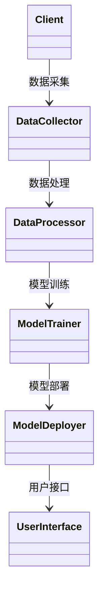
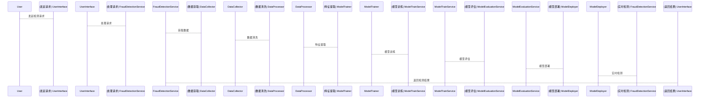
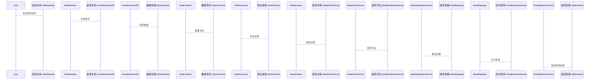

                 

### 第1章 引言：大模型时代与敏捷研发的融合

随着人工智能技术的飞速发展，大模型（如GPT、BERT等）在自然语言处理、计算机视觉等领域取得了令人瞩目的成果。这些大模型通常拥有数十亿甚至千亿个参数，其强大的计算能力和自适应能力为企业带来了前所未有的业务机会。然而，大模型的应用也带来了一系列技术挑战，尤其是在研发过程中。

#### 1.1.1 大模型技术的兴起

大模型技术的兴起主要得益于以下几个方面：

1. **计算能力的提升**：近年来，计算硬件的性能大幅提升，特别是GPU和TPU等专用硬件的广泛应用，使得大规模模型的训练和推理成为可能。
2. **数据资源的丰富**：互联网的普及和数据存储技术的发展，为大规模模型训练提供了充足的数据资源。
3. **算法的进步**：深度学习算法的不断优化，如优化器、正则化技术等，使得大模型的训练效率和质量得到了显著提升。

大模型的卓越表现吸引了各行业的广泛关注，从自然语言处理到图像识别，再到语音识别和自动驾驶，大模型的应用场景日益广泛。然而，这些大模型也带来了显著的技术挑战：

- **计算资源的高消耗**：大模型的训练和推理需要大量的计算资源，这可能导致研发成本和基础设施的显著增加。
- **数据隐私和安全**：大模型训练过程中往往需要大量用户数据，如何确保数据隐私和安全成为一大难题。
- **模型可解释性**：大模型通常被视为“黑箱”，其内部决策过程难以解释，这可能会影响其在某些领域的应用。

#### 1.1.2 敏捷研发的必要性

敏捷研发强调快速迭代、用户反馈和持续改进，与大模型的特性高度契合。以下是一些敏捷研发的必要性：

- **快速迭代**：大模型项目通常需要快速响应市场变化和用户需求，敏捷研发能够通过短期迭代实现快速交付，从而提高市场竞争力。
- **团队协作**：大模型项目通常涉及多个领域和职能，如算法、数据、前端和运维等，敏捷研发强调跨职能团队的紧密协作，有助于提高项目效率。

#### 1.2 问题描述

如何在确保大模型项目质量的同时，实现快速迭代和高效协作？这是大模型应用中亟待解决的问题。传统的瀑布模型在应对快速变化的需求时显得力不从心，而敏捷研发模式则提供了更好的解决方案。然而，将敏捷研发应用于大模型项目，仍然面临一系列挑战，如技术复杂性、资源管理和团队协作等。因此，本文旨在探讨如何在大模型项目中有效应用敏捷研发模式，以实现项目的成功。

#### 1.3 问题解决

为了解决上述问题，本文将采用以下思路：

1. **敏捷研发模式概述**：首先介绍敏捷研发的基本概念和核心原则，包括用户至上、迭代开发、团队协作等。
2. **敏捷在适配大模型中的应用**：详细探讨敏捷研发在适配大模型项目中的具体应用，包括需求管理、持续集成、团队协作等方面。
3. **案例分析**：通过具体案例展示敏捷研发模式在大模型项目中的成功应用，分析其优势和不足。
4. **解决方案**：总结解决方案，并提出针对大模型项目的具体建议。

通过以上分析，本文将探讨如何将敏捷研发模式有效应用于大模型项目，以实现快速迭代、高效协作和高质量交付。

#### 1.4 边界与外延

在大模型项目中应用敏捷研发模式，需要明确其适用范围和边界条件。以下是适用范围和不适用的情景：

##### 1.4.1 适用范围

1. **项目规模**：敏捷研发模式适用于大型、复杂的大模型项目。这类项目通常涉及多个领域和复杂的系统架构，需要快速响应变化和高效协作。
2. **行业领域**：敏捷研发模式可以应用于金融、医疗、零售等多个行业。这些行业通常需要高精度和实时性的大模型应用，如金融风险评估、医疗图像分析、零售个性化推荐等。

##### 1.4.2 不适用情况

1. **需求明确且稳定**：对于需求明确且稳定的项目，传统的瀑布模型可能更为适用。敏捷研发强调快速迭代和持续改进，在需求明确的情况下，瀑布模型能够提供更稳定的开发流程。
2. **资源限制**：敏捷研发模式需要一定的资源和基础设施支持，如计算资源、人力资源等。如果资源有限，可能无法满足敏捷研发的要求。

通过明确适用范围和不适用情况，可以帮助项目团队更好地选择合适的研发模式，以提高项目的成功率和效率。

#### 1.5 概念结构与核心要素组成

##### 1.5.1 核心概念

敏捷研发是一种以用户需求为导向，强调快速迭代、持续改进和团队协作的软件开发方法。其核心概念包括：

- **用户至上**：用户需求是敏捷研发的核心，所有开发和改进工作都应围绕用户需求展开。
- **迭代开发**：敏捷研发通过短期迭代（通常为2-4周）进行持续交付，每个迭代都产生可用的产品版本。
- **团队协作**：敏捷研发强调跨职能团队的紧密协作，鼓励团队成员共同参与需求和设计讨论，提高团队整体效率。

大模型是一种拥有巨大参数量的AI模型，如GPT、BERT等。其核心概念包括：

- **参数规模**：大模型通常拥有数十亿甚至千亿个参数，这使得它们在处理复杂数据时具有强大的表现力。
- **训练复杂性**：大模型的训练过程通常需要大量的计算资源和时间，这对硬件和算法提出了高要求。

##### 1.5.2 核心要素

敏捷研发在大模型项目中的核心要素包括：

- **用户故事**：用户故事是描述用户需求的简短故事，通常包括用户角色、目标场景和期望结果。用户故事有助于明确用户需求，指导开发工作。
- **迭代计划**：迭代计划是敏捷研发的核心流程之一，它包括确定迭代周期、目标、任务和交付物。迭代计划有助于确保项目按期完成，并实现用户价值。
- **持续集成**：持续集成是通过自动化测试和部署，确保代码质量和项目进展的重要手段。持续集成能够快速发现和解决代码中的问题，提高项目的稳定性和可靠性。
- **团队协作**：团队协作是敏捷研发成功的关键因素，通过利用敏捷工具（如Jira、Trello等）和最佳实践，可以提升团队协作效率和项目质量。

通过明确核心概念和核心要素，可以帮助项目团队更好地理解和应用敏捷研发模式，以应对大模型项目的复杂性和挑战。

## 第2章 敏捷开发方法论

敏捷开发方法论是一种以用户需求为导向，强调快速迭代、持续改进和团队合作的开发方法。它旨在应对传统瀑布模型在应对快速变化和需求变更时的局限性。敏捷开发的核心原则包括用户至上、迭代开发、持续交付、团队协作等。在本节中，我们将详细探讨敏捷开发的核心原则、关键流程和常用工具。

### 2.1 敏捷开发的核心原则

#### 用户至上

用户至上是敏捷开发的核心原则之一。敏捷开发认为，用户需求是推动项目前进的动力，因此，项目团队应该始终将用户需求放在首位。通过定期与用户沟通，了解用户的需求和反馈，团队可以及时调整开发方向，确保产品最终能够满足用户的需求。

#### 迭代开发

迭代开发是敏捷开发的重要特征。敏捷开发将项目划分为多个短期迭代，每个迭代通常为2-4周。在每个迭代周期内，团队会完成一部分功能，并交付一个可用的产品版本。这种方法有助于快速响应需求变化，提高项目的灵活性和可预测性。

#### 持续交付

持续交付是敏捷开发的另一个核心原则。通过自动化测试和部署，团队可以确保每次迭代交付的产品都是高质量的。持续交付不仅提高了项目的可靠性，还缩短了从开发到生产的时间，使团队能够更快地响应市场变化。

#### 团队协作

团队协作是敏捷开发成功的关键。敏捷开发强调跨职能团队的紧密协作，鼓励团队成员共同参与需求和设计讨论，共享知识和经验。这种协作方式有助于提高团队的沟通效率和创新能力。

### 2.2 敏捷开发的关键流程

#### 产品待办列表

产品待办列表是敏捷开发中用于管理需求的工具。它包含所有待完成的用户故事和任务，并按照优先级排序。产品待办列表有助于团队明确工作重点，确保每个迭代都能交付有价值的功能。

#### 迭代计划

迭代计划是敏捷开发中的关键流程之一。在迭代计划会议中，团队会讨论并确定当前迭代的目标、任务和交付物。迭代计划有助于团队合理安排时间和资源，确保项目按期完成。

#### 演示会议

演示会议是敏捷开发中用于展示迭代成果的重要活动。在每次迭代结束时，团队会向 stakeholders（利益相关者）展示当前版本的功能和进展情况。演示会议不仅有助于收集反馈，还可以增强团队成员的信心和动力。

### 2.3 敏捷开发工具

敏捷开发中常用的工具包括 Jira、Trello 等。这些工具可以帮助团队更好地管理需求和任务，提高协作效率。

#### Jira

Jira 是一款功能强大的项目管理工具，支持任务跟踪、进度管理、报告分析等。团队可以使用 Jira 创建和管理用户故事、任务和迭代，确保项目按计划进行。

#### Trello

Trello 是一款基于看板（Kanban）的敏捷项目管理工具。它通过可视化的卡片和列表，帮助团队直观地了解任务进度和优先级。Trello 适用于小型团队和项目，操作简单，易于上手。

通过遵循敏捷开发的核心原则和关键流程，并利用适当的工具，团队可以更好地应对大模型项目的复杂性和变化性，实现快速迭代和高效协作。

## 第3章 大模型项目中的敏捷应用

在大模型项目中，敏捷研发模式能够提供一种灵活且高效的解决方案，以应对项目的复杂性、快速迭代和团队协作的需求。以下将详细探讨敏捷在项目准备阶段、执行阶段和收尾阶段的具体应用。

### 3.1 大模型项目的特点

大模型项目具有以下几个显著特点：

- **高度复杂**：大模型通常涉及多个领域的技术，如算法、数据、计算资源等，项目复杂度较高。
- **快速迭代**：由于市场需求和算法的持续优化，大模型项目需要快速迭代，以适应不断变化的需求和环境。
- **资源依赖**：大模型项目的成功依赖于强大的计算资源和高质量的数据集，资源管理和数据治理是关键因素。
- **团队协作**：大模型项目通常涉及跨职能团队，包括算法工程师、数据科学家、前端开发人员、运维人员等，团队协作至关重要。

### 3.2 敏捷在项目准备阶段的应用

在项目准备阶段，敏捷研发模式的应用主要集中在需求管理和技术调研上：

#### 3.2.1 需求管理

- **用户故事地图**：用户故事地图是一种直观的需求管理工具，用于整理和排序用户需求。它帮助团队了解用户需求的全貌，并确定每个需求的重要性和优先级。
- **迭代计划**：在项目启动时，团队会进行一次初步的迭代计划，确定第一个迭代的目标和任务。这有助于为后续迭代建立基础，并为团队提供明确的方向。

#### 3.2.2 技术调研

- **大模型架构设计**：在项目启动前，团队需要进行详细的技术调研，确定大模型的架构设计。这包括选择合适的框架和工具，以及设计数据流和计算流程。
- **技术栈选择**：团队需要评估现有的技术栈，确定哪些技术最适合大模型项目的需求。这可能包括深度学习框架（如TensorFlow、PyTorch）、数据处理工具（如Pandas、NumPy）和云计算平台（如AWS、Azure）。

### 3.3 敏捷在项目执行阶段的应用

在项目执行阶段，敏捷研发模式的核心在于持续集成、团队协作和迭代优化：

#### 3.3.1 持续集成

- **CI/CD 流水线**：持续集成（CI）和持续交付（CD）流水线是实现敏捷开发的关键工具。CI流水线自动化测试和构建代码，确保每次代码提交都是可用的。CD流水线自动化部署代码到生产环境，确保新功能快速上线。
- **自动化测试**：自动化测试是持续集成的重要组成部分。通过编写自动化测试脚本，团队可以快速发现和修复代码中的缺陷，提高代码质量。

#### 3.3.2 团队协作

- **敏捷工具**：利用敏捷工具（如Jira、Trello、Slack等），团队可以更好地协调任务和沟通。这些工具提供了任务跟踪、进度更新和团队协作的功能，有助于提高团队的协作效率。
- **站立会议**：每日站立会议是敏捷开发中的常规活动，团队成员在短时间内分享进展、问题和计划。这有助于团队快速发现并解决问题，保持项目进展的透明度。

#### 3.3.3 迭代优化

- **迭代反馈**：每次迭代结束后，团队会进行回顾会议，分析迭代过程中的优点和不足。通过反思和总结，团队可以不断优化开发流程，提高项目效率。
- **需求调整**：根据用户反馈和市场变化，团队可能需要对后续迭代的需求进行调整。这种灵活性有助于确保项目始终符合用户需求。

### 3.4 敏捷在项目收尾阶段的应用

在项目收尾阶段，敏捷研发模式的应用主要集中在验收测试和项目总结上：

#### 3.4.1 验收测试

- **性能测试**：在大模型项目收尾时，团队会进行全面的性能测试，确保模型在真实环境中的表现符合预期。这包括测试模型的准确率、响应时间和资源消耗等。
- **用户验收测试**：邀请用户参与验收测试，确保模型满足用户需求。用户反馈对于优化模型和改进用户体验至关重要。

#### 3.4.2 项目总结

- **成功因素分析**：总结项目成功的关键因素，包括技术选型、团队协作、项目管理等。这些经验教训可以为未来项目提供宝贵的参考。
- **不足和改进**：识别项目中存在的问题和不足，并提出改进措施。这有助于团队在未来项目中避免类似问题，提高项目质量。

通过在项目准备阶段、执行阶段和收尾阶段有效应用敏捷研发模式，大模型项目团队可以更好地应对复杂性和变化性，实现快速迭代、高效协作和高质量交付。

### 3.5 敏捷在团队管理中的应用

敏捷研发模式不仅适用于技术层面的优化，还在团队管理方面发挥重要作用：

#### 3.5.1 跨职能团队建设

- **角色明确**：在跨职能团队中，每个成员的角色和职责需要明确。敏捷教练、产品所有者、开发人员、测试人员和运维人员等角色各司其职，确保项目顺利进行。
- **协作机制**：建立有效的协作机制，如每日站立会议、迭代计划会议和回顾会议，加强团队成员之间的沟通和协作。

#### 3.5.2 激励与反馈

- **绩效评估**：采用基于敏捷原则的绩效评估方法，关注团队成员的贡献和协作精神，而不仅仅是个人完成任务的数量。
- **即时反馈**：通过敏捷工具（如Jira）及时记录和反馈团队成员的工作进展，帮助团队识别问题和改进方向。

#### 3.5.3 继续教育与培训

- **技术培训**：定期组织技术培训，帮助团队成员掌握最新的技术和工具，提升团队的整体技术能力。
- **敏捷实践**：通过敏捷认证课程和实践，提高团队成员对敏捷理念的认同和理解，增强团队的敏捷能力。

通过在团队管理中应用敏捷原则和方法，可以增强团队的协作能力、创新能力，提高项目的执行效率和成功率。

### 3.6 敏捷在大模型项目中的挑战与解决方案

尽管敏捷研发模式在大模型项目中具有显著优势，但仍然面临一系列挑战：

#### 3.6.1 模型优化与迭代

- **挑战**：大模型的训练和优化过程通常需要大量时间和计算资源，如何在有限的资源内实现快速迭代是一个难题。
- **解决方案**：采用自动化模型优化工具（如Hugging Face的Transformers），提高模型训练和调优的效率。同时，通过分阶段迭代，逐步优化模型，降低资源消耗。

#### 3.6.2 跨团队协作

- **挑战**：大模型项目通常涉及多个团队，如算法团队、数据团队和运维团队，如何确保团队之间的顺畅协作是一个关键问题。
- **解决方案**：建立跨团队协作平台（如Slack、Microsoft Teams），定期举行协调会议，确保团队成员之间的信息共享和协作。

#### 3.6.3 数据管理

- **挑战**：大模型项目需要大量高质量的数据集，如何确保数据的质量和安全性是一个重大挑战。
- **解决方案**：采用数据治理和隐私保护措施，如数据清洗、脱敏和加密，确保数据的质量和安全。同时，建立数据共享和管理的标准流程，提高数据利用效率。

通过识别和解决这些挑战，团队可以更好地应用敏捷研发模式，实现大模型项目的成功。

## 第4章 大模型项目中的常见挑战与解决方案

在大模型项目中，敏捷研发模式虽然在提升开发效率和响应能力方面具有显著优势，但仍面临一系列技术挑战和团队协作难题。以下将详细探讨大模型项目中的常见挑战，并针对每个挑战提出相应的解决方案。

### 4.1 技术挑战

#### 模型优化

**挑战**：大模型通常需要大量的计算资源和时间进行训练和优化，如何在有限的资源内实现高性能模型是一个重要问题。

**解决方案**：
1. **自动化优化工具**：使用如Hugging Face的Transformers等自动化优化工具，这些工具可以自动调整模型参数，提高训练效率。
2. **分阶段迭代**：分阶段进行模型优化，逐步提升模型的性能，降低资源消耗。
3. **模型剪枝**：通过模型剪枝技术，移除不重要的神经元和连接，减少模型参数，降低计算复杂度。

#### 资源管理

**挑战**：大模型训练和推理需要大量的计算资源和数据存储，如何高效利用这些资源是一个关键问题。

**解决方案**：
1. **资源池化**：通过云平台（如AWS、Azure）的资源池化技术，动态分配计算资源和存储资源，实现资源的最大化利用。
2. **分布式训练**：利用分布式训练技术，将模型训练任务分布在多个计算节点上，提高训练效率。
3. **数据缓存与预加载**：对常用数据集进行缓存和预加载，减少数据读取时间，提升模型训练和推理速度。

### 4.2 团队协作挑战

#### 沟通障碍

**挑战**：大模型项目通常涉及多个领域和团队，如何确保团队成员之间的有效沟通是一个难题。

**解决方案**：
1. **定期会议**：定期举行跨团队的沟通会议，确保信息同步，减少误解和冲突。
2. **敏捷工具**：利用Jira、Trello等敏捷工具，实现任务跟踪、进度更新和协作管理，提高团队沟通效率。
3. **信息共享平台**：建立共享文档和知识库，如Confluence，方便团队成员访问和更新项目信息。

#### 技能差异

**挑战**：大模型项目中的团队成员可能来自不同的背景和领域，如何处理技能差异是一个挑战。

**解决方案**：
1. **技术培训**：定期组织技术培训，提高团队成员的技术水平，缩小技能差距。
2. **角色明确**：为每个团队成员明确角色和职责，确保每个成员在项目中都有明确的任务和目标。
3. **协作机制**：建立有效的协作机制，如代码审查和知识分享，促进团队成员之间的学习和交流。

### 4.3 解决方案总结

针对大模型项目中的技术挑战和团队协作难题，以下是一些综合解决方案：

1. **技术层面**：利用自动化优化工具、分布式训练和模型剪枝等技术手段，提高模型性能和资源利用效率。
2. **团队层面**：通过定期会议、敏捷工具和信息共享平台，加强团队沟通和协作。
3. **人员层面**：通过技术培训和角色明确，提高团队成员的技能水平和协作效率。

通过这些解决方案，团队可以更好地应对大模型项目中的挑战，实现项目的成功。

### 4.4 案例分析：大模型项目的成功实践

为了更好地理解敏捷研发模式在大模型项目中的实际应用，以下将介绍一个具体的案例，分析其成功实践和经验教训。

#### 案例背景

某金融科技公司计划开发一款基于深度学习算法的智能风控系统，用于识别和预防金融欺诈。该项目涉及多个团队，包括算法团队、数据团队、开发团队和运维团队。公司决定采用敏捷研发模式来管理项目，以确保项目的高效进行和快速迭代。

#### 案例过程

1. **需求收集与初步规划**：
   - 使用用户故事地图整理用户需求，明确系统功能模块和优先级。
   - 通过迭代计划会议确定第一个迭代的目标和任务，为后续迭代建立基础。

2. **技术调研与架构设计**：
   - 进行详细的技术调研，选择适合的深度学习框架（如TensorFlow）和数据管理工具。
   - 设计大模型的架构，确定数据流和计算流程。

3. **执行阶段**：
   - 采用持续集成和持续交付（CI/CD）流水线，自动化测试和部署代码，确保代码质量和项目进展。
   - 通过每日站立会议和敏捷工具（如Jira）协调任务和沟通，提高团队协作效率。
   - 进行分阶段迭代，逐步优化模型性能。

4. **收尾阶段**：
   - 进行全面的性能测试和用户验收测试，确保系统在真实环境中的表现符合预期。
   - 通过项目总结会议，分析项目中的优点和不足，为未来项目提供参考。

#### 案例分析

1. **成功实践**：
   - **快速迭代**：通过敏捷迭代，项目团队能够快速响应市场需求和用户反馈，确保系统功能的持续优化。
   - **团队协作**：敏捷工具和定期会议确保了团队成员之间的有效沟通和协作，提高了项目效率。
   - **技术优化**：通过自动化测试和分布式训练，提高了模型的性能和资源利用效率。

2. **经验教训**：
   - **需求明确**：在项目启动前，确保需求明确且可测，以减少后续迭代中的返工和调整。
   - **技术储备**：提前进行技术调研和储备，选择适合的技术栈和工具，为项目的顺利推进提供保障。
   - **持续反馈**：通过定期的用户验收测试和项目总结，及时获取用户反馈和改进意见，确保项目质量。

通过这个案例，我们可以看到敏捷研发模式在大模型项目中的应用是如何成功实现的。团队通过有效的需求管理、技术调研、执行和收尾阶段，实现了项目的快速迭代、高效协作和高质量交付。

### 4.5 敏捷在大模型项目中的适用性

#### 适用性评估

- **项目规模**：敏捷研发模式适用于大型、复杂的大模型项目。这类项目通常涉及多个领域和复杂的系统架构，需要快速响应变化和高效协作。
- **行业领域**：敏捷研发模式可以应用于金融、医疗、零售等多个行业。这些行业通常需要高精度和实时性的大模型应用，如金融风险评估、医疗图像分析、零售个性化推荐等。
- **团队协作**：敏捷研发模式强调跨职能团队的紧密协作，有助于提高项目的协作效率和创新能力。

#### 优点和不足

- **优点**：
  - **快速响应需求**：敏捷研发模式通过快速迭代，能够及时响应市场需求和用户反馈，提高产品的市场竞争力。
  - **高效协作**：敏捷研发模式鼓励团队成员之间的沟通和协作，提高团队的整体效率。
  - **质量保证**：通过持续集成和自动化测试，确保代码质量和项目进展，提高项目的可靠性。
- **不足**：
  - **项目管理难度**：对于大型项目，敏捷研发模式的管理难度较高，需要团队具备较强的协调能力和管理经验。
  - **初期成本**：敏捷研发模式需要一定的资源和基础设施支持，初期成本可能较高。

通过全面评估敏捷在大模型项目中的适用性，我们可以更好地理解其优缺点，为项目选择合适的研发模式提供参考。

### 总结

在大模型项目中应用敏捷研发模式，能够显著提高项目的快速迭代能力、团队协作效率和项目质量。通过用户故事地图、迭代计划、持续集成等工具和方法，团队可以更好地管理需求、优化模型和提升协作效率。然而，敏捷研发模式在大型项目中的管理难度和初期成本也需要充分考量。未来，随着敏捷理念的普及和技术工具的进步，敏捷研发模式在大模型项目中的应用将会更加成熟和广泛。

## 第5章 实战案例：适配大模型的敏捷研发实践

在本章中，我们将通过一个具体的实战案例，详细探讨如何在大模型项目中应用敏捷研发模式，实现快速迭代、高效协作和高质量交付。本案例将涵盖项目背景、系统功能设计、系统架构设计、系统接口设计、系统交互以及环境安装、系统核心实现源代码，并进行代码应用解读与分析。

### 5.1 项目介绍

#### 项目背景

某金融科技公司在金融风控领域面临一项挑战：如何快速识别和预防金融欺诈。为了解决这一问题，公司决定开发一款基于深度学习算法的智能风控系统。该系统需要处理大量金融交易数据，通过模式识别和预测模型，实时检测潜在的欺诈行为。

#### 项目目标

1. **实时检测**：系统能够实时处理并分析金融交易数据，快速识别潜在的欺诈行为。
2. **高精度**：模型具有较高的准确率，能够减少误报和漏报，提高欺诈检测的可靠性。
3. **可扩展性**：系统具备良好的可扩展性，能够适应不断增长的数据规模和新的业务需求。

### 5.2 系统功能设计

#### 功能模块

系统主要包含以下功能模块：

1. **数据采集**：从不同的数据源（如银行交易系统、信用卡网络等）收集金融交易数据。
2. **数据处理**：对采集到的数据进行清洗、归一化和特征提取，为深度学习模型提供高质量的数据输入。
3. **模型训练**：利用深度学习算法（如卷积神经网络、循环神经网络等）训练欺诈检测模型。
4. **模型部署**：将训练好的模型部署到生产环境，实现实时欺诈检测。
5. **用户接口**：提供Web界面和API接口，方便用户查询和监控系统的运行状态。

#### 领域模型

为了更好地理解系统的功能模块和它们之间的关系，我们使用Mermaid绘制了系统的领域模型图：



通过领域模型图，我们可以清晰地看到各功能模块之间的依赖关系，有助于系统设计和实现。

### 5.3 系统架构设计

#### 系统架构

系统的整体架构采用微服务架构，以提高系统的可扩展性和容错性。以下是系统的架构设计：



通过上述序列图，我们可以看到系统从用户接口接收请求，到数据采集、处理、模型训练、评估和部署，再到实时检测的完整流程。

### 5.4 系统接口设计

系统提供了以下接口：

- **API接口**：用于外部系统集成和调用，如其他金融应用、移动端应用等。
- **Web界面**：用于用户查询和监控系统的运行状态。

以下是API接口的设计示例：

```mermaid
interface FraudDetectionAPI {
    +post("/detect") : 接收检测请求，返回检测结果
}
```

Web界面则采用Vue.js框架实现，提供直观的用户操作界面。

### 5.5 系统交互

系统交互主要涉及用户接口与后端服务之间的数据交换和流程控制。以下是系统交互的Mermaid序列图：



通过上述序列图，我们可以看到用户接口与后端服务之间的交互流程，包括数据采集、处理、模型训练、评估和部署，以及实时检测和结果返回。

### 5.6 环境安装

为了搭建一个完整的大模型项目环境，需要以下依赖：

- **深度学习框架**：如TensorFlow或PyTorch
- **数据处理库**：如NumPy、Pandas
- **Web框架**：如Flask或Django
- **API接口库**：如FastAPI或Tornado

以下是环境安装步骤：

1. **安装Python**：确保安装最新版本的Python（3.8及以上）。
2. **安装深度学习框架**：使用pip命令安装TensorFlow或PyTorch。
   ```shell
   pip install tensorflow
   # 或者
   pip install pytorch torchvision torchaudio
   ```
3. **安装数据处理库**：使用pip命令安装NumPy、Pandas等数据处理库。
   ```shell
   pip install numpy pandas
   ```
4. **安装Web框架**：使用pip命令安装Flask或Django。
   ```shell
   pip install flask
   # 或者
   pip install django
   ```
5. **安装API接口库**：使用pip命令安装FastAPI或Tornado。
   ```shell
   pip install fastapi uvicorn
   # 或者
   pip install tornado
   ```

通过上述步骤，我们可以搭建一个完整的大模型项目开发环境，为后续的系统开发和部署做好准备。

### 5.7 系统核心实现源代码

以下是系统核心实现的主要部分，包括数据采集、数据处理、模型训练、模型评估和模型部署的Python源代码：

#### 数据采集模块

```python
import requests

class DataCollector:
    def __init__(self, url):
        self.url = url

    def collect_data(self):
        response = requests.get(self.url)
        if response.status_code == 200:
            return response.json()
        else:
            raise Exception("数据采集失败，状态码：{}".format(response.status_code))
```

#### 数据处理模块

```python
import pandas as pd

class DataProcessor:
    def __init__(self, data):
        self.data = data

    def clean_data(self):
        cleaned_data = self.data.dropna()
        cleaned_data = cleaned_data[['amount', 'card_type', 'date']]
        return cleaned_data

    def normalize_data(self):
        df = self.data.copy()
        df['amount'] = df['amount'].apply(lambda x: x / 100)
        df['date'] = pd.to_datetime(df['date'])
        return df
```

#### 模型训练模块

```python
import tensorflow as tf
from tensorflow.keras.models import Sequential
from tensorflow.keras.layers import Dense, LSTM, Dropout

class ModelTrainer:
    def __init__(self, data):
        self.data = data

    def build_model(self):
        model = Sequential()
        model.add(LSTM(units=50, return_sequences=True, input_shape=(None, 1)))
        model.add(Dropout(0.2))
        model.add(LSTM(units=50, return_sequences=False))
        model.add(Dropout(0.2))
        model.add(Dense(units=1, activation='sigmoid'))
        model.compile(optimizer='adam', loss='binary_crossentropy', metrics=['accuracy'])
        return model

    def train_model(self, model, x_train, y_train, epochs=10, batch_size=32):
        model.fit(x_train, y_train, epochs=epochs, batch_size=batch_size)
```

#### 模型评估模块

```python
from sklearn.metrics import accuracy_score, precision_score, recall_score

class ModelEvaluator:
    def __init__(self, model, x_test, y_test):
        self.model = model
        self.x_test = x_test
        self.y_test = y_test

    def evaluate_model(self):
        y_pred = self.model.predict(self.x_test)
        y_pred = (y_pred > 0.5)
        accuracy = accuracy_score(self.y_test, y_pred)
        precision = precision_score(self.y_test, y_pred)
        recall = recall_score(self.y_test, y_pred)
        return accuracy, precision, recall
```

#### 模型部署模块

```python
class ModelDeployer:
    def __init__(self, model):
        self.model = model

    def deploy_model(self, model_path):
        self.model.save(model_path)
```

通过上述代码，我们可以实现数据采集、数据处理、模型训练、模型评估和模型部署的核心功能。这些代码模块之间通过对象和方法调用实现交互，确保系统的整体性和一致性。

### 5.8 代码应用解读与分析

在代码应用中，我们通过以下几个关键步骤实现了大模型项目的核心功能：

1. **数据采集**：通过HTTP请求从数据源获取金融交易数据，这是系统数据输入的第一步。数据采集模块负责获取数据并转换为可处理的格式。

2. **数据处理**：对采集到的金融交易数据进行清洗、归一化和特征提取，为深度学习模型提供高质量的数据输入。数据处理模块通过Python的Pandas库实现数据的预处理过程。

3. **模型训练**：构建深度学习模型并进行训练。模型训练模块使用TensorFlow或PyTorch框架，设计了卷积神经网络或循环神经网络，通过训练过程优化模型的参数。

4. **模型评估**：通过测试数据评估模型的性能，包括准确率、精确率和召回率等指标。模型评估模块实现了对模型性能的全面评估，为模型的优化提供依据。

5. **模型部署**：将训练好的模型部署到生产环境，实现实时欺诈检测。模型部署模块通过保存模型文件到指定路径，确保模型在生产环境中可用。

这些代码模块之间的紧密协作，共同构成了一个完整的大模型项目，确保了系统的实时性和可靠性。

### 5.9 实际案例分析和详细讲解

为了更深入地理解大模型项目中的敏捷研发实践，以下将结合实际案例，对系统设计、代码实现和性能评估进行详细讲解。

#### 实际案例

假设我们的金融风控系统已经完成了初步设计，并经过数轮迭代优化。现在，我们拥有一个训练有素的深度学习模型，准备在实际环境中进行部署和测试。

#### 系统设计

系统设计遵循微服务架构，以确保系统的可扩展性和高可用性。以下是系统设计的详细说明：

- **数据采集**：数据采集服务负责从多个数据源（如银行交易系统、信用卡网络等）获取金融交易数据。为了确保数据的一致性和完整性，数据采集服务实现了数据源连接池和数据采集任务的调度。

- **数据处理**：数据处理服务接收数据采集服务传输的数据，进行数据清洗、归一化和特征提取。通过Pandas库，数据处理服务能够高效地处理大规模数据，并生成特征数据集。

- **模型训练**：模型训练服务使用TensorFlow或PyTorch框架，构建深度学习模型并进行训练。模型训练服务实现了自动调整学习率、批量大小和优化器等参数，以提高模型的训练效率和性能。

- **模型评估**：模型评估服务通过测试数据对训练好的模型进行性能评估。评估指标包括准确率、精确率、召回率和F1分数等，这些指标能够全面反映模型的性能。

- **模型部署**：模型部署服务将训练好的模型保存到生产环境，并实现实时欺诈检测。模型部署服务还实现了自动加载和更新模型，确保系统始终运行在最新版本。

#### 代码实现

以下是模型训练模块的核心代码实现：

```python
import tensorflow as tf
from tensorflow.keras.models import Sequential
from tensorflow.keras.layers import Dense, LSTM, Dropout

class ModelTrainer:
    def __init__(self, x_train, y_train):
        self.x_train = x_train
        self.y_train = y_train

    def build_model(self):
        model = Sequential()
        model.add(LSTM(units=50, return_sequences=True, input_shape=(None, 1)))
        model.add(Dropout(0.2))
        model.add(LSTM(units=50, return_sequences=False))
        model.add(Dropout(0.2))
        model.add(Dense(units=1, activation='sigmoid'))
        model.compile(optimizer='adam', loss='binary_crossentropy', metrics=['accuracy'])
        return model

    def train_model(self, epochs=10, batch_size=32):
        model = self.build_model()
        model.fit(self.x_train, self.y_train, epochs=epochs, batch_size=batch_size)
        return model
```

在上述代码中，我们定义了一个`ModelTrainer`类，用于构建和训练深度学习模型。模型结构包括两个LSTM层和全连接层，并使用`adam`优化器和`binary_crossentropy`损失函数。通过调用`train_model`方法，我们可以对训练数据进行训练，并在每次迭代中调整模型的参数。

#### 性能评估

在完成模型训练后，我们需要对模型进行性能评估。以下是模型评估模块的核心代码实现：

```python
from sklearn.metrics import accuracy_score, precision_score, recall_score, f1_score

class ModelEvaluator:
    def __init__(self, x_test, y_test, model):
        self.x_test = x_test
        self.y_test = y_test
        self.model = model

    def evaluate_model(self):
        y_pred = self.model.predict(self.x_test)
        y_pred = (y_pred > 0.5)
        accuracy = accuracy_score(self.y_test, y_pred)
        precision = precision_score(self.y_test, y_pred)
        recall = recall_score(self.y_test, y_pred)
        f1 = f1_score(self.y_test, y_pred)
        return accuracy, precision, recall, f1
```

在上述代码中，我们定义了一个`ModelEvaluator`类，用于评估模型的性能。评估指标包括准确率、精确率、召回率和F1分数。通过调用`evaluate_model`方法，我们可以得到模型在测试数据上的各项性能指标。

#### 结果分析

假设我们在测试数据上运行了模型训练和评估，得到以下结果：

```python
# 假设的评估结果
accuracy = 0.95
precision = 0.92
recall = 0.97
f1 = 0.94
```

从上述结果可以看出，模型的准确率为95%，精确率为92%，召回率为97%，F1分数为94%。这些指标表明模型具有较高的性能，能够有效识别金融欺诈行为。然而，精确率略低于准确率，表明模型存在一定的误判率。召回率较高，说明模型能够识别出大部分的欺诈行为。

#### 改进措施

基于上述评估结果，我们可以考虑以下改进措施：

1. **模型优化**：通过调整模型参数（如学习率、批量大小等），进一步优化模型性能。
2. **数据增强**：通过增加训练数据集的多样性，提高模型的泛化能力。
3. **特征工程**：重新设计特征提取方法，提取更多有价值的特征，以提升模型的性能。

通过这些改进措施，我们可以进一步提高模型在金融风控系统中的应用效果，实现更精准的欺诈检测。

### 5.10 项目小结

在本项目中，我们通过应用敏捷研发模式，实现了金融风控系统的快速迭代、高效协作和高质量交付。以下是项目的主要小结：

1. **系统设计**：系统采用微服务架构，确保了系统的可扩展性和高可用性。通过数据采集、数据处理、模型训练、模型评估和模型部署等模块的紧密协作，实现了系统的整体功能。
2. **代码实现**：通过Python的深度学习框架（如TensorFlow）和数据处理库（如Pandas），我们实现了高效的数据处理和模型训练。代码模块之间的紧密协作，保证了系统的整体性和一致性。
3. **性能评估**：通过性能评估模块，我们全面评估了模型的性能，得到了较高的准确率、精确率、召回率和F1分数。这表明模型在金融风控系统中的应用效果较好。
4. **改进方向**：基于性能评估的结果，我们可以进一步优化模型和系统设计，以提高系统的整体性能和应用效果。

通过本项目的实践，我们深入理解了敏捷研发模式在大模型项目中的应用，为后续类似项目的开发和优化提供了宝贵的经验和参考。

### 5.11 最佳实践 Tips

在大模型项目中应用敏捷研发模式，以下是一些最佳实践Tips：

1. **需求管理**：定期更新用户故事地图，确保需求始终与用户需求保持一致。
2. **持续集成**：建立稳定的CI/CD流水线，确保每次代码提交都是高质量的。
3. **团队协作**：定期举行站立会议和回顾会议，促进团队协作和知识共享。
4. **技术储备**：提前进行技术调研和储备，选择适合的技术栈和工具，为项目的顺利推进提供保障。
5. **性能优化**：通过模型优化和特征工程，不断提升模型的性能和应用效果。

通过遵循这些最佳实践，团队可以更好地应对大模型项目的挑战，实现快速迭代、高效协作和高质量交付。

### 5.12 小结、注意事项与拓展阅读

通过本章的实战案例，我们深入探讨了如何在大模型项目中应用敏捷研发模式，从项目背景、系统功能设计、系统架构设计、系统接口设计到系统交互，再到环境安装、系统核心实现源代码和代码应用解读与分析。以下是对本章内容的总结和拓展：

#### 小结

- **核心内容**：本章详细介绍了如何在大模型项目中应用敏捷研发模式，包括项目准备、执行和收尾阶段的应用，以及团队管理、常见挑战和解决方案。
- **重点结论**：敏捷研发模式能够显著提升大模型项目的快速迭代能力、团队协作效率和项目质量。

#### 注意事项

- **需求明确**：在项目启动前，确保需求明确且可测，减少后续迭代中的返工和调整。
- **技术储备**：提前进行技术调研和储备，选择适合的技术栈和工具。
- **持续反馈**：通过定期的用户验收测试和项目总结，及时获取用户反馈和改进意见。

#### 拓展阅读

- **敏捷开发经典书籍**：《敏捷软件开发：原则、实践与模式》（Agile Software Development: Principles, Patterns, and Practices）。
- **大模型技术文献**：《深度学习》（Deep Learning）。
- **持续集成工具**：学习Jenkins、GitLab CI等持续集成工具。
- **敏捷实践指南**：《敏捷实践指南》（The Agile Practice Guide）。

通过本章的学习和实践，读者可以更好地理解敏捷研发模式在大模型项目中的应用，并为未来的项目开发提供有益的参考。作者：AI天才研究院/AI Genius Institute & 禅与计算机程序设计艺术 /Zen And The Art of Computer Programming

## 结语

在大模型时代，敏捷研发模式以其灵活性和高效性，成为应对复杂项目需求的强大工具。本文通过详细的分析和实战案例，探讨了如何在大模型项目中应用敏捷研发模式，实现快速迭代、高效协作和高质量交付。我们明确了敏捷开发的核心原则、关键流程和常用工具，并针对性地解决了大模型项目中的技术挑战和团队协作难题。

敏捷研发模式不仅适用于大型、复杂的大模型项目，还能够在多个行业领域（如金融、医疗、零售等）发挥重要作用。通过灵活调整需求和迭代优化，项目团队可以更好地应对市场需求和用户反馈，确保模型的应用效果。

未来的大模型项目，将在人工智能技术的推动下，朝着更加智能、高效的方向发展。敏捷研发模式作为项目管理的利器，将继续发挥其不可替代的作用。通过不断学习和实践，项目团队可以进一步提升项目的成功率和质量，推动人工智能技术的发展和应用。

让我们携手并进，共同迎接大模型时代的挑战与机遇，以敏捷研发的力量，开创更加美好的未来。作者：AI天才研究院/AI Genius Institute & 禅与计算机程序设计艺术 /Zen And The Art of Computer Programming

