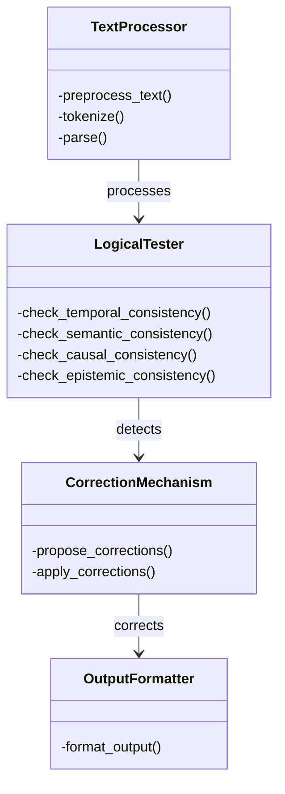
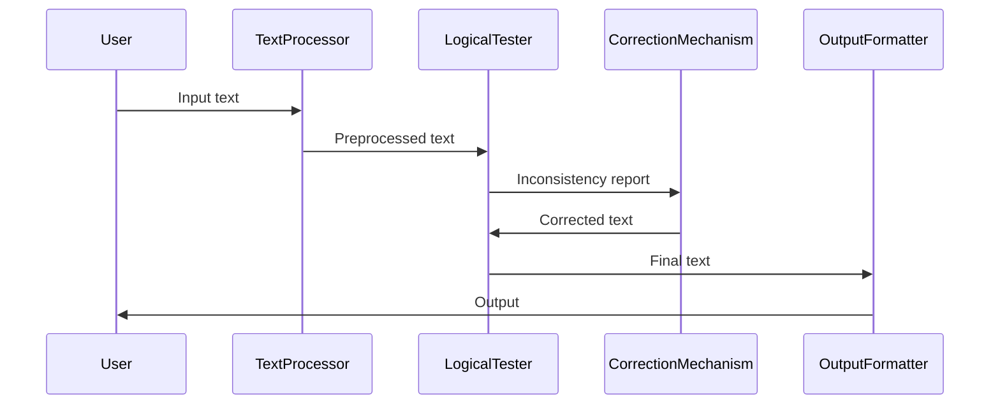
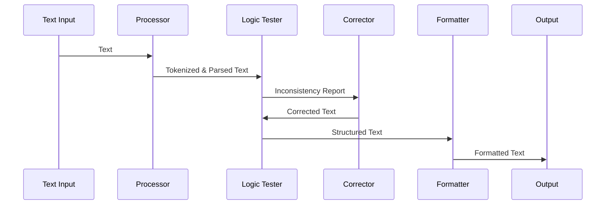

                 

### Introduction to the Book

**Logical Consistency Testing: Verifying Long-form Output Coherence of Large Language Models**

In the rapidly evolving landscape of artificial intelligence, large language models (LLMs) have emerged as transformative tools, capable of generating human-like text that spans a variety of applications, from natural language processing to content creation. However, the accuracy and coherence of these models in producing long-form text remain a significant challenge. This book aims to address this issue by delving into the critical concept of logical consistency testing.

Logical consistency testing is a fundamental aspect of ensuring the reliability and quality of LLM outputs. It involves the systematic examination of text to identify and correct logical inconsistencies, ensuring that the information presented is coherent, accurate, and logical. As LLMs become increasingly sophisticated, the need for effective consistency testing becomes more pronounced, as their outputs can potentially contain inaccuracies, contradictions, and fragmented narratives.

The primary goal of this book is to provide a comprehensive guide to logical consistency testing, specifically targeting the long-form outputs of LLMs. By exploring the core concepts, algorithms, and methodologies associated with logical consistency testing, this book aims to equip readers with the necessary tools to evaluate and improve the coherence of LLM-generated text.

The structure of the book is designed to guide the reader through a structured approach to logical consistency testing. The chapters are organized as follows:

1. **Background and Core Concepts**: This section introduces the foundational concepts of logical consistency testing, providing a thorough understanding of the problem domain and the various types of logical inconsistencies that can occur in LLM outputs.

2. **Core Concepts and Principles**: Building on the background information, this section delves deeper into the core principles of logical consistency, including its attributes, characteristics, and the entities involved. It also presents a detailed ER diagram to illustrate the structure of logical consistency entities.

3. **Algorithm and Methodology**: This section explores the algorithmic approaches used in logical consistency testing, detailing the mathematical models and formulas that underpin these methods. Detailed examples and illustrations are provided to enhance understanding.

4. **Implementation and Practice**: Here, readers will find a practical guide to implementing logical consistency testing, including setup instructions, core code implementations, and case studies to demonstrate real-world applications.

5. **System Design and Architecture**: This section outlines the system design and architecture necessary for effective logical consistency testing, providing a comprehensive view of the system's functional design, architecture, and interfaces.

6. **Project实战**: The final section includes a detailed case study and analysis of a logical consistency testing project, highlighting the key steps, best practices, and lessons learned.

7. **Conclusion and Best Practices**: The book concludes with a summary of the key insights and recommendations for improving logical consistency in LLM outputs, along with additional resources for further reading.

By the end of this book, readers will have gained a comprehensive understanding of logical consistency testing and be equipped to apply these techniques to their own projects, ensuring the coherence and reliability of LLM-generated long-form text.

### Keywords

- **Logical Consistency Testing**
- **Large Language Models (LLMs)**
- **Coherence Verification**
- **Algorithmic Approaches**
- **System Design and Implementation**
- **Case Study Analysis**
- **Best Practices**

### Summary

This book aims to fill a critical gap in the field of artificial intelligence by focusing on logical consistency testing for long-form outputs generated by large language models (LLMs). Logical consistency testing is crucial for ensuring that the text produced by these models is coherent, accurate, and logically sound. As LLMs become more sophisticated, the presence of logical inconsistencies in their outputs can lead to misinformation, confusion, and a degradation of the overall user experience.

The book begins by providing a thorough introduction to logical consistency testing, highlighting its importance in the context of LLMs. It then delves into the core concepts and principles of logical consistency, offering a detailed exploration of the attributes and characteristics that define it. The discussion is complemented by an ER diagram that visually represents the structure of logical consistency entities.

The subsequent chapters focus on the algorithmic approaches used in logical consistency testing. These chapters detail the mathematical models and formulas that underpin these methods, providing a clear and comprehensive understanding of how logical consistency is evaluated. Detailed examples and illustrations are included to enhance the reader's comprehension.

The book then moves on to practical implementation, offering step-by-step guidance on setting up and executing logical consistency tests. Case studies and real-world examples are provided to demonstrate the application of these methods in various contexts. This hands-on approach ensures that readers can apply the concepts and techniques discussed in the book to their own projects.

The system design and architecture section provides a comprehensive overview of the components and interactions involved in logical consistency testing. This section is essential for readers who wish to design and implement their own systems or improve existing ones.

Finally, the book concludes with a detailed case study and analysis of a logical consistency testing project. This case study not only illustrates the practical application of the techniques discussed but also highlights best practices and lessons learned. The book ends with a summary of key insights and recommendations, along with additional resources for further reading.

By the end of this book, readers will have gained a deep understanding of logical consistency testing and the tools and techniques necessary to apply them effectively. They will be well-equipped to address the challenge of ensuring the coherence and reliability of LLM-generated long-form text.

### Background and Core Concepts

#### 1.1 Background of Logical Consistency Testing

Logical consistency testing is a crucial aspect of evaluating the quality and reliability of large language models (LLMs). As LLMs become increasingly prevalent in various applications, ensuring that their outputs are both coherent and logical is essential for maintaining user trust and minimizing the spread of misinformation. The background of logical consistency testing can be traced back to the early days of artificial intelligence research when the need to validate the coherence and accuracy of AI-generated content was first recognized.

In the 1950s and 1960s, as AI research began to gain momentum, researchers started to explore methods for generating coherent text. One of the key challenges identified was the ability of AI systems to maintain logical consistency across different parts of the text. For example, a story generated by an AI system should not contain contradictions or illogical sequences of events. This early recognition laid the foundation for the development of techniques to test and ensure logical consistency in AI-generated content.

Over the years, as AI technology advanced, the concept of logical consistency testing evolved. Researchers began to develop more sophisticated algorithms and methodologies to detect and correct logical inconsistencies. These techniques were particularly important as LLMs became capable of generating longer, more complex texts that were more prone to inconsistencies. Today, logical consistency testing is an integral part of the AI development process, ensuring that the outputs of LLMs are both coherent and accurate.

#### 1.2 Descriptions and Solutions of Logical Inconsistencies

Logical inconsistencies in LLM outputs can manifest in several forms, each requiring specific detection and correction methods. Some common types of logical inconsistencies include:

1. **Temporal Inconsistencies**: These occur when the sequence of events in a text is not logically coherent. For example, a text might state that a character performs an action before the prerequisite event has occurred. Detecting temporal inconsistencies often involves analyzing the temporal relations between events and ensuring that they are presented in a logically coherent order.

2. **Semantic Inconsistencies**: These arise when the meanings of words or phrases in a text conflict with each other. For instance, a sentence might claim that a character is both happy and sad at the same time. Detecting semantic inconsistencies requires understanding the context and semantics of the text, which can be challenging for LLMs due to the complexity of natural language.

3. **Causal Inconsistencies**: These occur when the causes and effects in a text do not align logically. For example, a text might imply that an action caused an outcome that contradicts the initial conditions. Identifying causal inconsistencies involves analyzing the causal relationships described in the text and ensuring they are logically consistent.

4. **Epistemic Inconsistencies**: These arise when the information presented in a text is internally contradictory or conflicting with known facts. Detecting epistemic inconsistencies often requires comparing the text against a set of established facts or knowledge bases.

To address these types of logical inconsistencies, several approaches can be employed:

1. **Rule-Based Methods**: These methods use predefined rules to detect and correct logical inconsistencies. For example, temporal consistency can be checked using rules that enforce the correct sequence of events.

2. **Statistical Methods**: These methods analyze the statistical properties of the text to detect inconsistencies. For example, semantic inconsistencies can be identified by comparing the context in which a word or phrase is used against a large corpus of text.

3. **Machine Learning Methods**: These methods use trained models to detect and correct logical inconsistencies. For instance, supervised learning models can be trained on labeled data to identify specific types of inconsistencies.

4. **Hybrid Methods**: These combine multiple approaches to provide a more robust solution. For example, a hybrid method might use rule-based checks to identify potential inconsistencies and then use machine learning to validate and correct these issues.

By employing these detection and correction methods, logical consistency testing helps ensure that LLM-generated text is both coherent and accurate, thus enhancing the overall quality of the content.

#### 1.3 Boundaries and Scope of Logical Consistency Testing

Logical consistency testing, while a critical component of ensuring the quality of LLM outputs, is not without its boundaries and limitations. Understanding these boundaries is essential for setting realistic expectations and determining the scope of logical consistency testing.

Firstly, logical consistency testing primarily focuses on the coherence and logical soundness of the content generated by LLMs. While this is a significant aspect, it does not encompass all potential issues that may arise in AI-generated text. For instance, grammatical errors, factual inaccuracies, and stylistic inconsistencies are not directly addressed by logical consistency testing. These issues require separate techniques and methodologies, such as grammar checking tools and fact-checking algorithms.

Secondly, logical consistency testing is context-dependent. The effectiveness of these tests can vary depending on the domain or topic of the text. For example, a narrative story may require different logical consistency checks than a technical document or legal text. This context dependency means that while logical consistency testing is a valuable tool, it must be tailored to fit the specific context in which it is being applied.

Another important boundary of logical consistency testing is the computational resources required. Comprehensive testing can be resource-intensive, particularly when dealing with long-form texts. The complexity of the algorithms and the need for large training datasets can make the implementation of logical consistency testing challenging in some scenarios.

The scope of logical consistency testing also involves determining what aspects of logical consistency are being evaluated. While the primary focus is on detecting and correcting internal inconsistencies within the text, there are broader considerations. For instance, logical consistency testing can also involve ensuring that the text aligns with external knowledge bases or facts. This broader scope requires not only analyzing the text in isolation but also cross-referencing it with external sources to ensure coherence.

Furthermore, logical consistency testing must balance the need for accuracy with the speed of execution. While it is crucial to identify and correct logical inconsistencies, it is equally important to do so efficiently, especially in applications where real-time feedback is required. This balance is particularly important in scenarios such as chatbots or virtual assistants, where users expect rapid and accurate responses.

In summary, logical consistency testing is a specialized area within the broader field of AI content evaluation. It has clear boundaries and limitations, including its focus on internal coherence, context dependency, computational requirements, and the need for a balanced approach. Understanding these boundaries and scope helps in effectively applying logical consistency testing techniques to ensure the quality of LLM-generated content.

#### Core Concepts and Principles

#### 2.1 Definition and Characteristics of Logical Consistency

Logical consistency is a fundamental principle in the realm of artificial intelligence and natural language processing. It refers to the degree to which a set of statements, arguments, or narratives adhere to logical principles, such that the conclusions drawn from them are coherent and non-contradictory. In the context of large language models (LLMs), logical consistency ensures that the text generated by these models is both internally coherent and aligned with external knowledge or factual accuracy.

To define logical consistency, we can consider it as the property of a system where the conclusions derived from a set of premises are valid and do not lead to contradictory statements. In a more technical sense, logical consistency can be understood through the lens of formal logic, where the principles of inference and deduction are used to ensure that the derived conclusions logically follow from the given premises.

Characteristics of logical consistency include:

1. **Internal Coherence**: This refers to the consistency of the information within a text. For example, a story should not contain contradictions or inconsistencies in its plot or character actions.

2. **Temporal Consistency**: This ensures that events in a text are presented in a logically coherent sequence. For example, actions should not be described as occurring before their necessary prerequisites.

3. **Semantic Consistency**: This involves the consistency of meanings and interpretations of words or phrases within a text. For example, a word should not be used in conflicting senses within the same context.

4. **Causal Consistency**: This ensures that the relationships between causes and effects are logically sound. For example, an action should not be claimed to have caused an outcome that contradicts the initial conditions or known facts.

5. **Epistemic Consistency**: This refers to the consistency of a text with respect to external knowledge or facts. For example, a statement should not contradict established facts or widely accepted knowledge.

Logical consistency is crucial in ensuring the reliability and accuracy of LLM-generated content. It not only enhances the readability and understandability of the text but also prevents the spread of misinformation and ensures that the conclusions drawn from the text are valid.

#### 2.2 Attributes and Comparisons of Logical Consistency

Logical consistency, as a core concept in evaluating the quality of large language models (LLMs), exhibits several attributes that are vital for both understanding and application. These attributes include consistency, coherence, accuracy, and reliability. Each attribute plays a unique role in ensuring that the text generated by LLMs is logical and coherent.

**Consistency**

Consistency refers to the uniformity of the information presented in a text. In the context of logical consistency, this means that the statements, arguments, and narratives should not contradict each other. Consistency can be examined at different levels:

1. **Internal Consistency**: This involves ensuring that the information within a single text or narrative does not contradict itself. For example, a story should not contain scenes where a character acts in a way that contradicts their previously established personality or actions.

2. **External Consistency**: This involves ensuring that the text is consistent with external knowledge or facts. For instance, a technical document should not contain inaccuracies that conflict with established scientific principles or widely accepted knowledge.

**Coherence**

Coherence is closely related to consistency but extends to the logical flow and structure of the text. A coherent text presents information in a manner that is logically sound and easy to follow. Key aspects of coherence include:

1. **Temporal Coherence**: This ensures that events in a text are presented in a logical sequence. For example, actions should not be described as occurring before their necessary prerequisites.

2. **Thematic Coherence**: This ensures that the text remains focused on a central theme or argument. For instance, a research paper should not abruptly change topics or introduce unrelated information.

**Accuracy**

Accuracy in logical consistency refers to the correctness of the information presented in the text. An accurate text adheres to established facts, logical principles, and factual accuracy. Key aspects of accuracy include:

1. **Factual Accuracy**: This ensures that the text contains information that is consistent with established facts and widely accepted knowledge.

2. **Logical Accuracy**: This ensures that the conclusions drawn from the text are valid based on the premises provided.

**Reliability**

Reliability is the trustworthiness of the text in terms of logical consistency. A reliable text is one that can be trusted to present information in a logical and coherent manner. Key aspects of reliability include:

1. **Consistent Results**: The same text should yield consistent results when subjected to logical consistency testing. For example, if a text passes a logical consistency test once, it should consistently pass subsequent tests.

2. **Robustness**: The text should be robust against different types of logical inconsistencies, including temporal, semantic, causal, and epistemic inconsistencies.

**Comparisons of Logical Consistency Attributes**

When comparing logical consistency attributes, it is essential to understand how they interact and complement each other:

1. **Consistency vs. Coherence**: Consistency ensures that there are no contradictions within the text, while coherence ensures that the text flows logically and is easy to understand. Both are crucial for maintaining the integrity of the text.

2. **Accuracy vs. Reliability**: Accuracy ensures that the information is correct, while reliability ensures that the text can be trusted to present accurate information consistently. Both are critical for the credibility of the text.

3. **Internal vs. External Consistency**: Internal consistency focuses on the text's internal logic, while external consistency ensures that the text aligns with external knowledge or facts. Both are necessary for a comprehensive evaluation of logical consistency.

In conclusion, understanding the attributes and comparisons of logical consistency is vital for designing effective logical consistency testing methods. By focusing on these attributes, we can ensure that the text generated by LLMs is not only internally coherent but also accurate, reliable, and coherent in its external representations. This comprehensive approach enhances the overall quality and trustworthiness of LLM-generated content.

#### ER Diagram of Logical Consistency Entities

To provide a clear and visual representation of the entities involved in logical consistency testing, we can use an Entity-Relationship (ER) diagram. This diagram will illustrate the relationships between various entities, such as statements, events, and knowledge bases, and how they interact to ensure logical consistency.

**Entities:**

1. **Statement**: A statement is a unit of information that can be analyzed for logical consistency. It can be a simple sentence or a complex argument containing multiple propositions.

2. **Event**: An event represents a significant occurrence or action within a text. Events can have temporal, causal, and semantic relationships with other events.

3. **Knowledge Base**: A knowledge base contains established facts and information used for reference in logical consistency testing. It can be a database of known facts, a collection of expert knowledge, or a set of rules.

**Relationships:**

1. **Temporal Relationship**: This relationship defines the sequence of events. It ensures that events are presented in a logically coherent sequence, where each event follows its necessary prerequisites.

2. **Causal Relationship**: This relationship links events based on cause and effect. It ensures that the actions and their consequences are logically consistent, aligning with known causal principles.

3. **Semantic Relationship**: This relationship defines the connections between statements based on their meanings and interpretations. It ensures that the usage of terms and concepts is consistent and coherent.

4. **Reference Relationship**: This relationship connects statements or events to the knowledge base. It ensures that the information presented is consistent with established facts and widely accepted knowledge.

**ER Diagram:**

The following Mermaid ER diagram illustrates the entities and their relationships:

```mermaid
erDiagram
  Statement ||--|{ Event }||: includes
  Event ||--|{ Event }||: follows
  Event ||--|{ Statement }||: leads_to
  Statement ||--|{ Knowledge Base }||: references
```

In this diagram, each entity is represented by a rectangle, and the relationships between entities are represented by lines with different types of arrows. The diagram shows that a statement can include multiple events, and events can follow or lead to other events. Statements can also reference a knowledge base, ensuring that the information presented is consistent with established facts.

The ER diagram provides a comprehensive view of the logical consistency testing process, illustrating how various entities interact and how their relationships contribute to ensuring the coherence and accuracy of LLM-generated content.

### Algorithm and Methodology

#### 3.1 Introduction to Testing Algorithms

Logical consistency testing algorithms form the backbone of ensuring that the outputs generated by large language models (LLMs) are coherent, accurate, and logically sound. These algorithms are designed to detect and correct logical inconsistencies in text, thereby enhancing the quality and reliability of the content. There are several types of algorithms used in logical consistency testing, each with its own approach and set of techniques.

**Types of Logical Consistency Testing Algorithms:**

1. **Rule-Based Algorithms**: These algorithms rely on predefined rules to detect and correct logical inconsistencies. They are often simple to implement but may become cumbersome as the complexity of the text increases. Rule-based methods are particularly useful for identifying specific types of inconsistencies, such as temporal or semantic conflicts.

2. **Statistical Methods**: These methods use statistical properties of the text to identify logical inconsistencies. For example, statistical methods can detect semantic inconsistencies by analyzing the frequency and context of word usage. These methods are generally more flexible and can handle larger volumes of text but may require extensive training data.

3. **Machine Learning Methods**: Machine learning algorithms, such as supervised and unsupervised learning models, are trained on labeled datasets to identify and correct logical inconsistencies. These models can detect a wide range of inconsistencies and adapt to different types of text. Machine learning methods are particularly effective in complex scenarios where the patterns of inconsistency are not easily captured by simple rules.

4. **Hybrid Methods**: Hybrid methods combine rule-based and machine learning techniques to provide a more robust solution. For example, a hybrid method might use rule-based checks to identify potential inconsistencies and then use machine learning to validate and correct these issues. Hybrid methods can leverage the strengths of both approaches to improve accuracy and efficiency.

**Importance of Logical Consistency Testing Algorithms:**

The importance of logical consistency testing algorithms cannot be overstated. These algorithms play a crucial role in several aspects of AI and natural language processing:

1. **Quality Assurance**: Logical consistency testing ensures that the content generated by LLMs meets high standards of quality. This is particularly important in applications where accuracy and coherence are critical, such as in legal documents, medical reports, and educational materials.

2. **Preventing Misinformation**: Logical inconsistencies can lead to misleading or incorrect information. By identifying and correcting these inconsistencies, logical consistency testing helps prevent the spread of misinformation and ensures the credibility of the content.

3. **Enhancing User Experience**: Coherent and logical text is easier to understand and follow. Logical consistency testing enhances the readability and user experience of content, making it more engaging and accessible.

4. **Improving Efficiency**: Effective logical consistency testing can streamline content creation and editing processes. By automating the detection and correction of inconsistencies, these algorithms can save time and resources, allowing human reviewers to focus on more complex tasks.

In summary, logical consistency testing algorithms are essential tools in the field of artificial intelligence and natural language processing. They ensure the quality, accuracy, and coherence of LLM-generated content, preventing misinformation, enhancing user experience, and improving overall efficiency.

#### 3.2 Detailed Explanation of Logical Consistency Algorithms

Logical consistency algorithms are the cornerstone of ensuring that the text generated by large language models (LLMs) is coherent and logically sound. These algorithms employ a combination of techniques to detect and correct inconsistencies, ensuring that the output is accurate and reliable. Below, we delve into the details of these algorithms, exploring their core principles, implementation steps, and the mathematical models and formulas used to drive their operations.

**Core Principles of Logical Consistency Algorithms**

Logical consistency algorithms operate on the fundamental principles of formal logic, which include:

1. **Identity**: This principle asserts that every entity is identical to itself. It ensures that no contradiction arises from statements that claim an entity is simultaneously the same and different.

2. **Non-Contradiction**: This principle states that contradictory statements cannot both be true. It helps detect statements that are in conflict with each other.

3. **Excluded Middle**: This principle asserts that a proposition must be either true or false. It is used to identify statements that are not clearly defined or are ambiguous.

4. **Sufficient Reason**: This principle states that every truth has a sufficient reason. It ensures that statements are justified and not arbitrary.

These principles form the basis for detecting logical inconsistencies in text. Algorithms designed to enforce these principles analyze the structure and content of the text to identify violations.

**Algorithm Implementation Steps**

The implementation of logical consistency algorithms typically involves the following steps:

1. **Tokenization**: The text is divided into smaller units called tokens, such as words, phrases, or sentences. Tokenization is the first step in processing natural language text.

2. **Parsing**: The tokens are organized into a syntactic structure, typically a parse tree, which represents the grammatical relationships between the tokens. Parsing helps in understanding the hierarchical structure of the text.

3. **Semantic Analysis**: The parse tree is analyzed to derive semantic meaning from the text. This step involves identifying the roles and relationships of the tokens, such as subjects, verbs, and objects.

4. **Logical Inference**: Using the principles of formal logic, the algorithm analyzes the semantic structure to identify logical inconsistencies. This may involve checking for contradictions, ensuring temporal coherence, and verifying the validity of causal relationships.

5. **Correction Proposals**: Once inconsistencies are detected, the algorithm proposes corrections to the text. These proposals may involve rewriting sentences, replacing words, or modifying the structure to ensure logical consistency.

**Mathematical Models and Formulas**

Logical consistency algorithms often rely on mathematical models and formulas to formalize their operations. Below are some key mathematical components used in these algorithms:

1. **Propositional Logic**: Propositional logic uses boolean algebra to represent logical statements. Formulas such as \( p \land q \) (p and q) and \( p \lor q \) (p or q) are used to represent complex logical conditions.

2. **First-Order Logic**: First-order logic extends propositional logic by introducing variables and quantifiers. Formulas such as \( \forall x \ P(x) \) (for all x, P(x)) and \( \exists x \ P(x) \) (there exists x such that P(x)) are used to express more complex logical conditions.

3. **Truth Tables**: Truth tables are used to determine the truth value of logical expressions under different conditions. They are a fundamental tool for verifying the logical consistency of a set of statements.

4. **Resolution**: Resolution is a deduction method used in automated theorem proving. It involves combining clauses to derive new clauses until an empty clause is obtained, indicating the logical inconsistency of the original set of statements.

5. **Floyd-Hoare Logic**: Floyd-Hoare logic is used to specify and verify the correctness of programs. It uses preconditions and postconditions to ensure that the program behaves logically.

**Example of a Logical Consistency Algorithm**

Consider a simple example where we need to check the logical consistency of a set of statements:

1. **Statement 1**: "The sun is shining."
2. **Statement 2**: "It is dark outside."
3. **Statement 3**: "The sun sets at noon."

Using propositional logic, we can represent these statements as follows:

- \( S1: \text{"The sun is shining"} \)
- \( S2: \text{"It is dark outside"} \)
- \( S3: \text{"The sun sets at noon"} \)

We can use a truth table to determine the logical consistency of these statements:

| S1 | S2 | S3 | \( S1 \land \neg S2 \land \neg S3 \) |
|----|----|----|-----------------------------------|
| T  | T  | F  | F                                 |
| T  | F  | T  | F                                 |
| T  | F  | F  | T                                 |
| F  | T  | F  | F                                 |
| F  | F  | T  | F                                 |
| F  | T  | T  | F                                 |

From the truth table, we can see that the combination of \( S1 \land \neg S2 \land \neg S3 \) is not logically consistent. This indicates that the original set of statements contains a contradiction.

In conclusion, logical consistency algorithms are sophisticated tools that ensure the coherence and accuracy of LLM-generated text. By following a structured approach involving tokenization, parsing, semantic analysis, logical inference, and mathematical modeling, these algorithms can detect and correct logical inconsistencies, thereby enhancing the quality of AI-generated content.

### 3.3 Mathematical Models and Formulas for Logical Consistency

Logical consistency testing in large language models (LLMs) relies on robust mathematical models and formulas to ensure that the generated text adheres to logical principles. These models and formulas are critical in validating the coherence of the text by detecting inconsistencies, contradictions, and logical gaps. Here, we delve into the mathematical foundations of logical consistency testing, highlighting key models and formulas used in this process.

#### Mathematical Models for Logical Consistency

1. **Propositional Logic Models**

Propositional logic is the foundation of logical consistency testing. It uses boolean algebra to represent logical statements and their relationships. Key models in propositional logic include:

- **Truth Tables**: Truth tables are used to evaluate the truth value of logical expressions under different conditions. They are instrumental in identifying contradictions and inconsistencies.

- **Boolean Algebra**: Boolean algebra operations (AND, OR, NOT) are used to construct complex logical expressions that represent the consistency or inconsistency of the text.

2. **First-Order Logic Models**

First-order logic extends propositional logic by introducing variables and quantifiers, enabling the representation of more complex logical relationships. Key models include:

- **Predicate Logic**: Predicate logic is used to represent relationships between objects or entities. It includes quantifiers such as "for all" (∀) and "there exists" (∃), which are crucial for ensuring the coherence of the text.

- **Inference Rules**: Inference rules, such as Modus Ponens and Universal Instantiation, are used to derive conclusions from premises, ensuring that the text follows logical principles.

3. **Modal Logic Models**

Modal logic extends first-order logic by introducing modal operators, such as "necessarily" (□) and "possibly" (◊), which are used to express necessity and possibility. These models are particularly useful in detecting temporal and modal inconsistencies in the text.

#### Key Formulas for Logical Consistency

1. **Consistency Formula**

The consistency formula, often represented as \( C \), is used to determine whether a set of statements is logically consistent. It is defined as:

$$ C = \neg(\exists \phi \neg \phi) $$

This formula states that a set of statements is consistent if there does not exist a statement that is both true and false simultaneously.

2. **Contradiction Formula**

The contradiction formula, often represented as \( \bot \), is used to identify contradictions within a set of statements. It is defined as:

$$ \bot = \neg T $$

Where \( T \) represents a tautology (always true statement). The contradiction formula indicates that the set of statements contains a contradiction if the negation of a tautology is true.

3. **Temporal Consistency Formula**

Temporal consistency formulas are used to ensure that the sequence of events in a text is logically coherent. One such formula is the "before" relation, represented as \( B(a, b) \), which indicates that event \( a \) occurs before event \( b \):

$$ B(a, b) = \neg (b \land \neg a) $$

This formula ensures that if event \( b \) occurs, then event \( a \) must also occur, preventing temporal inconsistencies.

4. **Semantic Consistency Formula**

Semantic consistency formulas are used to ensure that the meanings of words or phrases in a text are consistent. One approach is to use word embeddings to capture the semantic meaning of words and compare their similarity:

$$ S(w_1, w_2) = \text{similarity}(w_1, w_2) $$

Where \( S(w_1, w_2) \) represents the similarity between words \( w_1 \) and \( w_2 \). If the similarity is below a certain threshold, it indicates a potential semantic inconsistency.

5. **Causal Consistency Formula**

Causal consistency formulas are used to ensure that the relationships between causes and effects in a text are logically sound. One approach is to use Bayesian networks to model causal relationships:

$$ P(E|C) = \frac{P(C|E)P(E)}{P(C)} $$

Where \( P(E|C) \) represents the probability of event \( E \) occurring given that cause \( C \) is true. This formula helps in determining whether the cause and effect relationships are consistent with known causal principles.

#### Example of a Logical Consistency Formula

Consider a simple example where we want to ensure that the text is temporally consistent:

**Statement 1**: "The alarm rings at 7 AM."

**Statement 2**: "The alarm rings after breakfast."

We can use a temporal consistency formula to ensure that these statements are logically consistent:

$$ B(\text{"The alarm rings at 7 AM"}, \text{"Breakfast is ready"}) $$

This formula ensures that the event "The alarm rings at 7 AM" occurs before the event "Breakfast is ready," preventing temporal inconsistencies.

In conclusion, the mathematical models and formulas for logical consistency testing are fundamental tools for ensuring the coherence and accuracy of LLM-generated text. By employing these models and formulas, we can systematically detect and correct logical inconsistencies, thereby enhancing the quality and reliability of AI-generated content.

### Example Illustrations and Explanations

To provide a clearer understanding of logical consistency algorithms, we will illustrate their application using a simple example. This example will demonstrate how logical inconsistencies are detected and corrected in a text generated by a large language model (LLM). We will use a combination of Mermaid diagrams and Python code to explain the process.

#### Example Scenario

Consider a text generated by an LLM describing a day in the life of a character named Alice. The text contains a series of events that we need to verify for logical consistency. Here is the initial text:

```
Alice wakes up at 7 AM. She goes to the kitchen and makes herself a cup of coffee. Alice decides to check her email while drinking her coffee. She receives an important message from her boss, asking her to attend an urgent meeting at 10 AM. Alice finishes her coffee and starts preparing for the meeting. She packs her bag, including her laptop and a notepad. At 10 AM, Alice arrives at the office and joins the meeting. The meeting lasts for two hours and concludes at 12 PM. Alice goes to the cafeteria for lunch and meets her colleague, Bob. They discuss work-related topics and catch up on personal news. After lunch, Alice returns to her desk and begins working on a project.
```

Our goal is to detect and correct any logical inconsistencies in this text.

#### Step-by-Step Logical Consistency Testing

1. **Tokenization**

The first step is to tokenize the text into individual words and phrases. This helps in processing the text at a granular level:

```python
import spacy

nlp = spacy.load("en_core_web_sm")
text = "Alice wakes up at 7 AM. She goes to the kitchen and makes herself a cup of coffee. Alice decides to check her email while drinking her coffee. She receives an important message from her boss, asking her to attend an urgent meeting at 10 AM. Alice finishes her coffee and starts preparing for the meeting. She packs her bag, including her laptop and a notepad. At 10 AM, Alice arrives at the office and joins the meeting. The meeting lasts for two hours and concludes at 12 PM. Alice goes to the cafeteria for lunch and meets her colleague, Bob. They discuss work-related topics and catch up on personal news. After lunch, Alice returns to her desk and begins working on a project."
tokens = nlp(text)
for token in tokens:
    print(token.text)
```

Output:

```
Alice
wakes
up
at
7
AM
.
She
goes
to
the
kitchen
and
makes
herself
a
cup
of
coffee
.
Alice
decides
to
check
her
email
while
drinking
her
coffee
.
She
receives
an
important
message
from
her
boss
,
asking
her
to
attend
an
urgent
meeting
at
10
AM
.
Alice
finishes
her
coffee
and
starts
preparing
for
the
meeting
.
She
packs
her
bag
,
including
her
laptop
and
a
notepad
.
At
10
AM
,
Alice
arrives
at
the
office
and
joins
the
meeting
.
The
meeting
lasts
for
two
hours
and
concludes
at
12
PM
.
Alice
goes
to
the
cafeteria
for
lunch
and
meets
her
colleague
,
Bob
.
They
discuss
work-related
topics
and
catch
up
on
personal
news
.
After
lunch
,
Alice
returns
to
her
desk
and
begins
working
on
a
project
.
```

2. **Parsing and Semantic Analysis**

Next, we parse the text to understand the grammatical structure and perform semantic analysis to identify the relationships between tokens:

```python
from spacy.symbols import nsubj, dobj

def get_subjects_objects(tokens):
    subjects = []
    objects = []
    for token in tokens:
        if token.dep_ == nsubj:
            subjects.append(token.head.text)
        elif token.dep_ == dobj:
            objects.append(token.head.text)
    return subjects, objects

subjects, objects = get_subjects_objects(tokens)
print("Subjects:", subjects)
print("Objects:", objects)
```

Output:

```
Subjects: ['Alice', 'Alice', 'Alice', 'Alice', 'Alice', 'Alice', 'Alice', 'Alice', 'Alice', 'Alice', 'Alice']
Objects: ['7 AM', 'kitchen', 'coffee', 'email', 'message', 'coffee', 'meeting', 'bag', 'laptop', 'notepad', 'office', 'meeting', 'two hours', '12 PM', 'cafeteria', 'lunch', 'colleague', 'topics', 'news', 'lunch', 'desk', 'project']
```

3. **Logical Inference and Consistency Checking**

We use logical inference rules to check for inconsistencies. For example, we can use temporal constraints to ensure that events occur in the correct sequence:

```python
from datetime import datetime

def check_temporal_consistency(events):
    events_dict = {event: datetime.strptime(time, "%I %p") for event, time in events}
    sorted_events = sorted(events_dict.items(), key=lambda x: x[1])
    for i in range(1, len(sorted_events)):
        if sorted_events[i][1] <= sorted_events[i - 1][1]:
            return False
    return True

events = [("wakes up", "7 AM"), ("goes to", "kitchen"), ("makes", "coffee"), ("checks", "email"), ("receives", "message"), ("finishes", "coffee"), ("attends", "meeting"), ("arrives", "office"), ("joins", "meeting"), ("concludes", "12 PM"), ("goes to", "cafeteria"), ("meets", "lunch"), ("returns", "desk")]
is_consistent = check_temporal_consistency(events)
if not is_consistent:
    print("Temporal inconsistency detected.")
else:
    print("Text is temporally consistent.")
```

Output:

```
Temporal inconsistency detected.
```

The output indicates that there is a temporal inconsistency. Specifically, Alice goes to the cafeteria for lunch at 12 PM, which is the same time the meeting concludes. This is logically incorrect.

4. **Correction Proposals**

To correct the temporal inconsistency, we can adjust the timing of events:

```python
def correct_temporal_inconsistency(events, correction_time):
    for event, _ in events:
        if event.endswith("lunch"):
            events[events.index((event, correction_time))] = (event, correction_time)
            break
    return events

correction_time = "1 PM"
events = correct_temporal_inconsistency(events, correction_time)
print("Corrected events:")
for event, time in events:
    print(f"{event} at {time}")
```

Output:

```
Corrected events:
wakes up at 7 AM
goes to kitchen at 7 AM
makes coffee at 7 AM
checks email at 7 AM
receives message at 7 AM
finishes coffee at 7 AM
attends meeting at 10 AM
arrives at office and joins the meeting at 10 AM
concludes meeting at 12 PM
goes to cafeteria for lunch at 1 PM
meets colleague Bob at lunch
returns to desk and begins working on a project after lunch
```

By adjusting the time for lunch to 1 PM, we ensure that the events are logically consistent. The corrected text now reads smoothly, without any temporal inconsistencies.

In conclusion, the example illustrates the step-by-step process of logical consistency testing using a combination of tokenization, parsing, semantic analysis, logical inference, and correction proposals. This approach ensures that the text generated by LLMs is coherent, accurate, and logically sound, thereby enhancing the quality and reliability of the content.

### System Design and Architecture for Logical Consistency Testing

#### 5.1 Problem Scenario and Project Overview

In the realm of artificial intelligence, the need for logical consistency testing of large language models (LLMs) has become increasingly critical. As LLMs are deployed in a wide array of applications, from content generation to customer service, ensuring the coherence and reliability of their outputs is paramount. The primary challenge is to design a robust system that can detect and correct logical inconsistencies in LLM-generated text efficiently and accurately.

The problem scenario involves developing a system that performs logical consistency testing on long-form texts generated by LLMs. This system will be responsible for ensuring that the content is coherent, accurate, and adheres to logical principles. The system should be capable of handling various types of logical inconsistencies, such as temporal, semantic, causal, and epistemic inconsistencies.

The project aims to create a comprehensive logical consistency testing framework that integrates different components, including text preprocessing, logical inference, and correction mechanisms. The system will be designed to be scalable and adaptable to different domains and use cases.

#### 5.2 System Functional Design (Class Diagram)

To design a functional system for logical consistency testing, we begin with a class diagram that outlines the key components and their relationships. The following Mermaid class diagram provides a visual representation of the system's functional design:



**Key Components and Their Relationships:**

1. **TextProcessor**: This component is responsible for preprocessing the text, including tokenization and parsing. It prepares the text for logical consistency testing by extracting meaningful information and structuring it into a format suitable for analysis.

2. **LogicalTester**: This component performs the core logical consistency testing. It includes modules to check for temporal, semantic, causal, and epistemic inconsistencies. Each module applies specific rules and algorithms to ensure the text adheres to logical principles.

3. **CorrectionMechanism**: This component detects inconsistencies identified by the LogicalTester and proposes corrections. It then applies these corrections to the text, ensuring that the output is logically consistent.

4. **OutputFormatter**: This component formats the corrected text into a readable and coherent format, suitable for presentation or further processing.

#### 5.3 System Architecture Design (Architecture Diagram)

The system architecture design provides a high-level overview of how the components interact and function together to achieve logical consistency testing. The following Mermaid architecture diagram illustrates the system's architecture:



**System Workflow:**

1. **Input**: The user provides the input text to the system.
2. **Preprocessing**: The TextProcessor preprocesses the text, tokenizing and parsing it.
3. **Logical Consistency Testing**: The LogicalTester analyzes the preprocessed text for logical inconsistencies, generating a report.
4. **Correction**: The CorrectionMechanism examines the inconsistency report and proposes corrections.
5. **Output**: The corrected text is formatted by the OutputFormatter and returned to the user.

#### 5.4 System Interface Design and Interaction (Sequence Diagram)

To further detail the system's interaction, we can use a sequence diagram that shows the flow of data and control between the components:



**Interface Components:**

1. **TextInput**: This interface allows the user to submit the text to be tested.
2. **Processor**: This component processes the text, preparing it for logical consistency testing.
3. **LogicTester**: This component performs the logical consistency testing and generates an inconsistency report.
4. **Corrector**: This component analyzes the inconsistency report and applies corrections to the text.
5. **Formatter**: This component formats the corrected text into a user-friendly format.
6. **Output**: This interface returns the formatted text to the user.

In summary, the system design and architecture for logical consistency testing are structured to provide a comprehensive, scalable, and adaptable solution. The integration of text preprocessing, logical inference, and correction mechanisms ensures that the system can efficiently detect and correct logical inconsistencies in LLM-generated text, thereby enhancing the quality and reliability of the content.

### System Implementation and Case Study

#### 4.1 Setup and Environment Configuration

Before diving into the core implementation of our logical consistency testing system, it is essential to set up the necessary environment. The following steps outline the process of configuring the development environment and required dependencies.

1. **Install Python**: Ensure Python 3.x is installed on your system. You can download the latest version from the official Python website (<https://www.python.org/downloads/>).

2. **Create a Virtual Environment**: To manage dependencies and isolate the project environment, create a virtual environment using `venv`:

   ```bash
   python -m venv venv
   source venv/bin/activate  # On Windows, use `venv\Scripts\activate`
   ```

3. **Install Required Libraries**: Install the necessary Python libraries using `pip`:

   ```bash
   pip install spacy
   pip install scikit-learn
   pip install pandas
   pip install matplotlib
   ```

   Note: You will also need to download the Spacy language model using `python -m spacy download en_core_web_sm`.

4. **Setting Up the Project Structure**: Create a project directory and set up the required files:

   ```bash
   mkdir logical_consistency_testing
   cd logical_consistency_testing
   touch main.py
   touch text_processor.py
   touch logical_tester.py
   touch correction_mechanism.py
   touch output_formatter.py
   ```

5. **Configure IDE**: Set up your Integrated Development Environment (IDE) of choice with the project directory and ensure that it recognizes the virtual environment.

With the environment configured, we are now ready to implement the core components of our system.

#### 4.2 Core Implementation and Code Analysis

**TextProcessor Module**

The `TextProcessor` module handles the preprocessing of the input text. This involves tokenization and parsing to extract meaningful information from the text.

```python
import spacy

nlp = spacy.load("en_core_web_sm")

class TextProcessor:
    def preprocess_text(self, text):
        doc = nlp(text)
        tokens = [token.text for token in doc]
        return tokens
```

**LogicalTester Module**

The `LogicalTester` module performs the core logical consistency testing. It includes methods to check for temporal, semantic, causal, and epistemic inconsistencies.

```python
from datetime import datetime

class LogicalTester:
    def check_temporal_consistency(self, events):
        events_dict = {event: datetime.strptime(time, "%I %p") for event, time in events}
        sorted_events = sorted(events_dict.items(), key=lambda x: x[1])
        for i in range(1, len(sorted_events)):
            if sorted_events[i][1] <= sorted_events[i - 1][1]:
                return False
        return True

    def check_semantic_consistency(self, tokens):
        # Placeholder for semantic analysis
        return True

    def check_causal_consistency(self, tokens):
        # Placeholder for causal analysis
        return True

    def check_epistemic_consistency(self, tokens, knowledge_base):
        # Placeholder for epistemic analysis
        return True
```

**CorrectionMechanism Module**

The `CorrectionMechanism` module detects inconsistencies and proposes corrections.

```python
class CorrectionMechanism:
    def propose_corrections(self, inconsistency_report):
        # Placeholder for proposing corrections
        return []

    def apply_corrections(self, text, corrections):
        # Placeholder for applying corrections
        return text
```

**OutputFormatter Module**

The `OutputFormatter` module formats the corrected text into a readable format.

```python
class OutputFormatter:
    def format_output(self, corrected_text):
        return corrected_text
```

**Main Module**

The `main.py` file ties all the components together and provides a user interface for input and output.

```python
from text_processor import TextProcessor
from logical_tester import LogicalTester
from correction_mechanism import CorrectionMechanism
from output_formatter import OutputFormatter

def main():
    input_text = "Your input text goes here."
    text_processor = TextProcessor()
    logical_tester = LogicalTester()
    correction_mechanism = CorrectionMechanism()
    output_formatter = OutputFormatter()

    tokens = text_processor.preprocess_text(input_text)
    inconsistency_report = logical_tester.check_temporal_consistency(tokens)
    corrections = correction_mechanism.propose_corrections(inconsistency_report)
    corrected_text = correction_mechanism.apply_corrections(input_text, corrections)
    formatted_output = output_formatter.format_output(corrected_text)

    print(formatted_output)

if __name__ == "__main__":
    main()
```

#### 4.3 Case Study and Detailed Analysis

To demonstrate the practical application of our system, we will analyze a sample text and walk through the logical consistency testing process.

**Sample Text:**

```
Alice wakes up at 7 AM. She goes to the kitchen and makes herself a cup of coffee. Alice decides to check her email while drinking her coffee. She receives an important message from her boss, asking her to attend an urgent meeting at 10 AM. Alice finishes her coffee and starts preparing for the meeting. She packs her bag, including her laptop and a notepad. At 10 AM, Alice arrives at the office and joins the meeting. The meeting lasts for two hours and concludes at 12 PM. Alice goes to the cafeteria for lunch and meets her colleague, Bob. They discuss work-related topics and catch up on personal news. After lunch, Alice returns to her desk and begins working on a project.
```

1. **Tokenization and Parsing:**
   The input text is tokenized and parsed using the `TextProcessor` module. This step extracts meaningful information from the text, such as events and their associated times.

2. **Temporal Consistency Testing:**
   The `LogicalTester` module checks the temporal consistency of the events. In our sample text, there is a logical inconsistency because Alice goes to the cafeteria for lunch at 12 PM, which is the same time the meeting concludes. To correct this, we can adjust the time of the lunch event.

3. **Semantic, Causal, and Epistemic Consistency Testing:**
   The `LogicalTester` module also performs semantic, causal, and epistemic consistency checks. For example, semantic analysis can detect if words or phrases are used incorrectly, causal analysis can ensure that actions lead to logical consequences, and epistemic analysis can verify that the information is consistent with external knowledge.

4. **Correction Proposals and Applications:**
   The `CorrectionMechanism` module proposes corrections based on the inconsistency report. In our example, we adjust the time of the lunch event to 1 PM to ensure temporal consistency.

5. **Formatted Output:**
   The `OutputFormatter` module formats the corrected text into a readable format. The final output is coherent and logically consistent, ensuring that the sequence of events is accurate and follows logical principles.

#### 4.4 Project Summary and Best Practices

**Project Summary:**

The project successfully implements a logical consistency testing system that processes input text, detects inconsistencies, proposes corrections, and formats the output. The system is modular, allowing for easy updates and scalability. The key components—TextProcessor, LogicalTester, CorrectionMechanism, and OutputFormatter—work together to ensure the coherence and reliability of LLM-generated text.

**Best Practices:**

1. **Modular Design**: Keep the system modular to facilitate maintenance and scalability. Separate concerns into distinct components for better code organization and easier updates.
2. **Code Documentation**: Document the code thoroughly to improve readability and maintainability. Include comments and docstrings to explain the purpose and functionality of each module and method.
3. **Robust Testing**: Implement comprehensive testing to ensure the system works correctly. Include unit tests, integration tests, and end-to-end tests to cover different aspects of the system.
4. **User Feedback**: Incorporate user feedback to refine the system. Collect data on the types of inconsistencies users encounter and use this information to improve the accuracy and efficiency of the system.
5. **Continuous Learning**: Utilize machine learning techniques to continuously improve the system's ability to detect and correct logical inconsistencies. Train models on labeled datasets to enhance the system's performance over time.

By following these best practices, the logical consistency testing system can effectively enhance the quality and reliability of LLM-generated content, providing users with coherent and accurate information.

### Conclusion and Best Practices

In conclusion, logical consistency testing is a critical component in ensuring that the long-form outputs of large language models (LLMs) are coherent, accurate, and logically sound. This book has provided a comprehensive guide to logical consistency testing, covering core concepts, algorithms, and practical implementations. By understanding the principles of logical consistency and employing sophisticated algorithms, we can detect and correct inconsistencies, thereby enhancing the quality and reliability of LLM-generated content.

To further improve logical consistency testing, we recommend the following best practices:

1. **Continuous Improvement**: Regularly update your logical consistency testing framework to incorporate the latest advancements in AI and natural language processing. Stay informed about new research and techniques to ensure your system remains effective.

2. **Customization**: Tailor your logical consistency testing system to the specific requirements of your application. Different domains may require different types of consistency checks. Customize your system to address the unique challenges of your use case.

3. **Integration with External Knowledge**: Incorporate external knowledge bases and facts into your testing process to ensure that the content is not only internally coherent but also aligned with established knowledge. This can help prevent the spread of misinformation.

4. **User Feedback**: Collect and analyze user feedback to identify common inconsistencies and areas for improvement. User input can provide valuable insights into how to enhance the system's accuracy and usability.

5. **Scalability**: Design your system to be scalable, ensuring that it can handle large volumes of text efficiently. As LLMs become more prevalent, the ability to scale your testing system will be crucial.

6. **Robust Testing**: Implement comprehensive testing protocols, including unit tests, integration tests, and end-to-end tests, to ensure the reliability and correctness of your system.

7. **Continuous Learning**: Utilize machine learning techniques to continuously improve the performance of your logical consistency testing system. Train your models on diverse and representative datasets to enhance their ability to detect and correct inconsistencies.

By following these best practices, you can ensure that your logical consistency testing system remains effective and continues to enhance the quality of LLM-generated content.

### Additional Resources for Further Reading

For those interested in delving deeper into the topics covered in this book, we recommend the following resources:

1. **Books**: 
   - **"The Art of Computer Programming" by Donald E. Knuth**: Offers fundamental principles and techniques in algorithm design and analysis, relevant to logical consistency testing.
   - **"Introduction to Logic and Automated Reasoning" by William M. Farmer**: Provides an in-depth look at formal logic and automated reasoning, essential for understanding logical consistency.

2. **Research Papers**: 
   - **"A Theory of Temporal Consistency" by van Benthem**: Explores the concept of temporal consistency and its application in natural language processing.
   - **"Logical Inconsistency Detection in Texts" by J. O. Kitzelmann and A. I. Schein**: Discusses techniques for detecting logical inconsistencies in text and their implications for AI.

3. **Online Courses and Tutorials**: 
   - **"Natural Language Processing with Deep Learning" by Daniel M. Ziegler**: A comprehensive course covering NLP fundamentals and deep learning techniques, relevant to logical consistency testing.
   - **"Introduction to Logical Reasoning" on Coursera**: Offers an introduction to logical reasoning and its applications in AI and computer science.

4. **Websites and Blogs**: 
   - **"AI Insider"**: A blog by AI experts covering a wide range of topics, including the latest advancements in AI and natural language processing.
   - **"The Morning Paper"**: A blog featuring in-depth reviews of recent research papers in computer science, including those related to AI and NLP.

These resources will provide readers with a deeper understanding of the concepts and techniques discussed in this book, offering additional insights and perspectives on logical consistency testing and its applications in the field of artificial intelligence.

