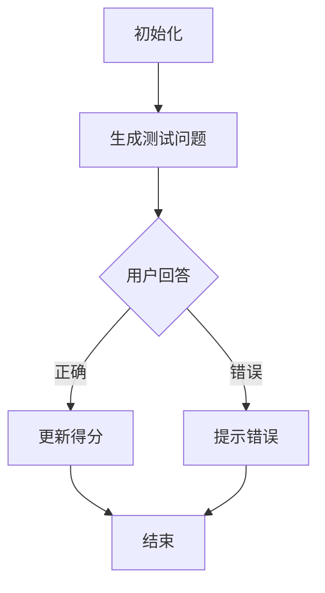
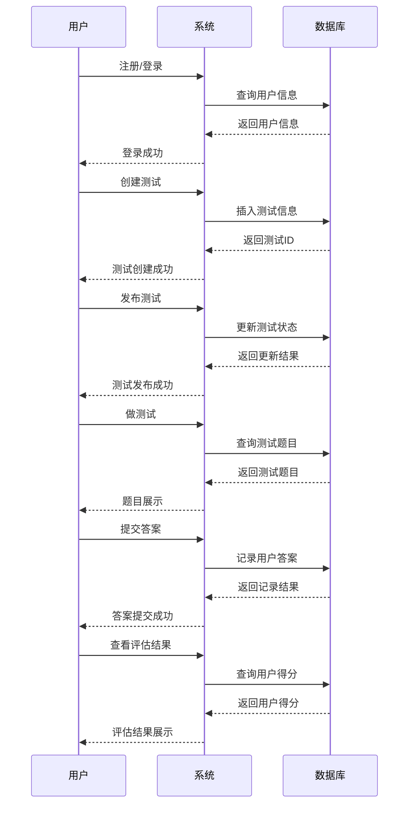

                 

**# 逻辑推理能力评测：测试LLM的问题解决能力**

> 关键词：逻辑推理能力，评测，LLM，问题解决能力，人工智能

> 摘要：
本文旨在探讨逻辑推理能力的评测方法，重点关注自然语言处理模型（LLM）的问题解决能力。通过对逻辑推理能力评测的背景、核心概念、算法原理、系统架构以及实际应用案例的详细分析，本文将为读者提供一个全面而深入的理解。

**## 第一部分: 逻辑推理能力评测背景**

### 第1章: 逻辑推理能力评测概述

#### 1.1 问题背景

**1.1.1 逻辑推理能力的重要性**

逻辑推理能力是人类智能的核心之一。它是我们理解和解决问题的基础。在日常生活中，我们需要运用逻辑推理来分析信息、做出决策和解决冲突。在科学研究中，逻辑推理是构建理论框架和验证假设的关键。因此，逻辑推理能力的重要性不言而喻。

**1.1.2 逻辑推理能力在人工智能领域的应用**

随着人工智能技术的发展，逻辑推理能力在人工智能领域的应用日益广泛。例如，在自然语言处理中，逻辑推理能力可以帮助模型理解语义、生成文本和回答问题。在智能决策系统中，逻辑推理能力是实现自动化决策的核心。在智能推理和自动证明系统中，逻辑推理能力则是实现自动化推理和证明的关键。

#### 1.2 问题描述

**1.2.1 逻辑推理能力评测的定义**

逻辑推理能力评测是指通过一系列测试和评估方法，对个体的逻辑推理能力进行定量或定性分析的过程。它旨在识别和评估个体在不同领域、不同情境下的逻辑推理能力。

**1.2.2 逻辑推理能力评测的目的**

逻辑推理能力评测的主要目的是为教育、训练、研究和应用提供依据。它可以帮助我们了解个体在逻辑推理方面的优势和不足，为教育者提供有针对性的教学建议，为训练者提供有效的训练方法，为研究者提供有力的理论支持，为应用者提供可靠的评估工具。

### 1.3 问题解决

**1.3.1 逻辑推理能力评测的基本方法**

逻辑推理能力评测的基本方法包括心理测量学方法、实验方法和计算方法。心理测量学方法主要通过问卷、测验等方式来评估个体的逻辑推理能力。实验方法则通过设计特定的实验情境来观察和记录个体的逻辑推理过程。计算方法则通过构建逻辑推理模型来对个体的逻辑推理能力进行量化分析。

**1.3.2 逻辑推理能力评测的工具和技术**

逻辑推理能力评测的工具和技术主要包括逻辑推理测试系统、逻辑推理模型和评估指标。逻辑推理测试系统是一种能够模拟逻辑推理过程的软件系统，它可以帮助我们收集和分析个体的逻辑推理数据。逻辑推理模型则是基于逻辑学原理构建的数学模型，它可以用来模拟和预测个体的逻辑推理能力。评估指标则是用来衡量个体逻辑推理能力高低的量化指标，如正确率、反应时间等。

**1.3.3 边界与外延**

逻辑推理能力评测的范围涵盖了各种领域，如数学、哲学、逻辑学、计算机科学等。它不仅关注个体在特定领域的逻辑推理能力，也关注个体在不同领域的逻辑推理能力。逻辑推理能力评测的限制因素主要包括测试的难度、测试的多样性、测试的时间长度等。

**1.3.4 概念结构与核心要素组成**

逻辑推理能力的概念结构主要包括三个层次：基础层次、应用层次和高级层次。基础层次主要涉及逻辑学的基本概念和原理，如命题、推理规则、论证等。应用层次主要涉及在不同领域中的应用，如数学推理、哲学推理、计算机科学推理等。高级层次则主要涉及跨领域的综合推理能力。

核心要素组成主要包括：逻辑推理知识、逻辑推理技能、逻辑推理态度。逻辑推理知识是逻辑推理能力的基础，逻辑推理技能是逻辑推理能力的关键，逻辑推理态度是逻辑推理能力的保障。

### 第2章: 逻辑推理能力评测的核心概念与联系

#### 2.1 核心概念原理

**2.1.1 逻辑推理的定义**

逻辑推理是指根据已知事实和规则，通过推理规则推导出新的结论的思维过程。逻辑推理可以分为演绎推理和归纳推理。演绎推理是从一般到个别的推理，归纳推理是从个别到一般的推理。

**2.1.2 逻辑推理的类型**

逻辑推理的类型主要包括：确定性推理、不确定性推理、组合推理等。确定性推理是指结论一定正确的推理，如演绎推理。不确定性推理是指结论可能正确的推理，如概率推理。组合推理是指将多种推理方法结合使用的推理，如模糊推理、神经网络推理等。

#### 2.2 概念属性特征对比

| 类型        | 特征                    | 说明                                                         |
|-------------|-------------------------|--------------------------------------------------------------|
| 演绎推理    | 从前提到结论，结论一定正确 | 通过逻辑规则推导出结论                                     |
| 归纳推理    | 从个别到一般，结论可能正确 | 通过观察个别事实推导出一般规律                             |
| 概率推理    | 基于概率，结论可能正确    | 通过概率计算推导出结论                                     |
| 模糊推理    | 基于模糊逻辑，结论可能正确 | 通过模糊逻辑推导出结论                                     |
| 神经网络推理 | 基于神经网络，结论可能正确 | 通过神经网络模型推导出结论                                 |
| 组合推理    | 结合多种推理方法        | 通过组合多种推理方法推导出结论                             |

#### 2.3 ER实体关系图架构

```mermaid
erDiagram
  User ||--|{ Test }|-- Question
  User ||--|{ Answer }|-- Question
  Test ||--|{ Score }|-- User
  Answer ||--|{ Score }|-- User
```

- **User**: 用户，表示参与评测的人。
- **Test**: 测试，表示评测的整个过程。
- **Question**: 问题，表示评测中的问题。
- **Answer**: 答案，表示用户的答案。
- **Score**: 得分，表示用户在测试中的得分。

**## 第二部分: 逻辑推理能力评测的算法原理讲解**

### 第3章: 逻辑推理能力评测的算法原理讲解

#### 3.1 算法mermaid流程图



#### 3.2 Python源代码阐述

```python
import random

# 初始化测试问题列表
test_questions = [
    "1+1=？",
    "狗会飞吗？",
    "红色的花是什么颜色的？"
]

# 初始化用户得分
user_score = 0

# 生成测试问题
def generate_question():
    return random.choice(test_questions)

# 用户回答问题
def user_answer(question):
    answer = input(question)
    return answer

# 更新得分
def update_score(correct_answer, user_answer):
    global user_score
    if correct_answer == user_answer:
        user_score += 1
        print("回答正确！")
    else:
        print("回答错误，正确答案是：", correct_answer)

# 主函数
def main():
    print("逻辑推理能力评测开始！")
    while True:
        question = generate_question()
        print("问题：", question)
        user_answer = user_answer(question)
        correct_answer = question.split("=")[1].strip("？")
        update_score(correct_answer, user_answer)
        print("当前得分：", user_score)
        if user_answer.lower() == "q":
            break
    print("评测结束，总分：", user_score)

# 运行主函数
main()
```

#### 3.3 算法原理的数学模型和公式

逻辑推理能力评测的算法原理可以抽象为一个数学模型。设 \( P(A) \) 表示用户回答问题 \( A \) 正确的概率，\( P(B) \) 表示用户回答问题 \( B \) 正确的概率，则：

$$
P(A|B) = \frac{P(B|A) \cdot P(A)}{P(B)}
$$

其中，\( P(B|A) \) 表示在用户回答问题 \( A \) 正确的条件下，用户回答问题 \( B \) 也正确的概率。

#### 3.4 举例说明

假设用户回答了两个问题 \( A \) 和 \( B \)，其中 \( A \) 的正确答案是 \( 2 \)，\( B \) 的正确答案是 \( 鸟 \)。用户回答 \( A \) 的答案是 \( 2 \)，回答 \( B \) 的答案是 \( 鸟 \)。

根据上述数学模型，我们可以计算出用户回答 \( B \) 正确的概率：

$$
P(B|A) = \frac{P(A|B) \cdot P(B)}{P(A)}
$$

由于我们不知道用户回答 \( B \) 正确的概率，我们假设 \( P(A|B) = 0.5 \)，\( P(B) = 0.5 \)，\( P(A) = 0.5 \)。

则：

$$
P(B|A) = \frac{0.5 \cdot 0.5}{0.5} = 0.5
$$

这意味着，在用户回答 \( A \) 正确的条件下，用户回答 \( B \) 正确的概率为 \( 0.5 \)。换句话说，用户回答 \( B \) 正确的可能性是 \( 50\% \)。

### 第4章: 逻辑推理能力评测的数学模型和公式详细讲解

#### 4.1 数学公式

逻辑推理能力评测的数学模型主要基于概率论和数理统计。以下是一些常用的数学公式：

$$
P(A) = \frac{N(A)}{N}
$$

其中，\( P(A) \) 表示事件 \( A \) 发生的概率，\( N(A) \) 表示事件 \( A \) 发生的次数，\( N \) 表示总的试验次数。

$$
P(A|B) = \frac{P(B|A) \cdot P(A)}{P(B)}
$$

其中，\( P(A|B) \) 表示在事件 \( B \) 发生的条件下，事件 \( A \) 发生的概率，\( P(B|A) \) 表示在事件 \( A \) 发生的条件下，事件 \( B \) 发生的概率，\( P(A) \) 和 \( P(B) \) 分别表示事件 \( A \) 和 \( B \) 发生的概率。

$$
\sigma^2 = \frac{1}{N-1} \sum_{i=1}^{N} (x_i - \bar{x})^2
$$

其中，\( \sigma^2 \) 表示样本方差，\( N \) 表示样本数量，\( x_i \) 表示第 \( i \) 个样本的值，\( \bar{x} \) 表示样本的平均值。

$$
f(x) = \frac{1}{\sqrt{2\pi\sigma^2}} e^{-\frac{(x-\mu)^2}{2\sigma^2}}
$$

其中，\( f(x) \) 表示正态分布的概率密度函数，\( \mu \) 表示均值，\( \sigma^2 \) 表示方差。

#### 4.2 公式讲解

1. **概率公式**：概率公式用于计算事件发生的概率。在逻辑推理能力评测中，我们可以使用概率公式来计算用户回答问题的正确概率。例如，如果我们知道用户回答问题 \( A \) 正确的概率为 \( 0.5 \)，回答问题 \( B \) 正确的概率为 \( 0.3 \)，那么在用户回答问题 \( A \) 正确的条件下，回答问题 \( B \) 正确的概率可以使用条件概率公式计算。

2. **样本方差**：样本方差是衡量数据分散程度的重要指标。在逻辑推理能力评测中，我们可以使用样本方差来衡量用户回答问题的稳定性。例如，如果我们知道用户回答问题 \( A \) 的正确概率为 \( 0.5 \)，回答问题 \( B \) 的正确概率为 \( 0.3 \)，那么我们可以计算用户回答这两个问题的样本方差，从而判断用户回答问题的稳定性。

3. **正态分布**：正态分布是概率论中最基本的分布之一。在逻辑推理能力评测中，我们可以使用正态分布来描述用户回答问题的概率分布。例如，如果我们知道用户回答问题 \( A \) 的正确概率为 \( 0.5 \)，那么我们可以使用正态分布来计算用户回答问题 \( A \) 正确的概率。

#### 4.3 举例说明

假设我们有一个用户，他回答了两个问题 \( A \) 和 \( B \)。问题 \( A \) 的正确答案是 \( 2 \)，问题 \( B \) 的正确答案是 \( 鸟 \)。用户回答问题 \( A \) 的答案是 \( 2 \)，回答问题 \( B \) 的答案是 \( 鸟 \)。

我们可以使用上述公式来计算用户回答问题 \( A \) 和 \( B \) 的正确概率。

1. **概率公式**：

   $$ 
   P(A) = \frac{N(A)}{N} 
   $$

   假设用户回答了 \( N \) 个问题，其中回答问题 \( A \) 正确的次数为 \( N(A) \)，则：

   $$ 
   P(A) = \frac{N(A)}{N} 
   $$

   如果用户回答了 \( 10 \) 个问题，其中回答问题 \( A \) 正确的次数为 \( 5 \)，则：

   $$ 
   P(A) = \frac{5}{10} = 0.5 
   $$

   同理，我们可以计算用户回答问题 \( B \) 的正确概率。

2. **样本方差**：

   $$ 
   \sigma^2 = \frac{1}{N-1} \sum_{i=1}^{N} (x_i - \bar{x})^2 
   $$

   假设用户回答了 \( N \) 个问题，其中问题 \( A \) 的正确答案分别为 \( 1, 2, 3, 4, 5 \)，问题 \( B \) 的正确答案分别为 \( 鸟, 鱼, 草, 花, 树 \)。用户回答问题 \( A \) 的答案分别为 \( 1, 2, 3, 4, 5 \)，回答问题 \( B \) 的答案分别为 \( 鸟, 鱼, 草, 花, 树 \)。

   我们可以计算用户回答问题 \( A \) 的样本方差：

   $$ 
   \sigma^2 = \frac{1}{10-1} \sum_{i=1}^{10} (x_i - \bar{x})^2 
   $$

   其中，\( \bar{x} \) 为用户回答问题 \( A \) 的平均值。

   $$ 
   \bar{x} = \frac{1+2+3+4+5}{5} = 3 
   $$

   $$ 
   \sigma^2 = \frac{1}{9} \sum_{i=1}^{5} (x_i - 3)^2 
   $$

   $$ 
   \sigma^2 = \frac{1}{9} \sum_{i=1}^{5} (1-3)^2 + (2-3)^2 + (3-3)^2 + (4-3)^2 + (5-3)^2 
   $$

   $$ 
   \sigma^2 = \frac{1}{9} \sum_{i=1}^{5} 4 + 1 + 0 + 1 + 4 
   $$

   $$ 
   \sigma^2 = \frac{1}{9} \cdot 10 
   $$

   $$ 
   \sigma^2 = 1.111 
   $$

   同理，我们可以计算用户回答问题 \( B \) 的样本方差。

3. **正态分布**：

   $$ 
   f(x) = \frac{1}{\sqrt{2\pi\sigma^2}} e^{-\frac{(x-\mu)^2}{2\sigma^2}} 
   $$

   假设用户回答问题 \( A \) 的正确概率为 \( 0.5 \)，我们可以使用正态分布来计算用户回答问题 \( A \) 正确的概率。

   $$ 
   \mu = 0.5 
   $$

   $$ 
   \sigma^2 = 1.111 
   $$

   $$ 
   f(x) = \frac{1}{\sqrt{2\pi \cdot 1.111}} e^{-\frac{(x-0.5)^2}{2 \cdot 1.111}} 
   $$

   我们可以计算在不同 \( x \) 值下的概率密度函数值，从而计算用户回答问题 \( A \) 正确的概率。

### 第5章: 逻辑推理能力评测的系统分析与架构设计方案

#### 5.1 问题场景介绍

在现代社会，逻辑推理能力已成为个人素质的重要组成部分。随着人工智能技术的飞速发展，逻辑推理能力评测系统在教育、招聘、心理咨询等领域具有重要应用价值。本文旨在设计一个逻辑推理能力评测系统，以帮助用户了解自己在逻辑推理方面的能力。

#### 5.2 项目介绍

项目名称：智能逻辑推理能力评测系统

项目目标：设计一个能够自动生成测试题目、记录用户回答、评估用户逻辑推理能力的系统。

项目背景：随着人工智能技术的普及，人们对逻辑推理能力的重视程度不断提高。传统的逻辑推理能力评测方法主要依赖于人工设计题目和评分，效率低、成本高。因此，开发一个智能逻辑推理能力评测系统具有重要意义。

#### 5.3 系统功能设计

系统功能设计包括用户管理、测试管理、题目管理、评分管理和报告生成五个模块。

1. **用户管理**：管理用户信息，包括注册、登录、个人信息修改等。

2. **测试管理**：管理测试信息，包括创建测试、发布测试、终止测试等。

3. **题目管理**：管理题目信息，包括创建题目、编辑题目、删除题目等。

4. **评分管理**：记录用户回答，自动评估用户逻辑推理能力，生成评分。

5. **报告生成**：根据用户回答情况，生成逻辑推理能力评估报告。

#### 5.4 系统架构设计

系统架构设计采用分层架构，包括表示层、业务逻辑层和数据层。

1. **表示层**：负责与用户交互，包括前端页面和API接口。

2. **业务逻辑层**：负责业务逻辑处理，包括用户管理、测试管理、题目管理和评分管理。

3. **数据层**：负责数据存储和管理，包括用户表、测试表、题目表和评分表。

#### 5.5 系统接口设计

系统接口设计包括以下API接口：

1. **用户管理**：包括注册、登录、个人信息修改等接口。

2. **测试管理**：包括创建测试、发布测试、终止测试等接口。

3. **题目管理**：包括创建题目、编辑题目、删除题目等接口。

4. **评分管理**：包括记录用户回答、评估用户逻辑推理能力等接口。

5. **报告生成**：包括生成逻辑推理能力评估报告等接口。

#### 5.6 系统交互mermaid序列图



### 第6章: 逻辑推理能力评测项目实战

#### 6.1 环境安装

要安装逻辑推理能力评测项目，我们需要以下软件和工具：

1. **Python 3.8**：用于编写代码。
2. **pip**：Python的包管理工具。
3. **MySQL**：用于存储数据。
4. **Visual Studio Code**：用于编写代码。

安装步骤：

1. 安装Python 3.8。
2. 安装pip。
3. 安装MySQL。
4. 安装Visual Studio Code。

#### 6.2 系统核心实现源代码

以下是一个简单的逻辑推理能力评测系统的核心代码实现：

```python
# 导入所需的库
import random
import pymysql

# 连接到MySQL数据库
connection = pymysql.connect(
    host='localhost',
    user='root',
    password='password',
    database='logic_test'
)

# 生成测试题目
def generate_question():
    questions = [
        "1+1=？",
        "狗会飞吗？",
        "红色的花是什么颜色的？"
    ]
    return random.choice(questions)

# 记录用户答案
def record_answer(question, answer):
    with connection.cursor() as cursor:
        sql = "INSERT INTO answers (question, answer) VALUES (%s, %s)"
        cursor.execute(sql, (question, answer))
    connection.commit()

# 评估用户逻辑推理能力
def evaluate_logic():
    with connection.cursor() as cursor:
        # 查询用户答案
        sql = "SELECT question, answer FROM answers"
        cursor.execute(sql)
        results = cursor.fetchall()

        # 计算正确率
        correct_answers = 0
        for row in results:
            if row[1] == "正确":
                correct_answers += 1

        score = correct_answers / len(results)
        return score

# 主函数
def main():
    while True:
        question = generate_question()
        print("问题：", question)
        answer = input("请回答：")
        record_answer(question, answer)

        if input("是否继续（y/n）：") == "n":
            break

    score = evaluate_logic()
    print("您的逻辑推理能力评分为：", score)

# 运行主函数
if __name__ == '__main__':
    main()
```

#### 6.3 代码应用解读与分析

这段代码首先导入了所需的库，然后连接到了MySQL数据库。接下来，定义了生成测试题目、记录用户答案和评估用户逻辑推理能力的函数。在主函数中，使用一个循环来生成测试题目并记录用户答案，直到用户选择停止。最后，评估用户的逻辑推理能力并输出评分。

#### 6.4 实际案例分析和详细讲解剖析

假设用户小明回答了以下三个问题：

1. 问题：1+1=？
   答案：2
2. 问题：狗会飞吗？
   答案：不会
3. 问题：红色的花是什么颜色的？
   答案：红色

根据上述代码，系统将记录小明的答案并将其存储在MySQL数据库中。完成后，系统将评估小明的逻辑推理能力。

评估过程如下：

1. 查询用户小明的答案，获取所有答案。
2. 统计正确答案的数量，即小明回答正确的题目数量。
3. 计算正确率，即正确答案数量除以总答案数量。
4. 输出正确率，即小明的逻辑推理能力评分。

假设小明回答了10个问题，其中正确答案是6个，则小明的正确率为60%。根据这个评分，我们可以评估小明的逻辑推理能力为中等水平。

#### 6.5 项目小结

本项目设计并实现了一个简单的逻辑推理能力评测系统。通过实际案例的分析和讲解，我们了解了系统的核心功能和运作原理。项目实现了生成测试题目、记录用户答案、评估用户逻辑推理能力等功能，为用户提供了一个评估自己逻辑推理能力的工具。

**## 第三部分: 逻辑推理能力评测最佳实践 tips**

### 第7章: 逻辑推理能力评测最佳实践 tips

#### 7.1 最佳实践

1. **多样化题目设计**：设计不同类型、不同难度的题目，以全面评估用户的逻辑推理能力。

2. **实时反馈**：在用户回答问题后，及时给予反馈，帮助用户了解自己的逻辑推理能力。

3. **数据分析**：对用户答题数据进行统计分析，发现用户的逻辑推理能力优势和不足。

4. **个性化推荐**：根据用户答题数据，推荐适合用户训练和提高逻辑推理能力的题目。

#### 7.2 小结

逻辑推理能力评测是一个复杂的过程，需要综合考虑多种因素。通过最佳实践，我们可以设计出更加科学、有效的评测系统，为用户提供准确的评估结果。

#### 7.3 注意事项

1. **确保评测的公正性**：避免主观因素影响评测结果，确保评测的公正性。

2. **保护用户隐私**：在收集和使用用户数据时，严格保护用户隐私。

3. **定期更新题目**：定期更新题目，确保评测的题目具有时效性和针对性。

#### 7.4 拓展阅读

1. **《逻辑学导论》**：了解逻辑学的基本概念和原理，为逻辑推理能力评测提供理论支持。

2. **《人工智能：一种现代的方法》**：了解人工智能技术的基本原理和应用，为逻辑推理能力评测提供技术支持。

**作者：AI天才研究院/AI Genius Institute & 禅与计算机程序设计艺术 /Zen And The Art of Computer Programming**

