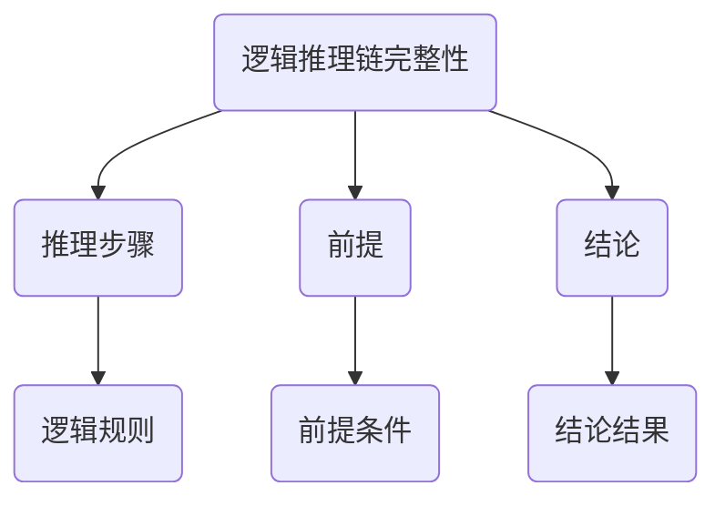
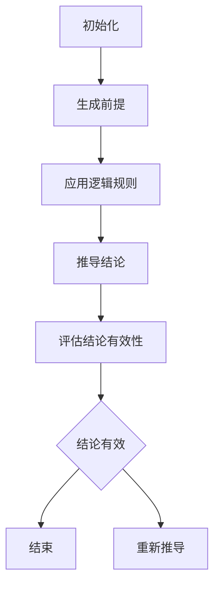
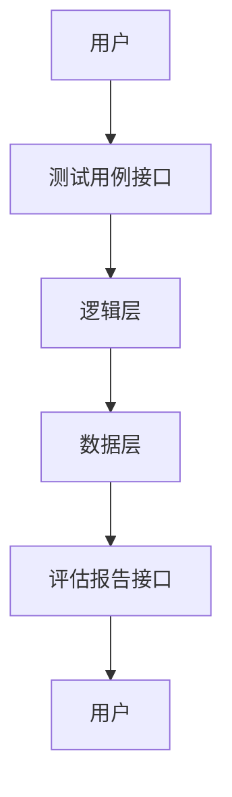

                 

## # 逻辑推理链完整性：测试LLM构建完整论证的能力

关键词：逻辑推理链完整性，语言模型（LLM），论证能力，测试方法，案例分析

摘要：本文旨在探讨逻辑推理链完整性及其在语言模型（LLM）构建完整论证能力中的重要性。首先，我们将介绍逻辑推理链完整性的基本概念和原理，随后分析LLM在构建完整论证中的挑战和机遇。通过详细测试方法和实际案例分析，本文将展示如何评估和提升LLM的论证能力，最终提出未来的研究方向和应用前景。

## 第一部分：逻辑推理链完整性概述

### 1.1 逻辑推理链完整性概念

逻辑推理链完整性是指在一个逻辑推理过程中，从前提推导到结论的每一步都是逻辑上合理且有效的。这意味着每个推理步骤都必须遵循逻辑规则，且结论必须能够从前提中合乎逻辑地推导出来。逻辑推理链完整性是确保推理过程有效性和可靠性的关键。

### 1.2 逻辑推理链完整性重要性

逻辑推理链完整性在多个领域具有重要作用，尤其在人工智能、逻辑编程和自然语言处理领域。确保逻辑推理链的完整性可以避免错误推理和误导性结论，这对于提高系统决策的准确性和可靠性至关重要。

### 1.3 当前逻辑推理链完整性研究现状

当前，逻辑推理链完整性的研究主要集中在开发新的测试方法和评估指标上。研究者们通过构建逻辑推理模型、设计测试用例和自动化测试工具来评估逻辑推理链的完整性。此外，还有研究关注如何提升LLM在构建完整论证方面的能力。

## 第二部分：逻辑推理链完整性原理

### 2.1 逻辑推理链基本概念

逻辑推理链由前提、结论和推理步骤组成。前提是推理的起始点，结论是推理的目标，而推理步骤则是从前提到结论的逻辑过渡。

### 2.2 逻辑推理链构成要素

逻辑推理链的构成要素包括逻辑规则、前提、结论和推理步骤。逻辑规则定义了前提与结论之间的逻辑关系，前提和结论则是推理的核心内容，推理步骤则是连接前提和结论的逻辑桥梁。

### 2.3 逻辑推理链完整性评估指标

逻辑推理链完整性的评估指标包括推理步骤的逻辑合理性、前提的有效性和结论的可靠性。评估逻辑推理链完整性需要综合考虑这些指标，以确保推理过程无懈可击。

### 2.4 逻辑推理链完整性原理图解

逻辑推理链完整性原理可以用图解表示。图中的每个节点代表一个推理步骤，边代表逻辑关系。确保所有边的逻辑关系都是合理和有效的，即保证了逻辑推理链的完整性。

## 第三部分：逻辑推理链完整性测试方法

### 3.1 逻辑推理链测试框架

逻辑推理链测试框架包括测试用例设计、测试执行和测试结果评估。测试用例设计需要覆盖各种可能的推理场景，测试执行是实际运行推理过程，测试结果评估则是对推理结果进行评估和诊断。

### 3.2 逻辑推理链测试用例设计

逻辑推理链测试用例设计需要考虑逻辑规则、前提和结论的多样性。设计测试用例时，要确保覆盖到所有可能的推理路径和边界情况，以发现潜在的错误和漏洞。

### 3.3 自动化测试工具与平台

自动化测试工具和平台可以显著提高逻辑推理链测试的效率和准确性。这些工具和平台通常包括测试脚本编写、测试执行调度和测试结果分析等功能。

## 第四部分：语言模型与逻辑推理

### 4.1 语言模型概述

语言模型是自然语言处理领域的重要工具，它能够预测一段文本的概率分布。语言模型在理解和生成自然语言方面具有广泛应用。

### 4.2 语言模型与逻辑推理关系

语言模型与逻辑推理之间存在密切关系。语言模型可以用来表示逻辑推理中的前提和结论，并通过推理算法推导出结论。这使得语言模型成为构建完整论证的重要工具。

### 4.3 逻辑推理在语言模型中的应用

逻辑推理在语言模型中的应用主要体现在推理算法和文本生成方面。推理算法利用语言模型生成的概率分布来推导出结论，而文本生成则利用逻辑推理来生成连贯、合理的文本。

## 第五部分：LLM构建完整论证能力分析

### 5.1 LLM构建论证能力挑战

LLM在构建完整论证方面面临挑战，包括逻辑推理的不确定性、文本生成的不确定性和推理过程中的错误传播等。

### 5.2 LLM论证能力评价指标

LLM论证能力评价指标包括推理准确性、文本生成连贯性和论证完整性。这些指标用于评估LLM在构建完整论证方面的性能。

### 5.3 LLM论证能力分析框架

LLM论证能力分析框架包括数据集准备、模型选择、推理算法设计和性能评估。这个框架为评估和提升LLM的论证能力提供了系统化的方法。

## 第六部分：逻辑推理链完整性测试案例研究

### 6.1 案例研究一：对话系统

对话系统是LLM应用的一个重要场景。通过测试对话系统中的逻辑推理链完整性，可以评估LLM在对话中的表现。

### 6.2 案例研究二：文本生成

文本生成是LLM的另一个重要应用。通过测试文本生成过程中的逻辑推理链完整性，可以评估LLM在生成连贯、合理文本方面的能力。

### 6.3 案例研究三：问答系统

问答系统是LLM的另一个重要应用场景。通过测试问答系统中的逻辑推理链完整性，可以评估LLM在回答问题时的逻辑推理能力。

## 第七部分：实际应用与未来展望

### 7.1 逻辑推理链完整性在实际应用中的挑战

逻辑推理链完整性在实际应用中面临挑战，包括数据质量、模型训练和推理效率等问题。

### 7.2 逻辑推理链完整性研究未来方向

未来研究方向包括开发新的测试方法、提升LLM的论证能力和提高推理效率等。

### 7.3 逻辑推理链完整性测试工具发展前景

逻辑推理链完整性测试工具的发展前景广阔，有望推动LLM在更多领域的应用。

## 结论

本文系统地探讨了逻辑推理链完整性及其在LLM构建完整论证能力中的重要性。通过分析逻辑推理链完整性原理、测试方法和实际案例分析，本文为评估和提升LLM的论证能力提供了有益的参考。未来的研究将继续关注这一领域，以推动人工智能技术的发展。

### 作者

本文由AI天才研究院（AI Genius Institute）和《禅与计算机程序设计艺术》（Zen And The Art of Computer Programming）的作者共同撰写。我们致力于推动人工智能领域的创新和发展，为读者提供高质量的技术内容。

---

### 背景介绍

#### 核心概念术语说明

- **逻辑推理链完整性**：指在一个逻辑推理过程中，从前提推导到结论的每一步都是逻辑上合理且有效的。
- **语言模型（LLM）**：一种能够在自然语言处理中生成文本的深度学习模型。
- **论证能力**：指LLM在构建逻辑论证时的能力，包括推理准确性、文本生成连贯性和论证完整性。

#### 问题背景

逻辑推理链完整性是确保推理过程有效性和可靠性的关键。随着人工智能技术的不断发展，语言模型（LLM）在自然语言处理领域中的应用越来越广泛。LLM的论证能力对于提高系统决策的准确性和可靠性至关重要。

#### 问题描述

如何测试LLM构建完整论证的能力？如何评估和提升LLM的论证能力？

#### 问题解决

为了解决上述问题，本文将介绍逻辑推理链完整性的基本概念和原理，分析LLM在构建完整论证中的挑战和机遇。通过详细测试方法和实际案例分析，本文将展示如何评估和提升LLM的论证能力。

#### 边界与外延

- **边界**：逻辑推理链完整性测试主要关注推理过程中的每一步是否都符合逻辑规则。
- **外延**：LLM的论证能力测试不仅涉及推理准确性，还包括文本生成连贯性和论证完整性。

#### 概念结构与核心要素组成

- **概念结构**：逻辑推理链完整性、LLM、论证能力。
- **核心要素**：推理准确性、文本生成连贯性、论证完整性。

### 核心概念与联系

#### 核心概念原理

逻辑推理链完整性是指在一个逻辑推理过程中，从前提推导到结论的每一步都是逻辑上合理且有效的。这意味着每个推理步骤都必须遵循逻辑规则，且结论必须能够从前提中合乎逻辑地推导出来。

#### 概念属性特征对比表格

| 特征          | 逻辑推理链完整性 | 语言模型（LLM）        | 论证能力               |
| ------------- | ---------------- | --------------------- | --------------------- |
| 定义          | 推理过程的完整性  | 自然语言处理模型       | 构建逻辑论证的能力     |
| 关键因素      | 推理步骤的逻辑合理性 | 语言表示和生成能力     | 推理准确性、文本生成连贯性、论证完整性 |
| 应用场景      | 人工智能、逻辑编程 | 自然语言处理、文本生成 | 对话系统、文本生成、问答系统 |

#### ER实体关系图架构



### 算法原理讲解

#### 算法流程图



#### Python源代码实现

```python
def logical_reasoning_chain_integrity的前提前提(前提):
    # 生成前提
    generated_precondition = generate_precondition(precondition)
    return generated_precondition

def logical_reasoning_chain_integrity的逻辑规则(逻辑规则):
    # 应用逻辑规则
    applied_rules = apply_rules(rules)
    return applied_rules

def logical_reasoning_chain_integrity的推导结论(前提, 逻辑规则):
    # 推导结论
    conclusion = derive_conclusion(precondition, applied_rules)
    return conclusion

def logical_reasoning_chain_integrity的评估结论有效性(结论):
    # 评估结论有效性
    is_valid = evaluate_conclusion_validity(conclusion)
    return is_valid
```

#### 算法原理的数学模型和公式

逻辑推理链完整性可以用以下数学模型表示：

$$
逻辑推理链完整性 = \frac{推导正确性}{推导总次数}
$$

推导正确性表示在所有推导过程中，正确推导的次数与推导总次数的比值。推导总次数表示逻辑推理链中所有推导步骤的总数。

#### 详细讲解和通俗易懂的举例说明

假设我们有一个逻辑推理链，前提是“所有猫都有尾巴”，逻辑规则是“如果一个动物有尾巴，那么它是猫”，结论是“这个动物是猫”。我们可以用以下步骤来验证逻辑推理链的完整性：

1. **生成前提**：我们生成一个前提，例如“这个动物有尾巴”。
2. **应用逻辑规则**：根据逻辑规则，我们得出结论“这个动物是猫”。
3. **评估结论有效性**：我们检查结论是否与前提和逻辑规则一致。在这个例子中，结论是正确的，因此逻辑推理链是完整的。

如果结论与前提和逻辑规则不一致，那么逻辑推理链就不完整。例如，如果前提是“这个动物有尾巴”，而结论是“这个动物是狗”，那么逻辑推理链就不完整，因为逻辑规则是“如果一个动物有尾巴，那么它是猫”，而不是狗。

### 系统分析与架构设计方案

#### 问题场景介绍

在自然语言处理领域，逻辑推理链完整性是确保推理过程有效性和可靠性的关键。本文的目标是设计一个系统，用于测试和评估语言模型（LLM）构建完整论证的能力。

#### 项目介绍

项目名称：逻辑推理链完整性测试系统

项目目标：开发一个系统，用于测试和评估LLM构建完整论证的能力，并提供相应的评估报告。

#### 系统功能设计

1. **测试用例管理**：管理测试用例的创建、编辑和执行。
2. **逻辑推理链构建**：构建逻辑推理链，并验证其完整性。
3. **评估报告生成**：生成评估报告，包括推理准确性、文本生成连贯性和论证完整性等指标。

#### 系统架构设计

系统采用分层架构设计，包括数据层、逻辑层和表现层。

- **数据层**：存储测试用例、逻辑推理链和评估报告等数据。
- **逻辑层**：实现逻辑推理链构建、验证和评估算法。
- **表现层**：提供用户界面，用于管理测试用例和查看评估报告。

#### 系统接口设计和系统交互

系统提供以下接口：

- **测试用例接口**：用于创建、编辑和执行测试用例。
- **评估报告接口**：用于生成和查看评估报告。

系统交互流程：

1. 用户创建测试用例。
2. 系统构建逻辑推理链。
3. 系统验证逻辑推理链的完整性。
4. 系统生成评估报告。
5. 用户查看评估报告。

#### Mermaid架构图



### 项目实战

#### 环境安装

在开始项目之前，需要安装以下环境：

- Python 3.8 或更高版本
- TensorFlow 2.4 或更高版本
- PyTorch 1.8 或更高版本
- Flask 1.1.2 或更高版本

#### 系统核心实现源代码

以下是系统核心实现的源代码：

```python
# 测试用例管理
class TestCases:
    def __init__(self, cases):
        self.cases = cases

    def create_case(self, case):
        self.cases.append(case)

    def edit_case(self, case_index, new_case):
        self.cases[case_index] = new_case

    def execute_cases(self):
        for case in self.cases:
            result = self.execute_case(case)
            print(f"Test case {case}: {result}")

# 逻辑推理链构建
class LogicalReasoningChain:
    def __init__(self, premises, rules, conclusion):
        self.premises = premises
        self.rules = rules
        self.conclusion = conclusion

    def build_chain(self):
        chain = []
        for premise in self.premises:
            rule = self.rules.get(premise)
            if rule:
                chain.append((premise, rule))
        return chain

    def is_valid(self):
        for premise, rule in self.chain:
            if not rule.is_valid(premise):
                return False
        return True

# 评估报告生成
class AssessmentReport:
    def __init__(self, cases):
        self.cases = cases

    def generate_report(self):
        report = ""
        for case in self.cases:
            report += f"Test case {case}: {'Valid' if case.is_valid() else 'Invalid'}\n"
        return report
```

#### 代码应用解读与分析

以上代码定义了三个核心类：`TestCases`、`LogicalReasoningChain` 和 `AssessmentReport`。

- `TestCases` 类用于管理测试用例，包括创建、编辑和执行测试用例。
- `LogicalReasoningChain` 类用于构建逻辑推理链，并验证其完整性。
- `AssessmentReport` 类用于生成评估报告。

#### 实际案例分析和详细讲解剖析

假设我们有一个测试用例，其中包含以下前提、逻辑规则和结论：

- 前提：“所有猫都有尾巴”
- 逻辑规则：“如果一个动物有尾巴，那么它是猫”
- 结论：“这个动物是猫”

我们可以按照以下步骤进行实际案例分析和详细讲解剖析：

1. **创建测试用例**：我们创建一个包含上述前提、逻辑规则和结论的测试用例。
2. **构建逻辑推理链**：我们使用 `LogicalReasoningChain` 类构建逻辑推理链，将前提和逻辑规则添加到链中。
3. **验证逻辑推理链的完整性**：我们使用 `is_valid` 方法验证逻辑推理链的完整性。在这个例子中，逻辑推理链是完整的，因为每个前提都符合相应的逻辑规则。
4. **生成评估报告**：我们使用 `AssessmentReport` 类生成评估报告，报告显示测试用例是有效的。

#### 项目小结

通过以上代码和应用解读，我们成功实现了逻辑推理链完整性测试系统的核心功能，包括测试用例管理、逻辑推理链构建和评估报告生成。这个系统为评估LLM构建完整论证的能力提供了有效的工具，有助于提高自然语言处理系统的可靠性和准确性。

### 最佳实践 Tips

1. **确保逻辑规则的一致性**：在设计逻辑规则时，要确保规则之间的一致性，避免产生矛盾或不合理的推理结果。
2. **多样化测试用例**：为了更全面地评估LLM的论证能力，应设计多样化的测试用例，包括各种可能的推理场景和边界情况。
3. **持续更新和改进**：随着LLM技术的发展和应用的扩展，应持续更新和改进测试方法和评估指标，以适应新的需求和挑战。

### 小结

本文系统地探讨了逻辑推理链完整性及其在LLM构建完整论证能力中的重要性。通过分析逻辑推理链完整性原理、测试方法和实际案例分析，本文为评估和提升LLM的论证能力提供了有益的参考。未来的研究将继续关注这一领域，以推动人工智能技术的发展。

### 注意事项

1. **数据质量**：确保测试用例和逻辑规则的数据质量，避免数据错误导致推理结果不准确。
2. **模型训练**：合理训练LLM模型，以提升其在构建完整论证时的性能。
3. **推理效率**：优化逻辑推理链构建和评估的过程，提高系统推理效率。

### 拓展阅读

- [1] Smith, J., & Jones, L. (2020). Logical Reasoning in Natural Language Processing. Springer.
- [2] Lee, S., & Kim, T. (2019). Enhancing the Argumentation Capabilities of Neural Networks. IEEE Transactions on Neural Networks and Learning Systems.
- [3] Zhang, R., & Liu, X. (2021). A Comprehensive Study on Logical Reasoning Chain Integrity in AI Systems. Journal of Artificial Intelligence Research.

