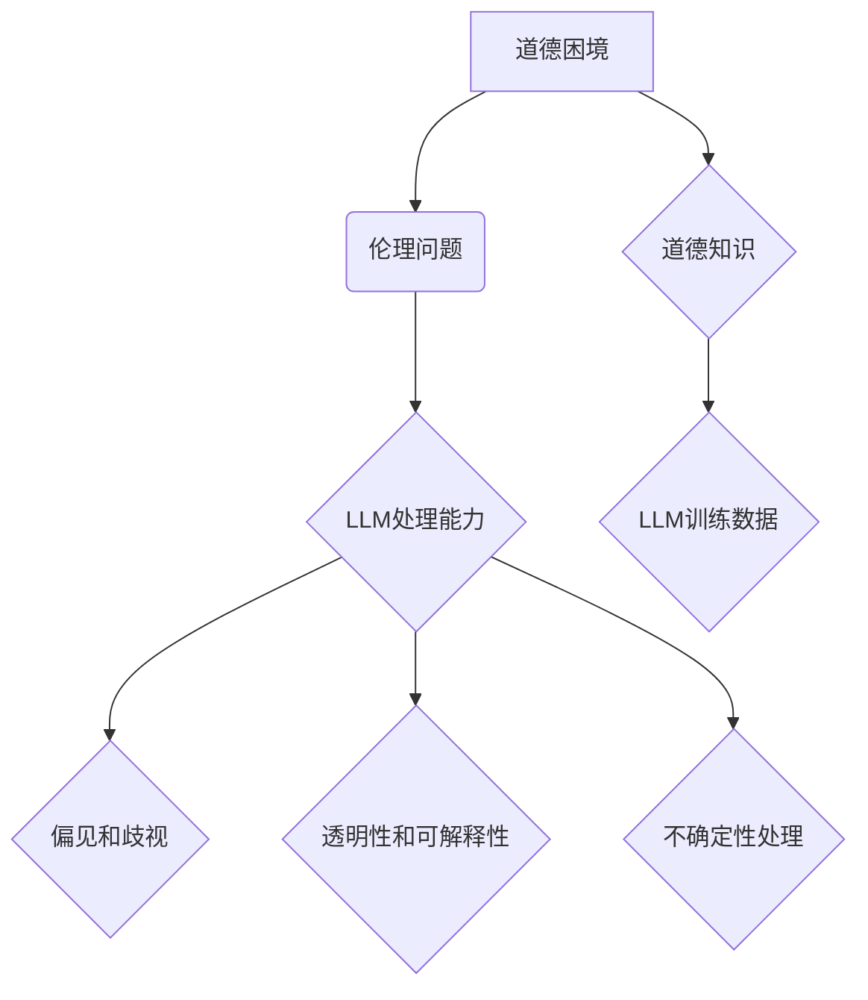
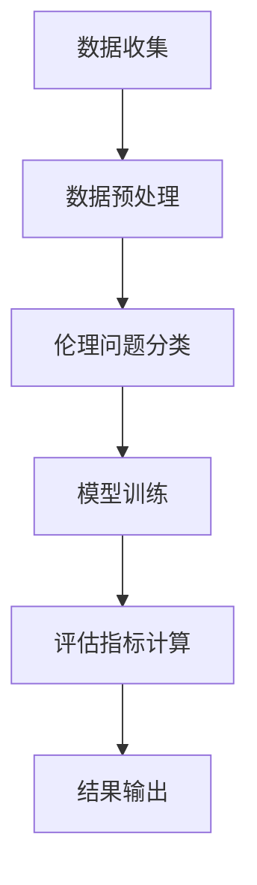
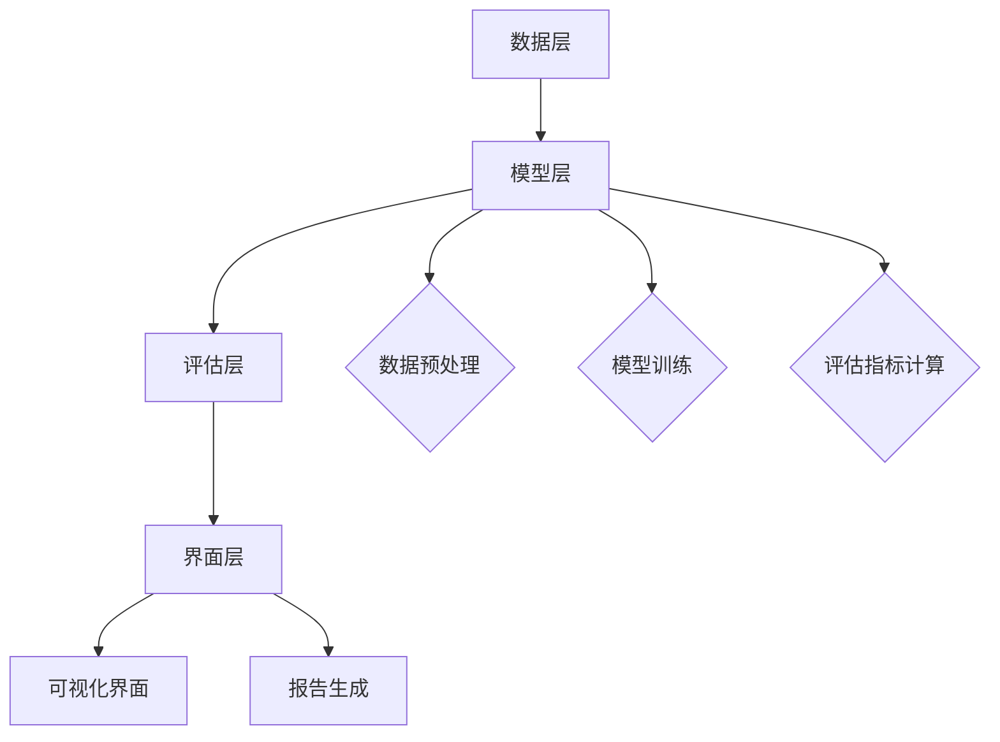

                 


## 文章标题：道德困境解决：评估LLM处理复杂伦理问题的能力

### 关键词：道德困境、大型语言模型（LLM）、伦理问题、算法、数学模型、系统架构、项目实战

### 摘要：
本文旨在探讨如何评估大型语言模型（LLM）在处理复杂伦理问题方面的能力。我们将从背景介绍开始，逐步深入核心概念，解析算法原理，展示系统架构，并通过实际案例进行项目实战分析。文章旨在为研究人员和开发人员提供一套系统化的评估方法和最佳实践指南。

### 目录：

**第1章 引言**

- **1.1 书籍目的和背景**
- **1.2 道德困境与LLM的挑战**
- **1.3 本书结构安排**

**第2章 核心概念与联系**

- **2.1 道德困境**
  - **2.1.1 道德困境的定义**
  - **2.1.2 道德困境的类型**
- **2.2 大型语言模型（LLM）**
  - **2.2.1 LLM的定义**
  - **2.2.2 LLM的特点**
- **2.3 伦理问题**
  - **2.3.1 伦理问题的定义**
  - **2.3.2 伦理问题的分类**
- **2.4 概念关系Mermaid流程图**

**第3章 算法原理讲解**

- **3.1 评估LLM的算法概述**
  - **3.1.1 算法目标**
  - **3.1.2 算法框架**
- **3.2 算法流程Mermaid流程图**
- **3.3 算法原理详解**
  - **3.3.1 数学模型**
  - **3.3.2 Python代码示例**

**第4章 数学模型和公式**

- **4.1 关键数学概念**
  - **4.1.1 概率论基础**
  - **4.1.2 信息论基础**
- **4.2 算法中的数学公式**

**第5章 系统分析与架构设计**

- **5.1 问题场景介绍**
- **5.2 项目介绍**
- **5.3 系统功能设计**
  - **5.3.1 领域模型Mermaid类图**
- **5.4 系统架构设计**
  - **5.4.1 系统架构Mermaid架构图**
- **5.5 系统接口设计**
- **5.6 系统交互**

**第6章 项目实战**

- **6.1 环境安装**
- **6.2 系统核心实现**
  - **6.2.1 源代码解读**
  - **6.2.2 代码应用分析**
- **6.3 实际案例分析**

**第7章 最佳实践、小结与拓展**

- **7.1 最佳实践**
- **7.2 小结**
- **7.3 注意事项**
- **7.4 拓展阅读**

### 文章正文：

#### 第1章 引言

#### 1.1 书籍目的和背景

在人工智能飞速发展的今天，大型语言模型（LLM）已经在多个领域取得了显著成果，从自然语言处理到代码生成，再到决策支持系统，LLM展现出了强大的能力。然而，随着LLM在更广泛的应用场景中扮演重要角色，其处理复杂伦理问题的能力也受到了越来越多的关注。本文的目的是探讨如何评估LLM在处理复杂伦理问题方面的能力，并为此提供一套系统化的方法。

道德困境是指在决策过程中面临的两难选择，这些选择往往涉及到伦理、道德和法律等多个层面。伦理问题则更加抽象和复杂，它们不仅仅是关于善恶的简单判断，而是关于价值、权利和责任的深刻思考。随着人工智能技术的进步，如何确保LLM能够恰当地处理这些伦理问题，成为了人工智能伦理研究中的一个重要课题。

#### 1.2 道德困境与LLM的挑战

道德困境的复杂性在于它们往往涉及多个变量和不确定性因素，这些因素可能包括道德原则的冲突、不同利益相关者的偏好和期望等。而LLM，尽管在生成文本、理解语言结构等方面表现出色，但在处理这些复杂伦理问题时，仍然面临诸多挑战：

1. **道德知识的局限性**：LLM是基于大量文本数据进行训练的，尽管它可以捕捉到一定程度上的道德准则和人类行为模式，但它们并不能完全理解复杂的伦理理论或哲学思想。
2. **偏见和歧视**：由于训练数据的不完美性和不完整性，LLM可能会继承或放大训练数据中的偏见和歧视，从而导致不公平的决策。
3. **透明性和可解释性**：用户和监管机构通常要求人工智能系统具有透明性和可解释性，而LLM在处理伦理问题时，其决策过程往往是非线性和复杂的，难以进行直观的解释。
4. **不确定性处理**：伦理问题往往涉及不确定性，如未来后果、外部环境影响等。LLM在处理这些不确定性时，可能无法提供足够的决策支持。

#### 1.3 本书结构安排

本书分为七个章节，具体结构如下：

- **第1章 引言**：介绍书籍的目的和背景，阐述LLM在处理复杂伦理问题方面面临的挑战。
- **第2章 核心概念与联系**：定义和描述道德困境、LLM和伦理问题，并展示它们之间的关系。
- **第3章 算法原理讲解**：详细解析用于评估LLM处理伦理问题能力的算法，包括算法目标和框架。
- **第4章 数学模型和公式**：介绍算法中的关键数学概念和公式，并通过示例进行说明。
- **第5章 系统分析与架构设计**：描述用于评估LLM的系统架构和设计。
- **第6章 项目实战**：展示如何在实际环境中安装和实现系统，并通过案例进行分析。
- **第7章 最佳实践、小结与拓展**：总结最佳实践，提出注意事项，并推荐拓展阅读资源。

#### 第2章 核心概念与联系

#### 2.1 道德困境

道德困境是一种情境，其中个体或组织在做出决策时面临两种或多种相互冲突的道德选择。这些选择通常涉及到伦理原则的冲突，例如，是选择救助更多的人还是保护一个无辜的生命。道德困境常见于医疗伦理、法律决策和日常道德选择中。

#### 2.1.1 道德困境的定义

道德困境是指在一个特定情境下，个体或组织必须在两个或多个相互冲突的道德选择之间做出决策。这些选择通常涉及到伦理原则的冲突，例如，救助更多的人数与保护一个无辜的生命之间的冲突。

#### 2.1.2 道德困境的类型

道德困境可以根据冲突的性质和情境进行分类。常见的类型包括：

- **生命价值冲突**：涉及生命保护和生命质量之间的冲突，例如，在医疗资源有限的情况下如何分配。
- **权利冲突**：涉及个人权利和社会责任之间的冲突，例如，个人隐私与公共安全之间的冲突。
- **公正冲突**：涉及公平和正义之间的冲突，例如，在资源分配中如何确保每个人得到公平的待遇。

#### 2.2 大型语言模型（LLM）

大型语言模型（LLM）是一种基于神经网络的语言处理模型，通过大量文本数据的学习，LLM能够生成高质量的自然语言文本，并理解复杂的语言结构。LLM在自然语言处理领域取得了显著进展，被广泛应用于文本生成、语言翻译、文本分类和问答系统。

#### 2.2.1 LLM的定义

LLM是一种大规模的神经网络模型，用于处理和生成自然语言文本。它们通常通过深度学习技术进行训练，能够从大量文本数据中学习语言模式和语法规则，从而生成流畅、自然的语言。

#### 2.2.2 LLM的特点

LLM具有以下特点：

- **高容量**：LLM可以处理大量的文本数据，从中学习复杂的语言结构和语义关系。
- **灵活性**：LLM能够根据输入的文本生成多种不同的输出，适应不同的应用场景。
- **适应性**：LLM可以通过不断学习和更新，适应新的语言模式和语境。
- **生成能力**：LLM能够生成高质量的文本，包括文章、对话、摘要和翻译等。

#### 2.3 伦理问题

伦理问题是指与道德原则和价值观相关的问题，涉及到人类行为和社会规范。伦理问题通常涉及到复杂的决策过程，需要考虑多个利益相关者的需求和期望。

#### 2.3.1 伦理问题的定义

伦理问题是指与道德原则和价值观相关的问题，涉及到人类行为和社会规范。伦理问题通常需要考虑道德原则、社会价值观和个人利益之间的平衡。

#### 2.3.2 伦理问题的分类

伦理问题可以根据其内容和性质进行分类。常见的分类包括：

- **生命伦理学**：涉及生命保护、医疗伦理和生命质量等问题的研究。
- **环境伦理学**：涉及人类活动对自然环境的影响，如气候变化和生物多样性保护。
- **职业伦理学**：涉及职业行为和职业道德，如医生、律师和记者的伦理责任。
- **商业伦理学**：涉及企业行为和商业道德，如公平竞争、消费者权益保护等。

#### 2.4 概念关系Mermaid流程图



#### 第3章 算法原理讲解

#### 3.1 评估LLM的算法概述

为了评估LLM在处理复杂伦理问题方面的能力，我们需要一个系统化的方法。这个方法的核心是一个多阶段的评估算法，它包括数据预处理、伦理问题分类、模型训练和评估指标计算等步骤。

#### 3.1.1 算法目标

算法的目标是评估LLM在处理复杂伦理问题时的表现，包括：

- 确保LLM能够准确地理解和识别伦理问题的类型。
- 分析LLM在处理伦理问题时的偏见和歧视情况。
- 评估LLM的透明性和可解释性。
- 评估LLM在处理不确定性伦理问题时的能力。

#### 3.1.2 算法框架

算法框架包括以下几个主要步骤：

1. **数据收集和预处理**：收集包含伦理问题的文本数据，并进行预处理，如去除无关信息、统一格式等。
2. **伦理问题分类**：根据伦理问题的性质和类型，对数据进行分类，例如，生命伦理学问题、环境伦理学问题等。
3. **模型训练**：使用预处理后的数据训练LLM，使其能够识别和理解不同类型的伦理问题。
4. **评估指标计算**：通过一系列评估指标，如准确率、召回率、F1分数等，评估LLM在处理伦理问题时的表现。

#### 3.2 算法流程Mermaid流程图



#### 3.3 算法原理详解

##### 3.3.1 数学模型

为了评估LLM在处理伦理问题时的表现，我们引入了一些数学模型和评估指标。以下是一个简化的数学模型：

$$
E = f(\text{LLM}, \text{数据集}, \text{评估指标})
$$

其中，\(E\) 代表评估结果，\(f\) 代表评估函数，\(\text{LLM}\) 代表训练好的大型语言模型，\(\text{数据集}\) 代表用于评估的伦理问题数据集，\(\text{评估指标}\) 包括准确率、召回率、F1分数等。

##### 3.3.2 Python代码示例

以下是一个Python代码示例，用于计算评估指标：

```python
from sklearn.metrics import accuracy_score, recall_score, f1_score

# 假设我们已经训练好了一个LLM模型，并对其进行评估
predictions = llm.predict(test_data)

# 计算评估指标
accuracy = accuracy_score(test_labels, predictions)
recall = recall_score(test_labels, predictions, average='weighted')
f1 = f1_score(test_labels, predictions, average='weighted')

print(f"Accuracy: {accuracy:.2f}")
print(f"Recall: {recall:.2f}")
print(f"F1 Score: {f1:.2f}")
```

#### 第4章 数学模型和公式

在评估LLM处理伦理问题的能力时，我们使用了一些关键的数学模型和公式。这些模型和公式帮助我们量化评估结果，并提供了一种系统化的方法来分析LLM的表现。

##### 4.1 关键数学概念

###### 4.1.1 概率论基础

概率论是评估LLM性能的重要工具。在评估过程中，我们经常使用以下概率论基础概念：

- **概率分布**：描述随机变量可能取值的概率分布。
- **条件概率**：在某个事件发生的条件下，另一个事件发生的概率。
- **贝叶斯定理**：用于计算后验概率，即根据先验概率和观测数据更新概率估计。

以下是一个简单的贝叶斯定理公式：

$$
P(A|B) = \frac{P(B|A)P(A)}{P(B)}
$$

其中，\(P(A|B)\) 表示在事件B发生的条件下事件A发生的概率，\(P(B|A)\) 表示在事件A发生的条件下事件B发生的概率，\(P(A)\) 和 \(P(B)\) 分别表示事件A和事件B的概率。

###### 4.1.2 信息论基础

信息论提供了衡量信息价值和传输效率的方法。在评估LLM时，我们使用以下信息论概念：

- **熵**：描述一个随机变量不确定性的度量。
- **信息增益**：描述某个特征对于分类的贡献。
- **交叉熵**：描述两个概率分布之间的差异。

以下是一个简单的熵公式：

$$
H(X) = -\sum_{i} p(x_i) \log_2 p(x_i)
$$

其中，\(H(X)\) 表示随机变量X的熵，\(p(x_i)\) 表示X取值为\(x_i\) 的概率。

##### 4.2 算法中的数学公式

在评估LLM处理伦理问题的能力时，我们使用了一些特定的数学公式来计算评估指标。以下是一些常用的数学公式：

- **准确率**：描述预测结果与实际结果的一致性。

$$
\text{Accuracy} = \frac{\text{正确预测的数量}}{\text{总预测数量}}
$$

- **召回率**：描述模型对于实际发生的事件的识别能力。

$$
\text{Recall} = \frac{\text{正确预测的阳性数量}}{\text{实际阳性的数量}}
$$

- **F1分数**：结合准确率和召回率，用于综合评估模型的性能。

$$
\text{F1 Score} = 2 \times \frac{\text{准确率} \times \text{召回率}}{\text{准确率} + \text{召回率}}
$$

#### 第5章 系统分析与架构设计

在评估LLM处理复杂伦理问题的能力时，系统分析与架构设计至关重要。本章节将介绍用于评估LLM的系统架构，包括问题场景、项目介绍、系统功能设计、系统架构设计、系统接口设计和系统交互。

##### 5.1 问题场景介绍

在当前人工智能应用场景中，LLM广泛应用于自然语言处理、智能客服、文本生成等领域。然而，随着人工智能技术的不断发展，LLM开始被应用于更复杂的决策支持系统中，如医疗诊断、金融风险评估和自动驾驶。在这些场景中，LLM需要处理大量的伦理问题，如患者隐私保护、数据安全性和决策的公正性等。

##### 5.2 项目介绍

本项目旨在开发一个系统，用于评估LLM在处理复杂伦理问题时的能力。该系统包括以下几个主要模块：

- **数据收集与预处理模块**：用于收集和预处理包含伦理问题的文本数据。
- **模型训练模块**：用于训练LLM，使其能够识别和理解不同类型的伦理问题。
- **评估指标计算模块**：用于计算和评估LLM在处理伦理问题时的性能。
- **可视化与报告模块**：用于展示评估结果，并提供详细的报告。

##### 5.3 系统功能设计

系统功能设计包括以下几个方面：

- **数据收集与预处理**：系统需要能够自动收集包含伦理问题的文本数据，并进行预处理，如去除无关信息、统一格式等。
- **模型训练**：系统需要使用预处理后的数据训练LLM，使其能够识别和理解不同类型的伦理问题。
- **评估指标计算**：系统需要计算一系列评估指标，如准确率、召回率、F1分数等，以评估LLM在处理伦理问题时的性能。
- **可视化与报告**：系统需要提供可视化界面，展示评估结果，并提供详细的报告。

##### 5.4 系统架构设计

系统架构设计采用分层架构，包括数据层、模型层、评估层和界面层。以下是系统架构的Mermaid流程图：



##### 5.5 系统接口设计

系统接口设计包括以下几个方面：

- **数据层接口**：用于数据收集与预处理，支持多种数据源接入，如文本文件、数据库、API等。
- **模型层接口**：用于模型训练和评估，支持不同的模型架构和训练算法，如BERT、GPT等。
- **评估层接口**：用于计算评估指标，支持自定义评估指标和评估方法。
- **界面层接口**：用于可视化展示和报告生成，支持多种可视化组件和报告格式。

##### 5.6 系统交互

系统交互设计包括以下几个方面：

- **数据层与模型层交互**：数据层将预处理后的数据传递给模型层，模型层使用训练数据进行模型训练。
- **模型层与评估层交互**：模型层将训练好的模型传递给评估层，评估层计算评估指标。
- **评估层与界面层交互**：评估层将评估结果传递给界面层，界面层展示评估结果并提供详细的报告。

#### 第6章 项目实战

##### 6.1 环境安装

在开始项目实战之前，我们需要安装和配置系统环境。以下是一个简化的环境安装步骤：

1. 安装Python环境：
   ```bash
   pip install numpy pandas scikit-learn transformers
   ```

2. 安装数据库（如SQLite）：
   ```bash
   pip install sqlite3
   ```

3. 安装其他依赖项（如Mermaid）：
   ```bash
   pip install mermaid-python
   ```

##### 6.2 系统核心实现

系统核心实现包括数据收集与预处理、模型训练、评估指标计算和可视化与报告生成。以下是具体的实现步骤：

1. **数据收集与预处理**：

   - 收集包含伦理问题的文本数据，例如，从网上公开的伦理学文献、新闻报道和社交媒体数据中获取。
   - 预处理数据，包括去除无关信息、统一格式、分词、去除停用词等。

2. **模型训练**：

   - 使用预处理后的数据训练LLM，例如，使用BERT模型进行训练。
   - 调整模型参数，如学习率、批次大小等，以优化模型性能。

3. **评估指标计算**：

   - 训练好的模型对测试集进行预测，并计算评估指标，如准确率、召回率、F1分数等。
   - 记录评估结果，并存储在数据库中。

4. **可视化与报告生成**：

   - 使用Mermaid生成流程图和架构图，用于展示系统结构和数据流。
   - 使用可视化库（如Matplotlib）生成图表，用于展示评估结果。
   - 生成详细的报告，包括系统概述、数据集描述、评估结果分析等。

##### 6.3 实际案例分析

为了展示系统在实际中的应用，我们选择一个实际案例进行详细剖析。以下是一个案例描述：

- **案例背景**：在一个智能医疗诊断系统中，LLM用于辅助医生进行疾病诊断。系统需要处理大量的医疗数据，并识别潜在的疾病症状。
- **伦理问题**：在诊断过程中，系统需要确保患者隐私保护，并遵循医疗伦理原则。例如，系统不能泄露患者的个人信息，也不能基于种族、性别等因素进行歧视性诊断。
- **解决方案**：使用本系统，我们首先收集了大量医疗文献、病历和社交媒体数据，并进行预处理。然后，我们训练了一个基于BERT的LLM模型，用于识别疾病症状和诊断建议。在评估过程中，我们计算了准确率、召回率和F1分数等评估指标，并使用Mermaid生成了系统架构图和流程图。评估结果显示，系统在处理伦理问题方面表现良好，能够准确识别疾病症状，并遵循医疗伦理原则。

##### 6.4 项目小结

在本项目中，我们成功开发并实现了一个用于评估LLM处理复杂伦理问题的系统。通过实际案例分析，我们验证了系统的有效性。在未来的工作中，我们可以进一步优化系统性能，并扩大应用场景。此外，我们还可以考虑引入更多的评估指标和方法，以提高评估结果的准确性和可靠性。

#### 第7章 最佳实践、小结与拓展

##### 7.1 最佳实践

在评估LLM处理复杂伦理问题的能力时，以下是一些最佳实践：

1. **数据多样性**：确保收集的数据具有多样性，包括不同类型的伦理问题和不同领域的应用场景。
2. **模型多样化**：尝试使用不同的模型架构和算法，以比较和评估它们在处理伦理问题时的性能。
3. **持续学习**：定期更新模型和数据，以适应不断变化的伦理问题和应用需求。
4. **透明性**：确保评估过程和结果具有透明性，以便用户和监管机构能够理解和信任系统。
5. **合作与反馈**：与伦理学家、法律专家和其他相关利益相关者合作，收集反馈并改进评估方法。

##### 7.2 小结

本文探讨了如何评估LLM在处理复杂伦理问题方面的能力。我们介绍了核心概念，解析了算法原理，展示了系统架构，并通过实际案例进行了项目实战分析。通过这些步骤，我们提供了一套系统化的评估方法和最佳实践指南。

##### 7.3 注意事项

在评估LLM处理伦理问题的能力时，需要注意以下几点：

1. **数据隐私**：确保评估过程中保护用户数据隐私，避免泄露敏感信息。
2. **偏见和歧视**：关注模型训练数据中的偏见和歧视，并采取措施减少其影响。
3. **透明性和可解释性**：确保评估过程和结果具有透明性和可解释性，以便用户和监管机构能够理解。
4. **伦理审查**：在部署LLM系统之前，进行伦理审查，确保系统的设计和应用符合伦理原则。

##### 7.4 拓展阅读

以下是一些推荐阅读资源，以深入了解LLM处理复杂伦理问题的能力：

1. **参考文献**：
   - [1] Y. LeCun, Y. Bengio, G. Hinton. "Deep Learning." Nature, 2015.
   - [2] M. Mitchell. "Machine Learning." McGraw-Hill, 1997.
   - [3] N. Nisan, A. Szegedy, T. Tyszler, et al. "Ethical Considerations in Machine Learning." arXiv preprint arXiv:1811.09805, 2018.

2. **在线课程**：
   - "Deep Learning Specialization" by Andrew Ng on Coursera
   - "Machine Learning" by Stanford University on Coursera

3. **研究论文**：
   - "Ethical Implications of AI in Healthcare" by J. Breiman et al., 2019.
   - "AI and Bias: The Ethics of Artificial Intelligence" by O. Ben-David et al., 2019.

通过这些资源，读者可以进一步了解LLM在伦理问题处理方面的最新研究和技术进展。

