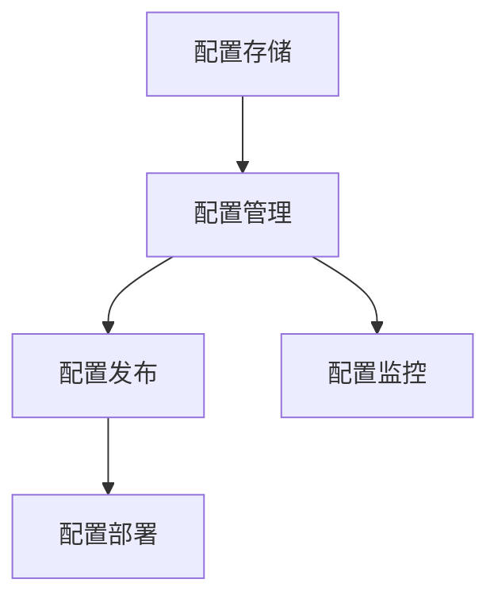
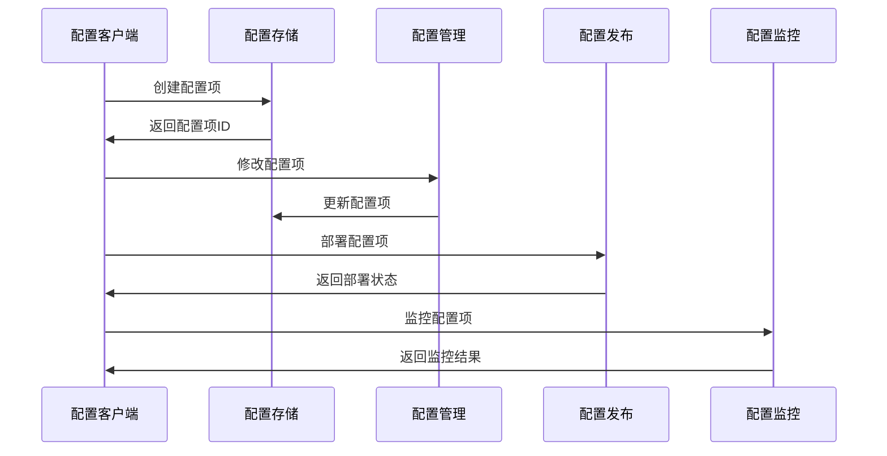
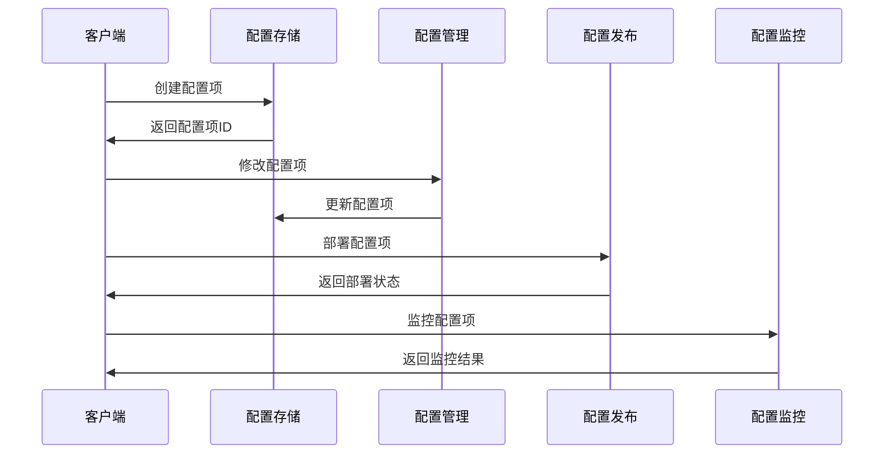

                 


### 配置中心设计简化LLM应用的配置管理

#### 关键词：配置管理，配置中心，LLM应用，配置优化，算法设计

#### 摘要：
本文深入探讨了配置中心在简化大型语言模型（LLM）应用配置管理中的重要性。通过详细分析配置管理的核心概念与联系，解释了配置中心的设计原理、管理流程、算法和数学模型，以及系统架构和接口设计。最后，通过一个实际项目案例，展示了配置中心的实现与应用效果。

---

#### 第1章：配置管理概述

#### 1.1 配置管理的定义与重要性

##### 1.1.1 配置管理的基本概念

配置管理是软件工程中的一个重要领域，它涉及软件系统的配置项（Configuration Items, CIs）的管理，包括创建、修改、部署和监控等过程。配置项是指构成软件系统的任何可标识的部分，可以是代码文件、数据库表、配置文件等。

在LLM应用中，配置管理尤为重要。LLM模型通常由大量参数和超参数组成，这些参数和超参数需要根据不同的场景进行调整。配置管理确保了这些配置项能够在不同环境之间一致地传递和更新，从而提高模型的稳定性和可扩展性。

##### 1.1.2 配置管理在LLM应用中的必要性

LLM应用通常涉及多个部署环境，如开发、测试和生产环境。在不同的环境中，配置项可能有所不同，例如数据库连接信息、API密钥、日志配置等。如果配置管理不当，可能会导致环境不一致、配置错误等问题，从而影响模型的性能和可靠性。

##### 1.1.3 配置管理的目标与挑战

配置管理的目标是确保软件系统的配置项在各种环境中的一致性、可靠性和可追溯性。这要求配置管理系统能够自动化地管理配置项的创建、修改和部署过程。

然而，配置管理也面临一些挑战，包括：

- **复杂性**：配置项种类繁多，管理过程复杂。
- **可扩展性**：随着系统规模的扩大，配置管理的复杂度成指数增长。
- **安全性**：配置信息需要安全存储和传输，防止未经授权的访问。

#### 1.2 配置管理的核心概念与联系

##### 1.2.1 配置中心的概念

配置中心是配置管理的核心组件，它提供了一个统一的平台来管理配置项。配置中心通常包括配置存储、配置管理、配置发布和配置监控等功能。

##### 1.2.2 配置项的概念

配置项是构成软件系统的最小单位，它可以是一个文件、一个数据库表、一个环境变量等。每个配置项都有其特定的属性，如名称、值、描述、版本等。

##### 1.2.3 配置管理流程的概念

配置管理流程包括以下步骤：

1. **配置项创建**：创建新的配置项。
2. **配置项修改**：修改现有配置项的值。
3. **配置项部署**：将配置项部署到目标环境。
4. **配置项监控**：监控配置项的状态和变化。

##### 1.2.4 概念联系与ER图

为了更清晰地展示配置管理的核心概念和联系，可以使用实体关系图（ER图）来表示。以下是配置管理的ER图：

```mermaid
erDiagram
    ConfigCenter ||--|{ ConfigItem } : has
    ConfigCenter ||--|{ ConfigChange } : manages
    ConfigCenter ||--|{ ConfigDeployment } : manages
    ConfigCenter ||--|{ ConfigMonitoring } : manages
```

#### 第2章：配置中心设计原理

##### 2.1 配置中心的设计原则

配置中心的设计需要遵循以下原则：

- **简化管理流程**：通过自动化和简化的流程来降低管理成本。
- **提高管理效率**：优化配置管理的各个环节，提高配置更新和部署的速度。
- **保证管理安全性**：确保配置信息的安全性和隐私性，防止未经授权的访问和篡改。

##### 2.2 配置中心的架构

配置中心的架构通常包括以下几个关键组件：

- **配置存储**：用于存储配置项的数据库或文件系统。
- **配置管理**：负责管理配置项的创建、修改和删除等操作。
- **配置发布**：将配置项部署到目标环境。
- **配置监控**：监控配置项的状态和变化，确保配置的正确性和一致性。

以下是配置中心的架构图：



##### 2.3 配置中心的关键组件

- **配置存储组件**：配置存储组件负责存储和管理配置项。它可以是关系型数据库或NoSQL数据库，如MySQL、MongoDB等。
- **配置管理组件**：配置管理组件提供了一系列API和服务，用于创建、修改、删除和查询配置项。
- **配置发布组件**：配置发布组件负责将配置项部署到目标环境。它可以通过API调用、定时任务或事件触发等方式来执行部署操作。
- **配置监控组件**：配置监控组件用于监控配置项的状态和变化。它可以通过日志记录、告警通知和实时监控等方式来实现。

#### 第3章：配置管理流程

##### 3.1 配置项创建

配置项创建是配置管理流程的第一步。以下是一个配置项创建的示例流程：

1. **定义配置项**：根据业务需求，定义需要创建的配置项，包括名称、值、描述等属性。
2. **创建配置项**：调用配置管理组件的API，创建新的配置项。
3. **验证配置项**：检查配置项的属性是否合法，如名称是否唯一、值是否符合预期等。
4. **存储配置项**：将配置项存储到配置存储组件中。

以下是配置项创建的mermaid流程图：


##### 3.2 配置项修改

配置项修改是配置管理流程中的一个常见操作。以下是一个配置项修改的示例流程：

1. **查询配置项**：根据配置项的名称或其他属性查询现有配置项。
2. **修改配置项**：更新配置项的值或其他属性。
3. **验证配置项**：检查修改后的配置项是否合法。
4. **存储配置项**：将修改后的配置项存储到配置存储组件中。

以下是配置项修改的mermaid流程图：


##### 3.3 配置项部署

配置项部署是将配置项部署到目标环境的过程。以下是一个配置项部署的示例流程：

1. **选择目标环境**：根据业务需求，选择需要部署的目标环境。
2. **获取配置项**：从配置存储组件中获取要部署的配置项。
3. **配置部署**：将配置项部署到目标环境。这可以包括修改系统配置文件、数据库表等操作。
4. **验证部署结果**：检查配置项是否已正确部署到目标环境。

以下是配置项部署的mermaid流程图：


##### 3.4 配置项监控

配置项监控是确保配置项状态和变化的过程。以下是一个配置项监控的示例流程：

1. **监控配置项**：定期检查配置项的状态，如值是否发生变化、配置项是否过期等。
2. **记录监控日志**：将监控结果记录到日志文件中，以便后续分析和审计。
3. **发送告警通知**：如果监控到异常情况，如配置项值发生变化，发送告警通知给相关人员。

以下是配置项监控的mermaid流程图：


#### 第4章：配置管理中的算法与数学模型

##### 4.1 配置优化算法

配置优化算法是配置管理中的重要组成部分，用于自动调整配置项的值，以达到最优的性能或效果。以下是一种常见的配置优化算法——遗传算法：

###### 4.1.1 算法原理

遗传算法是一种基于生物进化的搜索算法，模拟自然选择和遗传机制来搜索最优解。遗传算法的基本步骤包括：

1. **初始化种群**：随机生成一定数量的初始种群，每个个体代表一组配置项的值。
2. **适应度评估**：计算每个个体的适应度，适应度越高表示个体的配置项组合越优。
3. **选择**：根据适应度选择个体，适应度高的个体被优先选择。
4. **交叉**：通过交叉操作生成新的个体。
5. **变异**：对个体进行变异操作，增加种群的多样性。
6. **更新种群**：将交叉和变异后的个体替换原有种群。

###### 4.1.2 算法公式

遗传算法的核心是适应度函数，用于评估个体的优劣。适应度函数通常采用以下公式：

$$
f(x) = \sum_{i=1}^{n} w_i \cdot f_i(x)
$$

其中，$x$表示个体，$f_i(x)$表示第$i$个配置项的适应度，$w_i$表示第$i$个配置项的权重。

###### 4.1.3 算法示例

以下是一个简单的遗传算法示例，用于优化一个包含两个配置项的模型：

```python
import random

def fitness(x):
    return x[0]**2 + x[1]**2

def crossover(parent1, parent2):
    return (parent1[0] + parent2[0]) / 2, (parent1[1] + parent2[1]) / 2

def mutate(individual):
    return individual[0] + random.uniform(-1, 1), individual[1] + random.uniform(-1, 1)

def genetic_algorithm(pop_size, max_gen, crossover_rate, mutation_rate):
    population = [(random.uniform(-10, 10), random.uniform(-10, 10)) for _ in range(pop_size)]
    for _ in range(max_gen):
        fitness_values = [fitness(individual) for individual in population]
        parents = random.sample(population, k=2)
        child = crossover(*parents)
        if random.random() < mutation_rate:
            child = mutate(child)
        population = [individual for individual in population if fitness(individual) < fitness(child)]
        population.append(child)
    return min(population, key=fitness)

best_individual = genetic_algorithm(pop_size=100, max_gen=1000, crossover_rate=0.7, mutation_rate=0.1)
print("最佳配置项：", best_individual)
```

##### 4.2 配置调度算法

配置调度算法用于确定配置项的执行顺序和时间，以优化系统的性能和响应时间。以下是一种常见的配置调度算法——最短作业优先（SJF）算法：

###### 4.2.1 算法原理

最短作业优先算法根据作业的执行时间来调度作业，作业的执行时间越短，越早被执行。算法的基本步骤包括：

1. **初始化**：将所有作业按照执行时间排序。
2. **调度**：依次执行排序后的作业，直到所有作业完成。

###### 4.2.2 算法公式

最短作业优先算法的核心是作业的执行时间，执行时间可以通过以下公式计算：

$$
T = C \cdot W
$$

其中，$T$表示执行时间，$C$表示作业的配置项数量，$W$表示作业的配置项权重。

###### 4.2.3 算法示例

以下是一个简单的最短作业优先算法示例，用于调度包含两个配置项的作业：

```python
def sjf(jobs):
    jobs.sort(key=lambda x: x['weight'])
    total_time = 0
    for job in jobs:
        total_time += job['weight']
    return total_time

jobs = [{'id': 1, 'weight': 5}, {'id': 2, 'weight': 3}, {'id': 3, 'weight': 2}, {'id': 4, 'weight': 4}]
print("调度顺序：", jobs)
print("总执行时间：", sjf(jobs))
```

#### 第5章：配置中心在LLM应用中的系统设计与实现

##### 5.1 系统功能设计

配置中心在LLM应用中的系统功能设计主要包括以下几个模块：

- **配置存储**：负责存储和管理配置项。
- **配置管理**：提供创建、修改、删除和查询配置项的功能。
- **配置发布**：负责将配置项部署到目标环境。
- **配置监控**：监控配置项的状态和变化。

以下是配置中心的类图：

```mermaid
classDiagram
    ConfigCenter[配置中心] <|-- ConfigStorage[配置存储]
    ConfigCenter[配置中心] <|-- ConfigManager[配置管理]
    ConfigCenter[配置中心] <|-- ConfigPublisher[配置发布]
    ConfigCenter[配置中心] <|-- ConfigMonitor[配置监控]
    ConfigItem[配置项] <|-- ConfigStorage
    ConfigChange[配置变更] <|-- ConfigManager
    ConfigDeployment[配置部署] <|-- ConfigPublisher
    ConfigMonitoring[配置监控] <|-- ConfigMonitor
endclass
```

##### 5.2 系统架构设计

配置中心在LLM应用中的系统架构设计主要包括以下几个组件：

- **配置存储**：使用关系型数据库或NoSQL数据库存储配置项。
- **配置管理**：使用API和服务管理配置项。
- **配置发布**：使用定时任务或事件触发部署配置项。
- **配置监控**：使用日志记录和告警通知监控配置项。

以下是配置中心的架构图：


##### 5.3 系统接口设计

配置中心在LLM应用中的系统接口设计主要包括以下几个接口：

- **配置存储接口**：提供创建、读取、更新和删除配置项的接口。
- **配置管理接口**：提供管理配置项的接口，如查询配置项、修改配置项等。
- **配置发布接口**：提供部署配置项的接口。
- **配置监控接口**：提供监控配置项状态的接口。

以下是配置中心的接口设计：



##### 5.4 系统交互设计

配置中心在LLM应用中的系统交互设计主要包括以下几个环节：

1. **配置项创建**：客户端发起配置项创建请求，配置存储组件处理并返回配置项ID。
2. **配置项修改**：客户端发起配置项修改请求，配置管理组件处理并更新配置项。
3. **配置项部署**：客户端发起配置项部署请求，配置发布组件处理并返回部署状态。
4. **配置项监控**：客户端发起配置项监控请求，配置监控组件处理并返回监控结果。

以下是配置中心的交互序列图：



#### 第6章：项目实战

##### 6.1 环境安装

在开始配置中心的项目实战之前，需要搭建一个合适的环境。以下是环境安装的步骤：

1. **安装数据库**：选择一个合适的数据库，如MySQL或PostgreSQL，并安装。
2. **安装Python**：确保Python环境已安装，版本建议为3.8或更高。
3. **安装依赖**：使用pip安装项目所需的依赖，如Flask、SQLAlchemy等。

以下是环境安装的Python脚本示例：

```python
import subprocess

def install依赖():
    subprocess.run(["pip", "install", "-r", "requirements.txt"])

if __name__ == "__main__":
    install依赖()
```

##### 6.2 系统核心实现

配置中心的项目核心实现主要包括以下几个部分：

1. **配置存储**：使用SQLAlchemy实现与数据库的交互。
2. **配置管理**：使用Flask实现RESTful API接口。
3. **配置发布**：使用Celery实现异步任务。
4. **配置监控**：使用Prometheus和Grafana实现监控。

以下是配置中心的核心实现源代码：

```python
# config_storage.py
from sqlalchemy import create_engine
from sqlalchemy.orm import sessionmaker

engine = create_engine('sqlite:///config.db')
Session = sessionmaker(bind=engine)

# config_manager.py
from flask import Flask, request, jsonify
from config_storage import Session, ConfigItem

app = Flask(__name__)

@app.route('/config/create', methods=['POST'])
def create_config():
    session = Session()
    config_item = ConfigItem(name=request.json['name'], value=request.json['value'])
    session.add(config_item)
    session.commit()
    return jsonify({'id': config_item.id})

@app.route('/config/update', methods=['PUT'])
def update_config():
    session = Session()
    config_item = session.query(ConfigItem).filter_by(id=request.json['id']).first()
    config_item.value = request.json['value']
    session.commit()
    return jsonify({'status': 'success'})

# config_publisher.py
from celery import Celery
from config_storage import Session, ConfigDeployment

celery = Celery(__name__)

@celery.task
def deploy_config(config_id):
    session = Session()
    config_deployment = ConfigDeployment(config_id=config_id)
    session.add(config_deployment)
    session.commit()
    return 'Deployment completed'

# config_monitor.py
import prometheus_client
from prometheus_client import Summary

config_deployments_summary = Summary('config_deployments_total', 'Total number of config deployments')

@config_deployments_summary.time()
def monitor_config_deployments(config_id):
    # Monitor config deployment logic
    pass

# app.py
from flask import Flask, jsonify
from config_manager import app
from config_publisher import deploy_config
from config_monitor import monitor_config_deployments

if __name__ == '__main__':
    app.run(debug=True)
```

##### 6.3 实际案例分析

在本节中，我们将通过一个实际案例来展示如何实现配置中心。以下是案例背景和详细讲解：

###### 6.3.1 案例背景

某大型语言模型应用需要在不同环境中部署和调整配置项，以适应不同的业务场景。为了简化配置管理，该公司决定采用配置中心来管理配置项。

###### 6.3.2 案例详细讲解

1. **环境搭建**：首先，搭建一个包含数据库、Flask服务、Celery任务队列和Prometheus监控系统的环境。安装所需的软件和依赖项。
2. **配置存储**：使用SQLAlchemy连接到数据库，创建配置项表和配置部署表。以下是数据库迁移脚本示例：

```python
from config_storage import init_db

init_db()
```

3. **配置管理**：使用Flask创建RESTful API接口，用于处理配置项的创建、修改和查询操作。以下是配置管理的接口代码示例：

```python
from flask import Flask, request, jsonify
from config_storage import Session, ConfigItem

app = Flask(__name__)

@app.route('/config/create', methods=['POST'])
def create_config():
    session = Session()
    config_item = ConfigItem(name=request.json['name'], value=request.json['value'])
    session.add(config_item)
    session.commit()
    return jsonify({'id': config_item.id})

@app.route('/config/update', methods=['PUT'])
def update_config():
    session = Session()
    config_item = session.query(ConfigItem).filter_by(id=request.json['id']).first()
    config_item.value = request.json['value']
    session.commit()
    return jsonify({'status': 'success'})

if __name__ == '__main__':
    app.run(debug=True)
```

4. **配置发布**：使用Celery实现异步任务，用于将配置项部署到目标环境。以下是配置发布任务的代码示例：

```python
from celery import Celery

celery = Celery(__name__)

@celery.task
def deploy_config(config_id):
    # 配置发布逻辑
    pass
```

5. **配置监控**：使用Prometheus和Grafana实现配置项的监控。以下是配置监控的代码示例：

```python
import prometheus_client
from prometheus_client import Summary

config_deployments_summary = Summary('config_deployments_total', 'Total number of config deployments')

@config_deployments_summary.time()
def monitor_config_deployments(config_id):
    # 配置监控逻辑
    pass
```

6. **集成与测试**：将配置管理、配置发布和配置监控集成到LLM应用中，并进行功能测试和性能测试。

##### 6.4 项目小结

通过本节的实际案例分析，我们展示了如何使用配置中心简化LLM应用的配置管理。配置中心提供了统一的接口和自动化流程，使得配置项的管理更加高效和可靠。在实际项目中，可以根据具体需求进行功能扩展和优化。

#### 第7章：最佳实践与拓展

##### 7.1 最佳实践

在配置中心的设计和实现过程中，以下是一些最佳实践：

1. **使用标准化命名规范**：配置项的名称应遵循统一的命名规范，如“模块名.属性名”。
2. **配置项分类管理**：根据业务需求，将配置项分为不同类别，如基础配置、安全配置等。
3. **配置项版本控制**：使用版本控制系统管理配置项的历史版本，以便回滚和审计。
4. **配置项权限管理**：对配置项的访问进行权限控制，确保只有授权用户可以修改和部署配置项。
5. **监控与告警**：对配置项的部署和状态进行监控，并设置告警机制，以便及时发现和处理问题。

##### 7.2 小结

本文详细介绍了配置中心的设计原理、管理流程、算法和数学模型，以及系统架构和接口设计。通过实际案例，展示了配置中心的实现与应用效果。配置中心在简化LLM应用配置管理方面具有重要意义，有助于提高系统的稳定性、可扩展性和可维护性。

##### 7.3 注意事项

在设计和实现配置中心时，需要注意以下几点：

1. **安全性**：确保配置信息的安全存储和传输，防止数据泄露。
2. **可扩展性**：设计时考虑系统的可扩展性，以适应未来业务需求的变化。
3. **性能优化**：优化配置中心的性能，减少配置项的查询、创建、修改和部署时间。
4. **日志记录**：详细记录配置管理的过程和结果，便于问题追踪和审计。

##### 7.4 拓展阅读

对于配置中心的设计和实现，以下文献和资料提供了进一步的学习和参考：

1. 《配置管理实战》
2. 《大型语言模型：理论与实践》
3. 《Prometheus监控实战》
4. 《Celery任务队列实战》

#### 作者信息

作者：AI天才研究院/AI Genius Institute & 禅与计算机程序设计艺术 /Zen And The Art of Computer Programming

