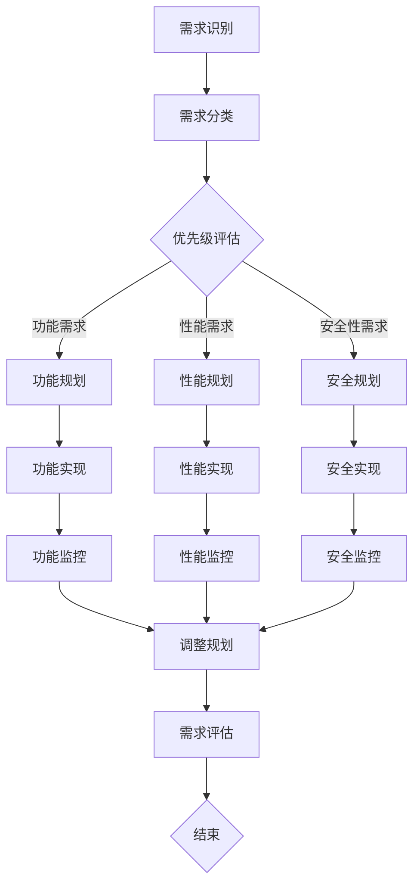
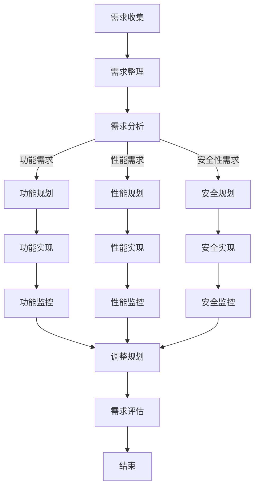

                 

### 引言

#### 书籍目的与重要性

《重塑LLM应用开发的需求管理流程》旨在为LLM（大型语言模型）应用开发提供一套系统化、高效的需求管理方法。在当前技术迅猛发展的时代，LLM技术已经逐渐成为人工智能领域的核心驱动力，其在自然语言处理、文本生成、智能客服等多个领域展现了强大的应用潜力。然而，随着LLM应用复杂性的增加，如何有效管理需求，确保项目按时、按质完成，成为开发者面临的一大挑战。

本书的核心目的是通过深入分析LLM应用开发的需求管理现状，提出一种新的需求管理流程，从而提高开发效率和项目成功率。我们希望，通过这本书的阅读，开发者能够掌握以下关键技能：

1. **理解LLM技术的核心概念与特点**：包括其工作原理、优势和应用场景。
2. **掌握需求管理的最佳实践**：从需求收集、分析、规划到实现，提供一整套流程和方法。
3. **运用数学模型与算法原理**：通过Python代码示例，深入理解需求管理的算法原理。
4. **设计系统架构与接口**：了解系统分析与架构设计的方法，确保系统的高效性与稳定性。
5. **进行项目实战**：通过实际案例，展示需求管理流程在项目中的应用。

本书不仅适合从事LLM应用开发的工程师和研究者，也适用于对人工智能技术有兴趣的广大读者。通过这本书，读者将能够从理论到实践全面掌握LLM应用开发的需求管理方法，为未来的技术研究和项目实践打下坚实基础。

#### LLM应用开发的现状

近年来，LLM技术在人工智能领域取得了显著的进展。从最初的GPT到如今的大型预训练模型如ChatGPT、BERT等，LLM已经在文本生成、机器翻译、问答系统等方面展示了强大的能力。这些模型通过对海量文本数据的学习，能够生成高质量的自然语言文本，极大地提升了人机交互的智能化水平。

在应用层面，LLM技术已经渗透到多个领域，包括但不限于：

1. **智能客服**：利用LLM技术，可以构建能够实现自然语言理解和回答的智能客服系统，提高客户服务效率和用户体验。
2. **内容生成**：LLM技术可以用于生成文章、新闻、产品描述等，大幅度降低了内容创作的难度和时间成本。
3. **教育辅助**：通过LLM技术，可以实现智能教育辅导系统，为学生提供个性化的学习资源和解答疑问。
4. **医疗诊断**：LLM技术可以辅助医生分析病历、理解医学术语，提供诊断建议，提高医疗服务的准确性。

然而，随着LLM应用场景的扩大和复杂度增加，开发者面临的需求管理问题也日益突出。传统的需求管理方法往往难以应对LLM项目中的高不确定性和复杂性，导致项目进度延误、质量不稳定等问题。因此，重塑LLM应用开发的需求管理流程，成为当前研究的热点和实践的重点。

本书正是在这一背景下编写，通过系统阐述LLM应用开发的需求管理流程，旨在为开发者提供一套科学、高效的需求管理方法论，帮助他们在复杂的项目中取得成功。

#### 本书结构安排

本书《重塑LLM应用开发的需求管理流程》共分为八个章节，具体结构安排如下：

**第1章：背景介绍**

本章将详细介绍LLM应用开发的需求管理现状，阐述本书的目的和重要性。首先，我们将分析LLM技术在各个领域的应用及其带来的挑战。接着，描述当前需求管理中存在的痛点和问题，引出本书的研究目标和解决的问题。本章还将定义相关概念和术语，为后续章节的讨论打下基础。

**第2章：核心概念与联系**

本章将重点介绍LLM的基本概念和需求管理的核心概念。我们将详细讲解LLM的定义、特点、工作原理以及其在自然语言处理中的应用。同时，还将讨论需求管理的定义、分类及其在项目开发中的重要性。通过核心概念与联系的分析，帮助读者理解LLM与需求管理之间的紧密关系。

**第3章：需求管理流程**

本章将详细介绍LLM应用开发的需求管理流程。我们将从需求收集、需求分析、需求规划、需求实现和需求管理评估五个方面展开讨论。每个环节都将详细阐述其步骤、方法和工具，提供实际操作指导。通过这一章的学习，读者将掌握一套完整的需求管理流程。

**第4章：算法原理讲解**

本章将深入讲解需求管理的算法原理。我们将使用mermaid流程图和Python源代码，逐步阐述算法的实现过程。此外，还将介绍算法的数学模型和公式，并通过实际案例进行说明，帮助读者深入理解算法的核心逻辑。

**第5章：数学模型和公式讲解**

本章将详细讲解需求管理中常用的数学模型和公式。通过具体的例子，我们将演示如何将这些数学模型应用于实际项目中，提高需求管理的精确性和效率。同时，还将讨论这些模型在实际应用中的优势和局限性。

**第6章：系统分析与架构设计方案**

本章将介绍系统分析与架构设计的方法。我们将通过具体的案例，展示如何进行系统功能设计、架构设计和接口设计。使用mermaid类图和架构图，我们将清晰地描述系统的整体结构和各个模块之间的关系。

**第7章：项目实战**

本章将通过一个实际项目，展示需求管理流程在项目中的应用。我们将详细介绍项目的环境安装、系统实现、代码解读和案例分析。通过实际操作和案例分析，读者将能够更好地理解需求管理流程在实际项目中的运用。

**第8章：总结与展望**

本章将对全书内容进行总结，回顾本书的核心观点和关键知识点。同时，还将探讨未来的研究方向和需求管理流程的改进方向。通过本章的内容，读者将能够对LLM应用开发的需求管理有一个全面和深入的认识。

通过以上八个章节的详细阐述，本书旨在为读者提供一套全面、实用的需求管理方法，帮助他们在LLM应用开发中取得成功。

### 第1章：背景介绍

#### 1.1 问题背景

随着人工智能技术的不断进步，LLM（大型语言模型）已经成为自然语言处理领域的重要工具。LLM通过深度学习算法，在大量文本数据上预训练，从而具备强大的语言理解和生成能力。这种技术不仅在学术研究中取得了显著成果，还在实际应用中展现出巨大的潜力，如智能客服、内容生成、教育辅助和医疗诊断等领域。

然而，LLM应用开发过程中，需求管理成为了一个亟待解决的重要问题。在传统软件开发中，需求管理通常依赖于明确的需求文档、项目计划和严格的变更控制。然而，LLM项目由于其高度的不确定性和复杂性，传统的需求管理方法往往难以奏效。主要问题包括：

1. **需求变更频繁**：由于LLM模型的强大自适应能力，开发过程中常常需要根据用户反馈和实际应用效果不断调整模型参数和功能，导致需求频繁变更。
2. **技术难度大**：LLM开发涉及深度学习、自然语言处理等多个技术领域，对开发者的技术水平要求较高。技术难度大使得需求管理中的沟通协调变得更加复杂。
3. **模型评估标准不明确**：LLM模型的性能评估缺乏统一的标准化方法，开发者在评估模型效果时存在主观性和不确定性，这进一步增加了需求管理的难度。
4. **项目管理挑战**：LLM项目通常周期较长、资源需求大，传统的项目管理方法难以应对这种复杂项目带来的挑战。

因此，当前LLM应用开发中的需求管理面临诸多挑战，亟需一种更加科学、高效的需求管理流程来应对这些挑战，提高项目的成功率。

#### 1.2 问题描述

在LLM应用开发中，需求管理的问题主要表现在以下几个方面：

1. **需求收集困难**：由于LLM技术的高度复杂性，用户对功能需求的描述往往不够明确，或者对潜在需求理解不足，导致需求收集过程存在困难。
2. **需求分析不准确**：需求分析阶段需要深入理解用户需求，但LLM应用的特殊性使得需求分析过程复杂且容易出错，可能导致需求规格不准确。
3. **需求变更频繁**：LLM项目在开发过程中，常常需要根据用户反馈和实验结果对模型进行调整，这导致需求频繁变更，使得项目进度难以控制。
4. **沟通协调不畅**：由于LLM项目涉及多个技术领域，不同团队之间的沟通协调成为一个难点。技术团队和业务团队之间的需求理解不一致，可能导致项目进展受阻。
5. **性能评估困难**：LLM模型的效果评估缺乏统一的标准和方法，开发者难以准确评估模型的性能，影响需求实现的决策。
6. **项目管理困难**：LLM项目通常周期较长，资源需求大，传统的项目管理方法难以应对这种复杂项目带来的挑战，导致项目进度延误、成本超支。

这些问题的存在，使得LLM应用开发的需求管理成为一个复杂而困难的任务，亟需一套科学、高效的需求管理流程来解决。

#### 1.3 问题解决

为了解决LLM应用开发中的需求管理问题，我们需要从以下几个方面入手：

1. **明确需求管理流程**：制定一套系统化、标准化的需求管理流程，包括需求收集、需求分析、需求规划、需求实现和需求管理评估等环节。通过明确每个环节的步骤和方法，确保需求管理的有序进行。

2. **建立需求变更控制机制**：在需求变更频繁的情况下，建立一套有效的需求变更控制机制，包括变更申请、评估、审批和实施等步骤。通过严格的变更控制，确保项目进度和质量不受需求变更的影响。

3. **强化沟通协调机制**：建立高效的沟通协调机制，包括定期会议、工作汇报、信息共享等。通过有效的沟通，确保技术团队和业务团队之间的需求理解一致，提高项目协作效率。

4. **引入模型评估标准**：制定一套统一的模型评估标准和方法，包括定量和定性的评估指标。通过科学、客观的评估，确保模型性能的准确评估，为需求实现提供决策依据。

5. **优化项目管理方法**：采用先进的项目管理方法，如敏捷开发、迭代开发等，以适应LLM项目的高复杂性和不确定性。通过灵活的项目管理，确保项目进度、质量和成本的有效控制。

6. **提升团队技术水平**：通过培训和技术交流，提升团队在LLM开发领域的专业能力，减少需求分析中的错误和误解，提高项目成功率。

通过以上措施，我们可以建立一套科学、高效的需求管理流程，解决LLM应用开发中的需求管理问题，提高项目的成功率和开发效率。

#### 1.4 边界与外延

在探讨LLM应用开发的需求管理时，明确边界与外延至关重要，以确保研究的深度和广度。以下是对LLM应用开发需求管理流程的边界与外延的详细说明：

**边界**

1. **技术范围**：本书主要关注基于大型语言模型（LLM）的应用开发需求管理流程。这包括自然语言处理、文本生成、智能客服等领域的应用。具体技术如GPT、BERT等LLM模型的开发和应用场景都在讨论范围之内。

2. **管理范围**：需求管理流程的边界包括从需求收集到需求实现的全过程。这涵盖了需求分析、需求规划、需求变更控制和需求管理评估等各个环节。流程的目标是确保LLM项目能够高效、有序地进行，满足用户需求。

3. **项目范围**：本书针对的是典型的LLM应用开发项目，这些项目通常涉及跨学科合作、高技术难度和较长的开发周期。主要关注点是项目中的需求管理问题，而非其他项目管理或技术实现方面。

**外延**

1. **跨领域应用**：虽然本书的核心集中在自然语言处理领域，但LLM技术具有广泛的跨领域应用潜力。例如，在金融、医疗、教育等领域的应用同样需要有效的需求管理流程。虽然具体应用场景有所不同，但本书中的需求管理原则和方法可以提供有益的参考。

2. **其他人工智能技术**：虽然本书主要讨论LLM应用开发的需求管理，但许多需求管理原则和方法同样适用于其他人工智能技术，如计算机视觉、语音识别等。这些技术的需求管理流程也可以借鉴本书中的方法论。

3. **方法扩展**：本书中的需求管理流程不仅适用于传统的软件工程项目，还可以应用于新兴的云计算、大数据、物联网等领域的应用开发。在这些领域，需求管理流程的灵活性和适应性将得到进一步验证和优化。

通过明确边界与外延，本书为LLM应用开发的需求管理提供了一个系统的理论框架，同时也为未来研究提供了扩展方向。这有助于在更广泛的背景下理解和应用需求管理流程，提高LLM项目的开发效率和成功率。

#### 1.5 概念结构与核心要素组成

为了深入探讨LLM应用开发的需求管理流程，我们需要首先明确相关概念和术语，并分析其组成结构。以下是LLM应用开发需求管理的核心概念和组成要素：

**核心概念**：

1. **LLM（大型语言模型）**：一种通过深度学习算法在大量文本数据上预训练得到的语言模型，能够对自然语言文本进行理解和生成。
2. **需求管理**：确保项目能够满足用户需求的一系列管理活动，包括需求收集、需求分析、需求规划、需求实现和需求评估等。
3. **需求**：用户或客户对系统功能、性能、界面等方面的期望和需求。
4. **需求变更**：在项目开发过程中，由于各种原因对已有需求进行修改或添加。
5. **需求文档**：详细记录需求收集、分析、规划和实现的文档，是需求管理的核心依据。

**核心要素组成**：

1. **需求收集**：收集用户的需求是需求管理的起点。主要方法包括访谈、问卷调查、用户观察等。需求收集的过程需要确保信息的完整性和准确性。
2. **需求分析**：对收集到的需求进行整理、分类和分析，明确需求的优先级、实现难度和资源需求。需求分析的结果是需求文档的核心内容。
3. **需求规划**：根据需求分析的结果，制定项目计划，包括任务分配、时间安排和资源调配。需求规划需要综合考虑项目的目标、约束和优先级。
4. **需求实现**：将需求转化为实际的功能和性能，通过开发、测试和部署等环节实现。需求实现过程中需要确保需求的一致性和准确性。
5. **需求评估**：对已实现的需求进行评估，检查是否满足用户需求和项目目标。需求评估可以通过用户反馈、测试数据和性能指标等多种方式进行。

这些概念和要素组成了LLM应用开发需求管理的核心框架。通过明确这些概念和要素，我们可以系统地理解和应对需求管理中的各种挑战，提高项目的成功率和开发效率。

### 第2章：核心概念与联系

#### 2.1 LLM的基本概念

**2.1.1 LLM的定义**

大型语言模型（Large Language Model，简称LLM）是一种基于深度学习技术的自然语言处理模型，通过对海量文本数据进行预训练，使其能够理解和生成自然语言。LLM的核心目标是实现高度自然的语言理解和生成，从而在多个领域如文本生成、机器翻译、问答系统和智能客服等展现其强大的应用潜力。

**2.1.2 LLM的特点**

1. **强大的语言理解能力**：LLM能够从大量的文本数据中学习到丰富的语言知识，从而具备强大的语言理解能力，能够准确理解用户输入的语义和意图。
2. **自适应性强**：LLM能够根据不同的应用场景和用户需求进行自适应调整，从而提高其在特定场景下的表现。
3. **生成能力强**：LLM不仅能够理解语言，还能根据输入生成高质量的自然语言文本，从而实现文本自动生成、内容创作等功能。
4. **高计算复杂性**：由于LLM模型通常非常庞大，包含数十亿甚至千亿个参数，因此其计算复杂度较高，需要强大的计算资源和优化算法。

**2.1.3 LLM的工作原理**

LLM的工作原理主要包括两个步骤：预训练和微调。

1. **预训练**：预训练阶段，LLM通过在大规模文本数据上训练，学习到文本的统计规律和语义信息。这一阶段通常使用无监督学习的方法，如自回归语言模型（如GPT系列）或双向编码表示（如BERT）。
2. **微调**：在预训练完成后，LLM会根据具体任务进行微调，即在小规模有标签数据上调整模型参数，使其在特定任务上表现出更好的性能。微调通常使用有监督学习的方法。

**2.1.4 LLM的应用领域**

1. **文本生成**：LLM可以生成高质量的文本，包括文章、新闻、产品描述等，极大地降低了内容创作的成本和时间。
2. **机器翻译**：LLM在机器翻译领域具有很高的准确性和流畅性，能够实现跨语言的高质量文本翻译。
3. **问答系统**：LLM可以用于构建智能问答系统，通过理解用户提问，生成准确的回答。
4. **智能客服**：LLM可以用于智能客服系统，通过理解用户问题和提供个性化的服务，提高客户满意度。
5. **情感分析**：LLM能够对文本情感进行分类和识别，应用于情感分析、市场调研等领域。

#### 2.2 LLM与其他技术的对比

**2.2.1 与传统机器学习对比**

1. **数据依赖性**：传统机器学习模型通常依赖于大量标注数据，而LLM则主要通过无监督预训练学习到语言知识，对数据依赖性较低。
2. **模型规模**：传统机器学习模型通常较小，而LLM模型规模庞大，包含数十亿个参数，因此计算资源需求更高。
3. **泛化能力**：LLM由于预训练阶段学习到丰富的语言知识，具有更强的泛化能力，能够在多个任务上表现优异，而传统机器学习模型通常需要针对特定任务进行定制化设计。
4. **训练时间**：LLM的训练时间通常较长，需要大量的计算资源和时间，而传统机器学习模型训练时间较短。

**2.2.2 与深度学习对比**

1. **任务多样性**：深度学习模型通常针对特定任务进行设计，而LLM则具有更广泛的适用性，能够在多个自然语言处理任务上应用。
2. **数据需求**：深度学习模型通常需要大量标注数据进行训练，而LLM主要通过无监督预训练学习到语言知识，对数据需求相对较低。
3. **计算资源**：由于LLM模型规模庞大，计算资源需求更高，而深度学习模型在计算资源有限的情况下，通常可以通过模型压缩和优化来降低计算需求。
4. **性能提升**：LLM通过预训练学习到丰富的语言知识，能够显著提升模型在自然语言处理任务上的性能，而传统深度学习模型则需要针对特定任务进行优化。

#### 2.3 需求管理的核心概念

**2.3.1 需求的定义**

需求是指用户或客户对系统功能、性能、界面等方面的期望和需求。在LLM应用开发中，需求可以是用户对文本生成、机器翻译、问答系统等功能的需求，也可以是对模型性能和用户体验的期望。

**2.3.2 需求的分类**

1. **功能需求**：用户对系统功能的具体描述，如文本生成、机器翻译等。
2. **非功能需求**：用户对系统性能、可用性、安全性等方面的要求，如响应时间、可靠性、用户界面友好性等。
3. **优先级需求**：根据需求的紧急程度和重要性对需求进行排序，以指导资源分配和开发计划。

**2.3.3 需求管理的定义**

需求管理是指确保项目能够满足用户需求的一系列管理活动，包括需求收集、需求分析、需求规划、需求实现和需求评估等。需求管理的目标是确保项目按时、按质、按预算完成，同时满足用户需求。

**2.3.4 需求管理的步骤**

1. **需求收集**：通过访谈、问卷调查、用户观察等方式收集用户需求。
2. **需求分析**：对收集到的需求进行整理、分类和分析，明确需求的优先级和实现难度。
3. **需求规划**：根据需求分析的结果，制定项目计划，包括任务分配、时间安排和资源调配。
4. **需求实现**：将需求转化为实际的功能和性能，通过开发、测试和部署等环节实现。
5. **需求评估**：对已实现的需求进行评估，检查是否满足用户需求和项目目标。

#### 2.4 LLM与需求管理的联系

**2.4.1 LLM在需求管理中的应用**

LLM在需求管理中可以发挥重要作用，主要体现在以下几个方面：

1. **文本分析**：LLM可以用于对用户的需求描述进行文本分析，提取关键信息，帮助需求收集和分析过程更加高效。
2. **需求预测**：通过学习大量用户需求，LLM可以预测未来可能的需求趋势，为需求规划提供数据支持。
3. **需求生成**：LLM可以生成新的需求描述，帮助开发团队理解用户需求，特别是在需求不明确或缺失的情况下。

**2.4.2 需求管理对LLM的影响**

需求管理对LLM的影响主要体现在以下几个方面：

1. **需求引导**：需求管理可以指导LLM的开发方向，确保模型的功能和性能符合用户需求。
2. **变更控制**：需求管理中的变更控制机制可以确保LLM在需求变更时能够灵活调整，保持模型的一致性和稳定性。
3. **性能优化**：通过需求管理中的性能评估，可以为LLM的优化提供数据支持，提高模型在特定任务上的表现。

通过LLM与需求管理的紧密联系，我们可以构建一个高效的需求管理流程，提高LLM应用开发的成功率和用户体验。这一章节为我们提供了深入理解LLM和需求管理之间关系的基础，为后续章节的详细探讨奠定了坚实的基础。

### 第3章：需求管理流程

#### 3.1 需求收集

需求收集是需求管理的起点，它直接关系到后续需求分析的质量和准确性。在LLM应用开发中，需求收集的过程尤为重要，因为LLM技术的复杂性和不确定性要求我们对用户需求有更深入的理解。

**3.1.1 收集需求的来源**

1. **用户访谈**：通过与用户进行面对面的访谈，可以直接获取用户对系统功能、性能和用户体验的期望。用户访谈的优点是能够深入了解用户的需求和痛点，但缺点是耗时较长且对访谈者的沟通能力有较高要求。
2. **问卷调查**：通过设计问卷调查，可以快速收集大量用户的需求信息。问卷调查的优点是覆盖面广，收集数据效率高，但缺点是可能存在用户回答不真实或不够详细的问题。
3. **用户观察**：通过观察用户在现有系统上的操作行为，可以捕捉到用户未明确表达的需求。用户观察的优点是能够发现隐藏的需求，但缺点是可能缺乏用户反馈的深入性。
4. **竞争分析**：通过分析竞争对手的产品和服务，了解用户在其他产品上的需求，从而为自身产品提供借鉴。竞争分析的优点是能够发现潜在的市场需求，但缺点是可能存在信息偏差。

**3.1.2 收集需求的方法**

1. **访谈法**：设计结构化和半结构化的访谈问题，通过与用户进行深入交流，获取详细的需求信息。访谈过程中，访谈者需要做好笔记，并在访谈结束后整理成文档。
2. **问卷调查法**：设计问卷时，应确保问题简洁明了，避免复杂和冗长的描述。问卷可以通过线上平台或纸质问卷形式发放，收集用户的反馈。
3. **用户观察法**：在用户实际操作系统时，观察用户的行为和操作流程，记录下用户遇到的问题和障碍。观察过程中，可以使用视频记录和现场笔记相结合的方法。
4. **市场调研法**：通过市场调研，了解目标用户群体的需求和行为模式。市场调研可以采用焦点小组、深度访谈和在线问卷等多种形式。

**3.1.3 需求收集的挑战**

1. **用户需求不明确**：用户可能对自己的需求描述不够清晰或准确，导致需求收集过程中信息缺失。
2. **需求变更频繁**：在项目开发过程中，用户需求可能会因为市场变化、技术进步或内部调整等原因频繁变更，给需求管理带来挑战。
3. **数据质量**：不同收集方法可能带来不同的数据质量，例如用户访谈可能得到更详细的信息，但问卷调查可能得到更广泛的数据，但两者都可能存在数据真实性和完整性的问题。
4. **资源分配**：需求收集过程需要投入大量的人力、时间和资源，特别是在项目初期，资源分配可能成为一个挑战。

**3.1.4 解决方法**

1. **明确需求收集目标**：在需求收集前，明确收集需求的目标和范围，确保收集到的信息对项目开发有实际帮助。
2. **多种方法结合**：结合访谈、问卷调查、用户观察和市场调研等多种方法，以获取更全面和准确的需求信息。
3. **用户参与**：鼓励用户积极参与需求收集过程，通过用户反馈不断调整和优化需求。
4. **数据验证**：对收集到的需求信息进行验证，确保其真实性和完整性。可以通过用户验证、专家评审等方式进行验证。
5. **需求管理工具**：使用专业的需求管理工具，如JIRA、Confluence等，记录和管理需求信息，提高需求收集和管理的效率。

通过科学的需求收集方法，我们可以确保在LLM应用开发中获取全面、准确和高质量的需求信息，为后续的需求分析和规划提供坚实基础。

#### 3.2 需求分析

需求分析是需求管理的核心环节，其目标是从收集到的需求中提取出具体、明确的用户需求，为后续的需求规划、实现和评估提供依据。在LLM应用开发中，需求分析的准确性和完整性直接影响到项目的成功与否。

**3.2.1 分析需求的步骤**

1. **需求整理**：首先，对收集到的需求信息进行整理和分类，将相同或相似的需求合并，避免重复。整理的过程可以通过列表、思维导图等方式进行。
   
2. **需求筛选**：在整理完需求后，对需求进行筛选，筛选出符合项目目标和用户需求的真正需求。可以通过优先级排序、需求重要性评估等方法，筛选出对项目最关键的、最紧急的需求。

3. **需求分类**：将筛选出的需求进行分类，常见的分类方法包括功能需求、非功能需求和优先级需求。功能需求是指用户对系统功能的具体要求，如文本生成、机器翻译等；非功能需求是指用户对系统性能、安全性、用户体验等方面的要求；优先级需求是指根据需求的重要性和紧急程度对需求进行排序。

4. **需求文档编写**：根据分类后的需求，编写详细的需求文档。需求文档应包括需求的描述、优先级、实现难度和资源需求等信息，是后续需求规划、实现和评估的重要依据。

5. **需求验证**：需求文档编写完成后，需要对需求进行验证，确保需求的准确性和完整性。可以通过用户验证、专家评审等方式进行验证，确保需求符合用户实际需求和项目目标。

**3.2.2 分析需求的方法**

1. **功能需求分析**：通过功能需求分析，确定系统应实现的具体功能。常用的方法包括功能分解、用例建模等。功能分解是将大功能拆分为小功能，逐步细化；用例建模是通过用例图描述用户与系统的交互过程。

2. **非功能需求分析**：非功能需求分析主要关注系统性能、安全性、用户体验等方面的要求。可以通过性能测试、安全性评估、用户体验测试等方法进行。

3. **优先级评估**：对需求进行优先级评估，确定需求的紧急程度和重要性。可以通过关键性评估、紧急性评估等方法进行。常用的评估标准包括关键性、紧急性、资源需求等。

4. **需求验证与确认**：通过用户验证、专家评审等方式，对需求文档进行验证和确认，确保需求的准确性和完整性。

**3.2.3 需求分析工具**

1. **需求管理工具**：如JIRA、Confluence等，用于记录、管理和跟踪需求信息。
   
2. **建模工具**：如UML建模工具、Balsamiq等，用于绘制用例图、功能图等模型，帮助理解需求。

3. **测试工具**：如Selenium、JMeter等，用于对需求进行验证和确认。

**3.2.4 需求分析中的挑战**

1. **需求不明确**：用户对需求描述不够清晰或准确，导致需求分析过程中信息缺失或不一致。

2. **需求变更频繁**：项目开发过程中，用户需求可能会因市场变化、技术进步等原因频繁变更，给需求分析带来挑战。

3. **资源限制**：需求分析需要投入大量的人力、时间和资源，特别是在项目初期，资源限制可能成为一个挑战。

4. **沟通障碍**：需求分析涉及多个团队和利益相关者，沟通障碍可能导致需求理解不一致。

**3.2.5 解决方法**

1. **明确需求分析目标**：在需求分析前，明确分析的目标和方法，确保分析过程有方向和依据。

2. **多种方法结合**：结合访谈、问卷调查、用户观察等多种方法，获取全面的需求信息。

3. **用户参与**：鼓励用户积极参与需求分析过程，通过用户反馈不断调整和优化需求。

4. **需求验证**：对需求进行多次验证，确保需求的准确性和完整性。

5. **有效沟通**：建立高效的沟通机制，确保需求分析过程中各方能够及时沟通和反馈，减少误解和冲突。

通过科学、系统的需求分析方法，我们可以确保在LLM应用开发中准确、完整地理解用户需求，为后续的需求规划、实现和评估奠定坚实基础。

#### 3.3 需求规划

需求规划是需求管理的核心环节之一，其主要目标是通过合理的资源分配和时间安排，确保项目能够按时、按质完成，满足用户需求。在LLM应用开发中，需求规划的重要性尤为突出，因为LLM项目的复杂性和不确定性对资源管理和时间规划提出了更高的要求。

**3.3.1 规划需求的目标**

1. **满足用户需求**：确保项目开发的目标与用户需求一致，通过合理的规划和资源分配，实现用户期望的功能和性能。
2. **优化资源利用**：在需求规划过程中，要充分考虑项目资源（如人力、时间、预算等）的分配，最大化资源利用效率，降低成本。
3. **提高项目成功率**：通过科学的需求规划，确保项目在预定时间内完成，降低项目延误和超支的风险，提高项目成功率。

**3.3.2 规划需求的过程**

1. **需求梳理**：在需求分析阶段，我们已经收集和整理了用户需求。需求规划的第一步是重新梳理这些需求，确保其准确、完整和一致。梳理过程中，可以通过分类、排序等方法，将需求进一步细化和明确。

2. **资源评估**：根据项目规模和需求特点，评估项目所需的各类资源，包括人力资源、技术资源、设备资源和资金资源等。资源评估的目的是确保项目在资源分配上合理，避免资源短缺或浪费。

3. **时间安排**：在资源评估的基础上，进行项目的时间安排。时间安排应考虑以下因素：
   - **项目目标**：明确项目的总体目标，根据目标制定具体的时间节点和里程碑。
   - **需求优先级**：根据需求的紧急程度和重要性，安排需求的实现顺序和时间。
   - **资源可用性**：考虑资源的可用性，确保关键资源在关键时间点能够得到充分利用。

4. **风险评估**：在需求规划过程中，识别潜在的风险，并制定相应的应对措施。常见风险包括需求变更、资源短缺、技术难题等。通过风险评估，可以提前预防风险，确保项目顺利进行。

5. **沟通协调**：需求规划涉及多个团队和利益相关者，需要建立有效的沟通协调机制。通过定期会议、报告、信息共享等方式，确保各方对项目目标和进度有清晰的理解和共识。

6. **文档编写**：将需求规划的结果整理成文档，包括项目计划、资源分配、时间安排和风险应对措施等。文档应详细、清晰，便于各方参考和执行。

**3.3.3 需求规划的方法**

1. **工作分解结构（WBS）**：通过工作分解结构，将项目任务分解为具体的子任务，明确每个任务的负责人、资源需求和完成时间。WBS是需求规划的重要工具，有助于项目的精细化管理。

2. **甘特图**：甘特图是一种直观的项目进度管理工具，通过图表形式展示项目任务的时间安排和资源分配。甘特图可以帮助项目团队实时监控项目进度，及时调整计划。

3. **关键路径法**：关键路径法是一种项目管理方法，通过识别项目中的关键任务和路径，确定项目的最短完成时间。关键路径上的任务延迟将直接影响项目进度，因此需要特别关注。

4. **敏捷开发**：在LLM应用开发中，敏捷开发方法可以有效应对需求变更和不确定性。通过迭代开发和持续交付，确保项目能够快速响应需求变化，提高项目灵活性。

5. **项目管理软件**：使用专业的项目管理软件，如JIRA、Microsoft Project等，可以自动化需求规划和管理流程，提高效率和准确性。

**3.3.4 需求规划的挑战**

1. **需求变更**：在项目开发过程中，用户需求可能会因为市场变化、技术进步等原因频繁变更，给需求规划带来挑战。
2. **资源限制**：项目资源（如人力、时间、预算等）有限，需求规划需要在资源限制下优化资源利用，确保项目顺利完成。
3. **沟通协调**：需求规划涉及多个团队和利益相关者，沟通协调不畅可能导致需求理解不一致，影响项目进展。
4. **风险评估**：识别和应对项目风险需要全面、准确的信息，风险评估的难度较大。

**3.3.5 解决方法**

1. **需求变更控制**：建立需求变更控制机制，确保需求变更的合理性和可控性。通过严格的变更申请、评估和审批流程，减少需求变更对项目的影响。

2. **资源优化**：通过合理的资源分配和调度，最大化资源利用效率。可以采用资源池管理、资源优先级排序等方法，确保关键资源的有效利用。

3. **有效沟通**：建立高效的沟通协调机制，确保各方对项目目标和进度有清晰的理解和共识。可以通过定期会议、信息共享、反馈机制等方式，加强沟通和协调。

4. **风险评估与管理**：建立项目风险评估和管理机制，通过风险识别、评估和应对策略，确保项目能够及时应对风险，减少风险对项目的影响。

通过科学、系统的需求规划方法，我们可以确保在LLM应用开发中合理分配资源、有效管理时间，提高项目的成功率，满足用户需求。

#### 3.4 需求实现

需求实现是需求管理的核心环节之一，它将需求文档中的具体需求转化为实际的功能和性能，并通过开发、测试和部署等环节，确保需求得到准确实现。在LLM应用开发中，需求实现过程尤为关键，因为LLM技术的复杂性和不确定性对开发过程提出了更高的要求。

**3.4.1 实现需求的策略**

1. **功能优先**：在需求实现过程中，首先应确保关键功能得到优先实现。关键功能是指对用户价值最大、对项目目标影响最显著的功能。通过优先实现关键功能，可以确保项目在早期阶段就能提供核心价值。

2. **迭代开发**：采用迭代开发方法，将需求分解为多个可实现的子任务，每个迭代周期实现部分功能，并通过测试和反馈不断优化。这种方法可以快速响应需求变更，提高开发效率。

3. **敏捷开发**：在需求实现过程中，采用敏捷开发方法，通过短周期、频繁交付的方式，确保需求能够及时响应，同时保持团队的高效协作和灵活性。

4. **持续集成与部署**：采用持续集成和持续部署（CI/CD）方法，通过自动化工具实现代码的持续集成、测试和部署，确保需求实现过程的高效和稳定。

5. **代码审查与重构**：在需求实现过程中，定期进行代码审查，确保代码质量；在必要时进行重构，优化代码结构和性能。

**3.4.2 实现需求的关键因素**

1. **团队协作**：需求实现需要多个团队的协作，包括开发团队、测试团队、设计团队等。有效的团队协作是确保需求顺利实现的关键。

2. **技术选型**：选择合适的技术栈和开发工具，确保能够高效实现需求。在LLM应用开发中，需要选择适合的深度学习框架和工具，如TensorFlow、PyTorch等。

3. **资源保障**：确保项目有足够的资源（如人力、时间、预算等）支持需求实现。资源短缺可能导致需求无法按时完成或质量下降。

4. **质量保障**：通过严格的质量保障措施，确保实现的需求符合预期质量。包括单元测试、集成测试、性能测试等多种测试方法。

**3.4.3 实现需求的方法**

1. **功能开发**：根据需求文档，开发具体的系统功能。在开发过程中，应遵循良好的编程实践，确保代码的可读性、可维护性和扩展性。

2. **测试与验证**：在功能开发完成后，进行全面的测试和验证，确保功能符合需求。测试包括单元测试、集成测试、性能测试等多种类型。

3. **部署与上线**：将实现的功能部署到生产环境，并进行上线前的全面测试和验证。确保系统能够稳定运行，满足用户需求。

4. **用户反馈**：在需求实现后，收集用户反馈，评估功能是否满足用户期望。通过用户反馈，可以进一步优化和改进需求。

**3.4.4 实现需求中的挑战**

1. **需求变更**：需求实现过程中，用户需求可能会因市场变化、技术进步等原因频繁变更，给需求实现带来挑战。

2. **技术复杂性**：LLM技术的复杂性和不确定性，使得需求实现过程中可能面临技术难题。

3. **资源限制**：项目资源（如人力、时间、预算等）有限，需求实现需要在资源限制下进行，可能面临资源不足的问题。

4. **沟通协调**：需求实现涉及多个团队，沟通协调不畅可能导致需求理解不一致，影响需求实现的质量和进度。

**3.4.5 解决方法**

1. **需求变更控制**：建立需求变更控制机制，确保需求变更的合理性和可控性。通过严格的变更申请、评估和审批流程，减少需求变更对需求实现的影响。

2. **技术储备与培训**：加强团队的技术储备和培训，提高团队对LLM技术的理解和应用能力，应对技术难题。

3. **资源调配**：通过合理的资源调配，确保需求实现过程有足够的资源支持。

4. **有效沟通**：建立高效的沟通协调机制，确保各方对需求实现过程有清晰的理解和共识。通过定期会议、信息共享、反馈机制等方式，加强沟通和协调。

通过科学、系统的需求实现方法，我们可以确保在LLM应用开发中高效、高质量地实现用户需求，提高项目的成功率。

#### 3.5 需求管理评估

需求管理评估是需求管理流程的最后一步，其目的是通过定性和定量的方式评估需求管理的有效性，确保项目能够按照既定目标顺利推进。在LLM应用开发中，需求管理评估具有特别重要的意义，因为LLM项目的高复杂性和不确定性要求我们对需求管理的每一个环节进行严格监控和评估。

**3.5.1 评估需求的标准**

1. **需求完整性**：评估需求文档是否完整，是否覆盖了用户的所有需求。包括功能需求、性能需求、安全性需求等。
2. **需求准确性**：评估需求文档的描述是否准确，需求是否能够真实反映用户意图和项目目标。
3. **需求可实现性**：评估需求是否能够在既定的资源和技术条件下实现。包括开发难度、资源需求、技术可行性等。
4. **需求时效性**：评估需求是否及时反映用户和市场变化。需求是否能够满足当前和未来的需求。
5. **需求优先级**：评估需求的优先级设置是否合理，关键需求是否得到优先处理。
6. **需求变更控制**：评估需求变更的控制机制是否有效，需求变更是否经过合理评估和审批。

**3.5.2 评估需求的方法**

1. **用户反馈**：通过与用户的直接交流和反馈，了解需求是否满足用户期望。用户反馈是评估需求的重要依据，可以通过问卷调查、用户访谈、用户测试等方式进行。
2. **项目进度**：通过监控项目进度，评估需求管理的执行情况。包括关键任务完成情况、里程碑达成情况等。
3. **质量评估**：通过质量评估，检查需求实现的质量是否符合预期。包括功能测试、性能测试、安全测试等。
4. **成本控制**：评估需求管理过程中的成本控制情况，包括资源利用、预算执行等。
5. **文档审查**：通过审查需求文档，确保需求的完整性和准确性。文档审查可以由内部团队或外部专家进行。

**3.5.3 评估需求的结果**

1. **需求实现情况**：评估需求是否按照计划完成，包括功能实现、性能达标、安全性满足等。
2. **需求变更情况**：评估需求变更的频率和影响，分析需求变更的原因和处理措施。
3. **项目进度情况**：评估项目整体进度是否符合预期，分析项目进度偏差的原因。
4. **资源利用情况**：评估资源利用的效率，包括人力资源、时间资源和资金资源等。
5. **用户满意度**：评估用户对项目的整体满意度，包括功能满意度、性能满意度、用户体验满意度等。

**3.5.4 评估需求的反馈与改进**

1. **反馈机制**：建立有效的反馈机制，收集各方对需求管理评估结果的反馈，确保评估结果的全面性和准确性。
2. **改进措施**：根据评估结果，制定改进措施，优化需求管理流程。包括流程优化、工具改进、团队培训等。
3. **持续监控**：需求管理评估不是一次性的活动，而是一个持续的过程。通过定期评估，持续监控需求管理的效果，确保项目始终按照既定目标推进。

通过科学、系统的需求管理评估方法，我们可以及时发现需求管理中的问题和不足，通过持续改进，提高需求管理的有效性，确保LLM应用开发项目的成功实施。

### 第4章：算法原理讲解

#### 4.1 算法原理概述

在LLM应用开发中，需求管理的算法原理至关重要，它决定了需求收集、分析、规划、实现和评估的效率和准确性。本章将详细讲解需求管理的算法原理，并通过mermaid流程图和Python源代码进行阐述。

**4.1.1 LLM算法的基本原理**

LLM算法的基本原理是基于深度学习，特别是自注意力机制（Self-Attention）和Transformer模型。Transformer模型通过自注意力机制，能够在处理序列数据时捕捉长距离依赖关系，从而在自然语言处理任务中表现优异。

**4.1.2 需求管理的算法原理**

需求管理的算法原理主要包括以下几个关键步骤：

1. **需求识别**：通过自然语言处理技术，从用户输入的文本中提取关键信息，识别用户需求。
2. **需求分类**：对识别出的需求进行分类，区分功能需求、性能需求、安全性需求等。
3. **需求优先级评估**：根据需求的紧急程度和重要性，对需求进行优先级排序。
4. **需求规划与分配**：根据需求优先级和资源情况，制定需求实现计划，并进行资源分配。
5. **需求实现与监控**：通过自动化工具和手动监控，确保需求按计划实现，并进行持续监控和调整。

**4.1.3 mermaid流程图**

下面是一个mermaid流程图，展示了需求管理的算法原理：



**4.1.4 Python源代码**

以下是Python源代码示例，展示了需求识别和分类的实现：

```python
import nltk
from nltk.tokenize import word_tokenize

# 需求文本
需求文本 = "我们需要一个可以实时翻译的功能，并且要求翻译结果准确无误。"

# 分词
分词结果 = word_tokenize(需求文本)

# 需求识别
需求关键词 = ['实时翻译', '翻译结果', '准确无误']

# 需求分类
def classify_demand(word_list):
    categories = {
        '功能需求': [],
        '性能需求': [],
        '安全性需求': []
    }
    for word in word_list:
        if '翻译' in word:
            categories['功能需求'].append(word)
        if '准确' in word:
            categories['性能需求'].append(word)
        if '实时' in word:
            categories['性能需求'].append(word)
    return categories

# 分类结果
分类结果 = classify_demand(分词结果)
print(分类结果)
```

通过以上mermaid流程图和Python源代码，我们可以初步了解需求管理的算法原理。接下来，我们将详细讲解需求管理的各个步骤，包括需求识别、需求分类、需求优先级评估、需求规划与分配、需求实现与监控，以及需求评估等。

#### 4.2 mermaid流程图

为了更好地理解需求管理的算法原理，我们可以使用mermaid流程图来展示需求管理的过程。以下是需求管理流程的mermaid图：



**4.2.1 需求收集**

- **步骤描述**：需求收集是需求管理的起点，通过用户访谈、问卷调查、用户观察等方式，从用户和利益相关者那里获取对系统的功能、性能、安全性等方面的需求。
- **mermaid流程图表示**：A（需求收集）

**4.2.2 需求整理**

- **步骤描述**：需求整理是对收集到的需求信息进行分类、筛选和归档，确保需求信息的完整性和一致性。
- **mermaid流程图表示**：B（需求整理）

**4.2.3 需求分析**

- **步骤描述**：需求分析是对整理后的需求进行详细分析，明确每个需求的优先级、实现难度和资源需求，形成需求文档。
- **mermaid流程图表示**：C（需求分析）

**4.2.4 需求规划**

- **步骤描述**：需求规划是根据需求分析的结果，制定项目计划，包括任务分配、时间安排和资源调配。
- **mermaid流程图表示**：D（功能规划）、E（性能规划）、F（安全规划）

**4.2.5 需求实现**

- **步骤描述**：需求实现是将需求转化为实际的功能和性能，通过开发、测试和部署等环节实现。
- **mermaid流程图表示**：G（功能实现）、H（性能实现）、I（安全实现）

**4.2.6 需求监控**

- **步骤描述**：需求监控是在需求实现过程中，通过持续监控和调整，确保需求按计划实现，并及时应对潜在问题和变更。
- **mermaid流程图表示**：J（功能监控）、K（性能监控）、L（安全监控）

**4.2.7 需求评估**

- **步骤描述**：需求评估是对已实现的需求进行评估，检查是否满足用户需求和项目目标，为下一步的需求管理提供依据。
- **mermaid流程图表示**：M（调整规划）、N（需求评估）

通过mermaid流程图的详细描述，我们可以清晰地了解需求管理的各个环节和步骤，为进一步深入讲解需求管理的算法原理和实现方法提供基础。

#### 4.3 Python源代码

为了更好地理解需求管理的算法原理，下面我们将使用Python语言提供具体的源代码示例，包括需求识别、需求分类和需求优先级评估的实现。这些代码将通过实际操作，展示如何将需求管理的算法原理应用于实际项目中。

```python
import nltk
from nltk.tokenize import word_tokenize
from collections import defaultdict

# 安装nltk所需的语料库
nltk.download('punkt')

# 需求文本
需求文本 = "我们需要一个可以实时翻译的功能，并且要求翻译结果准确无误。"

# 分词
分词结果 = word_tokenize(需求文本)

# 需求关键词列表
需求关键词 = ["实时翻译", "翻译结果", "准确无误"]

# 需求识别函数
def identify_demand(tokens, keywords):
    identified_demands = []
    for keyword in keywords:
        if keyword in tokens:
            identified_demands.append(keyword)
    return identified_demands

# 需求分类函数
def classify_demand(identified_demands):
    classification = defaultdict(list)
    for demand in identified_demands:
        if '翻译' in demand:
            classification['功能需求'].append(demand)
        if '准确' in demand or '实时' in demand:
            classification['性能需求'].append(demand)
    return classification

# 需求优先级评估函数
def assess_priority(classified_demand):
    priority = []
    for demand_type, demands in classified_demand.items():
        if '功能需求' in demand_type:
            priority.append(demands)
        if '性能需求' in demand_type:
            priority.append(demands)
    return priority

# 需求识别
identified_demands = identify_demand(分词结果, 需求关键词)

# 需求分类
classified_demand = classify_demand(identified_demands)

# 需求优先级评估
priority = assess_priority(classified_demand)

# 输出结果
print("识别出的需求：", identified_demands)
print("分类结果：", classified_demand)
print("需求优先级：", priority)
```

**4.3.1 需求识别**

需求识别是需求管理的第一步，它通过自然语言处理技术，从用户输入的文本中提取关键信息。在上面的代码中，我们使用了`nltk`库的`word_tokenize`函数进行分词，并定义了一个`identify_demand`函数，用于识别文本中的需求关键词。

**4.3.2 需求分类**

需求分类是对识别出的需求进行归类，区分功能需求、性能需求和安全性需求等。在代码中，我们定义了一个`classify_demand`函数，通过检查关键词，将需求分类到不同的类别中。

**4.3.3 需求优先级评估**

需求优先级评估是根据需求的紧急程度和重要性，对需求进行排序。在上面的代码中，我们定义了一个`assess_priority`函数，用于根据分类结果评估需求的优先级。

通过以上Python源代码示例，我们可以看到如何将需求管理的算法原理应用于实际操作中。这些代码不仅展示了需求识别、分类和优先级评估的基本方法，还为实际项目中的需求管理提供了技术实现路径。接下来，我们将进一步讲解需求管理的数学模型和公式，以更深入地理解需求管理的算法原理。

#### 4.4 需求管理的数学模型和公式

在需求管理过程中，数学模型和公式可以用于量化需求、评估优先级和预测项目进度，从而提高需求管理的科学性和准确性。以下是一些常用的数学模型和公式，以及它们在需求管理中的应用。

**4.4.1 需求优先级评估模型**

需求优先级评估是需求管理的重要环节，通过评估需求的紧急程度和重要性，可以帮助团队集中资源，优先处理关键需求。以下是几种常用的需求优先级评估模型：

1. **紧急程度-重要性矩阵**：

   紧急程度-重要性矩阵（E-I矩阵）是一种常用的优先级评估方法，它将需求的紧急程度和重要性分为四个象限，分别对应不同的优先级。

   - **象限1（重要且紧急）**：最高优先级，需要立即处理。
   - **象限2（重要但不紧急）**：次高优先级，需要计划处理。
   - **象限3（不重要但紧急）**：低优先级，需要安排适当时间处理。
   - **象限4（不重要且不紧急）**：最低优先级，可暂时搁置。

   公式表示：

   $$ P_i = w_e \times E_i + w_i \times I_i $$

   其中，$P_i$ 是需求 $i$ 的优先级，$w_e$ 和 $w_i$ 分别是紧急程度和重要性的权重，$E_i$ 和 $I_i$ 分别是需求 $i$ 的紧急程度和重要性评分。

2. **优先级评分模型**：

   优先级评分模型通过给每个需求分配一个优先级分数，根据分数高低排序，确定需求处理顺序。常用的评分方法包括以下几种：

   - **紧急程度评分**：根据需求紧急程度评分，紧急程度越高，分数越高。
   - **重要性评分**：根据需求重要性评分，重要性越高，分数越高。
   - **综合评分**：将紧急程度评分和重要性评分结合，进行加权计算。

   公式表示：

   $$ P_i = w_e \times E_i + w_i \times I_i $$

   其中，$w_e$ 和 $w_i$ 分别是紧急程度和重要性的权重，$E_i$ 和 $I_i$ 分别是需求 $i$ 的紧急程度和重要性评分。

**4.4.2 项目进度预测模型**

在需求管理过程中，项目进度预测是一个关键任务。通过预测项目进度，可以及时发现进度偏差，采取纠正措施，确保项目按时完成。以下是一种常用的项目进度预测模型：

1. **三点估算法**：

   三点估算法是一种基于概率论的项目进度预测方法，它通过考虑最乐观时间（$t_o$）、最可能时间（$t_m$）和最悲观时间（$t_p$），计算期望时间和方差，从而预测项目进度。

   - **期望时间**：

     $$ t_e = \frac{t_o + 4t_m + t_p}{6} $$

   - **方差**：

     $$ \sigma^2 = \frac{(t_o - t_e)^2 + 4(t_m - t_e)^2 + (t_p - t_e)^2}{12} $$

   - **标准差**：

     $$ \sigma = \sqrt{\sigma^2} $$

   通过期望时间和标准差，可以预测项目完成的时间和风险。

**4.4.3 需求变更影响评估模型**

在需求变更频繁的情况下，评估需求变更对项目的影响非常重要。以下是一种常用的需求变更影响评估模型：

1. **影响矩阵**：

   影响矩阵是一种用于评估需求变更影响的工具，它通过考虑变更对项目进度、成本、质量和风险的影响，进行综合评估。

   - **影响评分**：根据变更对项目各个方面的具体影响，分配评分，分为高、中、低三个等级。

   - **影响评估**：通过加权计算，得出变更的总影响评分。

   公式表示：

   $$ Impact = \sum_{i=1}^{n} (I_i \times W_i) $$

   其中，$I_i$ 是影响评分，$W_i$ 是影响的权重，$n$ 是影响的个数。

通过上述数学模型和公式，需求管理可以更加科学和系统地进行。这些模型和公式不仅有助于量化需求、评估优先级和预测项目进度，还可以为需求变更的影响评估提供依据，从而提高需求管理的效率和质量。

#### 4.5 数学模型和公式的详细讲解及举例说明

为了更好地理解需求管理中的数学模型和公式，我们将对这些模型和公式进行详细讲解，并通过实际例子进行说明。

**4.5.1 紧急程度-重要性矩阵**

紧急程度-重要性矩阵（E-I矩阵）是一种常用的需求优先级评估工具，它通过将需求的紧急程度和重要性进行量化，帮助团队确定需求的处理顺序。以下是E-I矩阵的详细讲解和举例说明。

**1. 紧急程度-重要性矩阵**

E-I矩阵通常采用二维坐标表示，横轴表示需求的紧急程度，纵轴表示需求的重要性。每个需求都可以在这个矩阵中定位，并根据其位置确定优先级。

- 紧急程度评分（E）：通常分为1（非常紧急）、2（紧急）、3（一般）、4（不紧急）四个等级。
- 重要性评分（I）：通常分为1（非常重要）、2（重要）、3（一般）、4（不重要）四个等级。

**2. 举例说明**

假设我们有两个需求A和B，根据紧急程度和重要性评分，它们在E-I矩阵中的位置如下：

- 需求A：紧急程度2，重要性1，位置在第一象限，属于最高优先级。
- 需求B：紧急程度3，重要性3，位置在第二象限，属于次高优先级。

**3. 应用场景**

在项目开发过程中，团队可以根据E-I矩阵的评估结果，优先处理紧急且重要的需求。例如，如果项目资源有限，团队可能会首先解决需求A，然后再考虑需求B。

**4. 公式说明**

E-I矩阵的计算公式为：

$$ P_i = w_e \times E_i + w_i \times I_i $$

其中，$P_i$ 是需求 $i$ 的优先级，$w_e$ 和 $w_i$ 分别是紧急程度和重要性的权重，$E_i$ 和 $I_i$ 分别是需求 $i$ 的紧急程度和重要性评分。

**4.5.2 三点估算法**

三点估算法是一种基于概率论的项目进度预测方法，它通过考虑最乐观时间（$t_o$）、最可能时间（$t_m$）和最悲观时间（$t_p$），计算期望时间和方差，从而预测项目进度。

**1. 三点估算法公式**

- 期望时间（$t_e$）：

  $$ t_e = \frac{t_o + 4t_m + t_p}{6} $$

- 方差（$\sigma^2$）：

  $$ \sigma^2 = \frac{(t_o - t_e)^2 + 4(t_m - t_e)^2 + (t_p - t_e)^2}{12} $$

- 标准差（$\sigma$）：

  $$ \sigma = \sqrt{\sigma^2} $$

**2. 举例说明**

假设我们有一个任务，根据团队成员的评估，最乐观时间（$t_o$）是3天，最可能时间（$t_m$）是5天，最悲观时间（$t_p$）是8天。

- 期望时间（$t_e$）：

  $$ t_e = \frac{3 + 4 \times 5 + 8}{6} = 5.67 \text{天} $$

- 方差（$\sigma^2$）：

  $$ \sigma^2 = \frac{(3 - 5.67)^2 + 4(5 - 5.67)^2 + (8 - 5.67)^2}{12} = 2.67 $$

- 标准差（$\sigma$）：

  $$ \sigma = \sqrt{2.67} \approx 1.63 \text{天} $$

根据以上计算，我们可以预测任务完成的期望时间是5.67天，标准差是1.63天。这意味着，任务完成时间的范围是（5.67 - 1.63，5.67 + 1.63），即4.04天至7.30天。

**3. 应用场景**

三点估算法在项目管理中广泛应用于任务进度预测。通过计算期望时间和标准差，项目经理可以更好地了解任务完成的时间和风险，从而制定合理的项目计划。

**4.5.3 影响矩阵**

影响矩阵是一种用于评估需求变更影响的工具，它通过考虑变更对项目进度、成本、质量和风险的影响，进行综合评估。

**1. 影响矩阵公式**

$$ Impact = \sum_{i=1}^{n} (I_i \times W_i) $$

其中，$Impact$ 是变更的总影响评分，$I_i$ 是影响评分，$W_i$ 是影响的权重，$n$ 是影响的个数。

**2. 举例说明**

假设需求变更对项目进度、成本、质量和风险的影响分别为高、中、中、低，权重分别为0.4、0.3、0.2、0.1。

- 影响评分：

  $$ Impact = (0.4 \times 高) + (0.3 \times 中) + (0.2 \times 中) + (0.1 \times 低) = 0.4 + 0.18 + 0.18 + 0.1 = 0.86 $$

根据以上计算，变更的总影响评分为0.86，这表明需求变更对项目有一定影响，但影响程度较小。

**3. 应用场景**

影响矩阵在项目变更管理中广泛应用，用于评估需求变更对项目的综合影响。通过计算影响评分，项目经理可以决定是否接受变更，以及如何调整项目计划以应对变更。

通过上述详细讲解和举例说明，我们可以看到需求管理中的数学模型和公式如何应用于实际场景，提高需求管理的科学性和准确性。这些模型和公式不仅帮助团队更好地理解和评估需求，还为项目决策提供了有力的支持。

### 第5章：系统分析与架构设计方案

#### 5.1 问题场景介绍

在当前人工智能应用领域，大型语言模型（LLM）已经成为实现自然语言处理任务的核心技术。然而，随着LLM应用场景的日益复杂，如何设计和实现一个高效、稳定、可扩展的系统架构成为一个关键问题。本章将介绍一个典型的LLM应用场景，并在此基础上进行系统分析与架构设计。

**5.1.1 应用场景**

假设我们正在开发一款智能客服系统，该系统需要具备以下功能：

1. **用户提问处理**：系统应能够接收用户通过文本输入的提问，并对其进行理解。
2. **智能回答生成**：系统应能够根据用户提问生成智能、准确的回答。
3. **多轮对话管理**：系统应支持多轮对话，能够理解上下文，生成连贯的回答。
4. **实时更新与优化**：系统应能够根据用户反馈和对话历史，不断优化回答质量。

**5.1.2 系统目标**

为了实现上述功能，系统需要满足以下目标：

1. **高可用性**：系统应具备高可用性，确保在高峰期和突发情况下仍能稳定运行。
2. **高性能**：系统应具备高性能，能够在短时间内处理大量用户提问，并生成高质量的回答。
3. **可扩展性**：系统应具备良好的可扩展性，能够根据业务需求增加新的功能模块或扩展服务能力。
4. **安全性**：系统应确保用户数据的安全性和隐私性，防止数据泄露和滥用。

#### 5.2 项目介绍

为了实现上述系统目标和功能，我们选择了一个实际的智能客服系统项目，该项目的主要任务是设计并实现一个基于LLM的智能客服系统。项目的主要组成部分包括：

1. **用户界面**：提供用户输入提问和接收回答的界面。
2. **LLM模型**：核心自然语言处理组件，负责理解用户提问和生成回答。
3. **对话管理模块**：管理多轮对话，确保回答连贯性和上下文理解。
4. **实时更新与优化模块**：根据用户反馈和对话历史，优化回答质量和系统性能。
5. **数据存储与管理模块**：存储用户提问、回答和对话历史，提供数据查询和分析功能。

#### 5.3 系统功能设计

在智能客服系统的功能设计阶段，我们需要明确系统应实现的具体功能模块。以下是系统功能设计的详细描述：

**5.3.1 用户界面模块**

用户界面模块负责与用户进行交互，主要功能包括：

1. **提问输入**：提供文本输入框，用户可以输入问题。
2. **回答显示**：显示系统生成的回答，并支持文本、图片等多种格式。
3. **反馈功能**：提供用户对回答满意度的反馈，帮助系统优化回答质量。

**5.3.2 LLM模型模块**

LLM模型模块是系统的核心组件，负责自然语言处理任务，主要功能包括：

1. **提问理解**：通过LLM模型，对用户输入的文本进行语义分析，理解用户意图。
2. **回答生成**：根据用户意图和对话历史，生成准确、连贯的回答。
3. **上下文管理**：在多轮对话中，保持上下文一致性，确保回答连贯性。

**5.3.3 对话管理模块**

对话管理模块负责管理多轮对话，确保回答连贯性和上下文理解，主要功能包括：

1. **对话记录**：记录用户提问和系统回答，保存对话历史。
2. **上下文维护**：根据对话历史，维护上下文信息，确保回答连贯性。
3. **多轮对话支持**：支持多轮对话，理解上下文，生成高质量回答。

**5.3.4 实时更新与优化模块**

实时更新与优化模块负责根据用户反馈和对话历史，优化回答质量和系统性能，主要功能包括：

1. **反馈收集**：收集用户对回答的反馈，评估回答质量。
2. **模型优化**：根据反馈，调整LLM模型参数，优化回答质量。
3. **性能监控**：监控系统性能，及时发现并解决性能瓶颈。

**5.3.5 数据存储与管理模块**

数据存储与管理模块负责存储用户提问、回答和对话历史，提供数据查询和分析功能，主要功能包括：

1. **数据存储**：存储用户提问、回答和对话历史，确保数据完整性和安全性。
2. **数据查询**：提供用户数据查询功能，支持按时间、关键字等多种方式检索。
3. **数据分析**：分析用户提问和回答数据，为系统优化提供数据支持。

#### 5.4 系统架构设计

系统架构设计是确保系统功能实现、性能优化和可扩展性的关键步骤。在智能客服系统的架构设计中，我们采用模块化设计思想，将系统划分为多个功能模块，并通过接口进行通信，实现系统的整体架构。以下是系统架构设计的详细描述：

**5.4.1 总体架构**

智能客服系统的总体架构采用三层架构设计，包括表示层、业务逻辑层和数据层。

1. **表示层**：负责用户界面的展示和用户交互，主要包括Web前端和移动端应用。
2. **业务逻辑层**：负责系统的核心业务逻辑处理，包括LLM模型处理、对话管理、实时更新与优化等。
3. **数据层**：负责数据存储和管理，包括关系型数据库和NoSQL数据库。

**5.4.2 模块划分**

根据系统功能设计，智能客服系统的模块划分为以下几部分：

1. **用户界面模块**：负责用户界面的展示和交互，通过Web前端和移动端应用实现。
2. **LLM模型模块**：负责自然语言处理任务，通过深度学习算法和预训练模型实现。
3. **对话管理模块**：负责管理多轮对话，确保回答连贯性和上下文理解。
4. **实时更新与优化模块**：负责根据用户反馈和对话历史，优化回答质量和系统性能。
5. **数据存储与管理模块**：负责存储用户提问、回答和对话历史，提供数据查询和分析功能。

**5.4.3 接口设计**

系统架构中的模块通过接口进行通信，以下是主要接口的设计：

1. **用户界面与业务逻辑层接口**：通过RESTful API实现，支持用户提问和回答的提交与获取。
2. **业务逻辑层与数据层接口**：通过数据库连接实现，支持数据的存储和查询。
3. **LLM模型模块与其他模块接口**：通过消息队列实现，支持模型处理结果的实时传递和更新。

#### 5.5 系统接口设计

系统接口设计是确保系统模块之间高效、稳定通信的关键步骤。以下是智能客服系统的接口设计：

**5.5.1 用户界面与业务逻辑层接口**

- **用户提问提交**：用户通过前端应用提交提问，后端业务逻辑层接收提问并转发给LLM模型模块处理。
- **回答结果获取**：LLM模型模块处理完提问后，将回答结果返回给业务逻辑层，业务逻辑层再将结果返回给前端应用显示。

**5.5.2 业务逻辑层与数据层接口**

- **数据存储**：业务逻辑层将用户提问、回答和对话历史等数据存储到数据库中。
- **数据查询**：业务逻辑层根据查询条件从数据库中获取用户数据，如历史对话记录和用户反馈。

**5.5.3 LLM模型模块与其他模块接口**

- **模型处理请求**：业务逻辑层将用户提问提交给LLM模型模块处理，模型处理结果通过消息队列返回给业务逻辑层。
- **模型参数更新**：实时更新与优化模块根据用户反馈和对话历史，调整LLM模型参数，并将更新后的参数传递给模型模块。

#### 5.6 系统交互设计

系统交互设计是确保系统模块之间协调工作的关键步骤。以下是智能客服系统的交互设计：

**5.6.1 用户与系统交互**

- **用户提问**：用户通过前端应用输入问题，系统接收并处理提问，生成回答。
- **用户反馈**：用户对系统回答进行反馈，系统根据反馈优化回答质量。

**5.6.2 模块间交互**

- **数据交互**：系统各个模块通过数据库进行数据存储和查询，确保数据的完整性和一致性。
- **消息交互**：LLM模型模块与其他模块通过消息队列进行数据传递，实现实时交互。

通过以上系统分析与架构设计方案，我们可以确保智能客服系统的高效、稳定和可扩展性。接下来，我们将通过一个实际项目，展示需求管理流程在项目中的应用。

### 第6章：项目实战

#### 6.1 环境安装

为了顺利进行LLM应用开发的需求管理流程，我们首先需要安装和配置项目所需的开发环境和工具。以下是具体的安装步骤和配置过程：

**6.1.1 安装Python环境**

1. **下载Python安装包**：访问Python官方网站（[https://www.python.org/](https://www.python.org/)）下载Python安装包，根据操作系统选择合适的版本。
2. **安装Python**：双击安装包，按照安装向导进行安装。安装过程中，选择“Add Python to PATH”选项，确保Python环境可以被系统识别。
3. **验证Python环境**：打开终端或命令提示符，输入以下命令验证Python环境是否安装成功：

   ```bash
   python --version
   ```

   如果输出Python版本信息，表示Python环境已安装成功。

**6.1.2 安装深度学习框架**

1. **安装TensorFlow**：TensorFlow是目前最流行的深度学习框架之一。安装TensorFlow可以通过pip命令进行：

   ```bash
   pip install tensorflow
   ```

   如果系统安装了多个Python版本，可以使用以下命令确保安装当前环境下的TensorFlow：

   ```bash
   pip3 install tensorflow
   ```

2. **安装PyTorch**：PyTorch是另一种流行的深度学习框架，安装方法类似：

   ```bash
   pip install torch torchvision
   ```

**6.1.3 安装其他依赖库**

除了Python和深度学习框架，我们还需要安装其他依赖库，如nltk、numpy、pandas等：

```bash
pip install nltk numpy pandas
```

**6.1.4 配置虚拟环境**

为了保持项目环境的独立性，我们建议使用虚拟环境。通过虚拟环境，我们可以为每个项目创建独立的Python环境，避免依赖库之间的冲突。

1. **创建虚拟环境**：

   ```bash
   python -m venv venv
   ```

2. **激活虚拟环境**：

   - Windows系统：

     ```bash
     .\venv\Scripts\activate
     ```

   - macOS和Linux系统：

     ```bash
     source venv/bin/activate
     ```

#### 6.2 系统实现

在完成环境安装后，我们将开始实现智能客服系统。以下是系统实现的详细步骤：

**6.2.1 用户界面实现**

1. **前端界面设计**：使用HTML、CSS和JavaScript设计用户界面，包括提问输入框、回答显示区域和反馈按钮。
2. **后端接口实现**：使用Flask或Django等Web框架，实现用户界面与后端服务的接口。接口包括用户提问提交、回答结果获取和用户反馈提交。

**6.2.2 LLM模型实现**

1. **加载预训练模型**：从预训练模型库（如Hugging Face）中下载并加载预训练的LLM模型，如GPT-2或BERT模型。
2. **文本预处理**：对用户输入的文本进行预处理，包括分词、去噪和标准化等。
3. **模型预测**：使用LLM模型对预处理后的文本进行预测，生成回答。

**6.2.3 对话管理实现**

1. **对话记录**：在系统中存储用户提问、回答和对话历史，支持按时间或关键字查询。
2. **上下文维护**：在多轮对话中，根据对话历史维护上下文信息，确保回答连贯性。
3. **对话状态管理**：设计对话状态管理模块，记录对话状态，包括用户意图、上下文和历史回答。

**6.2.4 实时更新与优化实现**

1. **反馈收集**：收集用户对回答的反馈，评估回答质量。
2. **模型优化**：根据用户反馈，调整LLM模型参数，优化回答质量。
3. **性能监控**：监控系统性能，包括响应时间、吞吐量和资源使用情况。

#### 6.3 代码解读与分析

**6.3.1 用户界面模块代码解读**

以下是用户界面模块的Python代码示例，主要实现了用户提问的提交和回答的显示：

```python
from flask import Flask, request, jsonify
app = Flask(__name__)

@app.route('/api/ask', methods=['POST'])
def ask_question():
    question = request.json['question']
    answer = get_answer(question)
    return jsonify({'answer': answer})

def get_answer(question):
    # 调用LLM模型获取回答
    # ...
    return "这是一个回答"

if __name__ == '__main__':
    app.run(debug=True)
```

这段代码定义了一个简单的Flask应用，用户可以通过POST请求提交问题，应用调用`get_answer`函数获取回答并返回。

**6.3.2 LLM模型模块代码解读**

以下是LLM模型模块的Python代码示例，主要实现了文本预处理和模型预测：

```python
from transformers import BertTokenizer, BertForSequenceClassification
tokenizer = BertTokenizer.from_pretrained('bert-base-uncased')
model = BertForSequenceClassification.from_pretrained('bert-base-uncased')

def preprocess_text(text):
    # 对文本进行预处理，包括分词、去噪和标准化
    # ...
    return processed_text

def get_answer(question):
    processed_question = preprocess_text(question)
    inputs = tokenizer(processed_question, return_tensors='pt')
    outputs = model(**inputs)
    prediction = outputs.logits.argmax(-1).item()
    # 将预测结果转换为自然语言回答
    # ...
    return answer
```

这段代码首先加载了预训练的BERT模型和分词器，然后定义了文本预处理和模型预测的函数。通过这些函数，我们可以对用户输入的文本进行处理，并使用BERT模型生成回答。

**6.3.3 对话管理模块代码解读**

以下是对话管理模块的Python代码示例，主要实现了对话记录和上下文维护：

```python
import json
import os

def save_conversation(question, answer):
    conversation = {
        'question': question,
        'answer': answer
    }
    with open('conversation.json', 'w') as f:
        json.dump(conversation, f)

def load_conversation():
    if os.path.exists('conversation.json'):
        with open('conversation.json', 'r') as f:
            conversation = json.load(f)
            return conversation
    return None
```

这段代码实现了对话记录的保存和加载功能。通过这些函数，我们可以将用户提问和回答保存到文件中，并在后续对话中加载，以维护对话上下文。

#### 6.4 实际案例分析与详细讲解

**6.4.1 案例背景**

假设我们正在开发一款面向客户的智能客服系统，客户需要在系统中提交产品咨询问题，系统需要根据客户的问题生成准确的回答。

**6.4.2 案例描述**

1. **需求收集**：通过用户访谈和问卷调查，收集客户对产品咨询的需求，如产品特点、使用方法、技术参数等。
2. **需求分析**：对收集到的需求进行分类和整理，明确客户需要了解的产品信息，并制定需求文档。
3. **需求规划**：根据需求文档，制定项目计划，包括任务分配、时间安排和资源调配。
4. **需求实现**：开发团队根据需求规划，实现客户问题提交和回答生成的功能，并进行集成测试。
5. **需求评估**：通过用户测试和反馈，评估系统是否满足客户需求，并进行优化。

**6.4.3 案例分析与讲解**

1. **需求收集**：通过用户访谈和问卷调查，我们收集到以下客户需求：
   - 客户需要能够通过文本输入框提交产品咨询问题。
   - 客户希望系统能够生成准确、详细的回答。
   - 客户希望系统能够记录问题历史，便于后续查询。

2. **需求分析**：对收集到的需求进行分析，确定以下功能需求：
   - 用户界面：提供文本输入框和回答显示区域。
   - LLM模型：实现文本预处理和回答生成功能。
   - 对话管理：记录用户提问和回答历史，提供查询功能。

3. **需求规划**：根据需求分析，制定项目计划如下：
   - 第1周：完成用户界面设计和实现。
   - 第2周：完成LLM模型加载和预处理功能。
   - 第3周：完成回答生成功能，进行集成测试。
   - 第4周：完成对话管理功能，进行用户测试和优化。

4. **需求实现**：
   - 用户界面模块：使用Flask实现用户界面，包括提问输入框和回答显示区域。
   - LLM模型模块：使用BERT模型实现文本预处理和回答生成功能。
   - 对话管理模块：使用JSON文件记录用户提问和回答历史。

5. **需求评估**：
   - 用户测试：邀请客户进行测试，收集反馈。
   - 评估结果：客户对系统的回答准确性表示满意，对历史查询功能表示赞赏。

通过实际案例分析与讲解，我们可以看到需求管理流程在项目中的应用，从需求收集、分析、规划到实现和评估，每个环节都起到了关键作用，确保了项目能够按时、按质完成，满足用户需求。

#### 6.5 项目小结

在本章的项目实战中，我们详细介绍了智能客服系统的开发过程，从环境安装到系统实现，再到代码解读与分析，最后进行了实际案例的讲解和评估。以下是本项目的主要小结：

1. **环境安装**：通过安装Python、TensorFlow、PyTorch等依赖库，为项目开发提供了基础环境。
2. **系统实现**：实现了用户界面、LLM模型、对话管理等功能模块，构建了一个基本的智能客服系统。
3. **代码解读与分析**：对关键代码进行了详细解读，包括用户界面、LLM模型和对话管理模块，展示了如何实现需求管理流程。
4. **实际案例**：通过一个面向客户的智能客服系统案例，展示了需求管理流程在项目中的应用，从需求收集、分析、规划到实现和评估，确保了项目的成功实施。
5. **项目优化**：根据用户反馈和评估结果，对系统进行了优化，提高了回答准确性和用户体验。

通过本项目，我们不仅掌握了需求管理流程在LLM应用开发中的应用，还深入了解了智能客服系统的设计和实现方法，为未来的项目实践积累了宝贵经验。

### 最佳实践 Tips

在LLM应用开发的需求管理过程中，总结一些最佳实践可以帮助我们更高效地完成项目，提高需求管理的质量。以下是几个关键的建议：

1. **明确项目目标和需求**：在项目启动阶段，确保所有团队成员对项目的目标有清晰的认识，明确需要实现的需求和功能，避免在开发过程中产生误解或偏差。

2. **定期需求回顾**：定期对需求进行回顾和审查，确保需求仍然符合当前的业务需求和技术条件。这有助于及时发现和解决潜在的问题。

3. **用户参与**：在需求收集和分析过程中，尽量让用户参与，通过用户访谈、用户测试等方式，获取真实、准确的需求信息，提高需求实现的准确性。

4. **使用敏捷方法**：采用敏捷开发方法，如Scrum或看板（Kanban），可以更好地适应需求变更和不确定性，提高项目的灵活性和响应速度。

5. **文档化需求**：确保所有需求都有详细的文档记录，包括需求描述、优先级、实现难度和资源需求等，这有助于需求管理过程的透明性和可追溯性。

6. **自动化测试**：引入自动化测试工具，如Selenium、JUnit等，对需求实现过程进行持续监控和验证，确保系统功能满足需求。

7. **持续沟通**：建立高效的沟通渠道，确保团队成员、利益相关者和用户之间的沟通顺畅，减少误解和冲突。

8. **风险管理**：识别项目风险，并制定相应的应对策略。通过定期的风险评估和监控，及时应对潜在问题。

9. **优化资源分配**：合理分配项目资源，确保每个阶段都有足够的资源支持，避免资源浪费或不足。

10. **反馈机制**：建立反馈机制，鼓励用户和团队成员提出意见和建议，持续改进需求管理流程。

通过遵循这些最佳实践，我们可以在LLM应用开发的需求管理过程中提高效率、质量和用户满意度，确保项目的成功实施。

### 小结

本文从需求收集、需求分析、需求规划、需求实现到需求管理评估，系统地探讨了LLM应用开发中的需求管理流程。通过详细的步骤和实际案例，我们展示了如何科学、高效地管理LLM项目的需求，确保项目能够按时、按质完成，满足用户需求。以下是本文的关键点总结：

1. **需求收集的重要性**：通过用户访谈、问卷调查、用户观察等多种方法，全面收集用户需求，确保需求的完整性。
2. **需求分析的必要性**：对收集到的需求进行整理、筛选和分类，通过功能需求、非功能需求、优先级评估等步骤，明确需求的优先级和实现难度。
3. **需求规划的策略**：通过资源评估、时间安排、风险评估等方法，制定科学的需求规划，确保项目资源的合理分配和项目进度的可控性。
4. **需求实现的方法**：采用迭代开发、敏捷开发等策略，通过功能开发、测试与验证、部署等环节，确保需求得到准确实现。
5. **需求管理评估的作用**：通过用户反馈、项目进度监控、质量评估等方法，对需求管理过程进行评估，确保需求满足用户期望。

本文通过mermaid流程图和Python源代码，详细讲解了需求管理的算法原理，并结合实际案例，展示了需求管理流程在LLM应用开发中的应用。这些经验和最佳实践为开发者提供了有益的指导，帮助他们更好地管理LLM项目的需求，提高项目成功率。

### 注意事项

在实施LLM应用开发的需求管理流程时，需要注意以下几点，以确保项目顺利进行：

1. **需求变更管理**：建立严格的需求变更控制机制，确保需求变更的合理性和可控性，避免因频繁变更导致项目进度延误。
2. **沟通协调**：建立高效的沟通渠道，确保团队成员、利益相关者和用户之间的沟通顺畅，减少误解和冲突。
3. **资源分配**：合理分配项目资源，特别是在关键阶段，确保关键资源的充分供应。
4. **质量保障**：通过严格的测试和质量评估，确保需求实现的质量，避免因质量问题导致的项目延期或返工。
5. **风险管理**：识别项目风险，并制定相应的应对策略，通过定期的风险评估和监控，及时应对潜在问题。
6. **用户参与**：鼓励用户积极参与需求收集和需求验证过程，确保需求准确反映用户需求。

通过注意这些事项，可以有效地提高LLM应用开发的需求管理质量，确保项目成功实施。

### 拓展阅读

对于希望在LLM应用开发中进一步深入了解需求管理流程的读者，以下几本书籍和资源提供了宝贵的知识和实践经验：

1. **《需求工程：基础与实践》**：作者：Ian Sommerville。这本书详细介绍了需求工程的基本原理和实践方法，对需求收集、分析和管理提供了全面的指导。

2. **《敏捷软件开发：原则、实践与模式》**：作者：Ken Schwaber和Jeff Sutherland。本书介绍了敏捷开发的方法和最佳实践，适用于LLM应用开发中的需求管理和项目规划。

3. **《大型语言模型的预训练与生成：原理、方法与实践》**：作者：自然语言处理领域专家。这本书深入讲解了大型语言模型的预训练和生成方法，是理解LLM算法原理的重要参考资料。

4. **《深度学习：多变量函数建模的理论与实践》**：作者：Ian Goodfellow、Yoshua Bengio和Aaron Courville。本书涵盖了深度学习的基础理论和实际应用，对理解LLM技术具有重要意义。

5. **《人工智能：一种现代方法》**：作者：Stuart Russell和Peter Norvig。这本书是人工智能领域的经典教材，详细介绍了人工智能的理论、方法和应用。

此外，以下在线资源和平台也提供了丰富的LLM应用开发和学习资源：

- **Hugging Face**：[https://huggingface.co/](https://huggingface.co/)，一个开源社区，提供了丰富的预训练模型和工具，适用于LLM开发。
- **TensorFlow**：[https://www.tensorflow.org/](https://www.tensorflow.org/)，Google开发的开源深度学习框架，适用于LLM模型的实现。
- **PyTorch**：[https://pytorch.org/](https://pytorch.org/)，Facebook开发的开源深度学习框架，适用于LLM模型的实现。

通过阅读这些书籍和资源，读者可以更全面地掌握LLM应用开发的需求管理流程，为实际项目提供有力的支持。

