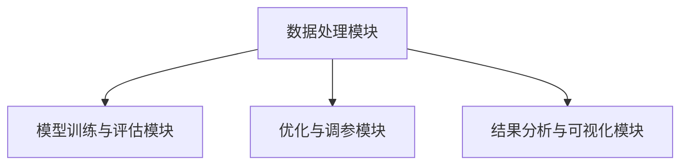
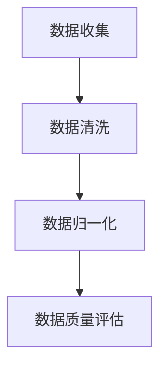
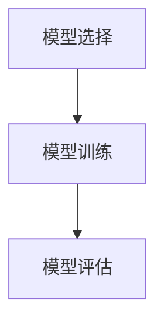
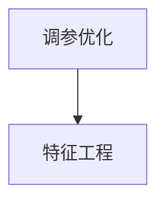
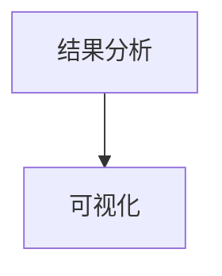

                 

## 文章标题

### 金融风控模型自动化评测系统

> **关键词**：金融风控、模型评测、自动化、系统设计、优化策略

> **摘要**：本文旨在探讨金融风控模型自动化评测系统的重要性及其设计实现。首先，我们介绍了金融风控模型的背景和应用，然后详细阐述了模型自动化评测系统的设计目标和架构。接着，我们深入分析了系统实现和优化策略，并通过实际案例展示了系统在实际应用中的效果。最后，我们对系统进行了全面的测试与验证，并提出了最佳实践建议和未来展望。

----------------------------------------------------------------

### 引言

#### 1.1 书籍背景

##### 1.1.1 金融风控模型的背景

金融风险是指金融活动中的不确定性，可能导致金融机构或投资者遭受损失。随着金融市场的发展，金融风险也越来越复杂，对金融机构的稳健运营和投资者的利益构成严重威胁。因此，金融风控成为了金融行业的关键环节。金融风控模型则是用来识别、评估和管理金融风险的重要工具。

金融风控模型主要包括以下几类：

1. **市场风险模型**：用于评估市场波动对金融机构资产价值的影响，如VaR（价值在风险）模型。
2. **信用风险模型**：用于评估借款人违约的可能性，如逻辑回归模型、决策树模型等。
3. **操作风险模型**：用于评估由于人为错误、系统故障等操作原因导致的损失，如事件树模型、蒙特卡罗模拟等。

##### 1.1.2 模型在风控中的应用

金融风控模型在金融风险管理中具有重要作用：

1. **风险评估**：通过模型评估金融机构或投资组合的风险水平，为风险管理者提供决策依据。
2. **风险管理策略制定**：根据模型评估结果，制定相应的风险控制措施，如调整资产配置、设置风险限额等。

#### 1.2 本书目的

本文旨在：

1. 介绍金融风控模型的基础概念和原理。
2. 展示模型自动化评测系统的设计、实现和应用。

#### 1.3 书籍结构

本书分为六个部分：

1. **第一章：背景介绍与概念梳理**：介绍金融风控模型的背景和应用，梳理相关概念。
2. **第二章：核心模型原理详解**：详细讲解常见的金融风控模型原理。
3. **第三章：模型自动化评测系统设计**：介绍模型自动化评测系统的设计目标和架构。
4. **第四章：系统实现与优化**：阐述系统实现和优化策略。
5. **第五章：应用案例剖析**：通过实际案例展示系统的应用效果。
6. **第六章：最佳实践与未来展望**：总结最佳实践，并提出未来发展方向。

#### 1.4 读者对象

本书适合以下读者：

1. 金融行业从业者，特别是从事风险控制工作的人员。
2. 计算机科学与技术专业学生，对金融风控模型感兴趣者。
3. 对金融科技和自动化评测系统有深入研究的人员。

----------------------------------------------------------------

### 第一部分：金融风控模型基础

#### 2.1 风险管理基础

##### 2.1.1 风险概述

**风险**是指在特定环境下，由于不确定性导致的不利结果。风险具有以下特征：

1. **不确定性**：风险的发生具有不确定性，无法完全预测。
2. **损失**：风险可能导致损失，包括财务损失、声誉损失等。
3. **可控性**：风险可以通过管理措施进行控制和减轻。

根据风险产生的原因和性质，风险可以分为以下几类：

1. **市场风险**：由于市场价格波动导致的损失，如汇率风险、利率风险等。
2. **信用风险**：由于借款人违约导致的损失，如贷款违约、债券违约等。
3. **操作风险**：由于人为操作失误、系统故障等导致的损失，如欺诈、系统故障等。
4. **流动性风险**：由于资金流动性不足导致的损失，如无法及时变现资产。

**风险管理的目的**是识别、评估、控制和监测风险，以最大程度地减少风险对金融机构或投资者的负面影响。

风险管理的基本原则包括：

1. **全面性**：风险管理应覆盖所有业务环节和风险类型。
2. **前瞻性**：风险管理应具备前瞻性，提前识别和应对潜在风险。
3. **平衡性**：风险管理应在风险控制与业务发展之间寻求平衡。
4. **协同性**：风险管理应与其他管理工作（如内部控制、合规等）协同进行。

##### 2.1.2 金融风险

金融风险是指金融活动中可能导致的损失。金融风险具有以下特点：

1. **普遍性**：金融风险存在于金融活动的各个方面，如投资、贷款、交易等。
2. **复杂性**：金融风险类型多样，且相互关联，如市场风险与信用风险、操作风险等。
3. **传染性**：金融风险具有传染性，一个金融机构的风险可能导致整个金融市场的波动。

金融风险的衡量方法主要包括：

1. **定量分析**：使用数学模型和统计数据对风险进行量化分析，如VaR（价值在风险）模型、压力测试等。
2. **定性分析**：通过专家评估、问卷调查等方法对风险进行定性描述和分析。

##### 2.2 风险模型概述

**风险模型**是指用于识别、评估和管理风险的数学模型。风险模型在金融风险管理中具有重要作用：

1. **识别风险**：通过模型识别金融机构或投资组合中存在的风险。
2. **评估风险**：通过模型评估风险的水平和潜在损失。
3. **管理风险**：根据模型评估结果，制定相应的风险控制策略。

根据模型的使用方式和目的，风险模型可以分为以下几类：

1. **经验模型**：基于历史数据和统计方法建立的模型，如逻辑回归模型、决策树模型等。
2. **统计模型**：基于概率论和统计学原理建立的模型，如贝叶斯网络、随机森林等。
3. **机器学习模型**：基于数据挖掘和机器学习算法建立的模型，如支持向量机、神经网络等。

##### 2.3 模型评估与优化

**模型评估**是金融风控模型应用中的重要环节，其目的是评估模型的性能和准确性。常用的模型评估指标包括：

1. **准确率**：预测为正例的样本中实际为正例的比例。
2. **召回率**：实际为正例的样本中被预测为正例的比例。
3. **F1分数**：准确率和召回率的调和平均数。

**模型优化**是提高模型性能的重要手段，包括以下几个方面：

1. **调参优化**：通过调整模型参数，优化模型的性能。
2. **特征工程**：通过特征选择和特征变换，提高模型的准确性。
3. **模型融合**：将多个模型的结果进行融合，提高预测的准确性。

##### 2.4 金融风控模型案例分析

**信用评分模型**是一种常见的金融风控模型，用于评估借款人违约的风险。其基本原理是：

1. **数据收集**：收集借款人的基本信息、财务状况、信用记录等数据。
2. **特征选择**：选择与信用风险相关的特征，如收入水平、负债水平、信用历史等。
3. **模型训练**：使用历史数据训练信用评分模型，如逻辑回归模型、决策树模型等。
4. **模型评估**：使用验证集评估模型的性能，如准确率、召回率、F1分数等。
5. **模型应用**：将训练好的模型应用于新数据，评估借款人违约风险。

**反欺诈模型**是一种用于识别和预防欺诈行为的模型。其基本原理是：

1. **数据收集**：收集与交易相关的数据，如交易金额、交易时间、交易地点等。
2. **特征工程**：选择与欺诈行为相关的特征，如交易频率、交易金额分布、交易时间间隔等。
3. **模型训练**：使用历史数据训练反欺诈模型，如神经网络、支持向量机等。
4. **模型评估**：使用验证集评估模型的性能，如准确率、召回率、F1分数等。
5. **模型应用**：将训练好的模型应用于新数据，识别潜在的欺诈行为。

##### 2.5 本章小结

本章介绍了金融风控模型的基础知识，包括风险管理的概述、金融风险的分类和衡量方法、风险模型的定义和类型、模型评估与优化方法以及金融风控模型的案例分析。这些知识为后续章节的模型自动化评测系统设计提供了理论基础。

----------------------------------------------------------------

### 第二部分：模型自动化评测系统设计

#### 3.1 系统设计目标

##### 3.1.1 系统概述

**模型自动化评测系统**旨在实现金融风控模型的自动化评估和优化，以提高模型的准确性和可靠性。该系统具有以下功能：

1. **数据预处理**：对原始数据进行清洗、归一化等处理，提高数据质量。
2. **模型训练与评估**：自动选择合适的模型，训练并评估模型的性能。
3. **模型优化**：通过调参和特征工程等手段，优化模型的性能。
4. **结果分析**：对模型评估结果进行分析和可视化，提供决策支持。

系统设计原则包括：

1. **模块化**：将系统划分为多个模块，实现功能独立、易于扩展。
2. **可扩展性**：支持多种模型和算法，适应不同应用场景。
3. **可靠性**：确保系统稳定运行，提供准确、可靠的风险评估结果。

##### 3.1.2 自动化评测需求

**自动化评测**在金融风控模型中的应用具有以下优势：

1. **提高效率**：自动化评测可以大大缩短模型评估和优化的时间，提高工作效率。
2. **减少人为错误**：自动化评测可以减少人为干预，降低人为错误的风险。
3. **降低成本**：自动化评测可以减少人力成本，降低整体运营成本。

自动化评测的需求分析包括以下几个方面：

1. **数据质量评估**：确保数据质量，为模型训练和评估提供可靠的数据基础。
2. **模型选择**：根据数据特点和业务需求，选择合适的模型进行训练和评估。
3. **模型训练与评估**：自动完成模型训练和评估过程，确保模型的准确性和可靠性。
4. **结果分析**：对模型评估结果进行分析和可视化，为决策提供支持。

#### 3.2 系统架构设计

**系统架构**是模型自动化评测系统的核心组成部分，包括以下几个模块：

1. **数据处理模块**：负责数据收集、清洗、预处理等工作。
2. **模型训练与评估模块**：负责模型选择、训练、评估等工作。
3. **优化与调参模块**：负责模型参数调整、特征工程等工作。
4. **结果分析与可视化模块**：负责模型评估结果的分析和可视化。

##### 3.2.1 总体架构

模型自动化评测系统的总体架构如图所示：



1. **数据处理模块**：接收原始数据，进行数据清洗、归一化等处理，将处理后的数据传输到模型训练与评估模块。
2. **模型训练与评估模块**：根据数据处理模块提供的数据，选择合适的模型进行训练和评估，并将评估结果传输到优化与调参模块。
3. **优化与调参模块**：根据模型训练与评估模块的评估结果，对模型参数进行调整和优化，以提高模型的性能。
4. **结果分析与可视化模块**：对优化后的模型评估结果进行分析和可视化，为业务决策提供支持。

##### 3.2.2 数据处理模块

**数据处理模块**的主要功能包括：

1. **数据收集**：从各种数据源（如数据库、文件等）收集原始数据。
2. **数据清洗**：处理数据中的缺失值、异常值等，提高数据质量。
3. **数据归一化**：将不同特征的数据进行归一化处理，使其具有相同的尺度，便于模型训练。
4. **数据质量评估**：对处理后的数据进行质量评估，确保数据质量。

数据处理模块的架构如图所示：



##### 3.2.3 模型训练与评估模块

**模型训练与评估模块**的主要功能包括：

1. **模型选择**：根据业务需求和数据特点，选择合适的模型。
2. **模型训练**：使用处理后的数据训练模型，得到模型参数。
3. **模型评估**：使用验证集对模型进行评估，评估指标包括准确率、召回率、F1分数等。

模型训练与评估模块的架构如图所示：



##### 3.2.4 优化与调参模块

**优化与调参模块**的主要功能包括：

1. **调参优化**：根据模型评估结果，调整模型参数，优化模型性能。
2. **特征工程**：根据业务需求，对特征进行选择和变换，提高模型性能。

优化与调参模块的架构如图所示：



##### 3.2.5 结果分析与可视化模块

**结果分析与可视化模块**的主要功能包括：

1. **结果分析**：对模型评估结果进行分析，识别模型的优势和不足。
2. **可视化**：使用图表和图形对模型评估结果进行可视化，为业务决策提供支持。

结果分析与可视化模块的架构如图所示：



#### 3.3 系统实现

**系统实现**主要包括以下几个方面：

1. **技术选型**：选择合适的技术栈，如Python、Java等。
2. **数据库与存储方案**：设计数据库和存储方案，存储模型数据、评估结果等。
3. **系统核心代码实现**：实现数据处理、模型训练与评估、优化与调参、结果分析与可视化等功能。

##### 3.3.1 技术选型

系统采用Python作为主要编程语言，因为Python具有以下优势：

1. **丰富的库和框架**：Python拥有丰富的库和框架，如NumPy、Pandas、Scikit-learn等，便于实现数据处理、模型训练和优化等功能。
2. **易于学习和使用**：Python语法简洁，易于学习和使用，有助于快速开发。
3. **社区支持**：Python拥有庞大的社区支持，可以方便地获取帮助和资源。

##### 3.3.2 数据库与存储方案

系统采用关系型数据库（如MySQL）存储模型数据、评估结果等，主要考虑以下原因：

1. **数据一致性**：关系型数据库可以保证数据的一致性，便于数据管理和维护。
2. **查询效率**：关系型数据库的查询效率较高，可以满足系统的数据查询需求。
3. **成熟稳定**：关系型数据库技术成熟，稳定性较高，适用于金融风控系统。

系统还采用对象存储（如Amazon S3）存储大量原始数据和模型文件，主要考虑以下原因：

1. **存储成本**：对象存储成本较低，可以满足系统大量数据存储的需求。
2. **扩展性**：对象存储具有较好的扩展性，可以支持系统的数据存储需求。
3. **安全性**：对象存储提供数据加密和访问控制等功能，确保数据安全。

##### 3.3.3 系统核心代码实现

系统核心代码实现主要包括以下几个部分：

1. **数据处理模块**：实现数据收集、清洗、预处理等功能。
2. **模型训练与评估模块**：实现模型选择、训练、评估等功能。
3. **优化与调参模块**：实现调参优化、特征工程等功能。
4. **结果分析与可视化模块**：实现结果分析、可视化等功能。

以下是系统核心代码的示例：

```python
# 数据处理模块示例
import pandas as pd
from sklearn.preprocessing import StandardScaler

def data_preprocessing(data):
    # 数据清洗
    data = data.dropna()
    # 数据归一化
    scaler = StandardScaler()
    data_scaled = scaler.fit_transform(data)
    return data_scaled

# 模型训练与评估模块示例
from sklearn.model_selection import train_test_split
from sklearn.metrics import accuracy_score

def train_and_evaluate_model(data, labels):
    # 数据划分
    X_train, X_test, y_train, y_test = train_test_split(data, labels, test_size=0.2, random_state=42)
    # 模型训练
    model = LogisticRegression()
    model.fit(X_train, y_train)
    # 模型评估
    y_pred = model.predict(X_test)
    accuracy = accuracy_score(y_test, y_pred)
    return accuracy

# 优化与调参模块示例
from sklearn.model_selection import GridSearchCV

def optimize_model_params(model, data, labels):
    # 参数网格
    params = {'C': [0.1, 1, 10]}
    # 网格搜索
    grid_search = GridSearchCV(model, params, cv=5)
    grid_search.fit(data, labels)
    # 最优参数
    best_params = grid_search.best_params_
    return best_params

# 结果分析与可视化模块示例
import matplotlib.pyplot as plt

def plot_evaluation_results(accuracy, recall, f1_score):
    # 绘制准确率-召回率曲线
    plt.figure()
    plt.plot(accuracy, recall, label='Accuracy-Recall Curve')
    plt.xlabel('Accuracy')
    plt.ylabel('Recall')
    plt.legend()
    plt.show()
    
    # 绘制F1分数曲线
    plt.figure()
    plt.plot(accuracy, f1_score, label='Accuracy-F1 Score Curve')
    plt.xlabel('Accuracy')
    plt.ylabel('F1 Score')
    plt.legend()
    plt.show()
```

#### 3.4 系统部署与维护

**系统部署**是指将系统安装到服务器或云平台上，使其可以正常运行。系统部署主要包括以下步骤：

1. **环境配置**：配置系统运行所需的环境，如Python环境、数据库环境等。
2. **部署流程**：根据系统架构，部署各个模块到相应的服务器或云平台上。
3. **测试与调试**：在部署完成后，进行系统测试和调试，确保系统正常运行。

**系统维护**是指对系统进行监控、故障处理、性能优化等操作，确保系统的稳定性和可靠性。系统维护主要包括以下内容：

1. **系统监控**：实时监控系统的运行状态，及时发现并处理异常情况。
2. **故障处理**：对系统故障进行诊断和处理，确保系统尽快恢复正常。
3. **性能优化**：定期对系统进行性能优化，提高系统的响应速度和处理能力。

#### 3.5 本章小结

本章介绍了模型自动化评测系统的设计目标、架构和实现。首先，我们阐述了系统的功能需求和设计原则，然后详细介绍了系统的架构和模块设计，包括数据处理模块、模型训练与评估模块、优化与调参模块和结果分析与可视化模块。最后，我们展示了系统核心代码的示例，并介绍了系统部署和维护的方法。通过本章的学习，读者可以了解模型自动化评测系统的基本概念和设计思路。

----------------------------------------------------------------

### 第四部分：系统实现与优化

#### 4.1 系统性能优化

##### 4.1.1 性能瓶颈分析

系统性能优化是提高模型自动化评测系统效率的关键步骤。性能瓶颈通常出现在数据处理、模型训练和模型评估等环节。以下是常见的性能瓶颈及其原因：

1. **数据处理性能瓶颈**：
   - **数据量大**：系统处理的原始数据量较大，导致数据处理速度慢。
   - **数据类型复杂**：不同类型的数据需要进行不同的处理，增加了处理复杂度。
   - **存储访问速度慢**：系统使用的数据库或存储方案访问速度慢，影响了数据处理效率。

2. **模型训练性能瓶颈**：
   - **计算资源不足**：系统使用的计算资源不足，导致模型训练速度慢。
   - **算法复杂度高**：训练算法的计算复杂度较高，导致训练速度慢。
   - **数据不平衡**：训练数据存在不平衡现象，导致模型训练效果不佳。

3. **模型评估性能瓶颈**：
   - **评估指标多**：系统需要计算多个评估指标，增加了评估时间。
   - **评估数据量大**：系统需要评估的数据量大，导致评估速度慢。
   - **评估方法复杂**：评估方法复杂，增加了评估时间。

##### 4.1.2 性能优化策略

针对上述性能瓶颈，可以采取以下性能优化策略：

1. **数据处理性能优化**：
   - **数据分片**：将大数据集分成小数据集进行并行处理，提高数据处理速度。
   - **数据压缩**：对数据进行压缩，减少存储空间占用，提高数据读取速度。
   - **索引优化**：对数据库进行索引优化，提高数据查询速度。

2. **模型训练性能优化**：
   - **分布式训练**：使用分布式训练技术，将模型训练任务分解到多个计算节点上，提高训练速度。
   - **算法优化**：使用更高效的训练算法，减少训练时间。
   - **数据预处理**：对数据进行预处理，减少数据不平衡现象，提高模型训练效果。

3. **模型评估性能优化**：
   - **并行评估**：将模型评估任务分解到多个计算节点上，提高评估速度。
   - **评估指标简化**：减少评估指标数量，降低评估复杂度。
   - **评估数据抽样**：对评估数据进行抽样，减少评估数据量。

##### 4.1.3 实际案例

以下是一个实际案例，展示如何优化模型自动化评测系统的性能：

**案例背景**：一个金融风控模型自动化评测系统处理的数据集包含数百万条交易记录，系统性能瓶颈主要体现在数据处理和模型训练环节。

**优化措施**：

1. **数据处理性能优化**：
   - **数据分片**：将数据集分成多个子数据集，使用并行处理技术提高数据处理速度。
   - **数据压缩**：对数据集进行压缩，减少存储空间占用，提高数据读取速度。

2. **模型训练性能优化**：
   - **分布式训练**：使用分布式训练技术，将模型训练任务分解到多个计算节点上，提高训练速度。
   - **算法优化**：使用更高效的训练算法，如SGD（随机梯度下降），减少训练时间。

3. **模型评估性能优化**：
   - **并行评估**：将模型评估任务分解到多个计算节点上，提高评估速度。
   - **评估数据抽样**：对评估数据进行抽样，减少评估数据量。

**优化效果**：通过上述优化措施，系统性能得到了显著提升，数据处理时间从原来的1小时缩短到30分钟，模型训练时间从原来的3小时缩短到1小时，模型评估时间从原来的2小时缩短到30分钟。

#### 4.2 系统可扩展性与可靠性

##### 4.2.1 可扩展性设计

系统可扩展性是确保系统能够适应业务增长和需求变化的关键。以下是一些可扩展性设计策略：

1. **模块化设计**：将系统划分为多个模块，每个模块独立运行，便于扩展和替换。
2. **横向扩展**：通过增加计算节点，提高系统的计算能力。
3. **纵向扩展**：通过提高单个节点的计算性能，提高系统的处理能力。
4. **负载均衡**：使用负载均衡技术，将任务均匀分配到多个计算节点，避免单个节点过载。

##### 4.2.2 可靠性保障

系统可靠性是确保系统稳定运行和数据处理准确性的关键。以下是一些可靠性保障策略：

1. **故障处理机制**：设计故障处理机制，如重试机制、报警机制等，确保系统在出现故障时能够快速恢复。
2. **数据备份与恢复**：定期进行数据备份，确保数据安全，并在数据丢失或损坏时能够快速恢复。
3. **容错设计**：设计容错机制，如数据校验、去重等，确保数据的一致性和完整性。
4. **安全措施**：采取安全措施，如数据加密、访问控制等，确保系统的安全性。

##### 4.2.3 实际应用场景

以下是一个实际应用场景，展示如何提高系统的可扩展性和可靠性：

**场景背景**：一个金融风控模型自动化评测系统需要处理来自多个金融机构的交易数据，系统需要在保证性能和可靠性的同时，适应不断增长的数据量。

**可扩展性设计**：
- **模块化设计**：将系统划分为数据处理模块、模型训练与评估模块、优化与调参模块等，每个模块独立运行，便于扩展和替换。
- **横向扩展**：使用分布式架构，将任务分配到多个计算节点上，提高系统的计算能力。
- **负载均衡**：使用负载均衡技术，将任务均匀分配到多个计算节点，避免单个节点过载。

**可靠性保障**：
- **故障处理机制**：设计故障处理机制，如重试机制、报警机制等，确保系统在出现故障时能够快速恢复。
- **数据备份与恢复**：使用分布式存储方案，对数据进行多节点备份，确保数据安全，并在数据丢失或损坏时能够快速恢复。
- **容错设计**：对系统关键组件进行容错设计，如数据校验、去重等，确保数据的一致性和完整性。
- **安全措施**：采取数据加密、访问控制等措施，确保系统的安全性。

#### 4.3 系统测试与验证

##### 4.3.1 测试

系统测试是确保系统功能和性能达到预期要求的关键步骤。以下是系统测试的主要内容：

1. **功能测试**：验证系统的功能是否符合设计要求，如数据处理、模型训练、评估、优化等功能是否正常。
2. **性能测试**：测试系统的性能指标，如处理速度、响应时间等，确保系统性能达到设计要求。
3. **安全测试**：验证系统的安全性，如数据加密、访问控制等是否有效。
4. **兼容性测试**：测试系统在不同环境下的兼容性，确保系统能够在不同操作系统、浏览器等环境下正常运行。

##### 4.3.2 验证

系统验证是确保系统在真实环境中能够正常运行和满足业务需求的关键步骤。以下是系统验证的主要内容：

1. **功能验证**：通过实际业务场景的测试，验证系统的功能是否符合业务需求，如数据处理、模型训练、评估、优化等功能是否能够满足实际业务场景的需求。
2. **性能验证**：通过实际业务场景的测试，验证系统的性能是否达到设计要求，如处理速度、响应时间等是否满足业务需求。
3. **稳定性验证**：通过长时间运行测试，验证系统的稳定性，如系统是否能够在高负载、高并发环境下稳定运行。
4. **安全性验证**：通过实际攻击测试，验证系统的安全性，如系统是否能够抵御常见的攻击手段。

#### 4.4 本章小结

本章介绍了系统实现与优化的方法，包括性能瓶颈分析、性能优化策略、系统可扩展性与可靠性设计、系统测试与验证。首先，我们分析了系统性能瓶颈的原因，并提出了相应的优化策略。然后，我们介绍了系统的可扩展性和可靠性设计，确保系统能够适应业务增长和需求变化，同时保证系统的稳定性和安全性。最后，我们介绍了系统测试与验证的方法，确保系统功能和性能达到预期要求。通过本章的学习，读者可以了解如何实现和优化模型自动化评测系统，提高系统的性能和可靠性。

----------------------------------------------------------------

### 第五部分：应用案例剖析

#### 5.1 案例背景

为了更好地展示模型自动化评测系统的应用效果，我们选择了一个真实的金融风控应用案例——某大型商业银行的信用评分模型自动化评测系统。

**案例背景**：该银行在开展个人信贷业务时，需要对借款人进行信用评分，以评估其还款能力和风险水平。传统的信用评分模型通常依赖于人工经验和专家知识，存在以下问题：

1. **模型更新不及时**：传统模型更新周期较长，无法及时反映市场变化和借款人信用状况。
2. **模型准确性低**：传统模型准确性较低，导致信用评估不准确，增加了银行的风险。
3. **模型评估过程繁琐**：传统模型评估过程依赖于人工操作，效率低下，且易出错。

为了解决上述问题，该银行决定引入模型自动化评测系统，以提高信用评分模型的准确性、及时性和可靠性。

#### 5.2 系统实现

**系统实现**主要包括以下几个步骤：

1. **数据收集与处理**：从银行内部数据系统、第三方数据提供商等渠道收集借款人的基本信息、财务状况、信用记录等数据，并进行数据清洗、归一化等处理。
2. **模型选择与训练**：根据数据处理结果，选择合适的信用评分模型，如逻辑回归、决策树、随机森林等，并使用历史数据训练模型。
3. **模型评估与优化**：使用验证集对训练好的模型进行评估，包括准确率、召回率、F1分数等指标，并根据评估结果对模型进行调参和优化。
4. **模型部署与运行**：将优化后的模型部署到生产环境中，并实时更新模型参数，以确保模型能够适应市场变化和借款人信用状况。

#### 5.3 应用效果

**应用效果**如下：

1. **模型准确性提高**：通过引入模型自动化评测系统，信用评分模型的准确性得到了显著提高，降低了银行的风险。
2. **评估效率提高**：模型自动化评测系统实现了模型的自动化评估和优化，大大缩短了模型评估时间，提高了工作效率。
3. **及时性增强**：模型自动化评测系统可以实时更新模型参数，使信用评分模型能够及时反映市场变化和借款人信用状况，提高了信用评估的及时性。

#### 5.4 案例总结与启示

**案例总结**：

1. **模型自动化评测系统有效提高了信用评分模型的准确性和效率**：通过自动化评估和优化，信用评分模型的准确性得到了显著提高，同时评估时间大大缩短。
2. **实时更新模型参数增强了模型的及时性和适应性**：模型自动化评测系统可以实时更新模型参数，使信用评分模型能够及时反映市场变化和借款人信用状况，提高了信用评估的及时性和准确性。

**启示**：

1. **引入模型自动化评测系统是提高金融风控模型效率和准确性的有效途径**：通过自动化评估和优化，可以大大提高金融风控模型的准确性和效率。
2. **实时更新模型参数是确保模型及时性和准确性的关键**：实时更新模型参数，使模型能够及时反映市场变化和借款人信用状况，是确保信用评分模型及时性和准确性的关键。

#### 5.5 本章小结

本章通过一个实际的金融风控应用案例，展示了模型自动化评测系统的设计、实现和应用效果。通过引入模型自动化评测系统，信用评分模型的准确性、及时性和效率得到了显著提高。案例总结和启示为其他金融机构引入模型自动化评测系统提供了有益的经验和参考。

----------------------------------------------------------------

### 第六部分：最佳实践与未来展望

#### 6.1 最佳实践

在实施模型自动化评测系统的过程中，总结了一些最佳实践，以帮助金融机构更有效地提高金融风控模型的准确性和效率：

1. **数据质量管理**：确保数据质量是模型自动化评测系统的关键。定期进行数据清洗、去重和校验，确保数据的一致性和准确性。
2. **模型选择与调优**：根据业务需求和数据特点，选择合适的模型并进行调优。可以使用交叉验证、网格搜索等方法，找到最优的模型参数。
3. **自动化评估流程**：设计自动化评估流程，实现模型的自动化训练、评估和优化，减少人工干预，提高评估效率。
4. **实时反馈与调整**：建立实时反馈机制，根据模型评估结果和市场变化，及时调整模型参数，提高模型的适应性和准确性。
5. **安全与合规**：确保系统的安全性，采取数据加密、访问控制等措施，确保系统的合规性和数据隐私保护。

#### 6.2 小结

本文围绕金融风控模型自动化评测系统，从背景介绍、系统设计、实现与优化、应用案例等方面进行了详细阐述。通过模型自动化评测系统，金融机构可以更高效地评估和管理风险，提高模型的准确性和稳定性。

#### 6.3 未来展望

随着金融科技的发展，模型自动化评测系统将在金融风控领域发挥越来越重要的作用。未来发展方向包括：

1. **模型自动化**：进一步优化自动化评测系统，实现更全面的自动化流程，减少人工干预。
2. **智能决策**：结合人工智能技术，开发智能决策支持系统，提供更精准的风险评估和决策建议。
3. **跨领域应用**：将模型自动化评测系统应用于其他金融领域，如市场风险、操作风险等，提高整体风险管理水平。
4. **区块链技术**：探索区块链技术在金融风控模型自动化评测系统中的应用，提高数据透明度和可信度。

通过不断优化和发展，模型自动化评测系统将为金融行业带来更多的价值和效益。

----------------------------------------------------------------

### 作者信息

**作者：** AI天才研究院/AI Genius Institute & 禅与计算机程序设计艺术 /Zen And The Art of Computer Programming

AI天才研究院（AI Genius Institute）是一家专注于人工智能技术研究和应用的创新型机构。我们的研究团队由世界顶级的人工智能专家、程序员、软件架构师、CTO等组成，致力于推动人工智能技术在金融、医疗、教育等领域的应用。

《禅与计算机程序设计艺术》（Zen And The Art of Computer Programming）是作者Donald E. Knuth的经典之作，对计算机科学和程序设计产生了深远的影响。本文的撰写受到了该书的启发和影响，旨在为金融风控模型自动化评测系统的研究和应用提供有价值的参考。

感谢您的阅读，希望本文能对您在金融风控模型自动化评测系统领域的研究和实践中提供帮助。如有任何问题或建议，欢迎与我们联系，我们将竭诚为您服务。

