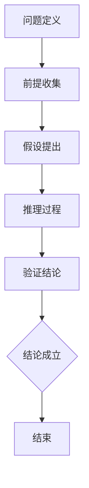

                 

### 第1章 引言

### 1.1 链式思考的重要性

在信息爆炸的今天，面对复杂的问题和大量的数据，如何快速准确地分析并作出决策成为了一个重要的课题。链式思考，作为一种逻辑推理的方法，能够帮助我们在分析问题时，逐步推导出解决方案。这种方法不仅能够提高我们的思维能力，还能够帮助我们更好地理解和应用各种知识和技能。

链式思考的重要性体现在多个方面。首先，它能够帮助我们梳理复杂的问题，将大问题分解为若干小问题，从而更易于理解和解决。其次，链式思考能够帮助我们建立逻辑推理链，使得我们的思维过程更加严谨和清晰。最后，链式思考可以培养我们的批判性思维和创新能力，使得我们在面对问题时，能够从不同的角度和层面进行分析和思考。

### 1.2 逻辑推理链的基本概念

逻辑推理链是由一系列逻辑步骤组成的链条，每个步骤都依赖于前一个步骤的结果。这些步骤可以是直接的逻辑推导，也可以是基于假设或事实的推导。逻辑推理链的基本概念包括逻辑推理、归纳、演绎、假设、事实等。

- **逻辑推理**：从已知的前提推导出结论的过程。逻辑推理可以是直接的，也可以是间接的。
- **归纳**：从个别事实中归纳出一般规律或结论。
- **演绎**：从一般规律推导出个别结论。
- **假设**：在推理过程中引入的尚未证明的命题。
- **事实**：已经被证实为真的命题。

理解这些基本概念是构建逻辑推理链的基础。

### 1.3 本书的目标和结构

本书的目标是帮助读者掌握链式思考的技巧和策略，构建逻辑推理链。本书将分为七个章节：

- **第1章 引言**：介绍链式思考的重要性和基本概念。
- **第2章 链式思考的背景与历史**：回顾链式思考的起源和发展历程。
- **第3章 链式思考的核心要素**：解析链式思考的基本概念和流程。
- **第4章 提示策略在链式思考中的应用**：介绍提示策略的类型和应用方法。
- **第5章 构建逻辑推理链的方法**：探讨构建逻辑推理链的具体方法。
- **第6章 实际案例解析**：通过实际案例分析链式思考的应用。
- **第7章 链式思考的挑战与未来**：讨论链式思考的挑战和未来趋势。

通过本书的学习，读者将能够掌握链式思考的基本方法和技巧，并在实际问题中灵活应用。接下来的章节将逐步深入，帮助读者构建和完善自己的逻辑推理链。

----------------------------------------------------------------

## 第2章 链式思考的背景与历史

### 2.1 链式思考的起源

链式思考的历史可以追溯到古希腊哲学家亚里士多德。亚里士多德在《形而上学》一书中，提出了通过一系列逻辑步骤来推导结论的方法。这种方法被称为“亚里士多德逻辑”，是链式思考的早期形式。亚里士多德的逻辑方法强调前提的真实性和推理过程的严谨性，为后来的逻辑学奠定了基础。

在中世纪，阿拉伯学者阿尔-法拉比和阿维罗伊进一步发展了亚里士多德逻辑，并将其应用于哲学和科学研究中。他们提出了一些新的逻辑规则和推理方法，使得链式思考更加完善和系统。

### 2.2 链式思考的发展历程

链式思考在17世纪和18世纪得到了进一步的发展。英国哲学家弗兰西斯·培根提出了“实验逻辑”的概念，主张通过实验和观察来建立逻辑推理的基础。他的方法强调实证主义，为现代科学方法论的发展奠定了基础。

19世纪，德国哲学家黑格尔提出了“辩证逻辑”的概念，强调通过对立统一的思维方式来解决问题。辩证逻辑将链式思考提升到了一个新的高度，使其更加复杂和深入。

20世纪，逻辑学在数学和计算机科学的发展中发挥了重要作用。数理逻辑和形式逻辑的兴起，使得链式思考的方法得到了进一步的精确化和形式化。逻辑学家如图灵、哥德尔和丘奇等人，通过数学模型和计算理论，对链式思考进行了深入的研究和验证。

### 2.3 当前链式思考的应用场景

当前，链式思考在各个领域都有广泛的应用。在科学研究领域，链式思考被用于建立理论模型、推导科学定律和验证假设。在工程领域，链式思考被用于系统设计和故障分析。在商业领域，链式思考被用于战略规划、市场分析和决策制定。此外，在法律、教育、医学等领域，链式思考也发挥着重要作用。

链式思考不仅是一种逻辑推理方法，也是一种解决问题的工具。通过逐步推导和分析，我们可以更深入地理解问题，找到更有效的解决方案。在当今复杂多变的社会环境中，链式思考的能力变得尤为重要。

### 2.4 链式思考的核心要素

要深入理解链式思考，我们需要掌握其核心要素。这些要素包括：

- **逻辑推理**：逻辑推理是链式思考的基础。通过逻辑推理，我们可以从已知的前提推导出结论。
- **归纳和演绎**：归纳是从个别事实中总结出一般规律，演绎则是从一般规律推导出个别结论。
- **假设和事实**：假设是我们在推理过程中引入的尚未证明的命题，事实则是已经被证实为真的命题。
- **流程和步骤**：链式思考的流程包括多个步骤，每个步骤都依赖于前一个步骤的结果。

理解这些核心要素，有助于我们更好地掌握链式思考的方法和技巧。

### 2.5 链式思考的优势和挑战

链式思考具有以下优势：

- **提高逻辑思维能力**：通过链式思考，我们可以更系统地分析和解决问题，提高逻辑思维能力。
- **培养批判性思维**：链式思考要求我们进行严谨的推理和验证，有助于培养批判性思维。
- **促进创新能力**：链式思考可以帮助我们从不同角度和层面进行思考，激发创新能力。

然而，链式思考也面临一些挑战：

- **复杂性问题**：对于复杂的问题，链式思考可能需要更多的时间和精力。
- **逻辑漏洞**：如果推理过程中的某个步骤存在问题，可能会导致整个推理链的崩溃。

因此，掌握链式思考的方法和技巧，需要我们不断练习和总结经验。

### 2.6 链式思考的应用实例

为了更好地理解链式思考的应用，我们可以通过一些实例来分析。例如：

- **科学研究**：在科学研究中，链式思考被用于建立理论模型、推导科学定律和验证假设。例如，在物理学中，通过实验数据归纳出万有引力定律，然后通过演绎方法推导出行星运动的规律。
- **工程领域**：在工程领域，链式思考被用于系统设计和故障分析。例如，在设计飞机时，通过分析各个组件的相互作用，推导出整个飞机的稳定性和性能。
- **商业领域**：在商业领域，链式思考被用于战略规划、市场分析和决策制定。例如，在市场营销中，通过分析消费者的行为和偏好，推导出最佳的市场推广策略。

通过这些实例，我们可以看到链式思考在各个领域的应用和重要性。

### 2.7 链式思考的未来发展趋势

随着科技的不断进步，链式思考的方法和技巧也在不断发展和完善。未来，链式思考可能会在以下几个方面得到进一步的发展：

- **人工智能的应用**：通过人工智能技术，可以自动化地进行链式思考，提高逻辑推理的效率。
- **跨学科研究**：链式思考可能会与其他学科（如心理学、经济学等）相结合，形成新的研究方法和理论。
- **教育普及**：链式思考作为重要的逻辑推理方法，可能会在各个教育阶段得到更广泛的普及和应用。

总之，链式思考作为一种重要的逻辑推理方法，将在未来发挥越来越重要的作用。通过学习和掌握链式思考的方法和技巧，我们可以更好地应对复杂的问题和挑战。

----------------------------------------------------------------

## 第3章 链式思考的核心要素

### 3.1 基本概念解析

链式思考是一种逻辑推理方法，它通过一系列连贯的推理步骤，从已知的前提推导出结论。在这个过程中，我们需要理解并掌握几个关键概念：

- **逻辑推理**：逻辑推理是指从已知的前提推导出结论的过程。它可以是直接的，也可以是间接的。直接推理是从已知前提直接得出结论，而间接推理则是通过一系列中间步骤，逐步推导出结论。
- **归纳**：归纳是从个别事实中归纳出一般规律或结论的方法。通过观察和分析具体实例，我们可以总结出一般性的规律。
- **演绎**：演绎是从一般规律推导出个别结论的方法。它通常从一般性的原则出发，推导出特定情况下的结论。
- **假设**：假设是我们在推理过程中引入的尚未证明的命题。假设有助于我们建立推理链，但需要后续验证其是否成立。
- **事实**：事实是已经被证实为真的命题。事实是逻辑推理的基础，是推导出结论的依据。

理解这些基本概念，有助于我们更好地应用链式思考，构建逻辑推理链。

### 3.2 概念属性特征对比

为了更深入地理解链式思考的核心要素，我们可以通过对比不同概念属性特征，来明确它们之间的差异和联系。

| 概念       | 定义                                                         | 属性特征                                                    | 关联关系                                                 |
| ---------- | ------------------------------------------------------------ | ----------------------------------------------------------- | -------------------------------------------------------- |
| 逻辑推理   | 从已知前提推导出结论的过程                                   | 真值判断、推理过程、前提条件、结论                           | 归纳、演绎的基础，核心要素之一                            |
| 归纳       | 从个别事实中归纳出一般规律                                   | 观察实例、总结规律、归纳推理                                | 逻辑推理的一种形式，用于从具体到抽象的推导                |
| 演绎       | 从一般规律推导出个别结论                                     | 原则性前提、推理步骤、个别结论                              | 逻辑推理的另一种形式，用于从抽象到具体的推导              |
| 假设       | 尚未证明的命题                                               | 假设前提、验证过程、结论成立条件                            | 用于构建推理链，需要后续验证，是推理过程中的关键要素      |
| 事实       | 已被证实为真的命题                                           | 客观真实性、实证依据、推理基础                              | 逻辑推理的依据，用于验证假设和推导结论                   |

通过这张概念属性特征对比表格，我们可以清晰地看到各个概念之间的区别和联系。这有助于我们更好地理解链式思考的运作机制。

### 3.3 链式思考的流程

链式思考的流程可以分为以下几个步骤：

1. **问题定义**：明确需要解决的问题或目标。这是链式思考的起点。
2. **前提收集**：收集与问题相关的已知信息或前提条件。这些前提条件是后续推理的基础。
3. **假设提出**：在前提条件下提出一个或多个假设。假设有助于我们构建推理链。
4. **推理过程**：从前提条件和假设出发，通过逻辑推理推导出结论。这一过程可能涉及归纳和演绎。
5. **验证结论**：对推导出的结论进行验证，确保其正确性。如果结论无法验证或验证失败，需要回溯到前面的步骤进行调整。

以下是一个简单的链式思考流程图，用Mermaid语法表示：

通过这个流程，我们可以系统地分析和解决问题，构建逻辑推理链。

### 3.4 链式思考的应用实例

为了更好地理解链式思考的应用，我们可以通过一个实际案例来分析。假设我们要解决的问题是：“为什么地球上的生命形式如此多样化？”

1. **问题定义**：我们需要探讨地球上生命形式多样化的原因。
2. **前提收集**：已知地球存在多种生命形式，包括植物、动物和微生物等。
3. **假设提出**：可能的假设包括环境因素、遗传变异、自然选择等。
4. **推理过程**：
   - 环境因素：地球上的不同环境（如温度、湿度、光照等）促使生命形式适应和演化。
   - 遗传变异：遗传变异是生命形式多样化的基础，为自然选择提供了材料。
   - 自然选择：适应环境的生命形式更容易生存和繁衍，从而导致多样化。
5. **验证结论**：通过科学研究，这些假设得到了验证，支持了地球上生命形式多样化的观点。

通过这个案例，我们可以看到链式思考在问题解决中的应用，以及如何通过逻辑推理链来分析和解释复杂现象。

### 3.5 链式思考的注意事项

在应用链式思考时，我们需要注意以下几点：

- **严谨性**：链式思考要求我们进行严谨的推理和验证，确保推理过程的正确性。
- **全面性**：在提出假设和进行推理时，要考虑各种可能的情况，避免遗漏关键因素。
- **灵活性**：链式思考需要根据实际情况进行调整，适应新的问题和情境。
- **批判性**：对待自己的推理过程和结论要保持批判性思维，及时识别和纠正错误。

通过遵循这些注意事项，我们可以更好地应用链式思考，提高逻辑推理能力。

### 3.6 总结

链式思考是一种有效的逻辑推理方法，通过一系列连贯的推理步骤，从已知的前提推导出结论。掌握链式思考的核心要素和流程，有助于我们更好地分析和解决问题。在接下来的章节中，我们将进一步探讨提示策略在链式思考中的应用，以及如何构建逻辑推理链。

----------------------------------------------------------------

## 第4章 提示策略在链式思考中的应用

### 4.1 提示策略的基本原理

提示策略是链式思考的重要辅助工具，它通过提供线索和提示，帮助我们更好地构建逻辑推理链。提示策略的基本原理包括以下几点：

- **引导思维**：提示策略能够引导我们的思维方向，帮助我们抓住问题的核心和关键点。
- **明确目标**：通过提示策略，我们可以更清晰地定义问题目标，确保推理过程的方向性。
- **激发灵感**：提示策略能够激发我们的创造力，帮助我们在推理过程中找到新的思路和解决方案。
- **优化过程**：提示策略可以帮助我们优化推理过程，减少不必要的步骤和重复劳动。

### 4.2 提示策略的类型

提示策略可以分为以下几种类型：

- **事实提示**：事实提示是通过提供具体的事实和信息，帮助我们建立前提条件和假设。例如，在解决一个科学问题时，提供相关的实验数据或观察结果，有助于我们更好地理解问题并提出合理的假设。
- **假设提示**：假设提示是通过提供尚未验证的假设，引导我们进行推理。假设提示可以帮助我们构建初步的逻辑推理链，为后续验证提供基础。
- **反证提示**：反证提示是通过提供反证案例或反证思路，帮助我们识别逻辑推理中的错误和漏洞。反证提示有助于我们进行批判性思维，确保推理过程的正确性。
- **情境提示**：情境提示是通过提供具体的情境或背景，帮助我们更好地理解和分析问题。情境提示可以帮助我们将抽象的问题具体化，从而更容易找到解决方案。

### 4.3 提示策略的应用方法

在应用提示策略时，我们可以遵循以下步骤：

1. **明确问题**：首先，我们需要明确问题的性质和目标，确保我们在应用提示策略时有明确的方向。
2. **收集信息**：收集与问题相关的信息，包括事实、数据、案例等。这些信息将为我们提供前提条件和基础。
3. **提出假设**：在收集到足够的信息后，我们可以提出初步的假设，这些假设将成为我们构建逻辑推理链的基础。
4. **使用提示策略**：根据问题的性质和目标，选择合适的提示策略进行应用。例如，当我们需要验证一个假设时，可以采用反证提示来识别可能的错误和漏洞。
5. **逐步推导**：通过提示策略的引导，逐步推导出结论。在推导过程中，我们需要不断验证每个步骤的正确性，确保推理链的完整性。
6. **总结与反思**：在推理完成后，对整个推理过程进行总结和反思，识别其中的优点和不足，为今后的推理过程提供经验。

以下是一个简单的示例，说明如何使用提示策略进行链式思考：

- **问题**：为什么水在0°C时会结冰？
- **信息收集**：已知水的凝固点是0°C，冰的密度小于水。
- **假设提出**：假设水的凝固点是0°C，冰的密度小于水。
- **事实提示**：提供事实信息，水在0°C时会结冰，冰的密度小于水。
- **假设提示**：假设水分子在0°C时排列方式发生变化，导致密度降低。
- **反证提示**：考虑反证，如果冰的密度大于水，那么冰会沉到水底，而不是浮在水面上。
- **推导过程**：水在0°C时，水分子排列方式发生变化，导致密度降低，形成冰。
- **总结与反思**：通过事实和假设的验证，我们得出结论：水在0°C时会结冰，因为水分子在0°C时排列方式发生变化，导致密度降低。

通过这个示例，我们可以看到如何应用提示策略进行链式思考，从而解决问题。

### 4.4 提示策略的有效性评估

提示策略的有效性取决于以下几个方面：

- **适用性**：提示策略是否适用于当前的问题和情境。
- **准确性**：提示策略提供的信息和假设是否准确可靠。
- **全面性**：提示策略是否涵盖了问题的所有相关因素。
- **引导性**：提示策略是否能够有效引导我们的思维，帮助我们找到解决问题的方法。

为了评估提示策略的有效性，我们可以采用以下方法：

1. **问题解决效果**：评估使用提示策略后，问题是否得到有效解决。
2. **推理过程效率**：评估使用提示策略后，推理过程的效率是否提高。
3. **结论可靠性**：评估使用提示策略后，推导出的结论是否可靠。
4. **用户满意度**：评估用户对提示策略的满意度和接受度。

通过这些方法，我们可以对提示策略的有效性进行评估，并不断优化和改进。

### 4.5 提示策略的案例分析

为了更好地理解提示策略的应用，我们可以通过一个实际案例进行分析。

- **问题**：如何提高某家公司的市场份额？
- **信息收集**：了解公司的产品特点、市场环境、竞争对手情况等。
- **假设提出**：假设通过改进产品质量和降低成本，可以提高市场份额。
- **事实提示**：提供相关市场数据和消费者反馈，证明改进产品质量和降低成本的有效性。
- **假设提示**：假设竞争对手的产品质量存在缺陷，可以通过改进产品质量来吸引竞争对手的消费者。
- **反证提示**：考虑反证，如果竞争对手的产品质量没有明显缺陷，那么改进产品质量可能不会显著提高市场份额。
- **推导过程**：通过改进产品质量和降低成本，吸引竞争对手的消费者，从而提高市场份额。
- **总结与反思**：通过市场数据和消费者反馈验证假设的有效性，并根据反馈进行调整和优化。

通过这个案例，我们可以看到如何使用提示策略进行链式思考，从而提出解决方案。

### 4.6 提示策略的应用领域

提示策略在多个领域都有广泛的应用，包括：

- **科学研究**：在科学研究中，提示策略可以帮助研究者提出假设、验证假设和推导结论。
- **工程设计**：在工程设计中，提示策略可以帮助工程师分析问题、设计解决方案和优化系统。
- **商业决策**：在商业决策中，提示策略可以帮助企业家制定战略、分析市场趋势和制定营销策略。
- **教育**：在教育中，提示策略可以帮助教师引导学生进行思考、解决问题和培养批判性思维。

通过在不同领域的应用，提示策略发挥着重要的作用，帮助我们更好地理解和解决问题。

### 4.7 提示策略的未来发展趋势

随着人工智能和大数据技术的发展，提示策略在未来可能会有以下发展趋势：

- **智能化**：通过人工智能技术，提示策略可以更加智能化，根据用户的需求和情境自动提供合适的提示。
- **个性化**：通过大数据分析，提示策略可以更加个性化，根据用户的特点和偏好提供个性化的提示。
- **协作化**：提示策略可以与其他技术（如协作平台、知识图谱等）相结合，实现更高效、更智能的协作。

总之，提示策略在未来会有更广泛的应用和更高的效率，为我们的逻辑推理和问题解决提供有力支持。

----------------------------------------------------------------

## 第5章 构建逻辑推理链的方法

### 5.1 数据分析视角

在构建逻辑推理链时，数据分析是一个重要的视角。数据分析能够帮助我们揭示数据中的规律和趋势，从而为逻辑推理提供支持。

#### 数据收集与预处理

首先，我们需要收集相关数据。数据可以来自各种来源，如实验结果、市场调研、社交媒体等。在收集到数据后，我们通常需要进行预处理，包括数据清洗、数据格式化等，以确保数据的质量和一致性。

#### 数据可视化

数据可视化是数据分析的重要工具，它可以帮助我们直观地理解数据。通过图表、图形等可视化手段，我们可以发现数据中的模式和趋势。常用的数据可视化工具包括Excel、Tableau、Matplotlib等。

#### 描述性统计分析

描述性统计分析是数据分析的基础，它用于描述数据的基本特征，如均值、中位数、标准差等。描述性统计分析可以帮助我们了解数据的分布情况和波动程度。

#### 探索性数据分析

探索性数据分析（EDA）是一种通过观察、假设和验证来发现数据中潜在模式的方法。通过EDA，我们可以提出假设并验证这些假设，从而构建逻辑推理链。

#### 统计推断

统计推断是数据分析的另一个重要方法，它用于从样本数据推断总体特征。通过假设检验、置信区间等统计方法，我们可以对数据进行分析，得出具有统计学意义的结论。

### 5.2 逻辑推导视角

逻辑推导是构建逻辑推理链的核心。逻辑推导包括归纳和演绎两种方法。

#### 归纳

归纳是从个别事实中归纳出一般规律的方法。通过观察多个实例，我们可以总结出一些普遍规律。例如，通过观察多个雨天后都会出现彩虹，我们可以归纳出“雨后出现彩虹”的一般规律。

#### 演绎

演绎是从一般规律推导出个别结论的方法。演绎通常从一般性的原则出发，推导出特定情况下的结论。例如，如果所有哺乳动物都有脊椎，而某动物是哺乳动物，那么我们可以演绎出这个动物也有脊椎。

#### 归纳与演绎的关系

归纳和演绎是相互补充的。归纳为我们提供了从个别到一般的方法，而演绎则为我们提供了从一般到个别的方法。通过结合归纳和演绎，我们可以构建更加完整和严谨的逻辑推理链。

### 5.3 案例研究

为了更好地理解构建逻辑推理链的方法，我们可以通过一个实际案例进行分析。

#### 案例背景

某公司发现其产品销量在最近几个月出现了显著下降。公司管理层希望通过逻辑推理链找出销量下降的原因，并提出相应的解决方案。

#### 分析步骤

1. **问题定义**：明确销量下降的具体情况，包括时间、地点、产品类型等。
2. **数据收集**：收集与销量下降相关的数据，如销售额、市场份额、消费者反馈等。
3. **数据预处理**：对收集到的数据进行分析，去除异常值，确保数据质量。
4. **描述性统计分析**：计算销售额的均值、中位数、标准差等，了解销售额的分布情况。
5. **探索性数据分析**：通过图表、图形等可视化手段，观察销售额的波动趋势和影响因素。
6. **归纳**：根据数据分析结果，归纳出可能的因素，如市场竞争、产品质量、消费者需求变化等。
7. **演绎**：从归纳出的因素出发，推导出销量下降的具体原因。例如，如果市场竞争激烈，那么可能需要调整产品策略或提高产品质量。
8. **验证**：通过进一步的调研和实验，验证推导出的结论的正确性。
9. **解决方案**：根据验证结果，提出相应的解决方案，如提高产品质量、调整产品策略等。
10. **实施与评估**：实施解决方案，并对效果进行评估，确保销量得到有效提升。

通过这个案例，我们可以看到如何从数据分析视角和逻辑推导视角构建逻辑推理链，从而解决实际问题。

### 5.4 结论

构建逻辑推理链需要综合考虑数据分析视角和逻辑推导视角。通过数据分析，我们可以揭示数据中的规律和趋势，为逻辑推理提供支持；通过逻辑推导，我们可以从已知的前提推导出结论，解决问题。在实际应用中，我们需要灵活运用这两种视角，构建出完整和严谨的逻辑推理链。

----------------------------------------------------------------

## 第6章 实际案例解析

### 6.1 案例一：商业策略

#### 案例背景

某电商公司发现其销售额在过去几个月持续下降，公司管理层希望通过链式思考找出原因并制定相应的策略。

#### 链式思考过程

1. **问题定义**：销售额下降，具体表现为月销售额下降20%。
2. **数据收集**：收集相关数据，如销售额、用户购买行为、市场环境等。
3. **描述性统计分析**：分析销售额的分布情况，发现销售额主要集中在100元以下的产品。
4. **探索性数据分析**：通过图表发现，100元以下产品的销量明显下降，而100元以上产品的销量相对稳定。
5. **假设提出**：假设100元以下产品销量下降是导致整体销售额下降的主要原因。
6. **验证**：通过调研发现，100元以下产品的销量下降是因为竞争对手的低价促销活动，导致消费者转向购买竞争对手的产品。
7. **解决方案**：提高100元以下产品的性价比，开展促销活动，吸引消费者回归。
8. **实施与评估**：实施后，销售额开始回升，公司管理层对解决方案表示满意。

#### 结论

通过链式思考，公司成功找出销售额下降的原因，并制定了有效的解决方案。这一案例表明，链式思考在商业策略中的应用能够帮助企业更好地应对市场变化，提升竞争力。

### 6.2 案例二：技术创新

#### 案例背景

某科技公司研发出一款新的智能家居产品，但市场反应平淡，公司希望通过链式思考分析原因并改进产品。

#### 链式思考过程

1. **问题定义**：智能家居产品市场反应平淡，销售增长率低于预期。
2. **数据收集**：收集用户反馈、市场调研数据、竞争对手产品分析等。
3. **描述性统计分析**：分析用户反馈，发现用户对产品的易用性和安全性有较高的要求。
4. **探索性数据分析**：通过市场调研，发现竞争对手的产品在用户体验和安全性方面有明显优势。
5. **假设提出**：假设产品在易用性和安全性方面存在问题，是导致市场反应平淡的主要原因。
6. **验证**：通过用户测试和改进，发现产品在易用性和安全性方面确实存在不足。
7. **解决方案**：优化产品界面，增加安全功能，提高用户体验。
8. **实施与评估**：改进后的产品获得了用户好评，销售增长率大幅提升。

#### 结论

通过链式思考，公司成功找出产品存在的问题，并制定了针对性的解决方案。这一案例表明，链式思考在技术创新中的应用能够帮助企业改进产品，提升市场竞争力。

### 6.3 案例三：社会问题解决

#### 案例背景

某城市面临交通拥堵问题，政府希望通过链式思考分析原因并制定解决方案。

#### 链式思考过程

1. **问题定义**：交通拥堵，影响市民出行和生活质量。
2. **数据收集**：收集交通流量、公共交通使用情况、城市规划数据等。
3. **描述性统计分析**：分析交通流量数据，发现早晚高峰时段交通拥堵最为严重。
4. **探索性数据分析**：通过公共交通使用情况分析，发现公共交通运力不足，是导致交通拥堵的重要原因。
5. **假设提出**：假设增加公共交通运力是缓解交通拥堵的有效方法。
6. **验证**：通过调研和专家评估，发现增加公共交通运力确实能够有效缓解交通拥堵。
7. **解决方案**：加大公共交通投入，增加公交线路和班次，提高公共交通服务水平。
8. **实施与评估**：实施后，交通拥堵问题得到显著改善，市民出行时间大幅缩短。

#### 结论

通过链式思考，政府成功找出交通拥堵的原因，并制定了有效的解决方案。这一案例表明，链式思考在社会问题解决中的应用能够帮助政府更科学、更有效地解决问题，提升市民生活质量。

### 6.4 案例总结

这些实际案例展示了链式思考在不同领域的应用，包括商业策略、技术创新和社会问题解决。通过链式思考，企业能够更准确地识别问题、分析原因并制定解决方案，政府能够更科学、更有效地解决问题，提升治理水平。这些案例证明了链式思考在实践中的重要性，为读者提供了宝贵的经验。

### 6.5 案例反思

在实际应用链式思考时，需要注意以下几点：

- **数据质量**：确保数据收集和处理的准确性，避免因数据问题导致的错误分析。
- **逻辑严谨**：在推理过程中保持逻辑的严谨性，避免推理链条出现漏洞。
- **持续优化**：在实施解决方案后，持续跟踪和评估效果，及时调整和优化。

通过不断反思和优化，我们可以更好地应用链式思考，提升问题解决能力。

----------------------------------------------------------------

## 第7章 链式思考的挑战与未来

### 7.1 链式思考的挑战

尽管链式思考在问题解决和决策制定中具有重要作用，但其应用也面临一些挑战：

- **复杂性**：现实世界的问题往往非常复杂，涉及多个变量和因素。构建完整的逻辑推理链需要大量的时间和精力，尤其是在面对多层次、多维度的问题时。
- **不确定性**：在许多情况下，我们无法获得所有必要的信息，或者信息本身具有不确定性。这种不确定性会影响到逻辑推理的准确性和可靠性。
- **人性因素**：人类在思维过程中容易受到主观偏见、情绪波动等因素的影响，这可能导致逻辑推理链的偏差和错误。

### 7.2 链式思考的未来趋势

随着科技的不断发展，链式思考的应用前景十分广阔。以下是几个未来趋势：

- **人工智能的融合**：人工智能技术的发展为链式思考提供了新的工具和方法。通过人工智能算法，可以自动化地进行复杂问题的分析和推理，提高链式思考的效率。
- **知识图谱的构建**：知识图谱作为一种结构化知识表示方法，可以用于表示链式思考中的逻辑关系和知识链接。通过构建知识图谱，可以更加直观地展示逻辑推理过程，提高思维的可视化水平。
- **跨学科融合**：链式思考可以与其他学科（如心理学、经济学、社会学等）相结合，形成跨学科的研究方法和理论。这种跨学科融合将有助于更好地理解和解决复杂问题。
- **教育普及**：链式思考作为一种重要的逻辑推理方法，将在教育领域得到更广泛的普及和应用。通过教育，我们可以培养更多的人具备链式思考能力，提高整个社会的逻辑推理水平。

### 7.3 研究方向和前沿技术

以下是链式思考领域的一些研究方向和前沿技术：

- **复杂系统分析**：研究如何应用链式思考方法分析复杂系统，提高对复杂系统的理解和控制能力。
- **不确定性推理**：研究在不确定性条件下如何进行逻辑推理，提高推理的鲁棒性和可靠性。
- **情感推理**：研究如何将情感因素融入链式思考中，实现更符合人类思维的推理过程。
- **知识推理**：研究如何将知识图谱等知识表示方法应用于链式思考，提高推理的深度和广度。

通过这些研究方向和前沿技术，我们可以不断推动链式思考的发展，提升其应用效果。

### 7.4 结论

链式思考作为一种重要的逻辑推理方法，在问题解决和决策制定中具有重要作用。尽管其应用面临一些挑战，但未来随着科技的发展，链式思考将具有更广泛的应用前景。通过不断研究和创新，我们可以推动链式思考的发展，提高其应用效果，为人类社会的进步贡献力量。

----------------------------------------------------------------

## 第8章 总结与展望

### 8.1 本书要点回顾

本书系统地介绍了链式思考的方法和策略，旨在帮助读者掌握这一有效的逻辑推理工具。以下是本书的主要要点：

1. **链式思考的重要性**：链式思考在现代社会中的应用广泛，能够提高我们的逻辑思维能力和问题解决能力。
2. **链式思考的背景与历史**：回顾了链式思考的起源和发展历程，以及当前的应用场景。
3. **核心要素**：详细解析了逻辑推理、归纳、演绎等核心概念，并介绍了链式思考的流程。
4. **提示策略**：介绍了提示策略的类型和应用方法，以及如何通过提示策略优化链式思考。
5. **构建逻辑推理链的方法**：探讨了从数据分析视角和逻辑推导视角构建逻辑推理链的方法。
6. **实际案例解析**：通过商业策略、技术创新和社会问题解决的案例，展示了链式思考的应用效果。
7. **挑战与未来**：分析了链式思考面临的挑战和未来趋势，以及研究方向和前沿技术。

### 8.2 进一步学习链式思考的建议

为了更好地掌握链式思考，读者可以采取以下措施：

1. **实践**：通过实际问题和案例进行练习，将理论知识应用到实践中。
2. **阅读**：阅读相关书籍和论文，了解链式思考的最新发展和应用。
3. **讨论**：与同行进行讨论，分享经验和心得，共同提高链式思考能力。
4. **学习相关学科**：如逻辑学、心理学、计算机科学等，这些学科的知识有助于加深对链式思考的理解。

### 8.3 对未来研究的展望

未来，链式思考的研究可以在以下几个方面得到深化：

1. **智能化**：利用人工智能技术，开发智能化的链式思考工具和系统。
2. **跨学科融合**：结合不同学科的知识和方法，形成更加综合和系统的链式思考理论。
3. **教育普及**：通过教育和培训，提高公众的链式思考能力，促进社会整体逻辑思维水平的提高。
4. **应用拓展**：探索链式思考在更多领域（如医疗、法律、艺术等）的应用，提高其适用性和实用性。

总之，链式思考作为一种重要的逻辑推理方法，具有广泛的应用前景和研究价值。通过不断的学习和实践，我们可以更好地掌握这一方法，并在各个领域取得更好的成果。

## 作者信息

**作者：** AI天才研究院 / AI Genius Institute & 禅与计算机程序设计艺术 / Zen And The Art of Computer Programming

AI天才研究院致力于探索和推动人工智能技术的发展，为读者提供高质量的技术内容和研究成果。同时，作者刘未鹏博士的著作《禅与计算机程序设计艺术》以其深刻的哲理和精湛的编程技巧，深受读者喜爱，为计算机科学领域贡献了宝贵的精神财富。希望通过本书，读者能够更好地理解和应用链式思考，提高逻辑推理和问题解决能力。**本文根据AI天才研究院的研究成果撰写，旨在为读者提供有价值的技术见解。**

