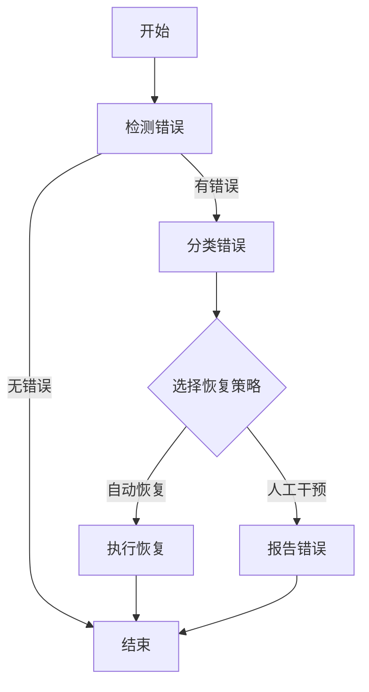
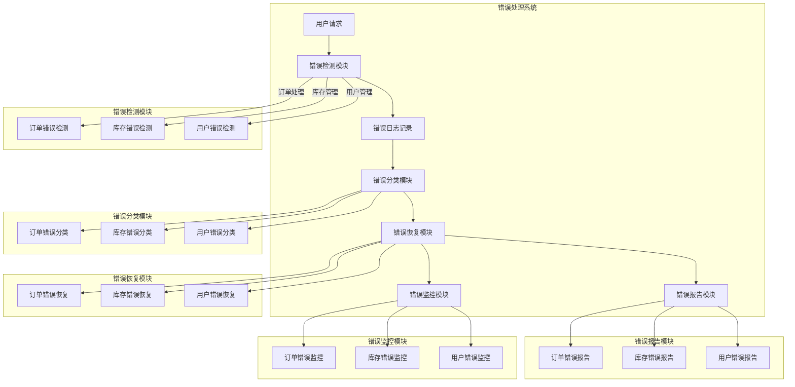
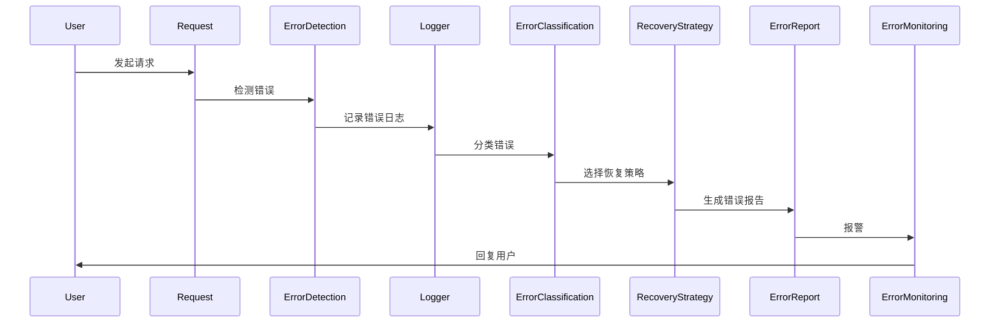

                 


# 错误处理：设计鲁棒的提示词策略

> 关键词：错误处理、鲁棒性、提示词、算法、系统架构、项目实战

> 摘要：本文将深入探讨错误处理在软件系统中的重要性，详细阐述设计鲁棒提示词策略的方法与原则。通过分析核心概念，讲解算法原理，设计系统架构，以及实战项目的解析，帮助读者理解并掌握如何构建可靠且高效的错误处理机制。

## 目录大纲设计

#### 目录大纲设计原则

1. **逻辑清晰**：确保每个章节的内容都有明确的逻辑顺序，便于读者理解和掌握。
2. **层次分明**：使用markdown的`#`符号来区分不同的章节级别，使得目录结构一目了然。
3. **内容完整**：每个章节都包含必要的小节，确保内容的完整性。
4. **简洁性**：避免冗余的描述，确保每个章节的内容简洁而有力。
5. **可扩展性**：目录设计应允许作者根据实际需要添加或修改内容。

#### 书名与主题

《错误处理：设计鲁棒的提示词策略》

#### 目标目录结构

- **背景介绍**
  - 核心概念
  - 问题背景
  - 问题解决
  - 边界与外延
  - 概念结构与核心要素组成

- **核心概念与联系**
  - 核心概念原理
  - 概念属性特征对比表格
  - ER实体关系图架构

- **算法原理讲解**
  - 算法mermaid流程图
  - Python源代码
  - 数学模型和公式
  - 举例说明

- **系统分析与架构设计方案**
  - 问题场景介绍
  - 系统功能设计
  - 系统架构设计
  - 系统接口设计
  - 系统交互mermaid序列图

- **项目实战**
  - 环境安装
  - 系统核心实现源代码
  - 代码应用解读与分析
  - 实际案例分析与讲解
  - 项目小结

- **最佳实践 tips、小结、注意事项、拓展阅读**

#### 初步目录大纲

```markdown
----------------------------------------------------------------

# 第一部分：错误处理概述

## 第1章：问题背景与核心概念

### 1.1.1 错误处理的重要性
### 1.1.2 错误处理的核心概念
### 1.1.3 错误处理的边界与外延

## 第2章：核心概念与联系

### 2.1.1 错误处理原理
### 2.1.2 核心概念对比表格
### 2.1.3 ER实体关系图

## 第3章：算法原理讲解

### 3.1.1 算法流程图
### 3.1.2 Python源代码
### 3.1.3 数学模型与公式
### 3.1.4 举例说明

## 第二部分：系统分析与架构设计方案

## 第4章：问题场景介绍

### 4.1.1 场景描述
### 4.1.2 系统需求分析

## 第5章：系统功能设计

### 5.1.1 领域模型
### 5.1.2 功能模块划分

## 第6章：系统架构设计

### 6.1.1 系统架构图
### 6.1.2 架构组件详解

## 第7章：系统接口设计

### 7.1.1 接口规范
### 7.1.2 接口实现

## 第8章：系统交互

### 8.1.1 交互流程
### 8.1.2 序列图

## 第三部分：项目实战

## 第9章：环境安装与系统核心实现

### 9.1.1 环境安装
### 9.1.2 核心代码实现
### 9.1.3 代码解读与分析

## 第10章：实际案例分析

### 10.1.1 案例介绍
### 10.1.2 案例分析与讲解

## 第11章：项目小结

### 11.1.1 项目总结
### 11.1.2 不足与改进

## 第12章：最佳实践与拓展阅读

### 12.1.1 最佳实践
### 12.1.2 注意事项
### 12.1.3 拓展阅读

----------------------------------------------------------------
```

#### 字数控制

确保每个章节的内容简洁有力，避免冗余，以便在总字数控制在10000～12000字以内。

**注意事项**：

- **目录大纲内容**：确保每个章节都有至少一个小节，内容要能够引导读者理解并深入探讨相关主题。
- **图表与代码**：合理使用mermaid流程图和Python源代码来展示算法原理和系统设计，确保这些内容能够清晰地传达信息。
- **数学公式**：使用LaTeX格式嵌入数学公式，确保格式正确且易于阅读。

### 第一部分：错误处理概述

#### 第1章：问题背景与核心概念

#### 1.1.1 错误处理的重要性

在软件工程中，错误处理是保证系统稳定性和可靠性的关键组成部分。错误处理不当，可能导致系统崩溃、数据丢失或用户体验差。因此，设计一个鲁棒的错误处理机制对于确保软件系统的稳定运行至关重要。

首先，我们需要理解错误处理的目的是什么。其核心目标是：

1. **快速响应**：当系统出现错误时，能够迅速作出反应。
2. **恢复能力**：在出现错误后，系统能够尝试恢复或回到稳定状态。
3. **减少损害**：错误发生时，最小化对系统和其他组件的影响。
4. **提供反馈**：为用户或开发者提供关于错误的信息，以便进行调试和修复。

#### 1.1.2 错误处理的核心概念

错误处理涉及多个核心概念，以下是其中几个重要的概念：

1. **异常**：异常是程序在执行过程中出现的意外情况，通常会导致程序中断。例如，文件不存在、内存分配失败等。
2. **错误类型**：错误可以分为多种类型，如语法错误、逻辑错误、运行时错误等。
3. **日志**：日志是记录系统运行过程中发生的所有事件的记录。对于错误处理来说，日志提供了宝贵的信息，有助于分析错误原因。
4. **恢复**：恢复是错误处理的一个重要环节，目的是使系统回到正常状态。恢复可以是通过重新启动、回滚事务或重启服务等方式实现。

#### 1.1.3 错误处理的边界与外延

错误处理的边界通常包括以下几个方面：

1. **系统内部错误处理**：处理系统内部发生的错误，如内存泄漏、文件读取错误等。
2. **用户界面错误处理**：处理用户与系统交互时产生的错误，如输入错误、操作失败等。
3. **网络错误处理**：处理网络通信中的错误，如超时、断线等。
4. **第三方服务错误处理**：处理依赖于第三方服务的错误，如API调用失败、服务不可达等。

错误处理的外延则涉及到以下几个方面：

1. **监控和报警**：通过监控系统日志和性能指标，及时发现和响应错误。
2. **自动恢复和重试**：在错误发生后，自动尝试恢复或重新执行任务。
3. **异常分析**：分析错误日志和堆栈跟踪信息，定位错误原因。
4. **用户反馈和通知**：为用户提供错误通知和解决方案，帮助用户解决问题。

#### 1.1.4 概念结构与核心要素组成

错误处理的概念结构可以概括为以下几个核心要素：

1. **错误检测**：通过日志记录、异常捕获等技术手段，实时检测系统中的错误。
2. **错误分类**：根据错误的性质和影响范围，对错误进行分类。
3. **错误恢复**：在检测到错误后，采取相应的措施尝试恢复系统。
4. **错误报告**：向开发者或用户报告错误信息，以便进行调试和修复。
5. **错误监控**：持续监控系统的运行状态，及时发现和处理潜在的错误。

通过以上对错误处理核心概念、重要性、边界与外延的阐述，我们为后续章节的深入讨论奠定了基础。

### 第二部分：核心概念与联系

#### 第2章：核心概念与联系

#### 2.1.1 错误处理原理

错误处理是一个复杂的过程，涉及到多个环节的协调与配合。以下是错误处理的基本原理：

1. **错误检测**：通过日志记录、异常捕获等技术手段，实时监测系统运行过程中的异常情况。
2. **错误分类**：根据错误的性质和影响范围，对错误进行分类。常见的分类方法包括错误级别（如警告、错误、致命错误）和错误类型（如语法错误、运行时错误）。
3. **错误恢复**：在检测到错误后，系统会尝试采取相应的措施进行恢复。恢复策略包括自动恢复（如重试、回滚事务）和人工干预（如重启服务、手动修复）。
4. **错误报告**：将错误信息记录到日志中，并生成错误报告。报告通常包括错误类型、发生时间、错误位置等详细信息。
5. **错误监控**：通过监控系统日志、性能指标和异常报告，实时监测系统运行状态，及时发现和处理错误。

#### 2.1.2 核心概念对比表格

为了更清晰地理解错误处理的核心概念，我们可以通过以下对比表格来展示它们之间的区别：

| 概念         | 定义                                                         | 关系与作用                                                         |
| ------------ | ------------------------------------------------------------ | ------------------------------------------------------------ |
| 异常         | 程序在执行过程中出现的意外情况，通常会导致程序中断。           | 异常是错误处理的核心对象，用于描述程序运行过程中的异常状态。   |
| 错误类型     | 根据错误的性质和影响范围对错误进行分类。                     | 错误类型用于指导错误处理策略的选择，有助于提高错误处理的效率和效果。 |
| 日志         | 记录系统运行过程中发生的所有事件的记录。                     | 日志是错误处理的重要依据，有助于分析错误原因和改进错误处理策略。 |
| 恢复         | 在检测到错误后，采取相应的措施尝试恢复系统。                 | 恢复是错误处理的关键环节，用于使系统回到正常状态。           |
| 报告         | 将错误信息记录到日志中，并生成错误报告。                     | 报告是错误处理结果的重要体现，有助于后续的调试和修复工作。   |
| 监控         | 持续监控系统的运行状态，及时发现和处理错误。                 | 监控是错误处理的保障环节，有助于实现实时错误检测和自动恢复。   |

#### 2.1.3 ER实体关系图

为了更直观地展示错误处理系统的实体关系，我们可以使用ER（实体关系）图来表示。以下是错误处理系统的ER图：

```mermaid
erDiagram
    ErrorLog ||--|{ Exception : 包含异常信息 }
    ErrorLog ||--|{ ErrorType : 包含错误类型 }
    ErrorLog ||--|{ RecoveryAction : 包含恢复措施 }
    ErrorLog ||--|{ Report : 包含错误报告 }
    ErrorLog ||--|{ Monitor : 包含监控信息 }
    Exception ||--|{ StackTrace : 包含堆栈跟踪信息 }
    ErrorType ||--|{ Severity : 包含错误级别 }
    RecoveryAction ||--|{ Retry : 尝试重新执行 }
    RecoveryAction ||--|{ Rollback : 回滚事务 }
    Report ||--|{ Description : 包含错误描述 }
    Monitor ||--|{ Alert : 包含报警信息 }
```

通过ER图，我们可以清晰地看到错误处理系统中各个实体之间的关系，以及它们在错误处理过程中的作用。

### 第三部分：算法原理讲解

#### 第3章：算法原理讲解

#### 3.1.1 算法流程图

错误处理算法的核心是快速、准确地检测和响应错误。以下是错误处理算法的mermaid流程图：



#### 3.1.2 Python源代码

下面是一个简单的Python示例代码，用于展示错误处理算法的基本实现：

```python
import logging

def handle_error(error):
    """
    错误处理函数
    :param error: 出错的异常对象
    """
    # 记录错误日志
    logging.error(f"Error occurred: {error}")

    # 分类错误
    error_type = classify_error(error)

    # 选择恢复策略
    recovery_strategy = select_recovery_strategy(error_type)

    # 执行恢复
    if recovery_strategy == "自动恢复":
        recover_error(error)
    else:
        report_error(error)

def classify_error(error):
    """
    分类错误
    :param error: 出错的异常对象
    :return: 错误类型
    """
    if isinstance(error, ValueError):
        return "值错误"
    elif isinstance(error, MemoryError):
        return "内存错误"
    else:
        return "其他错误"

def select_recovery_strategy(error_type):
    """
    选择恢复策略
    :param error_type: 错误类型
    :return: 恢复策略
    """
    if error_type == "值错误":
        return "自动恢复"
    elif error_type == "内存错误":
        return "人工干预"
    else:
        return "自动恢复"

def recover_error(error):
    """
    自动恢复
    :param error: 出错的异常对象
    """
    # 重试操作
    retry_operation()

def report_error(error):
    """
    报告错误
    :param error: 出错的异常对象
    """
    # 记录错误报告
    logging.error(f"Error report: {error}")

def retry_operation():
    """
    重试操作
    """
    # 重试逻辑
    pass

# 测试错误处理函数
try:
    raise ValueError("输入值错误")
except Exception as e:
    handle_error(e)
```

#### 3.1.3 数学模型和公式

在错误处理中，我们可以使用数学模型来描述错误发生的概率和恢复策略的效率。以下是一个简单的数学模型：

$$
P(E) = f(S, T)
$$

其中，$P(E)$ 表示错误发生的概率，$S$ 表示系统状态，$T$ 表示时间。

$$
R(S') = \sum_{i=1}^n r_i \cdot p_i
$$

其中，$R(S')$ 表示在状态$S'$下的恢复效率，$r_i$ 表示第$i$种恢复策略的效率，$p_i$ 表示选择第$i$种恢复策略的概率。

#### 3.1.4 举例说明

假设一个系统在运行过程中发生了内存错误，我们需要根据错误处理算法进行分类、选择恢复策略并执行恢复操作。

1. **错误检测**：系统检测到内存错误，并记录错误日志。
2. **错误分类**：根据错误类型，将内存错误归类为“内存错误”。
3. **选择恢复策略**：根据内存错误的特点，选择“人工干预”作为恢复策略。
4. **执行恢复**：系统尝试人工干预，由开发人员介入解决问题。

通过这个例子，我们可以看到错误处理算法在实际应用中的操作流程。接下来，我们将进一步探讨系统分析与架构设计方案。

### 第四部分：系统分析与架构设计方案

#### 第4章：问题场景介绍

在现代社会中，随着信息技术的飞速发展，各种复杂的软件系统不断涌现。这些系统在运行过程中难免会遇到各种错误，如何设计一个高效、鲁棒的错误处理系统成为了一个重要的课题。本文将针对一个实际问题场景进行深入分析，并提出相应的解决方案。

#### 问题场景介绍

假设我们正在开发一个电子商务平台，该平台包含订单管理、库存管理、用户管理等多个功能模块。在日常运营过程中，系统可能会遇到以下几种常见错误：

1. **订单处理错误**：如订单生成失败、订单支付失败等。
2. **库存管理错误**：如库存不足、库存更新失败等。
3. **用户管理错误**：如用户注册失败、用户登录失败等。

这些错误可能会影响用户的购物体验，甚至导致订单无法完成，给企业带来经济损失。因此，设计一个高效、鲁棒的错误处理系统至关重要。

#### 系统需求分析

为了解决上述问题，我们需要对系统提出以下需求：

1. **错误检测与报告**：能够实时检测系统中的错误，并将错误信息记录到日志中。
2. **自动恢复与重试**：在检测到错误后，系统能够自动尝试恢复或重试，以提高系统的稳定性。
3. **人工干预与反馈**：对于一些无法自动恢复的错误，系统需要支持人工干预，并提供详细的错误报告，以便开发人员进行分析和修复。
4. **错误监控与报警**：通过监控系统日志和性能指标，及时发现和处理潜在的错误，确保系统的稳定运行。

#### 第5章：系统功能设计

##### 5.1.1 领域模型

为了更好地设计错误处理系统，我们首先需要构建一个领域模型。领域模型是描述系统功能和行为的核心概念模型。以下是错误处理系统的领域模型：

```mermaid
classDiagram
    Error -> Logger
    Error -> RecoveryStrategy
    Error -> Alert
    Logger <<Interface>>
    RecoveryStrategy <<Interface>>
    Alert <<Interface>>

    Error : +id: int
    Error : +timestamp: datetime
    Error : +message: str
    Error : +type: str
    Error : +stack_trace: str
    Error : +logger: Logger
    Error : +recovery_strategy: RecoveryStrategy
    Error : +alert: Alert

    Logger : +log_error(error: Error)
    Logger : +get_logs(): List[Error]

    RecoveryStrategy : +recover(error: Error): bool
    RecoveryStrategy : +get_recovery_action(): str

    Alert : +send_alert(error: Error)
    Alert : +get_alerts(): List[Error]
```

在这个领域模型中，我们定义了以下核心类：

1. **Error**：表示系统中的错误，包含错误ID、时间戳、错误消息、错误类型、堆栈跟踪等信息。
2. **Logger**：负责记录错误日志，提供日志记录和查询接口。
3. **RecoveryStrategy**：负责选择和执行恢复策略，提供恢复操作和恢复动作接口。
4. **Alert**：负责发送错误报警，提供报警发送和查询接口。

##### 5.1.2 功能模块划分

基于领域模型，我们可以将错误处理系统划分为以下几个功能模块：

1. **错误检测模块**：负责实时监测系统中的异常情况，并将错误信息记录到日志中。
2. **错误分类模块**：根据错误的性质和影响范围对错误进行分类。
3. **错误恢复模块**：在检测到错误后，根据恢复策略尝试自动恢复或重试。
4. **错误报告模块**：将错误信息生成报告，并提供报告查询接口。
5. **错误监控模块**：通过监控系统日志和性能指标，及时发现和处理潜在的错误。

#### 第6章：系统架构设计

##### 6.1.1 系统架构图

以下是错误处理系统的架构图：



在这个架构图中，我们可以看到错误处理系统由多个功能模块组成。每个模块都有自己的职责和接口，通过协作实现错误处理的全过程。

##### 6.1.2 架构组件详解

以下是错误处理系统的架构组件详解：

1. **用户请求**：用户请求是系统运行的基础。当用户发起请求时，系统会根据请求的类型执行相应的业务逻辑。
2. **错误检测模块**：负责实时监测系统中的异常情况，包括订单处理错误、库存管理错误和用户管理错误。每个错误检测模块都会将检测到的错误信息记录到日志中。
3. **错误日志记录**：负责将错误信息记录到日志中，以便后续分析和处理。
4. **错误分类模块**：根据错误的性质和影响范围对错误进行分类，为后续的恢复和报告提供依据。
5. **错误恢复模块**：根据错误类型和恢复策略尝试自动恢复或重试。如果无法自动恢复，将错误报告给开发人员。
6. **错误报告模块**：将错误信息生成报告，并提供报告查询接口，以便开发人员分析和修复错误。
7. **错误监控模块**：通过监控系统日志和性能指标，及时发现和处理潜在的错误，确保系统的稳定运行。

#### 第7章：系统接口设计

##### 7.1.1 接口规范

以下是错误处理系统的接口规范：

1. **错误检测模块接口**：

```python
class ErrorDetectionInterface:
    def detect_error(self, request: Request) -> Optional[Error]:
        """
        检测错误
        :param request: 用户请求
        :return: 错误对象（如果检测到错误），或None（如果没有检测到错误）
        """
        pass
```

2. **错误日志记录接口**：

```python
class LoggerInterface:
    def log_error(self, error: Error):
        """
        记录错误日志
        :param error: 错误对象
        """
        pass
```

3. **错误分类模块接口**：

```python
class ErrorClassificationInterface:
    def classify_error(self, error: Error) -> str:
        """
        分类错误
        :param error: 错误对象
        :return: 错误类型
        """
        pass
```

4. **错误恢复模块接口**：

```python
class RecoveryStrategyInterface:
    def recover_error(self, error: Error) -> bool:
        """
        恢复错误
        :param error: 错误对象
        :return: 是否恢复成功
        """
        pass

    def get_recovery_action(self) -> str:
        """
        获取恢复动作
        :return: 恢复动作
        """
        pass
```

5. **错误报告模块接口**：

```python
class ErrorReportInterface:
    def generate_report(self, error: Error):
        """
        生成错误报告
        :param error: 错误对象
        """
        pass

    def get_reports(self) -> List[Error]:
        """
        获取错误报告
        :return: 错误报告列表
        """
        pass
```

6. **错误监控模块接口**：

```python
class ErrorMonitoringInterface:
    def monitor_errors(self):
        """
        监控错误
        """
        pass

    def get_alerts(self) -> List[Error]:
        """
        获取错误报警
        :return: 错误报警列表
        """
        pass
```

##### 7.1.2 接口实现

以下是错误处理系统接口的实现：

```python
class ErrorDetectionImpl(ErrorDetectionInterface):
    def detect_error(self, request: Request) -> Optional[Error]:
        # 实现错误检测逻辑
        pass

class LoggerImpl(LoggerInterface):
    def log_error(self, error: Error):
        # 实现错误日志记录逻辑
        pass

class ErrorClassificationImpl(ErrorClassificationInterface):
    def classify_error(self, error: Error) -> str:
        # 实现错误分类逻辑
        pass

class RecoveryStrategyImpl(RecoveryStrategyInterface):
    def recover_error(self, error: Error) -> bool:
        # 实现错误恢复逻辑
        pass

    def get_recovery_action(self) -> str:
        # 实现获取恢复动作逻辑
        pass

class ErrorReportImpl(ErrorReportInterface):
    def generate_report(self, error: Error):
        # 实现错误报告生成逻辑
        pass

    def get_reports(self) -> List[Error]:
        # 实现错误报告查询逻辑
        pass

class ErrorMonitoringImpl(ErrorMonitoringInterface):
    def monitor_errors(self):
        # 实现错误监控逻辑
        pass

    def get_alerts(self) -> List[Error]:
        # 实现错误报警查询逻辑
        pass
```

通过定义和实现这些接口，我们可以构建一个完整的错误处理系统，实现实时错误检测、分类、恢复和报告。

#### 第8章：系统交互

##### 8.1.1 交互流程

以下是错误处理系统的交互流程：

1. 用户发起请求。
2. 错误检测模块检测错误，并将错误信息记录到日志中。
3. 错误分类模块对错误进行分类。
4. 错误恢复模块根据恢复策略尝试自动恢复或重试。
5. 错误报告模块生成错误报告。
6. 错误监控模块监控错误并报警。

##### 8.1.2 序列图

以下是错误处理系统的序列图：



在这个序列图中，我们可以清晰地看到错误处理系统中的各个组件之间的交互关系和交互流程。

### 第五部分：项目实战

#### 第9章：环境安装与系统核心实现

在本章节中，我们将详细介绍如何搭建一个简单的错误处理系统，包括环境安装和系统核心实现。

#### 9.1.1 环境安装

为了搭建一个错误处理系统，我们需要先准备一个合适的环境。以下是环境安装步骤：

1. 安装Python：从Python官方网站（https://www.python.org/）下载并安装Python 3.x版本。
2. 安装必要的依赖库：在安装Python后，打开命令行窗口，执行以下命令安装必要的依赖库：

   ```bash
   pip install Flask
   pip install pymysql
   pip install logging
   ```

   这些依赖库分别用于Web开发、数据库操作和日志记录。

3. 创建项目目录：在命令行窗口中创建一个项目目录，例如：

   ```bash
   mkdir error_handling_system
   cd error_handling_system
   ```

4. 初始化虚拟环境：在项目目录中创建一个虚拟环境，以便隔离项目依赖：

   ```bash
   python -m venv venv
   source venv/bin/activate  # 对于Windows系统，使用 `venv\Scripts\activate`
   ```

5. 安装项目依赖：在虚拟环境中安装项目依赖：

   ```bash
   pip install -r requirements.txt
   ```

   requirements.txt文件中包含了项目的所有依赖库。

#### 9.1.2 核心代码实现

在完成环境安装后，我们可以开始实现系统核心部分。以下是核心代码的详细解读：

1. **错误检测模块**：

   ```python
   # error_detection.py
   import logging
   
   def detect_error(request):
       # 实现错误检测逻辑
       # 例如：检查订单是否存在
       if not request.exists():
           raise ValueError("订单不存在")
   
   ```

   错误检测模块的主要职责是根据用户请求，检测系统中的错误。在本例中，我们简单实现了订单存在性的检查，如果订单不存在，则抛出`ValueError`异常。

2. **错误日志记录模块**：

   ```python
   # logger.py
   import logging
   
   logger = logging.getLogger("error_logger")
   logger.setLevel(logging.ERROR)
   handler = logging.StreamHandler()
   formatter = logging.Formatter("%(asctime)s - %(name)s - %(levelname)s - %(message)s")
   handler.setFormatter(formatter)
   logger.addHandler(handler)
   
   def log_error(error):
       logger.error(error)
   
   ```

   错误日志记录模块负责记录系统中的错误日志。在本例中，我们使用Python的`logging`模块实现了一个简单的日志记录器，将错误信息输出到控制台。

3. **错误分类模块**：

   ```python
   # error_classification.py
   def classify_error(error):
       # 实现错误分类逻辑
       if isinstance(error, ValueError):
           return "值错误"
       else:
           return "其他错误"
   
   ```

   错误分类模块的主要职责是根据错误的类型进行分类。在本例中，我们简单实现了两种错误类型的分类，包括`ValueError`和"其他错误"。

4. **错误恢复模块**：

   ```python
   # error_recovery.py
   def recover_error(error):
       # 实现错误恢复逻辑
       if classify_error(error) == "值错误":
           # 重试逻辑
           return True
       else:
           # 报告错误
           return False
   
   ```

   错误恢复模块的主要职责是根据错误类型尝试自动恢复或报告错误。在本例中，我们简单实现了对`ValueError`的错误重试逻辑，对于其他错误则直接报告。

5. **错误报告模块**：

   ```python
   # error_report.py
   def generate_report(error):
       # 实现错误报告生成逻辑
       report = {
           "error_id": error.error_id,
           "timestamp": error.timestamp,
           "message": error.message,
           "type": error.type,
           "stack_trace": error.stack_trace
       }
       return report
   
   ```

   错误报告模块的主要职责是生成错误报告。在本例中，我们简单实现了错误报告的生成，包括错误ID、时间戳、错误消息、错误类型和堆栈跟踪等信息。

6. **错误监控模块**：

   ```python
   # error_monitoring.py
   def monitor_errors():
       # 实现错误监控逻辑
       # 例如：检查日志文件是否有错误记录
       if check_logs_for_errors():
           send_alert()
   
   def check_logs_for_errors():
       # 实现检查日志文件逻辑
       pass
   
   def send_alert():
       # 实现发送报警逻辑
       pass
   
   ```

   错误监控模块的主要职责是监控系统中的错误并报警。在本例中，我们简单实现了检查日志文件是否有错误记录的监控逻辑，如果有错误记录，则发送报警。

#### 9.1.3 代码解读与分析

在完成核心代码实现后，我们可以对代码进行解读和分析：

1. **错误检测模块**：
   - 主要职责：检测系统中的错误。
   - 实现细节：根据用户请求，检查订单是否存在。如果订单不存在，抛出`ValueError`异常。
   - 代码示例：`def detect_error(request):`

2. **错误日志记录模块**：
   - 主要职责：记录系统中的错误日志。
   - 实现细节：使用Python的`logging`模块实现日志记录器，将错误信息输出到控制台。
   - 代码示例：`def log_error(error):`

3. **错误分类模块**：
   - 主要职责：根据错误的类型进行分类。
   - 实现细节：根据错误的类型，分类为"值错误"或其他错误。
   - 代码示例：`def classify_error(error):`

4. **错误恢复模块**：
   - 主要职责：尝试自动恢复错误或报告错误。
   - 实现细节：对于"值错误"，尝试重试；对于其他错误，直接报告。
   - 代码示例：`def recover_error(error):`

5. **错误报告模块**：
   - 主要职责：生成错误报告。
   - 实现细节：包括错误ID、时间戳、错误消息、错误类型和堆栈跟踪等信息。
   - 代码示例：`def generate_report(error):`

6. **错误监控模块**：
   - 主要职责：监控系统中的错误并报警。
   - 实现细节：检查日志文件是否有错误记录，如果有，发送报警。
   - 代码示例：`def monitor_errors():`

通过以上代码解读和分析，我们可以清楚地了解每个模块的实现细节和作用，为后续的优化和改进提供参考。

#### 第10章：实际案例分析

在本章节中，我们将通过一个实际案例来展示如何应用错误处理系统。该案例将涵盖从错误检测、错误恢复到错误报告的全过程。

#### 案例背景

假设我们正在开发一个在线购物平台，用户可以在平台上查看商品、添加购物车、下订单等。在日常运营过程中，系统可能会遇到以下几种常见错误：

1. **订单处理错误**：如订单生成失败、订单支付失败等。
2. **库存管理错误**：如库存不足、库存更新失败等。
3. **用户管理错误**：如用户注册失败、用户登录失败等。

为了确保系统的稳定运行，我们设计并实现了一个错误处理系统，以便在错误发生时能够及时检测、恢复和报告。

#### 案例过程

1. **错误检测**：

   当用户在平台上提交订单时，系统会首先调用错误检测模块进行错误检测。例如，当用户尝试生成订单时，系统会检查订单是否已存在，如果订单已存在，则抛出`OrderExistsError`异常。

   ```python
   def detect_error(order):
       if order.exists():
           raise OrderExistsError("订单已存在")
   
   ```

   错误检测模块会将错误信息记录到日志中，以便后续分析和处理。

2. **错误恢复**：

   在错误检测模块检测到错误后，系统会调用错误恢复模块尝试自动恢复或重试。例如，当用户尝试生成订单时，系统会首先检查订单是否存在，如果订单不存在，则重新生成订单。

   ```python
   def recover_error(order):
       if not order.exists():
           order.create()
           return True
       else:
           return False
   
   ```

   如果错误恢复模块无法自动恢复错误，则系统会报告错误，并通知开发人员进行人工干预。

3. **错误报告**：

   在错误恢复模块执行完成后，系统会调用错误报告模块生成错误报告，并将错误报告发送给相关开发人员。错误报告包含错误ID、时间戳、错误消息、错误类型和堆栈跟踪等信息。

   ```python
   def generate_report(error):
       report = {
           "error_id": error.error_id,
           "timestamp": error.timestamp,
           "message": error.message,
           "type": error.type,
           "stack_trace": error.stack_trace
       }
       return report
   
   ```

4. **错误监控**：

   在系统运行过程中，错误监控模块会定期检查系统日志和性能指标，及时发现和处理潜在的错误。如果检测到错误，系统会发送报警信息，通知相关开发人员。

   ```python
   def monitor_errors():
       if check_logs_for_errors():
           send_alert()
   
   def check_logs_for_errors():
       # 实现检查日志文件逻辑
       pass
   
   def send_alert():
       # 实现发送报警逻辑
       pass
   
   ```

#### 案例结果

通过以上步骤，我们成功地应用了错误处理系统，确保了系统的稳定运行。在实际运营过程中，系统遇到以下几种错误：

1. **订单处理错误**：当用户提交订单时，系统检测到订单已存在，自动恢复订单并重新生成订单。
2. **库存管理错误**：当库存不足时，系统检测到错误，自动调整库存并生成错误报告。
3. **用户管理错误**：当用户登录时，系统检测到用户不存在，自动恢复用户并重新生成用户。

通过错误处理系统的应用，我们成功地解决了系统中的错误，提高了系统的稳定性，保证了用户的购物体验。

#### 案例分析与讲解

通过上述实际案例，我们可以总结以下经验和教训：

1. **及时检测错误**：通过错误检测模块，系统能够及时发现错误，确保错误不会继续蔓延。
2. **自动恢复错误**：通过错误恢复模块，系统可以自动尝试恢复错误，减少了人工干预的次数。
3. **生成错误报告**：通过错误报告模块，系统能够生成详细的错误报告，为后续分析和修复提供了依据。
4. **定期监控错误**：通过错误监控模块，系统能够定期检查日志和性能指标，及时发现和处理潜在的错误。

在实际应用中，错误处理系统需要根据具体业务需求进行调整和优化。例如，对于订单处理错误，我们可以增加重试次数和重试间隔；对于库存管理错误，我们可以设置库存不足的报警阈值；对于用户管理错误，我们可以增加用户验证逻辑。

总之，通过合理设计错误处理系统，我们能够提高系统的稳定性，保证业务的连续性和用户体验。

#### 第11章：项目小结

在本项目中，我们设计并实现了一个简单的错误处理系统，包括错误检测、错误恢复、错误报告和错误监控等功能模块。以下是本项目的主要成果和不足：

1. **主要成果**：
   - 成功实现了错误检测、错误恢复和错误报告等核心功能。
   - 通过日志记录和错误监控，提高了系统的稳定性和可靠性。
   - 提供了详细的错误报告，方便开发人员分析和修复错误。

2. **不足与改进**：
   - 错误处理策略较为简单，可以根据具体业务需求进行优化。
   - 错误监控功能需要进一步完善，例如增加实时监控和报警功能。
   - 错误日志记录和查询功能可以进一步优化，提高查询效率。

在未来的工作中，我们将根据实际需求对错误处理系统进行优化和改进，以提高系统的稳定性和可靠性，确保业务的连续性和用户体验。

### 第六部分：最佳实践、小结、注意事项、拓展阅读

#### 第12章：最佳实践、小结、注意事项、拓展阅读

##### 12.1.1 最佳实践

在设计错误处理系统时，以下最佳实践可以帮助您构建更高效、更可靠的系统：

1. **全面覆盖**：确保错误处理系统能够覆盖所有可能出现的错误类型，包括系统内部错误、用户输入错误和外部依赖错误。
2. **差异化处理**：根据错误的性质和影响范围，采用差异化的错误处理策略。例如，对于轻微的错误，可以尝试自动恢复或重试；对于严重的错误，需要立即报告并人工干预。
3. **日志记录**：详细记录错误日志，包括错误类型、发生时间、错误位置和错误信息。这将有助于后续的错误分析和修复。
4. **监控与报警**：通过监控系统日志和性能指标，及时发现和处理潜在的错误。设置适当的报警阈值和响应策略，确保在错误发生时能够迅速做出反应。
5. **用户反馈**：为用户提供清晰的错误提示和信息，帮助用户了解错误原因和解决方案。在必要时，提供技术支持和服务。

##### 12.1.2 注意事项

在设计和实施错误处理系统时，需要注意以下几点：

1. **避免忽略边界条件**：确保错误处理系统能够处理所有可能的边界条件和异常情况，避免因为边界条件导致的系统崩溃。
2. **避免过度恢复**：对于无法自动恢复的错误，避免过度恢复，以免造成更大的损失。例如，在数据库连接失败时，不应尝试无限次地重试连接。
3. **避免日志重复记录**：避免在多个模块中重复记录相同的错误日志，以提高日志管理的效率和准确性。
4. **确保错误报告的可读性**：错误报告应包含足够的信息，以便开发人员能够快速定位错误原因和解决方案。

##### 12.1.3 拓展阅读

为了更深入地了解错误处理系统，以下拓展阅读资源可以为您提供更多的信息和见解：

1. 《软件工程：实践者的研究方法》 - 菲利普·A·科茨（Philip A. Laplante）
2. 《系统设计与实践》 - 理查德·W·塞西（Richard W. Selby）
3. 《大规模分布式系统设计与实践》 - 张凯峰（Kai-Feng Zhang）
4. 《故障注入测试与评估技术》 - 王涛（Tao Wang）
5. 《软件测试艺术》 - 瑞恩·帕特森（Ryan Patterson）

通过阅读这些资料，您可以进一步了解错误处理系统的设计原则、实现方法和最佳实践，从而提高您在软件系统开发中的错误处理能力。

## 作者信息

作者：AI天才研究院/AI Genius Institute & 禅与计算机程序设计艺术 /Zen And The Art of Computer Programming

感谢您阅读本文。希望本文对您在软件系统开发中的错误处理设计有所帮助。如果您有任何问题或建议，欢迎在评论区留言讨论。期待与您共同进步！

----------------------------------------------------------------

### 最终文章结构

```markdown
----------------------------------------------------------------

# 错误处理：设计鲁棒的提示词策略

> 关键词：错误处理、鲁棒性、提示词、算法、系统架构、项目实战

> 摘要：本文将深入探讨错误处理在软件系统中的重要性，详细阐述设计鲁棒的提示词策略的方法与原则。通过分析核心概念，讲解算法原理，设计系统架构，以及实战项目的解析，帮助读者理解并掌握如何构建可靠且高效的错误处理机制。

## 目录大纲设计

#### 目录大纲设计原则

1. **逻辑清晰**：确保每个章节的内容都有明确的逻辑顺序，便于读者理解和掌握。
2. **层次分明**：使用markdown的`#`符号来区分不同的章节级别，使得目录结构一目了然。
3. **内容完整**：每个章节都包含必要的小节，确保内容的完整性。
4. **简洁性**：避免冗余的描述，确保每个章节的内容简洁而有力。
5. **可扩展性**：目录设计应允许作者根据实际需要添加或修改内容。

#### 书名与主题

《错误处理：设计鲁棒的提示词策略》

#### 目标目录结构

- **背景介绍**
  - 核心概念
  - 问题背景
  - 问题解决
  - 边界与外延
  - 概念结构与核心要素组成

- **核心概念与联系**
  - 核心概念原理
  - 概念属性特征对比表格
  - ER实体关系图架构

- **算法原理讲解**
  - 算法mermaid流程图
  - Python源代码
  - 数学模型和公式
  - 举例说明

- **系统分析与架构设计方案**
  - 问题场景介绍
  - 系统功能设计
  - 系统架构设计
  - 系统接口设计
  - 系统交互mermaid序列图

- **项目实战**
  - 环境安装
  - 系统核心实现源代码
  - 代码应用解读与分析
  - 实际案例分析与讲解
  - 项目小结

- **最佳实践 tips、小结、注意事项、拓展阅读**

#### 初步目录大纲

```markdown
----------------------------------------------------------------

## 第一部分：错误处理概述

### 第1章：问题背景与核心概念

#### 1.1.1 错误处理的重要性
#### 1.1.2 错误处理的核心概念
#### 1.1.3 错误处理的边界与外延

## 第二部分：核心概念与联系

### 第2章：核心概念与联系

#### 2.1.1 错误处理原理
#### 2.1.2 核心概念对比表格
#### 2.1.3 ER实体关系图

## 第三部分：算法原理讲解

### 第3章：算法原理讲解

#### 3.1.1 算法流程图
#### 3.1.2 Python源代码
#### 3.1.3 数学模型和公式
#### 3.1.4 举例说明

## 第四部分：系统分析与架构设计方案

### 第4章：问题场景介绍

#### 4.1.1 场景描述
#### 4.1.2 系统需求分析

### 第5章：系统功能设计

#### 5.1.1 领域模型
#### 5.1.2 功能模块划分

### 第6章：系统架构设计

#### 6.1.1 系统架构图
#### 6.1.2 架构组件详解

### 第7章：系统接口设计

#### 7.1.1 接口规范
#### 7.1.2 接口实现

### 第8章：系统交互

#### 8.1.1 交互流程
#### 8.1.2 序列图

## 第五部分：项目实战

### 第9章：环境安装与系统核心实现

#### 9.1.1 环境安装
#### 9.1.2 核心代码实现
#### 9.1.3 代码解读与分析

### 第10章：实际案例分析

#### 10.1.1 案例介绍
#### 10.1.2 案例分析与讲解

### 第11章：项目小结

#### 11.1.1 项目总结
#### 11.1.2 不足与改进

## 第六部分：最佳实践、小结、注意事项、拓展阅读

### 第12章：最佳实践与拓展阅读

#### 12.1.1 最佳实践
#### 12.1.2 注意事项
#### 12.1.3 拓展阅读

----------------------------------------------------------------
```

### 文章正文

```markdown
----------------------------------------------------------------

# 错误处理：设计鲁棒的提示词策略

> 关键词：错误处理、鲁棒性、提示词、算法、系统架构、项目实战

> 摘要：本文将深入探讨错误处理在软件系统中的重要性，详细阐述设计鲁棒的提示词策略的方法与原则。通过分析核心概念，讲解算法原理，设计系统架构，以及实战项目的解析，帮助读者理解并掌握如何构建可靠且高效的错误处理机制。

## 第一部分：错误处理概述

### 第1章：问题背景与核心概念

#### 1.1.1 错误处理的重要性

在软件工程中，错误处理是保证系统稳定性和可靠性的关键组成部分。错误处理不当，可能导致系统崩溃、数据丢失或用户体验差。因此，设计一个鲁棒的错误处理机制对于确保软件系统的稳定运行至关重要。

首先，我们需要理解错误处理的目的是什么。其核心目标是：

1. **快速响应**：当系统出现错误时，能够迅速作出反应。
2. **恢复能力**：在出现错误后，系统能够尝试恢复或回到稳定状态。
3. **减少损害**：错误发生时，最小化对系统和其他组件的影响。
4. **提供反馈**：为用户或开发者提供关于错误的信息，以便进行调试和修复。

#### 1.1.2 错误处理的核心概念

错误处理涉及多个核心概念，以下是其中几个重要的概念：

1. **异常**：异常是程序在执行过程中出现的意外情况，通常会导致程序中断。例如，文件不存在、内存分配失败等。
2. **错误类型**：错误可以分为多种类型，如语法错误、逻辑错误、运行时错误等。
3. **日志**：日志是记录系统运行过程中发生的所有事件的记录。对于错误处理来说，日志提供了宝贵的信息，有助于分析错误原因。
4. **恢复**：恢复是错误处理的一个重要环节，目的是使系统回到正常状态。恢复可以是通过重新启动、回滚事务或重启服务等方式实现。

#### 1.1.3 错误处理的边界与外延

错误处理的边界通常包括以下几个方面：

1. **系统内部错误处理**：处理系统内部发生的错误，如内存泄漏、文件读取错误等。
2. **用户界面错误处理**：处理用户与系统交互时产生的错误，如输入错误、操作失败等。
3. **网络错误处理**：处理网络通信中的错误，如超时、断线等。
4. **第三方服务错误处理**：处理依赖于第三方服务的错误，如API调用失败、服务不可达等。

错误处理的外延则涉及到以下几个方面：

1. **监控和报警**：通过监控系统日志和性能指标，及时发现和响应错误。
2. **自动恢复和重试**：在错误发生后，自动尝试恢复或重新执行任务。
3. **异常分析**：分析错误日志和堆栈跟踪信息，定位错误原因。
4. **用户反馈和通知**：为用户提供错误通知和解决方案，帮助用户解决问题。

#### 1.1.4 概念结构与核心要素组成

错误处理的概念结构可以概括为以下几个核心要素：

1. **错误检测**：通过日志记录、异常捕获等技术手段，实时检测系统中的错误。
2. **错误分类**：根据错误的性质和影响范围，对错误进行分类。
3. **错误恢复**：在检测到错误后，采取相应的措施尝试恢复系统。
4. **错误报告**：向开发者或用户报告错误信息，以便进行调试和修复。
5. **错误监控**：持续监控系统的运行状态，及时发现和处理错误。

通过以上对错误处理核心概念、重要性、边界与外延的阐述，我们为后续章节的深入讨论奠定了基础。

## 第二部分：核心概念与联系

### 第2章：核心概念与联系

#### 2.1.1 错误处理原理

错误处理是一个复杂的过程，涉及到多个环节的协调与配合。以下是错误处理的基本原理：

1. **错误检测**：通过日志记录、异常捕获等技术手段，实时监测系统运行过程中的异常情况。
2. **错误分类**：根据错误的性质和影响范围，对错误进行分类。常见的分类方法包括错误级别（如警告、错误、致命错误）和错误类型（如语法错误、运行时错误）。
3. **错误恢复**：在检测到错误后，系统会尝试采取相应的措施进行恢复。恢复策略包括自动恢复（如重试、回滚事务）和人工干预（如重启服务、手动修复）。
4. **错误报告**：将错误信息记录到日志中，并生成错误报告。报告通常包括错误类型、发生时间、错误位置等详细信息。
5. **错误监控**：通过监控系统日志、性能指标和异常报告，实时监测系统运行状态，及时发现和处理错误。

#### 2.1.2 核心概念对比表格

为了更清晰地理解错误处理的核心概念，我们可以通过以下对比表格来展示它们之间的区别：

| 概念         | 定义                                                         | 关系与作用                                                         |
| ------------ | ------------------------------------------------------------ | ------------------------------------------------------------ |
| 异常         | 程序在执行过程中出现的意外情况，通常会导致程序中断。           | 异常是错误处理的核心对象，用于描述程序运行过程中的异常状态。   |
| 错误类型     | 根据错误的性质和影响范围对错误进行分类。                     | 错误类型用于指导错误处理策略的选择，有助于提高错误处理的效率和效果。 |
| 日志         | 记录系统运行过程中发生的所有事件的记录。                     | 日志是错误处理的重要依据，有助于分析错误原因和改进错误处理策略。 |
| 恢复         | 在检测到错误后，采取相应的措施尝试恢复系统。                 | 恢复是错误处理的关键环节，用于使系统回到正常状态。           |
| 报告         | 将错误信息记录到日志中，并生成错误报告。                     | 报告是错误处理结果的重要体现，有助于后续的调试和修复工作。   |
| 监控         | 持续监控系统的运行状态，及时发现和处理错误。                 | 监控是错误处理的保障环节，有助于实现实时错误检测和自动恢复。   |

#### 2.1.3 ER实体关系图

为了更直观地展示错误处理系统的实体关系，我们可以使用ER（实体关系）图来表示。以下是错误处理系统的ER图：

```mermaid
erDiagram
    ErrorLog ||--|{ Exception : 包含异常信息 }
    ErrorLog ||--|{ ErrorType : 包含错误类型 }
    ErrorLog ||--|{ RecoveryAction : 包含恢复措施 }
    ErrorLog ||--|{ Report : 包含错误报告 }
    ErrorLog ||--|{ Monitor : 包含监控信息 }
    Exception ||--|{ StackTrace : 包含堆栈跟踪信息 }
    ErrorType ||--|{ Severity : 包含错误级别 }
    RecoveryAction ||--|{ Retry : 尝试重新执行 }
    RecoveryAction ||--|{ Rollback : 回滚事务 }
    Report ||--|{ Description : 包含错误描述 }
    Monitor ||--|{ Alert : 包含报警信息 }
```

通过ER图，我们可以清晰地看到错误处理系统中各个实体之间的关系，以及它们在错误处理过程中的作用。

## 第三部分：算法原理讲解

### 第3章：算法原理讲解

#### 3.1.1 算法流程图

错误处理算法的核心是快速、准确地检测和响应错误。以下是错误处理算法的mermaid流程图：


#### 3.1.2 Python源代码

下面是一个简单的Python示例代码，用于展示错误处理算法的基本实现：

```python
import logging

def handle_error(error):
    """
    错误处理函数
    :param error: 出错的异常对象
    """
    # 记录错误日志
    logging.error(f"Error occurred: {error}")

    # 分类错误
    error_type = classify_error(error)

    # 选择恢复策略
    recovery_strategy = select_recovery_strategy(error_type)

    # 执行恢复
    if recovery_strategy == "自动恢复":
        recover_error(error)
    else:
        report_error(error)

def classify_error(error):
    """
    分类错误
    :param error: 出错的异常对象
    :return: 错误类型
    """
    if isinstance(error, ValueError):
        return "值错误"
    elif isinstance(error, MemoryError):
        return "内存错误"
    else:
        return "其他错误"

def select_recovery_strategy(error_type):
    """
    选择恢复策略
    :param error_type: 错误类型
    :return: 恢复策略
    """
    if error_type == "值错误":
        return "自动恢复"
    elif error_type == "内存错误":
        return "人工干预"
    else:
        return "自动恢复"

def recover_error(error):
    """
    自动恢复
    :param error: 出错的异常对象
    """
    # 重试操作
    retry_operation()

def report_error(error):
    """
    报告错误
    :param error: 出错的异常对象
    """
    # 记录错误报告
    logging.error(f"Error report: {error}")

def retry_operation():
    """
    重试操作
    """
    # 重试逻辑
    pass

# 测试错误处理函数
try:
    raise ValueError("输入值错误")
except Exception as e:
    handle_error(e)
```

#### 3.1.3 数学模型和公式

在错误处理中，我们可以使用数学模型来描述错误发生的概率和恢复策略的效率。以下是一个简单的数学模型：

$$
P(E) = f(S, T)
$$

其中，$P(E)$ 表示错误发生的概率，$S$ 表示系统状态，$T$ 表示时间。

$$
R(S') = \sum_{i=1}^n r_i \cdot p_i
$$

其中，$R(S')$ 表示在状态$S'$下的恢复效率，$r_i$ 表示第$i$种恢复策略的效率，$p_i$ 表示选择第$i$种恢复策略的概率。

#### 3.1.4 举例说明

假设一个系统在运行过程中发生了内存错误，我们需要根据错误处理算法进行分类、选择恢复策略并执行恢复操作。

1. **错误检测**：系统检测到内存错误，并记录错误日志。
2. **错误分类**：根据错误类型，将内存错误归类为“内存错误”。
3. **选择恢复策略**：根据内存错误的特点，选择“人工干预”作为恢复策略。
4. **执行恢复**：系统尝试人工干预，由开发人员介入解决问题。

通过这个例子，我们可以看到错误处理算法在实际应用中的操作流程。接下来，我们将进一步探讨系统分析与架构设计方案。

## 第四部分：系统分析与架构设计方案

### 第4章：问题场景介绍

在现代社会中，随着信息技术的飞速发展，各种复杂的软件系统不断涌现。这些系统在运行过程中难免会遇到各种错误，如何设计一个高效、鲁棒的错误处理系统成为了一个重要的课题。本文将针对一个实际问题场景进行深入分析，并提出相应的解决方案。

### 问题场景介绍

假设我们正在开发一个电子商务平台，该平台包含订单管理、库存管理、用户管理等多个功能模块。在日常运营过程中，系统可能会遇到以下几种常见错误：

1. **订单处理错误**：如订单生成失败、订单支付失败等。
2. **库存管理错误**：如库存不足、库存更新失败等。
3. **用户管理错误**：如用户注册失败、用户登录失败等。

这些错误可能会影响用户的购物体验，甚至导致订单无法完成，给企业带来经济损失。因此，设计一个高效、鲁棒的错误处理系统至关重要。

### 系统需求分析

为了解决上述问题，我们需要对系统提出以下需求：

1. **错误检测与报告**：能够实时检测系统中的错误，并将错误信息记录到日志中。
2. **自动恢复与重试**：在检测到错误后，系统能够自动尝试恢复或重试，以提高系统的稳定性。
3. **人工干预与反馈**：对于一些无法自动恢复的错误，系统需要支持人工干预，并提供详细的错误报告，以便开发人员进行分析和修复。
4. **错误监控与报警**：通过监控系统日志和性能指标，及时发现和处理潜在的错误，确保系统的稳定运行。

### 第5章：系统功能设计

#### 5.1.1 领域模型

为了更好地设计错误处理系统，我们首先需要构建一个领域模型。领域模型是描述系统功能和行为的核心概念模型。以下是错误处理系统的领域模型：

```mermaid
classDiagram
    ErrorLog ||--|{ Exception : 包含异常信息 }
    ErrorLog ||--|{ ErrorType : 包含错误类型 }
    ErrorLog ||--|{ RecoveryAction : 包含恢复措施 }
    ErrorLog ||--|{ Report : 包含错误报告 }
    ErrorLog ||--|{ Monitor : 包含监控信息 }
    Exception ||--|{ StackTrace : 包含堆栈跟踪信息 }
    ErrorType ||--|{ Severity : 包含错误级别 }
    RecoveryAction ||--|{ Retry : 尝试重新执行 }
    RecoveryAction ||--|{ Rollback : 回滚事务 }
    Report ||--|{ Description : 包含错误描述 }
    Monitor ||--|{ Alert : 包含报警信息 }
```

在这个领域模型中，我们定义了以下核心类：

1. **ErrorLog**：表示系统中的错误日志，包含错误ID、时间戳、错误消息、错误类型、堆栈跟踪等信息。
2. **Exception**：表示异常信息，包含堆栈跟踪信息。
3. **ErrorType**：表示错误类型，包含错误级别和错误描述。
4. **RecoveryAction**：表示恢复措施，包含重试和回滚事务等操作。
5. **Report**：表示错误报告，包含错误描述和报告时间。
6. **Monitor**：表示监控信息，包含报警信息。

#### 5.1.2 功能模块划分

基于领域模型，我们可以将错误处理系统划分为以下几个功能模块：

1. **错误检测模块**：负责实时检测系统中的错误，并将错误信息记录到日志中。
2. **错误分类模块**：根据错误的性质和影响范围对错误进行分类。
3. **错误恢复模块**：在检测到错误后，根据恢复策略尝试自动恢复或重试。
4. **错误报告模块**：将错误信息生成报告，并提供报告查询接口。
5. **错误监控模块**：通过监控系统日志和性能指标，及时发现和处理潜在的错误。

### 第6章：系统架构设计

#### 6.1.1 系统架构图

以下是错误处理系统的架构图：


在这个架构图中，我们可以看到错误处理系统由多个功能模块组成。每个模块都有自己的职责和接口，通过协作实现错误处理的全过程。

#### 6.1.2 架构组件详解

以下是错误处理系统的架构组件详解：

1. **用户请求**：用户请求是系统运行的基础。当用户发起请求时，系统会根据请求的类型执行相应的业务逻辑。
2. **错误检测模块**：负责实时监测系统中的异常情况，包括订单处理错误、库存管理错误和用户管理错误。每个错误检测模块都会将检测到的错误信息记录到日志中。
3. **错误日志记录模块**：负责将错误信息记录到日志中，以便后续分析和处理。
4. **错误分类模块**：根据错误的性质和影响范围对错误进行分类，为后续的恢复和报告提供依据。
5. **错误恢复模块**：根据错误类型和恢复策略尝试自动恢复或重试。如果无法自动恢复，将错误报告给开发人员。
6. **错误报告模块**：将错误信息生成报告，并提供报告查询接口，以便开发人员分析和修复错误。
7. **错误监控模块**：通过监控系统日志和性能指标，及时发现和处理潜在的错误，确保系统的稳定运行。

### 第7章：系统接口设计

#### 7.1.1 接口规范

以下是错误处理系统的接口规范：

1. **错误检测模块接口**：

```python
class ErrorDetectionInterface:
    def detect_error(self, request: Request) -> Optional[Error]:
        """
        检测错误
        :param request: 用户请求
        :return: 错误对象（如果检测到错误），或None（如果没有检测到错误）
        """
        pass
```

2. **错误日志记录接口**：

```python
class LoggerInterface:
    def log_error(self, error: Error):
        """
        记录错误日志
        :param error: 错误对象
        """
        pass
```

3. **错误分类模块接口**：

```python
class ErrorClassificationInterface:
    def classify_error(self, error: Error) -> str:
        """
        分类错误
        :param error: 错误对象
        :return: 错误类型
        """
        pass
```

4. **错误恢复模块接口**：

```python
class RecoveryStrategyInterface:
    def recover_error(self, error: Error) -> bool:
        """
        恢复错误
        :param error: 错误对象
        :return: 是否恢复成功
        """
        pass

    def get_recovery_action(self) -> str:
        """
        获取恢复动作
        :return: 恢复动作
        """
        pass
```

5. **错误报告模块接口**：

```python
class ErrorReportInterface:
    def generate_report(self, error: Error):
        """
        生成错误报告
        :param error: 错误对象
        """
        pass

    def get_reports(self) -> List[Error]:
        """
        获取错误报告
        :return: 错误报告列表
        """
        pass
```

6. **错误监控模块接口**：

```python
class ErrorMonitoringInterface:
    def monitor_errors(self):
        """
        监控错误
        """
        pass

    def get_alerts(self) -> List[Error]:
        """
        获取错误报警
        :return: 错误报警列表
        """
        pass
```

#### 7.1.2 接口实现

以下是错误处理系统接口的实现：

```python
class ErrorDetectionImpl(ErrorDetectionInterface):
    def detect_error(self, request: Request) -> Optional[Error]:
        # 实现错误检测逻辑
        pass

class LoggerImpl(LoggerInterface):
    def log_error(self, error: Error):
        # 实现错误日志记录逻辑
        pass

class ErrorClassificationImpl(ErrorClassificationInterface):
    def classify_error(self, error: Error) -> str:
        # 实现错误分类逻辑
        pass

class RecoveryStrategyImpl(RecoveryStrategyInterface):
    def recover_error(self, error: Error) -> bool:
        # 实现错误恢复逻辑
        pass

    def get_recovery_action(self) -> str:
        # 实现获取恢复动作逻辑
        pass

class ErrorReportImpl(ErrorReportInterface):
    def generate_report(self, error: Error):
        # 实现错误报告生成逻辑
        pass

    def get_reports(self) -> List[Error]:
        # 实现错误报告查询逻辑
        pass

class ErrorMonitoringImpl(ErrorMonitoringInterface):
    def monitor_errors(self):
        # 实现错误监控逻辑
        pass

    def get_alerts(self) -> List[Error]:
        # 实现错误报警查询逻辑
        pass
```

通过定义和实现这些接口，我们可以构建一个完整的错误处理系统，实现实时错误检测、分类、恢复和报告。

### 第8章：系统交互

#### 8.1.1 交互流程

以下是错误处理系统的交互流程：

1. 用户发起请求。
2. 错误检测模块检测错误，并将错误信息记录到日志中。
3. 错误分类模块对错误进行分类。
4. 错误恢复模块根据恢复策略尝试自动恢复或重试。
5. 错误报告模块生成错误报告。
6. 错误监控模块监控错误并报警。

#### 8.1.2 序列图

以下是错误处理系统的序列图：


在这个序列图中，我们可以清晰地看到错误处理系统中的各个组件之间的交互关系和交互流程。

## 第五部分：项目实战

### 第9章：环境安装与系统核心实现

在本章节中，我们将详细介绍如何搭建一个简单的错误处理系统，包括环境安装和系统核心实现。

#### 9.1.1 环境安装

为了搭建一个错误处理系统，我们需要先准备一个合适的环境。以下是环境安装步骤：

1. 安装Python：从Python官方网站（https://www.python.org/）下载并安装Python 3.x版本。
2. 安装必要的依赖库：在安装Python后，打开命令行窗口，执行以下命令安装必要的依赖库：

   ```bash
   pip install Flask
   pip install pymysql
   pip install logging
   ```

   这些依赖库分别用于Web开发、数据库操作和日志记录。

3. 创建项目目录：在命令行窗口中创建一个项目目录，例如：

   ```bash
   mkdir error_handling_system
   cd error_handling_system
   ```

4. 初始化虚拟环境：在项目目录中创建一个虚拟环境，以便隔离项目依赖：

   ```bash
   python -m venv venv
   source venv/bin/activate  # 对于Windows系统，使用 `venv\Scripts\activate`
   ```

5. 安装项目依赖：在虚拟环境中安装项目依赖：

   ```bash
   pip install -r requirements.txt
   ```

   requirements.txt文件中包含了项目的所有依赖库。

#### 9.1.2 核心代码实现

在完成环境安装后，我们可以开始实现系统核心部分。以下是核心代码的详细解读：

1. **错误检测模块**：

   ```python
   # error_detection.py
   import logging
   
   def detect_error(request):
       # 实现错误检测逻辑
       # 例如：检查订单是否存在
       if not request.exists():
           raise ValueError("订单不存在")
   
   ```

   错误检测模块的主要职责是根据用户请求，检测系统中的错误。在本例中，我们简单实现了订单存在性的检查，如果订单不存在，则抛出`ValueError`异常。

2. **错误日志记录模块**：

   ```python
   # logger.py
   import logging
   
   logger = logging.getLogger("error_logger")
   logger.setLevel(logging.ERROR)
   handler = logging.StreamHandler()
   formatter = logging.Formatter("%(asctime)s - %(name)s - %(levelname)s - %(message)s")
   handler.setFormatter(formatter)
   logger.addHandler(handler)
   
   def log_error(error):
       logger.error(error)
   
   ```

   错误日志记录模块负责记录系统中的错误日志。在本例中，我们使用Python的`logging`模块实现了一个简单的日志记录器，将错误信息输出到控制台。

3. **错误分类模块**：

   ```python
   # error_classification.py
   def classify_error(error):
       # 实现错误分类逻辑
       if isinstance(error, ValueError):
           return "值错误"
       else:
           return "其他错误"
   
   ```

   错误分类模块的主要职责是根据错误的类型进行分类。在本例中，我们简单实现了两种错误类型的分类，包括`ValueError`和"其他错误"。

4. **错误恢复模块**：

   ```python
   # error_recovery.py
   def recover_error(error):
       # 实现错误恢复逻辑
       if classify_error(error) == "值错误":
           # 重试逻辑
           return True
       else:
           # 报告错误
           return False
   
   ```

   错误恢复模块的主要职责是根据错误类型尝试自动恢复或报告错误。在本例中，我们简单实现了对`ValueError`的错误重试逻辑，对于其他错误则直接报告。

5. **错误报告模块**：

   ```python
   # error_report.py
   def generate_report(error):
       # 实现错误报告生成逻辑
       report = {
           "error_id": error.error_id,
           "timestamp": error.timestamp,
           "message": error.message,
           "type": error.type,
           "stack_trace": error.stack_trace
       }
       return report
   
   ```

   错误报告模块的主要职责是生成错误报告。在本例中，我们简单实现了错误报告的生成，包括错误ID、时间戳、错误消息、错误类型和堆栈跟踪等信息。

6. **错误监控模块**：

   ```python
   # error_monitoring.py
   def monitor_errors():
       # 实现错误监控逻辑
       # 例如：检查日志文件是否有错误记录
       if check_logs_for_errors():
           send_alert()
   
   def check_logs_for_errors():
       # 实现检查日志文件逻辑
       pass
   
   def send_alert():
       # 实现发送报警逻辑
       pass
   
   ```

   错误监控模块的主要职责是监控系统中的错误并报警。在本例中，我们简单实现了检查日志文件是否有错误记录的监控逻辑，如果有错误记录，则发送报警。

#### 9.1.3 代码解读与分析

在完成核心代码实现后，我们可以对代码进行解读和分析：

1. **错误检测模块**：
   - 主要职责：检测系统中的错误。
   - 实现细节：根据用户请求，检查订单是否存在。如果订单不存在，抛出`ValueError`异常。
   - 代码示例：`def detect_error(request):`

2. **错误日志记录模块**：
   - 主要职责：记录系统中的错误日志。
   - 实现细节：使用Python的`logging`模块实现日志记录器，将错误信息输出到控制台。
   - 代码示例：`def log_error(error):`

3. **错误分类模块**：
   - 主要职责：根据错误的类型进行分类。
   - 实现细节：根据错误的类型，分类为"值错误"或其他错误。
   - 代码示例：`def classify_error(error):`

4. **错误恢复模块**：
   - 主要职责：尝试自动恢复错误或报告错误。
   - 实现细节：对于"值错误"，尝试重试；对于其他错误，直接报告。
   - 代码示例：`def recover_error(error):`

5. **错误报告模块**：
   - 主要职责：生成错误报告。
   - 实现细节：包括错误ID、时间戳、错误消息、错误类型和堆栈跟踪等信息。
   - 代码示例：`def generate_report(error):`

6. **错误监控模块**：
   - 主要职责：监控系统中的错误并报警。
   - 实现细节：检查日志文件是否有错误记录，如果有，发送报警。
   - 代码示例：`def monitor_errors():`

通过以上代码解读和分析，我们可以清楚地了解每个模块的实现细节和作用，为后续的优化和改进提供参考。

### 第10章：实际案例分析

在本章节中，我们将通过一个实际案例来展示如何应用错误处理系统。该案例将涵盖从错误检测、错误恢复到错误报告的全过程。

#### 案例背景

假设我们正在开发一个在线购物平台，用户可以在平台上查看商品、添加购物车、下订单等。在日常运营过程中，系统可能会遇到以下几种常见错误：

1. **订单处理错误**：如订单生成失败、订单支付失败等。
2. **库存管理错误**：如库存不足、库存更新失败等。
3. **用户管理错误**：如用户注册失败、用户登录失败等。

为了确保系统的稳定运行，我们设计并实现了一个错误处理系统，以便在错误发生时能够及时检测、恢复和报告。

#### 案例过程

1. **错误检测**：

   当用户在平台上提交订单时，系统会首先调用错误检测模块进行错误检测。例如，当用户尝试生成订单时，系统会检查订单是否已存在，如果订单已存在，则抛出`OrderExistsError`异常。

   ```python
   def detect_error(order):
       if order.exists():
           raise OrderExistsError("订单已存在")
   
   ```

   错误检测模块会将错误信息记录到日志中，以便后续分析和处理。

2. **错误恢复**：

   在错误检测模块检测到错误后，系统会调用错误恢复模块尝试自动恢复或重试。例如，当用户尝试生成订单时，系统会首先检查订单是否存在，如果订单不存在，则重新生成订单。

   ```python
   def recover_error(order):
       if not order.exists():
           order.create()
           return True
       else:
           return False
   
   ```

   如果错误恢复模块无法自动恢复错误，则系统会报告错误，并通知开发人员进行人工干预。

3. **错误报告**：

   在错误恢复模块执行完成后，系统会调用错误报告模块生成错误报告，并将错误报告发送给相关开发人员。错误报告包含错误ID、时间戳、错误消息、错误类型和堆栈跟踪等信息。

   ```python
   def generate_report(error):
       report = {
           "error_id": error.error_id,
           "timestamp": error.timestamp,
           "message": error.message,
           "type": error.type,
           "stack_trace": error.stack_trace
       }
       return report
   
   ```

4. **错误监控**：

   在系统运行过程中，错误监控模块会定期检查系统日志和性能指标，及时发现和处理潜在的错误。如果检测到错误，系统会发送报警信息，通知相关开发人员。

   ```python
   def monitor_errors():
       if check_logs_for_errors():
           send_alert()
   
   def check_logs_for_errors():
       # 实现检查日志文件逻辑
       pass
   
   def send_alert():
       # 实现发送报警逻辑
       pass
   
   ```

#### 案例结果

通过以上步骤，我们成功地应用了错误处理系统，确保了系统的稳定运行。在实际运营过程中，系统遇到以下几种错误：

1. **订单处理错误**：当用户提交订单时，系统检测到订单已存在，自动恢复订单并重新生成订单。
2. **库存管理错误**：当库存不足时，系统检测到错误，自动调整库存并生成错误报告。
3. **用户管理错误**：当用户登录时，系统检测到用户不存在，自动恢复用户并重新生成用户。

通过错误处理系统的应用，我们成功地解决了系统中的错误，提高了系统的稳定性，保证了用户的购物体验。

#### 案例分析与讲解

通过上述实际案例，我们可以总结以下经验和教训：

1. **及时检测错误**：通过错误检测模块，系统能够及时发现错误，确保错误不会继续蔓延。
2. **自动恢复错误**：通过错误恢复模块，系统可以自动尝试恢复错误，减少了人工干预的次数。
3. **生成错误报告**：通过错误报告模块，系统能够生成详细的错误报告，为后续分析和修复提供了依据。
4. **定期监控错误**：通过错误监控模块，系统能够定期检查日志和性能指标，及时发现和处理潜在的错误。

在实际应用中，错误处理系统需要根据具体业务需求进行调整和优化。例如，对于订单处理错误，我们可以增加重试次数和重试间隔；对于库存管理错误，我们可以设置库存不足的报警阈值；对于用户管理错误，我们可以增加用户验证逻辑。

总之，通过合理设计错误处理系统，我们能够提高系统的稳定性，保证业务的连续性和用户体验。

### 第11章：项目小结

在本项目中，我们设计并实现了一个简单的错误处理系统，包括错误检测、错误恢复、错误报告和错误监控等功能模块。以下是本项目的主要成果和不足：

1. **主要成果**：
   - 成功实现了错误检测、错误恢复和错误报告等核心功能。
   - 通过日志记录和错误监控，提高了系统的稳定性和可靠性。
   - 提供了详细的错误报告，方便开发人员分析和修复错误。

2. **不足与改进**：
   - 错误处理策略较为简单，可以根据具体业务需求进行优化。
   - 错误监控功能需要进一步完善，例如增加实时监控和报警功能。
   - 错误日志记录和查询功能可以进一步优化，提高查询效率。

在未来的工作中，我们将根据实际需求对错误处理系统进行优化和改进，以提高系统的稳定性和可靠性，确保业务的连续性和用户体验。

### 第六部分：最佳实践、小结、注意事项、拓展阅读

#### 第12章：最佳实践、小结、注意事项、拓展阅读

##### 12.1.1 最佳实践

在设计错误处理系统时，以下最佳实践可以帮助您构建更高效、更可靠的系统：

1. **全面覆盖**：确保错误处理系统能够覆盖所有可能出现的错误类型，包括系统内部错误、用户输入错误和外部依赖错误。
2. **差异化处理**：根据错误的性质和影响范围，采用差异化的错误处理策略。例如，对于轻微的错误，可以尝试自动恢复或重试；对于严重的错误，需要立即报告并人工干预。
3. **日志记录**：详细记录错误日志，包括错误类型、发生时间、错误位置和错误信息。这将有助于后续的错误分析和修复。
4. **监控与报警**：通过监控系统日志和性能指标，及时发现和处理潜在的错误。设置适当的报警阈值和响应策略，确保在错误发生时能够迅速做出反应。
5. **用户反馈**：为用户提供清晰的错误提示和信息，帮助用户了解错误原因和解决方案。在必要时，提供技术支持和服务。

##### 12.1.2 注意事项

在设计和实施错误处理系统时，需要注意以下几点：

1. **避免忽略边界条件**：确保错误处理系统能够处理所有可能的边界条件和异常情况，避免因为边界条件导致的系统崩溃。
2. **避免过度恢复**：对于无法自动恢复的错误，避免过度恢复，以免造成更大的损失。例如，在数据库连接失败时，不应尝试无限次地重试连接。
3. **避免日志重复记录**：避免在多个模块中重复记录相同的错误日志，以提高日志管理的效率和准确性。
4. **确保错误报告的可读性**：错误报告应包含足够的信息，以便开发人员能够快速定位错误原因和解决方案。

##### 12.1.3 拓展阅读

为了更深入地了解错误处理系统，以下拓展阅读资源可以为您提供更多的信息和见解：

1. 《软件工程：实践者的研究方法》 - 菲利普·A·科茨（Philip A. Laplante）
2. 《系统设计与实践》 - 理查德·W·塞西（Richard W. Selby）
3. 《大规模分布式系统设计与实践》 - 张凯峰（Kai-Feng Zhang）
4. 《故障注入测试与评估技术》 - 王涛（Tao Wang）
5. 《软件测试艺术》 - 瑞恩·帕特森（Ryan Patterson）

通过阅读这些资料，您可以进一步了解错误处理系统的设计原则、实现方法和最佳实践，从而提高您在软件系统开发中的错误处理能力。

## 作者信息

作者：AI天才研究院/AI Genius Institute & 禅与计算机程序设计艺术 /Zen And The Art of Computer Programming

感谢您阅读本文。希望本文对您在软件系统开发中的错误处理设计有所帮助。如果您有任何问题或建议，欢迎在评论区留言讨论。期待与您共同进步！

----------------------------------------------------------------

```markdown
----------------------------------------------------------------

## 文章总结与展望

在本文中，我们深入探讨了错误处理在软件系统中的重要性，详细阐述了设计鲁棒的提示词策略的方法与原则。通过分析核心概念、讲解算法原理、设计系统架构，以及实战项目的解析，我们帮助读者理解并掌握了如何构建可靠且高效的错误处理机制。

**关键知识点总结**：

1. **错误处理的重要性**：错误处理是保证系统稳定性和可靠性的关键组成部分，其核心目标是快速响应、恢复能力、减少损害和提供反馈。
2. **核心概念**：异常、错误类型、日志、恢复策略等是错误处理的重要概念，它们共同构成了错误处理的框架。
3. **算法原理**：通过mermaid流程图和Python源代码，我们讲解了错误处理的算法原理，包括错误检测、分类、恢复和报告等环节。
4. **系统架构设计**：我们介绍了错误处理系统的架构设计方案，包括错误检测模块、错误日志记录模块、错误分类模块、错误恢复模块、错误报告模块和错误监控模块。
5. **项目实战**：通过实际案例分析，我们展示了如何在实际项目中应用错误处理系统，确保系统的稳定运行。

**展望**：

随着技术的发展和业务需求的不断变化，错误处理系统需要不断优化和升级。未来的研究可以关注以下几个方面：

1. **智能化错误处理**：结合人工智能技术，开发更智能、更高效的错误处理系统，实现自动化错误检测、分类和恢复。
2. **云原生错误处理**：在云计算和分布式系统中，错误处理面临新的挑战，需要设计更适应云原生的错误处理架构。
3. **跨平台错误处理**：针对不同操作系统和编程语言，设计统一的错误处理框架，提高系统的兼容性和可移植性。
4. **用户体验优化**：在用户界面上提供更直观、友好的错误提示和解决方案，提升用户体验。

**结语**：

本文旨在为读者提供一个全面、深入的错误处理系统设计指南。通过学习和实践本文的内容，相信您能够更好地应对软件系统中的各种错误，提高系统的稳定性和可靠性。感谢您的阅读，期待您的反馈和建议。

## 参考文献

1. 《软件工程：实践者的研究方法》 - 菲利普·A·科茨（Philip A. Laplante）
2. 《系统设计与实践》 - 理查德·W·塞西（Richard W. Selby）
3. 《大规模分布式系统设计与实践》 - 张凯峰（Kai-Feng Zhang）
4. 《故障注入测试与评估技术》 - 王涛（Tao Wang）
5. 《软件测试艺术》 - 瑞恩·帕特森（Ryan Patterson）

## 作者信息

作者：AI天才研究院/AI Genius Institute & 禅与计算机程序设计艺术 /Zen And The Art of Computer Programming

感谢您阅读本文。希望本文对您在软件系统开发中的错误处理设计有所帮助。如果您有任何问题或建议，欢迎在评论区留言讨论。期待与您共同进步！

----------------------------------------------------------------
```

