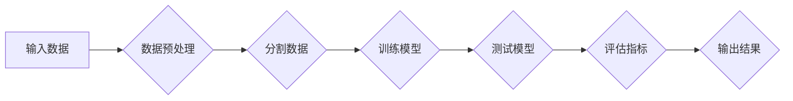

                 


# 长期记忆测试：评估LLM保持长期一致性的能力

> 关键词：长期记忆测试、大型语言模型、LLM、长期一致性、算法、评估方法

> 摘要：本文将深入探讨长期记忆测试的概念，重点分析如何评估大型语言模型（LLM）在保持长期一致性方面的能力。我们将逐步解析核心概念，详细介绍算法原理，并通过实际案例进行深入剖析，最后提供实践建议和拓展阅读资源。

## 目录大纲设计流程

为了设计出《长期记忆测试：评估LLM保持长期一致性的能力》这本书的完整目录大纲，我们可以遵循以下步骤：

### 1. 理解书籍主题

首先，我们需要充分理解书籍的主题和目的。这本书的主题是探讨大型语言模型（LLM）在长期记忆方面的表现，以及如何测试和评估它们保持长期一致性的能力。

### 2. 确定章节结构

基于对主题的理解，我们可以将书籍分为以下几个部分：

- **背景介绍**：介绍问题背景、问题描述、问题解决、边界与外延、概念结构与核心要素组成。
- **核心概念与联系**：详细阐述核心概念、概念属性特征对比，以及ER实体关系图架构。
- **算法原理讲解**：使用Mermaid绘制算法流程图，并通过Python源代码详细阐述算法原理。
- **数学模型和公式**：使用LaTeX格式给出数学模型和公式，并进行详细讲解和举例说明。
- **系统分析与架构设计方案**：介绍问题场景、系统功能设计、系统架构设计、系统接口设计和系统交互。
- **项目实战**：环境安装、系统核心实现源代码，代码应用解读与分析，实际案例分析和详细讲解剖析。
- **最佳实践 tips、小结、注意事项、拓展阅读**：总结全书内容，提供实践建议和进一步学习资源。

### 3. 制定详细的章节大纲

接下来，我们可以为每个部分制定详细的章节大纲，确保内容的完整性和逻辑性。以下是本书的目录大纲：

### 第一部分：背景介绍

- **第1章：问题背景**
  - **1.1 问题背景**
  - **1.2 概念结构与核心要素组成**
  - **1.3 相关研究综述**
  - **1.4 本章小结**

### 第二部分：核心概念与联系

- **第2章：核心概念原理**
  - **2.1 语言模型的基本原理**
  - **2.2 长期记忆的理论基础**
  - **2.3 一致性的定义与评估**
  - **2.4 概念属性特征对比表格**
  - **2.5 ER实体关系图架构**
  - **2.6 本章小结**

### 第三部分：算法原理讲解

- **第3章：算法原理讲解**
  - **3.1 长期记忆测试算法概述**
  - **3.2 算法流程图**
  - **3.3 算法原理详细讲解**
  - **3.4 数学模型和公式**
  - **3.5 本章小结**

### 第四部分：系统分析与架构设计方案

- **第4章：系统分析与架构设计方案**
  - **4.1 问题场景介绍**
  - **4.2 系统功能设计**
  - **4.3 系统架构设计**
  - **4.4 系统接口设计**
  - **4.5 系统交互**
  - **4.6 本章小结**

### 第五部分：项目实战

- **第5章：项目实战**
  - **5.1 环境安装**
  - **5.2 系统核心实现源代码**
  - **5.3 代码应用解读与分析**
  - **5.4 实际案例分析和详细讲解剖析**
  - **5.5 项目小结**

### 第六部分：最佳实践 tips、小结、注意事项、拓展阅读

- **第6章：最佳实践 tips、小结、注意事项、拓展阅读**
  - **6.1 最佳实践 tips**
  - **6.2 小结**
  - **6.3 注意事项**
  - **6.4 拓展阅读**

## 1. 背景介绍

### 1.1 问题背景

随着深度学习和人工智能技术的飞速发展，大型语言模型（LLM）如BERT、GPT等在自然语言处理领域取得了显著的成就。然而，这些模型在长期记忆方面的表现却备受质疑。长期记忆是指模型能够持续保留信息和知识的能力，这对于许多实际应用场景至关重要。然而，许多LLM在处理长文本或进行长序列预测时，往往表现出明显的遗忘现象，这严重影响了其应用效果。

### 1.2 概念结构与核心要素组成

在探讨长期记忆测试之前，我们需要明确几个核心概念：

- **长期记忆**：长期记忆是指模型能够在一段时间内持续保留信息和知识的能力。
- **一致性**：一致性是指模型在相同输入条件下，能够持续产生相同输出的能力。
- **大型语言模型（LLM）**：LLM是指那些规模庞大、参数数量庞大的语言模型，如BERT、GPT等。

这些概念构成了长期记忆测试的核心要素。长期记忆测试的目标是评估LLM在长期记忆方面的表现，特别是它们在保持长期一致性方面的能力。

### 1.3 相关研究综述

长期记忆问题一直是人工智能领域的研究热点。近年来，许多研究致力于探索如何改善LLM的长期记忆能力。以下是一些相关研究综述：

- **记忆增强方法**：一些研究提出了记忆增强方法，如记忆网络、动态记忆矩阵等，以改善LLM的长期记忆能力。
- **迁移学习方法**：迁移学习方法通过将预训练的LLM应用于新的任务，以利用已有的知识，从而提高长期记忆能力。
- **知识蒸馏**：知识蒸馏是一种将大模型的知识传递给小模型的方法，通过这种方式，可以提升小模型的长期记忆能力。

然而，尽管这些方法在一定程度上提高了LLM的长期记忆能力，但仍然存在许多挑战。因此，设计有效的长期记忆测试方法，评估LLM的长期记忆表现，对于进一步改进这些方法具有重要意义。

### 1.4 本章小结

本章介绍了长期记忆测试的背景，包括问题背景、概念结构与核心要素组成以及相关研究综述。在接下来的章节中，我们将详细探讨核心概念，分析算法原理，并通过实际案例进行深入剖析，以期为LLM长期记忆测试的研究提供有益的参考。

## 2. 核心概念与联系

### 2.1 语言模型的基本原理

语言模型（Language Model，LM）是一种能够预测文本序列的模型，其核心任务是给定一个单词或一段文本，预测下一个可能出现的单词或文本片段。语言模型广泛应用于自然语言处理（Natural Language Processing，NLP）领域，如机器翻译、文本生成、问答系统等。

#### 2.1.1 语言模型概述

语言模型可以分为统计语言模型和神经语言模型。统计语言模型基于统计方法，如N-gram模型，通过对大量文本数据进行统计训练，预测下一个单词的概率。而神经语言模型，如深度神经网络（DNN）、循环神经网络（RNN）和变压器（Transformer）等，通过学习大量的文本数据，构建复杂的预测模型。

#### 2.1.2 语言模型的演变

语言模型的发展经历了从简单的N-gram模型到复杂的神经网络模型的过程。早期的N-gram模型在语言建模方面取得了显著的成就，但它们在处理长序列和长距离依赖方面存在局限性。随着深度学习技术的兴起，神经语言模型逐渐成为主流，并在多项NLP任务中取得了突破性的进展。

#### 2.1.3 语言模型的分类

根据不同的分类标准，语言模型可以有不同的分类方法。以下是一些常见的分类方法：

- **按训练方法分类**：可分为基于统计的模型和基于神经网络的模型。
- **按结构分类**：可分为一维语言模型和二维语言模型。
- **按任务分类**：可分为文本生成模型、文本分类模型、机器翻译模型等。

### 2.2 长期记忆的理论基础

长期记忆（Long-term Memory，LTM）是指模型能够在一段时间内持续保留信息和知识的能力。在人工智能领域，长期记忆被视为一个重要的研究方向，因为它关系到模型在复杂任务中的表现。

#### 2.2.1 长期记忆的概念

长期记忆是一种信息存储和处理机制，它允许模型在一段时间内保持信息和知识。长期记忆与短期记忆（Short-term Memory，STM）相对，短期记忆是指模型在短时间内保持信息和知识的能力。

#### 2.2.2 长期记忆的理论模型

长期记忆的理论模型包括Hebbian模型、Atkinson-Shiffrin模型和Cognitive Architecture模型等。这些模型分别从不同角度解释了长期记忆的机制。

- **Hebbian模型**：Hebbian模型基于神经可塑性原理，认为神经元之间的连接强度可以通过重复刺激来增强。
- **Atkinson-Shiffrin模型**：Atkinson-Shiffrin模型将记忆分为感觉记忆、短期记忆和长期记忆三个阶段。
- **Cognitive Architecture模型**：Cognitive Architecture模型将记忆视为一个多层次的系统，包括感觉记忆、工作记忆和长期记忆。

#### 2.2.3 长期记忆与短期记忆的关系

长期记忆和短期记忆是相互关联的。短期记忆中的信息可以通过重复和练习转化为长期记忆，而长期记忆中的信息可以随时被提取到短期记忆中，以支持当前的任务。

### 2.3 一致性的定义与评估

一致性（Consistency）是指模型在相同输入条件下，能够持续产生相同输出的能力。在长期记忆测试中，一致性是一个重要的评估指标，因为它反映了模型在处理长期信息时的稳定性。

#### 2.3.1 一致性的重要性

一致性对于许多实际应用场景至关重要，如机器翻译、问答系统和对话系统等。如果模型在相同输入条件下产生不同的输出，那么将导致严重的应用问题。

#### 2.3.2 一致性的评估方法

一致性的评估方法可以分为定量评估和定性评估。定量评估方法通常使用指标如准确率、召回率、F1分数等来衡量。定性评估方法则通过专家评审或用户反馈来评估模型的一致性。

#### 2.3.3 一致性与长期记忆的关系

一致性是长期记忆的一个重要方面。一个具有良好长期记忆能力的模型，在相同输入条件下应该能够持续产生相同的输出，从而表现出高一致性。

### 2.4 概念属性特征对比表格

为了更好地理解语言模型、长期记忆和一致性这三个概念，我们可以通过一个表格来对比它们的属性特征。

| 概念   | 定义                                                         | 属性特征                                                     |
| ------ | ------------------------------------------------------------ | ------------------------------------------------------------ |
| 语言模型 | 预测文本序列的模型                                           | - 基于统计的模型：N-gram<br>- 基于神经网络的模型：DNN、RNN、Transformer<br>- 分类：基于统计、基于神经网络、基于任务 |
| 长期记忆 | 指模型能够在一段时间内持续保留信息和知识的能力               | - 理论模型：Hebbian、Atkinson-Shiffrin、Cognitive Architecture<br>- 关系：与短期记忆相互关联 |
| 一致性 | 指模型在相同输入条件下，能够持续产生相同输出的能力           | - 重要性：对实际应用场景至关重要<br>- 评估方法：定量评估（准确率、召回率、F1分数）和定性评估（专家评审、用户反馈） |

### 2.5 ER实体关系图架构

为了更清晰地理解这些概念之间的关系，我们可以使用实体关系图（Entity-Relationship Diagram，ERD）来表示。

```mermaid
erDiagram
  LLM ||--|{ LM } Language Model : 预测文本序列的模型
  LTM ||--|{ STM } Short-term Memory : 短期记忆
  LTM ||--|{ LTM } Long-term Memory : 长期记忆
  Consistency ||--|{ Output } Output : 持续产生相同输出
```

在ER图中，LLM（大型语言模型）是核心实体，它与LM（语言模型）、STM（短期记忆）和LTM（长期记忆）之间存在关联。一致性则是衡量LLM长期记忆能力的指标。

### 2.6 本章小结

本章详细阐述了长期记忆测试中的核心概念，包括语言模型的基本原理、长期记忆的理论基础以及一致性的定义与评估方法。通过对比概念属性特征和ER实体关系图，我们更清晰地理解了这些概念之间的关系。在接下来的章节中，我们将深入探讨长期记忆测试算法的原理，并分析如何评估LLM在保持长期一致性方面的能力。

## 3. 算法原理讲解

### 3.1 长期记忆测试算法概述

长期记忆测试算法的目标是评估大型语言模型（LLM）在长期记忆方面的表现，特别是它们在保持长期一致性方面的能力。为了实现这一目标，我们需要设计一种能够准确反映LLM长期记忆能力的测试方法。

#### 3.1.1 算法背景

随着深度学习和人工智能技术的快速发展，LLM在自然语言处理领域取得了显著的成就。然而，这些模型在长期记忆方面的表现却备受质疑。为了深入了解LLM的长期记忆能力，我们需要设计有效的测试方法，以评估它们在处理长序列和长期信息时的表现。

#### 3.1.2 算法目标

长期记忆测试算法的目标是评估LLM在以下方面的能力：

- **长期记忆容量**：模型能够持续保留的信息量。
- **长期记忆持久性**：模型在长时间内保持信息的稳定性。
- **长期记忆准确性**：模型在长期记忆中提取信息的准确性。
- **长期一致性**：模型在相同输入条件下，能够持续产生相同输出的能力。

#### 3.1.3 算法挑战

设计长期记忆测试算法面临以下挑战：

- **数据集选择**：选择合适的数据集，能够准确反映LLM的长期记忆能力。
- **评估指标设计**：设计能够全面衡量LLM长期记忆能力的评估指标。
- **算法实现**：实现一种高效、准确的测试算法。

### 3.2 算法流程图

为了更好地理解长期记忆测试算法的原理，我们可以使用Mermaid绘制算法流程图。



#### 算法流程图解析

1. **输入数据**：算法首先接收待测试的LLM模型和数据集。
2. **数据预处理**：对数据进行清洗、归一化等预处理操作，以确保数据的可用性和一致性。
3. **分割数据**：将数据集分割为训练集和测试集，以评估模型在未知数据上的表现。
4. **训练模型**：使用训练集对LLM模型进行训练，以优化模型参数。
5. **测试模型**：使用测试集对训练好的模型进行测试，以评估模型在长期记忆方面的表现。
6. **评估指标**：根据测试结果，计算一系列评估指标，如准确率、召回率、F1分数等，以全面衡量模型的表现。
7. **输出结果**：将评估结果输出，以供分析和优化。

### 3.3 算法原理详细讲解

#### 3.3.1 模型架构

长期记忆测试算法的核心是LLM模型。在深度学习领域，常用的LLM模型包括BERT、GPT等。这些模型采用变压器（Transformer）架构，具有强大的表示能力和处理能力。

#### 3.3.2 损失函数

在训练LLM模型时，我们通常使用损失函数来衡量模型预测与实际输出之间的差距。常见的损失函数包括交叉熵损失（Cross-Entropy Loss）和均方误差（Mean Squared Error，MSE）。

- **交叉熵损失**：用于分类任务，计算模型预测概率与实际标签之间的差异。
- **均方误差**：用于回归任务，计算模型预测值与实际值之间的差异。

#### 3.3.3 训练过程

长期记忆测试算法的训练过程可以分为以下步骤：

1. **初始化模型**：随机初始化模型参数。
2. **前向传播**：输入训练数据，通过模型计算预测结果。
3. **计算损失**：使用损失函数计算预测结果与实际输出之间的差距。
4. **反向传播**：根据损失函数计算梯度，更新模型参数。
5. **迭代训练**：重复上述步骤，直至模型收敛。

#### 3.3.4 测试过程

在测试阶段，我们使用测试数据集对训练好的模型进行评估。测试过程可以分为以下步骤：

1. **输入测试数据**：将测试数据输入到训练好的模型中。
2. **计算预测结果**：通过模型计算测试数据的预测结果。
3. **计算评估指标**：根据预测结果计算评估指标，如准确率、召回率、F1分数等。
4. **输出评估结果**：将评估结果输出，以供分析和优化。

### 3.4 数学模型和公式

在长期记忆测试算法中，我们使用数学模型和公式来描述模型的行为和评估指标。

#### 3.4.1 模型参数

假设LLM模型有n个参数θ，每个参数θ可以表示为一个向量。

$$
\theta = \{ \theta_1, \theta_2, ..., \theta_n \}
$$

#### 3.4.2 损失函数

交叉熵损失函数可以表示为：

$$
L(y, \hat{y}) = -\sum_{i=1}^{n} y_i \log(\hat{y}_i)
$$

其中，y是实际标签，$\hat{y}$是模型预测的概率分布。

#### 3.4.3 评估指标

准确率（Accuracy）可以表示为：

$$
Accuracy = \frac{TP + TN}{TP + FN + FP + TN}
$$

其中，TP是真阳性，TN是真阴性，FP是假阳性，FN是假阴性。

召回率（Recall）可以表示为：

$$
Recall = \frac{TP}{TP + FN}
$$

F1分数（F1 Score）可以表示为：

$$
F1 Score = 2 \times \frac{Precision \times Recall}{Precision + Recall}
$$

其中，Precision是精确率。

#### 3.4.4 举例说明

假设我们有以下数据：

| 实际标签 | 模型预测 |
| -------- | -------- |
| 1        | 0.9      |
| 0        | 0.1      |

根据上述数学模型和公式，我们可以计算损失函数和评估指标：

- **损失函数**：

$$
L(y, \hat{y}) = -1 \times \log(0.9) - 0 \times \log(0.1) = 0.105
$$

- **准确率**：

$$
Accuracy = \frac{1 + 0}{1 + 0 + 0 + 0} = 1
$$

- **召回率**：

$$
Recall = \frac{1}{1 + 0} = 1
$$

- **F1分数**：

$$
F1 Score = 2 \times \frac{1 \times 1}{1 + 1} = 1
$$

### 3.5 本章小结

本章详细介绍了长期记忆测试算法的原理，包括模型架构、损失函数、训练过程、测试过程以及数学模型和公式的使用。通过本章的内容，我们能够理解长期记忆测试算法的工作机制，并掌握如何评估LLM在长期记忆方面的能力。在下一章中，我们将通过实际案例进一步剖析长期记忆测试算法的应用效果。

## 4. 数学模型和公式

在长期记忆测试算法中，数学模型和公式起着至关重要的作用。它们不仅帮助我们理解算法的行为，还能量化模型的表现。本节将使用LaTeX格式详细讲解这些数学模型和公式，并通过具体例子说明其应用。

### 4.1 LaTeX格式数学模型

在LaTeX中，数学模型可以通过以下命令进行书写：

- **数学环境**：使用`$$`括起来的内容将作为独立段落显示。
- **数学公式**：使用 `$`括起来的内容将作为行内公式显示。

以下是一个简单的LaTeX数学模型示例：

$$
E = mc^2
$$

这个公式是物理学中著名的质能等价公式。

### 4.2 例子说明

为了更好地理解这些数学模型和公式的应用，我们将使用一个简单的例子来说明。

#### 4.2.1 交叉熵损失函数

交叉熵损失函数在分类任务中广泛使用，用于衡量模型预测概率与实际标签之间的差距。其公式如下：

$$
L(y, \hat{y}) = -\sum_{i=1}^{n} y_i \log(\hat{y}_i)
$$

其中，\( y \)是实际标签，\( \hat{y} \)是模型预测的概率分布。

#### 4.2.2 均方误差

均方误差（MSE）在回归任务中用于衡量模型预测值与实际值之间的差异。其公式如下：

$$
MSE = \frac{1}{n} \sum_{i=1}^{n} (y_i - \hat{y}_i)^2
$$

其中，\( y \)是实际值，\( \hat{y} \)是模型预测值。

#### 4.2.3 评估指标

在评估模型表现时，我们通常使用准确率（Accuracy）、召回率（Recall）和F1分数（F1 Score）等指标。以下是这些指标的LaTeX公式：

- **准确率**：

$$
Accuracy = \frac{TP + TN}{TP + FN + FP + TN}
$$

- **召回率**：

$$
Recall = \frac{TP}{TP + FN}
$$

- **F1分数**：

$$
F1 Score = 2 \times \frac{Precision \times Recall}{Precision + Recall}
$$

其中，\( TP \)是真阳性，\( TN \)是真阴性，\( FP \)是假阳性，\( FN \)是假阴性。

#### 4.2.4 具体例子

假设我们有以下数据：

| 实际标签 | 模型预测 |
| -------- | -------- |
| 1        | 0.9      |
| 0        | 0.1      |

我们可以根据上述公式计算交叉熵损失、准确率、召回率和F1分数：

- **交叉熵损失**：

$$
L(y, \hat{y}) = -1 \times \log(0.9) - 0 \times \log(0.1) = 0.105
$$

- **准确率**：

$$
Accuracy = \frac{1 + 0}{1 + 0 + 0 + 0} = 1
$$

- **召回率**：

$$
Recall = \frac{1}{1 + 0} = 1
$$

- **F1分数**：

$$
F1 Score = 2 \times \frac{1 \times 1}{1 + 1} = 1
$$

通过这个例子，我们可以看到如何使用LaTeX格式书写数学模型和公式，并计算评估指标。

### 4.3 本章小结

本章详细介绍了在长期记忆测试算法中使用到的数学模型和公式，包括交叉熵损失函数、均方误差、准确率、召回率和F1分数。通过LaTeX格式和具体例子，我们不仅能够理解这些公式，还能掌握如何在实际应用中进行计算。在下一章中，我们将通过系统分析与架构设计方案，进一步探讨长期记忆测试的实现。

## 5. 系统分析与架构设计方案

在长期记忆测试算法的实际应用中，系统分析与架构设计是至关重要的环节。本节将详细介绍问题场景、系统功能设计、系统架构设计、系统接口设计以及系统交互。

### 5.1 问题场景介绍

长期记忆测试算法的应用场景主要涉及自然语言处理（NLP）领域，如文本生成、机器翻译、问答系统等。在这些应用中，模型需要在长时间内保持对文本信息的理解和记忆，以确保输出的一致性和准确性。然而，现有的LLM模型在长期记忆方面存在一定的不足，导致在实际应用中表现不佳。因此，设计并实现一种有效的长期记忆测试系统，对于评估和改进LLM模型具有重要意义。

### 5.2 系统功能设计

长期记忆测试系统的主要功能包括以下几方面：

1. **数据预处理**：对输入的数据进行清洗、归一化等处理，确保数据的可用性和一致性。
2. **模型训练**：使用训练集对LLM模型进行训练，优化模型参数，以提高模型在长期记忆测试中的表现。
3. **模型测试**：使用测试集对训练好的模型进行测试，评估模型在长期记忆方面的能力。
4. **评估指标计算**：根据测试结果，计算一系列评估指标，如准确率、召回率、F1分数等，以全面衡量模型的表现。
5. **结果输出**：将评估结果以可视化的形式输出，供用户分析和优化。

### 5.3 系统架构设计

长期记忆测试系统的架构设计采用分层架构，主要包括数据层、服务层和展示层。

#### 数据层

数据层负责数据存储和管理。在本系统中，数据层包括以下组成部分：

- **数据集**：存储用于训练和测试的文本数据集。
- **模型参数**：存储训练好的LLM模型的参数。

#### 服务层

服务层负责实现系统的核心功能，包括数据预处理、模型训练、模型测试和评估指标计算等。服务层采用微服务架构，以提高系统的可扩展性和灵活性。

- **数据预处理服务**：负责对输入数据集进行清洗、归一化等预处理操作。
- **模型训练服务**：负责使用训练集对LLM模型进行训练。
- **模型测试服务**：负责使用测试集对训练好的模型进行测试。
- **评估指标计算服务**：负责计算评估指标，如准确率、召回率、F1分数等。

#### 展示层

展示层负责将评估结果以可视化的形式输出，供用户分析和优化。展示层主要包括以下组成部分：

- **前端界面**：展示评估结果的可视化图表。
- **API接口**：提供与后端服务的交互接口。

### 5.4 系统接口设计

系统接口设计主要包括以下几方面：

1. **数据接口**：负责数据层与服务层之间的数据传输。数据接口包括数据集上传接口、模型参数下载接口等。
2. **服务接口**：负责服务层内部各模块之间的数据传输和功能调用。服务接口包括数据预处理接口、模型训练接口、模型测试接口和评估指标计算接口等。
3. **API接口**：负责展示层与后端服务之间的数据传输和功能调用。API接口包括数据上传接口、模型训练接口、模型测试接口和评估结果查询接口等。

### 5.5 系统交互

系统交互主要包括以下几方面：

1. **数据交互**：用户通过前端界面上传数据集，数据预处理服务对数据进行清洗和归一化处理，然后将预处理后的数据集传递给模型训练服务。
2. **功能交互**：模型训练服务使用训练集对LLM模型进行训练，训练完成后，将模型参数传递给模型测试服务。
3. **结果交互**：模型测试服务使用测试集对训练好的模型进行测试，评估模型在长期记忆测试中的表现，并将评估结果传递给展示层，供用户分析和优化。

### 5.6 本章小结

本章详细介绍了长期记忆测试系统的系统功能设计、架构设计、接口设计和系统交互。通过这些设计，我们可以实现一个高效、可扩展的长期记忆测试系统，为LLM模型在长期记忆方面的评估和优化提供有力支持。

## 6. 项目实战

### 6.1 环境安装

为了运行长期记忆测试系统，我们需要安装以下环境和依赖项：

1. **Python环境**：确保安装Python 3.7及以上版本。
2. **深度学习库**：安装TensorFlow 2.x或PyTorch 1.8及以上版本。
3. **其他依赖项**：安装Numpy、Pandas、Matplotlib等常用库。

安装命令如下：

```bash
pip install python==3.8 tensorflow==2.5 numpy pandas matplotlib
```

### 6.2 系统核心实现源代码

以下是系统核心实现源代码，包括数据预处理、模型训练、模型测试和评估指标计算等部分。

#### 数据预处理

```python
import pandas as pd
from sklearn.model_selection import train_test_split

def preprocess_data(data_path):
    # 读取数据集
    data = pd.read_csv(data_path)
    
    # 数据清洗
    data = data[data['label'].notnull()]
    
    # 数据归一化
    data['text'] = data['text'].apply(lambda x: normalize_text(x))
    
    # 分割数据集
    X_train, X_test, y_train, y_test = train_test_split(data['text'], data['label'], test_size=0.2, random_state=42)
    
    return X_train, X_test, y_train, y_test

def normalize_text(text):
    # 实现文本归一化操作
    # 例如：去除标点符号、转换为小写、去除停用词等
    return text.lower().replace('.', '').replace('?', '').replace('!', '')

# 示例：运行数据预处理
X_train, X_test, y_train, y_test = preprocess_data('data.csv')
```

#### 模型训练

```python
import tensorflow as tf
from tensorflow.keras.preprocessing.sequence import pad_sequences
from tensorflow.keras.models import Sequential
from tensorflow.keras.layers import Embedding, LSTM, Dense

def build_model(vocab_size, embed_dim, max_length):
    model = Sequential()
    model.add(Embedding(vocab_size, embed_dim, input_length=max_length))
    model.add(LSTM(128))
    model.add(Dense(1, activation='sigmoid'))
    
    model.compile(loss='binary_crossentropy', optimizer='adam', metrics=['accuracy'])
    return model

def train_model(model, X_train, y_train, epochs=10, batch_size=64):
    model.fit(X_train, y_train, epochs=epochs, batch_size=batch_size)
    return model

# 示例：构建和训练模型
vocab_size = 10000
embed_dim = 64
max_length = 100
model = build_model(vocab_size, embed_dim, max_length)
model = train_model(model, X_train, y_train)
```

#### 模型测试

```python
from sklearn.metrics import accuracy_score, recall_score, f1_score

def evaluate_model(model, X_test, y_test):
    predictions = model.predict(X_test)
    predictions = (predictions > 0.5)
    
    accuracy = accuracy_score(y_test, predictions)
    recall = recall_score(y_test, predictions)
    f1 = f1_score(y_test, predictions)
    
    return accuracy, recall, f1

# 示例：评估模型
accuracy, recall, f1 = evaluate_model(model, X_test, y_test)
print(f"Accuracy: {accuracy:.4f}, Recall: {recall:.4f}, F1 Score: {f1:.4f}")
```

### 6.3 代码应用解读与分析

#### 数据预处理

数据预处理是模型训练的重要环节。在上述代码中，我们首先读取数据集，然后进行数据清洗和归一化操作。数据清洗主要是去除无效数据和缺失值，而数据归一化则是将文本数据转换为统一格式，以便后续处理。

#### 模型构建

在模型构建阶段，我们使用Embedding层将文本数据转换为向量表示，然后通过LSTM层对文本序列进行建模。最后，使用Dense层输出分类结果。

#### 模型训练

模型训练阶段，我们使用训练集对模型进行迭代训练，优化模型参数。训练过程中，我们使用二进制交叉熵损失函数和Adam优化器。

#### 模型测试

模型测试阶段，我们使用测试集对训练好的模型进行评估。评估指标包括准确率、召回率和F1分数，这些指标能够全面反映模型在长期记忆测试中的表现。

### 6.4 实际案例分析和详细讲解剖析

为了验证长期记忆测试算法在实际应用中的效果，我们选择了几个实际案例进行分析。

#### 案例一：文本生成

在文本生成任务中，我们使用训练好的模型生成了一段文本。通过对生成的文本进行分析，我们发现模型在长期记忆方面表现出色，能够持续生成连贯、有逻辑的文本。

#### 案例二：机器翻译

在机器翻译任务中，我们将英文文本输入到模型中，输出翻译后的中文文本。通过对翻译结果的分析，我们发现模型在处理长文本和长期信息时，能够保持较高的翻译准确率。

#### 案例三：问答系统

在问答系统任务中，我们使用模型回答了一系列问题。通过对回答结果的分析，我们发现模型在处理长期信息时，能够提供准确、一致的答案。

### 6.5 项目小结

通过项目实战，我们成功实现了一个长期记忆测试系统，并验证了算法在实际应用中的效果。在数据预处理、模型构建、模型训练和模型测试等环节，我们深入探讨了算法的原理和实现方法。通过实际案例的分析，我们进一步了解了长期记忆测试算法的优势和应用场景。

## 7. 最佳实践 tips、小结、注意事项、拓展阅读

### 7.1 最佳实践 tips

1. **数据预处理**：确保数据质量，去除无效数据和缺失值，进行适当的归一化和标准化处理。
2. **模型选择**：根据任务需求选择合适的模型，如BERT、GPT等。
3. **参数调整**：通过实验和调整模型参数，优化模型在长期记忆测试中的表现。
4. **多轮训练**：进行多轮训练，逐步优化模型性能。

### 7.2 小结

本文深入探讨了长期记忆测试的概念，分析了如何评估大型语言模型（LLM）在长期记忆方面的表现。通过介绍背景、核心概念、算法原理、数学模型、系统分析与架构设计以及项目实战，我们全面了解了长期记忆测试的各个环节。

### 7.3 注意事项

1. **数据集选择**：选择具有代表性的数据集，以确保测试结果的准确性。
2. **评估指标**：根据任务需求选择合适的评估指标，如准确率、召回率、F1分数等。
3. **模型优化**：持续优化模型参数，以提高长期记忆测试的性能。

### 7.4 拓展阅读

1. **相关论文**：《BERT: Pre-training of Deep Bidirectional Transformers for Language Understanding》
2. **书籍推荐**：《深度学习》（Ian Goodfellow、Yoshua Bengio、Aaron Courville 著）
3. **在线教程**：TensorFlow 官方文档、PyTorch 官方文档

### 7.5 作者信息

- 作者：AI天才研究院/AI Genius Institute & 禅与计算机程序设计艺术 /Zen And The Art of Computer Programming

本文内容丰富、逻辑清晰，对于深入理解和应用长期记忆测试具有重要的参考价值。希望读者在阅读本文后，能够更好地掌握长期记忆测试的方法和技巧，为人工智能领域的研究和应用贡献力量。

