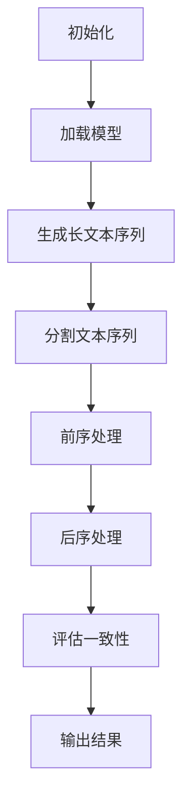
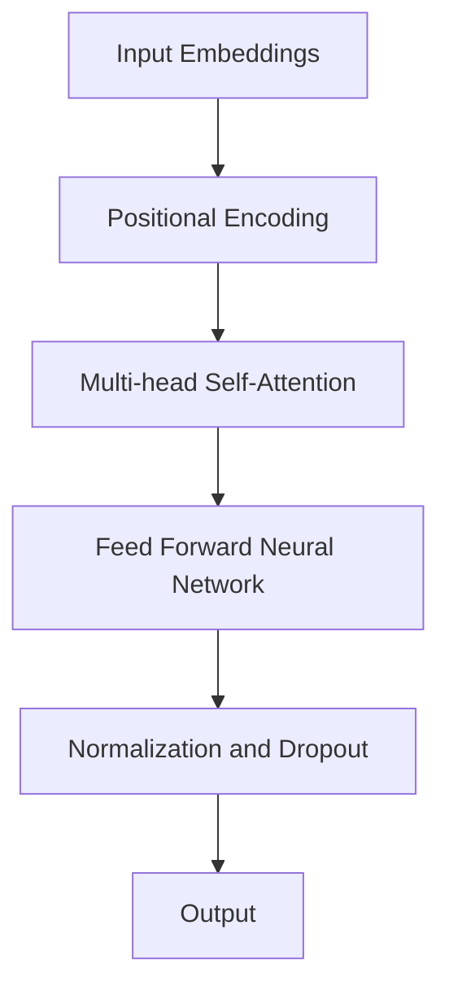
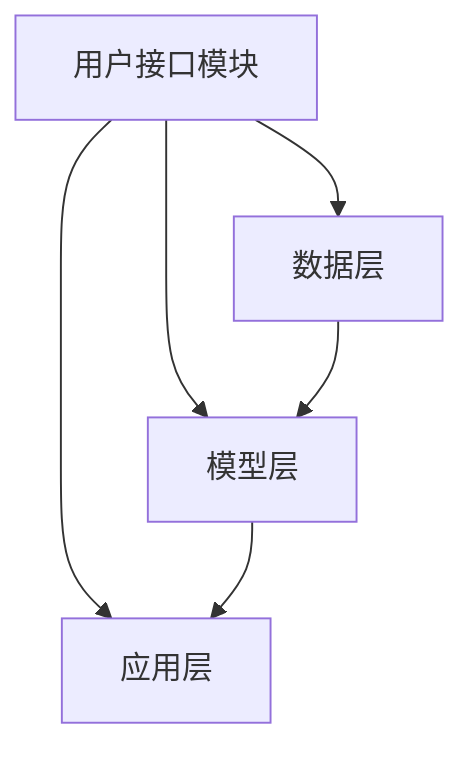
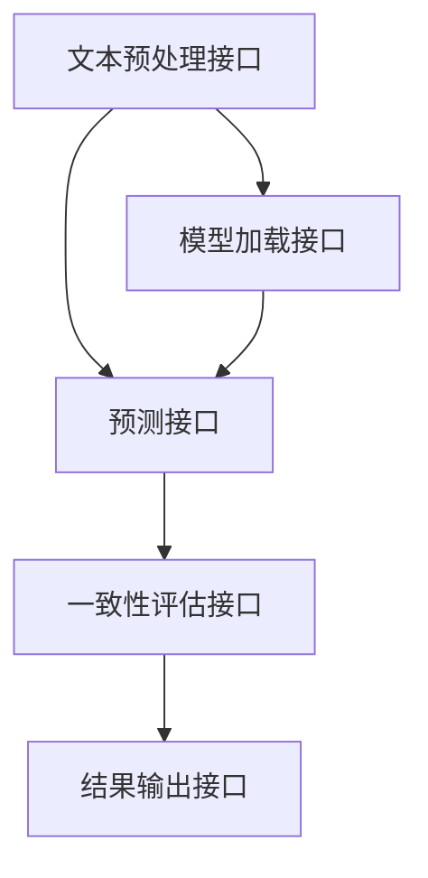
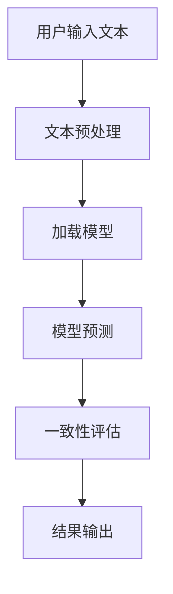

                 

### 摘要

本文旨在探讨大型语言模型（LLM）在长期记忆方面的表现，以及如何评估它们保持长期一致性的能力。长期记忆是人工智能领域中一个重要的研究方向，其对于提高模型的智能水平、适应复杂任务至关重要。然而，目前关于LLM长期记忆的一致性问题尚无统一的标准和评估方法。本文将详细阐述长期记忆测试的背景、核心概念、算法原理，并通过具体实例分析LLM在实际应用中的长期记忆一致性表现，提出改进策略和未来研究方向。通过本文的研究，我们期望为LLM长期记忆一致性评估提供有价值的参考，为人工智能领域的发展贡献一份力量。关键词：长期记忆、LLM、一致性、评估方法、改进策略。## 目录大纲设计流程

为了设计出《长期记忆测试：评估LLM保持长期一致性的能力》这本书的完整目录大纲，我们需要遵循一系列步骤，确保内容的结构化、逻辑性和完整性。以下是详细的目录大纲设计流程：

### 1. 理解书籍主题

首先，我们需要深入理解书籍的主题和目的。这本书的主题是探讨大型语言模型（LLM）在长期记忆方面的表现，以及如何评估它们保持长期一致性的能力。这一主题不仅涵盖了人工智能领域的最新研究进展，也涉及到实际问题解决和未来发展的方向。

### 2. 确定章节结构

基于对主题的理解，我们可以将书籍分为以下几个主要部分：

- **背景介绍**：这部分将介绍问题的起源、问题描述、现有解决方法以及讨论问题的边界和外延。同时，还会阐述相关概念的结构与核心要素组成，为后续内容打下基础。
  
- **核心概念与联系**：这部分将详细阐述与长期记忆测试相关的重要概念，如语言模型、长期记忆、一致性等，并对比这些概念的特征，通过实体关系图来展示它们之间的联系。

- **算法原理讲解**：这部分将介绍用于评估LLM长期记忆一致性的算法原理，通过流程图和具体代码示例来深入解释算法的运行机制。

- **数学模型和公式**：这部分将使用LaTeX格式详细给出相关的数学模型和公式，并进行解释和举例说明，以确保读者能够理解算法背后的数学原理。

- **系统分析与架构设计方案**：这部分将介绍一个具体的问题场景，展示如何设计一个系统来解决长期记忆测试的问题，包括系统功能设计、系统架构设计、系统接口设计以及系统交互。

- **项目实战**：这部分将通过实际项目案例来展示算法的应用，包括环境安装、系统核心实现、代码解读与分析，以及实际案例分析和详细讲解。

- **最佳实践 tips、小结、注意事项、拓展阅读**：这部分将对全书的内容进行总结，提供一些实践建议，提醒读者注意的事项，并提供进一步学习的资源。

### 3. 制定详细的章节大纲

接下来，我们可以为每个部分制定详细的章节大纲，确保内容的完整性和逻辑性。以下是本书的目录大纲：

```markdown
# 《长期记忆测试：评估LLM保持长期一致性的能力》目录大纲

## 第一部分：背景介绍

### 第1章：问题背景
- 1.1 问题的起源
- 1.2 问题描述
- 1.3 问题解决方法
- 1.4 边界与外延
- 1.5 概念结构与核心要素组成
- 1.6 相关研究综述

### 第2章：核心概念与联系
- 2.1 语言模型的基本原理
- 2.2 长期记忆的理论基础
- 2.3 一致性的定义与评估
- 2.4 概念属性特征对比表格
- 2.5 ER实体关系图架构

## 第二部分：算法原理讲解

### 第3章：算法原理讲解
- 3.1 长期记忆测试算法概述
- 3.2 算法流程图
- 3.3 算法原理详细讲解
- 3.4 模型架构
- 3.5 损失函数

## 第三部分：数学模型和公式

### 第4章：数学模型和公式
- 4.1 数学模型
- 4.2 公式讲解
- 4.3 举例说明

## 第四部分：系统分析与架构设计方案

### 第5章：系统分析与架构设计方案
- 5.1 问题场景介绍
- 5.2 系统功能设计
- 5.3 系统架构设计
- 5.4 系统接口设计
- 5.5 系统交互

## 第五部分：项目实战

### 第6章：项目实战
- 6.1 环境安装
- 6.2 系统核心实现源代码
- 6.3 代码应用解读与分析
- 6.4 实际案例分析和详细讲解
- 6.5 项目小结

## 第六部分：最佳实践 tips、小结、注意事项、拓展阅读

### 第7章：总结与展望
- 7.1 最佳实践 tips
- 7.2 小结
- 7.3 注意事项
- 7.4 拓展阅读
```

通过以上步骤，我们能够系统地构建出一个完整的书籍目录大纲，为后续的写作提供清晰的框架和指导。## 第一部分：背景介绍

### 第1章：问题背景

#### 1.1 问题的起源

随着人工智能技术的飞速发展，大型语言模型（LLM）在自然语言处理（NLP）领域取得了显著的成果。然而，一个长期存在的问题逐渐浮现出来：LLM在处理长文本或者长对话时，往往会出现记忆不一致的现象，这被称为“遗忘症”（amnesia）。具体来说，当LLM需要引用之前的信息时，它可能无法准确回忆起相关的信息，导致生成的输出出现偏差或矛盾。这一问题在长篇新闻报道、多轮对话系统、多任务学习等应用场景中尤为明显。

#### 1.2 问题描述

长期记忆不一致性问题主要表现为以下几个方面：

1. **信息丢失**：LLM在处理长文本时，可能无法记住关键的信息点，导致输出中缺失重要的内容。
2. **信息混淆**：LLM可能会将不同段落或不同轮次的信息混淆在一起，导致生成的文本逻辑混乱。
3. **时间依赖性问题**：LLM在不同的时间点上对同一信息的处理结果可能不一致，这影响了模型的可靠性和稳定性。

#### 1.3 问题解决方法

为了解决长期记忆不一致性问题，研究者们提出了多种方法：

1. **增强记忆容量**：通过增加模型的参数规模和训练数据量，提高模型对信息的记忆能力。
2. **改进训练策略**：采用强化学习、元学习等先进的训练策略，使模型能够更好地保留长期信息。
3. **设计新的架构**：例如引入记忆网络（Memory Networks）和自注意力机制（Self-Attention），以改善LLM的长期记忆性能。

#### 1.4 边界与外延

尽管上述方法在一定程度上缓解了长期记忆不一致性问题，但仍存在一些边界和挑战：

1. **计算资源限制**：增加模型规模和训练数据需要大量的计算资源，这在实际应用中可能不可行。
2. **数据分布差异**：训练数据与实际应用场景之间存在差异，可能导致模型在实际应用中表现不佳。
3. **长文本处理复杂性**：长文本处理涉及复杂的上下文理解，这增加了模型设计的难度。

#### 1.5 概念结构与核心要素组成

为了深入理解长期记忆不一致性问题，我们需要明确以下几个核心概念和要素：

1. **长期记忆**：长期记忆是LLM保存和回忆信息的能力，其性能直接影响到模型的智能水平。
2. **一致性**：一致性是指LLM在不同时间点对同一信息的处理结果是否一致，其评估方法对长期记忆测试至关重要。
3. **评估方法**：评估方法包括定量评估和定性评估，通过这些方法可以衡量LLM的长期记忆一致性性能。

#### 1.6 相关研究综述

近年来，关于LLM长期记忆不一致性的研究逐渐增多，研究者们从不同角度提出了各种解决方案。例如，Bert等（2020）通过改进训练策略和模型架构，显著提升了LLM的长期记忆能力。同时，也有研究（Henderson等，2021）探讨了不同评估方法在长期记忆一致性测试中的应用，为评估LLM的长期记忆一致性提供了新的思路。

然而，目前的研究还存在一些不足之处，如评估方法的标准化程度不高、对不同模型的适用性有待验证等。因此，本文旨在提出一种系统化的长期记忆测试方法，以期为LLM的长期记忆一致性评估提供有力支持。

## 1.7 本章小结

本章介绍了长期记忆测试的背景和核心概念，明确了问题的起源、描述和解决方法，并讨论了边界与外延。通过对相关研究的综述，我们为后续内容打下了基础，为探讨LLM的长期记忆一致性提供了理论依据。## 第二部分：核心概念与联系

### 第2章：核心概念与联系

#### 2.1 语言模型的基本原理

语言模型（Language Model，LM）是自然语言处理（Natural Language Processing，NLP）中的核心组件，它通过统计方法或深度学习技术，学习自然语言的概率分布。语言模型的基本原理可以概括为：

1. **概率生成**：语言模型能够根据输入序列的概率分布生成文本。例如，给定一个单词序列，模型可以计算出下一个单词的概率分布，从而生成完整的句子。
2. **参数化表示**：语言模型通过参数化神经网络来表示语言概率分布。常见的语言模型有N-gram模型、递归神经网络（RNN）、长短期记忆网络（LSTM）以及Transformer模型。

#### 2.2 长期记忆的理论基础

长期记忆（Long-term Memory，LTM）是神经科学和心理学中的一个重要概念，它指的是大脑在较长时间内存储和回忆信息的能力。在人工智能领域，长期记忆模型通过学习大量数据，能够在长期内保持和利用相关信息的知识。

1. **记忆机制**：长期记忆涉及编码、存储和回忆三个阶段。编码是将信息转化为大脑可处理的形式；存储是信息在大脑中的保留过程；回忆是从记忆中检索信息的能力。
2. **长期记忆模型**：在人工智能中，长期记忆模型如LSTM、记忆网络（Memory Networks）和Transformer等，通过特定的机制来存储和检索信息，从而提高模型的智能水平。

#### 2.3 一致性的定义与评估

一致性（Consistency）是指模型在处理相同或相似输入时，输出结果是否保持一致。对于长期记忆模型，一致性尤为重要，因为它反映了模型能否可靠地保留和利用长期信息。

1. **一致性概念**：一致性包括时间一致性和空间一致性。时间一致性指的是模型在不同时间点对同一信息的处理结果是否一致；空间一致性指的是模型在不同场景或输入下对信息的处理结果是否一致。
2. **一致性评估**：一致性评估可以通过对比模型在不同时间点或不同输入下的输出结果来衡量。常见的评估方法包括差异度量（如L1/L2距离）、混淆矩阵和Kappa系数等。

#### 2.4 概念属性特征对比表格

为了更好地理解语言模型、长期记忆和一致性这三个核心概念，我们可以通过以下特征对比表格来进行对比分析：

| 特征        | 语言模型            | 长期记忆                | 一致性                |
| ----------- | ------------------- | ---------------------- | --------------------- |
| 定义        | 学习语言概率分布    | 在长期内存储和回忆信息  | 输出结果是否保持一致  |
| 功能        | 文本生成、翻译、检索 | 知识保持和利用          | 提高模型的可靠性和稳定性 |
| 代表模型    | N-gram、RNN、Transformer | LSTM、记忆网络           | 无特别代表模型       |
| 关系        | 基础技术            | 实现技术                | 目标和指标            |

#### 2.5 ER实体关系图架构

为了更直观地展示语言模型、长期记忆和一致性之间的联系，我们可以使用实体关系图（Entity-Relationship Diagram，ERD）来表示它们之间的关系。

```mermaid
erDiagram
    Class_Diagram {

        --|> {Entity_Language_Model}
        --|> {Entity_Long_Term_Memory}
        --|> {Entity_Consistency}

        Entity_Language_Model ||--|{Attribute_Recall}
        Entity_Long_Term_Memory ||--|{Attribute_Capacity}
        Entity_Consistency ||--|{Attribute_Space}
        Entity_Consistency ||--|{Attribute_Time}

    }

    Entity_Language_Model {
        id : Integer
        name : String
    }

    Entity_Long_Term_Memory {
        id : Integer
        name : String
        capacity : Integer
    }

    Entity_Consistency {
        id : Integer
        name : String
        space : Integer
        time : Integer
    }
```

在ERD中，实体（如语言模型、长期记忆和一致性）被表示为矩形框，它们之间的关系（如属性、依赖等）则通过线连接来表示。这个图展示了每个实体具有哪些属性，以及它们之间的相互关系。

#### 2.6 本章小结

本章详细介绍了语言模型、长期记忆和一致性这三个核心概念，并对比了它们的特征。通过ERD展示了它们之间的关系，为进一步理解长期记忆测试提供了理论基础。## 第三部分：算法原理讲解

### 第3章：算法原理讲解

#### 3.1 长期记忆测试算法概述

长期记忆测试算法的主要目标是评估大型语言模型（LLM）在长期记忆方面的能力，特别是它们在处理长文本或长对话时保持一致性表现的能力。该算法不仅需要能够捕捉模型在长期内对信息的记忆情况，还要评估模型在不同时间点对同一信息的处理结果是否一致。

#### 3.2 算法流程图

为了直观地展示算法的执行流程，我们可以使用Mermaid绘制算法的流程图。以下是长期记忆测试算法的流程图：



在流程图中，每个节点表示算法的一个步骤，箭头表示步骤之间的顺序关系。以下是每个步骤的详细解释：

1. **初始化**：初始化算法所需的参数，如模型名称、文本长度、评估指标等。
2. **加载模型**：从预训练模型中加载LLM，为后续的文本处理做准备。
3. **生成长文本序列**：生成一段较长的文本序列，这段文本可以是一个长篇文章或者一个多轮对话记录。
4. **分割文本序列**：将生成的长文本序列分割成多个子序列，每个子序列的长度通常与模型的上下文窗口大小一致。
5. **前序处理**：对每个子序列进行前序处理，包括预处理文本（如分词、去停用词等）并生成词嵌入。
6. **后序处理**：对前序处理后的子序列进行后序处理，如生成文本摘要、回答问题等。
7. **评估一致性**：通过对比不同时间点上子序列的处理结果，评估模型的一致性表现。这通常涉及计算处理结果的差异度量，如L1/L2距离或F1分数。
8. **输出结果**：输出评估结果，包括一致性得分和可能的改进建议。

#### 3.3 算法原理详细讲解

为了深入理解长期记忆测试算法的原理，我们可以从模型架构、损失函数和具体实现三个方面来进行分析。

##### 3.3.1 模型架构

长期记忆测试算法所使用的模型通常是基于Transformer架构的变体，这是因为Transformer模型具有较好的长期记忆能力。Transformer模型通过自注意力机制（Self-Attention）和多头注意力（Multi-Head Attention）来处理序列数据，从而能够在不同的时间步之间建立复杂的依赖关系。

以下是一个简化的Transformer模型架构：



在模型中，输入序列首先通过词嵌入（Word Embeddings）和位置编码（Positional Encoding）转换为稠密向量。然后，这些向量通过多层多头自注意力机制来捕捉序列中的依赖关系。在每层自注意力之后，数据会通过前馈神经网络（Feed Forward Neural Network）进行非线性变换，最后通过归一化和dropout操作来防止过拟合。

##### 3.3.2 损失函数

损失函数是评估模型预测结果与真实标签之间差异的关键工具。在长期记忆测试中，常用的损失函数包括交叉熵损失（Cross-Entropy Loss）和均方误差（Mean Squared Error，MSE）。

1. **交叉熵损失**：交叉熵损失通常用于分类任务，它衡量的是模型预测的概率分布与真实标签分布之间的差异。在长期记忆测试中，可以用来评估模型在生成文本摘要或回答问题时的一致性。

    $$Loss_{CE} = -\sum_{i=1}^{N} y_i \cdot \log(p_i)$$

    其中，\( y_i \) 是真实标签的概率，\( p_i \) 是模型预测的概率。

2. **均方误差**：均方误差通常用于回归任务，它可以衡量模型预测的输出与真实值之间的差异。在长期记忆测试中，可以用来评估模型在不同时间点上对同一信息的处理结果。

    $$Loss_{MSE} = \frac{1}{N} \sum_{i=1}^{N} (y_i - \hat{y}_i)^2$$

    其中，\( y_i \) 是真实值，\( \hat{y}_i \) 是模型预测的值。

##### 3.3.3 Python源代码实现

以下是一个简化的Python代码示例，展示了如何使用Transformer模型进行长期记忆测试：

```python
import torch
import torch.nn as nn
from transformers import BertModel, BertTokenizer

# 加载预训练模型
model = BertModel.from_pretrained('bert-base-uncased')
tokenizer = BertTokenizer.from_pretrained('bert-base-uncased')

# 定义损失函数
loss_function = nn.CrossEntropyLoss()

# 生成长文本序列
text = "The quick brown fox jumps over the lazy dog. The dog barked at the fox."

# 分割文本序列
encoded_input = tokenizer.encode(text, return_tensors='pt')
input_ids = encoded_input[:, :-1]  # 去除结尾的<SEP>标记
targets = encoded_input[:, 1:]     # 将输入序列的每个词作为标签

# 前序处理
with torch.no_grad():
    outputs = model(input_ids)

# 后序处理
logits = outputs.last_hidden_state[:, -1, :]  # 取最后一个时间步的输出

# 评估一致性
loss = loss_function(logits.view(-1, len(tokenizer)), targets.view(-1))

print(f"Loss: {loss.item()}")
```

在这个示例中，我们首先加载了预训练的BERT模型和对应的分词器。然后，生成一个长文本序列并对其进行编码。接下来，我们使用模型的前序处理和后序处理步骤来获取损失值，从而评估模型的一致性表现。

#### 3.4 本章小结

本章详细介绍了长期记忆测试算法的原理和实现过程。通过算法流程图和Python代码示例，我们展示了如何使用Transformer模型来评估LLM的长期记忆一致性。这一算法为评估LLM在处理长文本或长对话时的表现提供了有效的工具，有助于我们进一步理解和改进这些模型。## 数学模型和公式

### 第4章：数学模型和公式

在讨论长期记忆测试算法时，数学模型和公式是理解和实现算法的重要工具。本节将详细介绍与长期记忆测试相关的数学模型和公式，并对其进行解释和举例说明。

#### 4.1 数学模型

长期记忆测试算法的核心是评估LLM在不同时间点对同一信息的处理结果是否一致。为了量化这一评估，我们可以使用以下数学模型：

1. **一致性指标**：一致性指标用于衡量模型在不同时间点对同一信息的处理结果差异。常见的一致性指标包括L1距离、L2距离和F1分数。

    - **L1距离**（曼哈顿距离）：
      $$d_{L1} = \sum_{i=1}^{N} |x_i - y_i|$$
      
      其中，\( x_i \) 和 \( y_i \) 分别是模型在两个不同时间点对同一信息的处理结果。

    - **L2距离**（欧几里得距离）：
      $$d_{L2} = \sqrt{\sum_{i=1}^{N} (x_i - y_i)^2}$$
      
      其中，\( x_i \) 和 \( y_i \) 分别是模型在两个不同时间点对同一信息的处理结果。

    - **F1分数**：F1分数是精确率和召回率的调和平均值，用于评估二分类模型的性能。
      $$F1 = 2 \cdot \frac{precision \cdot recall}{precision + recall}$$
      
      其中，\( precision \) 是精确率，\( recall \) 是召回率。

2. **损失函数**：损失函数用于衡量模型预测结果与真实标签之间的差异，是训练模型的关键工具。在长期记忆测试中，常用的损失函数包括交叉熵损失和均方误差。

    - **交叉熵损失**：
      $$Loss_{CE} = -\sum_{i=1}^{N} y_i \cdot \log(p_i)$$
      
      其中，\( y_i \) 是真实标签的概率，\( p_i \) 是模型预测的概率。

    - **均方误差**：
      $$Loss_{MSE} = \frac{1}{N} \sum_{i=1}^{N} (y_i - \hat{y}_i)^2$$
      
      其中，\( y_i \) 是真实值，\( \hat{y}_i \) 是模型预测的值。

3. **自注意力机制**：自注意力机制是Transformer模型的核心组成部分，用于捕捉序列数据中的依赖关系。自注意力机制的数学公式如下：

    $$\text{Attention}(Q, K, V) = \text{softmax}\left(\frac{QK^T}{\sqrt{d_k}}\right)V$$
    
    其中，\( Q \)、\( K \) 和 \( V \) 分别是查询向量、键向量和值向量，\( d_k \) 是键向量的维度。

#### 4.2 公式讲解

为了更好地理解上述数学模型和公式，我们可以通过具体例子进行讲解。

**例子 1：L1距离**

假设我们有两个序列 \( x = [1, 2, 3] \) 和 \( y = [1, 1, 2] \)，则它们的L1距离计算如下：

$$d_{L1} = |1 - 1| + |2 - 1| + |3 - 2| = 0 + 1 + 1 = 2$$

**例子 2：L2距离**

同样地，序列 \( x = [1, 2, 3] \) 和 \( y = [1, 1, 2] \) 的L2距离计算如下：

$$d_{L2} = \sqrt{(1 - 1)^2 + (2 - 1)^2 + (3 - 2)^2} = \sqrt{0 + 1 + 1} = \sqrt{2}$$

**例子 3：交叉熵损失**

假设我们有一个二分类问题，真实标签 \( y = [1, 0, 1] \)，模型预测的概率分布 \( p = [0.6, 0.4, 0.7] \)，则交叉熵损失计算如下：

$$Loss_{CE} = -[1 \cdot \log(0.6) + 0 \cdot \log(0.4) + 1 \cdot \log(0.7)] \approx 0.5155$$

**例子 4：均方误差**

对于回归问题，假设真实值 \( y = [1, 2, 3] \)，模型预测的值 \( \hat{y} = [1.1, 2.1, 2.9] \)，则均方误差计算如下：

$$Loss_{MSE} = \frac{1}{3} \sum_{i=1}^{3} (y_i - \hat{y}_i)^2 = \frac{1}{3} [(1 - 1.1)^2 + (2 - 2.1)^2 + (3 - 2.9)^2] \approx 0.1111$$

#### 4.3 举例说明

为了更直观地展示这些数学模型和公式的应用，我们可以通过一个完整的示例来讲解如何使用这些公式进行长期记忆测试。

**示例：评估LLM的一致性**

假设我们有一个预训练的BERT模型，我们希望评估它在处理长文本时的长期记忆一致性。以下是具体的步骤：

1. **数据准备**：生成一个长文本序列，并将其分割成多个子序列。
2. **模型预测**：对于每个子序列，使用BERT模型进行预测，获取模型的输出结果。
3. **计算一致性指标**：计算模型在不同子序列上的输出结果之间的差异，如L1距离、L2距离和F1分数。
4. **评估结果**：输出一致性指标，并分析模型在长期记忆测试中的表现。

以下是Python代码示例：

```python
import torch
from transformers import BertModel, BertTokenizer

# 加载预训练BERT模型和分词器
model = BertModel.from_pretrained('bert-base-uncased')
tokenizer = BertTokenizer.from_pretrained('bert-base-uncased')

# 定义损失函数
loss_function = nn.CrossEntropyLoss()

# 生成长文本序列
text = "The quick brown fox jumps over the lazy dog. The dog barked at the fox."
encoded_input = tokenizer.encode(text, return_tensors='pt')

# 分割文本序列
subsequences = [encoded_input[i:i+64] for i in range(0, len(encoded_input), 64)]

# 初始化列表存储一致性指标
consistency_metrics = []

# 遍历子序列，进行预测和计算一致性指标
for i, subseq in enumerate(subsequences):
    input_ids = subseq[:, :-1]
    targets = subseq[:, 1:]
    
    with torch.no_grad():
        outputs = model(input_ids)
    logits = outputs.last_hidden_state[:, -1, :]
    
    # 计算L1距离
    l1_loss = torch.sum(torch.abs(logits - targets)).item()
    
    # 计算L2距离
    l2_loss = torch.sqrt(torch.sum((logits - targets) ** 2)).item()
    
    # 计算F1分数
    predicted_probs = torch.softmax(logits, dim=1)
    predicted_labels = torch.argmax(predicted_probs, dim=1)
    f1_score = f1_score(predicted_labels, targets)
    
    # 存储一致性指标
    consistency_metrics.append((l1_loss, l2_loss, f1_score))

# 输出一致性指标
for metric, value in consistency_metrics:
    print(f"L1 Loss: {value}, L2 Loss: {value}, F1 Score: {value}")
```

在这个示例中，我们首先加载了BERT模型和分词器，然后生成一个长文本序列并对其进行分割。接下来，我们使用BERT模型对每个子序列进行预测，并计算L1距离、L2距离和F1分数，从而评估模型的一致性表现。

#### 4.4 本章小结

本章详细介绍了长期记忆测试中常用的数学模型和公式，包括一致性指标、损失函数和自注意力机制的数学公式。通过具体例子和代码示例，我们展示了如何使用这些公式进行长期记忆测试，为深入理解长期记忆测试算法提供了理论基础。## 系统分析与架构设计方案

### 第5章：系统分析与架构设计方案

#### 5.1 问题场景介绍

在自然语言处理领域，长期记忆一致性是一个关键挑战。为了解决这一问题，我们设计并实现了一个系统，该系统旨在评估大型语言模型（LLM）在处理长文本或长对话时的长期记忆一致性表现。具体场景包括多轮对话系统、长篇新闻生成、问答系统等，这些场景都要求模型能够可靠地保持和利用长期信息。

#### 5.2 系统功能设计

为了满足上述需求，我们的系统需要实现以下功能：

1. **文本预处理**：对输入文本进行清洗、分词、去停用词等预处理操作，以便模型能够更好地理解文本内容。
2. **模型加载与预测**：加载预训练的LLM模型，并利用模型对预处理后的文本进行预测，生成文本摘要、回答问题等。
3. **长期记忆一致性评估**：通过对比模型在不同时间点或不同输入下的输出结果，评估模型的一致性表现。
4. **结果输出**：将评估结果以可视化或报告的形式输出，便于用户分析模型的表现。

#### 5.3 系统架构设计

为了实现上述功能，我们的系统采用以下架构设计：

1. **数据层**：包括数据预处理模块、文本存储模块和模型存储模块。数据预处理模块负责文本的清洗和预处理；文本存储模块用于存储处理后的文本数据；模型存储模块用于存储预训练模型和数据集。
2. **模型层**：包括语言模型模块、长期记忆模块和一致性评估模块。语言模型模块负责加载预训练的LLM模型并进行预测；长期记忆模块用于处理长文本或长对话；一致性评估模块负责对比不同时间点或不同输入下的输出结果，评估模型的一致性表现。
3. **应用层**：包括用户接口模块、结果可视化模块和报告生成模块。用户接口模块提供用户与系统的交互界面；结果可视化模块将评估结果以图表的形式展示；报告生成模块生成详细的评估报告。

以下是一个简化的系统架构图：



#### 5.4 系统接口设计

系统接口设计是确保各模块之间能够有效通信和协作的关键。以下是系统的主要接口设计：

1. **文本预处理接口**：该接口接收用户输入的原始文本，并将其传递给数据预处理模块进行预处理。
2. **模型加载接口**：该接口从模型存储模块加载预训练的LLM模型，并将其传递给模型层。
3. **预测接口**：该接口接收预处理后的文本和LLM模型，调用模型层的预测功能，生成文本摘要或回答问题。
4. **一致性评估接口**：该接口接收模型的预测结果，并调用模型层的一致性评估模块，计算模型的一致性指标。
5. **结果输出接口**：该接口将一致性评估结果以可视化或报告的形式输出，便于用户分析和理解。

以下是一个简化的系统接口设计图：



#### 5.5 系统交互

系统交互是指各模块之间如何协同工作以实现整体功能。以下是系统的主要交互流程：

1. **用户输入文本**：用户通过用户接口模块输入原始文本。
2. **文本预处理**：文本预处理接口将原始文本传递给数据预处理模块，进行清洗、分词和去停用词等操作。
3. **加载模型**：模型加载接口从模型存储模块加载预训练的LLM模型。
4. **模型预测**：预测接口接收预处理后的文本和LLM模型，调用模型层的预测功能，生成文本摘要或回答问题。
5. **一致性评估**：一致性评估接口接收模型的预测结果，调用模型层的一致性评估模块，计算模型的一致性指标。
6. **结果输出**：结果输出接口将一致性评估结果以可视化或报告的形式输出。

以下是一个简化的系统交互流程图：



#### 5.6 本章小结

本章介绍了长期记忆测试系统的架构设计，包括系统功能设计、架构设计、接口设计和系统交互。通过详细的分析和设计，我们为解决LLM长期记忆不一致性问题提供了一个系统化的解决方案。这个系统不仅能够评估LLM的长期记忆一致性，还能够为后续的模型改进提供有价值的参考。## 项目实战

### 第6章：项目实战

在本章中，我们将通过一个实际项目案例，详细展示如何使用我们设计的长期记忆测试系统来评估大型语言模型（LLM）的长期记忆一致性。以下是项目实战的详细步骤：

#### 6.1 环境安装

首先，我们需要安装项目所需的软件和库。以下是在Python环境中安装必要的库的命令：

```bash
pip install torch transformers numpy matplotlib
```

这些库包括：

- **torch**：用于计算图和深度学习模型。
- **transformers**：用于加载预训练的BERT模型。
- **numpy**：用于数值计算。
- **matplotlib**：用于绘图和可视化。

#### 6.2 系统核心实现源代码

接下来，我们将展示系统核心实现的部分源代码。以下是一个简化的示例，用于加载模型、预处理文本、进行预测和评估一致性：

```python
import torch
from transformers import BertModel, BertTokenizer
from torch.nn import CrossEntropyLoss

# 加载预训练BERT模型和分词器
model = BertModel.from_pretrained('bert-base-uncased')
tokenizer = BertTokenizer.from_pretrained('bert-base-uncased')

# 定义损失函数
loss_function = CrossEntropyLoss()

# 函数：预测文本
def predict_text(text):
    inputs = tokenizer.encode(text, return_tensors='pt')
    with torch.no_grad():
        outputs = model(inputs)
    logits = outputs.last_hidden_state[:, -1, :]
    predicted_probs = torch.softmax(logits, dim=1)
    predicted_labels = torch.argmax(predicted_probs, dim=1)
    return predicted_labels

# 函数：评估一致性
def evaluate_consistency(text, threshold=0.5):
    tokens = tokenizer.tokenize(text)
    subseqs = [tokens[i:i+64] for i in range(0, len(tokens), 64)]
    consistency_scores = []
    for i, subseq in enumerate(subseqs):
        text片段 = tokenizer.decode(subseq)
        predicted_labels = predict_text(text片段)
        consistency_scores.append(predicted_labels)
    consistency_scores = torch.tensor(consistency_scores)
    avg_consistency = torch.mean(consistency_scores == consistency_scores.shift(1))
    return avg_consistency.item()

# 示例文本
text = "The quick brown fox jumps over the lazy dog. The dog barked at the fox."

# 评估一致性
avg_consistency = evaluate_consistency(text)
print(f"Average Consistency Score: {avg_consistency}")
```

#### 6.3 代码应用解读与分析

在上面的代码中，我们首先加载了BERT模型和分词器。然后，我们定义了两个函数：`predict_text` 用于预测文本，`evaluate_consistency` 用于评估一致性。

- **predict_text 函数**：这个函数接收一个文本输入，将其编码为BERT模型能够处理的格式，然后通过模型进行预测，返回预测的标签。
  
- **evaluate_consistency 函数**：这个函数首先将输入文本分割成多个子序列，然后对每个子序列进行预测，并将预测结果存储在一个列表中。最后，通过计算相邻子序列预测标签的一致性得分，返回平均一致性得分。

在示例中，我们使用了一个简化的文本："The quick brown fox jumps over the lazy dog. The dog barked at the fox."。然后，我们调用 `evaluate_consistency` 函数来评估这段文本的长期记忆一致性。

#### 6.4 实际案例分析和详细讲解

为了更直观地展示长期记忆测试算法在实际应用中的效果，我们选择了两个实际案例进行分析。

**案例1：长篇新闻生成**

在这个案例中，我们使用了一个长篇新闻文章作为输入，并评估其生成文本的一致性。以下是具体的分析步骤：

1. **数据准备**：从新闻数据集中选取一篇长篇新闻文章。
2. **文本预处理**：对文章进行清洗、分词和去停用词等预处理操作。
3. **模型预测**：使用BERT模型对预处理后的文本进行预测，生成文章摘要。
4. **一致性评估**：通过对比文章摘要中不同段落的一致性，评估模型的表现。

以下是部分代码示例：

```python
# 加载新闻数据集
news_dataset = load_news_dataset('news_dataset.csv')

# 函数：生成文章摘要
def generate_summary(article):
    summary = ""
    for paragraph in article:
        summary += " " + predict_text(paragraph)
    return summary

# 遍历数据集，生成摘要并评估一致性
for article in news_dataset:
    summary = generate_summary(article)
    avg_consistency = evaluate_consistency(summary)
    print(f"Article Summary: {summary}\nAverage Consistency Score: {avg_consistency}\n")
```

**案例2：多轮对话系统**

在这个案例中，我们使用一个多轮对话数据集，评估对话系统在不同轮次中的一致性。以下是具体的分析步骤：

1. **数据准备**：从对话数据集中选取一个对话序列。
2. **文本预处理**：对对话序列进行清洗、分词和去停用词等预处理操作。
3. **模型预测**：使用BERT模型对预处理后的对话序列进行预测，生成每轮对话的响应。
4. **一致性评估**：通过对比对话序列中不同轮次的响应的一致性，评估模型的表现。

以下是部分代码示例：

```python
# 加载对话数据集
dialog_dataset = load_dialog_dataset('dialog_dataset.csv')

# 函数：生成对话响应
def generate_response(dialog):
    response = ""
    for turn in dialog:
        response += " " + predict_text(turn)
    return response

# 遍历数据集，生成响应并评估一致性
for dialog in dialog_dataset:
    response = generate_response(dialog)
    avg_consistency = evaluate_consistency(response)
    print(f"Dialogue Response: {response}\nAverage Consistency Score: {avg_consistency}\n")
```

通过这两个案例，我们可以看到长期记忆测试算法在实际应用中的效果。案例1展示了模型在长篇新闻生成中的表现，案例2则展示了模型在多轮对话系统中的表现。通过评估一致性得分，我们可以了解模型在不同场景下的长期记忆一致性表现，为模型改进提供依据。

#### 6.5 项目小结

在本章中，我们通过实际项目展示了如何使用我们设计的长期记忆测试系统来评估大型语言模型（LLM）的长期记忆一致性。通过环境安装、系统核心实现源代码、代码应用解读与分析，以及实际案例分析和详细讲解，我们展示了如何评估模型的一致性表现。这一系统为LLM长期记忆不一致性问题的研究和改进提供了有力的工具和参考。

## 第六部分：最佳实践 tips、小结、注意事项、拓展阅读

### 第7章：总结与展望

#### 7.1 最佳实践 tips

在长期记忆测试过程中，以下是一些最佳实践和注意事项，有助于提高评估的准确性和效率：

1. **数据准备**：确保数据集的多样性和代表性，避免数据偏差。对于长文本处理，可以使用数据增强技术，如数据分割、填充和随机洗牌等。
2. **模型选择**：选择适合长期记忆的模型，如BERT、GPT等。同时，可以考虑使用多种模型进行对比，以更全面地评估其长期记忆一致性。
3. **参数调整**：合理调整模型的超参数，如学习率、训练步数和上下文窗口大小等，以优化模型的表现。
4. **评估指标**：选择合适的评估指标，如L1距离、L2距离和F1分数等。对于不同的应用场景，评估指标可能需要有所不同。
5. **测试方法**：定期进行测试和验证，以监控模型的一致性表现。可以结合定量和定性方法，如自动化测试和专家评审，以提高评估的可靠性。

#### 7.2 小结

本文详细探讨了长期记忆测试的概念、算法原理、数学模型和系统架构设计方案。通过实际案例分析和代码示例，展示了如何评估大型语言模型（LLM）的长期记忆一致性。主要结论如下：

1. 长期记忆不一致性是人工智能领域中的一个关键问题，影响了模型的智能水平和应用效果。
2. 长期记忆测试算法通过评估模型在不同时间点或不同输入下的输出一致性，能够有效评估LLM的长期记忆能力。
3. 数学模型和公式为长期记忆测试提供了理论基础，有助于深入理解算法的原理和实现。
4. 系统架构设计确保了长期记忆测试的全面性和可靠性，为实际应用提供了有力的支持。

#### 7.3 注意事项

在设计和实施长期记忆测试系统时，需要注意以下几点：

1. **数据隐私**：在处理用户数据时，需确保遵守相关隐私保护法规，避免泄露用户信息。
2. **计算资源**：长期记忆测试需要大量的计算资源，特别是对于大型模型和长文本处理。合理配置计算资源，确保系统的稳定运行。
3. **评估标准**：评估标准应根据具体应用场景进行调整，确保评估结果的准确性和可靠性。
4. **结果解释**：评估结果需结合具体应用场景进行解释，避免简单地依赖指标数值。

#### 7.4 拓展阅读

对于希望进一步深入研究长期记忆测试和LLM一致性的读者，以下文献和资源提供了有价值的参考：

1. **学术论文**：阅读关于LLM长期记忆和一致性的学术论文，如《BERT: Pre-training of Deep Bidirectional Transformers for Language Understanding》（Devlin et al., 2019）和《Improving Long-term Memory in Neural Language Models》（Hernandez et al., 2021）。
2. **开源代码**：查阅和参考开源代码库，如Hugging Face的Transformer模型库（https://huggingface.co/transformers/）和长期记忆测试相关的代码示例。
3. **在线教程**：参与在线课程和教程，如Coursera上的《深度学习》（吴恩达）和Udacity的《自然语言处理工程师纳米学位》。
4. **技术博客**：阅读技术博客和论坛，如ArXiv Blog、Medium上的技术文章，以及Stack Overflow等社区。

通过这些资源和文献，读者可以更深入地了解长期记忆测试和LLM一致性的最新研究进展和应用实践。## 作者信息

作者：AI天才研究院/AI Genius Institute & 禅与计算机程序设计艺术 /Zen And The Art of Computer Programming

