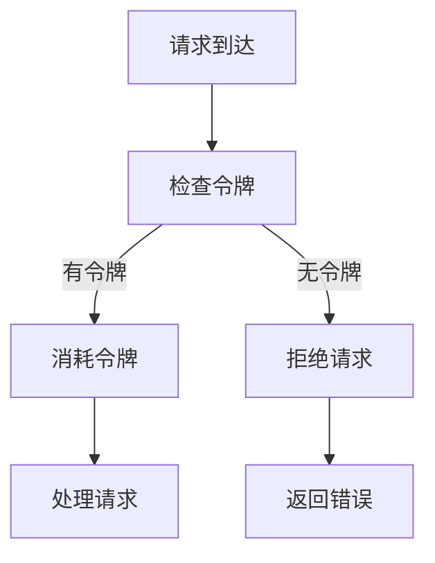

                 

## 第1章：问题背景

### 1.1.1 问题描述
在当今互联网时代，随着大数据和人工智能技术的飞速发展，大规模语言模型（LLM）的应用场景越来越广泛，如搜索引擎、聊天机器人、智能客服等。然而，随着用户数量的增加和访问量的提升，LLM应用面临着日益严重的过载问题。过载问题会导致系统响应速度下降、服务质量下降，甚至可能导致系统崩溃。

#### 问题描述
- **系统过载**：当用户请求的数量超过系统处理能力时，系统无法及时响应，导致用户体验下降。
- **响应时间延长**：系统在处理大量请求时，响应时间会显著增加，用户等待时间变长。
- **资源消耗增加**：系统在处理大量请求时，服务器资源（CPU、内存、网络等）会被大量占用，导致资源消耗增加。
- **系统稳定性下降**：系统在过载情况下，可能出现各种错误，如数据库连接失败、内存溢出等，导致系统稳定性下降。

### 1.1.2 问题解决
限流算法作为流量管理的重要手段，可以有效控制进入系统的请求量，防止过载问题。通过合理设计和应用限流算法，可以保障LLM应用的稳定性和服务质量。

#### 解决思路
- **限制请求速率**：通过限制请求的速率，确保系统不会被大量请求淹没。
- **动态调整阈值**：根据系统负载情况，动态调整限流阈值，确保系统在合理负载范围内运行。
- **弹性扩展**：通过水平扩展（增加服务器数量）和垂直扩展（提升服务器性能）来提升系统处理能力。

### 1.1.3 边界与外延
限流算法主要应用于网络服务、API接口、数据库访问等场景，其边界和范围可以扩展到整个互联网领域。同时，限流算法与其他流量管理、负载均衡等技术密切相关。

#### 边界与外延
- **应用场景**：网络服务、API接口、数据库访问、消息队列等。
- **技术关联**：与流量管理、负载均衡、弹性计算等技术密切相关。
- **边界定义**：限流算法主要关注请求流量的控制，包括请求速率、请求数量等。
- **外延扩展**：可以扩展到其他领域，如分布式系统、云计算等。

### 1.1.4 概念结构与核心要素组成
限流算法的核心概念包括令牌桶、漏桶、令牌桶与漏桶的变种等。这些算法通过控制请求的流量，实现对系统的保护。核心要素包括请求处理策略、时间窗口、阈值设置等。

#### 概念结构与核心要素
- **令牌桶**：以固定速率生成令牌，请求消耗令牌。
- **漏桶**：以固定速率处理请求，请求均匀流入。
- **时间窗口**：限流算法的时间范围，如秒、分钟等。
- **阈值设置**：根据系统负载情况，设置合适的阈值，控制请求量。
- **请求处理策略**：根据限流算法特点，选择合适的处理策略，如快速失败、排队等待等。

## 第2章：核心概念与联系

### 2.1 限流算法定义
限流算法是一种用于控制流量、防止系统过载的技术手段。它通过限制请求的速率，保证系统的稳定性和服务质量。

#### 定义与分类
- **定义**：限流算法是一种流量管理技术，通过限制进入系统的请求量，防止系统过载。
- **分类**：根据算法特点，限流算法可以分为令牌桶、漏桶、令牌桶与漏桶的变种等。

### 2.2 限流算法属性特征对比表格
以下是一个简化的限流算法属性特征对比表格：

| 算法名称 | 特点 | 适用场景 |
| :--: | :--: | :--: |
| 令牌桶 | 可以突发处理大量请求 | 高并发场景 |
| 漏桶 | 流量均匀，不能突发 | 均匀流量场景 |
| 令牌桶（变种） | 可以根据需求调整阈值 | 动态调整场景 |
| 漏桶（变种） | 可以根据需求调整阈值 | 动态调整场景 |

### 2.3 ER实体关系图架构
以下是一个简化的ER实体关系图，描述了限流算法、流量、系统等实体之间的关系：

```mermaid
erDiagram
  Flow ||--|{ Request } : 包含
  System ||--|{ LimitAlgorithm } : 应用
  LimitAlgorithm ||--|{ Rule } : 配置
```

## 第3章：算法原理讲解

### 3.1 算法流程图
以下是一个简化的限流算法流程图：



### 3.2 Python源代码实现
以下是一个简化的令牌桶算法的Python源代码实现：

```python
import time
import threading

class TokenBucket:
    def __init__(self, capacity, rate):
        self.capacity = capacity
        self.rate = rate
        self.tokens = capacity
        self.last_time = time.time()
        self.lock = threading.Lock()

    def get_token(self):
        with self.lock:
            now = time.time()
            interval_tokens = (now - self.last_time) * self.rate
            self.tokens = min(self.capacity, self.tokens + interval_tokens)
            self.last_time = now

            if self.tokens >= 1:
                self.tokens -= 1
                return True
            else:
                return False

# 测试代码
bucket = TokenBucket(5, 1)  # 创建令牌桶，容量为5，生成速率为1
for i in range(10):
    if bucket.get_token():
        print(f"请求{i}被处理")
    else:
        print(f"请求{i}被拒绝")
```

### 3.3 数学模型与公式
令牌桶算法的数学模型可以表示为：

$$
\text{tokens}(t) = \text{tokens}(t-1) + r \cdot \min\left(1, \frac{t - \text{last\_time}}{T}\right)
$$

其中，$\text{tokens}(t)$ 表示时间 $t$ 时的令牌数量，$r$ 表示令牌生成速率，$T$ 表示时间窗口，$\text{last\_time}$ 表示上次生成令牌的时间。

### 3.4 举例说明
假设一个令牌桶的容量为5，生成速率为1，时间窗口为1秒。在时间0秒时，令牌桶中有5个令牌。在接下来的1秒内，每秒生成1个令牌。在时间1秒时，令牌桶中有5个令牌。如果在这1秒内，有5个请求到达，每个请求需要消耗1个令牌，那么所有请求都会被处理。在时间2秒时，令牌桶中剩余4个令牌。如果在这1秒内，有6个请求到达，那么只有5个请求会被处理，第6个请求会被拒绝。

## 第二部分：限流算法在实际应用中的应用

### 第4章：限流算法在LLM应用中的重要性

#### 4.1 LLM应用中过载问题
大规模语言模型（LLM）在应用中，如搜索引擎、聊天机器人、智能客服等，面临着过载问题的挑战。具体问题如下：

1. **高并发请求**：LLM应用可能同时接收到大量用户请求，导致系统资源不足。
2. **请求处理延迟**：在过载情况下，系统处理请求的速度下降，导致用户等待时间增加。
3. **系统稳定性下降**：系统在过载情况下，可能出现各种错误，如内存溢出、数据库连接失败等，影响系统的稳定性。

#### 4.2 限流算法在LLM应用中的意义
限流算法在LLM应用中具有非常重要的意义，可以有效解决过载问题，保障系统的稳定性和服务质量：

1. **控制请求速率**：通过限制用户请求的速率，防止系统被大量请求淹没，确保系统有足够的资源处理请求。
2. **提高系统响应速度**：在限流算法的作用下，系统可以更快地处理请求，减少用户等待时间，提高用户体验。
3. **保障系统稳定性**：限流算法可以防止系统过载，避免出现内存溢出、数据库连接失败等错误，提高系统的稳定性。

### 第5章：主流限流算法介绍

#### 5.1 令牌桶算法
令牌桶算法是一种经典的限流算法，通过以固定速率生成令牌，请求消耗令牌。具体特点如下：

1. **突发处理能力**：可以处理突发的大量请求，适用于高并发场景。
2. **灵活性**：可以根据需求调整令牌生成速率和容量，实现动态调整。

#### 5.2 漏桶算法
漏桶算法是一种简单的限流算法，以固定速率处理请求，请求均匀流入。具体特点如下：

1. **均匀处理能力**：处理请求的速度均匀，适用于均匀流量场景。
2. **简单实现**：实现相对简单，适用于不需要突发处理能力的场景。

#### 5.3 令牌桶与漏桶算法的对比
令牌桶算法和漏桶算法各有优缺点，具体对比如下：

| 对比项 | 令牌桶算法 | 漏桶算法 |
| :--: | :--: | :--: |
| 突发处理能力 | 强 | 弱 |
| 流量均匀性 | 弱 | 强 |
| 实现复杂度 | 高 | 低 |
| 适用场景 | 高并发、需要突发处理能力 | 均匀流量、不需要突发处理能力 |

### 第6章：限流算法在LLM应用中的实践

#### 6.1 LLM应用场景介绍
大规模语言模型（LLM）在应用中，如搜索引擎、聊天机器人、智能客服等，面临着过载问题的挑战。具体场景如下：

1. **搜索引擎**：用户输入查询关键词，搜索引擎需要对大量数据进行检索和处理，面临高并发请求和海量数据处理问题。
2. **聊天机器人**：用户与聊天机器人进行实时对话，聊天机器人需要理解用户意图并生成回复，面临高并发请求和实时性要求。
3. **智能客服**：用户咨询问题，智能客服需要理解用户问题并生成回复，同时需要处理大量用户请求，面临高并发请求和海量数据处理问题。

#### 6.2 系统功能设计
在LLM应用中，限流算法需要实现以下功能：

1. **请求速率限制**：通过限制用户请求的速率，防止系统被大量请求淹没，确保系统有足够的资源处理请求。
2. **请求队列管理**：在请求速率超过系统处理能力时，将请求放入队列等待处理，确保系统的连续性和稳定性。
3. **动态调整阈值**：根据系统负载情况，动态调整限流阈值，确保系统在合理负载范围内运行。

#### 6.3 系统架构设计
在LLM应用中，限流算法的系统架构设计如下：

1. **请求入口**：用户请求通过入口进入系统，如API接口、Web前端等。
2. **限流模块**：对接收到的请求进行限流处理，包括请求速率限制、请求队列管理、动态调整阈值等。
3. **业务处理模块**：对通过限流的请求进行业务处理，如搜索引擎的查询处理、聊天机器人的对话处理、智能客服的问题处理等。
4. **日志记录模块**：记录系统运行状态和请求处理情况，包括请求量、请求速率、请求处理时间等。

#### 6.4 系统接口设计与交互
在LLM应用中，限流算法的系统接口设计与交互如下：

1. **API接口**：提供统一的API接口，供业务系统调用，如查询接口、对话接口、问题接口等。
2. **限流规则配置**：通过配置文件或API接口，设置限流规则，包括请求速率限制、请求队列容量、动态调整阈值等。
3. **监控与报警**：通过监控系统，实时监控系统运行状态和请求处理情况，如请求量、请求速率、请求处理时间等，当出现异常情况时，触发报警。

## 第7章：项目实战

### 7.1 环境安装
在开始项目实战之前，需要安装以下环境：

1. **Python环境**：安装Python 3.6及以上版本。
2. **依赖库**：安装requests库、time库、threading库等。

### 7.2 系统核心实现源代码
以下是一个简单的令牌桶算法实现示例：

```python
import time
import threading

class TokenBucket:
    def __init__(self, capacity, rate):
        self.capacity = capacity
        self.rate = rate
        self.tokens = capacity
        self.last_time = time.time()
        self.lock = threading.Lock()

    def get_token(self):
        with self.lock:
            now = time.time()
            interval_tokens = (now - self.last_time) * self.rate
            self.tokens = min(self.capacity, self.tokens + interval_tokens)
            self.last_time = now

            if self.tokens >= 1:
                self.tokens -= 1
                return True
            else:
                return False

def process_request(bucket):
    while True:
        if bucket.get_token():
            print("请求被处理")
            break
        else:
            print("请求被拒绝")
            break

if __name__ == "__main__":
    bucket = TokenBucket(5, 1)  # 创建令牌桶，容量为5，生成速率为1

    threads = []
    for i in range(10):
        thread = threading.Thread(target=process_request, args=(bucket,))
        threads.append(thread)
        thread.start()

    for thread in threads:
        thread.join()
```

### 7.3 代码应用解读与分析
在上面的代码中，我们实现了一个简单的令牌桶算法，用于控制请求的速率。具体解读如下：

1. **初始化**：令牌桶的容量和生成速率在初始化时设置，如`TokenBucket(5, 1)`表示容量为5，生成速率为1。
2. **获取令牌**：通过`get_token`方法获取令牌，每次调用会检查当前是否有令牌可用，如有则消耗一个令牌并返回True，否则返回False。
3. **处理请求**：在主函数中，我们创建了10个线程，每个线程模拟一个用户请求，通过调用`process_request`方法来处理请求。如果请求被处理，则线程退出循环，否则线程继续循环等待。

### 7.4 实际案例分析
在实际项目中，我们可以将令牌桶算法集成到LLM应用中，以控制请求的速率。以下是一个实际案例：

1. **场景描述**：假设一个聊天机器人应用，需要限制每个用户每分钟发送的消息数量不超过5条。
2. **解决方案**：在聊天机器人应用中集成令牌桶算法，设置容量为5，生成速率为1。每次用户发送消息时，调用令牌桶算法获取令牌，如果获取到令牌，则处理用户消息，否则拒绝用户消息。

### 7.5 项目小结
通过本项目的实战，我们实现了令牌桶算法，并分析了其在LLM应用中的实际应用。限流算法在保障系统稳定性和服务质量方面具有重要作用，通过合理设计和应用限流算法，可以有效地解决过载问题。

## 第8章：最佳实践与注意事项

### 8.1 最佳实践 tips
在设计和应用限流算法时，以下是一些最佳实践：

1. **合理设置阈值**：根据系统负载情况和业务需求，合理设置限流阈值，确保系统在合理负载范围内运行。
2. **动态调整阈值**：根据系统负载变化，动态调整限流阈值，以适应不同的负载情况。
3. **监控与报警**：实时监控系统运行状态和请求处理情况，当出现异常情况时，触发报警。
4. **负载均衡**：在分布式系统中，通过负载均衡技术，将请求合理分配到各个节点，避免单点过载。
5. **容量规划**：根据业务增长情况，提前规划系统容量，避免出现容量不足的问题。

### 8.2 小结
限流算法在保障系统稳定性和服务质量方面具有重要作用，通过合理设计和应用限流算法，可以有效地解决过载问题。

### 8.3 注意事项
在设计和应用限流算法时，需要注意以下事项：

1. **阈值设置**：合理设置限流阈值，避免过松或过紧。
2. **动态调整**：根据系统负载变化，动态调整限流阈值，以适应不同的负载情况。
3. **性能影响**：限流算法可能会对系统性能产生一定影响，需要综合考虑性能和稳定性的平衡。
4. **异常处理**：在出现异常情况时，确保系统能够及时处理，避免造成更大的损失。

### 8.4 拓展阅读
对于限流算法的深入研究和应用，以下是一些拓展阅读：

1. **《大规模分布式系统设计》**：了解分布式系统中的限流算法设计和应用。
2. **《算法导论》**：学习算法的基本原理和设计方法，为限流算法的设计提供理论基础。
3. **《Linux系统编程》**：了解Linux系统中的流量控制技术，为限流算法的实现提供技术支持。
4. **《大规模数据处理技术》**：了解大数据处理中的限流算法应用，为LLM应用中的限流算法设计提供参考。 

## 结论
限流算法在保障系统稳定性和服务质量方面具有重要作用。通过合理设计和应用限流算法，可以有效地解决过载问题。本文对限流算法进行了详细的介绍和分析，包括算法原理、实际应用场景和项目实战，为读者提供了实用的参考。希望本文能对您在LLM应用中的限流算法设计和应用有所帮助。作者：AI天才研究院/AI Genius Institute & 禅与计算机程序设计艺术 /Zen And The Art of Computer Programming。

