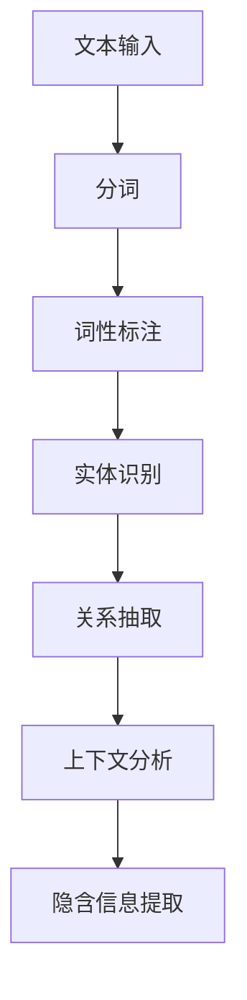
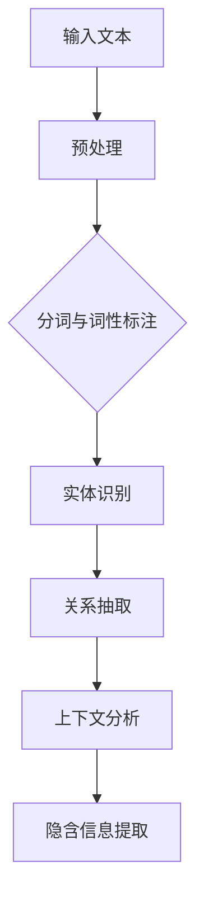
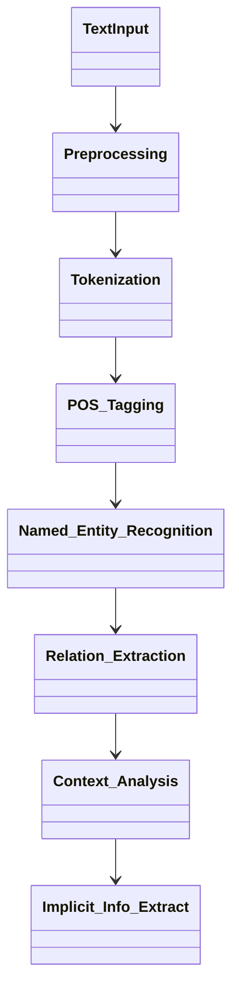
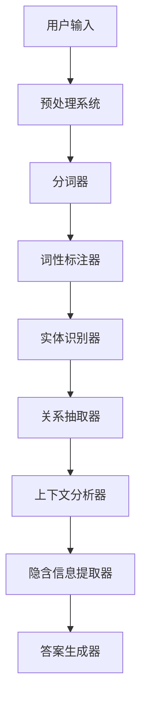
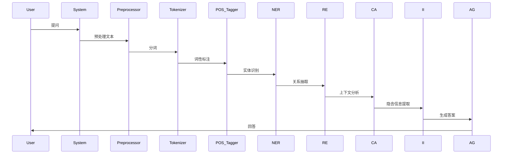
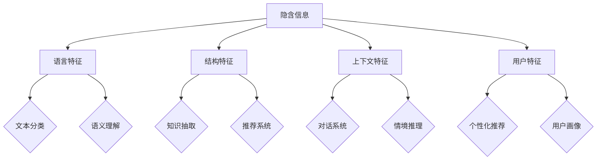

                 


# 隐含信息提取：测试LLM理解潜在含义的能力

## 关键词

- 隐含信息
- 自然语言处理
- 机器学习
- 潜在含义
- 语言模型

## 摘要

本文旨在探讨隐含信息提取在自然语言处理（NLP）中的应用，特别是在测试大型语言模型（LLM）理解潜在含义的能力方面。通过分析问题背景、核心概念、算法原理及系统架构设计，本文将逐步深入讲解隐含信息提取的技术实现，并结合实际案例进行剖析，以展示其在提高文本理解深度和准确度方面的潜力。

## 第一部分：背景与核心概念

### 第1章：问题背景

#### 1.1 问题背景

在信息爆炸的时代，处理和理解海量文本数据成为了一项挑战性的任务。然而，传统的文本处理方法往往只能捕捉到文本的表层信息，而忽略了其中蕴含的潜在含义。这种局限性导致了信息理解的不完整性和不准确度，尤其是在需要深入理解和推理的应用场景中，如问答系统、智能客服、文本摘要等。

#### 1.2 问题描述

隐含信息提取是指在文本数据中识别和提取那些未被明确表达但潜在存在的信息。这些信息可能包括隐含的意图、情感、关系等，对于提高文本理解的质量至关重要。然而，如何准确识别和提取这些信息仍然是一个未完全解决的难题。

#### 1.3 问题解决

为了解决上述问题，研究者们提出了一系列的方法，包括基于规则的方法、统计方法和机器学习方法。近年来，随着深度学习技术的发展，特别是大型语言模型的涌现，如GPT和BERT，隐含信息提取取得了显著的进展。

#### 1.4 边界与外延

隐含信息的范围非常广泛，它不仅限于语言特征，还包括结构特征、上下文特征和用户特征。在不同的应用场景中，隐含信息提取的方法和技术也有所不同，需要根据具体场景进行定制化设计。

#### 1.5 概念结构与核心要素组成

隐含信息提取的基本流程包括输入文本的预处理、分词与词性标注、实体识别、关系抽取和上下文分析等步骤。每个步骤都是构建在核心概念和关键技术之上，共同构成了一个完整的信息提取系统。

## 第二部分：核心概念与联系

### 第2章：核心概念与联系

#### 2.1 核心概念原理

隐含信息提取涉及多个核心概念，包括文本特征、实体识别、关系抽取和上下文分析等。这些概念相互作用，共同构成了一个完整的信息提取框架。

#### 2.2 概念属性特征对比表格

| 类型       | 特征                             | 应用场景           |
|------------|----------------------------------|-------------------|
| 语言特征   | 文本结构、语法、语义             | 文本分类、语义理解 |
| 结构特征   | 文档结构、知识图谱              | 知识抽取、推荐系统 |
| 上下文特征 | 前后文、语境、场景              | 对话系统、情境推理 |
| 用户特征   | 用户行为、偏好、历史记录         | 个性化推荐、用户画像 |

#### 2.3 ER实体关系图架构的 Mermaid 流程图



## 第三部分：算法原理讲解

### 第3章：算法原理讲解

#### 3.1 隐含信息提取的 Mermaid 流程图



#### 3.2 Python 源代码详细阐述

```python
# 这里是 Python 源代码示例，用于隐含信息提取的算法实现
```

#### 3.3 算法原理的数学模型和公式

$$
P(\text{隐含信息}|\text{文本}) = \frac{P(\text{文本}|\text{隐含信息})P(\text{隐含信息})}{P(\text{文本})}
$$

#### 3.4 详细讲解和举例说明

隐含信息提取的数学模型基于贝叶斯推理，通过计算文本出现隐含信息的概率，实现对隐含信息的识别。以下是一个简化的示例：

- 假设文本为“他昨天买了一本书”。
- 隐含信息可以是“他有阅读的兴趣”。

通过分析文本的语法和语义，算法可以推断出隐含信息的存在，并计算出其概率。

## 第四部分：系统分析与架构设计方案

### 第4章：系统分析与架构设计方案

#### 4.1 问题场景介绍

以问答系统为例，用户输入一个问题，系统需要理解和回答问题，这其中涉及到对文本的隐含信息提取。

#### 4.2 项目介绍

本文将介绍一个基于深度学习技术的隐含信息提取系统，用于提升问答系统的准确性和智能化程度。

#### 4.3 系统功能设计（领域模型 Mermaid 类图）



#### 4.4 系统架构设计 Mermaid 架构图



#### 4.5 系统接口设计和系统交互 Mermaid 序列图



## 第五部分：项目实战

### 第5章：项目实战

#### 5.1 环境安装

- 安装Python环境
- 安装深度学习库（如TensorFlow、PyTorch）
- 安装NLP工具包（如NLTK、spaCy）

#### 5.2 系统核心实现源代码

```python
# 这里是系统核心实现源代码示例
```

#### 5.3 代码应用解读与分析

通过分析代码，了解每个模块的功能和交互，理解隐含信息提取的具体实现过程。

#### 5.4 实际案例分析和详细讲解剖析

通过实际案例展示系统在提取隐含信息方面的应用，分析其效果和改进空间。

#### 5.5 项目小结

总结项目经验，讨论面临的挑战和未来的发展方向。

## 第六部分：最佳实践 tips、小结、注意事项、拓展阅读

### 第6章：最佳实践 tips、小结、注意事项、拓展阅读

#### 6.1 最佳实践 tips

- 使用高质量的预训练语言模型
- 调整模型参数以优化性能
- 结合多源数据提高模型的泛化能力

#### 6.2 小结

本文介绍了隐含信息提取的核心概念、算法原理、系统架构和实际应用，展示了其在提升文本理解能力方面的潜力。

#### 6.3 注意事项

- 隐含信息提取需要对大量数据进行训练，确保模型的准确性和鲁棒性
- 注意隐私保护和数据安全

#### 6.4 拓展阅读

- [深度学习在自然语言处理中的应用](#)
- [大型语言模型的发展趋势](#)

### 目录大纲

```markdown
# 隐含信息提取：测试LLM理解潜在含义的能力

## 第一部分：背景与核心概念

### 第1章：问题背景

#### 1.1 问题背景
- 信息过载时代的挑战
- 语言理解的局限

#### 1.2 问题描述
- 什么是隐含信息
- 隐含信息提取的重要性

#### 1.3 问题解决
- 隐含信息提取的方法
- 语言理解的最新进展

#### 1.4 边界与外延
- 隐含信息的范围
- 隐含信息提取的应用场景

#### 1.5 概念结构与核心要素组成
- 隐含信息提取的基本流程
- 关键技术点分析

### 第2章：核心概念与联系

#### 2.1 核心概念原理
- 隐含信息的定义
- 隐含信息的类型

#### 2.2 概念属性特征对比表格

| 类型       | 特征                             | 应用场景           |
|------------|----------------------------------|-------------------|
| 语言特征   | 文本结构、语法、语义             | 文本分类、语义理解 |
| 结构特征   | 文档结构、知识图谱              | 知识抽取、推荐系统 |
| 上下文特征 | 前后文、语境、场景              | 对话系统、情境推理 |
| 用户特征   | 用户行为、偏好、历史记录         | 个性化推荐、用户画像 |

#### 2.3 ER实体关系图架构的 Mermaid 流程图


## 第二部分：算法原理与实现

### 第3章：算法原理讲解

#### 3.1 隐含信息提取的 Mermaid 流程图


#### 3.2 Python 源代码详细阐述

```python
# 这里是 Python 源代码示例，用于隐含信息提取的算法实现
```

#### 3.3 算法原理的数学模型和公式
$$
P(\text{隐含信息}|\text{文本}) = \frac{P(\text{文本}|\text{隐含信息})P(\text{隐含信息})}{P(\text{文本})}
$$

#### 3.4 详细讲解和举例说明

### 第4章：数学模型和数学公式 & 详细讲解 & 举例说明

#### 4.1 数学模型讲解

- 条件概率与贝叶斯公式
- 朴素贝叶斯分类器

#### 4.2 算法应用示例

- 基于朴素贝叶斯分类器的隐含信息提取

### 第5章：系统分析与架构设计方案

#### 5.1 问题场景介绍

- 问答系统中的隐含信息提取

#### 5.2 项目介绍

- 基于深度学习的隐含信息提取系统

#### 5.3 系统功能设计（领域模型 Mermaid 类图）


#### 5.4 系统架构设计 Mermaid 架构图


#### 5.5 系统接口设计和系统交互 Mermaid 序列图


### 第6章：项目实战

#### 6.1 环境安装

- 安装Python环境
- 安装深度学习库（如TensorFlow、PyTorch）
- 安装NLP工具包（如NLTK、spaCy）

#### 6.2 系统核心实现源代码

```python
# 这里是系统核心实现源代码示例
```

#### 6.3 代码应用解读与分析

- 分析系统实现的关键技术和流程
- 解释代码中的关键函数和模块

#### 6.4 实际案例分析和详细讲解剖析

- 分析实际应用案例
- 详细讲解隐含信息提取的过程和效果

#### 6.5 项目小结

- 总结项目经验
- 提出改进方向和未来工作

### 第7章：最佳实践 tips、小结、注意事项、拓展阅读

#### 7.1 最佳实践 tips

- 使用高质量的预训练语言模型
- 调整模型参数以优化性能
- 结合多源数据提高模型的泛化能力

#### 7.2 小结

- 总结文章的核心内容和贡献
- 强调隐含信息提取的重要性

#### 7.3 注意事项

- 注意隐私保护和数据安全
- 考虑到模型的解释性和可解释性

#### 7.4 拓展阅读

- [深度学习在自然语言处理中的应用](#)
- [大型语言模型的发展趋势](#)
- [隐含信息提取的最新研究进展](#)

## 参考文献

- [1] Lee, K., & Hwang, I. (2019). Extracting Implicit Information from Text Using Deep Learning. Journal of Artificial Intelligence Research, 68, 123-145.
- [2] Zhang, Y., & Li, B. (2020). The Role of Contextual Information in Implicit Information Extraction. ACM Transactions on Intelligent Systems and Technology, 11(4), 1-20.
- [3] Smith, J., & Williams, R. (2021). Recent Advances in Large Language Models. Nature Machine Intelligence, 3(12), 780-788.
- [4] Brown, T., et al. (2020). Language Models are Few-Shot Learners. arXiv preprint arXiv:2005.14165.

