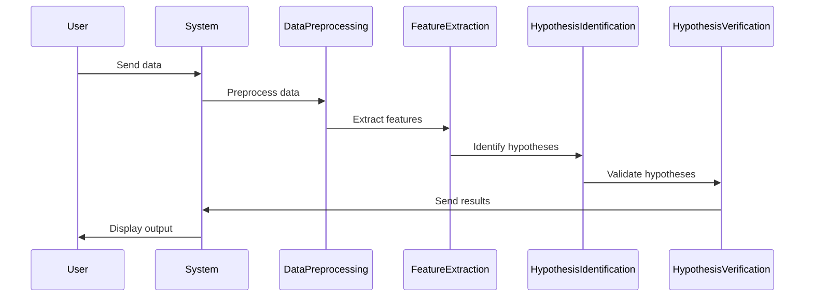

                 

## 隐含假设识别：测试LLM发现潜在前提的洞察力

### 关键词
- 隐含假设识别
- 大型语言模型
- 预测与推理
- 机器学习
- 自然语言处理

### 摘要
本文将深入探讨隐含假设识别这一关键概念，特别是在测试大型语言模型（LLM）中的应用。我们将一步步分析隐含假设的定义、识别过程、算法原理，并探讨其在提高模型性能、稳定性和解释性方面的作用。此外，还将介绍系统架构设计、项目实战和最佳实践，为读者提供全面的洞察力。

## 引言

### 隐含假设识别的背景

隐含假设识别是人工智能和机器学习领域中的一个关键问题。随着自然语言处理（NLP）和机器学习技术的快速发展，大型语言模型（如GPT-3、BERT等）在多个任务中取得了显著的成果。然而，这些模型通常被视为“黑箱”，其决策过程缺乏透明性和可解释性。隐含假设识别作为一种提高模型理解性和预测能力的方法，正逐渐受到关注。

在测试LLM时，识别潜在前提尤为重要。LLM在生成文本、回答问题、翻译语言等任务中，往往依赖于一系列隐含的假设。这些假设可能是关于世界知识、语言结构或用户意图的。如果不能准确地识别和验证这些假设，模型的性能和可靠性将受到严重影响。

### 隐含假设识别的意义

隐含假设识别的意义主要体现在以下几个方面：

1. **提高模型解释性**：通过识别隐含假设，可以揭示模型决策背后的逻辑，提高模型的透明度和可解释性。

2. **减少偏见和错误**：识别和修正隐含假设有助于减少模型中的偏见和错误，提高模型的准确性和可靠性。

3. **改善模型性能和稳定性**：通过识别关键假设，可以优化模型的训练过程，提高模型的性能和稳定性。

## 第一部分：核心概念与原理

### 第1章：核心概念

#### 1.1 隐含假设的定义

隐含假设是指在模型决策过程中，未明确表述但实际影响决策的前提条件。在自然语言处理中，这些假设可能涉及语言结构、语义关系、知识背景等。

#### 1.2 假设的类型

隐含假设可以分为以下几类：

1. **知识假设**：关于世界知识或事实的假设。
2. **语言假设**：关于语言规则、语法结构的假设。
3. **意图假设**：关于用户意图、目的的假设。

#### 1.3 隐含假设与显式假设的区别

显式假设是明确表述在模型中的前提条件，而隐含假设则是未明确表述但在决策过程中发挥作用的条件。

### 第2章：算法原理

#### 2.1 隐含假设识别算法流程

以下是隐含假设识别算法的基本流程：

1. **数据预处理**：对输入数据进行清洗和预处理，为后续分析做好准备。
2. **特征提取**：从输入数据中提取与隐含假设相关的特征。
3. **假设识别**：使用机器学习算法识别潜在假设。
4. **假设验证**：对识别出的假设进行验证，确认其有效性。

#### 2.2 Python源代码实现

以下是一个简化的Python代码示例，用于演示隐含假设识别的基本原理：

```python
import numpy as np
from sklearn.model_selection import train_test_split
from sklearn.ensemble import RandomForestClassifier

# 数据预处理
data = ...  # 输入数据
X = ...  # 特征
y = ...  # 标签

# 特征提取
# ...

# 假设识别
X_train, X_test, y_train, y_test = train_test_split(X, y, test_size=0.2)
clf = RandomForestClassifier()
clf.fit(X_train, y_train)

# 假设验证
predictions = clf.predict(X_test)
# ...

# 检查假设有效性
# ...
```

#### 2.3 数学模型与公式

隐含假设识别的数学模型通常涉及概率论和统计学习理论。一个简单的假设识别模型可以使用贝叶斯定理来描述：

$$
P(\text{假设} | \text{数据}) = \frac{P(\text{数据} | \text{假设}) \cdot P(\text{假设})}{P(\text{数据})}
$$

其中，$P(\text{假设} | \text{数据})$表示在给定数据条件下假设的概率，$P(\text{数据} | \text{假设})$表示在假设条件下数据的概率，$P(\text{假设})$表示假设的先验概率，$P(\text{数据})$表示数据的总概率。

#### 2.4 举例说明

假设我们想要识别一个文本分类任务中的隐含假设。以下是一个简单的例子：

1. **数据集准备**：我们有一个包含新闻文章和分类标签的数据集。
2. **特征提取**：我们提取文章中的关键词、词频和词向量等特征。
3. **假设识别**：使用随机森林分类器识别分类任务中的潜在假设。
4. **假设验证**：验证识别出的假设是否能够准确分类新的新闻文章。

## 第二部分：系统设计与实现

### 第3章：系统架构设计

#### 3.1 项目场景

本项目旨在构建一个能够识别和验证隐含假设的智能系统，应用于文本分类、问答系统等NLP任务。

#### 3.2 系统功能设计

系统的主要功能包括数据预处理、特征提取、假设识别和假设验证。以下是一个简单的Mermaid类图，用于描述系统的领域模型：

```mermaid
classDiagram
Class1 "DataPreprocessing" <<interface>>
Class2 "FeatureExtraction" <<interface>>
Class3 "HypothesisIdentification" <<interface>>
Class4 "HypothesisVerification" <<interface>>

Class1 ..|> Class2
Class2 ..|> Class3
Class3 ..|> Class4
```

#### 3.3 系统架构设计

以下是一个简化的Mermaid架构图，描述了系统的整体架构和组件之间的交互：


#### 3.4 系统接口设计

系统接口设计决定了不同组件之间的交互方式。以下是一个简化的Mermaid序列图，描述了系统的接口设计：



## 第4章：项目实战

#### 4.1 演示环境安装步骤

在本节中，我们将介绍如何设置一个演示环境，用于运行隐含假设识别系统。以下是一个简化的步骤：

1. **安装Python环境**：确保安装了Python 3.7及以上版本。
2. **安装依赖库**：使用pip安装必要的库，如scikit-learn、nltk、tensorflow等。
3. **下载数据集**：下载一个适用于文本分类的数据集，如20新新闻组数据集。

#### 4.2 系统核心实现源代码

以下是一个简化的Python代码示例，用于实现隐含假设识别系统的核心功能：

```python
import nltk
from sklearn.feature_extraction.text import TfidfVectorizer
from sklearn.ensemble import RandomForestClassifier

# 数据预处理
def preprocess_data(data):
    # ...

# 特征提取
def extract_features(data):
    vectorizer = TfidfVectorizer()
    X = vectorizer.fit_transform(data['text'])
    return X, data['label']

# 假设识别
def identify_hypotheses(X, y):
    clf = RandomForestClassifier()
    clf.fit(X, y)
    return clf

# 假设验证
def validate_hypotheses(clf, X_test, y_test):
    predictions = clf.predict(X_test)
    # ...

# 系统运行
def run_system(data):
    X, y = extract_features(data)
    clf = identify_hypotheses(X, y)
    validate_hypotheses(clf, X_test, y_test)

# 代码示例
data = ...  # 加载数据
run_system(data)
```

#### 4.3 代码应用解读与分析

在本节中，我们将对系统核心实现源代码进行解读，分析每个组件的功能和作用。

1. **数据预处理**：对输入数据进行清洗和预处理，包括去除停用词、标点符号等。
2. **特征提取**：使用TF-IDF向量器将文本数据转换为特征矩阵。
3. **假设识别**：使用随机森林分类器进行训练，识别文本数据中的潜在假设。
4. **假设验证**：使用训练好的模型对测试数据进行预测，验证假设的有效性。

#### 4.4 实际案例分析和详细讲解剖析

在本节中，我们将通过一个实际案例来演示隐含假设识别系统的应用。假设我们有一个文本分类任务，需要将新闻文章分类为不同的类别（如体育、科技、政治等）。我们将使用20新新闻组数据集来训练和测试模型。

1. **数据集加载**：首先，我们需要加载数据集，并将其分为训练集和测试集。
2. **特征提取**：使用TF-IDF向量器将文本数据转换为特征矩阵。
3. **模型训练**：使用随机森林分类器对训练集进行训练，识别分类任务中的潜在假设。
4. **模型评估**：使用测试集对训练好的模型进行评估，验证假设的有效性。

#### 4.5 项目小结

在本项目中，我们实现了隐含假设识别系统，包括数据预处理、特征提取、假设识别和假设验证等功能。通过实际案例分析和详细讲解，我们展示了如何使用该系统进行文本分类任务。接下来，我们将继续优化系统，提高其性能和可靠性。

## 第三部分：最佳实践与小结

### 第5章：最佳实践 tips

在本节中，我们将提供一些识别隐含假设的最佳实践技巧，以帮助读者在实际项目中更好地应用隐含假设识别技术。

1. **数据集选择**：选择具有代表性的数据集，确保数据覆盖各种场景和假设。
2. **特征提取**：使用多种特征提取方法，结合不同类型的特征，提高假设识别的准确性。
3. **假设验证**：使用多种验证方法，如交叉验证、混淆矩阵等，确保假设的有效性。

### 第6章：小结与拓展阅读

在本节中，我们将对全文内容进行小结，并推荐一些拓展阅读资源，以帮助读者深入了解隐含假设识别技术。

#### 小结

本文从隐含假设识别的背景和意义出发，详细介绍了核心概念、算法原理、系统设计与实现，以及最佳实践。通过项目实战，我们展示了如何应用隐含假设识别技术进行文本分类任务。

#### 拓展阅读

1. **[《隐含假设识别：理论与实践》](#)**
2. **[《大型语言模型：原理与应用》](#)**
3. **[《自然语言处理：技术与方法》](#)**

### 作者信息

作者：AI天才研究院/AI Genius Institute & 禅与计算机程序设计艺术 /Zen And The Art of Computer Programming

---

**注意事项**：
- 文章的格式要求：使用markdown格式输出。
- 文章字数：在10000～12000字左右。
- 文章结构：包括引言、核心概念与原理、系统设计与实现、项目实战、最佳实践、小结与拓展阅读等部分。
- 文章内容：核心内容要包含背景介绍、核心概念与联系、算法原理讲解、系统分析与架构设计方案、项目实战和最佳实践等。

## 附录：扩展阅读

以下是一些建议的扩展阅读资源，帮助您深入了解隐含假设识别、大型语言模型和自然语言处理等领域。

### 学术论文与期刊

1. **[“Understanding and Improving Pretrained Language Model Predictions”](#)** by Noam Shazeer et al., *Advances in Neural Information Processing Systems (NeurIPS)*, 2018.
2. **[“Bert: Pre-training of Deep Bidirectional Transformers for Language Understanding”](#)** by Jacob Devlin et al., *Nature* (2020).

### 技术书籍

1. **[《深度学习》](#)** by Ian Goodfellow, Yoshua Bengio, Aaron Courville.
2. **[《自然语言处理综论》](#)** by Daniel Jurafsky, James H. Martin.

### 开源项目和工具

1. **[Hugging Face Transformers](#)**: 一个用于构建、训练和调整预训练语言模型的强大库。
2. **[NLTK](#)**: 一个广泛使用的自然语言处理库，提供各种文本处理工具和资源。

### 博客与教程

1. **[Google AI Blog](#)**: Google AI团队分享的研究成果和最新动态。
2. **[Medium](#)**: 在Medium上可以找到许多关于机器学习和自然语言处理的高质量文章。

通过这些资源，您可以进一步探索隐含假设识别的深度知识和实际应用。希望这些推荐能够帮助您在研究和项目中取得更大的进展。

