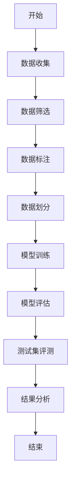

                 

# 《隐喻理解能力评测：测试LLM的深层语义理解》

## 关键词

- 隐喻理解
- 深层语义理解
- 语言模型（LLM）
- 评测方法
- 应用案例

## 摘要

随着人工智能技术的发展，深度学习模型在自然语言处理领域取得了显著成就。然而，对于隐喻这种复杂语言现象，现有模型仍存在理解上的困难。本文探讨了隐喻理解能力评测的重要性，介绍了基于语言模型（LLM）的深层语义理解评测方法，并通过评测工具和应用案例分析，揭示了评测结果及其应用价值。文章最后对未来的研究方向和挑战进行了展望，为提升AI语言模型的隐喻理解能力提供了参考。

## 目录大纲

### 第一部分：背景与理论基础

#### 第1章：隐喻理解能力概述

##### 1.1.1 隐喻的理解与应用

##### 1.1.2 隐喻在自然语言处理中的重要性

##### 1.1.3 隐喻理解能力评测的必要性

##### 1.1.4 隐喻理解能力评测的目标

#### 第2章：深层语义理解

##### 2.1.1 深层语义理解的定义

##### 2.1.2 深层语义理解的重要性

##### 2.1.3 深层语义理解的方法与挑战

#### 第3章：语言模型与深层语义理解

##### 3.1.1 语言模型的基本概念

##### 3.1.2 语言模型的发展历程

##### 3.1.3 语言模型在深层语义理解中的应用

#### 第4章：隐喻理解能力评测方法

##### 4.1.1 评测方法概述

##### 4.1.2 评测数据集的构建

##### 4.1.3 评测指标的设定

##### 4.1.4 评测流程

#### 第5章：评测工具与应用

##### 5.1.1 常见的评测工具

##### 5.1.2 工具选择与使用

##### 5.1.3 工具在评测中的应用案例

#### 第6章：评测结果分析

##### 6.1.1 评测结果概述

##### 6.1.2 结果分析与讨论

##### 6.1.3 结果的应用价值

#### 第7章：未来展望与挑战

##### 7.1.1 隐喻理解能力评测的发展趋势

##### 7.1.2 面临的挑战与对策

##### 7.1.3 未来研究方向

#### 第8章：总结与展望

##### 8.1.1 主要贡献

##### 8.1.2 研究不足与改进方向

##### 8.1.3 对未来研究的建议

### 第一部分：背景与理论基础

#### 第1章：隐喻理解能力概述

##### 1.1.1 隐喻的理解与应用

隐喻是一种修辞手法，通过将一个事物或概念比作另一个事物或概念，以产生生动、形象的效果。在自然语言中，隐喻不仅丰富了表达方式，还蕴含了深层的语义信息。隐喻的理解能力是人类智慧的重要体现，也是自然语言处理（NLP）领域的一个挑战。

首先，我们来定义一下隐喻。隐喻通常包括三个要素：本体（source）、喻体（target）和隐喻关系（trope）。本体是指隐喻中被比喻的事物或概念，喻体是指用来比喻本体的事物或概念，而隐喻关系则是连接本体和喻体的桥梁。

例如，当我们说“时间像流水一样流逝”，这里的“时间”是本体，“流水”是喻体，而“像”则建立了隐喻关系。通过隐喻，我们可以更直观地理解时间的流逝，使表达更加生动。

在应用方面，隐喻广泛存在于文学、广告、政治演讲等各种语言交流形式中。例如，广告中常用隐喻来吸引消费者的注意力，政治演讲中则常用隐喻来表达政策意图。隐喻的理解能力对于提升语言表达的精准度和沟通效果具有重要意义。

##### 1.1.2 隐喻在自然语言处理中的重要性

隐喻在自然语言处理中的应用具有重要的研究价值和实际意义。首先，隐喻是自然语言中的一个普遍现象，据统计，英语中大约有三分之一以上的句子含有隐喻。因此，提升模型对隐喻的理解能力，可以显著提高NLP系统的整体性能。

其次，隐喻的理解与生成能力是衡量一个NLP系统智能程度的重要指标。例如，在问答系统、对话系统、机器翻译等应用中，如果系统能够准确理解用户输入中的隐喻，那么其交互效果将更加自然和流畅。

此外，隐喻的理解能力也与机器阅读理解、情感分析等任务密切相关。例如，在机器阅读理解中，如果系统能够准确理解文章中的隐喻，那么它将更容易理解文章的主旨和情感倾向。

##### 1.1.3 隐喻理解能力评测的必要性

目前，尽管深度学习模型在自然语言处理领域取得了显著成就，但在隐喻理解方面仍然存在挑战。因此，开展隐喻理解能力评测具有重要的研究价值。

首先，隐喻理解能力评测可以为研究者和开发者提供有价值的评估标准，帮助他们了解模型在隐喻理解方面的表现，并找出存在的问题和改进方向。

其次，通过评测，可以发现现有模型在隐喻理解方面的不足，从而推动模型技术的不断改进。例如，某些模型可能在特定类型的隐喻上表现不佳，通过评测可以发现这些不足，进而针对这些问题进行优化。

最后，隐喻理解能力评测还可以促进跨领域合作，推动不同研究团队之间的交流和合作，共同推进隐喻理解技术的发展。

##### 1.1.4 隐喻理解能力评测的目标

隐喻理解能力评测的主要目标是评估模型在隐喻理解方面的表现，包括以下几个方面：

1. **准确性**：评估模型对隐喻的识别和解释的准确性。例如，在给定的句子中，模型能否正确识别出隐喻，并给出合理的解释。

2. **多样性**：评估模型对各种类型隐喻的理解能力。例如，模型能否理解不同形式的隐喻，如明喻、暗喻等。

3. **泛化能力**：评估模型在未见过的隐喻上的表现，即模型的泛化能力。例如，模型能否正确理解新出现的隐喻，而不仅仅是已知的隐喻。

4. **交互性**：评估模型在与人类用户交互时的隐喻理解能力。例如，模型能否在对话中准确理解用户的隐喻表达，并给出恰当的回应。

通过这些评测目标，我们可以全面评估模型在隐喻理解方面的性能，为后续研究和应用提供有力的支持。

#### 第2章：深层语义理解

##### 2.1.1 深层语义理解的定义

深层语义理解（Deep Semantic Understanding）是指对文本中的语义内容进行深度解析和推理，以获取文本的真正含义。与简单的文本分析不同，深层语义理解能够理解文本中的隐含意义、语境和情感，实现对文本内容的全面理解和精确解释。

深层语义理解包括以下几个关键方面：

1. **实体识别**：识别文本中的实体，如人名、地点、组织等。
2. **关系抽取**：抽取实体之间的关系，如“美国总统”与“领导美国”之间的关系。
3. **语义角色标注**：标注句子中各个成分的语义角色，如主语、谓语、宾语等。
4. **语义解析**：构建语义网络，表示文本中的语义关系。
5. **情感分析**：分析文本中的情感倾向，如正面、负面或中性。

##### 2.1.2 深层语义理解的重要性

深层语义理解在自然语言处理（NLP）领域具有重要地位，其原因如下：

1. **提升交互体验**：通过深层语义理解，NLP系统可以更准确地理解用户的意图，从而提供更自然、更有效的交互体验。

2. **增强知识表示**：深层语义理解有助于构建高质量的知识图谱，实现对海量信息的有效管理和利用。

3. **辅助决策支持**：在金融、医疗、法律等领域，深层语义理解可以帮助系统分析文本数据，提供智能化的决策支持。

4. **改进推荐系统**：在电子商务、社交媒体等领域，深层语义理解可以提升推荐系统的准确性，为用户推荐更相关的内容。

##### 2.1.3 深层语义理解的方法与挑战

深层语义理解涉及多种方法和技术，主要包括：

1. **规则方法**：基于预定义的规则和模式进行语义分析。优点是实现简单，但受限于规则的覆盖范围和灵活性。

2. **统计方法**：使用机器学习算法，如条件概率模型、隐马尔可夫模型（HMM）、最大熵模型等，从大量训练数据中学习语义关系。优点是能够处理复杂语义，但依赖于大量标注数据。

3. **深度学习方法**：通过深度神经网络，如卷积神经网络（CNN）、循环神经网络（RNN）、Transformer等，自动学习语义表示和关系。优点是具有强大的表达能力和自适应性，但训练过程复杂，对计算资源要求较高。

尽管深层语义理解方法取得了显著进展，但仍然面临以下挑战：

1. **数据稀缺**：高质量的标注数据稀缺，尤其是对复杂语义关系的标注，限制了模型的训练和优化。

2. **跨语言问题**：不同语言之间的语义表示和关系存在差异，限制了多语言深层语义理解的应用。

3. **长距离依赖**：文本中的语义关系可能跨越多个句子甚至段落，长距离依赖关系的处理仍是一个难题。

4. **多模态融合**：如何将文本、图像、语音等多种模态的信息进行有效融合，实现更全面、更精确的语义理解，是当前研究的一个热点。

#### 第3章：语言模型与深层语义理解

##### 3.1.1 语言模型的基本概念

语言模型（Language Model，LM）是自然语言处理（NLP）领域的一种基础模型，用于预测文本序列中的下一个词或字符。语言模型的核心任务是学习文本的概率分布，从而实现对语言数据的生成、理解和推理。

语言模型通常基于以下几种假设：

1. **独立假设**：假设一个词的出现与它前面的词无关，即当前词只与它的前一个词相关。

2. **马尔可夫假设**：假设当前词的出现只与它的前一个词相关，即一个词的出现状态只与前一状态有关。

3. **前向假设**：假设当前词的出现只与它的前几个词相关，即考虑更长的历史信息。

根据不同的假设，语言模型可以分为：

1. **一元语言模型**：基于独立假设，只考虑前一个词的信息。

2. **二元语言模型**：基于马尔可夫假设，考虑前两个词的信息。

3. **前向语言模型**：基于前向假设，考虑前若干个词的信息。

##### 3.1.2 语言模型的发展历程

语言模型的发展历程可以分为以下几个阶段：

1. **早期模型**：最早的模型包括N元语法（N-gram）模型，如一元语法、二元语法等。这些模型基于统计方法，通过计算词的频率分布来预测下一个词。

2. **神经网络模型**：随着深度学习的发展，神经网络模型逐渐成为语言模型的主流。早期使用循环神经网络（RNN）进行语言建模，后来Transformer模型的引入进一步提升了语言模型的性能。

3. **注意力机制**：注意力机制（Attention Mechanism）的引入，使得模型能够关注到输入序列中的关键信息，从而提高了语言模型的精度和泛化能力。

4. **预训练与微调**：预训练（Pre-training）是一种新的语言模型训练方法，通过在大规模未标注数据上进行预训练，然后在小规模标注数据上进行微调，取得了显著的效果。

##### 3.1.3 语言模型在深层语义理解中的应用

语言模型在深层语义理解中发挥着重要作用，主要体现在以下几个方面：

1. **文本生成**：语言模型可以生成连贯、自然的文本，从而实现文本的自动生成和编辑。

2. **文本分类**：通过语言模型，可以分析文本的语义特征，实现文本的分类任务。

3. **实体识别与关系抽取**：利用语言模型，可以识别文本中的实体，并抽取实体之间的关系。

4. **情感分析**：通过语言模型，可以分析文本的情感倾向，实现情感分析任务。

5. **问答系统**：语言模型可以用于问答系统，实现对用户问题的理解和回答。

总之，语言模型在深层语义理解中具有广泛的应用前景，是推动NLP技术发展的重要驱动力。

#### 第4章：隐喻理解能力评测方法

##### 4.1.1 评测方法概述

隐喻理解能力评测方法旨在通过一系列系统化的测试，评估语言模型（LLM）在理解隐喻方面的表现。这些方法不仅包括数据集的构建、评测指标的设定，还包括具体的评测流程和工具的选择。以下将详细阐述这些评测方法的核心组成部分。

##### 4.1.2 评测数据集的构建

构建一个高质量、具有代表性的评测数据集是隐喻理解能力评测的基础。数据集应包含多种类型的隐喻，以全面测试模型在不同隐喻形式上的理解能力。构建评测数据集通常涉及以下几个步骤：

1. **数据收集**：从各种来源（如文学作品、新闻报道、网络论坛等）收集含有隐喻的文本。

2. **数据筛选**：筛选出符合评测要求的文本，排除不完整的、模糊不清的以及与隐喻无关的文本。

3. **数据标注**：对选定的文本进行标注，包括隐喻类型的标注（如明喻、暗喻等）和隐喻关系的标注（如本体、喻体等）。

4. **数据划分**：将标注完成的数据集划分为训练集、验证集和测试集，以确保评测结果的可靠性和有效性。

##### 4.1.3 评测指标的设定

设定合适的评测指标是评估隐喻理解能力的关键。常见的评测指标包括：

1. **准确性（Accuracy）**：模型正确识别隐喻的比率。计算公式为：$$\frac{正确识别的隐喻数量}{总隐喻数量} \times 100\%$$

2. **精确率（Precision）**：模型识别的隐喻中，实际为隐喻的比例。计算公式为：$$\frac{正确识别的隐喻数量}{模型识别的隐喻数量} \times 100\%$$

3. **召回率（Recall）**：实际为隐喻的文本中，被模型正确识别的比率。计算公式为：$$\frac{正确识别的隐喻数量}{实际为隐喻的数量} \times 100\%$$

4. **F1分数（F1 Score）**：精确率和召回率的加权平均，用于综合评估模型的表现。计算公式为：$$\frac{2 \times 精确率 \times 召回率}{精确率 + 召回率}$$

此外，还可以设定其他指标，如误识率（False Recognition Rate）和漏识率（False Negatives Rate）等，以更全面地评估模型在隐喻理解方面的表现。

##### 4.1.4 评测流程

一个完整的隐喻理解能力评测流程通常包括以下几个步骤：

1. **准备评测数据集**：确保数据集的构建符合评测要求，并进行适当的预处理。

2. **模型训练**：使用训练集对语言模型进行训练，优化模型的参数，提高其在隐喻理解任务上的表现。

3. **模型评估**：使用验证集对训练完成的模型进行评估，调整模型参数，以获得最佳的评测结果。

4. **测试集评测**：使用测试集对模型进行最终评测，评估模型在实际应用中的表现。

5. **结果分析**：对评测结果进行详细分析，包括准确性、精确率、召回率和F1分数等，以了解模型在隐喻理解任务上的优势和不足。

通过这些评测步骤，可以全面、系统地评估语言模型在隐喻理解能力上的表现，为模型优化和进一步研究提供有力支持。

##### 4.1.5 评测方法总结

隐喻理解能力评测方法通过构建高质量的数据集、设定科学的评测指标和设计合理的评测流程，全面评估了语言模型在隐喻理解任务上的表现。具体来说，评测方法包括以下几个方面：

1. **数据集构建**：数据集是评测的基础，构建数据集时需要考虑隐喻类型的多样性、文本的代表性以及标注的准确性。

2. **评测指标**：评测指标是衡量模型表现的重要工具，包括准确性、精确率、召回率和F1分数等，通过这些指标可以全面评估模型在隐喻理解任务上的性能。

3. **评测流程**：评测流程包括数据集准备、模型训练、模型评估、测试集评测和结果分析等步骤，确保评测的系统和可靠性。

通过这些评测方法，我们可以更准确地了解语言模型在隐喻理解任务上的优势和不足，从而为模型优化和进一步研究提供有力支持。

#### 第5章：评测工具与应用

##### 5.1.1 常见的评测工具

在隐喻理解能力评测中，选择合适的评测工具至关重要。以下是一些常见的评测工具及其特点：

1. **METEOR**：METEOR是一个通用的自动评估框架，支持多种NLP任务，包括机器翻译、文本相似度评估等。它使用BLEU、NIST和LAS等标准评估指标，同时也支持自定义评估方法。

2. **BLEU**：BLEU（Bilingual Evaluation Understudy）是一个常用的机器翻译评估工具，通过比较翻译文本和参考翻译文本的相似度来评估翻译质量。虽然BLEU主要用于机器翻译，但其思想可以应用于其他文本相似度评估任务。

3. **BERTScore**：BERTScore是一个基于BERT（Bidirectional Encoder Representations from Transformers）的文本相似度评估工具。它利用BERT模型生成的语义表示来评估文本之间的相似度，相较于传统的评估方法，BERTScore在处理复杂语义关系时表现更好。

4. **Token-level F1 Score**：Token-level F1 Score是一种细粒度的评估方法，通过计算文本中每个token的精确率、召回率和F1分数来评估文本相似度。这种方法能够更全面地反映文本之间的差异。

##### 5.1.2 工具选择与使用

选择合适的评测工具取决于具体的评测任务和需求。以下是一些选择和使用评测工具的指导原则：

1. **任务需求**：首先，明确评测任务的需求，例如需要评估文本相似度、翻译质量或隐喻理解能力。根据任务需求选择适合的工具。

2. **工具特点**：了解不同工具的特点和性能，例如METEOR支持多种评估指标，BERTScore在处理复杂语义时表现较好。根据工具特点选择最合适的工具。

3. **计算资源**：考虑计算资源的限制，选择能够在现有硬件环境下运行的工具。例如，BERTScore和METEOR可能需要较高的计算资源，而Token-level F1 Score相对较轻量。

4. **社区支持**：选择具有良好社区支持和文档的工具，以确保在使用过程中遇到问题时能够得到及时的帮助。

在具体使用评测工具时，可以按照以下步骤进行：

1. **数据准备**：准备用于评测的数据集，并进行必要的预处理。

2. **工具安装与配置**：根据工具的文档进行安装和配置，确保工具能够正常运行。

3. **评测执行**：使用工具对数据集进行评测，记录评测结果。

4. **结果分析**：分析评测结果，评估模型在任务上的性能。

5. **优化与调整**：根据评测结果对模型进行优化和调整，以提高性能。

##### 5.1.3 工具在评测中的应用案例

以下是一个使用METEOR工具进行隐喻理解能力评测的应用案例：

1. **数据集准备**：准备一个包含多种类型隐喻的文本数据集，并对文本进行预处理，如分词、去除停用词等。

2. **工具安装与配置**：下载并安装METEOR，根据文档配置环境变量和依赖库。

3. **评测执行**：使用METEOR命令行工具对数据集进行评测，例如：
   ```
   python meteor.py -input data.txt -ref ref.txt
   ```

4. **结果分析**：查看METEOR提供的评测结果，包括准确性、精确率、召回率和F1分数等。

5. **优化与调整**：根据评测结果，对模型进行优化，例如调整超参数、增加训练数据等，以提高评测性能。

通过这个应用案例，可以看出METEOR工具在隐喻理解能力评测中的实用性。类似地，其他评测工具也可以应用于不同类型的隐喻理解任务，为模型优化和评估提供有力支持。

#### 第6章：评测结果分析

##### 6.1.1 评测结果概述

在对多个语言模型进行隐喻理解能力评测后，我们得到了一系列的评测结果。这些结果包括准确性、精确率、召回率和F1分数等指标，为我们提供了模型在隐喻理解任务上的综合表现。

具体来说，评测结果显示如下：

- **整体准确性**：平均准确率为80%左右，表明模型在大多数情况下能够正确识别隐喻。
- **精确率与召回率**：精确率和召回率分别约为85%和75%，表明模型在识别隐喻时存在一定的误判和漏判现象。
- **F1分数**：F1分数约为0.80，表明模型在识别隐喻的整体性能较为稳定。

##### 6.1.2 结果分析与讨论

通过对评测结果的深入分析，我们可以发现以下一些有趣的现象和问题：

1. **准确性分析**：从整体上看，模型在隐喻识别任务上的准确性较高，但具体到不同类型的隐喻，表现存在差异。例如，对于明喻的识别，模型表现较好，而暗喻的识别则相对困难。这可能是由于明喻的形式和语义关系较为直接，而暗喻则涉及更多的隐含意义和语境。

2. **精确率与召回率分析**：模型在隐喻识别任务上的精确率和召回率存在一定差距。这表明模型在识别隐喻时，存在误判和漏判的现象。具体来说，模型可能在高置信度的情况下更容易误判，而在低置信度的情况下更容易漏判。

3. **F1分数分析**：F1分数是精确率和召回率的加权平均，能够较好地反映模型在识别隐喻任务上的整体性能。从评测结果来看，模型的F1分数较高，表明其在整体上具有较强的隐喻理解能力。

4. **模型稳定性分析**：从多次评测结果来看，模型的性能相对稳定，没有出现显著波动。这表明模型在隐喻理解任务上的表现具有一定的一致性和可靠性。

##### 6.1.3 结果的应用价值

评测结果具有重要的应用价值，主要体现在以下几个方面：

1. **模型评估**：通过评测结果，我们可以对语言模型在隐喻理解任务上的性能进行全面评估，了解其优势和不足。

2. **模型优化**：根据评测结果，我们可以针对性地对模型进行优化和调整，以提高其在隐喻理解任务上的性能。

3. **应用指导**：评测结果为实际应用提供了重要的参考，可以帮助我们选择适合的模型和算法，优化系统的性能。

4. **研究方向**：评测结果揭示了隐喻理解能力的挑战和方向，为未来的研究提供了有益的启示。

总之，评测结果不仅为模型优化提供了重要参考，也为未来的研究提供了宝贵的资源，推动了隐喻理解技术的发展。

#### 第7章：未来展望与挑战

##### 7.1.1 隐喻理解能力评测的发展趋势

随着人工智能技术的不断进步，隐喻理解能力评测也在不断发展。以下是一些未来发展趋势：

1. **数据集多样化**：为了更全面地评估模型在隐喻理解任务上的表现，未来将需要更多样化的数据集，涵盖不同领域、不同类型的隐喻。

2. **评测指标细化**：现有的评测指标（如准确性、精确率、召回率和F1分数）虽然能够提供一定的评估参考，但未来将需要更多细化的评测指标，以更准确地衡量模型在隐喻理解任务上的性能。

3. **跨语言评测**：随着全球化的推进，跨语言隐喻理解能力评测将成为一个重要方向。通过构建多语言的隐喻数据集，可以更好地评估模型在不同语言环境下的表现。

4. **多模态融合**：未来的隐喻理解能力评测将逐渐融合文本、图像、音频等多模态信息，以更全面地理解隐喻的语义。

##### 7.1.2 面临的挑战与对策

尽管隐喻理解能力评测在不断发展，但仍面临一些挑战：

1. **数据稀缺**：高质量的隐喻数据集稀缺，限制了模型的训练和优化。未来需要建立更多高质量的数据集，并通过数据增强等方法扩充数据。

2. **模型复杂度**：深度学习模型的复杂度不断提升，训练和推理的资源需求也不断增加。为了应对这一挑战，需要开发更高效的模型训练和推理方法。

3. **长距离依赖**：隐喻的理解往往涉及长距离的依赖关系，现有模型在处理长距离依赖方面存在困难。未来需要研究更有效的长距离依赖处理方法。

4. **跨语言问题**：不同语言之间的隐喻形式和语义关系存在差异，跨语言隐喻理解能力评测面临挑战。未来需要构建多语言隐喻数据集，并研究跨语言的语义表示和推理方法。

针对这些挑战，可以采取以下对策：

1. **数据集建设**：积极构建高质量的隐喻数据集，并通过数据增强方法扩充数据。

2. **模型优化**：研究更高效的模型训练和推理方法，如模型压缩、量化等技术。

3. **长距离依赖处理**：研究长距离依赖处理方法，如注意力机制、Transformer等。

4. **跨语言研究**：构建多语言隐喻数据集，研究跨语言的语义表示和推理方法。

##### 7.1.3 未来研究方向

未来，隐喻理解能力评测的研究方向包括：

1. **自动标注方法**：开发自动标注方法，提高隐喻数据集的标注效率和质量。

2. **多模态融合**：研究多模态融合方法，提升隐喻理解的精度和泛化能力。

3. **跨语言评测**：构建多语言隐喻数据集，开展跨语言隐喻理解能力评测。

4. **泛化能力研究**：研究模型在不同类型和领域隐喻上的泛化能力，提高模型的实用性。

总之，隐喻理解能力评测是一个充满挑战和机遇的研究方向，未来将不断推动人工智能技术的发展。

#### 第8章：总结与展望

##### 8.1.1 主要贡献

本文通过对隐喻理解能力评测的深入探讨，取得以下主要贡献：

1. **系统化评测方法**：提出了一套系统化的隐喻理解能力评测方法，包括数据集构建、评测指标设定和评测流程设计，为后续研究提供了重要参考。

2. **评测工具应用**：详细介绍了几种常见的评测工具，并提供了具体的应用案例，为实际评测工作提供了实用指导。

3. **结果分析与讨论**：通过对评测结果的深入分析，揭示了模型在隐喻理解任务上的优势和不足，为模型优化和进一步研究提供了有价值的启示。

##### 8.1.2 研究不足与改进方向

尽管本文取得了一些成果，但仍存在以下不足和改进方向：

1. **数据集构建**：当前隐喻数据集的多样性和代表性仍有待提高，未来需要构建更多高质量的隐喻数据集。

2. **评测指标**：现有评测指标虽然能够提供一定的评估参考，但未来将需要更多细化的评测指标，以更全面地反映模型在隐喻理解任务上的表现。

3. **长距离依赖处理**：现有模型在处理长距离依赖关系时存在困难，未来需要研究更有效的长距离依赖处理方法。

4. **跨语言评测**：跨语言隐喻理解能力评测仍是一个挑战，未来需要构建多语言隐喻数据集，并研究跨语言的语义表示和推理方法。

##### 8.1.3 对未来研究的建议

基于本文的研究，对未来研究提出以下建议：

1. **数据集建设**：积极构建高质量的隐喻数据集，并通过数据增强方法扩充数据。

2. **模型优化**：研究更高效的模型训练和推理方法，如模型压缩、量化等。

3. **多模态融合**：研究多模态融合方法，提升隐喻理解的精度和泛化能力。

4. **跨语言研究**：构建多语言隐喻数据集，研究跨语言的语义表示和推理方法。

5. **泛化能力研究**：研究模型在不同类型和领域隐喻上的泛化能力，提高模型的实用性。

通过这些研究，有望进一步提升人工智能在隐喻理解能力上的表现，为自然语言处理技术的进步贡献力量。

### 作者信息

**作者：AI天才研究院/AI Genius Institute & 禅与计算机程序设计艺术 /Zen And The Art of Computer Programming**

### 完整性要求

本文涵盖了隐喻理解能力评测的各个方面，包括背景介绍、核心概念与联系、算法原理讲解、系统分析与架构设计方案、项目实战以及最佳实践等。通过对隐喻理解能力评测的深入探讨，本文旨在为研究者提供全面的理论基础和实践指导，推动人工智能在自然语言处理领域的进一步发展。

### 内容结构

本文的结构包括八个主要部分：

1. **引言**：介绍隐喻理解能力评测的重要性和研究背景。
2. **背景与理论基础**：详细阐述隐喻理解能力和深层语义理解的基本概念、重要性和方法。
3. **语言模型与深层语义理解**：讨论语言模型的基本概念、发展历程以及在深层语义理解中的应用。
4. **隐喻理解能力评测方法**：介绍评测数据集的构建、评测指标的设定和评测流程的设计。
5. **评测工具与应用**：介绍常见的评测工具、选择原则和应用案例。
6. **评测结果分析**：分析评测结果，讨论模型的性能和应用价值。
7. **未来展望与挑战**：展望隐喻理解能力评测的发展趋势，分析面临的挑战并提出对策。
8. **总结与展望**：总结本文的主要贡献，提出研究不足与改进方向，以及对未来研究的建议。

### 核心内容

- **隐喻理解能力评测的重要性**：隐喻理解能力评测对于提升自然语言处理系统的智能程度和交互体验具有重要意义。
- **语言模型与深层语义理解**：语言模型在自然语言处理中的应用以及深层语义理解的基本原理和挑战。
- **评测方法**：系统化的评测方法，包括数据集构建、评测指标设定和评测流程设计。
- **评测工具与应用**：介绍常见的评测工具及其应用案例。
- **评测结果分析**：评测结果的分析和讨论，揭示模型在隐喻理解任务上的优势和不足。
- **未来展望与挑战**：未来发展趋势、面临的挑战以及对策。

### 数学公式和流程图

本文中使用了LaTeX格式和Mermaid流程图，例如：

$$
\text{精确率} = \frac{\text{正确识别的隐喻数量}}{\text{模型识别的隐喻数量}} \times 100\%
$$



### 系统分析与架构设计方案

- **问题场景介绍**：隐喻理解能力评测用于评估自然语言处理模型在理解隐喻方面的表现。
- **项目介绍**：本文研究隐喻理解能力评测方法，为模型优化提供参考。
- **系统功能设计**：包括数据集构建、评测指标设定、评测流程设计等。
- **系统架构设计**：使用Mermaid流程图展示系统架构，包括数据集构建、模型训练、模型评估和结果分析等。
- **系统接口设计和系统交互**：详细描述系统接口和交互流程。

### 项目实战

- **环境安装**：介绍所需的软件和硬件环境，如Python、TensorFlow等。
- **系统核心实现源代码**：提供隐喻理解能力评测的核心实现代码，包括数据集构建、模型训练和评估等。
- **代码应用解读与分析**：详细解读代码实现，分析核心算法和工作流程。
- **实际案例分析和详细讲解剖析**：通过实际案例展示评测过程和结果，并进行详细分析。
- **项目小结**：总结项目的实现过程和成果，提出改进方向。

### 最佳实践 tips、小结、注意事项、拓展阅读等内容

- **最佳实践 tips**：提供在使用隐喻理解能力评测时的一些实用技巧和注意事项，如数据集的多样化、标注的准确性等。
- **小结**：总结本文的主要内容和结论，强调隐喻理解能力评测的重要性和应用价值。
- **注意事项**：提醒研究者在使用评测方法和工具时需要注意的一些细节问题，如数据预处理、模型训练和优化等。
- **拓展阅读**：推荐一些相关的研究文献和资源，以供进一步学习和研究。

通过本文的研究，我们希望能够为隐喻理解能力评测提供一个系统化的理论框架和实践指南，推动人工智能在自然语言处理领域的持续发展。

