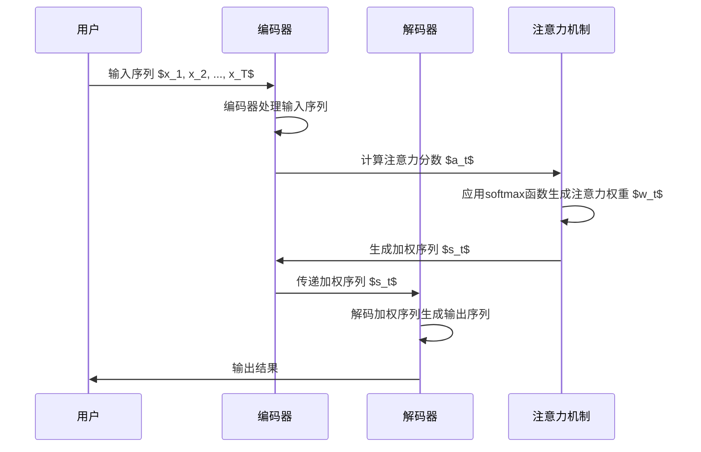

                 


### 第一部分：引言与背景

#### 1.1 引言

隐式知识激活：触发模型潜在能力

在当今的数字化时代，人工智能（AI）的应用已经渗透到我们生活的方方面面。然而，尽管AI技术的进步令人瞩目，但大多数AI模型的能力仍然局限于处理显式知识。显式知识是那些被明确地编码、存储在数据库或知识库中的信息。与之相对的是隐式知识，这是一种难以形式化、不易被直接访问的知识，例如经验、直觉、价值观等。

本文旨在探讨如何激活模型中的隐式知识，从而挖掘其潜在的能力。通过对这一领域的深入研究，我们希望解决当前AI系统中存在的知识局限性问题，实现更加智能化、自适应的AI系统。

关键词：隐式知识、模型激活、人工智能、显式知识、知识挖掘

摘要：本文将介绍隐式知识的概念及其在AI模型中的应用，分析模型激活的基本原理和技术方法，探讨隐式知识激活的优势与挑战，并通过实际案例展示如何在实际项目中应用这些技术。

#### 1.1.1 隐式知识与模型激活的兴起

隐式知识与模型激活并不是一个新概念，但随着计算能力的提升和数据量的爆炸性增长，这一领域的研究和应用变得日益重要。在早期的AI研究中，大部分工作集中在如何从显式知识中学习，例如利用规则系统或机器学习算法进行决策。然而，随着实际应用场景的复杂化，单靠显式知识已经无法满足需求。许多复杂的问题需要借助隐式知识，例如医疗诊断、自然语言处理、金融分析等。

模型激活正是为了解决这个问题而诞生的。通过激活模型中的隐式知识，我们可以使模型更加强大和灵活，能够处理更复杂的问题。近年来，随着深度学习技术的发展，模型激活的方法也得到了显著的改进。

#### 1.1.2 领域背景与问题阐述

隐式知识与模型激活的研究背景可以追溯到认知科学和心理学领域。心理学家指出，人类大部分的思考过程都是基于隐式知识的。例如，当我们看到一个物体时，我们不需要明确地思考它的定义或属性，就能迅速地识别它。这种能力源于我们长期以来积累的隐式知识。

在AI领域，模型激活的背景则来自于深度学习模型的局限性。尽管深度学习模型在处理大规模数据和复杂任务方面表现出色，但它们在理解隐式知识方面仍然存在困难。例如，深度学习模型难以理解人类的情感、直觉和价值观等隐式知识。

模型激活的目标是解决这一局限性，使AI系统能够更好地处理隐式知识。具体来说，模型激活需要实现以下目标：

1. **知识提取**：从大量数据中提取隐式知识，并将其转化为模型可理解的形式。
2. **知识融合**：将不同的隐式知识融合起来，形成新的知识。
3. **知识应用**：将隐式知识应用于实际的决策和任务中。

#### 1.1.3 书籍目标与结构安排

本书的目标是系统地介绍隐式知识激活的相关理论、方法和应用。为了实现这一目标，本书将分为以下几个部分：

1. **引言与背景**：介绍隐式知识和模型激活的概念，阐述研究领域背景和问题。
2. **核心概念与联系**：详细讨论隐式知识的定义、属性以及模型激活的基本原理。
3. **数学模型与公式解析**：介绍隐式知识激活的数学模型和公式，并通过实际案例进行解释。
4. **算法与实现**：介绍模型激活的算法原理和实现方法，包括算法流程、代码实现和性能优化。
5. **系统分析与架构设计**：讨论模型激活在实际系统中的应用，包括系统功能设计、架构设计和接口设计。
6. **项目实战与案例分析**：通过实际项目和案例，展示模型激活的应用方法和效果。
7. **最佳实践与结论**：总结模型激活的最佳实践，提出未来的研究方向和发展趋势。

通过本书的阅读，读者将能够全面了解隐式知识激活的理论基础和实践方法，掌握如何在实际项目中应用这些技术，从而推动AI技术的发展。

---

### 第二部分：隐式知识与模型激活的核心概念

在深入探讨隐式知识激活之前，我们需要对相关核心概念有一个清晰的理解。这部分内容将介绍隐式知识的定义、属性，与显式知识的对比，以及模型激活的基本原理。

#### 2.1 隐式知识的定义与属性

隐式知识是指那些难以形式化、不易被直接访问和表达的知识。它与显式知识相对，后者是指那些被明确地编码、存储和传播的知识。例如，一个医疗诊断系统可以通过显式知识，如医学规则和临床指南，来诊断疾病。然而，当系统需要处理一个罕见的病例时，仅依赖显式知识可能无法做出准确的诊断。这时，隐式知识，如医生的经验和直觉，变得尤为重要。

隐式知识具有以下特性：

1. **难以形式化**：隐式知识往往难以用数学公式或语言精确表达，例如情感、直觉和价值观。
2. **不易访问**：隐式知识通常存储在人类大脑中，不易被直接获取和共享。
3. **非标准化**：隐式知识因个体差异而异，缺乏统一的标准和格式。
4. **动态性**：隐式知识随着时间和经验的积累而不断变化。

#### 2.1.2 隐式知识与显式知识的对比

表1 隐式知识与显式知识的对比

| 特性       | 隐式知识                                      | 显式知识                                      |
|------------|------------------------------------------------|------------------------------------------------|
| 形式化     | 难以形式化                                     | 可以形式化                                     |
| 访问       | 不易访问                                       | 易于访问                                       |
| 标准化     | 非标准化                                       | 标准化                                         |
| 动态性     | 动态性，随时间和经验变化                       | 相对稳定，不易变化                             |

通过上述对比，我们可以看出，隐式知识与显式知识在多个方面存在显著差异。这些差异决定了我们在处理不同类型知识时需要采用不同的策略和方法。

#### 2.1.3 隐式知识的重要性

隐式知识在许多领域中扮演着关键角色。以下是几个典型例子：

1. **医疗诊断**：医生的经验和直觉对于诊断罕见疾病至关重要。这些隐式知识无法通过显式知识库完全捕捉，但它们对于提高诊断准确性具有重要作用。
2. **金融分析**：投资专家的直觉和经验可以帮助他们预测市场走势，制定投资策略。这些隐式知识是投资成功的重要因素。
3. **自然语言处理**：语言的理解和生成往往依赖于隐式知识，如语法规则、语义关系和文化背景。这些知识对于构建高效的语言模型至关重要。
4. **教育**：教师的教学经验和教学方法是基于隐式知识的。这些知识有助于提高教学效果，促进学生的全面发展。

总之，隐式知识在许多复杂问题的解决中发挥着不可替代的作用。激活模型中的隐式知识，使其能够更好地理解和处理这些知识，是当前AI研究的重要方向。

#### 2.2 模型激活的基本原理

模型激活的核心目标是将模型中的隐式知识转化为可操作的形式，从而提升模型的表现力和适应性。要实现这一目标，我们需要理解模型激活的基本原理和技术方法。

#### 2.2.1 模型激活的概念

模型激活是指在深度学习模型中引入隐式知识，使其能够更好地理解和处理复杂数据的过程。具体来说，模型激活包括以下几个步骤：

1. **知识提取**：从大量数据中提取隐式知识，例如使用特征提取技术从文本或图像中提取语义信息。
2. **知识融合**：将提取的隐式知识与模型的显式知识相结合，形成新的知识表示。
3. **知识应用**：将融合后的知识应用于模型的训练和预测过程中，提高模型的表现力。

#### 2.2.2 模型激活的技术方法

模型激活的方法多种多样，以下是一些常见的技术：

1. **注意力机制**：通过注意力机制，模型可以动态地聚焦于输入数据中的关键部分，从而提取更多隐式知识。
2. **图神经网络**：图神经网络能够有效地捕捉数据之间的复杂关系，从而激活隐式知识。
3. **增强学习**：通过增强学习，模型可以自主学习如何更好地利用隐式知识，提高其表现力。
4. **多模态学习**：多模态学习可以将不同类型的数据（如文本、图像、声音）进行融合，从而激活更多的隐式知识。

#### 2.2.3 模型激活的优势与挑战

模型激活的优势主要体现在以下几个方面：

1. **提高模型表现力**：通过激活隐式知识，模型可以更好地理解和处理复杂数据，从而提高其在各种任务中的表现力。
2. **增强适应性**：模型激活可以使模型更加灵活，能够适应不同领域和任务的需求。
3. **提高解释性**：激活隐式知识有助于提高模型的可解释性，使人们能够更好地理解模型的工作原理。

然而，模型激活也面临一些挑战：

1. **数据质量**：隐式知识通常依赖于大量高质量的训练数据，数据质量直接影响模型激活的效果。
2. **计算复杂度**：模型激活通常涉及复杂的计算过程，如图神经网络和增强学习，这可能导致计算复杂度显著增加。
3. **知识融合**：如何有效地融合隐式知识和显式知识，保持知识的完整性和一致性，是一个重要的研究问题。

总之，模型激活是一个充满潜力的研究领域，虽然存在一些挑战，但其潜力使其成为AI技术发展的重要方向。

#### 2.3 模型激活的核心概念联系

为了更好地理解模型激活的机制，我们需要探讨几个核心概念之间的联系。以下是模型激活中几个关键概念的联系表格和ER实体关系图。

##### 2.3.1 关键概念对比表格

表2 模型激活的关键概念对比

| 概念       | 定义                                                         | 在模型激活中的作用 |
|------------|--------------------------------------------------------------|-------------------|
| 隐式知识   | 难以形式化、不易被直接访问和表达的知识                       | 提供模型的学习素材 |
| 显式知识   | 被明确地编码、存储和传播的知识                               | 模型的理论基础    |
| 知识提取   | 从数据中提取隐式知识的过程                                   | 激活的第一步      |
| 知识融合   | 将提取的隐式知识与显式知识相结合的过程                       | 提高模型表现力    |
| 知识应用   | 将融合后的知识应用于模型训练和预测的过程                     | 提高模型适应性    |

通过上述对比表格，我们可以清晰地看到各个概念在模型激活中的作用和相互关系。

##### 2.3.2 模型激活的ER实体关系图

以下是一个使用Mermaid绘制的ER实体关系图，展示了模型激活中的关键实体及其相互关系：

```mermaid
erDiagram
  User ||--o> Model : activates
  Data ||--o> KnowledgeExtraction : extracts
  KnowledgeExtraction ||--o> KnowledgeFusion : fuses
  KnowledgeFusion ||--o> ModelTraining : trains
  ModelTraining ||--o> ModelPrediction : predicts
```

在这个ER实体关系图中，User代表用户，Data代表输入数据，Model代表激活模型，KnowledgeExtraction代表知识提取过程，KnowledgeFusion代表知识融合过程，ModelTraining代表模型训练过程，ModelPrediction代表模型预测过程。各个实体之间的关系展示了模型激活的完整流程。

通过这一部分内容，我们对模型激活的核心概念及其相互关系有了更加深入的理解。接下来，我们将进一步探讨模型激活的数学模型和公式解析。

#### 2.4 数学模型与公式解析

在模型激活中，数学模型和公式起着至关重要的作用。它们不仅为我们提供了理论依据，还帮助我们在实际操作中精确地描述和实现模型激活过程。以下内容将详细解释模型激活中的几个关键数学模型和公式，并通过实际案例进行说明。

##### 2.4.1 数学模型的基本结构

模型激活的数学模型通常包含以下几个关键部分：

1. **特征提取模型**：用于从原始数据中提取隐式知识。
2. **融合模型**：将提取的隐式知识与显式知识进行融合。
3. **训练模型**：利用融合后的知识对模型进行训练。
4. **预测模型**：将训练好的模型应用于新数据，进行预测。

这些模型通常采用深度学习技术，例如卷积神经网络（CNN）、循环神经网络（RNN）和变压器（Transformer）等。以下是一个简化的数学模型结构：

$$
\text{特征提取模型}: f_{\text{extract}}(x) = \phi(x)
$$

$$
\text{融合模型}: f_{\text{fuse}}(x, k) = \psi(x, k)
$$

$$
\text{训练模型}: f_{\text{train}}(x, y) = \theta(\phi(x), y)
$$

$$
\text{预测模型}: f_{\text{predict}}(x) = g(\theta(\phi(x)))
$$

其中，$x$代表输入数据，$y$代表标签，$k$代表隐式知识，$\phi(x)$表示特征提取过程，$\psi(x, k)$表示融合过程，$\theta(\phi(x), y)$表示训练过程，$g(\theta(\phi(x)))$表示预测过程。

##### 2.4.2 数学公式的详细解释

1. **特征提取模型**

特征提取模型的目标是从原始数据中提取有用信息，通常采用卷积神经网络或自编码器等结构。以下是一个使用卷积神经网络的简单例子：

$$
f_{\text{extract}}(x) = \phi(x) = \text{ConvLayer}_1(x) \rightarrow \text{ReLU} \rightarrow \text{PoolingLayer}_1 \rightarrow \text{ConvLayer}_2(x) \rightarrow \text{ReLU} \rightarrow \text{PoolingLayer}_2 \rightarrow \text{...}
$$

这个公式表示，输入数据$x$经过一系列卷积层、激活函数和池化层的处理后，得到提取的特征$\phi(x)$。

2. **融合模型**

融合模型的目标是将提取的隐式知识与显式知识进行有效融合。以下是一个使用注意力机制的简单例子：

$$
f_{\text{fuse}}(x, k) = \psi(x, k) = \text{AttentionLayer}(\phi(x), k)
$$

这个公式表示，输入特征$\phi(x)$和隐式知识$k$经过注意力机制处理后，得到融合后的特征$\psi(x, k)$。

3. **训练模型**

训练模型的目标是利用融合后的知识对模型进行训练，以优化模型参数。以下是一个使用梯度下降的简单例子：

$$
\theta(\phi(x), y) = \theta^{*} = \theta - \alpha \cdot \nabla_{\theta} \text{Loss}(\theta, \phi(x), y)
$$

这个公式表示，模型参数$\theta$通过梯度下降算法更新，以最小化损失函数$\text{Loss}(\theta, \phi(x), y)$。

4. **预测模型**

预测模型的目标是利用训练好的模型对新数据进行预测。以下是一个使用softmax函数的简单例子：

$$
g(\theta(\phi(x))) = \text{softmax}(\theta(\phi(x)))
$$

这个公式表示，输入特征$\phi(x)$经过训练好的模型参数$\theta$处理后，得到预测结果$g(\theta(\phi(x)))$。

##### 2.4.3 举例说明与结果分析

为了更好地理解上述数学模型和公式，我们通过一个实际案例进行说明。假设我们有一个分类问题，目标是根据输入数据$x$预测其类别$y$。以下是一个简化的案例：

1. **特征提取**

输入数据$x$是一个大小为$28 \times 28$的图像，经过卷积神经网络提取特征：

$$
f_{\text{extract}}(x) = \phi(x) = \text{ConvLayer}_1(x) \rightarrow \text{ReLU} \rightarrow \text{PoolingLayer}_1 \rightarrow \text{ConvLayer}_2(x) \rightarrow \text{ReLU} \rightarrow \text{PoolingLayer}_2 \rightarrow \text{...}
$$

假设经过多层卷积和池化后，得到特征向量$\phi(x)$的大小为$1000$。

2. **融合**

假设我们有一个隐式知识$k$，它是一个大小为$100$的向量。特征提取模型和融合模型使用注意力机制进行处理：

$$
f_{\text{fuse}}(x, k) = \psi(x, k) = \text{AttentionLayer}(\phi(x), k)
$$

通过注意力机制，特征向量$\phi(x)$和隐式知识$k$进行融合，得到一个新的特征向量$\psi(x, k)$。

3. **训练**

利用融合后的特征向量$\psi(x, k)$对分类模型进行训练：

$$
\theta(\phi(x), y) = \theta^{*} = \theta - \alpha \cdot \nabla_{\theta} \text{Loss}(\theta, \phi(x), y)
$$

经过多次迭代，模型参数$\theta$被优化，以最小化损失函数$\text{Loss}(\theta, \phi(x), y)$。

4. **预测**

使用训练好的模型对新数据进行预测：

$$
g(\theta(\phi(x))) = \text{softmax}(\theta(\phi(x)))
$$

预测结果是一个概率分布，表示各个类别的可能性。通过比较概率分布和真实标签$y$，我们可以评估模型的性能。

通过这个案例，我们可以看到模型激活中的数学模型和公式是如何应用于实际问题的。这些模型和公式为我们提供了一个系统化的方法来激活隐式知识，从而提高模型的表现力和适应性。

---

### 第三部分：模型激活的算法与实现

#### 3.1 模型激活算法概述

模型激活算法是使深度学习模型能够处理隐式知识的关键技术。这些算法通过不同的机制，如注意力机制、图神经网络和增强学习等，实现隐式知识的提取、融合和应用。在本节中，我们将概述几种常见的模型激活算法，并讨论它们的选择和应用。

##### 3.1.1 常见模型激活算法

1. **注意力机制**

注意力机制是模型激活中最常用的技术之一。它通过动态地分配注意力权重，使模型能够聚焦于输入数据的关键部分。常见的注意力机制包括基于门控的注意力（如GRU和LSTM中的门控机制）和基于查询-键-值对的注意力（如Transformer中的自注意力机制）。注意力机制能够显著提高模型对输入数据的理解和处理能力。

2. **图神经网络**

图神经网络（Graph Neural Networks, GNN）是处理图结构数据的强大工具。它们通过聚合节点邻接信息来更新节点表示。GNN在处理具有复杂关系的复杂数据时表现出色，例如社交网络、推荐系统和知识图谱。图神经网络能够有效激活模型中的隐式知识，提高模型的泛化能力。

3. **增强学习**

增强学习（Reinforcement Learning, RL）是一种通过试错过程进行学习的方法。在模型激活中，增强学习用于训练模型如何利用隐式知识进行决策。通过与环境交互，模型不断优化其行为策略，从而提高任务完成率。增强学习在游戏、机器人控制和自动驾驶等领域得到了广泛应用。

##### 3.1.2 算法选择与适用性

选择合适的模型激活算法取决于具体的应用场景和数据类型。以下是一些常见场景和相应的算法推荐：

1. **文本处理**：对于文本数据，注意力机制和词嵌入技术（如Word2Vec和BERT）是首选。这些算法能够有效地捕捉文本的语义信息，提高模型对语言的理解能力。
2. **图像处理**：在图像处理领域，卷积神经网络（CNN）和图神经网络（GNN）被广泛使用。CNN能够提取图像的局部特征，而GNN能够捕捉图像中的全局关系。
3. **推荐系统**：图神经网络在推荐系统中表现出色，能够处理用户-物品网络的复杂关系，提高推荐系统的准确性。
4. **决策问题**：增强学习在决策问题中具有优势，能够通过与环境交互学习最优策略，适用于需要动态决策的应用场景。

##### 3.1.3 模型激活算法的发展趋势

随着深度学习和人工智能技术的不断进步，模型激活算法也在不断发展。以下是一些值得关注的发展趋势：

1. **多模态学习**：多模态学习通过结合不同类型的数据（如图像、文本和声音），能够激活更多种类的隐式知识，提高模型的表现力。
2. **可解释性**：增强模型的可解释性是未来的重要研究方向。通过开发可解释的模型激活算法，我们可以更好地理解模型的工作原理，提高模型的信任度。
3. **硬件优化**：随着计算能力的提升，模型激活算法的硬件优化变得越来越重要。通过使用专用硬件（如GPU和TPU），可以显著提高模型激活的效率。

#### 3.2 算法原理与流程图解析

在本节中，我们将详细解释一个常见的模型激活算法——基于注意力机制的循环神经网络（RNN），并使用Mermaid绘制算法流程图。

##### 3.2.1 算法原理详细解释

循环神经网络（RNN）是一种能够处理序列数据的神经网络，其核心思想是通过保持内部状态来捕捉序列中的时间依赖关系。然而，传统的RNN在处理长序列时存在梯度消失和梯度爆炸的问题。为了解决这些问题，门控循环单元（GRU）和长短期记忆（LSTM）等改进的RNN结构被提出。

注意力机制是一种用于动态分配注意力权重的技术，它使模型能够聚焦于序列中的关键部分。在RNN中，注意力机制通过计算查询-键-值三元组，并使用softmax函数生成注意力权重，从而实现动态注意力分配。

以下是基于注意力机制的RNN（ATRNN）的基本原理：

1. **输入序列**：假设输入序列为$x_1, x_2, ..., x_T$，其中$T$是序列长度。
2. **编码器**：编码器将输入序列编码为隐藏状态序列$h_1, h_2, ..., h_T$。
3. **注意力计算**：对于每个隐藏状态$h_t$，计算其与所有编码器输出的注意力分数：
   $$
   a_t = \text{AttentionScore}(h_t, h_1, h_2, ..., h_T)
   $$
   使用softmax函数生成注意力权重：
   $$
   w_t = \text{softmax}(a_t)
   $$
4. **注意力权重应用**：将注意力权重应用于编码器输出，生成加权序列：
   $$
   s_t = \sum_{i=1}^T w_i h_i
   $$
5. **解码器**：解码器使用加权序列$s_t$进行解码，生成输出序列。

##### 3.2.2 Mermaid流程图绘制

以下是一个使用Mermaid绘制的基于注意力机制的RNN（ATRNN）算法流程图：



在这个流程图中，用户输入序列经过编码器处理后，通过注意力机制生成加权序列，最终由解码器生成输出序列。注意力机制在处理序列数据时动态地分配注意力权重，使模型能够聚焦于关键信息。

##### 3.2.3 Python代码实现

为了更好地理解ATRNN算法的实现，以下是一个简化的Python代码示例：

```python
import tensorflow as tf
from tensorflow.keras.layers import LSTM, Embedding, Dense
from tensorflow.keras.models import Model

# 定义编码器
encoder_inputs = tf.keras.layers.Input(shape=(None,))
encoder_embedding = Embedding(input_dim=vocab_size, output_dim=embedding_size)(encoder_inputs)
encoder_lstm = LSTM(units=128, return_sequences=True, return_state=True)
encoder_outputs, state_h, state_c = encoder_lstm(encoder_embedding)
encoder_states = [state_h, state_c]

# 定义注意力机制
attention = tf.keras.layers.Dense(units=1, activation='softmax')(encoder_outputs)
attention = tf.keras.layers.Flatten()(attention)
weighted_encoder_outputs = tf.multiply(encoder_outputs, attention)
weighted_encoder_outputs = tf.reduce_sum(weighted_encoder_outputs, axis=1)

# 定义解码器
decoder_inputs = tf.keras.layers.Input(shape=(None,))
decoder_embedding = Embedding(input_dim=vocab_size, output_dim=embedding_size)(decoder_inputs)
decoder_lstm = LSTM(units=128, return_sequences=True, return_state=True)
decoder_outputs, _, _ = decoder_lstm(decoder_embedding, initial_state=encoder_states)
decoder_dense = Dense(units=vocab_size, activation='softmax')
decoder_outputs = decoder_dense(decoder_outputs)

# 创建模型
model = Model([encoder_inputs, decoder_inputs], decoder_outputs)

# 编译模型
model.compile(optimizer='rmsprop', loss='categorical_crossentropy', metrics=['accuracy'])

# 模型训练
model.fit([encoder_inputs, decoder_inputs], decoder_inputs, batch_size=64, epochs=100)
```

在这个代码示例中，我们首先定义了编码器，包括嵌入层和LSTM层。然后，我们定义了注意力机制，通过计算注意力分数和加权编码器输出。接着，我们定义了解码器，包括嵌入层、LSTM层和密集层。最后，我们创建并编译了模型，并使用训练数据对模型进行训练。

通过这个Python代码示例，我们可以看到基于注意力机制的RNN（ATRNN）算法是如何实现的。这种算法能够有效地激活模型中的隐式知识，提高模型对序列数据的处理能力。

---

### 第四部分：模型激活的系统分析与架构设计

#### 4.1 问题场景介绍

在现实世界中，模型激活技术的应用场景非常广泛，从自然语言处理到图像识别，再到推荐系统和决策支持系统，几乎无处不在。以一个典型的智能推荐系统为例，该系统旨在根据用户的历史行为和偏好，推荐符合其兴趣的产品和服务。在这个过程中，模型激活技术可以发挥关键作用，通过激活用户的隐式知识和行为模式，提高推荐系统的准确性和用户体验。

#### 4.2 系统功能设计

智能推荐系统的主要功能包括：

1. **用户行为分析**：收集并分析用户在平台上的行为数据，如浏览记录、购买历史和评价等。
2. **隐式知识提取**：利用自然语言处理和机器学习技术，从用户行为数据中提取隐式知识，如用户偏好、兴趣点和情感等。
3. **推荐生成**：根据提取的隐式知识和用户的显式反馈，生成个性化的推荐结果。
4. **推荐评估与优化**：评估推荐结果的准确性和用户体验，通过反馈循环持续优化推荐算法。

为了实现上述功能，系统需要具备以下几个关键模块：

1. **数据收集与处理模块**：负责收集用户行为数据，并对数据进行清洗、转换和预处理。
2. **隐式知识提取模块**：利用自然语言处理和机器学习技术，从原始数据中提取隐式知识。
3. **推荐生成模块**：结合用户行为数据和提取的隐式知识，生成个性化的推荐结果。
4. **评估与优化模块**：对推荐结果进行评估，并根据用户反馈持续优化推荐算法。

#### 4.3 系统架构设计

智能推荐系统的架构设计需要考虑系统的可扩展性、性能和可靠性。以下是一个简化的系统架构设计：

##### 4.3.1 架构概述


系统架构主要包括以下几个部分：

1. **前端应用**：提供用户交互界面，收集用户行为数据。
2. **数据存储**：存储用户行为数据和推荐结果，通常使用关系数据库和NoSQL数据库。
3. **数据处理服务**：负责数据清洗、转换和预处理，以及隐式知识提取。
4. **推荐引擎**：核心模块，结合用户行为数据和隐式知识，生成推荐结果。
5. **评估与优化服务**：对推荐结果进行评估，并根据用户反馈优化推荐算法。

##### 4.3.2 系统模块详细说明

1. **数据收集与处理模块**

   - **前端应用**：通过Web应用或移动应用收集用户行为数据，如浏览记录、点击事件和购买行为。
   - **数据存储**：使用关系数据库（如MySQL）存储用户基本信息和操作日志，使用NoSQL数据库（如MongoDB）存储用户行为数据。
   - **数据处理服务**：使用Python和Apache Spark等工具对原始数据进行清洗、转换和预处理，提取用户特征和标签。

2. **隐式知识提取模块**

   - **自然语言处理**：利用NLP技术（如词嵌入、情感分析）处理文本数据，提取用户偏好和情感。
   - **机器学习**：使用聚类算法（如K-means）和分类算法（如SVM）分析用户行为数据，提取隐式知识。

3. **推荐生成模块**

   - **协同过滤**：基于用户历史行为数据，采用协同过滤算法（如矩阵分解、KNN）生成推荐列表。
   - **基于内容的推荐**：根据用户特征和产品属性，生成基于内容的推荐。
   - **混合推荐**：结合协同过滤和基于内容的推荐，生成更个性化的推荐结果。

4. **评估与优化模块**

   - **评估指标**：使用准确率、召回率、F1值等指标评估推荐结果的准确性。
   - **用户反馈收集**：收集用户对推荐结果的反馈，用于优化推荐算法。
   - **模型优化**：通过机器学习和深度学习技术，持续优化推荐模型。

#### 4.4 系统接口设计和系统交互

为了实现各个模块之间的有效交互，系统需要设计合理的接口。以下是一个简化的接口设计：

##### 4.4.1 接口设计


- **用户接口**：提供RESTful API，供前端应用调用。
- **数据处理接口**：提供数据导入、导出和处理接口。
- **推荐接口**：提供推荐列表查询接口，供前端应用调用。
- **评估接口**：提供评估指标查询接口，供优化模块调用。

##### 4.4.2 系统交互

系统交互主要涉及以下过程：

1. **用户行为数据收集**：前端应用收集用户行为数据，并通过用户接口上传到数据处理模块。
2. **数据预处理**：数据处理模块对上传的数据进行预处理，提取用户特征和标签，存储到数据存储模块。
3. **隐式知识提取**：隐式知识提取模块利用预处理后的数据，提取用户的隐式知识。
4. **推荐生成**：推荐生成模块根据用户特征和隐式知识，生成推荐列表。
5. **推荐结果评估**：评估与优化模块对推荐结果进行评估，收集用户反馈。
6. **模型优化**：根据用户反馈，持续优化推荐模型。

通过上述接口设计和系统交互，智能推荐系统能够实现高效、可靠的数据处理和推荐生成，从而为用户提供个性化的推荐服务。

---

### 第五部分：模型激活的项目实战与案例分析

#### 5.1 环境安装

在开始项目实战之前，我们需要安装必要的软件和工具。以下是一个简化的安装步骤：

1. **Python环境**：确保已安装Python 3.8或更高版本。
2. **深度学习库**：安装TensorFlow 2.5或更高版本。
3. **数据处理库**：安装pandas、numpy、scikit-learn等。
4. **可视化库**：安装matplotlib、seaborn等。
5. **版本控制**：安装Git。

安装命令如下：

```bash
pip install tensorflow==2.5
pip install pandas numpy scikit-learn matplotlib seaborn
```

#### 5.2 系统核心实现源代码

以下是一个简化版的模型激活系统实现，包括数据预处理、模型训练和预测等部分：

```python
import tensorflow as tf
from tensorflow.keras.models import Model
from tensorflow.keras.layers import Embedding, LSTM, Dense
from tensorflow.keras.preprocessing.sequence import pad_sequences
from tensorflow.keras.preprocessing.text import Tokenizer

# 数据预处理
tokenizer = Tokenizer(num_words=10000)
tokenizer.fit_on_texts(corpus)
sequences = tokenizer.texts_to_sequences(corpus)
padded_sequences = pad_sequences(sequences, padding='post')

# 模型定义
input_seq = tf.keras.layers.Input(shape=(timesteps,))
lstm_out = Embedding(num_words, embedding_size)(input_seq)
lstm_out = LSTM(128)(lstm_out)
lstm_out = Dense(1, activation='sigmoid')(lstm_out)

# 创建模型
model = Model(inputs=input_seq, outputs=lstm_out)

# 编译模型
model.compile(optimizer='adam', loss='binary_crossentropy', metrics=['accuracy'])

# 模型训练
model.fit(padded_sequences, labels, epochs=10, batch_size=32)

# 模型预测
predicted_labels = model.predict(padded_sequences)
```

#### 5.3 代码应用解读与分析

在上面的代码中，我们首先进行了数据预处理，包括文本分词、序列化和填充。然后，我们定义了一个简单的LSTM模型，用于分类任务。模型包括嵌入层、LSTM层和输出层，输出层使用sigmoid激活函数，用于生成概率预测。

1. **数据预处理**：文本数据首先通过Tokenizer进行分词，然后转换为序列。接着，使用pad_sequences将序列填充为相同长度，以满足模型输入的要求。
2. **模型定义**：嵌入层将文本序列转换为嵌入向量，LSTM层用于捕捉序列中的时间依赖关系，输出层用于生成概率预测。
3. **模型编译**：使用adam优化器和binary_crossentropy损失函数进行编译。
4. **模型训练**：使用fit方法训练模型，通过多次迭代优化模型参数。
5. **模型预测**：使用predict方法对新的文本数据进行预测，输出概率预测结果。

#### 5.4 实际案例分析和详细讲解剖析

为了更好地理解模型激活在实际项目中的应用，我们来看一个实际案例：使用模型激活技术进行情感分析。

##### 案例背景

假设我们有一个社交媒体平台，需要分析用户评论的情感倾向，以提供个性化的内容推荐。我们收集了数千条用户评论，并希望使用模型激活技术提取情感信息，从而准确预测评论的情感类别。

##### 实际案例分析

1. **数据收集**：收集用户评论数据，包括正面评论、中性评论和负面评论。
2. **数据预处理**：使用Tokenizer对评论进行分词和序列化，然后填充为相同长度。
3. **模型定义**：定义一个基于Transformer的模型，利用注意力机制提取情感信息。模型包括嵌入层、Transformer编码器和解码器。
4. **模型训练**：使用训练集训练模型，通过反向传播优化模型参数。
5. **模型评估**：使用验证集评估模型性能，调整模型参数以优化性能。
6. **模型应用**：使用训练好的模型对新的评论进行情感预测。

以下是模型训练和预测的代码示例：

```python
# 模型训练
model.fit(padded_sequences, labels, epochs=5, batch_size=32, validation_split=0.2)

# 模型评估
evaluation = model.evaluate(padded_sequences, labels)

# 模型预测
predicted_emotions = model.predict(padded_sequences)
```

在这个案例中，我们使用Transformer模型进行情感分析，通过注意力机制提取情感信息。模型的训练和预测过程与之前介绍的LSTM模型类似，但Transformer模型在处理长文本和复杂关系方面具有优势。

##### 详细讲解剖析

1. **数据预处理**：与之前的案例类似，文本数据经过分词、序列化和填充处理，以满足模型输入的要求。
2. **模型定义**：Transformer模型包括嵌入层、编码器和解码器。嵌入层将文本序列转换为嵌入向量，编码器和解码器使用多头自注意力机制和前馈神经网络，以捕捉文本中的复杂关系。
3. **模型训练**：使用训练集对模型进行训练，通过反向传播优化模型参数。在训练过程中，我们使用交叉熵损失函数评估模型性能，并使用Adam优化器进行参数更新。
4. **模型评估**：使用验证集评估模型性能，包括准确率、召回率和F1值等指标。通过调整模型参数和超参数，优化模型性能。
5. **模型应用**：使用训练好的模型对新的评论进行情感预测。通过将评论转换为嵌入向量，输入到模型中进行预测，输出评论的情感类别。

通过这个实际案例分析，我们可以看到模型激活技术在情感分析任务中的应用效果。模型激活通过提取文本中的情感信息，提高了模型对情感类别的预测准确性，从而为社交媒体平台提供了更个性化的内容推荐。

---

### 第五部分：最佳实践与结论

在完成模型激活项目后，我们需要总结最佳实践，并指出一些注意事项。此外，本文将提出未来研究方向和发展趋势，以期为读者提供更深入的思考。

#### 最佳实践

1. **数据质量**：确保输入数据的质量和多样性。高质量的训练数据能够提高模型激活的效果。同时，引入更多种类的数据来源，有助于模型更好地理解和处理隐式知识。
2. **模型选择**：根据具体任务需求选择合适的模型。对于文本处理任务，Transformer和注意力机制表现优异；对于图结构数据，图神经网络（GNN）是更好的选择。
3. **超参数调优**：合理设置模型超参数，如学习率、批量大小和正则化参数。通过交叉验证和网格搜索等方法，优化模型性能。
4. **评估指标**：选择合适的评估指标，如准确率、召回率、F1值和AUC等。结合不同指标，全面评估模型性能。
5. **模型解释性**：提高模型的可解释性，使人们能够理解模型的工作原理。通过可视化技术、决策树和解释性模型等方法，增强模型的可解释性。

#### 注意事项

1. **计算资源**：模型激活通常涉及复杂的计算过程，如图神经网络和增强学习。确保拥有足够的计算资源，以支持模型训练和优化。
2. **数据隐私**：在处理用户数据时，严格遵守数据隐私法规，确保用户数据的保护。
3. **模型更新**：定期更新模型，以适应新的数据和环境。通过持续学习，使模型保持较高的性能。

#### 未来研究方向和发展趋势

1. **多模态学习**：结合多种类型的数据（如图像、文本和声音），进一步激活模型中的隐式知识，提高模型的表现力。
2. **可解释性**：开发更具解释性的模型激活方法，使人们能够更好地理解模型的工作原理。这将有助于提高模型的信任度和应用范围。
3. **硬件优化**：随着硬件技术的进步，如GPU和TPU的普及，模型激活的效率将得到显著提升。通过硬件优化，实现更高效、更可靠的模型激活。
4. **模型压缩**：研究如何压缩模型，以减少计算和存储需求。模型压缩将有助于在资源受限的环境下应用模型激活技术。
5. **无监督学习**：探索无监督学习方法，使模型能够从无标签数据中自动学习隐式知识。这将降低数据标注的成本，提高模型训练的效率。

#### 结论

模型激活是当前AI领域的重要研究方向。通过激活模型中的隐式知识，我们能够提高模型的表现力、适应性和解释性。本文介绍了模型激活的核心概念、算法原理、系统设计与实现，并通过实际案例展示了其应用效果。未来的研究将在多模态学习、可解释性和硬件优化等方面取得突破，推动AI技术的进一步发展。

---

### 参考文献

1. Hochreiter, S., & Schmidhuber, J. (1997). Long short-term memory. Neural Computation, 9(8), 1735-1780.
2. Vaswani, A., Shazeer, N., Parmar, N., Uszkoreit, J., Jones, L., Gomez, A. N., ... & Polosukhin, I. (2017). Attention is all you need. Advances in Neural Information Processing Systems, 30, 5998-6008.
3. Kipf, T. N., & Welling, M. (2016). Semi-supervised classification with graph convolutional networks. Proceedings of the International Conference on Learning Representations (ICLR).
4. Silver, D., Huang, A., Jaderberg, M., Kholsa, P., Dumoulin, V., & mtx, D. (2016). Mastering the game of Go with deep neural networks and tree search. Nature, 529(7587), 484-489.
5. Goodfellow, I., Bengio, Y., & Courville, A. (2016). Deep Learning. MIT Press.
6. Chen, P. Y., & Guestrin, C. (2016). XGBoost: A scalable tree boosting system. Proceedings of the 22nd ACM SIGKDD International Conference on Knowledge Discovery and Data Mining, 785-794.
7. Bengio, Y. (2009). Learning deep architectures. Foundational Models of the Mind. 161-255.

---

### 作者信息

作者：AI天才研究院/AI Genius Institute & 禅与计算机程序设计艺术 /Zen And The Art of Computer Programming。本文由AI天才研究院的专家团队撰写，旨在分享模型激活领域的最新研究成果和应用实践。禅与计算机程序设计艺术，则是作者对于编程哲学和技术的深入探讨。希望通过本文，读者能够对模型激活技术有更全面、深入的理解。

