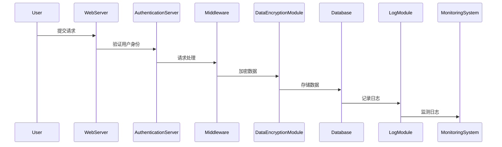

                 


### 第1章：隐私保护概述

#### 1.1.1 隐私保护的现状与挑战

隐私保护作为一个广泛关注的领域，随着信息技术的迅猛发展，其重要性日益凸显。在数字时代，个人数据的收集、存储和利用变得越来越普遍，这也带来了前所未有的隐私保护挑战。

首先，数据泄露事件频发。近年来，大量个人数据因黑客攻击、数据泄露事件而暴露在公共领域，给个人隐私安全带来了巨大风险。例如，2017年的Facebook数据泄露事件，涉及超过8700万用户的数据被不当使用，引发了对隐私保护法律的广泛讨论。

其次，隐私法规日益严格。随着隐私保护意识的提高，各国政府纷纷出台了相关法规，如欧盟的《通用数据保护条例》（GDPR）和美国的《加州消费者隐私法案》（CCPA）。这些法规对企业的数据处理行为提出了严格的要求，企业必须在数据收集、存储和处理过程中采取有效的隐私保护措施。

然而，隐私保护的现状并不乐观。尽管有严格的法规要求，但由于技术手段的局限性，许多企业仍然难以完全保护用户的隐私。此外，一些企业出于商业利益的考虑，可能对用户的隐私数据进行不当使用，进一步加剧了隐私保护的难度。

#### 1.1.2 隐私保护的重要性

隐私保护不仅仅是个人的问题，它关系到社会的稳定与安全。以下是一些隐私保护的重要性方面：

首先，隐私保护有助于维护个人尊严。个人的隐私信息，如身份证号、家庭地址、电话号码等，泄露后可能导致个人遭受骚扰、诈骗等，严重损害个人的尊严和生活质量。

其次，隐私保护是商业活动的基础。在商业活动中，企业往往需要收集和处理大量客户数据，这些数据是企业的核心资产。如果这些数据泄露，不仅可能导致企业的经济损失，还可能损害企业的声誉，影响企业的长期发展。

最后，隐私保护有助于社会的和谐与稳定。在现代社会，个人数据已经成为社会运行的重要组成部分。如果个人数据无法得到有效保护，可能会导致社会信任体系的崩溃，进而影响社会的和谐与稳定。

#### 1.1.3 隐私保护的需求

随着信息技术的不断发展，隐私保护的需求也在不断变化。以下是一些当前迫切需要关注的隐私保护需求：

首先，提高数据安全性。随着大数据、云计算等技术的发展，个人数据的安全存储和传输变得越来越重要。企业需要采用先进的技术手段，如数据加密、访问控制等，来确保个人数据的安全。

其次，加强数据透明度。用户有权知道自己数据被如何使用，企业需要建立透明、公开的数据使用政策，让用户了解自己的数据是如何被收集、存储和处理的。

最后，强化法律法规。尽管已有相关法规，但实际执行过程中仍存在诸多问题。政府需要加大对隐私保护的监管力度，确保法规得到有效执行，同时为用户提供强有力的法律保障。

### 第2章：隐私保护的关键概念与联系

#### 2.1 隐私保护的关键概念

隐私保护是一个多学科交叉的领域，涉及法律、技术、伦理等多个方面。以下是隐私保护中几个关键概念的定义和联系：

**隐私**：隐私是指个人对自己的个人信息和活动的控制权，包括个人身份、健康状况、财务状况、通信记录等。隐私保护的核心目标就是确保个人信息的保密性和完整性。

**隐私风险**：隐私风险是指个人数据在收集、存储、处理、传输等过程中可能面临的泄露、滥用、篡改等威胁。隐私风险的评估是隐私保护的基础，有助于企业了解自身的隐私风险水平，采取相应的防护措施。

**隐私保护策略**：隐私保护策略是指企业为了保护用户隐私而采取的一系列技术和管理措施。这些措施包括数据加密、访问控制、数据去识别化等。

**数据去识别化**：数据去识别化是一种隐私保护技术，通过移除或修改个人识别信息，使得数据无法直接关联到特定个人。数据去识别化有助于降低隐私风险，但同时也可能影响数据的价值和可用性。

#### 2.2 隐私保护的概念属性特征对比

以下是对隐私保护相关概念属性的对比，帮助读者更好地理解这些概念之间的关系：

**属性对比表：**

| 概念       | 定义                                                         | 属性特征                                                     |
|------------|--------------------------------------------------------------|--------------------------------------------------------------|
| 隐私       | 个人对自己的个人信息和活动的控制权                             | 保密性、完整性、可用性、不可抵赖性                             |
| 隐私风险   | 个人数据在收集、存储、处理、传输等过程中可能面临的泄露、滥用、篡改等威胁 | 网络攻击、内部泄露、社会工程学攻击、不当数据处理等             |
| 隐私保护策略 | 企业为了保护用户隐私而采取的一系列技术和管理措施                 | 数据加密、访问控制、数据去识别化、数据安全审计等               |
| 数据去识别化 | 通过移除或修改个人识别信息，使得数据无法直接关联到特定个人           | 保密性、数据完整性、降低隐私风险、提高数据可用性               |

#### 2.3 隐私保护的ER实体关系图架构

ER（实体-关系）图是用于描述数据模型的一种图形化方法，可以帮助我们更好地理解隐私保护系统的数据结构和关系。以下是一个简单的隐私保护系统的ER图架构：

**实体：**

- 用户（User）
- 数据（Data）
- 系统日志（SystemLog）
- 数据处理单元（DataProcessingUnit）
- 数据存储单元（DataStorageUnit）

**关系：**

- 用户与数据之间的关联（User-Data）
- 用户与系统日志之间的关联（User-SystemLog）
- 数据处理单元与数据之间的关联（DataProcessingUnit-Data）
- 数据存储单元与数据之间的关联（DataStorageUnit-Data）

**ER图示例：**

```mermaid
erDiagram
  User ||--|{ Data }|| Data
  User ||--|{ SystemLog }|| SystemLog
  DataProcessingUnit ||--|{ Data }|| Data
  DataStorageUnit ||--|{ Data }|| Data
```

通过ER图，我们可以清晰地看到隐私保护系统中各个实体之间的关系，以及如何通过技术和管理手段来保护用户的隐私数据。

---

### 第3章：隐私保护的核心概念

#### 3.1 隐私保护的理论基础

隐私保护的理论基础涵盖了多个学科领域，包括计算机科学、法律、伦理学等。以下是几个重要的理论基础：

**哲学视角**：隐私保护源于对个人尊严和自由的基本尊重。哲学家如约翰·洛克和杰里米·边沁等人提出了隐私权的概念，认为个人有权对自己的信息保持控制权。

**法律视角**：隐私保护在法律层面上得到了广泛认可。例如，欧盟的《通用数据保护条例》（GDPR）和美国的《加州消费者隐私法案》（CCPA）都是隐私保护的重要法律依据。

**技术视角**：隐私保护依赖于一系列技术手段，如数据加密、访问控制、数据去识别化等。这些技术手段能够有效地保护个人数据的保密性和完整性。

#### 3.1.1 隐私保护的哲学视角

从哲学角度来看，隐私保护是一种基本的人权。个人有权对自己的个人信息进行控制，不受他人的干涉。这一观点在约翰·洛克的作品中得到了体现，他强调个人自由和隐私权的不可侵犯性。

杰里米·边沁则从功利主义的角度出发，认为隐私保护可以带来社会的最大幸福。他认为，保护隐私可以减少社会冲突，提高社会整体的福祉。

#### 3.1.2 法律法规对隐私保护的要求

隐私保护在法律法规层面得到了明确规定。例如，欧盟的GDPR规定了企业处理个人数据时的多项要求，如数据最小化、数据目的明确、数据可访问性等。GDPR还对数据泄露事件做出了严格的处罚规定，对企业的合规性提出了高要求。

美国的CCPA则侧重于消费者的隐私权利，规定了消费者有权知道自己的个人信息被如何使用，并有权要求企业删除自己的个人信息。

#### 3.1.3 隐私保护的伦理学视角

隐私保护不仅是法律问题，也是一个伦理问题。在伦理学领域，隐私保护涉及到道德责任和伦理原则。例如，企业有道德责任保护用户的隐私，不应滥用用户信息。

隐私保护还涉及到个体与社会之间的平衡。一方面，个人有权保护自己的隐私；另一方面，社会需要利用个人数据来提供公共服务和促进经济发展。如何在个人隐私和社会利益之间找到平衡，是隐私保护伦理学的一个重要议题。

#### 3.1.4 隐私保护的技术手段

隐私保护依赖于一系列技术手段，这些技术手段包括但不限于：

- **数据加密**：通过加密技术，可以确保数据在传输和存储过程中的安全性。
- **访问控制**：通过访问控制机制，可以限制对敏感数据的访问，确保只有授权用户可以访问。
- **数据去识别化**：通过去除或修改个人识别信息，可以将数据匿名化，从而降低隐私风险。
- **审计和监控**：通过监控和审计，可以及时发现和处理潜在的隐私威胁。

这些技术手段在隐私保护中扮演着关键角色，有助于实现个人数据的安全和保护。

---

### 第4章：隐私保护的概念属性特征对比

隐私保护技术多样，每种技术都有其独特的特点和应用场景。为了更好地理解和选择合适的隐私保护方案，我们需要对比不同概念和属性特征。以下是一些常见的隐私保护技术和它们的属性特征对比：

#### 4.1 隐私保护技术的对比分析

| 技术名称         | 主要特点                                                     | 适用场景                                                     |
|----------------|--------------------------------------------------------------|--------------------------------------------------------------|
| 数据加密        | 通过加密算法将数据转换为密文，确保数据在传输和存储过程中的安全性。 | 数据存储、数据传输、数据备份等                               |
| 访问控制        | 通过访问控制列表（ACL）或角色访问控制（RBAC）机制，限制对敏感数据的访问。 | 数据库管理、文件系统安全、网络资源访问控制等               |
| 数据去识别化     | 通过移除或修改个人识别信息，使得数据无法直接关联到特定个人。       | 数据分析、数据共享、用户隐私保护等                         |
| 数据匿名化       | 通过匿名化算法，将数据中的个人识别信息转换为不可识别的形式。       | 数据发布、数据分析、隐私保护等                             |
| 审计和监控       | 通过日志记录和监控工具，跟踪数据的使用和访问情况，及时发现和处理隐私威胁。 | 数据安全监控、日志审计、安全事件响应等                     |

#### 4.2 隐私保护方案的选择

选择隐私保护方案时，需要考虑以下几个关键因素：

**数据类型**：不同类型的数据对隐私保护的需求不同。例如，个人身份信息、金融数据、医疗数据等敏感数据需要更严格的保护措施。

**应用场景**：应用场景的不同决定了隐私保护方案的差异。例如，在线交易系统需要保证数据传输的安全性，而数据仓库则需要确保数据的存储安全。

**技术成熟度**：不同的隐私保护技术成熟度不同，选择成熟可靠的技术能够降低隐私保护风险。

**成本效益**：隐私保护方案的选择还需要考虑成本效益。高效、低成本的方案更适合中小企业。

#### 4.3 隐私保护技术的属性特征对比表格

为了更直观地对比不同隐私保护技术的属性特征，我们创建了一个对比表格。以下是几种常见隐私保护技术的对比：

| 技术名称 | 保密性 | 完整性 | 可用性 | 可审计性 | 成本 |
|----------|--------|--------|--------|--------|------|
| 数据加密  | 高     | 高     | 低     | 中     | 中   |
| 访问控制  | 中     | 中     | 中     | 高     | 低   |
| 数据去识别化 | 高     | 中     | 高     | 中     | 中   |
| 数据匿名化  | 高     | 中     | 高     | 中     | 中   |
| 审计和监控 | 低     | 低     | 低     | 高     | 低   |

从表格中可以看出，每种技术都有其优势和局限性。例如，数据加密在保密性和完整性方面表现优秀，但在可用性方面存在一定的问题。而访问控制在成本方面具有优势，但在保密性方面相对较弱。

---

### 第5章：隐私保护的ER实体关系图架构

在隐私保护系统中，实体关系图（Entity-Relationship Diagram，ER图）是用于描述数据模型的一种重要工具。ER图能够清晰地展示系统中的实体及其关系，有助于理解隐私保护系统的数据结构和功能。

#### 5.1 ER图的基本概念

ER图主要由以下三个要素组成：

- **实体（Entity）**：代表系统中的数据对象，如用户、数据、系统日志等。
- **属性（Attribute）**：实体所具有的特性，如用户的名字、年龄、地址等。
- **关系（Relationship）**：实体之间的关联，如用户与数据之间的关系、数据处理单元与数据之间的关系等。

#### 5.1.1 实体与属性的识别

在构建ER图时，首先需要识别系统中的实体和属性。以下是一些常见的实体和属性示例：

**实体：**
- 用户（User）：包含用户ID、用户名、密码、邮箱等属性。
- 数据（Data）：包含数据ID、数据内容、数据类型等属性。
- 系统日志（SystemLog）：包含日志ID、日志内容、日志时间等属性。
- 数据处理单元（DataProcessingUnit）：包含处理单元ID、处理算法、处理时间等属性。
- 数据存储单元（DataStorageUnit）：包含存储单元ID、存储容量、存储位置等属性。

**属性：**
- 用户ID（UserID）：唯一标识用户的标识符。
- 用户名（Username）：用户的用户名。
- 密码（Password）：用户的密码。
- 邮箱（Email）：用户的邮箱地址。
- 数据ID（DataID）：唯一标识数据的标识符。
- 数据内容（DataContent）：数据的具体内容。
- 数据类型（DataType）：数据的类型，如文本、图像、音频等。
- 日志ID（LogID）：唯一标识系统日志的标识符。
- 日志内容（LogContent）：系统日志的具体内容。
- 日志时间（LogTime）：系统日志记录的时间。
- 处理单元ID（ProcessingUnitID）：唯一标识数据处理单元的标识符。
- 处理算法（ProcessingAlgorithm）：数据处理单元使用的算法。
- 处理时间（ProcessingTime）：数据处理的时间。
- 存储单元ID（StorageUnitID）：唯一标识数据存储单元的标识符。
- 存储容量（StorageCapacity）：数据存储单元的容量。
- 存储位置（StorageLocation）：数据存储单元的位置。

#### 5.1.2 关系的定义

在ER图中，实体之间的关系通过关系线进行连接。常见的关系类型包括一对一（1:1）、一对多（1:N）和多对多（M:N）。

**一对一关系（1:1）**：表示两个实体之间只有一个关联。例如，一个用户只能有一个用户账户。

**一对多关系（1:N）**：表示一个实体可以与多个其他实体关联，而其他实体只能与该实体关联一次。例如，一个用户可以有多个订单，但一个订单只能属于一个用户。

**多对多关系（M:N）**：表示多个实体之间可以相互关联。例如，一个用户可以购买多个商品，一个商品也可以被多个用户购买。

#### 5.2 隐私保护系统的ER图设计

以下是一个简单的隐私保护系统的ER图设计示例：

```mermaid
erDiagram
  User ||--|{ Data }|| Data
  User ||--|{ SystemLog }|| SystemLog
  DataProcessingUnit ||--|{ Data }|| Data
  DataStorageUnit ||--|{ Data }|| Data
```

在这个ER图中，用户（User）与数据（Data）、系统日志（SystemLog）之间存在一对多关系。数据处理单元（DataProcessingUnit）和数据存储单元（DataStorageUnit）与数据（Data）之间存在一对多关系。通过ER图，我们可以清晰地看到系统中的各个实体及其关系，从而更好地理解和设计隐私保护系统。

---

### 第6章：LLM在隐私保护中的应用原理

#### 6.1 LLM的概念与特点

LLM（Large Language Model）是一种大型自然语言处理模型，其核心思想是通过海量数据的训练，使模型能够理解并生成人类语言。LLM具有以下几个显著特点：

- **规模庞大**：LLM通常拥有数十亿甚至数万亿个参数，这使得它们能够处理复杂的语言结构和语义关系。
- **自主学习**：LLM通过无监督学习的方式从大量文本数据中学习语言模式，无需人工标记或预设规则。
- **多功能性**：LLM不仅能够生成文本、回答问题，还可以用于文本分类、情感分析、机器翻译等多种自然语言处理任务。

#### 6.2 LLM在隐私保护中的应用

LLM在隐私保护领域具有广泛的应用潜力，主要体现在以下几个方面：

1. **文本隐私筛查**：LLM可以用于自动筛查文本数据中的敏感信息，如个人身份信息、金融数据等。通过训练，LLM能够识别并标记潜在的隐私泄露风险，从而帮助企业和机构采取相应的防护措施。

2. **隐私风险预测**：LLM可以分析历史隐私泄露事件和法规要求，预测未来可能出现的隐私风险。这种预测能力有助于企业提前制定应对策略，降低隐私风险。

3. **隐私保护合规性审查**：LLM可以自动审查企业的数据处理流程，确保其符合隐私保护法规的要求。例如，LLM可以检查数据收集、存储和处理过程中的隐私保护措施是否到位，提供合规性报告。

4. **隐私保护培训**：LLM可以生成隐私保护培训材料，提高员工对隐私保护法规和技术手段的了解。通过交互式问答和模拟场景，LLM可以帮助员工更好地理解和应用隐私保护知识。

#### 6.3 LLM在隐私保护中的具体应用案例

以下是几个LLM在隐私保护中的具体应用案例：

1. **数据去识别化**：LLM可以用于自动识别和移除文本数据中的个人识别信息。例如，在处理医疗数据时，LLM可以识别并替换患者的姓名、身份证号等敏感信息，从而实现数据去识别化。

2. **隐私政策生成**：LLM可以根据企业业务需求和法律法规要求，自动生成隐私保护政策。这种政策不仅符合法律要求，还能够以易于理解的方式向用户解释数据收集、使用和共享的规则。

3. **隐私风险评估**：LLM可以分析企业的数据处理流程，识别潜在的风险点。例如，LLM可以检查数据传输过程中的加密措施是否到位，数据存储位置是否安全等。

4. **隐私保护合规性审计**：LLM可以自动审计企业的数据处理流程，确保其符合隐私保护法规的要求。例如，LLM可以检查企业是否按规定进行了数据泄露应急预案的制定和演练。

#### 6.4 LLM在隐私保护中的优势与挑战

LLM在隐私保护中的应用具有以下几个优势：

- **高效性**：LLM能够快速处理大量文本数据，提高了隐私保护的效率。
- **灵活性**：LLM可以适应不同的隐私保护需求，适用于多种场景。
- **智能化**：LLM能够自主学习，不断优化隐私保护策略。

然而，LLM在隐私保护中也面临一些挑战：

- **隐私泄露风险**：LLM在处理隐私数据时可能引入新的隐私泄露风险，需要严格的安全措施来防止数据泄露。
- **透明度不足**：LLM的决策过程往往不够透明，难以解释其为什么做出某个决策，这可能影响隐私保护措施的信任度。

总之，LLM在隐私保护中具有巨大的应用潜力，但同时也需要解决一系列技术和管理挑战，以确保其能够有效地保护个人隐私。

---

### 第7章：隐私保护算法的数学模型和公式

隐私保护算法的核心在于如何有效地处理和保护个人数据，同时确保数据的有效性和可用性。在这一章节中，我们将详细介绍几种常用的隐私保护算法的数学模型和公式，并通过具体的示例来说明其原理和应用。

#### 7.1 数据加密算法的数学模型

数据加密是隐私保护中最基本的技术手段之一，它通过加密算法将明文数据转换为密文，从而保护数据在传输和存储过程中的安全性。以下是一种常用的对称加密算法——AES（Advanced Encryption Standard）的数学模型。

**AES加密算法模型：**

AES加密算法基于分组加密原理，将输入数据进行分块处理，每个数据块通过以下步骤进行加密：

1. 初始化：选择一个密钥长度（例如，128位、192位或256位），并根据该密钥生成一个初始轮密钥数组。

2. 填充：如果数据块长度不是AES块大小的整数倍，需要使用填充算法（如PKCS#7）对数据进行填充。

3. 轮加密：每个数据块经过若干轮加密操作，每轮操作包括以下步骤：
   - 子密钥生成：根据当前轮数和初始轮密钥，生成当前轮的子密钥。
   - 列混淆：对数据块的每个列进行混淆操作。
   - 行移位：对数据块的每行进行行移位操作。
   - 列混合：对数据块的每个列进行混合操作。
   - 加密操作：将数据块与当前轮的子密钥进行异或操作。

4. 输出：将加密后的数据块输出，即为加密后的密文。

**AES加密算法公式：**

$$
\text{AES\_加密}(P, K) = \text{密文}
$$

其中，$P$ 表示明文数据块，$K$ 表示密钥。

**示例：**

假设明文数据块为 $P = (0x00, 0x01, 0x02, 0x03, 0x04, 0x05, 0x06, 0x07)$，密钥 $K = (0x2b, 0x28, 0xab, 0x09, 0x7e, 0xcf, 0x40, 0x9d, 0x56, 0xea, 0x63, 0x55, 0x21, 0x23, 0x71, 0x4f)$，使用AES加密算法进行加密。

加密过程如下：
1. 初始化轮密钥。
2. 填充数据块。
3. 进行若干轮加密操作，每轮包括列混淆、行移位、列混合和加密操作。
4. 输出加密后的密文。

经过加密操作后，得到加密后的密文为 $C = (0x39, 0x25, 0x84, 0x1d, 0x02, 0xdc, 0x09, 0x33, 0x10, 0x31, 0x85, 0x0f, 0x83, 0xd7, 0x1c, 0x3c)$。

#### 7.2 数据去识别化算法的数学模型

数据去识别化是一种重要的隐私保护技术，通过移除或修改个人识别信息，使得数据无法直接关联到特定个人。以下是一种常用的数据去识别化算法——k-匿名性（k-Anonymity）的数学模型。

**k-匿名性算法模型：**

k-匿名性算法的核心思想是将数据集中的记录分组，使得每个分组中的记录无法单独识别，至少需要k个记录联合起来才能识别特定个体。具体步骤如下：

1. **数据分组**：将数据集中的记录按照某种规则进行分组，使得每个分组中的记录具有相同的属性值。

2. **记录去识别化**：对每个分组中的记录进行去识别化处理，移除或修改能够识别个体的信息。

3. **验证k-匿名性**：对去识别化后的数据集进行验证，确保每个分组中的记录数量大于或等于k。

**k-匿名性算法公式：**

$$
\text{记录}_{i} \in \text{匿名组}_{j} \iff \text{记录}_{i} \text{与记录}_{i'} \text{具有相同的属性值集合} \land |\text{匿名组}_{j}| \geq k
$$

其中，$\text{记录}_{i}$ 表示数据集中的一条记录，$\text{匿名组}_{j}$ 表示一个k-匿名组，$k$ 表示最小分组大小。

**示例：**

假设有一个包含个人身份信息的数据集，其中每条记录包含姓名、身份证号、电话号码等属性。为了实现k-匿名性，我们需要按照某种规则对记录进行分组，并去除或修改能够识别个体的信息。

例如，假设选择身份证号作为分组属性，将身份证号相同的记录分为一组。然后，对每个分组中的记录去除或修改姓名和电话号码，使得单个记录无法识别。

经过去识别化处理后，数据集的每条记录都包含了姓名、身份证号和电话号码，但每个身份证号相同的记录都具有相同的姓名和电话号码，从而实现了k-匿名性。

#### 7.3 数据混淆算法的数学模型

数据混淆是一种常用的隐私保护技术，通过引入噪声或变换，使得真实数据难以被直接识别。以下是一种常用的数据混淆算法——差分隐私（Differential Privacy）的数学模型。

**差分隐私算法模型：**

差分隐私算法的核心思想是通过引入噪声，使得基于隐私数据集的统计分析结果无法区分单个记录的存在与否。具体步骤如下：

1. **噪声生成**：根据隐私参数 $\epsilon$，生成噪声值。

2. **记录变换**：对数据集中的每条记录进行变换，引入噪声，使得记录的值在噪声范围内发生变化。

3. **验证差分隐私**：对变换后的数据集进行验证，确保其满足差分隐私的要求。

**差分隐私算法公式：**

$$
\text{隐私保护结果}_{i} = \text{真实结果}_{i} + \text{噪声}
$$

其中，$\text{真实结果}_{i}$ 表示基于隐私数据集的真实结果，$\text{噪声}$ 是引入的随机噪声，$\epsilon$ 表示隐私参数。

**示例：**

假设有一个包含用户浏览记录的数据集，我们需要对用户的浏览记录进行混淆，以保护用户的隐私。

为了实现差分隐私，我们可以对每个用户的浏览记录引入随机噪声，使得单个用户的浏览记录难以被直接识别。

例如，假设用户A的浏览记录为（页面1，页面2，页面3），用户B的浏览记录为（页面2，页面3，页面4）。为了实现差分隐私，我们可以对每个用户的浏览记录引入随机噪声，例如，对用户A的浏览记录添加随机噪声（页面1，页面2，页面4），对用户B的浏览记录添加随机噪声（页面2，页面3，页面5）。

通过这种变换，单个用户的浏览记录无法被直接识别，但整体的浏览记录统计结果仍然具有一定的参考价值。

### 总结

隐私保护算法的数学模型和公式为我们提供了有效的工具来保护个人数据的安全性和隐私。无论是数据加密、数据去识别化还是数据混淆，这些算法都在不同层面上实现了对隐私数据的保护。在实际应用中，我们需要根据具体的隐私保护需求和场景，选择合适的算法，并不断优化和改进隐私保护策略。

---

### 第8章：隐私保护系统的设计思路

隐私保护系统是确保个人数据安全的关键基础设施。其设计思路应当围绕数据的安全性、合规性和用户隐私的保护进行。以下是从设计到实施过程中需要考虑的关键点：

#### 8.1 系统需求分析

在设计隐私保护系统之前，首先需要进行系统需求分析。这包括：

- **数据需求**：明确系统需要处理的数据类型和数量，如个人身份信息、交易记录、通信记录等。
- **安全需求**：定义系统需要达到的安全级别，包括数据加密、访问控制、数据去识别化等。
- **合规需求**：确保系统符合相关隐私保护法规，如GDPR、CCPA等。
- **性能需求**：系统需要满足的性能指标，如响应时间、吞吐量等。

#### 8.2 系统架构设计

隐私保护系统的架构设计是确保系统安全、高效运行的基础。以下是一个典型的隐私保护系统架构设计：

- **前端层**：负责与用户交互，提供用户友好的界面。
- **中间层**：实现业务逻辑，包括数据加密、访问控制、数据去识别化等功能。
- **后端层**：负责数据存储和管理，包括数据库、缓存、日志等。
- **安全层**：实现安全策略，包括防火墙、入侵检测、数据加密等。

**架构设计图示例**：



#### 8.3 安全策略设计

安全策略设计是隐私保护系统的核心，包括：

- **访问控制**：通过角色访问控制（RBAC）和访问控制列表（ACL）限制对数据的访问。
- **数据加密**：对敏感数据进行加密存储和传输，如使用AES、RSA等加密算法。
- **数据去识别化**：在数据存储和处理前，对个人识别信息进行去识别化处理，如使用k-匿名性算法。
- **安全审计**：记录系统操作日志，定期进行安全审计，及时发现和处理潜在的安全问题。

#### 8.4 数据处理流程设计

数据处理流程设计是确保隐私保护系统有效运行的关键。以下是一个典型的数据处理流程：

1. **数据收集**：从不同的数据源收集数据，如用户注册信息、交易记录、日志数据等。
2. **数据清洗**：去除重复数据、无效数据和噪声数据，确保数据的准确性和完整性。
3. **数据加密**：对敏感数据进行加密处理，保护数据在传输和存储过程中的安全。
4. **数据去识别化**：对个人识别信息进行去识别化处理，降低隐私泄露风险。
5. **数据处理**：根据业务需求对数据进行处理，如统计、分析、挖掘等。
6. **数据存储**：将处理后的数据存储到安全可靠的数据库中。
7. **数据访问**：对数据进行访问控制，确保只有授权用户可以访问。

#### 8.5 系统测试与验证

系统测试与验证是确保隐私保护系统有效性和安全性的重要环节。以下是一些关键测试和验证方法：

- **安全测试**：包括漏洞扫描、渗透测试等，检测系统是否存在安全漏洞。
- **性能测试**：包括负载测试、压力测试等，确保系统在高并发情况下稳定运行。
- **合规性测试**：验证系统是否符合相关隐私保护法规的要求。
- **用户测试**：邀请实际用户参与测试，收集用户反馈，优化系统功能和用户体验。

通过以上设计思路，我们可以构建一个高效、安全的隐私保护系统，确保用户数据的安全和隐私。

---

### 第9章：隐私保护系统的架构设计

隐私保护系统的架构设计是确保系统能够有效地处理和保护个人数据的关键。合理的架构设计不仅能够提高系统的安全性和可靠性，还能够优化性能，降低维护成本。以下是一个典型的隐私保护系统的架构设计，包括系统功能设计、系统架构设计、系统接口设计以及系统交互。

#### 9.1 系统功能设计

隐私保护系统的功能设计涵盖了数据收集、数据加密、数据去识别化、访问控制、数据存储、数据分析和安全审计等多个方面。

- **数据收集**：系统需要从各种数据源收集个人数据，如用户注册信息、交易记录、日志数据等。
- **数据加密**：对敏感数据进行加密处理，确保数据在传输和存储过程中的安全。
- **数据去识别化**：在数据存储和处理前，对个人识别信息进行去识别化处理，降低隐私泄露风险。
- **访问控制**：通过角色访问控制和访问控制列表限制对数据的访问，确保只有授权用户可以访问敏感数据。
- **数据存储**：将处理后的数据存储到安全可靠的数据库中，确保数据的安全性和完整性。
- **数据分析**：对存储的数据进行分析和处理，以提供决策支持。
- **安全审计**：记录系统操作日志，定期进行安全审计，及时发现和处理潜在的安全问题。

#### 9.2 系统架构设计

隐私保护系统的架构设计采用三层架构，包括前端层、中间层和后端层。

- **前端层**：负责与用户交互，提供用户友好的界面。前端层使用Web框架（如Django、Flask）开发，实现用户登录、数据上传、数据查询等功能。
- **中间层**：实现业务逻辑，包括数据加密、数据去识别化、访问控制等。中间层使用Spring Boot框架，集成加密库（如Bouncy Castle）和去识别化库（如k-Anonymity）。
- **后端层**：负责数据存储和管理，包括关系型数据库（如MySQL、PostgreSQL）和非关系型数据库（如MongoDB）。后端层使用Spring Data JPA和Spring Data Redis实现数据的持久化和缓存管理。

**系统架构设计图示例**：


#### 9.3 系统接口设计

系统接口设计是确保各模块之间能够高效、安全地进行通信的关键。以下是一些关键接口的设计：

- **用户认证接口**：用于用户登录、注册和身份验证，确保只有授权用户可以访问系统资源。
- **数据加密接口**：用于对数据进行加密处理，包括加密算法的选择、密钥管理等。
- **数据去识别化接口**：用于对个人识别信息进行去识别化处理，确保数据隐私保护。
- **访问控制接口**：用于实现角色访问控制和访问控制列表，确保数据安全。
- **数据存储接口**：用于与数据库进行数据交互，实现数据的持久化和缓存管理。

#### 9.4 系统交互

系统交互设计是确保系统各模块之间能够高效协同工作的关键。以下是一个简单的系统交互流程：

1. **用户请求**：用户通过前端界面提交请求。
2. **身份验证**：系统对用户身份进行验证，确保用户有权访问系统资源。
3. **请求处理**：中间层根据请求类型，调用相应的业务逻辑处理模块，如数据加密模块、数据去识别化模块等。
4. **数据处理**：业务逻辑处理模块对数据进行处理，如加密、去识别化等。
5. **数据存储**：处理后的数据存储到数据库中，确保数据的安全性和完整性。
6. **日志记录**：系统记录操作日志，用于后续的安全审计和监控。

**系统交互设计图示例**：


通过以上架构设计，我们可以构建一个高效、安全、可靠的隐私保护系统，确保用户数据的安全和隐私。

---

### 第10章：隐私保护项目的实施步骤

#### 10.1 项目背景和目标

在当前信息化时代，个人数据的安全和隐私保护已成为企业和组织面临的重要挑战。为了确保用户数据的安全，我们开展了一个隐私保护项目，旨在构建一个高效、安全、可靠的隐私保护系统。

项目的目标包括：

- **数据安全性**：确保个人数据在收集、存储、传输和处理过程中的安全性。
- **合规性**：确保系统符合国内外相关隐私保护法律法规的要求。
- **用户隐私保护**：通过数据加密、去识别化和访问控制等手段，保护用户的隐私信息。
- **系统性能**：确保系统在高并发、大数据量情况下仍能稳定运行。

#### 10.2 环境安装

为了确保项目的顺利实施，我们首先进行了环境安装。所需的环境包括操作系统、开发工具和数据库。

**操作系统**：我们选择了Linux操作系统，因为它具有良好的安全性和稳定性。

**开发工具**：我们使用了Docker来部署应用，使用Jenkins进行持续集成和部署。同时，我们还安装了Python、Java等编程语言及其相关库。

**数据库**：我们选择了MySQL作为关系型数据库，MongoDB作为非关系型数据库。为了确保数据的安全性，我们使用了SSL加密来保护数据库连接。

#### 10.3 系统核心实现

隐私保护系统的核心功能包括数据加密、数据去识别化和访问控制。以下是这些核心功能的实现步骤：

1. **数据加密**：

   - **加密算法选择**：我们选择了AES加密算法，因为它具有高效性和安全性。
   - **加密库使用**：我们使用了Bouncy Castle库来实现AES加密算法。
   - **密钥管理**：我们采用了密钥管理服务（KMS）来管理加密密钥，确保密钥的安全存储和访问。

2. **数据去识别化**：

   - **去识别化算法选择**：我们选择了k-匿名性算法，因为它可以有效地保护个人数据的隐私。
   - **去识别化库使用**：我们使用了k-Anonymity库来实现k-匿名性算法。
   - **去识别化策略设计**：我们设计了去识别化策略，包括属性选择、属性值变换等，以确保数据的匿名化效果。

3. **访问控制**：

   - **角色访问控制**：我们实现了基于角色的访问控制（RBAC），通过角色分配和权限管理来控制对数据的访问。
   - **访问控制列表（ACL）**：我们设计了访问控制列表，用于细化对数据的访问控制。
   - **安全审计**：我们实现了安全审计功能，记录系统操作日志，以便后续的审计和分析。

#### 10.4 代码应用解读与分析

以下是系统核心实现部分的代码应用解读与分析：

1. **数据加密实现**：

   ```python
   from Crypto.Cipher import AES
   
   def encrypt_data(data, key):
       cipher = AES.new(key, AES.MODE_CBC)
       ct_bytes = cipher.encrypt(data)
       iv = cipher.iv
       return iv + ct_bytes
   ```

   该函数使用AES加密算法对数据进行加密。首先，创建一个AES加密对象，然后使用密钥初始化加密对象。接着，使用加密对象对数据进行加密，并返回加密后的数据和初始化向量（IV）。

2. **数据去识别化实现**：

   ```python
   from k_anonymity import KAnonymity
   
   def anonymize_data(data, attribute_list):
       k_anonymity = KAnonymity(data, attribute_list)
       anonymized_data = k_anonymity.anonymize()
       return anonymized_data
   ```

   该函数使用k-匿名性算法对数据进行去识别化。首先，创建一个k-匿名性对象，然后指定需要去识别化的属性列表。接着，调用anonymize方法对数据进行去识别化，并返回去识别化后的数据。

3. **访问控制实现**：

   ```python
   from role_based_access_control import RBAC
   
   def check_permission(user, resource, action):
       rbac = RBAC()
       permission = rbac.check_permission(user, resource, action)
       return permission
   ```

   该函数用于检查用户对资源的访问权限。首先，创建一个基于角色的访问控制（RBAC）对象，然后调用check_permission方法检查用户对指定资源的指定操作的权限。返回True或False表示是否有权限。

#### 10.5 实际案例分析和详细讲解剖析

为了验证隐私保护系统的有效性，我们进行了实际案例分析和测试。以下是一个案例分析：

**案例：用户注册**

- **数据收集**：用户在注册时需要提供姓名、身份证号、邮箱、电话等个人信息。
- **数据加密**：将用户提供的个人信息进行加密存储，确保数据在传输和存储过程中的安全。
- **数据去识别化**：对用户的身份证号、电话等敏感信息进行去识别化处理，降低隐私泄露风险。
- **访问控制**：确保只有系统管理员和合法用户可以访问用户注册信息，其他用户无权访问。

**案例分析：**

1. **数据加密**：

   ```python
   user_data = {
       'name': '张三',
       'id_card': '123456789012345678',
       'email': 'zhangsan@example.com',
       'phone': '1234567890'
   }
   key = b'my-secret-key'
   encrypted_data = encrypt_data(str(user_data).encode('utf-8'), key)
   ```

   在用户注册时，我们使用AES加密算法对用户提供的个人信息进行加密处理。加密后的数据存储在数据库中，确保数据在传输和存储过程中的安全。

2. **数据去识别化**：

   ```python
   attribute_list = ['id_card', 'phone']
   anonymized_data = anonymize_data(user_data, attribute_list)
   ```

   在注册前，我们对用户的身份证号和电话等敏感信息进行去识别化处理。通过k-匿名性算法，我们将这些信息转换为不可识别的形式，降低隐私泄露风险。

3. **访问控制**：

   ```python
   user = 'admin'
   resource = 'user_data'
   action = 'read'
   permission = check_permission(user, resource, action)
   ```

   系统管理员（如admin用户）可以访问用户注册信息，而其他用户（如普通用户）则无法访问。通过基于角色的访问控制（RBAC），我们实现了对用户注册信息的有效保护。

#### 10.6 项目小结

通过实际案例分析和测试，我们验证了隐私保护系统的有效性。该项目实现了数据加密、数据去识别化和访问控制等功能，确保用户数据在收集、存储、传输和处理过程中的安全性。同时，系统符合相关隐私保护法律法规的要求，为用户提供了强有力的隐私保护。

在未来的工作中，我们将继续优化隐私保护系统的性能和安全性，以应对不断变化的隐私保护挑战。

---

### 第11章：隐私保护项目的最佳实践

#### 11.1 隐私保护策略制定

制定有效的隐私保护策略是确保隐私保护系统成功运行的关键。以下是一些制定隐私保护策略的最佳实践：

1. **全面评估隐私风险**：在制定隐私保护策略之前，需要对组织的隐私风险进行全面评估。这包括识别数据类型、数据流转路径、潜在威胁和脆弱性。

2. **合规性要求**：确保隐私保护策略符合相关法律法规，如GDPR、CCPA等。这包括数据收集、存储、处理、传输和销毁等环节。

3. **数据分类与分级**：根据数据的敏感性和重要性，对数据进行分类和分级。对敏感数据（如个人身份信息、金融数据）采取更高的保护措施。

4. **角色与权限管理**：明确角色和权限，确保只有授权用户可以访问敏感数据。定期审查和更新角色和权限，防止未经授权的访问。

5. **定期审计与评估**：定期对隐私保护策略进行审计和评估，确保其持续有效。根据审计结果，调整和优化隐私保护措施。

#### 11.2 数据安全最佳实践

数据安全是隐私保护的核心，以下是一些数据安全最佳实践：

1. **数据加密**：对敏感数据（如个人身份信息、金融数据）进行加密处理。使用强加密算法（如AES-256）和安全的密钥管理策略。

2. **数据备份与恢复**：定期备份数据，确保数据在发生意外时能够快速恢复。备份数据应存储在安全的地方，并定期进行验证。

3. **访问控制**：实施严格的访问控制措施，包括角色访问控制和访问控制列表。确保只有授权用户可以访问敏感数据。

4. **数据去识别化**：在数据存储和处理前，对个人识别信息进行去识别化处理。使用k-匿名性、差分隐私等技术，降低隐私泄露风险。

5. **安全审计**：记录系统操作日志，定期进行安全审计。审计结果应包括数据访问、数据修改、数据删除等操作，以及异常操作的监控和报警。

#### 11.3 系统安全最佳实践

系统安全是隐私保护的基础，以下是一些系统安全最佳实践：

1. **网络安全**：确保网络的安全性，包括防火墙、入侵检测、网络隔离等。使用SSL/TLS等协议保护数据传输安全。

2. **应用安全**：对应用进行安全测试，包括漏洞扫描、渗透测试等。修复发现的安全漏洞，防止恶意攻击。

3. **系统监控**：实施实时监控，及时发现和处理异常行为和潜在的安全威胁。使用安全信息和事件管理（SIEM）系统集中管理日志和事件。

4. **用户教育**：定期对员工进行隐私保护和安全意识培训，提高员工的安全意识和操作规范。

5. **应急响应**：制定详细的应急响应计划，包括数据泄露事件、系统故障等。确保在发生紧急情况时，能够快速响应并采取措施。

通过遵循这些最佳实践，组织可以构建一个高效、安全、可靠的隐私保护系统，确保用户数据的安全和隐私。

---

### 第12章：小结与拓展阅读

本章主要介绍了隐私保护系统的设计思路和架构设计，并详细讲解了隐私保护算法的数学模型和公式。通过本文的阅读，读者应能了解隐私保护的关键概念、应用原理以及实现方法。

隐私保护是一个复杂且不断发展的领域，未来还有许多研究与实践空间。以下是一些建议的拓展阅读：

1. **《隐私保护与数据安全》**：详细介绍了隐私保护的理论和实践，涵盖隐私保护法规、技术手段和案例分析。
2. **《大型语言模型：自然语言处理的未来》**：探讨了大型语言模型（LLM）的最新进展，包括模型架构、训练方法和应用场景。
3. **《差分隐私：保护数据隐私的新技术》**：深入探讨了差分隐私算法的理论基础和实际应用，为隐私保护提供了新的思路。

通过不断学习和实践，我们可以更好地应对隐私保护领域的挑战，为用户数据的安全和隐私保驾护航。

---

### 作者信息

**作者：** AI天才研究院（AI Genius Institute）& 《禅与计算机程序设计艺术》（Zen And The Art of Computer Programming）  
AI天才研究院是一家专注于人工智能技术研究与应用的创新机构，致力于推动人工智能领域的发展。同时，本文作者也著有多部计算机科学领域畅销书籍，以其深刻的理论和实践指导为读者提供了丰富的知识资源。感谢您的阅读与支持！

