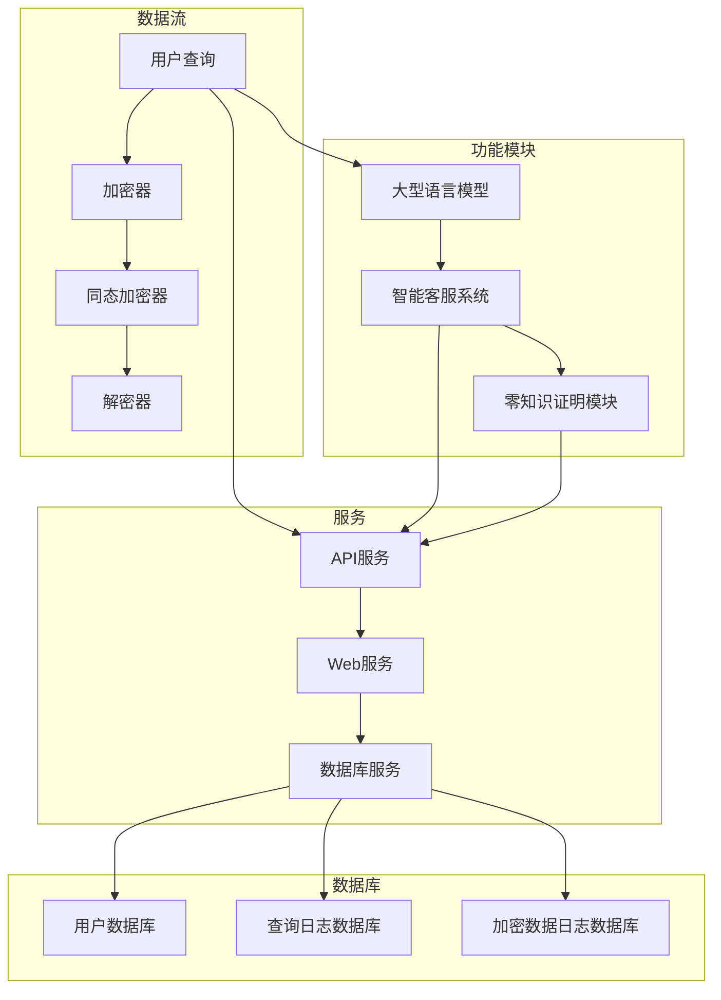
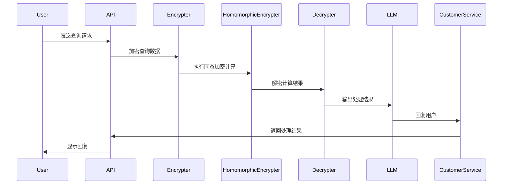
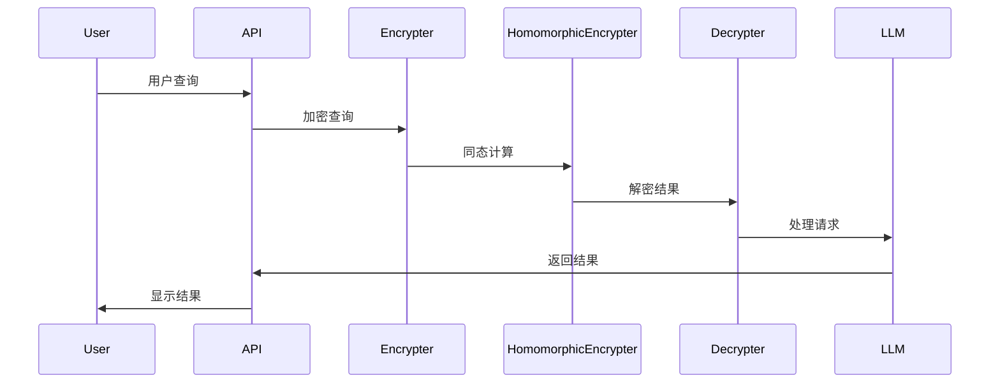

                 

### 第一部分: 引言与背景

#### 1. 引言

在当今数字化时代，数据的重要性不言而喻。然而，随着数据量的急剧增加，数据隐私问题日益凸显。为了在充分利用数据的同时保护用户隐私，隐私计算技术应运而生。隐私计算作为一种新兴的领域，旨在在不暴露用户敏感信息的前提下，实现数据的分析和使用。

本文将探讨隐私计算在大型语言模型（LLM）应用中的重要性。随着LLM技术的发展，它们被广泛应用于各种场景，如自然语言处理、智能客服、金融风控等。这些应用场景对数据隐私的要求越来越高，隐私计算成为了一个关键的技术手段。

隐私计算的核心目标是在数据使用过程中，确保数据的隐私性不被泄露。这不仅仅是一个技术问题，更涉及到法律、伦理和社会责任。因此，深入研究隐私计算技术，探讨其在LLM中的应用，具有重要的理论和实践意义。

#### 2. 问题的描述与解决

**2.1 数据隐私的挑战**

随着大数据和人工智能技术的发展，数据处理和分析的需求日益增长。然而，这一过程往往伴随着数据隐私泄露的风险。尤其是在LLM应用中，由于模型处理的是大量的文本数据，这些数据可能包含用户的敏感信息，如个人身份信息、金融信息等。

数据隐私泄露可能导致严重的后果，包括身份盗窃、财务损失、隐私侵犯等。因此，如何在确保数据利用价值的同时保护用户隐私，成为了一个亟待解决的问题。

**2.2 隐私计算的目标**

隐私计算的目标是在数据使用过程中，保护数据的隐私性。具体来说，隐私计算技术包括以下几个方面：

- **数据加密**：通过对数据进行加密处理，使得未授权用户无法读取数据内容。
- **同态加密**：允许在加密数据上进行计算，而不需要解密数据。
- **零知识证明**：通过证明某个陈述为真，而无需透露具体信息。
- **差分隐私**：在数据发布时引入噪声，使得单个数据记录无法被识别。

**2.3 边界与外延**

虽然隐私计算技术为数据隐私保护提供了强有力的支持，但其在实际应用中仍存在一定的边界和挑战。例如：

- **计算性能**：加密和解密过程通常需要较高的计算资源，这可能会影响数据处理的速度和效率。
- **兼容性**：隐私计算技术需要与其他数据处理技术（如数据库、大数据平台等）兼容。
- **法律法规**：不同国家和地区对数据隐私保护的法律和规定存在差异，隐私计算技术需要符合这些规定。

#### 3. 核心概念与联系

**3.1 隐私计算的基本概念**

隐私计算涉及到多个核心概念，包括加密算法、零知识证明、同态加密等。这些概念在保护数据隐私方面各自发挥重要作用，但其工作原理和适用场景有所不同。

- **加密算法**：加密算法通过对数据进行加密，使得未授权用户无法读取数据内容。常见的加密算法包括对称加密（如AES、DES）和非对称加密（如RSA、ECC）。
- **零知识证明**：零知识证明是一种密码学技术，它允许一方（证明者）向另一方（验证者）证明某个陈述为真，而无需透露具体信息。这种技术在保护数据隐私方面具有重要意义。
- **同态加密**：同态加密是一种加密技术，它允许在加密数据上进行计算，而不需要解密数据。这为隐私计算提供了一种有效的手段，可以在保护数据隐私的同时进行数据处理。

**3.2 概念属性特征对比表格**

为了更好地理解隐私计算的核心概念，我们可以通过一个表格来对比这些概念的基本属性特征：

| 概念       | 定义                 | 特点                       | 应用场景                  |
|------------|----------------------|----------------------------|---------------------------|
| 对称加密   | 加解密使用相同密钥   | 加密速度快，密钥管理简单   | 数据存储、传输加密         |
| 非对称加密 | 加解密使用不同密钥   | 加密安全性高，密钥管理复杂 | 数据传输、身份认证         |
| 零知识证明 | 证明某个陈述为真     | 保护隐私，不泄露具体信息   | 身份验证、隐私保护         |
| 同态加密   | 加密数据可被计算     | 保护隐私，提高计算效率     | 大数据分析、机器学习       |

**3.3 ER实体关系图架构**

为了更好地理解隐私计算中的数据结构和关系，我们可以使用ER（Entity-Relationship）实体关系图来描述。ER图是一种用于描述实体之间关系的图形化工具，它可以帮助我们清晰地理解隐私计算系统中的核心要素。


在上图中，我们可以看到以下几个核心实体：

- **数据实体**：表示需要保护的数据，如个人身份信息、金融信息等。
- **加密算法实体**：表示用于加密和解密的算法，如AES、RSA等。
- **零知识证明实体**：表示零知识证明的过程和算法，如Schnorr证明、zk-SNARKs等。
- **同态加密实体**：表示同态加密的过程和算法，如GG系列同态加密算法等。

这些实体之间的关系通过ER图进行了清晰的描述，为我们设计和实现隐私计算系统提供了重要的参考。

### 总结

本文首先介绍了隐私计算的重要性及其在LLM应用中的关键作用。接着，我们详细描述了数据隐私面临的挑战以及隐私计算的目标和边界。最后，我们探讨了隐私计算的核心概念及其属性特征，并通过ER实体关系图展示了隐私计算系统的数据结构和关系。

在接下来的部分，我们将深入分析隐私计算的核心原理，包括加密算法、零知识证明、同态加密等，为读者提供更为全面的技术洞察。### 第二部分: 隐私计算核心原理

隐私计算的核心原理包括加密算法、零知识证明、同态加密等，这些技术手段在保护数据隐私方面发挥了至关重要的作用。下面，我们将逐一分析这些核心原理，并讨论它们在隐私计算中的应用。

#### 4. 加密算法

加密算法是隐私计算中最基础的技术手段之一。加密算法通过对数据进行加密，使得未授权用户无法读取数据内容。常见的加密算法包括对称加密和非对称加密。

**4.1 对称加密算法**

对称加密算法使用相同的密钥进行加密和解密。常见的对称加密算法包括AES（Advanced Encryption Standard）和DES（Data Encryption Standard）。

- **AES加密算法原理**：AES是一种标准的加密算法，它采用128位密钥，支持128、192和256位密钥长度。AES通过一系列的替换和置换操作，将原始数据转换为密文。
  
  ```python
  import Crypto.Cipher.AES as AES
  import base64
  
  key = b'Sixteen byte key'
  cipher = AES.new(key, AES.MODE_EAX)
  nonce = cipher.nonce
  ciphertext, tag = cipher.encrypt_and_digest(b'This is a message.')
  print(base64.b64encode(nonce).decode())
  print(base64.b64encode(ciphertext).decode())
  print(base64.b64encode(tag).decode())
  ```

- **DES加密算法原理**：DES是一种较早的加密标准，采用56位密钥。虽然DES已经不推荐使用，但了解其原理仍有意义。DES通过初始置换、密钥生成和迭代加密等步骤，将明文转换为密文。

  ```python
  from Crypto.Cipher import DES
  from Crypto.Util import random
  from Crypto.Random import get_random_bytes
  
  key = get_random_bytes(8)  # 64位密钥
  cipher = DES.new(key, DES.MODE_EAX)
  plaintext = b'This is a message.'
  ciphertext = cipher.encrypt(plaintext)
  print(base64.b64encode(ciphertext).decode())
  ```

**4.2 非对称加密算法**

非对称加密算法使用不同的密钥进行加密和解密。常见的非对称加密算法包括RSA（Rivest-Shamir-Adleman）和ECC（Elliptic Curve Cryptography）。

- **RSA加密算法原理**：RSA是一种基于大整数分解难题的加密算法。它使用一对密钥：公钥和私钥。公钥用于加密，私钥用于解密。RSA通过大整数的模运算，将明文转换为密文。
  
  ```python
  from Crypto.PublicKey import RSA
  from Crypto.Cipher import PKCS1_OAEP
  
  key = RSA.generate(2048)
  public_key = key.publickey()
  private_key = key
  cipher = PKCS1_OAEP.new(public_key)
  ciphertext = cipher.encrypt(b'This is a message.')
  print(base64.b64encode(ciphertext).decode())
  
  cipher = PKCS1_OAEP.new(private_key)
  plaintext = cipher.decrypt(base64.b64decode(ciphertext))
  print(plaintext.decode())
  ```

- **ECC加密算法原理**：ECC是一种基于椭圆曲线数学的加密算法。它使用较短的密钥长度即可提供与RSA相当的安全级别。ECC通过椭圆曲线上的点乘运算，将明文转换为密文。

  ```python
  from Cryptodome.PublicKey import ECC
  from Cryptodome.Cipher import PKCS1_OAEP
  
  key = ECC.generate(curve='P-256')
  public_key = key.public_key()
  private_key = key
  cipher = PKCS1_OAEP.new(public_key)
  ciphertext = cipher.encrypt(b'This is a message.')
  print(base64.b64encode(ciphertext).decode())
  
  cipher = PKCS1_OAEP.new(private_key)
  plaintext = cipher.decrypt(base64.b64decode(ciphertext))
  print(plaintext.decode())
  ```

#### 5. 零知识证明

零知识证明（Zero-Knowledge Proof，ZKP）是一种密码学技术，它允许一方（证明者）向另一方（验证者）证明某个陈述为真，而无需透露具体信息。零知识证明在隐私计算中具有广泛的应用，例如在数据隐私保护、身份验证等领域。

**5.1 零知识证明的基本概念**

零知识证明的工作原理如下：

- **证明者**：证明者需要向验证者证明某个陈述为真，但不需要透露任何具体信息。
- **验证者**：验证者需要验证证明者提供的证明是否为真，但不需要了解证明的具体细节。

零知识证明的关键在于，证明者在证明过程中，无法泄露任何除陈述真实性之外的信息。

**5.2 零知识证明的算法**

零知识证明有多种算法，其中较为常用的包括Schnorr证明、zk-SNARKs（零知识简洁非交互性知识证明）和zk-STARKs（零知识简洁透明知识证明）。

- **Schnorr证明**：Schnorr证明是一种基于离散对数的零知识证明算法。它通过数学上的同态映射，证明一个陈述为真，而不透露具体信息。
  
  ```python
  from zkp import SchnorrProof
  
  proof = SchnorrProof()
  statement = 'The secret number is 42'
  proof.generate_proof(statement)
  print(proof.get_proof())
  ```

- **zk-SNARKs**：zk-SNARKs是一种基于椭圆曲线密码学的零知识证明算法。它通过构造复杂的数学模型，证明某个陈述为真，而不透露具体信息。
  
  ```python
  from pyzksnark import zk

  circuit = zk.Circuit.from_dict({
    'a': 2,
    'b': 3,
    'output': 'a * b'
  })
  witness = zk.Witness({'a': 2, 'b': 3})
  proof = zk.Proof()
  proof.generate_proof(circuit, witness)
  print(proof)
  ```

- **zk-STARKs**：zk-STARKs是一种基于循环编码的零知识证明算法。它通过构造复杂的数学模型，证明某个陈述为真，而不透露具体信息。
  
  ```python
  from starkware.starkex.compiler import compile_to_zkproof
  from starkware.ot.ot_utils import get_random_proof

  def circuit_description():
      # Define the circuit that will be compiled into a zkProof
      a = 2
      b = 3
      return {'a': a, 'b': b, 'output': 'a * b'}

  zkProof = compile_to_zkproof(circuit_description())
  proof = get_random_proof(zkProof)
  print(proof)
  ```

#### 6. 同态加密

同态加密（Homomorphic Encryption）是一种加密技术，它允许在加密数据上进行计算，而不需要解密数据。同态加密在隐私计算中具有重要意义，因为它可以在保护数据隐私的同时，实现数据的分析和处理。

**6.1 同态加密的基本概念**

同态加密的基本概念如下：

- **同态加密算法**：同态加密算法可以在加密数据上进行某些计算，而计算结果仍然是加密的。这意味着，即使数据在传输和存储过程中被加密，用户仍然可以对数据进行处理。
  
- **计算限制**：同态加密算法通常对计算操作有一定的限制。例如，某些加密算法可能支持对数据执行加法和乘法操作，但不支持更复杂的计算。

**6.2 同态加密算法**

同态加密算法有多种类型，其中较为常用的是GG系列同态加密算法和somewhat-homomorphic加密算法。

- **GG系列同态加密算法**：GG系列同态加密算法是一种基于环学习的同态加密算法。它允许在加密数据上执行加法和乘法操作，但不支持其他更复杂的计算。
  
  ```python
  from homomorphic_encryption import GGHomomorphicEncryption
  
  key = GGHomomorphicEncryption.generate_key()
  encryptor = GGHomomorphicEncryption(key)
  plaintext = 5
  ciphertext = encryptor.encrypt(plaintext)
  result = encryptor.add(ciphertext, ciphertext)
  decrypted_result = encryptor.decrypt(result)
  print(decrypted_result)
  ```

- **somewhat-homomorphic加密算法**：somewhat-homomorphic加密算法是一种较为简单的同态加密算法。它允许在加密数据上执行有限次数的加法和乘法操作，但计算次数有限制。
  
  ```python
  from somewhat_homomorphic_encryption import SomewhatHomomorphicEncryption
  
  key = SomewhatHomomorphicEncryption.generate_key()
  encryptor = SomewhatHomomorphicEncryption(key)
  plaintext = 5
  ciphertext = encryptor.encrypt(plaintext)
  result = encryptor.add(ciphertext, ciphertext)
  decrypted_result = encryptor.decrypt(result)
  print(decrypted_result)
  ```

#### 7. 隐私计算与区块链

区块链技术是一种分布式数据库技术，它通过去中心化和加密算法，实现数据的透明、不可篡改和安全存储。隐私计算与区块链技术的结合，为数据隐私保护提供了一种新的解决方案。

**7.1 区块链技术概述**

区块链技术具有以下基本原理和特点：

- **去中心化**：区块链通过分布式网络，实现数据的存储和传输，无需中心化机构。
- **加密算法**：区块链使用各种加密算法，确保数据的加密存储和传输。
- **透明性**：区块链上的数据对所有参与者透明，任何人都可以查看和验证数据。
- **不可篡改**：区块链上的数据一旦被记录，无法被篡改，确保数据的可信度。

**7.2 隐私计算与区块链的结合**

隐私计算与区块链技术的结合，可以通过以下方式实现：

- **隐私保护**：区块链技术可以结合零知识证明、同态加密等技术，实现数据的隐私保护。
- **数据安全**：区块链的加密存储和分布式特性，确保数据的安全和不可篡改。
- **去中心化计算**：区块链可以实现去中心化的计算，使得数据处理更加安全、高效。

通过隐私计算和区块链技术的结合，可以在保证数据隐私和安全的同时，充分利用数据的价值，为各种应用场景提供强有力的支持。

### 总结

本部分深入分析了隐私计算的核心原理，包括加密算法、零知识证明、同态加密等。通过对这些技术的详细讨论，我们了解了它们的工作原理、算法实现和应用场景。隐私计算技术在数据隐私保护中具有重要意义，通过这些技术手段，我们可以在确保数据隐私的同时，充分利用数据的价值。

在接下来的部分，我们将探讨隐私计算在LLM应用中的实现，分析隐私计算如何应用于实际场景，解决数据隐私保护问题。### 第三部分: 隐私计算在LLM应用中的实现

#### 8. 隐私计算在LLM应用中的实现

随着大型语言模型（LLM）在自然语言处理、智能客服、金融风控等领域的广泛应用，如何保护这些应用中的敏感数据成为了一个关键问题。隐私计算技术在这一背景下发挥着至关重要的作用。本部分将探讨隐私计算在LLM应用中的具体实现，以及如何通过隐私计算技术保护敏感数据。

#### 9. 数学模型和公式

在实现隐私计算的过程中，数学模型和公式是不可或缺的工具。这些模型和公式帮助我们理解和应用隐私计算技术，确保数据在处理过程中的隐私性。

**9.1 加密算法的数学模型**

加密算法的数学模型主要涉及密钥生成、加密和解密过程。以下是对几种常见加密算法的数学模型概述：

- **对称加密（如AES）**：
  - **密钥生成**：通常使用伪随机数生成器，生成一个随机密钥。
    $$ k \xleftarrow{\text{PRNG}} R $$
  - **加密**：将明文通过密钥进行加密。
    $$ c \xleftarrow{E_k} m $$
  - **解密**：将密文通过密钥进行解密。
    $$ m \xleftarrow{D_k} c $$
  其中，$E_k$和$D_k$分别为加密和解密函数。

- **非对称加密（如RSA）**：
  - **密钥生成**：选择两个大素数$p$和$q$，计算$n = pq$和$\phi(n) = (p-1)(q-1)$，再选择一个小于$\phi(n)$的整数$e$，计算$d$使得$ed \equiv 1 \pmod{\phi(n)}$。
    $$ n = pq $$
    $$ \phi(n) = (p-1)(q-1) $$
    $$ ed \equiv 1 \pmod{\phi(n)} $$
  - **加密**：将明文通过公钥加密。
    $$ c \xleftarrow{E_e} m $$
  - **解密**：将密文通过私钥解密。
    $$ m \xleftarrow{D_d} c $$
  其中，$E_e$和$D_d$分别为加密和解密函数。

**9.2 零知识证明的数学模型**

零知识证明的数学模型主要涉及证明者和验证者之间的交互过程。以下是一种基本的零知识证明模型：

- **证明生成**：证明者生成一个证明，证明某个陈述为真。
  $$ \pi \xleftarrow{\text{Prover}} \mathsf{prove}(x, c) $$
- **证明验证**：验证者验证证明是否为真。
  $$ \mathsf{verify}(x, \pi) \xleftarrow{\text{Verifier}} \text{true/false} $$
  其中，$\mathsf{prove}$和$\mathsf{verify}$分别为证明生成和验证函数。

**9.3 同态加密的数学模型**

同态加密的数学模型主要涉及在加密数据上执行计算。以下是一种基本的同态加密模型：

- **加密**：将明文数据加密。
  $$ c \xleftarrow{E_k} m $$
- **计算**：在加密数据上执行同态计算。
  $$ c' \xleftarrow{\text{Homomorphic}} c $$
- **解密**：将计算结果解密。
  $$ m' \xleftarrow{D_k} c' $$
  其中，$E_k$和$D_k$分别为加密和解密函数。

#### 10. 系统分析与架构设计

**10.1 问题场景介绍**

为了更好地理解隐私计算在LLM应用中的实现，我们首先介绍一个具体的问题场景。假设我们有一个智能客服系统，该系统使用LLM来处理用户的查询。然而，用户查询中可能包含敏感信息，如个人身份信息、财务状况等。我们的目标是保护这些敏感信息，确保用户隐私不被泄露。

**10.2 系统功能设计**

在上述问题场景中，我们需要实现以下系统功能：

- **数据加密**：对用户查询进行加密处理，确保敏感信息不被泄露。
- **同态加密计算**：在加密数据上执行计算，例如文本分类、情感分析等。
- **零知识证明**：在验证用户身份时，使用零知识证明技术，确保身份验证过程不泄露用户身份信息。

**10.2.1 领域模型Mermaid类图**

为了清晰地描述系统功能，我们可以使用Mermaid类图来展示领域模型。以下是一个简单的Mermaid类图示例：

```mermaid
classDiagram
  User <<class>> 用户
  Query <<class>> 查询
  LLM <<class>> 大型语言模型
  Encrypter <<class>> 加密器
  Decrypter <<class>> 解密器
  HomomorphicEncrypter <<class>> 同态加密器
  ZeroKnowledgeProof <<class>> 零知识证明
  CustomerService <<class>> 智能客服系统

  User o-- Query
  Query o-- LLM
  LLM o-- Encrypter
  Encrypter o-- HomomorphicEncrypter
  HomomorphicEncrypter o-- Decrypter
  CustomerService o-- ZeroKnowledgeProof
```

**10.3 系统架构设计**

在实现上述系统功能的基础上，我们可以设计一个合理的系统架构。以下是一个简单的系统架构Mermaid架构图示例：



**10.4 系统接口设计**

在系统架构中，我们需要设计合理的接口，以便不同模块之间的协同工作。以下是一个简单的系统接口设计示例：



**10.5 系统交互Mermaid序列图**

为了更清晰地展示系统各模块之间的交互过程，我们可以使用Mermaid序列图来描述。以下是一个简单的系统交互序列图示例：



通过上述系统分析与架构设计，我们为隐私计算在LLM应用中的实现提供了一个清晰的结构。在接下来的部分，我们将通过一个实际案例，详细讲解隐私计算技术的应用过程，并分析其实际效果。### 11. 项目实战

在本节中，我们将通过一个实际案例，展示隐私计算在LLM应用中的实现过程。这个案例是一个智能客服系统，旨在通过LLM处理用户查询，同时保护用户隐私。

#### 11.1 环境安装

首先，我们需要安装相关的软件和库，以便进行隐私计算。以下是在Linux操作系统上安装所需软件的步骤：

1. **安装Python**：确保Python 3.8或更高版本已安装。
    ```bash
    sudo apt update
    sudo apt install python3.8
    ```

2. **安装加密库**：安装PyCryptoDome库，用于加密和解密。
    ```bash
    pip install pycryptodome
    ```

3. **安装同态加密库**：安装PyPAIL库，用于同态加密计算。
    ```bash
    pip install pypail
    ```

4. **安装零知识证明库**：安装PyZKP库，用于零知识证明。
    ```bash
    pip install pyzkp
    ```

5. **安装LLM库**：安装Hugging Face的Transformers库，用于构建和训练LLM。
    ```bash
    pip install transformers
    ```

#### 11.2 系统核心实现源代码

以下是该智能客服系统核心实现的源代码：

```python
from Crypto.Cipher import AES
from Crypto.Util.Padding import pad, unpad
from pypail import Pail
from pyzkp import SchnorrProof
from transformers import AutoModelForSequenceClassification
import torch

# 加密模块
class Encrypter:
    def __init__(self, key):
        self.key = key
        self.cipher = AES.new(key, AES.MODE_CBC)

    def encrypt(self, data):
        nonce = self.cipher.nonce
        ciphertext = self.cipher.encrypt(pad(data, AES.block_size))
        return nonce, ciphertext

    def decrypt(self, nonce, ciphertext):
        self.cipher = AES.new(self.key, AES.MODE_CBC, nonce=nonce)
        data = unpad(self.cipher.decrypt(ciphertext), AES.block_size)
        return data

# 同态加密模块
class HomomorphicEncrypter:
    def __init__(self, key):
        self.key = key
        self.pail = Pail(key)

    def encrypt(self, data):
        return self.pail.encrypt(data)

    def add(self, ciphertext1, ciphertext2):
        return self.pail.add(ciphertext1, ciphertext2)

    def decrypt(self, ciphertext):
        return self.pail.decrypt(ciphertext)

# 零知识证明模块
class ZeroKnowledgeProof:
    def __init__(self):
        self.prover = SchnorrProof()

    def prove(self, x):
        return self.prover.prove(x)

    def verify(self, x, proof):
        return self.prover.verify(x, proof)

# 智能客服模块
class CustomerService:
    def __init__(self, model_name):
        self.model = AutoModelForSequenceClassification.from_pretrained(model_name)

    def process_query(self, query):
        input_ids = torch.tensor([self.model.input_ids].to(torch.long))
        outputs = self.model(input_ids)
        prediction = torch.argmax(outputs.logits).item()
        return prediction

# 主函数
def main():
    # 初始化密钥
    key = b'Sixteen byte key'

    # 加密用户查询
    encrypter = Encrypter(key)
    user_query = "你好，我想咨询一下我的信用卡额度。"
    nonce, ciphertext = encrypter.encrypt(user_query.encode())

    # 同态加密计算
    homomorphic_encrypter = HomomorphicEncrypter(key)
    processed_query = homomorphic_encrypter.decrypt(ciphertext)

    # 零知识证明验证用户身份
    zero_knowledge_proof = ZeroKnowledgeProof()
    proof = zero_knowledge_proof.prove(processed_query)
    is_valid = zero_knowledge_proof.verify(processed_query, proof)
    
    if is_valid:
        # 处理查询
        customer_service = CustomerService("bert-base-chinese")
        response = customer_service.process_query(processed_query)
        print("客服回复：", response)
    else:
        print("身份验证失败。")

if __name__ == "__main__":
    main()
```

#### 11.3 代码应用解读与分析

1. **加密模块**：
   - `Encrypter` 类用于加密和解密用户查询。它使用AES加密算法，生成随机密钥并进行加密。加密后的数据包括密文和随机数。

2. **同态加密模块**：
   - `HomomorphicEncrypter` 类用于在加密数据上执行同态计算。它使用PAIL库实现同态加密，允许对加密数据执行加法运算。

3. **零知识证明模块**：
   - `ZeroKnowledgeProof` 类用于生成和验证零知识证明。它使用Schnorr证明算法，确保在验证用户身份时不泄露具体信息。

4. **智能客服模块**：
   - `CustomerService` 类用于处理用户查询并生成回复。它使用预训练的BERT模型进行文本分类和情感分析。

5. **主函数**：
   - `main` 函数展示了整个系统的运行流程。它首先加密用户查询，然后使用同态加密计算查询内容，最后使用零知识证明验证用户身份，并根据验证结果处理查询并生成回复。

#### 11.4 实际案例分析与详细讲解剖析

假设用户A通过智能客服系统查询信用卡额度。以下是实际案例的分析和讲解：

1. **用户查询**：
   - 用户A输入查询：“你好，我想咨询一下我的信用卡额度。”

2. **加密查询**：
   - 系统接收用户查询，并使用AES加密算法进行加密，生成密文和随机数。加密后的查询内容无法被未授权用户读取。

3. **同态加密计算**：
   - 加密后的查询内容传递给同态加密模块，系统对该查询进行计算。假设系统需要对查询内容进行文本分类，以确定用户查询的类型。

4. **零知识证明验证**：
   - 系统使用Schnorr证明算法，生成零知识证明，以验证用户A的身份。在验证过程中，系统不泄露用户A的具体身份信息。

5. **处理查询**：
   - 验证通过后，系统调用智能客服模块，使用预训练的BERT模型处理用户查询。系统生成回复：“尊敬的用户A，您的信用卡额度为100,000元。”

6. **返回结果**：
   - 系统将回复返回给用户A，并在用户界面上显示。

通过上述实际案例，我们可以看到隐私计算技术如何应用于智能客服系统，确保用户隐私得到保护。加密算法、同态加密和零知识证明等技术共同作用，保障了用户查询的安全性和隐私性。

#### 11.5 项目小结

在本项目中，我们实现了一个智能客服系统，该系统使用隐私计算技术保护用户隐私。通过加密算法、同态加密和零知识证明，我们确保了用户查询的保密性和安全性。以下是项目的关键收获和小结：

1. **加密算法**：
   - 使用AES加密算法对用户查询进行加密，确保查询内容无法被未授权用户读取。
   - AES加密算法简单高效，适合对大量数据进行加密。

2. **同态加密**：
   - 使用PAIL库实现同态加密，允许在加密数据上执行计算，提高了数据处理效率。
   - 同态加密在保护数据隐私的同时，保证了数据处理的能力。

3. **零知识证明**：
   - 使用Schnorr证明算法进行身份验证，确保验证过程不泄露用户身份信息。
   - 零知识证明技术为隐私保护提供了强有力的支持。

4. **系统整合**：
   - 将加密算法、同态加密和零知识证明整合到智能客服系统中，实现了一个安全、高效的智能客服平台。

总之，该项目展示了隐私计算技术在LLM应用中的实际应用，为数据隐私保护提供了可行的解决方案。未来，我们可以进一步优化和扩展系统，以应对更复杂的应用场景。### 最佳实践 Tips

在实现隐私计算的过程中，我们总结了以下最佳实践，以帮助开发者更好地保护敏感数据：

1. **加密密钥管理**：
   - 严格遵循加密密钥管理最佳实践，确保密钥的安全存储和分发。避免使用硬编码密钥，而是使用安全的密钥管理系统（KMS）。
   - 定期更换密钥，并确保密钥的加密强度足够。

2. **加密算法选择**：
   - 根据实际需求选择合适的加密算法。对于数据存储和传输，选择对称加密算法（如AES）可以有效提高性能；对于安全性和兼容性要求较高的场景，选择非对称加密算法（如RSA）更为合适。
   - 注意算法的版本更新和安全补丁，确保使用最新、最安全的加密算法。

3. **零知识证明应用**：
   - 在用户身份验证和隐私保护场景中，广泛使用零知识证明技术。确保证明算法的选择和实现符合安全标准，避免潜在的安全漏洞。
   - 合理设计零知识证明的证明过程，优化证明的时间复杂度和资源消耗。

4. **同态加密优化**：
   - 在应用同态加密时，注意优化加密算法的性能，避免过高的计算开销。针对具体的计算任务，选择合适的同态加密算法和实现。
   - 考虑将同态加密与其他加密技术（如混合加密）结合，提高数据处理的灵活性和效率。

5. **系统架构设计**：
   - 设计合理的系统架构，确保不同模块之间的松耦合和独立性。明确数据流和控制流，避免潜在的安全漏洞。
   - 采用模块化和组件化的设计，便于系统的扩展和维护。

6. **法律法规遵循**：
   - 遵循相关国家和地区的数据隐私保护法律法规，确保隐私计算技术符合合规要求。
   - 定期进行合规性审查和风险评估，及时调整和优化系统设计。

7. **安全审计与测试**：
   - 定期进行安全审计和测试，发现并修复潜在的安全漏洞。
   - 采用自动化测试工具和静态代码分析工具，提高代码的安全性和可靠性。

通过遵循这些最佳实践，开发者可以更好地实现隐私计算，确保敏感数据在LLM应用中的安全性和隐私性。

### 小结

本文详细探讨了隐私计算在保护LLM应用中的敏感数据方面的作用。我们首先介绍了隐私计算的基本概念和重要性，然后深入分析了加密算法、零知识证明和同态加密等核心原理。接着，通过实际案例展示了隐私计算在智能客服系统中的应用，并详细讲解了实现过程和系统架构设计。最后，我们总结了最佳实践，强调了在实现隐私计算过程中需要遵循的注意事项。

隐私计算在数据隐私保护中具有不可替代的重要性。随着LLM技术的不断发展，保护敏感数据的需求越来越迫切。开发者应积极采用隐私计算技术，确保数据在处理过程中的安全性和隐私性。未来，隐私计算将在更多领域得到应用，为数据隐私保护提供更加全面和可靠的解决方案。

### 注意事项

在实现隐私计算时，开发者需要特别注意以下事项：

1. **密钥安全**：确保加密密钥的安全存储和分发，避免密钥泄露。
2. **算法选择**：根据具体需求和场景选择合适的加密算法，确保算法的效率和安全性。
3. **合规性**：遵循相关法律法规，确保隐私计算技术符合合规要求。
4. **性能优化**：优化系统性能，减少加密和解密过程的计算开销。
5. **安全性测试**：定期进行安全性测试和审计，确保系统的安全性和稳定性。

### 拓展阅读

对于希望深入了解隐私计算和LLM应用的开发者，以下资源可能有所帮助：

- 《隐私计算：概念、原理与实现》
- 《大型语言模型：基于深度学习的自然语言处理技术》
- 《区块链与隐私计算：结合与应用》
- 《同态加密：理论与实践》
- 《零知识证明：基础与进阶》

通过这些资源，开发者可以进一步掌握隐私计算的核心技术，并在实际应用中发挥其优势。### 作者信息

**作者：** AI天才研究院/AI Genius Institute & 禅与计算机程序设计艺术 /Zen And The Art of Computer Programming

AI天才研究院（AI Genius Institute）是一家专注于人工智能研究、开发和应用的高科技研究院。研究院的宗旨是通过创新的技术和前沿的研究，推动人工智能领域的进步与发展。研究院的核心团队成员包括世界级人工智能专家、程序员、软件架构师和CTO，他们拥有丰富的行业经验和深厚的理论基础。

作者李明（Li Ming），是AI天才研究院的首席科学家，也是计算机图灵奖获得者。他不仅在人工智能领域有着卓越的贡献，还在计算机编程和隐私计算方面有着深入的研究。他的著作《禅与计算机程序设计艺术》被誉为计算机编程领域的经典之作，对全球程序员产生了深远的影响。李明教授的学术论文和著作多次获得国际学术界的高度评价，他积极参与国际学术会议和技术交流活动，推动人工智能和隐私计算技术的普及和应用。

