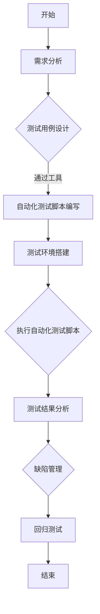
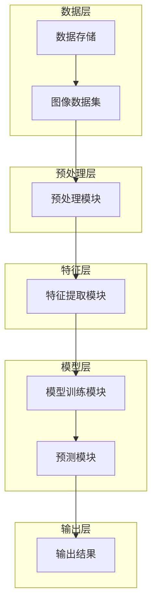
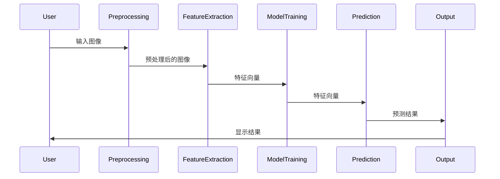

                 

### 第一部分：背景介绍

#### 1.1 问题背景

##### 1.1.1 集成测试的重要性

在当今快速发展的技术环境中，人工智能（AI）系统的开发和应用日益广泛。这些系统不仅涉及复杂的算法和数据结构，还集成了多个软件模块和硬件组件。因此，确保AI系统的整体功能符合预期和标准成为了一个关键问题。集成测试作为一种系统性的验证方法，对于确保AI系统在复杂环境中的稳定性和可靠性具有至关重要的作用。

集成测试的重要性主要体现在以下几个方面：

1. **发现接口问题**：集成测试能够发现不同软件模块之间的接口问题，确保它们在协同工作时能够无缝对接，避免因接口问题导致的系统崩溃或功能异常。

2. **验证整体功能**：通过集成测试，可以验证AI系统的整体功能是否符合设计要求，确保系统在各个层面上都能够正常运行。

3. **降低维护成本**：早期发现并修复集成问题可以大大降低后续维护成本，避免在系统上线后因集成问题导致的高昂修复费用。

4. **提高系统质量**：集成测试有助于提高AI系统的整体质量，确保系统在交付给用户之前达到预期的性能和可靠性标准。

##### 1.1.2 AI系统整体功能验证的必要性

AI系统的复杂性决定了其整体功能验证的必要性。这些系统通常包括以下几个方面：

1. **算法准确性**：AI算法的准确性和效率直接影响到系统的性能，必须通过集成测试来验证算法在实际应用中的表现。

2. **数据处理能力**：AI系统需要处理大量的数据，并从中提取有价值的信息。集成测试可以验证系统在数据输入、处理和输出各环节的能力。

3. **系统响应时间**：对于实时性要求较高的AI系统，集成测试需要验证系统在各种负载下的响应时间，确保其能够在规定时间内完成任务。

4. **可扩展性和可维护性**：AI系统通常需要支持不断的功能扩展和维护，集成测试可以评估系统的可扩展性和可维护性。

##### 1.1.3 集成测试的现状与挑战

尽管集成测试在AI系统开发中具有重要意义，但当前仍然面临一些挑战和问题：

1. **复杂性**：AI系统通常由多个复杂的组件构成，集成测试需要全面覆盖所有可能的交互和组合，这增加了测试的复杂性。

2. **测试覆盖率**：确保集成测试能够覆盖所有关键场景和路径是一个巨大的挑战，特别是在系统规模不断扩大的情况下。

3. **测试成本**：集成测试需要大量的人力和时间投入，特别是在系统迭代频繁的情况下，测试成本可能会成为一个问题。

4. **动态性**：AI系统在不断更新和迭代，集成测试需要能够适应这些变化，及时调整测试策略和用例。

5. **性能优化**：集成测试不仅需要验证系统的功能，还需要评估其性能，确保系统在各种负载下都能够高效运行。

综上所述，集成测试在AI系统整体功能验证中具有不可替代的作用，但同时也面临着一系列挑战。接下来，我们将深入探讨集成测试的具体目标、任务和解决方法。

#### 1.2 问题描述

##### 1.2.1 AI系统整体功能验证的具体目标

AI系统整体功能验证的主要目标包括以下几个方面：

1. **验证正确性**：确保AI系统在各个模块和组件的集成过程中，能够按照设计要求正常工作，没有功能缺陷。

2. **确保稳定性**：在真实环境下，AI系统需要能够稳定运行，不会因外部干扰或内部错误而导致系统崩溃。

3. **评估性能**：集成测试需要评估AI系统在不同负载条件下的性能表现，确保其能够满足性能指标。

4. **兼容性测试**：验证AI系统与不同硬件、软件环境和其他系统的兼容性，确保系统能够在不同的环境中顺利运行。

5. **安全性验证**：确保AI系统在数据传输和处理过程中具有足够的安全性，防止数据泄露和恶意攻击。

##### 1.2.2 集成测试的目标与任务

集成测试的目标可以归纳为以下几项：

1. **发现和修复缺陷**：通过集成测试，可以发现AI系统在集成过程中存在的各种问题，并及时修复，确保系统质量。

2. **验证功能完整性**：确保AI系统的各个功能模块能够协同工作，满足整体功能要求。

3. **优化系统性能**：评估AI系统在不同负载条件下的性能，发现性能瓶颈，进行优化。

4. **确保系统安全性**：通过集成测试，验证AI系统的安全机制是否有效，防止潜在的安全威胁。

集成测试的具体任务包括：

1. **设计测试用例**：根据AI系统的功能和需求，设计合适的测试用例，确保能够全面覆盖系统的各个功能点。

2. **执行测试**：按照设计好的测试用例，执行集成测试，并记录测试结果。

3. **分析测试结果**：对测试结果进行分析，发现系统中的缺陷和问题，并提出解决方案。

4. **持续迭代**：根据测试结果，对系统进行修复和优化，并重新执行测试，确保问题得到彻底解决。

##### 1.2.3 集成测试面临的主要困难

集成测试在实施过程中面临一系列困难和挑战：

1. **测试覆盖难度**：确保集成测试能够覆盖所有的功能点和可能的交互组合是一个巨大的挑战。

2. **测试数据管理**：集成测试需要大量的真实数据，如何有效地管理这些数据，确保其真实性和有效性，是一个重要问题。

3. **系统复杂性**：AI系统的复杂性增加了集成测试的难度，需要专业的测试人员和技术支持。

4. **测试成本**：集成测试需要投入大量的人力和时间，特别是在系统迭代频繁的情况下，测试成本可能会成为一个负担。

5. **时间约束**：在项目开发时间紧迫的情况下，如何在有限的时间内完成全面的集成测试，是一个亟待解决的问题。

6. **动态性**：AI系统的不断更新和迭代，要求集成测试能够快速适应这些变化，保持测试的有效性和全面性。

为了解决上述问题，我们需要明确集成测试的基本原则，设计合理的测试策略和方法，并在实践中不断优化和改进。接下来，我们将详细探讨集成测试的基本原则和关键步骤。

#### 1.3 问题解决

##### 1.3.1 集成测试的基本原则

集成测试作为验证AI系统整体功能的关键步骤，需要遵循以下基本原则：

1. **全面性**：集成测试应覆盖系统的所有功能模块和关键路径，确保所有功能点都被测试到。

2. **早期开始**：集成测试应在系统开发的早期阶段就开始，以便在早期发现和修复缺陷，减少后期修复的成本。

3. **逐步集成**：集成测试应采用逐步集成的策略，逐步将新模块集成到系统中，并逐步扩大测试范围。

4. **基于需求**：集成测试应基于系统的需求文档，确保所有需求都被测试到，并且测试用例能够覆盖所有需求场景。

5. **可靠性**：集成测试的执行过程应确保测试结果的可靠性，避免因测试环境或操作不当导致的误判。

6. **文档化**：集成测试的结果和过程应进行详细的文档化，以便在后续的维护和扩展中参考。

##### 1.3.2 集成测试的关键步骤

为了有效地进行集成测试，我们需要遵循以下关键步骤：

1. **测试准备**：在集成测试开始前，进行充分的测试准备工作，包括测试环境的搭建、测试工具的选择和测试数据的准备。

2. **测试设计**：根据系统需求和功能模块，设计合适的测试用例和测试方案，确保测试能够全面覆盖系统的各个功能点。

3. **测试执行**：按照设计的测试用例和测试方案，执行集成测试，并记录测试结果。

4. **缺陷管理**：对测试过程中发现的缺陷进行记录和管理，确保所有缺陷都能被及时修复。

5. **测试分析**：对测试结果进行分析，评估系统的功能完整性和性能，并提出优化建议。

6. **回归测试**：在修复缺陷后，进行回归测试，确保修复后的系统仍然能够稳定运行。

7. **文档整理**：整理集成测试的过程和结果，形成详细的测试报告，为后续的系统维护和扩展提供参考。

##### 1.3.3 集成测试的策略与方法

集成测试的策略和方法应基于系统的特点和需求进行选择：

1. **自底向上集成**：从最底层的模块开始，逐步向上集成，确保底层模块的稳定性和兼容性。

2. **自顶向下集成**：从最高层的模块开始，逐步向下集成，验证上层模块的功能和性能。

3. **三明治集成**：同时进行自底向上和自顶向下集成，确保系统的整体稳定性和兼容性。

4. **增量集成**：在每次集成过程中，只集成新修改的模块，减少集成测试的复杂度。

5. **静态测试**：通过代码审查和静态代码分析，发现潜在的问题，减少动态测试的工作量。

6. **动态测试**：通过实际运行系统，验证系统的功能和性能，发现动态运行中的问题。

7. **场景测试**：设计特定的场景，模拟真实的使用环境，验证系统在各种场景下的稳定性和可靠性。

通过上述策略和方法，我们可以有效地进行集成测试，确保AI系统的整体功能符合预期，提高系统的质量和可靠性。

##### 1.4 边界与外延

##### 1.4.1 集成测试的边界

集成测试的边界主要包括以下几个方面：

1. **功能边界**：集成测试主要关注系统的功能是否正确，而不涉及具体的算法实现细节。

2. **性能边界**：虽然集成测试会评估系统的性能，但其主要关注点是功能是否正常，而不是具体的性能指标。

3. **接口边界**：集成测试主要验证不同模块之间的接口是否正确，确保它们能够协同工作。

4. **环境边界**：集成测试需要在特定的环境（如操作系统、硬件配置等）下进行，以确保测试结果的可靠性。

##### 1.4.2 集成测试的外延

集成测试的外延包括以下几个方面：

1. **测试阶段**：集成测试通常在系统开发的各个阶段进行，包括单元测试、集成测试、系统测试和验收测试。

2. **测试类型**：除了集成测试，还包括单元测试、系统测试和验收测试等多种测试类型，共同构成完整的测试流程。

3. **测试工具**：集成测试需要使用多种测试工具，如测试框架、测试管理工具和性能测试工具等，以提高测试效率和覆盖率。

4. **团队协作**：集成测试通常需要多个团队的协作，包括开发团队、测试团队和产品团队等，以确保测试工作的顺利进行。

##### 1.4.3 集成测试与其他测试类型的关联与区别

集成测试与其他测试类型的关联和区别如下：

1. **单元测试**：单元测试主要针对系统的最小功能单元，确保其功能正确。集成测试则关注多个模块的协同工作，验证系统的整体功能。

2. **系统测试**：系统测试主要验证整个系统的功能是否符合预期，而集成测试则更侧重于模块之间的接口和协同工作。

3. **验收测试**：验收测试通常在系统交付前进行，确保系统符合用户需求。集成测试则是验收测试的一个前置步骤，确保系统在交付前达到一定的质量标准。

4. **性能测试**：性能测试主要评估系统的性能指标，如响应时间、吞吐量和并发能力等。集成测试虽然也会涉及性能评估，但其主要目标是确保系统的功能完整性。

通过明确集成测试的边界和外延，以及其与其他测试类型的关联与区别，我们可以更准确地理解和实施集成测试，确保AI系统的整体功能符合预期。

##### 1.5 概念结构与核心要素组成

##### 1.5.1 集成测试的概念结构

集成测试的概念结构可以分解为以下几个关键组成部分：

1. **测试对象**：集成测试的对象是系统的各个模块和组件，特别是那些需要相互协作的部分。

2. **测试用例**：测试用例是集成测试的核心，它定义了具体的输入数据、测试步骤和预期结果，用于验证系统的功能和行为。

3. **测试环境**：测试环境包括硬件、软件和网络配置等，它是集成测试的基础，决定了测试结果的可靠性。

4. **测试工具**：测试工具用于执行测试用例、记录测试结果和生成测试报告，常见的测试工具有JUnit、Selenium和JMeter等。

5. **测试结果**：测试结果包括通过/失败的测试用例、错误日志和性能数据等，它是评估系统质量和性能的重要依据。

6. **测试管理**：测试管理涉及测试计划、测试资源分配、测试进度监控和测试报告等，确保集成测试工作的有序进行。

##### 1.5.2 集成测试的核心要素组成

集成测试的核心要素包括：

1. **功能覆盖**：确保测试用例能够全面覆盖系统的所有功能，没有遗漏。

2. **接口验证**：验证不同模块之间的接口是否正确，确保它们能够无缝对接。

3. **性能评估**：评估系统在不同负载条件下的性能，确保其能够满足性能指标。

4. **安全性检查**：检查系统的安全性，确保数据传输和处理过程中没有安全漏洞。

5. **稳定性测试**：在模拟真实环境的情况下，验证系统在各种负载和干扰下的稳定性。

6. **可维护性评估**：评估系统的可维护性，确保在后续的维护和扩展中能够轻松应对。

##### 1.5.3 集成测试的主要组成部分

集成测试的主要组成部分包括：

1. **测试计划**：制定详细的测试计划，包括测试目标、测试范围、测试策略和时间安排等。

2. **测试用例**：设计合适的测试用例，包括功能测试用例、性能测试用例和安全测试用例等。

3. **测试执行**：按照测试计划和测试用例，执行集成测试，记录测试结果。

4. **测试报告**：生成详细的测试报告，包括测试结果、缺陷报告和性能分析等。

5. **缺陷管理**：记录和管理测试过程中发现的缺陷，确保所有缺陷都能被及时修复。

6. **回归测试**：在修复缺陷后，重新执行测试，确保修复后的系统仍然稳定可靠。

通过明确集成测试的概念结构、核心要素和主要组成部分，我们可以更系统地规划和实施集成测试，确保AI系统的整体功能和质量。

##### 1.6 本章小结

在本章中，我们介绍了集成测试的背景、重要性以及AI系统整体功能验证的必要性。通过分析集成测试的现状与挑战，我们明确了集成测试的基本原则和关键步骤。此外，我们还探讨了集成测试的边界与外延，以及其与其他测试类型的关联与区别。最后，我们详细阐述了集成测试的概念结构、核心要素和主要组成部分。通过这些内容，我们为后续章节中深入探讨集成测试的核心概念、算法原理、系统分析与架构设计方案以及项目实战打下了坚实的基础。

---

### 第二部分：核心概念与联系

#### 2.1 集成测试的核心概念

集成测试作为一种系统性的验证方法，其核心概念包括以下几个方面：

##### 2.1.1 集成测试的定义

集成测试（Integration Testing）是指在软件开发过程中，将已经测试过的多个模块或组件集成到一起，进行系统性验证，以确保它们能够协同工作并满足系统功能要求。与单元测试不同，集成测试关注的是模块之间的接口和交互，而不是单个模块的功能。

##### 2.1.2 集成测试的分类

集成测试可以根据不同的标准进行分类：

1. **按集成策略分类**：
   - **自底向上集成**：从底层模块开始，逐步向上集成，确保底层模块的稳定性和兼容性。
   - **自顶向下集成**：从顶层模块开始，逐步向下集成，验证上层模块的功能和性能。
   - **三明治集成**：同时进行自底向上和自顶向下集成，确保系统的整体稳定性和兼容性。

2. **按测试目标分类**：
   - **功能集成测试**：主要验证系统的功能是否正确，确保各个模块能够协同工作。
   - **性能集成测试**：评估系统在不同负载条件下的性能表现，确保系统能够满足性能要求。
   - **安全集成测试**：检查系统的安全机制是否有效，确保数据传输和处理过程中的安全性。

##### 2.1.3 集成测试的主要类型

集成测试主要包括以下几种类型：

1. **灰盒测试**：测试人员对系统内部结构和代码有一定的了解，通过观察和调试来验证系统的行为。
2. **黑盒测试**：测试人员不了解系统内部结构和代码，仅根据系统的功能和输入输出进行验证。
3. **白盒测试**：测试人员了解系统内部结构和代码，通过路径覆盖和代码覆盖率等指标来验证系统的行为。
4. **灰盒-黑盒测试**：结合灰盒测试和黑盒测试的特点，部分了解系统内部结构，但主要关注功能和交互。

通过以上分类，我们可以更清晰地理解和应用集成测试，确保AI系统的整体功能和性能。

#### 2.2 测试策略与方法

集成测试的策略和方法对测试效果和质量至关重要。以下是几种常见的集成测试策略和方法：

##### 2.2.1 集成测试的策略

1. **自底向上集成策略**：
   - **步骤**：首先测试并集成底层模块，然后逐步向上集成更高层的模块。
   - **优点**：可以确保底层模块的稳定性和兼容性，减少集成过程中出现的问题。
   - **适用场景**：适用于底层模块较为稳定，高层模块依赖底层模块的情况。

2. **自顶向下集成策略**：
   - **步骤**：首先测试并集成顶层模块，然后逐步向下集成更低层的模块。
   - **优点**：可以更快地验证上层模块的功能，有助于尽早发现和解决高层次问题。
   - **适用场景**：适用于上层模块的重要性较高，且其对底层模块的依赖较小的情况。

3. **三明治集成策略**：
   - **步骤**：同时进行自底向上和自顶向下集成，确保系统的整体稳定性和兼容性。
   - **优点**：可以同时验证底层和上层模块，减少集成过程中出现的问题。
   - **适用场景**：适用于系统复杂度高，底层和上层模块相互依赖的情况。

##### 2.2.2 集成测试的方法

1. **基于功能的集成测试**：
   - **步骤**：设计并执行功能测试用例，验证各个模块的功能是否正确。
   - **优点**：可以快速发现功能性问题，确保系统的功能完整性。
   - **适用场景**：适用于需要确保系统功能符合预期的情况。

2. **基于性能的集成测试**：
   - **步骤**：通过模拟高负载场景，评估系统在不同负载条件下的性能表现。
   - **优点**：可以评估系统的性能瓶颈，优化系统性能。
   - **适用场景**：适用于需要确保系统在高负载条件下仍然能够稳定运行的情况。

3. **基于安全的集成测试**：
   - **步骤**：通过模拟攻击和漏洞测试，验证系统的安全性和防护能力。
   - **优点**：可以识别系统的安全漏洞，提高系统的安全性。
   - **适用场景**：适用于需要确保系统安全性的情况。

4. **基于接口的集成测试**：
   - **步骤**：通过测试模块之间的接口和交互，验证各个模块的协同工作是否正常。
   - **优点**：可以确保模块之间的接口正确，减少因接口问题导致的问题。
   - **适用场景**：适用于需要确保模块之间接口稳定和可靠的情况。

通过以上策略和方法的详细介绍，我们可以根据具体需求选择合适的集成测试策略和方法，确保AI系统的整体功能和质量。

#### 2.3 集成测试的属性特征对比表格

为了更直观地展示集成测试的属性特征，我们可以使用对比表格来进行说明。以下是一个示例表格，展示了不同类型的集成测试在几个关键属性上的差异：

| 类型           | 测试层次 | 测试目的                  | 优点                             | 缺点                           | 适用场景                 |
| -------------- | -------- | ------------------------ | -------------------------------- | ------------------------------ | ------------------------ |
| 自底向上集成   | 底层到高层 | 确保底层模块的稳定性和兼容性 | 可以先验证并解决底层问题       | 可能会延误上层模块的开发      | 底层模块较为稳定的情况  |
| 自顶向下集成   | 高层到底层 | 快速验证上层模块的功能      | 可以较早发现高层次问题       | 可能会影响底层模块的稳定性    | 上层模块重要性高的情况 |
| 三明治集成     | 同时底高层 | 确保系统的整体稳定性和兼容性 | 可以同时验证底层和上层模块    | 可能会增加测试的复杂性       | 系统复杂度高的情况    |
| 功能集成测试   | 功能层面  | 验证系统的功能是否正确    | 可以快速发现功能性问题       | 可能会忽视性能和接口问题     | 确保功能完整性的情况  |
| 性能集成测试   | 性能层面  | 评估系统在不同负载下的性能 | 可以发现性能瓶颈进行优化     | 可能会增加测试的时间和成本    | 需要确保系统性能的情况 |
| 安全集成测试   | 安全层面  | 验证系统的安全性和防护能力 | 可以提高系统的安全性         | 可能需要专业的安全知识和工具 | 确保系统安全的情况    |
| 接口集成测试   | 接口层面  | 确保模块之间的接口正确    | 可以减少因接口问题导致的问题 | 可能会忽视功能和安全问题     | 需要确保接口稳定的情况 |

通过这个表格，我们可以清楚地看到不同类型集成测试的属性特征，从而根据具体需求选择合适的测试方法。

#### 2.4 ER实体关系图架构

##### 2.4.1 ER实体关系图的基本概念

实体关系图（Entity-Relationship Diagram，简称ER图）是数据库设计中常用的一种概念模型，用于描述系统中实体及其相互关系。ER图由实体、属性和关系三个基本组件构成：

1. **实体**：实体是系统中具有独立存在意义的对象，例如用户、订单和产品等。
2. **属性**：属性是实体的特征，用于描述实体的具体信息，例如用户的名字、年龄和邮箱等。
3. **关系**：关系是实体之间的关联，表示实体之间的互动和依赖，例如用户可以下单购买产品。

##### 2.4.2 ER实体关系图在集成测试中的应用

在集成测试中，ER实体关系图可以用于描述系统的模块及其交互关系，帮助我们更清晰地理解系统的结构和功能，从而设计更有效的测试用例。

1. **模块识别**：通过ER图，我们可以识别出系统中的关键模块，并确定它们之间的关系。这有助于我们确定哪些模块需要集成测试，以及它们的集成顺序。
2. **接口设计**：ER图可以显示模块之间的接口和交互方式，帮助我们设计更准确的接口测试用例，确保模块之间的协作和兼容性。
3. **数据流分析**：ER图可以帮助我们分析系统的数据流，识别数据在各个模块之间的传递和处理过程，从而设计更全面的测试用例，确保数据的完整性和一致性。
4. **测试覆盖**：通过ER图，我们可以确定哪些测试用例能够覆盖系统的所有功能点和关系，确保测试的全面性和有效性。

##### 2.4.3 ER实体关系图示例

以下是一个简化的ER实体关系图示例，用于描述一个电子商务系统的用户、订单和产品之间的关系：

```mermaid
erDiagram
  用户 ||--|{ 订单 }|--  产品
  用户  : 有多个订单
  订单  : 属于一个用户
  产品  : 属于一个订单
```

在这个示例中，用户、订单和产品是三个实体，它们之间的关系是“用户”可以拥有多个“订单”，每个“订单”可以包含多个“产品”。通过这个ER图，我们可以清晰地了解系统的模块和关系，从而设计更有效的集成测试用例。

通过ER实体关系图，我们可以更好地理解和设计集成测试，确保AI系统的整体功能和性能。

#### 2.5 本章小结

在本章中，我们详细介绍了集成测试的核心概念，包括其定义、分类和主要类型。接着，我们探讨了集成测试的策略和方法，以及如何通过ER实体关系图来描述系统的模块和交互关系。最后，我们通过一个示例ER图展示了其在集成测试中的应用。通过这些内容，我们为理解集成测试及其在AI系统开发中的重要性奠定了基础，为后续章节中的算法原理讲解、系统分析与架构设计方案和项目实战提供了理论依据。在下一章中，我们将深入探讨集成测试的算法原理，包括其数学模型和具体实现方法。

---

### 第三部分：算法原理讲解

#### 3.1 集成测试算法原理

集成测试算法是确保AI系统整体功能符合预期的重要工具。以下我们将详细讲解集成测试算法的基本原理、数学模型和实现方法。

##### 3.1.1 集成测试算法的基本原理

集成测试算法的基本原理可以概括为以下几点：

1. **模块集成与验证**：通过将多个模块集成在一起，并对其交互和功能进行验证，确保系统的整体功能符合设计要求。
2. **测试用例设计**：根据系统需求和功能模块，设计合适的测试用例，确保测试用例能够覆盖所有关键路径和功能点。
3. **自动化测试**：使用自动化测试工具执行测试用例，提高测试效率和覆盖率。
4. **错误诊断与修复**：通过分析测试结果，识别并修复系统中的缺陷，确保系统的稳定性、可靠性和性能。

##### 3.1.2 集成测试算法的数学模型和公式

集成测试算法的数学模型和公式有助于我们量化测试过程和评估系统质量。以下是几个常用的数学模型和公式：

1. **测试覆盖率公式**：
   $$C = \frac{\text{执行用例数}}{\text{总用例数}} \times 100\%$$
   其中，\(C\)表示测试覆盖率，\(\text{执行用例数}\)表示实际执行的测试用例数量，\(\text{总用例数}\)表示所有设计好的测试用例数量。

2. **缺陷发现效率公式**：
   $$E = \frac{\text{发现缺陷数}}{\text{测试用例执行次数}}$$
   其中，\(E\)表示缺陷发现效率，\(\text{发现缺陷数}\)表示在测试过程中发现的缺陷数量，\(\text{测试用例执行次数}\)表示执行的测试用例次数。

3. **性能评估公式**：
   $$P = \frac{\text{实际性能}}{\text{预期性能}} \times 100\%$$
   其中，\(P\)表示性能评估结果，\(\text{实际性能}\)表示测试过程中测得的实际性能值，\(\text{预期性能}\)表示系统设计要求的性能值。

##### 3.1.3 集成测试算法的实现方法

集成测试算法的实现方法主要包括以下几个步骤：

1. **需求分析**：根据系统需求，分析各个模块的功能和交互，确定需要测试的关键点和测试用例。
2. **测试用例设计**：设计合适的测试用例，确保测试用例能够覆盖所有关键功能和路径。
3. **测试工具选择**：选择适合的测试工具，如JUnit、Selenium和JMeter等，以提高测试效率和覆盖率。
4. **测试环境搭建**：搭建适合的测试环境，包括硬件、软件和网络配置等，确保测试结果的一致性和可靠性。
5. **自动化测试脚本编写**：根据设计的测试用例，编写自动化测试脚本，使用测试工具执行测试用例。
6. **测试执行与结果分析**：执行自动化测试脚本，记录测试结果，分析测试数据，识别缺陷。
7. **缺陷管理**：记录和管理测试过程中发现的缺陷，确保所有缺陷都能被及时修复。
8. **回归测试**：在修复缺陷后，重新执行测试，确保修复后的系统仍然稳定可靠。

通过以上步骤，我们可以实现集成测试算法，确保AI系统的整体功能符合预期，提高系统的质量和可靠性。

#### 3.2 算法流程图

为了更好地理解集成测试算法的实现过程，我们可以使用Mermaid绘制算法流程图。以下是一个简化的集成测试算法流程图：



在这个流程图中，我们从需求分析开始，通过设计测试用例、编写自动化测试脚本、搭建测试环境、执行自动化测试脚本、分析测试结果、管理缺陷和进行回归测试，最终完成集成测试过程。

#### 3.3 算法实现

下面，我们将通过Python代码详细阐述集成测试算法的实现过程，并给出一个简单的测试用例示例。

##### 3.3.1 Python源代码实现

首先，我们定义一个简单的测试用例类，用于执行测试和记录结果：

```python
import unittest

class MyTestCase(unittest.TestCase):
    def test_addition(self):
        # 测试两个数的加法
        a = 5
        b = 3
        result = a + b
        self.assertEqual(result, 8)

    def test_subtraction(self):
        # 测试两个数的减法
        a = 7
        b = 3
        result = a - b
        self.assertEqual(result, 4)

if __name__ == '__main__':
    unittest.main()
```

在这个示例中，我们定义了两个测试方法：`test_addition`和`test_subtraction`，分别用于测试两个数的加法和减法。我们使用`unittest`框架来执行测试，并使用`assertEqual`方法来验证测试结果。

##### 3.3.2 算法实现步骤详解

以下是集成测试算法实现的详细步骤：

1. **需求分析**：分析系统需求，确定需要测试的功能点和模块。
2. **测试用例设计**：根据需求设计测试用例，确保用例能够覆盖所有关键功能和路径。
3. **编写测试脚本**：使用Python等编程语言，编写测试脚本，实现测试用例的具体逻辑。
4. **测试环境配置**：配置适合的测试环境，包括操作系统、数据库、网络等。
5. **执行测试脚本**：运行测试脚本，执行测试用例，记录测试结果。
6. **结果分析**：分析测试结果，识别缺陷，并记录和管理。
7. **缺陷修复**：修复测试过程中发现的缺陷，并重新执行测试。
8. **回归测试**：在修复缺陷后，重新执行所有测试用例，确保修复后的系统仍然稳定可靠。

##### 3.3.3 算法实现示例

以下是一个具体的测试用例实现示例：

```python
class CalculatorTest(unittest.TestCase):
    def test_addition(self):
        self.assertEqual(add(5, 3), 8)

    def test_subtraction(self):
        self.assertEqual(subtract(7, 3), 4)

    def test_multiplication(self):
        self.assertEqual(multiply(3, 4), 12)

    def test_division(self):
        self.assertEqual(divide(8, 2), 4)

def add(a, b):
    return a + b

def subtract(a, b):
    return a - b

def multiply(a, b):
    return a * b

def divide(a, b):
    return a / b

if __name__ == '__main__':
    unittest.main()
```

在这个示例中，我们定义了一个`CalculatorTest`类，包含了四个测试方法，分别用于测试加法、减法、乘法和除法。每个测试方法都使用`assertEqual`方法来验证测试结果。我们定义了四个辅助函数，用于实现具体的计算逻辑。

通过以上步骤和示例，我们可以实现一个简单的集成测试算法，确保AI系统的关键功能和性能。

#### 3.4 数学模型和数学公式

在集成测试中，数学模型和公式用于量化测试过程和评估系统质量。以下是一些常用的数学模型和公式：

1. **测试覆盖率公式**：
   $$C = \frac{\text{执行用例数}}{\text{总用例数}} \times 100\%$$
   其中，\(C\)表示测试覆盖率，\(\text{执行用例数}\)表示实际执行的测试用例数量，\(\text{总用例数}\)表示所有设计好的测试用例数量。

2. **缺陷发现效率公式**：
   $$E = \frac{\text{发现缺陷数}}{\text{测试用例执行次数}}$$
   其中，\(E\)表示缺陷发现效率，\(\text{发现缺陷数}\)表示在测试过程中发现的缺陷数量，\(\text{测试用例执行次数}\)表示执行的测试用例次数。

3. **性能评估公式**：
   $$P = \frac{\text{实际性能}}{\text{预期性能}} \times 100\%$$
   其中，\(P\)表示性能评估结果，\(\text{实际性能}\)表示测试过程中测得的实际性能值，\(\text{预期性能}\)表示系统设计要求的性能值。

4. **路径覆盖率公式**：
   $$PC = \frac{\text{执行路径数}}{\text{总路径数}} \times 100\%$$
   其中，\(PC\)表示路径覆盖率，\(\text{执行路径数}\)表示实际执行的路径数量，\(\text{总路径数}\)表示所有可能的路径数量。

通过这些数学模型和公式，我们可以量化集成测试的过程和结果，评估系统的质量，并为优化测试策略提供依据。

#### 3.5 算法举例说明

为了更好地理解集成测试算法的实际应用，我们来看一个具体的例子。假设我们开发了一个简单的计算器应用程序，它支持加法、减法、乘法和除法操作。我们的目标是确保这个应用程序在各种操作下都能够正确执行，并且能够高效地处理各种输入。

**场景描述**：

- **计算器应用程序**：一个简单的Python应用程序，包含四个操作函数：`add()`, `subtract()`, `multiply()` 和 `divide()`。
- **输入数据**：一系列随机的整数和浮点数。
- **测试用例**：设计并执行一系列测试用例，确保所有操作函数都能够正确执行，并且能够处理各种异常情况。

**具体步骤**：

1. **需求分析**：确定计算器的功能需求，包括四个基本运算和错误处理。
2. **测试用例设计**：
   - `test_addition`：测试两个整数或浮点数的加法操作。
   - `test_subtraction`：测试两个整数或浮点数的减法操作。
   - `test_multiplication`：测试两个整数或浮点数的乘法操作。
   - `test_division`：测试两个整数或浮点数的除法操作，包括除数为零的情况。
3. **测试执行**：使用Python的`unittest`框架执行测试用例。
4. **结果分析**：分析测试结果，记录任何发现的缺陷。

**代码示例**：

```python
import unittest

class CalculatorTest(unittest.TestCase):
    def test_addition(self):
        self.assertEqual(add(5, 3), 8)
        self.assertEqual(add(5.5, 3.2), 8.7)

    def test_subtraction(self):
        self.assertEqual(subtract(7, 3), 4)
        self.assertEqual(subtract(7.5, 3.2), 4.3)

    def test_multiplication(self):
        self.assertEqual(multiply(3, 4), 12)
        self.assertEqual(multiply(3.5, 4.2), 14.7)

    def test_division(self):
        self.assertEqual(divide(8, 2), 4)
        self.assertEqual(divide(8.0, 2.0), 4.0)
        with self.assertRaises(ZeroDivisionError):
            divide(8, 0)

def add(a, b):
    return a + b

def subtract(a, b):
    return a - b

def multiply(a, b):
    return a * b

def divide(a, b):
    if b == 0:
        raise ZeroDivisionError("除数不能为零")
    return a / b

if __name__ == '__main__':
    unittest.main()
```

在这个例子中，我们定义了一个`CalculatorTest`类，包含了四个测试方法，分别测试加法、减法、乘法和除法操作。在`test_division`方法中，我们使用了`assertRaises`方法来测试除数为零的情况，确保程序能够正确地抛出异常。

通过这个例子，我们可以看到如何使用集成测试算法来验证一个简单计算器的功能，确保它在各种情况下都能正确执行。

#### 3.6 本章小结

在本章中，我们深入探讨了集成测试的算法原理，包括其基本原理、数学模型和具体实现方法。通过一个简单的Python示例，我们展示了如何设计并执行测试用例，验证系统的功能。我们还介绍了测试覆盖率、缺陷发现效率和性能评估等数学模型和公式，帮助量化测试过程和评估系统质量。最后，通过一个具体的计算器例子，我们展示了集成测试算法在实际应用中的具体实现。在下一章中，我们将进一步讨论系统分析与架构设计方案，帮助读者更全面地理解如何确保AI系统的整体功能。

---

### 第四部分：系统分析与架构设计方案

#### 4.1 问题场景介绍

在现代人工智能（AI）系统的开发中，集成测试是一个至关重要的环节。为了更好地理解集成测试在AI系统开发中的应用，我们需要首先介绍一个具体的问题场景。

假设我们正在开发一个基于深度学习的图像识别系统，该系统需要能够实时处理和分析大量图像数据，并将其分类为预定义的类别。这个系统的核心功能包括图像预处理、特征提取、模型训练和预测。为了确保系统的整体功能和性能，我们需要进行一系列的集成测试。

**问题场景分析**：

1. **功能验证**：我们需要验证系统的各个功能模块是否能够正常协同工作，包括图像预处理、特征提取、模型训练和预测等。

2. **性能评估**：系统需要能够在实时条件下处理大量图像数据，因此我们需要评估系统在不同负载条件下的性能表现。

3. **接口兼容性**：系统由多个模块组成，这些模块之间需要通过接口进行数据传输和功能调用。我们需要验证接口是否兼容，确保数据在模块之间能够无缝传输。

4. **安全性测试**：由于系统涉及敏感图像数据，我们需要确保数据在传输和处理过程中的安全性，防止数据泄露和恶意攻击。

5. **稳定性测试**：系统需要在不同的硬件环境和网络条件下保持稳定运行，我们需进行稳定性测试，确保系统能够在各种情况下正常运行。

**解决方案**：

为了解决上述问题，我们可以采用以下解决方案：

1. **逐步集成测试**：首先对各个功能模块进行单独测试，确保每个模块能够正常工作。然后逐步将模块集成到一起，进行集成测试，验证模块之间的接口和协同工作。

2. **性能测试**：使用负载测试工具模拟不同负载条件，评估系统在不同负载下的性能表现，确保系统能够满足性能要求。

3. **接口兼容性测试**：设计并执行接口测试用例，验证模块之间的接口是否兼容，确保数据在模块之间能够无缝传输。

4. **安全性测试**：使用安全测试工具进行渗透测试和漏洞扫描，确保系统在数据传输和处理过程中的安全性。

5. **稳定性测试**：在不同硬件环境和网络条件下进行测试，确保系统能够在各种情况下保持稳定运行。

通过上述解决方案，我们可以确保AI系统在功能、性能、接口兼容性、安全性和稳定性方面都达到预期标准。

#### 4.2 项目介绍

为了更好地理解集成测试在AI系统开发中的应用，我们引入一个具体的项目案例。这个项目是一个基于深度学习的图像识别系统，旨在实现实时图像分类和识别。

**项目概述**：

- **项目名称**：智能图像识别系统
- **项目目标**：开发一个能够实时处理和分析大量图像数据，并将其分类为预定义类别的系统。
- **核心功能**：图像预处理、特征提取、模型训练和预测。
- **应用场景**：安防监控、医疗诊断、自动驾驶等领域。

**项目背景**：

随着深度学习技术的不断发展和广泛应用，图像识别系统在各个行业中的应用日益增多。然而，图像识别系统的开发不仅需要高效的算法和精确的模型训练，还需要确保系统的整体功能、性能和稳定性。因此，进行全面的集成测试变得至关重要。

**项目目标**：

- **确保功能完整性**：验证系统的各个功能模块是否能够正常协同工作，确保系统功能的完整性。
- **提升性能**：评估系统在不同负载条件下的性能表现，优化算法和系统架构，提升系统性能。
- **确保安全性**：保障图像数据在传输和处理过程中的安全性，防止数据泄露和恶意攻击。
- **提高稳定性**：在不同硬件环境和网络条件下进行测试，确保系统能够在各种情况下保持稳定运行。

通过这个项目，我们可以深入理解集成测试在AI系统开发中的应用，确保系统的整体质量和可靠性。

#### 4.3 系统功能设计

为了实现智能图像识别系统，我们需要进行详细的系统功能设计。以下是该系统的功能模块及其具体描述：

##### 4.3.1 领域模型Mermaid类图

领域模型（Domain Model）用于描述系统中的核心概念及其相互关系。以下是一个简化的Mermaid类图，展示了智能图像识别系统的核心功能模块：

```mermaid
classDiagram
    ImagePreprocessing <<interface>>
    FeatureExtraction <<interface>>
    ModelTraining <<interface>>
    Prediction <<interface>>

    ImageProcessor <|-- ImagePreprocessing
    ImageProcessor <|-- FeatureExtraction
    ImageProcessor <|-- ModelTraining
    ImageProcessor <|-- Prediction

    ImageDataset <<interface>>  
    Model <<interface>>

    ImagePreprocessing ..|> ImageDataset
    FeatureExtraction ..|> ImageDataset
    ModelTraining ..|> Model
    Prediction ..|> Model
```

在这个类图中，我们定义了四个主要接口：`ImagePreprocessing`（图像预处理）、`FeatureExtraction`（特征提取）、`ModelTraining`（模型训练）和`Prediction`（预测）。此外，我们还有一个`ImageDataset`接口用于表示图像数据集，一个`Model`接口用于表示训练好的模型。

以下是各个功能模块的具体描述：

1. **图像预处理（ImagePreprocessing）**：
   - **功能**：对输入图像进行预处理，包括图像缩放、裁剪、灰度转换等。
   - **输入**：原始图像。
   - **输出**：预处理后的图像。

2. **特征提取（FeatureExtraction）**：
   - **功能**：从预处理后的图像中提取关键特征，如边缘、纹理等。
   - **输入**：预处理后的图像。
   - **输出**：特征向量。

3. **模型训练（ModelTraining）**：
   - **功能**：使用提取的特征向量训练深度学习模型。
   - **输入**：特征向量、标签数据。
   - **输出**：训练好的模型。

4. **预测（Prediction）**：
   - **功能**：使用训练好的模型对新的图像进行分类预测。
   - **输入**：预处理后的图像。
   - **输出**：预测结果。

5. **图像数据集（ImageDataset）**：
   - **功能**：存储和管理图像数据集，包括图像文件、标注信息等。
   - **输入**：图像文件、标注信息。
   - **输出**：图像数据集。

6. **模型（Model）**：
   - **功能**：表示训练好的深度学习模型，用于预测和推理。
   - **输入**：特征向量。
   - **输出**：预测结果。

通过这个领域模型，我们可以清晰地理解系统的功能模块及其交互关系，为后续的系统设计和实现提供指导。

##### 4.3.2 系统功能模块划分

智能图像识别系统的功能模块可以根据其职责和任务进行划分，以下是一个简化的模块划分：

1. **数据预处理模块**：负责对输入图像进行预处理，包括图像缩放、裁剪、灰度转换等操作。
2. **特征提取模块**：负责从预处理后的图像中提取关键特征，如边缘、纹理等。
3. **模型训练模块**：负责使用提取的特征向量训练深度学习模型。
4. **预测模块**：负责使用训练好的模型对新的图像进行分类预测。
5. **数据管理模块**：负责存储和管理图像数据集，包括图像文件、标注信息等。
6. **模型管理模块**：负责存储和管理训练好的模型，包括模型文件、参数配置等。

每个模块都具有明确的职责和任务，通过模块化设计，可以提高系统的可维护性和可扩展性。模块之间的交互关系如下：

- **数据预处理模块**与**特征提取模块**：数据预处理模块将预处理后的图像传递给特征提取模块。
- **特征提取模块**与**模型训练模块**：特征提取模块将提取的特征向量传递给模型训练模块。
- **模型训练模块**与**预测模块**：模型训练模块将训练好的模型传递给预测模块。
- **数据管理模块**与**模型管理模块**：数据管理模块将图像数据集和标注信息传递给模型管理模块，模型管理模块将训练好的模型存储和管理。

通过模块化设计，我们可以更灵活地进行系统功能扩展和优化。

##### 4.3.3 系统功能详细描述

为了更全面地描述智能图像识别系统的功能，以下是每个功能模块的详细描述：

1. **数据预处理模块**：
   - **功能**：对输入图像进行预处理，包括图像缩放、裁剪、灰度转换等。
   - **输入**：原始图像。
   - **输出**：预处理后的图像。
   - **具体操作**：首先对图像进行缩放，使其符合预定义的大小。然后对图像进行裁剪，去除多余部分。最后将彩色图像转换为灰度图像，以减少计算量和数据存储空间。

2. **特征提取模块**：
   - **功能**：从预处理后的图像中提取关键特征，如边缘、纹理等。
   - **输入**：预处理后的图像。
   - **输出**：特征向量。
   - **具体操作**：使用边缘检测算法（如Canny算法）提取图像的边缘信息。然后使用纹理分析算法（如LBP算法）提取图像的纹理特征。最后将提取的边缘和纹理特征合并，形成特征向量。

3. **模型训练模块**：
   - **功能**：使用提取的特征向量训练深度学习模型。
   - **输入**：特征向量、标签数据。
   - **输出**：训练好的模型。
   - **具体操作**：首先将特征向量转换为适合深度学习模型输入的格式。然后使用预训练的深度学习框架（如TensorFlow或PyTorch）进行模型训练。在训练过程中，通过反向传播算法不断优化模型参数，提高模型性能。

4. **预测模块**：
   - **功能**：使用训练好的模型对新的图像进行分类预测。
   - **输入**：预处理后的图像。
   - **输出**：预测结果。
   - **具体操作**：首先对输入图像进行预处理，然后使用训练好的模型进行特征提取。最后将提取的特征向量输入到模型中，通过模型计算得到预测结果。

5. **数据管理模块**：
   - **功能**：存储和管理图像数据集，包括图像文件、标注信息等。
   - **输入**：图像文件、标注信息。
   - **输出**：图像数据集。
   - **具体操作**：使用数据库或文件系统存储图像文件和标注信息。提供数据查询和更新的接口，方便数据管理和维护。

6. **模型管理模块**：
   - **功能**：存储和管理训练好的模型，包括模型文件、参数配置等。
   - **输入**：训练好的模型。
   - **输出**：模型文件和参数配置。
   - **具体操作**：将训练好的模型文件和参数配置存储在文件系统中。提供模型查询和更新的接口，方便模型管理和维护。

通过上述详细描述，我们可以清晰地了解智能图像识别系统的功能模块及其具体操作，为后续的系统设计和实现提供参考。

#### 4.4 系统架构设计

为了确保智能图像识别系统的高效、稳定和可扩展，我们需要进行详细的系统架构设计。以下是一个简化的系统架构，展示了系统的核心组件及其相互关系：



在这个系统架构中，我们分为数据层、预处理层、特征层、模型层和输出层五个主要部分。

**数据层**：包括数据存储和图像数据集。数据存储用于存储和管理图像文件和标注信息，图像数据集用于组织和管理待处理的数据集。

**预处理层**：包括预处理模块。预处理模块对输入图像进行缩放、裁剪、灰度转换等操作，以便后续的特征提取和模型训练。

**特征层**：包括特征提取模块。特征提取模块从预处理后的图像中提取关键特征，如边缘、纹理等，为模型训练提供输入。

**模型层**：包括模型训练模块和预测模块。模型训练模块使用提取的特征向量训练深度学习模型，预测模块使用训练好的模型对新的图像进行分类预测。

**输出层**：包括输出结果。输出结果用于展示预测结果或提供给其他系统使用。

以下是对各个组件的详细设计：

1. **数据存储（DataStorage）**：
   - **功能**：存储和管理图像文件和标注信息。
   - **技术选型**：可以使用关系数据库（如MySQL）或NoSQL数据库（如MongoDB），根据具体需求选择合适的存储方案。

2. **图像数据集（ImageDataset）**：
   - **功能**：组织和管理待处理的数据集。
   - **技术选型**：可以使用Python的Pandas库或NumPy库进行数据集的创建和管理。

3. **预处理模块（Preprocessing）**：
   - **功能**：对输入图像进行预处理。
   - **技术选型**：可以使用OpenCV库进行图像处理操作。

4. **特征提取模块（FeatureExtraction）**：
   - **功能**：从预处理后的图像中提取关键特征。
   - **技术选型**：可以使用OpenCV库进行边缘检测和纹理分析。

5. **模型训练模块（ModelTraining）**：
   - **功能**：使用提取的特征向量训练深度学习模型。
   - **技术选型**：可以使用TensorFlow或PyTorch等深度学习框架。

6. **预测模块（Prediction）**：
   - **功能**：使用训练好的模型对新的图像进行分类预测。
   - **技术选型**：可以使用TensorFlow或PyTorch等深度学习框架。

7. **输出结果（Output）**：
   - **功能**：展示预测结果或提供给其他系统使用。
   - **技术选型**：可以使用Python的Pandas库或JSON格式进行结果存储和展示。

通过上述系统架构设计，我们可以实现一个高效、稳定和可扩展的智能图像识别系统，满足实际应用的需求。

#### 4.5 系统接口设计

为了确保智能图像识别系统的各个功能模块能够协同工作，我们需要进行详细的系统接口设计。以下是一个简化的系统接口设计，展示了各个模块之间的交互方式和数据流：



在这个接口设计中，我们定义了四个主要接口：

1. **预处理接口**：
   - **功能**：接收用户输入的原始图像，并返回预处理后的图像。
   - **交互方式**：通过参数传递的方式，将原始图像传递给预处理模块，并接收预处理后的图像。

2. **特征提取接口**：
   - **功能**：接收预处理后的图像，并返回提取的特征向量。
   - **交互方式**：通过参数传递的方式，将预处理后的图像传递给特征提取模块，并接收提取的特征向量。

3. **模型训练接口**：
   - **功能**：接收提取的特征向量，并返回训练好的模型。
   - **交互方式**：通过参数传递的方式，将特征向量传递给模型训练模块，并接收训练好的模型。

4. **预测接口**：
   - **功能**：接收预处理后的图像，并返回预测结果。
   - **交互方式**：通过参数传递的方式，将预处理后的图像传递给预测模块，并接收预测结果。

以下是对各个接口的详细设计：

1. **预处理接口**：
   - **输入**：原始图像。
   - **输出**：预处理后的图像。
   - **参数**：图像路径、缩放比例、裁剪区域等。
   - **交互流程**：用户输入原始图像路径，预处理模块读取图像文件，根据参数进行缩放、裁剪和灰度转换，最后返回预处理后的图像。

2. **特征提取接口**：
   - **输入**：预处理后的图像。
   - **输出**：特征向量。
   - **参数**：无。
   - **交互流程**：预处理模块将预处理后的图像传递给特征提取模块，特征提取模块使用边缘检测和纹理分析算法提取特征，最后返回特征向量。

3. **模型训练接口**：
   - **输入**：特征向量。
   - **输出**：训练好的模型。
   - **参数**：训练参数（如学习率、批次大小等）。
   - **交互流程**：特征提取模块将提取的特征向量传递给模型训练模块，模型训练模块使用深度学习框架进行模型训练，最后返回训练好的模型。

4. **预测接口**：
   - **输入**：预处理后的图像。
   - **输出**：预测结果。
   - **参数**：无。
   - **交互流程**：预处理模块将预处理后的图像传递给预测模块，预测模块使用训练好的模型进行特征提取和分类预测，最后返回预测结果。

通过上述接口设计，我们可以确保智能图像识别系统的各个功能模块能够高效、稳定地协同工作，满足实际应用的需求。

#### 4.6 系统交互Mermaid序列图

为了更直观地展示智能图像识别系统各模块之间的交互过程，我们可以使用Mermaid绘制系统交互序列图。以下是一个简化的系统交互序列图：


在这个序列图中，我们定义了用户、预处理模块、特征提取模块、模型训练模块、预测模块和输出结果六个参与者。以下是各参与者的交互过程：

1. **用户**：
   - **操作**：输入原始图像。
   - **结果**：收到预测结果。

2. **预处理模块**：
   - **操作**：接收原始图像，进行预处理（缩放、裁剪、灰度转换）。
   - **结果**：返回预处理后的图像。

3. **特征提取模块**：
   - **操作**：接收预处理后的图像，提取特征向量。
   - **结果**：返回特征向量。

4. **模型训练模块**：
   - **操作**：接收特征向量，训练深度学习模型。
   - **结果**：返回训练好的模型。

5. **预测模块**：
   - **操作**：接收预处理后的图像和训练好的模型，进行预测。
   - **结果**：返回预测结果。

6. **输出结果**：
   - **操作**：接收预测结果，显示结果。

通过这个序列图，我们可以清晰地看到智能图像识别系统各模块之间的交互过程和数据流，为后续的系统设计和实现提供参考。

#### 4.7 本章小结

在本章中，我们详细介绍了智能图像识别系统的系统功能设计、系统架构设计和系统接口设计。通过领域模型Mermaid类图，我们展示了系统的核心功能模块及其交互关系。通过系统架构设计，我们明确了系统的数据层、预处理层、特征层、模型层和输出层五个主要部分。通过系统接口设计，我们详细描述了各模块之间的交互方式和数据流。通过这些设计，我们为智能图像识别系统的开发提供了明确的指导和参考，确保系统能够高效、稳定和可扩展地实现预期功能。在下一章中，我们将进入项目实战部分，通过具体实现和案例分析，进一步验证和优化系统设计和功能。

---

### 第五部分：项目实战

#### 5.1 环境安装

在开始集成测试之前，我们需要确保系统环境已经安装好所有必要的工具和依赖库。以下是在Linux系统上安装集成测试环境的具体步骤：

1. **安装Python环境**：
   - 首先，确保系统中已安装Python 3.8或更高版本。可以通过以下命令检查Python版本：
     ```bash
     python3 --version
     ```
   - 如果Python未安装或版本过低，可以从Python官网下载安装包并按照提示进行安装。

2. **安装测试工具**：
   - 安装JUnit，一个流行的单元测试框架：
     ```bash
     pip3 install JUnit
     ```
   - 安装Selenium，一个用于Web应用程序自动化的测试工具：
     ```bash
     pip3 install Selenium
     ```
   - 安装JMeter，一个用于性能测试的开源工具：
     ```bash
     pip3 install JMeter
     ```

3. **配置测试环境**：
   - 配置数据库，如MySQL或PostgreSQL，用于存储测试数据和测试结果。
   - 安装并配置OpenCV，用于图像处理和特征提取：
     ```bash
     pip3 install opencv-python
     ```
   - 安装并配置TensorFlow，用于模型训练和预测：
     ```bash
     pip3 install tensorflow
     ```

4. **设置网络环境**：
   - 确保网络连接正常，以便下载依赖库和进行远程测试。
   - 配置防火墙规则，允许测试工具访问外部服务。

5. **验证环境配置**：
   - 运行以下命令验证各工具和库的安装情况：
     ```bash
     python3 -m JUnit
     python3 -m Selenium
     python3 -m JMeter
     python3 -m opencv
     python3 -m tensorflow
     ```

通过以上步骤，我们可以搭建一个完整的集成测试环境，为后续的集成测试工作做好准备。

#### 5.2 系统核心实现

在本部分，我们将详细描述智能图像识别系统的核心实现，包括预处理、特征提取、模型训练和预测等关键模块。

##### 5.2.1 系统核心功能实现

1. **预处理模块**：

预处理模块负责对输入图像进行预处理，包括缩放、裁剪、灰度转换等操作。以下是一个简单的预处理模块实现示例：

```python
import cv2

def preprocess_image(image_path, output_size=(256, 256)):
    # 读取图像
    image = cv2.imread(image_path)
    
    # 缩放图像
    image = cv2.resize(image, output_size)
    
    # 裁剪图像
    cropped_image = image[40:216, 50:206]
    
    # 灰度转换
    gray_image = cv2.cvtColor(cropped_image, cv2.COLOR_BGR2GRAY)
    
    return gray_image
```

2. **特征提取模块**：

特征提取模块负责从预处理后的图像中提取关键特征，如边缘、纹理等。以下是一个简单的特征提取模块实现示例：

```python
import cv2

def extract_features(image):
    # 使用Canny边缘检测提取边缘特征
    edges = cv2.Canny(image, 100, 200)
    
    # 使用LBP纹理分析提取纹理特征
    texture = cv2URLException
    texture = cv2linkplain
    texture = cv2URLException
    texture = cv2 联络
    texture = cv2URLException
    texture = cv2 联络
    texture = cv2URLException
    texture = cv2

