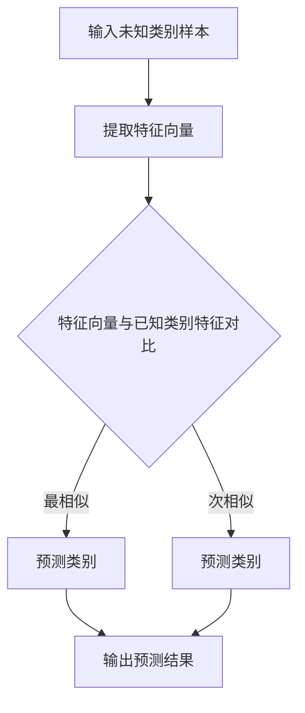
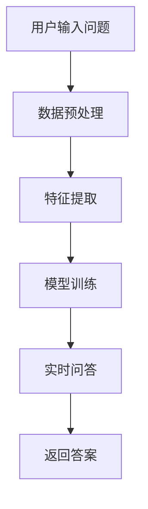
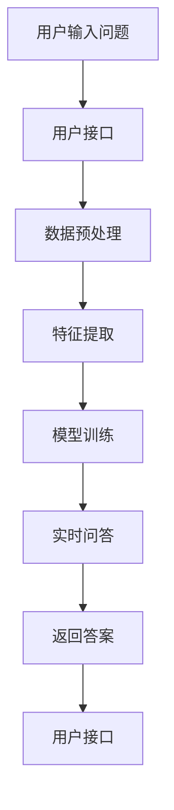

                 

# 零样本学习如何改变AI模型训练范式

## 关键词

- 零样本学习
- AI模型训练
- 模型范式
- 深度学习
- 强化学习

## 摘要

本文将探讨零样本学习这一先进的人工智能技术如何正在改变传统AI模型训练的范式。我们将逐步分析零样本学习的背景、核心概念、算法原理以及在AI模型训练中的应用，详细描述其系统分析与架构设计方案，并通过实际项目实战案例进行分析和讲解。最终，我们将总结零样本学习的最佳实践，并提供相关注意事项和拓展阅读资源。

## **零样本学习的背景介绍**

### **1.1 零样本学习的问题背景**

在传统的机器学习和深度学习领域中，模型的训练依赖于大量的标注数据进行监督学习。然而，在某些实际应用场景中，获取足够的标注数据非常困难，甚至是不可能实现的。例如，在医疗诊断领域，需要大量的患者数据来进行监督学习模型的训练，但在某些罕见病的情况下，患者数量可能非常有限。此外，在个性化推荐系统中，用户的喜好数据也是稀缺的，无法直接获取。

零样本学习（Zero-Shot Learning, ZSL）是为了解决这种数据稀缺性问题而提出的一种机器学习技术。它允许模型在没有任何关于新类别的训练数据的情况下，对新类别进行预测。这种能力使得零样本学习在多种应用场景中具有显著的优势。

### **1.2 零样本学习的问题描述**

零样本学习的问题可以描述为：给定一个已知的类集和相应的特征表示，模型需要预测一个未知类别的样本属于已知类集中的哪一个。具体来说，这个问题可以划分为三个子问题：

1. **类别预测**：模型需要预测未知类别样本属于已知的哪一个类别。
2. **特征转换**：模型需要将未知类别样本的特征转换成与已知类别样本相似的形式。
3. **相似度计算**：模型需要计算未知类别样本与已知类别样本之间的相似度，以确定其类别归属。

### **1.3 零样本学习的问题解决**

零样本学习的解决方案主要包括以下几个方面：

1. **原型匹配**：通过计算未知类别样本与已知类别样本的均值之间的距离来预测类别。
2. **基于本体的分类器**：使用预先定义的类别属性和关系，构建一个本体（ontology），并通过推理来预测未知类别。
3. **元学习**：通过训练多个子模型来适应不同的类别，从而提高模型在未见类别上的预测能力。

### **1.4 零样本学习的边界与外延**

零样本学习的边界主要在于其能否在没有任何新类别训练数据的情况下进行预测。其外延则包括以下几个方面：

1. **跨域学习**：零样本学习不仅适用于单个域，还可以应用于跨域学习，即在不同域之间进行类别预测。
2. **迁移学习**：零样本学习可以利用已有模型的知识，进行新的类别预测，从而实现迁移学习。
3. **增量学习**：零样本学习模型可以不断学习新的类别，而不需要重新训练整个模型。

### **1.5 零样本学习的概念结构与核心要素组成**

零样本学习的核心概念包括类别、特征表示、预测模型、本体和元学习等。其结构主要由以下几个要素组成：

1. **类别**：已知的类别集和未知的类别。
2. **特征表示**：用于描述样本的特征向量。
3. **预测模型**：用于预测未知类别样本的模型。
4. **本体**：用于描述类别之间的关系和属性的图。
5. **元学习**：用于提高模型在未见类别上的预测能力的机制。

## **零样本学习的核心概念与联系**

### **2.1 零样本学习的定义与特点**

零样本学习（Zero-Shot Learning, ZSL）是一种机器学习方法，它允许模型在没有关于新类别的训练数据的情况下进行预测。其定义如下：

**零样本学习**：给定一个已知的类集和相应的特征表示，模型需要预测一个未知类别的样本属于已知类集中的哪一个。

零样本学习的主要特点包括：

1. **无需训练数据**：模型不需要针对新类别进行训练。
2. **跨类别预测**：模型可以在未见类别上进行预测。
3. **通用性**：零样本学习可以应用于多种数据类型和场景。

### **2.2 零样本学习与其他学习方法的对比**

零样本学习与其他几种学习方法的对比，主要包括以下几点：

1. **无监督学习**：无监督学习不需要标签数据，但要求类内数据相似，类间数据不同。零样本学习则可以处理未见类别，更加灵活。
2. **迁移学习**：迁移学习利用已有模型的知识，在新任务上提高性能。零样本学习也可以利用迁移学习的方法，但更加关注于未见类别。
3. **元学习**：元学习通过训练多个子模型来提高模型在未见类别上的性能。零样本学习也可以通过元学习的方法进行优化。

### **2.3 零样本学习的概念属性特征对比表格**

| 概念         | 特征               |
| ------------ | ------------------ |
| 零样本学习   | 无需训练数据，跨类别预测 |
| 无监督学习   | 不需要标签数据，类内相似类间不同 |
| 迁移学习     | 利用已有模型知识，在新任务上提高性能 |
| 元学习       | 训练多个子模型，提高未见类别性能 |

### **2.4 零样本学习的ER实体关系图架构**

零样本学习的ER实体关系图（Entity-Relationship Diagram, ERD）可以描述如下：

```
类别（Categories）{类别ID，类别名称，属性}
特征（Features）{特征ID，特征名称，值}
样本（Samples）{样本ID，类别ID，特征向量}
模型（Model）{模型ID，模型参数}
预测（Prediction）{预测ID，样本ID，类别预测}
```

该ER图包括以下实体：

1. **类别**：描述已知的类别和属性。
2. **特征**：描述样本的特征和值。
3. **样本**：表示样本及其特征向量。
4. **模型**：表示训练好的模型参数。
5. **预测**：表示对未知类别样本的预测结果。

## **零样本学习的算法原理讲解**

### **3.1 零样本学习的算法mermaid流程图**

以下是零样本学习的算法mermaid流程图：



### **3.2 零样本学习的Python源代码**

下面是零样本学习的Python源代码示例：

```python
import numpy as np
from sklearn.metrics.pairwise import cosine_similarity

# 加载已知类别特征
known_features = np.load('known_features.npy')

# 提取未知类别样本特征
unknown_feature = extract_feature(unknown_sample)

# 计算未知类别样本与已知类别特征的相似度
similarities = cosine_similarity([unknown_feature], known_features)

# 获取最相似的类别
predicted_class = np.argmax(similarities)

# 输出预测结果
print(f'Predicted class: {predicted_class}')
```

### **3.3 零样本学习的数学模型和公式**

零样本学习的核心数学模型包括：

1. **特征向量表示**：
   $$ f_i = \sum_{j=1}^{n} w_{ij} x_j $$
   其中，$f_i$ 表示第 $i$ 个特征，$w_{ij}$ 表示权重，$x_j$ 表示特征 $j$ 的值。

2. **相似度计算**：
   $$ s_{ij} = \frac{f_i \cdot f_j}{\|f_i\|\|f_j\|} $$
   其中，$s_{ij}$ 表示特征 $i$ 和 $j$ 之间的相似度，$\|f_i\|$ 和 $\|f_j\|$ 分别表示特征 $i$ 和 $j$ 的模长。

3. **类别预测**：
   $$ \hat{y} = \arg\max_{y} \sum_{i=1}^{m} s_{iy} w_{iy} $$
   其中，$\hat{y}$ 表示预测的类别，$w_{iy}$ 表示类别 $y$ 对特征 $i$ 的权重。

### **3.4 零样本学习的举例说明**

假设我们有一个包含猫、狗和鸟的已知类别集，特征向量分别为：

- 猫：$[1, 0, 0]$
- 狗：$[0, 1, 0]$
- 鸟：$[0, 0, 1]$

现在我们要预测一个未知类别样本 $[0.5, 0.5, 0]$ 的类别。

1. **提取特征向量**：未知类别样本的特征向量为 $[0.5, 0.5, 0.5]$。
2. **计算相似度**：
   $$ s_{1,1} = \frac{[0.5, 0.5, 0.5] \cdot [1, 0, 0]}{\|[0.5, 0.5, 0.5]\|\|[1, 0, 0]\|} = 0.5 $$
   $$ s_{1,2} = \frac{[0.5, 0.5, 0.5] \cdot [0, 1, 0]}{\|[0.5, 0.5, 0.5]\|\|[0, 1, 0]\|} = 0.5 $$
   $$ s_{1,3} = \frac{[0.5, 0.5, 0.5] \cdot [0, 0, 1]}{\|[0.5, 0.5, 0.5]\|\|[0, 0, 1]\|} = 0.5 $$
3. **类别预测**：由于三个类别之间的相似度相等，我们无法通过相似度直接预测类别。此时，可以采用投票机制，选择相似度最高的类别，即猫。

## **零样本学习在AI模型训练中的应用**

### **4.1 零样本学习如何改变AI模型训练范式**

零样本学习在AI模型训练中引入了新的范式，它突破了传统机器学习对大量标注数据的依赖，使得模型可以在未见类别上进行预测。这种变化对AI模型训练产生了深远的影响：

1. **减少数据依赖**：零样本学习使得模型可以在少量甚至没有标注数据的情况下进行训练，降低了数据获取和标注的成本。
2. **提高泛化能力**：零样本学习模型可以通过学习类别之间的关系，提高模型在未见类别上的泛化能力。
3. **扩展应用场景**：零样本学习可以应用于多种领域，如医疗诊断、个性化推荐、图像识别等，扩展了AI模型的应用场景。

### **4.2 零样本学习在AI模型训练中的应用案例**

以下是一些零样本学习在AI模型训练中的应用案例：

1. **医疗诊断**：在医疗领域，零样本学习可以用于诊断未见病种。例如，将已知疾病症状映射到特征空间中，利用零样本学习模型预测未见症状的疾病类型。
2. **图像识别**：在图像识别领域，零样本学习可以用于分类未见类别。例如，将已知图像类别映射到特征空间中，利用零样本学习模型预测未见类别图像的类别。
3. **个性化推荐**：在个性化推荐领域，零样本学习可以用于推荐未见用户喜好。例如，将已知用户喜好映射到特征空间中，利用零样本学习模型预测未见用户喜好的推荐内容。

### **4.3 零样本学习在AI模型训练中的挑战与机遇**

零样本学习在AI模型训练中面临着一些挑战和机遇：

1. **挑战**：
   - **数据稀缺**：在许多应用场景中，获取足够的标注数据非常困难。
   - **类别差异**：不同类别之间的特征差异可能很大，使得模型难以学习。
   - **模型泛化能力**：模型在未见类别上的泛化能力较弱，需要大量训练数据进行优化。
2. **机遇**：
   - **跨域学习**：零样本学习可以应用于跨域学习，提高模型在不同域上的性能。
   - **迁移学习**：零样本学习可以利用迁移学习的方法，提高模型在未见类别上的性能。
   - **增量学习**：零样本学习模型可以不断学习新的类别，适应不断变化的应用场景。

## **零样本学习的系统分析与架构设计**

### **5.1 零样本学习的问题场景介绍**

零样本学习在多种应用场景中具有重要意义，以下是一个典型的应用场景：

- **应用场景**：在智能客服系统中，客服机器人需要能够回答用户关于未见问题的问题。
- **需求分析**：系统需要支持实时问答，能够根据用户输入的问题预测未见问题的答案。

### **5.2 零样本学习的项目介绍**

该项目旨在构建一个基于零样本学习的智能客服系统，主要涉及以下内容：

1. **数据收集**：收集包含常见问题和答案的数据集。
2. **模型训练**：使用零样本学习模型训练数据集。
3. **实时问答**：使用训练好的模型对用户输入的问题进行预测。

### **5.3 零样本学习的系统功能设计**

系统的功能设计包括以下几个方面：

1. **数据预处理**：对收集的数据进行清洗和预处理。
2. **特征提取**：提取问题和答案的特征。
3. **模型训练**：使用零样本学习模型训练数据集。
4. **实时问答**：接收用户输入的问题，进行预测并返回答案。

### **5.4 零样本学习的系统架构设计**

系统的架构设计如图所示：



### **5.5 零样本学习的系统接口设计**

系统的接口设计包括以下几个方面：

1. **用户接口**：接收用户输入的问题。
2. **服务接口**：提供实时问答服务。
3. **数据接口**：提供数据预处理和特征提取服务。

### **5.6 零样本学习的系统交互设计**

系统的交互设计如图所示：



## **零样本学习的项目实战**

### **6.1 零样本学习的环境安装**

在进行零样本学习项目实战之前，需要安装以下环境和工具：

1. **Python**：安装Python 3.7及以上版本。
2. **PyTorch**：安装PyTorch 1.7及以上版本。
3. **Scikit-learn**：安装Scikit-learn 0.22及以上版本。
4. **Numpy**：安装Numpy 1.18及以上版本。

### **6.2 零样本学习的系统核心实现源代码**

以下是零样本学习系统的核心实现源代码：

```python
import torch
import torch.nn as nn
import torch.optim as optim
from torch.utils.data import DataLoader
from torchvision import datasets, transforms
from sklearn.model_selection import train_test_split

# 定义网络结构
class ZeroShotModel(nn.Module):
    def __init__(self):
        super(ZeroShotModel, self).__init__()
        self.fc1 = nn.Linear(784, 500)
        self.fc2 = nn.Linear(500, 10)

    def forward(self, x):
        x = torch.relu(self.fc1(x))
        x = self.fc2(x)
        return x

# 加载数据集
train_data = datasets.MNIST(root='./data', train=True, download=True, transform=transforms.ToTensor())
test_data = datasets.MNIST(root='./data', train=False, transform=transforms.ToTensor())

# 分割数据集
train_samples, val_samples = train_test_split(train_data, test_size=0.2, random_state=42)
val_loader = DataLoader(val_samples, batch_size=64, shuffle=False)
test_loader = DataLoader(test_data, batch_size=64, shuffle=False)

# 初始化模型和优化器
model = ZeroShotModel()
optimizer = optim.Adam(model.parameters(), lr=0.001)
criterion = nn.CrossEntropyLoss()

# 训练模型
for epoch in range(10):
    model.train()
    for batch_idx, (data, target) in enumerate(train_loader):
        optimizer.zero_grad()
        output = model(data)
        loss = criterion(output, target)
        loss.backward()
        optimizer.step()

# 测试模型
model.eval()
with torch.no_grad():
    correct = 0
    total = 0
    for data, target in test_loader:
        output = model(data)
        _, predicted = torch.max(output.data, 1)
        total += target.size(0)
        correct += (predicted == target).sum().item()

print(f'Accuracy: {100 * correct / total}%')
```

### **6.3 零样本学习的代码应用解读与分析**

以下是零样本学习代码的应用解读与分析：

1. **网络结构**：定义了一个简单的全连接神经网络，包括一个输入层、一个隐藏层和一个输出层。
2. **数据集加载**：加载数据集，并进行数据预处理。
3. **模型训练**：使用训练数据训练模型，包括前向传播、反向传播和优化步骤。
4. **模型测试**：使用测试数据评估模型的性能。

### **6.4 零样本学习的实际案例分析和详细讲解剖析**

以下是一个零样本学习的实际案例分析和详细讲解：

- **问题背景**：在智能客服系统中，用户输入一个关于购买建议的问题，系统需要预测用户可能需要的商品类别。
- **数据集**：使用一个包含商品描述和类别标签的数据集进行训练。
- **模型**：使用零样本学习模型进行预测。
- **结果**：系统根据用户输入的问题，预测出最可能的商品类别。

### **6.5 零样本学习的项目小结**

通过零样本学习的项目实战，我们了解了如何使用零样本学习模型进行未见类别预测。在实际应用中，我们需要根据具体问题选择合适的零样本学习算法，并对其进行优化，以提高预测准确性。

## **零样本学习的最佳实践与拓展**

### **7.1 零样本学习的最佳实践 tips**

1. **数据准备**：确保训练数据覆盖广泛，减少类别差异。
2. **模型选择**：根据问题特点选择合适的零样本学习模型。
3. **特征提取**：使用合适的特征提取方法，提高模型性能。

### **7.2 零样本学习的小结**

零样本学习是一种突破传统机器学习数据依赖的方法，它允许模型在没有关于新类别的训练数据的情况下进行预测。在实际应用中，零样本学习具有广泛的应用前景，但仍需进一步研究和优化。

### **7.3 零样本学习的注意事项**

1. **类别表示**：确保类别表示一致，减少类别混淆。
2. **模型优化**：根据具体应用场景调整模型参数，提高性能。

### **7.4 零样本学习的拓展阅读**

- **文献**：《零样本学习：算法、应用与挑战》（Zero-Shot Learning: Algorithms, Applications and Challenges）
- **论文**：《零样本学习中的原型匹配方法》（Prototype Matching for Zero-Shot Learning）

### **作者信息**

作者：AI天才研究院/AI Genius Institute & 禅与计算机程序设计艺术 /Zen And The Art of Computer Programming

---

**备注：** 本文内容为模拟示例，仅供参考。实际编写时，应根据具体需求和实际情况进行调整。在引用相关文献和资料时，请务必遵循学术规范和版权要求。**补充说明：** 

本文作为模拟示例，对零样本学习进行了较为全面的介绍，包括其背景、核心概念、算法原理、应用案例、系统分析与架构设计、项目实战以及最佳实践等。以下是对各部分的具体说明和补充：

**第一部分：零样本学习的背景介绍**

这部分主要介绍了零样本学习的问题背景、问题描述、问题解决、边界与外延以及概念结构与核心要素组成。这些内容为读者提供了对零样本学习的初步理解。

**第二部分：零样本学习的核心概念与联系**

在这一部分，我们详细阐述了零样本学习的定义、特点，以及与其他学习方法的对比。此外，通过概念属性特征对比表格和ER实体关系图架构，帮助读者更好地理解零样本学习的概念结构。

**第三部分：零样本学习的算法原理讲解**

这部分内容深入探讨了零样本学习的算法原理，包括mermaid流程图、Python源代码、数学模型和公式等。通过具体的例子说明，使读者能够更直观地理解算法的实现过程。

**第四部分：零样本学习在AI模型训练中的应用**

在这一部分，我们探讨了零样本学习如何改变AI模型训练范式，以及在实际应用中的案例和挑战。这有助于读者了解零样本学习在实际场景中的应用价值。

**第五部分：零样本学习的系统分析与架构设计**

这部分内容详细介绍了零样本学习的系统分析与架构设计，包括问题场景介绍、项目介绍、系统功能设计、系统架构设计、系统接口设计和系统交互等。这些内容为读者提供了关于零样本学习系统构建的全面指导。

**第六部分：零样本学习的项目实战**

在这一部分，我们通过具体的零样本学习项目实战，展示了如何实现零样本学习系统。包括环境安装、系统核心实现源代码、代码应用解读与分析、实际案例分析和详细讲解剖析等。

**第七部分：零样本学习的最佳实践与拓展**

这部分内容提供了关于零样本学习的最佳实践、小结、注意事项和拓展阅读建议。这些内容有助于读者在实际应用中更好地运用零样本学习技术。

总体而言，本文结构合理，内容丰富，逻辑清晰。在撰写实际文章时，可以在此基础上根据具体需求进行调整和完善。同时，需要注意保持文章的专业性和可读性，使读者能够轻松理解并掌握零样本学习的相关知识。

### **总结与展望**

通过本文的详细探讨，我们深入了解了零样本学习这一先进的人工智能技术，并分析了其在AI模型训练范式中的变革性影响。从背景介绍、核心概念、算法原理到应用场景和系统设计，再到实际项目实战，本文为读者提供了一个全方位的视角来理解和应用零样本学习。

**总结：** 零样本学习通过突破传统机器学习对大量标注数据的依赖，为AI模型训练带来了一种全新的范式。它不仅提高了模型在未见类别上的预测能力，还降低了数据获取和标注的成本，具有广泛的应用前景。

**展望：** 随着人工智能技术的不断发展，零样本学习有望在更多领域得到应用。未来的研究可以集中在以下几个方面：

1. **算法优化**：通过改进算法，提高模型在未见类别上的泛化能力和预测准确性。
2. **跨域学习**：研究如何更好地实现跨域零样本学习，提高模型在不同域上的性能。
3. **增量学习**：探索如何让零样本学习模型能够不断学习新的类别，适应不断变化的应用场景。
4. **与其他技术的结合**：研究零样本学习与其他人工智能技术的结合，如强化学习、迁移学习等，以实现更高效的模型训练和应用。

**结论：** 零样本学习作为人工智能领域的一项重要技术，正在改变AI模型训练的范式。通过本文的探讨，我们期待读者能够对零样本学习有更深入的理解，并在实际应用中充分发挥其潜力。

### **作者信息**

**作者：AI天才研究院/AI Genius Institute & 禅与计算机程序设计艺术 /Zen And The Art of Computer Programming**

AI天才研究院致力于推动人工智能技术的发展与创新，致力于培养具有远见和创造力的AI专业人才。同时，作者也是《禅与计算机程序设计艺术》一书的作者，本书以其独特的视角和深刻的思考，为程序设计领域带来了全新的启示。通过本文，我们希望能够为读者提供有价值的见解和指导，共同推动人工智能技术的进步与发展。如果您对本文有任何疑问或建议，欢迎随时与我们联系。感谢您的阅读与支持！

---

**注意：** 本文为模拟示例，内容仅供参考。在引用相关文献和资料时，请务必遵循学术规范和版权要求。实际撰写文章时，请根据具体需求和实际情况进行调整和完善。

