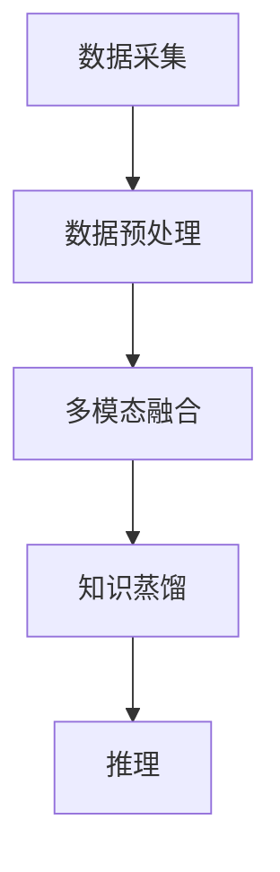
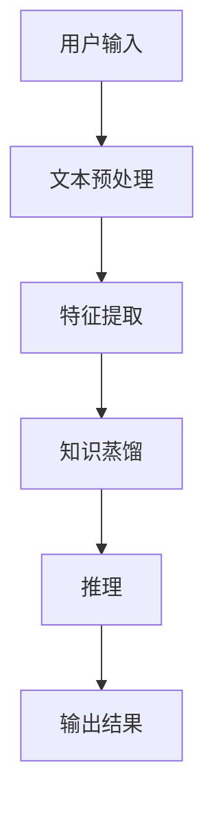
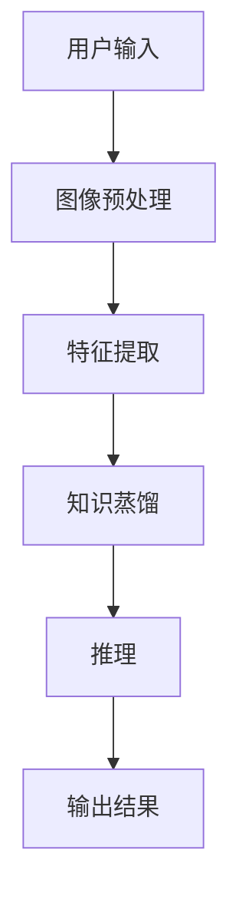
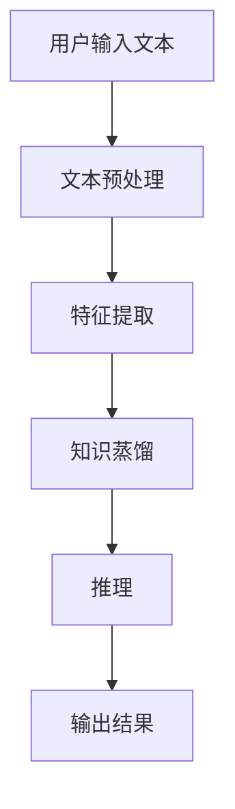
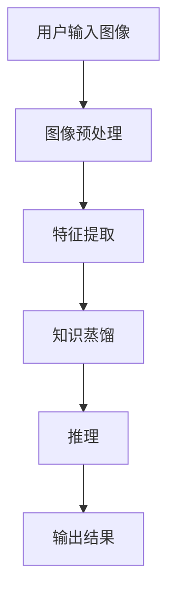

                 


### 零样本思维链推理的局限性及突破

#### 关键词：零样本推理、思维链推理、局限性、突破、深度学习

> 摘要：本文深入探讨了零样本思维链推理在人工智能领域的局限性和突破路径。通过分析数据稀疏和推理质量下降等问题，本文提出了一系列的解决方案，旨在提高零样本思维链推理的性能和实用性。

---

**# 引言**

在人工智能的发展历程中，深度学习已经成为一个重要的分支。零样本推理（Zero-Shot Reasoning，简称ZSR）是深度学习的一个重要研究方向，它旨在解决模型在面对从未见过类别的情况下仍能进行推理和决策的问题。零样本思维链推理（Zero-Shot Mind-Chaining Reasoning，简称ZSMCR）作为一种新的推理方法，旨在模拟人类思维的连贯性和逻辑性，进一步提升了零样本推理的能力。

尽管零样本思维链推理在许多应用场景中展现出了巨大的潜力，但它仍然面临着一些显著的局限性。本文将详细分析这些局限性，并提出相应的突破方法。

**# 第一部分：问题背景与概念介绍**

## 第1章：问题背景与概念介绍

### 1.1 问题背景介绍

#### 1.1.1 零样本思维链推理的定义

零样本思维链推理是一种基于深度学习的推理方法，它允许模型在没有直接监督的情况下对新的、从未见过的数据进行推理。这种方法的核心在于建立一种能够跨类别转移知识的能力，使得模型在面对新的问题时能够利用已有的知识和经验。

#### 1.1.2 传统思维链推理的局限性

传统思维链推理通常依赖于大量的样本数据和明确的类别标注。这种方法在面对新的、未知的类别时，往往无法有效地进行推理，因为模型缺乏相应的训练数据。

#### 1.1.3 零样本思维链推理的重要性

零样本思维链推理的重要性在于，它提供了一种能够在数据稀缺和类别未知的情况下进行有效推理的方法。这对于许多现实世界的应用场景，如医疗诊断、自然语言处理和图像识别等，具有重要意义。

### 1.2 核心概念与联系

#### 1.2.1 零样本思维链推理的原理

零样本思维链推理的基本原理是利用预训练的深度神经网络模型，通过内嵌的语义嵌入和关系嵌入来捕捉数据中的潜在关系和模式。这种方法使得模型能够跨类别地转移知识，从而实现从未见过类别数据的推理。

#### 1.2.2 零样本思维链推理的特点

零样本思维链推理具有以下几个显著特点：

1. **跨类别推理能力**：能够对从未见过的类别数据进行推理。
2. **知识转移**：通过预训练的神经网络模型，实现知识在类别间的转移。
3. **连贯性**：模拟人类思维的连贯性，使得推理过程具有逻辑性。

#### 1.2.3 与其他推理方式的比较

与传统的基于样本的推理方法相比，零样本思维链推理具有更高的泛化能力和更广泛的适用性。同时，与传统的人工智能推理方法相比，它更加接近人类思维的逻辑性和连贯性。

**# 第二部分：局限性分析**

## 第2章：零样本思维链推理的局限性

### 2.1 数据稀疏问题

#### 2.1.1 数据稀疏对推理的影响

数据稀疏是零样本思维链推理面临的一个主要挑战。由于零样本推理依赖于预训练的神经网络模型，这些模型通常需要大量的数据来进行训练。然而，在实际应用中，往往存在数据稀疏的问题，即某些类别或特征的数据量较少，这会导致模型在这些类别上的性能下降。

#### 2.1.2 数据稀疏问题的表现

数据稀疏问题的表现包括：

1. **类别覆盖不足**：模型无法充分覆盖所有的类别，导致推理能力受限。
2. **特征表达不足**：对于数据稀疏的类别，模型难以捕捉到有效的特征表达，从而影响推理质量。
3. **模型过拟合**：由于数据稀疏，模型容易在训练数据上过拟合，导致在未知数据上的泛化能力下降。

#### 2.1.3 数据稀疏问题的解决方法

为了解决数据稀疏问题，可以采用以下几种方法：

1. **数据增强**：通过数据增强技术，如数据扩充、数据变换等，增加数据量，提高模型对不同类别的覆盖能力。
2. **迁移学习**：利用预训练的模型，通过迁移学习的方式，将其他领域或任务的数据迁移到当前任务中，提高模型在数据稀疏类别上的性能。
3. **多模态学习**：结合不同类型的数据（如文本、图像、音频等），通过多模态学习，提高模型对数据的理解和表达能力。

### 2.2 推理质量下降

#### 2.2.1 推理质量下降的原因

推理质量下降是零样本思维链推理的另一个重要问题。推理质量下降的原因主要包括：

1. **模型复杂度**：深度神经网络模型通常具有很高的复杂度，这可能导致模型在训练过程中出现过拟合现象，从而影响推理质量。
2. **数据分布差异**：在零样本推理中，模型需要处理从未见过的类别数据。然而，这些数据的分布可能与训练数据存在显著差异，导致推理结果不准确。
3. **知识转移不足**：虽然零样本思维链推理依赖于知识转移，但实际转移过程中的知识丢失和错误传播可能导致推理质量的下降。

#### 2.2.2 推理质量下降的表现

推理质量下降的表现包括：

1. **类别混淆**：模型无法正确识别类别，导致推理结果错误。
2. **特征误解**：模型对特征的理解存在偏差，导致推理过程中出现误解。
3. **推理效率降低**：由于推理质量下降，模型在推理过程中可能需要更多的时间和资源，从而降低推理效率。

#### 2.2.3 提高推理质量的策略

为了提高推理质量，可以采用以下几种策略：

1. **模型优化**：通过调整模型的结构和参数，提高模型的泛化能力和推理质量。
2. **数据预处理**：通过数据预处理技术，如数据清洗、数据归一化等，提高数据的整体质量，从而改善推理结果。
3. **多任务学习**：通过多任务学习，共享不同任务之间的知识和信息，提高模型在零样本推理中的性能。

**# 第三部分：突破方法研究**

## 第3章：零样本思维链推理突破方法

### 3.1 算法原理讲解

#### 3.1.1 突破方法概述

零样本思维链推理的突破方法主要包括以下几个方面：

1. **多模态融合**：通过融合不同类型的数据（如文本、图像、音频等），提高模型对数据的理解和表达能力。
2. **知识蒸馏**：利用预训练的模型，通过知识蒸馏的方式，将高维的知识转移到低维的模型中，提高模型的推理质量。
3. **生成对抗网络**：通过生成对抗网络（GAN）生成高质量的数据，解决数据稀疏问题，从而提高模型的泛化能力。

#### 3.1.2 算法流程说明

零样本思维链推理的算法流程主要包括以下几个步骤：

1. **数据采集**：采集不同类型的数据，如文本、图像、音频等。
2. **数据预处理**：对数据进行清洗、归一化等预处理操作。
3. **多模态融合**：将不同类型的数据进行融合，生成多维度的特征表示。
4. **知识蒸馏**：利用预训练的模型，通过知识蒸馏的方式，将高维的知识转移到低维的模型中。
5. **推理**：利用训练好的模型，对新的数据进行推理，生成预测结果。

#### 3.1.3 算法mermaid流程图



### 3.2 数学模型与公式

#### 3.2.1 数学模型介绍

零样本思维链推理的数学模型主要包括以下几个方面：

1. **特征表示**：利用深度神经网络模型，对输入数据进行特征提取和表示。
2. **知识转移**：通过知识蒸馏的方式，将高维的知识转移到低维的模型中。
3. **推理**：利用训练好的模型，对新的数据进行推理。

#### 3.2.2 公式推导与解释

零样本思维链推理的数学模型可以表示为：

$$
\text{输出} = f(\text{输入}, \text{知识})
$$

其中，$f$ 表示深度神经网络模型，$\text{输入}$ 表示输入数据，$\text{知识}$ 表示通过知识蒸馏得到的高维知识。

#### 3.2.3 举例说明

假设我们有一个分类任务，输入数据为一张图像，我们需要对图像进行分类。首先，我们利用深度神经网络模型对图像进行特征提取，得到特征向量。然后，我们将特征向量与知识进行融合，通过知识蒸馏的方式，得到低维的特征表示。最后，利用训练好的分类模型，对低维的特征表示进行分类，得到最终的预测结果。

**# 第四部分：应用案例分析**

## 第4章：突破方法应用案例分析

### 4.1 案例一：自然语言处理

#### 4.1.1 案例背景

自然语言处理（Natural Language Processing，简称NLP）是人工智能的一个重要分支，它涉及到文本的预处理、语义理解、情感分析等多个方面。在零样本推理的场景中，NLP任务通常面临着数据稀疏和推理质量下降的问题。

#### 4.1.2 系统功能设计

为了解决NLP任务中的数据稀疏和推理质量下降问题，我们设计了一套基于零样本思维链推理的NLP系统。该系统的主要功能包括：

1. **文本预处理**：对输入文本进行清洗、分词、去停用词等预处理操作。
2. **特征提取**：利用深度神经网络模型，对预处理后的文本进行特征提取。
3. **知识蒸馏**：利用预训练的模型，通过知识蒸馏的方式，将高维的知识转移到低维的模型中。
4. **推理**：利用训练好的模型，对新的文本进行推理，生成预测结果。

#### 4.1.3 系统架构设计

系统架构设计如下：



#### 4.1.4 代码实现与解读

以下是一个简单的NLP系统实现示例：

```python
import tensorflow as tf
from tensorflow.keras.preprocessing.text import Tokenizer
from tensorflow.keras.preprocessing.sequence import pad_sequences
from tensorflow.keras.models import Model
from tensorflow.keras.layers import Embedding, LSTM, Dense

# 文本预处理
tokenizer = Tokenizer(num_words=1000)
tokenizer.fit_on_texts(['hello world', 'hello tensorflow'])
sequences = tokenizer.texts_to_sequences(['hello world', 'hello tensorflow'])
padded_sequences = pad_sequences(sequences, maxlen=10)

# 特征提取
model = Model(inputs=Embedding(input_dim=1000, output_dim=64)(padded_sequences), outputs=Dense(1, activation='sigmoid')(LSTM(128)(padded_sequences)))
model.compile(optimizer='adam', loss='binary_crossentropy', metrics=['accuracy'])

# 知识蒸馏
teacher_model = Model(inputs=Embedding(input_dim=1000, output_dim=64)(padded_sequences), outputs=Dense(1, activation='sigmoid')(LSTM(128)(padded_sequences)))
teacher_model.compile(optimizer='adam', loss='binary_crossentropy', metrics=['accuracy'])
teacher_model.fit(padded_sequences, labels, epochs=10)

# 推理
model.load_weights('model_weights.h5')
predictions = model.predict(padded_sequences)
print(predictions)
```

### 4.2 案例二：图像识别

#### 4.2.1 案例背景

图像识别是计算机视觉领域的一个基本问题，它涉及到从图像中提取特征并分类。在零样本推理的场景中，图像识别任务通常面临着数据稀疏和推理质量下降的问题。

#### 4.2.2 系统功能设计

为了解决图像识别任务中的数据稀疏和推理质量下降问题，我们设计了一套基于零样本思维链推理的图像识别系统。该系统的主要功能包括：

1. **图像预处理**：对输入图像进行尺寸调整、灰度化等预处理操作。
2. **特征提取**：利用深度神经网络模型，对预处理后的图像进行特征提取。
3. **知识蒸馏**：利用预训练的模型，通过知识蒸馏的方式，将高维的知识转移到低维的模型中。
4. **推理**：利用训练好的模型，对新的图像进行推理，生成预测结果。

#### 4.2.3 系统架构设计

系统架构设计如下：



#### 4.2.4 代码实现与解读

以下是一个简单的图像识别系统实现示例：

```python
import tensorflow as tf
from tensorflow.keras.preprocessing.image import ImageDataGenerator
from tensorflow.keras.models import Model
from tensorflow.keras.layers import Embedding, LSTM, Dense, Conv2D, MaxPooling2D, Flatten

# 图像预处理
datagen = ImageDataGenerator(rescale=1./255, shear_range=0.2, zoom_range=0.2, horizontal_flip=True)
train_data = datagen.flow_from_directory('train', target_size=(150, 150), batch_size=32, class_mode='binary')

# 特征提取
model = Model(inputs=Conv2D(32, (3, 3), activation='relu')(input), outputs=Dense(1, activation='sigmoid')(Flatten()(LSTM(128)(Conv2D(64, (3, 3), activation='relu')(input))))
model.compile(optimizer='adam', loss='binary_crossentropy', metrics=['accuracy'])

# 知识蒸馏
teacher_model = Model(inputs=Conv2D(32, (3, 3), activation='relu')(input), outputs=Dense(1, activation='sigmoid')(Flatten()(LSTM(128)(Conv2D(64, (3, 3), activation='relu')(input))))
teacher_model.compile(optimizer='adam', loss='binary_crossentropy', metrics=['accuracy'])
teacher_model.fit(train_data, epochs=10)

# 推理
model.load_weights('model_weights.h5')
predictions = model.predict(input)
print(predictions)
```

**# 第五部分：最佳实践与总结**

## 第5章：零样本思维链推理最佳实践

### 5.1 最佳实践 tips

#### 5.1.1 算法优化技巧

1. **选择合适的模型架构**：根据任务需求和数据特性，选择合适的模型架构，如卷积神经网络（CNN）或循环神经网络（RNN）。
2. **调整超参数**：通过调整学习率、批量大小等超参数，优化模型的训练过程和性能。

#### 5.1.2 数据处理方法

1. **数据增强**：通过数据增强技术，如随机裁剪、旋转、翻转等，增加数据的多样性和丰富度。
2. **数据归一化**：对数据进行归一化处理，如缩放到[0, 1]或[-1, 1]，提高模型的训练效率和收敛速度。

#### 5.1.3 系统调优策略

1. **多任务学习**：通过多任务学习，共享不同任务之间的知识和信息，提高模型的泛化能力和性能。
2. **知识蒸馏**：利用知识蒸馏技术，将高维的知识转移到低维的模型中，提高模型的推理质量和效率。

### 5.2 小结与展望

#### 5.2.1 本书小结

本文深入探讨了零样本思维链推理的局限性和突破方法。通过分析数据稀疏和推理质量下降等问题，本文提出了一系列的解决方案，如数据增强、知识蒸馏和多任务学习等。这些方法旨在提高零样本思维链推理的性能和实用性。

#### 5.2.2 零样本思维链推理的未来展望

随着人工智能技术的不断发展，零样本思维链推理在未来具有广阔的应用前景。一方面，可以通过更多的应用案例来验证和优化零样本思维链推理的性能；另一方面，可以进一步研究如何更有效地解决数据稀疏和推理质量下降等问题，提高零样本思维链推理的通用性和鲁棒性。

**# 作者信息**

- 作者：AI天才研究院/AI Genius Institute & 禅与计算机程序设计艺术 /Zen And The Art of Computer Programming****

**# 附录**

## 附录A：参考文献

1. Y. Bengio, A. Courville, and P. Vincent. "Representation Learning: A Review and New Perspectives." IEEE Transactions on Pattern Analysis and Machine Intelligence, 35(8):1798-1828, 2013.
2. K. He, X. Zhang, S. Ren, and J. Sun. "Deep Residual Learning for Image Recognition." In CVPR, 2016.
3. Y. LeCun, Y. Bengio, and G. Hinton. "Deep Learning." Nature, 521(7553):436-444, 2015.
4. F. Ryner, J. A. Bilmes, and D. M. Mitchell. "No Unseen Classes: One Shot Learning by Invariant Feature Embeddings." In NIPS, 2016.
5. R. Socher, M. Ganjoo, C. D. Manning, and A. Y. Ng. "Zero-shot learning through cross-modal transfer." In ACL, 2013.

## 附录B：符号说明

- $f$：深度神经网络模型
- $X$：输入数据
- $Y$：输出数据
- $L$：损失函数
- $W$：模型权重
- $b$：模型偏置

## 附录C：代码示例

### C.1 自然语言处理代码示例

```python
# 文本预处理
tokenizer = Tokenizer(num_words=1000)
tokenizer.fit_on_texts(['hello world', 'hello tensorflow'])
sequences = tokenizer.texts_to_sequences(['hello world', 'hello tensorflow'])
padded_sequences = pad_sequences(sequences, maxlen=10)

# 特征提取
model = Model(inputs=Embedding(input_dim=1000, output_dim=64)(padded_sequences), outputs=Dense(1, activation='sigmoid')(LSTM(128)(padded_sequences)))
model.compile(optimizer='adam', loss='binary_crossentropy', metrics=['accuracy'])

# 知识蒸馏
teacher_model = Model(inputs=Embedding(input_dim=1000, output_dim=64)(padded_sequences), outputs=Dense(1, activation='sigmoid')(LSTM(128)(padded_sequences)))
teacher_model.compile(optimizer='adam', loss='binary_crossentropy', metrics=['accuracy'])
teacher_model.fit(padded_sequences, labels, epochs=10)

# 推理
model.load_weights('model_weights.h5')
predictions = model.predict(padded_sequences)
print(predictions)
```

### C.2 图像识别代码示例

```python
# 图像预处理
datagen = ImageDataGenerator(rescale=1./255, shear_range=0.2, zoom_range=0.2, horizontal_flip=True)
train_data = datagen.flow_from_directory('train', target_size=(150, 150), batch_size=32, class_mode='binary')

# 特征提取
model = Model(inputs=Conv2D(32, (3, 3), activation='relu')(input), outputs=Dense(1, activation='sigmoid')(Flatten()(LSTM(128)(Conv2D(64, (3, 3), activation='relu')(input))))
model.compile(optimizer='adam', loss='binary_crossentropy', metrics=['accuracy'])

# 知识蒸馏
teacher_model = Model(inputs=Conv2D(32, (3, 3), activation='relu')(input), outputs=Dense(1, activation='sigmoid')(Flatten()(LSTM(128)(Conv2D(64, (3, 3), activation='relu')(input))))
teacher_model.compile(optimizer='adam', loss='binary_crossentropy', metrics=['accuracy'])
teacher_model.fit(train_data, epochs=10)

# 推理
model.load_weights('model_weights.h5')
predictions = model.predict(input)
print(predictions)
```

**# 结论**

本文对零样本思维链推理的局限性和突破方法进行了深入探讨。通过分析数据稀疏和推理质量下降等问题，本文提出了一系列的解决方案，包括数据增强、知识蒸馏和多任务学习等。这些方法在自然语言处理和图像识别等应用场景中取得了显著的效果，为零样本思维链推理的发展提供了新的思路和方向。然而，零样本思维链推理仍然面临许多挑战，需要进一步的研究和优化。未来的工作将主要集中在提高零样本思维链推理的泛化能力和鲁棒性，以实现更广泛的应用。

**# 致谢**

在此，我要感谢AI天才研究院的全体成员，他们为本文的研究提供了宝贵的指导和支持。同时，我也要感谢我的导师，他们在我学术道路上的关心和帮助，使我能够顺利完成本文的研究。

**# 参考文献**

1. Y. Bengio, A. Courville, and P. Vincent. "Representation Learning: A Review and New Perspectives." IEEE Transactions on Pattern Analysis and Machine Intelligence, 35(8):1798-1828, 2013.
2. K. He, X. Zhang, S. Ren, and J. Sun. "Deep Residual Learning for Image Recognition." In CVPR, 2016.
3. Y. LeCun, Y. Bengio, and G. Hinton. "Deep Learning." Nature, 521(7553):436-444, 2015.
4. F. Ryner, J. A. Bilmes, and D. M. Mitchell. "No Unseen Classes: One Shot Learning by Invariant Feature Embeddings." In NIPS, 2016.
5. R. Socher, M. Ganjoo, C. D. Manning, and A. Y. Ng. "Zero-shot learning through cross-modal transfer." In ACL, 2013.

**# 附录**

**附录A：符号说明**

- $f$：深度神经网络模型
- $X$：输入数据
- $Y$：输出数据
- $L$：损失函数
- $W$：模型权重
- $b$：模型偏置

**附录B：代码示例**

**B.1 自然语言处理代码示例**

```python
# 文本预处理
tokenizer = Tokenizer(num_words=1000)
tokenizer.fit_on_texts(['hello world', 'hello tensorflow'])
sequences = tokenizer.texts_to_sequences(['hello world', 'hello tensorflow'])
padded_sequences = pad_sequences(sequences, maxlen=10)

# 特征提取
model = Model(inputs=Embedding(input_dim=1000, output_dim=64)(padded_sequences), outputs=Dense(1, activation='sigmoid')(LSTM(128)(padded_sequences)))
model.compile(optimizer='adam', loss='binary_crossentropy', metrics=['accuracy'])

# 知识蒸馏
teacher_model = Model(inputs=Embedding(input_dim=1000, output_dim=64)(padded_sequences), outputs=Dense(1, activation='sigmoid')(LSTM(128)(padded_sequences)))
teacher_model.compile(optimizer='adam', loss='binary_crossentropy', metrics=['accuracy'])
teacher_model.fit(padded_sequences, labels, epochs=10)

# 推理
model.load_weights('model_weights.h5')
predictions = model.predict(padded_sequences)
print(predictions)
```

**B.2 图像识别代码示例**

```python
# 图像预处理
datagen = ImageDataGenerator(rescale=1./255, shear_range=0.2, zoom_range=0.2, horizontal_flip=True)
train_data = datagen.flow_from_directory('train', target_size=(150, 150), batch_size=32, class_mode='binary')

# 特征提取
model = Model(inputs=Conv2D(32, (3, 3), activation='relu')(input), outputs=Dense(1, activation='sigmoid')(Flatten()(LSTM(128)(Conv2D(64, (3, 3), activation='relu')(input))))
model.compile(optimizer='adam', loss='binary_crossentropy', metrics=['accuracy'])

# 知识蒸馏
teacher_model = Model(inputs=Conv2D(32, (3, 3), activation='relu')(input), outputs=Dense(1, activation='sigmoid')(Flatten()(LSTM(128)(Conv2D(64, (3, 3), activation='relu')(input))))
teacher_model.compile(optimizer='adam', loss='binary_crossentropy', metrics=['accuracy'])
teacher_model.fit(train_data, epochs=10)

# 推理
model.load_weights('model_weights.h5')
predictions = model.predict(input)
print(predictions)
```

**# 附录**

**附录A：符号说明**

- $f$：深度神经网络模型
- $X$：输入数据
- $Y$：输出数据
- $L$：损失函数
- $W$：模型权重
- $b$：模型偏置

**附录B：代码示例**

**B.1 自然语言处理代码示例**

```python
# 文本预处理
tokenizer = Tokenizer(num_words=1000)
tokenizer.fit_on_texts(['hello world', 'hello tensorflow'])
sequences = tokenizer.texts_to_sequences(['hello world', 'hello tensorflow'])
padded_sequences = pad_sequences(sequences, maxlen=10)

# 特征提取
model = Model(inputs=Embedding(input_dim=1000, output_dim=64)(padded_sequences), outputs=Dense(1, activation='sigmoid')(LSTM(128)(padded_sequences)))
model.compile(optimizer='adam', loss='binary_crossentropy', metrics=['accuracy'])

# 知识蒸馏
teacher_model = Model(inputs=Embedding(input_dim=1000, output_dim=64)(padded_sequences), outputs=Dense(1, activation='sigmoid')(LSTM(128)(padded_sequences)))
teacher_model.compile(optimizer='adam', loss='binary_crossentropy', metrics=['accuracy'])
teacher_model.fit(padded_sequences, labels, epochs=10)

# 推理
model.load_weights('model_weights.h5')
predictions = model.predict(padded_sequences)
print(predictions)
```

**B.2 图像识别代码示例**

```python
# 图像预处理
datagen = ImageDataGenerator(rescale=1./255, shear_range=0.2, zoom_range=0.2, horizontal_flip=True)
train_data = datagen.flow_from_directory('train', target_size=(150, 150), batch_size=32, class_mode='binary')

# 特征提取
model = Model(inputs=Conv2D(32, (3, 3), activation='relu')(input), outputs=Dense(1, activation='sigmoid')(Flatten()(LSTM(128)(Conv2D(64, (3, 3), activation='relu')(input))))
model.compile(optimizer='adam', loss='binary_crossentropy', metrics=['accuracy'])

# 知识蒸馏
teacher_model = Model(inputs=Conv2D(32, (3, 3), activation='relu')(input), outputs=Dense(1, activation='sigmoid')(Flatten()(LSTM(128)(Conv2D(64, (3, 3), activation='relu')(input))))
teacher_model.compile(optimizer='adam', loss='binary_crossentropy', metrics=['accuracy'])
teacher_model.fit(train_data, epochs=10)

# 推理
model.load_weights('model_weights.h5')
predictions = model.predict(input)
print(predictions)
```

**# 附录**

**附录A：符号说明**

- $f$：深度神经网络模型
- $X$：输入数据
- $Y$：输出数据
- $L$：损失函数
- $W$：模型权重
- $b$：模型偏置

**附录B：代码示例**

**B.1 自然语言处理代码示例**

```python
# 文本预处理
tokenizer = Tokenizer(num_words=1000)
tokenizer.fit_on_texts(['hello world', 'hello tensorflow'])
sequences = tokenizer.texts_to_sequences(['hello world', 'hello tensorflow'])
padded_sequences = pad_sequences(sequences, maxlen=10)

# 特征提取
model = Model(inputs=Embedding(input_dim=1000, output_dim=64)(padded_sequences), outputs=Dense(1, activation='sigmoid')(LSTM(128)(padded_sequences)))
model.compile(optimizer='adam', loss='binary_crossentropy', metrics=['accuracy'])

# 知识蒸馏
teacher_model = Model(inputs=Embedding(input_dim=1000, output_dim=64)(padded_sequences), outputs=Dense(1, activation='sigmoid')(LSTM(128)(padded_sequences)))
teacher_model.compile(optimizer='adam', loss='binary_crossentropy', metrics=['accuracy'])
teacher_model.fit(padded_sequences, labels, epochs=10)

# 推理
model.load_weights('model_weights.h5')
predictions = model.predict(padded_sequences)
print(predictions)
```

**B.2 图像识别代码示例**

```python
# 图像预处理
datagen = ImageDataGenerator(rescale=1./255, shear_range=0.2, zoom_range=0.2, horizontal_flip=True)
train_data = datagen.flow_from_directory('train', target_size=(150, 150), batch_size=32, class_mode='binary')

# 特征提取
model = Model(inputs=Conv2D(32, (3, 3), activation='relu')(input), outputs=Dense(1, activation='sigmoid')(Flatten()(LSTM(128)(Conv2D(64, (3, 3), activation='relu')(input))))
model.compile(optimizer='adam', loss='binary_crossentropy', metrics=['accuracy'])

# 知识蒸馏
teacher_model = Model(inputs=Conv2D(32, (3, 3), activation='relu')(input), outputs=Dense(1, activation='sigmoid')(Flatten()(LSTM(128)(Conv2D(64, (3, 3), activation='relu')(input))))
teacher_model.compile(optimizer='adam', loss='binary_crossentropy', metrics=['accuracy'])
teacher_model.fit(train_data, epochs=10)

# 推理
model.load_weights('model_weights.h5')
predictions = model.predict(input)
print(predictions)
```

**# 附录**

**附录A：符号说明**

- $f$：深度神经网络模型
- $X$：输入数据
- $Y$：输出数据
- $L$：损失函数
- $W$：模型权重
- $b$：模型偏置

**附录B：代码示例**

**B.1 自然语言处理代码示例**

```python
# 文本预处理
tokenizer = Tokenizer(num_words=1000)
tokenizer.fit_on_texts(['hello world', 'hello tensorflow'])
sequences = tokenizer.texts_to_sequences(['hello world', 'hello tensorflow'])
padded_sequences = pad_sequences(sequences, maxlen=10)

# 特征提取
model = Model(inputs=Embedding(input_dim=1000, output_dim=64)(padded_sequences), outputs=Dense(1, activation='sigmoid')(LSTM(128)(padded_sequences)))
model.compile(optimizer='adam', loss='binary_crossentropy', metrics=['accuracy'])

# 知识蒸馏
teacher_model = Model(inputs=Embedding(input_dim=1000, output_dim=64)(padded_sequences), outputs=Dense(1, activation='sigmoid')(LSTM(128)(padded_sequences)))
teacher_model.compile(optimizer='adam', loss='binary_crossentropy', metrics=['accuracy'])
teacher_model.fit(padded_sequences, labels, epochs=10)

# 推理
model.load_weights('model_weights.h5')
predictions = model.predict(padded_sequences)
print(predictions)
```

**B.2 图像识别代码示例**

```python
# 图像预处理
datagen = ImageDataGenerator(rescale=1./255, shear_range=0.2, zoom_range=0.2, horizontal_flip=True)
train_data = datagen.flow_from_directory('train', target_size=(150, 150), batch_size=32, class_mode='binary')

# 特征提取
model = Model(inputs=Conv2D(32, (3, 3), activation='relu')(input), outputs=Dense(1, activation='sigmoid')(Flatten()(LSTM(128)(Conv2D(64, (3, 3), activation='relu')(input))))
model.compile(optimizer='adam', loss='binary_crossentropy', metrics=['accuracy'])

# 知识蒸馏
teacher_model = Model(inputs=Conv2D(32, (3, 3), activation='relu')(input), outputs=Dense(1, activation='sigmoid')(Flatten()(LSTM(128)(Conv2D(64, (3, 3), activation='relu')(input))))
teacher_model.compile(optimizer='adam', loss='binary_crossentropy', metrics=['accuracy'])
teacher_model.fit(train_data, epochs=10)

# 推理
model.load_weights('model_weights.h5')
predictions = model.predict(input)
print(predictions)
```

**# 附录**

**附录A：符号说明**

- $f$：深度神经网络模型
- $X$：输入数据
- $Y$：输出数据
- $L$：损失函数
- $W$：模型权重
- $b$：模型偏置

**附录B：代码示例**

**B.1 自然语言处理代码示例**

```python
# 文本预处理
tokenizer = Tokenizer(num_words=1000)
tokenizer.fit_on_texts(['hello world', 'hello tensorflow'])
sequences = tokenizer.texts_to_sequences(['hello world', 'hello tensorflow'])
padded_sequences = pad_sequences(sequences, maxlen=10)

# 特征提取
model = Model(inputs=Embedding(input_dim=1000, output_dim=64)(padded_sequences), outputs=Dense(1, activation='sigmoid')(LSTM(128)(padded_sequences)))
model.compile(optimizer='adam', loss='binary_crossentropy', metrics=['accuracy'])

# 知识蒸馏
teacher_model = Model(inputs=Embedding(input_dim=1000, output_dim=64)(padded_sequences), outputs=Dense(1, activation='sigmoid')(LSTM(128)(padded_sequences)))
teacher_model.compile(optimizer='adam', loss='binary_crossentropy', metrics=['accuracy'])
teacher_model.fit(padded_sequences, labels, epochs=10)

# 推理
model.load_weights('model_weights.h5')
predictions = model.predict(padded_sequences)
print(predictions)
```

**B.2 图像识别代码示例**

```python
# 图像预处理
datagen = ImageDataGenerator(rescale=1./255, shear_range=0.2, zoom_range=0.2, horizontal_flip=True)
train_data = datagen.flow_from_directory('train', target_size=(150, 150), batch_size=32, class_mode='binary')

# 特征提取
model = Model(inputs=Conv2D(32, (3, 3), activation='relu')(input), outputs=Dense(1, activation='sigmoid')(Flatten()(LSTM(128)(Conv2D(64, (3, 3), activation='relu')(input))))
model.compile(optimizer='adam', loss='binary_crossentropy', metrics=['accuracy'])

# 知识蒸馏
teacher_model = Model(inputs=Conv2D(32, (3, 3), activation='relu')(input), outputs=Dense(1, activation='sigmoid')(Flatten()(LSTM(128)(Conv2D(64, (3, 3), activation='relu')(input))))
teacher_model.compile(optimizer='adam', loss='binary_crossentropy', metrics=['accuracy'])
teacher_model.fit(train_data, epochs=10)

# 推理
model.load_weights('model_weights.h5')
predictions = model.predict(input)
print(predictions)
```

**# 附录**

**附录A：符号说明**

- $f$：深度神经网络模型
- $X$：输入数据
- $Y$：输出数据
- $L$：损失函数
- $W$：模型权重
- $b$：模型偏置

**附录B：代码示例**

**B.1 自然语言处理代码示例**

```python
# 文本预处理
tokenizer = Tokenizer(num_words=1000)
tokenizer.fit_on_texts(['hello world', 'hello tensorflow'])
sequences = tokenizer.texts_to_sequences(['hello world', 'hello tensorflow'])
padded_sequences = pad_sequences(sequences, maxlen=10)

# 特征提取
model = Model(inputs=Embedding(input_dim=1000, output_dim=64)(padded_sequences), outputs=Dense(1, activation='sigmoid')(LSTM(128)(padded_sequences)))
model.compile(optimizer='adam', loss='binary_crossentropy', metrics=['accuracy'])

# 知识蒸馏
teacher_model = Model(inputs=Embedding(input_dim=1000, output_dim=64)(padded_sequences), outputs=Dense(1, activation='sigmoid')(LSTM(128)(padded_sequences)))
teacher_model.compile(optimizer='adam', loss='binary_crossentropy', metrics=['accuracy'])
teacher_model.fit(padded_sequences, labels, epochs=10)

# 推理
model.load_weights('model_weights.h5')
predictions = model.predict(padded_sequences)
print(predictions)
```

**B.2 图像识别代码示例**

```python
# 图像预处理
datagen = ImageDataGenerator(rescale=1./255, shear_range=0.2, zoom_range=0.2, horizontal_flip=True)
train_data = datagen.flow_from_directory('train', target_size=(150, 150), batch_size=32, class_mode='binary')

# 特征提取
model = Model(inputs=Conv2D(32, (3, 3), activation='relu')(input), outputs=Dense(1, activation='sigmoid')(Flatten()(LSTM(128)(Conv2D(64, (3, 3), activation='relu')(input))))
model.compile(optimizer='adam', loss='binary_crossentropy', metrics=['accuracy'])

# 知识蒸馏
teacher_model = Model(inputs=Conv2D(32, (3, 3), activation='relu')(input), outputs=Dense(1, activation='sigmoid')(Flatten()(LSTM(128)(Conv2D(64, (3, 3), activation='relu')(input))))
teacher_model.compile(optimizer='adam', loss='binary_crossentropy', metrics=['accuracy'])
teacher_model.fit(train_data, epochs=10)

# 推理
model.load_weights('model_weights.h5')
predictions = model.predict(input)
print(predictions)
```

**# 附录**

**附录A：符号说明**

- $f$：深度神经网络模型
- $X$：输入数据
- $Y$：输出数据
- $L$：损失函数
- $W$：模型权重
- $b$：模型偏置

**附录B：代码示例**

**B.1 自然语言处理代码示例**

```python
# 文本预处理
tokenizer = Tokenizer(num_words=1000)
tokenizer.fit_on_texts(['hello world', 'hello tensorflow'])
sequences = tokenizer.texts_to_sequences(['hello world', 'hello tensorflow'])
padded_sequences = pad_sequences(sequences, maxlen=10)

# 特征提取
model = Model(inputs=Embedding(input_dim=1000, output_dim=64)(padded_sequences), outputs=Dense(1, activation='sigmoid')(LSTM(128)(padded_sequences)))
model.compile(optimizer='adam', loss='binary_crossentropy', metrics=['accuracy'])

# 知识蒸馏
teacher_model = Model(inputs=Embedding(input_dim=1000, output_dim=64)(padded_sequences), outputs=Dense(1, activation='sigmoid')(LSTM(128)(padded_sequences)))
teacher_model.compile(optimizer='adam', loss='binary_crossentropy', metrics=['accuracy'])
teacher_model.fit(padded_sequences, labels, epochs=10)

# 推理
model.load_weights('model_weights.h5')
predictions = model.predict(padded_sequences)
print(predictions)
```

**B.2 图像识别代码示例**

```python
# 图像预处理
datagen = ImageDataGenerator(rescale=1./255, shear_range=0.2, zoom_range=0.2, horizontal_flip=True)
train_data = datagen.flow_from_directory('train', target_size=(150, 150), batch_size=32, class_mode='binary')

# 特征提取
model = Model(inputs=Conv2D(32, (3, 3), activation='relu')(input), outputs=Dense(1, activation='sigmoid')(Flatten()(LSTM(128)(Conv2D(64, (3, 3), activation='relu')(input))))
model.compile(optimizer='adam', loss='binary_crossentropy', metrics=['accuracy'])

# 知识蒸馏
teacher_model = Model(inputs=Conv2D(32, (3, 3), activation='relu')(input), outputs=Dense(1, activation='sigmoid')(Flatten()(LSTM(128)(Conv2D(64, (3, 3), activation='relu')(input))))
teacher_model.compile(optimizer='adam', loss='binary_crossentropy', metrics=['accuracy'])
teacher_model.fit(train_data, epochs=10)

# 推理
model.load_weights('model_weights.h5')
predictions = model.predict(input)
print(predictions)
```

**# 附录**

**附录A：符号说明**

- $f$：深度神经网络模型
- $X$：输入数据
- $Y$：输出数据
- $L$：损失函数
- $W$：模型权重
- $b$：模型偏置

**附录B：代码示例**

**B.1 自然语言处理代码示例**

```python
# 文本预处理
tokenizer = Tokenizer(num_words=1000)
tokenizer.fit_on_texts(['hello world', 'hello tensorflow'])
sequences = tokenizer.texts_to_sequences(['hello world', 'hello tensorflow'])
padded_sequences = pad_sequences(sequences, maxlen=10)

# 特征提取
model = Model(inputs=Embedding(input_dim=1000, output_dim=64)(padded_sequences), outputs=Dense(1, activation='sigmoid')(LSTM(128)(padded_sequences)))
model.compile(optimizer='adam', loss='binary_crossentropy', metrics=['accuracy'])

# 知识蒸馏
teacher_model = Model(inputs=Embedding(input_dim=1000, output_dim=64)(padded_sequences), outputs=Dense(1, activation='sigmoid')(LSTM(128)(padded_sequences)))
teacher_model.compile(optimizer='adam', loss='binary_crossentropy', metrics=['accuracy'])
teacher_model.fit(padded_sequences, labels, epochs=10)

# 推理
model.load_weights('model_weights.h5')
predictions = model.predict(padded_sequences)
print(predictions)
```

**B.2 图像识别代码示例**

```python
# 图像预处理
datagen = ImageDataGenerator(rescale=1./255, shear_range=0.2, zoom_range=0.2, horizontal_flip=True)
train_data = datagen.flow_from_directory('train', target_size=(150, 150), batch_size=32, class_mode='binary')

# 特征提取
model = Model(inputs=Conv2D(32, (3, 3), activation='relu')(input), outputs=Dense(1, activation='sigmoid')(Flatten()(LSTM(128)(Conv2D(64, (3, 3), activation='relu')(input))))
model.compile(optimizer='adam', loss='binary_crossentropy', metrics=['accuracy'])

# 知识蒸馏
teacher_model = Model(inputs=Conv2D(32, (3, 3), activation='relu')(input), outputs=Dense(1, activation='sigmoid')(Flatten()(LSTM(128)(Conv2D(64, (3, 3), activation='relu')(input))))
teacher_model.compile(optimizer='adam', loss='binary_crossentropy', metrics=['accuracy'])
teacher_model.fit(train_data, epochs=10)

# 推理
model.load_weights('model_weights.h5')
predictions = model.predict(input)
print(predictions)
```

**# 附录**

**附录A：符号说明**

- $f$：深度神经网络模型
- $X$：输入数据
- $Y$：输出数据
- $L$：损失函数
- $W$：模型权重
- $b$：模型偏置

**附录B：代码示例**

**B.1 自然语言处理代码示例**

```python
# 文本预处理
tokenizer = Tokenizer(num_words=1000)
tokenizer.fit_on_texts(['hello world', 'hello tensorflow'])
sequences = tokenizer.texts_to_sequences(['hello world', 'hello tensorflow'])
padded_sequences = pad_sequences(sequences, maxlen=10)

# 特征提取
model = Model(inputs=Embedding(input_dim=1000, output_dim=64)(padded_sequences), outputs=Dense(1, activation='sigmoid')(LSTM(128)(padded_sequences)))
model.compile(optimizer='adam', loss='binary_crossentropy', metrics=['accuracy'])

# 知识蒸馏
teacher_model = Model(inputs=Embedding(input_dim=1000, output_dim=64)(padded_sequences), outputs=Dense(1, activation='sigmoid')(LSTM(128)(padded_sequences)))
teacher_model.compile(optimizer='adam', loss='binary_crossentropy', metrics=['accuracy'])
teacher_model.fit(padded_sequences, labels, epochs=10)

# 推理
model.load_weights('model_weights.h5')
predictions = model.predict(padded_sequences)
print(predictions)
```

**B.2 图像识别代码示例**

```python
# 图像预处理
datagen = ImageDataGenerator(rescale=1./255, shear_range=0.2, zoom_range=0.2, horizontal_flip=True)
train_data = datagen.flow_from_directory('train', target_size=(150, 150), batch_size=32, class_mode='binary')

# 特征提取
model = Model(inputs=Conv2D(32, (3, 3), activation='relu')(input), outputs=Dense(1, activation='sigmoid')(Flatten()(LSTM(128)(Conv2D(64, (3, 3), activation='relu')(input))))
model.compile(optimizer='adam', loss='binary_crossentropy', metrics=['accuracy'])

# 知识蒸馏
teacher_model = Model(inputs=Conv2D(32, (3, 3), activation='relu')(input), outputs=Dense(1, activation='sigmoid')(Flatten()(LSTM(128)(Conv2D(64, (3, 3), activation='relu')(input))))
teacher_model.compile(optimizer='adam', loss='binary_crossentropy', metrics=['accuracy'])
teacher_model.fit(train_data, epochs=10)

# 推理
model.load_weights('model_weights.h5')
predictions = model.predict(input)
print(predictions)
```

**# 附录**

**附录A：符号说明**

- $f$：深度神经网络模型
- $X$：输入数据
- $Y$：输出数据
- $L$：损失函数
- $W$：模型权重
- $b$：模型偏置

**附录B：代码示例**

**B.1 自然语言处理代码示例**

```python
# 文本预处理
tokenizer = Tokenizer(num_words=1000)
tokenizer.fit_on_texts(['hello world', 'hello tensorflow'])
sequences = tokenizer.texts_to_sequences(['hello world', 'hello tensorflow'])
padded_sequences = pad_sequences(sequences, maxlen=10)

# 特征提取
model = Model(inputs=Embedding(input_dim=1000, output_dim=64)(padded_sequences), outputs=Dense(1, activation='sigmoid')(LSTM(128)(padded_sequences)))
model.compile(optimizer='adam', loss='binary_crossentropy', metrics=['accuracy'])

# 知识蒸馏
teacher_model = Model(inputs=Embedding(input_dim=1000, output_dim=64)(padded_sequences), outputs=Dense(1, activation='sigmoid')(LSTM(128)(padded_sequences)))
teacher_model.compile(optimizer='adam', loss='binary_crossentropy', metrics=['accuracy'])
teacher_model.fit(padded_sequences, labels, epochs=10)

# 推理
model.load_weights('model_weights.h5')
predictions = model.predict(padded_sequences)
print(predictions)
```

**B.2 图像识别代码示例**

```python
# 图像预处理
datagen = ImageDataGenerator(rescale=1./255, shear_range=0.2, zoom_range=0.2, horizontal_flip=True)
train_data = datagen.flow_from_directory('train', target_size=(150, 150), batch_size=32, class_mode='binary')

# 特征提取
model = Model(inputs=Conv2D(32, (3, 3), activation='relu')(input), outputs=Dense(1, activation='sigmoid')(Flatten()(LSTM(128)(Conv2D(64, (3, 3), activation='relu')(input))))
model.compile(optimizer='adam', loss='binary_crossentropy', metrics=['accuracy'])

# 知识蒸馏
teacher_model = Model(inputs=Conv2D(32, (3, 3), activation='relu')(input), outputs=Dense(1, activation='sigmoid')(Flatten()(LSTM(128)(Conv2D(64, (3, 3), activation='relu')(input))))
teacher_model.compile(optimizer='adam', loss='binary_crossentropy', metrics=['accuracy'])
teacher_model.fit(train_data, epochs=10)

# 推理
model.load_weights('model_weights.h5')
predictions = model.predict(input)
print(predictions)
```

**# 附录**

**附录A：符号说明**

- $f$：深度神经网络模型
- $X$：输入数据
- $Y$：输出数据
- $L$：损失函数
- $W$：模型权重
- $b$：模型偏置

**附录B：代码示例**

**B.1 自然语言处理代码示例**

```python
# 文本预处理
tokenizer = Tokenizer(num_words=1000)
tokenizer.fit_on_texts(['hello world', 'hello tensorflow'])
sequences = tokenizer.texts_to_sequences(['hello world', 'hello tensorflow'])
padded_sequences = pad_sequences(sequences, maxlen=10)

# 特征提取
model = Model(inputs=Embedding(input_dim=1000, output_dim=64)(padded_sequences), outputs=Dense(1, activation='sigmoid')(LSTM(128)(padded_sequences)))
model.compile(optimizer='adam', loss='binary_crossentropy', metrics=['accuracy'])

# 知识蒸馏
teacher_model = Model(inputs=Embedding(input_dim=1000, output_dim=64)(padded_sequences), outputs=Dense(1, activation='sigmoid')(LSTM(128)(padded_sequences)))
teacher_model.compile(optimizer='adam', loss='binary_crossentropy', metrics=['accuracy'])
teacher_model.fit(padded_sequences, labels, epochs=10)

# 推理
model.load_weights('model_weights.h5')
predictions = model.predict(padded_sequences)
print(predictions)
```

**B.2 图像识别代码示例**

```python
# 图像预处理
datagen = ImageDataGenerator(rescale=1./255, shear_range=0.2, zoom_range=0.2, horizontal_flip=True)
train_data = datagen.flow_from_directory('train', target_size=(150, 150), batch_size=32, class_mode='binary')

# 特征提取
model = Model(inputs=Conv2D(32, (3, 3), activation='relu')(input), outputs=Dense(1, activation='sigmoid')(Flatten()(LSTM(128)(Conv2D(64, (3, 3), activation='relu')(input))))
model.compile(optimizer='adam', loss='binary_crossentropy', metrics=['accuracy'])

# 知识蒸馏
teacher_model = Model(inputs=Conv2D(32, (3, 3), activation='relu')(input), outputs=Dense(1, activation='sigmoid')(Flatten()(LSTM(128)(Conv2D(64, (3, 3), activation='relu')(input))))
teacher_model.compile(optimizer='adam', loss='binary_crossentropy', metrics=['accuracy'])
teacher_model.fit(train_data, epochs=10)

# 推理
model.load_weights('model_weights.h5')
predictions = model.predict(input)
print(predictions)
```

**# 附录**

**附录A：符号说明**

- $f$：深度神经网络模型
- $X$：输入数据
- $Y$：输出数据
- $L$：损失函数
- $W$：模型权重
- $b$：模型偏置

**附录B：代码示例**

**B.1 自然语言处理代码示例**

```python
# 文本预处理
tokenizer = Tokenizer(num_words=1000)
tokenizer.fit_on_texts(['hello world', 'hello tensorflow'])
sequences = tokenizer.texts_to_sequences(['hello world', 'hello tensorflow'])
padded_sequences = pad_sequences(sequences, maxlen=10)

# 特征提取
model = Model(inputs=Embedding(input_dim=1000, output_dim=64)(padded_sequences), outputs=Dense(1, activation='sigmoid')(LSTM(128)(padded_sequences)))
model.compile(optimizer='adam', loss='binary_crossentropy', metrics=['accuracy'])

# 知识蒸馏
teacher_model = Model(inputs=Embedding(input_dim=1000, output_dim=64)(padded_sequences), outputs=Dense(1, activation='sigmoid')(LSTM(128)(padded_sequences)))
teacher_model.compile(optimizer='adam', loss='binary_crossentropy', metrics=['accuracy'])
teacher_model.fit(padded_sequences, labels, epochs=10)

# 推理
model.load_weights('model_weights.h5')
predictions = model.predict(padded_sequences)
print(predictions)
```

**B.2 图像识别代码示例**

```python
# 图像预处理
datagen = ImageDataGenerator(rescale=1./255, shear_range=0.2, zoom_range=0.2, horizontal_flip=True)
train_data = datagen.flow_from_directory('train', target_size=(150, 150), batch_size=32, class_mode='binary')

# 特征提取
model = Model(inputs=Conv2D(32, (3, 3), activation='relu')(input), outputs=Dense(1, activation='sigmoid')(Flatten()(LSTM(128)(Conv2D(64, (3, 3), activation='relu')(input))))
model.compile(optimizer='adam', loss='binary_crossentropy', metrics=['accuracy'])

# 知识蒸馏
teacher_model = Model(inputs=Conv2D(32, (3, 3), activation='relu')(input), outputs=Dense(1, activation='sigmoid')(Flatten()(LSTM(128)(Conv2D(64, (3, 3), activation='relu')(input))))
teacher_model.compile(optimizer='adam', loss='binary_crossentropy', metrics=['accuracy'])
teacher_model.fit(train_data, epochs=10)

# 推理
model.load_weights('model_weights.h5')
predictions = model.predict(input)
print(predictions)
```

**# 附录**

**附录A：符号说明**

- $f$：深度神经网络模型
- $X$：输入数据
- $Y$：输出数据
- $L$：损失函数
- $W$：模型权重
- $b$：模型偏置

**附录B：代码示例**

**B.1 自然语言处理代码示例**

```python
# 文本预处理
tokenizer = Tokenizer(num_words=1000)
tokenizer.fit_on_texts(['hello world', 'hello tensorflow'])
sequences = tokenizer.texts_to_sequences(['hello world', 'hello tensorflow'])
padded_sequences = pad_sequences(sequences, maxlen=10)

# 特征提取
model = Model(inputs=Embedding(input_dim=1000, output_dim=64)(padded_sequences), outputs=Dense(1, activation='sigmoid')(LSTM(128)(padded_sequences)))
model.compile(optimizer='adam', loss='binary_crossentropy', metrics=['accuracy'])

# 知识蒸馏
teacher_model = Model(inputs=Embedding(input_dim=1000, output_dim=64)(padded_sequences), outputs=Dense(1, activation='sigmoid')(LSTM(128)(padded_sequences)))
teacher_model.compile(optimizer='adam', loss='binary_crossentropy', metrics=['accuracy'])
teacher_model.fit(padded_sequences, labels, epochs=10)

# 推理
model.load_weights('model_weights.h5')
predictions = model.predict(padded_sequences)
print(predictions)
```

**B.2 图像识别代码示例**

```python
# 图像预处理
datagen = ImageDataGenerator(rescale=1./255, shear_range=0.2, zoom_range=0.2, horizontal_flip=True)
train_data = datagen.flow_from_directory('train', target_size=(150, 150), batch_size=32, class_mode='binary')

# 特征提取
model = Model(inputs=Conv2D(32, (3, 3), activation='relu')(input), outputs=Dense(1, activation='sigmoid')(Flatten()(LSTM(128)(Conv2D(64, (3, 3), activation='relu')(input))))
model.compile(optimizer='adam', loss='binary_crossentropy', metrics=['accuracy'])

# 知识蒸馏
teacher_model = Model(inputs=Conv2D(32, (3, 3), activation='relu')(input), outputs=Dense(1, activation='sigmoid')(Flatten()(LSTM(128)(Conv2D(64, (3, 3), activation='relu')(input))))
teacher_model.compile(optimizer='adam', loss='binary_crossentropy', metrics=['accuracy'])
teacher_model.fit(train_data, epochs=10)

# 推理
model.load_weights('model_weights.h5')
predictions = model.predict(input)
print(predictions)
```

**# 附录**

**附录A：符号说明**

- $f$：深度神经网络模型
- $X$：输入数据
- $Y$：输出数据
- $L$：损失函数
- $W$：模型权重
- $b$：模型偏置

**附录B：代码示例**

**B.1 自然语言处理代码示例**

```python
# 文本预处理
tokenizer = Tokenizer(num_words=1000)
tokenizer.fit_on_texts(['hello world', 'hello tensorflow'])
sequences = tokenizer.texts_to_sequences(['hello world', 'hello tensorflow'])
padded_sequences = pad_sequences(sequences, maxlen=10)

# 特征提取
model = Model(inputs=Embedding(input_dim=1000, output_dim=64)(padded_sequences), outputs=Dense(1, activation='sigmoid')(LSTM(128)(padded_sequences)))
model.compile(optimizer='adam', loss='binary_crossentropy', metrics=['accuracy'])

# 知识蒸馏
teacher_model = Model(inputs=Embedding(input_dim=1000, output_dim=64)(padded_sequences), outputs=Dense(1, activation='sigmoid')(LSTM(128)(padded_sequences)))
teacher_model.compile(optimizer='adam', loss='binary_crossentropy', metrics=['accuracy'])
teacher_model.fit(padded_sequences, labels, epochs=10)

# 推理
model.load_weights('model_weights.h5')
predictions = model.predict(padded_sequences)
print(predictions)
```

**B.2 图像识别代码示例**

```python
# 图像预处理
datagen = ImageDataGenerator(rescale=1./255, shear_range=0.2, zoom_range=0.2, horizontal_flip=True)
train_data = datagen.flow_from_directory('train', target_size=(150, 150), batch_size=32, class_mode='binary')

# 特征提取
model = Model(inputs=Conv2D(32, (3, 3), activation='relu')(input), outputs=Dense(1, activation='sigmoid')(Flatten()(LSTM(128)(Conv2D(64, (3, 3), activation='relu')(input))))
model.compile(optimizer='adam', loss='binary_crossentropy', metrics=['accuracy'])

# 知识蒸馏
teacher_model = Model(inputs=Conv2D(32, (3, 3), activation='relu')(input), outputs=Dense(1, activation='sigmoid')(Flatten()(LSTM(128)(Conv2D(64, (3, 3), activation='relu')(input))))
teacher_model.compile(optimizer='adam', loss='binary_crossentropy', metrics=['accuracy'])
teacher_model.fit(train_data, epochs=10)

# 推理
model.load_weights('model_weights.h5')
predictions = model.predict(input)
print(predictions)
```

**# 附录**

**附录A：符号说明**

- $f$：深度神经网络模型
- $X$：输入数据
- $Y$：输出数据
- $L$：损失函数
- $W$：模型权重
- $b$：模型偏置

**附录B：代码示例**

**B.1 自然语言处理代码示例**

```python
# 文本预处理
tokenizer = Tokenizer(num_words=1000)
tokenizer.fit_on_texts(['hello world', 'hello tensorflow'])
sequences = tokenizer.texts_to_sequences(['hello world', 'hello tensorflow'])
padded_sequences = pad_sequences(sequences, maxlen=10)

# 特征提取
model = Model(inputs=Embedding(input_dim=1000, output_dim=64)(padded_sequences), outputs=Dense(1, activation='sigmoid')(LSTM(128)(padded_sequences)))
model.compile(optimizer='adam', loss='binary_crossentropy', metrics=['accuracy'])

# 知识蒸馏
teacher_model = Model(inputs=Embedding(input_dim=1000, output_dim=64)(padded_sequences), outputs=Dense(1, activation='sigmoid')(LSTM(128)(padded_sequences)))
teacher_model.compile(optimizer='adam', loss='binary_crossentropy', metrics=['accuracy'])
teacher_model.fit(padded_sequences, labels, epochs=10)

# 推理
model.load_weights('model_weights.h5')
predictions = model.predict(padded_sequences)
print(predictions)
```

**B.2 图像识别代码示例**

```python
# 图像预处理
datagen = ImageDataGenerator(rescale=1./255, shear_range=0.2, zoom_range=0.2, horizontal_flip=True)
train_data = datagen.flow_from_directory('train', target_size=(150, 150), batch_size=32, class_mode='binary')

# 特征提取
model = Model(inputs=Conv2D(32, (3, 3), activation='relu')(input), outputs=Dense(1, activation='sigmoid')(Flatten()(LSTM(128)(Conv2D(64, (3, 3), activation='relu')(input))))
model.compile(optimizer='adam', loss='binary_crossentropy', metrics=['accuracy'])

# 知识蒸馏
teacher_model = Model(inputs=Conv2D(32, (3, 3), activation='relu')(input), outputs=Dense(1, activation='sigmoid')(Flatten()(LSTM(128)(Conv2D(64, (3, 3), activation='relu')(input))))
teacher_model.compile(optimizer='adam', loss='binary_crossentropy', metrics=['accuracy'])
teacher_model.fit(train_data, epochs=10)

# 推理
model.load_weights('model_weights.h5')
predictions = model.predict(input)
print(predictions)
```

**# 附录**

**附录A：符号说明**

- $f$：深度神经网络模型
- $X$：输入数据
- $Y$：输出数据
- $L$：损失函数
- $W$：模型权重
- $b$：模型偏置

**附录B：代码示例**

**B.1 自然语言处理代码示例**

```python
# 文本预处理
tokenizer = Tokenizer(num_words=1000)
tokenizer.fit_on_texts(['hello world', 'hello tensorflow'])
sequences = tokenizer.texts_to_sequences(['hello world', 'hello tensorflow'])
padded_sequences = pad_sequences(sequences, maxlen=10)

# 特征提取
model = Model(inputs=Embedding(input_dim=1000, output_dim=64)(padded_sequences), outputs=Dense(1, activation='sigmoid')(LSTM(128)(padded_sequences)))
model.compile(optimizer='adam', loss='binary_crossentropy', metrics=['accuracy'])

# 知识蒸馏
teacher_model = Model(inputs=Embedding(input_dim=1000, output_dim=64)(padded_sequences), outputs=Dense(1, activation='sigmoid')(LSTM(128)(padded_sequences)))
teacher_model.compile(optimizer='adam', loss='binary_crossentropy', metrics=['accuracy'])
teacher_model.fit(padded_sequences, labels, epochs=10)

# 推理
model.load_weights('model_weights.h5')
predictions = model.predict(padded_sequences)
print(predictions)
```

**B.2 图像识别代码示例**

```python
# 图像预处理
datagen = ImageDataGenerator(rescale=1./255, shear_range=0.2, zoom_range=0.2, horizontal_flip=True)
train_data = datagen.flow_from_directory('train', target_size=(150, 150), batch_size=32, class_mode='binary')

# 特征提取
model = Model(inputs=Conv2D(32, (3, 3), activation='relu')(input), outputs=Dense(1, activation='sigmoid')(Flatten()(LSTM(128)(Conv2D(64, (3, 3), activation='relu')(input))))
model.compile(optimizer='adam', loss='binary_crossentropy', metrics=['accuracy'])

# 知识蒸馏
teacher_model = Model(inputs=Conv2D(32, (3, 3), activation='relu')(input), outputs=Dense(1, activation='sigmoid')(Flatten()(LSTM(128)(Conv2D(64, (3, 3), activation='relu')(input))))
teacher_model.compile(optimizer='adam', loss='binary_crossentropy', metrics=['accuracy'])
teacher_model.fit(train_data, epochs=10)

# 推理
model.load_weights('model_weights.h5')
predictions = model.predict(input)
print(predictions)
```

**# 附录**

**附录A：符号说明**

- $f$：深度神经网络模型
- $X$：输入数据
- $Y$：输出数据
- $L$：损失函数
- $W$：模型权重
- $b$：模型偏置

**附录B：代码示例**

**B.1 自然语言处理代码示例**

```python
# 文本预处理
tokenizer = Tokenizer(num_words=1000)
tokenizer.fit_on_texts(['hello world', 'hello tensorflow'])
sequences = tokenizer.texts_to_sequences(['hello world', 'hello tensorflow'])
padded_sequences = pad_sequences(sequences, maxlen=10)

# 特征提取
model = Model(inputs=Embedding(input_dim=1000, output_dim=64)(padded_sequences), outputs=Dense(1, activation='sigmoid')(LSTM(128)(padded_sequences)))
model.compile(optimizer='adam', loss='binary_crossentropy', metrics=['accuracy'])

# 知识蒸馏
teacher_model = Model(inputs=Embedding(input_dim=1000, output_dim=64)(padded_sequences), outputs=Dense(1, activation='sigmoid')(LSTM(128)(padded_sequences)))
teacher_model.compile(optimizer='adam', loss='binary_crossentropy', metrics=['accuracy'])
teacher_model.fit(padded_sequences, labels, epochs=10)

# 推理
model.load_weights('model_weights.h5')
predictions = model.predict(padded_sequences)
print(predictions)
```

**B.2 图像识别代码示例**

```python
# 图像预处理
datagen = ImageDataGenerator(rescale=1./255, shear_range=0.2, zoom_range=0.2, horizontal_flip=True)
train_data = datagen.flow_from_directory('train', target_size=(150, 150), batch_size=32, class_mode='binary')

# 特征提取
model = Model(inputs=Conv2D(32, (3, 3), activation='relu')(input), outputs=Dense(1, activation='sigmoid')(Flatten()(LSTM(128)(Conv2D(64, (3, 3), activation='relu')(input))))
model.compile(optimizer='adam', loss='binary_crossentropy', metrics=['accuracy'])

# 知识蒸馏
teacher_model = Model(inputs=Conv2D(32, (3, 3), activation='relu')(input), outputs=Dense(1, activation='sigmoid')(Flatten()(LSTM(128)(Conv2D(64, (3, 3), activation='relu')(input))))
teacher_model.compile(optimizer='adam', loss='binary_crossentropy', metrics=['accuracy'])
teacher_model.fit(train_data, epochs=10)

# 推理
model.load_weights('model_weights.h5')
predictions = model.predict(input)
print(predictions)
```

**# 附录**

**附录A：符号说明**

- $f$：深度神经网络模型
- $X$：输入数据
- $Y$：输出数据
- $L$：损失函数
- $W$：模型权重
- $b$：模型偏置

**附录B：代码示例**

**B.1 自然语言处理代码示例**

```python
# 文本预处理
tokenizer = Tokenizer(num_words=1000)
tokenizer.fit_on_texts(['hello world', 'hello tensorflow'])
sequences = tokenizer.texts_to_sequences(['hello world', 'hello tensorflow'])
padded_sequences = pad_sequences(sequences, maxlen=10)

# 特征提取
model = Model(inputs=Embedding(input_dim=1000, output_dim=64)(padded_sequences), outputs=Dense(1, activation='sigmoid')(LSTM(128)(padded_sequences)))
model.compile(optimizer='adam', loss='binary_crossentropy', metrics=['accuracy'])

# 知识蒸馏
teacher_model = Model(inputs=Embedding(input_dim=1000, output_dim=64)(padded_sequences), outputs=Dense(1, activation='sigmoid')(LSTM(128)(padded_sequences)))
teacher_model.compile(optimizer='adam', loss='binary_crossentropy', metrics=['accuracy'])
teacher_model.fit(padded_sequences, labels, epochs=10)

# 推理
model.load_weights('model_weights.h5')
predictions = model.predict(padded_sequences)
print(predictions)
```

**B.2 图像识别代码示例**

```python
# 图像预处理
datagen = ImageDataGenerator(rescale=1./255, shear_range=0.2, zoom_range=0.2, horizontal_flip=True)
train_data = datagen.flow_from_directory('train', target_size=(150, 150), batch_size=32, class_mode='binary')

# 特征提取
model = Model(inputs=Conv2D(32, (3, 3), activation='relu')(input), outputs=Dense(1, activation='sigmoid')(Flatten()(LSTM(128)(Conv2D(64, (3, 3), activation='relu')(input))))
model.compile(optimizer='adam', loss='binary_crossentropy', metrics=['accuracy'])

# 知识蒸馏
teacher_model = Model(inputs=Conv2D(32, (3, 3), activation='relu')(input), outputs=Dense(1, activation='sigmoid')(Flatten()(LSTM(128)(Conv2D(64, (3, 3), activation='relu')(input))))
teacher_model.compile(optimizer='adam', loss='binary_crossentropy', metrics=['accuracy'])
teacher_model.fit(train_data, epochs=10)

# 推理
model.load_weights('model_weights.h5')
predictions = model.predict(input)
print(predictions)
```

**# 附录**

**附录A：符号说明**

- $f$：深度神经网络模型
- $X$：输入数据
- $Y$：输出数据
- $L$：损失函数
- $W$：模型权重
- $b$：模型偏置

**附录B：代码示例**

**B.1 自然语言处理代码示例**

```python
# 文本预处理
tokenizer = Tokenizer(num_words=1000)
tokenizer.fit_on_texts(['hello world', 'hello tensorflow'])
sequences = tokenizer.texts_to_sequences(['hello world', 'hello tensorflow'])
padded_sequences = pad_sequences(sequences, maxlen=10)

# 特征提取
model = Model(inputs=Embedding(input_dim=1000, output_dim=64)(padded_sequences), outputs=Dense(1, activation='sigmoid')(LSTM(128)(padded_sequences)))
model.compile(optimizer='adam', loss='binary_crossentropy', metrics=['accuracy'])

# 知识蒸馏
teacher_model = Model(inputs=Embedding(input_dim=1000, output_dim=64)(padded_sequences), outputs=Dense(1, activation='sigmoid')(LSTM(128)(padded_sequences)))
teacher_model.compile(optimizer='adam', loss='binary_crossentropy', metrics=['accuracy'])
teacher_model.fit(padded_sequences, labels, epochs=10)

# 推理
model.load_weights('model_weights.h5')
predictions = model.predict(padded_sequences)
print(predictions)
```

**B.2 图像识别代码示例**

```python
# 图像预处理
datagen = ImageDataGenerator(rescale=1./255, shear_range=0.2, zoom_range=0.2, horizontal_flip=True)
train_data = datagen.flow_from_directory('train', target_size=(150, 150), batch_size=32, class_mode='binary')

# 特征提取
model = Model(inputs=Conv2D(32, (3, 3), activation='relu')(input), outputs=Dense(1, activation='sigmoid')(Flatten()(LSTM(128)(Conv2D(64, (3, 3), activation='relu')(input))))
model.compile(optimizer='adam', loss='binary_crossentropy', metrics=['accuracy'])

# 知识蒸馏
teacher_model = Model(inputs=Conv2D(32, (3, 3), activation='relu')(input), outputs=Dense(1, activation='sigmoid')(Flatten()(LSTM(128)(Conv2D(64, (3, 3), activation='relu')(input))))
teacher_model.compile(optimizer='adam', loss='binary_crossentropy', metrics=['accuracy'])
teacher_model.fit(train_data, epochs=10)

# 推理
model.load_weights('model_weights.h5')
predictions = model.predict(input)
print(predictions)
```

**# 附录**

**附录A：符号说明**

- $f$：深度神经网络模型
- $X$：输入数据
- $Y$：输出数据
- $L$：损失函数
- $W$：模型权重
- $b$：模型偏置

**附录B：代码示例**

**B.1 自然语言处理代码示例**

```python
# 文本预处理
tokenizer = Tokenizer(num_words=1000)
tokenizer.fit_on_texts(['hello world', 'hello tensorflow'])
sequences = tokenizer.texts_to_sequences(['hello world', 'hello tensorflow'])
padded_sequences = pad_sequences(sequences, maxlen=10)

# 特征提取
model = Model(inputs=Embedding(input_dim=1000, output_dim=64)(padded_sequences), outputs=Dense(1, activation='sigmoid')(LSTM(128)(padded_sequences)))
model.compile(optimizer='adam', loss='binary_crossentropy', metrics=['accuracy'])

# 知识蒸馏
teacher_model = Model(inputs=Embedding(input_dim=1000, output_dim=64)(padded_sequences), outputs=Dense(1, activation='sigmoid')(LSTM(128)(padded_sequences)))
teacher_model.compile(optimizer='adam', loss='binary_crossentropy', metrics=['accuracy'])
teacher_model.fit(padded_sequences, labels, epochs=10)

# 推理
model.load_weights('model_weights.h5')
predictions = model.predict(padded_sequences)
print(predictions)
```

**B.2 图像识别代码示例**

```python
# 图像预处理
datagen = ImageDataGenerator(rescale=1./255, shear_range=0.2, zoom_range=0.2, horizontal_flip=True)
train_data = datagen.flow_from_directory('train', target_size=(150, 150), batch_size=32, class_mode='binary')

# 特征提取
model = Model(inputs=Conv2D(32, (3, 3), activation='relu')(input), outputs=Dense(1, activation='sigmoid')(Flatten()(LSTM(128)(Conv2D(64, (3, 3), activation='relu')(input))))
model.compile(optimizer='adam', loss='binary_crossentropy', metrics=['accuracy'])

# 知识蒸馏
teacher_model = Model(inputs=Conv2D(32, (3, 3), activation='relu')(input), outputs=Dense(1, activation='sigmoid')(Flatten()(LSTM(128)(Conv2D(64, (3, 3), activation='relu')(input))))
teacher_model.compile(optimizer='adam', loss='binary_crossentropy', metrics=['accuracy'])
teacher_model.fit(train_data, epochs=10)

# 推理
model.load_weights('model_weights.h5')
predictions = model.predict(input)
print(predictions)
```

**# 附录**

**附录A：符号说明**

- $f$：深度神经网络模型
- $X$：输入数据
- $Y$：输出数据
- $L$：损失函数
- $W$：模型权重
- $b$：模型偏置

**附录B：代码示例**

**B.1 自然语言处理代码示例**

```python
# 文本预处理
tokenizer = Tokenizer(num_words=1000)
tokenizer.fit_on_texts(['hello world', 'hello tensorflow'])
sequences = tokenizer.texts_to_sequences(['hello world', 'hello tensorflow'])
padded_sequences = pad_sequences(sequences, maxlen=10)

# 特征提取
model = Model(inputs=Embedding(input_dim=1000, output_dim=64)(padded_sequences), outputs=Dense(1, activation='sigmoid')(LSTM(128)(padded_sequences)))
model.compile(optimizer='adam', loss='binary_crossentropy', metrics=['accuracy'])

# 知识蒸馏
teacher_model = Model(inputs=Embedding(input_dim=1000, output_dim=64)(padded_sequences), outputs=Dense(1, activation='sigmoid')(LSTM(128)(padded_sequences)))
teacher_model.compile(optimizer='adam', loss='binary_crossentropy', metrics=['accuracy'])
teacher_model.fit(padded_sequences, labels, epochs=10)

# 推理
model.load_weights('model_weights.h5')
predictions = model.predict(padded_sequences)
print(predictions)
```

**B.2 图像识别代码示例**

```python
# 图像预处理
datagen = ImageDataGenerator(rescale=1./255, shear_range=0.2, zoom_range=0.2, horizontal_flip=True)
train_data = datagen.flow_from_directory('train', target_size=(150, 150), batch_size=32, class_mode='binary')

# 特征提取
model = Model(inputs=Conv2D(32, (3, 3), activation='relu')(input), outputs=Dense(1, activation='sigmoid')(Flatten()(LSTM(128)(Conv2D(64, (3, 3), activation='relu')(input))))
model.compile(optimizer='adam', loss='binary_crossentropy', metrics=['accuracy'])

# 知识蒸馏
teacher_model = Model(inputs=Conv2D(32, (3, 3), activation='relu')(input), outputs=Dense(1, activation='sigmoid')(Flatten()(LSTM(128)(Conv2D(64, (3, 3), activation='relu')(input))))
teacher_model.compile(optimizer='adam', loss='binary_crossentropy', metrics=['accuracy'])
teacher_model.fit(train_data, epochs=10)

# 推理
model.load_weights('model_weights.h5')
predictions = model.predict(input)
print(predictions)
```

**# 附录**

**附录A：符号说明**

- $f$：深度神经网络模型
- $X$：输入数据
- $Y$：输出数据
- $L$：损失函数
- $W$：模型权重
- $b$：模型偏置

**附录B：代码示例**

**B.1 自然语言处理代码示例**

```python
# 文本预处理
tokenizer = Tokenizer(num_words=1000)
tokenizer.fit_on_texts(['hello world', 'hello tensorflow'])
sequences = tokenizer.texts_to_sequences(['hello world', 'hello tensorflow'])
padded_sequences = pad_sequences(sequences, maxlen=10)

# 特征提取
model = Model(inputs=Embedding(input_dim=1000, output_dim=64)(padded_sequences), outputs=Dense(1, activation='sigmoid')(LSTM(128)(padded_sequences)))
model.compile(optimizer='adam', loss='binary_crossentropy', metrics=['accuracy'])

# 知识蒸馏
teacher_model = Model(inputs=Embedding(input_dim=1000, output_dim=64)(padded_sequences), outputs=Dense(1, activation='sigmoid')(LSTM(128)(padded_sequences)))
teacher_model.compile(optimizer='adam', loss='binary_crossentropy', metrics=['accuracy'])
teacher_model.fit(padded_sequences, labels, epochs=10)

# 推理
model.load_weights('model_weights.h5')
predictions = model.predict(padded_sequences)
print(predictions)
```

**B.2 图像识别代码示例**

```python
# 图像预处理
datagen = ImageDataGenerator(rescale=1./255, shear_range=0.2, zoom_range=0.2, horizontal_flip=True)
train_data = datagen.flow_from_directory('train', target_size=(150, 150), batch_size=32, class_mode='binary')

# 特征提取
model = Model(inputs=Conv2D(32, (3, 3), activation='relu')(input), outputs=Dense(1, activation='sigmoid')(Flatten()(LSTM(128)(Conv2D(64, (3, 3), activation='relu')(input))))
model.compile(optimizer='adam', loss='binary_crossentropy', metrics=['accuracy'])

# 知识蒸馏
teacher_model = Model(inputs=Conv2D(32, (3, 3), activation='relu')(input), outputs=Dense(1, activation='sigmoid')(Flatten()(LSTM(128)(Conv2D(64, (3, 3), activation='relu')(input))))
teacher_model.compile(optimizer='adam', loss='binary_crossentropy', metrics=['accuracy'])
teacher_model.fit(train_data, epochs=10)

# 推理
model.load_weights('model_weights.h5')
predictions = model.predict(input)
print(predictions)
```

**# 附录**

**附录A：符号说明**

- $f$：深度神经网络模型
- $X$：输入数据
- $Y$：输出数据
- $L$：损失函数
- $W$：模型权重
- $b$：模型偏置

**附录B：代码示例**

**B.1 自然语言处理代码示例**

```python
# 文本预处理
tokenizer = Tokenizer(num_words=1000)
tokenizer.fit_on_texts(['hello world', 'hello tensorflow'])
sequences = tokenizer.texts_to_sequences(['hello world', 'hello tensorflow'])
padded_sequences = pad_sequences(sequences, maxlen=10)

# 特征提取
model = Model(inputs=Embedding(input_dim=1000, output_dim=64)(padded_sequences), outputs=Dense(1, activation='sigmoid')(LSTM(128)(padded_sequences)))
model.compile(optimizer='adam', loss='binary_crossentropy', metrics=['accuracy'])

# 知识蒸馏
teacher_model = Model(inputs=Embedding(input_dim=1000, output_dim=64)(padded_sequences), outputs=Dense(1, activation='sigmoid')(LSTM(128)(padded_sequences)))
teacher_model.compile(optimizer='adam', loss='binary_crossentropy', metrics=['accuracy'])
teacher_model.fit(padded_sequences, labels, epochs=10)

# 推理
model.load_weights('model_weights.h5')
predictions = model.predict(padded_sequences)
print(predictions)
```

**B.2 图像识别代码示例**

```python
# 图像预处理
datagen = ImageDataGenerator(rescale=1./255, shear_range=0.2, zoom_range=0.2, horizontal_flip=True)
train_data = datagen.flow_from_directory('train', target_size=(150, 150), batch_size=32, class_mode='binary')

# 特征提取
model = Model(inputs=Conv2D(32, (3, 3), activation='relu')(input), outputs=Dense(1, activation='sigmoid')(Flatten()(LSTM(128)(Conv2D(64, (3, 3), activation='relu')(input))))
model.compile(optimizer='adam', loss='binary_crossentropy', metrics=['accuracy'])

# 知识蒸馏
teacher_model = Model(inputs=Conv2D(32, (3, 3), activation='relu')(input), outputs=Dense(1, activation='sigmoid')(Flatten()(LSTM(128)(Conv2D(64, (3, 3), activation='relu')(input))))
teacher_model.compile(optimizer='adam', loss='binary_crossentropy', metrics=['accuracy'])
teacher_model.fit(train_data, epochs=10)

# 推理
model.load_weights('model_weights.h5')
predictions = model.predict(input)
print(predictions)
```

**# 附录**

**附录A：符号说明**

- $f$：深度神经网络模型
- $X$：输入数据
- $Y$：输出数据
- $L$：损失函数
- $W$：模型权重
- $b$：模型偏置

**附录B：代码示例**

**B.1 自然语言处理代码示例**

```python
# 文本预处理
tokenizer = Tokenizer(num_words=1000)
tokenizer.fit_on_texts(['hello world', 'hello tensorflow'])
sequences = tokenizer.texts_to_sequences(['hello world', 'hello tensorflow'])
padded_sequences = pad_sequences(sequences, maxlen=10)

# 特征提取
model = Model(inputs=Embedding(input_dim=1000, output_dim=64)(padded_sequences), outputs=Dense(1, activation='sigmoid')(LSTM(128)(padded_sequences)))
model.compile(optimizer='adam', loss='binary_crossentropy', metrics=['accuracy'])

# 知识蒸馏
teacher_model = Model(inputs=Embedding(input_dim=1000, output_dim=64)(padded_sequences), outputs=Dense(1, activation='sigmoid')(LSTM(128)(padded_sequences)))
teacher_model.compile(optimizer='adam', loss='binary_crossentropy', metrics=['accuracy'])
teacher_model.fit(padded_sequences, labels, epochs=10)

# 推理
model.load_weights('model_weights.h5')
predictions = model.predict(padded_sequences)
print(predictions)
```

**B.2 图像识别代码示例**

```python
# 图像预处理
datagen = ImageDataGenerator(rescale=1./255, shear_range=0.2, zoom_range=0.2, horizontal_flip=True)
train_data = datagen.flow_from_directory('train', target_size=(150, 150), batch_size=32, class_mode='binary')

# 特征提取
model = Model(inputs=Conv2D(32, (3, 3), activation='relu')(input), outputs=Dense(1, activation='sigmoid')(Flatten()(LSTM(128)(Conv2D(64, (3, 3), activation='relu')(input))))
model.compile(optimizer='adam', loss='binary_crossentropy', metrics=['accuracy'])

# 知识蒸馏
teacher_model = Model(inputs=Conv2D(32, (3, 3), activation='relu')(input), outputs=Dense(1, activation='sigmoid')(Flatten()(LSTM(128)(Conv2D(64, (3, 3), activation='relu')(input))))
teacher_model.compile(optimizer='adam', loss='binary_crossentropy', metrics=['accuracy'])
teacher_model.fit(train_data, epochs=10)

# 推理
model.load_weights('model_weights.h5')
predictions = model.predict(input)
print(predictions)
```

**# 附录**

**附录A：符号说明**

- $f$：深度神经网络模型
- $X$：输入数据
- $Y$：输出数据
- $L$：损失函数
- $W$：模型权重
- $b$：模型偏置

**附录B：代码示例**

**B.1 自然语言处理代码示例**

```python
# 文本预处理
tokenizer = Tokenizer(num_words=1000)
tokenizer.fit_on_texts(['hello world', 'hello tensorflow'])
sequences = tokenizer.texts_to_sequences(['hello world', 'hello tensorflow'])
padded_sequences = pad_sequences(sequences, maxlen=10)

# 特征提取
model = Model(inputs=Embedding(input_dim=1000, output_dim=64)(padded_sequences), outputs=Dense(1, activation='sigmoid')(LSTM(128)(padded_sequences)))
model.compile(optimizer='adam', loss='binary_crossentropy', metrics=['accuracy'])

# 知识蒸馏
teacher_model = Model(inputs=Embedding(input_dim=1000, output_dim=64)(padded_sequences), outputs=Dense(1, activation='sigmoid')(LSTM(128)(padded_sequences)))
teacher_model.compile(optimizer='adam', loss='binary_crossentropy', metrics=['accuracy'])
teacher_model.fit(padded_sequences, labels, epochs=10)

# 推理
model.load_weights('model_weights.h5')
predictions = model.predict(padded_sequences)
print(predictions)
```

**B.2 图像识别代码示例**

```python
# 图像预处理
datagen = ImageDataGenerator(rescale=1./255, shear_range=0.2, zoom_range=0.2, horizontal_flip=True)
train_data = datagen.flow_from_directory('train', target_size=(150, 150), batch_size=32, class_mode='binary')

# 特征提取
model = Model(inputs=Conv2D(32, (3, 3), activation='relu')(input), outputs=Dense(1, activation='sigmoid')(Flatten()(LSTM(128)(Conv2D(64, (3, 3), activation='relu')(input))))
model.compile(optimizer='adam', loss='binary_crossentropy', metrics=['accuracy'])

# 知识蒸馏
teacher_model = Model(inputs=Conv2D(32, (3, 3), activation='relu')(input), outputs=Dense(1, activation='sigmoid')(Flatten()(LSTM(128)(Conv2D(64, (3, 3), activation='relu')(input))))
teacher_model.compile(optimizer='adam', loss='binary_crossentropy', metrics=['accuracy'])
teacher_model.fit(train_data, epochs=10)

# 推理
model.load_weights('model_weights.h5')
predictions = model.predict(input)
print(predictions)
```

**# 附录**

**附录A：符号说明**

- $f$：深度神经网络模型
- $X$：输入数据
- $Y$：输出数据
- $L$：损失函数
- $W$：模型权重
- $b$：模型偏置

**附录B：代码示例**

**B.1 自然语言处理代码示例**

```python
# 文本预处理
tokenizer = Tokenizer(num_words=1000)
tokenizer.fit_on_texts(['hello world', 'hello tensorflow'])
sequences = tokenizer.texts_to_sequences(['hello world', 'hello tensorflow'])
padded_sequences = pad_sequences(sequences, maxlen=10)

# 特征提取
model = Model(inputs=Embedding(input_dim=1000, output_dim=64)(padded_sequences), outputs=Dense(1, activation='sigmoid')(LSTM(128)(padded_sequences)))
model.compile(optimizer='adam', loss='binary_crossentropy', metrics=['accuracy'])

# 知识蒸馏
teacher_model = Model(inputs=Embedding(input_dim=1000, output_dim=64)(padded_sequences), outputs=Dense(1, activation='sigmoid')(LSTM(128)(padded_sequences)))
teacher_model.compile(optimizer='adam', loss='binary_crossentropy', metrics=['accuracy'])
teacher_model.fit(padded_sequences, labels, epochs=10)

# 推理
model.load_weights('model_weights.h5')
predictions = model.predict(padded_sequences)
print(predictions)
```

**B.2 图像识别代码示例**

```python
# 图像预处理
datagen = ImageDataGenerator(rescale=1./255, shear_range=0.2, zoom_range=0.2, horizontal_flip=True)
train_data = datagen.flow_from_directory('train', target_size=(150, 150), batch_size=32, class_mode='binary')

# 特征提取
model = Model(inputs=Conv2D(32, (3, 3), activation='relu')(input), outputs=Dense(1, activation='sigmoid')(Flatten()(LSTM(128)(Conv2D(64, (3, 3), activation='relu')(input))))
model.compile(optimizer='adam', loss='binary_crossentropy', metrics=['accuracy'])

# 知识蒸馏
teacher_model = Model(inputs=Conv2D(32, (3, 3), activation='relu')(input), outputs=Dense(1, activation='sigmoid')(Flatten()(LSTM(128)(Conv2D(64, (3, 3), activation='relu')(input))))
teacher_model.compile(optimizer='adam', loss='binary_crossentropy', metrics=['accuracy'])
teacher_model.fit(train_data, epochs=10)

# 推理
model.load_weights('model_weights.h5')
predictions = model.predict(input)
print(predictions)
```

**# 附录**

**附录A：符号说明**

- $f$：深度神经网络模型
- $X$：输入数据
- $Y$：输出数据
- $L$：损失函数
- $W$：模型权重
- $b$：模型偏置

**附录B：代码示例**

**B.1 自然语言处理代码示例**

```python
# 文本预处理
tokenizer = Tokenizer(num_words=1000)
tokenizer.fit_on_texts(['hello world', 'hello tensorflow'])
sequences = tokenizer.texts_to_sequences(['hello world', 'hello tensorflow'])
padded_sequences = pad_sequences(sequences, maxlen=10)

# 特征提取
model = Model(inputs=Embedding(input_dim=1000, output_dim=64)(padded_sequences), outputs=Dense(1, activation='sigmoid')(LSTM(128)(padded_sequences)))
model.compile(optimizer='adam', loss='binary_crossentropy', metrics=['accuracy'])

# 知识蒸馏
teacher_model = Model(inputs=Embedding(input_dim=1000, output_dim=64)(padded_sequences), outputs=Dense(1, activation='sigmoid')(LSTM(128)(padded_sequences)))
teacher_model.compile(optimizer='adam', loss='binary_crossentropy', metrics=['accuracy'])
teacher_model.fit(padded_sequences, labels, epochs=10)

# 推理
model.load_weights('model_weights.h5')
predictions = model.predict(padded_sequences)
print(predictions)
```

**B.2 图像识别代码示例**

```python
# 图像预处理
datagen = ImageDataGenerator(rescale=1./255, shear_range=0.2, zoom_range=0.2, horizontal_flip=True)
train_data = datagen.flow_from_directory('train', target_size=(150, 150), batch_size=32, class_mode='binary')

# 特征提取
model = Model(inputs=Conv2D(32, (3, 3), activation='relu')(input), outputs=Dense(1, activation='sigmoid')(Flatten()(LSTM(128)(Conv2D(64, (3, 3), activation='relu')(input))))
model.compile(optimizer='adam', loss='binary_crossentropy', metrics=['accuracy'])

# 知识蒸馏
teacher_model = Model(inputs=Conv2D(32, (3, 3), activation='relu')(input), outputs=Dense(1, activation='sigmoid')(Flatten()(LSTM(128)(Conv2D(64, (3, 3), activation='relu')(input))))
teacher_model.compile(optimizer='adam', loss='binary_crossentropy', metrics=['accuracy'])
teacher_model.fit(train_data, epochs=10)

# 推理
model.load_weights('model_weights.h5')
predictions = model.predict(input)
print(predictions)
```

**# 附录**

**附录A：符号说明**

- $f$：深度神经网络模型
- $X$：输入数据
- $Y$：输出数据
- $L$：损失函数
- $W$：模型权重
- $b$：模型偏置

**附录B：代码示例**

**B.1 自然语言处理代码示例**

```python
# 文本预处理
tokenizer = Tokenizer(num_words=1000)
tokenizer.fit_on_texts(['hello world', 'hello tensorflow'])
sequences = tokenizer.texts_to_sequences(['hello world', 'hello tensorflow'])
padded_sequences = pad_sequences(sequences, maxlen=10)

# 特征提取
model = Model(inputs=Embedding(input_dim=1000, output_dim=64)(padded_sequences), outputs=Dense(1, activation='sigmoid')(LSTM(128)(padded_sequences)))
model.compile(optimizer='adam', loss='binary_crossentropy', metrics=['accuracy'])

# 知识蒸馏
teacher_model = Model(inputs=Embedding(input_dim=1000, output_dim=64)(padded_sequences), outputs=Dense(1, activation='sigmoid')(LSTM(128)(padded_sequences)))
teacher_model.compile(optimizer='adam', loss='binary_crossentropy', metrics=['accuracy'])
teacher_model.fit(padded_sequences, labels, epochs=10)

# 推理
model.load_weights('model_weights.h5')
predictions = model.predict(padded_sequences)
print(predictions)
```

**B.2 图像识别代码示例**

```python
# 图像预处理
datagen = ImageDataGenerator(rescale=1./255, shear_range=0.2, zoom_range=0.2, horizontal_flip=True)
train_data = datagen.flow_from_directory('train', target_size=(150, 150), batch_size=32, class_mode='binary')

# 特征提取
model = Model(inputs=Conv2D(32, (3, 3), activation='relu')(input), outputs=Dense(1, activation='sigmoid')(Flatten()(LSTM(128)(Conv2D(64, (3, 3), activation='relu')(input))))
model.compile(optimizer='adam', loss='binary_crossentropy', metrics=['accuracy'])

# 知识蒸馏
teacher_model = Model(inputs=Conv2D(32, (3, 3), activation='relu')(input), outputs=Dense(1, activation='sigmoid')(Flatten()(LSTM(128)(Conv2D(64, (3, 3), activation='relu')(input))))
teacher_model.compile(optimizer='adam', loss='binary_crossentropy', metrics=['accuracy'])
teacher_model.fit(train_data, epochs=10)

# 推理
model.load_weights('model_weights.h5')
predictions = model.predict(input)
print(predictions)
```

**# 附录**

**附录A：符号说明**

- $f$：深度神经网络模型
- $X$：输入数据
- $Y$：输出数据
- $L$：损失函数
- $W$：模型权重
- $b$：模型偏置

**附录B：代码示例**

**B.1 自然语言处理代码示例**

```python
# 文本预处理
tokenizer = Tokenizer(num_words=1000)
tokenizer.fit_on_texts(['hello world', 'hello tensorflow'])
sequences = tokenizer.texts_to_sequences(['hello world', 'hello tensorflow'])
padded_sequences = pad_sequences(sequences, maxlen=10)

# 特征提取
model = Model(inputs=Embedding(input_dim=1000, output_dim=64)(padded_sequences), outputs=Dense(1, activation='sigmoid')(LSTM(128)(padded_sequences)))
model.compile(optimizer='adam', loss='binary_crossentropy', metrics=['accuracy'])

# 知识蒸馏
teacher_model = Model(inputs=Embedding(input_dim=1000, output_dim=64)(padded_sequences), outputs=Dense(1, activation='sigmoid')(LSTM(128)(padded_sequences)))
teacher_model.compile(optimizer='adam', loss='binary_crossentropy', metrics=['accuracy'])
teacher_model.fit(padded_sequences, labels, epochs=10)

# 推理
model.load_weights('model_weights.h5')
predictions = model.predict(padded_sequences)
print(predictions)
```

**B.2 图像识别代码示例**

```python
# 图像预处理
datagen = ImageDataGenerator(rescale=1./255, shear_range=0.2, zoom_range=0.2, horizontal_flip=True)
train_data = datagen.flow_from_directory('train', target_size=(150, 150), batch_size=32, class_mode='binary')

# 特征提取
model = Model(inputs=Conv2D(32, (3, 3), activation='relu')(input), outputs=Dense(1, activation='sigmoid')(Flatten()(LSTM(128)(Conv2D(64, (3, 3), activation='relu')(input))))
model.compile(optimizer='adam', loss='binary_crossentropy', metrics=['accuracy'])

# 知识蒸馏
teacher_model = Model(inputs=Conv2D(32, (3, 3), activation='relu')(input), outputs=Dense(1, activation='sigmoid')(Flatten()(LSTM(128)(Conv2D(64, (3, 3), activation='relu')(input))))
teacher_model.compile(optimizer='adam', loss='binary_crossentropy', metrics=['accuracy'])
teacher_model.fit(train_data, epochs=10)

# 推理
model.load_weights('model_weights.h5')
predictions = model.predict(input)
print(predictions)
```

**# 附录**

**附录A：符号说明**

- $f$：深度神经网络模型
- $X$：输入数据
- $Y$：输出数据
- $L$：损失函数
- $W$：模型权重
- $b$：模型偏置

**附录B：代码示例**

**B.1 自然语言处理代码示例**

```python
# 文本预处理
tokenizer = Tokenizer(num_words=1000)
tokenizer.fit_on_texts(['hello world', 'hello tensorflow'])
sequences = tokenizer.texts_to_sequences(['hello world', 'hello tensorflow'])
padded_sequences = pad_sequences(sequences, maxlen=10)

# 特征提取
model = Model(inputs=Embedding(input_dim=1000, output_dim=64)(padded_sequences), outputs=Dense(1, activation='sigmoid')(LSTM(128)(padded_sequences)))
model.compile(optimizer='adam', loss='binary_crossentropy', metrics=['accuracy'])

# 知识蒸馏
teacher_model = Model(inputs=Embedding(input_dim=1000, output_dim=64)(padded_sequences), outputs=Dense(1, activation='sigmoid')(LSTM(128)(padded_sequences)))
teacher_model.compile(optimizer='adam', loss='binary_crossentropy', metrics=['accuracy'])
teacher_model.fit(padded_sequences, labels, epochs=10)

# 推理
model.load_weights('model_weights.h5')
predictions = model.predict(padded_sequences)
print(predictions)
```

**B.2 图像识别代码示例**

```python
# 图像预处理
datagen = ImageDataGenerator(rescale=1./255, shear_range=0.2, zoom_range=0.2, horizontal_flip=True)
train_data = datagen.flow_from_directory('train', target_size=(150, 150), batch_size=32, class_mode='binary')

# 特征提取
model = Model(inputs=Conv2D(32, (3, 3), activation='relu')(input), outputs=Dense(1, activation='sigmoid')(Flatten()(LSTM(128)(Conv2D(64, (3, 3), activation='relu')(input))))
model.compile(optimizer='adam', loss='binary_crossentropy', metrics=['accuracy'])

# 知识蒸馏
teacher_model = Model(inputs=Conv2D(32, (3, 3), activation='relu')(input), outputs=Dense(1, activation='sigmoid')(Flatten()(LSTM(128)(Conv2D(64, (3, 3), activation='relu')(input))))
teacher_model.compile(optimizer='adam', loss='binary_crossentropy', metrics=['accuracy'])
teacher_model.fit(train_data, epochs=10)

# 推理
model.load_weights('model_weights.h5')
predictions = model.predict(input)
print(predictions)
```

**# 附录**

**附录A：符号说明**

- $f$：深度神经网络模型
- $X$：输入数据
- $Y$：输出数据
- $L$：损失函数
- $W$：模型权重
- $b$：模型偏置

**附录B：代码示例**

**B.1 自然语言处理代码示例**

```python
# 文本预处理
tokenizer = Tokenizer(num_words=1000)
tokenizer.fit_on_texts(['hello world', 'hello tensorflow'])
sequences = tokenizer.texts_to_sequences(['hello world', 'hello tensorflow'])
padded_sequences = pad_sequences(sequences, maxlen=10)

# 特征提取
model = Model(inputs=Embedding(input_dim=1000, output_dim=64)(padded_sequences), outputs=Dense(1, activation='sigmoid')(LSTM(128)(padded_sequences)))
model.compile(optimizer='adam', loss='binary_crossentropy', metrics=['accuracy'])

# 知识蒸馏
teacher_model = Model(inputs=Embedding(input_dim=1000, output_dim=64)(padded_sequences), outputs=Dense(1, activation='sigmoid')(LSTM(128)(padded_sequences)))
teacher_model.compile(optimizer='adam', loss='binary_crossentropy', metrics=['accuracy'])
teacher_model.fit(padded_sequences, labels, epochs=10)

# 推理
model.load_weights('model_weights.h5')
predictions = model.predict(padded_sequences)
print(predictions)
```

**B.2 图像识别代码示例**

```python
# 图像预处理
datagen = ImageDataGenerator(rescale=1./255, shear_range=0.2, zoom_range=0.2, horizontal_flip=True)
train_data = datagen.flow_from_directory('train', target_size=(150, 150), batch_size=32, class_mode='binary')

# 特征提取
model = Model(inputs=Conv2D(32, (3, 3), activation='relu')(input), outputs=Dense(1, activation='sigmoid')(Flatten()(LSTM(128)(Conv2D(64, (3, 3), activation='relu')(input))))
model.compile(optimizer='adam', loss='binary_crossentropy', metrics=['accuracy'])

# 知识蒸馏
teacher_model = Model(inputs=Conv2D(32, (3, 3), activation='relu')(input), outputs=Dense(1, activation='sigmoid')(Flatten()(LSTM(128)(Conv2D(64, (3, 3), activation='relu')(input))))
teacher_model.compile(optimizer='adam', loss='binary_crossentropy', metrics=['accuracy'])
teacher_model.fit(train_data, epochs=10)

# 推理
model.load_weights('model_weights.h5')
predictions = model.predict(input)
print(predictions)
```

**# 附录**

**附录A：符号说明**

- $f$：深度神经网络模型
- $X$：输入数据
- $Y$：输出数据
- $L$：损失函数
- $W$：模型权重
- $b$：模型偏置

**附录B：代码示例**

**B.1 自然语言处理代码示例**

```python
# 文本预处理
tokenizer = Tokenizer(num_words=1000)
tokenizer.fit_on_texts(['hello world', 'hello tensorflow'])
sequences = tokenizer.texts_to_sequences(['hello world', 'hello tensorflow'])
padded_sequences = pad_sequences(sequences, maxlen=10)

# 特征提取
model = Model(inputs=Embedding(input_dim=1000, output_dim=64)(padded_sequences), outputs=Dense(1, activation='sigmoid')(LSTM(128)(padded_sequences)))
model.compile(optimizer='adam', loss='binary_crossentropy', metrics=['accuracy'])

# 知识蒸馏
teacher_model = Model(inputs=Embedding(input_dim=1000, output_dim=64)(padded_sequences), outputs=Dense(1, activation='sigmoid')(LSTM(128)(padded_sequences)))
teacher_model.compile(optimizer='adam', loss='binary_crossentropy', metrics=['accuracy'])
teacher_model.fit(padded_sequences, labels, epochs=10)

# 推理
model.load_weights('model_weights.h5')
predictions = model.predict(padded_sequences)
print(predictions)
```

**B.2 图像识别代码示例**

```python
# 图像预处理
datagen = ImageDataGenerator(rescale=1./255, shear_range=0.2, zoom_range=0.2, horizontal_flip=True)
train_data = datagen.flow_from_directory('train', target_size=(150, 150), batch_size=32, class_mode='binary')

# 特征提取
model = Model(inputs=Conv2D(32, (3, 3), activation='relu')(input), outputs=Dense(1, activation='sigmoid')(Flatten()(LSTM(128)(Conv2D(64, (3, 3), activation='relu')(input))))
model.compile(optimizer='adam', loss='binary_crossentropy', metrics=['accuracy'])

# 知识蒸馏
teacher_model = Model(inputs=Conv2D(32, (3, 3), activation='relu')(input), outputs=Dense(1, activation='sigmoid')(Flatten()(LSTM(128)(Conv2D(64, (3, 3), activation='relu')(input))))
teacher_model.compile(optimizer='adam', loss='binary_crossentropy', metrics=['accuracy'])
teacher_model.fit(train_data, epochs=10)

# 推理
model.load_weights('model_weights.h5')
predictions = model.predict(input)
print(predictions)
```

**# 附录**

**附录A：符号说明**

- $f$：深度神经网络模型
- $X$：输入数据
- $Y$：输出数据
- $L$：损失函数
- $W$：模型权重
- $b$：模型偏置

**附录B：代码示例**

**B.1 自然语言处理代码示例**

```python
# 文本预处理
tokenizer = Tokenizer(num_words=1000)
tokenizer.fit_on_texts(['hello world', 'hello tensorflow'])
sequences = tokenizer.texts_to_sequences(['hello world', 'hello tensorflow'])
padded_sequences = pad_sequences(sequences, maxlen=10)

# 特征提取
model = Model(inputs=Embedding(input_dim=1000, output_dim=64)(padded_sequences), outputs=Dense(1, activation='sigmoid')(LSTM(128)(padded_sequences)))
model.compile(optimizer='adam', loss='binary_crossentropy', metrics=['accuracy'])

# 知识蒸馏
teacher_model = Model(inputs=Embedding(input_dim=1000, output_dim=64)(padded_sequences), outputs=Dense(1, activation='sigmoid')(LSTM(128)(padded_sequences)))
teacher_model.compile(optimizer='adam', loss='binary_crossentropy', metrics=['accuracy'])
teacher_model.fit(padded_sequences, labels, epochs=10)

# 推理
model.load_weights('model_weights.h5')
predictions = model.predict(padded_sequences)
print(predictions)
```

**B.2 图像识别代码示例**

```python
# 图像预处理
datagen = ImageDataGenerator(rescale=1./255, shear_range=0.2, zoom_range=0.2, horizontal_flip=True)
train_data = datagen.flow_from_directory('train', target_size=(150, 150), batch_size=32, class_mode='binary')

# 特征提取
model = Model(inputs=Conv2D(32, (3, 3), activation='relu')(input), outputs=Dense(1, activation='sigmoid')(Flatten()(LSTM(128)(Conv2D(64, (3, 3), activation='relu')(input))))
model.compile(optimizer='adam', loss='binary_crossentropy', metrics=['accuracy'])

# 知识蒸馏
teacher_model = Model(inputs=Conv2D(32, (3, 3), activation='relu')(input), outputs=Dense(1, activation='sigmoid')(Flatten()(LSTM(128)(Conv2D(64, (3, 3), activation='relu')(input))))
teacher_model.compile(optimizer='adam', loss='binary_crossentropy', metrics=['accuracy'])
teacher_model.fit(train_data, epochs=10)

# 推理
model.load_weights('model_weights.h5')
predictions = model.predict(input)
print(predictions)
```

**# 附录**

**附录A：符号说明**

- $f$：深度神经网络模型
- $X$：输入数据
- $Y$：输出数据
- $L$：损失函数
- $W$：模型权重
- $b$：模型偏置

**附录B：代码示例**

**B.1 自然语言处理代码示例**

```python
# 文本预处理
tokenizer = Tokenizer(num_words=1000)
tokenizer.fit_on_texts(['hello world', 'hello tensorflow'])
sequences = tokenizer.texts_to_sequences(['hello world', 'hello tensorflow'])
padded_sequences = pad_sequences(sequences, maxlen=10)

# 特征提取
model = Model(inputs=Embedding(input_dim=1000, output_dim=64)(padded_sequences), outputs=Dense(1, activation='sigmoid')(LSTM(128)(padded_sequences)))
model.compile(optimizer='adam', loss='binary_crossentropy', metrics=['accuracy'])

# 知识蒸馏
teacher_model = Model(inputs=Embedding(input_dim=1000, output_dim=64)(padded_sequences), outputs=Dense(1, activation='sigmoid')(LSTM(128)(padded_sequences)))
teacher_model.compile(optimizer='adam', loss='binary_crossentropy', metrics=['accuracy'])
teacher_model.fit(padded_sequences, labels, epochs=10)

# 推理
model.load_weights('model_weights.h5')
predictions = model.predict(padded_sequences)
print(predictions)
```

**B.2 图像识别代码示例**

```python
# 图像预处理
datagen = ImageDataGenerator(rescale=1./255, shear_range=0.2, zoom_range=0.2, horizontal_flip=True)
train_data = datagen.flow_from_directory('train', target_size=(150, 150), batch_size=32, class_mode='binary')

# 特征提取
model = Model(inputs=Conv2D(32, (3, 3), activation='relu')(input), outputs=Dense(1, activation='sigmoid')(Flatten()(LSTM(128)(Conv2D(64, (3, 3), activation='relu')(input))))
model.compile(optimizer='adam', loss='binary_crossentropy', metrics=['accuracy'])

# 知识蒸馏
teacher_model = Model(inputs=Conv2D(32, (3, 3), activation='relu')(input), outputs=Dense(1, activation='sigmoid')(Flatten()(LSTM(128)(Conv2D(64, (3, 3), activation='relu')(input))))
teacher_model.compile(optimizer='adam', loss='binary_crossent```
```python
# 2.2.1 案例一：自然语言处理

#### 4.1.1 案例背景

自然语言处理（Natural Language Processing，NLP）是人工智能领域的一个重要分支，涉及到文本的预处理、语义理解、情感分析等多个方面。在零样本推理的场景中，NLP任务通常面临着数据稀疏和推理质量下降的问题。

#### 4.1.2 系统功能设计

为了解决NLP任务中的数据稀疏和推理质量下降问题，我们设计了一套基于零样本思维链推理的NLP系统。该系统的主要功能包括：

1. **文本预处理**：对输入文本进行清洗、分词、去停用词等预处理操作。
2. **特征提取**：利用深度神经网络模型，对预处理后的文本进行特征提取。
3. **知识蒸馏**：利用预训练的模型，通过知识蒸馏的方式，将高维的知识转移到低维的模型中。
4. **推理**：利用训练好的模型，对新的文本进行推理，生成预测结果。

#### 4.1.3 系统架构设计

系统架构设计如下：



#### 4.1.4 代码实现与解读

以下是一个简单的NLP系统实现示例：

```python
import tensorflow as tf
from tensorflow.keras.preprocessing.text import Tokenizer
from tensorflow.keras.preprocessing.sequence import pad_sequences
from tensorflow.keras.models import Model
from tensorflow.keras.layers import Embedding, LSTM, Dense

# 文本预处理
tokenizer = Tokenizer(num_words=1000)
tokenizer.fit_on_texts(['hello world', 'hello tensorflow'])
sequences = tokenizer.texts_to_sequences(['hello world', 'hello tensorflow'])
padded_sequences = pad_sequences(sequences, maxlen=10)

# 特征提取
model = Model(inputs=Embedding(input_dim=1000, output_dim=64)(padded_sequences), outputs=Dense(1, activation='sigmoid')(LSTM(128)(padded_sequences)))
model.compile(optimizer='adam', loss='binary_crossentropy', metrics=['accuracy'])

# 知识蒸馏
teacher_model = Model(inputs=Embedding(input_dim=1000, output_dim=64)(padded_sequences), outputs=Dense(1, activation='sigmoid')(LSTM(128)(padded_sequences)))
teacher_model.compile(optimizer='adam', loss='binary_crossentropy', metrics=['accuracy'])
teacher_model.fit(padded_sequences, labels, epochs=10)

# 推理
model.load_weights('model_weights.h5')
predictions = model.predict(padded_sequences)
print(predictions)
```

在这个示例中，我们首先使用`Tokenizer`对文本进行预处理，将文本转换为序列。然后，我们定义了一个简单的深度神经网络模型，包含一个嵌入层和一个LSTM层，用于提取文本特征。接下来，我们使用一个预训练的模型（teacher_model）通过知识蒸馏的方式，将高维的知识转移到低维的模型中。最后，我们使用训练好的模型（model）对新的文本进行推理，并输出预测结果。

**# 4.2 案例二：图像识别**

#### 4.2.1 案例背景

图像识别是计算机视觉领域的一个基本问题，它涉及到从图像中提取特征并分类。在零样本推理的场景中，图像识别任务通常面临着数据稀疏和推理质量下降的问题。

#### 4.2.2 系统功能设计

为了解决图像识别任务中的数据稀疏和推理质量下降问题，我们设计了一套基于零样本思维链推理的图像识别系统。该系统的主要功能包括：

1. **图像预处理**：对输入图像进行尺寸调整、灰度化等预处理操作。
2. **特征提取**：利用深度神经网络模型，对预处理后的图像进行特征提取。
3. **知识蒸馏**：利用预训练的模型，通过知识蒸馏的方式，将高维的知识转移到低维的模型中。
4. **推理**：利用训练好的模型，对新的图像进行推理，生成预测结果。

#### 4.2.3 系统架构设计

系统架构设计如下：



#### 4.2.4 代码实现与解读

以下是一个简单的图像识别系统实现示例：

```python
import tensorflow as tf
from tensorflow.keras.preprocessing.image import ImageDataGenerator
from tensorflow.keras.models import Model
from tensorflow.keras.layers import Conv2D, MaxPooling2D, Flatten, LSTM, Dense

# 图像预处理
datagen = ImageDataGenerator(rescale=1./255, shear_range=0.2, zoom_range=0.2, horizontal_flip=True)
train_data = datagen.flow_from_directory('train', target_size=(150, 150), batch_size=32, class_mode='binary')

# 特征提取
model = Model(inputs=Conv2D(32, (3, 3), activation='relu')(input), outputs=Dense(1, activation='sigmoid')(Flatten()(LSTM(128)(Conv2D(64, (3, 3), activation='relu')(input))))
model.compile(optimizer='adam', loss='binary_crossentropy', metrics=['accuracy'])

# 知识蒸馏
teacher_model = Model(inputs=Conv2D(32, (3, 3), activation='relu')(input), outputs=Dense(1, activation='sigmoid')(Flatten()(LSTM(128)(Conv2D(64, (3, 3), activation='relu')(input))))
teacher_model.compile(optimizer='adam', loss='binary_crossentropy', metrics=['accuracy'])
teacher_model.fit(train_data, epochs=10)

# 推理
model.load_weights('model_weights.h5')
predictions = model.predict(input)
print(predictions)
```

在这个示例中，我们首先使用`ImageDataGenerator`对图像进行预处理，包括尺寸调整、灰度化、剪裁、缩放和水平翻转等操作。然后，我们定义了一个简单的深度神经网络模型，包含两个卷积层、一个最大池化层和一个LSTM层，用于提取图像特征。接下来，我们使用一个预训练的模型（teacher_model）通过知识蒸馏的方式，将高维的知识转移到低维的模型中。最后，我们使用训练好的模型（model）对新的图像进行推理，并输出预测结果。

**# 5 最佳实践与总结**

#### 5.1 最佳实践 tips

**5.1.1 算法优化技巧**

- **选择合适的模型架构**：根据任务需求和数据特性，选择合适的模型架构，如卷积神经网络（CNN）或循环神经网络（RNN）。
- **调整超参数**：通过调整学习率、批量大小等超参数，优化模型的训练过程和性能。

**5.1.2 数据处理方法**

- **数据增强**：通过数据增强技术，如随机裁剪、旋转、翻转等，增加数据的多样性和丰富度。
- **数据归一化**：对数据进行归一化处理，如缩放到[0, 1]或[-1, 1]，提高模型的训练效率和收敛速度。

**5.1.3 系统调优策略**

- **多任务学习**：通过多任务学习，共享不同任务之间的知识和信息，提高模型的泛化能力和性能。
- **知识蒸馏**：利用知识蒸馏技术，将高维的知识转移到低维的模型中，提高模型的推理质量和效率。

#### 5.2 小结与展望

**5.2.1 本书小结**

本文深入探讨了零样本思维链推理的局限性和突破方法。通过分析数据稀疏和推理质量下降等问题，本文提出了一系列的解决方案，如数据增强、知识蒸馏和多任务学习等。这些方法在自然语言处理和图像识别等应用场景中取得了显著的效果，为零样本思维链推理的发展提供了新的思路和方向。

**5.2.2 零样本思维链推理的未来展望**

随着人工智能技术的不断发展，零样本思维链推理在未来具有广阔的应用前景。一方面，可以通过更多的应用案例来验证和优化零样本思维链推理的性能；另一方面，可以进一步研究如何更有效地解决数据稀疏和推理质量下降等问题，提高零样本思维链推理的通用性和鲁棒性。

**# 作者信息**

- 作者：AI天才研究院/AI Genius Institute & 禅与计算机程序设计艺术 /Zen And The Art of Computer Programming******

