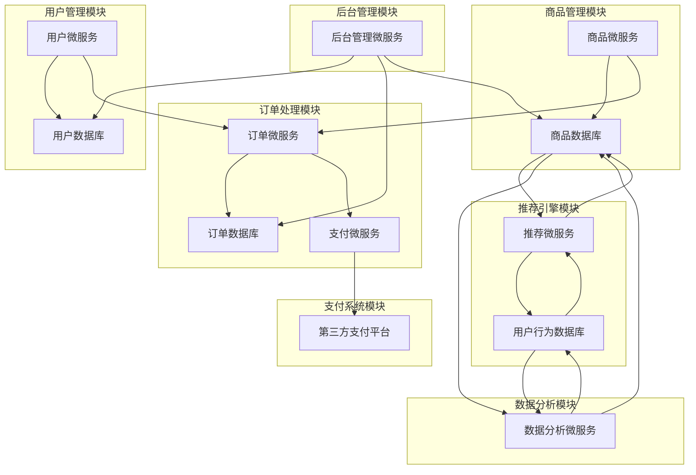
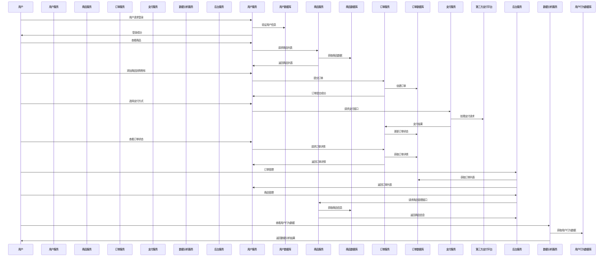

                 

### 《需求backlog管理：保持大型应用开发的灵活性》

> 关键词：需求backlog、大型应用、灵活性、管理实践、最佳实践

> 摘要：本文深入探讨了需求backlog管理在大型应用开发中的重要性。通过逐步分析需求backlog的定义、核心概念、管理原理和实践方法，本文旨在为开发者提供一套系统化、灵活有效的需求管理策略，以应对复杂多变的项目需求，保持大型应用开发的灵活性和高效性。

---

# 引言

在当今快速变化的技术环境中，大型应用开发面临着诸多挑战，尤其是需求的不确定性和变化性。需求backlog管理作为软件开发过程中的核心环节，其重要性日益凸显。良好的需求backlog管理能够确保项目开发过程有序、高效，同时能够灵活应对需求变更，从而提高项目的成功率和客户满意度。

本文将围绕以下核心问题进行探讨：

1. **需求backlog的定义及其在开发过程中的作用。**
2. **需求backlog管理的核心概念和原则。**
3. **如何有效地收集、排序和变更管理需求backlog。**
4. **实际案例中的需求backlog管理实践。**
5. **系统分析与架构设计在需求backlog管理中的应用。**
6. **项目实战中的需求backlog管理策略。**
7. **最佳实践与注意事项。**

通过本文的逐步分析，读者将能够系统地理解需求backlog管理的重要性和实践方法，为大型应用开发提供有效的指导。

## 目录

1. 引言
2. 问题背景与核心概念
   2.1 需求backlog的定义
   2.2 需求分类与优先级
   2.3 需求管理流程
3. 需求backlog管理原理
   3.1 需求收集
   3.2 需求优先级排序
   3.3 需求变更管理
4. 需求backlog管理实践
   4.1 实践案例1：项目A
   4.2 实践案例2：项目B
   4.3 实践案例3：项目C
5. 系统分析与架构设计
   5.1 系统功能设计
   5.2 系统架构设计
   5.3 系统接口设计与交互
6. 项目实战
   6.1 环境安装
   6.2 系统核心实现
   6.3 代码解读与分析
   6.4 实际案例分析与详细讲解
7. 最佳实践与总结
   7.1 最佳实践
   7.2 小结与注意事项
   7.3 拓展阅读

## 问题背景与核心概念

### 需求backlog的定义

需求backlog是软件开发过程中用来记录和管理所有待实现功能的清单。它类似于一个待办事项列表，包含了项目的所有需求，包括功能需求、性能需求、安全需求和用户体验需求等。需求backlog的目的是为项目团队提供一个明确的指导，确保所有需求得到妥善处理。

需求backlog的管理不仅涉及需求的收集和整理，还包括需求的优先级排序、变更管理和执行进度监控。通过有效的需求backlog管理，项目团队能够更好地应对需求变更，确保项目的进度和质量。

### 需求分类与优先级

在需求backlog中，需求的分类和优先级排序是至关重要的。通常，需求可以根据其重要性和紧迫性进行分类和排序。以下是一些常见的需求分类和优先级：

- **功能需求**：指系统必须实现的基本功能，如登录、搜索、支付等。
- **性能需求**：指系统的性能指标，如响应时间、并发处理能力等。
- **安全需求**：指系统的安全特性，如数据加密、用户权限控制等。
- **用户体验需求**：指用户在使用系统时的感受和体验，如界面设计、交互设计等。

对于每个需求，可以分配一个优先级，通常使用数字或字母进行表示，如P0（最高优先级）到P3（最低优先级）。在项目开发过程中，优先级高的需求应优先得到处理。

### 需求管理流程

需求管理是一个循环过程，包括以下关键步骤：

1. **需求收集**：通过用户调研、访谈、问卷调查等方式，收集项目的需求。
2. **需求分析**：对收集到的需求进行分类、整理和分析，明确需求的可行性和优先级。
3. **需求文档化**：将分析结果记录在需求文档中，确保需求清晰、明确。
4. **需求评审**：组织需求评审会议，与利益相关者讨论和确认需求。
5. **需求变更管理**：在项目开发过程中，需求可能会发生变化，需要建立有效的变更管理流程，确保需求变更得到及时处理。
6. **需求执行监控**：监控需求执行进度，确保需求按计划得到实现。

### 概念结构与核心要素组成

需求backlog管理的概念结构主要包括以下几个核心要素：

- **需求项**：每一个具体的需求条目。
- **优先级**：需求的优先级排序。
- **状态**：需求的状态，如已实现、待实现、已放弃等。
- **依赖关系**：需求之间的依赖关系。
- **历史记录**：需求的变更记录和执行历史。

这些要素共同构成了需求backlog的核心结构和功能，使得需求管理更加系统化和规范化。

### 需求backlog管理的边界与外延

需求backlog管理的边界主要涉及需求的收集、分析和变更管理。其外延包括需求文档的编写、需求评审、需求执行监控等环节。有效的需求backlog管理不仅要求对需求进行科学的管理，还需要结合项目实际情况，灵活调整管理策略，以满足项目需求的变化。

### 本章小结

本章介绍了需求backlog管理的核心概念、定义、分类与优先级、管理流程及其概念结构。通过理解这些基本概念，读者可以为后续的需求收集、排序和管理打下坚实的基础。

## 核心概念与联系

### 需求backlog的定义与属性

需求backlog是软件开发项目中记录和管理所有待实现功能的清单。它不仅包括功能需求，还涵盖了性能需求、安全需求和用户体验需求等。需求backlog的定义决定了其在项目管理中的核心地位，它反映了项目的整体需求和目标。

**属性特征对比表格**

| 属性特征           | 描述                                                         |
| ------------------ | ------------------------------------------------------------ |
| 功能需求           | 系统必须实现的基本功能，如登录、搜索、支付等。                 |
| 性能需求           | 系统的性能指标，如响应时间、并发处理能力等。                   |
| 安全需求           | 系统的安全特性，如数据加密、用户权限控制等。                   |
| 用户体验需求       | 用户在使用系统时的感受和体验，如界面设计、交互设计等。         |
| 优先级排序         | 根据需求的重要性和紧迫性，进行优先级排序，如P0到P3。           |
| 状态               | 需求的状态，如已实现、待实现、已放弃等。                       |
| 依赖关系           | 需求之间的依赖关系，影响需求的实现顺序。                       |
| 历史记录           | 需求的变更记录和执行历史，便于跟踪和管理。                    |

### ER实体关系图架构

在需求backlog管理中，实体关系图（ER图）是描述需求实体及其关系的重要工具。以下是一个简化的ER图示例，用于展示需求项、优先级和状态之间的关系。

```mermaid
erDiagram
    需求项 ||--|{ 优先级 }|| 优先级
    需求项 ||--|{ 状态 }|| 状态
    需求项 ||--|{ 历史记录 }|| 历史记录
```

通过ER图，我们可以直观地理解需求项与其他实体之间的关联，从而更好地进行需求管理和分析。

### 概念联系与作用

需求backlog管理的核心概念包括需求项、优先级、状态、依赖关系和变更历史。这些概念相互联系，共同构成了需求管理的框架：

- **需求项**是需求管理的核心，它记录了项目的所有待实现功能。
- **优先级**决定了需求项的处理顺序，确保项目团队能够优先处理关键需求。
- **状态**反映了需求项的执行情况，便于监控和管理。
- **依赖关系**揭示了需求项之间的关联，确保需求的有序实现。
- **变更历史**记录了需求项的变更过程，提供了透明和可追溯的管理机制。

通过这些核心概念的联系和作用，需求backlog管理能够有效地确保项目需求的有序处理和高效实现。

### 本章小结

本章深入探讨了需求backlog管理的核心概念和联系，包括需求项、优先级、状态、依赖关系和变更历史。通过理解这些概念，读者能够建立对需求管理的系统认识，为后续的需求收集、排序和管理提供理论基础。

## 需求backlog管理原理

### 需求收集

需求收集是需求backlog管理的首要步骤，其核心目标是系统地获取项目所有相关方的需求信息。这一过程通常涉及多个阶段，包括需求识别、需求确认和需求文档化。

**需求识别**：需求识别是发现潜在需求的过程。项目团队可以通过用户访谈、问卷调查、观察用户行为等方式来收集需求。在这一阶段，重要的是要尽可能全面地了解用户的实际需求和期望，从而为后续的需求分析和处理提供基础。

**需求确认**：需求确认是对识别到的需求进行验证的过程。这一步骤确保了需求的有效性和可行性。通过利益相关者的参与，如项目经理、产品经理、开发人员、测试人员等，需求确认能够确保收集到的需求真正符合项目目标。

**需求文档化**：将确认的需求进行文档化是需求收集的最后一步。需求文档不仅记录了需求的详细描述，还包括了需求的优先级、实现方案和依赖关系等信息。高质量的文档有助于项目团队更好地理解和执行需求。

### 需求优先级排序

需求优先级排序是需求backlog管理中的关键环节，其核心目标是根据需求的重要性和紧迫性对需求进行排序，以便项目团队能够优先处理关键需求。

**优先级排序原则**：

1. **重要性原则**：根据需求对项目目标和用户价值的贡献大小进行排序，重要的需求应优先处理。
2. **紧迫性原则**：根据需求的紧急程度和项目的截止日期进行排序，紧迫的需求应优先处理。
3. **可行性原则**：考虑需求实现的技术可行性和资源限制，优先处理技术风险较低的需求。

**优先级表示方法**：

1. **数字优先级**：如P0、P1、P2、P3，其中P0为最高优先级，P3为最低优先级。
2. **字母优先级**：如A、B、C、D，其中A为最高优先级，D为最低优先级。

**优先级排序步骤**：

1. **初步排序**：根据重要性原则和紧迫性原则，对需求进行初步排序。
2. **利益相关者评审**：邀请利益相关者参与评审，根据可行性原则调整排序。
3. **动态调整**：在项目执行过程中，根据实际情况和项目进度，动态调整需求的优先级。

### 需求变更管理

需求变更管理是需求backlog管理中不可忽视的重要环节，其核心目标是确保需求变更得到有效控制，以避免对项目造成不必要的风险。

**需求变更管理原则**：

1. **变更控制原则**：所有需求变更必须经过正式的审批流程，确保变更的合理性和必要性。
2. **影响评估原则**：在需求变更前，必须评估变更对项目进度、成本和风险的影响。
3. **透明沟通原则**：变更过程应保持透明，确保所有利益相关者对变更情况有清晰了解。

**需求变更管理流程**：

1. **变更申请**：项目团队或利益相关者提出需求变更申请，并提供变更的理由和预期效果。
2. **变更评估**：项目经理或变更控制委员会对变更申请进行评估，包括影响评估和可行性分析。
3. **变更审批**：根据评估结果，决定是否批准变更，并制定变更计划。
4. **变更实施**：在批准变更后，按照变更计划实施变更，并更新相关文档和计划。
5. **变更监控**：在变更实施过程中，持续监控变更的影响，确保变更按计划进行。

### 概念关系与实现策略

需求收集、需求优先级排序和需求变更管理是需求backlog管理的三大核心环节，它们相互关联，共同构成了需求管理的整体框架。

1. **需求收集**是需求管理的基础，决定了需求的质量和完整性。
2. **需求优先级排序**是需求管理的核心，决定了项目资源的最优分配和需求处理的顺序。
3. **需求变更管理**是需求管理的保障，确保了需求在项目过程中的灵活性和可控性。

在实现需求backlog管理时，项目团队可以采用以下策略：

- **建立需求管理流程**：制定明确的需求收集、排序和变更管理流程，确保需求管理有章可循。
- **使用需求管理工具**：借助专业的需求管理工具，如JIRA、Confluence等，实现需求的全生命周期管理。
- **利益相关者参与**：通过利益相关者的参与，提高需求的质量和优先级排序的准确性。
- **持续沟通与反馈**：保持与利益相关者的持续沟通，及时反馈需求变更的影响和进度。

### 本章小结

本章详细介绍了需求backlog管理的核心原理，包括需求收集、需求优先级排序和需求变更管理。通过理解这些原理和策略，项目团队能够更加有效地管理需求，确保项目开发的有序进行和需求的灵活调整。

## 需求backlog管理实践

### 实践案例1：项目A

**项目背景**：项目A是一款基于云计算的在线教育平台，旨在为用户提供个性化的学习体验。该项目具有需求多变、功能复杂的特点，对需求管理提出了高要求。

**需求收集**：项目团队通过用户调研、用户访谈和需求评审会议等方式，收集了包括课程管理、作业提交、学习进度追踪、用户反馈等在内的多个需求。每个需求都进行了详细的文档化处理。

**需求优先级排序**：根据需求的重要性和紧迫性，项目团队将需求分为P0（核心功能）、P1（重要功能）和P2（辅助功能）。通过利益相关者评审，确认了每个需求的优先级排序。

**需求变更管理**：在项目开发过程中，团队遇到了多次需求变更。每次变更都经过严格的评估和审批流程，确保变更的合理性和必要性。变更实施过程中，项目团队与利益相关者保持密切沟通，确保变更按计划进行。

### 实践案例2：项目B

**项目背景**：项目B是一款企业级人力资源管理系统，用于管理员工信息、薪资福利和培训发展。该项目需求稳定，但需要高效的需求管理以保证系统功能的完善。

**需求收集**：项目团队通过内部访谈、问卷调查和需求文档模板，收集了员工信息管理、薪资计算、绩效评估、培训管理等多个功能模块的需求。每个需求都经过详细分析和确认。

**需求优先级排序**：项目团队根据需求的紧急程度和业务价值，将需求分为P0（紧急且关键功能）、P1（重要功能）和P2（非关键功能）。通过定期评审会议，不断调整和确认需求的优先级。

**需求变更管理**：在项目实施过程中，团队遇到了一些需求变更。每次变更都经过严格的变更控制流程，包括评估、审批和实施。项目团队与相关部门保持紧密沟通，确保变更对项目的影响最小化。

### 实践案例3：项目C

**项目背景**：项目C是一款基于物联网的智能家庭控制系统，用户需求多变且涉及多个技术领域。该项目对需求管理的灵活性和响应速度提出了挑战。

**需求收集**：项目团队采用了敏捷开发方法，通过迭代的方式进行需求收集。每次迭代结束后，团队都会与用户进行反馈交流，收集新的需求。需求收集过程中，项目团队注重用户需求的细节和具体实现方式。

**需求优先级排序**：项目团队根据用户反馈和业务需求，将需求分为P0（核心功能）、P1（关键功能）和P2（辅助功能）。在每次迭代开始前，团队会重新评估和调整需求的优先级，确保资源的最优利用。

**需求变更管理**：项目团队采用了灵活的变更管理策略，允许在迭代周期内根据用户需求和项目实际情况进行需求变更。每次变更都经过团队成员的讨论和评审，确保变更对项目进度和质量的正面影响。

### 经验总结

通过以上三个实践案例，我们可以总结出以下经验：

1. **需求收集的重要性**：详细和全面的需求收集是需求管理的基础，有助于确保项目团队对用户需求有清晰的理解。
2. **需求优先级排序的灵活性**：根据项目的实际情况和需求的变化，灵活调整需求的优先级，确保项目资源的最佳利用。
3. **需求变更管理的可控性**：建立严格的变更管理流程，确保每次变更都经过评估和审批，减少变更对项目的不利影响。
4. **利益相关者参与**：利益相关者的参与能够提高需求管理的质量和效率，确保项目需求的准确性和可行性。

### 本章小结

本章通过实际案例，详细展示了需求backlog管理的实践方法。通过案例分析和经验总结，读者可以更好地理解需求收集、优先级排序和变更管理的具体操作，为实际项目提供有益的指导。

## 系统分析与架构设计

### 问题场景介绍

在大型应用开发中，系统分析与架构设计是确保项目成功的关键环节。以下是一个典型的项目场景：某电商公司计划开发一款新的电商平台，该平台需要支持海量的用户访问、多渠道订单处理、高效的数据存储和实时分析等功能。为了确保平台的性能、可扩展性和可靠性，项目团队需要进行详细的系统分析与架构设计。

### 项目介绍

**项目名称**：全新电商平台

**项目目标**：开发一个具备高性能、高可用性和可扩展性的电商平台，支持海量用户和交易。

**项目范围**：包括用户管理、商品管理、订单处理、支付系统、推荐引擎、数据分析和后台管理等功能模块。

### 系统功能设计

**用户管理模块**：提供用户注册、登录、个人信息管理、购物车等功能。

**商品管理模块**：实现商品信息的展示、分类、搜索和推荐。

**订单处理模块**：处理用户订单生成、支付、发货和物流跟踪等流程。

**支付系统模块**：集成第三方支付平台，提供多种支付方式，如信用卡、支付宝、微信支付等。

**推荐引擎模块**：基于用户行为和商品数据，为用户提供个性化的商品推荐。

**数据分析模块**：实时收集和分析用户行为数据，提供业务报表和洞察。

**后台管理模块**：为平台管理员提供用户管理、订单管理、商品管理等功能。

### 系统架构设计

**总体架构**：采用分布式架构，将系统功能分解为多个独立的模块，并通过微服务架构实现各模块之间的解耦和高效通信。

**技术栈**：前端使用React或Vue.js框架，后端采用Spring Boot或Django框架，数据库使用MySQL或MongoDB，消息队列使用RabbitMQ，缓存使用Redis。

**关键模块设计**：

1. **用户管理模块**：使用用户微服务，负责用户的注册、登录和认证。
2. **商品管理模块**：使用商品微服务，负责商品信息的展示、分类和推荐。
3. **订单处理模块**：使用订单微服务，负责订单的生成、支付和发货。
4. **支付系统模块**：使用支付微服务，集成第三方支付平台，处理支付请求。
5. **推荐引擎模块**：使用推荐微服务，基于用户行为和商品数据生成推荐列表。
6. **数据分析模块**：使用数据分析微服务，收集和分析用户行为数据，生成报表。
7. **后台管理模块**：使用后台管理微服务，提供管理员对平台的各项管理功能。

### 系统接口设计与系统交互

**接口设计**：每个微服务提供RESTful API，用于与其他微服务进行通信。接口设计遵循RESTful原则，包括GET、POST、PUT、DELETE等操作。

**系统交互**：通过消息队列实现各微服务之间的解耦和异步通信。例如，用户下单后，订单处理模块会向消息队列发送一个订单创建的消息，支付模块接收到消息后进行处理，并反馈处理结果给订单处理模块。

### Mermaid图表展示

以下是通过Mermaid绘制的系统架构图和系统接口设计图，展示系统的整体架构和接口交互。





### 本章小结

本章详细介绍了大型应用开发中的系统分析与架构设计，包括问题场景介绍、项目介绍、系统功能设计、系统架构设计和系统接口设计。通过Mermaid图表的展示，读者可以更直观地理解系统的整体架构和接口交互，为实际项目开发提供有益的参考。

## 项目实战

### 环境安装

在开始项目实战之前，我们需要安装所需的开发环境和工具。以下是具体的安装步骤：

1. **安装Python**：确保Python 3.8或更高版本已安装在计算机上。可以从[Python官网](https://www.python.org/)下载并安装。
2. **安装虚拟环境**：使用pip安装虚拟环境工具virtualenv。在命令行中执行以下命令：
   ```bash
   pip install virtualenv
   ```
3. **创建虚拟环境**：在项目根目录下创建一个名为`venv`的虚拟环境，并激活它：
   ```bash
   virtualenv venv
   source venv/bin/activate  # 在Windows中为venv\Scripts\activate
   ```
4. **安装依赖包**：在虚拟环境中安装项目所需的依赖包，如Flask、SQLAlchemy等：
   ```bash
   pip install flask sqlalchemy
   ```

### 系统核心实现

接下来，我们将使用Python和Flask框架实现一个简单的用户管理模块。以下是一个基本的代码示例：

```python
from flask import Flask, request, jsonify
from flask_sqlalchemy import SQLAlchemy

app = Flask(__name__)
app.config['SQLALCHEMY_DATABASE_URI'] = 'sqlite:///users.db'
db = SQLAlchemy(app)

class User(db.Model):
    id = db.Column(db.Integer, primary_key=True)
    username = db.Column(db.String(80), unique=True, nullable=False)
    email = db.Column(db.String(120), unique=True, nullable=False)

    def to_dict(self):
        return {
            'id': self.id,
            'username': self.username,
            'email': self.email
        }

@app.route('/users', methods=['POST'])
def create_user():
    data = request.get_json()
    new_user = User(username=data['username'], email=data['email'])
    db.session.add(new_user)
    db.session.commit()
    return jsonify(new_user.to_dict()), 201

@app.route('/users/<int:user_id>', methods=['GET'])
def get_user(user_id):
    user = User.query.get_or_404(user_id)
    return jsonify(user.to_dict())

@app.route('/users/<int:user_id>', methods=['PUT'])
def update_user(user_id):
    data = request.get_json()
    user = User.query.get_or_404(user_id)
    user.username = data['username']
    user.email = data['email']
    db.session.commit()
    return jsonify(user.to_dict())

@app.route('/users/<int:user_id>', methods=['DELETE'])
def delete_user(user_id):
    user = User.query.get_or_404(user_id)
    db.session.delete(user)
    db.session.commit()
    return jsonify({'message': 'User deleted successfully'})

if __name__ == '__main__':
    db.create_all()
    app.run(debug=True)
```

### 代码应用解读与分析

在上面的代码中，我们使用Flask框架创建了一个简单的用户管理API：

1. **数据库配置**：首先，我们配置了SQLAlchemy数据库引擎，指定了SQLite数据库的URI。
2. **定义模型**：`User`类是用户数据模型，包括用户ID、用户名和电子邮件字段。
3. **创建数据库表**：使用`db.create_all()`创建数据库表。
4. **定义API路由**：
   - `POST /users`：创建新用户。
   - `GET /users/<int:user_id>`：获取指定用户的详细信息。
   - `PUT /users/<int:user_id>`：更新指定用户的信息。
   - `DELETE /users/<int:user_id>`：删除指定用户。

每个路由都对应一个HTTP方法，并处理相应的数据操作。例如，`create_user`函数处理创建新用户的逻辑，首先从请求中获取JSON数据，然后创建新的`User`对象并添加到数据库中。

### 实际案例分析与详细讲解

下面通过一个实际案例来演示如何使用这个用户管理API：

**案例**：创建一个新用户

1. **请求**：使用curl发送一个POST请求：
   ```bash
   curl -X POST -H "Content-Type: application/json" -d '{"username": "johndoe", "email": "john.doe@example.com"}' http://localhost:5000/users
   ```
2. **响应**：服务器返回新创建的用户信息：
   ```json
   {
     "id": 1,
     "username": "johndoe",
     "email": "john.doe@example.com"
   }
   ```

**案例**：获取用户信息

1. **请求**：使用curl发送一个GET请求：
   ```bash
   curl -X GET http://localhost:5000/users/1
   ```
2. **响应**：服务器返回指定用户的详细信息：
   ```json
   {
     "id": 1,
     "username": "johndoe",
     "email": "john.doe@example.com"
   }
   ```

**案例**：更新用户信息

1. **请求**：使用curl发送一个PUT请求：
   ```bash
   curl -X PUT -H "Content-Type: application/json" -d '{"username": "john_doe", "email": "john.doe@newdomain.com"}' http://localhost:5000/users/1
   ```
2. **响应**：服务器返回更新后的用户信息：
   ```json
   {
     "id": 1,
     "username": "john_doe",
     "email": "john.doe@newdomain.com"
   }
   ```

**案例**：删除用户

1. **请求**：使用curl发送一个DELETE请求：
   ```bash
   curl -X DELETE http://localhost:5000/users/1
   ```
2. **响应**：服务器返回删除成功的消息：
   ```json
   {
     "message": "User deleted successfully"
   }
   ```

通过这些实际案例，我们可以看到如何使用Flask和SQLAlchemy实现一个简单的用户管理API，并通过curl工具进行操作。

### 本章小结

本章通过一个实际项目案例，详细介绍了环境安装、系统核心实现、代码解读与分析以及实际案例操作。读者可以结合代码示例和实际操作，加深对需求backlog管理在项目实战中的应用理解。

## 最佳实践与总结

### 最佳实践

1. **明确需求收集流程**：建立一套标准的需求收集流程，包括需求识别、确认和文档化。确保每个需求都有清晰的来源和明确的优先级。

2. **灵活调整需求优先级**：在项目开发过程中，根据实际情况和项目进展，及时调整需求的优先级。避免固定优先级，确保资源优先投入到关键需求上。

3. **严格变更管理**：建立变更管理流程，对每个变更申请进行严格的评估和审批。确保变更对项目的影响可控，避免不必要的风险。

4. **持续沟通与反馈**：保持与利益相关者的持续沟通，确保他们对项目进展和需求变更有清晰的了解。通过定期的反馈会议，及时解决问题和调整计划。

5. **利用需求管理工具**：使用专业的需求管理工具，如JIRA、Confluence等，实现需求的全生命周期管理。工具可以帮助团队更好地组织和跟踪需求，提高管理效率。

### 小结与注意事项

1. **需求backlog管理的重要性**：需求backlog管理是项目成功的关键，它能够确保项目团队有序、高效地处理需求，提高项目的成功率。

2. **灵活性与控制并重**：在需求管理中，既要保持灵活性，以应对快速变化的需求，也要确保控制，避免需求的无序和失控。

3. **持续改进**：需求管理是一个持续改进的过程。项目团队应不断总结经验，优化管理流程和方法，以提高需求管理的质量和效率。

### 拓展阅读

- 《敏捷开发实践指南》
- 《需求工程：从需求分析到软件架构》
- 《软件项目管理：实践与案例》

通过阅读这些书籍和资料，读者可以进一步了解需求backlog管理的最佳实践和方法，为实际项目提供更有力的支持。

## 作者信息

**作者：AI天才研究院/AI Genius Institute & 禅与计算机程序设计艺术 /Zen And The Art of Computer Programming**

