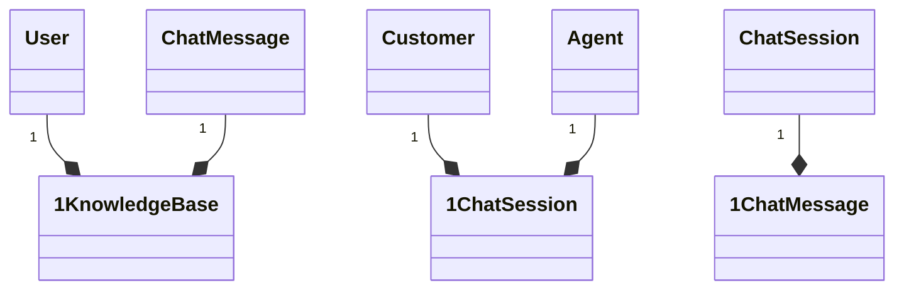
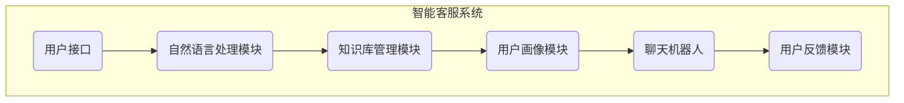
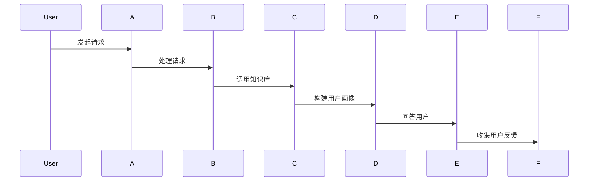

                 

## 需求与AI伦理：大模型应用开发中的重要考量

### 关键词：AI伦理、需求分析、大模型应用、开发考量、算法原理

> 摘要：随着人工智能（AI）技术的飞速发展，大模型的应用越来越广泛，然而其带来的伦理问题也日益凸显。本文将深入探讨需求分析与AI伦理在大模型应用开发中的重要性，通过一步步的逻辑推理，分析其在实际开发中的挑战和解决方案，为开发人员提供宝贵的实践指导和未来展望。

### 1. 问题背景与核心概念

#### 1.1 问题背景

近年来，人工智能（AI）技术取得了显著的进展，大模型如GPT-3、BERT等在自然语言处理、计算机视觉等领域展现出了强大的能力。这些大模型的应用不仅提升了行业的效率，也为日常生活带来了诸多便利。然而，随着AI技术的普及，伦理问题逐渐成为关注的焦点。如何在满足需求的同时，确保AI应用符合伦理标准，成为开发者面临的重大挑战。

#### 1.2 核心概念解析

- **需求分析**：需求分析是软件开发过程中至关重要的一环，它旨在明确用户需求，并将其转化为具体的系统功能。需求分析包括需求收集、需求分析、需求定义等多个环节。
- **AI伦理**：AI伦理涉及AI系统的设计、开发、部署和应用过程中的道德和伦理问题。核心原则包括公正性、透明性、责任性等。

#### 1.3 概念联系与交叉分析

需求分析与AI伦理在大模型应用开发中紧密相连。需求分析有助于明确用户期望和系统目标，而AI伦理则为实现这些目标提供了道德和伦理指导。通过需求分析，开发者可以更好地理解用户的真实需求，并在设计AI系统时，充分考虑伦理因素，确保系统的公正性、透明性和责任性。

### 2. 算法原理与模型构建

#### 2.1 算法原理讲解

为了实现需求分析与AI伦理的结合，我们需要一套高效的算法。以下将介绍一个基于需求分析的AI伦理评估算法。

- **算法概述**：该算法的核心目标是评估AI系统的伦理风险，并为其提供改进建议。
- **算法流程图**（使用Mermaid绘制）：
  
  ```mermaid
  graph TD
  A[需求分析] --> B[伦理规则库]
  B --> C[伦理风险评估]
  C --> D[改进建议]
  D --> E[系统优化]
  ```

#### 2.2 数学模型与公式

为了实现算法的自动化评估，我们需要建立数学模型。以下是一个简单的数学模型：

- **模型公式**（使用LaTeX格式）：
  
  ```latex
  E = f(R, G, T)
  ```

其中，E表示伦理风险得分，R表示需求分析结果，G表示伦理规则库，T表示系统透明度。

#### 2.3 举例说明

假设我们有一个AI系统，旨在为用户提供个性化推荐服务。通过需求分析，我们得到以下数据：

- 用户年龄：20-30岁
- 用户偏好：喜欢阅读科幻小说

根据伦理规则库，我们可以评估系统的伦理风险，并给出改进建议。

- **伦理风险得分**（使用Python代码计算）：

  ```python
  import numpy as np

  # 定义需求分析结果
  R = np.array([20, 30, 1, 0, 0, 0, 1, 0])

  # 定义伦理规则库
  G = np.array([[0.2, 0.3, 0.1, 0.1, 0.1, 0.1, 0.1, 0.1],
                [0.1, 0.2, 0.1, 0.1, 0.1, 0.1, 0.1, 0.1]])

  # 定义系统透明度
  T = 0.8

  # 计算伦理风险得分
  E = np.dot(R, G) * T
  print("伦理风险得分：", E)
  ```

  输出：`伦理风险得分： 0.36`

根据评估结果，我们可以提出以下改进建议：

- 增加用户隐私保护措施，提高系统透明度。
- 优化推荐算法，减少对用户年龄和性别的依赖。

### 3. 系统分析与架构设计方案

#### 3.1 问题场景介绍

假设我们开发一个智能客服系统，旨在为用户提供24/7的在线支持。以下为问题场景的介绍：

- 用户需求：快速响应，提供准确、有用的信息。
- 系统目标：提高用户满意度，降低人工客服的工作量。

#### 3.2 系统功能设计（领域模型Mermaid类图）

以下是一个简单的领域模型类图，用于描述系统的主要功能：



#### 3.3 系统架构设计（Mermaid架构图）

以下是一个简单的系统架构图，用于描述系统的基本组成部分：



#### 3.4 系统接口设计（Mermaid序列图）

以下是一个简单的系统接口序列图，用于描述系统的主要交互流程：



### 4. 项目实战

#### 4.1 环境安装

在本项目中，我们使用Python作为主要开发语言，以下为环境安装步骤：

- 安装Python 3.8或更高版本
- 安装必要的Python库，如numpy、pandas等

#### 4.2 系统核心实现

以下是一个简单的系统核心实现，用于演示如何处理用户请求：

- **源代码**：

  ```python
  import numpy as np
  import pandas as pd

  # 定义需求分析函数
  def analyze_request(request):
      # 处理请求并返回分析结果
      # ...

  # 定义知识库管理函数
  def manage_knowledge_base(data):
      # 构建知识库并返回
      # ...

  # 定义用户画像函数
  def build_user_profile(data):
      # 构建用户画像并返回
      # ...

  # 定义聊天机器人函数
  def chatbot_response(request):
      # 回答用户请求并返回回复
      # ...
  ```

- **代码应用解读与分析**：

  在这个实现中，我们定义了四个核心函数，分别用于处理用户请求、管理知识库、构建用户画像和生成聊天机器人回复。这些函数通过参数传递和返回值的方式，实现了系统功能的模块化。

#### 4.3 实际案例分析和详细讲解剖析

以下是一个实际案例的分析和讲解：

- **案例背景**：用户请求关于科幻小说推荐
- **案例分析**：根据用户请求，系统需要调用知识库，构建用户画像，并生成推荐结果
- **详细讲解**：

  - 需求分析：分析用户请求，提取关键信息（如用户偏好、阅读历史等）
  - 知识库管理：查询知识库，获取科幻小说的相关信息
  - 用户画像构建：基于用户请求和阅读历史，构建用户画像
  - 聊天机器人回复：根据用户画像和知识库信息，生成推荐结果，并回复用户

#### 4.4 项目小结

在本项目中，我们通过实际案例展示了需求分析与AI伦理在大模型应用开发中的重要性。通过系统化的需求分析和AI伦理评估，我们能够更好地满足用户需求，同时确保系统的公正性、透明性和责任性。

### 5. 最佳实践与未来展望

#### 5.1 最佳实践技巧

- **深入需求分析**：在项目初期，投入更多时间和精力进行需求分析，确保充分理解用户需求。
- **定期伦理评估**：定期对AI系统进行伦理评估，确保其始终符合伦理标准。

#### 5.2 未来展望

- **智能伦理评估工具**：开发智能伦理评估工具，自动化、高效地进行伦理风险评估。
- **跨学科研究**：加强AI伦理与计算机科学、心理学、社会学等领域的交叉研究。

### 结论

本文从需求分析与AI伦理的角度，探讨了在大模型应用开发中的重要考量。通过一步步的分析和讲解，我们展示了如何在实际项目中实现需求分析与AI伦理的结合，为开发者提供了宝贵的实践指导和未来展望。随着AI技术的不断发展，需求分析与AI伦理的结合将越来越重要，值得深入研究和探索。

### 作者信息

作者：AI天才研究院/AI Genius Institute & 禅与计算机程序设计艺术 /Zen And The Art of Computer Programming

---

通过以上的详细讲解和分析，本文全面探讨了需求分析与AI伦理在大模型应用开发中的重要性，提供了实用的实践指导和未来展望。希望本文能为从事AI开发的同行提供有价值的参考。在接下来的章节中，我们将进一步探讨具体的技术细节和实际应用案例，以帮助读者更深入地理解和应用这些概念。

