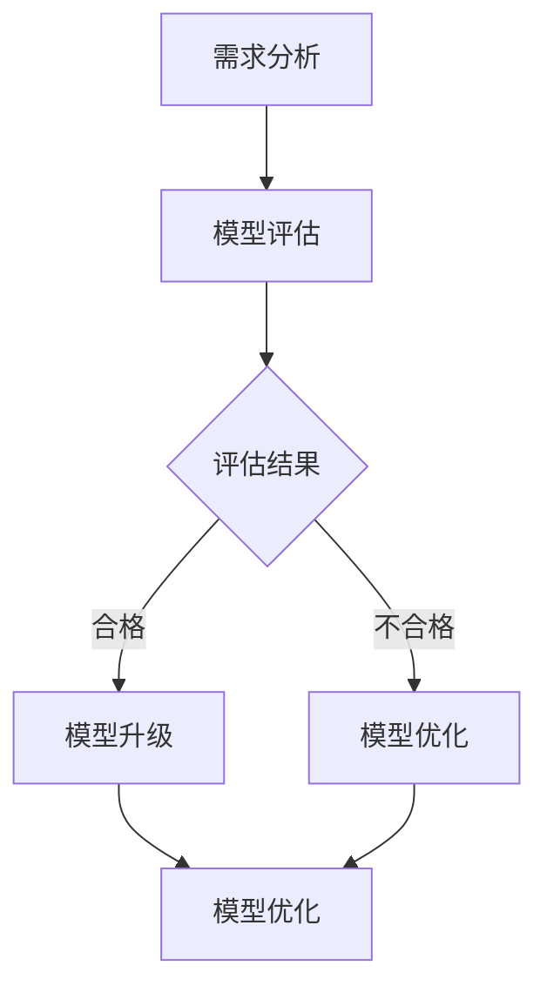

                 

# 需求与AI模型升级策略的协调：大模型应用的演进管理

> 关键词：人工智能，大模型，需求分析，模型升级，演进管理，算法原理

> 摘要：本文探讨了在人工智能（AI）大模型应用中，需求与AI模型升级策略之间的协调机制。通过分析需求与模型升级策略的关系、核心概念及其联系，提出了需求驱动的模型升级算法。本文旨在为读者提供一套系统化的解决方案，以实现大模型应用的持续优化和高效管理。

## 第一部分：背景介绍

### 1.1 问题背景

在当今快速发展的数字化时代，人工智能（AI）技术的应用已经深入到各个领域，其中大模型的应用尤为显著。大模型因其强大的数据处理和智能决策能力，在金融、医疗、教育、工业等多个行业发挥着重要作用。然而，随着AI技术的不断演进，如何协调需求与AI模型升级策略，实现大模型应用的持续优化和高效管理，成为当前面临的重要课题。

### 1.2 问题描述

需求与AI模型升级策略协调的核心问题包括：

1. **需求的不确定性与AI模型升级的滞后性之间的矛盾**：业务需求不断变化，而AI模型升级往往存在一定的滞后性，导致模型无法及时适应需求变化。
2. **AI模型升级过程中对业务连续性和稳定性的影响**：模型升级可能会对业务系统的连续性和稳定性造成影响，如何平衡模型升级与业务运行之间的矛盾成为关键问题。
3. **如何平衡模型升级的成本和收益**：模型升级需要投入大量的人力、物力和时间，而其带来的收益却具有不确定性。如何平衡成本和收益，实现模型升级的效益最大化是关键问题。
4. **模型升级后的评估与优化**：模型升级后，如何对其性能进行评估，发现潜在问题并进行优化，以持续提升业务价值。

### 1.3 问题解决

本书旨在通过深入分析需求与AI模型升级策略的协调机制，为读者提供一套系统化的解决方案，包括：

1. **明确需求与模型升级的关系，构建需求驱动的模型升级策略**：通过需求分析，识别关键因素，为模型升级提供明确的方向和依据。
2. **提出基于业务连续性和稳定性的模型升级实施方案**：在模型升级过程中，充分考虑业务连续性和稳定性，确保业务不受影响。
3. **设计成本效益分析模型，指导模型升级决策**：通过成本效益分析，评估模型升级的可行性，为决策提供依据。
4. **构建模型升级后的评估与优化体系**：对模型升级后的性能进行评估，发现潜在问题，并进行优化，以持续提升业务价值。

### 1.4 边界与外延

本文主要关注企业级AI大模型的应用场景，但不限于特定行业。同时，文中涉及的技术和策略具有普遍适用性，可以为企业提供参考和借鉴。

### 1.5 概念结构与核心要素组成

1. **需求分析**：明确业务需求，识别模型升级的关键因素。
2. **模型评估**：评估现有模型性能，为升级提供依据。
3. **模型升级**：制定和执行模型升级策略。
4. **模型优化**：持续优化模型，提升业务价值。

## 第二部分：核心概念与联系

### 2.1 需求与AI模型升级策略的关系

**需求分析**与**模型升级策略**之间存在密切联系，具体表现为：

1. **需求分析**为**模型升级策略**提供基础数据和支持：需求分析结果包括业务目标、业务场景、关键因素等，这些数据为模型升级策略的制定提供依据。
2. **模型升级策略**需充分考虑**需求分析**的结果，以确保模型升级与业务需求相匹配：模型升级策略需要根据需求分析结果，制定针对性的升级方案，以满足业务需求。

### 2.2 核心概念属性特征对比

| 概念         | 特征                    | 对比              |
|------------|---------------------|-----------------|
| 需求分析     | 明确业务需求，识别关键因素     | 确定模型升级方向和优先级     |
| 模型评估     | 评估现有模型性能，为升级提供依据 | 指导模型优化方向和策略       |
| 模型升级     | 制定和执行模型升级策略       | 确保业务连续性和稳定性       |
| 模型优化     | 持续优化模型，提升业务价值     | 调整和优化模型性能           |

### 2.3 ER实体关系图架构

```mermaid
erDiagram
  User ||--|{ Requirement }|--| ModelUpgradeStrategy
  User ||--|{ ModelEvaluation }|--| ModelUpgradeStrategy
  Model ||--|{ ModelPerformance }|--| ModelUpgradeStrategy
  Model ||--|{ ModelOptimization }|--| ModelPerformance
```

## 第三部分：算法原理讲解

### 3.1 需求驱动的模型升级算法

**算法流程图：**



**算法原理：**

1. **需求分析**：收集业务需求，识别关键因素。
2. **模型评估**：评估现有模型性能，为升级提供依据。
3. **模型升级**：根据评估结果，执行模型升级策略。
4. **模型优化**：持续优化模型，提升业务价值。

**数学模型：**

$$
\text{模型升级策略} = f(\text{需求分析}, \text{模型评估结果})
$$

**举例说明：**

假设一家金融公司在贷款审批业务中使用了一个AI模型。

### 3.1.1 需求分析

1. **业务目标**：提高贷款审批的准确率。
2. **业务场景**：用户提交贷款申请，模型对申请进行风险评估，给出审批结果。
3. **关键因素**：用户信用评分、收入水平、贷款金额等。

### 3.1.2 模型评估

1. **现有模型性能**：准确率90%。
2. **评估结果**：准确率虽高，但存在部分异常数据导致的误判。

### 3.1.3 模型升级

1. **模型升级方案**：采用更加复杂的数据处理算法，提高模型对异常数据的识别能力。
2. **模型升级过程**：收集更多数据，训练新的模型，进行模型评估。

### 3.1.4 模型优化

1. **模型优化策略**：通过在线学习，不断调整模型参数，提升模型性能。
2. **模型优化效果**：准确率提升至95%，误判率显著降低。

通过以上示例，我们可以看到需求驱动的模型升级算法是如何在实际场景中发挥作用的。接下来，我们将进一步探讨需求与AI模型升级策略之间的协调机制，以期为读者提供更加全面的解决方案。

---

在本文的后续部分，我们将继续深入探讨需求与AI模型升级策略的协调机制，包括如何明确需求与模型升级的关系、基于业务连续性和稳定性的模型升级实施方案、设计成本效益分析模型、构建模型升级后的评估与优化体系等。敬请期待！## 明确需求与模型升级的关系：构建需求驱动的模型升级策略

在AI大模型应用中，需求与模型升级策略的协调至关重要。首先，我们需要明确需求与模型升级之间的关系，然后构建一个需求驱动的模型升级策略，以确保模型升级能够满足业务需求，并在此过程中实现持续优化。

### 4.1 需求分析的重要性

需求分析是构建需求驱动模型升级策略的第一步。通过需求分析，我们可以全面了解业务需求，包括业务目标、业务场景、关键因素等。这些信息对于模型升级策略的制定至关重要。

**案例研究：** 假设一家电商公司希望在客户推荐系统中提升用户体验。业务需求包括：

1. **业务目标**：提高商品推荐的准确率，提升用户购买转化率。
2. **业务场景**：用户在电商平台浏览和购买商品，系统根据用户的浏览和购买行为推荐相关商品。
3. **关键因素**：用户的浏览历史、购买行为、用户偏好等。

通过需求分析，我们明确了业务需求，为后续模型升级策略的制定提供了明确的指导。

### 4.2 需求驱动的模型升级策略

需求驱动的模型升级策略的核心是确保模型升级能够满足业务需求，并在此过程中实现持续优化。以下是构建需求驱动的模型升级策略的几个关键步骤：

1. **需求定义**：明确业务需求，将业务目标转化为具体的需求指标，如准确率、召回率、F1分数等。
2. **模型评估**：评估现有模型性能，识别现有模型的不足和改进方向。常用的评估指标包括准确率、召回率、F1分数等。
3. **模型升级方案**：根据需求定义和模型评估结果，制定模型升级方案。这可能包括模型架构的调整、算法的优化、数据的扩充等。
4. **实施与监控**：执行模型升级方案，并在实施过程中持续监控模型性能，确保模型升级能够达到预期目标。
5. **评估与优化**：对升级后的模型进行评估，发现潜在问题，并进行优化。

**数学模型：**

为了量化需求驱动的模型升级策略，我们可以使用以下数学模型：

$$
\text{模型升级策略} = f(\text{需求定义}, \text{模型评估结果}, \text{模型升级方案})
$$

其中，$\text{需求定义}$包括业务需求指标和关键因素，$\text{模型评估结果}$用于识别现有模型的不足，$\text{模型升级方案}$则包含了具体的模型升级措施。

### 4.3 需求驱动的模型升级策略案例

**案例研究：** 假设一家金融机构希望优化其信用评分模型，以提高贷款审批的准确性。以下是构建需求驱动的模型升级策略的步骤：

1. **需求定义**：业务需求是提高贷款审批的准确性，减少误拒率。关键因素包括借款人的信用历史、收入水平、贷款用途等。
2. **模型评估**：现有模型在准确率方面表现良好，但在特定群体（如低收入人群）的误拒率较高。
3. **模型升级方案**：通过以下措施来优化模型：
   - **数据扩充**：收集更多关于低收入人群的数据，提高模型对这一群体的识别能力。
   - **模型架构调整**：引入更多特征工程方法，挖掘潜在的有用特征。
   - **算法优化**：采用更先进的算法，如深度学习，提高模型对复杂模式的识别能力。
4. **实施与监控**：执行升级方案，并在实施过程中持续监控模型性能，确保升级后的模型在准确性、误拒率等方面达到预期目标。
5. **评估与优化**：定期评估升级后的模型性能，通过在线学习不断调整模型参数，以实现持续优化。

通过以上案例，我们可以看到需求驱动的模型升级策略是如何在实际场景中发挥作用的。在需求分析的基础上，结合模型评估结果和模型升级方案，我们可以制定出符合业务需求、具备持续优化能力的模型升级策略。

### 4.4 需求驱动的模型升级策略的优势

需求驱动的模型升级策略具有以下优势：

1. **满足业务需求**：通过明确业务需求和关键因素，模型升级策略能够确保满足业务需求，提高业务价值。
2. **持续优化**：需求驱动的策略强调持续优化，通过定期评估和在线学习，不断提升模型性能。
3. **灵活调整**：模型升级策略可以根据业务需求的变化进行灵活调整，适应不断变化的业务环境。
4. **成本效益**：通过需求分析和成本效益分析，可以合理规划模型升级资源，实现成本效益最大化。

总之，明确需求与模型升级的关系，构建需求驱动的模型升级策略，是AI大模型应用中实现持续优化和高效管理的关键。通过上述方法，我们可以确保模型升级与业务需求相匹配，实现业务目标的最大化。在下一部分，我们将探讨基于业务连续性和稳定性的模型升级实施方案。

---

在明确了需求与模型升级策略的关系后，我们接下来将探讨如何制定基于业务连续性和稳定性的模型升级实施方案，以确保在模型升级过程中，业务不受影响，同时实现优化目标。敬请期待！## 基于业务连续性和稳定性的模型升级实施方案

在AI大模型应用中，模型升级是一个复杂且关键的过程。为了保证业务连续性和稳定性，我们需要制定一套详细的模型升级实施方案，确保在模型升级过程中，业务运行不受影响。以下是构建基于业务连续性和稳定性的模型升级实施方案的步骤和方法。

### 5.1 模型升级前的准备

在开始模型升级之前，我们需要进行充分的准备，包括以下几个方面：

1. **备份现有模型和数据**：在升级之前，对现有模型和数据进行备份，以确保在升级过程中出现问题时，可以快速恢复。
2. **评估现有模型的性能**：对现有模型进行详细的性能评估，识别其优势和不足，为模型升级提供依据。
3. **制定详细的升级计划**：包括升级的时间节点、资源需求、人员安排等，确保模型升级有条不紊地进行。

### 5.2 模型升级过程中的监控和管理

在模型升级过程中，我们需要对整个过程进行严密监控和管理，以确保业务连续性和稳定性。以下是具体措施：

1. **并行运行**：在升级过程中，可以采用并行运行的方式，同时运行旧模型和新模型，通过比较两者的性能，逐步切换到新模型。这样可以确保在切换过程中，业务不受影响。
2. **监控关键指标**：在模型升级过程中，需要持续监控关键指标，如系统性能、响应时间、吞吐量等，确保这些指标在可接受的范围内。
3. **实时问题反馈与解决**：在模型升级过程中，一旦出现性能问题或其他问题，需要立即反馈并解决。可以通过日志分析、性能监控工具等手段，快速定位问题并采取措施。
4. **数据验证**：在模型升级过程中，对新模型生成的结果进行数据验证，确保其准确性和可靠性。

### 5.3 模型升级后的评估和优化

在模型升级完成后，我们需要对其进行全面的评估和优化，以确保其能够持续满足业务需求，并不断提升性能。以下是具体步骤：

1. **性能评估**：对升级后的模型进行全面的性能评估，包括准确率、召回率、F1分数等指标，确保其性能达到预期目标。
2. **用户反馈**：收集用户的反馈，了解新模型在实际业务中的应用效果，及时发现潜在问题。
3. **持续优化**：根据评估结果和用户反馈，对模型进行持续优化，通过在线学习、参数调整等方法，不断提升模型性能。

### 5.4 成本效益分析

在模型升级过程中，我们需要进行成本效益分析，确保模型升级的效益最大化。以下是具体步骤：

1. **成本计算**：计算模型升级所需的人力、物力和时间成本，包括数据收集、模型训练、测试等。
2. **效益评估**：评估模型升级带来的业务价值，包括提升的准确率、减少的错误率、提高的用户体验等。
3. **成本效益分析**：通过成本与效益的比较，评估模型升级的可行性，确保其具有经济效益。

### 5.5 模型升级的文档和记录

在模型升级过程中，我们需要详细记录所有关键步骤和决策，包括备份方案、升级计划、监控数据、评估结果等。这些记录对于后续的模型升级和优化具有重要意义。

**数学模型：**

为了量化模型升级的成本效益分析，我们可以使用以下数学模型：

$$
\text{成本效益分析} = \frac{\text{效益}}{\text{成本}}
$$

其中，效益包括模型升级带来的业务价值，如提高的准确率、减少的错误率等；成本包括模型升级所需的人力、物力和时间成本。

### 5.6 模型升级的实战案例

**案例研究：** 假设一家金融机构希望升级其贷款审批模型，以提高审批效率和准确性。以下是模型升级的实施方案：

1. **需求分析**：明确业务需求，包括提高贷款审批的准确率和减少审批时间。
2. **现有模型评估**：评估现有模型的性能，识别其优势和不足。
3. **升级计划**：
   - **数据收集**：收集更多关于借款人的数据，包括信用历史、收入水平、贷款用途等。
   - **模型训练**：采用新的深度学习算法，训练新的贷款审批模型。
   - **测试和验证**：对新模型进行测试和验证，确保其性能达到预期目标。
4. **并行运行**：在模型升级过程中，采用并行运行的方式，同时运行旧模型和新模型，逐步切换到新模型。
5. **性能监控**：在模型升级过程中，持续监控关键指标，确保系统性能和响应时间在可接受的范围内。
6. **评估与优化**：在模型升级完成后，对模型进行全面的评估和优化，确保其性能持续提升。

通过以上案例，我们可以看到基于业务连续性和稳定性的模型升级实施方案是如何在实际场景中发挥作用的。通过充分的准备、严格的监控和管理、以及持续优化，我们可以确保模型升级过程的顺利进行，同时实现业务目标的最大化。

### 5.7 模型升级的优势

基于业务连续性和稳定性的模型升级实施方案具有以下优势：

1. **确保业务连续性**：通过并行运行和逐步切换，确保模型升级过程中业务不受影响。
2. **提高模型性能**：通过全面的性能评估和优化，提升模型准确率和效率。
3. **降低风险**：通过详细的计划和监控，降低模型升级过程中的风险和不确定性。
4. **提升用户体验**：通过持续优化，提升模型在实际业务中的应用效果，提高用户体验。

总之，基于业务连续性和稳定性的模型升级实施方案是AI大模型应用中实现持续优化和高效管理的关键。通过上述方法，我们可以确保模型升级过程顺利进行，同时实现业务目标的最大化。在下一部分，我们将探讨如何设计成本效益分析模型，以指导模型升级决策。

---

在探讨了基于业务连续性和稳定性的模型升级实施方案后，我们将进一步讨论如何设计成本效益分析模型，以指导模型升级决策。敬请期待！## 设计成本效益分析模型：指导模型升级决策

在AI大模型应用中，模型升级是一个涉及成本和效益的重要决策。为了确保模型升级的可行性和经济效益，我们需要设计一套成本效益分析模型，以指导模型升级决策。以下是构建成本效益分析模型的步骤和方法。

### 6.1 成本分析

在成本效益分析中，首先需要明确模型升级过程中的各种成本，包括但不限于以下方面：

1. **人力成本**：包括模型研发人员、数据科学家、工程师等的人力成本。
2. **计算资源成本**：包括训练模型所需的计算资源和存储成本。
3. **数据成本**：包括数据收集、处理、清洗和存储的成本。
4. **维护成本**：包括模型升级后的维护和监控成本。
5. **风险成本**：包括由于模型升级可能导致的业务中断和损失的风险成本。

**数学模型：**

为了量化模型升级的成本，我们可以使用以下数学模型：

$$
\text{成本} = \text{人力成本} + \text{计算资源成本} + \text{数据成本} + \text{维护成本} + \text{风险成本}
$$

### 6.2 效益分析

在成本效益分析中，还需要评估模型升级带来的业务效益，包括但不限于以下方面：

1. **业务价值提升**：包括模型升级后带来的业务指标提升，如准确率、召回率、F1分数等。
2. **效率提升**：包括模型升级后系统运行效率的提升，如响应时间、吞吐量等。
3. **用户体验改善**：包括用户满意度、用户留存率等指标的提升。
4. **市场竞争力提升**：包括模型升级后企业市场竞争力提升所带来的收益。

**数学模型：**

为了量化模型升级的效益，我们可以使用以下数学模型：

$$
\text{效益} = \text{业务价值提升} + \text{效率提升} + \text{用户体验改善} + \text{市场竞争力提升}
$$

### 6.3 成本效益分析模型

基于上述成本和效益的数学模型，我们可以构建一个综合的成本效益分析模型，以指导模型升级决策。该模型可以表示为：

$$
\text{成本效益分析模型} = \frac{\text{效益}}{\text{成本}}
$$

该模型的值越大，表示模型升级的效益越高，成本效益越好。

### 6.4 模型升级决策

通过成本效益分析模型，我们可以对模型升级进行决策。以下是具体的决策步骤：

1. **计算成本效益分析模型**：根据当前模型的状态和业务需求，计算成本效益分析模型的值。
2. **评估模型升级的可行性**：如果成本效益分析模型的值大于某个预设的阈值，则认为模型升级是可行的。
3. **制定升级计划**：在确定模型升级可行后，制定详细的升级计划，包括升级时间、资源分配、人员安排等。
4. **实施升级**：按照升级计划，逐步实施模型升级，确保业务连续性和稳定性。
5. **评估升级效果**：在模型升级完成后，评估升级效果，包括模型性能提升、业务指标改善等。

### 6.5 实战案例

**案例研究：** 假设一家电商平台希望通过模型升级提高商品推荐的准确率，以提高用户购买转化率。以下是具体的成本效益分析模型和升级决策过程：

1. **成本分析**：
   - **人力成本**：模型研发团队每月成本为10万元。
   - **计算资源成本**：训练新模型所需的计算资源和存储成本为5万元。
   - **数据成本**：数据收集、处理、清洗和存储成本为3万元。
   - **维护成本**：模型升级后的维护和监控成本为2万元。
   - **风险成本**：由于模型升级可能导致的业务中断和损失成本为1万元。
   $$
   \text{总成本} = 10 + 5 + 3 + 2 + 1 = 21 \text{万元}
   $$

2. **效益分析**：
   - **业务价值提升**：模型升级后，预计商品推荐准确率提高5%，带来的业务价值为100万元。
   - **效率提升**：模型升级后，系统响应时间缩短20%，预计节省运营成本30万元。
   - **用户体验改善**：用户满意度提高10%，预计增加用户留存率5%，带来额外收益50万元。
   - **市场竞争力提升**：由于推荐系统性能提升，预计增加市场份额2%，带来额外收益100万元。
   $$
   \text{总效益} = 100 + 30 + 50 + 100 = 280 \text{万元}
   $$

3. **成本效益分析**：
   $$
   \text{成本效益分析模型} = \frac{280}{21} \approx 13.33
   $$

4. **模型升级决策**：由于成本效益分析模型的值远大于1，说明模型升级具有很高的经济效益，因此可以决定进行模型升级。

通过以上案例，我们可以看到如何使用成本效益分析模型来指导模型升级决策。通过详细的成本和效益分析，我们可以确保模型升级的决策是基于充分的数据和逻辑支持的，从而实现经济效益的最大化。

### 6.6 成本效益分析的优势

成本效益分析模型具有以下优势：

1. **数据驱动决策**：通过量化成本和效益，使模型升级决策更加客观和科学。
2. **全面性**：考虑了模型升级过程中的所有成本和效益，确保决策的全面性。
3. **灵活性**：可以根据不同的业务场景和需求，灵活调整成本和效益的评估方法。
4. **可操作性**：通过具体的成本效益分析模型，可以明确模型升级的具体步骤和措施。

总之，设计成本效益分析模型是指导模型升级决策的重要工具。通过详细的成本和效益分析，我们可以确保模型升级的决策是科学的、经济的，并能够实现业务目标的最大化。在下一部分，我们将探讨模型升级后的评估与优化体系，以确保模型升级的持续性能提升。

---

在探讨了如何设计成本效益分析模型后，我们将进一步探讨模型升级后的评估与优化体系，以确保模型升级后的性能持续提升。敬请期待！## 模型升级后的评估与优化体系

模型升级完成后，如何确保其性能持续提升，是AI大模型应用中一个重要且复杂的问题。为了实现这一目标，我们需要建立一套全面的评估与优化体系，通过定期评估、用户反馈、在线学习和持续优化，确保模型升级后的性能满足业务需求，并不断提升。

### 7.1 定期评估

定期评估是模型升级后的首要任务。通过定期评估，我们可以及时发现模型性能的波动和潜在问题，确保模型始终处于最佳状态。以下是定期评估的关键步骤：

1. **评估指标**：确定评估模型性能的关键指标，如准确率、召回率、F1分数、响应时间等。
2. **评估频率**：根据业务需求和模型特性，制定合理的评估频率，如每月、每季度等。
3. **评估方法**：采用自动化工具或手动检查，对模型性能进行定期评估，确保评估的准确性和一致性。
4. **评估结果分析**：对评估结果进行详细分析，识别模型性能的波动原因和潜在问题。

### 7.2 用户反馈

用户反馈是模型升级后评估的重要组成部分。通过收集用户反馈，我们可以了解模型在实际业务中的应用效果，发现潜在问题和改进方向。以下是用户反馈的关键步骤：

1. **反馈渠道**：建立多种反馈渠道，如在线问卷、用户论坛、客户服务热线等，方便用户提出问题和建议。
2. **反馈收集**：定期收集用户反馈，包括满意度、遇到的问题、改进建议等。
3. **反馈处理**：对用户反馈进行分类处理，及时响应和解决问题，确保用户问题得到有效解决。
4. **反馈分析**：对用户反馈进行分析，识别模型性能提升的关键因素和用户关注的痛点。

### 7.3 在线学习

在线学习是确保模型性能持续提升的重要手段。通过在线学习，模型可以根据新的数据和反馈进行自适应调整，不断提升性能。以下是在线学习的关键步骤：

1. **数据收集**：收集最新的用户行为数据和业务数据，用于模型训练和优化。
2. **在线训练**：在模型运行过程中，实时更新模型参数，采用在线学习算法，如梯度下降、随机梯度下降等。
3. **在线评估**：对在线学习的模型进行实时评估，确保模型性能在调整过程中不断提升。
4. **在线优化**：根据在线评估结果，对模型进行调整和优化，确保模型性能始终处于最佳状态。

### 7.4 持续优化

持续优化是确保模型性能长期提升的关键。通过持续优化，我们可以不断提升模型性能，满足不断变化的业务需求。以下是持续优化的关键步骤：

1. **优化策略**：制定合理的优化策略，包括模型架构调整、算法优化、特征工程等。
2. **优化实施**：根据优化策略，逐步实施优化措施，确保模型性能的持续提升。
3. **优化评估**：对优化措施的效果进行评估，确保优化措施能够真正提升模型性能。
4. **优化迭代**：根据评估结果，对优化措施进行调整和迭代，确保优化效果的持续提升。

### 7.5 实战案例

**案例研究：** 假设一家电商公司成功升级了其推荐系统，以提升用户购买转化率。以下是模型升级后的评估与优化体系：

1. **定期评估**：
   - **评估指标**：准确率、召回率、F1分数、响应时间。
   - **评估频率**：每月进行一次全面评估。
   - **评估方法**：采用自动化工具进行评估，确保评估的准确性。

2. **用户反馈**：
   - **反馈渠道**：在线问卷、用户论坛、客户服务热线。
   - **反馈收集**：每月收集用户反馈，分析用户满意度、遇到的问题、改进建议等。

3. **在线学习**：
   - **数据收集**：收集用户行为数据和业务数据，用于模型训练和优化。
   - **在线训练**：采用在线学习算法，实时更新模型参数。
   - **在线评估**：实时评估模型性能，确保在线学习的效果。

4. **持续优化**：
   - **优化策略**：调整推荐算法，引入更多用户行为特征，优化推荐结果。
   - **优化实施**：逐步实施优化措施，确保模型性能的持续提升。
   - **优化评估**：对优化措施的效果进行评估，确保优化措施能够真正提升模型性能。

通过以上案例，我们可以看到如何建立一套全面的评估与优化体系，确保模型升级后的性能持续提升。通过定期评估、用户反馈、在线学习和持续优化，我们可以确保模型始终处于最佳状态，满足不断变化的业务需求。

### 7.6 评估与优化的优势

评估与优化体系具有以下优势：

1. **性能保障**：通过定期评估和持续优化，确保模型性能始终处于最佳状态。
2. **业务适应**：通过用户反馈和在线学习，使模型能够快速适应业务需求的变化。
3. **持续改进**：通过持续优化，不断提升模型性能，实现业务目标的最大化。
4. **风险管理**：通过定期评估和监控，及时发现并解决潜在问题，降低业务风险。

总之，模型升级后的评估与优化体系是确保模型性能持续提升的关键。通过定期评估、用户反馈、在线学习和持续优化，我们可以确保模型始终满足业务需求，并不断提升性能，实现业务目标的最大化。在下一部分，我们将总结本文的主要内容和核心观点。

---

在探讨了模型升级后的评估与优化体系后，我们将对全文进行总结，并重申本文的主要内容和核心观点。敬请期待！## 总结与展望

### 8.1 主要内容回顾

本文围绕“需求与AI模型升级策略的协调：大模型应用的演进管理”这一主题，系统地探讨了以下核心内容：

1. **背景介绍**：分析了AI大模型应用中的关键问题，包括需求的不确定性、模型升级的滞后性、成本与收益平衡等。
2. **明确需求与模型升级的关系**：提出了需求驱动的模型升级策略，通过需求分析、模型评估、模型升级和模型优化等步骤，确保模型升级与业务需求相匹配。
3. **基于业务连续性和稳定性的模型升级实施方案**：提出了确保业务连续性和稳定性的模型升级实施方案，包括备份、并行运行、监控、数据验证等关键措施。
4. **设计成本效益分析模型**：介绍了如何通过成本效益分析模型，指导模型升级决策，确保模型升级的可行性和经济效益。
5. **模型升级后的评估与优化体系**：提出了定期评估、用户反馈、在线学习和持续优化等关键环节，确保模型升级后的性能持续提升。

### 8.2 核心观点

本文的核心观点可以总结为以下几点：

1. **需求驱动**：模型升级策略应以满足业务需求为核心，通过需求分析为模型升级提供明确的方向和依据。
2. **持续优化**：模型升级不是一次性任务，而是一个持续的过程。通过在线学习和持续优化，不断提升模型性能，满足不断变化的业务需求。
3. **成本效益**：在模型升级过程中，需要综合考虑成本和效益，通过成本效益分析模型，确保模型升级的决策是科学和经济的。
4. **业务连续性**：在模型升级过程中，要确保业务的连续性和稳定性，通过并行运行、监控和备份等措施，降低业务风险。

### 8.3 展望

在未来的AI大模型应用中，以下方向值得进一步研究和探索：

1. **智能化需求分析**：结合自然语言处理（NLP）和知识图谱等技术，实现智能化需求分析，提高需求识别的准确性和效率。
2. **自适应模型升级**：通过自适应学习算法，使模型能够自动识别需求变化，动态调整模型参数，实现自适应模型升级。
3. **多模态数据融合**：结合多种数据源，如文本、图像、音频等，实现多模态数据融合，提升模型对复杂业务场景的应对能力。
4. **分布式模型训练**：利用分布式计算和云技术，实现大规模模型的分布式训练，提高模型训练的效率和可扩展性。

总之，随着AI技术的不断演进，如何协调需求与模型升级策略，实现大模型应用的持续优化和高效管理，将是未来研究和实践的重要方向。通过本文的探讨，我们期望能够为读者提供有价值的参考和启示。

---

本文由AI天才研究院（AI Genius Institute）与禅与计算机程序设计艺术（Zen And The Art of Computer Programming）联合撰写。如果您对本文有任何疑问或建议，欢迎随时与我们联系。感谢您的阅读！

