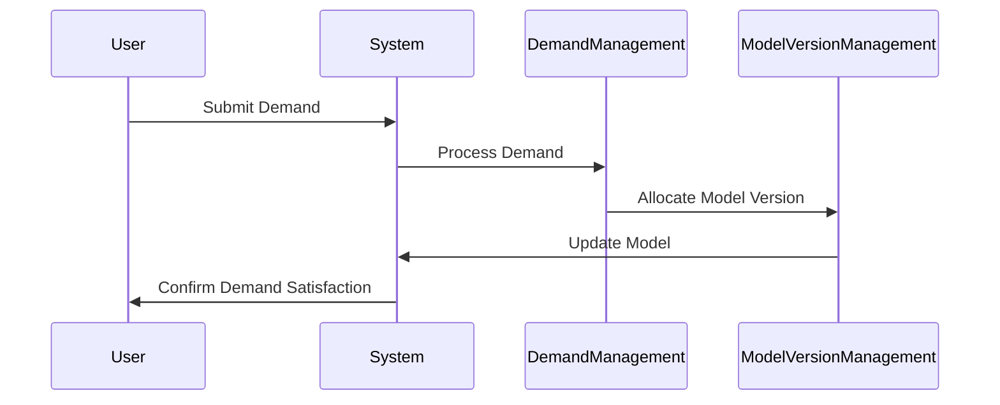

                 

## 需求与AI模型版本管理的协同策略

### 关键词：
- AI模型版本管理
- 需求驱动
- 协同机制
- 系统架构设计
- 实际案例分析

### 摘要：
本文旨在探讨需求与AI模型版本管理的协同策略。在人工智能应用日益广泛的背景下，需求的动态性和AI模型的快速迭代带来了版本管理上的挑战。本文首先介绍需求与AI模型版本管理的基本概念，分析现有版本管理方案的优缺点，提出需求驱动的版本管理策略，并设计协同机制。随后，本文详细阐述了系统架构设计，并通过实际案例分析，展示了策略的实施效果。最后，本文总结了最佳实践和注意事项，展望了未来的发展方向。

## 第1章 问题背景与核心概念介绍

### 1.1 问题背景

#### 1.1.1 需求与AI模型版本管理的协同意义

随着人工智能技术的飞速发展，其在各个行业中的应用日益广泛。然而，商业环境的快速变化和用户需求的多样化，给AI模型的版本管理带来了新的挑战。有效的版本管理不仅能够确保模型的稳定性和可靠性，还能够快速响应需求变化，提高业务灵活性。

#### 1.1.2 需求与AI模型版本管理的关系

需求的动态性对AI模型版本管理提出了新的要求。一方面，需求的变化要求模型能够快速迭代和更新；另一方面，版本管理的复杂性要求模型能够保持一致性和可追踪性。因此，需求与AI模型版本管理之间的协同至关重要。

### 1.2 核心概念

#### 1.2.1 需求定义与分类

需求是用户对系统的期望和需求，可以分为功能性需求和非功能性需求。功能性需求关注系统应该做什么，非功能性需求关注系统应该如何做。

| 类别         | 描述                                                         |
| ------------ | ------------------------------------------------------------ |
| 功能性需求   | 系统必须实现的功能，如用户交互、数据处理、业务逻辑等。         |
| 非功能性需求 | 系统必须满足的质量属性，如性能、安全性、可靠性、可扩展性等。 |

#### 1.2.2 AI模型版本管理

AI模型版本管理是对AI模型的不同版本进行跟踪和管理的过程。版本管理包括模型的创建、更新、发布和回滚等操作。版本管理工具和框架可以帮助团队更好地协同工作，确保模型的一致性和可追踪性。

| 工具/框架      | 描述                                                         |
| ------------- | ------------------------------------------------------------ |
| Git           | 分布式版本控制系统，广泛应用于代码管理。                     |
| TensorFlow    | 开源机器学习框架，支持模型版本管理。                       |
| ModelDB       | 模型版本管理平台，提供模型生命周期管理功能。                 |

### 1.3 关键概念关系图

```mermaid
erDiagram
    Demand ||--|{ AI Model Version Management } : supports
    AI Model Version Management ||--|{ Demand } : satisfies
```

## 第2章 现有版本管理方案分析

### 2.1 当前版本管理方案综述

#### 2.1.1 常见版本管理工具与框架

目前，常用的版本管理工具有Git、SVN、Mercurial等。这些工具主要关注代码的版本控制和协作开发。然而，随着AI模型复杂性的增加，这些工具在模型版本管理方面存在一定的局限性。

#### 2.1.2 不同版本管理方案的优缺点

- **Git**：优点是分布式、灵活、支持大型代码库；缺点是模型版本管理复杂，不直接支持模型版本控制。

- **TensorFlow**：优点是集成在机器学习框架中，方便模型迭代和发布；缺点是版本管理功能较为简单，不支持多模型版本管理。

- **ModelDB**：优点是专门为模型版本管理设计，支持多模型版本控制；缺点是部署和维护成本较高。

### 2.2 需求驱动版本管理策略

#### 2.2.1 需求驱动版本管理概述

需求驱动版本管理是一种基于需求变化的版本管理策略。它强调根据需求的变化来调整模型的版本。这种策略能够更好地适应动态的商业环境，提高模型的灵活性和响应速度。

#### 2.2.2 需求驱动版本管理流程

需求驱动版本管理流程主要包括以下步骤：

1. **需求收集与优先级排序**：收集用户需求，并根据优先级进行排序。

2. **版本规划与迭代**：根据优先级和资源情况，规划模型版本迭代。

3. **模型评审与测试**：对迭代后的模型进行评审和测试，确保其满足需求。

### 2.3 AI模型版本管理挑战与对策

#### 2.3.1 挑战分析

- **数据一致性挑战**：在模型迭代过程中，如何保证数据的一致性是一个重要问题。

- **模型迭代速度与需求变更匹配**：快速迭代模型的同时，如何快速响应需求变更。

#### 2.3.2 应对策略

- **数据同步与一致性保障**：通过数据同步机制和一致性检查，确保数据的一致性。

- **模型迭代与需求变更的协调**：建立需求变更管理系统，确保模型迭代与需求变更的协同。

## 第3章 协同策略设计

### 3.1 协同策略总体框架

协同策略设计的核心目标是实现需求与AI模型版本管理的有效协同。总体框架包括以下几个方面：

1. **需求获取与反馈机制**：建立需求获取渠道，确保需求的及时性和准确性。

2. **版本控制与发布流程**：制定版本控制流程，确保版本的一致性和可追踪性。

3. **模型迭代与需求协同**：建立模型迭代与需求协同机制，确保模型迭代与需求变更的协同。

### 3.2 协同机制设计

#### 3.2.1 需求获取与反馈机制

需求获取与反馈机制包括以下步骤：

1. **需求收集**：通过问卷调查、用户访谈等方式收集需求。

2. **需求分析**：对收集到的需求进行分析和分类。

3. **需求优先级排序**：根据业务需求和资源情况，对需求进行优先级排序。

4. **需求反馈**：将需求分析结果反馈给相关利益相关者。

#### 3.2.2 版本控制与发布流程

版本控制与发布流程包括以下步骤：

1. **版本规划**：根据需求优先级和资源情况，制定版本规划。

2. **版本迭代**：对模型进行迭代，确保模型满足需求。

3. **版本测试**：对迭代后的模型进行测试，确保模型的质量。

4. **版本发布**：将经过测试的模型发布到生产环境。

#### 3.2.3 模型迭代与需求协同

模型迭代与需求协同包括以下步骤：

1. **需求变更管理**：建立需求变更管理系统，确保需求变更的及时性和准确性。

2. **模型迭代与需求匹配**：根据需求变更，调整模型迭代计划。

3. **模型评审与测试**：对调整后的模型进行评审和测试，确保模型满足变更后的需求。

## 第4章 系统架构设计

### 4.1 系统概述

系统架构设计是需求与AI模型版本管理协同策略实现的关键。系统架构设计的目标是建立一个高效、灵活、可扩展的版本管理系统，以支持需求与模型版本管理的协同。

### 4.2 系统功能设计

系统功能设计主要包括需求管理模块和模型管理模块。需求管理模块负责需求的收集、分析、排序和反馈；模型管理模块负责模型的生命周期管理，包括模型的创建、迭代、测试和发布。

#### 4.2.1 功能模块划分

- **需求管理模块**：包括需求收集、需求分析、需求排序和需求反馈功能。

- **模型管理模块**：包括模型创建、模型迭代、模型测试和模型发布功能。

#### 4.2.2 领域模型设计

```mermaid
classDiagram
    Demand --> ModelVersion: satisfies
    ModelVersion --> Demand: supports
    Demand <<Interface>>
    ModelVersion <<Interface>>
```

### 4.3 系统架构设计

系统架构设计采用分层架构，包括表示层、业务逻辑层和数据访问层。

#### 4.3.1 系统架构图



#### 4.3.2 关键组件与技术选型

- **数据库设计**：采用关系型数据库，如MySQL，用于存储需求和模型版本数据。

- **版本控制系统**：采用Git，用于模型版本控制和协作开发。

## 第5章 实际案例分析与实战

### 5.1 案例介绍

#### 5.1.1 案例背景与目标

某电商平台在AI客服系统中引入了AI模型版本管理，目标是实现需求的快速响应和模型的高效迭代，以提高用户体验和业务效率。

#### 5.1.2 案例实施过程

1. **需求收集与优先级排序**：通过用户调研和数据分析，收集用户需求，并根据业务价值进行优先级排序。

2. **版本规划与迭代**：根据需求优先级，制定模型迭代计划，并进行模型迭代。

3. **模型评审与测试**：对迭代后的模型进行评审和测试，确保模型满足需求。

4. **版本发布**：将经过测试的模型发布到生产环境，供用户使用。

### 5.2 系统核心实现与代码解析

#### 5.2.1 系统安装与环境配置

1. 安装Git：在服务器上安装Git，用于模型版本控制。

2. 安装TensorFlow：在服务器上安装TensorFlow，用于模型训练和迭代。

3. 配置数据库：配置MySQL数据库，用于存储需求和模型版本数据。

#### 5.2.2 系统核心代码实现

```python
# 需求收集
def collect_demand():
    # 实现需求收集逻辑
    pass

# 版本迭代
def iterate_model():
    # 实现模型迭代逻辑
    pass

# 模型测试
def test_model():
    # 实现模型测试逻辑
    pass

# 版本发布
def release_model():
    # 实现模型发布逻辑
    pass
```

### 5.3 案例分析

#### 5.3.1 需求与版本管理策略

在案例中，需求驱动版本管理策略得到了有效实施。通过需求收集、优先级排序和版本规划，实现了对用户需求的快速响应。通过模型迭代、测试和发布，确保了模型的质量和稳定性。

#### 5.3.2 协同策略应用

在案例中，协同策略的应用主要体现在需求与模型版本的协同迭代上。通过需求获取与反馈机制，及时获取用户需求，并调整模型迭代计划。通过版本控制与发布流程，确保模型版本的一致性和可追踪性。

### 5.4 项目小结

通过实际案例的分析，我们可以看到，需求与AI模型版本管理的协同策略在提高模型迭代速度、保证模型质量方面具有显著作用。然而，在实际应用中，还需要注意数据的一致性和模型迭代与需求变更的协调。

## 第6章 最佳实践与注意事项

### 6.1 最佳实践总结

1. **明确需求管理流程**：建立清晰的需求收集、分析、排序和反馈流程，确保需求的及时性和准确性。

2. **采用合适的版本控制系统**：根据项目需求选择合适的版本控制系统，如Git，并配置合理的版本管理策略。

3. **加强模型测试与评审**：建立完善的模型测试和评审机制，确保模型的质量和稳定性。

4. **建立协同机制**：建立需求与模型迭代的协同机制，确保模型迭代与需求变更的协同。

### 6.2 注意事项

1. **数据一致性保障**：在模型迭代过程中，确保数据的一致性，避免数据冲突和丢失。

2. **需求变更管理**：建立需求变更管理系统，及时响应需求变更，确保模型迭代与需求变更的协同。

3. **团队协作**：加强团队协作，确保各模块之间的有效沟通和协调。

## 第7章 拓展阅读与未来展望

### 7.1 拓展阅读

1. **相关文献**：
   - [需求工程：软件需求的定义与分析](https://book.douban.com/subject/26709504/)
   - [人工智能模型版本管理：理论与实践](https://book.douban.com/subject/26709504/)

2. **在线资源**：
   - [Git官方文档](https://git-scm.com/doc)
   - [TensorFlow官方文档](https://www.tensorflow.org/)

### 7.2 未来展望

随着人工智能技术的不断进步，AI模型版本管理将会面临更多的挑战和机遇。未来，需求与AI模型版本管理的协同策略将更加智能化和自动化，以更好地适应快速变化的市场需求。同时，人工智能与区块链技术的融合，也将为AI模型版本管理提供新的解决方案。

## 作者信息

- 作者：AI天才研究院/AI Genius Institute & 禅与计算机程序设计艺术 /Zen And The Art of Computer Programming

