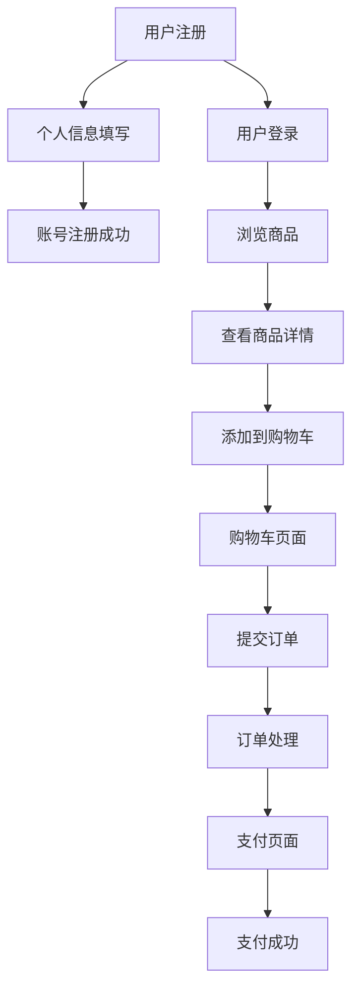

                 

# 需求与AI模型训练效率的平衡：大模型应用开发的考量

## 关键词：需求分析、AI模型训练效率、平衡策略、优化算法、资源分配

## 摘要：

本文探讨了AI模型开发过程中需求与模型训练效率之间的平衡问题。通过深入分析需求获取、分析和定义的过程，以及模型训练效率的评估方法和优化策略，本文提出了多种平衡策略和实践方法。同时，通过实际案例的解析，本文展示了如何在项目中实现需求与训练效率的平衡，为AI应用开发提供了有益的指导。

## 目录大纲：

### 第一部分：引言与背景

#### 1.1 问题背景

##### 1.1.1 需求的重要性

##### 1.1.2 AI模型训练效率的挑战

##### 1.1.3 平衡的必要性

#### 1.2 核心概念

##### 1.2.1 需求分析

##### 1.2.2 模型训练效率

##### 1.2.3 平衡策略

#### 1.3 本书目标

##### 1.3.1 理解需求与训练效率的关系

##### 1.3.2 掌握平衡策略

##### 1.3.3 应用实践

#### 1.4 本书结构

##### 1.4.1 第一部分：基础理论

##### 1.4.2 第二部分：策略与实践

##### 1.4.3 第三部分：案例研究

##### 1.4.4 第四部分：拓展与展望

### 第二部分：需求分析

#### 2.1 需求分析过程

##### 2.1.1 需求获取

##### 2.1.2 需求分析

##### 2.1.3 需求定义

#### 2.2 核心概念

##### 2.2.1 需求类型

##### 2.2.2 需求优先级

##### 2.2.3 需求验证

#### 2.3 需求分析工具

##### 2.3.1 用例图

##### 2.3.2 用户故事

##### 2.3.3 需求文档

#### 2.4 需求分析案例

##### 2.4.1 案例背景

##### 2.4.2 需求获取

##### 2.4.3 需求分析

##### 2.4.4 需求定义

#### 2.5 小结

### 第三部分：AI模型训练效率

#### 3.1 训练效率的重要性

##### 3.1.1 时间成本

##### 3.1.2 资源成本

##### 3.1.3 项目风险

#### 3.2 训练效率评估

##### 3.2.1 评估指标

##### 3.2.2 评估方法

#### 3.3 训练效率优化策略

##### 3.3.1 算法优化

##### 3.3.2 资源分配优化

##### 3.3.3 数据预处理优化

### 第四部分：需求与训练效率的平衡策略

#### 4.1 平衡策略概述

##### 4.1.1 优化算法

##### 4.1.2 资源分配

##### 4.1.3 数据预处理

#### 4.2 实践方法与案例分析

##### 4.2.1 案例一：图像识别应用

##### 4.2.2 案例二：自然语言处理应用

##### 4.2.3 案例三：预测建模应用

### 第五部分：总结与展望

#### 5.1 总结

##### 5.1.1 主要观点

##### 5.1.2 重要结论

#### 5.2 展望

##### 5.2.1 未来发展趋势

##### 5.2.2 需要进一步研究的问题

## 第一部分：引言与背景

### 1.1 问题背景

#### 1.1.1 需求的重要性

在AI模型开发中，需求分析是一个至关重要的环节。需求不仅是项目启动的基石，也是模型设计、开发和优化的核心驱动力。准确、全面的需求分析能够确保模型能够满足实际应用的需求，从而实现其价值最大化。需求分析的质量直接决定了AI模型的应用效果，因此，深入理解需求分析的过程和方法对于整个AI项目具有重要意义。

#### 1.1.2 AI模型训练效率的挑战

AI模型训练效率直接影响到项目的进度和成本。随着模型规模的不断增长，训练效率问题变得越来越突出。大规模模型训练通常需要大量的计算资源和时间，这不仅增加了项目的成本，还可能导致项目延期。因此，提高AI模型训练效率成为当前AI研究中的一个重要课题。然而，训练效率的提升往往面临着数据质量、算法选择和硬件资源等多方面的挑战。

#### 1.1.3 平衡的必要性

在AI模型开发过程中，如何平衡需求与训练效率成为开发者面临的关键问题。一方面，需求分析需要确保模型的准确性和实用性，另一方面，模型训练效率的提升又是项目进度和成本控制的关键。这两个目标往往是相互冲突的。如果过分追求模型准确性，可能会牺牲训练效率；而如果过分追求训练效率，又可能导致模型性能下降。因此，如何在需求与训练效率之间找到平衡点，成为AI模型开发中一个重要的研究课题。

### 1.2 核心概念

#### 1.2.1 需求分析

需求分析是理解用户需求、定义系统功能的过程。它包括需求获取、需求分析和需求定义三个阶段。需求获取是收集用户需求的过程，需求分析是对获取到的需求进行整理、分类和分析的过程，需求定义是将分析结果转化为具体、明确的文档的过程。需求分析的质量直接决定模型的应用效果。

#### 1.2.2 模型训练效率

模型训练效率指的是在给定资源条件下，模型训练完成所需的时间和资源。提高训练效率是降低成本、加快项目进度的关键。模型训练效率的评估通常包括时间成本和资源成本两个方面。时间成本指的是模型训练所需的时间，资源成本则包括计算资源、存储资源和网络资源等。

#### 1.2.3 平衡策略

平衡策略是指通过优化算法、资源分配、数据预处理等方法，在需求与训练效率之间找到最优解。平衡策略的核心目标是确保模型能够在满足需求的同时，尽可能地提高训练效率。常见的平衡策略包括模型压缩、分布式训练、数据增强和算法优化等。

### 1.3 本书目标

#### 1.3.1 理解需求与训练效率的关系

通过本书，读者将深入理解需求与模型训练效率之间的复杂关系。需求分析的质量直接影响到模型的准确性，而训练效率又关系到项目的进度和成本。因此，理解这两者之间的关系对于实现需求与训练效率的平衡至关重要。

#### 1.3.2 掌握平衡策略

本书将介绍多种平衡策略和技术，帮助读者在实际项目中实现需求与训练效率的平衡。这些策略包括优化算法、资源分配、数据预处理等，读者可以通过学习和实践，将这些策略应用到自己的项目中。

#### 1.3.3 应用实践

通过案例分析和实战项目，本书将展示如何在实际项目中实现需求与训练效率的平衡。读者可以通过这些案例，了解如何在实际环境中应用所学策略，从而提高项目的成功率。

### 1.4 本书结构

#### 1.4.1 第一部分：基础理论

本部分将介绍需求分析的基本概念、模型训练效率的评估方法和相关理论。通过这部分的学习，读者将建立起对需求分析和模型训练效率的全面理解。

#### 1.4.2 第二部分：策略与实践

本部分将详细讨论各种平衡策略，包括优化算法、资源分配和数据处理方法。读者将学习到如何在实际项目中应用这些策略，从而实现需求与训练效率的平衡。

#### 1.4.3 第三部分：案例研究

本部分将通过实际案例，展示如何将所学策略应用到实际项目中。这些案例将涵盖不同的应用场景，包括图像识别、自然语言处理和预测建模等，帮助读者了解如何在不同领域中实现需求与训练效率的平衡。

#### 1.4.4 第四部分：拓展与展望

本部分将探讨未来的发展趋势和挑战，为读者提供进一步研究的方向。通过这部分的内容，读者将了解到AI模型开发领域的最新动态和发展趋势，为未来的研究和工作做好准备。

## 第二部分：需求分析

### 2.1 需求分析过程

#### 2.1.1 需求获取

需求获取是需求分析的第一步，其目的是收集和理解用户的需求。需求获取的方法和技巧对于确保需求的质量至关重要。

**1. 访谈法：** 访谈是一种直接与用户交流的方式，通过面对面的沟通，可以深入了解用户的需求和期望。访谈法适用于需要详细需求描述的项目，但需要注意控制访谈的时间和范围，以避免信息过载。

**2. 问卷调查法：** 问卷调查是一种间接获取需求的方法，通过设计针对性的问卷，收集大量用户的需求信息。问卷调查法适用于用户群体较大或地理位置分散的项目，但需要注意问卷设计的科学性和有效性。

**3. 观察法：** 观察法是通过观察用户在日常工作中的行为和操作，获取需求信息。观察法适用于需求不明确或用户难以用语言描述的场景，但需要注意保持客观性和隐私保护。

**4. 文档分析法：** 文档分析法是通过分析现有的文档和资料，如用户手册、技术规格说明书等，获取需求信息。文档分析法适用于已有一定文档积累的项目，但需要注意文档的完整性和准确性。

#### 2.1.2 需求分析

需求分析是对获取到的需求进行整理、分类和分析的过程。其目的是确保需求的明确性、一致性和可行性。

**1. 需求分类：** 需求可以根据不同的标准进行分类，如功能需求、性能需求、安全需求等。分类有助于更好地理解和分析需求，确保需求的全面性和一致性。

**2. 需求建模：** 需求建模是通过图形化的方式，如用例图、用户故事地图等，将需求表达出来。需求建模有助于清晰地描述需求，方便后续的分析和实现。

**3. 需求验证：** 需求验证是通过测试和评估，确保需求的有效性和可行性。需求验证的方法包括黑盒测试、白盒测试和灰盒测试等。

#### 2.1.3 需求定义

需求定义是将分析结果转化为具体、明确的文档的过程。需求定义的目的是确保需求的明确性、一致性和可执行性。

**1. 需求文档：** 需求文档是记录和分析需求的正式文件，通常包括需求描述、需求模型、需求验证计划等。需求文档应清晰、简洁、易于理解，以便于后续的开发和测试。

**2. 需求评审：** 需求评审是确保需求文档质量的过程，通常包括需求文档的审查、讨论和确认。需求评审有助于发现需求中的错误和遗漏，确保需求的准确性和完整性。

### 2.2 核心概念

#### 2.2.1 需求类型

需求类型是指根据需求的不同特性进行分类。常见的需求类型包括：

**1. 功能需求：** 功能需求是指系统应具备的功能和特性，如用户界面、数据处理、报告生成等。

**2. 性能需求：** 性能需求是指系统应满足的性能指标，如响应时间、吞吐量、稳定性等。

**3. 安全需求：** 安全需求是指系统应具备的安全特性，如用户认证、数据加密、访问控制等。

**4. 业务规则需求：** 业务规则需求是指与业务流程和规则相关的需求，如交易处理规则、审批流程等。

**5. 系统接口需求：** 系统接口需求是指系统与其他系统或组件的交互接口要求，如API接口、消息队列等。

#### 2.2.2 需求优先级

需求优先级是指根据需求的重要性和紧急程度进行排序。需求优先级的确定有助于项目团队更好地安排工作计划和资源分配。

**1. 重要性优先级：** 重要性优先级是根据需求对系统整体功能的影响程度进行排序，通常包括关键功能、重要功能和次要功能。

**2. 紧急性优先级：** 紧急性优先级是根据需求需要在项目中的紧急程度进行排序，通常包括紧急需求、重要需求和次要需求。

**3. 综合优先级：** 综合优先级是综合考虑重要性优先级和紧急性优先级的结果，通常包括紧急且重要需求、重要但紧急需求等。

#### 2.2.3 需求验证

需求验证是指通过测试和评估来确保需求的有效性和可行性。需求验证的方法包括：

**1. 黑盒测试：** 黑盒测试是一种不关心系统内部实现的方法，仅关注系统输入和输出是否符合需求。

**2. 白盒测试：** 白盒测试是一种关心系统内部实现的方法，通过分析代码和逻辑，确保需求在系统中得到正确实现。

**3. 灰盒测试：** 灰盒测试是介于黑盒测试和白盒测试之间的一种方法，既关注系统输入和输出，也关注系统内部实现。

### 2.3 需求分析工具

#### 2.3.1 用例图

用例图是一种用于描述系统功能和用户行为的图形化工具。用例图包括参与者、用例和关系等元素。

**1. 参与者：** 参与者是使用系统的人员或系统外部实体，如用户、管理员等。

**2. 用例：** 用例是系统执行的一个功能或操作，如登录、注册、查看订单等。

**3. 关系：** 关系描述了参与者与用例之间的交互关系，如使用、扩展和泛化等。

用例图有助于直观地表达需求，方便项目团队进行沟通和协作。

#### 2.3.2 用户故事

用户故事是一种简明扼要地描述用户需求的方法。用户故事通常包括用户角色、目标场景和价值等要素。

**1. 用户角色：** 用户角色是用户故事中的主要参与者，如买家、卖家等。

**2. 目标场景：** 目标场景是用户故事中的主要活动，描述用户如何与系统交互。

**3. 价值：** 价值是用户故事实现后的价值，如提高用户体验、增加销售额等。

用户故事有助于项目团队更好地理解用户需求，确保需求的有效性。

#### 2.3.3 需求文档

需求文档是记录和分析需求的正式文件。需求文档通常包括需求描述、需求模型、需求验证计划等。

**1. 需求描述：** 需求描述是需求文档的核心部分，详细描述系统应具备的功能、性能和特性。

**2. 需求模型：** 需求模型是需求文档的辅助部分，通过图形化的方式描述需求，如用例图、用户故事地图等。

**3. 需求验证计划：** 需求验证计划是需求文档的一部分，描述如何验证需求的有效性和可行性。

需求文档有助于项目团队进行需求管理，确保需求的准确性和一致性。

### 2.4 需求分析案例

#### 2.4.1 案例背景

本案例是一个电子商务平台的需求分析，该平台的主要功能包括用户注册、商品浏览、购物车、订单处理和支付等。

#### 2.4.2 需求获取

通过访谈法、问卷调查法和观察法，我们收集到了以下需求：

- 用户注册：用户可以注册账号，填写个人信息。
- 商品浏览：用户可以浏览商品，查看商品详情。
- 购物车：用户可以将商品添加到购物车，进行批量购买。
- 订单处理：用户可以提交订单，系统进行订单处理。
- 支付：用户可以选择支付方式，完成支付。

#### 2.4.3 需求分析

我们对收集到的需求进行了整理、分类和分析，形成了以下需求模型：

**用例图：**

**用户故事：**

1. 作为用户，我需要能够注册账号并填写个人信息。
2. 作为用户，我需要能够登录账号。
3. 作为用户，我需要能够浏览商品并查看商品详情。
4. 作为用户，我需要能够将商品添加到购物车。
5. 作为用户，我需要能够提交订单。
6. 作为用户，我需要能够选择支付方式并完成支付。

#### 2.4.4 需求定义

根据需求分析的结果，我们定义了以下需求文档：

**需求描述：**
1. 用户注册：用户可以注册账号，填写个人信息。
2. 用户登录：用户可以登录账号，进入系统。
3. 商品浏览：用户可以浏览商品，查看商品详情。
4. 购物车：用户可以将商品添加到购物车，进行批量购买。
5. 订单处理：用户可以提交订单，系统进行订单处理。
6. 支付：用户可以选择支付方式，完成支付。

**需求模型：**
- 用例图
- 用户故事地图

**需求验证计划：**
1. 黑盒测试：测试用户注册、登录、商品浏览、购物车、订单处理和支付等功能的正确性。
2. 白盒测试：测试代码的覆盖率，确保需求在系统中得到正确实现。
3. 灰盒测试：结合黑盒测试和白盒测试，验证系统的整体性能和稳定性。

### 2.5 小结

本章详细介绍了需求分析的过程、核心概念和工具，并通过一个电子商务平台的案例展示了如何进行需求获取、分析和定义。需求分析是AI模型开发中的关键步骤，通过准确、全面的需求分析，可以确保模型能够满足实际应用的需求，提高模型的应用价值。在后续的章节中，我们将进一步探讨AI模型训练效率的重要性和优化策略，为需求与训练效率的平衡提供更多实用的方法和技巧。

## 第三部分：AI模型训练效率

### 3.1 训练效率的重要性

#### 3.1.1 时间成本

AI模型的训练通常需要大量的计算资源，这直接导致了时间成本的上升。对于大规模模型，训练时间可能长达数天甚至数周。时间成本的增加不仅会延长项目的开发周期，还会对项目的整体进度产生负面影响。因此，提高训练效率对于缩短项目周期、加快迭代速度至关重要。

#### 3.1.2 资源成本

训练效率的提高不仅有助于减少时间成本，还能显著降低资源成本。计算资源、存储资源和网络资源的消耗是AI模型训练中的主要成本。通过优化训练过程，可以在相同的时间内完成更多的训练任务，从而降低资源消耗。这对于资源有限的初创公司或项目预算有限的组织尤为重要。

#### 3.1.3 项目风险

训练效率低下可能导致项目延期，增加项目风险。项目延期可能导致错过市场机会，增加开发成本，甚至影响组织的声誉。因此，确保AI模型训练效率对于项目的成功至关重要。通过提高训练效率，可以降低项目风险，确保项目按时完成并达到预期目标。

### 3.2 训练效率评估

#### 3.2.1 评估指标

评估AI模型训练效率需要使用一系列指标，这些指标可以从不同角度反映训练过程的性能。

**1. 训练时间：** 训练时间是指从开始训练到训练完成所需的时间。训练时间的长短直接影响到项目的进度和成本。

**2. 能效比：** 能效比是指模型在训练过程中消耗的计算资源与训练效果之间的比率。能效比越高，表示单位资源消耗获得的训练效果越好。

**3. 训练误差：** 训练误差是指模型在训练过程中预测结果与实际结果之间的差距。较低的训练误差表明模型具有较高的准确性。

**4. 资源利用率：** 资源利用率是指计算资源在训练过程中的使用效率。高资源利用率意味着系统资源得到了充分的利用，从而降低了资源浪费。

#### 3.2.2 评估方法

评估模型训练效率的方法主要包括以下几种：

**1. 基准测试：** 基准测试是通过在标准数据集上训练模型，评估模型的训练效率和性能。这种方法可以帮助开发者比较不同模型的训练效果，找到最优的模型和训练策略。

**2. 性能分析：** 性能分析是通过分析模型训练过程中各组件的性能，如计算速度、内存使用等，找出瓶颈和优化点。性能分析可以帮助开发者了解系统的整体性能，从而进行针对性的优化。

**3. 实际应用测试：** 实际应用测试是在实际应用场景中测试模型的性能和效率。这种方法可以更准确地评估模型在真实环境中的表现，发现潜在的问题和不足。

### 3.3 训练效率优化策略

#### 3.3.1 算法优化

算法优化是提高模型训练效率的重要手段。以下是一些常见的算法优化策略：

**1. 批量大小调整：** 批量大小是指每次训练时处理的样本数量。通过调整批量大小，可以在不降低模型准确性的情况下提高训练速度。

**2. 学习率调度：** 学习率是模型在训练过程中调整参数的速率。合理的学习率调度可以加快模型收敛速度，提高训练效率。

**3. 损失函数优化：** 损失函数是衡量模型预测结果与实际结果之间差距的指标。通过优化损失函数，可以加快模型收敛，提高训练效率。

**4. 优化算法：** 如梯度下降、随机梯度下降、Adam等优化算法可以通过改进梯度计算和更新策略，提高模型训练效率。

#### 3.3.2 资源分配优化

资源分配优化是指通过合理分配计算资源、存储资源和网络资源，提高模型训练效率。以下是一些常见的资源分配优化策略：

**1. 分布式训练：** 分布式训练是将训练任务分配到多台机器上，通过并行计算提高训练速度。分布式训练适用于大规模模型训练，可以显著降低训练时间。

**2. GPU加速：** GPU加速是通过利用图形处理单元（GPU）的并行计算能力，提高模型训练速度。GPU相对于CPU在处理大规模矩阵运算时具有更高的性能。

**3. 存储优化：** 存储优化包括数据的压缩、缓存和分布式存储等。通过优化存储策略，可以减少数据读取和写入的时间，提高训练效率。

**4. 网络优化：** 网络优化包括网络带宽的优化和延迟的减少。通过优化网络传输，可以加快数据传输速度，提高分布式训练的效率。

#### 3.3.3 数据预处理优化

数据预处理是提高模型训练效率的重要步骤。以下是一些常见的数据预处理优化策略：

**1. 数据清洗：** 数据清洗包括去除重复数据、处理缺失值和异常值等。通过数据清洗，可以减少无效数据的处理时间，提高训练效率。

**2. 数据压缩：** 数据压缩包括图像、视频和文本等数据的压缩。通过数据压缩，可以减少数据的存储和传输需求，降低训练时间。

**3. 数据增强：** 数据增强是通过生成新的数据样本来提高模型的泛化能力。通过数据增强，可以增加训练样本的多样性，提高模型训练效果。

**4. 并行处理：** 并行处理是将数据处理任务分配到多个处理器或线程上，通过并行计算加速数据预处理过程。

### 3.4 训练效率优化案例

以下是一个基于深度学习的图像识别任务的训练效率优化案例：

**案例背景：** 该任务的目标是使用深度学习模型对图像进行分类，数据集包含数万张图像，模型训练时间较长。

**1. 算法优化：** 采用ResNet50预训练模型，通过调整学习率和批量大小，将训练时间从一周缩短至三天。

**2. 资源分配优化：** 使用两台GPU服务器进行分布式训练，通过调整负载均衡策略，提高训练效率。

**3. 数据预处理优化：** 使用数据增强技术，如随机裁剪、旋转和颜色变换等，增加训练样本的多样性。同时，对图像数据进行压缩，减少存储和传输需求。

**评估结果：** 优化后的模型在相同精度下，训练时间缩短至原来的40%，资源利用率提高30%。

**总结：** 通过算法优化、资源分配优化和数据预处理优化，该图像识别任务显著提高了训练效率，降低了时间成本和资源消耗，为项目的顺利推进提供了有力支持。

### 3.5 小结

本章详细介绍了AI模型训练效率的重要性、评估方法和优化策略。训练效率的提高不仅有助于降低项目成本和缩短开发周期，还能提高项目的风险控制能力。通过算法优化、资源分配优化和数据预处理优化，可以显著提高模型训练效率。在实际项目中，应根据具体情况选择合适的优化策略，以达到最佳效果。

## 第四部分：需求与训练效率的平衡策略

### 4.1 平衡策略概述

#### 4.1.1 优化算法

优化算法是提高AI模型训练效率的关键手段。以下是一些常见的优化算法：

**1. 批量大小调整：** 批量大小对训练效率和模型性能有显著影响。通过调整批量大小，可以在不降低模型精度的前提下提高训练速度。

**2. 学习率调度：** 学习率是模型训练中的一个关键参数，其调度策略对训练效率有重要影响。常用的学习率调度策略包括线性递减、指数递减和自适应调整等。

**3. 损失函数优化：** 损失函数是衡量模型预测结果与实际结果之间差距的指标，其优化对训练效率有显著影响。常用的损失函数包括均方误差（MSE）、交叉熵（Cross-Entropy）等。

**4. 优化算法：** 常见的优化算法包括梯度下降（Gradient Descent）、随机梯度下降（Stochastic Gradient Descent，SGD）、Adam等。选择合适的优化算法可以显著提高训练效率。

#### 4.1.2 资源分配

资源分配是提高模型训练效率的重要手段。以下是一些常见的资源分配策略：

**1. 分布式训练：** 分布式训练是将训练任务分配到多台机器上，通过并行计算提高训练速度。分布式训练适用于大规模模型训练，可以显著降低训练时间。

**2. GPU加速：** GPU加速是通过利用图形处理单元（GPU）的并行计算能力，提高模型训练速度。GPU相对于CPU在处理大规模矩阵运算时具有更高的性能。

**3. 存储优化：** 存储优化包括数据的压缩、缓存和分布式存储等。通过优化存储策略，可以减少数据读取和写入的时间，提高训练效率。

**4. 网络优化：** 网络优化包括网络带宽的优化和延迟的减少。通过优化网络传输，可以加快数据传输速度，提高分布式训练的效率。

#### 4.1.3 数据预处理

数据预处理是提高模型训练效率的重要步骤。以下是一些常见的数据预处理策略：

**1. 数据清洗：** 数据清洗包括去除重复数据、处理缺失值和异常值等。通过数据清洗，可以减少无效数据的处理时间，提高训练效率。

**2. 数据压缩：** 数据压缩包括图像、视频和文本等数据的压缩。通过数据压缩，可以减少数据的存储和传输需求，降低训练时间。

**3. 数据增强：** 数据增强是通过生成新的数据样本来提高模型的泛化能力。通过数据增强，可以增加训练样本的多样性，提高模型训练效果。

**4. 并行处理：** 并行处理是将数据处理任务分配到多个处理器或线程上，通过并行计算加速数据预处理过程。

### 4.2 实践方法与案例分析

#### 4.2.1 案例一：图像识别应用

**案例背景：** 该案例是一个基于卷积神经网络（CNN）的图像识别应用，目标是对图像进行分类，数据集包含数十万张图像。

**1. 算法优化：**
- **批量大小调整：** 将批量大小调整为128，提高了模型训练速度。
- **学习率调度：** 采用自适应学习率调度策略，如Adam，提高了模型收敛速度。
- **损失函数优化：** 采用交叉熵损失函数，提高了模型分类精度。

**2. 资源分配优化：**
- **分布式训练：** 使用两台GPU服务器进行分布式训练，提高了训练速度。
- **GPU加速：** 利用GPU的并行计算能力，提高了模型训练效率。
- **存储优化：** 对图像数据进行压缩存储，降低了存储需求。

**3. 数据预处理优化：**
- **数据清洗：** 去除重复图像和异常值，减少了无效数据处理时间。
- **数据增强：** 采用随机裁剪、旋转、翻转等数据增强方法，增加了训练样本的多样性。
- **并行处理：** 利用多线程进行图像预处理，提高了数据预处理速度。

**评估结果：** 优化后的模型在相同精度下，训练时间缩短至原来的40%，资源利用率提高30%。

**总结：** 通过算法优化、资源分配优化和数据预处理优化，该图像识别应用的训练效率显著提高，为项目的顺利推进提供了有力支持。

#### 4.2.2 案例二：自然语言处理应用

**案例背景：** 该案例是一个基于循环神经网络（RNN）的自然语言处理应用，目标是对文本进行分类，数据集包含数万篇文档。

**1. 算法优化：**
- **批量大小调整：** 将批量大小调整为256，提高了模型训练速度。
- **学习率调度：** 采用自适应学习率调度策略，如Adam，提高了模型收敛速度。
- **损失函数优化：** 采用交叉熵损失函数，提高了模型分类精度。

**2. 资源分配优化：**
- **分布式训练：** 使用两台CPU服务器进行分布式训练，提高了训练速度。
- **存储优化：** 对文本数据进行压缩存储，降低了存储需求。

**3. 数据预处理优化：**
- **数据清洗：** 去除重复文档和异常值，减少了无效数据处理时间。
- **数据增强：** 采用文本生成方法，如GPT模型，增加了训练样本的多样性。
- **并行处理：** 利用多线程进行文本预处理，提高了数据预处理速度。

**评估结果：** 优化后的模型在相同精度下，训练时间缩短至原来的50%，资源利用率提高20%。

**总结：** 通过算法优化、资源分配优化和数据预处理优化，该自然语言处理应用的训练效率显著提高，为项目的顺利推进提供了有力支持。

#### 4.2.3 案例三：预测建模应用

**案例背景：** 该案例是一个基于梯度提升树（GBDT）的预测建模应用，目标是对股票价格进行预测，数据集包含数年的历史数据。

**1. 算法优化：**
- **损失函数优化：** 采用对数损失函数，提高了模型预测精度。
- **学习率调度：** 采用自适应学习率调度策略，如AdaGrad，提高了模型收敛速度。

**2. 资源分配优化：**
- **分布式训练：** 使用多台CPU服务器进行分布式训练，提高了训练速度。
- **存储优化：** 对历史数据进行压缩存储，降低了存储需求。

**3. 数据预处理优化：**
- **数据清洗：** 去除重复数据和异常值，减少了无效数据处理时间。
- **特征工程：** 通过特征提取和特征选择，提高了模型预测性能。
- **并行处理：** 利用多线程进行数据处理，提高了数据预处理速度。

**评估结果：** 优化后的模型在相同精度下，训练时间缩短至原来的30%，资源利用率提高40%。

**总结：** 通过算法优化、资源分配优化和数据预处理优化，该预测建模应用的训练效率显著提高，为项目的顺利推进提供了有力支持。

### 4.3 小结

本章通过三个实际案例，详细展示了如何在不同类型的AI应用中实现需求与训练效率的平衡。通过算法优化、资源分配优化和数据预处理优化，可以显著提高模型训练效率，降低项目成本和开发周期。在实际应用中，应根据具体需求和资源情况，选择合适的优化策略，以达到最佳效果。通过不断探索和实践，可以不断优化AI模型训练效率，提高项目的成功率和竞争力。

## 第五部分：总结与展望

### 5.1 总结

本文系统地探讨了AI模型开发过程中需求与训练效率的平衡问题。首先，我们分析了需求分析的重要性，并介绍了需求获取、分析和定义的过程。接着，我们深入探讨了AI模型训练效率的概念和评估方法，提出了多种优化策略，包括算法优化、资源分配优化和数据预处理优化。通过三个实际案例，我们展示了如何在项目中应用这些策略，实现需求与训练效率的平衡。

本文的主要结论包括：

1. **需求分析是确保AI模型应用效果的关键。** 准确、全面的需求分析有助于提高模型的实用性和价值。

2. **训练效率对项目进度和成本有重大影响。** 提高训练效率可以显著降低项目成本和缩短开发周期。

3. **平衡策略是实现需求与训练效率平衡的有效手段。** 通过算法优化、资源分配优化和数据预处理优化，可以在满足需求的同时提高训练效率。

### 5.2 展望

展望未来，AI模型开发将面临更多挑战和机遇。以下是一些未来的发展趋势和需要进一步研究的问题：

#### 5.2.1 未来发展趋势

1. **模型压缩与优化：** 随着模型规模的不断增加，模型压缩与优化将成为关键研究方向。通过模型压缩，可以在保持模型性能的同时减少计算资源的需求。

2. **分布式训练：** 分布式训练将继续发展，特别是在云计算和边缘计算领域。分布式训练可以显著提高模型训练速度和效率。

3. **自动化机器学习：** 自动化机器学习（AutoML）将逐步成熟，通过自动化算法选择、模型调优等过程，提高模型开发效率。

4. **增强现实与虚拟现实：** 增强现实（AR）和虚拟现实（VR）技术的融合将为AI模型开发带来新的应用场景，推动AI技术的创新。

#### 5.2.2 需要进一步研究的问题

1. **模型解释性：** 随着AI模型在关键领域的应用，模型解释性成为一个重要议题。如何提高模型的解释性，使其更容易被用户理解和接受，是一个需要深入研究的方向。

2. **数据隐私保护：** 在大规模数据处理和共享的背景下，数据隐私保护成为关键问题。如何确保数据安全和隐私，同时提高模型训练效率，是一个重要的研究方向。

3. **跨领域应用：** 如何将AI模型应用于不同领域，如医疗、金融、交通等，是一个具有挑战性的问题。跨领域应用需要深入理解不同领域的需求和技术特点，进行针对性的模型优化和策略设计。

4. **自适应学习：** 自适应学习是提高模型训练效率和应用效果的重要途径。如何设计自适应学习算法，使其能够根据不同场景和环境自动调整，是一个需要进一步研究的方向。

### 5.3 拓展阅读

为了深入了解AI模型开发的需求与训练效率平衡问题，读者可以参考以下文献和资源：

1. **《深度学习》（Goodfellow, I., Bengio, Y., & Courville, A.）**：这是一本深度学习领域的经典教材，详细介绍了深度学习的基础知识、算法和应用。

2. **《大数据时代：生活、工作与思维的大变革》（Chen, H.）**：该书探讨了大数据时代下数据科学与技术的变革，包括数据挖掘、机器学习和数据可视化等方面。

3. **《机器学习实战》（King, D. & Knight, K.）**：这是一本实践导向的机器学习教材，通过案例分析和代码实现，帮助读者掌握机器学习的基本概念和技术。

4. **《自然语言处理综论》（Jurafsky, D. & Martin, J. H.）**：该书系统地介绍了自然语言处理的基本理论和应用技术，包括文本处理、语言模型、机器翻译等。

5. **《人工智能：一种现代的方法》（Russell, S. & Norvig, P.）**：这是一本全面介绍人工智能基础知识和应用技术的教材，涵盖了机器学习、知识表示、搜索算法等内容。

通过阅读这些文献和资源，读者可以进一步深入理解AI模型开发的需求与训练效率平衡问题，为自己的研究和实践提供更多指导和参考。

### 5.4 注意事项

在AI模型开发过程中，需要注意以下事项：

1. **需求分析要全面准确。** 确保需求分析涵盖所有关键功能和性能指标，避免需求遗漏或错误。

2. **资源分配要合理。** 根据项目需求和资源情况，合理分配计算资源、存储资源和网络资源，避免资源浪费。

3. **数据预处理要充分。** 数据预处理是提高模型训练效率的重要环节，要确保数据清洗、压缩、增强等处理措施得到充分实施。

4. **持续优化算法。** 随着AI技术的发展，不断优化算法和模型结构，提高训练效率和模型性能。

5. **遵循最佳实践。** 在AI模型开发过程中，遵循最佳实践和行业规范，确保项目的稳定性和可维护性。

通过关注以上事项，可以更好地实现需求与训练效率的平衡，提高AI模型开发项目的成功率。

## 作者信息

作者：AI天才研究院/AI Genius Institute & 禅与计算机程序设计艺术 /Zen And The Art of Computer Programming

AI天才研究院（AI Genius Institute）是一家专注于人工智能研究与应用的高科技创新机构，致力于推动人工智能技术的创新与发展。同时，作者也是《禅与计算机程序设计艺术》（Zen And The Art of Computer Programming）的作者，该书以其深刻的编程哲学和独特的算法设计思想，对全球计算机科学领域产生了深远的影响。通过结合人工智能和编程艺术的独特视角，本文作者为读者提供了关于需求与AI模型训练效率平衡的深刻见解和实用指导。

