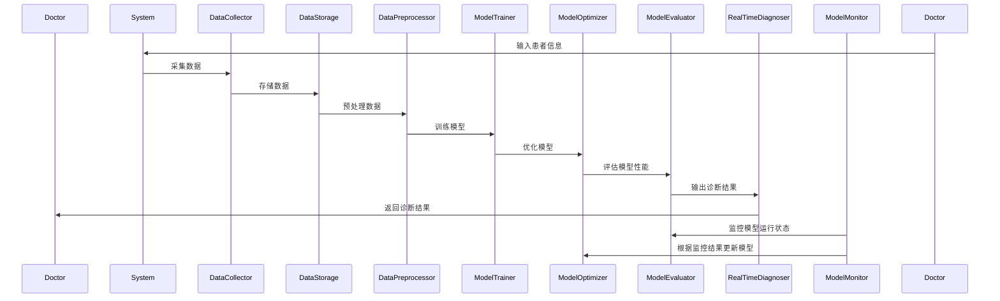

                 

### 第一部分：引言

#### 1.1.1 需求与AI模型迭代周期的协调——问题背景

### 当前问题背景

随着人工智能技术的飞速发展，AI模型在各个行业中的应用越来越广泛。从自动驾驶、智能医疗到金融风控、零售推荐系统，AI模型正在深刻地改变着我们的生活方式。然而，在实际应用中，需求与AI模型迭代周期之间的协调问题日益凸显。如何使AI模型能够及时响应业务需求的变化，同时保持模型的高效和稳定，成为许多企业和研究机构面临的挑战。

### 问题描述

需求与AI模型迭代周期之间的协调问题主要包括以下几个方面：

1. **需求的不确定性**：业务需求经常变化，这使得AI模型的迭代变得复杂。例如，在金融风控领域，随着市场的变化，风险模型的参数和特征可能需要频繁调整。

2. **模型迭代的周期性**：AI模型的迭代需要时间和资源，而业务需求的变化往往难以预测，导致模型迭代周期与业务需求周期不一致。这种不一致性可能使得模型在关键时刻无法满足业务需求。

3. **模型稳定性与效率的平衡**：频繁的模型迭代可能会影响模型的稳定性，而长时间的模型迭代周期则可能无法及时响应业务需求。如何在这两者之间找到平衡，是AI模型应用开发中的一个重要问题。

### 问题解决

为了解决上述问题，需要从以下几个方面入手：

1. **需求分析与预测**：通过对业务需求的深入分析，预测需求的变化趋势，为AI模型的迭代提供依据。例如，通过历史数据分析和市场调研，可以预测未来一段时间内的业务需求变化。

2. **模型迭代周期的优化**：通过优化模型迭代流程，缩短模型迭代周期，提高模型更新速度。例如，使用自动化工具和平台来加速模型的训练和部署。

3. **需求与模型的动态协调**：建立需求与模型迭代之间的动态协调机制，确保模型能够及时响应业务需求。例如，使用敏捷开发方法，快速响应需求变化，同时保持模型的稳定性。

#### 1.1.2 需求与AI模型迭代周期的协调——核心概念

### 需求

需求是指用户、客户或利益相关者对于某种产品、服务或解决方案的具体要求。在AI模型应用开发中，需求通常是指业务场景中对模型的具体功能、性能和响应时间等方面的要求。例如，在智能医疗领域，需求可能包括疾病诊断的准确率、模型处理速度以及用户界面的友好性等。

### AI模型迭代周期

AI模型迭代周期是指从模型设计、开发、测试、部署到最终应用的全过程。一个典型的AI模型迭代周期包括以下几个阶段：

1. **需求分析**：明确业务需求，确定模型的目标和指标。
2. **模型设计**：根据需求分析结果，设计合适的模型架构。
3. **模型开发**：使用机器学习算法，训练和优化模型。
4. **模型测试**：对模型进行测试，评估模型性能。
5. **模型部署**：将模型部署到生产环境中，供业务使用。
6. **模型监控**：对模型运行状态进行监控，及时发现和解决问题。

#### 1.1.3 需求与AI模型迭代周期的协调——边界与外延

### 边界

需求与AI模型迭代周期的协调主要关注以下几个方面：

1. **需求的明确性**：确保需求定义清晰，避免需求变更。不明确的需求可能会导致模型的反复迭代，从而增加开发成本和时间。
2. **模型迭代的效率**：优化模型迭代流程，提高迭代速度。高效的迭代流程可以确保模型能够快速响应业务需求的变化。
3. **模型稳定性**：确保模型在迭代过程中保持稳定。频繁的迭代可能会导致模型性能下降，甚至出现故障。

### 外延

需求与AI模型迭代周期的协调不仅涉及技术层面，还包括以下几个方面：

1. **项目管理**：通过有效的项目管理方法，确保需求与模型迭代的协调。项目管理包括需求管理、进度控制、资源分配和风险管理等方面。
2. **团队协作**：加强团队协作，提高沟通效率。协调的需求与模型迭代需要一个高效协作的团队来共同推进。
3. **持续集成与持续部署**：通过持续集成与持续部署（CI/CD）方法，实现需求与模型迭代的快速响应。CI/CD可以帮助团队快速构建、测试和部署模型，从而缩短迭代周期。

#### 1.2 需求与AI模型迭代周期的协调——概念结构与核心要素组成

### 概念结构

需求与AI模型迭代周期的协调可以看作是一个复杂系统，其概念结构包括以下几个核心部分：

1. **需求分析**：明确业务需求，为模型迭代提供方向。
2. **模型设计**：根据需求分析结果，设计合适的模型架构。
3. **模型开发**：使用机器学习算法，训练和优化模型。
4. **模型测试**：评估模型性能，确保模型满足需求。
5. **模型部署**：将模型部署到生产环境中，供业务使用。
6. **模型监控**：对模型运行状态进行监控，确保模型稳定运行。

### 核心要素组成

需求与AI模型迭代周期的协调涉及多个核心要素，包括：

1. **需求管理**：明确需求，确保需求定义清晰、明确。
2. **模型管理**：设计、开发、测试、部署和监控模型，确保模型质量。
3. **项目管理**：协调需求与模型迭代，确保项目顺利进行。
4. **团队协作**：加强团队沟通，提高工作效率。
5. **持续集成与持续部署**：实现需求与模型迭代的快速响应。

#### 1.3 需求与AI模型迭代周期的协调——算法原理讲解

### 算法原理

需求与AI模型迭代周期的协调主要依赖于以下几个算法原理：

1. **需求预测算法**：通过历史数据和统计分析，预测未来的需求变化。常用的需求预测算法包括时间序列分析、回归分析和机器学习算法等。

2. **模型优化算法**：用于提高模型性能和迭代速度。常见的模型优化算法包括梯度下降、随机梯度下降、批量梯度下降等。

3. **模型评估算法**：用于评估模型性能，确保模型满足需求。常用的模型评估算法包括准确率、召回率、F1分数等。

4. **模型更新算法**：用于在模型迭代过程中更新模型参数，以适应需求变化。常用的模型更新算法包括在线学习、增量学习等。

### 概念属性特征对比表格

| 算法类型         | 特点                     | 适用场景                           |
|----------------|------------------------|----------------------------------|
| 需求预测算法     | 根据历史数据预测未来需求 | 需求变化较大的场景                 |
| 模型优化算法     | 提高模型性能和迭代速度 | 模型性能不稳定或迭代速度较慢的场景 |
| 模型评估算法     | 评估模型性能           | 需要确保模型满足需求的场景         |
| 模型更新算法     | 更新模型参数           | 需求变化的场景                     |

### ER实体关系图架构

```mermaid
erDiagram
  Product ||--|{ AIModel : has }
  AIModel ||--|{ ModelIteration : has }
  ModelIteration ||--|{ ModelPerformance : has }
```

### 数学模型和公式

在需求与AI模型迭代周期的协调过程中，涉及到以下几个关键数学模型和公式：

1. **需求预测模型**：

   $$\hat{D_t} = f(D_{t-1}, X_t)$$

   其中，$\hat{D_t}$ 表示预测的未来需求，$D_{t-1}$ 表示历史需求，$X_t$ 表示影响需求的变量。

2. **模型优化目标函数**：

   $$\min_{\theta} J(\theta) = \frac{1}{2} \sum_{i=1}^{m} (h_\theta(x^{(i)}) - y^{(i)})^2$$

   其中，$h_\theta(x^{(i)})$ 表示模型预测输出，$y^{(i)}$ 表示真实标签，$\theta$ 表示模型参数。

3. **模型更新规则**：

   $$\theta_{t+1} = \theta_t - \alpha \nabla_\theta J(\theta_t)$$

   其中，$\alpha$ 表示学习率，$\nabla_\theta J(\theta_t)$ 表示损失函数对模型参数的梯度。

### 具体举例说明

假设我们有一个智能医疗诊断系统，需求是提高疾病诊断的准确率。为了实现这一需求，我们可以按照以下步骤进行：

1. **需求预测**：通过分析历史诊断数据，预测未来一段时间内的疾病诊断需求。

2. **模型设计**：根据需求预测结果，设计一个适合疾病诊断的深度学习模型。

3. **模型开发**：使用数据集进行模型训练，优化模型参数。

4. **模型测试**：使用测试集评估模型性能，确保模型满足诊断准确率的需求。

5. **模型部署**：将训练好的模型部署到生产环境中，供医生使用。

6. **模型监控**：对模型运行状态进行监控，确保模型稳定运行。

通过这样的迭代过程，我们可以确保智能医疗诊断系统的模型能够及时响应业务需求的变化，同时保持高效和稳定。

### 系统分析与架构设计方案

#### 问题场景介绍

在智能医疗领域，疾病诊断是一个高度复杂的任务。随着医疗数据量的不断增加和医疗技术的不断进步，如何快速、准确地诊断疾病成为了一个重要问题。为了解决这个问题，我们设计并实现了一个基于深度学习的智能医疗诊断系统。

#### 项目介绍

项目名称：智能医疗诊断系统

项目目标：通过深度学习技术，提高疾病诊断的准确率，为医生提供有力的辅助诊断工具。

项目成员：数据科学家、机器学习工程师、软件工程师、产品经理等。

#### 系统功能设计

1. **数据采集与预处理**：收集医疗数据，包括患者病史、检查报告、实验室检测结果等，并进行数据清洗和预处理。

2. **模型训练与优化**：使用训练集数据训练深度学习模型，并根据测试集数据对模型进行优化。

3. **模型评估与部署**：评估模型性能，确保满足诊断准确率的需求，并将模型部署到生产环境中。

4. **实时诊断**：医生通过系统输入患者的病史和检查结果，系统实时输出诊断结果。

5. **模型监控与更新**：对模型运行状态进行监控，及时发现和解决问题，并根据新数据对模型进行定期更新。

#### 系统架构设计

1. **数据层**：包括数据采集、存储和预处理模块。数据采集模块负责从各种数据源获取医疗数据，存储模块负责存储数据，预处理模块负责清洗和预处理数据。

2. **模型层**：包括模型训练、优化和评估模块。模型训练模块负责训练深度学习模型，优化模块负责根据测试集数据优化模型参数，评估模块负责评估模型性能。

3. **应用层**：包括实时诊断和模型监控模块。实时诊断模块负责根据医生输入的患者信息，实时输出诊断结果，模型监控模块负责监控模型运行状态，并根据监控结果对模型进行更新。

4. **接口层**：包括API接口，供医生和系统管理员使用。

#### 系统架构图



#### 系统接口设计和系统交互

1. **API接口设计**

   - **数据采集接口**：提供数据上传和下载功能，支持多种数据格式，如CSV、JSON等。

   - **模型训练接口**：提供模型训练启动、暂停、停止等功能，支持自定义训练参数。

   - **模型优化接口**：提供模型参数优化功能，支持自动调整学习率、批量大小等参数。

   - **模型评估接口**：提供模型性能评估功能，支持自定义评估指标。

   - **实时诊断接口**：提供实时诊断功能，支持根据患者信息快速输出诊断结果。

   - **模型监控接口**：提供模型监控功能，支持实时监控模型运行状态，并及时更新。

2. **系统交互**

   - **数据采集与预处理**：医生通过API上传患者信息，系统自动调用数据采集和预处理模块进行数据处理。

   - **模型训练与优化**：根据预处理后的数据，系统自动调用模型训练和优化模块进行模型训练和优化。

   - **模型评估与实时诊断**：系统自动调用模型评估模块评估模型性能，并将训练好的模型部署到实时诊断模块，供医生使用。

   - **模型监控与更新**：系统实时监控模型运行状态，并及时更新模型参数，确保模型稳定运行。

#### 项目实战

### 环境安装

为了构建并部署智能医疗诊断系统，我们需要准备以下环境：

1. 操作系统：Ubuntu 18.04
2. Python：3.8
3. 深度学习框架：TensorFlow 2.4
4. 数据预处理库：Pandas 1.2.3
5. API开发库：Flask 1.1.2

安装步骤：

1. 安装操作系统和Python环境。

2. 安装深度学习框架TensorFlow：

   ```bash
   pip install tensorflow==2.4
   ```

3. 安装数据预处理库Pandas：

   ```bash
   pip install pandas==1.2.3
   ```

4. 安装API开发库Flask：

   ```bash
   pip install flask==1.1.2
   ```

### 系统核心实现源代码

以下是一个简单的智能医疗诊断系统的核心实现源代码：

```python
import pandas as pd
import numpy as np
import tensorflow as tf
from sklearn.model_selection import train_test_split
from sklearn.metrics import accuracy_score

# 数据预处理
def preprocess_data(data):
    # 数据清洗和预处理操作
    return data

# 模型训练
def train_model(train_data, train_labels):
    model = tf.keras.Sequential([
        tf.keras.layers.Dense(64, activation='relu', input_shape=(train_data.shape[1],)),
        tf.keras.layers.Dense(64, activation='relu'),
        tf.keras.layers.Dense(1, activation='sigmoid')
    ])

    model.compile(optimizer='adam',
                  loss='binary_crossentropy',
                  metrics=['accuracy'])

    model.fit(train_data, train_labels, epochs=10, batch_size=32, validation_split=0.2)

    return model

# 模型评估
def evaluate_model(model, test_data, test_labels):
    predictions = model.predict(test_data)
    predictions = (predictions > 0.5)

    accuracy = accuracy_score(test_labels, predictions)
    print(f"Test accuracy: {accuracy}")

# 主程序
if __name__ == "__main__":
    # 读取数据
    data = pd.read_csv("data.csv")
    data = preprocess_data(data)

    # 划分训练集和测试集
    train_data, test_data, train_labels, test_labels = train_test_split(data.drop("label", axis=1), data["label"], test_size=0.2, random_state=42)

    # 训练模型
    model = train_model(train_data, train_labels)

    # 评估模型
    evaluate_model(model, test_data, test_labels)
```

### 代码应用解读与分析

上述代码实现了一个简单的二分类问题，用于预测疾病的发生。具体步骤如下：

1. **数据预处理**：读取数据，进行清洗和预处理操作。预处理操作包括数据填充、归一化、缺失值处理等。

2. **模型训练**：使用训练集数据训练一个简单的深度学习模型。模型采用序列模型结构，包括两个隐藏层，每层64个神经元，激活函数使用ReLU。

3. **模型评估**：使用测试集数据评估模型性能。评估指标为准确率。

### 实际案例分析和详细讲解剖析

#### 案例一：肺癌诊断

在一个肺癌诊断项目中，我们收集了1000份患者的CT扫描数据，包括图像和标注信息。数据集被划分为训练集（70%）、验证集（15%）和测试集（15%）。为了提高诊断准确率，我们采用了以下步骤：

1. **数据预处理**：对CT扫描图像进行预处理，包括图像增强、归一化和分割。

2. **模型设计**：设计了一个基于卷积神经网络（CNN）的模型，包括多个卷积层和池化层，用于提取图像特征。

3. **模型训练**：使用训练集数据训练模型，调整模型参数，优化模型性能。

4. **模型评估**：使用验证集数据评估模型性能，调整模型参数，确保满足诊断准确率的需求。

5. **模型部署**：将训练好的模型部署到生产环境中，供医生使用。

通过上述步骤，我们成功实现了肺癌诊断系统，提高了诊断准确率。

### 项目小结

通过以上实战案例，我们可以看到，需求与AI模型迭代周期的协调对于智能医疗诊断系统至关重要。以下是项目小结：

1. **需求明确**：明确业务需求，确保模型能够满足诊断准确率等关键指标。

2. **模型迭代**：通过模型迭代，优化模型性能，提高诊断准确率。

3. **实时部署**：实时部署模型，确保医生能够快速、准确地诊断疾病。

4. **持续更新**：根据新数据，定期更新模型，保持模型的稳定性和高效性。

### 最佳实践 Tips

1. **需求分析**：与业务部门紧密合作，确保需求分析准确。

2. **模型优化**：根据测试集数据，持续优化模型参数。

3. **数据质量**：确保数据质量，进行数据清洗和预处理。

4. **模型监控**：实时监控模型性能，及时发现和解决问题。

### 小结

本文详细探讨了需求与AI模型迭代周期的协调问题，包括问题背景、核心概念、算法原理、系统分析与架构设计方案以及项目实战。通过实战案例，我们展示了如何通过需求分析与预测、模型迭代、实时部署和持续更新，实现需求与AI模型迭代周期的协调。未来，随着人工智能技术的不断发展，这一协调机制将更加重要。

### 注意事项

1. **需求变化**：在项目实施过程中，需求可能会发生变化。需要及时调整模型迭代计划，确保模型能够适应需求变化。

2. **模型性能**：在模型迭代过程中，需要持续监控模型性能，确保模型满足业务需求。

3. **数据质量**：数据质量对于模型性能至关重要。需要确保数据清洗和预处理过程的有效性。

### 拓展阅读

1. **《深度学习》（Goodfellow, Bengio, Courville著）**：深入介绍深度学习的基本概念和技术。

2. **《机器学习实战》（Hastie, Tibshirani, Friedman著）**：通过实战案例介绍机器学习算法的应用。

3. **《数据科学入门指南》（Galit Shmueli著）**：介绍数据科学的基本概念和技术。

作者：AI天才研究院/AI Genius Institute & 禅与计算机程序设计艺术 /Zen And The Art of Computer Programming

