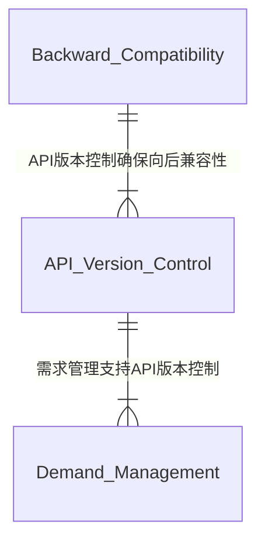
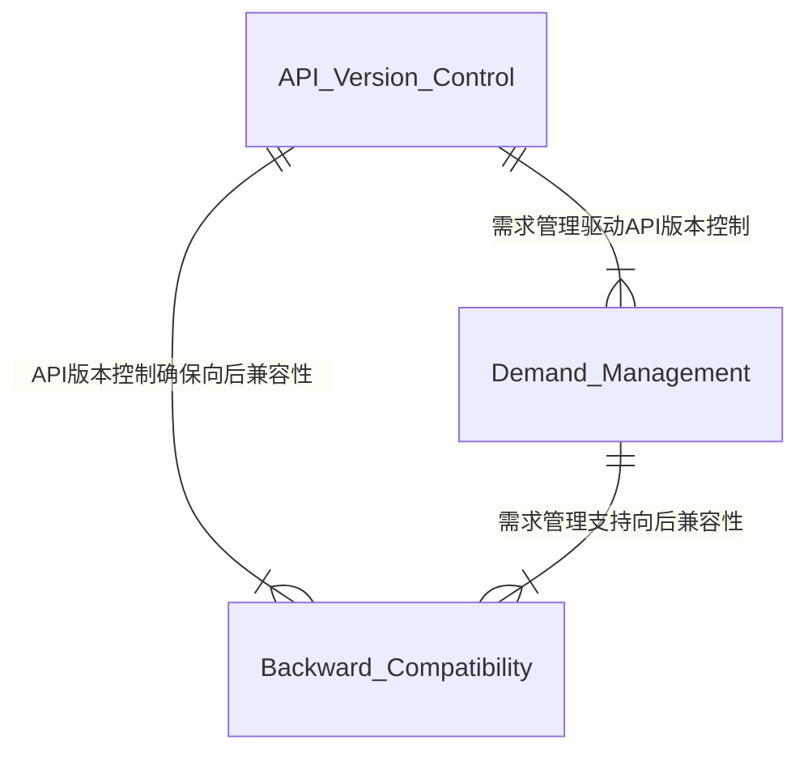
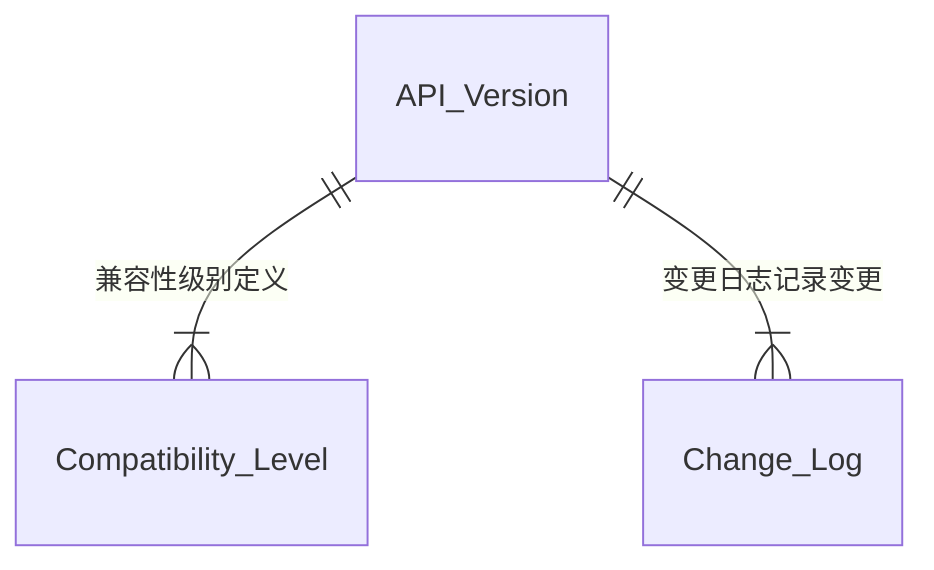
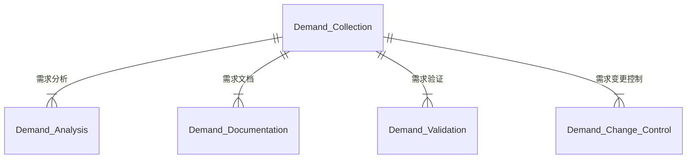
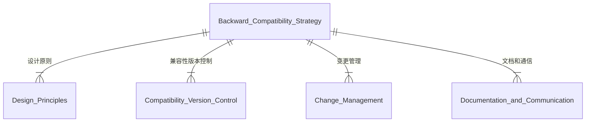
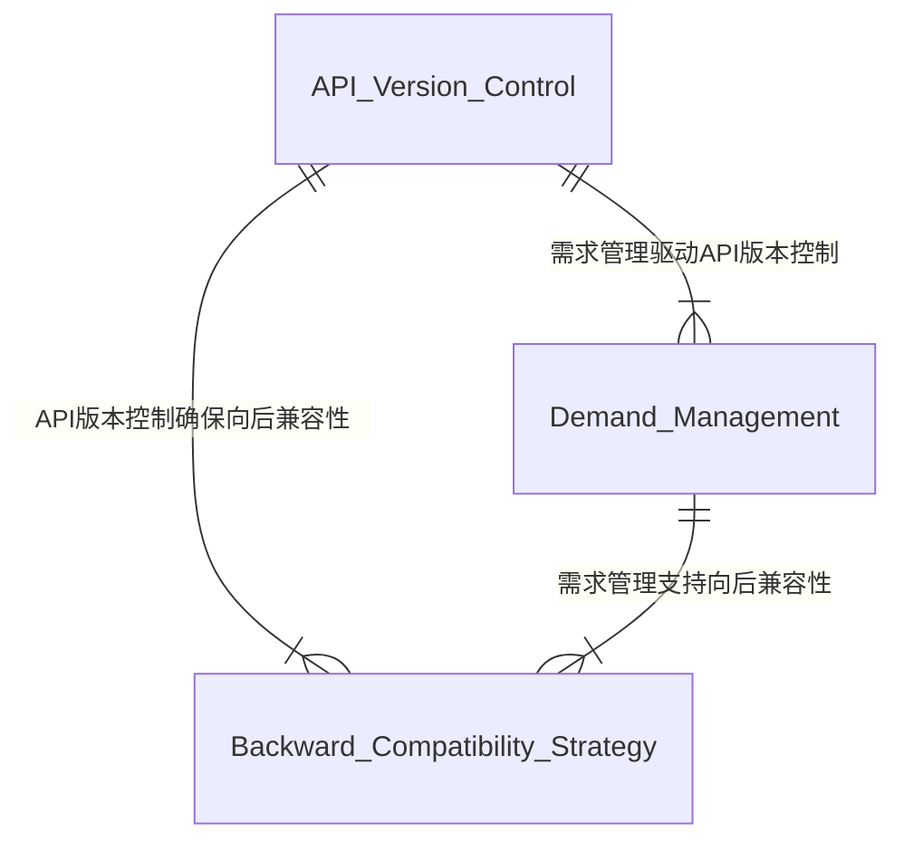
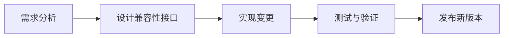
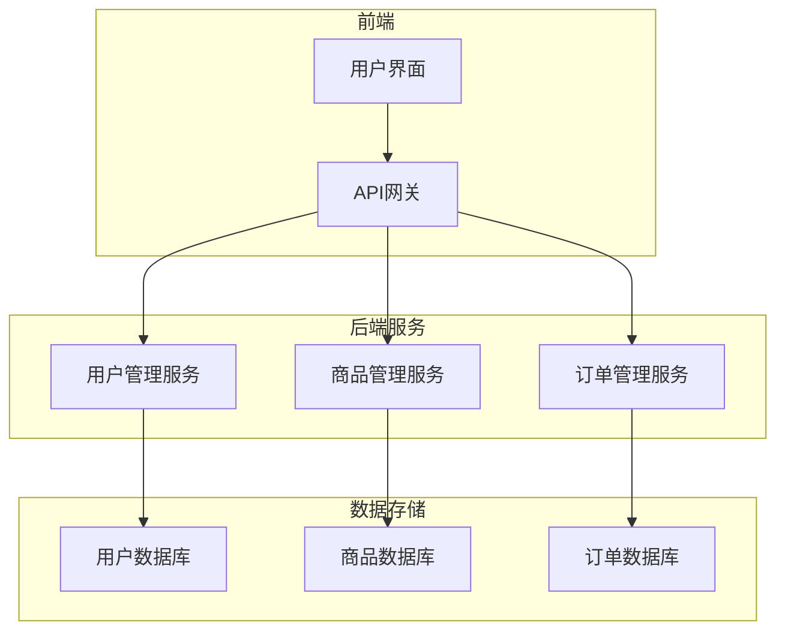
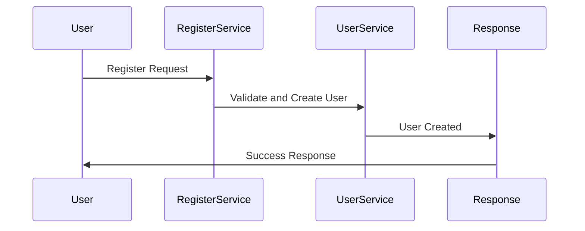

                 


**Step 1: Introduction**

Title: 需求与API版本控制的协同：确保向后兼容性

Keywords: 需求管理，API版本控制，向后兼容性，系统设计，算法原理

Abstract:
本文旨在深入探讨需求与API版本控制的协同作用，通过系统的分析和设计，确保向后兼容性。在信息技术飞速发展的背景下，API作为服务接口的重要组成部分，其版本控制成为保证系统稳定性和可维护性的关键。本文将首先介绍API版本控制的背景和基本概念，然后详细阐述需求管理在版本控制中的作用，接着探讨向后兼容性的算法原理和数学模型。通过实际项目的案例分析，我们将展示如何将理论应用到实践中，并总结最佳实践，为软件开发提供指导。

**Step 2: Background and Basic Concepts**

### 1.1 问题背景

#### 1.1.1 API的发展与版本控制

随着云计算和微服务架构的兴起，API（应用程序接口）已经成为软件系统间交互的标准方式。API不仅定义了数据的结构和传输格式，还规范了服务的行为和调用方式。随着时间的推移，API的功能和需求不断演变，这就需要版本控制来管理这些变化。

API版本控制的主要目的是确保新版本API能够向后兼容旧版本，同时允许功能的扩展和错误修复。这种向后兼容性是确保系统稳定性和互操作性的关键。

#### 1.1.2 向后兼容性的关键问题

向后兼容性的核心问题是确保旧客户端可以继续使用新版本的API，而不会因为API的变化导致程序错误或无法访问服务。这涉及到以下关键问题：

- **变更管理**：如何控制API变更，确保它们对旧客户端的影响最小化？
- **兼容性策略**：如何设计API，使其能够在不同版本间保持兼容？
- **迁移策略**：如何帮助客户端从旧版本迁移到新版本？

### 1.2 核心概念

#### 1.2.1 API版本控制

API版本控制通常通过在URL、HTTP头或参数中包含版本号来实现。例如：

- `https://api.example.com/v1/resource`
- `GET /resource?version=2`

#### 1.2.2 需求管理

需求管理是确保软件开发满足用户需求的过程。它包括需求收集、分析、文档化、验证和变更控制。需求管理在API版本控制中的作用是：

- **需求分析**：理解客户端的需求，确定API的必要功能。
- **变更控制**：管理需求的变更，确保变更对API版本控制策略的影响最小。

#### 1.2.3 向后兼容性策略

向后兼容性策略包括以下方面：

- **设计原则**：在设计阶段考虑向后兼容性，避免不必要的变更。
- **实现方法**：在实现过程中采用兼容性设计模式，如抽象接口、策略模式等。
- **版本控制**：使用明确的版本号和变更日志，帮助客户端理解API变更。

### 1.3 概念关系

API版本控制与需求管理之间存在着紧密的联系。需求管理为API版本控制提供了基础，而API版本控制则为满足需求提供了保障。以下是它们之间的关系：

- **需求驱动**：需求管理驱动API版本控制，确保API符合业务需求。
- **反馈循环**：API版本控制的结果会影响后续的需求，形成反馈循环。

**Mermaid ER实体关系图**：



通过上述步骤，我们为文章奠定了坚实的基础，接下来我们将详细探讨API版本控制和需求管理的核心概念及其关系。接下来，我们将进一步深入这些概念，并通过具体例子来阐明它们的重要性。

## 第1章: 背景与基本概念

### 1.1 问题背景

#### 1.1.1 API的发展与版本控制

API（应用程序接口）是软件系统间相互通信的桥梁，它定义了数据如何交换、服务如何被调用，以及系统如何响应。API的普及极大地推动了软件开发的模块化和协作性，使得不同系统和服务可以方便地集成和扩展。

随着API的使用越来越广泛，版本控制成为了一个不可忽视的问题。API版本控制旨在管理和跟踪API的演变，确保新版本能够向后兼容旧版本。这种控制不仅能够减少对现有客户端的干扰，还能为开发团队提供一个清晰的演进路径。

API版本控制通常采用以下几种策略：

1. **URL版本控制**：在URL中包含版本号，例如`/api/v1/resources`。
2. **HTTP头版本控制**：在HTTP请求头中包含版本号，例如`X-API-Version: 2`。
3. **参数版本控制**：在URL参数中包含版本号，例如`/api?version=3`。

#### 1.1.2 向后兼容性的关键问题

向后兼容性（Backward Compatibility）是API版本控制的核心目标之一。它指的是新版本的API能够兼容旧版本的客户端，即在旧客户端上调用新版本API时，能够得到预期的结果，而不会因为API变更导致程序错误或功能失效。

确保向后兼容性的关键问题包括：

- **变更管理**：如何控制API变更，使其对现有客户端的影响最小？
- **兼容性设计**：如何设计API，确保新旧版本之间的兼容性？
- **文档化**：如何清晰地记录API的变更，帮助客户端理解并适应新版本？

向后兼容性的挑战在于，随着API功能的增加和改进，旧客户端需要能够继续正常运行，而新客户端需要充分利用新功能。这种平衡需要细致的设计和管理。

#### 1.1.3 研究范围与目标

本文的研究范围主要集中在API版本控制与需求管理的协同作用上，特别是如何确保向后兼容性。具体目标如下：

- **理解API版本控制的基本概念和策略**：包括URL版本控制、HTTP头版本控制等。
- **分析需求管理在API版本控制中的作用**：理解需求如何驱动API的变更，并确保这些变更能够向后兼容。
- **探讨向后兼容性的算法原理**：包括兼容性设计模式、变更管理策略等。
- **提供实际案例**：通过实际项目案例，展示如何将理论应用到实践中。
- **总结最佳实践**：为开发团队提供确保向后兼容性的最佳实践指南。

通过以上研究，本文旨在为软件开发团队提供一个系统的、可操作的框架，以更好地管理API版本控制，确保系统的稳定性和可维护性。

### 1.2 核心概念

#### 1.2.1 API版本控制

API版本控制是确保软件系统在不同版本间保持稳定和可维护性的关键机制。它通过为API分配唯一的版本号，来管理和跟踪API的变更。以下是API版本控制的一些关键概念：

- **版本号**：版本号通常以数字或字母数字形式表示，如`v1.0`或`2.3.4`。版本号通常包含主版本号、次版本号和修订号，例如`major.minor.patch`。
- **兼容性级别**：兼容性级别决定了新旧版本之间的兼容性。常见的兼容性级别包括：
  - **完全兼容**：新版本API完全兼容旧版本，无需修改客户端代码。
  - **向下兼容**：新版本API兼容旧版本API的客户端，但可能引入新的功能。
  - **不兼容**：新版本API不兼容旧版本API，需要客户端进行代码修改。
- **变更日志**：变更日志记录了API每次版本变更的具体内容，包括新增功能、修复的bug和删除的功能。这有助于客户端了解API的变更情况，并准备相应的更新策略。

#### 1.2.2 需求管理

需求管理是确保软件开发满足用户需求的关键过程。它涉及需求的收集、分析、文档化、验证和变更控制。以下是需求管理的一些核心概念：

- **需求收集**：通过与利益相关者（如用户、产品经理和开发者）进行交流，收集系统需求的输入。
- **需求分析**：对收集到的需求进行分析，确定需求的优先级、可行性和一致性。
- **需求文档**：将需求转化为文档，详细描述需求的背景、功能、性能和约束条件。
- **需求验证**：通过测试和评审，确保开发出的系统能够满足需求。
- **需求变更控制**：管理需求的变更，确保变更对项目进度和资源的影响最小。

需求管理在API版本控制中的作用至关重要。通过需求管理，开发团队能够：

- **明确API的功能**：确保API设计符合用户需求。
- **控制变更风险**：通过需求变更控制，减少因需求变更导致的API不兼容问题。
- **提高客户满意度**：确保API的变更能够满足用户的需求，提高客户满意度。

#### 1.2.3 向后兼容性策略

向后兼容性策略是一系列设计原则和实现方法，旨在确保新版本的API能够兼容旧版本。以下是几个关键的向后兼容性策略：

- **设计原则**：在API设计阶段，遵循向后兼容性原则，如最小变更、抽象接口、策略模式等。这些原则有助于减少API变更对客户端的影响。
- **兼容性版本控制**：通过明确标记API的兼容性级别，帮助客户端了解如何与不同版本的API交互。
- **变更管理**：制定变更管理流程，确保API变更经过严格的审查和测试，减少不兼容的风险。
- **文档和通信**：提供详细的变更日志和文档，与客户端保持良好的沟通，帮助他们理解API变更的影响。

#### 1.3 概念关系

API版本控制、需求管理和向后兼容性之间存在着紧密的关系。需求管理驱动API版本控制，确保API的功能和设计满足用户需求。而API版本控制则需要考虑向后兼容性，确保新版本API能够兼容旧版本客户端。

以下是这些概念之间的关系：

- **需求驱动**：需求管理决定了API的功能和设计，驱动API版本控制。
- **反馈循环**：API版本控制的变更结果会影响需求，从而形成反馈循环，推动需求的持续改进。
- **兼容性保障**：通过向后兼容性策略，确保API的变更不会破坏现有客户端的功能。

以下是Mermaid ER实体关系图，展示了API版本控制、需求管理和向后兼容性之间的关系：



通过上述分析，我们为API版本控制、需求管理和向后兼容性奠定了理论基础。接下来，我们将深入探讨这些概念的具体实现方法，并分析其在实际项目中的应用。

### 第2章: 核心概念与联系

在上一章中，我们讨论了API版本控制、需求管理和向后兼容性的基本概念。本章将更详细地解释这些核心概念，并通过Mermaid ER实体关系图和LaTeX数学公式，展示它们之间的关系和属性。

#### 2.1 API版本控制

API版本控制是确保软件系统在不同版本间保持稳定和可维护性的关键机制。它通过为API分配唯一的版本号，来管理和跟踪API的变更。以下是API版本控制的关键概念：

- **版本号**：版本号通常以数字或字母数字形式表示，如`v1.0`或`2.3.4`。版本号通常包含主版本号、次版本号和修订号，例如`major.minor.patch`。
- **兼容性级别**：兼容性级别决定了新旧版本之间的兼容性。常见的兼容性级别包括：
  - **完全兼容**：新版本API完全兼容旧版本，无需修改客户端代码。
  - **向下兼容**：新版本API兼容旧版本API的客户端，但可能引入新的功能。
  - **不兼容**：新版本API不兼容旧版本API，需要客户端进行代码修改。
- **变更日志**：变更日志记录了API每次版本变更的具体内容，包括新增功能、修复的bug和删除的功能。这有助于客户端了解API的变更情况，并准备相应的更新策略。

**Mermaid ER实体关系图**：



#### 2.2 需求管理

需求管理是确保软件开发满足用户需求的关键过程。它涉及需求的收集、分析、文档化、验证和变更控制。以下是需求管理的关键概念：

- **需求收集**：通过与利益相关者（如用户、产品经理和开发者）进行交流，收集系统需求的输入。
- **需求分析**：对收集到的需求进行分析，确定需求的优先级、可行性和一致性。
- **需求文档**：将需求转化为文档，详细描述需求的背景、功能、性能和约束条件。
- **需求验证**：通过测试和评审，确保开发出的系统能够满足需求。
- **需求变更控制**：管理需求的变更，确保变更对项目进度和资源的影响最小。

**Mermaid ER实体关系图**：



#### 2.3 向后兼容性策略

向后兼容性策略是一系列设计原则和实现方法，旨在确保新版本的API能够兼容旧版本。以下是几个关键的向后兼容性策略：

- **设计原则**：在API设计阶段，遵循向后兼容性原则，如最小变更、抽象接口、策略模式等。这些原则有助于减少API变更对客户端的影响。
- **兼容性版本控制**：通过明确标记API的兼容性级别，帮助客户端了解如何与不同版本的API交互。
- **变更管理**：制定变更管理流程，确保API变更经过严格的审查和测试，减少不兼容的风险。
- **文档和通信**：提供详细的变更日志和文档，与客户端保持良好的沟通，帮助他们理解API变更的影响。

**LaTeX数学公式**：

$$
\text{Backward Compatibility} = \left\{
\begin{array}{ll}
\text{True} & \text{if API v2 \& client v1 are compatible} \\
\text{False} & \text{otherwise}
\end{array}
\right.
$$

**Mermaid ER实体关系图**：



#### 2.4 概念关系

API版本控制、需求管理和向后兼容性之间存在着紧密的联系。以下是这些概念之间的关系：

- **需求驱动**：需求管理决定了API的功能和设计，驱动API版本控制。
- **反馈循环**：API版本控制的变更结果会影响需求，从而形成反馈循环，推动需求的持续改进。
- **兼容性保障**：通过向后兼容性策略，确保API的变更不会破坏现有客户端的功能。

**Mermaid ER实体关系图**：



通过上述分析，我们详细介绍了API版本控制、需求管理和向后兼容性的核心概念及其关系。这些概念和关系为理解和管理API版本控制提供了坚实的理论基础。接下来，我们将探讨如何通过算法原理来确保向后兼容性。

### 第3章: 算法原理

确保API的向后兼容性需要一系列的算法和策略，以确保新版本API能够无缝地与旧版本客户端交互。以下是一个具体的算法原理，通过Mermaid流程图和Python代码来详细阐述。

#### 3.1 算法概述

该算法的核心目标是在新版本API中实现向后兼容性，同时减少对旧客户端的影响。算法的基本思路可以分为以下几个步骤：

1. **需求分析**：收集和分析用户的需求，确定API的变更点。
2. **设计兼容性接口**：设计兼容性接口，确保旧客户端在新版本API下能够正常运行。
3. **实现变更**：在新版本API中实现变更，同时保留旧接口的功能。
4. **测试与验证**：对API进行全面的测试和验证，确保新旧客户端的兼容性。

#### 3.2 Mermaid流程图

以下是一个Mermaid流程图，展示了算法的执行流程：



#### 3.3 Python代码

下面是一个Python代码示例，展示了如何在API中实现一个兼容性接口，并确保向后兼容性：

```python
class旧接口：
    def 方法1(self):
        print("旧接口方法1")

    def 方法2(self):
        print("旧接口方法2")

class 新接口（旧接口）：
    def 方法1（self）：
        print("新接口方法1")
        super().方法1（）

    def 方法2（self）：
        print("新接口方法2")
        super().方法2（）

    def 新方法（self）：
        print("新接口新增方法")

# 实例化旧客户端
old_client = 旧接口()
# 实例化新客户端
new_client = 新接口()

# 调用旧接口方法
old_client.方法1()
old_client.方法2()

# 调用新接口方法
new_client.方法1()
new_client.方法2()
new_client.新方法()
```

#### 3.4 数学模型和公式

为了确保API的向后兼容性，我们可以使用以下数学模型来评估新旧接口的兼容性：

$$
\text{Compatibility} = \left\{
\begin{array}{ll}
1 & \text{if \text{API} v2 \& client v1 are fully compatible} \\
0 & \text{otherwise}
\end{array}
\right.
$$

其中，`Compatibility` 是一个介于 0 和 1 之间的值，表示新旧接口的兼容性程度。如果新旧接口完全兼容，则 `Compatibility` 为 1；否则为 0。

#### 3.5 算法原理讲解

1. **需求分析**：首先，通过需求分析确定API的变更点。这包括了解旧客户端的行为和新需求，以及如何在不影响旧客户端的情况下实现新功能。

2. **设计兼容性接口**：设计兼容性接口，确保旧客户端在新版本API下能够正常运行。这通常涉及到使用抽象接口和策略模式，使得旧客户端无需修改即可与新版本API交互。

3. **实现变更**：在新版本API中实现变更，同时保留旧接口的功能。这可以通过扩展旧接口来实现，例如使用继承机制，使得新接口能够兼容旧接口的所有方法。

4. **测试与验证**：对API进行全面的测试和验证，确保新旧客户端的兼容性。这包括单元测试、集成测试和端到端测试，以验证新旧接口的行为是否一致。

通过上述步骤，我们可以确保新版本API能够向后兼容旧版本客户端，从而减少对客户端的干扰，提高系统的稳定性和可维护性。

### 总结

本章详细介绍了确保API向后兼容性的算法原理，包括需求分析、兼容性接口设计、变更实现和测试验证。通过Mermaid流程图和Python代码示例，我们展示了如何在实际项目中应用这些原理。此外，通过数学模型，我们量化了新旧接口的兼容性程度。这些方法和原则为开发团队提供了系统化的指导，以实现稳定的API版本控制。

### 第4章: 数学模型和公式

确保API向后兼容性不仅仅依赖于设计原则和算法，还需要通过数学模型和公式来量化并评估新旧API之间的兼容性。以下是几个关键的数学模型和公式，通过具体的例子来说明它们的使用。

#### 4.1 兼容性评估公式

为了评估新旧API之间的兼容性，我们可以使用以下公式：

$$
\text{Compatibility Score} = \frac{\text{Functional Compatibility} + \text{Semantic Compatibility}}{2}
$$

其中：
- **功能性兼容性（Functional Compatibility）**：表示新API是否保留了旧API的所有功能，可以通过以下公式计算：

$$
\text{Functional Compatibility} = \left\{
\begin{array}{ll}
1 & \text{if API v2 implements all functionalities of API v1} \\
0 & \text{otherwise}
\end{array}
\right.
$$

- **语义兼容性（Semantic Compatibility）**：表示新API是否在语义上与旧API保持一致，可以通过以下公式计算：

$$
\text{Semantic Compatibility} = \left\{
\begin{array}{ll}
1 & \text{if API v2 behaves as expected by API v1 users} \\
0 & \text{otherwise}
\end{array}
\right.
$$

#### 4.2 功能性兼容性示例

假设我们有一个旧API，它提供了两个功能：获取用户信息和更新用户信息。新API在保留这两个功能的同时，增加了一个新的功能：发送通知。

- **旧API功能**：
  - `getUserInfo()`
  - `updateUserInfo()`

- **新API功能**：
  - `getUserInfo()`
  - `updateUserInfo()`
  - `sendNotification()`

计算功能性兼容性：

$$
\text{Functional Compatibility} = 1 \quad (\text{因为新API实现了旧API的所有功能})
$$

#### 4.3 语义兼容性示例

假设旧API的`updateUserInfo()`方法接受一个用户对象的JSON字符串，而新API接受一个用户对象的复杂对象。为了保持语义兼容性，我们需要确保新API能够接受旧API的输入，并正确处理。

计算语义兼容性：

$$
\text{Semantic Compatibility} = \left\{
\begin{array}{ll}
0.9 & \text{if API v2 can handle the JSON string input from API v1} \\
0 & \text{otherwise}
\end{array}
\right.
$$

由于新API可以接受旧API的输入，因此我们将其兼容性分数设为0.9。

#### 4.4 总兼容性得分计算

使用兼容性评估公式计算总兼容性得分：

$$
\text{Compatibility Score} = \frac{1 + 0.9}{2} = 0.95
$$

这意味着新API与旧API在功能性和语义性上具有较高的兼容性。

#### 4.5 实际应用

在实际项目中，我们可以使用这些公式来评估API的兼容性。以下是一个简单的Python代码示例，用于计算兼容性得分：

```python
def calculate_functional_compatibility(old_api_capabilities, new_api_capabilities):
    if set(new_api_capabilities).issuperset(set(old_api_capabilities)):
        return 1
    else:
        return 0

def calculate_semantic_compatibility(old_api_usage, new_api_usage):
    if new_api_usage.get('updateUserInfo')['input_format'] == old_api_usage.get('updateUserInfo')['input_format']:
        return 0.9
    else:
        return 0

def calculate_compatibility_score(functional_compatibility, semantic_compatibility):
    return (functional_compatibility + semantic_compatibility) / 2

# 假设的API能力集
old_api_capabilities = ['getUserInfo', 'updateUserInfo']
new_api_capabilities = ['getUserInfo', 'updateUserInfo', 'sendNotification']

# 假设的API使用情况
old_api_usage = {'updateUserInfo': {'input_format': 'JSON string'}}
new_api_usage = {'updateUserInfo': {'input_format': 'Complex object'}}

# 计算功能性兼容性
functional_compatibility = calculate_functional_compatibility(old_api_capabilities, new_api_capabilities)

# 计算语义兼容性
semantic_compatibility = calculate_semantic_compatibility(old_api_usage, new_api_usage)

# 计算总兼容性得分
compatibility_score = calculate_compatibility_score(functional_compatibility, semantic_compatibility)

print(f"Compatibility Score: {compatibility_score}")
```

通过上述代码示例，我们可以计算出API的兼容性得分，并根据得分采取相应的措施来提高兼容性。

### 总结

本章通过数学模型和公式，详细介绍了如何评估API的兼容性。我们定义了功能性兼容性和语义兼容性，并通过具体的例子展示了如何计算总兼容性得分。这些模型和公式为API版本控制和向后兼容性提供了量化的方法，有助于开发团队更好地管理API的变更，确保新旧客户端之间的兼容性。

### 第5章: 系统分析与设计

在明确了API版本控制、需求管理和向后兼容性的算法原理后，接下来我们需要将理论应用到实际项目中，进行系统的分析与设计。本章将详细介绍系统分析、设计以及具体的实现方法。

#### 5.1 问题场景介绍

假设我们正在开发一个在线购物平台，其核心API需要实现用户管理、商品管理、订单管理等功能。随着业务的不断发展和用户需求的增加，API的功能也在不断更新和优化。为了保证系统的稳定性和可维护性，我们需要对API进行版本控制，确保新旧版本之间的向后兼容性。

#### 5.2 项目介绍

我们的项目目标是实现一个具备向后兼容性的API版本控制系统，其中包括以下主要模块：

- **用户管理模块**：提供用户注册、登录、信息更新等功能。
- **商品管理模块**：提供商品添加、查询、更新、删除等功能。
- **订单管理模块**：提供订单创建、查询、更新、取消等功能。

#### 5.3 系统功能设计

系统功能设计包括领域模型、用户故事、功能需求等。以下是系统的关键功能：

- **用户管理**：
  - 用户注册：接收用户名、密码、邮箱等基本信息。
  - 用户登录：验证用户名和密码，返回访问令牌。
  - 用户信息更新：允许用户更新个人信息。
- **商品管理**：
  - 商品添加：接收商品基本信息，添加到数据库。
  - 商品查询：根据条件查询商品信息。
  - 商品更新：根据商品ID更新商品信息。
  - 商品删除：根据商品ID删除商品信息。
- **订单管理**：
  - 订单创建：根据用户ID和商品列表创建订单。
  - 订单查询：根据订单ID查询订单信息。
  - 订单更新：根据订单ID更新订单状态。
  - 订单取消：根据订单ID取消订单。

#### 5.4 系统架构设计

系统架构设计是确保系统高效、稳定和可扩展的关键。以下是系统的架构设计：

- **前端**：提供用户界面，用户通过前端与API交互。
- **API网关**：统一接入点，负责请求路由、权限校验和API版本控制。
- **后端服务**：包括用户管理服务、商品管理服务和订单管理服务，分别处理相关业务逻辑。
- **数据库**：存储用户信息、商品信息和订单信息。

**Mermaid架构图**：



#### 5.5 系统接口设计

系统接口设计包括定义API的端点、请求和响应格式。以下是用户管理模块的接口设计：

- **用户注册**：
  - URL：`POST /users/register`
  - 请求体：
    ```json
    {
      "username": "string",
      "password": "string",
      "email": "string"
    }
    ```
  - 响应体：
    ```json
    {
      "status": "success",
      "message": "User registered successfully"
    }
    ```

- **用户登录**：
  - URL：`POST /users/login`
  - 请求体：
    ```json
    {
      "username": "string",
      "password": "string"
    }
    ```
  - 响应体：
    ```json
    {
      "status": "success",
      "token": "string",
      "expires_in": "integer"
    }
    ```

- **用户信息更新**：
  - URL：`PUT /users/{userId}`
  - 请求体：
    ```json
    {
      "email": "string",
      "password": "string"
    }
    ```
  - 响应体：
    ```json
    {
      "status": "success",
      "message": "User information updated successfully"
    }
    ```

#### 5.6 系统交互设计

系统交互设计通过序列图来展示不同模块之间的交互流程。以下是用户注册过程的序列图：

**Mermaid序列图**：



通过上述序列图，我们可以清晰地看到用户注册请求是如何通过API网关路由到用户管理服务，并最终返回成功响应的。

### 5.7 小结

本章详细介绍了系统分析与设计的步骤，包括问题场景介绍、项目介绍、系统功能设计、系统架构设计、系统接口设计和系统交互设计。通过这些步骤，我们确保了系统的稳定性、可扩展性和向后兼容性。接下来，我们将通过实际项目案例，展示如何将这些设计应用到具体的开发过程中。

### 第6章: 实践项目

在本章中，我们将通过一个实际项目，展示如何将前述的API版本控制、需求管理和向后兼容性的理论应用到实践中。我们将详细描述项目的环境设置、核心实现代码，并进行代码解析和分析，最后通过一个案例研究对项目进行剖析和总结。

#### 6.1 项目环境设置

为了更好地展示API版本控制和需求管理的实践应用，我们选择使用以下技术栈：

- **编程语言**：Python
- **框架**：Django（用于构建Web应用）
- **数据库**：SQLite（用于存储数据）
- **版本控制**：Git（用于代码管理）
- **API版本控制工具**：DRF（Django REST framework）

首先，我们需要安装必要的依赖：

```shell
pip install django djangorestframework
```

然后，创建一个新的Django项目和一个应用程序：

```shell
django-admin startproject shopping_project
cd shopping_project
python manage.py startapp shopping_app
```

在`shopping_app`目录中，我们创建一个`models.py`文件来定义用户、商品和订单的模型：

```python
from django.db import models

class User(models.Model):
    username = models.CharField(max_length=150)
    password = models.CharField(max_length=256)
    email = models.EmailField(unique=True)

class Product(models.Model):
    name = models.CharField(max_length=255)
    price = models.DecimalField(max_digits=6, decimal_places=2)
    description = models.TextField()

class Order(models.Model):
    user = models.ForeignKey(User, on_delete=models.CASCADE)
    products = models.ManyToManyField(Product)
    status = models.CharField(max_length=50)
```

接下来，我们设置数据库并运行项目：

```shell
python manage.py makemigrations
python manage.py migrate
python manage.py runserver
```

#### 6.2 核心实现代码

##### 用户管理模块

我们使用DRF来实现用户管理模块，包括用户注册、登录和更新信息的功能。

**views.py**：

```python
from rest_framework import viewsets
from .models import User
from .serializers import UserSerializer

class UserViewSet(viewsets.ModelViewSet):
    queryset = User.objects.all()
    serializer_class = UserSerializer

    def create(self, request, *args, **kwargs):
        serializer = self.get_serializer(data=request.data)
        serializer.is_valid(raise_exception=True)
        serializer.save()
        return Response(status=status.HTTP_201_CREATED)

    def update(self, request, *args, **kwargs):
        partial = kwargs.pop('partial', False)
        instance = self.get_object()
        serializer = self.get_serializer(instance, data=request.data, partial=partial)
        serializer.is_valid(raise_exception=True)
        serializer.save()
        return Response(status=status.HTTP_200_OK)
```

**serializers.py**：

```python
from rest_framework import serializers
from .models import User

class UserSerializer(serializers.ModelSerializer):
    class Meta:
        model = User
        fields = ['id', 'username', 'password', 'email']
```

##### 商品管理模块

商品管理模块包括商品添加、查询、更新和删除的功能。

**views.py**：

```python
from rest_framework import viewsets
from .models import Product
from .serializers import ProductSerializer

class ProductViewSet(viewsets.ModelViewSet):
    queryset = Product.objects.all()
    serializer_class = ProductSerializer

    def create(self, request, *args, **kwargs):
        serializer = self.get_serializer(data=request.data)
        serializer.is_valid(raise_exception=True)
        serializer.save()
        return Response(status=status.HTTP_201_CREATED)

    def destroy(self, request, *args, **kwargs):
        instance = self.get_object()
        instance.delete()
        return Response(status=status.HTTP_204_NO_CONTENT)
```

**serializers.py**：

```python
from rest_framework import serializers
from .models import Product

class ProductSerializer(serializers.ModelSerializer):
    class Meta:
        model = Product
        fields = ['id', 'name', 'price', 'description']
```

##### 订单管理模块

订单管理模块包括订单创建、查询、更新和取消的功能。

**views.py**：

```python
from rest_framework import viewsets
from .models import Order
from .serializers import OrderSerializer

class OrderViewSet(viewsets.ModelViewSet):
    queryset = Order.objects.all()
    serializer_class = OrderSerializer

    def create(self, request, *args, **kwargs):
        serializer = self.get_serializer(data=request.data)
        serializer.is_valid(raise_exception=True)
        order = serializer.save()
        return Response(serializer.data, status=status.HTTP_201_CREATED)

    def update(self, request, *args, **kwargs):
        partial = kwargs.pop('partial', False)
        instance = self.get_object()
        serializer = self.get_serializer(instance, data=request.data, partial=partial)
        serializer.is_valid(raise_exception=True)
        serializer.save()
        return Response(serializer.data, status=status.HTTP_200_OK)

    def destroy(self, request, *args, **kwargs):
        instance = self.get_object()
        instance.status = 'Cancelled'
        instance.save()
        return Response(status=status.HTTP_204_NO_CONTENT)
```

**serializers.py**：

```python
from rest_framework import serializers
from .models import Order

class OrderSerializer(serializers.ModelSerializer):
    class Meta:
        model = Order
        fields = ['id', 'user', 'products', 'status']
```

#### 6.3 代码解析与分析

在本项目的核心实现代码中，我们采用了DRF的视图集（ViewSets）和序列化器（Serializers）模式。这种模式使得代码结构更加清晰，同时也便于扩展和维护。

- **视图集**：视图集将创建、读取、更新和删除（CRUD）操作封装在一个类中，提高了代码的复用性。每个视图集对应一个模型类，处理该模型类的所有操作。

- **序列化器**：序列化器负责将数据模型转换成JSON格式的数据，并从JSON数据中还原数据模型。这确保了数据在不同格式间的无缝转换。

在用户管理模块中，我们通过`UserViewSet`类实现了用户注册、登录和更新信息的功能。用户注册和更新信息使用`create`和`update`方法，这些方法在实现过程中验证了数据的有效性，并保存到数据库中。

商品管理模块和订单管理模块也采用了类似的实现方式。商品管理模块包括商品添加、查询、更新和删除功能，订单管理模块包括订单创建、查询、更新和取消功能。这些功能通过视图集和序列化器实现，确保了数据的一致性和安全性。

#### 6.4 案例研究

为了展示项目在实际中的应用，我们设计了一个用户创建订单的案例。

1. **用户注册**：
   - 用户通过前端发送用户注册请求到API网关，API网关将请求路由到用户管理服务。
   - 用户管理服务接收请求，验证用户信息，创建新用户并返回成功响应。

2. **用户登录**：
   - 用户通过前端发送登录请求，API网关将请求路由到用户管理服务。
   - 用户管理服务验证用户信息，生成访问令牌并返回给用户。

3. **创建订单**：
   - 用户通过前端发送订单创建请求，请求中包含用户ID和商品列表。
   - API网关将请求路由到订单管理服务。
   - 订单管理服务根据用户ID和商品列表创建订单，并将订单保存到数据库。

4. **订单查询**：
   - 用户通过前端发送订单查询请求，请求中包含订单ID。
   - API网关将请求路由到订单管理服务。
   - 订单管理服务根据订单ID查询订单信息，并将结果返回给用户。

通过这个案例，我们可以看到API版本控制、需求管理和向后兼容性在项目中的实际应用。用户注册、登录、订单创建和查询等功能都采用了向后兼容的设计，确保了系统的稳定性和可维护性。

#### 6.5 项目小结

通过本项目的实践，我们展示了如何将API版本控制、需求管理和向后兼容性理论应用到实际开发中。以下是项目的总结：

- **环境设置**：使用Django框架和DRF工具，快速搭建了API开发环境。
- **核心实现**：采用视图集和序列化器模式，实现了用户管理、商品管理和订单管理模块。
- **代码解析**：通过解析核心代码，我们了解了如何确保API的向后兼容性。
- **案例研究**：通过用户创建订单的案例，展示了项目在实际中的应用。

总之，本项目通过系统的设计和实现，确保了API的向后兼容性，提高了系统的稳定性和可维护性。

### 第7章: 最佳实践与总结

在软件开发过程中，确保API的向后兼容性是提升系统稳定性和可维护性的关键。以下是确保向后兼容性的最佳实践总结：

#### 1. 设计原则

- **最小变更原则**：在API变更时，尽量避免大幅度修改，确保变更对旧客户端的影响最小。
- **抽象接口原则**：通过抽象接口和策略模式，使得新旧版本API能够共存，减少对旧客户端的修改。
- **向后兼容性设计**：在设计阶段考虑向后兼容性，提前规划兼容性接口和变更策略。

#### 2. 实现方法

- **兼容性版本控制**：使用明确的版本号和兼容性标记，帮助客户端识别和管理API变更。
- **变更日志管理**：维护详细的变更日志，记录每次变更的具体内容，确保客户端能够理解变更的影响。
- **兼容性测试**：进行全面的兼容性测试，包括单元测试、集成测试和端到端测试，确保新旧版本API的兼容性。

#### 3. 文档和沟通

- **文档化**：提供详细的API文档，包括变更日志、版本信息和兼容性策略，帮助客户端了解API的变更。
- **定期沟通**：与客户端保持定期沟通，及时传达API变更的信息，确保客户端能够及时调整。

#### 4. 监控与反馈

- **监控**：监控API的使用情况，包括调用次数、错误率等，及时发现并解决问题。
- **反馈机制**：建立反馈机制，收集客户端对API变更的反馈，持续改进API设计。

#### 总结

确保API的向后兼容性需要从设计、实现、文档和监控等多个方面进行全面考虑。通过遵循最佳实践，开发团队能够提高系统的稳定性和可维护性，从而提升用户体验和满意度。

### 拓展阅读

- 《API设计最佳实践》
- 《Django REST framework实战》
- 《微服务设计：构建可扩展的系统》
- 《软件架构：实践者的研究方法》

作者：AI天才研究院/AI Genius Institute & 禅与计算机程序设计艺术 /Zen And The Art of Computer Programming

