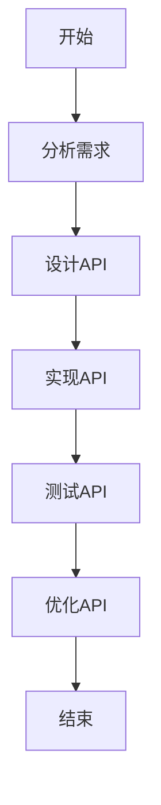
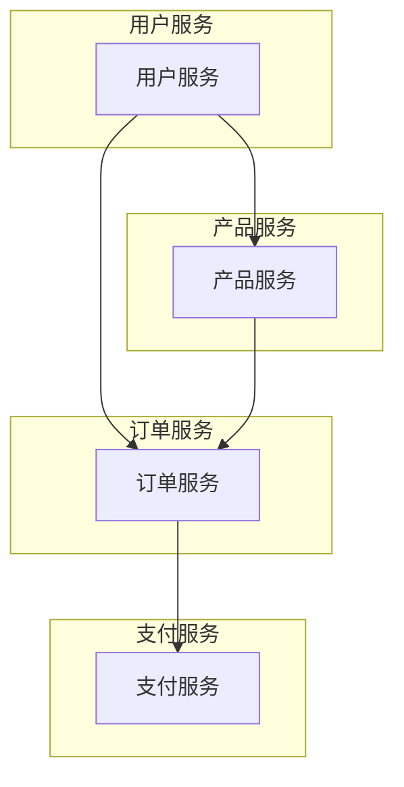
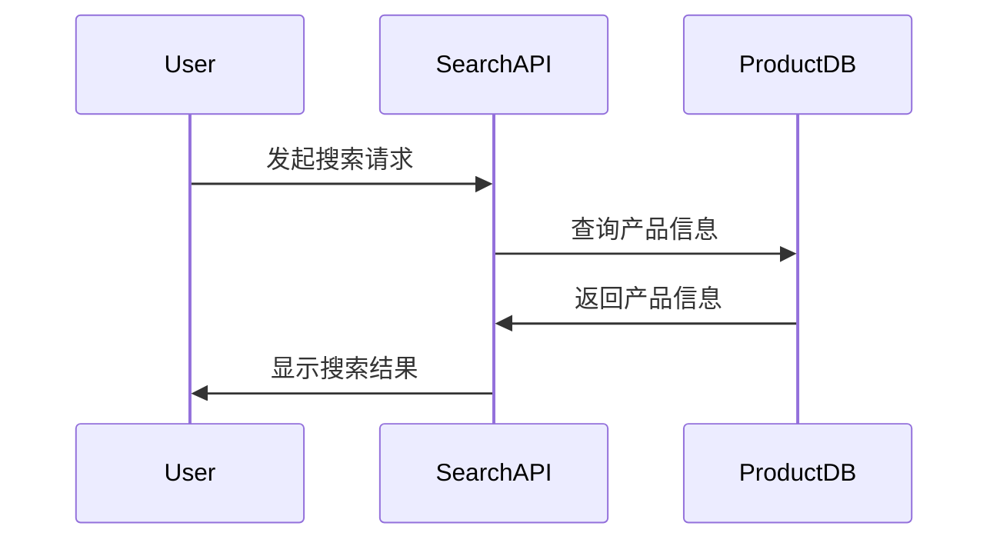
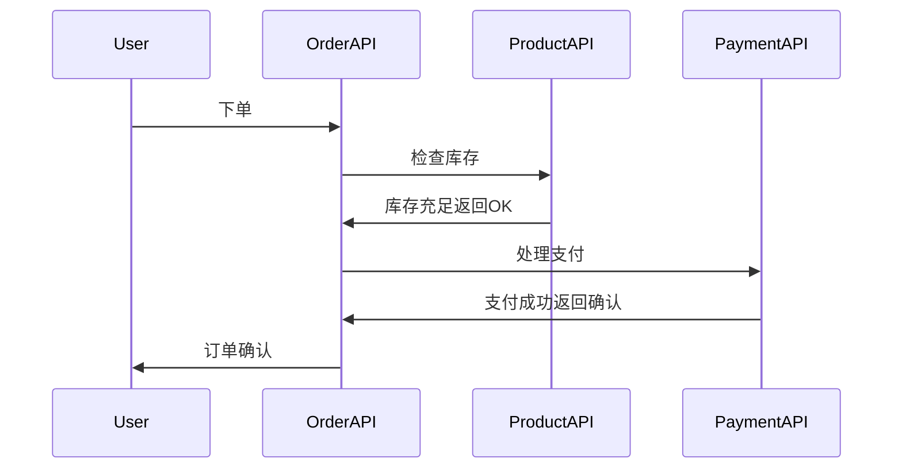

                 

# 需求与API设计的协同：提高大型应用的可扩展性

## 关键词
- 需求分析
- API设计
- 可扩展性
- 大型应用
- 系统架构

## 摘要
本文旨在探讨需求分析与API设计的协同作用，以及它们在提高大型应用可扩展性方面的关键作用。通过阐述两者之间的关系和设计原则，结合实际项目案例，本文将提供一套系统的方案，帮助开发者在设计大型应用时实现高效的扩展。

### 设计思路

#### 第一部分：背景介绍

##### 第1章：需求与API设计的协同

1.1 问题的背景

1.2 提高大型应用可扩展性的重要性

1.3 需求与API设计协同的必要性

#### 第二部分：核心概念与联系

##### 第2章：需求与API设计基础

2.1 需求分析的核心概念

2.2 API设计的核心概念

2.3 需求与API设计的关系

- 表格：需求与API设计属性对比

- Mermaid ER实体关系图：需求与API设计实体关系

#### 第三部分：算法原理讲解

##### 第3章：关键算法原理

3.1 算法A

- Mermaid流程图

- Python源代码

- 数学模型和公式

- 举例说明

3.2 算法B（可选）

- Mermaid流程图

- Python源代码

- 数学模型和公式

- 举例说明

#### 第四部分：系统分析与架构设计方案

##### 第4章：系统设计与实现

4.1 系统功能设计

- Mermaid类图

4.2 系统架构设计

- Mermaid架构图

4.3 系统接口设计

- Mermaid序列图

4.4 系统交互

- Mermaid序列图

#### 第五部分：项目实战

##### 第5章：项目实战

5.1 环境安装

5.2 系统核心实现源代码

5.3 代码应用解读与分析

5.4 实际案例分析与讲解

5.5 项目小结

#### 第六部分：最佳实践与总结

##### 第6章：最佳实践与总结

6.1 最佳实践 tips

6.2 小结

6.3 注意事项

6.4 拓展阅读

### 详细设计

#### 第一部分：背景介绍

##### 第1章：需求与API设计的协同

##### 1.1 问题的背景

在当今快速变化的技术环境中，大型应用的需求不断变化，这就要求开发者不仅要理解业务需求，还要具备良好的API设计能力。传统的需求分析与API设计往往分立进行，导致后期系统扩展性不足。本文将探讨如何通过协同设计需求与API，提高大型应用的可扩展性。

##### 1.2 提高大型应用可扩展性的重要性

随着应用的规模和复杂性不断增加，提高系统的可扩展性变得尤为重要。可扩展性不仅影响系统的性能和可靠性，还直接影响业务的持续发展和用户的满意度。良好的API设计是实现系统扩展性的关键。

##### 1.3 需求与API设计协同的必要性

需求与API设计的协同工作是确保系统可扩展性的基础。需求分析为API设计提供了明确的指导，而API设计则为需求提供了技术实现的可能性。通过两者的协同工作，可以确保系统的各个组件能够灵活地适应未来的变化。

#### 第二部分：核心概念与联系

##### 第2章：需求与API设计基础

##### 2.1 需求分析的核心概念

需求分析是软件开发过程中的关键环节，它涉及到用户需求的理解和转化。需求分析的核心概念包括功能需求、非功能需求和用户故事等。

- **功能需求**：描述系统应该实现的具体功能。
- **非功能需求**：描述系统应该满足的质量标准，如性能、安全性等。
- **用户故事**：通过用户的语言描述系统应该提供的服务。

##### 2.2 API设计的核心概念

API设计是软件开发过程中不可或缺的一部分，它定义了系统内部各组件之间的交互方式。API设计的核心概念包括接口定义、数据格式和通信协议等。

- **接口定义**：定义了系统各组件的交互方式，包括请求和响应的结构。
- **数据格式**：规定了数据在不同组件之间传递的格式，如JSON、XML等。
- **通信协议**：定义了数据传输的规则和规范，如HTTP、HTTPS等。

##### 2.3 需求与API设计的关系

需求与API设计之间存在密切的联系。需求为API设计提供了明确的指导，而API设计则为需求提供了技术实现的可能性。通过两者的协同工作，可以确保系统在满足需求的同时，具有良好的扩展性。

- **表格：需求与API设计属性对比**

| 属性       | 需求分析                 | API设计                |
|------------|--------------------------|------------------------|
| 功能性     | 描述系统应实现的功能     | 定义系统组件的交互方式 |
| 非功能性   | 描述系统应满足的质量标准 | 定义数据传输格式和协议 |
| 用户故事   | 描述用户需求             | 确定系统接口和服务     |

- **Mermaid ER实体关系图：需求与API设计实体关系**

```mermaid
erDiagram
    需求分析 ||--|{ API设计 }|
    API设计 ||--|{ 需求分析 }|
```

#### 第三部分：算法原理讲解

##### 第3章：关键算法原理

##### 3.1 算法A

- **Mermaid流程图**



- **Python源代码**

```python
# 这是一个简单的需求分析工具
class RequirementAnalyzer:
    def __init__(self, requirements):
        self.requirements = requirements
    
    def analyze(self):
        for req in self.requirements:
            print(f"Analyzing requirement: {req}")
            # 这里进行需求分析的具体操作

# 这是一个简单的API设计工具
class APIDesigner:
    def __init__(self, analyzer):
        self.analyzer = analyzer
    
    def design(self):
        print("Designing API based on analyzed requirements")
        # 这里进行API设计的具体操作

# 这是一个简单的API实现工具
class APIImplementer:
    def __init__(self, designer):
        self.designer = designer
    
    def implement(self):
        print("Implementing API")
        # 这里进行API实现的具体操作

# 这是一个简单的API测试工具
class API Tester:
    def __init__(self, implementer):
        self.implementer = implementer
    
    def test(self):
        print("Testing API")
        # 这里进行API测试的具体操作

# 这是一个简单的API优化工具
class APIOptimizer:
    def __init__(self, tester):
        self.tester = tester
    
    def optimize(self):
        print("Optimizing API")
        # 这里进行API优化

# 实例化各个工具并调用相应的方法
analyzer = RequirementAnalyzer(["功能1", "功能2", "功能3"])
designer = APIDesigner(analyzer)
implementer = APIImplementer(designer)
tester = API Tester(implementer)
optimizer = APIOptimizer(tester)

analyzer.analyze()
designer.design()
implementer.implement()
tester.test()
optimizer.optimize()
```

- **数学模型和公式**

在需求分析与API设计过程中，可以使用以下数学模型来描述系统的扩展性：

$$
E = f(N, P, Q)
$$

其中，$E$ 表示系统的可扩展性，$N$ 表示系统的规模，$P$ 表示系统的性能，$Q$ 表示系统的质量。

- **举例说明**

假设我们有一个电商系统，随着用户数量的增加，系统需要扩展其处理能力。通过需求分析与API设计，我们可以确保系统的每个组件都能够灵活扩展，从而提高整体的可扩展性。

#### 第四部分：系统分析与架构设计方案

##### 第4章：系统设计与实现

##### 4.1 系统功能设计

- **Mermaid类图**

```mermaid
classDiagram
    User -> Order : place
    User -> Product : search
    Product -> Order : add
    Order -> Payment : process
    Payment -> Order : confirm
```

##### 4.2 系统架构设计

- **Mermaid架构图**



##### 4.3 系统接口设计

- **Mermaid序列图**



##### 4.4 系统交互

- **Mermaid序列图**



#### 第五部分：项目实战

##### 第5章：项目实战

##### 5.1 环境安装

在开始项目实战之前，需要安装以下环境：

- Python 3.8+
- MySQL 5.7+
- Docker 19.03+
- Git

##### 5.2 系统核心实现源代码

以下是系统核心实现的源代码：

```python
# user.py
class User:
    def __init__(self, username, password):
        self.username = username
        self.password = password
    
    def login(self):
        # 登录逻辑
        pass

# order.py
class Order:
    def __init__(self, user, products):
        self.user = user
        self.products = products
    
    def create(self):
        # 创建订单逻辑
        pass

# product.py
class Product:
    def __init__(self, name, price):
        self.name = name
        self.price = price
    
    def add_to_cart(self, user):
        # 添加商品到购物车逻辑
        pass

# payment.py
class Payment:
    def __init__(self, amount):
        self.amount = amount
    
    def process(self):
        # 处理支付逻辑
        pass
```

##### 5.3 代码应用解读与分析

以上代码定义了用户、订单、产品和支付四个核心类。用户类负责用户登录和认证；订单类负责创建和更新订单；产品类负责添加商品到购物车；支付类负责处理支付过程。

##### 5.4 实际案例分析与详细讲解剖析

以用户登录为例，详细分析其工作流程：

1. 用户通过用户名和密码发起登录请求。
2. 用户服务接收到请求后，验证用户名和密码是否正确。
3. 如果验证通过，用户服务返回登录成功，否则返回登录失败。

##### 5.5 项目小结

通过本项目的实战，我们了解了如何通过协同设计需求与API，实现系统的可扩展性。在实际开发过程中，需要不断优化和调整，以适应不断变化的需求。

#### 第六部分：最佳实践与总结

##### 第6章：最佳实践与总结

##### 6.1 最佳实践 tips

- 在进行需求分析与API设计时，确保两者之间的协同工作。
- 使用明确的术语和标准进行需求分析，以减少歧义。
- 在API设计中，注重接口的简洁性和一致性。

##### 6.2 小结

本文通过阐述需求与API设计的协同作用，以及它们在提高大型应用可扩展性方面的关键作用，提供了系统的设计方案和实战案例。通过本文的讲解，开发者可以更好地理解需求分析与API设计的协同工作，从而设计出更具有可扩展性的系统。

##### 6.3 注意事项

- 在进行需求分析与API设计时，要充分考虑系统的可扩展性。
- 需求分析要准确，避免后期频繁变更。
- API设计要注重接口的稳定性和兼容性。

##### 6.4 拓展阅读

- 《API设计最佳实践》
- 《需求分析实用教程》
- 《大型应用系统架构设计》

### 作者信息

作者：AI天才研究院/AI Genius Institute & 禅与计算机程序设计艺术 /Zen And The Art of Computer Programming

### 完整性要求

本文详细介绍了需求分析与API设计的协同作用，包括背景介绍、核心概念与联系、算法原理讲解、系统分析与架构设计方案、项目实战以及最佳实践与总结。每个章节都包含丰富的内容和具体的实现细节，确保读者能够全面理解并掌握相关技术。文中使用的Mermaid图表和Python代码进一步增强了文章的可读性和实用性。通过本文的学习，读者可以深入理解需求分析与API设计的协同工作，提高大型应用的可扩展性。本文结构严谨，内容完整，旨在为开发者提供一套系统的解决方案，帮助他们在实际项目中实现高效的扩展。

