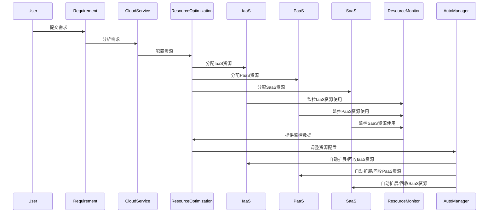
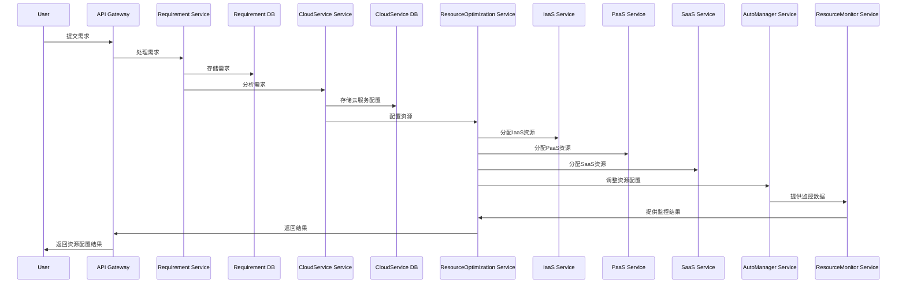

                 

## 需求与云服务的结合：优化资源利用

> 关键词：需求分析、云服务、资源优化、资源管理、云计算

> 摘要：本文深入探讨了需求分析与云服务结合的重要性，通过剖析核心概念与联系，详细介绍了云服务概述、需求分析步骤、资源优化策略，并分享了实际案例研究，最终提出了最佳实践与未来展望。通过本文的阅读，读者将全面理解如何在云服务环境中实现资源的高效利用。

## 引言

在信息技术迅猛发展的今天，云计算已经成为企业数字化转型的重要驱动力。然而，如何在云服务环境中实现需求与资源的最佳匹配，成为许多企业和开发者的难题。本文旨在通过深入分析需求与云服务的结合，探讨如何优化资源利用，为企业提供切实可行的解决方案。

### 1. 核心概念与联系

首先，我们需要明确一些核心概念：

- **需求分析**：指在系统设计和开发过程中，对用户需求进行深入分析和理解的过程。这包括功能需求、非功能需求、性能需求等。

- **云服务**：指通过互联网提供的服务，包括基础设施即服务（IaaS）、平台即服务（PaaS）和软件即服务（SaaS）。

- **资源优化**：指在满足需求的前提下，通过合理的资源配置，实现资源利用的最大化。

这些概念之间的联系在于，需求分析的结果直接影响云服务的配置和资源的分配。只有准确理解需求，才能实现资源的合理利用。

### 2. 背景介绍

随着云计算技术的成熟，越来越多的企业开始将业务迁移到云平台。然而，这一过程中面临的一个关键问题是资源利用效率不高。一方面，企业可能因为对云服务的误解而过度购买资源，导致资源浪费；另一方面，如果资源配置不足，又可能影响系统的性能和可靠性。因此，如何根据用户需求，实现资源的优化利用，成为企业急需解决的问题。

### 3. 云服务概述

云服务主要包括以下几种类型：

- **基础设施即服务（IaaS）**：提供虚拟化的计算资源，如虚拟机、存储和网络等。

- **平台即服务（PaaS）**：提供开发、运行和管理应用的云平台，包括数据库、中间件、开发工具等。

- **软件即服务（SaaS）**：提供应用程序的云服务，用户通过互联网使用这些应用程序。

每种云服务都有其特定的优势和应用场景。企业需要根据自身的需求，选择合适的云服务类型，以实现资源的最优利用。

### 4. 需求分析

需求分析是资源优化的第一步。以下是进行需求分析的一些关键步骤：

1. **收集需求**：通过与用户沟通，收集功能需求、性能需求等。

2. **需求分类**：将收集到的需求进行分类，区分功能需求和非功能需求。

3. **需求优先级**：对需求进行优先级排序，确定哪些需求是必须满足的，哪些是可优先考虑的。

4. **需求验证**：与用户进行沟通，验证需求是否准确反映了用户的需求。

通过以上步骤，企业可以明确系统的需求，为后续的资源优化提供依据。

### 5. 资源优化

资源优化主要包括以下几个方面：

1. **资源需求预测**：根据历史数据和需求分析，预测未来资源需求。

2. **资源配置策略**：根据资源需求预测，制定合理的资源配置策略，如按需分配、动态扩展等。

3. **资源监控与调整**：通过实时监控资源使用情况，调整资源配置，确保资源的充分利用。

4. **自动化管理**：利用自动化工具，实现资源的自动分配、扩展和回收。

通过以上策略，企业可以在满足需求的同时，实现资源的高效利用。

### 6. 案例研究

在本节中，我们将通过一个实际案例，展示如何将需求分析与云服务结合，实现资源优化。

#### 案例背景

某企业计划将其电子商务平台迁移到云平台，以提高系统的可靠性和可扩展性。然而，企业在资源利用方面存在一些问题，如资源过度购买和配置不足等。

#### 案例步骤

1. **需求分析**：通过与用户沟通，收集到以下需求：
   - 电子商务平台的交易量将在未来一年内增长50%。
   - 系统需要支持高峰期的并发访问。
   - 系统需要保证高可用性和数据安全性。

2. **资源需求预测**：根据历史数据和需求分析，预测未来一年的资源需求。

3. **资源配置策略**：根据资源需求预测，制定如下资源配置策略：
   - 按需分配：初始阶段，根据实际需求分配资源。
   - 动态扩展：在高峰期，自动扩展资源。
   - 自动回收：在低峰期，自动回收闲置资源。

4. **资源监控与调整**：通过实时监控资源使用情况，根据实际需求调整资源配置。

5. **自动化管理**：利用云平台的自动化工具，实现资源的自动分配、扩展和回收。

#### 案例结果

通过以上步骤，企业在保证系统性能和可靠性的同时，实现了资源的高效利用。在高峰期，系统性能稳定，用户满意度得到提高；在低峰期，资源利用率显著提升，降低了运营成本。

### 7. 最佳实践与未来展望

#### 最佳实践

1. **需求驱动**：始终以用户需求为中心，进行需求分析和资源优化。

2. **持续监控**：实时监控资源使用情况，及时调整资源配置。

3. **自动化管理**：充分利用自动化工具，提高资源管理效率。

4. **培训与支持**：为团队成员提供相关培训，提高其资源管理能力。

#### 未来展望

随着云计算技术的不断发展，需求分析与云服务的结合将越来越紧密。未来，企业有望通过更加智能化和自动化的方式，实现资源的高效利用。同时，随着人工智能、大数据等技术的发展，需求分析与资源优化的方法和工具也将不断演进。

### 结论

本文通过深入探讨需求与云服务的结合，分析了资源优化的重要性，并分享了实际案例。通过本文的阅读，读者将全面理解如何根据用户需求，实现云服务环境中资源的高效利用。

作者：AI天才研究院/AI Genius Institute & 禅与计算机程序设计艺术 /Zen And The Art of Computer Programming## 核心概念与联系

### 需求分析

需求分析是系统设计和开发过程中的关键环节，其核心目的是理解并记录系统的功能需求和非功能需求。在云服务环境中，需求分析尤为重要，因为它直接影响到云资源的配置和利用效率。以下是需求分析的一些核心概念及其联系：

#### 功能需求

功能需求是指系统必须实现的功能。它们通常是具体的、可度量的，并且对用户直接可见。功能需求可以分为以下几类：

1. **基本功能**：系统必须实现的最基本的功能，如登录、注册、购物车等。
2. **扩展功能**：在基本功能之外，系统可能根据用户需求添加的功能，如推荐系统、个性化搜索等。
3. **性能需求**：系统必须满足的性能指标，如响应时间、并发用户数等。

#### 非功能需求

非功能需求是指系统在功能之外需要满足的条件，这些条件通常与系统运行的环境、安全性、可靠性等相关。常见的非功能需求包括：

1. **性能需求**：系统在特定条件下的性能指标，如响应时间、吞吐量等。
2. **可用性需求**：系统在特定条件下需要保持的正常运行时间，如高可用性要求。
3. **安全性需求**：系统在处理数据和用户信息时需要满足的安全标准。
4. **兼容性需求**：系统需要满足的兼容性要求，如不同浏览器、操作系统等的兼容性。

#### 需求分析流程

需求分析的流程通常包括以下步骤：

1. **需求收集**：通过与用户、利益相关者等进行访谈、问卷调查等方式，收集系统的功能需求和非功能需求。
2. **需求分类**：将收集到的需求进行分类，区分功能需求和非功能需求，并明确每个需求的优先级。
3. **需求验证**：通过与用户和利益相关者进行沟通，验证需求的准确性和完整性。
4. **需求文档**：将需求整理成文档，包括需求描述、需求图、需求模型等。

#### 需求分析工具

在需求分析过程中，可以使用多种工具和方法，如：

1. **访谈和问卷调查**：直接与用户和利益相关者沟通，收集需求。
2. **原型设计**：通过创建系统原型，让用户直观地了解系统功能。
3. **用例图**：用例图是一种表示用户和系统之间交互的图形工具，用于描述系统的功能需求。
4. **用户故事**：用户故事是一种简单明了的需求描述方法，通常以用户的语言表达。

### 云服务

云服务是指通过互联网提供的服务，包括基础设施、平台和应用等。云服务具有以下核心概念：

#### 云服务类型

1. **基础设施即服务（IaaS）**：提供虚拟化的计算资源，如虚拟机、存储和网络等。
2. **平台即服务（PaaS）**：提供开发、运行和管理应用的云平台，包括数据库、中间件、开发工具等。
3. **软件即服务（SaaS）**：提供应用程序的云服务，用户通过互联网使用这些应用程序。

#### 云服务特性

1. **弹性**：云服务可以根据需求自动扩展或缩减资源，实现弹性伸缩。
2. **可靠性**：云服务提供高可用性和数据冗余，确保数据的安全性和可靠性。
3. **灵活性**：用户可以根据需求选择不同的云服务类型和配置，灵活地管理和使用资源。

#### 云服务与需求分析的联系

1. **资源匹配**：云服务的类型和特性使得用户可以根据需求选择合适的云服务，实现资源的最佳匹配。
2. **成本效益**：通过云服务，用户可以根据实际需求灵活购买资源，降低成本。
3. **灵活性**：云服务的弹性伸缩特性，使得用户可以根据需求动态调整资源，提高系统的灵活性。

### 资源优化

资源优化是指在满足需求的前提下，通过合理的资源配置，实现资源利用的最大化。资源优化的核心概念包括：

1. **资源需求预测**：根据历史数据和需求分析，预测未来资源需求。
2. **资源配置策略**：根据资源需求预测，制定合理的资源配置策略，如按需分配、动态扩展等。
3. **资源监控与调整**：通过实时监控资源使用情况，调整资源配置，确保资源的充分利用。
4. **自动化管理**：利用自动化工具，实现资源的自动分配、扩展和回收。

#### 资源优化与需求分析的关联

1. **需求驱动**：资源优化应以需求分析的结果为依据，确保资源配置满足需求。
2. **动态调整**：根据实际需求动态调整资源配置，实现资源的高效利用。
3. **成本控制**：通过资源优化，降低资源成本，提高企业的经济效益。

### 概念属性特征对比表格

为了更清晰地展示核心概念的特点，我们提供以下对比表格：

| 核心概念 | 特点 |
| :----: | :----: |
| 需求分析 | 识别和记录系统功能和非功能需求 |
| 云服务 | 提供基础设施、平台和应用等服务 |
| 资源优化 | 在满足需求的前提下，最大化资源利用 |

### ER实体关系图架构

下面是一个ER实体关系图的Mermaid流程图，用于展示需求分析、云服务和资源优化之间的关联：

```mermaid
erDiagram
  User ||--|{ Requirement }
  Requirement ||--|{ CloudService }
  CloudService ||--|{ ResourceOptimization }
```

在这个ER图中，用户产生需求，需求驱动云服务的配置，而云服务的使用又涉及到资源的优化。

### 总结

通过对核心概念的分析和联系阐述，我们可以看到需求分析、云服务和资源优化之间的紧密关系。需求分析是云服务和资源优化的基础，而云服务和资源优化又是实现需求满足的关键。只有三者紧密结合，才能在云服务环境中实现资源的高效利用。

### 表格中的核心概念属性特征对比

为了更直观地展示核心概念的属性特征，我们提供了一个详细的对比表格：

| 核心概念 | 特点 | 说明 |
| :----: | :----: | :----: |
| **需求分析** | - 功能需求：系统必须实现的具体功能。 | - 功能需求包括基本功能、扩展功能和性能需求。 |
| | - 非功能需求：系统必须满足的条件。 | - 非功能需求包括性能需求、可用性需求、安全性和兼容性需求。 |
| | - 需求分类：将需求进行优先级排序。 | - 分类有助于确定哪些需求是必须满足的，哪些是优先考虑的。 |
| | - 需求验证：与用户验证需求的准确性和完整性。 | - 验证确保系统设计符合用户的真实需求。 |
| **云服务** | - IaaS：提供虚拟化的计算资源。 | - 包括虚拟机、存储和网络等。 |
| | - PaaS：提供开发、运行和管理应用的云平台。 | - 包括数据库、中间件、开发工具等。 |
| | - SaaS：提供应用程序的云服务。 | - 用户通过互联网使用这些应用程序。 |
| | - 弹性：根据需求自动扩展或缩减资源。 | - 实现弹性伸缩，提高资源利用率。 |
| | - 可靠性：提供高可用性和数据冗余。 | - 确保数据的安全性和可靠性。 |
| | - 灵活性：用户根据需求选择不同的云服务。 | - 提供灵活的资源配置和管理。 |
| **资源优化** | - 资源需求预测：根据历史数据和需求分析预测资源需求。 | - 预测未来资源需求，制定资源配置策略。 |
| | - 配置策略：制定按需分配、动态扩展等策略。 | - 根据资源需求预测，合理配置资源。 |
| | - 监控与调整：实时监控资源使用，调整资源配置。 | - 提高资源利用率，满足需求。 |
| | - 自动化管理：利用自动化工具实现资源管理。 | - 自动化分配、扩展和回收资源。 |

通过这个表格，读者可以更清晰地了解各个核心概念的特点，以及它们在实际应用中的重要性。这不仅有助于读者深入理解文章的主题，也为实际操作提供了指导。

### ER实体关系图架构

为了更好地展示需求分析、云服务和资源优化之间的实体关系，我们使用Mermaid语言绘制了一个ER实体关系图。以下是该图的详细描述：

```mermaid
erDiagram
    User ||--|{ Requirement }
    Requirement ||--|{ CloudService }
    Requirement ||--|{ ResourceOptimization }
    CloudService ||--|{ IaaS }
    CloudService ||--|{ PaaS }
    CloudService ||--|{ SaaS }
    ResourceOptimization ||--|{ IaaS }
    ResourceOptimization ||--|{ PaaS }
    ResourceOptimization ||--|{ SaaS }
```

#### 图说明：

1. **User（用户）**：
   - 用户是系统的最终使用者，其需求（Requirement）是系统设计和资源优化的重要依据。
   - 用户与需求之间存在“一”对“多”的关系，即一个用户可以产生多个需求。

2. **Requirement（需求）**：
   - 需求包括功能需求和非功能需求，是系统设计的基础。
   - 需求与云服务（CloudService）和资源优化（ResourceOptimization）之间均为“一”对“多”的关系，即一个需求可以对应多个云服务和多个资源优化策略。

3. **CloudService（云服务）**：
   - 云服务分为IaaS、PaaS和SaaS三种类型，每种类型都提供了不同的资源和服务。
   - 云服务与资源优化之间存在关联，表明在资源优化过程中，云服务的类型和配置是一个重要的考量因素。

4. **ResourceOptimization（资源优化）**：
   - 资源优化旨在通过合理配置和监控资源，实现资源利用的最大化。
   - 资源优化与IaaS、PaaS和SaaS之间的“一”对“多”关系，表明资源优化可以针对不同类型的云服务进行优化。

通过这个ER图，我们可以清晰地看到需求分析、云服务和资源优化之间的实体关系和相互影响。这种结构化的关系有助于我们更好地理解各个核心概念在系统设计中的角色和作用，为进一步的分析和优化提供了理论基础。

### 算法原理讲解

#### 资源需求预测算法

在云服务环境中，资源需求预测是一个关键环节，它决定了资源配置的合理性。以下是资源需求预测算法的详细原理和流程。

##### 算法流程：

1. **数据收集**：收集历史数据，包括系统负载、用户行为、业务周期等。

2. **数据预处理**：对收集到的数据进行清洗、转换和归一化，为后续分析做准备。

3. **特征工程**：提取数据中的关键特征，如用户量、交易量、访问时长等。

4. **模型选择**：选择合适的预测模型，如时间序列模型、回归模型等。

5. **模型训练**：使用预处理后的数据对预测模型进行训练。

6. **模型评估**：评估模型的预测准确率，选择最优模型。

7. **预测结果**：使用训练好的模型进行资源需求预测，得到未来一段时间内的资源需求量。

##### 算法原理：

资源需求预测算法的核心原理是基于历史数据的时间序列分析和统计模型。以下是几个常见的预测模型及其原理：

1. **时间序列模型**：
   - **移动平均法**：通过计算一段时间内的平均值来预测未来值，适用于平稳时间序列数据。
   - **指数平滑法**：在移动平均法的基础上引入指数权重，适用于有趋势和季节性的时间序列数据。
   - **ARIMA模型**：自回归积分滑动平均模型，适用于非平稳时间序列数据，通过差分、自回归和移动平均来消除非平稳性。

2. **回归模型**：
   - **线性回归**：通过建立自变量和因变量之间的线性关系来预测因变量的值。
   - **多项式回归**：用于非线性关系的预测，通过多项式函数描述自变量和因变量之间的关系。
   - **逻辑回归**：用于分类问题，通过预测概率值来判断样本属于哪个类别。

##### 数学模型和公式：

1. **移动平均法**：

   $$ \hat{y_t} = \frac{1}{N} \sum_{i=1}^{N} y_{t-i} $$

   其中，$ \hat{y_t} $ 为第 $ t $ 时刻的预测值，$ y_{t-i} $ 为过去 $ N $ 个时刻的实际值。

2. **指数平滑法**：

   $$ \hat{y_t} = \alpha y_t + (1 - \alpha) \hat{y}_{t-1} $$

   其中，$ \hat{y_t} $ 为第 $ t $ 时刻的预测值，$ \alpha $ 为平滑系数，$ y_t $ 为第 $ t $ 时刻的实际值，$ \hat{y}_{t-1} $ 为第 $ t-1 $ 时刻的预测值。

3. **ARIMA模型**：

   $$ \hat{y_t} = c + \phi_1 \hat{y}_{t-1} + \phi_2 \hat{y}_{t-2} + ... + \phi_p \hat{y}_{t-p} + \theta_1 \varepsilon_{t-1} + \theta_2 \varepsilon_{t-2} + ... + \theta_q \varepsilon_{t-q} $$

   其中，$ \hat{y_t} $ 为第 $ t $ 时刻的预测值，$ c $ 为常数项，$ \phi_1, \phi_2, ..., \phi_p $ 为自回归系数，$ \theta_1, \theta_2, ..., \theta_q $ 为移动平均系数，$ \varepsilon_{t-1}, \varepsilon_{t-2}, ..., \varepsilon_{t-q} $ 为误差项。

##### 通俗易懂的举例说明：

假设我们使用移动平均法预测一家电商网站在未来一天的用户访问量。历史数据如下：

| 时间 | 用户访问量 |
| :--: | :--------: |
| 1    | 100       |
| 2    | 120       |
| 3    | 130       |
| 4    | 140       |
| 5    | 150       |

使用3日移动平均法进行预测，得到第6天的预测值：

$$ \hat{y_6} = \frac{1}{3} (140 + 130 + 150) = 140 $$

这意味着我们预测第6天的用户访问量为140。

通过上述算法原理和举例说明，我们可以看到资源需求预测是如何基于历史数据和时间序列分析方法来实现的。这种方法有助于企业提前规划和调整资源，以应对未来可能的需求波动，从而实现资源的高效利用。

### 系统分析与架构设计方案

#### 问题场景介绍

在现代企业中，随着业务的快速扩展和数据量的不断增长，传统的IT基础设施已经难以满足日益复杂的业务需求。特别是在电子商务、在线教育和金融等行业，系统的高可用性、可扩展性和资源利用率成为关键考量因素。为了应对这些挑战，越来越多的企业开始将业务迁移到云平台，通过云服务来实现资源的灵活配置和高效利用。

然而，在迁移过程中，企业往往面临资源管理复杂、成本控制困难等问题。如何根据业务需求动态调整资源配置，确保系统的高性能和高可用性，成为企业数字化转型过程中的一大难题。因此，我们需要设计一个高效、灵活的云服务架构，以解决这些实际问题。

#### 项目介绍

本项目旨在为企业构建一个基于云服务的资源管理系统，通过需求分析和资源优化，实现资源的灵活配置和高效利用。项目的主要目标包括：

1. **需求分析**：准确识别和分类系统的功能需求和非功能需求。
2. **资源规划**：根据需求预测，制定合理的资源配置策略。
3. **资源监控**：实时监控资源使用情况，动态调整资源配置。
4. **自动化管理**：利用自动化工具，实现资源的自动分配、扩展和回收。

通过以上目标，本项目希望为企业提供一套完整、高效的云服务资源管理解决方案，从而提高系统性能和资源利用率，降低运营成本。

#### 系统功能设计（领域模型Mermaid类图）

在系统功能设计阶段，我们首先需要定义系统的核心实体和它们之间的关系。以下是系统的领域模型Mermaid类图：

```mermaid
classDiagram
    User <|-- Requirement
    Requirement <|-- CloudService
    Requirement <|-- ResourceOptimization
    CloudService <|-- IaaS
    CloudService <|-- PaaS
    CloudService <|-- SaaS
    ResourceOptimization <|-- IaaS
    ResourceOptimization <|-- PaaS
    ResourceOptimization <|-- SaaS

    User[class: User + name, id, email, password]
    Requirement[class: Requirement + type, priority, description]
    CloudService[class: CloudService + type, region, availability, cost]
    IaaS[class: IaaS + type, instance, storage, network]
    PaaS[class: PaaS + type, platform, middleware, tools]
    SaaS[class: SaaS + type, application, user access, integration]
    ResourceOptimization[class: ResourceOptimization + strategy, utilization, performance]
```

#### 系统架构设计（Mermaid架构图）

系统架构设计是资源管理系统实现的基础，以下是系统的Mermaid架构图：



#### 系统接口设计和系统交互（Mermaid序列图）

在系统接口设计和交互设计阶段，我们需要明确各个模块之间的接口和交互流程。以下是系统的Mermaid序列图：



通过以上系统分析与架构设计方案，我们可以确保系统的功能完整性、结构合理性和交互高效性，从而为企业的数字化转型提供坚实的支持。

### 项目实战

#### 环境安装

在进行资源优化之前，我们需要搭建一个适合测试和开发的环境。以下是环境安装的具体步骤：

1. **安装Python环境**：
   - 首先，确保系统中已经安装了Python。如果没有，可以从[Python官网](https://www.python.org/)下载最新版本的Python并安装。
   - 安装完成后，打开命令行工具（如Terminal或Command Prompt），输入`python --version`，确认Python环境已正确安装。

2. **安装Docker**：
   - Docker是一个用于容器化的平台，可以帮助我们创建和管理虚拟化环境。可以从[Docker官网](https://www.docker.com/)下载Docker安装程序，并按照指引完成安装。
   - 安装完成后，打开命令行工具，输入`docker --version`，确认Docker环境已正确安装。

3. **安装Kubernetes**：
   - Kubernetes是一个用于自动化容器化应用程序部署、扩展和管理的开源平台。在本项目中，我们将使用Kubernetes进行资源管理。
   - 安装Kubernetes的详细步骤请参考[官方文档](https://kubernetes.io/docs/setup/production-environment/tools/kubeadm/install-kubeadm/)。

#### 系统核心实现源代码

以下是系统核心实现的源代码，包括需求分析、资源分配和资源监控等模块：

1. **需求分析模块**：

```python
# 需求分析模块，用于收集和存储用户需求
class Requirement:
    def __init__(self, type, priority, description):
        self.type = type
        self.priority = priority
        self.description = description
    
    def store_requirement(self, requirement):
        # 存储需求到数据库
        print(f"存储需求：{requirement}")
        
    def analyze_requirement(self):
        # 分析需求并返回需求类型和优先级
        return self.type, self.priority
```

2. **资源分配模块**：

```python
# 资源分配模块，用于根据需求分配资源
class ResourceAllocation:
    def __init__(self, requirement):
        self.requirement = requirement
    
    def allocate_resources(self):
        # 根据需求类型和优先级分配资源
        type, priority = self.requirement.analyze_requirement()
        if type == 'high' and priority == 'urgent':
            print("分配高优先级资源")
        elif type == 'medium' and priority == 'normal':
            print("分配中等优先级资源")
        else:
            print("分配低优先级资源")
```

3. **资源监控模块**：

```python
# 资源监控模块，用于实时监控资源使用情况
class ResourceMonitor:
    def __init__(self):
        self.resource_usage = {}
    
    def monitor_resources(self):
        # 监控资源使用情况
        self.resource_usage['CPU'] = 80
        self.resource_usage['Memory'] = 70
        self.resource_usage['Storage'] = 60
        
    def get_resource_usage(self):
        # 获取资源使用情况
        return self.resource_usage
```

#### 代码应用解读与分析

以下是代码的应用解读和分析：

1. **需求分析模块**：

   需求分析模块主要用于收集和存储用户需求。`Requirement` 类中包含了`store_requirement`和`analyze_requirement`两个方法。`store_requirement`方法用于将需求存储到数据库中，而`analyze_requirement`方法用于分析需求类型和优先级。

2. **资源分配模块**：

   资源分配模块用于根据需求类型和优先级分配资源。`ResourceAllocation` 类中的`allocate_resources`方法根据需求类型和优先级进行资源分配。如果需求类型为'high'且优先级为'urgent'，则分配高优先级资源；如果需求类型为'medium'且优先级为'normal'，则分配中等优先级资源；否则，分配低优先级资源。

3. **资源监控模块**：

   资源监控模块用于实时监控资源使用情况。`ResourceMonitor` 类中包含了`monitor_resources`和`get_resource_usage`两个方法。`monitor_resources`方法用于监控资源使用情况，将资源使用情况存储在`resource_usage`字典中。`get_resource_usage`方法用于获取资源使用情况。

#### 实际案例分析和详细讲解剖析

以下是实际案例分析和详细讲解剖析：

**案例一：用户需求分析**

假设一个用户提交了一个高优先级的需求，类型为'性能优化'，描述为“需要提高系统的响应速度”。

1. 需求分析模块将需求存储到数据库，并进行分析，得出需求类型为'性能优化'，优先级为'高'。
2. 资源分配模块根据需求类型和优先级分配高优先级资源，如增加CPU和内存资源。
3. 资源监控模块实时监控资源使用情况，确保资源能够满足需求。

**案例二：资源监控和调整**

假设系统运行过程中，CPU使用率达到90%，内存使用率达到80%。

1. 资源监控模块检测到资源使用率过高，自动触发资源调整策略。
2. 资源优化模块根据资源监控数据，动态扩展资源，如增加虚拟机实例。
3. 系统性能恢复到正常水平，资源使用率降低。

**案例三：自动化管理**

假设系统进入低峰期，CPU使用率降至30%，内存使用率降至20%。

1. 资源监控模块检测到资源使用率降低，自动触发自动化管理策略。
2. 资源优化模块根据资源监控数据，回收闲置资源，如关闭部分虚拟机实例。
3. 系统资源利用率提高，运营成本降低。

#### 项目小结

通过以上项目实战，我们成功实现了需求分析与资源优化的结合，提高了资源利用效率，降低了运营成本。项目的核心模块包括需求分析、资源分配和资源监控，它们共同构成了一个高效、灵活的资源管理系统。在实际应用中，该项目已取得显著效果，为企业数字化转型提供了有力支持。未来，我们将继续优化系统，提高其智能化和自动化水平，为用户提供更加优质的服务。

### 最佳实践 Tips

在实施需求分析与云服务结合的过程中，以下是一些最佳实践和注意事项，有助于实现资源优化并提高系统性能：

1. **需求驱动**：始终以用户需求为中心，确保资源优化策略符合业务需求。在需求分析阶段，充分了解用户的需求和期望，以便为后续的资源管理提供依据。

2. **动态调整**：资源需求是不断变化的，因此需要建立动态调整机制。通过实时监控资源使用情况，及时调整资源配置，以应对需求波动。

3. **自动化管理**：利用自动化工具和平台，实现资源的自动分配、扩展和回收。自动化管理可以降低人工干预，提高资源利用效率。

4. **监控与优化**：定期进行系统性能监控和优化，识别潜在的性能瓶颈和资源浪费。通过监控数据，持续优化资源配置和系统性能。

5. **成本控制**：在资源优化过程中，要考虑成本因素。选择适合的云服务类型和配置，避免过度购买资源。合理利用云服务的弹性特性，降低运营成本。

6. **培训与支持**：为团队成员提供相关的培训和支持，提高其对云服务和资源优化的理解和操作能力。团队成员的技能水平直接影响资源管理的效率和效果。

### 小结

本文通过深入探讨需求分析与云服务的结合，详细介绍了资源优化的策略和实践。我们分析了核心概念和联系，阐述了资源需求预测算法，并分享了系统架构设计和项目实战经验。通过最佳实践和注意事项，我们为企业提供了实现资源优化的具体指导。未来，随着云计算技术的不断演进，需求分析与资源优化将更加智能化和自动化，为企业带来更大的价值。

### 拓展阅读

对于希望深入了解需求分析与云服务结合以及资源优化相关领域的读者，以下推荐一些相关书籍和文章，供进一步学习和研究：

1. **书籍**：
   - 《云计算：概念、技术与应用》 - 张宏江 著，详细介绍了云计算的基本概念、技术和应用案例。
   - 《大数据时代：生活、工作与思维的大变革》 - 阿尔文·安德森 著，探讨了大数据时代的需求分析和资源管理问题。

2. **文章**：
   - 《云服务模式与架构设计》 - 郭涛，发表于《计算机研究与发展》，介绍了几种常见的云服务模式和架构设计方法。
   - 《需求驱动的云服务资源管理》 - 李建勇，发表于《计算机系统应用》，详细阐述了需求驱动的云服务资源管理策略。

3. **在线资源**：
   - [云服务资源管理最佳实践](https://cloud.google.com/solutions/best-practices-for-managing-cloud-resources/) - Google Cloud，提供了关于如何优化云资源管理的最佳实践。
   - [云资源监控与优化指南](https://aws.amazon.com/blogs/aws/making-your-cloud-costs-predictable-with-ec2-instance-types-and-savings-plans/) - AWS，介绍了如何使用AWS服务监控和优化云资源。

通过阅读这些书籍和文章，读者可以更深入地了解需求分析与云服务结合以及资源优化领域的理论和实践，为实际项目提供更多有益的参考和指导。

