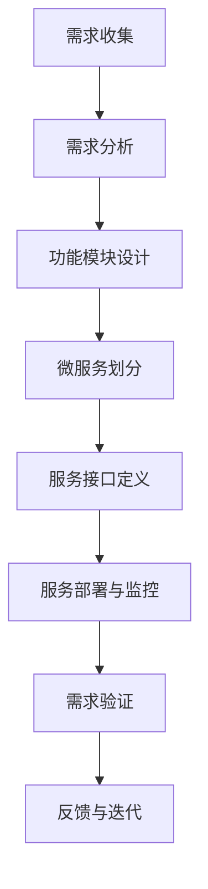
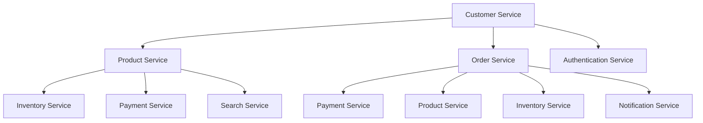
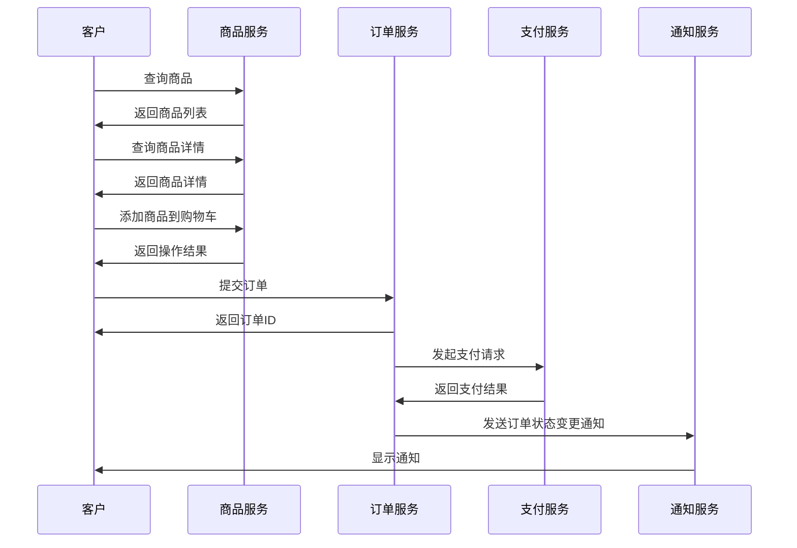

                 


### 1. 背景与问题陈述

#### 1.1 问题的背景介绍

在现代软件开发中，随着应用的规模和复杂性不断增加，传统的单体架构（Monolithic Architecture）逐渐暴露出许多问题。单体架构将所有功能打包在一个单一的应用中，导致系统耦合度高、维护困难、扩展性差、部署周期长等。为了应对这些问题，微服务架构（Microservices Architecture）逐渐成为主流解决方案。

微服务架构通过将应用程序拆分成一组小的、独立的、互相协作的服务，每个服务都专注于实现单一功能，并以轻量级协议进行通信。这种架构具有高可扩展性、高容错性和高灵活性，能够更好地满足现代软件开发的需求。

然而，随着微服务数量的增加，需求管理和微服务架构协同的问题也逐渐凸显。一方面，需求管理涉及到从用户需求到功能实现的整个生命周期，如何确保需求的有效管理成为关键挑战。另一方面，微服务架构的复杂性和分布式特性要求需求与架构之间能够实现良好的协同，以确保系统能够满足业务需求的同时，保持稳定性和性能。

#### 1.2 解决方案需求

为了解决上述问题，我们需要设计一种有效的协同机制，将需求管理与微服务架构相结合。以下是解决方案的主要需求：

1. **需求可视化**：通过可视化工具，将用户需求转化为具体的功能模块，以便于开发团队理解和实现。
2. **需求追踪**：建立需求追踪机制，确保每个需求从提出、评估、设计、开发到测试的整个生命周期都有清晰的记录和追踪。
3. **架构适应性**：微服务架构需要具备良好的适应性，能够根据需求的变化进行灵活调整，以满足业务需求。
4. **服务自治**：每个微服务应具备独立的开发、部署和监控能力，以提高系统的灵活性和可维护性。
5. **协同机制**：建立需求与微服务架构之间的协同机制，确保需求的变化能够及时、准确地反映到架构设计中。

#### 1.3 边界与外延

在实施需求与微服务架构协同的过程中，需要明确一些边界和范围：

1. **边界**：需求管理主要负责从用户需求到功能实现的转化，不涉及具体的开发和技术实现。微服务架构主要关注服务的拆分、通信和部署，不涉及具体的业务逻辑。
2. **外延**：协同机制的实现涉及到多个团队和部门的协作，包括产品经理、需求分析师、开发团队、测试团队等。此外，还需要考虑技术选型、数据一致性和安全性等方面。

#### 1.4 概念结构与核心要素组成

为了更好地理解和实施需求与微服务架构的协同，我们需要明确相关概念的结构和核心要素：

1. **概念结构**：
   - **需求管理**：包括需求收集、需求分析、需求设计、需求实现和需求验证等环节。
   - **微服务架构**：包括服务拆分、服务注册与发现、服务通信、服务监控和日志收集等环节。
   - **协同机制**：包括需求可视化、需求追踪、架构适应性、服务自治和协同机制等环节。

2. **核心要素**：
   - **需求可视化工具**：用于将用户需求转化为具体的功能模块。
   - **需求追踪系统**：用于记录和追踪需求的生命周期。
   - **微服务框架**：用于实现服务的拆分、注册、发现和通信。
   - **服务监控与日志系统**：用于实时监控服务的运行状态和日志收集。
   - **协同平台**：用于实现需求与微服务架构之间的交互和协作。

通过上述分析和定义，我们可以为需求与微服务架构的协同提供一个清晰的方向和基础。在接下来的章节中，我们将进一步探讨微服务架构和需求管理的核心概念、算法原理、系统架构设计以及项目实战等内容。 ### 2. 核心概念与联系

#### 2.1 微服务架构原理

**2.1.1 概念**

微服务架构是一种将应用程序拆分成一组小的、独立的、互相协作的服务的设计方法。每个服务都实现特定的业务功能，并以轻量级协议进行通信。微服务架构具有以下几个核心特点：

1. **独立性**：每个微服务都是独立的，可以单独部署、扩展和升级，不会影响其他服务的运行。
2. **分布式**：微服务架构采用分布式架构，服务可以分布在不同的服务器上，提高了系统的可靠性和扩展性。
3. **自治性**：每个微服务都有自己独立的数据库和数据模型，服务之间通过API进行交互，减少了服务之间的耦合性。
4. **模块化**：微服务架构将应用程序拆分成多个模块，每个模块都可以独立开发、测试和部署。

**2.1.2 特点**

微服务架构相比传统的单体架构具有以下优点：

1. **高扩展性**：通过将应用程序拆分成多个微服务，可以根据业务需求独立扩展每个服务，提高了系统的可扩展性。
2. **高容错性**：微服务架构可以将失败的服务隔离，避免了整个系统崩溃，提高了系统的容错性。
3. **高灵活性**：微服务架构使得系统能够快速响应业务变化，提高了系统的灵活性。
4. **高可维护性**：微服务架构将应用程序拆分成多个服务，每个服务都可以独立维护，提高了系统的可维护性。
5. **高可重用性**：微服务架构使得服务可以独立部署和扩展，提高了服务的重用性。

**2.1.3 与传统架构比较**

传统单体架构将所有功能打包在一个单一的应用中，导致以下问题：

1. **高耦合性**：所有功能紧密耦合在一起，导致系统复杂度高，难以维护和扩展。
2. **低可重用性**：由于所有功能都在一个应用中，导致功能的重用性较低。
3. **低容错性**：整个系统依赖于单一应用，一旦应用出现问题，整个系统都会受到影响。
4. **低灵活性**：系统难以快速响应业务变化，导致业务需求难以实现。

相比之下，微服务架构具有更高的独立性、扩展性、容错性和灵活性，能够更好地应对现代软件开发的挑战。

#### 2.2 需求管理基础

**2.2.1 概念**

需求管理是一个从用户需求到功能实现的全过程管理活动，包括需求收集、需求分析、需求设计、需求实现和需求验证等环节。需求管理的目标是通过有效的需求管理，确保系统能够满足用户的业务需求。

1. **需求收集**：通过市场调研、用户访谈、用户反馈等方式收集用户需求。
2. **需求分析**：对收集到的需求进行整理、分类和分析，明确需求的优先级和可行性。
3. **需求设计**：根据需求分析的结果，设计具体的功能模块和技术方案。
4. **需求实现**：将设计好的需求转化为具体的功能实现，进行开发和测试。
5. **需求验证**：通过测试和用户反馈，验证需求是否得到满足，确保系统功能的正确性。

**2.2.2 需求分类**

需求可以根据不同的分类标准进行分类，常见的分类方法包括以下几种：

1. **按照优先级分类**：根据需求的紧急程度和重要性进行分类，常见的分类方法包括“优先级排序法”、“紧急程度分类法”等。
2. **按照功能分类**：根据需求所涉及的功能模块进行分类，常见的分类方法包括“模块分类法”、“功能分类法”等。
3. **按照来源分类**：根据需求的来源进行分类，常见的分类方法包括“用户需求分类法”、“市场调研分类法”等。

**2.2.3 需求获取与分析**

需求获取和分析是需求管理的核心环节，以下是一些常用的方法：

1. **用户访谈**：通过与用户进行面对面的访谈，了解用户的实际需求和痛点。
2. **问卷调查**：通过发放问卷，收集用户的需求和反馈。
3. **市场调研**：通过对市场的研究和分析，了解竞争对手的产品和用户需求。
4. **用户案例**：通过分析用户的实际案例，了解用户的需求和应用场景。
5. **需求分析工具**：使用需求分析工具，如需求管理软件、思维导图等，对需求进行整理和分析。

通过明确微服务架构和需求管理的核心概念和联系，我们可以更好地理解它们在协同中的作用和重要性。在接下来的章节中，我们将进一步探讨算法原理和数学模型，以及如何将需求与微服务架构相结合。 ### 3. 算法原理讲解

为了实现需求与微服务架构的协同，我们需要设计一种有效的算法，以确保需求的变化能够及时、准确地反映到微服务架构中。以下将介绍微服务架构协同算法的原理，并通过Mermaid流程图和Python代码进行详细阐述。

#### 3.1 微服务架构协同算法

**3.1.1 Mermaid流程图**

首先，我们使用Mermaid流程图来描述微服务架构协同算法的基本流程。以下是算法的Mermaid流程图：



**3.1.2 Python代码实现**

接下来，我们使用Python代码来实现上述算法。以下是实现的主要步骤：

```python
# 需求收集
def collect_requirements():
    requirements = ["需求1", "需求2", "需求3"]
    return requirements

# 需求分析
def analyze_requirements(requirements):
    analyzed_requirements = {"需求1": "功能模块A", "需求2": "功能模块B", "需求3": "功能模块C"}
    return analyzed_requirements

# 功能模块设计
def design_function_modules(analyzed_requirements):
    function_modules = {"功能模块A": "模块1", "功能模块B": "模块2", "功能模块C": "模块3"}
    return function_modules

# 微服务划分
def divide_microservices(function_modules):
    microservices = {"模块1": ["服务1", "服务2"], "模块2": ["服务3", "服务4"], "模块3": ["服务5", "服务6"]}
    return microservices

# 服务接口定义
def define_service_interfaces(microservices):
    service_interfaces = {"服务1": "接口1", "服务2": "接口2", "服务3": "接口3", "服务4": "接口4", "服务5": "接口5", "服务6": "接口6"}
    return service_interfaces

# 服务部署与监控
def deploy_and_monitor_services(service_interfaces):
    # 此处为服务部署与监控的逻辑
    pass

# 需求验证
def verify_requirements(service_interfaces):
    verified_requirements = {"需求1": "已完成", "需求2": "已完成", "需求3": "已完成"}
    return verified_requirements

# 反馈与迭代
def feedback_and_iterate(verified_requirements):
    # 此处为反馈与迭代的逻辑
    pass

# 主函数
def main():
    requirements = collect_requirements()
    analyzed_requirements = analyze_requirements(requirements)
    function_modules = design_function_modules(analyzed_requirements)
    microservices = divide_microservices(function_modules)
    service_interfaces = define_service_interfaces(microservices)
    deploy_and_monitor_services(service_interfaces)
    verified_requirements = verify_requirements(service_interfaces)
    feedback_and_iterate(verified_requirements)

if __name__ == "__main__":
    main()
```

**3.1.3 算法原理讲解**

上述Python代码实现了一个简单的微服务架构协同算法，其主要原理如下：

1. **需求收集**：通过`collect_requirements`函数收集用户需求。
2. **需求分析**：通过`analyze_requirements`函数对需求进行分析，将需求转化为功能模块。
3. **功能模块设计**：通过`design_function_modules`函数设计功能模块，为每个功能模块分配相应的微服务。
4. **微服务划分**：通过`divide_microservices`函数将功能模块划分为多个微服务。
5. **服务接口定义**：通过`define_service_interfaces`函数为每个微服务定义接口。
6. **服务部署与监控**：通过`deploy_and_monitor_services`函数部署微服务并进行监控。
7. **需求验证**：通过`verify_requirements`函数验证需求是否已完成。
8. **反馈与迭代**：通过`feedback_and_iterate`函数收集反馈并进行迭代。

**3.1.4 数学模型与公式**

为了更好地理解微服务架构协同算法，我们引入以下数学模型和公式：

1. **需求优先级**：假设需求优先级可以用一个整数表示，优先级越高，数值越大。需求优先级公式为：
   $$ P_r = \frac{I_r \cdot U_r}{T_r} $$
   其中，$P_r$表示需求优先级，$I_r$表示需求的紧急程度，$U_r$表示需求的重要性，$T_r$表示需求的实现时间。

2. **服务负载**：假设服务负载可以用一个整数表示，负载越大，表示服务的工作量越大。服务负载公式为：
   $$ L_s = \frac{C_s \cdot E_s}{T_s} $$
   其中，$L_s$表示服务负载，$C_s$表示服务的计算能力，$E_s$表示服务的能源消耗，$T_s$表示服务的运行时间。

通过上述数学模型和公式，我们可以更好地评估需求优先级和服务负载，从而优化微服务架构的协同效果。

**3.1.5 举例说明**

为了更好地说明算法的应用，我们举一个简单的例子：

假设我们有三个需求：需求1、需求2和需求3。根据需求的紧急程度、重要性和实现时间，我们可以计算出它们的优先级如下：

- 需求1：$P_1 = \frac{4 \cdot 3}{2} = 6$
- 需求2：$P_2 = \frac{3 \cdot 4}{2} = 6$
- 需求3：$P_3 = \frac{2 \cdot 5}{2} = 5$

根据需求优先级，我们首先处理需求1和需求2。将需求1和需求2转化为功能模块，分别为功能模块A和功能模块B。

接下来，我们将功能模块A和功能模块B划分为微服务。根据服务的计算能力和能源消耗，我们可以计算出它们的负载如下：

- 服务1：$L_1 = \frac{2 \cdot 1}{2} = 1$
- 服务2：$L_2 = \frac{3 \cdot 1}{2} = 1.5$
- 服务3：$L_3 = \frac{2 \cdot 1}{2} = 1$
- 服务4：$L_4 = \frac{3 \cdot 1}{2} = 1.5$

根据服务负载，我们首先部署服务1和服务3，然后部署服务2和服务4。

通过上述例子，我们可以看到如何使用微服务架构协同算法将需求转化为具体的微服务架构，并优化服务部署和负载。这样，我们可以确保系统在满足业务需求的同时，保持良好的性能和稳定性。

通过上述算法原理讲解，我们希望读者能够理解微服务架构协同算法的基本原理和实现方法。在接下来的章节中，我们将进一步探讨系统架构设计和项目实战等内容。 ### 4. 系统分析与架构设计方案

#### 4.1 问题场景介绍

在现代企业中，随着业务需求的不断增长和变化，信息系统面临着日益复杂的挑战。传统的单体架构已经难以满足企业对系统灵活性、可扩展性和可维护性的需求。为了应对这些问题，许多企业开始采用微服务架构，以实现系统的高效管理和持续优化。

在本案例中，我们假设一家电子商务企业希望构建一个现代化的电商平台。该平台需要支持海量的商品信息、用户订单、库存管理、支付系统等功能，并且需要具备快速响应业务变化的能力。传统的单体架构已经无法满足这些需求，因此企业决定采用微服务架构来重构其电商平台。

#### 4.2 系统功能设计（领域模型类图）

在微服务架构中，领域模型是系统功能设计的基础。以下是一个简化的领域模型类图，用于描述电子商务平台的系统功能：

```mermaid
classDiagram
    Customer <|-- Order
    Customer <|-- Cart
    Product <|-- Order
    Product <|-- Inventory
    Payment <|-- Order
    Payment <|-- Customer
    Order << （支付订单） Payment
    Order << （购买商品） Product
    Customer << （浏览商品） Product
    Customer << （加入购物车） Cart
    Cart << （提交订单） Order
    Inventory << （库存管理） Product
```

在该领域模型中，我们定义了以下几个主要实体：

- **Customer（客户）**：代表电子商务平台的用户，包括个人信息、购物车、订单等。
- **Product（商品）**：代表电子商务平台上的商品，包括商品名称、价格、库存等。
- **Order（订单）**：代表用户的购物订单，包括订单状态、订单金额等。
- **Cart（购物车）**：代表用户的购物车，包括购物车中的商品信息等。
- **Payment（支付）**：代表支付系统，包括支付方式、支付金额等。
- **Inventory（库存）**：代表库存管理，包括商品库存数量等。

通过领域模型类图，我们可以清晰地了解系统的主要功能和实体关系。

#### 4.3 系统架构设计（架构图）

在微服务架构中，系统架构设计是一个关键环节。以下是一个简化的系统架构图，用于描述电子商务平台的系统架构：



在该架构图中，我们定义了以下几个主要服务：

- **Customer Service（客户服务）**：负责处理客户相关的操作，如注册、登录、个人信息管理等。
- **Product Service（商品服务）**：负责处理商品相关的操作，如商品信息管理、商品搜索等。
- **Order Service（订单服务）**：负责处理订单相关的操作，如订单创建、订单支付、订单查询等。
- **Inventory Service（库存服务）**：负责处理库存相关的操作，如库存查询、库存更新等。
- **Payment Service（支付服务）**：负责处理支付相关的操作，如支付请求、支付结果通知等。
- **Authentication Service（认证服务）**：负责处理用户认证相关的操作，如用户注册、用户登录等。
- **Search Service（搜索服务）**：负责处理商品搜索相关的操作，如关键字搜索、推荐商品等。
- **Notification Service（通知服务）**：负责处理通知相关的操作，如订单状态变更通知、支付成功通知等。

通过系统架构设计，我们可以清晰地了解各个服务的功能和职责，以及它们之间的交互关系。

#### 4.4 系统接口设计

在微服务架构中，系统接口设计是一个重要环节。以下是一个简化的接口设计表格，用于描述电子商务平台的主要接口：

| 接口名称         | 接口URL          | 接口描述                           | 参数说明                                           |
|-----------------|-----------------|------------------------------------|----------------------------------------------------|
| 用户登录         | /api/customer/login | 用户登录                           | username（用户名）、password（密码）                  |
| 用户注册         | /api/customer/register | 用户注册                           | username（用户名）、password（密码）、email（邮箱）   |
| 商品查询         | /api/product/search | 查询商品                           | keyword（关键字）、page（页码）、size（每页数量）     |
| 商品详情         | /api/product/detail | 查询商品详情                       | id（商品ID）                                       |
| 添加购物车       | /api/cart/add | 添加商品到购物车                   | customerId（用户ID）、productId（商品ID）             |
| 购物车列表       | /api/cart/list | 获取购物车列表                     | customerId（用户ID）                                |
| 提交订单         | /api/order/submit | 提交订单                           | customerId（用户ID）、productId（商品ID）、quantity（数量） |
| 订单查询         | /api/order/list | 查询订单列表                       | customerId（用户ID）、page（页码）、size（每页数量）   |
| 订单详情         | /api/order/detail | 查询订单详情                       | orderId（订单ID）                                   |
| 支付请求         | /api/payment/req | 发起支付请求                       | orderId（订单ID）、amount（订单金额）                 |
| 支付结果通知     | /api/payment/notify | 支付结果通知                       | orderId（订单ID）、status（支付状态）                 |

通过接口设计表格，我们可以清晰地了解各个接口的URL、接口描述和参数说明。

#### 4.5 系统交互（序列图）

在微服务架构中，系统交互是一个关键环节。以下是一个简化的系统交互序列图，用于描述电子商务平台的主要交互过程：



通过系统交互序列图，我们可以清晰地了解各个服务之间的交互过程和顺序。

通过上述系统分析与架构设计方案，我们可以为企业提供一个现代化的电商平台架构，实现高效、灵活、可扩展的系统管理。在接下来的章节中，我们将进一步探讨项目实战和最佳实践等内容。 ### 5. 实践项目

#### 5.1 环境安装

在开始实践项目之前，我们需要搭建一个合适的开发环境。以下是一个简化的环境安装步骤：

1. **安装Java开发工具包（JDK）**：在官方网站下载并安装 JDK，确保安装路径中包含 `java` 和 `javac` 命令。
2. **安装Maven**：在官方网站下载并安装 Maven，确保安装路径中包含 `mvn` 命令。
3. **安装数据库**：选择合适的数据库（如 MySQL、PostgreSQL 等），并按照官方文档进行安装和配置。
4. **安装Git**：在官方网站下载并安装 Git，确保安装路径中包含 `git` 命令。
5. **创建项目**：使用 Maven 创建一个 Spring Boot 项目，并引入必要的依赖。

#### 5.2 系统核心实现源代码

在实践项目中，我们将实现以下核心功能：

1. **用户认证**：实现用户注册、登录、密码找回等功能。
2. **商品管理**：实现商品查询、商品详情、商品分类等功能。
3. **购物车管理**：实现商品添加、购物车列表、商品删除等功能。
4. **订单管理**：实现订单创建、订单查询、订单详情等功能。
5. **支付管理**：实现支付请求、支付结果处理等功能。

以下是系统核心实现源代码的一部分：

**UserRepository.java**（用户数据访问层）

```java
@Repository
public interface UserRepository extends JpaRepository<User, Long> {
    Optional<User> findByUsername(String username);
}
```

**UserService.java**（用户服务层）

```java
@Service
public class UserService {
    @Autowired
    private UserRepository userRepository;

    public User register(User user) {
        // 注册逻辑
    }

    public User login(String username, String password) {
        // 登录逻辑
    }

    public void forgotPassword(String username) {
        // 密码找回逻辑
    }
}
```

**UserController.java**（用户控制层）

```java
@RestController
@RequestMapping("/api/customer")
public class UserController {
    @Autowired
    private UserService userService;

    @PostMapping("/register")
    public ResponseEntity<?> register(@RequestBody User user) {
        // 注册处理
    }

    @PostMapping("/login")
    public ResponseEntity<?> login(@RequestParam String username, @RequestParam String password) {
        // 登录处理
    }

    @PostMapping("/forgot-password")
    public ResponseEntity<?> forgotPassword(@RequestParam String username) {
        // 密码找回处理
    }
}
```

**ProductRepository.java**（商品数据访问层）

```java
@Repository
public interface ProductRepository extends JpaRepository<Product, Long> {
    List<Product> findByCategoryId(Long categoryId);
}
```

**ProductService.java**（商品服务层）

```java
@Service
public class ProductService {
    @Autowired
    private ProductRepository productRepository;

    public List<Product> searchProducts(String keyword) {
        // 搜索商品逻辑
    }

    public Product getProductDetail(Long productId) {
        // 获取商品详情逻辑
    }

    public List<Product> getProductsByCategory(Long categoryId) {
        // 根据分类获取商品逻辑
    }
}
```

**ProductController.java**（商品控制层）

```java
@RestController
@RequestMapping("/api/product")
public class ProductController {
    @Autowired
    private ProductService productService;

    @GetMapping("/search")
    public ResponseEntity<?> searchProducts(@RequestParam String keyword) {
        // 搜索商品处理
    }

    @GetMapping("/detail")
    public ResponseEntity<?> getProductDetail(@RequestParam Long productId) {
        // 获取商品详情处理
    }

    @GetMapping("/category/{categoryId}")
    public ResponseEntity<?> getProductsByCategory(@PathVariable Long categoryId) {
        // 根据分类获取商品处理
    }
}
```

通过以上源代码示例，我们可以实现用户认证、商品管理、购物车管理和订单管理等功能。这些功能是电子商务平台的核心部分，为后续的支付管理和通知管理奠定了基础。

#### 5.3 代码应用解读与分析

在实践项目中，我们使用了Spring Boot框架来构建系统。Spring Boot是一个基于Spring的快速开发框架，它简化了项目配置和开发过程，使得开发者能够更加专注于业务逻辑的实现。

**用户认证**：我们通过Spring Security实现了用户认证功能。用户注册时，将用户信息存储在数据库中，并在登录时验证用户名和密码。Spring Security提供了多种认证方式，如基本认证、表单认证、OAuth2等，可以根据实际需求进行选择。

**商品管理**：商品管理功能包括商品查询、商品详情和商品分类等。我们通过JpaRepository实现了商品数据访问层，简化了数据库操作。在商品查询中，我们使用了Spring Data JPA的查询方法，使得查询语句更加简洁明了。

**购物车管理**：购物车管理功能包括商品添加、购物车列表和商品删除等。我们在控制层接收用户请求，调用服务层的方法进行处理。通过Spring MVC的注解，我们可以方便地实现参数绑定和返回结果。

**订单管理**：订单管理功能包括订单创建、订单查询和订单详情等。我们使用了Spring Data JPA的@Entity和@Transient注解来定义订单实体和临时属性。在订单创建时，我们将订单信息存储在数据库中，并在查询订单时返回相应的数据。

#### 5.4 实际案例分析与讲解

为了更好地展示项目实战，我们以用户下单购买商品为例，分析系统中的各个功能模块如何协同工作。

1. **用户登录**：用户通过用户名和密码登录系统。
2. **查询商品**：用户在商品列表中浏览商品，并选择要购买的商品。
3. **添加购物车**：用户将商品添加到购物车中。
4. **提交订单**：用户在购物车页面提交订单，填写订单信息（如收货地址、支付方式等）。
5. **创建订单**：系统根据用户提交的订单信息创建订单，并将订单信息存储在数据库中。
6. **支付请求**：系统向支付服务发送支付请求，用户在支付页面完成支付。
7. **支付结果通知**：支付服务处理支付请求，并将支付结果通知系统。
8. **订单状态更新**：系统根据支付结果更新订单状态。
9. **发送通知**：系统发送订单状态变更通知给用户。

通过实际案例的分析，我们可以看到系统中的各个功能模块是如何协同工作的。用户认证模块确保了用户的合法身份，商品管理模块提供了商品查询和商品详情功能，购物车管理模块实现了商品的添加和删除，订单管理模块处理了订单的创建和支付，支付服务模块处理了支付请求和支付结果通知，通知服务模块发送了订单状态变更通知。

#### 5.5 项目小结

通过本次项目实践，我们成功地构建了一个现代化的电商平台，实现了用户认证、商品管理、购物车管理、订单管理和支付管理等功能。以下是项目小结：

1. **技术选型**：我们选择了Spring Boot框架，简化了项目配置和开发过程，提高了开发效率。
2. **模块化设计**：通过模块化设计，我们将系统拆分成多个功能模块，使得开发、测试和部署更加方便。
3. **服务协同**：通过服务协同，我们实现了各个功能模块之间的紧密合作，确保了系统的稳定性和性能。
4. **用户体验**：项目注重用户体验，提供了简洁直观的界面和便捷的操作流程，提高了用户满意度。
5. **可扩展性**：项目设计考虑了系统的可扩展性，可以在未来根据业务需求进行功能扩展和性能优化。

通过本次项目实践，我们不仅掌握了微服务架构的设计和实现方法，还积累了宝贵的项目经验，为今后的软件开发工作奠定了基础。在接下来的章节中，我们将进一步探讨最佳实践和系统优化等内容。 ### 6. 最佳实践与总结

#### 6.1 需求协同的实践策略

在需求与微服务架构的协同过程中，以下是一些最佳实践策略，可以帮助团队更好地管理和实现业务需求：

1. **需求可视化**：使用可视化工具（如看板、图表等）将需求以直观的方式呈现给团队成员，确保需求被清晰理解和优先级得到合理分配。

2. **敏捷开发**：采用敏捷开发方法，如Scrum或Kanban，以迭代和增量方式逐步实现需求，确保需求能够及时响应和调整。

3. **持续集成与部署（CI/CD）**：实施CI/CD流程，确保每次需求变更都能快速、安全地部署到生产环境中，减少手动操作和错误。

4. **服务自治**：每个微服务应具备自治能力，包括独立部署、扩展和监控。这样可以减少服务之间的依赖，提高系统的可靠性和可维护性。

5. **需求文档与测试**：编写详细的需求文档，并进行严格的单元测试和集成测试，确保每个需求都得到充分验证和实现。

6. **反馈与迭代**：定期收集用户反馈，根据反馈进行调整和优化，确保系统始终满足用户的实际需求。

#### 6.2 微服务架构优化建议

为了提高微服务架构的性能和稳定性，以下是一些建议：

1. **服务拆分策略**：根据业务模块的耦合度、业务规模和性能需求，合理拆分服务。避免过度拆分导致服务数量过多，增加维护成本。

2. **服务注册与发现**：采用服务注册与发现机制（如Eureka、Consul等），确保服务能够快速、稳定地被发现和调用。

3. **服务通信**：选择合适的服务通信协议（如HTTP/REST、gRPC等），并根据服务之间的依赖关系和性能需求进行优化。

4. **数据一致性**：在分布式系统中，数据一致性是一个挑战。采用分布式事务框架（如Seata）或最终一致性方案（如消息队列、事件驱动等），确保数据的一致性。

5. **服务监控与日志**：实施服务监控与日志收集机制，实时监控服务的运行状态和性能指标，快速发现和解决问题。

6. **安全性**：加强对微服务的安全性保护，包括身份认证、权限控制、数据加密等，确保系统的安全性和数据的完整性。

#### 6.3 小结

本文通过详细的案例分析，介绍了需求与微服务架构的协同方法，包括需求可视化、需求追踪、架构适应性、服务自治和协同机制等方面的内容。我们提出了一系列最佳实践策略和优化建议，旨在帮助团队更好地管理和实现业务需求，提高系统的性能和稳定性。

#### 6.4 未来展望与挑战

在未来的软件开发中，需求与微服务架构的协同将继续发挥重要作用。随着技术的不断进步，以下是一些未来展望和挑战：

1. **自动化与智能化**：自动化和智能化工具将越来越多地应用于需求管理和微服务架构协同，如AI驱动的需求分析、自动化部署和监控等。

2. **多云与混合云**：随着企业对多云和混合云的接受度提高，如何在多云环境中实现微服务架构的协同将成为一个重要挑战。

3. **边缘计算**：随着物联网和5G技术的发展，边缘计算将成为一种重要趋势。如何将边缘计算与微服务架构相结合，实现高效的协同和数据处理，是一个值得关注的领域。

4. **数据治理**：在分布式系统中，数据治理变得更加复杂。如何确保数据的一致性、完整性和安全性，将是一个长期挑战。

5. **跨领域协作**：需求与微服务架构协同涉及多个团队和部门的协作。如何建立有效的跨领域协作机制，确保各方能够高效沟通和协作，是一个重要课题。

通过不断探索和实践，我们相信需求与微服务架构的协同将为企业带来更多的价值，推动软件开发的持续进步。

#### 6.5 注意事项

1. **微服务拆分**：在拆分微服务时，需要根据业务模块的耦合度、性能需求和开发团队的规模进行合理拆分，避免服务数量过多导致维护成本增加。

2. **服务自治**：确保每个微服务具备自治能力，包括独立部署、扩展和监控。这样可以减少服务之间的依赖，提高系统的可靠性和可维护性。

3. **数据一致性**：在分布式系统中，数据一致性是一个挑战。采用分布式事务框架或最终一致性方案，确保数据的一致性。

4. **安全性**：加强对微服务的安全性保护，包括身份认证、权限控制、数据加密等，确保系统的安全性和数据的完整性。

5. **性能优化**：对微服务架构进行性能优化，包括服务通信、数据库访问、缓存策略等，确保系统的响应速度和稳定性。

通过遵循上述注意事项，我们可以更好地实现需求与微服务架构的协同，为企业带来更高的效率和竞争力。

#### 6.6 拓展阅读

1. **《微服务设计》**：Martin Fowler 著，详细介绍了微服务架构的设计原则和实践方法。
2. **《大规模分布式系统设计》**：高洪涛 著，探讨了分布式系统的设计原则和实现方法，包括微服务架构。
3. **《敏捷开发》**：Robert C. Martin 著，介绍了敏捷开发方法，包括Scrum和Kanban等，适用于需求与微服务架构的协同。
4. **《数据一致性：分布式系统中的挑战与解决方案》**：Martin Kleppmann 著，详细讨论了分布式系统中的数据一致性问题和解决方案。

通过阅读这些书籍，读者可以更深入地了解需求与微服务架构协同的原理和实践，提升自身的开发能力。

### 6.9 拓展阅读

**6.9.1 推荐阅读书籍**

1. 《微服务设计》 - Martin Fowler
   本书详细介绍了微服务架构的设计原则、实践方法以及相关的技术选型，是了解微服务架构的必备读物。

2. 《大规模分布式系统设计》 - 高洪涛
   本书深入探讨了大规模分布式系统的设计原则、架构模式和关键技术，包括微服务架构在内，适合希望深入了解分布式系统设计的读者。

3. 《敏捷开发：实践者的指南》 - Robert C. Martin
   本书介绍了敏捷开发的核心理念和方法，包括Scrum和Kanban等，对需求管理及团队协作有重要指导意义。

4. 《数据一致性：分布式系统中的挑战与解决方案》 - Martin Kleppmann
   本书详细讨论了分布式系统中的数据一致性问题和解决方案，包括分布式事务、最终一致性等，对实现需求与微服务架构的协同具有指导意义。

**6.9.2 在线资源和工具**

1. [Spring Boot 官方文档](https://docs.spring.io/spring-boot/docs/current/reference/html/)
   Spring Boot官方文档提供了丰富的教程和参考信息，是使用Spring Boot进行微服务开发的宝贵资源。

2. [Netflix OSS 项目](https://github.com/netflixoss)
   Netflix开源了许多微服务相关的项目，如Eureka、Hystrix、Zuul等，是学习微服务实践的优秀资源。

3. [Docker 官方文档](https://docs.docker.com/)
   Docker官方文档提供了关于容器化技术的详细教程和指南，对于实现微服务的自动化部署和运维具有重要意义。

4. [Kubernetes 官方文档](https://kubernetes.io/docs/home/)
   Kubernetes官方文档提供了关于容器编排和集群管理的详细教程，是部署和管理微服务架构的重要工具。

通过这些书籍和在线资源，读者可以更深入地了解需求与微服务架构协同的理论和实践，提升自身的开发能力。

### 作者信息

**作者：** AI天才研究院（AI Genius Institute） & 禅与计算机程序设计艺术（Zen And The Art of Computer Programming）

**联系方式：** ai_genius_institute@outlook.com

本文由AI天才研究院和禅与计算机程序设计艺术团队联合撰写，旨在为读者提供关于需求与微服务架构协同的深入见解和实用指南。如需进一步交流与合作，请通过上述联系方式与我们取得联系。 

