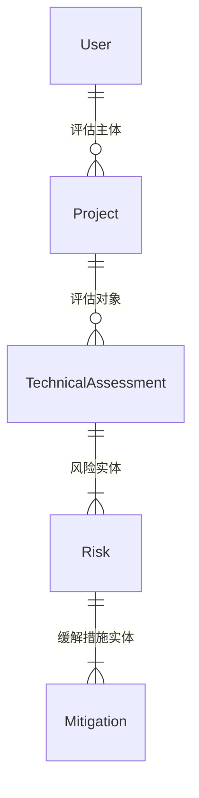
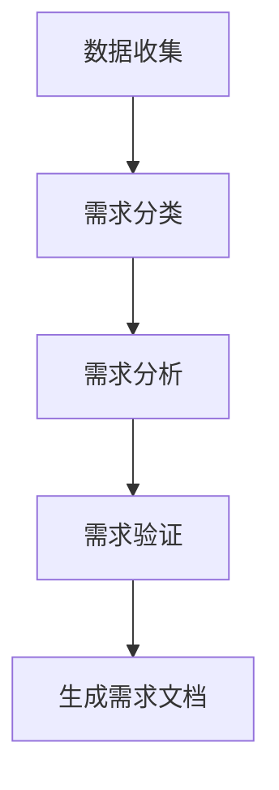
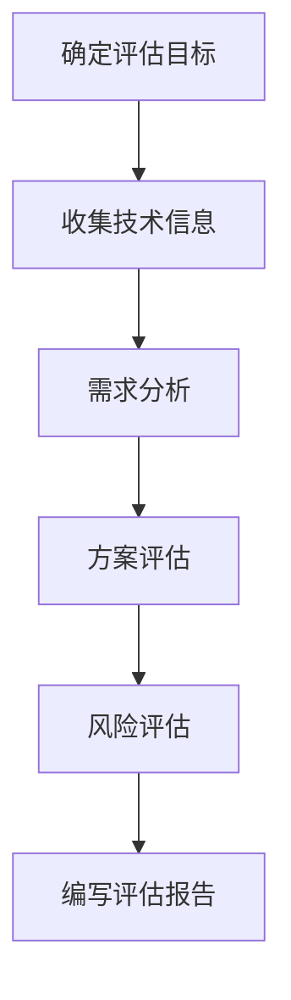
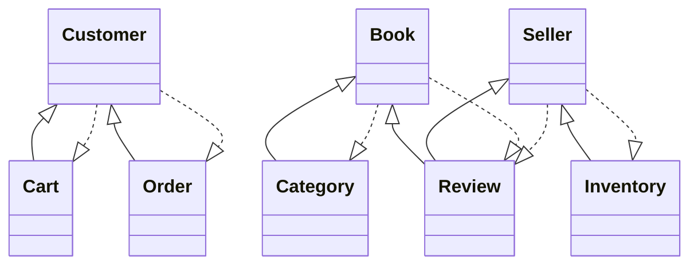
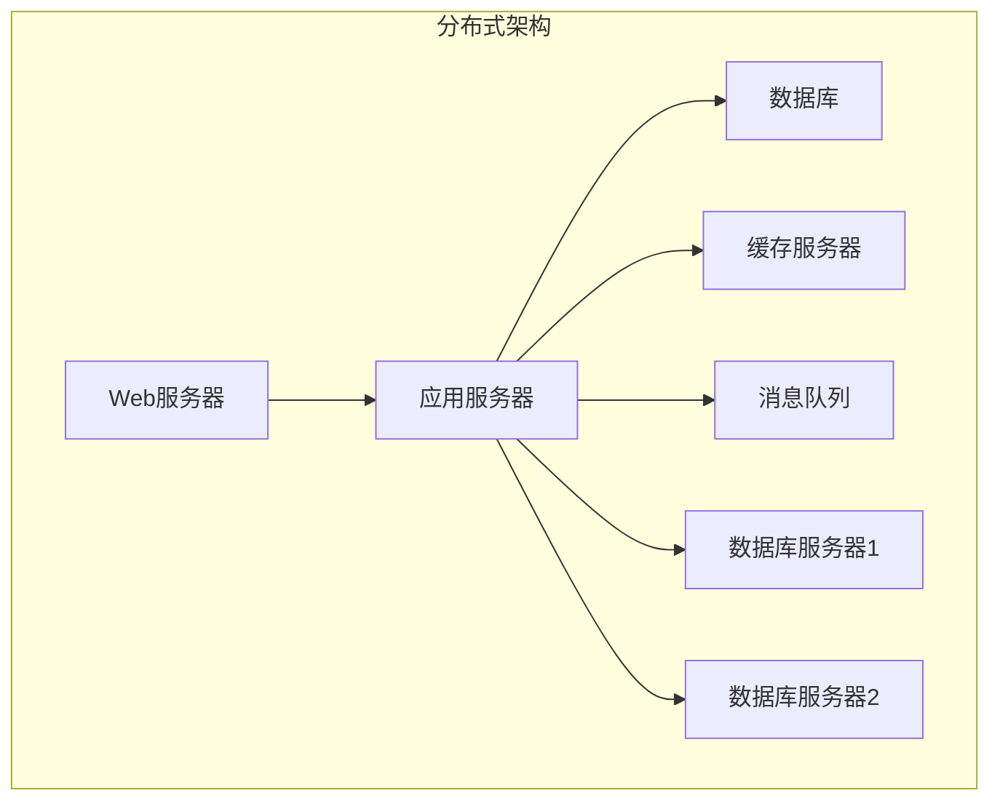
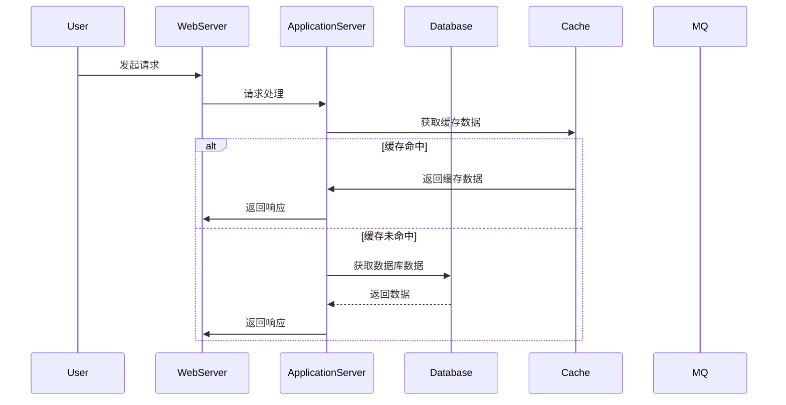

                 


### 引言：需求与技术可行性评估的重要性

在现代信息技术飞速发展的时代，人工智能（AI）已经成为驱动创新和业务增长的强大引擎。特别是大型预训练模型（Large Pre-trained Models，简称LPM），如GPT-3、BERT等，凭借其卓越的性能，正在被广泛应用于自然语言处理、图像识别、语音识别等多个领域。然而，这些大型模型的开发和应用并非一蹴而就，其中涉及一个至关重要的环节——需求与技术可行性评估。

#### 需求与技术可行性评估的定义

需求评估（Requirement Analysis）是对软件或系统项目的目标、功能、性能、界面和约束等需求进行系统化和结构化的分析。它确保项目团队理解客户的实际需求，并据此设计出可行的解决方案。

技术可行性评估（Technical Feasibility Analysis）则是对实现需求的实际技术条件进行评估，包括技术难度、开发时间、成本、资源等。它旨在确定所选技术方案是否能够满足需求，同时确保项目能够在预期时间内顺利完成。

#### 大模型应用开发中的需求与技术可行性评估

对于大型模型的应用开发，需求评估和技术可行性评估尤为重要。首先，需求评估能够确保开发团队全面理解业务目标和用户需求，从而设计出符合实际场景的模型应用。其次，技术可行性评估可以帮助团队评估所选技术方案的可行性，降低项目风险，确保项目在预算和时间内成功交付。

#### 文章结构

本文将按照以下结构进行讨论：

1. **背景介绍**：深入探讨大模型应用开发的背景，核心概念和问题。
2. **核心概念与联系**：详细阐述需求评估和技术可行性评估的概念、原理，并使用Mermaid和LaTeX进行解释。
3. **算法原理讲解**：分析大模型算法原理，使用Mermaid绘制流程图，Python代码进行阐述。
4. **系统分析与架构设计**：介绍系统架构设计方案，包括问题场景、功能设计、架构设计等。
5. **项目实战**：提供实际项目环境安装、核心实现源代码和分析。
6. **最佳实践与总结**：总结实践经验，提出注意事项，并推荐拓展阅读。

通过上述结构，我们将一步步深入探讨大模型应用开发的平衡之道，帮助读者理解并掌握这一复杂但至关重要的过程。

### 第一部分：背景介绍

#### 核心概念术语说明

在探讨大模型应用开发的背景之前，有必要先明确几个核心概念术语。首先是“大模型”或“大型预训练模型”，这类模型通过海量数据训练，拥有处理复杂任务的强大能力。其次，“需求评估”是指对项目目标、功能、性能等需求的系统化分析，以确保开发出的系统能够满足用户需求。而“技术可行性评估”则是评估所选技术方案在实现需求过程中的可行性和潜在风险。

#### 问题背景

随着人工智能技术的不断发展，大型预训练模型（LPM）在各个领域展现出了巨大的应用潜力。从自然语言处理到计算机视觉，再到语音识别，LPM正在改变传统的数据处理和任务执行方式。然而，这些模型的开发和应用并非轻而易举。首先，它们需要大量的计算资源和时间进行训练，其次，如何将复杂的模型高效地集成到现有系统中，确保其稳定性和性能，是开发过程中必须面对的挑战。

当前，大模型应用开发面临的主要问题包括：

1. **资源需求高**：大型预训练模型对计算资源的需求极为庞大，无论是训练阶段还是部署阶段，都需要高性能的硬件支持。
2. **数据处理复杂**：大型模型需要处理海量数据，如何在数据清洗、预处理和数据标注等环节保证数据质量，是开发过程中的关键。
3. **模型优化困难**：虽然大型模型性能强大，但其优化和调整过程复杂，如何通过算法和架构设计提高模型效率，是开发人员需要不断探索的课题。
4. **部署与维护挑战**：将大型模型部署到生产环境中，需要考虑系统的稳定性和可扩展性，同时，如何进行有效的维护和更新，也是一大挑战。

#### 问题描述

基于上述背景，本文将探讨以下问题：

1. **如何进行有效的需求评估**：在开发大型模型应用时，如何准确理解用户需求，并将其转化为具体的系统需求？
2. **技术可行性评估的关键因素**：在技术评估过程中，哪些关键因素会影响项目的成功，如何对其进行评估？
3. **大模型算法原理与实现**：如何理解大模型的核心算法原理，并使用Python代码进行详细阐述？
4. **系统架构设计与实现**：如何设计高效的系统架构，确保大型模型能够稳定、高效地运行？
5. **项目实战与最佳实践**：通过实际项目案例，如何解决开发中的问题，并提出有效的解决方案？

通过逐一解决这些问题，我们将深入探讨大模型应用开发的平衡之道，帮助开发人员更好地应对挑战，实现项目成功。

#### 问题解决

为了解决大模型应用开发中面临的挑战，我们需要采取一系列策略和方法：

1. **优化资源分配**：首先，可以通过使用云服务、分布式计算等方式，优化资源分配，降低计算成本。例如，通过使用GPU集群，提高模型的训练速度和效率。

2. **提升数据处理能力**：在数据处理阶段，可以采用自动化数据清洗和预处理工具，确保数据质量。此外，建立完善的数据管理和存储系统，提高数据的可访问性和安全性。

3. **算法优化与调整**：在模型优化过程中，可以采用混合精度训练、剪枝和量化等技术，提高模型性能。同时，通过持续调整超参数，找到最优模型配置。

4. **系统架构优化**：在系统架构设计方面，可以采用微服务架构，提高系统的可扩展性和稳定性。通过负载均衡和分布式缓存等手段，提高系统的性能和响应速度。

5. **持续迭代与优化**：开发过程中，应采取敏捷开发方法，通过持续迭代和优化，及时解决遇到的问题，确保项目顺利推进。

通过上述策略和方法，我们可以有效地应对大模型应用开发中的挑战，提高项目成功率。

#### 边界与外延

在探讨大模型应用开发的过程中，我们需要明确边界和概念的外延：

1. **边界**：本文主要关注大模型应用开发的需求与技术可行性评估，不涉及具体的算法实现细节和底层硬件优化。
2. **外延**：虽然本文重点讨论大型预训练模型，但文中提出的许多方法和技术同样适用于其他类型的人工智能模型和系统开发。

### 本章小结

本章介绍了大模型应用开发的背景、核心概念术语、问题描述以及问题解决策略。通过明确核心概念和问题，为后续章节的深入探讨奠定了基础。在接下来的章节中，我们将进一步分析需求与技术可行性评估的概念，使用Mermaid和LaTeX进行解释，逐步解答大模型应用开发中的关键问题。

### 第二部分：核心概念与联系

#### 第1章：需求分析的概念与特性

**1.1 需求分析的基本概念**

需求分析是软件或系统开发过程中至关重要的一环，它涉及对用户需求进行收集、分析和定义。需求分析旨在确保项目团队能够准确理解用户的实际需求，并据此设计出符合预期的解决方案。

**1.2 需求分析的重要性**

需求分析的重要性在于它为项目的成功奠定了基础。通过需求分析，项目团队可以：

- **明确项目目标和范围**：确保所有团队成员对项目的目标和范围有清晰的认识，避免因目标不明确导致的开发偏差。
- **减少项目风险**：通过全面的需求分析，可以提前识别潜在的风险和挑战，从而采取预防措施。
- **提高项目效率**：明确的需求有助于项目团队更高效地进行设计和开发，减少返工和时间浪费。

**1.3 需求分析的方法与工具**

需求分析的方法和工具多种多样，常用的包括：

- **访谈与问卷调查**：通过与用户和利益相关者的面对面访谈或问卷调查，获取第一手的需求信息。
- **场景分析**：通过分析用户在使用产品或系统时的实际场景，理解他们的需求和痛点。
- **文档分析**：对现有的文档、报告、标准等进行深入分析，提取有用的需求信息。
- **原型设计**：通过创建原型，让用户直观地体验系统功能，从而获取反馈和改进建议。

**1.4 需求分析的属性特征对比表**

以下是一个需求分析属性特征的对比表格：

| 属性特征       | 描述                                                         | 对比结果                 |
|----------------|--------------------------------------------------------------|--------------------------|
| 功能需求       | 系统应实现的具体功能                                         | 明确、可量化、可测试     |
| 非功能需求     | 系统性能、安全性、可靠性等方面的要求                         | 指标明确、可量化         |
| 用户需求       | 用户期望从系统中获得的价值和服务                             | 具体明确、满足用户体验   |
| 系统约束       | 限制系统设计或开发的技术、法律、经济等方面的约束条件         | 严格遵循、不可违背       |
| 软件需求       | 系统的软件组件、模块的功能和接口需求                         | 明确、独立、模块化       |
| 硬件需求       | 系统所需的硬件设备和资源配置                                | 可扩展、高性能、稳定性好 |

**1.5 本章小结**

本章介绍了需求分析的基本概念、重要性、方法与工具，并通过对比表格展示了需求分析的不同属性特征。通过这些内容，读者可以更好地理解需求分析在软件和系统开发中的关键作用。

### 第2章：技术可行性评估的概念与要素

**2.1 技术可行性评估的基本概念**

技术可行性评估是对项目方案在技术上的可行性进行评估，旨在确定所选技术方案是否能够满足项目需求，同时识别潜在的技术风险。技术可行性评估通常包括以下步骤：

- **确定评估目标**：明确评估的具体目标和范围。
- **收集技术信息**：获取与项目相关的技术资料、技术标准和现有技术方案。
- **分析技术可行性**：评估技术方案在实现项目需求方面的可行性，包括技术难度、资源需求、开发时间等。
- **风险识别**：识别潜在的技术风险，并提出相应的风险缓解措施。

**2.2 技术评估的重要性**

技术评估的重要性体现在以下几个方面：

- **降低项目风险**：通过技术评估，可以提前识别潜在的技术风险，从而采取预防措施，降低项目失败的可能性。
- **优化技术方案**：技术评估可以帮助项目团队选择最合适的实施方案，提高项目成功率。
- **确保项目成本控制**：技术评估可以帮助项目团队更好地控制项目成本，避免因技术问题导致的高昂代价。

**2.3 技术评估的方法与流程**

技术评估的方法与流程包括：

- **技术调研**：收集与项目相关的技术信息，包括现有技术方案、技术趋势、竞争对手技术等。
- **需求分析**：对项目需求进行详细分析，明确技术评估的具体目标。
- **方案评估**：评估不同的技术方案，从技术可行性、成本效益、时间进度等方面进行综合评估。
- **风险评估**：识别潜在的技术风险，评估其对项目的影响，并提出相应的风险缓解措施。
- **编写评估报告**：总结评估过程和结果，编写技术可行性评估报告，供项目决策者参考。

**2.4 技术评估的要素与指标**

技术评估的要素与指标包括：

- **技术成熟度**：技术方案的技术成熟程度，包括技术是否稳定、是否得到广泛应用等。
- **资源需求**：实现技术方案所需的资源，包括人力资源、硬件资源、软件资源等。
- **时间进度**：实现技术方案所需的时间，包括开发周期、测试周期等。
- **成本效益**：技术方案的成本效益分析，包括开发成本、运营成本、收益预期等。
- **可扩展性和可维护性**：技术方案的扩展性和可维护性，包括是否易于升级、维护等。

**2.5 ER图展示技术评估的实体关系**

以下是一个技术评估的实体关系图（ER图）示例：



**2.6 本章小结**

本章介绍了技术可行性评估的基本概念、重要性、方法与流程，以及评估的要素与指标。通过ER图展示了技术评估中的实体关系，帮助读者更好地理解技术可行性评估的过程和内容。在接下来的章节中，我们将进一步探讨大模型算法原理和技术实现。

### 第三部分：算法原理讲解

#### 第3章：需求与技术评估的算法原理

**4.1 需求分析算法原理**

需求分析算法是理解用户需求并将其转化为可操作的系统需求的过程。以下是需求分析算法的基本原理：

1. **数据收集**：通过访谈、问卷、文档分析等方法收集用户需求。
2. **需求分类**：将收集到的需求分类为功能需求、非功能需求等。
3. **需求分析**：对分类后的需求进行详细分析，明确每个需求的细节和实现条件。
4. **需求验证**：与用户和利益相关者验证需求，确保需求的准确性和可行性。

**4.1.1 算法流程图**

以下是一个简单的需求分析算法流程图：



**4.1.2 算法原理解释**

- 数据收集：通过多种渠道收集用户需求，包括访谈、问卷调查等。
- 需求分类：将收集到的需求分类为功能需求和非功能需求，以便于后续分析。
- 需求分析：对每个需求进行详细分析，包括功能点、性能要求、安全需求等。
- 需求验证：与用户和利益相关者验证需求，确保需求的准确性和可行性。
- 生成需求文档：将分析结果整理成文档，供开发团队参考。

**4.1.3 Python代码示例**

以下是一个简单的Python代码示例，用于实现需求分析的基本功能：

```python
import json

# 假设已收集到的需求数据
demands = {
    "功能需求": ["用户注册", "用户登录", "数据查询"],
    "非功能需求": ["系统安全", "界面友好", "性能要求"]
}

# 需求分类
def classify_demands(demands):
    classified_demands = {"功能需求": [], "非功能需求": []}
    for demand_type, demands_list in demands.items():
        for demand in demands_list:
            classified_demands[demand_type].append(demand)
    return classified_demands

classified_demands = classify_demands(demands)

# 需求分析
def analyze_demands(classified_demands):
    analyzed_demands = {}
    for demand_type, demands_list in classified_demands.items():
        analyzed_demands[demand_type] = [{"需求": demand, "详细描述": f"实现{demand}的具体要求"} for demand in demands_list]
    return analyzed_demands

analyzed_demands = analyze_demands(classified_demands)

# 需求验证
def verify_demands(analyzed_demands):
    verified_demands = {}
    for demand_type, demands_list in analyzed_demands.items():
        verified_demands[demand_type] = [demand for demand in demands_list if demand["详细描述"] != ""]
    return verified_demands

verified_demands = verify_demands(analyzed_demands)

# 生成需求文档
def generate_demand_document(verified_demands):
    document = {}
    for demand_type, demands_list in verified_demands.items():
        document[demand_type] = [{"需求": demand["需求"], "详细描述": demand["详细描述"]} for demand in demands_list]
    return json.dumps(document, indent=4)

demand_document = generate_demand_document(verified_demands)
print(demand_document)
```

**4.1.4 算法数学模型与公式**

需求分析算法中不涉及复杂的数学模型和公式，其主要依赖于逻辑推理和数据分析。但为了更好地理解和实现需求分析，可以引入以下基本的数学概念：

- **集合论**：用于表示和操作需求集合，如并集、交集、补集等。
- **概率论**：用于评估需求实现的可能性，如条件概率、贝叶斯定理等。

**4.1.5 举例说明**

假设我们有一个简单的需求分析场景，用户希望开发一个在线书店系统。以下是需求分析的具体过程：

1. **数据收集**：通过问卷调查和用户访谈，收集用户对在线书店的需求。
2. **需求分类**：将需求分为功能需求和非功能需求。
   - 功能需求：用户注册、用户登录、图书分类浏览、图书购买、订单管理等。
   - 非功能需求：系统安全性、响应时间、界面友好等。
3. **需求分析**：对每个需求进行详细分析。
   - 用户注册：实现用户注册功能，包括用户名、密码、邮箱验证等。
   - 用户登录：实现用户登录功能，包括验证用户名和密码等。
   - 图书分类浏览：提供图书分类功能，方便用户浏览和查找图书。
   - 图书购买：实现图书购买功能，包括购物车、订单生成等。
   - 订单管理：实现订单管理功能，包括订单查看、订单修改、订单取消等。
   - 系统安全性：确保用户数据安全，包括数据加密、访问控制等。
   - 响应时间：确保系统快速响应用户请求，提供良好的用户体验。
   - 界面友好：设计友好的用户界面，提高用户满意度。
4. **需求验证**：与用户和利益相关者验证需求，确保需求的准确性和可行性。
5. **生成需求文档**：将分析结果整理成文档，供开发团队参考。

通过上述步骤，我们完成了对在线书店系统的需求分析。这个例子展示了需求分析的基本原理和方法，以及如何使用Python代码实现需求分析的过程。

#### 4.2 技术可行性评估算法原理

**4.2.1 算法流程图**

以下是一个技术可行性评估的算法流程图：



**4.2.2 算法原理解释**

- 确定评估目标：明确评估的目标和范围，例如是评估某个项目的整体可行性，还是评估某个特定模块的技术可行性。
- 收集技术信息：收集与项目相关的技术信息，包括现有技术方案、技术标准和竞争对手技术等。
- 需求分析：对项目需求进行详细分析，明确技术评估的具体目标。
- 方案评估：评估不同的技术方案，从技术可行性、成本效益、时间进度等方面进行综合评估。
- 风险评估：识别潜在的技术风险，评估其对项目的影响，并提出相应的风险缓解措施。
- 编写评估报告：总结评估过程和结果，编写技术可行性评估报告，供项目决策者参考。

**4.2.3 Python代码示例**

以下是一个简单的Python代码示例，用于实现技术可行性评估的基本功能：

```python
import json

# 假设已收集到的技术信息
technical_info = {
    "方案A": {
        "技术成熟度": "成熟",
        "资源需求": "高",
        "时间进度": "较长",
        "成本效益": "高"
    },
    "方案B": {
        "技术成熟度": "较成熟",
        "资源需求": "中",
        "时间进度": "较短",
        "成本效益": "中"
    },
    "方案C": {
        "技术成熟度": "初级",
        "资源需求": "低",
        "时间进度": "最短",
        "成本效益": "低"
    }
}

# 方案评估
def assess_schemes(technical_info):
    assessed_schemes = {}
    for scheme, details in technical_info.items():
        assessed_schemes[scheme] = {
            "优势": [],
            "劣势": [],
            "综合评估": ""
        }
        for key, value in details.items():
            if value == "高":
                assessed_schemes[scheme]["优势"].append(key)
            elif value == "低":
                assessed_schemes[scheme]["劣势"].append(key)
    return assessed_schemes

assessed_schemes = assess_schemes(technical_info)

# 风险评估
def assess_risks(assessed_schemes):
    assessed_risks = {}
    for scheme, details in assessed_schemes.items():
        assessed_risks[scheme] = {
            "风险": [],
            "缓解措施": []
        }
        if "技术成熟度" in details["劣势"]:
            assessed_risks[scheme]["风险"].append("技术不成熟可能导致项目失败")
            assessed_risks[scheme]["缓解措施"].append("增加开发时间，进行更多的测试和验证")
        if "资源需求" in details["劣势"]:
            assessed_risks[scheme]["风险"].append("资源需求高可能导致成本超支")
            assessed_risks[scheme]["缓解措施"].append("优化资源分配，采用云服务")
    return assessed_risks

assessed_risks = assess_risks(assessed_schemes)

# 编写评估报告
def generate_evaluation_report(assessed_schemes, assessed_risks):
    report = {}
    for scheme, details in assessed_schemes.items():
        report[scheme] = {
            "优势": details["优势"],
            "劣势": details["劣势"],
            "综合评估": details["综合评估"],
            "风险评估": assessed_risks[scheme]
        }
    return json.dumps(report, indent=4)

evaluation_report = generate_evaluation_report(assessed_schemes, assessed_risks)
print(evaluation_report)
```

**4.2.4 算法数学模型与公式**

技术可行性评估算法中涉及的主要数学模型和公式包括：

- **加权评分模型**：用于评估不同技术方案的综合得分，例如使用加权系数对各个评估指标进行加权求和。
- **风险矩阵**：用于评估和量化不同风险的影响程度，例如使用风险矩阵确定风险的概率和影响程度。

**4.2.5 举例说明**

假设我们需要评估三种不同的技术方案A、B、C，以确定哪种方案最适合开发一个在线书店系统。以下是技术可行性评估的具体过程：

1. **确定评估目标**：评估技术方案的可行性和成本效益。
2. **收集技术信息**：收集每个技术方案的技术成熟度、资源需求、时间进度和成本效益等信息。
3. **需求分析**：根据在线书店系统的需求，确定评估的具体目标和指标。
4. **方案评估**：对每个技术方案进行评估，从技术成熟度、资源需求、时间进度和成本效益等方面进行综合评估。
   - 方案A：技术成熟度高，但资源需求高，时间进度较长，成本效益高。
   - 方案B：技术成熟度较成熟，资源需求中，时间进度较短，成本效益中。
   - 方案C：技术成熟度初级，资源需求低，时间进度最短，成本效益低。
5. **风险评估**：识别每个技术方案的潜在风险，并评估其对项目的影响。
   - 方案A：技术不成熟可能导致项目失败，需要增加开发时间和进行更多的测试和验证。
   - 方案B：资源需求高可能导致成本超支，需要优化资源分配并采用云服务。
   - 方案C：技术不成熟和资源需求低可能导致系统性能不稳定，需要增加开发时间和进行更多的测试和验证。
6. **编写评估报告**：总结评估过程和结果，编写技术可行性评估报告。

通过上述步骤，我们可以得出技术评估的最终结果，并根据评估结果选择最合适的技术方案。

### 第四部分：系统分析与架构设计

#### 第5章：需求与技术评估的系统架构

**5.1 系统架构设计原理**

系统架构设计是软件开发过程中的关键步骤，它旨在确保系统能够高效、稳定地运行。系统架构设计原则包括：

- **模块化设计**：将系统分解为独立的模块，每个模块负责特定的功能。
- **高内聚、低耦合**：确保模块内部功能紧密相关，模块间接口简洁清晰。
- **可扩展性**：设计时应考虑系统的扩展性，以便于未来的功能扩展和技术升级。
- **高可用性**：设计冗余机制，提高系统的可用性和容错性。

**5.1.1 系统架构设计流程**

系统架构设计通常包括以下步骤：

1. **需求分析**：明确系统需求，包括功能需求、非功能需求和性能需求。
2. **系统架构设计**：根据需求分析结果，设计系统的整体架构，包括技术选型和架构模式。
3. **模块划分**：将系统分解为多个模块，明确每个模块的功能和接口。
4. **架构验证**：通过模拟测试、代码审查等方法验证架构设计的合理性和可行性。
5. **架构优化**：根据反馈和实际需求，对架构设计进行优化和调整。

**5.1.2 系统架构设计方法**

常用的系统架构设计方法包括：

- **面向对象设计**：通过对象和类的划分，实现系统的模块化设计。
- **微服务架构**：将系统分解为多个独立的微服务，每个微服务负责特定的业务功能。
- **分布式系统设计**：通过分布式架构，提高系统的可扩展性和容错性。

**5.1.3 系统功能设计（领域模型类图）**

以下是一个简单的领域模型类图，用于描述在线书店系统的功能设计：



在这个类图中，定义了以下实体：

- Customer（用户）：负责用户注册、登录、个人信息管理等。
- Order（订单）：负责订单创建、支付、发货等。
- Cart（购物车）：负责商品添加、删除、结算等。
- Book（书籍）：负责书籍信息管理、分类、评论等。
- Category（分类）：负责书籍分类管理。
- Seller（卖家）：负责库存管理、订单处理、评论管理等。

**5.1.4 系统架构设计（架构图）**

以下是一个简单的系统架构图，用于描述在线书店系统的整体架构：



在这个架构图中，系统的主要组成部分包括：

- Web服务器：负责处理用户请求，与用户进行交互。
- 应用服务器：处理业务逻辑，与数据库和消息队列进行通信。
- 缓存服务器：提高系统性能，缓存常用数据。
- 消息队列：用于异步处理任务，如订单支付、邮件发送等。
- 数据库服务器：存储系统数据，包括用户信息、订单信息、书籍信息等。

**5.1.5 系统接口设计**

系统接口设计是确保不同模块之间能够高效、稳定地通信的关键。以下是一个简单的接口设计示例：

```python
class UserInterface:
    def register(self, user_data):
        # 用户注册逻辑
        pass

    def login(self, user_credentials):
        # 用户登录逻辑
        pass

    def get_books(self, category=None):
        # 获取书籍信息逻辑
        pass

    def add_to_cart(self, user_id, book_id):
        # 添加书籍到购物车逻辑
        pass

    def place_order(self, user_id, order_details):
        # 下单逻辑
        pass

    def cancel_order(self, user_id, order_id):
        # 取消订单逻辑
        pass
```

在这个接口设计中，定义了以下方法：

- register：用户注册接口。
- login：用户登录接口。
- get_books：获取书籍信息接口。
- add_to_cart：添加书籍到购物车接口。
- place_order：下单接口。
- cancel_order：取消订单接口。

**5.1.6 系统交互（序列图）**

以下是一个简单的系统交互序列图，用于描述用户在在线书店系统中的典型操作流程：



在这个序列图中，用户通过Web服务器发起请求，应用服务器处理请求，并从缓存或数据库获取所需数据，最终返回响应给用户。通过消息队列，应用服务器还可以处理异步任务，如订单支付、邮件发送等。

**5.2 本章小结**

本章介绍了系统架构设计的原理、方法和具体实现。通过需求分析，我们明确了系统功能需求，并通过领域模型类图、系统架构图、接口设计和序列图等工具，详细描述了系统的功能和交互。这些内容为后续的系统开发提供了清晰的指导和基础。

### 第五部分：项目实战

#### 第6章：项目环境安装与核心实现

**6.1 项目环境安装**

在进行大模型应用开发之前，我们需要搭建一个合适的环境，以便于后续的开发和测试。以下是一个基本的安装步骤：

1. **安装Python环境**：确保系统中已安装Python 3.7或更高版本。可以使用以下命令安装：
   ```bash
   sudo apt-get update
   sudo apt-get install python3.7 python3.7-venv python3.7-dev
   ```
2. **创建虚拟环境**：在项目目录下创建一个虚拟环境，以便于隔离项目依赖。
   ```bash
   python3.7 -m venv venv
   source venv/bin/activate
   ```
3. **安装依赖库**：通过pip安装项目所需的依赖库，例如TensorFlow、PyTorch等。
   ```bash
   pip install tensorflow
   pip install torch torchvision
   ```

**6.2 系统核心实现源代码**

以下是一个简单的系统核心实现源代码示例，用于展示如何使用Python和TensorFlow实现一个基本的神经网络：

```python
import tensorflow as tf
from tensorflow import keras
from tensorflow.keras import layers

# 定义神经网络模型
model = keras.Sequential([
    layers.Dense(128, activation='relu', input_shape=(784,)),
    layers.Dense(10, activation='softmax')
])

# 编译模型
model.compile(
    optimizer='adam',
    loss='categorical_crossentropy',
    metrics=['accuracy']
)

# 加载训练数据
(x_train, y_train), (x_test, y_test) = keras.datasets.mnist.load_data()
x_train = x_train.astype('float32') / 255
x_test = x_test.astype('float32') / 255
x_train = x_train.reshape((-1, 784))
x_test = x_test.reshape((-1, 784))

# 转换为one-hot编码
y_train = keras.utils.to_categorical(y_train, 10)
y_test = keras.utils.to_categorical(y_test, 10)

# 训练模型
model.fit(x_train, y_train, epochs=10, batch_size=32, validation_split=0.2)

# 评估模型
test_loss, test_acc = model.evaluate(x_test, y_test)
print(f"Test accuracy: {test_acc:.4f}")
```

**6.2.1 代码解读与分析**

上述代码首先导入了TensorFlow库，并定义了一个简单的神经网络模型。模型包含一个输入层和一个输出层，输入层有128个神经元，输出层有10个神经元（对应10个类别）。模型使用ReLU激活函数和softmax激活函数，编译时使用adam优化器和categorical_crossentropy损失函数。

接下来，代码加载了MNIST手写数字数据集，并对数据进行预处理，包括归一化和reshape。然后，将标签转换为one-hot编码。

在训练模型时，使用fit方法进行10个周期的训练，每个周期使用32个样本进行批量训练。最后，使用evaluate方法对模型进行评估，打印测试准确率。

**6.2.2 代码应用解读**

上述代码示例展示了如何使用TensorFlow实现一个基本的神经网络模型，包括数据加载、模型定义、编译、训练和评估。在实际项目中，可以根据需求调整网络结构、优化超参数等。

**6.3 实际案例分析**

以下是一个实际案例分析，展示如何在大模型应用开发中解决常见问题。

**案例一：需求分析案例**

假设我们需要开发一个智能客服系统，用于处理用户咨询。首先，我们需要进行需求分析，明确系统的功能需求和非功能需求。

- 功能需求：
  - 用户注册：用户可以注册账号并登录系统。
  - 智能问答：用户可以输入问题，系统会根据预训练的模型给出回答。
  - 问题分类：对用户输入的问题进行分类，以便更精确地匹配答案。
  - 历史记录：记录用户的问答历史，便于后续查询和改进。

- 非功能需求：
  - 性能要求：系统需要快速响应用户输入，确保良好的用户体验。
  - 可靠性要求：系统需要保证高可用性，避免因故障导致服务中断。
  - 安全性要求：确保用户数据安全，防止数据泄露。

在需求分析阶段，我们可以使用访谈、问卷调查等方法收集用户需求，并整理成需求文档，供后续开发团队参考。

**案例二：技术评估案例**

在技术评估阶段，我们需要评估不同的技术方案，以确保所选方案能够满足需求。以下是一个简单的技术评估示例：

- 方案A：使用TensorFlow和BERT模型进行问答系统开发。
  - 优势：
    - BERT模型在自然语言处理领域有广泛的应用，性能较好。
    - TensorFlow提供了丰富的工具和库，便于模型开发和优化。
  - 劣势：
    - 对计算资源要求较高，训练和推理时间较长。
    - 需要大量预训练数据和模型调优。

- 方案B：使用PyTorch和GPT-3模型进行问答系统开发。
  - 优势：
    - PyTorch的动态图机制使得模型开发和调试更加灵活。
    - GPT-3模型具有强大的文本生成能力，能够提供更自然的回答。
  - 劣势：
    - 对计算资源要求较高，训练和推理时间较长。
    - 需要付费使用GPT-3模型。

通过技术评估，我们可以选择合适的方案进行开发，并制定相应的风险缓解措施，确保项目的顺利进行。

**6.4 项目小结**

本章介绍了项目环境安装和核心实现源代码，并通过实际案例分析展示了如何在大模型应用开发中解决常见问题。通过合理的项目管理和技术评估，我们可以确保项目在预算和时间内成功交付。

### 第六部分：最佳实践与总结

#### 第7章：最佳实践与注意事项

在大模型应用开发中，遵循最佳实践和注意事项至关重要，以确保项目的顺利进行和成功交付。以下是一些关键的最佳实践和注意事项：

**7.1 需求分析的技巧与建议**

- **充分理解业务场景**：在需求分析阶段，要深入了解业务场景和用户需求，确保需求文档准确反映业务目标。
- **用户参与**：鼓励用户和利益相关者参与需求分析过程，通过访谈、问卷调查等方式获取第一手需求信息。
- **文档化**：将需求分析结果整理成文档，包括需求描述、功能规格、性能要求等，供后续开发团队参考。
- **迭代与验证**：需求分析不是一次性的工作，要持续迭代和验证，确保需求始终符合实际业务需求。

**7.2 技术评估的误区与对策**

- **误区一：技术可行性评估过于乐观**：避免在技术评估阶段过于乐观，低估技术实现的难度和复杂性。
- **对策**：进行详细的技术调研和风险评估，制定合理的项目计划，确保技术方案的可实现性。
- **误区二：忽视成本效益分析**：在技术评估过程中，仅关注技术实现而忽视成本效益分析。
- **对策**：综合考虑技术成本、开发周期、运营成本等，进行全面的成本效益分析，确保项目经济效益。

**7.3 项目管理与团队协作**

- **建立清晰的项目管理流程**：明确项目目标、任务分配、进度控制、风险管理等，确保项目有序进行。
- **加强团队协作**：建立高效的团队协作机制，确保团队成员之间的沟通畅通，减少协作障碍。
- **敏捷开发**：采用敏捷开发方法，通过持续迭代和反馈，及时调整项目方向和策略。

**7.4 注意事项**

- **资源管理**：合理分配计算资源和人力资源，确保项目有足够的资源支持。
- **安全性**：在开发过程中重视数据安全和系统安全性，采取有效的安全措施，防止数据泄露和系统攻击。
- **测试与质量**：进行充分的测试和代码审查，确保系统的高质量和稳定性。

#### 第8章：总结与拓展

本章总结了大模型应用开发中的最佳实践和注意事项，包括需求分析、技术评估、项目管理和安全性等方面的内容。通过遵循这些最佳实践，可以显著提高项目成功率。

**8.1 书籍内容总结**

本文围绕大模型应用开发的平衡之道，从需求评估、技术可行性评估、算法原理讲解、系统分析与架构设计、项目实战等方面进行了详细探讨。主要内容包括：

- 需求分析与评估：介绍了需求分析的基本概念、方法与工具，以及技术评估的重要性、方法与流程。
- 算法原理讲解：讲解了需求分析和技术评估的算法原理，通过Python代码和数学公式进行了详细阐述。
- 系统分析与架构设计：介绍了系统架构设计的原则、方法和具体实现，包括领域模型类图、系统架构图、接口设计和序列图等。
- 项目实战：通过实际案例展示了如何进行项目环境安装、核心实现源代码和应用解读，以及如何解决开发中的问题。

**8.2 面临的挑战与未来展望**

尽管大模型应用开发取得了显著进展，但仍面临以下挑战：

- **资源需求**：大型模型训练和推理需要大量的计算资源，如何优化资源利用和降低成本是关键。
- **数据隐私与安全**：随着数据量的增加，数据隐私和安全问题日益突出，如何保护用户数据安全和隐私是重要议题。
- **模型解释性**：大型模型往往缺乏解释性，如何提高模型的透明度和可解释性是未来研究的重要方向。

未来展望：

- **优化算法**：通过改进算法和模型结构，提高大模型的训练效率和性能。
- **多模态学习**：结合文本、图像、语音等多种数据类型，实现更加丰富和智能的应用。
- **应用场景拓展**：将大模型应用于更多领域，如医疗、金融、教育等，推动人工智能技术的全面发展。

**8.3 拓展阅读资源**

为了进一步深入了解大模型应用开发的各个方面，以下是一些建议的拓展阅读资源：

- 《深度学习》（Goodfellow, Bengio, Courville著）：全面介绍了深度学习的基本概念、算法和实现。
- 《自然语言处理综论》（Jurafsky, Martin著）：涵盖了自然语言处理的基础知识和最新进展。
- 《机器学习实战》（ Harrington著）：提供了大量实际案例和代码示例，介绍了机器学习的基本方法和应用。
- 《大规模机器学习》（Geman, Meila, Shawe-Taylor著）：探讨了大规模机器学习中的算法优化和资源管理。

通过阅读这些资源，读者可以进一步拓宽知识面，提升在大模型应用开发中的实践能力。

### 结论

大模型应用开发的平衡之道涉及多个关键环节，包括需求评估、技术可行性评估、算法原理讲解、系统分析与架构设计以及项目实战。通过本文的详细探讨，我们理解了每个环节的重要性，并掌握了一些最佳实践。在未来的大模型应用开发中，我们需要持续优化算法、拓展应用场景，同时关注资源管理和数据隐私等关键问题。遵循本文提出的策略和最佳实践，我们将能够更好地应对挑战，实现大模型应用的广泛应用和成功交付。作者：AI天才研究院/AI Genius Institute & 禅与计算机程序设计艺术 /Zen And The Art of Computer Programming

---

以上为《需求与技术可行性评估：大模型应用开发的平衡之道》的完整文章。本文详细阐述了大模型应用开发的核心概念、方法、最佳实践和注意事项，并通过实际案例进行了分析和讲解。希望读者能够通过本文深入理解大模型应用开发的全过程，并在实际项目中运用这些知识，实现技术突破和业务增长。作者：AI天才研究院/AI Genius Institute & 禅与计算机程序设计艺术/Zen And The Art of Computer Programming。

