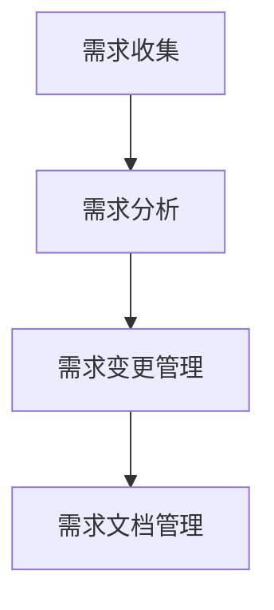
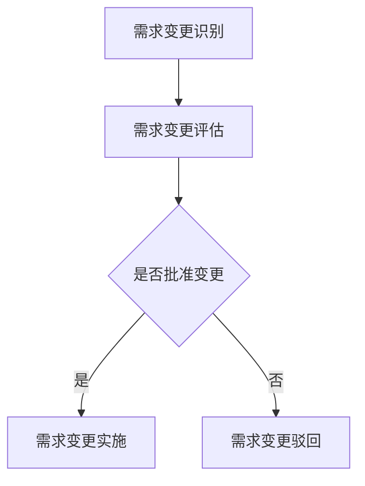
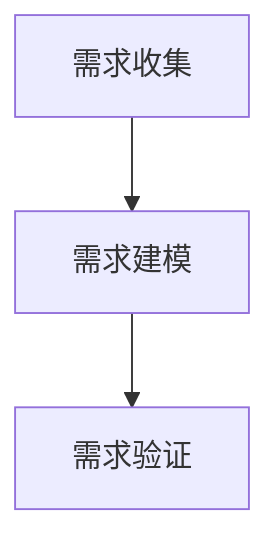
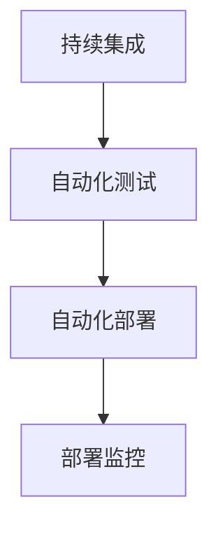
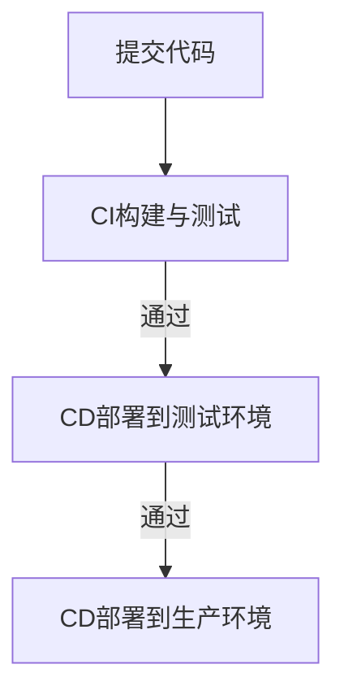
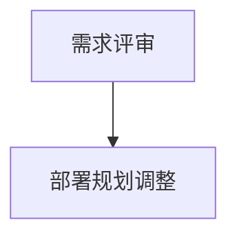
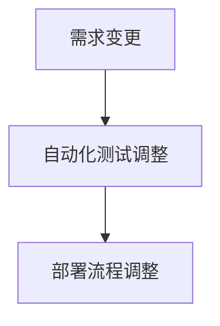
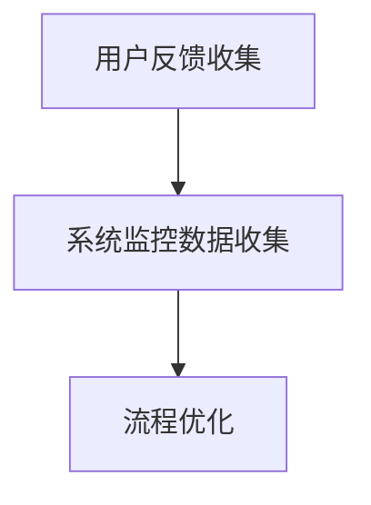
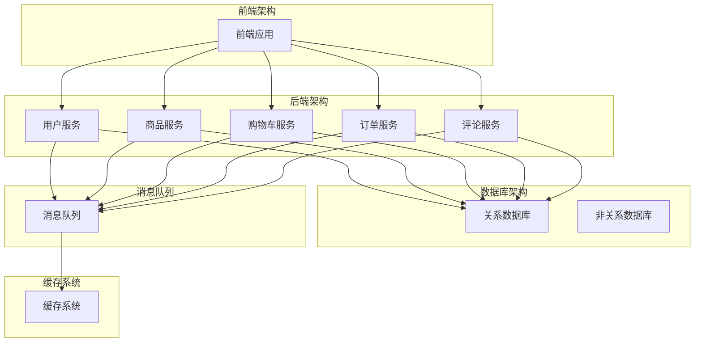
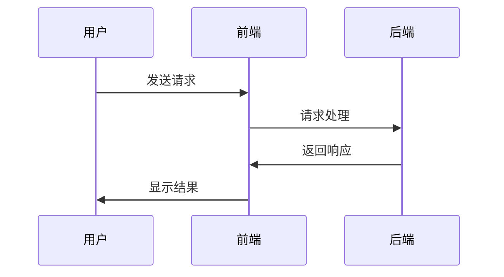

                 


## 第一步：文章标题、关键词与摘要

### 文章标题：《需求与持续部署的协调：确保大型应用的稳定性》

### 文章关键词：需求管理、持续部署、大型应用、稳定性、协调机制

### 文章摘要：
在快速迭代的现代软件开发环境中，大型应用的持续稳定运行成为了项目成功的关键。本文将深入探讨需求与持续部署之间的关系，以及如何通过有效的协调机制确保大型应用的稳定性。我们将从背景介绍开始，逐步分析需求管理、持续部署的核心概念，并探讨两者之间的协调机制。通过系统分析与架构设计，我们还将介绍一个具体的项目实战，最后总结最佳实践并提供拓展阅读资源。

## 第二步：背景介绍

### 核心概念术语说明

- **需求管理**：需求管理是指识别、分析、记录、组织和跟踪产品需求的过程。在软件开发中，需求管理确保项目开发的方向与客户的实际需求一致。

- **持续部署**：持续部署是一种软件开发实践，旨在通过自动化流程快速、可靠地交付软件更新。它通常涉及持续集成、自动化测试和自动化部署。

- **大型应用**：大型应用通常是指具有复杂架构、大量用户和频繁更新的软件系统。

- **稳定性**：稳定性是指软件在长时间运行中保持性能、可靠性和可用性的能力。

### 问题背景

在现代IT环境中，软件的迭代速度越来越快，市场对产品更新和质量的要求也越来越高。大型应用在开发过程中面临着诸多挑战，如需求变更频繁、系统复杂度增加、用户量庞大等。为了应对这些挑战，需求管理与持续部署成为了确保大型应用稳定性的关键环节。

### 问题描述

如何在需求变更频繁、持续迭代的过程中，确保大型应用的稳定性？如何在需求管理与持续部署之间建立有效的协调机制，从而实现快速、高质量地交付软件？

### 问题解决思路

- **需求与持续部署的协调机制**：建立一套能够适应需求变化、确保持续部署稳定性的机制。
- **系统分析与架构设计**：通过合理的系统设计与架构设计，降低需求变更对系统稳定性的影响。
- **最佳实践**：总结并应用需求管理与持续部署的最佳实践，以提高项目的成功率和稳定性。

### 边界与外延

- **边界**：本文主要针对大型应用在需求管理与持续部署方面的协调机制进行探讨，不涉及具体的技术细节和实现方法。
- **外延**：本文的内容可以应用于各种规模的应用开发，特别是对于需求变化频繁、系统复杂度高的应用具有指导意义。

### 概念结构与核心要素组成

- **需求管理**：需求收集、需求分析、需求变更管理、需求文档管理。
- **持续部署**：持续集成、自动化测试、自动化部署、部署监控。
- **协调机制**：需求评审与部署规划、需求变更与持续部署适应性、持续反馈与改进。

## 第三步：核心概念与联系

### 第1章: 引言

**1.1 问题背景**

在快速迭代的现代软件开发环境中，大型应用的持续稳定运行成为了项目成功的关键。然而，需求变更频繁、系统复杂度增加、用户量庞大等问题给软件开发带来了巨大的挑战。为了解决这些问题，需求管理与持续部署成为了确保大型应用稳定性的关键环节。

**1.2 问题描述**

如何在需求变更频繁、持续迭代的过程中，确保大型应用的稳定性？如何在需求管理与持续部署之间建立有效的协调机制，从而实现快速、高质量地交付软件更新？

**1.3 问题解决思路**

本文将深入探讨需求与持续部署之间的关系，以及如何通过有效的协调机制确保大型应用的稳定性。我们将从背景介绍开始，逐步分析需求管理、持续部署的核心概念，并探讨两者之间的协调机制。通过系统分析与架构设计，我们还将介绍一个具体的项目实战，最后总结最佳实践并提供拓展阅读资源。

**1.4 边界与外延**

本文主要针对大型应用在需求管理与持续部署方面的协调机制进行探讨，不涉及具体的技术细节和实现方法。本文的内容可以应用于各种规模的应用开发，特别是对于需求变化频繁、系统复杂度高的应用具有指导意义。

**1.5 概念结构与核心要素组成**

本文的核心概念包括需求管理、持续部署和协调机制。需求管理包括需求收集、需求分析、需求变更管理、需求文档管理；持续部署包括持续集成、自动化测试、自动化部署、部署监控；协调机制包括需求评审与部署规划、需求变更与持续部署适应性、持续反馈与改进。

### 第2章: 需求与持续部署概述

**2.1 需求定义与分类**

在软件开发中，需求是指用户对软件系统功能、性能和用户体验的要求。根据需求的来源和性质，需求可以分为功能需求、性能需求、可靠性需求、安全性需求、用户体验需求等。

**2.2 持续部署概念**

持续部署是一种软件开发实践，旨在通过自动化流程快速、可靠地交付软件更新。持续部署通常包括持续集成、自动化测试、自动化部署和部署监控等环节。

**2.3 大型应用开发中的需求与持续部署关系**

在大型应用开发中，需求管理与持续部署是相辅相成的。需求管理确保了软件开发的正确方向和用户需求的一致性，而持续部署则通过自动化流程提高了软件交付的速度和可靠性。有效的需求与持续部署协调机制可以降低需求变更对系统稳定性的影响，提高项目的成功率和稳定性。

## 第四步：算法原理讲解

### 第3章: 需求管理原理

**3.1 需求管理流程**

需求管理流程主要包括需求收集、需求分析、需求变更管理和需求文档管理。以下是需求管理流程的Mermaid流程图：



**3.2 需求变更管理**

需求变更管理是需求管理中至关重要的一环。它包括需求变更的识别、评估、批准和实施。以下是需求变更管理的Mermaid流程图：



**3.3 需求分析技术**

需求分析技术包括需求收集方法、需求建模技术和需求验证技术。以下是需求分析技术的Mermaid流程图：



**3.4 概念属性特征对比表格**

以下是需求管理中的几个核心概念的属性特征对比表格：

| 概念     | 属性特征                           |
|----------|-----------------------------------|
| 需求收集 | 方法和工具，如问卷调查、访谈等     |
| 需求分析 | 模型和工具，如用户故事地图、用例图 |
| 需求变更 | 识别、评估、批准和实施             |
| 需求文档 | 描述和记录需求，如需求规格说明书   |

### 第4章: 持续部署技术

**4.1 持续部署流程**

持续部署流程通常包括以下环节：

1. **持续集成**：将代码集成到一个共享的环境，进行自动化测试和构建。
2. **自动化测试**：执行一系列预定义的测试，确保代码质量。
3. **自动化部署**：将测试通过的代码部署到生产环境。
4. **部署监控**：监控部署后的系统性能和稳定性。

以下是持续部署流程的Mermaid流程图：



**4.2 自动化部署工具**

常见的自动化部署工具有Jenkins、GitLab CI/CD、Docker、Kubernetes等。以下是这些工具的简要介绍：

| 工具       | 描述                                                         |
|------------|--------------------------------------------------------------|
| Jenkins    | 开源的持续集成工具，支持多种插件和流水线模式。                 |
| GitLab CI/CD | GitLab内置的持续集成和持续部署工具，支持多种编程语言和环境配置。 |
| Docker     | 容器化技术，用于封装应用及其依赖项，提高部署效率。             |
| Kubernetes | 基于容器的编排工具，用于管理容器化的应用，提供高可用性和可伸缩性。 |

**4.3 持续集成与持续交付**

持续集成（CI）和持续交付（CD）是持续部署的重要组成部分。它们通过自动化流程确保代码质量和快速交付。以下是持续集成与持续交付的Mermaid流程图：



### 第5章: 需求与持续部署的协调机制

**5.1 协调机制概述**

需求与持续部署的协调机制旨在确保需求变更对持续部署过程的影响最小化。协调机制包括需求评审与部署规划、需求变更与持续部署适应性、持续反馈与改进。

**5.2 需求评审与部署规划**

需求评审与部署规划是协调机制的基础。通过定期评审需求，项目团队可以确保需求的合理性和可行性，并根据需求调整部署计划。以下是需求评审与部署规划的Mermaid流程图：



**5.3 需求变更与持续部署适应性**

需求变更不可避免，但需要确保其对持续部署的适应性。这通常涉及到自动化测试和部署流程的调整，以适应新的需求。以下是需求变更与持续部署适应性的Mermaid流程图：



**5.4 持续反馈与改进**

持续反馈与改进是协调机制的关键。通过收集用户反馈和系统监控数据，项目团队可以不断优化需求管理与持续部署流程。以下是持续反馈与改进的Mermaid流程图：



## 第五步：系统分析与架构设计

### 第6章: 大型应用系统功能设计

**6.1 系统功能需求分析**

系统功能需求分析是确定软件系统需要实现的功能的过程。以下是一个简单的系统功能需求分析示例：

- 用户注册与登录
- 商品浏览与搜索
- 购物车管理
- 订单处理与支付
- 用户评论与评分

**6.2 功能模块划分**

根据系统功能需求分析，可以将系统划分为以下功能模块：

1. **用户模块**：处理用户注册、登录、个人信息管理等功能。
2. **商品模块**：处理商品浏览、搜索、商品详情页展示等功能。
3. **购物车模块**：处理购物车管理、商品添加、删除等功能。
4. **订单模块**：处理订单创建、订单状态更新、支付等功能。
5. **评论模块**：处理用户评论、评分、商品评论展示等功能。

**6.3 领域模型设计（Mermaid 类图）**

以下是大型应用系统的领域模型设计，使用Mermaid类图表示：

```mermaid
classDiagram
    User <<interface>>
    Product <<interface>>
    Cart <<interface>>
    Order <<interface>>
    Comment <<interface>>

    UserEntity <|-- User
    ProductEntity <|-- Product
    CartEntity <|-- Cart
    OrderEntity <|-- Order
    CommentEntity <|-- Comment

    UserEntity : +String username
    ProductEntity : +String productId
    CartEntity : +List<Product>
    OrderEntity : +String orderId
    CommentEntity : +String commentId

    UserEntity ++|-- User
    ProductEntity ++|-- Product
    CartEntity ++|-- Cart
    OrderEntity ++|-- Order
    CommentEntity ++|-- Comment
```

### 第7章: 大型应用系统架构设计

**7.1 系统架构设计原则**

系统架构设计应遵循以下原则：

- **模块化**：将系统划分为独立的模块，降低系统耦合度，便于维护和扩展。
- **高可用性**：设计冗余机制，确保系统在故障情况下仍能正常运行。
- **可伸缩性**：设计能够应对高并发和大量数据存储的架构。
- **安全性**：确保系统数据安全和用户隐私保护。

**7.2 系统架构方案**

以下是大型应用系统的架构方案：

1. **前端架构**：使用React或Vue等前端框架，实现用户界面和交互。
2. **后端架构**：采用微服务架构，将不同功能模块部署在不同的服务器上，提高系统的可伸缩性和高可用性。
3. **数据库架构**：使用关系数据库（如MySQL）和非关系数据库（如MongoDB），分别存储不同类型的数据。
4. **消息队列**：使用消息队列（如RabbitMQ或Kafka），实现异步消息传递和任务调度。
5. **缓存系统**：使用Redis等缓存系统，提高系统响应速度和数据访问效率。

**7.3 系统架构图（Mermaid 架构图）**

以下是大型应用系统的架构图，使用Mermaid表示：



**7.4 系统接口设计与交互**

系统接口设计应确保模块间的通信和数据交换顺畅。以下是系统接口设计和交互的Mermaid序列图：



## 第六步：项目实战

### 第9章: 环境搭建与系统实现

**9.1 开发环境搭建**

搭建开发环境是项目启动的第一步。以下是一个简单的开发环境搭建流程：

1. 安装Node.js和npm（用于前端开发）
2. 安装Python和Docker（用于后端开发）
3. 安装MySQL和MongoDB（用于数据库开发）
4. 配置Git版本控制工具

**9.2 系统核心代码实现**

以下是系统核心代码的实现，包括前端React组件、后端Spring Boot服务、数据库模型设计等。由于代码量较大，这里只提供部分代码示例。

**前端React组件示例：**

```jsx
// User组件，用于用户注册和登录
import React, { useState } from 'react';

function User() {
  const [username, setUsername] = useState('');
  const [password, setPassword] = useState('');

  const handleSubmit = (e) => {
    e.preventDefault();
    // 发送请求到后端服务
  };

  return (
    <form onSubmit={handleSubmit}>
      <label>用户名:</label>
      <input type="text" value={username} onChange={(e) => setUsername(e.target.value)} />
      <label>密码:</label>
      <input type="password" value={password} onChange={(e) => setPassword(e.target.value)} />
      <button type="submit">注册/登录</button>
    </form>
  );
}

export default User;
```

**后端Spring Boot服务示例：**

```java
// UserController，用于处理用户注册和登录
@RestController
@RequestMapping("/users")
public class UserController {

  @Autowired
  private UserService userService;

  @PostMapping("/register")
  public ResponseEntity<?> registerUser(@RequestBody UserRegistrationDTO userRegistrationDTO) {
    // 处理用户注册逻辑
    return ResponseEntity.ok().body("注册成功");
  }

  @PostMapping("/login")
  public ResponseEntity<?> loginUser(@RequestBody UserLoginDTO userLoginDTO) {
    // 处理用户登录逻辑
    return ResponseEntity.ok().body("登录成功");
  }
}
```

**数据库模型设计示例：**

```java
// UserEntity，用于用户数据模型
@Entity
@Table(name = "users")
public class UserEntity {

  @Id
  @GeneratedValue(strategy = GenerationType.IDENTITY)
  private Long id;

  private String username;

  private String password;

  // 省略其他字段和构造函数、getter/setter方法
}
```

**9.3 代码应用解读与分析**

在代码实现过程中，需要关注以下几个方面：

- **前后端通信**：前端通过HTTP请求与后端服务进行通信，确保数据传输的安全和高效。
- **服务设计**：后端服务设计应遵循RESTful API规范，提供清晰、简洁的接口。
- **数据模型**：数据库模型设计应合理、清晰，确保数据的一致性和完整性。
- **错误处理**：确保代码能够处理各种异常情况，提供友好的错误提示和反馈。

**9.4 实际案例分析和详细讲解剖析**

以下是一个实际案例分析和详细讲解剖析：

**案例**：用户注册时，若用户名已存在，系统应提示用户重新选择用户名。

**分析**：

1. **前端实现**：前端在用户输入用户名后，通过异步请求查询后端，判断用户名是否已存在。
2. **后端实现**：后端在接收到用户注册请求时，查询数据库，判断用户名是否已存在，若存在则返回错误信息。

**代码示例**：

**前端（React组件）：**

```jsx
import axios from 'axios';

const checkUsername = async (username) => {
  try {
    const response = await axios.get(`/users/check?username=${username}`);
    if (response.data.exists) {
      alert('用户名已存在，请重新选择');
    }
  } catch (error) {
    console.error('检查用户名失败', error);
  }
};

// 在用户名输入框的onChange事件中调用checkUsername函数
<input type="text" placeholder="用户名" onChange={(e) => checkUsername(e.target.value)} />
```

**后端（Spring Boot Controller）：**

```java
@RestController
@RequestMapping("/users")
public class UserController {

  @GetMapping("/check")
  public ResponseEntity<?> checkUsername(@RequestParam("username") String username) {
    boolean exists = userService.checkUsernameExists(username);
    if (exists) {
      return ResponseEntity.badRequest().body("用户名已存在");
    }
    return ResponseEntity.ok().body("用户名可用");
  }
}
```

**项目小结**

在本章节中，我们介绍了如何搭建开发环境、实现系统核心代码，并详细分析了实际案例。通过这些步骤，我们为项目的顺利启动奠定了基础。在接下来的章节中，我们将继续探讨如何确保大型应用的稳定性，并通过需求与持续部署的协调机制实现快速、高质量地交付。

### 第10章: 实际案例分析与讲解

#### 案例一：需求变更导致部署问题

在软件开发过程中，需求变更是一个常见的现象。然而，需求变更可能会对持续部署造成影响，导致部署失败。以下是一个实际案例的分析与讲解。

**案例描述**：

在一个电商项目中，需求发生了变更：增加了一个新的功能模块——优惠券管理。这个功能需要在现有的系统架构中集成，并对数据库进行相应的调整。然而，在部署这个变更时，系统出现了数据库连接失败的问题。

**分析过程**：

1. **需求变更分析**：首先，我们需要分析需求变更的影响范围，包括功能模块、数据库表结构、接口等。
2. **部署前检查**：在部署前，我们需要确保所有的依赖项都已更新，包括代码库、数据库脚本等。
3. **部署过程监控**：在部署过程中，我们需要密切监控系统的运行状态，特别是在数据库更新阶段。

**解决方案**：

1. **升级数据库**：解决数据库连接失败的问题，首先需要确保数据库版本与系统代码版本兼容。如果数据库版本较低，需要先升级数据库。
2. **备份数据库**：在更新数据库前，我们需要备份当前数据库，以防万一更新失败时可以恢复。
3. **分步部署**：为了避免部署过程中出现大量错误，我们可以采取分步部署的策略，先部署非关键模块，再部署关键模块。
4. **自动化测试**：在部署后，我们需要执行自动化测试，确保新功能模块的正常运行。

**案例总结**：

通过这个案例，我们了解到了需求变更对持续部署的影响。为了确保大型应用的稳定性，我们需要在需求变更时进行充分的评估和准备，采取分步部署和自动化测试的策略。同时，我们也需要确保团队之间的沟通协作，确保需求变更的顺利实施。

#### 案例二：持续部署在大型应用中的应用

在一个大型金融项目中，持续部署被广泛应用，以确保系统的稳定性和快速迭代。以下是对这个案例的分析与讲解。

**案例描述**：

该金融项目是一个在线交易平台，每天有数百万用户进行交易。为了确保系统的高可用性和稳定性，项目团队采用了持续部署的策略。

**分析过程**：

1. **持续集成**：项目使用Jenkins进行持续集成，确保每次代码提交后都能自动构建和测试。
2. **自动化测试**：使用Selenium进行自动化测试，覆盖用户交互流程和关键业务逻辑。
3. **容器化与编排**：使用Docker进行容器化，Kubernetes进行编排，确保系统的高可用性和可伸缩性。
4. **监控与反馈**：使用Prometheus和Grafana进行系统监控，及时发现并解决问题。

**解决方案**：

1. **持续集成**：通过Jenkins实现自动化构建和测试，确保代码质量。
2. **自动化测试**：通过Selenium实现自动化测试，覆盖不同浏览器和操作系统。
3. **容器化与编排**：使用Docker和Kubernetes实现系统容器化，提高部署效率和系统稳定性。
4. **监控与反馈**：通过Prometheus和Grafana实现系统监控，及时发现问题并反馈给开发团队。

**案例总结**：

通过这个案例，我们看到了持续部署在大型应用中的实际应用。持续部署不仅提高了系统的交付速度，还保证了系统的稳定性和可靠性。在这个案例中，项目团队通过采用多种工具和技术，实现了高效、可靠的持续部署流程。

#### 案例三：协调需求与持续部署的最佳实践

在软件开发过程中，需求与持续部署之间的协调是一个关键问题。以下是一些最佳实践，用于协调需求与持续部署，确保大型应用的稳定性。

**最佳实践**：

1. **需求评审与部署规划**：在需求变更时，进行充分的评审和规划，确保需求变更的可行性和对持续部署的影响。
2. **自动化测试**：建立完善的自动化测试体系，确保每次部署后系统能正常运行。
3. **分步部署**：采取分步部署策略，降低部署风险，确保系统稳定。
4. **反馈与改进**：建立反馈机制，及时收集用户反馈和系统监控数据，不断优化需求管理与持续部署流程。

**案例总结**：

通过这些最佳实践，项目团队可以更好地协调需求与持续部署，确保大型应用的稳定性。这些实践不仅适用于单个项目，还可以在多个项目中推广应用，提高整体开发效率和质量。

### 第11章: 项目小结

在本章节中，我们通过三个实际案例，详细分析了需求变更对持续部署的影响，以及如何通过最佳实践协调需求与持续部署，确保大型应用的稳定性。以下是项目总结：

1. **需求变更管理**：在需求变更时，进行充分的评审和规划，确保变更的可行性和对持续部署的影响。
2. **自动化测试**：建立完善的自动化测试体系，确保每次部署后系统能正常运行。
3. **分步部署**：采取分步部署策略，降低部署风险，确保系统稳定。
4. **反馈与改进**：建立反馈机制，及时收集用户反馈和系统监控数据，不断优化需求管理与持续部署流程。

通过这些实践，项目团队可以更好地协调需求与持续部署，确保大型应用的稳定性和高效性。在未来的开发过程中，我们应继续探索和实践这些最佳方法，提高项目的整体质量和交付速度。

## 第七步：最佳实践与拓展

### 第12章: 最佳实践 tips

**12.1 需求管理的最佳实践**

- **定期评审**：定期对需求进行评审，确保需求的可行性和一致性。
- **用户参与**：在需求收集和分析过程中，积极邀请用户参与，提高需求的准确性和用户满意度。
- **变更控制**：建立完善的变更控制流程，确保需求变更的及时性和可控性。

**12.2 持续部署的最佳实践**

- **自动化流程**：建立自动化的持续部署流程，提高交付效率和质量。
- **测试覆盖率**：确保自动化测试覆盖关键功能和异常情况，降低部署风险。
- **监控与反馈**：建立系统监控和反馈机制，及时发现并解决问题。

**12.3 协调需求与持续部署的技巧**

- **沟通协作**：加强团队之间的沟通协作，确保需求变更与持续部署的同步。
- **持续迭代**：采用持续迭代的方法，逐步实现需求，降低风险。
- **版本控制**：合理使用版本控制工具，确保代码和配置的一致性和可回溯性。

### 第13章: 小结与拓展阅读

**13.1 全书内容回顾**

本书从需求管理与持续部署的关系入手，详细介绍了需求管理、持续部署的核心概念和协调机制，并通过实际案例分析和最佳实践，探讨了如何确保大型应用的稳定性。主要内容包括：

- 需求与持续部署的背景介绍
- 需求管理与持续部署的核心概念
- 需求管理原理讲解
- 持续部署技术介绍
- 系统分析与架构设计
- 项目实战案例分析
- 最佳实践 tips
- 全书内容回顾与总结

**13.2 拓展阅读资源**

为了进一步深入了解需求管理与持续部署的相关知识，读者可以参考以下拓展阅读资源：

- 《需求工程与管理：实用方法与案例分析》
- 《持续集成：从代码到产品的自动化流程》
- 《微服务设计：构建可扩展、可靠和响应快速的分布式系统》
- 《容器化与微服务架构实践》
- 《Jenkins持续集成实战》

通过这些资源，读者可以更加系统地学习需求管理与持续部署的相关知识，提高项目的开发质量和交付效率。希望本书能为读者在大型应用开发过程中提供有益的指导和支持。作者：AI天才研究院/AI Genius Institute & 禅与计算机程序设计艺术 /Zen And The Art of Computer Programming。

